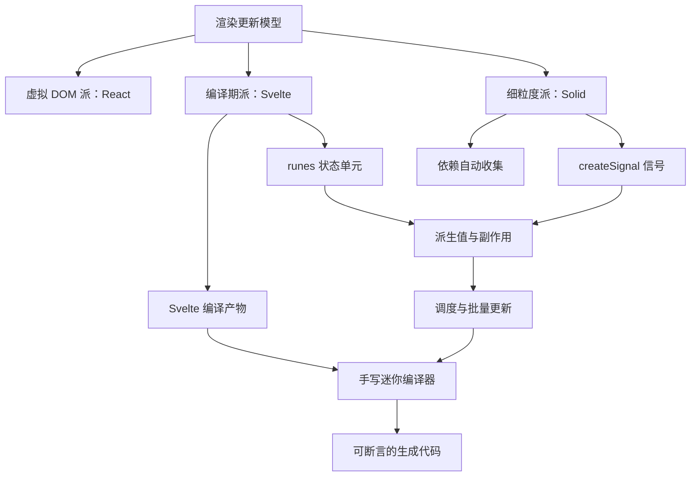
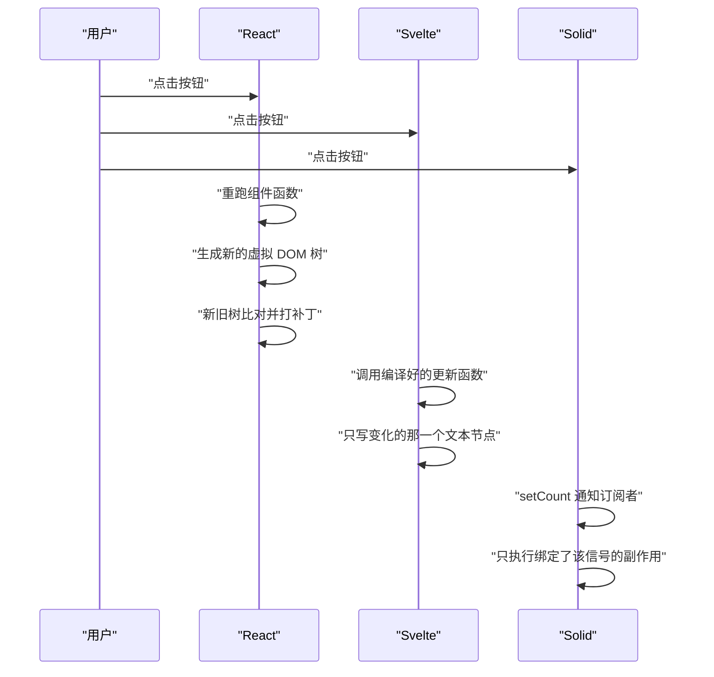
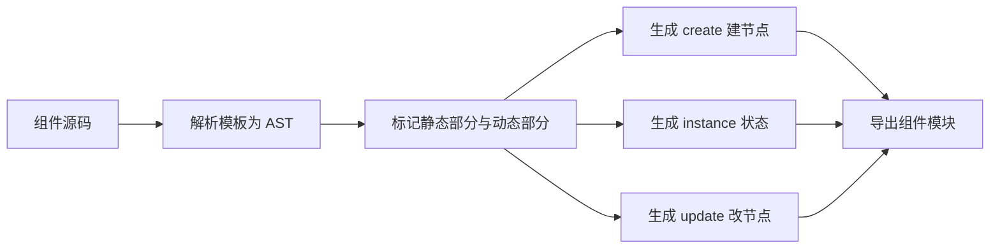
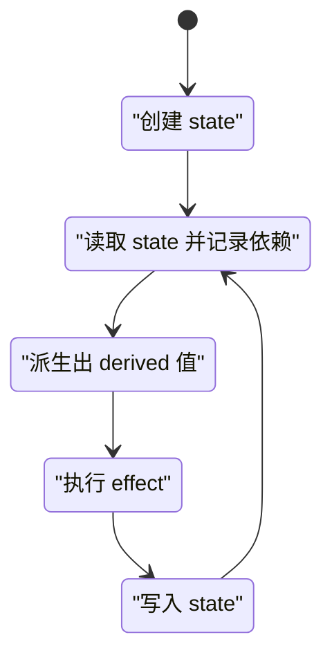
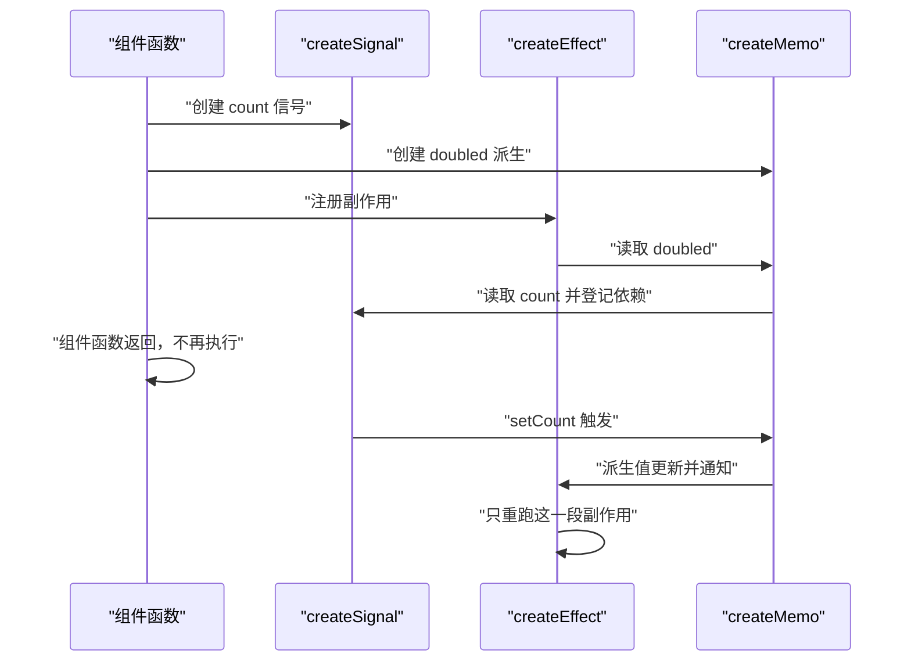
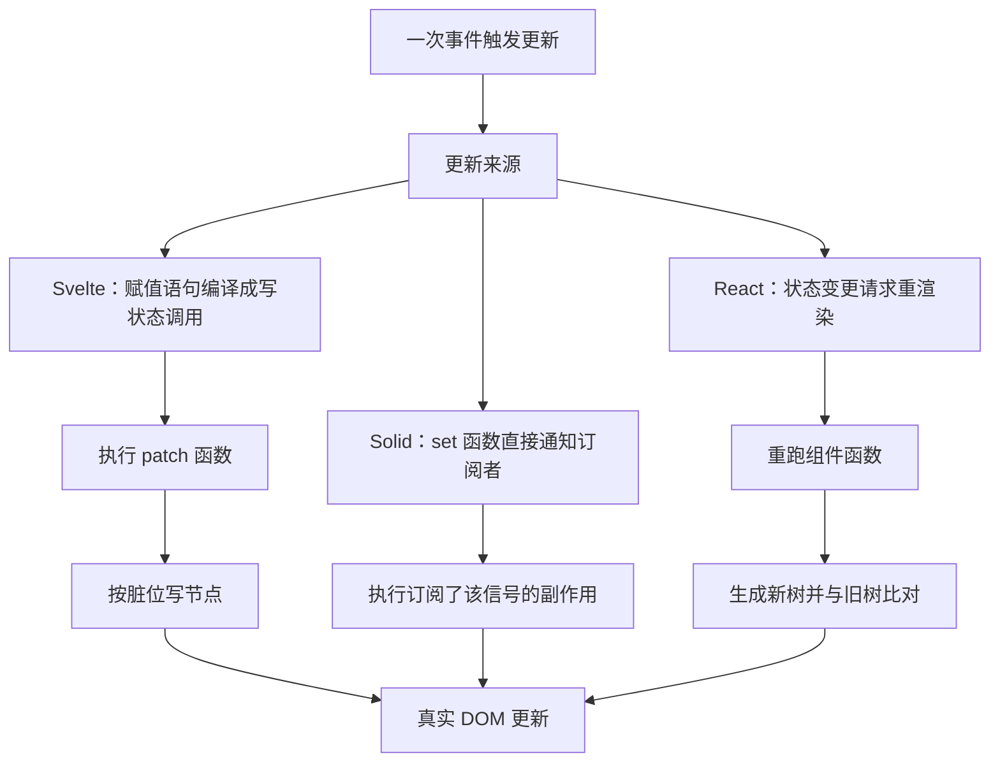
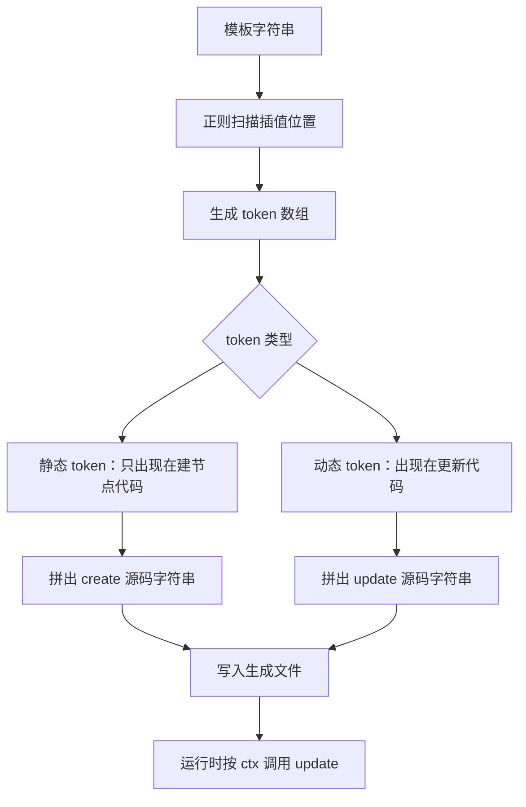
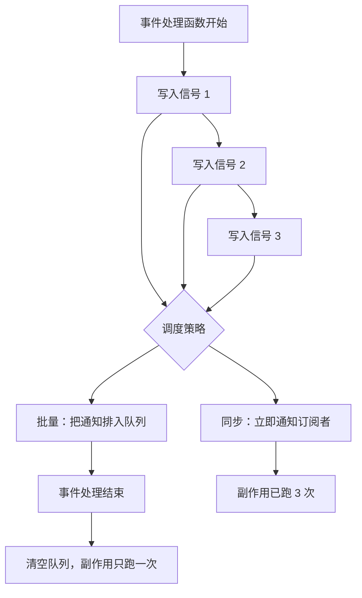

# Svelte 与 Solid：编译期与细粒度响应式

!!! abstract "学完这一页你能"
    - 说出 Svelte 编译产物里的创建函数与更新函数各自负责什么，并能读出手写编译器的输出字符串。
    - 用 `$state`、`$derived`、`$effect` 三个 rune 描述一条从状态到界面的响应式链路。
    - 手写 `createSignal`、`createMemo`、`createEffect`，让依赖在执行时被自动收集。
    - 用函数调用次数这个可测指标，对比 React、Svelte、Solid 在一次点击后的更新范围。

## 0. 知识地图



建议的读法：先读第 1 节建立"更新范围"这个统一标尺，后面每节都用它衡量。再读第 2、3 节看 Svelte 的两条路线，第 4 节看 Solid 的运行时做法。第 5 节把三者放在同一张表里对照。第 6 节把前几节的机制压缩成一段能运行的编译器，第 7 节补上调度这一层。

!!! note "术语：虚拟 DOM"
    虚拟 DOM 是用普通 JavaScript 对象描述界面结构的一棵树，框架先对比新旧两棵树，再把差异写到真实 DOM。例子：`{ type: "button", text: "3" }` 就是一个虚拟节点。

!!! note "术语：编译期"
    编译期指构建工具把源码转成可运行代码的那段时间，运行时指代码在浏览器里执行的那段时间。例子：Svelte 在编译期就把"哪个文本节点会被哪个变量影响"算出来。

## 1. 一次点击之后，框架到底重跑了什么

**先想一个问题**

页面上有一个数字和一个按钮，点击按钮后数字加一。三个框架分别会执行哪些函数，各执行几次？搞清楚这个次数，后面所有差异都能解释。

**心智模型**

!!! tip "心智模型"
    一句话模型：更新成本取决于"重新执行的范围"，与"数据改了几次"无关。
    日常类比：改一张表格里的一个格子。React 把整张表重新抄一遍，再逐格比对；Svelte 在编译期就写好了第 3 行第 2 列的地址，运行时直接改那格；Solid 让每个格子自己记住谁改它。
    类比不成立的地方：真实框架里范围不是"整表"和"单格"二选一。React 可以用 `memo` 剪枝，Svelte 也会重跑包含该变量的整条表达式，Solid 的一个派生值可能牵动多个格子。

**图解**



1. 三个框架都先收到同一个点击事件，这是共同起点。
2. React 的路径是"重跑组件函数"，所以组件函数体里的每一行都会再执行一遍。
3. React 生成新树后要做树间比对，比对本身不接触 DOM，但会遍历节点。
4. Svelte 的路径没有"重跑组件函数"这一步，只有编译期生成的更新函数被调用。
5. Svelte 的更新函数内部持有真实文本节点的引用，直接赋值即可。
6. Solid 的路径是信号通知订阅者，订阅者是注册时记录下来的一段副作用代码。
7. Solid 的组件函数在第一次渲染后就结束了，之后不再参与更新。

**一步一步来**

第 1 步：先造一个"调用记录器"，它是后面所有对比的测量工具。

```js
// 用一个数组记录每次函数调用，后续所有对比都基于它
const calls = [];
function record(name) {
  calls.push(name); // 唯一写入点，保证记录顺序等于真实执行顺序
}
```

**这段代码在做什么**

- `calls` 是待断言的证据数组，后面用 `assert` 检查长度。
- `record` 是唯一写入点，避免多处散写导致顺序混乱。
- 不引入任何框架，避免把框架内部调用混进计数。
- 计数对象是"函数被调用的次数"，这个数字可以直接测。

第 2 步：用最小代码模拟 React 模型，组件函数整体重跑。

```js
function reactCounter(state) {
  record("react:render"); // 每次更新都会进入组件函数
  const vdom = { type: "button", text: String(state.count) }; // 生成新的虚拟节点
  return vdom; // 返回新树，交给比对阶段
}
```

**这段代码在做什么**

- 参数 `state` 由外部持有，模拟 `useState` 的值存放在框架侧。
- 每次调用都新建一个对象，模拟新虚拟树。
- `String(state.count)` 说明文本是重新计算出来的。
- `record` 放在函数体第一行，确保重跑一次就记一次。

运行结果（3 次更新后）：

```
react:render 出现 3 次
```

第 3 步：模拟 Solid 模型，组件函数只跑一次，之后由信号推动。

```js
function solidCounter() {
  record("solid:component"); // 组件函数只在初始化时进入一次
  let value = 0;
  const subs = new Set(); // 订阅该信号的副作用集合
  const get = () => value;
  const set = (n) => {
    value = n;
    subs.forEach((f) => f()); // 逐个通知订阅者，不重建组件
  };
  const effect = (fn) => {
    subs.add(fn); // 先登记再执行，顺序与 Solid 一致
    fn();
  };
  return { get, set, effect };
}
```

**这段代码在做什么**

- `subs` 用 `Set` 存放副作用函数，同一个函数重复注册不会重复执行。
- `get` 在这里只是读值，真实框架里读值这一步会顺带记录依赖。
- `set` 先改值再通知，保证副作用读到的是新值。
- `effect` 先登记自己再立即执行一次，这个"立即执行"是后续所有断言的依据。
- 组件函数体里没有 `record` 之外的重复工作，所以它只记一次。

**动手验证**

```js
// 依赖：无。运行环境：Node 20+。
// 运行方式：node compare-models.mjs
import assert from "node:assert/strict";

const calls = [];
const record = (name) => { calls.push(name); };

function reactCounter(state) {
  record("react:render");
  return { type: "button", text: String(state.count) };
}

function svelteCounter() {
  let count = 0;
  const textNode = { value: "0" };
  function setCount(next) {
    count = next;
    textNode.value = String(count);
  }
  return { textNode, setCount };
}

function solidCounter() {
  record("solid:component");
  let value = 0;
  const subs = new Set();
  const get = () => value;
  const set = (n) => { value = n; subs.forEach((f) => f()); };
  const effect = (fn) => { subs.add(fn); fn(); };
  return { get, set, effect };
}

const state = { count: 0 };
for (let i = 1; i <= 3; i += 1) { state.count = i; reactCounter(state); }
assert.equal(calls.filter((c) => c === "react:render").length, 3);

const s = svelteCounter();
for (let i = 1; i <= 3; i += 1) s.setCount(i);
assert.equal(s.textNode.value, "3");

calls.length = 0;
const solid = solidCounter();
let rendered = "";
solid.effect(() => { rendered = `count=${solid.get()}`; });
for (let i = 1; i <= 3; i += 1) solid.set(i);
assert.equal(calls.filter((c) => c === "solid:component").length, 1);
assert.equal(rendered, "count=3");

console.log("react 渲染次数:", 3);
console.log("svelte 文本节点:", s.textNode.value);
console.log("solid 组件次数:", 1, "最终渲染:", rendered);
console.log("全部断言通过");
```

预期输出：

```
react 渲染次数: 3
svelte 文本节点: 3
solid 组件次数: 1 最终渲染: count=3
全部断言通过
```

**常见坑**

| 现象 | 原因 | 怎么修 |
| --- | --- | --- |
| 以为 Solid 不用虚拟 DOM 就没有比对成本 | 首次渲染仍要创建真实节点 | 把测量点放在"更新阶段"，别把首屏算进去 |
| React 计数只在开发模式对不上 | 严格模式会重复调用组件函数 | 用生产构建或统计 DOM 写入次数 |
| 断言用 `==` 时 `"3"` 与 `3` 都通过 | 宽松相等会做类型转换 | 统一用 `assert.equal` 前先 `String()` |
| `Set` 里放了内联箭头函数导致重复 | 每次调用都生成新函数对象 | 副作用函数提到外面命名后注册 |

**小结**

- 更新的成本可以用"函数调用次数"这个数字测出来。
- React 重跑组件函数，Svelte 调用更新函数，Solid 执行副作用。
- 先建立测量工具，后面的机制才有可验证的落脚点。

## 2. Svelte 编译产物里有什么

**先想一个问题**

你写了一个 `.svelte` 文件，里面只有一行标签和一个变量。浏览器最终拿到的是什么 JavaScript？为什么它不需要虚拟 DOM？

**心智模型**

!!! tip "心智模型"
    一句话模型：编译器把模板拆成两个函数，一个负责第一次建节点，一个负责以后改节点。
    日常类比：装修前先量好所有尺寸，把柜子做成预制件；Svelte 把"哪里会被改"在编译期就算好，运行时按图纸施工。
    类比不成立的地方：预制件是死的，Svelte 的更新函数仍要在运行时读写变量。遇到复杂表达式，它照样得调用一个函数去算。

**图解**



1. 源码先被解析成 AST，也就是一棵描述模板结构的对象树。
2. 编译器在 AST 上标记哪些节点从头到尾不变，哪些节点绑定了变量。
3. 静态节点只出现在建节点函数里，不会进入更新函数。
4. `create` 函数负责用 `document.createElement` 一类调用把结构搭出来。
5. `instance` 保存组件状态与事件处理函数。
6. `update` 函数按位掩码决定这一轮要改哪几个节点。

!!! note "术语：脏位"
    脏位是一个整数，用二进制的每一位表示"某个变量这轮是否变了"。例子：位掩码为 1 时只更新槽位 0 对应的文本。

**一步一步来**

第 1 步：写出会被编译器处理的输入，注意它有多小。

```js
// 输入：一个 Svelte 模板片段
const source = "<p>count is {count}</p>";
```

**这段代码在做什么**

- 模板里只有一个静态前缀和一个动态插值。
- 编译器要能区分 `"count is "` 和 `count` 两种东西。
- 这个片段是后面所有生成逻辑的输入。

第 2 步：手工写出对应编译产物的骨架，看清两段式结构。

```js
// Svelte 4 编译产物的结构示意，非逐字输出
function create_fragment(ctx) {
  let p, t0, t1;
  return {
    c() { // create：只跑一次，建立真实节点
      p = document.createElement("p");
      t0 = document.createTextNode("count is ");
      t1 = document.createTextNode(ctx[0]);
      p.append(t0, t1);
    },
    p(ctx, dirty) { // update：dirty 用位掩码标出哪个槽位变了
      if (dirty & 1) t1.nodeValue = ctx[0];
    },
  };
}
```

**这段代码在做什么**

- `c` 是 create 的缩写，内部只做一次建节点，不会再跑。
- `t0` 是静态文本节点，任何更新都不会碰它。
- `t1` 是动态文本节点，它是更新函数唯一的目标。
- `p` 是 patch 的缩写，只更新脏位为真的槽位。
- `ctx[0]` 表示第一个状态变量，编译期已经把变量编号映射好了。

运行结果（示意）：

```
c() 之后：t1.nodeValue = "0"
p(ctx, 1) 之后：t1.nodeValue = "1"
p(ctx, 0) 之后：t1.nodeValue 保持 "1"
```

!!! note "关于版本差异"
    上面是 Svelte 4 的产物形状，核心是 `$$invalidate` 加位掩码。Svelte 5 改用运行时的状态单元，编译产物中写状态的方法名需核对官方文档：具体要核对 Svelte 5 编译输出里用于设置信号值的函数名与调用形式。

**动手验证**

```js
// 依赖：无。运行环境：Node 20+。
// 运行方式：node mini-fragment.mjs
import assert from "node:assert/strict";

function compileToCreate(tokens) {
  const lines = ["function c() {"];
  tokens.forEach((tok, i) => {
    if (tok.kind === "static") lines.push(`  t${i} = text(${JSON.stringify(tok.value)});`);
    else lines.push(`  t${i} = text(ctx[${tok.slot}]);`);
  });
  lines.push("}");
  return lines.join("\n");
}

function compileToUpdate(tokens) {
  const lines = ["function p(ctx, dirty) {"];
  tokens.forEach((tok, i) => {
    if (tok.kind === "dynamic") {
      lines.push(`  if (dirty & ${1 << tok.slot}) t${i} = ctx[${tok.slot}];`);
    }
  });
  lines.push("}");
  return lines.join("\n");
}

const tokens = [
  { kind: "static", value: "count is " },
  { kind: "dynamic", slot: 0 },
];

const createSrc = compileToCreate(tokens);
const updateSrc = compileToUpdate(tokens);
assert.ok(createSrc.includes('text("count is ")'));
assert.ok(updateSrc.includes("dirty & 1"));

// 用真实的更新逻辑验证脏位行为
const node = { value: "0" };
function patch(ctx, dirty) {
  if (dirty & 1) node.value = String(ctx[0]);
}
patch([1], 1);
assert.equal(node.value, "1");
patch([2], 0);
assert.equal(node.value, "1");

console.log(createSrc);
console.log(updateSrc);
console.log("脏位为 0 时节点未变:", node.value);
```

预期输出：

```
function c() {
  t0 = text("count is ");
  t1 = text(ctx[0]);
}
function p(ctx, dirty) {
  if (dirty & 1) t1 = ctx[0];
}
脏位为 0 时节点未变: 1
```

**常见坑**

| 现象 | 原因 | 怎么修 |
| --- | --- | --- |
| 以为产物里完全没有任何比对 | 更新函数里仍有 `if` 判断 | 把 `if (dirty & 1)` 算作一次整数运算，不是树比对 |
| 把静态文本也塞进更新函数 | 生成时没区分静态和动态 | 给 token 打上 `kind` 字段后再生成 |
| 槽位号在多个变量间复用 | 编译期编号没去重 | 建立变量名到槽位的映射表再分配 |
| 直接照搬旧版 `$$invalidate` 到新版 | 大版本间编译产物形状变了 | 以项目实际依赖的版本产物为准，需核对官方文档 |

**小结**

- 编译产物的核心是 create 与 update 两段分离。
- 静态节点不进更新函数，这是省下比对成本的来源。
- 位掩码把"哪些变量变了"编码成一个整数。

## 3. runes：Svelte 5 的响应式单元

**先想一个问题**

旧版 Svelte 里 `let count = 0` 自动是响应式的，可在普通 `.svelte.js` 模块里它就不是。为什么会需要一个专门的写法？

**心智模型**

!!! tip "心智模型"
    一句话模型：rune 是"带编译指令的函数调用"，它让编译器认得出哪一行是状态、哪一行是派生、哪一行是副作用。
    日常类比：普通变量是一张便利贴，谁改它没人知道；rune 变量是一个登记过的储物柜，取用和修改都会留下记录。
    类比不成立的地方：储物柜的记录是给人看的日志，rune 的记录会被运行时当成依赖图使用，直接决定谁在什么时候重跑。

!!! note "术语：rune"
    rune 是 Svelte 5 里以 `$` 开头的特殊符号，只能在组件或 `.svelte.js` 模块里使用，由编译器识别并改写。例子：`$state(0)`、`$derived(...)`、`$effect(...)`。

**图解**



1. 起点是创建一个状态单元，它此时还没有任何订阅者。
2. 某个副作用开始执行，执行过程中读到这个状态。
3. 这次读取被记录下来，状态与副作用之间建立了一条边。
4. 派生值也读取状态，它同样被登记进依赖图。
5. 派生值算完后被副作用读取，于是副作用间接依赖了底层状态。
6. 有人写入状态，运行时沿依赖边向下查找需要重跑的节点。
7. 只有登记过的节点重跑，没读过的节点不受影响。

**一步一步来**

第 1 步：用普通 JavaScript 模拟 `$state` 的读与写，先不管对象代理。

```js
function makeState(initial) {
  let value = initial;
  const subs = new Set(); // 读过这个状态的副作用
  return {
    get() { return value; }, // 真实框架在这里做依赖收集
    set(next) {
      if (Object.is(next, value)) return; // 值没变就不通知
      value = next;
      [...subs].forEach((f) => f()); // 通知所有订阅者
    },
    subscribe(fn) { subs.add(fn); }, // 供 effect 登记
  };
}
```

**这段代码在做什么**

- `subs` 是当前状态的订阅者集合，对应真实框架里的依赖集合。
- `Object.is` 让 `NaN` 与 `NaN` 也判等，避免无意义重跑。
- `[...subs]` 先复制再遍历，防止执行过程中集合被改动。
- `subscribe` 是给 effect 用的接口，真实框架里这一步由读取动作隐式完成。
- 状态本身不保存派生值，派生值由下一步单独处理。

第 2 步：加上 `$derived` 的缓存语义与 `$effect` 的立即执行。

```js
function makeDerived(compute, observed) {
  let cached;
  let dirty = true; // 首次一定需要计算
  return {
    get() {
      observed.forEach((s) => s.subscribe(() => { dirty = true; })); // 上游变了就标脏
      if (dirty) { cached = compute(); dirty = false; } // 惰性求值加缓存
      return cached;
    },
  };
}

function makeEffect(fn, states) {
  const run = () => fn();
  states.forEach((s) => s.subscribe(run)); // 登记订阅
  run(); // 与 Svelte 一致，注册后立即执行一次
  return run;
}
```

**这段代码在做什么**

- `dirty` 标记不是"立刻算"，而是"下次读的时候才算"。
- 惰性求值意味着没人读派生值时，它不会消耗计算。
- `cached` 保存上一轮结果，连续读两次只算一次。
- `makeEffect` 注册后立刻执行一次，保证界面初始状态正确。
- 副作用不返回值，它的作用体现在外部变量或 DOM 上。

运行结果（示意）：

```
首次 effect 读到 derived = 2
set(5) 之后 effect 读到 derived = 10
```

**动手验证**

```js
// 依赖：无。运行环境：Node 20+。
// 运行方式：node runes-model.mjs
import assert from "node:assert/strict";

function makeState(initial) {
  let value = initial;
  const subs = new Set();
  return {
    get() { return value; },
    set(next) {
      if (Object.is(next, value)) return;
      value = next;
      [...subs].forEach((f) => f());
    },
    subscribe(fn) { subs.add(fn); },
  };
}

let computeCount = 0;
function makeDerived(compute, upstream) {
  let cached;
  let dirty = true;
  upstream.forEach((s) => s.subscribe(() => { dirty = true; }));
  return {
    get() {
      computeCount += 1;
      if (dirty) { cached = compute(); dirty = false; }
      return cached;
    },
  };
}

const count = makeState(1);
const doubled = makeDerived(() => count.get() * 2, [count]);

let seen = [];
const effectRun = () => { seen.push(doubled.get()); };
count.subscribe(effectRun);
effectRun();

assert.deepEqual(seen, [2]);
assert.equal(computeCount, 1);

count.set(5);
assert.deepEqual(seen, [2, 10]);

// 再读两次派生值，computeCount 不应增加
doubled.get();
doubled.get();
assert.equal(computeCount, 2);

// 写入相同值不应触发副作用
count.set(5);
assert.deepEqual(seen, [2, 10]);

console.log("effect 观察序列:", seen.join(", "));
console.log("派生计算次数:", computeCount);
console.log("全部断言通过");
```

预期输出：

```
effect 观察序列: 2, 10
派生计算次数: 2
全部断言通过
```

**常见坑**

| 现象 | 原因 | 怎么修 |
| --- | --- | --- |
| 在普通 `.js` 文件里写 `$state` 报错 | rune 只在组件或 `.svelte.js` 里被编译 | 把文件名改为 `.svelte.js` 或搬进组件 |
| 派生值里改了别的状态导致循环 | 派生只应读，不应写 | 把写操作放进事件处理或 effect |
| `$effect` 里读的变量没被追踪 | 读取发生在异步回调里 | 先同步读取再传给异步逻辑 |
| 更新后界面慢一拍 | 未核对当前版本的 effect 刷新时机 | 需核对官方文档：`$effect` 与 `$effect.pre` 的执行时机差异 |
| 对象状态改了属性但没更新 | `$state` 对对象返回代理，需按官方方式改 | 需核对官方文档：`$state.raw` 与深层代理的适用范围 |

**小结**

- rune 把"哪一行是状态"这件事交给编译器识别。
- `$derived` 的语义是惰性求值加缓存，不是每次写都立刻重算。
- `$effect` 注册后立即执行一次，之后由依赖变化触发。

## 4. Solid 的信号与编译

**先想一个问题**

Solid 的组件函数只执行一次，可界面还是能更新。那被更新的那些 DOM 节点，是谁在负责重跑？

**心智模型**

!!! tip "心智模型"
    一句话模型：组件函数的作用是"把数据线插好"，执行一次就结束；之后数据沿线路流动，灯自己亮。
    日常类比：React 的组件像每次重拍一张照片再和旧照片比对；Solid 的组件像第一次就把每条线接到对应的灯泡上，之后只往线上送电。
    类比不成立的地方：线路连接不是静态的。Solid 的派生值会随上游变化重新计算，新的依赖边会被加入，旧的会被移除，接线图本身在变化。

!!! note "术语：信号"
    信号是一个可读可写的值容器，读取它的函数会把自己登记为订阅者。例子：`const [count, setCount] = createSignal(0)` 里的 `count` 就是读函数。

**图解**



1. 组件函数在初始化阶段只被调用一次，它内部创建信号与派生。
2. 创建 `doubled` 时并不立刻计算，它先记录自己的计算函数。
3. 注册副作用时，副作用立即执行一次，执行中读到 `doubled`。
4. 读 `doubled` 会触发对 `count` 的读取，这一读把 `count` 记为上游。
5. 组件函数返回后，控制权交给事件系统，它不再被调用。
6. 用户点击调用 `setCount`，信号通知直接订阅它的派生值。
7. 派生值重算后通知订阅它的副作用，只有这一段代码重新执行。

**一步一步来**

第 1 步：实现 `createSignal`，读的时候要能知道"谁在读"。

```js
let currentObserver = null; // 记录当前正在执行的副作用，供读函数使用

function createSignal(initial) {
  let value = initial;
  const subs = new Set(); // 依赖这个信号的观察者
  const read = () => {
    if (currentObserver) subs.add(currentObserver); // 边读边登记
    return value;
  };
  const write = (next) => {
    if (Object.is(next, value)) return;
    value = next;
    [...subs].forEach((fn) => fn()); // 同步通知
  };
  return [read, write];
}
```

**这段代码在做什么**

- `currentObserver` 是一个模块级变量，它让读函数知道当前该登记谁。
- 读函数里同时完成两件事：返回值、建立依赖边。
- 写函数先判等再通知，避免无效重跑。
- 通知是同步的，这点和 Solid 默认行为一致。
- 返回数组而不是对象，方便用数组解构命名。

第 2 步：实现 `createMemo` 与 `createEffect`，让依赖收集自动发生。

```js
function createEffect(fn) {
  const run = () => {
    const prev = currentObserver;
    currentObserver = run; // 把自己设为当前观察者
    try { fn(); } finally { currentObserver = prev; } // 恢复现场
  };
  run();
  return run;
}

function createMemo(compute) {
  let cached;
  let dirty = true; // 首次需要计算
  const [read] = createSignal(undefined);
  const run = () => { dirty = true; read(undefined); }; // 通知下游重算
  const memoRead = () => {
    if (dirty) {
      const prev = currentObserver;
      currentObserver = run;
      try { cached = compute(); } finally { currentObserver = prev; }
      dirty = false;
    }
    return read(), cached;
  };
  return memoRead;
}
```

**这段代码在做什么**

- `createEffect` 用 `try/finally` 保证异常时也恢复 `currentObserver`。
- 嵌套执行时，内层结束后会把外层观察者还原，避免依赖串到错误的函数上。
- `createMemo` 用 `dirty` 做缓存，没人读就不算。
- `run` 内部调用 `read(undefined)` 是为了通知订阅这个 memo 的下游。
- `memoRead` 最后 `read()` 一次，把下游观察者登记到 memo 上。

运行结果（示意）：

```
effect 首次执行，doubled = 2
component 执行次数 = 1
setCount(5) 后 doubled = 10
```

**动手验证**

```js
// 依赖：无。运行环境：Node 20+。
// 运行方式：node solid-model.mjs
import assert from "node:assert/strict";

let currentObserver = null;

function createSignal(initial) {
  let value = initial;
  const subs = new Set();
  const read = () => {
    if (currentObserver) subs.add(currentObserver);
    return value;
  };
  const write = (next) => {
    if (Object.is(next, value)) return;
    value = next;
    [...subs].forEach((fn) => fn());
  };
  return [read, write];
}

function createEffect(fn) {
  const run = () => {
    const prev = currentObserver;
    currentObserver = run;
    try { fn(); } finally { currentObserver = prev; }
  };
  run();
  return run;
}

function createMemo(compute) {
  let cached;
  let dirty = true;
  const [notify, setNotify] = createSignal(undefined);
  const markDirty = () => { dirty = true; setNotify(undefined); };
  return () => {
    if (dirty) {
      const prev = currentObserver;
      currentObserver = markDirty;
      try { cached = compute(); } finally { currentObserver = prev; }
      dirty = false;
    }
    notify();
    return cached;
  };
}

let componentRuns = 0;
let seen = [];

function component() {
  componentRuns += 1;
  const [count, setCount] = createSignal(1);
  const doubled = createMemo(() => count() * 2);
  createEffect(() => { seen.push(doubled()); });
  return setCount;
}

const setCount = component();
assert.equal(componentRuns, 1);
assert.deepEqual(seen, [2]);

setCount(5);
assert.equal(componentRuns, 1);
assert.deepEqual(seen, [2, 10]);

console.log("component 执行次数:", componentRuns);
console.log("effect 观察序列:", seen.join(", "));
console.log("全部断言通过");
```

预期输出：

```
component 执行次数: 1
effect 观察序列: 2, 10
全部断言通过
```

**常见坑**

| 现象 | 原因 | 怎么修 |
| --- | --- | --- |
| 组件函数里的 `console.log` 只打印一次 | 组件函数只在初始化执行 | 想观察更新就把日志放进 effect |
| 条件分支里读的信号没触发更新 | 该轮执行根本没读到它 | 把读取放在分支外，或用官方提供的取消追踪接口 |
| 在 effect 里写信号导致死循环 | 写操作引发新的依赖变化 | 用 `batch` 合并写入，需核对官方文档：`batch` 的适用场景 |
| 内存里残留旧订阅 | effect 需要销毁时没清 | 用 `onCleanup` 风格的回调，需核对官方文档：清理函数的注册位置 |
| 以为 `createMemo` 是懒执行所以永不计算 | 有下游读取时它会立即计算 | 把"没人读就不算"限制在无订阅者的情况 |

**小结**

- 信号把"谁依赖我"的登记放在读取动作里，不需要声明依赖数组。
- `createMemo` 提供缓存，`createEffect` 提供订阅入口。
- 组件函数只跑一次，更新落在订阅信号的那些副作用上。

## 5. 与 React 的更新模型对比

**先想一个问题**

同样一个列表，点一项改变选中态。React 里如果没写 `memo`，10 个子组件会重跑几次？Solid 里会重跑几次？

**心智模型**

!!! tip "心智模型"
    一句话模型：React 的依赖靠人声明，Svelte 和 Solid 的依赖由读取动作自动得出。
    日常类比：React 像手填一张"这行结果受哪些输入影响"的表格；Svelte 和 Solid 像自动记账，看一眼就记一笔。
    类比不成立的地方：自动记账只在同步执行中可靠。异步读取、循环里创建的订阅都可能让记录不全，需要开发者了解边界。

!!! note "术语：依赖收集"
    依赖收集指运行时记录"这次计算读了哪些值"，以便这些值变化时重新执行这段计算。例子：effect 里读了 count 与 name，它就被登记为这两个信号的订阅者。

!!! note "术语：批量更新"
    批量更新指把同一轮里的多次写入合并成一次界面刷新。例子：一次事件里连改 3 个信号，effect 只执行 1 次。

**图解**



1. 三者都从同一个事件开始，事件处理里产生一次或多次写入。
2. React 的写入是"请求重渲染"，它把更新排进队列，等待一次统一调度。
3. Svelte 的赋值被编译成写状态调用，调用本身还带一个脏位。
4. Solid 的 `set` 直接遍历订阅集合，调用发生在当前这个同步栈里。
5. React 之后要重跑组件函数，得到新树。
6. 新树与旧树做比对，比对结果决定哪些真实节点被改。
7. Svelte 不需要新树，它执行 patch 并按脏位写节点。
8. Solid 不需要 patch 遍历，副作用本身就只指向要改的那个节点。
9. 三条路径最后都落到同一件事：把新值写进真实 DOM。

**一步一步来**

第 1 步：把"一次点击里连续改 3 次"这个场景写成可计数的代码。

```js
let renderCount = 0;

function reactComponent(state) {
  renderCount += 1; // 每次重渲染加一
  return state.map((item) => ({ id: item.id, selected: item.selected }));
}
```

**这段代码在做什么**

- `renderCount` 是唯一测量点，避免统计多个来源。
- 返回新数组，模拟 React 里生成新的元素描述。
- 数组内每个元素都被重新构造，说明子结构也重跑了。
- 这个计数会在下一步与 Solid 版本对照。

运行结果（示意）：

```
React 在 3 次更新后 renderCount = 3
```

第 2 步：写一个按信号粒度更新的版本。

```js
function createItemSignal(initialSelected) {
  let selected = initialSelected;
  const subs = new Set();
  return {
    get: () => selected,
    set: (next) => {
      if (next === selected) return;
      selected = next;
      subs.forEach((f) => f()); // 只通知订阅这一项的副作用
    },
    bind: (fn) => { subs.add(fn); fn(); },
  };
}
```

**这段代码在做什么**

- 每一项有独立的 `subs`，所以改第 3 项不会通知第 4 项。
- `bind` 注册后立刻执行一次，让初始 DOM 状态正确。
- `get` 不参与依赖收集，因为这里用显式 `bind` 代替自动收集。
- 与 React 版本对照：列表本身没有被重建。
- 这个版本改 3 项会通知 3 次，但每次只影响一个订阅者。

**动手验证**

```js
// 依赖：无。运行环境：Node 20+。
// 运行方式：node react-vs-signal.mjs
import assert from "node:assert/strict";

function reactList(items, onRender) {
  onRender();
  return items.map((it) => ({ id: it.id, selected: it.selected }));
}

function createStore(items) {
  let listRender = 0;
  const signals = items.map((it) => {
    let selected = it.selected;
    const subs = new Set();
    return {
      get: () => selected,
      set(next) {
        if (next === selected) return;
        selected = next;
        subs.forEach((f) => f());
      },
      bind(fn) { subs.add(fn); fn(); },
    };
  });
  return {
    signals,
    bump() { listRender += 1; },
    renders: () => listRender,
  };
}

let reactRenders = 0;
const base = [{ id: 1, selected: false }, { id: 2, selected: false }, { id: 3, selected: false }];
for (let i = 1; i <= 3; i += 1) {
  reactList(base.map((it, idx) => ({ ...it, selected: idx < i })), () => { reactRenders += 1; });
}
assert.equal(reactRenders, 3);

const store = createStore(base);
const dom = [null, null, null];
store.signals.forEach((sig, i) => {
  sig.bind(() => { dom[i] = sig.get() ? "selected" : "idle"; });
});
store.bump();
assert.equal(store.renders(), 1);
assert.deepEqual(dom, ["idle", "idle", "idle"]);

store.signals[1].set(true);
assert.deepEqual(dom, ["idle", "selected", "idle"]);
assert.equal(store.renders(), 1);

console.log("react 渲染次数:", reactRenders);
console.log("solid 式列表重渲染次数:", store.renders());
console.log("各项目状态:", dom.join(", "));
console.log("全部断言通过");
```

预期输出：

```
react 渲染次数: 3
solid 式列表重渲染次数: 1
各项目状态: idle, selected, idle
全部断言通过
```

**常见坑**

| 现象 | 原因 | 怎么修 |
| --- | --- | --- |
| 用自动收集版本的代码却传了依赖数组 | 混淆了两套模型 | 写运行时版本就别再传数组，写 React 就显式列依赖 |
| 认为信号一定比状态更新省 | 小树上差异看不出来 | 用 1000 行列表做实验再下结论 |
| 在循环里创建订阅却没清理 | 每次渲染都新增订阅 | 把订阅生命周期绑定到组件卸载 |
| 把 `useMemo` 当缓存保证 | React 不承诺缓存永远有效 | 把正确性放在渲染逻辑里，缓存只当优化 |
| 比较时用了不同规模的测试数据 | 数据量不同结论无意义 | 固定同一份输入数据与同一台机器 |

**小结**

- React 依赖声明由人写，Svelte 与 Solid 依赖由读取动作得出。
- 更新范围决定成本：重跑组件函数、执行 patch、执行单个副作用是三档。
- 自动化依赖带来自动化边界，异步与清理是要单独处理的场景。

## 6. 手写迷你 Svelte 式编译器（概念版）

**先想一个问题**

模板里有静态文字和插值，编译器怎么才能知道运行时要更新哪几个文本节点？能不能只用几十行实现出来？

**心智模型**

!!! tip "心智模型"
    一句话模型：先给模板做一次"切分"，把不可变的和可变的分别记下来，再按切分结果生成代码。
    日常类比：把一个句子拆成固定印刷部分和可以填空的横线部分，印刷部分印一次就好，横线部分准备好填空的引用。
    类比不成立的地方：真实模板还有属性、事件、循环、条件分支，切分规则远不止一种。这里只处理插值，用来理解生成流程。

!!! note "术语：词法切分"
    词法切分是把一串文本按规则切成有类型的小块。例子：`"a{count}b"` 切成静态块 `"a"`、动态块 `count`、静态块 `"b"`。

**图解**



1. 输入是一段模板字符串，例如包含一个变量插值的段落。
2. 用一个正则扫描全部 `{变量名}` 的位置，记录起止下标。
3. 相邻两次匹配之间的文本是静态块，匹配到的名字是动态块。
4. 每个 token 带一个下标，这个下标直接决定它在代码里的变量名。
5. 静态 token 的文本会被写进建节点代码，作为 `text(...)` 的参数。
6. 动态 token 生成类似 `frag.t1.nodeValue = String(ctx.count)` 的语句。
7. 两段源码字符串拼好后交给运行时，运行时只调用 update。
8. update 的入参是 `ctx` 和保存节点引用的 `frag`。

**一步一步来**

第 1 步：实现词法切分，把模板拆成带类型的 token 数组。

```js
function tokenize(tpl) {
  const tokens = [];
  const re = /\{([a-zA-Z_$][\w$]*)\}/g; // 只识别 {变量名} 这一种插值
  let last = 0;
  let m;
  while ((m = re.exec(tpl)) !== null) {
    if (m.index > last) tokens.push({ kind: "static", value: tpl.slice(last, m.index) });
    tokens.push({ kind: "dynamic", value: m[1] }); // 记录变量名
    last = m.index + m[0].length;
  }
  if (last < tpl.length) tokens.push({ kind: "static", value: tpl.slice(last) });
  return tokens;
}
```

**这段代码在做什么**

- 正则里的捕获组只允许合法标识符，复杂表达式不在支持范围。
- `last` 记录上一次匹配的结束位置，用来截取中间静态文本。
- 匹配到的内容压成 `dynamic` token，变量名存在 `value` 里。
- 循环结束后补上尾巴，否则模板最后一段静态文本会丢失。
- 每个 token 在数组里的下标就是它在生成代码里的编号。

运行结果（示意）：

```
t0 static  "<p>count: "
t1 dynamic "count"
t2 static  " and "
t3 dynamic "label"
t4 static  "</p>"
```

第 2 步：按 token 数组生成 update 源码字符串。

```js
function generateUpdateBody(tokens, frag) {
  const lines = [];
  tokens.forEach((tok, i) => {
    if (tok.kind !== "dynamic") return; // 静态片段不需要更新
    lines.push(`${frag}.t${i}.nodeValue = String(ctx.${tok.value});`); // 直接赋值
    });
  return lines.join("\n");
}
```

**这段代码在做什么**

- 只有 `dynamic` token 才会产生一行更新语句。
- 变量名 `frag.t${i}` 与 token 下标一一对应，避免编号错位。
- `String(...)` 保证数字也能写进 `nodeValue`。
- 生成的是字符串，所以可以直接交给 `new Function` 执行。
- 静态 token 完全不出现在这段代码里，这就是"省掉比对"的来源。

运行结果（示意）：

```
frag.t1.nodeValue = String(ctx.count);
frag.t3.nodeValue = String(ctx.label);
```

**动手验证**

```js
// 依赖：无。运行环境：Node 20+。
// 运行方式：node mini-compiler.mjs
import assert from "node:assert/strict";

function tokenize(tpl) {
  const tokens = [];
  const re = /\{([a-zA-Z_$][\w$]*)\}/g;
  let last = 0;
  let m;
  while ((m = re.exec(tpl)) !== null) {
    if (m.index > last) tokens.push({ kind: "static", value: tpl.slice(last, m.index) });
    tokens.push({ kind: "dynamic", value: m[1] });
    last = m.index + m[0].length;
  }
  if (last < tpl.length) tokens.push({ kind: "static", value: tpl.slice(last) });
  return tokens;
}

function generateCreateBody(tokens, frag) {
  const lines = tokens.map((tok, i) => {
    if (tok.kind === "static") return `${frag}.t${i} = { nodeValue: ${JSON.stringify(tok.value)} };`;
    return `${frag}.t${i} = { nodeValue: "" };`;
  });
  return lines.join("\n");
}

function generateUpdateBody(tokens, frag) {
  const lines = [];
  tokens.forEach((tok, i) => {
    if (tok.kind === "dynamic") lines.push(`${frag}.t${i}.nodeValue = String(ctx.${tok.value});`);
  });
  return lines.join("\n");
}

const tpl = "<p>count: {count} and {label}</p>";
const tokens = tokenize(tpl);
assert.equal(tokens.length, 5);
assert.equal(tokens[1].kind, "dynamic");
assert.equal(tokens[1].value, "count");

const createSrc = generateCreateBody(tokens, "frag");
const updateSrc = generateUpdateBody(tokens, "frag");
assert.ok(createSrc.includes('"<p>count: "'));
assert.ok(updateSrc.includes("frag.t1.nodeValue = String(ctx.count);"));

const frag = {};
new Function("frag", createSrc)(frag);
const update = new Function("ctx", "frag", updateSrc);
update({ count: 7, label: "ok" }, frag);

assert.equal(frag.t0.nodeValue, "<p>count: ");
assert.equal(frag.t1.nodeValue, "7");
assert.equal(frag.t3.nodeValue, "ok");
assert.equal(frag.t4.nodeValue, "</p>");

update({ count: 8, label: "ok" }, frag);
assert.equal(frag.t1.nodeValue, "8");
assert.equal(frag.t3.nodeValue, "ok");

console.log("静态节点数:", tokens.filter((t) => t.kind === "static").length);
console.log("动态节点数:", tokens.filter((t) => t.kind === "dynamic").length);
console.log("第二轮 t1 =", frag.t1.nodeValue, "t3 =", frag.t3.nodeValue);
console.log("全部断言通过");
```

预期输出：

```
静态节点数: 3
动态节点数: 2
第二轮 t1 = 8 t3 = ok
全部断言通过
```

**常见坑**

| 现象 | 原因 | 怎么修 |
| --- | --- | --- |
| 模板尾部文字丢失 | 循环结束后没补最后一段 | 加一次 `if (last < tpl.length)` 的收尾 |
| 更新语句写到错误的节点 | token 下标与节点编号不一致 | 让静态与动态 token 共用同一套下标 |
| 正则把 `{{x}}` 也当成插值 | 规则没排除连续花括号 | 生成前先校验模板，或换用解析器 |
| `nodeValue` 收到数字变 `undefined` | DOM 只接受字符串 | 生成代码里统一加 `String()` |
| 以为这就是完整编译器 | 缺属性、事件、循环 | 把这些能力列进后续迭代计划 |

**小结**

- 编译器先切分、再按类型生成两段代码。
- 静态部分只出现在建节点代码里，动态部分才进更新代码。
- 用 `new Function` 可以验证生成源码的正确性，不需要浏览器。

## 7. 调度：批量更新与执行顺序

**先想一个问题**

在一个事件处理函数里连续改三个信号，副作用会跑几次？如果它跑了三次，界面上会不会闪三次？

**心智模型**

!!! tip "心智模型"
    一句话模型：调度决定"变化发生后，重跑的动作是立刻做还是排队做"。
    日常类比：改数据是点单，执行副作用是出餐。批量更新把同时点的几道菜合并成一次叫号。
    类比不成立的地方：Solid 默认同步执行，没有队列，所以"合并"要靠显式调用 `batch`。Svelte 的 effect 刷新时机由运行时决定，需核对官方文档。

**图解**



1. 事件处理函数开始执行，此时还没写任何东西。
2. 第一次写入触发调度决策：立刻通知，还是先排队。
3. 同步策略下，订阅者当场执行，副作用第一次运行。
4. 第二、三次写入重复同样的判断，同步策略再各跑一次。
5. 批量策略下，三次通知被压进同一个待执行集合。
6. 集合用 `Set` 存放，同一次事件里重复加入不会产生重复执行。
7. 事件处理函数结束时清空队列，副作用总共只跑一次。
8. 两种策略的最终状态一样，差别体现在中间过程的次数上。

**一步一步来**

第 1 步：实现一个同步通知版本，先测量执行次数。

```js
function createSyncSignal(initial) {
  let value = initial;
  const subs = new Set();
  return {
    get: () => value,
    set(next) {
      value = next;
      [...subs].forEach((fn) => fn()); // 同步逐个执行
    },
    subscribe: (fn) => subs.add(fn),
  };
}
```

**这段代码在做什么**

- `set` 里没有任何排队逻辑，通知立刻发生。
- 三次连着 `set` 就会执行三次副作用。
- `subscribe` 是显式接口，便于控制注册时机。
- 这个版本作为对照基线。

运行结果（示意）：

```
同步策略副作用次数 = 3
```

第 2 步：加一个微任务级别的批量队列。

```js
const queue = new Set(); // 待执行的副作用集合
let scheduled = false; // 是否已排入微任务

function schedule(fn) {
  queue.add(fn); // 集合天然去重
  if (scheduled) return; // 已经有任务在排队就不重复排
  scheduled = true;
  queueMicrotask(() => {
    scheduled = false;
    const jobs = [...queue];
    queue.clear();
    jobs.forEach((job) => job()); // 清空后统一执行
  });
}
```

**这段代码在做什么**

- `queue` 用 `Set` 去重，同一个副作用一轮只排一次。
- `scheduled` 保证微任务只注册一次，避免重复排队。
- 执行前先清空队列，防止副作用里再次写入导致无限追加。
- `queueMicrotask` 在当前同步代码跑完后执行，时机可预测。
- 这个策略把 3 次通知合并为 1 次执行。

**动手验证**

```js
// 依赖：无。运行环境：Node 20+。
// 运行方式：node scheduling.mjs
import assert from "node:assert/strict";

function createSyncSignal(initial) {
  let value = initial;
  const subs = new Set();
  return {
    get: () => value,
    set(next) { value = next; [...subs].forEach((f) => f()); },
    subscribe: (fn) => subs.add(fn),
  };
}

const queue = new Set();
let scheduled = false;
function schedule(fn) {
  queue.add(fn);
  if (scheduled) return;
  scheduled = true;
  queueMicrotask(() => {
    scheduled = false;
    const jobs = [...queue];
    queue.clear();
    jobs.forEach((job) => job());
  });
}

function createBatchedSignal(initial) {
  let value = initial;
  const subs = new Set();
  return {
    get: () => value,
    set(next) { value = next; [...subs].forEach((f) => schedule(f)); },
    subscribe: (fn) => subs.add(fn),
  };
}

let syncRuns = 0;
const s1 = createSyncSignal(0);
s1.subscribe(() => { syncRuns += 1; });
s1.set(1); s1.set(2); s1.set(3);
assert.equal(syncRuns, 3);

let batchRuns = 0;
const s2 = createBatchedSignal(0);
s2.subscribe(() => { batchRuns += 1; });
s2.set(1); s2.set(2); s2.set(3);
assert.equal(batchRuns, 0);

await Promise.resolve();
assert.equal(batchRuns, 1);
assert.equal(s2.get(), 3);

console.log("同步策略副作用次数:", syncRuns);
console.log("批量策略副作用次数:", batchRuns);
console.log("最终值:", s2.get());
console.log("全部断言通过");
```

预期输出：

```
同步策略副作用次数: 3
批量策略副作用次数: 1
最终值: 3
全部断言通过
```

**常见坑**

| 现象 | 原因 | 怎么修 |
| --- | --- | --- |
| 断言在微任务执行前就跑 | 批量执行被推迟到下一个微任务 | 先 `await Promise.resolve()` 再断言 |
| 队列里的任务重复执行 | 用数组存任务导致重复入队 | 改用 `Set` 或执行前清空 |
| 副作用里再写信号导致死循环 | 队列被不断追加 | 每轮先取出全部任务再清空 |
| 以为批量一定改变最终结果 | 批量只改变次数，不改变末值 | 断言时同时检查次数与最终值 |
| 组件卸载后副作用仍执行 | 队列里残留旧任务 | 卸载时清理队列或加失效标记 |

**小结**

- 调度决定副作用是立即执行还是排队执行。
- 批量更新用集合去重，把一轮内的多次通知压成一次。
- 测量时同时记录执行次数和最终值，缺一个都无法判断行为。

## 综合对比

| 维度 | React | Svelte | Solid |
| --- | --- | --- | --- |
| 依赖来源 | 开发者写的依赖数组 | 编译器分析变量使用 | 运行时读取时自动登记 |
| 更新触发 | 状态变更请求重渲染 | 赋值被编译成写状态调用 | `set` 直接通知订阅者 |
| 重跑范围 | 组件函数整体 | 编译生成的 patch 函数 | 订阅该信号的副作用 |
| 首次渲染 | 组件函数生成树再建节点 | 建节点函数直接创建 | 组件函数内建节点 |
| 中间结构 | 保留新旧两棵虚拟树 | 编译期产物无虚拟树 | 无虚拟树，只有依赖图 |
| 变化标记 | 树间比对得出 | 整数脏位掩码 | 依赖边直接定位 |
| 默认调度 | 事件内批量，队列刷新 | 运行时决定，需核对官方文档 | 同步执行，`batch` 显式合并 |
| 状态声明 | `useState` 等钩子 | `$state` 等 rune | `createSignal` |
| 派生缓存 | `useMemo`，不保证长期有效 | `$derived`，惰性加缓存 | `createMemo`，惰性加缓存 |
| 清理机制 | `useEffect` 返回清理函数 | `$effect` 配套清理写法，需核对官方文档 | `onCleanup` 风格回调，需核对官方文档 |
| 组件函数执行次数 | 每次更新执行 | 初始化时执行 | 初始化时执行 |
| 编译期职责 | JSX 转换为函数调用 | 分析模板并生成两段代码 | JSX 转换后仍需运行时图 |

## 应用与行业实践

### 应用场景地图

| 场景 | 用到本页哪个知识点 | 典型技术选型 | 注意事项 |
| --- | --- | --- | --- |
| 后台管理的万行表格，滚动并带筛选 | Solid 的 `createSignal`/`createMemo` 与依赖收集范围 | SolidJS + TanStack Virtual | 筛选排序写成 memo，行组件按引用复用 |
| 低端安卓的首屏加载，弱网下求可交互 | 编译产物的创建函数与更新函数 | Svelte 5 + SvelteKit SSR | 首屏只跑创建函数，真机上量长任务数量 |
| 多人协作白板，光标与笔迹实时同步 | `$state.raw`、`$effect` 同步到非 Svelte 系统 | Svelte 5 + Canvas + WebSocket | 高频坐标整体替换，绘制放进 `requestAnimationFrame` |
| 实时日志面板，每秒追加数千行 | 批量更新与执行顺序 | SolidJS 的 `createSignal` 加数组替换 | 一次替换合并成一次通知，列表设上限截断 |
| 电商筛选列表，多条件联动 | `$derived` 链路与自动依赖收集 | Svelte 5 runes | 条件之间不互相写入，保持单向派生 |
| 表单长列表，几十个字段联动校验 | memo 缓存派生结果 | SolidJS 的 `createMemo` | 校验结果用 memo，错误提示用条件渲染 |
| 数据看板定时刷新，多个图表 | 更新函数只改动的文本节点 | Svelte 5 + 图表库 | 图表实例交给 `$effect` 管理，避免重复初始化 |
| 已有 React 项目评估是否迁移 | 更新范围对比、函数调用次数指标 | React + Profiler | 先量基线，再决定是否换框架 |

### 三个场景拆解

#### 场景 1：后台管理的万行表格

**业务背景**：表格一次展示上万行，输入框每敲一个字符就触发筛选与排序，滚动时可感知停顿。团队用「函数调用次数」代替主观感受做验收，回放同一份数据即可复现。

**怎么用本页知识解决**：把原始数据与筛选词各放一个信号，派生结果用 memo，行组件只读自己的字段。

```jsx
import { createSignal, createMemo, For } from "solid-js";

const [rows] = createSignal(loadRows());         // 万行数据只加载一次
const [keyword, setKeyword] = createSignal("");  // 输入框只改这一个信号

const visible = createMemo(() =>                 // 派生量：keyword 变才重新过滤
  rows().filter((r) => r.name.includes(keyword()))
);

const Row = (props) => <tr><td>{props.row.name}</td></tr>; // 依赖收到单元格

export const Table = () => (
  <div>
    <input onInput={(e) => setKeyword(e.currentTarget.value)} /> {/* 写入信号 */}
    <For each={visible()}>{(row) => <Row row={row} />}</For>     {/* 按引用增删 */}
  </div>
);
```

- `keyword` 变化只让 `visible` 重算，行组件不随筛选整体重建，`For` 按行引用做增删。
- 行组件读的是 `props.row.name`，依赖落在单元格上；只改一行的名称时，只有那一行重跑。
- `rows` 是普通对象数组，改字段要替换整个行对象，就地赋值不会触发更新。
- 写入发生在事件回调里，Solid 默认在微任务边界批量处理，不必手写批处理。
- 要把数据写进图表或 IndexedDB 时用 `createEffect` 加 `onCleanup`，别在渲染函数里做。

**怎么度量收益**：指标是「一次输入后行组件的函数调用次数」和「长任务总时长」。方法是在 `Row` 里 `console.count("row")` 或自增全局计数器；用 Chrome DevTools Performance 面板录制，看 Long Task；用 `solid-devtools` 的组件更新高亮确认只有目标行闪动（需核对官方文档：当前版本是否提供更新计数）。

**什么时候不该用**：

- 表格只渲染几十行且不滚动：整表重算的开销低于拆分依赖与维护 memo 的成本。
- 行高需要读取渲染后的 DOM 尺寸时：memo 会把首次量到的值缓存下来，后续尺寸变化读不到。

#### 场景 2：低端安卓的首屏加载

**业务背景**：目标机型是安卓中端机，首屏要在弱网下尽快可交互，接口数据量不变。团队把「首屏 JS 执行时长」和「长任务数量」写成验收项，用固定机型加 CPU 节流复现。

**怎么用本页知识解决**：让编译期决定更新范围，状态收敛在组件内，`$effect` 只做与外部系统的同步。

```svelte
<script>
  let count = $state(0);              // 编译为商店式的状态单元，读写在原地完成
  let doubled = $derived(count * 2);  // 派生子表达式，只在 count 变化时重算

  $effect(() => {                     // 挂载后执行，依赖是下面读到的 count
    sendMetric("count", count);
  });
</script>

<button onclick={() => count++}>
  点了 {count} 次，翻倍是 {doubled}  <!-- 只生成改这两个文本节点的更新函数 -->
</button>
```

- 创建函数负责建 DOM、插文本、绑事件，挂载时执行一次，之后不再重跑。
- 更新函数由编译期按「哪个表达式读了哪个状态」切分，`count++` 只触发改文本节点的那一段。
- 用 `svelte/compiler` 导出的 `compile`，以 `generate: "client"` 编译后打印 `js.code`，对照产物里的 `$.template_effect` 这类调用确认更新范围。
- `$derived` 惰性求值，模板没读 `doubled` 就不计算。
- `$effect` 里不要回写 `$state`，否则形成循环；需要清理的外部订阅要返回清理函数。

**怎么度量收益**：指标是首屏 JS 传输体积（gzip）、主线程长任务总时长、Lighthouse 的 TBT。方法是用 DevTools Performance 以 CPU 4 倍节流加慢速网络录制，并用 `PerformanceObserver` 订阅 `long-animation-frame`。

**什么时候不该用**：

- 首屏瓶颈在后端接口或首图：改响应式模型对可交互时间影响很小，先做 SSR 与接口缓存。
- 瓶颈是拖拽排序引起的整页重排：细粒度更新不改变布局开销，要看 CSS 与布局结构。

#### 场景 3：多人协作白板

**业务背景**：一块画布同时接收远端光标与本地画笔事件，每秒可能有上百次坐标写入。它要保证绘制不掉帧，同时输入不被打断。

**怎么用本页知识解决**：高频结构用 `$state.raw` 避开深层代理，绘制统一放到下一帧，`$effect` 只负责把最新状态交给绘制函数。

```svelte
<script>
  let strokes = $state.raw([]);          // 整体替换，跳过深层代理
  let cursor = $state.raw({ x: 0, y: 0 });

  socket.onmessage = (e) => {            // 远端画笔事件
    strokes = [...strokes, e.data];      // 一次替换只通知一次
  };
  canvas.onmousemove = (e) => {
    cursor = { x: e.x, y: e.y };         // 高频写入，字段少
  };

  $effect(() => {
    const s = strokes, c = cursor;       // 在 effect 内读取，建立依赖
    requestAnimationFrame(() => draw(s, c)); // 绘制推迟到下一帧
  });
</script>
```

- `$state.raw` 的读取仍被追踪，写入必须整体替换，省掉代理层的读写开销。
- 远端消息到达时先合并成一次数组替换，避免逐条触发更新。
- `$effect` 里不调用读信号的函数，依赖范围就停在 `strokes` 与 `cursor` 两处。
- 一帧内多次写入会排多个 `requestAnimationFrame` 回调，用一个 `pending` 标记合并成一次绘制。
- 采样点用 PointerEvent 的 `getCoalescedEvents` 取回合并事件（需核对官方文档：目标机型是否都实现该接口）。

**怎么度量收益**：指标是每秒绘制次数、帧间隔 p95、长动画帧时长。方法是在 `requestAnimationFrame` 回调里记时间戳算间隔，用 `PerformanceObserver` 订阅 `long-animation-frame`，用 `performance.mark/measure` 包住 `draw`。回放同一份录制的笔迹数据对照两种状态写法。

**什么时候不该用**：

- 白板同时只有一个绘制者且元素不到百个：整块重绘的开销低于拆分依赖带来的复杂度。
- 每帧要读回 DOM 尺寸做碰撞检测：把尺寸放进响应式状态会读到未更新的布局，须先量后用。

### 行业先进实践

**派生优先，信号只存源头（出处：SolidJS 官方文档 Fine-Grained Reactivity 与 createMemo）**
做法是把能算出来的值写成 `createMemo`，源头数据才放 `createSignal`，读取点决定更新范围。
它把「谁依赖谁」交给运行时收集，不靠人肉维护依赖数组。
借鉴方式：把项目里「状态 A 变就 setState(B)」的写法改成派生量。

**减少 effect，改在渲染期或事件里计算（出处：React 官方文档 You Might Not Need an Effect）**
该文档指出能从 props 与 state 算出的值不必放进 effect，事件触发的副作用写在事件处理函数。
effect 留给与外部系统同步的场景。
借鉴方式：列一份 `useEffect` 清单，逐条判断能否删掉或合并。

**把记忆化交给编译器（出处：React Compiler 官方文档）**
编译器自动插入记忆化，手写 `useMemo`、`useCallback` 不再是必需项。
判断「哪里会重跑」的位置从人转到编译期，评审时看的是组件结构。
借鉴方式：先在 CI 跑编译器，再用 React DevTools Profiler 对比重渲染次数。

**高频数据不进深层响应式（出处：Svelte 官方文档 $state 与 $state.raw 说明）**
`$state.raw` 要求整体替换，读取依然可追踪，适合点集、日志缓冲区这类高频结构。
写入合并成一次替换，代理层的读写成本被省掉。
借鉴方式：把画布点集、缓冲区数组改成 raw，写入处统一走「构造新数组」。

**用标准指标卡回归，而不是靠体感（出处：Chrome DevTools 官方文档 Performance 面板与 long-animation-frame）**
把 Long Task、Long Animation Frame 与 TBT 设成门槛，录制时固定机型、CPU 节流与网络配置。
配置固定后，两次录制的对比才有意义。
借鉴方式：在流水线加一段性能脚本，超过阈值就挡住合并。

### 从学到用：落地路线

第 1 步，选一个更新频繁、边界清楚的页面做试点，例如筛选列表或日志面板，先记录基线。验收标准：能给出改动前的函数调用次数与长任务数量各一份，并写明录制配置。

第 2 步，把派生值改成 `$derived` 或 `createMemo`，把 effect 收敛到只与外部系统同步，用同一份数据回放。验收标准：同一操作回放两次，函数调用次数下降，页面行为与基线一致。

第 3 步，把试点写法整理成项目检查清单（派生优先、effect 收敛、高频结构用 raw），在相邻模块推广。验收标准：评审记录里能查到清单被引用，新增代码不再出现「A 变就写 B」的 effect。

第 4 步，把指标写进流水线与发布前检查，锁定机型与限速。验收标准：性能脚本在超标时挡住合并，连续两个迭代的数值不超过基线。

### 动手作业

**目标**：搭一个「点一次，谁重跑了」的对比实验台。用同一份数据分别写 React、Svelte 5、Solid 三个列表，测量并打印每次点击后的函数调用次数。

**步骤**：

1. 三个实现用同一组数据：10 个条目，每项有 `name` 与 `count`。
2. 在每个条目组件里加计数器，用 `console.count` 或全局自增变量记录被调用次数。
3. React 版用 `useState` 加 `map` 渲染；Svelte 版用 `$state` 数组与 `{#each}`；Solid 版用 `createSignal` 加 `For`。
4. 加一个「只改第 3 项」的按钮，分别记录三种实现里各条目函数的调用次数。
5. 用 `svelte/compiler` 的 `compile` 打印 Svelte 组件的客户端产物，标出创建函数与更新函数的位置。
6. 把结果整理成表格：实现、条目函数调用次数、长任务数量，并写清录制配置。
7. 写结论：在多少条数据规模下，React 的整体重渲染仍然可以接受。

**验收标准**：

- 三个实现在同样操作下输出可复现的调用次数，重复跑三次结果一致。
- 能指认编译产物里的创建函数与更新函数，并说出 `count++` 触发的是哪一段。
- 能指出 Solid 版里哪一行建立了依赖、哪一行没有建立依赖，并说明原因。
- 表格里有 `long-animation-frame` 或 Long Task 的记录，并写明机型、CPU 节流与网络配置。
- 结论给出切换实现的门槛条件与测量方法，不停留在「看情况」。

## 深入阅读与参考

!!! tip "怎么用这些资料"
    先读「官方文档与规范」建立准确的概念，再读「源码与示例」核对细节，最后用「教程、书籍与视频」换一种讲法加深理解。每条都写明了读哪一节、带着什么问题读。

### 官方文档与规范

| 资源 | 为什么读 | 怎么读 |
|---|---|---|
| [Svelte 文档](https://svelte.dev/docs) | 编译型框架的第一手文档，runes 是理解 Svelte 5 响应式单元的必读入口。 | 重点读 runes 与「$state/$derived/$effect」章节，读时追问编译后生成了什么，再回看编译产物。 |
| [Svelte 博客](https://svelte.dev/blog) | 官方博客讲清了 Svelte 把工作放到编译期的动机与取舍。 | 挑编译器与 runes 相关发布文，带着「为什么不需要虚拟 DOM」读，读完写三条与运行时框架的差异。 |
| [React Compiler 介绍](https://react.dev/learn/react-compiler/introduction) | 官方编译器方案，可对照 Svelte 在编译期做的响应式改写。 | 在 Vite 项目启用编译器，用 Profiler 对比开启前后重渲染次数，记录哪些更新被自动省掉。 |
| [React Working Group 与 RFC](https://github.com/reactjs/rfcs) | RFC 的 Motivation 一节最能说明 React 为何走向编译期优化。 | 挑 Compiler 与 Server Components 两份 RFC，只读 Motivation，写一段与 Svelte 编译期的异同摘要。 |
| [useState](https://react.dev/reference/react/useState) | useState 文档含批量更新与快照语义，是更新模型对比的基准。 | 读 Caveats 与 Troubleshooting，重点看一次事件内多次 setState 的行为，再与 Solid 信号写入对照。 |

### 源码与示例

| 资源 | 为什么读 | 怎么读 |
|---|---|---|
| [Solid](https://github.com/solidjs/solid) | Solid 官方源码与说明，能亲眼看到信号与无虚拟 DOM 的实现。 | 读 README 与 packages/solid 目录，追问细粒度依赖如何被追踪，再跑示例打断点看更新路径。 |

### 教程、书籍与视频

| 资源 | 为什么读 | 怎么读 |
|---|---|---|
| [Solid 交互式教程](https://www.solidjs.com/tutorial/introduction_basics) | 交互式教程把信号、派生与副作用讲成可动手的运行单元。 | 做完 Reactivity 全部小节，每节后对比 React 的 state 写法，记下「谁被重新执行」的差异。 |
| [Svelte 交互式教程](https://svelte.dev/tutorial/svelte/welcome-to-svelte) | 边写边看编译结果，是把编译期概念落到实处的捷径。 | 按顺序做完基础部分，每节都在 REPL 里看编译输出，标记响应式语句被改写成什么。 |
| [Leptos Book](https://book.leptos.dev/) | 另一个细粒度响应式框架，可验证你对信号模型的抽象是否到位。 | 做细粒度计数器示例，对比 Solid 的 API 命名与依赖追踪方式，总结共同的三条不变量。 |
| [Overreacted：React as a UI Runtime](https://overreacted.io/react-as-a-ui-runtime/) | 把 React 讲成运行时，正好用来反衬编译期框架的设计选择。 | 分段读，每读完一节用一句话复述 React 运行时做了什么，最后列一张与 Svelte 的职责对照表。 |
| [Build Your Own React](https://pomb.us/build-your-own-react/) | 手写简化版 React 含调度与协调，是写迷你编译器前的热身。 | 跟到 Fiber 与 reconcile 一章，画出更新流程，再思考若改为编译期生成更新代码会省掉哪一步。 |
| [React Fiber 架构笔记](https://github.com/acdlite/react-fiber-architecture) | Fiber 架构笔记把调度与执行顺序讲得系统，契合调度章节。 | 读完对照 Build Your Own React 的 Fiber 部分，画出 work loop 流程图，标注批量更新发生在哪一阶段。 |

## 自测题

??? question "1. Svelte 编译产物中的 create 函数和 update 函数各自负责什么？"
    - `create` 负责第一次建立真实节点，整段只执行一次。
    - `update` 负责后续按脏位写节点，每次状态变化调用。
    - 静态文本节点只出现在 `create` 里，`update` 不会碰它。
    - 两段分离是"无虚拟 DOM 树比对"的结构前提。
    - 不同大版本的产物形状不同，需核对官方文档。

??? question "2. 为什么 Svelte 5 需要 rune，而不能继续用普通 let 声明？"
    - 组件文件里的 `let` 旧版由编译器统一改写为响应式。
    - 抽出到普通 `.js` 模块后，编译器不再处理这些变量。
    - rune 用固定符号告诉编译器"这一行参与响应式"。
    - 它让响应式逻辑可以在 `.svelte.js` 模块里复用。
    - 具体可用的 rune 列表需核对官方文档。

??? question "3. 描述 Solid 里一次 setCount 之后发生的完整链路。"
    - `setCount` 先判断新旧值是否相等。
    - 不等则写入内部值，再遍历订阅集合。
    - 直接订阅 count 的派生值先被标记或重算。
    - 派生值再通知订阅它的副作用函数。
    - 副作用里只更新自己负责的那个 DOM 节点。
    - 组件函数全程不再被调用。

??? question "4. 依赖收集为什么必须发生在同步执行过程中？"
    - 收集动作发生在"读值"那一刻。
    - 只有在某个计算执行期间，运行时才知道是谁在读。
    - 异步回调里的读取已经脱离了那个计算，登记不到正确的订阅者。
    - 常见做法是先同步读一次，把值传给异步逻辑。
    - 绕过收集需要显式接口，需核对官方文档。

??? question "5. 一次事件里连改 3 个信号，批量和同步两种策略分别执行几次副作用？"
    - 同步策略执行 3 次，每次写入立刻通知。
    - 批量策略执行 1 次，三次通知被同一集合去重。
    - 两种策略的最终值一样，差别在中间次数。
    - 批量执行通常放在微任务里，断言前要等待。
    - 队列执行前先清空，防止副作用再写入造成循环。

??? question "6. React 的更新模型与细粒度响应式在成本上的差别来自哪里？"
    - React 重跑组件函数，函数体里每一行都再执行一次。
    - React 还要生成新树并做树间比对，比对需遍历节点。
    - 细粒度模型跳过这两步，直接执行绑定了该值的副作用。
    - 差别在小规模界面上不容易测出，需要固定输入规模再比较。
    - 在 React 里用 `memo` 可以剪枝，因此差别不是绝对的。

??? question "7. 手写迷你编译器时，为什么静态 token 和动态 token 要共用同一套下标？"
    - 下标决定生成代码里的变量名，例如 `frag.t1`。
    - `create` 和 `update` 两段代码必须引用同一批节点。
    - 若两段各用一套编号，`update` 会写到错误的节点上。
    - 共用下标也让静态 token 可以安全地不出现在 `update` 里。
    - 这属于生成器的内部约定，与框架版本无关。

??? question "8. `$derived` 和 `createMemo` 的缓存语义有什么共同点？"
    - 两者都是惰性求值：没人读就不计算。
    - 两者都缓存上一次结果，连续读两次只算一次。
    - 上游变化时先标记失效，下次读取才重算。
    - 下游订阅者存在时，重算会被触发而不是一直等待。
    - 具体失效标记与刷新时机需核对官方文档。

## 延伸阅读

官方文档章节：

- Svelte 官方文档：Runes 一章中的 `$state`、`$derived`、`$effect`、`$props` 小节。
- Svelte 官方文档：编译与构建相关章节中的模板编译说明，具体章节名需核对官方文档。
- Svelte 官方文档：旧版语法迁移章节中的响应式赋值与失效标记说明。
- Solid 官方文档：Reactivity 一章中的 `createSignal`、`createMemo`、`createEffect` 小节。
- Solid 官方文档：Reactivity 一章中的 `batch` 与 `untrack` 小节。
- Solid 官方文档：生命周期与清理一章中的 `onCleanup` 小节。
- React 官方文档：状态管理一章中的 `useState` 小节。
- React 官方文档：性能优化一章中的 `useMemo` 与 `memo` 小节。
