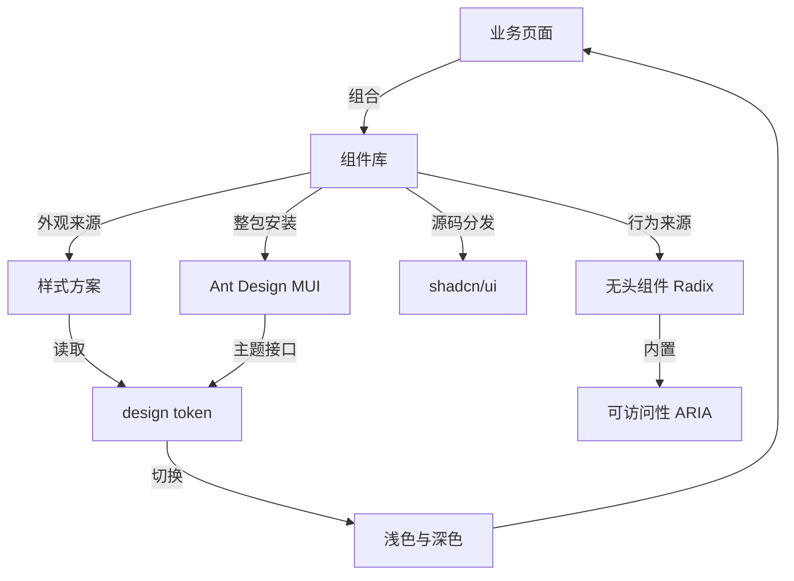
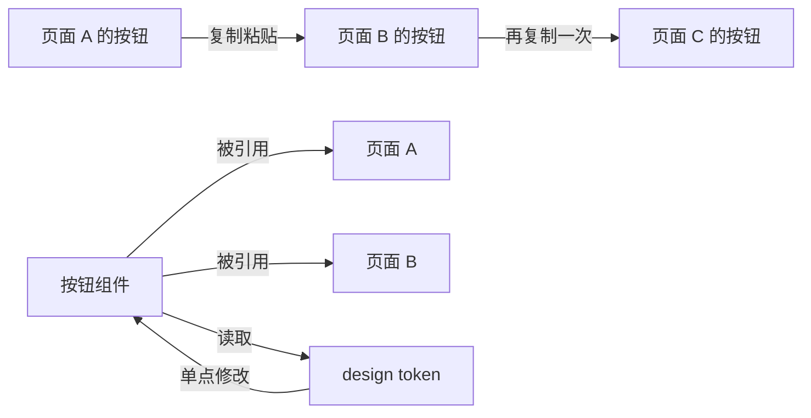
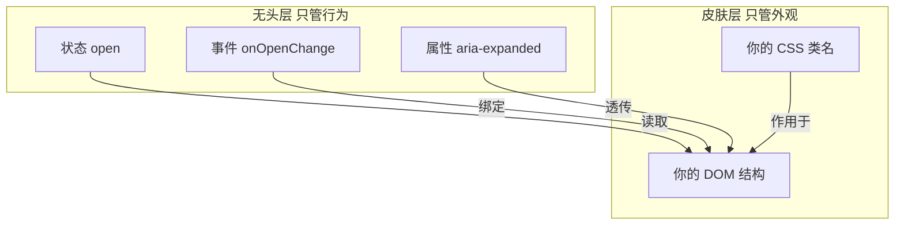
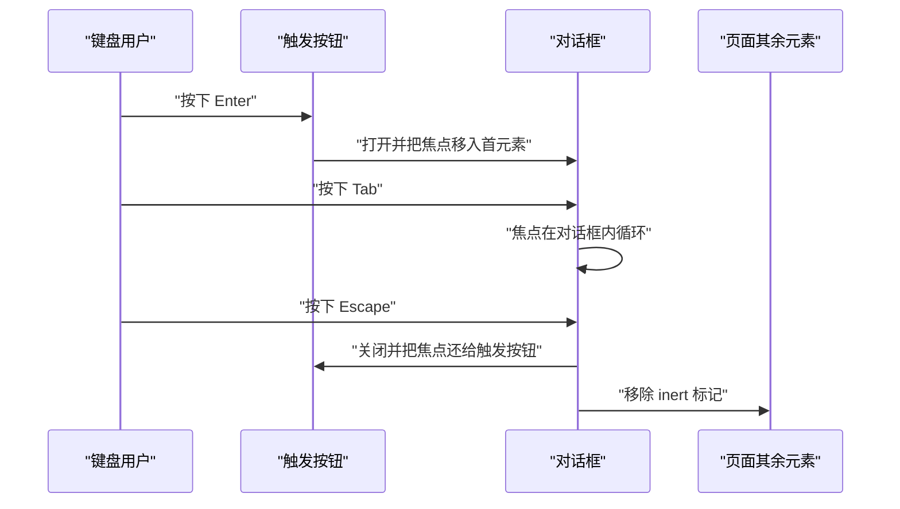
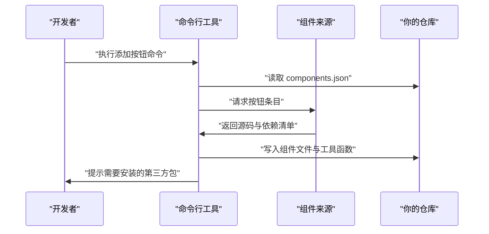
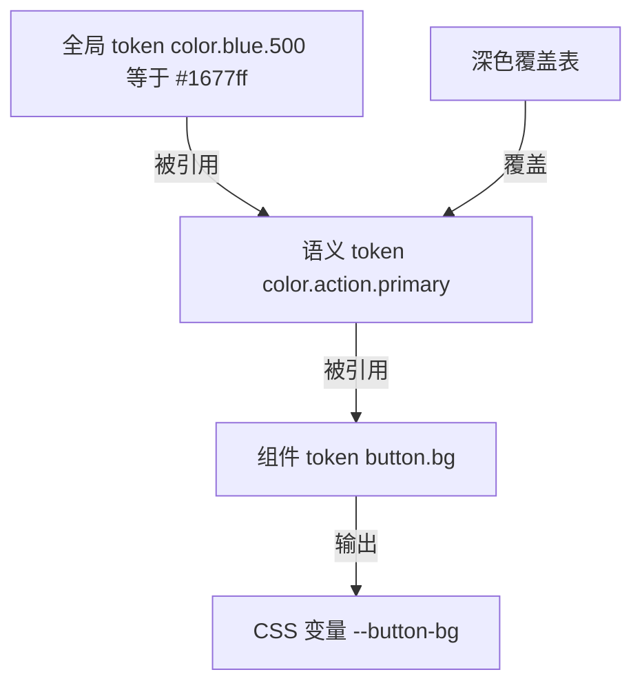
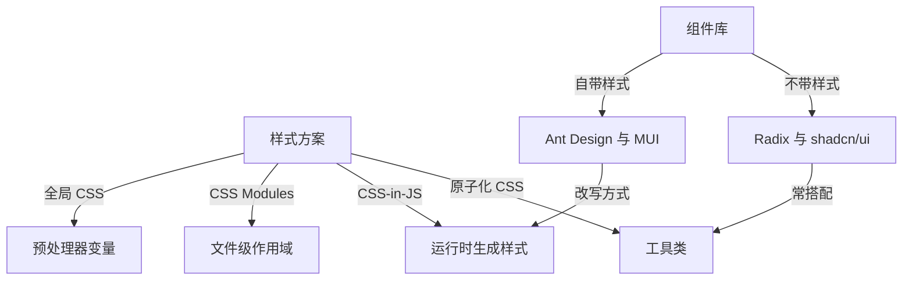
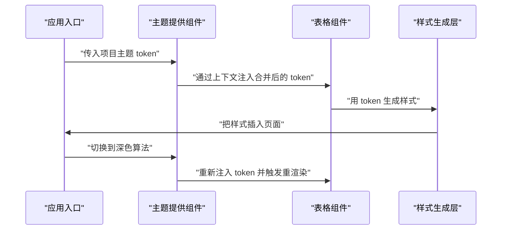
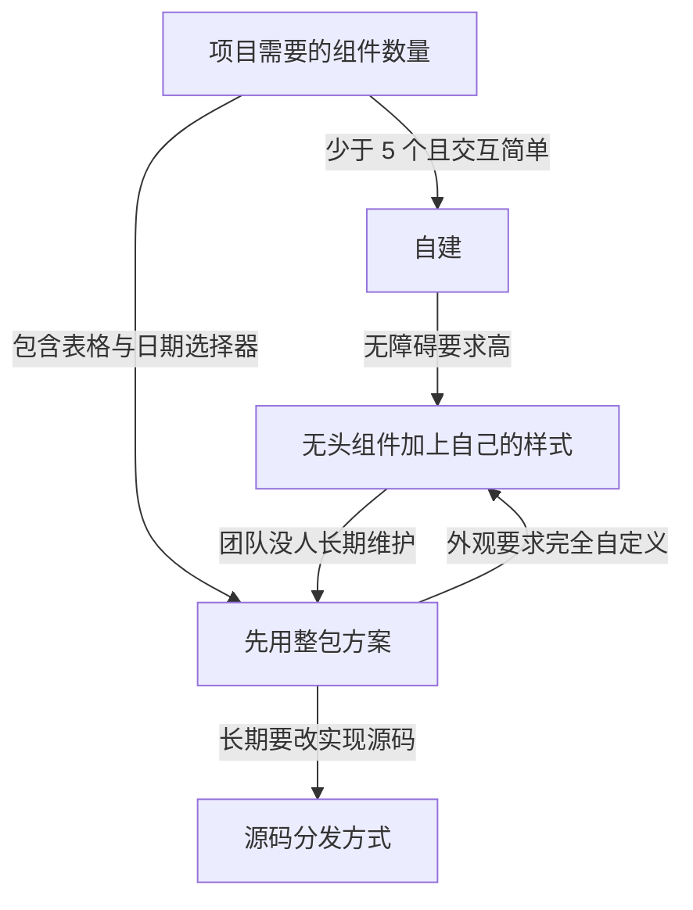

# UI 组件库与设计系统：Radix、shadcn/ui、Ant Design、MUI

!!! abstract "学完这一页你能"
    - 说清无头组件拆开了哪两层，并写出一个无头状态机配两个渲染器。
    - 列出对话框必须内置的 6 项可访问性行为，并在代码里逐项断言。
    - 用三层 design token 搭出一套能切换深色模式的变量表。
    - 给一个真实项目写出选用或自建组件库的判断依据与迁移代价。

## 0. 知识地图



读法建议：先读第 1 节，确认组件库要解决的问题。
接着按两条分支读：行为分支是第 2 与第 3 节，外观分支是第 5 与第 6 节。
第 4、7、8 节把三种落地路线放在一起比较。

## 1. 组件库解决的是重复劳动与走样

**先想一个问题**

三个人各写一个确认删除弹窗，三个版本的按钮颜色不同。
键盘用户在其中两个弹窗里按 Escape 都关不掉。
项目上线前，没人能说清哪个版本是对的。

**心智模型**

!!! tip "心智模型"
    一句话模型：组件库把到处复制的界面代码收成一份来源，改一次全部生效。
    日常类比：装修买成套门窗，尺寸和五金按同一份图纸生产。
    不成立的地方：门窗有国标尺寸，UI 组件的尺寸由业务决定，组件必须留出改样式的入口。

!!! note "术语：设计系统"
    设计系统是一份约定，包含可复用组件、design token 与使用规范三部分。
    例子：按钮组件、color.primary 这个 token、以及按钮只允许用 token 取色的规范。

**图解**



1. 页面 A 的按钮代码直接写在页面文件里。
2. 页面 B 需要同类按钮，做法是复制 A 的代码再改颜色。
3. 页面 C 又复制一次，三次修改让三份代码出现差异。
4. 抽出按钮组件后，三个页面改成引用同一个组件。
5. 按钮要换主色，只改组件读取的 token 表。

**一步一步来**

第一步：先看清复制粘贴版本的代价。

```js
// 页面 A 的按钮配置
const buttonA = { bg: "#1677ff", radius: 6, paddingX: 16 };
// 页面 B 复制后手改了主色
const buttonB = { bg: "#1678ff", radius: 6, paddingX: 16 };
// 页面 C 复制后手改了圆角
const buttonC = { bg: "#1677ff", radius: 8, paddingX: 16 };
// 逐个字段比较，找出不一致的项
const diff = Object.keys(buttonA).filter(
  (k) => !(buttonA[k] === buttonB[k] && buttonB[k] === buttonC[k])
);
console.log("diff count:", diff.length);
```

**这段代码在做什么**

- 三份配置看起来相同，实际有两处数值已经不同。
- `#1677ff` 与 `#1678ff` 只差一个十六进制位，肉眼不易发现。
- 圆角 6 与 8 的差异来自最后一次复制时的手改。
- 比较函数按字段名逐个检查，结果不依赖人的记忆。

运行结果：

```text
diff count: 2
```

第二步：抽成组件与 token。

```js
// token 表：数值的唯一来源
const tokens = { colorPrimary: "#1677ff", radiusBase: 6, spaceMd: 16 };
// 按钮组件只读 token，不写死数值
function button(props = {}) {
  return {
    bg: props.bg ?? tokens.colorPrimary, // 未传就取 token
    radius: props.radius ?? tokens.radiusBase,
    paddingX: props.paddingX ?? tokens.spaceMd,
  };
}
const pages = [button(), button(), button()];
console.log("identical:", pages[0].bg === pages[2].bg && pages[0].radius === pages[1].radius);
```

**这段代码在做什么**

- `tokens` 把颜色、圆角、间距集中到一处。
- `??` 只在传入值为 `null` 或 `undefined` 时回退到 token。
- 三次 `button()` 调用返回结构相同的对象，默认值同源。
- 想换主色，只改 `tokens.colorPrimary` 一处。

运行结果：

```text
identical: true
```

**动手验证**

依赖：无，只用 Node 20 内置模块。

```js
import assert from "node:assert/strict";

const tokens = { colorPrimary: "#1677ff", radiusBase: 6, spaceMd: 16 };

function button(props = {}) {
  return {
    bg: props.bg ?? tokens.colorPrimary,
    radius: props.radius ?? tokens.radiusBase,
    paddingX: props.paddingX ?? tokens.spaceMd,
  };
}

const pages = [button(), button(), button()];
assert.deepEqual(pages[0], pages[1]);
assert.deepEqual(pages[1], pages[2]);
assert.equal(pages[0].bg, "#1677ff");

tokens.colorPrimary = "#722ed1";
assert.equal(button().bg, "#722ed1");

const custom = button({ radius: 8 });
assert.equal(custom.radius, 8);
assert.equal(custom.bg, "#722ed1");

console.log("three pages identical: true");
console.log("after token change:", button().bg);
```

预期输出：

```text
three pages identical: true
after token change: #722ed1
```

**常见坑**

| 现象 | 原因 | 怎么修 |
| --- | --- | --- |
| 同一个按钮出现两种主色 | 复制时手改了十六进制值 | 组件内禁止写死颜色，只能读 token |
| 改 token 后旧页面没变 | 旧页面写死了数值 | 用正则搜 `#` 开头的颜色，替换成 token 引用 |
| 深色模式下文字看不清 | 只定义了浅色一套 token | 增加一份深色覆盖表，见第 5 节 |

**小结**

- 组件库的第一价值是把界面代码收成单一来源。
- 收成组件之后，颜色与间距必须走 token，不能写死。
- 一致性可以被断言验证，断言是防走样的最低成本手段。

## 2. 无头组件把行为与外观拆开

**先想一个问题**

你要做一个下拉菜单，设计稿要求外观与系统其他组件统一。
装了一个自带样式的菜单后，改外观要先覆盖它的 class。
覆盖代码越写越长，升级一次又要重查一遍。

**心智模型**

!!! tip "心智模型"
    一句话模型：无头组件只交出状态与事件，样式由你写。
    日常类比：餐厅只提供菜谱和火候，盘子由你挑。
    不成立的地方：菜谱换盘子还能用，无头组件对你的 DOM 结构有约定，结构不符合约定键盘行为会失效。

!!! note "术语：无头组件"
    无头组件只输出状态、事件处理函数与 ARIA 属性，不输出任何 CSS。
    例子：Radix 的 DropdownMenu 根组件提供 open 状态与 onOpenChange 回调。

**图解**



1. 无头层持有 `open` 这个状态，它不知道界面长什么样。
2. 无头层把改状态的回调交出来，由你绑到自己的节点上。
3. 无头层把 `aria-expanded` 交出来，你原样透传到按钮上。
4. 外观全部落在皮肤层，换皮肤不需要改行为代码。
5. 两层之间只有 props 一个接口，测试可以只测行为层。

**一步一步来**

第一步：先写行为层的状态机。

```js
// 无头层的状态只有一个布尔值
function createMenu(initialOpen = false) {
  let open = initialOpen;
  const listeners = new Set();
  return {
    get open() { return open; },   // 只读，外部不能直接改
    toggle() {
      open = !open;
      listeners.forEach((fn) => fn(open)); // 通知订阅者
    },
    subscribe(fn) { listeners.add(fn); return () => listeners.delete(fn); },
  };
}
```

**这段代码在做什么**

- `open` 被闭包保护，外部只能通过 `toggle` 修改。
- `subscribe` 返回取消订阅函数，渲染层可以随时解绑。
- 这里没有一行 CSS，也没有直接操作 DOM。
- 同一份状态可以被多个渲染器订阅，互不干扰。

第二步：让两个渲染器共用同一份状态。

```js
const domRenderer = (state) => ({
  role: "button",
  "aria-expanded": String(state.open), // HTML 属性值必须是字符串
  onclick: () => state.toggle(),
});
const textRenderer = (state) => (state.open ? "[菜单已展开]" : "[菜单已收起]");
const menu = createMenu();
console.log(textRenderer(menu), domRenderer(menu)["aria-expanded"]);
menu.toggle();
console.log(textRenderer(menu), domRenderer(menu)["aria-expanded"]);
```

**这段代码在做什么**

- 两个渲染器都只读状态，不各自存一份 `open`。
- 终端渲染器让断言不依赖浏览器环境。
- `aria-expanded` 转成字符串，符合 HTML 属性规则。
- 状态改一次，两个渲染器同时看到新值。

运行结果：

```text
[菜单已收起] false
[菜单已展开] true
```

**动手验证**

依赖：无，只用 Node 20 内置模块。

```js
import assert from "node:assert/strict";

function createMenu(initialOpen = false) {
  let open = initialOpen;
  const listeners = new Set();
  return {
    get open() { return open; },
    toggle() { open = !open; listeners.forEach((fn) => fn(open)); },
    subscribe(fn) { listeners.add(fn); return () => listeners.delete(fn); },
  };
}

const domRenderer = (state) => ({
  role: "button",
  "aria-expanded": String(state.open),
  onclick: () => state.toggle(),
});
const textRenderer = (state) => (state.open ? "[菜单已展开]" : "[菜单已收起]");

const menu = createMenu();
assert.equal(domRenderer(menu)["aria-expanded"], "false");
assert.equal(domRenderer(menu).role, "button");

let fired = 0;
const off = menu.subscribe(() => { fired += 1; });
menu.toggle();
menu.toggle();
off();
menu.toggle();

assert.equal(fired, 2);
assert.equal(domRenderer(menu)["aria-expanded"], "true");
console.log("open:", menu.open);
console.log("listener fired:", fired);
console.log("text:", textRenderer(menu));
```

预期输出：

```text
open: true
listener fired: 2
text: [菜单已展开]
```

**常见坑**

| 现象 | 原因 | 怎么修 |
| --- | --- | --- |
| 受控组件点不动 | 只传了 open，没传改状态的回调 | 状态与回调必须成对传 |
| 自己写的节点没有键盘行为 | 无头组件把事件挂在它给的处理器上 | 把 props 里的处理器展开到你的节点 |
| 无头层文件越来越长 | 外观代码被写进了行为层 | 行为层单独一个文件，禁止引入 CSS |

**小结**

- 无头组件拆开的是行为层与外观层，接口只有 props。
- 行为层是纯状态机，可以脱离浏览器测试。
- 皮肤层换实现时，行为层的断言应当全部通过。

## 3. 可访问性内置在组件里

**先想一个问题**

弹窗打开后按 Tab，焦点跑到了背后页面的按钮上。
读屏软件念到这里只说"按钮"，说不出弹窗标题。
产品验收时，键盘用户无法完成删除确认。

**心智模型**

!!! tip "心智模型"
    一句话模型：可访问性是给键盘与读屏补一份说明书，写在组件自己的 DOM 上。
    日常类比：楼里除了正门，还要有扶手和盲道。
    不成立的地方：盲道可以后来加建，ARIA 属性必须由组件本身输出，包在组件外面写不生效。

!!! note "术语：ARIA"
    ARIA 是 Accessible Rich Internet Applications 的缩写，指一组声明角色、状态与关系的 HTML 属性。
    例子：`role="dialog"` 配 `aria-modal="true"`。

!!! note "术语：焦点陷阱"
    焦点陷阱把 Tab 键的移动范围限制在当前浮层内，浮层关闭时把焦点还给触发元素。

**图解**



1. 用户在触发按钮上按下 Enter，这是键盘用户打开浮层的入口。
2. 组件打开浮层，并把焦点移到浮层内第一个可交互元素。
3. 用户继续按 Tab，焦点只在浮层内的元素之间循环。
4. 背景元素加上 `inert`，Tab 不会跳到背景。
5. 用户按 Escape，组件关闭浮层。
6. 关闭后焦点回到触发按钮，用户不会丢失位置。

**一步一步来**

第一步：给浮层补上 ARIA 属性。

```js
function dialogProps({ titleId, open }) {
  return {
    role: "dialog",               // 声明这是对话框
    "aria-modal": "true",         // 读屏只念当前浮层
    "aria-labelledby": titleId,   // 标题元素用 id 关联
    "aria-hidden": String(!open), // 关闭时对读屏隐藏
  };
}
```

**这段代码在做什么**

- `role` 告诉读屏这类元素遵循的交互约定。
- `aria-modal` 让读屏忽略浮层之外的内容。
- `aria-labelledby` 通过 id 关联标题，标题改文字不用改组件。
- `aria-hidden` 在关闭状态隐藏内容，避免读屏念到不可见节点。

第二步：实现焦点循环与焦点归还。

```js
function createFocusTrap(trigger) {
  let active = false;
  let last = null;
  return {
    get active() { return active; },
    open() { last = trigger; active = true; },  // 记住触发元素
    close() { active = false; },
    restore() { return last; },                 // 把焦点还给触发元素
    nextIndex(current, total) {
      return total === 0 ? 0 : (current + 1) % total; // 末尾回到开头
    },
  };
}
```

**这段代码在做什么**

- `last` 保存触发元素，关闭时焦点要回到它。
- `nextIndex` 用取模实现末尾回到开头的循环。
- `total === 0` 时返回 0，避免出现除以 0。
- 陷阱只记录状态，不直接操作 DOM，因此可以被断言。

**动手验证**

依赖：无，只用 Node 20 内置模块。

```js
import assert from "node:assert/strict";

function dialogProps({ titleId, open }) {
  return {
    role: "dialog",
    "aria-modal": "true",
    "aria-labelledby": titleId,
    "aria-hidden": String(!open),
  };
}

function createFocusTrap(trigger) {
  let active = false;
  let last = null;
  return {
    get active() { return active; },
    open() { last = trigger; active = true; },
    close() { active = false; },
    restore() { return last; },
    nextIndex(current, total) { return total === 0 ? 0 : (current + 1) % total; },
  };
}

const props = dialogProps({ titleId: "confirm-title", open: true });
assert.equal(props.role, "dialog");
assert.equal(props["aria-modal"], "true");
assert.equal(props["aria-labelledby"], "confirm-title");
assert.equal(props["aria-hidden"], "false");

const trap = createFocusTrap("打开按钮");
trap.open();
assert.equal(trap.active, true);
assert.equal(trap.nextIndex(0, 3), 1);
assert.equal(trap.nextIndex(2, 3), 0);
assert.equal(trap.nextIndex(0, 0), 0);
trap.close();
assert.equal(trap.restore(), "打开按钮");

console.log("aria checks passed:", Object.keys(props).length);
console.log("next from 2 of 3:", trap.nextIndex(2, 3));
console.log("restored to:", trap.restore());
```

预期输出：

```text
aria checks passed: 4
next from 2 of 3: 0
restored to: 打开按钮
```

**常见坑**

| 现象 | 原因 | 怎么修 |
| --- | --- | --- |
| Tab 跑到背景元素上 | 没有焦点陷阱，背景也没加 inert | 打开时给背景加 inert，并循环焦点 |
| 读屏只念"按钮" | 图标按钮缺可读名字 | 给每个图标按钮写 aria-label |
| 关闭后焦点跳到页面顶部 | 没有保存触发元素 | 打开时记录触发元素，关闭时 focus 回去 |
| 加了 role 但键盘没反应 | role 只是声明，不提供键盘处理 | role 与键盘事件必须成对实现 |

**小结**

- 可访问性属于组件行为层，不是事后加的外壳。
- 键盘路径只有四条：进入、循环、退出、归还焦点。
- 这四条路径都能写成断言，放进单元测试。

## 4. shadcn/ui 把源码复制进你的仓库

**先想一个问题**

你装了某个 UI 库，想给表格单元格加一层包装。
库里没有这个接口，你只能等它发新版。
发版时间不由你决定，需求却要本周交付。

**心智模型**

!!! tip "心智模型"
    一句话模型：shadcn/ui 是一份源码配送服务，命令执行后文件归你维护。
    日常类比：买成品家具与买图纸自己打的区别。
    不成立的地方：图纸打坏了要自己修，上游的修复也不会自动进入你的副本。

!!! note "术语：源码分发"
    源码分发指把组件实现文件复制进你的仓库，之后由你的团队维护。
    例子：命令行把 button 组件与 cn 工具函数写进项目目录。

需核对官方文档：具体要核对命令行名称、components.json 的字段名、registry 条目的数据结构，这三处在版本之间都改过。

**图解**



1. 开发者在项目根目录执行添加命令。
2. 命令行先读 `components.json`，确认别名与样式文件位置。
3. 工具按配置去来源拉取按钮条目。
4. 条目里包含文件路径、文件内容与依赖列表。
5. 工具把文件写到你的仓库，路径由别名解析得到。
6. 工具最后提示需要安装的第三方包，安装动作由你完成。

**一步一步来**

第一步：读配置并解析路径别名。

```js
// components.json 的关键字段
const config = {
  aliases: {
    components: "@/components", // 组件写到哪
    utils: "@/lib/utils",       // 工具函数写到哪
  },
  tailwind: { css: "app/globals.css" }, // token 变量写在哪个文件
};
// 把 @ 前缀换成项目里的真实目录
function resolvePath(alias) {
  return alias.replace(/^@\//, "src/");
}
console.log(resolvePath(config.aliases.components));
```

**这段代码在做什么**

- `aliases` 决定源码文件落到哪个目录。
- `tailwind.css` 指向写 CSS 变量的文件。
- `resolvePath` 把 `@/` 前缀替换成真实路径前缀。
- 别名不解析会让写出的文件落到错误目录。

运行结果：

```text
src/components
```

第二步：把条目内容写成文件。

```js
import { mkdirSync, writeFileSync } from "node:fs";
import { dirname, join } from "node:path";

function writeItem(root, item) {
  for (const file of item.files) {
    const target = join(root, resolvePath(file.path)); // 拼出目标路径
    mkdirSync(dirname(target), { recursive: true });   // 目录不存在就补建
    writeFileSync(target, file.content);               // 写入源码文本
  }
  return item.files.length;                            // 返回写了几个文件
}
```

**这段代码在做什么**

- 条目里每个文件带 `path` 与 `content` 两个字段。
- `mkdirSync` 的 `recursive` 让多级目录一次建好。
- 写入的是文本源码，你的仓库从此拥有这份实现。
- 返回文件数，方便在测试里断言写入数量。

**动手验证**

依赖：无，只用 Node 20 内置模块。

```js
import assert from "node:assert/strict";
import { mkdtempSync, mkdirSync, writeFileSync, readFileSync, existsSync } from "node:fs";
import { dirname, join } from "node:path";
import { tmpdir } from "node:os";

function resolvePath(alias) {
  return alias.replace(/^@\//, "src/");
}

function writeItem(root, item) {
  for (const file of item.files) {
    const target = join(root, resolvePath(file.path));
    mkdirSync(dirname(target), { recursive: true });
    writeFileSync(target, file.content);
  }
  return item.files.length;
}

const root = mkdtempSync(join(tmpdir(), "registry-"));
const item = {
  name: "button",
  files: [
    { path: "@/components/ui/button.tsx", content: "export const Button = () => null;\n" },
    { path: "@/lib/utils.ts", content: "export const cn = (...a) => a.join(' ');\n" },
  ],
};

assert.equal(resolvePath("@/components"), "src/components");
assert.equal(writeItem(root, item), 2);
assert.ok(existsSync(join(root, "src/components/ui/button.tsx")));
assert.match(readFileSync(join(root, "src/lib/utils.ts"), "utf8"), /export const cn/);

console.log("files written:", item.files.length);
console.log("resolved:", resolvePath("@/components"));
```

预期输出：

```text
files written: 2
resolved: src/components
```

**常见坑**

| 现象 | 原因 | 怎么修 |
| --- | --- | --- |
| 与上游差异越来越大 | 你改过源码，上游也在改 | 改动集中在包装层，核心文件少改，并定期比对差异 |
| 构建报找不到模块 | 组件源码引用了第三方包 | 安装工具提示的包，或改源码去掉该引用 |
| 换主题后颜色没变 | 组件用 CSS 变量，变量没定义 | 在配置指向的样式文件里定义根节点变量 |

**小结**

- 源码分发的收益是改得动，代价是升级要自己做。
- 配置文件的别名决定文件落到哪里，写错就找不到。
- 需要一条同步策略，例如每季度对比一次上游差异。

## 5. 主题与 design token

**先想一个问题**

产品要求支持深色模式，你写了 40 个组件。
每个组件里都散落着 `#ffffff` 与 `#141414`。
切换主题时，你只能全局搜索替换颜色值。

**心智模型**

!!! tip "心智模型"
    一句话模型：design token 是给数值起名字，组件只认名字，不认数值。
    日常类比：天气预报报体感温度，而不是逐个报风速与湿度。
    不成立的地方：体感温度是算出来的，token 只是名字，必须有人在某一层把名字绑到具体值。

!!! note "术语：design token"
    design token 是一个带名字的基础数值，例如颜色、间距、圆角、字号。
    例子：把 color.bg.surface 这个名字绑到 `#ffffff`。

!!! note "术语：语义化 token"
    语义化 token 按用途命名，不按外观命名。
    例子：用 color.bg.danger，而不是用 red500。

**图解**



1. 全局层只放具体数值，名字描述外观。
2. 语义层把用途名映射到全局名，组件只引用这一层。
3. 组件层给每个部件定名字，例如按钮背景。
4. 变量输出层把 token 转成 CSS 自定义属性。
5. 深色覆盖表覆盖语义层，全局层与组件层都不动。

**一步一步来**

第一步：写出全局层与语义层的解析。

```js
// 第一层：全局 token，值都是具体数值
const globalTokens = {
  "color.blue.500": "#1677ff",
  "color.gray.900": "#141414",
};
// 第二层：语义 token，值是全局 token 的名字或具体值
const themes = {
  light: { "color.text.base": "color.gray.900" },
  dark: { "color.text.base": "#f5f5f5" },
};
// 解析：主题层优先，找不到就查全局层
function resolveToken(name, theme) {
  const ref = theme[name] ?? globalTokens[name];
  return globalTokens[ref] ?? ref;
}
```

**这段代码在做什么**

- 全局层只存具体值，不带用途含义。
- 语义层把用途名映射到全局名或具体值。
- `??` 让主题层覆盖优先，缺失时回退全局层。
- 返回值一定是具体值，组件拿到的不是名字。

运行结果：

```text
light: #141414
dark: #f5f5f5
```

第二步：组件 token 引用语义 token，并输出 CSS 变量文本。

```js
// 第三层：组件 token 指向语义 token
const componentTokens = { "button.bg": "color.action.primary", "button.text": "color.text.base" };
// 把 token 表渲染成 CSS 变量声明
function toCssVariables(map, theme) {
  return Object.entries(map)
    .map(([key, ref]) => `--${key.replace(/\./g, "-")}: ${resolveToken(ref, theme)};`)
    .join(" | ");
}
```

**这段代码在做什么**

- 组件 token 的值是语义 token 名，改语义层就能影响所有组件。
- 变量名把点号换成连字符，符合 CSS 自定义属性命名习惯。
- 同一份组件 token 表配不同主题层，得到两套变量。
- 这里用竖线拼接只为输出好读，真实项目里用换行。

运行结果：

```text
--button-bg: #1677ff; | --button-text: #f5f5f5;
```

**动手验证**

依赖：无，只用 Node 20 内置模块。

```js
import assert from "node:assert/strict";

const globalTokens = { "color.blue.500": "#1677ff", "color.gray.900": "#141414" };
const themes = {
  light: { "color.action.primary": "color.blue.500", "color.text.base": "color.gray.900" },
  dark: { "color.action.primary": "color.blue.500", "color.text.base": "#f5f5f5" },
};
const componentTokens = { "button.bg": "color.action.primary", "button.text": "color.text.base" };

function resolveToken(name, theme) {
  const ref = theme[name] ?? globalTokens[name];
  return globalTokens[ref] ?? ref;
}

function toCssVariables(map, theme) {
  return Object.entries(map)
    .map(([key, ref]) => `--${key.replace(/\./g, "-")}: ${resolveToken(ref, theme)};`)
    .join(" | ");
}

assert.equal(resolveToken("color.text.base", themes.light), "#141414");
assert.equal(resolveToken("color.text.base", themes.dark), "#f5f5f5");
assert.equal(resolveToken("color.action.primary", themes.dark), "#1677ff");
assert.match(toCssVariables(componentTokens, themes.dark), /--button-text: #f5f5f5;/);

console.log("light:", toCssVariables(componentTokens, themes.light));
console.log("dark:", toCssVariables(componentTokens, themes.dark));
```

预期输出：

```text
light: --button-bg: #1677ff; | --button-text: #141414;
dark: --button-bg: #1677ff; | --button-text: #f5f5f5;
```

**常见坑**

| 现象 | 原因 | 怎么修 |
| --- | --- | --- |
| 深色模式只换了一半颜色 | 组件里既有 token 又有写死颜色 | 用脚本扫描十六进制字面量并逐个替换 |
| 改语义 token 后没生效 | 组件直接引用了全局 token | 组件 token 必须指向语义层 |
| 主题闪一下白再变黑 | 主题类名在客户端脚本里才加 | 在首屏 HTML 解析前写好初始主题类名 |
| token 名字带 red500 | 按外观命名，换色后名字说谎 | 按用途命名，例如 color.bg.danger |

**小结**

- 三层结构的关键约束是：组件只引用语义层。
- 深色模式是替换语义层的映射表，不是改组件代码。
- token 表是普通数据，可以在 Node 里直接断言。

## 6. 样式方案与组件库的关系

**先想一个问题**

项目同时用 Tailwind 与一个 CSS-in-JS 组件库。
你想改一个按钮的左右内边距，两种样式互相覆盖。
最后只能加 `!important`，下一处冲突又要再加一个。

**心智模型**

!!! tip "心智模型"
    一句话模型：组件库回答行为由谁提供，样式方案回答外观怎么生成，这是两根独立的轴。
    日常类比：一根轴是发动机，一根轴是车漆。
    不成立的地方：车漆不参与行驶，样式方案会影响组件库在服务端渲染时的输出方式。

!!! note "术语：CSS-in-JS"
    CSS-in-JS 指用 JavaScript 写样式，在运行时或构建时生成 CSS。
    例子：样式函数接收主题对象，返回一段 CSS 与一个类名。

**图解**



1. 样式方案这一轴分成四类：全局 CSS、CSS Modules、CSS-in-JS、原子化 CSS。
2. 组件库这一轴分成两类：自带样式与不带样式。
3. 不带样式的组件库常与原子化 CSS 组合，类名由你写。
4. 自带样式的组件库用 CSS-in-JS 或预编译样式，改写要走主题接口。
5. 两根轴交叉时，唯一需要额外处理的是类名冲突。

**一步一步来**

第一步：先写一个按顺序拼接类名的函数。

```js
function cn(...inputs) {
  return inputs
    .flat()          // 允许传数组，条件类名写起来短
    .filter(Boolean) // 去掉 null 与 undefined
    .join(" ")       // 用空格拼成类名列表
    .trim();
}
console.log(cn("p-2", null, ["text-sm", undefined], "p-4"));
```

**这段代码在做什么**

- `flat` 让调用方可以传数组，条件类名写成一行。
- `filter(Boolean)` 去掉假值，避免出现字符串 false。
- `join` 之后得到浏览器识别的类名列表。
- 这一步只拼接，还没有处理冲突。

运行结果：

```text
p-2 text-sm p-4
```

第二步：加入冲突消解，后写的同类工具类生效。

```js
// 只按第一个连字符前的片段分组，演示消解顺序
function resolveConflict(classes) {
  const out = [];
  for (const cls of classes) {
    const group = cls.split("-")[0];               // 取前缀当冲突组
    const idx = out.findIndex((c) => c.split("-")[0] === group);
    if (idx >= 0) out.splice(idx, 1);              // 同组旧项先移除
    out.push(cls);                                 // 新项放到末尾
  }
  return out.join(" ");
}
```

**这段代码在做什么**

- `group` 取第一个连字符前的片段作为冲突组名。
- 遇到同组已存在的项，先删旧再放新。
- 结果顺序由插入顺序决定，后写的类排在后面。
- 这个逻辑在真实项目里由 tailwind-merge 提供，覆盖的分组范围由该工具定义。

运行结果：

```text
text-sm p-4
```

**动手验证**

依赖：无，只用 Node 20 内置模块。

```js
import assert from "node:assert/strict";

function cn(...inputs) {
  return inputs.flat().filter(Boolean).join(" ").trim();
}

function resolveConflict(classes) {
  const out = [];
  for (const cls of classes) {
    const group = cls.split("-")[0];
    const idx = out.findIndex((c) => c.split("-")[0] === group);
    if (idx >= 0) out.splice(idx, 1);
    out.push(cls);
  }
  return out.join(" ");
}

function mergeClass(...inputs) {
  return resolveConflict(cn(...inputs).split(" "));
}

assert.equal(cn("p-2", null, ["text-sm", undefined]), "p-2 text-sm");
assert.equal(mergeClass("p-2", "text-sm", "p-4"), "text-sm p-4");
assert.equal(mergeClass("p-4", "p-2"), "p-2");
assert.equal(mergeClass("bg-white", "text-sm"), "bg-white text-sm");
assert.equal(mergeClass(), "");

console.log("cn:", cn("p-2", "text-sm", "p-4"));
console.log("merged:", mergeClass("p-2", "text-sm", "p-4"));
```

预期输出：

```text
cn: p-2 text-sm p-4
merged: text-sm p-4
```

**常见坑**

| 现象 | 原因 | 怎么修 |
| --- | --- | --- |
| 自定义样式不生效 | 组件库选择器权重高于工具类 | 走主题 token 改，或用同权重且后加载的样式 |
| 服务端渲染首屏无样式 | CSS-in-JS 在客户端才注入样式 | 用官方的样式抽取接口把 CSS 提到服务端 |
| 深色工具类没反应 | 变量定义在局部节点 | 变量定义放根节点，`dark:` 前缀写在组件类名上 |
| 类名冲突查不出来 | 手写字符串拼接 | 用按属性组消解的工具处理类名 |

**小结**

- 组件库与样式方案是两个独立决策，可以自由组合。
- 组合后要处理的只有两件事：类名冲突与样式注入顺序。
- 冲突消解规则要写成函数并加测试，避免靠人工记忆。

## 7. Ant Design 与 MUI 的主题注入

**先想一个问题**

后台要 12 个表格页与 6 个表单页，两周上线。
自己写表格排序、分页、列宽拖拽来不及。
团队里也没有人专门维护键盘交互与无障碍。

**心智模型**

!!! tip "心智模型"
    一句话模型：整包组件库是整车交付，外观改装走厂商给的主题接口。
    日常类比：买整车能直接开，但换发动机要按厂商的接口来。
    不成立的地方：整车不能换发动机，整包组件库能通过主题接口换掉颜色、圆角与字号。

!!! note "术语：ConfigProvider"
    ConfigProvider 是 Ant Design 提供的全局配置组件，用 props 注入主题 token、语言包与组件默认值。

!!! note "术语：ThemeProvider"
    ThemeProvider 是 MUI 提供的主题注入组件，配合 createTheme 生成的主题对象使用。

需核对官方文档：具体要核对 Ant Design 的 token 分层名称、MUI 的样式引擎配置项与两者服务端渲染接口的名称，这些在版本之间都调整过。

**图解**



1. 应用入口构造一份主题对象，包含项目覆盖值。
2. 主题提供组件把这份对象与组件库默认值合并。
3. 合并结果通过上下文传给所有子组件。
4. 表格组件读取 token 生成样式，交给样式生成层。
5. 样式生成层把 CSS 插入页面。
6. 切换深色算法后，上下文变更让组件重新渲染。

**一步一步来**

第一步：实现一个只做合并的主题构造函数。

```js
// 合并规则：基础值在前，项目覆盖在后
function createTheme(base, override = {}) {
  return {
    ...base,
    ...override,
    components: { ...base.components, ...override.components },
  };
}
const baseTheme = {
  colorPrimary: "#1677ff",
  colorBgBase: "#ffffff",
  components: { Table: { rowHeight: 54 } },
};
```

**这段代码在做什么**

- 展开顺序决定覆盖方向，`override` 必须放在后面。
- `components` 单独合并一层，避免整个对象被替换。
- 主题对象是普通数据，可以直接断言。
- 真实组件库在合并之后用算法把它展开成完整 token 表。

第二步：让组件只读 token，并用算法切换深色。

```js
// 深色算法：只改背景与文字，主色沿用
function darkAlgorithm(theme) {
  return { ...theme, colorBgBase: "#141414", colorTextBase: "#f5f5f5" };
}
// 组件只读 token，不引用外部变量
function tableStyle(theme) {
  return {
    background: theme.colorBgBase,
    color: theme.colorTextBase ?? "#141414",
    headerColor: theme.colorPrimary,
  };
}
```

**这段代码在做什么**

- 算法是一个纯函数，输入主题对象返回新对象。
- 组件函数只接受主题，便于脱离框架测试。
- 换算法只改入口一处，组件代码不动。
- 表头颜色来自主色 token，换主色时表头跟着变。

运行结果：

```text
light header: #722ed1
dark background: #141414
```

**动手验证**

依赖：无，只用 Node 20 内置模块。

```js
import assert from "node:assert/strict";

function createTheme(base, override = {}) {
  return {
    ...base,
    ...override,
    components: { ...base.components, ...override.components },
  };
}

const baseTheme = {
  colorPrimary: "#1677ff",
  colorBgBase: "#ffffff",
  colorTextBase: "#141414",
  components: { Table: { rowHeight: 54 } },
};

function darkAlgorithm(theme) {
  return { ...theme, colorBgBase: "#141414", colorTextBase: "#f5f5f5" };
}

function tableStyle(theme) {
  return {
    background: theme.colorBgBase,
    color: theme.colorTextBase ?? "#141414",
    headerColor: theme.colorPrimary,
  };
}

const project = createTheme(baseTheme, { colorPrimary: "#722ed1" });
assert.equal(project.colorPrimary, "#722ed1");
assert.equal(project.components.Table.rowHeight, 54);
assert.equal(tableStyle(project).headerColor, "#722ed1");
assert.equal(tableStyle(project).background, "#ffffff");

const dark = darkAlgorithm(project);
assert.equal(tableStyle(dark).background, "#141414");
assert.equal(tableStyle(dark).headerColor, "#722ed1");
assert.equal(dark.components.Table.rowHeight, 54);

console.log("light header:", tableStyle(project).headerColor);
console.log("dark background:", tableStyle(dark).background);
```

预期输出：

```text
light header: #722ed1
dark background: #141414
```

**常见坑**

| 现象 | 原因 | 怎么修 |
| --- | --- | --- |
| 主题改了但浮层没变 | 浮层挂到 body 之外，脱离上下文 | 用官方静态配置，或把浮层容器挂到提供组件内 |
| 首屏样式闪烁 | 样式在脚本执行后才插入 | 用官方的服务端样式抽取接口 |
| 包体积超出预算 | 整包引入了所有组件 | 按需引入，并在构建产物里核对字节数 |
| 覆盖样式升级后失效 | 直接改组件内部类名 | 优先走主题 token，改不到再用包装层 |

**小结**

- 整包方案把键盘交互与无障碍一起交付，交付速度快。
- 改装入口是主题对象，不是改组件内部 CSS。
- 主题对象是纯数据，可以在 Node 里断言合并与算法结果。

## 8. 自建还是选用

**先想一个问题**

团队 3 人，新后台项目，6 周上线并支持深色模式。
候选是两个整包方案、一个源码分发方案、一套自研组件。
决策要在本周定，因为排期要发出去。

**心智模型**

!!! tip "心智模型"
    一句话模型：选组件库等于选今后两年谁来维护这些交互细节。
    日常类比：租房租金低但改装受限，买房自由但要自己修水管。
    不成立的地方：组件库可以只租一部分，表格用整包，按钮自己写。

!!! note "术语：锁定成本"
    锁定成本指更换组件库时要重写的代码量与测试量。

**图解**



1. 先数需要多少个组件，交互复杂度是第一个判断项。
2. 组件数量少且交互简单时，自建的维护成本可控。
3. 出现表格、日期选择器这类组件时，先用整包方案交付。
4. 外观要求完全自定义时，换成无头组件加自己的样式。
5. 团队没有专人长期维护无障碍时，回到整包方案。

**一步一步来**

第一步：把评估维度写成结构化输入。

```js
// 每个维度 0 到 5 分，权重表示它在项目里的重要程度
const weights = { a11y: 3, theming: 2, bundle: 1, delivery: 3, lockIn: 2 };
const scores = {
  antd: { a11y: 4, theming: 4, bundle: 2, delivery: 5, lockIn: 2 },
  selfBuilt: { a11y: 2, theming: 5, bundle: 5, delivery: 1, lockIn: 5 },
};
// 加权求和再除以权重总和，得到 0 到 5 的分数
function weightedScore(s) {
  const total = Object.entries(weights).reduce((sum, [k, w]) => sum + s[k] * w, 0);
  const weightSum = Object.values(weights).reduce((a, b) => a + b, 0);
  return Number((total / weightSum).toFixed(2));
}
```

**这段代码在做什么**

- 权重与评分分开，同一套权重可以换项目复用。
- `delivery` 指按时交付能力，`lockIn` 指换库代价的反向分。
- 评分是团队共识的输入，不是客观测量值。
- 每个维度的含义必须写进文档，避免各人理解不同。

运行结果：

```text
antd: 3.73 selfBuilt: 3.09
```

第二步：把迁移成本算进总成本。

```js
// 单位都是人日
function totalCost({ buildDays, licenseDays, components, daysPerComponent, expectedSwitches }) {
  const migration = components * daysPerComponent * expectedSwitches; // 锁定成本
  return buildDays + licenseDays + migration;
}
console.log(
  totalCost({ buildDays: 40, licenseDays: 6, components: 12, daysPerComponent: 1.5, expectedSwitches: 2 })
);
```

**这段代码在做什么**

- `buildDays` 是自建方案的一次性投入。
- `licenseDays` 是采购或法务评估的耗时。
- `components` 乘上单组件迁移人日，得到交换库一次的成本。
- `expectedSwitches` 是两年内预计换库次数，取 0 就得到不换库的成本。

运行结果：

```text
82
```

**动手验证**

依赖：无，只用 Node 20 内置模块。

```js
import assert from "node:assert/strict";

const weights = { a11y: 3, theming: 2, bundle: 1, delivery: 3, lockIn: 2 };

function weightedScore(s) {
  const total = Object.entries(weights).reduce((sum, [k, w]) => sum + s[k] * w, 0);
  const weightSum = Object.values(weights).reduce((a, b) => a + b, 0);
  return Number((total / weightSum).toFixed(2));
}

function totalCost({ buildDays, licenseDays, components, daysPerComponent, expectedSwitches }) {
  return buildDays + licenseDays + components * daysPerComponent * expectedSwitches;
}

const antd = { a11y: 4, theming: 4, bundle: 2, delivery: 5, lockIn: 2 };
const selfBuilt = { a11y: 2, theming: 5, bundle: 5, delivery: 1, lockIn: 5 };

assert.equal(weightedScore(antd), 3.73);
assert.equal(weightedScore(selfBuilt), 3.09);
assert.ok(weightedScore(antd) > weightedScore(selfBuilt));

const cost = totalCost({ buildDays: 40, licenseDays: 6, components: 12, daysPerComponent: 1.5, expectedSwitches: 2 });
assert.equal(cost, 82);
assert.equal(totalCost({ buildDays: 40, licenseDays: 6, components: 12, daysPerComponent: 1.5, expectedSwitches: 0 }), 46);

console.log("antd:", weightedScore(antd), "selfBuilt:", weightedScore(selfBuilt));
console.log("total:", cost, "人日");
```

预期输出：

```text
antd: 3.73 selfBuilt: 3.09
total: 82 人日
```

**常见坑**

| 现象 | 原因 | 怎么修 |
| --- | --- | --- |
| 选了整包但设计稿要大改 | 组件内部结构不暴露 | token 能改的先改，改不了的评估换无头方案 |
| 自建组件无障碍不达标 | 只做了鼠标交互 | 按 WAI-ARIA 作者实践逐项核对键盘与 ARIA |
| 评分表被当成结论 | 权重由一个人定 | 权重与评分由使用方一起确认并写进文档 |
| 只算了开发时间 | 忽略了升级与迁移投入 | 把迁移人日写进预算 |

**小结**

- 决策要看组件数量、交期、维护人与换库次数四个输入。
- 锁定成本可以量化：组件数乘单组件迁移人日乘换库次数。
- 评分表的作用是把分歧摆到台面上，不是替团队做决定。

## 综合对比

| 维度 | Radix Primitives | shadcn/ui | Ant Design | MUI |
| --- | --- | --- | --- | --- |
| 分发方式 | npm 包 | 源码写进仓库 | npm 包 | npm 包 |
| 是否自带外观 | 否 | 是，基于原子化 CSS | 是 | 是 |
| 无障碍行为 | 内置 | 继承 Radix | 内置 | 内置 |
| 主题入口 | 无主题层，由你实现 | CSS 变量加工具类 | ConfigProvider 加 token 算法 | ThemeProvider 加 createTheme |
| 定制方式 | 从结构写起 | 直接改源码 | 覆盖 token | 覆盖 token 与 sx |
| 服务端渲染 | 取决于你的样式方案 | 取决于构建配置 | 需要样式抽取接口 | 需要样式抽取接口 |
| 上手成本 | 要自己写结构与样式 | 要会原子化 CSS | 低 | 低 |
| 典型场景 | 自研设计系统底座 | 要长期改源码的中后台 | 中后台快速交付 | Material 风格产品 |

## 应用与行业实践

### 应用场景地图

| 场景 | 用到本页哪个知识点 | 典型技术选型 | 注意事项 |
| --- | --- | --- | --- |
| 后台管理的万行表格 | 无头组件把行为与外观拆开 | TanStack Table + 原生 `<table>` | 键盘导航、列宽与滚动区域 |
| 低端安卓机型上的首屏加载 | 样式方案与组件库的关系 | CSS Modules 或原子化 CSS + Radix Primitives | 运行时注入样式占用主线程 |
| 多人协作白板里的浮层菜单 | 可访问性内置在组件里 | Radix Dialog / Popover | 画布快捷键与浮层 Esc 抢事件 |
| 政企内网的双品牌控制台 | 三层 design token | CSS 变量 + `data-theme` 属性 | 语义层改名要同步设计侧命名 |
| 大促落地页的首屏包体 | 按需引入与无头拆分 | 只引 primitives，按路由分包 | 别把主题 Provider 打进入口包 |
| H5 与小程序共用交互逻辑 | 无头状态机配两个渲染器 | 状态机独立成包 + 两端渲染层 | 两端事件模型与手势差异 |
| 设计到前端的 token 交付 | design token 与主题 | Style Dictionary 或 Tokens Studio 导出 | token 命名冲突要在 CI 拦下 |
| 需要 SSR 的营销站 | 主题注入与样式方案 | CSS 变量 + 静态提取 | 水合前后出现主题闪烁 |
| 老系统的渐进替换 | 自建还是选用 | 新页面用新库，旧页面保留 | 两套弹窗叠加时的层级与焦点 |

### 三个场景拆解

#### 场景 1：后台万行表格复用一套无头状态机

**业务背景**：运营后台的订单表一次要展示上万行，桌面用宽表，手机用卡片列表。两端要能同步排序、筛选和分页状态。

**怎么用本页知识解决**：把行为抽成不产出 DOM 的状态机，渲染层只消费状态与回调，两端共用同一份逻辑。

```tsx
// 无头状态机：只存排序、筛选、分页，不产出任何 DOM
function useTableState(rows: Row[]) {
  const [sort, setSort] = useState<Sort | null>(null);   // 排序状态
  const [query, setQuery] = useState('');                // 筛选关键字
  const [page, setPage] = useState(1);                   // 分页页码
  const view = useMemo(() => {                           // 派生视图，纯计算
    const filtered = rows.filter(r => r.name.includes(query));
    const sorted = sort ? [...filtered].sort(by(sort)) : filtered;
    return sorted.slice((page - 1) * 20, page * 20);
  }, [rows, sort, query, page]);
  return { view, sort, setSort, query, setQuery, page, setPage };
}
// 渲染器 A：桌面表格，只消费 state，不自己算排序
const DesktopTable = ({ state }: { state: TableState }) => <table>{/* 用 state.view 渲染行 */}</table>;
// 渲染器 B：手机卡片，复用同一个状态机
const MobileCards = ({ state }: { state: TableState }) => <ul>{/* 用 state.view 渲染卡片 */}</ul>;
```

- `by(sort)` 是纯比较函数，和状态机一起放进单元测试，不依赖 DOM。
- `view` 由 `useMemo` 派生，排序、筛选、分页组合都有确定输入输出。
- 两个渲染器只接收 `state` 与回调，换成表格库或换端时改渲染层即可。
- 上万行的滚动交给虚拟列表，状态机只负责“哪些行入选”，不负责“画几行”。

**怎么度量收益**：用 React Profiler 看排序操作的 commit 耗时；用 Chrome DevTools Performance 面板数 Long Task 条数；用 `jscpd` 扫描两端逻辑代码的重复率；用 Vitest 的覆盖率报告看状态机的行覆盖率。

**什么时候不该用**：只有一张五列表格、只在一端渲染时，抽状态机多出一层跳转。排序与筛选完全交给服务端、前端只发请求时，本地派生视图没有输入可以消费。

#### 场景 2：删除确认对话框的六项可访问性验收

**业务背景**：管理端的删除、授权动作都要二次确认，键盘用户与读屏用户是长期存在的使用人群。弹窗组件每次改动都要回归这几项行为。

**怎么用本页知识解决**：不靠人工点一遍，把六项行为写成断言，跑在组件测试里，改动弹窗就重跑一遍。

```tsx
const user = userEvent.setup();
test('对话框的六项可访问性行为', async () => {
  render(<OrderPage />);
  const trigger = screen.getByRole('button', { name: '删除订单' });
  await user.click(trigger);
  const dialog = screen.getByRole('dialog');                    // ① dialog 角色 + aria-modal
  expect(dialog).toHaveAttribute('aria-modal', 'true');
  expect(dialog).toHaveAccessibleName('删除确认');               // ② 由标题命名
  expect(dialog).toHaveFocus();                                 // ③ 打开后焦点移入
  await user.tab(); await user.tab();                           // ④ Tab 在内部循环
  expect(dialog).toContainElement(document.activeElement as Node);
  await user.keyboard('{Escape}');                              // ⑤ Esc 关闭
  expect(screen.queryByRole('dialog')).toBeNull();
  expect(trigger).toHaveFocus();                                // ⑥ 关闭后焦点归位
});
```

- 断言写在行为层，不写样式与类名，换皮肤不影响用例。
- `getByRole('dialog')` 同时校验角色与可访问名称，名称来自标题元素的关联。
- `toHaveFocus()` 校验焦点移入与归位，键盘走查从人工变成自动。
- Esc 关闭后要断言节点消失且焦点回到触发按钮，只断言消失会漏掉归位。
- 这组用例可以复制到抽屉、下拉、气泡卡片上，改选择器即可。

**怎么度量收益**：用 `@axe-core/playwright` 或 `jest-axe` 统计 dialog 相关违规条数；统计 CI 里这组断言的通过率；做一次只用 Tab、Esc、Enter 完成删除流程的键盘走查，记录通过项数。

**什么时候不该用**：产品只跑在受控触屏终端、没有键盘输入路径时，焦点循环的断言没有对应的使用场景。改用原生 `<dialog>` 加 `showModal()` 时，浏览器已提供焦点陷阱与 Esc 关闭，重复断言会互相干扰。

#### 场景 3：双品牌深色模式的三层变量表

**业务背景**：同一套控制台交付给两个品牌，每个品牌都要浅色与深色两套外观。换肤不能重新打包，也不能重启路由。

**怎么用本页知识解决**：把颜色分成原始值、语义、组件三层，主题只覆盖语义层，组件层不感知当前是哪个品牌。

```css
:root {
  /* 第一层 原始值：只描述颜色本身，不带用途 */
  --gray-50: #f9fafb;  --gray-900: #111827;  --brand-600: #2563eb;
  /* 第二层 语义：描述用途，指向原始值 */
  --bg-page: var(--gray-50);  --text-body: var(--gray-900);  --bg-action: var(--brand-600);
}
[data-theme='dark'] {   /* 主题只覆盖语义层，不动原始值 */
  --bg-page: var(--gray-900);  --text-body: var(--gray-50);
}
.button {               /* 第三层 组件：只引用语义层 */
  background: var(--bg-action);
  color: var(--text-on-action, #fff);
}
```

- 组件层不出现十六进制颜色，换品牌只改 `:root` 里的语义层取值。
- 深色模式是一个属性选择器块，切换主题只改根节点 `data-theme`。
- 品牌色从 `--brand-600` 派生，两个品牌各写一份语义层覆盖即可。
- 切换主题不触发重新挂载，页面状态和滚动位置保持不变。

**怎么度量收益**：用 Performance 面板 measure 记录一次主题切换的耗时；用 `grep` 统计产物里组件目录下的十六进制颜色字面量数量；用 Playwright 截图对比跑浅色与深色两套视觉回归；统计 token 覆盖率。

**什么时候不该用**：只有单一品牌单一主题时，三层结构多出一层中间映射。设计侧无法维护语义命名、颜色直接在组件里指定时，语义层会被绕过，变量表只剩形式。

### 行业先进实践

**asChild 组合模式**（出处：Radix Primitives 官方文档）。行为组件默认渲染自己的元素，传入 `asChild` 后把行为与属性交给使用者提供的子元素。外观完全由业务决定，行为仍由组件保证。你的项目可以用它把业务自绘的按钮接进组件的行为层。

**复制源码的分发模型**（出处：shadcn/ui 官方文档）。组件以源码形式进入业务仓库，而不是从依赖里导入。团队能直接改样式与结构，代价是升级要自己合并。借鉴方式是先在仓库里固定组件目录与改动注释规范。

**对话框的键盘交互约定**（出处：W3C WAI-ARIA Authoring Practices Guide）。APG 的 Dialog 模式列出焦点移入、Tab 循环、Esc 关闭、焦点归位这几项要求。把它抄成测试用例，评审时就不靠个人记忆。可以在代码评审模板里附上这份清单。

**种子、映射、别名三层 token**（出处：Ant Design 官方文档）。种子 token 定义品牌色，映射 token 由算法派生梯度，别名 token 描述用途。改品牌色只动种子层，组件层不动。这套分层可以直接对应本页的原始值、语义、组件三层。

**CSS 变量承载主题**（出处：MUI 官方文档的 CSS theme variables）。主题以 CSS 变量输出，切换主题只改根节点变量，SSR 时变量随 HTML 下发。需核对官方文档：你所用的 MUI 版本里启用 CSS 变量的配置字段名与默认值。

### 从学到用：落地路线

1. **试点**：选一个只有一种交互形态的中等页面，把弹窗与下拉换成带可访问性保证的组件，补上断言。验收标准：该页面的组件测试覆盖六项对话框行为，CI 全绿。
2. **验证**：在同一页面加第二套主题或第二个渲染端，两端跑同一份状态机与 token 表。验收标准：切换主题不重新打包，两端通过同一份逻辑测试。
3. **推广**：把 token 表、状态机包与测试模板抽成团队内部包，新页面默认从这里起步。验收标准：新页面 PR 里不再出现硬编码颜色与自写弹窗。
4. **防回退**：在 CI 里加硬编码颜色扫描、可访问性扫描与包体积阈值检查。验收标准：超阈值时构建失败，失败信息指向具体文件与行。

### 动手作业

**目标**：做一个“订单表格 + 删除确认”的小项目。桌面渲染表格、手机渲染卡片，共用一份无头状态机；弹窗通过六项可访问性断言；主题支持浅色与深色。

**步骤**

1. 建仓库，配好 TypeScript、Vitest、Testing Library、jest-axe。
2. 写 `useTableState`，只放排序、筛选、分页三个状态，输出一个 `view`。
3. 写两个渲染器组件，桌面 `<table>` 与手机 `<ul>`，都只接收 state 与回调。
4. 用 Radix Dialog 或原生 `<dialog>` 包出 `ConfirmDialog`，写六项断言。
5. 定义三层 token 的 CSS 文件，加 `[data-theme='dark']` 覆盖语义层。
6. 在页面顶部放主题切换按钮，切换时只改根节点属性，不重新挂载组件树。

**验收标准**

1. 状态机的单元测试覆盖排序、筛选、分页的组合情形，行覆盖率达到你设定的门槛。
2. 六项对话框断言全部通过，jest-axe 扫描无 critical 级问题。
3. 在组件目录执行 `grep -rE '#[0-9a-fA-F]{3,6}'` 找不到颜色字面量。
4. 改变窗口宽度后，表格与卡片由同一份 `view` 数据驱动，切换前后行数一致。
5. 切换深色模式时 Network 面板没有新增样式请求，滚动位置保持不变。

## 深入阅读与参考

!!! tip "怎么用这些资料"
    先读「官方文档与规范」建立准确的概念，再读「源码与示例」核对细节，最后用「教程、书籍与视频」换一种讲法加深理解。每条都写明了读哪一节、带着什么问题读。

### 官方文档与规范

| 资源 | 为什么读 | 怎么读 |
|---|---|---|
| [Ant Design 中文文档](https://ant.design/docs/react/introduce-cn) | 后台组件事实标准，先弄清 Form、Table 的官方用法与设计约定。 | 挑 Form 与 Table 两节，边读边做一个带校验的后台页，再回看组件 API 为何这样设计。 |
| [Microsoft Web API Design 最佳实践](https://learn.microsoft.com/en-us/azure/architecture/best-practices/api-design) | 命名、版本、错误格式的清单可直接用来审视组件库的 props API。 | 带着“我的组件 props 命名一致吗”读命名与错误两节，列出三处要整改的地方。 |
| [Radix Primitives 文档](https://www.radix-ui.com/primitives/docs/overview/introduction) | 无头组件与可访问性的参考实现，讲清行为与外观如何拆开。 | 读 Dialog、Dropdown 的键盘与 ARIA 段落，对照 WAI-ARIA 后手写一个受控弹窗。 |

### 源码与示例

| 资源 | 为什么读 | 怎么读 |
|---|---|---|
| [shadcn/ui 文档](https://ui.shadcn.com/docs) | “把源码复制进仓库”模式的代表，读生成代码最能理解其取舍。 | 用 CLI 加入 Button、Dialog、Table 后通读源码，改一处主题变量观察影响范围。 |
| [path-to-regexp](https://github.com/pillarjs/path-to-regexp) | 小而完整的源码范本，练“读源码”再迁移到读组件库生成代码。 | 读入口文件与测试，写下它的 API 组织思路，再对比 shadcn/ui 生成代码的结构。 |

### 教程、书籍与视频

| 资源 | 为什么读 | 怎么读 |
|---|---|---|
| [web.dev Learn Responsive Design](https://web.dev/learn/design) | 设计系统的断点与栅格最终要靠响应式基本功落地。 | 按断点章节改一个固定宽度页面，记录每处取舍，再对照组件库的栅格与断点 token。 |

## 自测题

??? question "无头组件拆开了哪两层，为什么这个拆分能减少覆盖样式的代码"
    拆开行为层与外观层。
    行为层输出状态、事件处理器与 ARIA 属性。
    外观层由你写 DOM 与 CSS。
    覆盖代码减少的原因是：不存在需要覆盖的第三方类名。
    代价是结构与样式要自己写，键盘约定要自己遵守。

??? question "对话框组件至少要内置哪些可访问性行为"
    输出 role 等于 dialog 与 aria-modal 等于 true。
    用 aria-labelledby 关联标题元素。
    打开时把焦点移入浮层。
    Tab 在浮层内循环，背景元素加 inert。
    Escape 关闭，关闭后焦点回到触发元素。

??? question "shadcn/ui 不是 npm 包，这对升级意味着什么"
    组件源码在你的仓库，上游修复不会自动进来。
    需要你手动同步，所以要有一条固定的比对节奏。
    好处是可以直接改实现，不必等上游开口子。
    代价是核心文件改得越多，同步冲突越难处理。

??? question "design token 为什么要分全局层与语义层"
    全局层只描述数值，语义层描述用途。
    组件引用语义层，换主题时只改语义层映射。
    如果组件直接引用全局层，深色模式要改每个组件。
    语义层让一个名字对应多套值，切换时只换映射表。

??? question "组件库与样式方案是同一个决策吗"
    不是。组件库决定行为由谁提供。
    样式方案决定外观如何生成。
    两者可以自由组合，四类样式方案都能搭配。
    组合后只需要处理类名冲突与样式注入顺序。

??? question "为什么 CSS-in-JS 组件库在服务端渲染时要额外处理"
    样式由 JavaScript 生成，服务端直出 HTML 时还没有对应 CSS。
    需要官方抽取接口把生成的样式一并输出。
    否则首屏出现无样式闪烁，用户会看到未加样式的结构。
    核对官方文档时要看服务端渲染章节给出的接口名与调用顺序。

??? question "自建组件库前应该先回答哪三个问题"
    需要多少个组件，交互复杂度到哪一级。
    团队里谁长期维护键盘交互与无障碍。
    预计两年内换库几次。
    这三个问题答不出来时，先选整包方案把产品交付出去。

??? question "组件库的包体积怎么核对"
    在构建产物里查看各 chunk 的字节数。
    对比按需引入与整包引入的差异。
    核对官方文档关于副作用标注与 tree-shaking 的说明。
    不要引用文档首页的宣传数字，要用自己项目的构建结果。

## 延伸阅读

- Radix Primitives 文档：Introduction、Accessibility、Composition、Dropdown Menu
- Radix Colors 文档：Understanding the scale、Dark mode
- shadcn/ui 文档：Introduction、components.json、CLI、Theming、Dark mode
- Ant Design 文档：设计令牌 Design Token、定制主题、ConfigProvider、服务端渲染
- MUI 文档：Theming、Customization、Server-side rendering、MUI Base
- W3C WAI-ARIA 作者实践：Dialog Modal、Menu Button、Combobox、Grid
- W3C Design Tokens 社区组：格式规范中的 Type、Group、Alias 章节
