# 无障碍：可访问性树、ARIA 与键盘交互

!!! abstract "学完这一页你能"
    - 画出 DOM 到可访问性树的映射流程，并说清哪些节点会被排除。
    - 按可访问名称计算顺序，为一个控件算出它的角色、名称与状态。
    - 手写可访问的 Tabs、Modal 对话框、Combobox，键盘全部可用。
    - 用 DOM 断言与对比度公式验证实现，并读懂 WCAG 门槛数字。

## 0. 知识地图

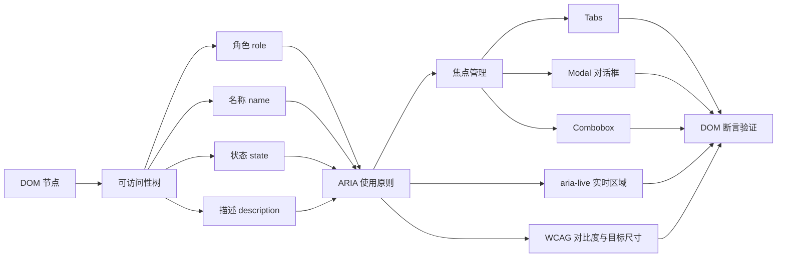

建议先读第 1 到第 3 节，把可访问性树、角色、名称这三块地基铺好。再读第 4 节的 ARIA 原则，用它约束后面所有组件的写法。最后按 Tabs、Modal、Combobox、实时区域、对比度的顺序动手写代码。

## 1. DOM 到可访问性树：谁在替屏幕阅读器读页面

**先想一个问题**

你打开一个用 div 拼的“按钮”，鼠标点得动，键盘 Tab 却跳不过去。屏幕阅读器也不知道这里有个按钮。

**心智模型**

!!! tip "心智模型"
    一句话模型：可访问性树是浏览器从 DOM 派生出的第二棵树，只保留辅助技术关心的节点。
    日常类比：DOM 是仓库里全部货架，可访问性树是给顾客看的导购牌，只登记在售商品。
    类比不成立的地方：导购牌由店员手工写，可访问性树由浏览器按规范自动算，改 DOM 或改 CSS 都会让它变。

!!! note "术语：可访问性树"
    辅助技术读取的树形结构，节点由角色、名称、状态、描述组成。例子：`<button>保存</button>` 在这棵树里是角色 button、名称“保存”的节点。

**图解**

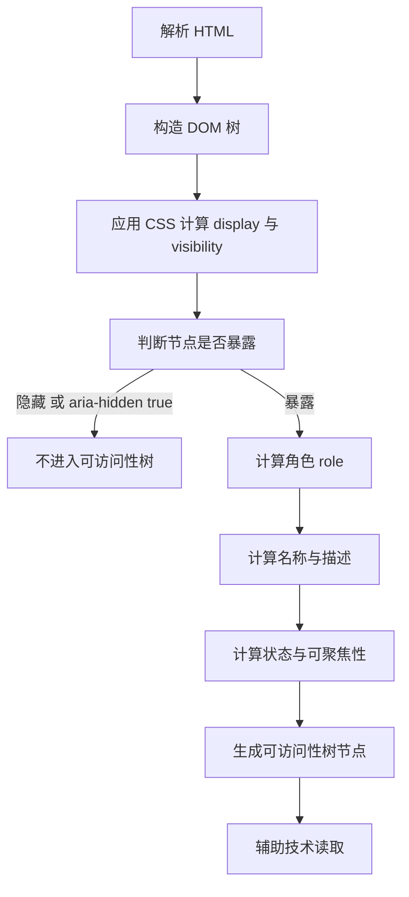

1. 浏览器解析 HTML，得到 DOM 树，这一步和 CSS 无关。
2. CSS 生效后，浏览器知道节点是 `display: none` 还是 `visibility: hidden`。
3. 隐藏节点与装饰性节点被排除，不进入可访问性树。
4. 留下的节点先算角色，`<button>` 算出 button，`<div>` 算出 generic。
5. 再算名称、描述、状态，比如“保存”这个名称、是否 disabled。
6. 辅助技术读取这棵树，朗读出角色加名称加状态。

**一步一步来**

第 1 步：写一个小函数，判断节点会不会进入可访问性树。

```js
// 判断节点是否暴露给辅助技术
function isExposed(node) {
  if (node.attrs["aria-hidden"] === "true") return false; // 显式隐藏
  const style = node.style || {};                          // 只关心两个属性
  if (style.display === "none") return false;              // 整棵子树隐藏
  if (style.visibility === "hidden") return false;         // 本节点不可见
  return true;                                             // 其余情况暴露
}
```

**这段代码在做什么**

- `aria-hidden="true"` 让节点从可访问性树移除，屏幕阅读器读不到。
- `display: none` 连子树一起移除。
- `visibility: hidden` 只移除当前节点，子节点若改回 visible 仍可暴露。
- 函数返回布尔值，后面递归时直接用它过滤。
- 这里省略了 `role="presentation"` 的情况，第 3 节会补上。

运行结果：无输出，这是一个纯判断函数。

第 2 步：用递归把整棵 DOM 结构映射成可访问性树。

```js
// 递归把 DOM 结构映射成可访问性树节点数组
function buildTree(node) {
  if (!isExposed(node)) return [];                       // 不暴露就整棵剪掉
  const self = { role: roleOf(node), name: nameOf(node) }; // 先算自身
  const children = (node.children || []).flatMap(function (child) {
    return buildTree(child);                             // 递归处理子节点
  });
  return [self].concat(children);                        // 自身在前 子节点在后
}
```

!!! note "术语：角色"
    role，元素在可访问性树里的身份，决定辅助技术怎么称呼它。例子：`<nav>` 的角色是 navigation，`<a href>` 的角色是 link。

**这段代码在做什么**

- 第一行先做剪枝，隐藏节点直接返回空数组。
- `roleOf` 和 `nameOf` 分别算角色和名称，第 2 节与第 3 节展开。
- `flatMap` 把每个子节点返回的数组摊平，得到一维列表。
- 返回顺序是自身在前、子节点在后，和 DOM 前序遍历一致。
- 剪枝发生在递归入口，所以隐藏节点的整棵子树都不会出现在结果里。

运行结果：返回一个对象数组，每个对象有 role 和 name 两个字段。

**动手验证**

```js
// 依赖：无。Node 20+，保存为 a11y-tree.js，用 node a11y-tree.js 运行
const assert = require("node:assert");

function isExposed(node) {
  if (node.attrs["aria-hidden"] === "true") return false;
  const style = node.style || {};
  if (style.display === "none") return false;
  if (style.visibility === "hidden") return false;
  return true;
}

function roleOf(node) {
  return node.attrs.role || node.implicitRole || "generic"; // 显式优先 否则隐式
}

function nameOf(node) {
  return node.attrs["aria-label"] || node.text || "";        // 教学用最简版
}

function buildTree(node) {
  if (!isExposed(node)) return [];
  const self = { role: roleOf(node), name: nameOf(node) };
  return [self].concat((node.children || []).flatMap((c) => buildTree(c)));
}

const dom = {
  attrs: {}, implicitRole: "generic", children: [
    { attrs: {}, implicitRole: "button", text: "保存", children: [] },
    { attrs: { "aria-hidden": "true" }, implicitRole: "generic", text: "装饰", children: [] },
    { attrs: {}, style: { display: "none" }, implicitRole: "generic", text: "隐藏", children: [] },
  ],
};

const tree = buildTree(dom);
assert.strictEqual(tree.length, 2);              // 根节点加一个按钮
assert.strictEqual(tree[1].role, "button");
assert.strictEqual(tree[1].name, "保存");
console.log("可访问性树节点数:", tree.length);
console.log(JSON.stringify(tree, null, 2));
```

预期输出：

```
可访问性树节点数: 2
[
  {
    "role": "generic",
    "name": ""
  },
  {
    "role": "button",
    "name": "保存"
  }
]
```

**常见坑**

| 现象 | 原因 | 怎么修 |
| --- | --- | --- |
| 按钮朗读不出名字 | 图标字体写在伪元素里，子树没有文本 | 加 `aria-label` 或在按钮内放视觉隐藏文本 |
| 弹层打开后底部按钮还能 Tab 到 | 只用 CSS 遮住，节点仍在可访问性树 | 关闭时加 `hidden` 或 `aria-hidden="true"` |
| 表单报错信息读不到 | 报错文本是纯视觉提示，没关联到输入框 | 用 `aria-describedby` 指向报错节点 |

**小结**

- 可访问性树是 DOM 的派生树，角色、名称、状态是它的核心字段。
- 节点是否暴露，取决于 `aria-hidden` 与 CSS 的 display、visibility。
- 写组件时先问一句：屏幕阅读器在这棵树上看到的是什么。

## 2. 可访问名称的计算顺序

**先想一个问题**

一个搜索框同时写了 `<label for="q">搜索</label>`、`aria-label="站内搜索"` 和 `title="找内容"`。屏幕阅读器到底读哪个？

**心智模型**

!!! tip "心智模型"
    一句话模型：可访问名称按固定顺序逐级回退，前面的来源存在就用它，后面的来源被忽略。
    日常类比：找人先打手机，手机不通打座机，座机不通发邮件，谁先接通就用谁。
    类比不成立的地方：名称计算遇到 `aria-labelledby` 会递归进去继续算，不是取一次字符串就结束。

!!! note "术语：可访问名称"
    辅助技术用来称呼一个控件的文本，英文 accessible name。例子：输入框的名称是“搜索”，按钮的名称是“保存”。

**图解**

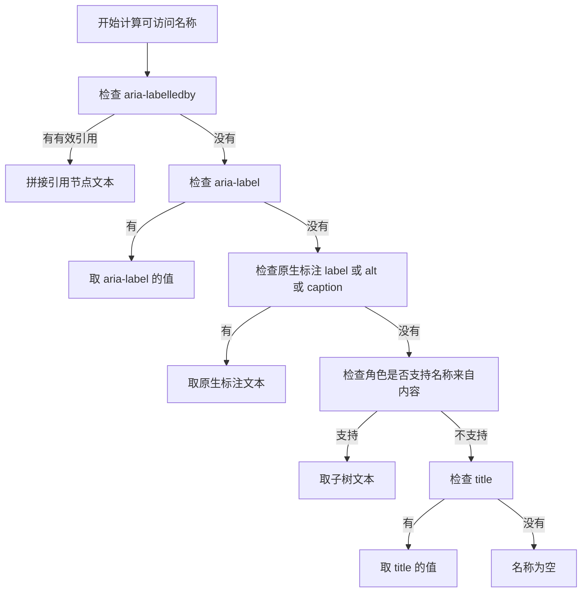

1. 先看 `aria-labelledby`，它引用元素 id，把这些节点的文本拼起来。
2. 没有 `aria-labelledby` 就看 `aria-label`，直接取它的字符串值。
3. 两者都没有，回到 HTML 自带标注，输入框用 `label`，图片用 `alt`，表格用 `caption`。
4. 还没有，就看角色是否允许“名称来自内容”，button、link、heading 允许，textbox 不允许。
5. 允许就取子树里的可见文本。
6. 最后退到 `title`，它是兜底，不是首选。
7. 全部落空时名称为空，辅助技术会读角色但读不出名字。

**一步一步来**

第 1 步：实现前三级，`aria-labelledby`、`aria-label` 和原生 `label`。

```js
// 只处理前三级的名称计算 便于理解顺序
function nameStep1to3(node, byId) {
  const labelledby = node.attrs["aria-labelledby"];      // 第一优先级
  if (labelledby) {
    return labelledby.split(" ")                          // 空格分隔多个 id
      .map(function (id) { return textOf(byId[id]); })    // 逐个取文本
      .filter(Boolean).join(" ");                         // 过滤空值后拼接
  }
  if (node.attrs["aria-label"]) return node.attrs["aria-label"]; // 第二优先级
  if (node.attrs.for && byId[node.attrs.for]) {           // 第三优先级 原生 label
    return textOf(byId[node.attrs.for]);                  // 取 label 的文本
  }
  return null;                                            // 交给下一级
}
```

**这段代码在做什么**

- `aria-labelledby` 可以写多个 id，用空格分隔，这里按顺序拼接。
- `filter(Boolean)` 去掉找不到的 id，避免拼出多余空格。
- `aria-label` 直接取字符串，它比原生 `label` 优先级高。
- 原生路径通过 `for` 属性找对应的 `label` 元素。
- 返回 `null` 表示这一级没有结果，需要继续往下走。

运行结果：函数返回字符串或 null。

第 2 步：补上第四级和第五级，名称来自内容和 `title` 兜底。

```js
// 角色是否支持名称来自内容
const NAME_FROM_CONTENT = ["button", "link", "heading", "cell", "option", "tab"];

function computeName(node, byId) {
  const early = nameStep1to3(node, byId);                 // 先走前三步
  if (early) return early;                                // 有结果就用
  const role = node.attrs.role || node.implicitRole;      // 拿到角色
  if (NAME_FROM_CONTENT.includes(role)) {                 // 角色允许取子树文本
    return textOf(node);                                  // 取全部后代文本
  }
  return node.attrs.title || "";                          // 最后用 title 兜底
}
```

**这段代码在做什么**

- `early` 做短路判断，前三级有结果就不再往下算。
- `NAME_FROM_CONTENT` 列出支持“名称来自内容”的角色。
- 支持时取整棵子树的可见文本，嵌套标签的文本也算。
- 不支持时直接落到 `title`，`title` 只作为最后的兜底。
- 返回空字符串表示名称为空，调用方要能处理这种情况。
- 完整算法里还有递归遍历与不可见节点跳过，需核对官方文档确认边界条款。

运行结果：`computeName(searchNode, byId)` 返回“搜索”，因为原生 label 生效。

**动手验证**

```js
// 依赖：无。Node 20+，保存为 accname.js
const assert = require("node:assert");

const NAME_FROM_CONTENT = ["button", "link", "heading", "option", "tab"];

function textOf(node) {
  if (!node) return "";
  return (node.text || "") + (node.children || []).map(textOf).join("");
}

function nameStep1to3(node, byId) {
  const labelledby = node.attrs["aria-labelledby"];
  if (labelledby) {
    return labelledby.split(" ").map((id) => textOf(byId[id])).filter(Boolean).join(" ");
  }
  if (node.attrs["aria-label"]) return node.attrs["aria-label"];
  if (node.attrs.for && byId[node.attrs.for]) return textOf(byId[node.attrs.for]);
  return null;
}

function computeName(node, byId) {
  const early = nameStep1to3(node, byId);
  if (early) return early;
  const role = node.attrs.role || node.implicitRole;
  if (NAME_FROM_CONTENT.includes(role)) return textOf(node);
  return node.attrs.title || "";
}

const byId = {
  q: { attrs: {}, text: "搜索", children: [] },
  hint: { attrs: {}, text: "输入关键词", children: [] },
  save: { attrs: {}, text: "保存草稿", children: [] },
};

const search = { attrs: { for: "q", title: "找内容" }, implicitRole: "textbox", children: [] };
const labelledby = { attrs: { "aria-labelledby": "q hint" }, implicitRole: "textbox", children: [] };
const iconOnly = { attrs: { title: "关闭" }, implicitRole: "textbox", children: [] };
const button = { attrs: { role: "button" }, text: "", children: [byId.save] };

assert.strictEqual(computeName(search, byId), "搜索");                   // 原生 label
assert.strictEqual(computeName(labelledby, byId), "搜索 输入关键词");    // labelledby 优先
assert.strictEqual(computeName(iconOnly, byId), "关闭");                 // title 兜底
assert.strictEqual(computeName(button, byId), "保存草稿");               // 名称来自内容
console.log("search:", computeName(search, byId));
console.log("labelledby:", computeName(labelledby, byId));
console.log("iconOnly:", computeName(iconOnly, byId));
```

预期输出：

```
search: 搜索
labelledby: 搜索 输入关键词
iconOnly: 关闭
```

**常见坑**

| 现象 | 原因 | 怎么修 |
| --- | --- | --- |
| 图标按钮读成“按钮” | 子树没有文本，也没写名称来源 | 加 `aria-label`，或按钮里放视觉隐藏文本 |
| `aria-labelledby` 指向的 id 不存在 | 拼写错误或元素还没渲染 | 用 DOM 断言检查引用节点是否存在 |
| 图片名称读成文件名 | 漏写 `alt`，浏览器退回文件路径 | 补 `alt`，装饰图写 `alt=""` |

**小结**

- 名称计算是逐级回退，顺序是 labelledby、label、原生标注、内容、title。
- `aria-label` 会盖住原生 `label`，同时写两个时以 `aria-label` 为准。
- 名称来自内容只对部分角色生效，输入框角色不会读子节点文本。

## 3. ARIA 使用原则：第一原则与状态属性

**先想一个问题**

你给一个 div 加上 `role="button"`，以为万事大吉。结果键盘按空格没反应，Tab 也聚焦不到它。

**心智模型**

!!! tip "心智模型"
    一句话模型：ARIA 只改语义，不改行为，行为要你自己补上。
    日常类比：ARIA 是给商品贴的新标签，标签写着“按钮”，但商品本身不会自己按下去。
    类比不成立的地方：贴错标签比不贴更糟，辅助技术会按错误角色去播报，用户拿到的是错信息。

!!! note "术语：ARIA"
    Accessible Rich Internet Applications，一组给 HTML 补充语义的属性。例子：`role="tab"` 告诉辅助技术这是标签页。

**图解**

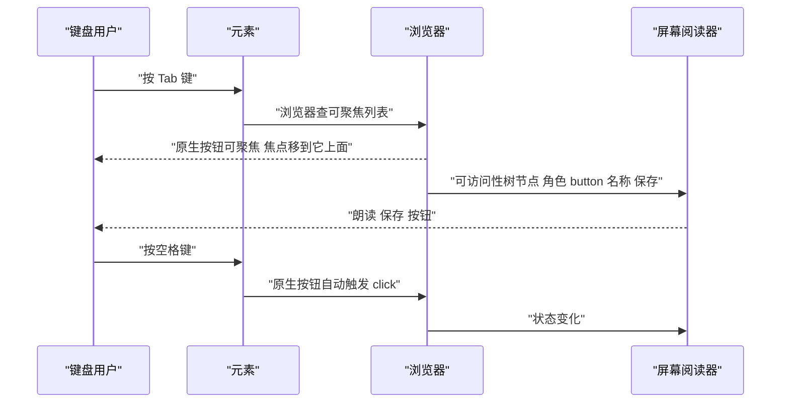

1. 键盘用户按 Tab，浏览器在可聚焦元素列表里找下一个。
2. 原生 `<button>` 在这个列表里，焦点移到它上面。
3. 浏览器把可访问性树节点交给屏幕阅读器，节点带角色和名称。
4. 屏幕阅读器朗读“保存 按钮”，用户知道当前在哪。
5. 用户按空格，原生按钮自己触发 click，不需要你写代码。
6. 换成 `div role="button"` 后，第 6 步不会发生，你要监听 keydown 自己派发。

**一步一步来**

第 1 步：先判断能不能用原生元素，写一个检查函数。

```js
// 检查是否可以直接用原生元素 避免手写角色
function preferNative(tag, attrs) {
  if (tag === "div" && attrs.role === "button") {            // 典型反例
    return { ok: false, native: "button" };
  }
  if (tag === "div" && attrs.role === "checkbox") {
    return { ok: false, native: "input type=checkbox" };
  }
  if (tag === "span" && attrs.role === "link") {
    return { ok: false, native: "a href" };
  }
  return { ok: true, native: null };                         // 没有原生对应
}
```

**这段代码在做什么**

- 输入标签名和属性，输出能不能换成原生元素。
- `div role="button"` 可以换成 `<button>`，行为自带。
- `div role="checkbox"` 换成 `<input type="checkbox">`，勾选状态自带。
- `span role="link"` 换成 `<a href>`，键盘与右键菜单都自带。
- 返回 `ok: true` 时说没有原生等价物，这时才允许用 ARIA。
- W3C 的《Using ARIA》文档把这条写成使用 ARIA 的第一原则，条文编号需核对官方文档。

运行结果：返回一个对象，含 ok 与 native 字段。

第 2 步：真的需要 ARIA 时，只补语义并自己实现行为。

```js
// 没有原生等价物时 用 ARIA 补语义 并自己补键盘行为
function makeSwitch(el) {
  el.setAttribute("role", "switch");                          // 补角色
  el.setAttribute("aria-checked", "false");                   // 补状态
  el.setAttribute("tabindex", "0");                           // 自己补可聚焦
  el.addEventListener("keydown", function (e) {
    if (e.key === " " || e.key === "Enter") {                 // 空格和回车都算
      e.preventDefault();                                     // 阻止页面滚动
      const on = el.getAttribute("aria-checked") === "true";  // 读当前状态
      el.setAttribute("aria-checked", String(!on));           // 翻转状态
    }
  });
}
```

**这段代码在做什么**

- `role="switch"` 声明开关语义，`aria-checked` 声明当前状态。
- `tabindex="0"` 把元素放进 Tab 顺序，原生 div 默认不在里面。
- 监听 keydown，空格和回车都当作激活。
- `preventDefault` 阻止空格滚动页面的默认行为。
- 状态只存在 `aria-checked` 上，视觉样式按它来切换。
- `<input type="checkbox">` 与 `<button>` 都没有 switch 语义，这类场景必须用 ARIA。

运行结果：键盘用户能 Tab 到开关并按空格切换。

**动手验证**

```js
// 依赖：无。Node 20+，保存为 aria-rules.js
const assert = require("node:assert");

function preferNative(tag, attrs) {
  if (tag === "div" && attrs.role === "button") return { ok: false, native: "button" };
  if (tag === "div" && attrs.role === "checkbox") return { ok: false, native: "input type=checkbox" };
  if (tag === "span" && attrs.role === "link") return { ok: false, native: "a href" };
  return { ok: true, native: null };
}

// 把 aria-checked 的翻转写成纯函数 方便断言
function toggleChecked(current) {
  return current === "true" ? "false" : "true";
}

// 键盘到动作的映射 只认空格与回车
function actionForKey(key) {
  if (key === " " || key === "Enter") return "toggle";
  return "none";
}

assert.deepStrictEqual(preferNative("div", { role: "button" }), { ok: false, native: "button" });
assert.strictEqual(preferNative("div", { role: "switch" }).ok, true);
assert.strictEqual(toggleChecked("false"), "true");
assert.strictEqual(toggleChecked("true"), "false");
assert.strictEqual(actionForKey(" "), "toggle");
assert.strictEqual(actionForKey("Tab"), "none");
console.log("div role=button 应换成:", preferNative("div", { role: "button" }).native);
console.log("空格动作:", actionForKey(" "));
console.log("翻转后:", toggleChecked("false"));
```

预期输出：

```
div role=button 应换成: button
空格动作: toggle
翻转后: true
```

**常见坑**

| 现象 | 原因 | 怎么修 |
| --- | --- | --- |
| `div role="button"` 按空格无反应 | 只补了角色，没补键盘事件 | 加 keydown，空格与回车都处理 |
| 自定义角色读不出状态 | 只写 role 不写 `aria-checked` | 状态属性与角色配套使用 |
| 给 `<button>` 加 `role="link"` | 显式角色覆盖原生语义，行为没跟着换 | 直接换成 `<a href>` |

**小结**

- 第一原则是有原生元素就用原生元素，ARIA 只留给没有原生等价物的场景。
- ARIA 不提供键盘行为、不提供焦点、不提供点击，这些要自己实现。
- 使用 ARIA 时角色与状态要成对出现，缺一个就会播报错误。

## 4. 焦点管理与 roving tabindex

**先想一个问题**

一个工具栏有 12 个按钮，按 Tab 要按 12 次才能穿过去。用户想去地址栏，手指按到酸。

**心智模型**

!!! tip "心智模型"
    一句话模型：Tab 顺序按 tabindex 分层，0 走文档顺序，负值只接受程序聚焦。
    日常类比：tabindex 像排队号码，0 号按到场顺序排，-1 号不在队伍里但可以被人叫出来。
    类比不成立的地方：正数 tabindex 会插队到 0 号前面，多个正数之间还要再排序，结果很难维护。

!!! note "术语：roving tabindex"
    复合组件里只让当前项 `tabindex="0"`，其余项 `tabindex="-1"`，方向键移动时把这个 0 值搬过去。例子：Tabs、工具栏、菜单。

!!! note "术语：tabindex"
    控制元素是否可聚焦的 HTML 属性。例子：`tabindex="0"` 进入 Tab 顺序，`tabindex="-1"` 只能被脚本聚焦。

**图解**

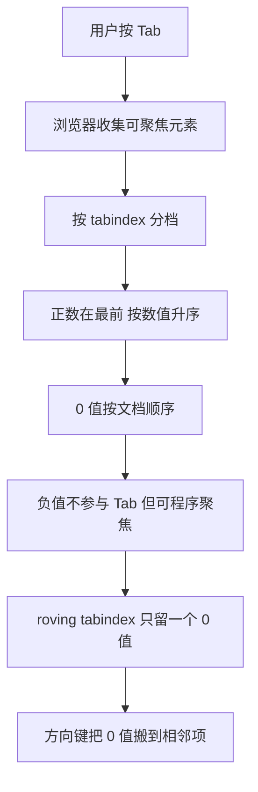

1. 浏览器遍历 DOM，收集所有可聚焦元素，按钮、链接、表单控件默认在内。
2. 按 tabindex 分成三档，正数、0、负数。
3. 正数排在最前面，数值越小越靠前。
4. 0 值按文档出现顺序排。
5. 负值不参与 Tab 顺序，但 `element.focus()` 可以把焦点放上去。
6. roving tabindex 让一组元素里只有一个 0 值，Tab 一次就能进出整组。
7. 方向键触发时，把原来的项改成 -1，目标项改成 0，再调用 `focus()`。

**一步一步来**

第 1 步：写一个纯函数，算出 Tab 经过这一组元素时的进入点。

```js
// 输入一组 tabindex 值 返回 Tab 会停在哪个下标
function tabEntryIndex(tabindexes) {
  const zero = tabindexes.indexOf(0);              // 找唯一的 0 值
  if (zero !== -1) return zero;                    // 找到就作为入口
  const positives = tabindexes
    .map(function (v, i) { return { v: v, i: i }; })
    .filter(function (x) { return x.v > 0; })      // 收集正数
    .sort(function (a, b) { return a.v - b.v; });  // 按数值升序
  return positives.length ? positives[0].i : -1;   // 有正数取最靠前的
}
```

**这段代码在做什么**

- roving tabindex 组里只应有一个 0 值，`indexOf` 直接定位。
- 找不到 0 值时，退回到正数规则。
- `map` 把数值和下标配对，排序后还能知道原下标。
- 全为负值时返回 -1，表示这组元素不参与 Tab。
- 函数不碰 DOM，方便用断言覆盖各种排列。

运行结果：`tabEntryIndex([-1, -1, 0, -1])` 返回 2。

第 2 步：方向键移动时，搬动那个 0 值并同步聚焦。

```js
// 把 roving tabindex 的 0 值搬到下一个下标
function moveRoving(items, current, delta) {
  const len = items.length;                             // 组内元素个数
  const next = (current + delta + len) % len;           // 循环 不越界
  items[current].setAttribute("tabindex", "-1");        // 旧项退出 Tab 顺序
  items[next].setAttribute("tabindex", "0");            // 新项进入 Tab 顺序
  items[next].focus();                                  // 焦点跟着搬过去
  return next;                                          // 返回新下标便于断言
}
```

**这段代码在做什么**

- `(current + delta + len) % len` 处理首尾循环，到末尾再按右键回到第一项。
- 先把旧项设为 -1，再设新项为 0，顺序不能反。
- `focus()` 让屏幕阅读器跟着朗读新的项。
- 返回新下标，测试脚本可以直接断言。
- 焦点和 tabindex 必须同步，只改一个会出现焦点与朗读不一致。

运行结果：返回新的下标，DOM 上 0 值也移到了新项。

**动手验证**

先确认搬运规则与入口规则，再进入后面几个组件的小节。

```js
// 依赖：无。Node 20+，保存为 roving.js
const assert = require("node:assert");

function tabEntryIndex(tabindexes) {
  const zero = tabindexes.indexOf(0);
  if (zero !== -1) return zero;
  const positives = tabindexes.map((v, i) => ({ v, i }))
    .filter((x) => x.v > 0)
    .sort((a, b) => a.v - b.v);
  return positives.length ? positives[0].i : -1;
}

function nextIndex(current, delta, len) {
  return (current + delta + len) % len;              // 循环移动
}

assert.strictEqual(tabEntryIndex([-1, -1, 0, -1]), 2);
assert.strictEqual(tabEntryIndex([-1, -1, -1]), -1);
assert.strictEqual(tabEntryIndex([2, 0, 3]), 1);
assert.strictEqual(nextIndex(0, -1, 4), 3);           // 首项左移回到末项
assert.strictEqual(nextIndex(3, 1, 4), 0);            // 末项右移回到首项
assert.strictEqual(nextIndex(1, 1, 4), 2);
console.log("Tab 入口下标:", tabEntryIndex([-1, -1, 0, -1]));
console.log("右移:", nextIndex(1, 1, 4));
console.log("左移:", nextIndex(0, -1, 4));
```

预期输出：

```
Tab 入口下标: 2
右移: 2
左移: 3
```

**常见坑**

| 现象 | 原因 | 怎么修 |
| --- | --- | --- |
| 组里能 Tab 停好几次 | 多项都写了 `tabindex="0"` | 只保留当前项为 0，其余改 -1 |
| 用了 `tabindex="1"` 顺序变乱 | 正数插队，还依赖数值排序 | 统一用 0 与 -1，顺序交给 DOM 结构 |
| 方向键改了 tabindex 但焦点没动 | 只改属性没调 `focus()` | 改完属性立刻 `focus()` |

**小结**

- tabindex 只有三档有意义：正数插队、0 走文档顺序、负值只接受程序聚焦。
- roving tabindex 让一组元素只占一个 Tab 停留点，进入后用方向键移动。
- 搬动 0 值和调用 `focus()` 必须成对执行，否则焦点与朗读会分叉。

## 5. 手写 Modal 对话框：焦点陷阱与 Esc

**先想一个问题**

弹窗打开后，用户按 Tab 一路跑到页面底部的“订阅”按钮上，再按回车就提交了后台的表单。用户根本没看到那个按钮。

**心智模型**

!!! tip "心智模型"
    一句话模型：焦点陷阱把 Tab 循环限制在对话框内部，关闭时把焦点还给打开它的元素。
    日常类比：电梯里只有一层楼，怎么按都在这一层转圈。
    类比不成立的地方：对话框里有输入框和按钮，焦点要在这些元素之间按 DOM 顺序循环，不是固定两个点。

!!! note "术语：焦点陷阱"
    focus trap，把键盘焦点限制在指定容器内的实现。例子：Modal 打开时按 Tab 只在对话框内的按钮间循环。

**图解**

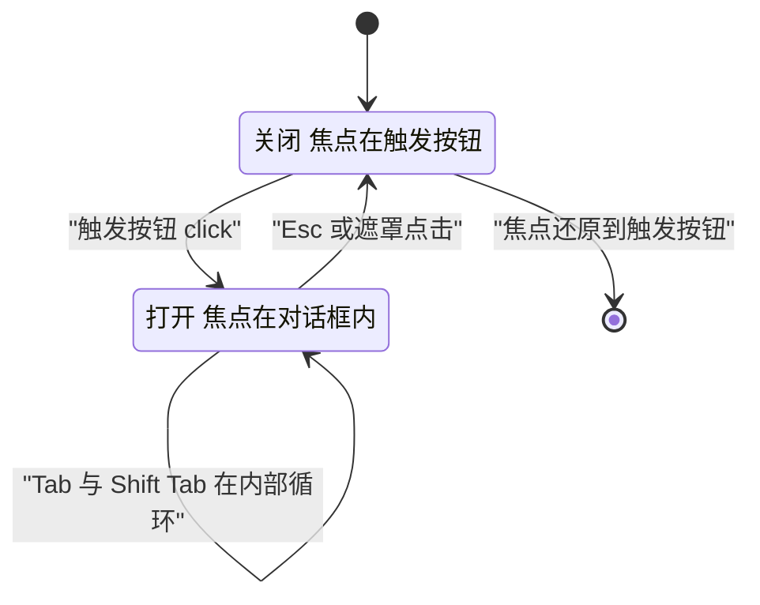

1. 初始状态是关闭，对话框设 `hidden`，焦点在页面上。
2. 触发按钮 click 后进入打开状态，记录触发元素，把焦点移到对话框内。
3. 按 Tab 时若焦点在最后一个元素，把焦点送回第一个。
4. 按 Shift 加 Tab 时若焦点在第一个元素，把焦点送到最后一个。
5. 按 Esc 进入关闭流程，同时阻止事件继续冒泡。
6. 关闭后把焦点还给触发按钮，键盘用户可以接着原来的位置操作。

**一步一步来**

第 1 步：算出 Tab 应该落到哪个下标。

```js
// 输入元素个数和焦点位置 返回下一个应聚焦的下标
function nextFocusIndex(count, current, shift) {
  if (count === 0) return -1;                        // 容器里没有可聚焦元素
  if (shift) {                                       // Shift 加 Tab 反向
    return current <= 0 ? count - 1 : current - 1;   // 从第一个跳到最后一个
  }
  return current >= count - 1 ? 0 : current + 1;     // 从最后一个跳回第一个
}
```

**这段代码在做什么**

- `count === 0` 时返回 -1，调用方要处理空容器。
- 反向走时，如果当前在第一个，目标就是最后一个。
- 正向走时，如果当前在最后一个，目标就是第一个。
- 中间位置直接加减一，不涉及循环。
- 这是焦点陷阱的核心计算，DOM 操作留给调用方。

运行结果：`nextFocusIndex(3, 2, false)` 返回 0。

第 2 步：把计算接到 keydown 上，同时处理 Esc。

```js
// 在对话框上安装焦点陷阱与 Esc 关闭
function trapFocus(dialog, onClose) {
  dialog.addEventListener("keydown", function (e) {          // 只在对话框内监听
    if (e.key === "Escape") {                                // Esc 关闭
      e.preventDefault();                                    // 阻止默认行为
      onClose();                                             // 交给调用方收尾
      return;
    }
    if (e.key !== "Tab") return;                             // 只接管 Tab
    const list = Array.from(dialog.querySelectorAll("[data-focusable]")); // 收集
    const current = list.indexOf(dialog.ownerDocument.activeElement);     // 当前下标
    const next = nextFocusIndex(list.length, current, e.shiftKey);        // 目标下标
    if (next !== -1) {                                       // 有目标才移动
      e.preventDefault();                                    // 接管默认的 Tab
      list[next].focus();                                    // 手动移焦点
    }
  });
}
```

**这段代码在做什么**

- 监听装在对话框容器上，事件冒泡到容器时才处理。
- Esc 分支先 `preventDefault` 再调用 `onClose`，让调用方负责关闭和还原焦点。
- 只接管 Tab 键，其他键不动，输入框的编辑行为不受影响。
- `data-focusable` 是给可聚焦元素加的标记，比每次猜选择器可靠。
- `next !== -1` 保护空容器的情况，避免访问不存在的元素。
- `preventDefault` 必须在 `focus()` 之前调用，否则浏览器会再按默认顺序跳一次。

运行结果：对话框内 Tab 循环，Esc 触发 onClose。

**动手验证**

用 jsdom 建一个对话框，验证首尾循环和 Esc 的处理逻辑。

```js
// 依赖：jsdom（npm install jsdom）。Node 20+，保存为 modal.js
const assert = require("node:assert");
const { JSDOM } = require("jsdom");

function nextFocusIndex(count, current, shift) {
  if (count === 0) return -1;
  if (shift) return current <= 0 ? count - 1 : current - 1;
  return current >= count - 1 ? 0 : current + 1;
}

const dom = new JSDOM(`<!doctype html><div id="dialog">
  <button id="a" data-focusable>确定</button>
  <button id="b" data-focusable>取消</button>
  <button id="c" data-focusable>更多</button>
</div>`);
const { document } = dom.window;
const dialog = document.getElementById("dialog");

let closed = false;
dialog.addEventListener("keydown", (e) => {
  if (e.key === "Escape") { e.preventDefault(); closed = true; return; }
  if (e.key !== "Tab") return;
  const list = Array.from(dialog.querySelectorAll("[data-focusable]"));
  const current = list.indexOf(document.activeElement);
  const next = nextFocusIndex(list.length, current, e.shiftKey);
  if (next !== -1) { e.preventDefault(); list[next].focus(); }
});

document.getElementById("a").focus();
assert.strictEqual(document.activeElement.id, "a");

dialog.dispatchEvent(new dom.window.KeyboardEvent("keydown", { key: "Tab", bubbles: true }));
assert.strictEqual(document.activeElement.id, "b");        // 正向下一个

document.getElementById("c").focus();
dialog.dispatchEvent(new dom.window.KeyboardEvent("keydown", { key: "Tab", bubbles: true }));
assert.strictEqual(document.activeElement.id, "a");        // 末尾回到开头

document.getElementById("a").focus();
dialog.dispatchEvent(new dom.window.KeyboardEvent("keydown", { key: "Tab", shiftKey: true, bubbles: true }));
assert.strictEqual(document.activeElement.id, "c");        // 开头跳到末尾

dialog.dispatchEvent(new dom.window.KeyboardEvent("keydown", { key: "Escape", bubbles: true }));
assert.strictEqual(closed, true);                          // Esc 触发关闭

console.log("末尾回到开头后焦点:", document.activeElement.id);
console.log("已关闭:", closed);
```

预期输出：

```
末尾回到开头后焦点: c
已关闭: true
```

**常见坑**

| 现象 | 原因 | 怎么修 |
| --- | --- | --- |
| 对话框打开了焦点还在页面上 | 打开时没调用 `focus()` | 打开后聚焦第一个可聚焦元素或标题 |
| 关闭后焦点丢到 body | 没记录触发元素 | 打开时保存 `document.activeElement`，关闭时 `focus()` 还原 |
| 遮罩后面的按钮还能被读屏读到 | 只用了 `z-index` 覆盖 | 打开时给背景加 `aria-hidden` 或用 `inert` |

**小结**

- 焦点陷阱的核心是首尾循环，计算只有加一减一加取模这套分支。
- 打开记录、关闭还原，这两步决定键盘用户能不能回到原位。
- 原生 `<dialog>` 的 `showModal()` 自带焦点陷阱与 Esc，浏览器支持范围需核对官方文档。

## 6. 手写可访问的 Tabs：方向键与 aria-selected

**先想一个问题**

你用 Tabs 切换面板，鼠标点哪都正常。键盘用户按 Tab 只能停在当前选中的那个标签上，别的标签根本进不去。

**心智模型**

!!! tip "心智模型"
    一句话模型：Tabs 是一组 roving tabindex 按钮，方向键换选中项，Tab 一次进出整组。
    日常类比：收音机的频道旋钮，转一下就到下一个台，不用一个个按按钮。
    类比不成立的地方：Tabs 有水平与垂直两种方向，横向用左右键，纵向用上下键，键位由 `aria-orientation` 决定。

!!! note "术语：Tabs 模式"
    WAI-ARIA 定义的一组组件结构，由 `role="tablist"`、`role="tab"`、`role="tabpanel"` 三部分组成。例子：页面顶部“全部、待办、已完成”三个标签。

**图解**

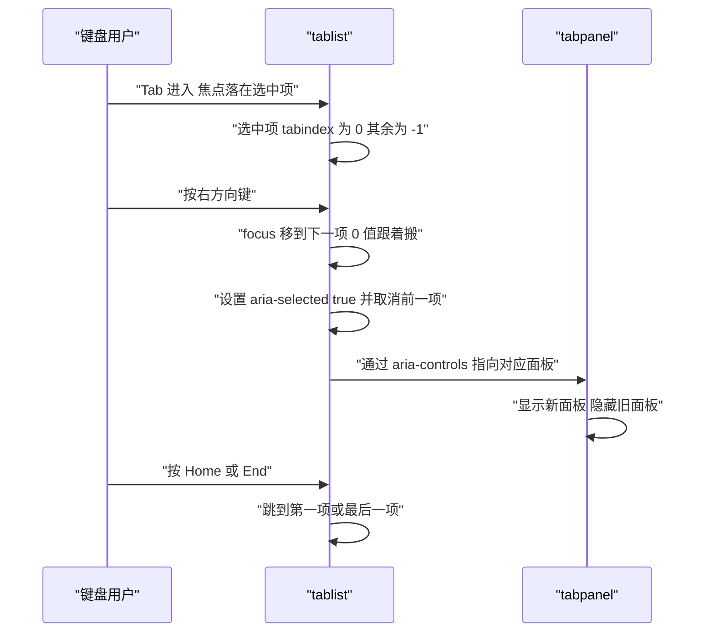

1. 用户按 Tab 进入 tablist，焦点落在当前选中项上。
2. 选中项 `tabindex="0"`，其余项 `tabindex="-1"`，整组只占一个停留点。
3. 按右方向键，焦点移到下一项，0 值同时搬过去。
4. 把新项的 `aria-selected` 设为 true，旧项设为 false。
5. 每个 tab 用 `aria-controls` 指向它的面板 id。
6. 新面板去掉 `hidden`，旧面板加上 `hidden`。
7. Home 跳到第一项，End 跳到最后一项，这是 Tabs 模式的固定键盘约定。

**一步一步来**

第 1 步：写键盘到动作的纯函数。

```js
// 根据按键和当前下标 算出目标下标
function tabTarget(key, current, count) {
  if (key === "ArrowRight") return (current + 1) % count;        // 右移循环
  if (key === "ArrowLeft") return (current - 1 + count) % count; // 左移循环
  if (key === "Home") return 0;                                  // 跳到第一项
  if (key === "End") return count - 1;                           // 跳到最后一项
  return -1;                                                     // 其他键不处理
}
```

**这段代码在做什么**

- 方向键换选中项，索引循环，首尾相接。
- Home 和 End 是 Tabs 模式要求的快捷键，方便跳到两端。
- 返回 -1 表示按键不归 Tabs 管，调用方直接忽略。
- 函数不涉及 DOM，可以穷举按键做断言。
- 纵向 Tabs 只需把按键换成 ArrowUp 与 ArrowDown，逻辑一样。

运行结果：`tabTarget("ArrowRight", 2, 3)` 返回 0。

第 2 步：把选中状态和面板显隐同步到 DOM。

```js
// 把选中项同步到 DOM 的 tabindex 与 aria-selected
function activateTab(tabs, panels, index) {
  tabs.forEach(function (tab, i) {                      // 遍历全部标签
    const selected = i === index;                       // 是否目标项
    tab.setAttribute("aria-selected", String(selected)); // 选中状态
    tab.setAttribute("tabindex", selected ? "0" : "-1"); // 0 值只给选中项
  });
  panels.forEach(function (panel, i) {                  // 遍历全部面板
    if (i === index) panel.removeAttribute("hidden");   // 目标面板显示
    else panel.setAttribute("hidden", "");              // 其余面板隐藏
  });
  tabs[index].focus();                                  // 焦点跟随选中项
}
```

**这段代码在做什么**

- `aria-selected` 用字符串 true 或 false，属性值只有这两种。
- `tabindex` 同一时刻只有一个 0，满足 roving tabindex 要求。
- 面板用 `hidden` 属性切换，而不是只改 CSS。
- `hidden` 会让面板一起退出可访问性树，读屏读不到隐藏内容。
- 最后调用 `focus()`，键盘操作后焦点必须落在新选中的标签上。

运行结果：DOM 上只有一个 `aria-selected="true"` 和一个没有 hidden 的面板。

**动手验证**

```js
// 依赖：jsdom（npm install jsdom）。Node 20+，保存为 tabs.js
const assert = require("node:assert");
const { JSDOM } = require("jsdom");

function tabTarget(key, current, count) {
  if (key === "ArrowRight") return (current + 1) % count;
  if (key === "ArrowLeft") return (current - 1 + count) % count;
  if (key === "Home") return 0;
  if (key === "End") return count - 1;
  return -1;
}

const dom = new JSDOM(`<!doctype html><div role="tablist">
  <button role="tab" id="t0" aria-selected="true" tabindex="0">全部</button>
  <button role="tab" id="t1" aria-selected="false" tabindex="-1">待办</button>
  <button role="tab" id="t2" aria-selected="false" tabindex="-1">已完成</button>
</div>
<div id="p0" role="tabpanel"></div>
<div id="p1" role="tabpanel" hidden></div>
<div id="p2" role="tabpanel" hidden></div>`);
const { document } = dom.window;
const tabs = Array.from(document.querySelectorAll("[role=tab]"));
const panels = ["p0", "p1", "p2"].map((id) => document.getElementById(id));

function activateTab(index) {
  tabs.forEach((tab, i) => {
    const selected = i === index;
    tab.setAttribute("aria-selected", String(selected));
    tab.setAttribute("tabindex", selected ? "0" : "-1");
  });
  panels.forEach((panel, i) => {
    if (i === index) panel.removeAttribute("hidden");
    else panel.setAttribute("hidden", "");
  });
  tabs[index].focus();
}

assert.strictEqual(tabTarget("ArrowRight", 2, 3), 0);
assert.strictEqual(tabTarget("ArrowLeft", 0, 3), 2);
assert.strictEqual(tabTarget("Home", 2, 3), 0);
assert.strictEqual(tabTarget("End", 0, 3), 2);
assert.strictEqual(tabTarget("Enter", 0, 3), -1);

activateTab(1);
assert.strictEqual(document.activeElement.id, "t1");                  // 焦点到位
assert.strictEqual(document.getElementById("t1").getAttribute("aria-selected"), "true");
assert.strictEqual(document.getElementById("t0").getAttribute("aria-selected"), "false");
assert.strictEqual(document.getElementById("p1").hasAttribute("hidden"), false); // 新面板显示
assert.strictEqual(document.getElementById("p0").hasAttribute("hidden"), true);  // 旧面板隐藏

console.log("选中标签:", document.activeElement.id);
console.log("面板 p1 隐藏:", document.getElementById("p1").hasAttribute("hidden"));
console.log("面板 p0 隐藏:", document.getElementById("p0").hasAttribute("hidden"));
```

预期输出：

```
选中标签: t1
面板 p1 隐藏: false
面板 p0 隐藏: true
```

**常见坑**

| 现象 | 原因 | 怎么修 |
| --- | --- | --- |
| 键盘只能停在选中的标签 | 所有 tab 都写死 `tabindex="0"` | 选中项 0，其余 -1，选中时同步搬动 |
| 面板切换后焦点掉回 body | 用 CSS 显示隐藏，没有调 `focus()` | 面板切换后聚焦新的 tab |
| 读屏读不到面板和标签的关联 | 缺 `aria-controls` 或 id 写错 | 给 tab 加 `aria-controls` 指向面板 id |

**小结**

- Tabs 由 tablist、tab、tabpanel 三个角色组成，缺一个读屏就读不明白结构。
- 方向键负责组内移动，Tab 只负责进出整组，这是 roving tabindex 的用法。
- 选中状态写 `aria-selected`，面板显隐写 `hidden`，两者必须同步。

## 7. 手写 Combobox：键盘与 aria-activedescendant

**先想一个问题**

一个城市选择框，输入“杭”弹出“杭州、杭州东站、杭州西站”。焦点始终留在输入框里，读屏却要读出当前高亮的是哪一项。

**心智模型**

!!! tip "心智模型"
    一句话模型：焦点不动，用 `aria-activedescendant` 告诉辅助技术当前操作的是哪一项。
    日常类比：遥控器对着电视，遥控器本身不动，只有屏幕上高亮的那一格在变。
    类比不成立的地方：高亮项必须在 DOM 里真实存在并有 id，虚拟列表里被删除的项无法指向。

!!! note "术语：aria-activedescendant"
    一个属性，值是一个元素 id，表示虽然焦点在输入框上，但当前交互目标是这个 id 的元素。例子：Combobox 输入框高亮第二个选项时，属性值为第二项的 id。它在 ARIA 1.2 里对 combobox 的适用条款需核对官方文档。

!!! note "术语：Combobox"
    输入框加下拉候选的复合控件，键盘在候选间移动，文字留在输入框里。例子：城市选择、搜索建议。

**图解**

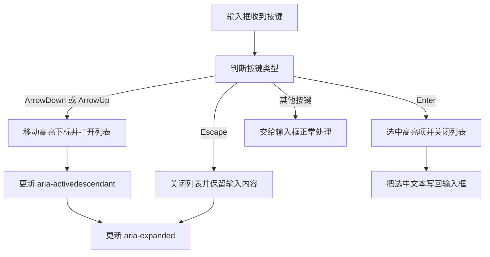

1. 输入框收到按键，先判断是不是方向键。
2. 是方向键就移动高亮下标，同时确保列表处于打开状态。
3. 不是方向键再看是不是 Enter，是就选中当前高亮项。
4. Escape 关闭列表，输入框里已输入的文字保留。
5. 其余按键交给输入框本身处理，删除、左移右移都照常。
6. 每次高亮变化都更新 `aria-activedescendant`，值指向新的选项 id。
7. 列表开合时同步 `aria-expanded`，选中后把选中文本写回输入框。

**一步一步来**

第 1 步：写高亮移动的纯函数。

```js
// 计算高亮下标 支持上下移动和循环
function activeIndex(key, current, count) {
  if (count === 0) return -1;                          // 没有候选项
  if (key === "ArrowDown") return current >= count - 1 ? 0 : current + 1;
  if (key === "ArrowUp") return current <= 0 ? count - 1 : current - 1;
  return current;                                       // 其他键保持不动
}
```

**这段代码在做什么**

- 候选项为 0 时返回 -1，表示没有可高亮的项。
- 向下到底后回到第一项，向上到顶后回到最后一项。
- 其他按键原样返回当前下标，不做任何变化。
- 高亮下标是组件自己的状态，与 DOM 焦点分开管理。
- 返回 -1 时调用方要清空 `aria-activedescendant`。

运行结果：`activeIndex("ArrowDown", 2, 3)` 返回 0。

第 2 步：把下标同步到 ARIA 属性上。

```js
// 把高亮状态同步到输入框与选项的 ARIA 属性
function syncCombobox(input, options, index) {
  const open = index >= 0;                                // 有高亮即视为打开
  input.setAttribute("aria-expanded", String(open));      // 开合状态
  if (!open) {                                            // 关闭时清空指向
    input.removeAttribute("aria-activedescendant");       // 去掉属性
    options.forEach(function (o) {                        // 遍历选项
      o.setAttribute("aria-selected", "false");           // 全部取消选中
    });
    return;                                               // 提前结束
  }
  const active = options[index];                          // 当前高亮项
  input.setAttribute("aria-activedescendant", active.id); // 指向它
  options.forEach(function (o, i) {                       // 同步选中视觉
    o.setAttribute("aria-selected", String(i === index)); // 只有高亮项为 true
  });
}
```

**这段代码在做什么**

- `aria-expanded` 表示列表开合，打开时值为 true。
- `aria-activedescendant` 的值必须是存在的元素 id，关闭时用 `removeAttribute` 清掉。
- 每个选项的 `aria-selected` 只在高亮项上为 true。
- 选项本身不接收焦点，焦点始终留在输入框。
- 关闭分支提前返回，避免继续读取不存在的选项。

运行结果：输入框的 `aria-activedescendant` 等于高亮选项的 id。

**动手验证**

```js
// 依赖：jsdom（npm install jsdom）。Node 20+，保存为 combobox.js
const assert = require("node:assert");
const { JSDOM } = require("jsdom");

function activeIndex(key, current, count) {
  if (count === 0) return -1;
  if (key === "ArrowDown") return current >= count - 1 ? 0 : current + 1;
  if (key === "ArrowUp") return current <= 0 ? count - 1 : current - 1;
  return current;
}

const dom = new JSDOM(`<!doctype html><input id="city" role="combobox" aria-expanded="false" aria-controls="list">
<ul id="list" role="listbox">
  <li id="c0" role="option" aria-selected="false">杭州</li>
  <li id="c1" role="option" aria-selected="false">杭州东站</li>
  <li id="c2" role="option" aria-selected="false">杭州西站</li>
</ul>`);
const { document } = dom.window;
const input = document.getElementById("city");
const options = Array.from(document.querySelectorAll("[role=option]"));

function syncCombobox(index) {
  const open = index >= 0;
  input.setAttribute("aria-expanded", String(open));
  if (!open) {
    input.removeAttribute("aria-activedescendant");
    options.forEach((o) => o.setAttribute("aria-selected", "false"));
    return;
  }
  input.setAttribute("aria-activedescendant", options[index].id);
  options.forEach((o, i) => o.setAttribute("aria-selected", String(i === index)));
}

assert.strictEqual(activeIndex("ArrowDown", 2, 3), 0);   // 到底循环
assert.strictEqual(activeIndex("ArrowUp", 0, 3), 2);     // 到顶循环
assert.strictEqual(activeIndex("Enter", 1, 3), 1);       // 不变

syncCombobox(activeIndex("ArrowDown", -1, 3));           // 从 -1 向下进入第一项
assert.strictEqual(input.getAttribute("aria-expanded"), "true");
assert.strictEqual(input.getAttribute("aria-activedescendant"), "c0");
assert.strictEqual(document.getElementById("c0").getAttribute("aria-selected"), "true");
assert.strictEqual(document.getElementById("c1").getAttribute("aria-selected"), "false");

syncCombobox(-1);                                        // 关闭列表
assert.strictEqual(input.getAttribute("aria-expanded"), "false");
assert.strictEqual(input.hasAttribute("aria-activedescendant"), false);
assert.strictEqual(document.getElementById("c0").getAttribute("aria-selected"), "false");

console.log("展开:", input.getAttribute("aria-expanded"));
console.log("active descendant:", input.getAttribute("aria-activedescendant"));
console.log("选项 c0 选中:", document.getElementById("c0").getAttribute("aria-selected"));
```

预期输出：

```
展开: false
active descendant: null
选项 c0 选中: false
```

**常见坑**

| 现象 | 原因 | 怎么修 |
| --- | --- | --- |
| 读屏不报高亮项 | 没设 `aria-activedescendant`，或 id 不存在 | 每次高亮都更新属性，id 与 DOM 一致 |
| 方向键把光标移到输入框末尾 | 没在 keydown 里 `preventDefault` | 处理方向键时先阻止默认行为 |
| 列表没打开就按键没反应 | `aria-expanded` 没同步，逻辑分支走错 | 高亮变化时同步开合状态 |

**小结**

- Combobox 的焦点留在输入框，高亮通过 `aria-activedescendant` 表达。
- 高亮下标与 DOM 焦点是两套状态，要分开管理再同步到属性。
- 方向键必须阻止默认行为，否则光标会跑到输入框两端。

## 8. 实时区域 aria-live：让变化被朗读

**先想一个问题**

表单提交成功后，页面顶部出现“保存成功”。视觉用户看到了，屏幕阅读器用户什么都没听到。

**心智模型**

!!! tip "心智模型"
    一句话模型：给一个长期存在的容器标记 `aria-live`，之后往里面写文字，变化会被播报。
    日常类比：门口装了一个广播喇叭，喇叭先装好，之后有事才对着它喊。
    类比不成立的地方：polite 会等用户当前朗读结束再播，assertive 会打断当前朗读，用错会干扰用户。

!!! note "术语：实时区域"
    live region，带 `aria-live` 的容器，内容变化时辅助技术自动播报。例子：购物车里的“已加入 2 件商品”提示条。

**图解**

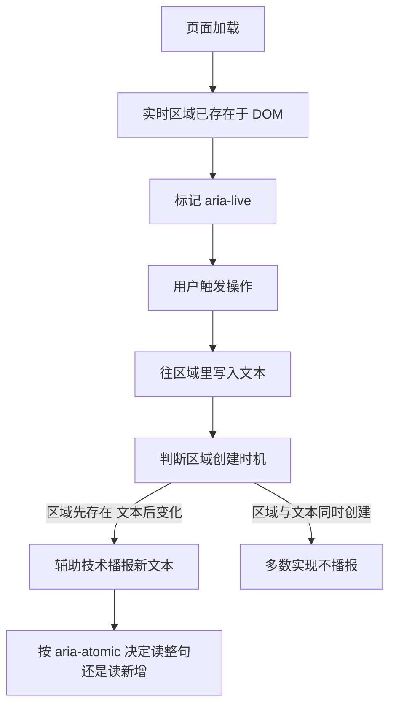

1. 实时区域必须在页面加载时就存在，此时还没内容。
2. 容器上标记 `aria-live`，polite 表示排队播报，assertive 表示立即打断。
3. 用户做了某个操作，比如点了保存。
4. 代码往区域里写文本，比如“保存成功”。
5. 判断区域是不是本来就存在，这一步决定播报会不会触发。
6. 本来就存在时辅助技术播报新文本。
7. 区域与文本在同一次渲染里创建，多数实现不会播报，因为没观察到变化。

**一步一步来**

第 1 步：把播报规则写成可断言的数据结构。

```js
// 管理一组实时区域 记录每次播报
function createLiveLog() {
  const messages = [];                                   // 播报记录
  return {
    announce: function (politeness, text) {              // 发送一条播报
      if (politeness !== "polite" && politeness !== "assertive") {
        throw new Error("politeness 只能是 polite 或 assertive"); // 拒绝非法值
      }
      if (!text) throw new Error("播报文本不能为空");      // 空文本没有意义
      messages.push({ politeness: politeness, text: text });
    },
    messages: function () { return messages.slice(); },  // 返回副本 防止外部改动
  };
}
```

**这段代码在做什么**

- `createLiveLog` 返回一个对象，内部用一个数组记录播报。
- `announce` 只接受 polite 与 assertive 两种取值，其他值直接抛错。
- 空文本抛错，避免触发一次没有内容的播报。
- `messages` 返回数组副本，调用方改不动内部状态。
- 这个模型不依赖 DOM，可以单独验证规则。

运行结果：返回对象，含 announce 与 messages 两个方法。

第 2 步：把模型接到真实容器上，区分两种礼貌级别。

```js
// 在真实 DOM 上写文本 并保持区域长期存在
function renderLive(region, text) {
  if (!region.isConnected) throw new Error("实时区域必须已在文档中"); // 先检查在不在
  region.textContent = text;                           // 写入新文本
}

// 两个区域的语义由 role 决定 写 role 就够
const statusRole = "status";                           // 隐含 polite
const alertRole = "alert";                             // 隐含 assertive
```

**这段代码在做什么**

- `isConnected` 检查区域是否已经挂在文档上，没挂上就报错。
- `textContent` 直接替换内容，辅助技术观察到变化后播报。
- `role="status"` 隐含 polite，`role="alert"` 隐含 assertive。
- 两个区域写在页面模板里，不随内容创建和销毁。
- 报错信息写明原因，方便定位是谁把区域提前删了。

运行结果：写文本后区域内容变化，辅助技术排队或立即播报。

**动手验证**

```js
// 依赖：jsdom（npm install jsdom）。Node 20+，保存为 live.js
const assert = require("node:assert");
const { JSDOM } = require("jsdom");

function createLiveLog() {
  const messages = [];
  return {
    announce(politeness, text) {
      if (politeness !== "polite" && politeness !== "assertive") throw new Error("非法礼貌级别");
      if (!text) throw new Error("空文本");
      messages.push({ politeness, text });
    },
    messages() { return messages.slice(); },
  };
}

const dom = new JSDOM(`<!doctype html>
<div id="status" role="status" aria-live="polite"></div>
<div id="alert" role="alert" aria-live="assertive"></div>`);
const { document } = dom.window;

const log = createLiveLog();
log.announce("polite", "已加入 2 件商品");
log.announce("assertive", "库存不足");
assert.strictEqual(log.messages().length, 2);
assert.strictEqual(log.messages()[0].politeness, "polite");
assert.strictEqual(log.messages()[1].text, "库存不足");
assert.throws(() => log.announce("loud", "x"), /非法礼貌级别/);  // 非法级别
assert.throws(() => log.announce("polite", ""), /空文本/);       // 空文本

const region = document.getElementById("status");
assert.strictEqual(region.getAttribute("aria-live"), "polite");
assert.strictEqual(region.isConnected, true);                    // 区域已在文档中
region.textContent = "已加入 2 件商品";
assert.strictEqual(region.textContent, "已加入 2 件商品");

console.log("播报条数:", log.messages().length);
console.log("第一条:", log.messages()[0].text);
console.log("status 文本:", region.textContent);
```

预期输出：

```
播报条数: 2
第一条: 已加入 2 件商品
status 文本: 已加入 2 件商品
```

**常见坑**

| 现象 | 原因 | 怎么修 |
| --- | --- | --- |
| 提示出现了但没有播报 | 区域和文本在同一次渲染里创建 | 区域写在模板里常驻，只改它的文本 |
| 读屏被打断得很频繁 | 大量使用 assertive | 普通提示用 polite，只有紧急信息用 assertive |
| 只播报新增词听不出全句 | `aria-atomic` 默认 false | 需要整句重读时设 `aria-atomic="true"` |

**小结**

- 实时区域要先存在，内容后变化，顺序反了就不会播报。
- polite 排队、assertive 打断，日常提示默认用 polite。
- `aria-atomic` 决定重读整块还是只读新增部分，需要确认再设。

## 9. WCAG 对比度与目标尺寸

**先想一个问题**

你把浅灰文字放在白底上，设计稿看着能认。用户在户外阳光下打开，文字像消失了一样。

**心智模型**

!!! tip "心智模型"
    一句话模型：对比度是亮度的比值，先算相对亮度再套公式，比值达到门槛才算合格。
    日常类比：黑纸白字像白天开车开大灯，灰字白底像白天开车不开灯，看不看得清由亮度差决定。
    类比不成立的地方：对比度只衡量颜色，字号与字重由另一条规则管，大字号的门槛更低。

!!! note "术语：相对亮度"
    relative luminance，把 sRGB 三通道线性化后按人眼敏感度加权的值，范围 0 到 1。例子：纯黑是 0，纯白是 1。

!!! note "术语：WCAG"
    Web Content Accessibility Guidelines，W3C 发布的无障碍标准，条款分 A、AA、AAA 三级。例子：对比度 4.5 比 1 属于 AA 级要求。

**图解**

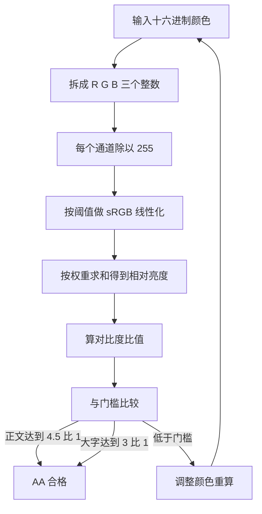

1. 把 `#ffffff` 这样的十六进制串拆成 R、G、B 三个 0 到 255 的整数。
2. 每个通道除以 255，归一化到 0 到 1。
3. 按 sRGB 的线性化公式处理，小于阈值走除法，大于阈值走幂运算。
4. 三个通道分别乘以 0.2126、0.7152、0.0722 再相加，得到相对亮度 L。
5. 两个颜色的 L 中较大的加 0.05 做分子，较小的加 0.05 做分母，相除得到比值。
6. 正文文字门槛是 4.5 比 1，大字号是 3 比 1，这是 WCAG AA 级的要求。
7. 没到门槛就回到第 1 步改颜色，重新走一遍。

**一步一步来**

第 1 步：实现 sRGB 线性化与相对亮度。

```js
// 单个通道线性化
function linearize(channel) {
  const c = channel / 255;                       // 归一化到 0 到 1
  return c <= 0.03928                          // 小值走线性段
    ? c / 12.92                                // 除以 12.92
    : Math.pow((c + 0.055) / 1.055, 2.4);      // 大值走幂运算
}

// 相对亮度
function luminance(rgb) {
  const r = linearize(rgb[0]);                   // 红通道
  const g = linearize(rgb[1]);                   // 绿通道
  const b = linearize(rgb[2]);                   // 蓝通道
  return 0.2126 * r + 0.7152 * g + 0.0722 * b;   // 按人眼敏感度加权
}
```

**这段代码在做什么**

- `channel / 255` 把 0 到 255 映射到 0 到 1。
- 阈值 0.03928 以下近似为线性关系，直接除以 12.92。
- 阈值以上走 2.4 次幂，这是 sRGB 的标准曲线。
- 三个权重相加为 1，绿色权重最高，因为人眼对绿色更敏感。
- 阈值取值需核对官方文档，WCAG 2.x 不同修订里出现过 0.03928 与 0.04045 两种写法。

运行结果：`luminance([255, 255, 255])` 返回 1。

第 2 步：用亮度算对比度并判断是否达标。

```js
// 解析十六进制颜色
function hexToRgb(hex) {
  const s = hex.replace("#", "");                // 去掉井号
  if (s.length !== 6) throw new Error("只支持六位十六进制"); // 拒绝其他写法
  return [0, 2, 4].map(function (i) {            // 每两位一组
    return parseInt(s.slice(i, i + 2), 16);      // 按十六进制解析
  });
}

// 对比度比值
function contrastRatio(a, b) {
  const la = luminance(a);                       // 颜色 a 的亮度
  const lb = luminance(b);                       // 颜色 b 的亮度
  const hi = Math.max(la, lb);                   // 亮的那个
  const lo = Math.min(la, lb);                   // 暗的那个
  return (hi + 0.05) / (lo + 0.05);              // 加 0.05 防止除零
}
```

**这段代码在做什么**

- `hexToRgb` 只接受六位写法，三位简写直接报错，避免解析错位。
- 每两位一组解析成十进制，得到 R、G、B。
- 对比度公式固定为亮的加 0.05 除以暗的加 0.05。
- 加 0.05 是为了在纯黑对纯黑时避免除零，同时让比值上限停在 21。
- 返回浮点数，比较时用容差或先四舍五入，不要用严格相等。

运行结果：`contrastRatio([0, 0, 0], [255, 255, 255])` 返回 21。

第 3 步：检查可点击热区是否达到最小尺寸。

```js
// 判断一个点击热区是否达到 WCAG 2.2 最小目标尺寸
function meetsTargetSize(width, height, enhanced) {
  const min = enhanced ? 44 : 24;              // 增强级门槛 44 像素
  return width >= min && height >= min;        // 宽高都要达标
}
```

**这段代码在做什么**

- WCAG 2.2 的 2.5.8 最小目标尺寸是 24 乘 24 CSS 像素。
- 2.5.5 增强级是 44 乘 44 CSS 像素。
- 宽高都要达标，只有一边达标不算通过。
- 传入的是热区尺寸，包含 padding，不是图标本身的宽高。
- 条款编号与 px 换算需核对 WCAG 2.2 官方文档，避免记错。

运行结果：`meetsTargetSize(24, 24, false)` 返回 true。

**动手验证**

```js
// 依赖：无。Node 20+，保存为 contrast.js
const assert = require("node:assert");

function linearize(channel) {
  const c = channel / 255;
  return c <= 0.03928 ? c / 12.92 : Math.pow((c + 0.055) / 1.055, 2.4);
}
function luminance(rgb) {
  return 0.2126 * linearize(rgb[0]) + 0.7152 * linearize(rgb[1]) + 0.0722 * linearize(rgb[2]);
}
function hexToRgb(hex) {
  const s = hex.replace("#", "");
  if (s.length !== 6) throw new Error("只支持六位十六进制");
  return [0, 2, 4].map((i) => parseInt(s.slice(i, i + 2), 16));
}
function contrastRatio(a, b) {
  const la = luminance(a), lb = luminance(b);
  return (Math.max(la, lb) + 0.05) / (Math.min(la, lb) + 0.05);
}
function round2(n) { return Math.round(n * 100) / 100; }   // 保留两位 规避浮点误差
function meetsTargetSize(width, height, enhanced) {
  const min = enhanced ? 44 : 24;
  return width >= min && height >= min;
}

assert.ok(Math.abs(luminance([255, 255, 255]) - 1) < 1e-9); // 纯白亮度接近 1
assert.strictEqual(luminance([0, 0, 0]), 0);                // 纯黑亮度为 0
assert.strictEqual(round2(contrastRatio(hexToRgb("#000000"), hexToRgb("#ffffff"))), 21);
assert.strictEqual(round2(contrastRatio(hexToRgb("#767676"), hexToRgb("#ffffff"))), 4.54);
assert.strictEqual(round2(contrastRatio(hexToRgb("#777777"), hexToRgb("#ffffff"))), 4.48);
assert.strictEqual(contrastRatio(hexToRgb("#767676"), hexToRgb("#ffffff")) >= 4.5, true);
assert.strictEqual(contrastRatio(hexToRgb("#777777"), hexToRgb("#ffffff")) >= 4.5, false);
assert.strictEqual(meetsTargetSize(24, 24, false), true);
assert.strictEqual(meetsTargetSize(23, 24, false), false);
assert.strictEqual(meetsTargetSize(44, 44, true), true);

console.log("黑对白:", round2(contrastRatio(hexToRgb("#000000"), hexToRgb("#ffffff"))));
console.log("767676 对白:", round2(contrastRatio(hexToRgb("#767676"), hexToRgb("#ffffff"))));
console.log("777777 对白:", round2(contrastRatio(hexToRgb("#777777"), hexToRgb("#ffffff"))));
console.log("24 像素热区:", meetsTargetSize(24, 24, false));
```

预期输出：

```
黑对白: 21
767676 对白: 4.54
777777 对白: 4.48
24 像素热区: true
```

**常见坑**

| 现象 | 原因 | 怎么修 |
| --- | --- | --- |
| 文字对背景测出 4.4 比 1 | 忽略了半透明背景叠加 | 先把背景与透明度合成为不透明色再算 |
| 图标按钮点不中 | 可点击热区小于 24 像素 | 用 padding 或伪元素把热区扩到 24 像素以上 |
| 用严格相等比较比值 | 浮点误差导致断言偶发失败 | 保留两位小数或用容差比较 |

**小结**

- 相对亮度先把通道归一化再线性化，最后按 0.2126、0.7152、0.0722 加权。
- 对比度是亮度比，正文门槛 4.5 比 1，大字号门槛 3 比 1。
- 目标尺寸看的是可点击热区，不是视觉图形本身的宽高。

## 10. 验证：用 DOM 断言检查无障碍实现

**先想一个问题**

你改了样式，顺手把 `aria-expanded` 的更新删掉了，浏览器看起来一切正常，测试也全绿。上线后读屏用户报错。

**心智模型**

!!! tip "心智模型"
    一句话模型：把无障碍属性当成接口契约，用断言锁住，属性变了测试就红。
    日常类比：验收房子时量墙面垂直度，不是靠肉眼看，是靠尺子读数。
    类比不成立的地方：DOM 断言只能查属性与焦点，查不到实际朗读效果，真机读屏测试仍要做。

!!! note "术语：DOM 断言"
    对 `document` 上元素的属性、文本、焦点位置做程序化检查。例子：`assert.strictEqual(document.activeElement.id, "t1")`。

**图解**

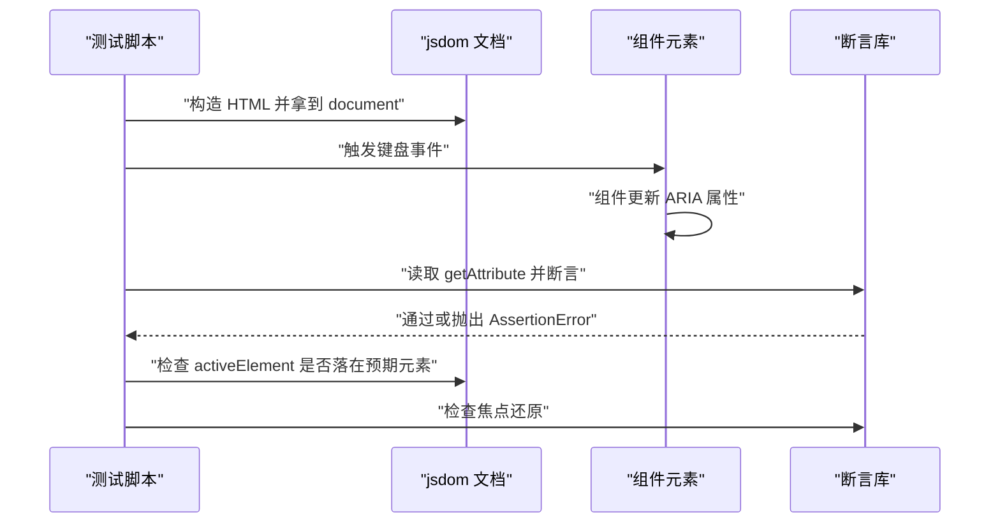

1. 测试脚本用 jsdom 构造一段 HTML，拿到 `document`。
2. 脚本在元素上派发键盘事件，模拟真实按键。
3. 组件的事件处理函数更新 `aria-selected`、`aria-expanded` 这类属性。
4. 脚本用 `getAttribute` 读回属性值，交给断言库判断。
5. 断言通过就继续，失败会抛出 `AssertionError` 让测试中断。
6. 再检查 `document.activeElement`，确认焦点落点正确。
7. 关闭弹层后再检查一次焦点，确认还原给了触发按钮。

**一步一步来**

第 1 步：写一个查询辅助函数，把常用断言收在一起。

```js
// 读取属性并断言 减少重复代码
function assertAttr(document, selector, name, expected) {
  const el = document.querySelector(selector);        // 找元素
  if (!el) throw new Error("找不到元素: " + selector); // 找不到就报错
  const actual = el.getAttribute(name);               // 读属性值
  if (actual !== expected) {                          // 值不符就抛错
    throw new Error(selector + " 的 " + name + " 期望 " + expected + " 实际 " + actual);
  }
  return el;                                          // 返回元素便于复用
}
```

**这段代码在做什么**

- 先查元素，找不到直接抛错，错误信息带上选择器。
- 读属性值后与期望值比较，不一致时抛出含实际值的信息。
- 错误信息包含选择器、属性名、期望值、实际值，定位问题不用猜。
- 返回元素，调用方可以接着对它做别的断言。
- 这个函数只做一件事，测试意图写在调用处。

运行结果：通过时返回元素，失败时抛出带上下文的错误。

第 2 步：把组件行为和断言串起来，覆盖打开、操作、关闭三个阶段。

```js
// 覆盖一组 tab 的焦点与选中状态
function checkTabs(document) {
  const tabs = document.querySelectorAll("[role=tab]");                 // 收集标签
  const selected = document.querySelectorAll('[aria-selected="true"]'); // 选中项
  if (selected.length !== 1) throw new Error("选中的 tab 必须恰好一个"); // 唯一性
  const zero = Array.from(tabs).filter(function (t) {                   // 统计 0 值
    return t.getAttribute("tabindex") === "0";
  });
  if (zero.length !== 1) throw new Error("tabindex 为 0 的 tab 必须恰好一个");
  if (document.activeElement.getAttribute("role") !== "tab") {          // 焦点在标签上
    throw new Error("焦点应落在 tab 元素上");
  }
}
```

**这段代码在做什么**

- 选中项必须恰好一个，零个或多个都说明状态同步有 bug。
- `tabindex="0"` 也必须恰好一个，这是 roving tabindex 的前提。
- 焦点应落在 tab 角色元素上，键盘操作后焦点不能掉到 body。
- 检查项都是返回值能直接判断的，不依赖视觉。
- 断言写成抛错，能配合任意测试框架。

运行结果：全部满足时无输出，任一不满足时抛出说明性错误。

**动手验证**

把 Tabs 与 Modal 的组合场景放在一个脚本里，覆盖焦点进入、陷阱循环、Esc 关闭与焦点还原。

```js
// 依赖：jsdom（npm install jsdom）。Node 20+，保存为 verify-a11y.js
const assert = require("node:assert");
const { JSDOM } = require("jsdom");

function nextFocusIndex(count, current, shift) {
  if (count === 0) return -1;
  if (shift) return current <= 0 ? count - 1 : current - 1;
  return current >= count - 1 ? 0 : current + 1;
}

const dom = new JSDOM(`<!doctype html><body>
<button id="open">打开设置</button>
<div id="dialog" role="dialog" aria-modal="true" aria-labelledby="title" hidden>
  <h2 id="title">设置</h2>
  <button id="ok" data-focusable>确定</button>
  <button id="cancel" data-focusable>取消</button>
</div></body>`);
const { document } = dom.window;
const trigger = document.getElementById("open");
const dialog = document.getElementById("dialog");
let lastFocused = null;

function openDialog() {
  lastFocused = document.activeElement;      // 记录触发元素
  dialog.removeAttribute("hidden");          // 显示对话框
  document.getElementById("ok").focus();     // 焦点进入对话框
}
function closeDialog() {
  dialog.setAttribute("hidden", "");         // 隐藏对话框
  if (lastFocused) lastFocused.focus();      // 焦点还原
}

dialog.addEventListener("keydown", (e) => {
  if (e.key === "Escape") { e.preventDefault(); closeDialog(); return; }
  if (e.key !== "Tab") return;
  const list = Array.from(dialog.querySelectorAll("[data-focusable]"));
  const current = list.indexOf(document.activeElement);
  const next = nextFocusIndex(list.length, current, e.shiftKey);
  if (next !== -1) { e.preventDefault(); list[next].focus(); }
});

trigger.focus();
assert.strictEqual(document.activeElement.id, "open");
openDialog();
assert.strictEqual(dialog.hasAttribute("hidden"), false);
assert.strictEqual(document.activeElement.id, "ok");            // 焦点进入
assert.strictEqual(dialog.getAttribute("aria-modal"), "true");
assert.strictEqual(dialog.getAttribute("aria-labelledby"), "title");

dialog.dispatchEvent(new dom.window.KeyboardEvent("keydown", { key: "Tab", bubbles: true }));
assert.strictEqual(document.activeElement.id, "cancel");        // 正向下一个
dialog.dispatchEvent(new dom.window.KeyboardEvent("keydown", { key: "Tab", bubbles: true }));
assert.strictEqual(document.activeElement.id, "ok");            // 末尾回到开头

dialog.dispatchEvent(new dom.window.KeyboardEvent("keydown", { key: "Escape", bubbles: true }));
assert.strictEqual(dialog.hasAttribute("hidden"), true);        // 已关闭
assert.strictEqual(document.activeElement.id, "open");          // 焦点还原

console.log("对话框隐藏:", dialog.hasAttribute("hidden"));
console.log("焦点还原到:", document.activeElement.id);
console.log("aria-modal:", dialog.getAttribute("aria-modal"));
```

预期输出：

```
对话框隐藏: true
焦点还原到: open
aria-modal: true
```

**常见坑**

| 现象 | 原因 | 怎么修 |
| --- | --- | --- |
| 测试里键盘事件没触发处理函数 | 事件没设 `bubbles: true`，没冒泡到容器 | 派发时加 `bubbles: true` |
| 焦点断言一直失败 | jsdom 里元素没有 tabindex 或不是表单控件 | 给元素补 `tabindex` 或换成 button、input |
| 断言通过但真机读屏仍报错 | DOM 断言查不到语音输出顺序 | 保留手动真机测试，断言只做回归保护 |

**小结**

- DOM 断言把 ARIA 属性当成契约，属性改动会立刻让测试变红。
- 断言要覆盖三个时刻：打开、操作中、关闭并还原焦点。
- 断言能挡住回归，但替代不了真机读屏测试。

## 综合对比

| 对比对象 | 语义来源 | 键盘行为 | 焦点处理 | 需要自己写的部分 |
| --- | --- | --- | --- | --- |
| 原生 `<button>` | HTML 隐式角色 button | 空格与回车自动触发 click | 默认进入 Tab 顺序 | 无 |
| `div role="button"` | 显式 role 属性 | 无，需自己监听 keydown | 需手动加 `tabindex="0"` | keydown、click、焦点样式 |
| 原生 `<dialog>` 加 `showModal()` | 隐式角色 dialog | Esc 关闭自带 | 焦点陷阱与还原自带 | 背景滚动锁定，支持范围需核对官方文档 |
| 手写 Modal | 显式 role dialog 加 `aria-modal` | Esc 需自己监听 | 陷阱与记录还原全部自己写 | 首尾循环、背景 `aria-hidden` |
| 原生 `<select>` | 隐式角色 combobox 或 listbox | 方向键与字母查找自带 | 浏览器管理 | 无，但选项渲染不可定制 |
| 手写 Combobox | role combobox 加 listbox | 方向键、Enter、Esc 自己写 | 焦点留在输入框 | `aria-activedescendant` 同步 |
| 原生 `<input type="checkbox">` | HTML 隐式角色 checkbox | 空格自带切换 | 默认进入 Tab 顺序 | 无 |
| roving tabindex 组 | 各成员自己的角色 | 方向键自己写 | 组内只有一个 0 值 | 搬动 0 值与 `focus()` |

WCAG 门槛补充数据如下。

| 检查项 | 条款名 | AA 门槛 | AAA 门槛 | 测量对象 |
| --- | --- | --- | --- | --- |
| 正文对比度 | Contrast (Minimum) | 4.5 比 1 | 7 比 1 | 文字与背景 |
| 大字号对比度 | Contrast (Minimum) | 3 比 1 | 4.5 比 1 | 18 点或 14 点加粗文字 |
| 目标尺寸 | Target Size | 24 乘 24 CSS 像素 | 44 乘 44 CSS 像素 | 可点击热区 |

条款编号与点值到像素的换算需核对 WCAG 2.2 官方文档。

## 应用与行业实践

### 应用场景地图

| 场景 | 用到本页哪个知识点 | 典型技术选型 | 注意事项 |
| --- | --- | --- | --- |
| 后台管理的万行表格 | roving tabindex、焦点管理 | React、TanStack Virtual、Playwright | 虚拟滚动会让屏幕外的行离开可访问性树，要另给"跳到某行"的入口 |
| 低端安卓的首屏加载 | DOM 到可访问性树的映射、ARIA 使用原则 | 原生 HTML、Lighthouse、Chrome DevTools Performance | 减少节点不能靠 aria-hidden 删掉可交互元素，那是把功能一起删了 |
| 多人协作白板 | 实时区域 aria-live、焦点管理 | Canvas、WebSocket、role="status" | 光标级事件不播报，只播报加入、锁定、评论这类需要知道的事 |
| 电商结算页的表单校验 | 可访问名称的计算顺序、WCAG 对比度 | 原生 form 元素、错误摘要模式 | 出错后把焦点移到摘要，摘要每条要链接到对应字段并带上字段名 |
| 企业后台的多步向导 | Modal 焦点陷阱与 Esc、可访问名称 | `<dialog>`、Radix Primitives | 原生 showModal 已做背景惰性化，自写陷阱要与它的行为对齐 |
| 移动端底部标签栏 | Tabs 方向键、aria-selected | 原生 button、roving tabindex | 触控目标不小于 24×24 CSS 像素，图标旁要有文字标签 |
| 搜索框的联想下拉 | Combobox、aria-activedescendant | APG Combobox 模式、React | 焦点留在输入框，用 activedescendant 指选项，结果条数要播报 |
| 数据看板的定时刷新 | aria-live | role="status"、aria-live="polite" | 高频刷新要合并成一次播报，避免打断用户正在听的内容 |

### 三个场景拆解

#### 场景 1：后台管理的万行表格

**业务背景**：订单列表或日志表一次要展示上万行，滚动和 Tab 键遍历都会卡住。用键盘的用户按一次 Tab，要么跳过一个格子，要么在几千个格子间走完全程。

**怎么用本页知识解决**：思路是让整个表格在 Tab 序列里只占一个位置，进表之后交给方向键。这样屏幕阅读器读到的顺序和视觉顺序一致，Tab 也不会失控。

```js
// 表格用 role="grid"，所有格子初始 tabindex="-1"，只留一个入口
let active = 0;                                   // 当前唯一在 Tab 序列里的格子
const cells = [...grid.querySelectorAll('[role="gridcell"]')];
const cols = columnCount;                         // 列数，决定上下移动的步长
cells[active].tabIndex = 0;                       // 整个表格在 Tab 序列里的唯一落点

grid.addEventListener('keydown', (e) => {
  const step = { ArrowRight: 1, ArrowLeft: -1,
                 ArrowDown: cols, ArrowUp: -cols }[e.key]; // 四方向换算成索引步长
  if (!step) return;                              // 其它按键交回浏览器处理
  e.preventDefault();                             // 方向键不再滚动页面
  const next = Math.min(Math.max(active + step, 0), cells.length - 1); // 夹住边界
  cells[active].tabIndex = -1;                    // 旧格子移出 Tab 序列
  cells[next].tabIndex = 0;                       // 新格子进入 Tab 序列
  cells[next].focus();                            // 焦点移动，屏幕阅读器跟着读
  active = next;
});
```

- `tabIndex` 的加减是 roving tabindex 的全部机制，焦点跟着 `focus()` 走。
- `preventDefault` 必须写，否则方向键会先滚动页面容器。
- 边界用 `Math.min/Math.max` 夹住，跨行移动需要在列首列尾单独处理。
- 虚拟滚动下 `cells` 只包含当前窗口里的格子，索引要映射到真实行号。
- 行首行尾的 Home/End、翻页键按同一套索引换算补上。

**怎么度量收益**：用 Playwright 断言"同一时刻只有一个格子 tabindex=0"。用 axe-core 记录改前改后的 violation 条数。用 Chrome DevTools Performance 面板录制滚动，数 Long Task 条数。用 DevTools 的 Accessibility 面板核对屏幕外行是否真的不在树里。

**什么时候不该用**：
- 表格总行数少到一次渲染不产生长任务，引入虚拟滚动只增加维护成本。
- 用户需要 Ctrl+F 在整表内查找时，虚拟滚动会让未渲染的行搜不到，必须另做搜索入口。

#### 场景 2：多人协作白板

**业务背景**：白板上多人同时操作，远端用户的加入、元素锁定、评论都靠视觉提示。用屏幕阅读器的用户看不到这些变化，只能反复手工探索画布。

**怎么用本页知识解决**：给状态变化建一个常驻的 live region，按事件类型筛选，同一时间窗内的事件合并成一次播报。焦点不主动抢，让用户自己决定什么时候去看。

```js
// live region 必须在页面加载时就存在，动态插入的元素不会触发朗读
const status = document.createElement('p');
status.setAttribute('role', 'status');    // role=status 隐含 polite
status.setAttribute('aria-live', 'polite');
document.body.appendChild(status);

let pending = [];
let timer = 0;
function announce(text) {
  pending.push(text);                     // 同一窗口内的多条事件先入队
  clearTimeout(timer);
  timer = setTimeout(() => {
    status.textContent = pending.join('；'); // 一次写入，触发一次朗读
    pending = [];
  }, 500);                                // 合并窗口自行实测后调整
}

socket.addEventListener('message', (e) => {
  const msg = JSON.parse(e.data);
  if (msg.type === 'member-joined') announce('有人加入协作'); // 只播报需要知道的事件
  if (msg.type === 'cursor-moved') return;                    // 光标移动不播报
});
```

- live region 常驻 DOM 是前提，节点必须在变化发生前就存在。
- `role="status"` 与 `aria-live="polite"` 同时写，意图更清楚。
- 合并窗口把连续事件压成一句，避免朗读被反复打断。
- 播报内容写"谁做了什么"，不要写坐标和像素值。
- 评论这类需要处理的信息用 `role="alert"` 或把焦点移过去，不要只用 polite。

**怎么度量收益**：用 Playwright 监听 DOM 变化，统计单位时间内的 live region 写入次数。用屏幕阅读器手动跑一遍协作流程，记录需要重新探索画布的次数。用 axe-core 检查 live region 是否存在且非空。

**什么时候不该用**：
- 画布内容全量播报会把有用信息埋掉，应另外提供结构化的大纲视图。
- 纯装饰性的动效和他人光标轨迹不要进 live region，那会持续占用朗读通道。

#### 场景 3：低端安卓的首屏加载

**业务背景**：低价安卓机上首屏渲染慢，DOM 节点越多，浏览器构建可访问性树的成本越高。节点里混着装饰图标和纯布局 div 时，屏幕阅读器用户听到的也是噪声。

**怎么用本页知识解决**：先把可访问性树的节点数当成可测量的预算，用基线测量定上限，再逐项清理。清理的原则是留下可交互元素，去掉不承载语义的节点。

```js
// 装饰图标不进可访问性树，可交互元素必须留在树里
// <svg aria-hidden="true" focusable="false"></svg>                装饰性图标
// <button aria-expanded="false" aria-controls="panel">筛选</button> 原生语义

// 用 Playwright 的 aria snapshot 测量首屏可访问性树的规模
const snap = await page.locator('body').ariaSnapshot(); // 整页可访问性快照
const nodes = snap.split('\n').filter((l) => l.trim()); // 一行对应一个节点
const budget = baseline;                                // 上限取基线测量值
expect(nodes.length).toBeLessThan(budget);              // 超过就说明新增了噪声节点

// 同时断言交互元素没被误删出树
await expect(page.getByRole('button', { name: '筛选' })).toBeVisible();
```

- `aria-hidden="true"` 只给装饰元素，给可交互元素等于把它从树里删掉。
- 用原生 `button` 代替 `div` 加 role、tabindex、键盘补丁，代码量和节点数一起降。
- `ariaSnapshot` 的输出行数可以当作回归门槛，基线由自己项目的测量决定。
- 节点数下降不等于朗读体验变好，还要断言关键控件的可访问名称非空。
- 首屏之外的组件延迟挂载，也在减少首屏构建可访问性树的输入。

**怎么度量收益**：用 Playwright 的 aria snapshot 行数做回归指标。用 Lighthouse 的 Accessibility 分类看审计项结果。用 Chrome DevTools Performance 的 Long Tasks 和脚本求值时长看渲染成本。用 axe-core 的 violation 条数看语义错误。

**什么时候不该用**：
- 为了压节点数把交互元素设成 `aria-hidden="true"`，用户会彻底操作不到它。
- 把需要被读到的说明文字用 `display:none` 藏起来，屏幕阅读器同样读不到。

### 行业先进实践

**APG 的 Combobox 模式（出处：W3C WAI-ARIA Authoring Practices Guide）**
APG 把 combobox 的 `aria-expanded`、`aria-controls`、`aria-activedescendant` 用法和键盘行为逐条列出。把这份键盘行为表直接抄成测试用例，能覆盖只靠人工点测容易漏掉的边界。你的项目可以在实现前先读该模式，再写断言。

**GOV.UK Design System 的错误摘要（出处：GOV.UK Design System）**
表单校验失败后，焦点移到页面顶部的错误摘要，摘要里每条链接到对应字段。焦点移动让键盘与屏幕阅读器用户立刻得知提交失败，不必自己往下找。你的项目可以把错误摘要做成表单的固定组成部分，而不是把错误文案塞在字段下方。

**Radix Primitives 的 RovingFocus（出处：开源项目 Radix UI Primitives）**
该组件把 roving tabindex 的方向键、Home/End、循环与否做成可组合的抽象。自己写这套逻辑时，边界与列数换算是出错集中的地方。你的项目若已在用同类无障碍原语，可以把方向键逻辑交给它，只保留断言。

**axe-core 与 @axe-core/playwright 的 CI 检查（出处：开源项目 axe-core）**
axe-core 提供可在测试中调用的规则集，能在流水线里对渲染后的页面跑检查。它能发现的是一部分语义与结构问题，键盘顺序和朗读体验仍需人工验证。你的项目可以把 violation 条数设为门禁，历史存量先进允许清单并注明原因。

**WCAG 2.2 的成功准则 2.5.8 Target Size (Minimum)（出处：W3C WCAG 2.2）**
该准则要求指针目标不小于 24×24 CSS 像素，并给出间距等例外条款。把 24×24 写进设计令牌的下限，可以在设计阶段挡掉一部分触控目标过小的问题。你的项目可以把它与对比度门槛一起放进组件的验收清单。

### 从学到用：落地路线

**第 1 步 试点**：挑一个已有自动化测试的交互组件，先给它加键盘路径断言。
验收标准：故意破坏实现后，该断言必须失败。

**第 2 步 验证**：在试点组件上跑 axe-core 与 Playwright 的 aria snapshot，把结果写成基线。
验收标准：基线数字提交进仓库，后续改动不能让它变差。

**第 3 步 推广**：把断言模板与检查清单复制到同类的交互组件，纳入组件的完成定义。
验收标准：组件库中每个交互组件都带键盘测试与可访问名称断言。

**第 4 步 防回退**：把违规数设为流水线门禁，并按固定周期做人工复测。
验收标准：违规数超阈值时流水线失败；每季度用屏幕阅读器手动走一遍主流程并记录结论。

### 动手作业

**目标**：把一个订单列表改造成键盘可用、可被 DOM 断言验证的组件，覆盖表格导航、Modal 详情、实时状态播报三块。

**步骤**：
1. 建立基线：用 Playwright 的 aria snapshot 记录改造前的可访问性树，用 axe-core 记录 violation 条数。
2. 明确结构：确定表格用原生 `<table>` 还是 `role="grid"`，为每列写出可访问名称并从表头取得。
3. 实现导航：用 roving tabindex 让方向键在单元格间移动，Home/End 跳到行首行尾。
4. 加详情：行内按钮打开 Modal，实现焦点陷阱、Esc 关闭，关闭后焦点回到触发按钮。
5. 加播报：筛选结果条数变化时用 `role="status"` 播报，连续变化合并成一次。
6. 检查尺寸与对比度：用对比度公式算正文与按钮文字的比值，核对触控目标尺寸。
7. 提交测试：把上述断言并入测试套件，并逐个验证断言确实会失败。

**验收标准**：
- 全程只用键盘能从筛选框走到任意一行、打开详情、关闭并回到原按钮，焦点落点可预测。
- 每条断言在人为破坏实现后都会失败，破坏点写在测试注释里。
- 文字与背景的对比度达到 WCAG AA 门槛，触控目标不小于 24×24 CSS 像素。
- axe-core 的 violation 为 0，或全部进允许清单并注明原因。
- 可访问性树中每个可交互元素都有非空的可访问名称。

## 深入阅读与参考

!!! tip "怎么用这些资料"
    先读「官方文档与规范」建立准确的概念，再读「源码与示例」核对细节，最后用「教程、书籍与视频」换一种讲法加深理解。每条都写明了读哪一节、带着什么问题读。

### 官方文档与规范

| 资源 | 为什么读 | 怎么读 |
|---|---|---|
| [MDN HTML 元素参考](https://developer.mozilla.org/en-US/docs/Web/HTML/Element) | 按分类浏览语义元素及其隐式 ARIA 角色，减少错误 ARIA。 | 重点看表单、按钮、对话框元素，记下其角色与键盘行为。 |
| [MDN DOM 概述](https://developer.mozilla.org/en-US/docs/Web/API/Document_Object_Model) | 理解 DOM 树是理解可访问性树的基础。 | 读节点、元素、文档接口，在控制台遍历一棵 DOM 树。 |

### 源码与示例

| 资源 | 为什么读 | 怎么读 |
|---|---|---|
| [WAI-ARIA Authoring Practices](https://www.w3.org/WAI/ARIA/apg/) | W3C 官方模式库，含对话框、选项卡、组合框的可运行示例。 | 对照 Modal、Tabs、Combobox 示例，用键盘走一遍，再改自己的实现。 |

### 教程、书籍与视频

| 资源 | 为什么读 | 怎么读 |
|---|---|---|
| [A11y Weekly](https://www.a11yweekly.com/) | 可访问性专题周刊，每期做一次键盘与读屏测试。 | 订阅后每周挑一个组件，做键盘与读屏测试并记录问题。 |
| [web.dev Learn HTML](https://web.dev/learn/html) | 按章节读并在 CodePen 重做示例，加可访问性检查。 | 重点读表单与语义章节，重做示例并用 axe 检查。 |
| [网道 Web API 教程](https://wangdoc.com/webapi/) | 中文 Web API 教程，练习写不依赖框架的小组件。 | 读 DOM 章节后，实现一个可访问的 Tabs 或 Modal。 |

## 自测题

??? question "1. 可访问性树从哪里来，哪些节点不会进入？"
    可访问性树由浏览器从 DOM 派生，保留辅助技术关心的节点。
    节点由角色、名称、状态、描述组成。
    被排除的情况有 `aria-hidden="true"`、`display: none`、`visibility: hidden`。
    `visibility: hidden` 只排除当前节点，子节点改回 visible 仍可暴露。
    DOM 变了或 CSS 变了，这棵树都会重新计算。

??? question "2. 可访问名称的计算顺序是什么，aria-label 与 label 同时存在谁生效？"
    顺序是 `aria-labelledby`、`aria-label`、原生标注、名称来自内容、`title`。
    `aria-labelledby` 会拼接多个引用节点的文本。
    `aria-label` 存在时直接用它，原生 `label` 被忽略。
    只有 button、link、heading、option、tab 这类角色才支持名称来自内容。
    `title` 是最后的兜底，不是首选。

??? question "3. ARIA 第一原则讲什么，什么场景必须手写 ARIA？"
    第一原则是有原生元素或属性能用，就不要改换元素再加角色去模拟。
    这条规则出自 W3C 的《Using ARIA》文档，条文编号需核对官方文档。
    没有原生等价物的场景才手写 ARIA，比如 `role="switch"`、`role="tab"`。
    手写时角色、状态、键盘行为、焦点三样都要补齐。
    只写角色不写行为，用户按空格不会有任何反应。

??? question "4. tabindex 的 0、-1、正数分别是什么含义？"
    `tabindex="0"` 进入 Tab 顺序，位置按 DOM 文档顺序决定。
    `tabindex="-1"` 不参与 Tab，但可以被 `element.focus()` 聚焦。
    正数会被插队到 0 值前面，多个正数之间再按数值升序排队。
    正数让顺序和 DOM 结构脱钩，维护成本随组件数量上升。
    实践里只用 0 与 -1 两档。

??? question "5. roving tabindex 为什么让 Tab 只停一次，0 值怎么搬动？"
    一组元素里只保留一个 `tabindex="0"`，其余为 -1。
    Tab 进入时只停在这一个 0 值上，再按 Tab 就离开整组。
    组内移动交给方向键，不用 Tab。
    搬动时先把旧项设为 -1，再把新项设为 0。
    设完 `tabindex` 必须立刻调用 `focus()`，两步不能分开。

??? question "6. Modal 的焦点陷阱怎么处理首尾循环，关闭后焦点去哪？"
    先把容器内可聚焦元素收成数组，再取当前焦点在数组里的下标。
    正向到末尾时目标下标回到 0，反向到开头时目标下标变成最后一个。
    计算完后 `preventDefault` 再 `focus()`，否则浏览器会再跳一次。
    打开时要记录 `document.activeElement`，作为还原目标。
    关闭时把焦点还给记录的元素，键盘用户能接着原来位置操作。

??? question "7. Combobox 为什么用 aria-activedescendant，不直接移动焦点？"
    焦点留在输入框，用户才能连续打字而不用在候选间切来切去。
    `aria-activedescendant` 的值是高亮项的 id，辅助技术据此播报。
    高亮项必须在 DOM 里存在并有 id，虚拟列表删除该项后就指向不了。
    方向键要 `preventDefault`，否则光标会跑到输入框两端。
    列表开合同步写 `aria-expanded`，关闭时用 `removeAttribute` 清掉指向。

??? question "8. aria-live 的 polite 与 assertive 有什么区别，什么情况不播报？"
    polite 排队，等用户当前朗读结束再播，适合普通状态提示。
    assertive 立即打断当前朗读，只适合紧急信息。
    `role="status"` 隐含 polite，`role="alert"` 隐含 assertive。
    实时区域与文本在同一次渲染里创建时，多数实现不会播报。
    修法是把区域常驻在模板里，只改它的文本内容。

## 延伸阅读

- W3C《Web Content Accessibility Guidelines 2.2》章节 Contrast (Minimum)、Contrast (Enhanced)、Target Size (Minimum)、Target Size (Enhanced)
- W3C《WAI-ARIA 1.2》章节 Definitions of States and Properties、Accessible Name and Description Computation
- W3C《ARIA Authoring Practices Guide》章节 Tabs Pattern、Dialog (Modal) Pattern、Combobox Pattern、Grid and Table Properties
- W3C《Using ARIA》文档开头列出的使用规则
- W3C《HTML Standard》章节 The button element、The dialog element、The input element
- W3C《HTML Accessibility API Mappings》章节 Elements 与 Attributes，具体映射表需核对官方文档
- MDN Web Docs 条目 ARIA live regions、ARIA：tab role、Inert attribute
