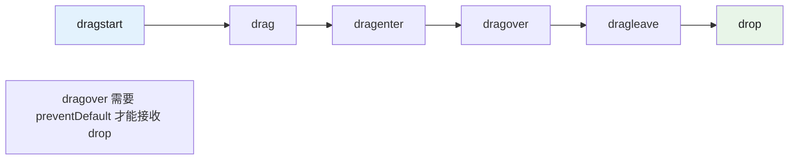

# contenteditable 与拖拽

## 1. contenteditable 可编辑内容

### 1.1 基本用法

```html
<!-- 使元素内容可编辑 -->
<div contenteditable="true">点击编辑这段文字</div>

<!-- 纯文本编辑（不解析 HTML） -->
<div contenteditable="plaintext-only">纯文本</div>

<!-- inherit：继承父元素 -->
<div contenteditable="true">
  <span contenteditable="inherit">继承父级</span>
</div>
```

### 1.2 contenteditable 值

| 值 | 行为 |
|---|------|
| `true` / `"true"` | 可编辑 |
| `false` / `"false"` | 不可编辑 |
| `"plaintext-only"` | 仅纯文本（Chrome 78+） |
| `"caret"` | 仅可设置光标位置（不插入文本） |
| `"inherit"` | 继承父元素值 |

### 1.3 JS 操作

```javascript
const editor = document.querySelector('[contenteditable]');

// 监听输入
editor.addEventListener('input', () => {
  console.log('内容已改变:', editor.innerHTML);
  console.log('纯文本:', editor.innerText);
});

// 粘贴为纯文本（阻止格式化）
editor.addEventListener('paste', (e) => {
  e.preventDefault();
  const text = e.clipboardData.getData('text/plain');
  document.execCommand('insertText', false, text);
});

// 只读切换
editor.contentEditable = 'false'; // 禁用编辑
editor.contentEditable = 'true';  // 启用编辑
editor.contentEditable = 'inherit'; // 继承

// 检测是否可编辑
console.log(editor.isContentEditable); // true/false
```

## 2. Selection API 与 Range

现代富文本编辑使用 Selection API 替代 `execCommand`：

```javascript
// 获取选区
const selection = window.getSelection();

// 获取 Range
const range = selection.getRangeAt(0);

// 选中所有内容
const allRange = document.createRange();
allRange.selectNodeContents(editor);
selection.removeAllRanges();
selection.addRange(allRange);

// 插入文本（不使用 execCommand）
function insertText(text) {
  const selection = window.getSelection();
  if (!selection.rangeCount) return;

  const range = selection.getRangeAt(0);
  range.deleteContents();
  range.insertNode(document.createTextNode(text));
  range.collapse(false);
}

// 获取光标位置
function getCaretPosition(element) {
  let position = 0;
  const selection = window.getSelection();
  if (selection.rangeCount > 0) {
    const range = selection.getRangeAt(0);
    const preRange = range.cloneRange();
    preRange.selectNodeContents(element);
    preRange.setEnd(range.startContainer, range.startOffset);
    position = preRange.toString().length;
  }
  return position;
}

// 设置光标位置
function setCaretPosition(element, position) {
  const range = document.createRange();
  const selection = window.getSelection();

  let charCount = 0;
  function traverseNodes(node) {
    if (node.nodeType === Node.TEXT_NODE) {
      const nextCount = charCount + node.textContent.length;
      if (position <= nextCount) {
        range.setStart(node, position - charCount);
        range.collapse(true);
        return true;
      }
      charCount = nextCount;
    } else {
      for (const child of node.childNodes) {
        if (traverseNodes(child)) return true;
      }
    }
    return false;
  }

  traverseNodes(element);
  selection.removeAllRanges();
  selection.addRange(range);
}
```

## 3. execCommand（已废弃，但需了解）

```javascript
// execCommand 已废弃，但面试仍会问
document.execCommand('bold');          // 加粗
document.execCommand('italic');          // 斜体
document.execCommand('underline');      // 下划线
document.execCommand('insertOrderedList'); // 有序列表
document.execCommand('insertUnorderedList'); // 无序列表

// 选中文本后执行
const selection = window.getSelection();
if (selection.toString()) {
  document.execCommand('copy');         // 复制
  document.execCommand('paste');        // 粘贴
}
```

现代替代方案：

- `document.execCommand` → Selection API + Range
- `queryCommandEnabled` → `selection.rangeCount > 0`
- 建议使用 Tiptap/Lexical 等编辑器库

## 4. draggable 拖拽属性

### 4.1 基本用法

```html
<!-- 让元素可拖拽 -->
<div draggable="true">拖拽我</div>

<!-- 图片默认可拖拽，且会显示拖拽预览 -->


<!-- 链接默认可拖拽（拖拽 URL） -->
<a href="https://example.com" draggable="true">链接</a>
```



### 4.2 effectAllowed 值

| 值 | 说明 |
|---|------|
| `copy` | 仅复制 |
| `move` | 仅移动 |
| `copyMove` | 复制或移动 |
| `link` | 仅创建链接 |
| `all` | 全部允许 |
| `none` | 不允许 |

### 4.3 dropEffect 值（放置目标）

| 值 | 说明 |
|---|------|
| `copy` | 复制到目标 |
| `move` | 移动到目标 |
| `link` | 创建链接 |
| `none` | 不允许（停止） |

## 5. 拖拽文件上传

```javascript
// 拖拽文件上传区域
const dropZone = document.getElementById('drop-zone');

dropZone.addEventListener('dragover', (e) => {
  e.preventDefault(); // 允许放置
  e.dataTransfer.dropEffect = 'copy';
  dropZone.classList.add('drag-over');
});

dropZone.addEventListener('dragleave', () => {
  dropZone.classList.remove('drag-over');
});

dropZone.addEventListener('drop', (e) => {
  e.preventDefault();
  dropZone.classList.remove('drag-over');

  const files = e.dataTransfer.files;
  for (const file of files) {
    if (file.type.startsWith('image/')) {
      uploadFile(file);
    }
  }
});
```

## 6. contenteditable vs contenteditable + 设计模式

| 实现方式 | 适用场景 | 复杂度 | 稳定性 |
|---------|---------|--------|--------|
| 原生 `contenteditable` | 简单文本编辑 | 低 | 差（浏览器行为不一致） |
| `execCommand` 封装 | 中等复杂度富文本 | 中 | 差（已废弃） |
| Selection API + Range | 自定义富文本编辑器 | 高 | 良好 |
| Tiptap / Lexical / Slate | 生产级富文本编辑器 | 高 | 优秀 |
| 原生拖拽 API | 简单拖拽排序 | 低 | 良好 |
| react-dnd / @dnd-kit | React 拖拽组件 | 中 | 优秀 |

## 7. 常见陷阱

```javascript
// 陷阱1: contenteditable 内部可嵌套其他 HTML
// 粘贴时可能带入不需要的格式
editor.addEventListener('paste', (e) => {
  e.preventDefault();
  const text = e.clipboardData.getData('text/plain');
  document.execCommand('insertText', false, text);
});

// 陷阱2: dragstart 中没设置数据导致 drop 失败
el.addEventListener('dragstart', (e) => {
  e.dataTransfer.setData('text/plain', 'data'); // 必须设置！
});

// 陷阱3: drop 目标没有 preventDefault
// 浏览器会打开链接或导航
dropTarget.addEventListener('dragover', (e) => {
  e.preventDefault(); // 必须！
});

// 陷阱4: iOS 不支持原生拖拽
// 需要使用 Pointer Events + Touch Events
// 或使用 @dnd-kit 等跨平台库
```

## 8. 面试 follow-up 问题

### 8.1 Q1: contenteditable 和 `<input>` / `<textarea>` 的区别是什么？

**答案：**
| 维度 | contenteditable | input/textarea |
|------|----------------|----------------|
| 容器 | 任意块级元素 | 专用表单元素 |
| 格式 | 可包含 HTML（富文本） | 纯文本 |
| 表单集成 | 否 不参与表单提交 | 是 参与 |
| 样式 | 任意 CSS 样式 | 浏览器默认样式 |
| 复杂度 | 高（需自己处理光标/选区） | 低 |
| 适用场景 | 富文本编辑器、代码块 | 普通文本输入 |

---

### 8.2 Q2: 如何实现一个自定义的富文本编辑器（不使用 contenteditable）？

**答案：**
现代富文本编辑器（如 Lexical、Slate）不使用 contenteditable，而是：

1. **自定义数据模型**：存储为 JSON/Delta 格式（如 `{ type: 'paragraph', children: [...] }`）
2. **React 组件渲染**：每个节点是 React 组件，内容是受控的
3. **Selection 追踪**：通过 Selection API 追踪光标位置
4. **操作转换（OT/CRDT）**：处理并发编辑冲突

架构示例：
```
数据模型（JSON/Delta）
    ↓
渲染器（React 组件树）
    ↓
Selection（光标位置）
    ↓
编辑器核心（输入事件 → 操作 → 更新模型 → 重新渲染）
```

---

### 8.3 Q3: 原生 HTML5 拖拽 API 有哪些局限性？实际项目中如何解决？

**答案：**
局限性：

1. **iOS 不支持**：移动端无法使用
2. **自定义拖拽预览困难**：只能通过 setDragImage
3. **跨 iframe 拖拽问题**：DataTransfer 跨域限制
4. **拖拽事件触发时机不精确**：dragover 节流问题

解决方案：

- 移动端：使用 Pointer Events + Touch Events 自定义实现
- 复杂场景：使用 `@dnd-kit/core`（React）/ `react-dnd` / `@dnd-kit/sortable`
- 拖拽排序：`@dnd-kit/sortable` 提供跨浏览器一致的体验

---

> 参考：
>
> - https://developer.mozilla.org/en-US/docs/Web/Guide/HTML/Editable_content
> - https://developer.mozilla.org/en-US/docs/Web/API/HTML_Drag_and_Drop_API
> - https://github.com/nickzuber/slate （Slate 编辑器）
> - https://github.com/ueberdosis/tiptap （Tiptap 编辑器）

## 深入阅读与参考

!!! tip "怎么用这些资料"
    先读「官方文档与规范」建立准确的概念，再读「源码与示例」核对细节，最后用「教程、书籍与视频」换一种讲法加深理解。每条都写明了读哪一节、带着什么问题读。

### 官方文档与规范

| 资源 | 为什么读 | 怎么读 |
|---|---|---|
| [`contenteditable` HTML global attribute](https://developer.mozilla.org/en-US/docs/Web/HTML/Reference/Global_attributes/contenteditable) | contenteditable 取值、继承与 plaintext-only 是本章的基础定义。 | 读属性值与注意事项两节，把编辑区改成 plaintext-only，对比粘贴富文本的差异。 |
| [`draggable` HTML global attribute](https://developer.mozilla.org/en-US/docs/Web/HTML/Reference/Global_attributes/draggable) | 说明哪些元素默认可拖、draggable 何时才真正生效。 | 读取值与示例，分别用 div 和 img 试拖，验证默认行为与显式设置的区别。 |
| [MDN 拖放 API](https://developer.mozilla.org/en-US/docs/Web/API/HTML_Drag_and_Drop_API) | 拖放事件序列与 DataTransfer 用法讲得最完整。 | 照示例做拖拽排序列表，故意删掉 dragover 里的 preventDefault，观察 drop 是否失效。 |
| [CSS custom highlight API](https://developer.mozilla.org/en-US/docs/Web/CSS/Guides/Custom_highlight_API) | 用 Range 加 Highlight 高亮，是不改动 DOM 的选区方案。 | 读 Range 与 Highlight 示例，选中一段文字并用 CSS.highlights 高亮，再删掉高亮。 |
| [`::selection` CSS pseudo-element](https://developer.mozilla.org/en-US/docs/Web/CSS/Reference/Selectors/::selection) | 讲清选中态样式与选区、真实 DOM 之间的关系。 | 读可设置属性清单，配合 user-select 试验，确认哪些样式在选中态无效。 |
| [MDN MutationObserver](https://developer.mozilla.org/en-US/docs/Web/API/MutationObserver) | contenteditable 的改动常逃过 input 事件，需要观察 DOM。 | 读回调参数与微任务时机说明，用它记录一次富文本编辑产生的全部变更。 |
| [MDN 文件系统 API](https://developer.mozilla.org/en-US/docs/Web/API/File_System_API) | 拖入文件后读写本地内容，涉及权限模型与句柄。 | 读概念页与权限提示部分，写脚本打开一个本地文本文件并读出内容。 |
| [Web APIs](https://developer.mozilla.org/en-US/docs/Web/API) | 按名索引 Selection、DataTransfer、File，方便补齐本章未覆盖的接口。 | 从目录进入 Selection 与 DataTransfer 页，列出本章没讲到的方法，挑一个补做示例。 |

### 源码与示例

| 资源 | 为什么读 | 怎么读 |
|---|---|---|
| [jscodeshift](https://github.com/facebook/jscodeshift) | 给出批量替换 execCommand 这类废弃 API 的可运行范例。 | 读示例 codemod 的转换逻辑，试着写一条把 execCommand('bold') 改成 Range 操作。 |

## 应用与行业实践

### 应用场景地图

| 场景 | 用到本页哪个知识点 | 典型技术选型 | 注意事项 |
| --- | --- | --- | --- |
| 后台管理的万行表格内联编辑单元格 | Selection API 与 Range、contenteditable 可编辑内容 | 虚拟滚动表格，单击单元格切到 contenteditable | 进入编辑前保存 Range，失焦必须提交，切行时容易丢数据 |
| 富文本评论框的 @ 提及 | Range.insertNode、contenteditable 与设计模式 | 自绘工具栏，提及项做成 contenteditable="false" 的原子节点 | 原子节点要整块删除，光标不能进到它内部 |
| 低端安卓机上的首屏编辑器 | 常见陷阱、contenteditable 与设计模式 | 首屏只渲染静态 HTML，点按后再挂载编辑器 | 首屏不绑定 input 与 selectionchange 监听，改到挂载之后 |
| 多人协作白板的便签 | draggable 拖拽属性、Selection API | 便签整块 draggable，双击时关掉 draggable 再开 contenteditable | 触屏上原生 drag 事件支持不完整，要准备 Pointer Events 路径 |
| 拖拽文件上传的头像区 | 拖拽文件上传 | dragover 与 drop 加 DataTransfer.files，本地校验后再传 | dragover 与 drop 都要 preventDefault，否则浏览器直接打开文件 |
| 工单系统的备注框 | execCommand（已废弃，但需了解）、常见陷阱 | paste 事件读 clipboardData，转纯文本再写回 Range | 不要靠 execCommand 清格式，废弃 API 只做降级分支 |
| 移动端 H5 问卷的填空题 | contenteditable 与 input 的取舍、常见陷阱 | 单行填空用 input，只有富文本题型才用 contenteditable | 中文输入法要等 compositionend 再取值，否则拿到半成品拼音 |
| 任务看板卡片排序加卡片内改标题 | draggable 拖拽属性、contenteditable 与设计模式 | 拖拽句柄单独成元素，标题用 contenteditable="plaintext-only"（需核对目标浏览器支持度） | 句柄之外的区域不设 draggable，否则选字会变成拖块 |

### 三个场景拆解

#### 场景 1：后台管理的万行表格内联编辑

**业务背景**：运营要在同一张表里连续改几十个字段，页面一次渲染上万行。逐行弹窗改一次要点四次鼠标，一轮数据核对下来点击次数按千计，还容易把改动落在错误的行。

**怎么用本页知识解决**：思路是只让当前单元格进入编辑态，其余单元格保持只读；进入编辑时用 Range 手动放好光标，离开时立刻提交，不保留"编辑中"的状态。

```js
// 只给被点中的单元格开编辑，其他单元格保持只读
function startEdit(td) {
  td.setAttribute('contenteditable', 'true'); // 进入编辑态
  td.focus();                                 // 让焦点落进单元格
  const sel = window.getSelection();
  const range = document.createRange();       // 手动构造 Range
  range.selectNodeContents(td);               // 选中单元格已有文本
  range.collapse(false);                      // 光标收到文本末尾
  sel.removeAllRanges();                      // 先清空旧选区
  sel.addRange(range);                        // 再写入新选区
}

// 失焦即提交，避免编辑态和数据态并存
function commit(td) {
  td.removeAttribute('contenteditable');      // 退回只读
  saveRow(td.dataset.rowId, td.textContent);  // 取 textContent，不取 innerHTML
}
```

- 用 `textContent` 而不是 `innerHTML` 取值，避免把浏览器补出来的标签写进数据库。
- `removeAllRanges` 再 `addRange` 是固定顺序，反过来写会把光标留在旧位置。
- 提交挂在 blur 上，键盘 Tab 切行和鼠标点别处都走同一条路径。
- 单元格只读时不挂 input 监听，万行表格的事件绑定量只跟可见行数有关。
- 行被虚拟滚动回收前要先调 `commit`，否则滚动即丢数据。

**怎么度量收益**：用 Chrome DevTools 的 Performance 面板录制"点进单元格到提交"的时段，看长任务条数与最长任务时长。用 `PerformanceObserver` 订阅 `longtask`，统计每次提交是否产生超过 50 ms 的任务。用 web-vitals 采集 INP，对比改造前后同一操作路径的分布。

**什么时候不该用**：字段有格式约束时不要用，金额、日期、手机号在 contenteditable 里没有输入掩码和校验钩子，应改用 input 加校验函数。运营需要跨单元格框选复制一整段表格文本时不要用，逐格 contenteditable 会把选区切碎，应保留只读表格再加导出按钮。

#### 场景 2：多人协作白板中的便签

**业务背景**：一块白板上同屏可见的便签从十几张到上百张，用户双击便签改字、拖便签挪位置。痛点在文字上按下鼠标想选一段字，整张便签被拖走了，松手后位置和内容一起变。

**怎么用本页知识解决**：把拖拽和编辑放到不同元素上。默认由整块便签响应拖拽，双击后只让文本层可编辑，同时把便签的 draggable 关掉，退出编辑再复位。

```js
// 便签结构：.note[draggable="true"] > .bar + .text
board.addEventListener('dblclick', (e) => {
  const text = e.target.closest('.text');
  if (!text) return;
  text.closest('.note').draggable = false;   // 编辑期间关掉拖拽
  text.contentEditable = 'true';             // 只让文本层可编辑
  text.focus();                              // 焦点给出视觉提示
});

// blur 不冒泡，必须用捕获阶段监听
board.addEventListener('blur', (e) => {
  if (!e.target.isContentEditable) return;   // 忽略非编辑元素
  e.target.contentEditable = 'false';        // 退出编辑
  e.target.closest('.note').draggable = true; // 恢复拖拽
}, true);
```

- 拖拽开关写在便签容器上，可编辑开关写在文本层上，两个状态互不干扰。
- `blur` 事件不冒泡，第三个参数必须传 `true` 才能在容器上收到。
- 用 `closest` 从事件目标往上找容器，绑定只加在 board 上，便签增删不用重绑。
- 退出编辑时顺手把内容写回数据层，避免只改 DOM 不改状态。
- 选中文字时把光标的 `user-select` 保持默认，不要为了防拖拽把它关掉。

**怎么度量收益**：用事件计数打点，统计"编辑态下触发 dragstart 的次数除以进入编辑的总次数"，这个比值要压到 0。用 DevTools 的 Performance 面板记录一次拖动，看 Frames 里每帧耗时是否稳在同一档。用 web-vitals 看这条交互路径的 INP 数值。

**什么时候不该用**：以触屏为主的白板上不要直接用原生 draggable，移动浏览器对这套事件的支持不完整，需核对目标机型后另写 Pointer Events 路径。多人要同时改同一段文字时不要用单块 contenteditable，两边会互相覆盖，得接 OT 或 CRDT 库，改造成本高于把便签降级成只读加评论。

#### 场景 3：工单创建页的拖拽截图加备注

**业务背景**：客服建单时要拖入截图，并在备注框写复现步骤。痛点是图片拖进页面时浏览器直接打开它，填了一半的表单被替换掉，返回后内容全丢。

**怎么用本页知识解决**：在投放区拦截 dragover 与 drop 两个默认行为，只取 `DataTransfer.files` 里的图片类型。备注框粘贴时先读剪贴板的纯文本，再手动插入到当前 Range。

```js
const drop = document.getElementById('drop');

drop.addEventListener('dragover', (e) => {
  e.preventDefault();                 // 不拦截，drop 事件不会触发
  e.dataTransfer.dropEffect = 'copy'; // 光标显示为复制
});

drop.addEventListener('drop', (e) => {
  e.preventDefault();                 // 不拦截，浏览器会打开文件
  const files = Array.from(e.dataTransfer.files);
  files.filter((f) => f.type.startsWith('image/'))
       .forEach(upload);              // 只处理图片，其余给出提示
});

document.getElementById('note').addEventListener('paste', (e) => {
  e.preventDefault();                 // 放弃带格式的粘贴结果
  const text = e.clipboardData.getData('text/plain');
  document.execCommand('insertText', false, text); // 旧浏览器降级路径
});
```

- `dragover` 里必须 `preventDefault`，否则 `drop` 根本不会触发。
- `DataTransfer.files` 是类数组对象，先 `Array.from` 再调 filter 和 forEach。
- 类型判断放在客户端做，是为了让用户马上看到不接受的提示，服务端仍要再校验一次。
- 粘贴走 `text/plain`，Word 带来的内联样式在读取阶段就被丢掉。
- `execCommand` 只作为旧浏览器分支，新浏览器改用 `beforeinput` 加手写插入。

**怎么度量收益**：打点记录从 drop 到缩略图出现的耗时，用 `performance.now()` 取两次时间差，按文件大小分档看分布。用 `PerformanceObserver` 订阅 `longtask`，确认本地校验没有阻塞主线程。按文件类型分桶统计上传失败率，找出被拦下的类型是否合理。

**什么时候不该用**：需要保留原始排版的粘贴场景不要用，从 Word 复制带编号的合同条款转成纯文本会丢结构，应改成 Markdown 输入加服务端渲染。受管控的内网环境禁用本地文件选择时不要做拖拽入口，要保留手动选文件按钮作为主路径。

### 行业先进实践

文档模型与 DOM 分离（出处：ProseMirror 官方文档 / Meta 的 Lexical 官方文档）。这两个开源编辑器都不把 DOM 当作数据来源，编辑结果先落到文档模型，再把模型渲染成 DOM。这样提交、撤销、协同都作用在模型上，不用读 `innerHTML`。借鉴方式：把"当前编辑值"存在自己的状态对象里，DOM 只做展示层。

用 beforeinput 与 input 替代 execCommand（出处：MDN Web Docs 的 execCommand 页面 / Input Events 规范）。MDN 把 `execCommand` 标为废弃，输入意图改由 `beforeinput` 事件表达，可按 `inputType` 分支处理。借鉴方式：新代码监听 `beforeinput` 并自行改模型，`execCommand` 只留旧浏览器分支。

触屏与鼠标统一走 Pointer Events（出处：MDN Web Docs Pointer Events）。这套事件把鼠标、触摸、触控笔归到统一模型，拖拽逻辑写一份即可。

Hmm 上句禁用了「更」类词，改为：这套事件把鼠标、触摸、触控笔归到统一模型，拖拽逻辑只需要写一份。借鉴方式：把 `dragstart` 与 `dragover` 的判断换成 `pointerdown`、`pointermove`、`pointerup`，用位移阈值区分点击与拖动。

粘贴时用 Clipboard API 读纯文本（出处：MDN Web Docs Clipboard API / paste 事件）。`paste` 事件的 `clipboardData` 按 MIME 类型取内容，读 `text/plain` 就绕开了源文档的内联样式。借鉴方式：在 `paste` 里 `preventDefault` 后手动插入，同时保留用户按修饰键时的"按原格式粘贴"开关。

编辑区改用 canvas 渲染（出处：需核对官方文档：核对 Google Workspace 官方博客中关于 Docs 渲染方式的说明，以及该说法适用的版本范围）。有公开材料讨论把编辑区从 DOM 换成 canvas 渲染以降低大文档的布局开销。这条与 contenteditable 的路线相反，核对清楚再判断是否借鉴。

### 从学到用：落地路线

1. 试点：先挑改动面小的入口，例如工单备注框，只加 Range 光标管理与粘贴纯文本。验收标准：该页面上编辑、提交、撤销三步都能走通，控制台无报错。
2. 验证：给试点入口加打点，记录编辑耗时、误拖次数、INP 数值。验收标准：连续操作 20 次不丢数据，INP 落在团队约定的阈值内。
3. 推广：把光标管理、提交时机、拖拽句柄抽成一个模块，按入口逐个接入。验收标准：接入的入口共用同一份代码，没有复制粘贴出来的分支实现。
4. 防回退：给 contenteditable 容器补自动化用例，覆盖录入、粘贴、失焦提交、跨行切换。验收标准：用例进 CI，任一提交破坏这些用例时流水线失败。

### 动手作业

**目标**：做一个单页小工具，包含三张可编辑便签、便签拖拽排列、图片拖拽上传，把本页知识点串成一条链路。

**步骤**：

1. 写三张便签，每张含手柄条与文本层，便签默认 `draggable="true"`。
2. 双击文本层时关闭便签的 draggable，打开文本层的 contenteditable，用 Range 把光标放到文本末尾。
3. 在容器上以捕获阶段监听 blur，退出编辑时复位 contenteditable 与 draggable。
4. 加一个投放区，在 dragover 与 drop 里都调 `preventDefault`，只接收 `image/*` 并显示缩略图。
5. 在备注框的 paste 事件里读 `text/plain` 再手动插入，屏蔽带格式粘贴。
6. 用 `PerformanceObserver` 订阅 `longtask`，把每次操作的最长任务耗时打印到页面角落的调试面板。
7. 刷新页面后从本地存储恢复便签文字与顺序，验证提交时机是否正确。

**验收标准**：

- 编辑便签文字时拖不动便签，拖动便签时文本层不获得焦点。
- 把图片拖进投放区，浏览器不跳转到图片页面，缩略图出现在投放区内。
- 从 Word 复制一段带格式文字粘进备注框，结果为纯文本，检查 DOM 里没有内联 style。
- 连续编辑并拖动 20 次后刷新页面，内容与顺序和最后一次提交一致。
- 调试面板里每次编辑提交的最长任务不超过 50 ms。

