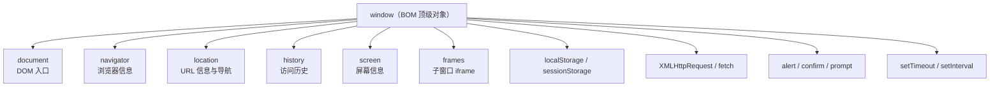
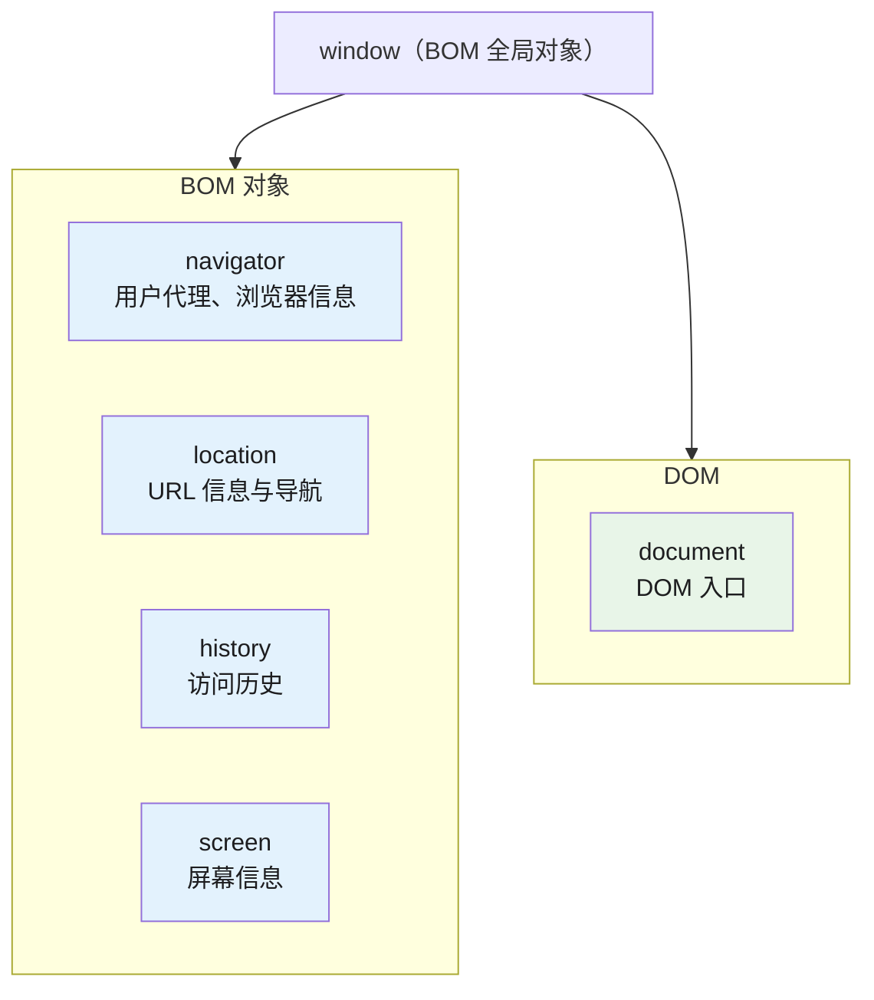

# DOM 与 BOM

## 1. 核心概念

### 1.1 DOM — Document Object Model（文档对象模型）

DOM 是 W3C 定义的**标准规范**，描述了如何将 HTML/XML 文档表示为对象结构。它是**语言无关的**（language-agnostic）API，JavaScript、Python、Java 等均可操作 DOM。

核心特点：

- **W3C 标准**：所有浏览器严格遵循（高度一致）
- **操作文档内容**：元素、属性、文本节点
- 以 `document` 对象为根节点的一棵树形结构

### 1.2 BOM — Browser Object Model（浏览器对象模型）

BOM 是浏览器厂商提供的**非标准扩展**，用于访问和操作浏览器窗口本身。不同浏览器实现不同，没有统一规范。

核心特点：

- **无统一标准**：各浏览器实现差异大（IE vs Chrome vs Firefox）
- **操作浏览器环境**：窗口、历史记录、地址栏、屏幕信息
- 以 `window` 对象为全局根对象

### 1.3 两者关系



**关键关系**：`window.document` 是 DOM 的入口——DOM 嵌在 BOM 内，DOM 是 BOM 的子集。

---

## 2. 对象层级结构图



---

## 3. DOM 详解

### 3.1 核心 API

```typescript
// 获取元素
const elem = document.getElementById('app');     // 已知 ID
const elems = document.getElementsByTagName('div');  // 标签名（live HTMLCollection）
const elems = document.getElementsByClassName('card'); // 类名（live HTMLCollection）
const elem = document.querySelector('.container');   // 单个匹配（CSS 选择器）
const elems = document.querySelectorAll('div.card'); // 所有匹配（static NodeList）

// 创建元素
const div = document.createElement('div');
div.id = 'dynamic';
div.className = 'wrapper';
div.textContent = 'Hello';         // 纯文本，不解析 HTML
div.innerHTML = '<span>Bold</span>'; // 解析 HTML（有 XSS 风险）

// 插入/移除 DOM
document.body.appendChild(div);
parent.insertBefore(newNode, referenceNode);
parent.replaceChild(newChild, oldChild);
element.remove();                  // 现代 API（IE 不支持）
element.removeChild(child);       // 经典 API

// 元素属性操作
element.setAttribute('data-id', '123');
element.getAttribute('data-id');
element.hasAttribute('disabled');
element.removeAttribute('disabled');

// 类名操作（推荐）
element.classList.add('active');
element.classList.remove('hidden');
element.classList.toggle('expanded');
element.classList.contains('selected');

// 样式操作
element.style.color = 'red';
element.style.backgroundColor = '#f0f0f0'; // 注意驼峰命名
```

### 3.2 DOM 节点类型（Node Types）

```typescript
// 每个节点都有 nodeType 属性
enum NodeType {
  ELEMENT_NODE               = 1,   // <div> <p>
  TEXT_NODE                 = 3,   // 文本内容
  COMMENT_NODE              = 8,   // <!-- comment -->
  DOCUMENT_NODE             = 9,   // document 本身
  DOCUMENT_FRAGMENT_NODE     = 11, // DocumentFragment
  DOCUMENT_TYPE_NODE        = 10, // <!DOCTYPE html>
}

// Node 常用属性和方法
const textNode = document.createTextNode('Hello');
textNode.nodeType;   // 3
textNode.nodeName;   // '#text'
textNode.textContent; // 'Hello'

// 节点关系遍历
element.parentNode;
element.parentElement;
element.children;           // 只含元素节点（HTMLCollection）
element.childNodes;         // 含文本、注释等所有节点（NodeList）
element.firstChild;
element.lastChild;
element.nextSibling;
element.previousSibling;

// Element 特有的遍历
element.closest('.container'); // 向上查找匹配选择器的最近祖先
element.matches('.card');     // 检查元素是否匹配选择器
```

### 3.3 React/TypeScript 中的 DOM 操作

```tsx
// 在 React 中，直接操作 DOM 的场景（ref）：
function FocusInput() {
  const inputRef = useRef<HTMLInputElement>(null);

  useEffect(() => {
    // 直接调用 DOM API（非 React 渲染流程）
    inputRef.current?.focus();
  }, []);

  return <input ref={inputRef} type="text" />;
}

// 手动创建复杂 DOM 结构（不推荐，但在低抽象层有用）
function createCard(title: string, body: string): HTMLElement {
  const card = document.createElement('div');
  card.className = 'card';
  card.setAttribute('role', 'article');

  const heading = document.createElement('h2');
  heading.textContent = title;
  heading.className = 'card__title';

  const content = document.createElement('p');
  content.textContent = body;
  content.className = 'card__body';

  card.appendChild(heading);
  card.appendChild(content);

  return card;
}

// 监听 DOM 事件
document.getElementById('btn')?.addEventListener('click', (e: MouseEvent) => {
  const target = e.currentTarget as HTMLElement;
  target.classList.toggle('active');
});
```

---

## 4. BOM 详解

### 4.1 window 对象

```typescript
// window 是全局对象，以下写法等效：
window.document === document;
window.setTimeout === setTimeout;
window.alert === alert;

// 窗口尺寸
window.innerWidth;   // 视口宽度（含滚动条）
window.innerHeight;  // 视口高度
window.outerWidth;   // 浏览器窗口总宽度（含工具栏）
window.outerHeight;  // 浏览器窗口总高度
window.resizeTo(1024, 768);
window.moveTo(100, 200);

// 滚动
window.scrollY;       // 垂直滚动位置
window.scrollTo(0, 0); // 滚动到顶部
window.scrollBy(0, 100); // 相对滚动

// 屏幕可用区域
window.screenX;  // 窗口左边缘到屏幕左边缘的距离
window.screenY;
```

### 4.2 navigator 对象 — 浏览器信息

```typescript
// 不要用 appName / appVersion 判断浏览器类型（不准确）
navigator.appName;    // 'Netscape'（所有现代浏览器都是）
navigator.appVersion; // 浏览器版本字符串（不可靠）
navigator.platform;   // 操作系统信息

// 正确：推荐：使用 userAgent（配合正则匹配已知浏览器）
const ua = navigator.userAgent;
const isFirefox = /Firefox/i.test(ua);
const isSafari = /Safari/i.test(ua) && !/Chrome/i.test(ua);
const isEdge = /Edg/i.test(ua);

// 现代浏览器检测（Feature Detection 优先）
const isSecure = location.protocol === 'https:';
const hasTouch = 'ontouchstart' in window;
const hasPointerEvents = window.matchMedia('(pointer: fine)').matches;

// Service Worker 与 PWA
navigator.serviceWorker?.register('/sw.js');
navigator.share?.({ title: 'Title', url: location.href }); // Web Share API

// 硬件信息（需权限）
// 内存（Chrome 限制）
const deviceMemory = (navigator as any).deviceMemory; // GB（可能是 4 或 8）
// CPU 核心数
const hardwareConcurrency = navigator.hardwareConcurrency;

// 网络信息（网络信息 API）
if ('connection' in navigator) {
  const conn = (navigator as any).connection;
  conn.effectiveType; // '4g', '3g', '2g', 'slow-2g'
  conn.downlink;      // Mbps（估算带宽）
  conn.rtt;           // 毫秒
  conn.addEventListener('change', () => console.log(conn.effectiveType));
}

// 电池状态（Battery API）
if ('getBattery' in navigator) {
  (navigator as any).getBattery().then((battery: any) => {
    console.log(`Battery: ${battery.level * 100}%`);
    console.log(`Charging: ${battery.charging}`);
  });
}
```

### 4.3 location 对象 — URL 与导航

```typescript
// URL 各部分
location.href;       // 完整 URL（可读写）
location.protocol;   // 'https:'
location.host;       // 'example.com:8080'
location.hostname;   // 'example.com'
location.port;       // '8080'（空字符串表示默认端口）
location.pathname;   // '/path/to/page'
location.search;     // '?foo=bar&baz=123'
location.hash;       // '#section-id'

// 解析查询参数
const params = new URLSearchParams(location.search);
params.get('foo');   // 'bar'
params.set('page', '2');
history.replaceState(null, '', `?${params.toString()}`);

// 导航
location.assign('https://example.com/new-page');  // 触发跳转（写入历史）
location.replace('https://example.com/new-page'); // 替换当前（不写入历史）
location.reload();                                  // 刷新页面

// 从 URL 解析数据（TypeScript 工具函数）
function parseUrl(url: string) {
  const { protocol, host, pathname, search, hash } = new URL(url);
  return { protocol, host, pathname, search, hash };
}

const parsed = parseUrl('https://example.com/search?q=react&page=1#results');
console.log(parsed.search); // '?q=react&page=1'
```

### 4.4 history 对象 — 历史记录

```typescript
// 导航
history.back();      // 后退一页
history.forward();  // 前进一页
history.go(-2);     // 后退两页

// 替换/添加历史记录（不刷新页面）
history.pushState(stateObj, title, url);
history.replaceState(stateObj, title, url);

// 监听 popstate（浏览器前进/后退触发）
window.addEventListener('popstate', (event) => {
  console.log('state:', event.state);
  // pushState/replaceState 不触发 popstate
});

// SPA 路由示例（结合 history）
function navigate(path: string) {
  history.pushState({ page: path }, '', path);
  renderPage(path);  // 手动渲染对应页面
}

window.addEventListener('popstate', () => {
  renderPage(location.pathname);
});
```

### 4.5 screen 对象 — 屏幕信息

```typescript
screen.width;       // 屏幕总宽度（像素）
screen.height;      // 屏幕总高度（像素）
screen.availWidth;  // 浏览器可用宽度（减去任务栏等）
screen.availHeight; // 浏览器可用高度
screen.colorDepth;  // 颜色深度（如 24）
screen.pixelDepth;  // 像素深度（如 24）

// 布局相关：设备像素比（DPR）
const dpr = window.devicePixelRatio; // 通常 1, 2, 或 3
// 高清屏适配：画布或图片使用 @2x 资源
if (dpr > 1) {
  canvas.width = designWidth * dpr;
  canvas.height = designHeight * dpr;
  ctx.scale(dpr, dpr);
}
```

### 4.6 其他重要 BOM API

```typescript
// Storage
localStorage.setItem('theme', 'dark');      // 持久存储（5-10MB）
sessionStorage.setItem('tabId', '123');   // 会话级存储（关闭标签页清除）
localStorage.removeItem('theme');

// 定时器
const timerId = setTimeout(() => alert('5s passed'), 5000);
clearTimeout(timerId);

const intervalId = setInterval(() => tick(), 1000);
clearInterval(intervalId);

// requestAnimationFrame（动画帧）
function animate(timestamp: number) {
  // 每帧调用，约 60fps
  element.style.transform = `translateX(${timestamp / 10}px)`;
  if (running) requestAnimationFrame(animate);
}
requestAnimationFrame(animate);

// alert / confirm / prompt（模态框）
const confirmed = confirm('Delete this item?'); // 返回 boolean
const name = prompt('Enter your name:', 'John'); // 返回 string 或 null

// open / close
const popup = window.open('https://example.com', 'popup', 'width=400,height=300');
popup?.close();

// 全屏 API
element.requestFullscreen();                          // 进入全屏
document.exitFullscreen();                             // 退出全屏
document.fullscreenElement; // 当前全屏元素或 null
```

---

## 5. DOM vs BOM 核心对比

| 维度 | DOM | BOM |
|------|-----|-----|
| 全称 | Document Object Model | Browser Object Model |
| 标准 | W3C 制定（标准规范） | 各浏览器厂商实现（无标准） |
| 规范程度 | 极高（所有浏览器一致） | 低（实现细节各异） |
| 核心对象 | `document` | `window` |
| 操作对象 | HTML/XML 文档的元素和内容 | 浏览器窗口本身 |
| 作用范围 | 文档内容（节点树） | 浏览器环境（窗口、导航、屏幕） |
| 与 JS 的关系 | 语言无关的 API | JS 与浏览器交互的桥梁 |
| 规范组织 | W3C DOM Working Group | WHATWG（Browser Environment）|
| 使用场景 | 动态修改页面内容 | 获取浏览器信息、导航、历史管理 |

---

## 6. 实际应用：判断运行环境

```typescript
// 检测是否为浏览器环境
const isBrowser = typeof window !== 'undefined' && typeof document !== 'undefined';

// 检测 SSR（Next.js / Remix / Angular Universal）
const isSSR = typeof window === 'undefined';

// 检测 iOS/Android
const isIOS = /iPhone|iPad|iPod/i.test(navigator.userAgent);
const isAndroid = /Android/i.test(navigator.userAgent);

// 检测是否为 WeChat 浏览器
const isWeChat = /MicroMessenger/i.test(navigator.userAgent);

// 检测是否支持某些 API（Feature Detection）
const hasIntersectionObserver = 'IntersectionObserver' in window;
const hasWebSocket = 'WebSocket' in window;
const hasPointerEvents = window.matchMedia('(pointer: fine)').matches;

// 检测在线状态
window.addEventListener('online', () => console.log('Back online'));
window.addEventListener('offline', () => console.log('Lost connection'));
const isOnline = navigator.onLine;

// 检测视口方向（移动端）
const isLandscape = window.matchMedia('(orientation: landscape)').matches;
window.matchMedia('(orientation: portrait)').addEventListener('change', (e) => {
  console.log('Orientation changed:', e.matches ? 'portrait' : 'landscape');
});
```

---

## 7. 面试追问

### 7.1 Q1：为什么说 BOM 是浏览器厂商的私有实现，而 DOM 是 W3C 标准？

**答**：

**BOM 的私有性**：`window`、`navigator`、`location`、`history`、`screen` 这些对象不是 ECMA 或 W3C 规范的一部分，而是各浏览器在实现 JavaScript 引擎时额外暴露的 API。不同浏览器中：

```javascript
// IE 有一些 BOM 扩展（现在已废弃）
window.execScript;     // IE 私有
window.showModelessDialog; // IE 私有

// Chrome/Firefox 有各自的实现差异
// location 对象的 API 基本一致（WHATWG 规范了 URL 标准）
// 但 history.pushState 的行为在不同浏览器中仍可能有微小差异
```

**DOM 的标准性**：

```javascript
// W3C DOM 规范保证了这些 API 在所有浏览器中行为一致
document.getElementById('app');     // 正确：跨浏览器完全一致
document.querySelectorAll('div');    // 正确：跨浏览器完全一致
element.classList.add('active');    // 正确：跨浏览器完全一致

// 但 DOM 实现仍有差异（如 IE 的 oldIE 实现 vs 现代浏览器）
// 现代浏览器的 DOM 实现高度一致（HTML5 规范统一后）
```

关键点：DOM 有规范文本（DOM4、DOM Living Standard），BOM 没有规范约束（现代浏览器趋于遵循 WHATWG 的 `window` 规范）。

---

### 7.2 Q2：如何在不刷新页面的情况下改变 URL 并保持 SPA 路由正常工作？

**答**：使用 History API（属于 BOM）。

```typescript
// React Router 的核心原理：
// 1. pushState / replaceState 改变 URL（不刷新）
// 2. popstate 监听浏览器前进/后退

// 基础实现
function createRouter(routes: Record<string, () => void>) {
  function handleRoute() {
    const path = location.pathname; // BOM: location 对象
    const handler = routes[path] || routes['/'];
    handler();
  }

  // 监听导航
  window.addEventListener('popstate', handleRoute);

  // 暴露 navigate 函数
  return function navigate(path: string) {
    // 推入新历史记录（不刷新）
    history.pushState(null, '', path); // BOM: history 对象
    handleRoute();
  };
}

const router = createRouter({
  '/': () => renderHome(),
  '/about': () => renderAbout(),
  '/contact': () => renderContact(),
});

document.addEventListener('DOMContentLoaded', () => {
  document.querySelectorAll('a').forEach(link => {
    link.addEventListener('click', (e) => {
      e.preventDefault();
      router(link.getAttribute('href')!);
    });
  });
});
```


### 7.3 坑 2：navigator.userAgent 不可靠

```typescript
// 错误：依赖 UA 字符串判断浏览器类型（可伪造，且不准确）
if (navigator.userAgent.includes('Chrome')) {
  // chrome code
}

// 正确：使用 Feature Detection（功能检测）
if ('IntersectionObserver' in window) {
  // 使用 IntersectionObserver
} else {
  // 回退方案
}
```

### 7.4 坑 3：BOM 对象属性访问返回不同类型

```typescript
// location.search 返回字符串（带 ?）
location.search; // '?foo=bar'
// 使用 URLSearchParams 解析
const params = new URLSearchParams(location.search);

// location.hash 返回字符串（带 #）
location.hash; // '#section'
// 直接去掉 # 号使用
const id = location.hash.slice(1);

// screen 对象可能在某些嵌入式环境中返回奇怪的值
screen.width; // 某些嵌入式设备可能是 0（安全考虑）
```

---

> 参考：
>
> - https://www.cnblogs.com/chosen-yn/p/18458105
> - https://www.cnblogs.com/scg0624/p/9855540.html
> - https://www.cnblogs.com/lonelyshy/p/14272280.html
> - https://blog.csdn.net/bing_JavaScript/article/details/52618695

## 深入阅读与参考

!!! tip "怎么用这些资料"
    先读「官方文档与规范」建立准确的概念，再读「源码与示例」核对细节，最后用「教程、书籍与视频」换一种讲法加深理解。每条都写明了读哪一节、带着什么问题读。

### 官方文档与规范

| 资源 | 为什么读 | 怎么读 |
|---|---|---|
| [MDN DOM 概述](https://developer.mozilla.org/en-US/docs/Web/API/Document_Object_Model) | 权威概述，节点、元素、文档三层接口划分清晰，是 DOM 入门第一站。 | 读概述与三个接口，在控制台从 document 逐层遍历页面 DOM 树，画出层级图。 |
| [DOM 标准](https://dom.spec.whatwg.org/) | 事件分发规范原文，澄清冒泡、捕获与停止传播的精确语义。 | 读事件分发一节，带着“stopPropagation 后同节点其他监听器还执行吗”核对语义。 |
| [MDN 使用 Shadow DOM](https://developer.mozilla.org/en-US/docs/Web/API/Web_components/Using_shadow_DOM) | 官方步骤讲清 Shadow DOM 的样式隔离与 slot、::part 定制点。 | 边读边写一个带 slot 的自定义元素，验证外部样式无法穿透影子边界。 |

### 源码与示例

| 资源 | 为什么读 | 怎么读 |
|---|---|---|
| [petite-vue](https://github.com/vuejs/petite-vue) | 百行级源码，看真实库如何用原生 DOM API 组织渲染。 | 从 src/index.ts 入手，追踪一次数据更新到 DOM 修改的调用链并记录。 |
| [rrweb](https://github.com/rrweb-io/rrweb) | 开源会话回放库，展示 DOM 序列化与增量回放的真实实现。 | 读 README 与原理说明，重点看 DOM 快照与变更记录的数据结构设计。 |
| [JSFiddle](https://jsfiddle.net/) | 免配置在线沙箱，适合随手验证 DOM 与 CSS 片段。 | 把本页示例粘进去改一改，观察不同浏览器下 DOM 与 BOM 行为差异。 |
| [BigFrontEnd.dev 题目列表](https://bigfrontend.dev/problem) | 按标签分类的练习题，DOM 类题目可检验实际掌握程度。 | 筛选 DOM 标签做 5 题，卡住的回查 MDN 对应接口再重做。 |

### 教程、书籍与视频

| 资源 | 为什么读 | 怎么读 |
|---|---|---|
| [现代 JavaScript 教程：文档](https://zh.javascript.info/document) | 系统教程，从导航、搜索到修改样式循序渐进并配练习。 | 顺学 DOM 导航与搜索两节，做完章末任务再回看层级结构图。 |
| [网道 Web API 教程](https://wangdoc.com/webapi/) | 中文 Web API 教程，覆盖 BOM 等浏览器接口，补足本页缺口。 | 重点读 window、location、navigator 章节，读后手写一个无框架小组件。 |
| [PortSwigger：XSS](https://portswigger.net/web-security/cross-site-scripting) | 讲透反射、存储、DOM 三型 XSS，理解 DOM 操作的安全边界。 | 读完三种类型后各做一个实验，思考 innerHTML 与 textContent 的取舍。 |
| [web.dev：Shadow DOM v1](https://web.dev/articles/shadowdom-v1) | web.dev 教程，专讲事件重定向与 slot，配可运行示例。 | 读事件重定向与 slot 部分，在影子边界内外各挂监听器验证事件穿越。 |

## 应用与行业实践

### 应用场景地图

| 场景 | 用到本页哪个知识点 | 典型技术选型 | 注意事项 |
| --- | --- | --- | --- |
| 后台管理的万行表格 | DOM 节点数量、事件委托、DocumentFragment、requestAnimationFrame | TanStack Virtual、ag-Grid、原生表格容器 | 不要给每行绑定事件；避免一次插入全部节点。 |
| 低端安卓的首屏加载 | DOM 解析顺序、defer/async、DOMContentLoaded、BOM Performance API | 静态 HTML、按需 hydration、PerformanceObserver | 不要用阻塞解析的脚本；首屏节点要少。 |
| 多人协作白板 | DOM 事件坐标、BOM 视口尺寸、devicePixelRatio | Canvas/WebGL 渲染，DOM 只做工具栏 | 不要用 DOM 节点代表每个图形；重绘成本会随对象数上升。 |
| 表单校验与草稿恢复 | DOM 表单事件、input 事件、BOM localStorage/IndexedDB | 受控组件、防抖存储、IndexedDB | 高频输入不要每次同步写存储；注意隐私字段不落盘。 |
| 跨端文档预览 | DOM 语言无关、DOMParser、BOM Blob/URL | 前端解析 HTML/XML、白名单渲染 | 不要直接插回不可信 HTML；要过滤 script 与事件属性。 |
| 数据埋点与性能监控 | DOM 事件冒泡、BOM Performance API、PerformanceObserver | 事件委托采集、PerformanceObserver、Web Vitals | 不要在点击路径里做同步统计；使用 buffered 获取历史指标。 |
| 单页应用路由与历史记录 | BOM History API、DOM 容器替换、popstate/pushState | history.pushState、路由守卫、容器渲染 | 要清理旧 DOM 与监听器；避免 popstate 时重复挂载。 |
| 浏览器插件内容提取 | DOM querySelector、TreeWalker、MutationObserver | Content Script 读取 DOM、MutationObserver 监听 | 页面动态加载时不要只读一次；不要读取密码框内容。 |

### 三个场景拆解

#### 场景 1：后台管理万行表格

- **业务背景**：运营后台需要一次展示 5 万行明细，包含 30 列。全量渲染会让首帧超过 5 秒、滚动掉帧、内存占用高。
- **怎么用本页知识解决**：思路是用虚拟滚动只渲染可视行，用 DocumentFragment 批量插入，用事件委托减少监听器，用 requestAnimationFrame 分片处理长任务。

```js
const tbody = document.querySelector('#table-body');
// 每批插入 500 行，防止长任务阻塞
const BATCH = 500;
let start = 0;

function renderBatch(total) {
  const fragment = document.createDocumentFragment();
  const end = Math.min(start + BATCH, total);
  for (let i = start; i < end; i++) {
    const tr = document.createElement('tr');
    tr.textContent = `row-${i}`; // 示例行内容
    fragment.appendChild(tr);
  }
  tbody.appendChild(fragment);
  start = end;
  if (start < total) {
    requestAnimationFrame(() => renderBatch(total));
  }
}

// 事件委托：所有行只挂一个监听器，避免每行 addEventListener
tbody.addEventListener('click', (e) => {
  const tr = e.target.closest('tr');
  if (tr) highlight(tr);
});
```

- DocumentFragment 在内存中组合节点，只触发一次回流。
- requestAnimationFrame 分片插入，避免单次脚本运行超过帧预算。
- 事件委托用一个监听器处理所有行，减少内存和绑定成本。
- 代码示例只做分批，真实落地要叠加虚拟滚动计算可视区。
- 虚拟滚动要固定行高或提前测量行高，否则滚动条位置会错。

- **怎么度量收益**：用 Chrome DevTools Performance 记录 Scripting、Rendering、Painting 时间；用 Memory 面板记录 DOM Nodes 与 JS Heap。对比同一机器上全量渲染与虚拟滚动分别在 1 万、5 万、10 万行时的首帧时间和滚动帧率。
- **什么时候不该用**：行数少于 100 且每行有多个内联编辑控件时，虚拟滚动会增加坐标计算。需要原生复制表格全部内容或无障碍读屏读取所有行时，虚拟滚动会漏掉未渲染节点。

#### 场景 2：低端安卓首屏加载

- **业务背景**：H5 活动页在低端安卓上白屏超过 4 秒，首屏有一张大图和第三方脚本。用 WebPageTest 在 Moto G4 档设备上可复现白屏时长。
- **怎么用本页知识解决**：思路是让脚本不阻塞 DOM 解析，用 PerformanceObserver 记录真实设备上的关键时间点，在 DOMContentLoaded 后再初始化非首屏交互。

```js
// 用 PerformanceObserver 记录首屏关键 DOM 出现时间
const observer = new PerformanceObserver((list) => {
  for (const entry of list.getEntries()) {
    // 记录 LCP 元素与时间
    console.log(entry.element, entry.startTime);
  }
});
observer.observe({ type: 'largest-contentful-paint', buffered: true });

// 首屏 HTML 使用 defer 加载脚本，避免阻塞 DOM 解析
// <script src="./app.js" defer></script>

// DOMContentLoaded 后再初始化非首屏交互
document.addEventListener('DOMContentLoaded', () => {
  initBelowFold();
});
```

- defer 让脚本下载与 HTML 解析并行，执行延迟到 DOM 解析完成后。
- PerformanceObserver 的 buffered 标志能拿到注册前已经产生的 LCP 条目。
- DOMContentLoaded 触发时 DOM 已可用，适合初始化不依赖首屏可见的组件。
- 首屏大图要放在 HTML 中或预加载，避免脚本插入后才开始下载。

- **怎么度量收益**：用 WebPageTest 在低端设备档位记录 First Contentful Paint、Largest Contentful Paint、Total Blocking Time。用 Chrome DevTools Performance 火焰图查看 Parse HTML 和 Scripting 时间占比。
- **什么时候不该用**：首屏内容必须由脚本生成时，不要等 DOMContentLoaded 再渲染。需要阻塞解析来避免闪烁或抖动时，不要给关键脚本加 defer。

#### 场景 3：多人协作白板

- **业务背景**：白板需要同步多人的矩形、箭头、文本，页面可能同时存在 2000 个图形。用 DOM 每个图形一个节点时，拖动卡顿、内存占用高。
- **怎么用本页知识解决**：思路是把图形渲染放到 canvas，DOM 只承载工具栏和选中框；用 BOM 的 devicePixelRatio 处理清晰度；用 DOM 事件监听容器上的 pointer 事件。

```js
const canvas = document.querySelector('#board');
const ctx = canvas.getContext('2d');

function resize() {
  // 按设备像素比放大画布，避免高分屏模糊
  const dpr = window.devicePixelRatio || 1;
  canvas.width = canvas.clientWidth * dpr;
  canvas.height = canvas.clientHeight * dpr;
  ctx.scale(dpr, dpr);
}
window.addEventListener('resize', resize);

// 事件只在画布容器监听一次
canvas.addEventListener('pointermove', (e) => {
  if (!isDragging) return;
  const rect = canvas.getBoundingClientRect();
  const x = e.clientX - rect.left;
  const y = e.clientY - rect.top;
  moveShape(x, y);
});
```

- canvas 用绘制命令表示 2000 个图形，不产生 2000 个 DOM 节点。
- devicePixelRatio 让画布物理像素与屏幕匹配，避免高分屏模糊。
- getBoundingClientRect 把视口坐标转成画布本地坐标。
- pointermove 在画布容器监听，事件处理不随图形数量增长。
- 选中框、工具栏仍可用 DOM 渲染，保留可访问性。

- **怎么度量收益**：用 Chrome DevTools Performance 记录拖动时的 Scripting、Rendering、Painting 时间；用 Memory 面板对比 DOM 方案与 canvas 方案的 DOM Nodes 和 JS Heap；用 FPS meter 记录拖动帧率。
- **什么时候不该用**：图形需要原生文本选择、复制、屏幕阅读器逐一读出时，canvas 不适合。对象数量少且每个对象内嵌表单、下拉框等复杂交互时，DOM 方案更直接。

### 行业先进实践

- **虚拟滚动（出处：TanStack Virtual 官方文档）**：只渲染可视区及少量缓冲行，用 CSS transform 定位，把 DOM 节点数量固定在一个范围。这样滚动性能不受总数据量拖累。你的项目可以把后台表格和数据列表统一接入该组件。
- **事件委托（出处：React 官方文档 Events 部分）**：React 17 及以上版本把事件绑定到根容器，减少每个子节点的独立监听器。这样动态增删节点时不用反复绑定和解绑。你的项目可以在表格、画布、列表中沿用容器级监听。
- **分批 DOM 更新（出处：Google Web Fundamentals 的 Rendering Performance 章节）**：在 requestAnimationFrame 回调中批量写入 DOM，把多次回流合并到下一帧。这样可避免连续读写触发强制同步布局。拖拽、滚动、批量渲染场景都可借鉴。
- **PerformanceObserver 采集 Web Vitals（出处：web.dev 的 Web Vitals 官方文档）**：注册 `largest-contentful-paint`、`layout-shift`、`inp` 等条目，并用 `buffered: true` 获取历史值。这样不会错过早期产生的指标。你的项目可在入口文件加载时注册采集。
- **MutationObserver 监听动态节点（出处：MDN MutationObserver 文档）**：观察子树变化，能在第三方脚本插入内容后收到回调。这样可对广告注入、动态弹层做降级处理。你的项目可在无法控制 DOM 变更来源时使用。

### 从学到用：落地路线

1. **先在一个后台列表页试点**：把全量渲染改成虚拟滚动加事件委托。验收标准：同一份 5 万行数据下，滚动时的 DOM Nodes 不再随总行数增长，Page UI 不出现掉帧。
2. **在低端设备验证首屏**：用 WebPageTest 跑试点前后对比。验收标准：FCP、LCP 和 Total Blocking Time 三项中至少两项低于试点前基线。
3. **推广到公共组件与模板**：把虚拟列表、defer 脚本、PerformanceObserver 写入公共组件库或模板。验收标准：新增列表页默认使用统一组件，代码评审清单包含 DOM 节点数量检查。
4. **防止回退**：在 CI 中加性能预算和 PR 检查。验收标准：PR 中 DOM 节点数、首屏脚本阻塞时间或 LCP 超出预算时 CI 失败。

### 动手作业

- **目标**：做一个可交互的 5 万行数据监控面板，支持筛选、行高亮，并在本地低端模拟下不出现明显滚动掉帧。
- **步骤**：
  1. 用本地 JSON 或脚本生成 5 万条记录，字段包含序号、状态、数值。
  2. 用 DocumentFragment 分批渲染，先完成首屏渲染。
  3. 加入固定行高虚拟滚动，只渲染可视行和上下各 5 行缓冲。
  4. 用容器事件委托处理行点击和筛选按钮。
  5. 用 PerformanceObserver 记录 LCP 和长任务。
  6. 用 Chrome DevTools Performance 和 Memory 分别记录优化前后数据。
  7. 写一份 300 字以内的测量报告，说明优化前后差异。
- **验收标准**：
  1. 页面 DOM 节点数不超过可视行数加缓冲行数，不随 5 万行总量线性增长。
  2. 在本地设备滚动时，Performance 面板中的 Scripting 时间单次不超过 50ms。
  3. 行点击只经过一个容器监听器，console 输出目标行正确。
  4. 报告至少包含 DOM Nodes、Scripting 时间、LCP 三个指标的前后对比。
  5. 筛选后滚动位置能保持在合理位置，不出现空白区域或跳动。

