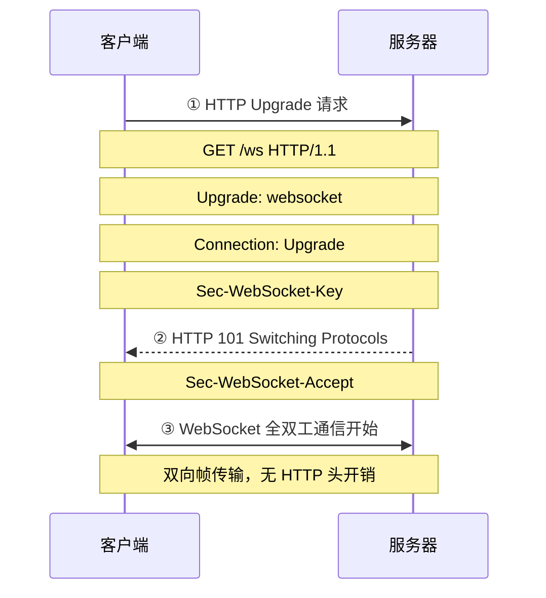

# HTML5 新特性

HTML5 是 HTML 的第五次重大修改，引入了大量新特性和 API，大幅提升了 Web 应用的能力。

## 1. 语义化标签

HTML5 新增了大量语义化标签，使页面结构更清晰、可读性更强：

```html
<!-- 页面结构标签 -->
<header>页面头部</header>
<nav>导航栏</nav>
<main>
  <article>
    <section>文章内容区块</section>
  </article>
  <aside>侧边栏</aside>
</main>
<footer>页面底部</footer>

<!-- 语义化元素 -->
<figure>
  
  <figcaption>图1：2024年数据趋势</figcaption>
</figure>

<mark>高亮文本</mark>
<time datetime="2024-01-01">2024年1月1日</time>
<progress value="70" max="100">70%</progress>
<meter value="3" min="0" max="10">3 of 10</meter>
<details>
  <summary>点击展开</summary>
  展开后的详细内容
</details>
```

**语义化标签的浏览器默认样式：**

- `display: block`（大部分）
- `display: inline`（`mark`, `time`, `span`类似元素）

## 2. 多媒体标签

```html
<!-- video 元素 -->
<video width="640" height="480" controls poster="cover.jpg" preload="metadata">
  <source src="movie.mp4" type="video/mp4">
  <source src="movie.webm" type="video/webm">
  <!-- 兼容旧浏览器 -->
  您的浏览器不支持 video 标签。
</video>

<!-- audio 元素 -->
<audio controls>
  <source src="music.mp3" type="audio/mpeg">
  <source src="music.ogg" type="audio/ogg">
  您的浏览器不支持 audio 元素。
</audio>

<!-- source 元素：让浏览器选择支持的格式 -->
<!-- track 元素：字幕 -->
<video src="movie.mp4">
  <track kind="subtitles" src="subs_zh.vtt" srclang="zh" label="中文" default>
  <track kind="subtitles" src="subs_en.vtt" srclang="en" label="English">
</video>
```

**video/audio 常用属性：**

- `controls`：显示播放控件
- `autoplay`：自动播放（现代浏览器需配合 muted）
- `loop`：循环播放
- `muted`：静音
- `preload`：预加载策略（`none`/`metadata`/`auto`）
- `poster`（video专有）：封面图

## 3. 表单增强

HTML5 大幅增强了表单功能，引入了大量新的 input 类型和属性：

```html
<form action="/api/submit" method="POST">
  <!-- 新的 input 类型 -->
  <input type="email" placeholder="请输入邮箱" required>
  <input type="url" placeholder="请输入网址">
  <input type="tel" placeholder="请输入手机号" pattern="1[3-9]\d{9}">
  <input type="number" min="0" max="100" step="5" value="50">
  <input type="range" min="0" max="100" value="50" id="range">
  <input type="date">
  <input type="time">
  <input type="datetime-local">
  <input type="month">
  <input type="week">
  <input type="color" value="#ff0000">

  <!-- 新属性 -->
  <input type="text" autocomplete="off" spellcheck="true">
  <input type="text" autofocus>
  <input type="text" multiple> <!-- file input 多选 -->
  <input type="text" pattern="[A-Za-z]{3}">

  <!-- datalist 候选输入 -->
  <input list="browsers" placeholder="选择或输入浏览器">
  <datalist id="browsers">
    <option value="Chrome">
    <option value="Firefox">
    <option value="Safari">
  </datalist>

  <!-- 输出元素 -->
  <output for="range" name="result">50</output>

  <button type="submit">提交</button>
</form>
```

**表单验证 API：**
```javascript
const input = document.querySelector('input[type="email"]');
input.checkValidity(); // 返回布尔值
input.validity.valid;   // 是否有效
input.validity.valueMissing;
input.validity.typeMismatch;
input.validity.patternMismatch;
input.setCustomValidity('自定义错误信息');
input.reportValidity();
```

## 4. Canvas 画布

Canvas 是 HTML5 新增的位图画布，通过 JavaScript 动态绑定绘图：

```javascript
const canvas = document.getElementById('myCanvas');
const ctx = canvas.getContext('2d'); // 2D 绑定

// 设置分辨率（高清屏适配）
const dpr = window.devicePixelRatio;
canvas.width = canvas.offsetWidth * dpr;
canvas.height = canvas.offsetHeight * dpr;
ctx.scale(dpr, dpr);

// 绑定矩形
ctx.fillStyle = '#ff0000';
ctx.fillRect(10, 10, 100, 100);
ctx.strokeStyle = 'blue';
ctx.strokeRect(10, 10, 100, 100);

// 绑定路径
ctx.beginPath();
ctx.moveTo(50, 50);
ctx.lineTo(150, 50);
ctx.lineTo(100, 150);
ctx.closePath();
ctx.fill();

// 绑定文本
ctx.font = '20px Arial';
ctx.fillText('Hello Canvas', 10, 50);

// 绑定图片
const img = new Image();
img.onload = () => ctx.drawImage(img, 0, 0, 200, 200);
img.src = 'image.png';

// 绑定渐变
const gradient = ctx.createLinearGradient(0, 0, 200, 0);
gradient.addColorStop(0, 'red');
gradient.addColorStop(1, 'blue');
ctx.fillStyle = gradient;
ctx.fillRect(0, 0, 200, 100);

// 清空画布
ctx.clearRect(0, 0, canvas.width, canvas.height);
```

**Canvas 与 SVG 的对比（见 [Canvas、SVG 与多媒体](media-canvas-svg.md)）**

## 5. Web Storage 本地存储

| 特性 | sessionStorage | localStorage |
|------|----------------|---------------|
| 生命周期 | 标签页关闭即清除 | 永久保存（手动清除） |
| 作用域 | 同源同标签页 | 同源跨标签页共享 |
| 容量 | 约 5MB | 约 5-10MB |
| API | 同步 | 同步 |

```javascript
// localStorage
localStorage.setItem('name', 'Alice');
localStorage.getItem('name');        // 'Alice'
localStorage.getItem('age');         // null（不存在）
localStorage.setItem('age', 25);
localStorage.removeItem('age');
localStorage.clear();

// 只能存字符串，需 JSON 序列化
localStorage.setItem('user', JSON.stringify({ name: 'Alice', age: 25 }));
const user = JSON.parse(localStorage.getItem('user'));

// sessionStorage
sessionStorage.setItem('token', 'abc123');
sessionStorage.getItem('token');

// storage 事件监听（localStorage 跨标签页通信）
window.addEventListener('storage', (e) => {
  console.log('key:', e.key);
  console.log('oldValue:', e.oldValue);
  console.log('newValue:', e.newValue);
  console.log('url:', e.url);
});
```

**IndexedDB：** 大规模结构化数据存储，支持索引、事务，适合离线 Web 应用。

```javascript
// 第 1 段：打开数据库并声明版本号（触发升级机制、拿到异步请求句柄）
// indexedDB.open 是异步的：它立即返回 IDBOpenDBRequest，真正的连接要等后续事件回调才可用。
// 第二个参数 1 是 schema 版本契约——首次创建或版本号变大时才走升级流程。
// 易错点：版本只能升不能降，若线上已发布更高版本，回退此代码会触发 VersionError 进入 onerror。
const request = indexedDB.open('MyDatabase', 1);

// 第 2 段：onupgradeneeded —— 建对象仓库与索引，仅在版本变化时执行
// 这是唯一允许改结构（objectStore / index）的生命周期钩子，在别的回调里建表会抛异常。
// e.target.result 是本次升级中的 IDBDatabase；此时它还不能用于常规业务事务，只能做 schema 与初始化。
request.onupgradeneeded = (e) => {
  const db = e.target.result;
  // contains 检查保证幂等：版本从 1 升到 2 时不会把已存在的 users 再建一次而报错。
  if (!db.objectStoreNames.contains('users')) {
    // keyPath:'id' 是"内联键"：写入的对象必须自带 id 字段，它成为唯一主键（天然带索引）。
    const store = db.createObjectStore('users', { keyPath: 'id' });
    // 为 name 建非唯一索引，供后续按姓名检索；unique:false 允许重名，是常见的查询加速手段。
    store.createIndex('name', 'name', { unique: false });
  }
};

// 第 3 段：onsuccess —— 连接就绪后开启读事务写数据
// 该回调既可能来自"新建库"，也可能来自"打开已存在的库"，两种路径都会走到这里，所以写数据前 schema 已就绪。
// IndexedDB 一切读写都必须包在事务中：transaction(scope, mode)，mode 决定是否可写。
// 边界：这里未监听 tx.oncomplete/onerror，写入失败（主键冲突、配额超限）会被静默吞掉，生产环境需补齐。
request.onsuccess = (e) => {
  const db = e.target.result;
  // 事务范围只锁 users 仓库，范围越窄并发越好；当没有新请求排队时事务自动提交。
  const tx = db.transaction('users', 'readwrite');
  const store = tx.objectStore('users');
  // add 是"仅新增"：主键已存在会抛 ConstraintError 并中止；id:1 首次写入，故安全。
  store.add({ id: 1, name: 'Alice', age: 25 });
  // put 是 upsert：主键存在则覆盖、不存在则插入；id:2 尚不存在，效果等同新增。
  store.put({ id: 2, name: 'Bob', age: 30 });
};
```

## 6. WebSocket 全双工通信

### 6.1 定义与核心原理

**WebSocket** 是一种在单个 TCP 连接上提供**全双工（full-duplex）通信**的协议，由 HTML5 标准引入（RFC 6455）。与 HTTP 的"请求→响应"模式不同，WebSocket 建立连接后，服务器和客户端可**随时互相发送数据**，无需每次重新建立连接。

**核心原理：**

- 通过 HTTP handshake（握手）建立连接，随后协议从 HTTP"升级"为 WebSocket
- 连接建立后是持久的 TCP 连接，双方可随时发送帧（frame）
- 头部开销极小（每帧仅 2-14 字节），适合高频数据交换

### 6.2 产生背景：为什么需要 WebSocket？

**传统实时通信方案的困境：**

| 方案 | 原理 | 致命缺陷 |
|------|------|----------|
| 短轮询（Short Polling） | 客户端每隔 N 秒发 HTTP 请求 | 99% 请求是无效的，浪费带宽 |
| 长轮询（Long Polling） | 请求挂起直到服务器有数据 | 仍然是一请求一响应，服务端压力大 |
| 双向通信模拟（ Comet） | 综合轮询+流式传输 | 实现复杂，HTTP 头开销巨大（每个消息带完整 HTTP 头） |

**WebSocket 的诞生：**

- 2011 年，RFC 6455 正式标准化
- 一次 HTTP 握手 → 升级为 WebSocket → 持久 TCP 连接
- 消除 HTTP 头开销，支持任意时刻双向推送
- 适用于：聊天、游戏、实时协作、金融行情、物联网等场景

### 6.3 握手与连接建立流程



**握手算法（Sec-WebSocket-Key 验证）：**
```javascript
// 客户端生成 Key
const key = 'dGhlIHNhbXBsZSBb25seQ=='; // 示例 key
const MAGIC_STRING = '258EAFA5-E914-47DA-95CA-C5AB0DC85B11';
const accept = sha1(key + MAGIC_STRING); // SHA-1 后 base64 编码
// 服务器返回 Sec-WebSocket-Accept，浏览器自动验证
```

### 6.4 帧结构（RFC 6455）

WebSocket 通信的基本单元是**帧（Frame）**，每个帧格式如下：

```
字节 0: FIN + opcode(4) + RSV1-3(3位)
字节 1: MASK(1位) + payload_len(7位)
字节 2-3 (或 2-8): 扩展长度 / Masking-Key

负载数据
```

| 位 | 含义 |
|----|------|
| **FIN**（1位） | 是否是最后一帧（1=是，0=继续帧） |
| **opcode**（4位） | 帧类型：`0x0`=继续帧，`0x1`=文本，`0x2`=二进制，`0x8`=关闭，`0x9`=Ping，`0xA`=Pong |
| **MASK**（1位） | 客户端→服务器必须置 1（数据被掩码） |
| **payload_len**（7位） | 负载长度（<126 直接表示，126=后续2字节，127=后续8字节） |
| **Masking-Key**（32位） | 掩码密钥（仅 MASK=1 时存在） |

**为什么掩码？** 防止恶意代理服务器注入攻击数据。客户端使用 32 位随机密钥对数据做 XOR 掩码，服务端解码。

### 6.5 代码级示例

```javascript
// 客户端 WebSocket 封装（含心跳 + 自动重连）
class RobustWebSocket {
  constructor(url, options = {}) {
    this.url = url;
    this.pingTimeout = options.pingTimeout ?? 8000;     // 发心跳间隔
    this.pongTimeout = options.pongTimeout ?? 15000;     // 收心跳超时
    this.reconnectInterval = options.reconnectInterval ?? 3000;
    this.maxAttempts = options.maxAttempts ?? 10;
    this.attempts = 0;
    this.ws = null;
    this.pingTimer = null;
    this.pongTimer = null;
    this.lockReconnect = false; // 防重复连接
    this.connect();
  }

  connect() {
    try {
      this.ws = new WebSocket(this.url);
      this.ws.onopen = () => this.#onOpen();
      this.ws.onmessage = (e) => this.#onMessage(e);
      this.ws.onerror = (e) => this.#onError(e);
      this.ws.onclose = (e) => this.#onClose(e);
    } catch (e) {
      this.#reconnect();
    }
  }

  // 握手成功后启动心跳
  #onOpen() {
    console.log('[WS] 连接已建立');
    this.attempts = 0;
    this.#startHeartbeat();
  }

  // 收到任何消息 → 重置心跳计时器
  #onMessage(event) {
    try {
      const data = JSON.parse(event.data);
      if (data.type === 'pong') {
        this.#resetPongTimer();
      } else {
        this.#handleMessage(data);
      }
    } catch {
      this.#handleMessage(event.data);
    }
    this.#resetPongTimer();
  }

  #onError(error) {
    console.error('[WS] 错误:', error);
  }

  #onClose(event) {
    console.log('[WS] 连接关闭，code:', event.code);
    this.#stopHeartbeat();
    if (event.code !== 1000) { // 非正常关闭则重连
      this.#reconnect();
    }
  }

  #startHeartbeat() {
    this.#stopHeartbeat();
    this.pingTimer = setTimeout(() => {
      if (this.ws?.readyState === WebSocket.OPEN) {
        this.ws.send(JSON.stringify({ type: 'ping', ts: Date.now() }));
        this.#startPongTimer();
      }
    }, this.pingTimeout);
  }

  #stopHeartbeat() {
    clearTimeout(this.pingTimer);
    clearTimeout(this.pongTimer);
  }

  #startPongTimer() {
    this.pongTimer = setTimeout(() => {
      console.warn('[WS] 心跳超时，强制重连');
      this.ws.close();
      this.#reconnect();
    }, this.pongTimeout);
  }

  #resetPongTimer() {
    clearTimeout(this.pongTimer);
  }

  #reconnect() {
    if (this.lockReconnect) return;
    if (this.attempts >= this.maxAttempts) {
      console.error('[WS] 达到最大重连次数');
      return;
    }
    this.lockReconnect = true;
    this.attempts++;
    console.log(`[WS] ${this.reconnectInterval}ms 后第 ${this.attempts} 次重连...`);
    setTimeout(() => {
      this.lockReconnect = false;
      this.connect();
    }, this.reconnectInterval);
  }

  #handleMessage(data) {
    // 业务逻辑子类覆盖
  }

  send(data) {
    if (this.ws?.readyState === WebSocket.OPEN) {
      this.ws.send(JSON.stringify(data));
    }
  }

  close(code = 1000, reason = 'normal') {
    this.#stopHeartbeat();
    this.ws?.close(code, reason);
  }
}

// 使用
const ws = new RobustWebSocket('wss://api.example.com/ws', {
  pingTimeout: 8000,
  pongTimeout: 15000,
  reconnectInterval: 3000,
  maxAttempts: 10
});
```

### 6.6 常见应用场景

| 场景 | 说明 | 为什么选 WebSocket |
|------|------|------------------|
| 即时聊天（IM） | 消息实时送达 | 全双工，高频双向推送 |
| 在线游戏 | 帧同步，延迟敏感 | 低延迟，支持二进制帧 |
| 实时协作编辑 | 多人同时编辑同一文档 | 双向推送，即时同步 |
| 金融行情 | 股票/加密货币价格实时更新 | 高频单向推送（可考虑 SSE） |
| 物联网（IoT） | 设备状态实时上报 | 持久连接，减少电量消耗 |
| 视频会议 | 信令（SDP/ICE）传输 | 低延迟可靠传输 |
| 直播弹幕 | 弹幕实时显示 | 连接量大的推送场景 |

### 6.7 为什么不直接用轮询？重连策略详解

**为什么不用轮询？**
```
短轮询：每 5 秒一次 → 每天 17280 次 HTTP 请求，其中 99% 无数据返回
长轮询：请求挂起 → 服务端并发受限 → 1 万并发用户需要 1 万个挂起连接

WebSocket：一次握手持久连接 → 每天仅 1 次握手 + 心跳包（每 30 秒）
HTTP 头对比：HTTP 请求头 ~500 字节 vs WebSocket 帧头 2 字节
           → 带宽节省 ~99.6%
```

**重连策略（指数退避 + 抖动）：**
```javascript
#reconnect() {
  // 指数退避：1s → 2s → 4s → 8s... 上限 30s
  const delay = Math.min(30000, this.reconnectInterval * Math.pow(2, this.attempts - 1));
  // 随机抖动 ±30%，避免惊群效应
  const jitter = delay * (0.7 + Math.random() * 0.6);
  setTimeout(() => this.connect(), jitter);
}
```

### 6.8 WebSocket vs HTTP vs SSE vs 长轮询（完整对比表）

| 维度 | HTTP 轮询 | 长轮询 | **SSE** | **WebSocket** |
|------|:---------:|:------:|:-------:|:------------:|
| 方向 | 客户端→服务端 | 客户端→服务端 | **服务端→客户端** | **双向全双工** |
| 连接特性 | 短连接 | 挂起连接 | 长连接（持久） | 长连接（持久） |
| 协议基础 | HTTP | HTTP | HTTP（text/event-stream） | TCP（升级） |
| 头部开销 | 高（每请求） | 高 | 低（仅首次） | **极低（每帧 2 字节）** |
| 服务器推送 | 否 | 否 | 是 | 是 |
| 客户端推送 | 是 | 是 | 否 | 是 |
| 断线重连 | 浏览器自动 | 浏览器自动 | **自动重连** | **需手动实现** |
| 二进制支持 | 是（Base64/表单） | 是 | 否（仅文本） | 是（原生二进制帧） |
| 兼容性 | 极高 | 高 | IE 不支持 | 现代浏览器 |
| 实现复杂度 | 低 | 中 | 低 | 中高 |
| 适用场景 | 低频轮询 | 中频轮询 | **推送通知、聊天、实时数据** | **实时游戏、双向协作** |
| 可穿透防火墙 | 是 | 是 | 是 | 是（HTTP 升级） |
| 支持代理 | 是 | 是 | 部分 | 部分（可能降级为 HTTP） |

> **选型建议：**
>
> - **只需服务端推送**（如通知、实时数据、股票行情）→ SSE（实现简单，自动重连，原生 HTTP）
> - **需要双向通信**（聊天、游戏、实时协作）→ WebSocket
> - **低频轮询**（每隔几十秒查一次）→ 短轮询（最简单的方案）
> - **高频单向推送，但浏览器不支持 SSE** → WebSocket

### 6.9 常见坑点与最佳实践

| 坑点 | 说明 | 解决方案 |
|------|------|----------|
| **代理服务器截断** | 某些代理服务器不认识 WebSocket 升级，可能关闭连接 | 使用 WSS（TLS 加密）；配置 nginx proxy_read_timeout |
| **连接数限制** | 浏览器同源 WebSocket 连接数有限制（各浏览器不同） | 使用连接池；或用 SSE 代替单向推送 |
| **心跳被浏览器节流** | 页面后台时 setTimeout 可能被合并 | 使用 `visibilitychange` 事件，页面不可见时停止心跳 |
| **消息丢失** | 网络断开时 send 的消息不会自动重发 | 应用层实现确认机制（ACK）+ 重发队列 |
| **粘包/拆包** | 消息可能被分割或合并 | 自定义消息边界（长度前缀 / 分隔符 / JSON envelope） |
| **重连风暴** | 大面积断线后所有客户端同时重连 | **指数退避 + 随机抖动** |
| **内存泄漏** | onmessage 中不断创建对象未释放 | 对象池复用；注意定时器未清理 |
| **TLS 终止前泄露** | 在 nginx 前面终止 TLS 时数据不加密 | nginx 1.3.13+ 支持 proxy_wsockify |
| **nginx 默认超时** | nginx 默认 proxy_read_timeout 60s | 设置 `proxy_read_timeout 86400;` |

**Nginx WebSocket 配置：**
```nginx
location /ws {
    proxy_pass http://backend;
    proxy_http_version 1.1;
    proxy_set_header Upgrade $http_upgrade;
    proxy_set_header Connection "upgrade";
    proxy_read_timeout 86400;       # 24 小时不断连
    proxy_send_timeout 86400;
}
```

### 6.10 高频面试追问

**Q1：WebSocket 断线后如何保证消息可靠性？**
> 采用应用层 ACK + 重发队列机制：
>
> 1. 每条消息带唯一 `id`
> 2. 发送后等待服务端 `ack`（N 秒内未收到则重发）
> 3. 服务端维护去重集合（Set），收到重复 `id` 直接返回 `ack` 不重复处理
> 4. 对于极高可靠性场景，使用 MQ（Kafka/RabbitMQ）作为消息总线

**Q2：WebSocket 如何实现房间/群组功能？**
> 方案一：**服务端维护路由表** —— 每个连接 fd 关联一个 userId；joinRoom 时在 Redis/内存中建立 userId → [fd] 映射；广播时遍历房间内所有 fd
> 方案二：**消息中携带房间 ID** —— 客户端发送时带 `roomId`，服务端路由根据消息 `roomId` 转发到对应订阅者
> 方案三：**使用 Socket.IO 等封装库** —— 库自带 rooms 抽象，内部处理 fd 与房间映射

**Q3：WebSocket 与 WebRTC 如何选型？**
> WebSocket：适合**应用层数据**（文本/JSON，二进制协议），基于 TCP，可靠传输
> WebRTC：适合**媒体流**（音视频），基于 UDP，低延迟，支持 P2P 直连
> 实际架构：WebSocket 用于信令通道（交换 SDP/ICE），WebRTC 用于实际媒体传输

**Q4：如何检测 WebSocket 连接是否真正存活？**
> 仅靠 `onopen` 不够——可能网络已断开但 TCP 连接未检测到关闭。
> 正确做法：定期发送**应用层心跳**（ping/pong），在 `onmessage` 中重置计时器；若计时器超时则判定为断连。
> RFC 6455 原生提供 Ping/Pong 帧（opcode 0x9/0xA），但浏览器的 WebSocket API **不暴露**这些帧，需自行用 JSON 消息模拟。

> 参考：
>
> - [RFC 6455 - The WebSocket Protocol](https://datatracker.ietf.org/doc/html/rfc6455)
> - [MDN WebSocket API](https://developer.mozilla.org/en-US/docs/Web/API/WebSocket)
> - [实时技术对比: SSE vs WebSocket vs Long Polling](https://cloud.tencent.com/developer/article/2521124)
> - [WebSocket心跳重连机制](https://cloud.tencent.com/developer/article/2182509)

### 6.11 与 SSE 的关联

> **注意：SSE（Server-Sent Events）是网络协议部分的知识点，在"HTML 新特性"部分仅简介。SSE 的详细原理、代码示例、与 WebSocket 的完整对比请详见网络协议部分的 SSE 专题。
>
> 在 HTML 章节中你需要掌握的：SSE 是**单向**（服务端→客户端）的实时通信技术，使用 `EventSource` API，在只需要服务器推送的场景下（通知、实时数据）比 WebSocket 轻量得多，且**原生支持自动重连**。

## 7. History API 与路由

History API 允许 JavaScript 操作浏览器历史记录，实现无刷新页面切换：

```javascript
// 导航
history.pushState({ page: 1 }, 'Page 1', '/page1');
history.replaceState({ page: 2 }, 'Page 2', '/page2');

// 前进/后退
history.back();      // 后退
history.forward();   // 前进
history.go(-2);      // 后退两步

// 监听浏览器前进/后退（popstate 事件）
window.addEventListener('popstate', (event) => {
  if (event.state) {
    console.log('当前页面状态:', event.state);
    renderPage(location.pathname);
  }
});

// 监听链接点击（单页应用路由示例）
document.addEventListener('click', (e) => {
  const link = e.target.closest('a[data-spa]');
  if (link) {
    e.preventDefault();
    const url = link.getAttribute('href');
    history.pushState(null, '', url);
    renderPage(url);
  }
});
```

**pushState/replaceState 区别：**

- `pushState`：创建新历史记录（可后退）
- `replaceState`：替换当前历史记录（不可后退）

## 8. Geolocation 地理定位

```javascript
if (navigator.geolocation) {
  // 获取当前位置
  navigator.geolocation.getCurrentPosition(
    (position) => {
      const { latitude, longitude, accuracy } = position.coords;
      console.log(`纬度: ${latitude}, 经度: ${longitude}, 精度: ${accuracy}m`);
    },
    (error) => {
      switch (error.code) {
        case error.PERMISSION_DENIED: console.log('用户拒绝定位'); break;
        case error.POSITION_UNAVAILABLE: console.log('位置不可用'); break;
        case error.TIMEOUT: console.log('请求超时'); break;
      }
    },
    { enableHighAccuracy: true, timeout: 10000, maximumAge: 0 }
  );

  // 持续监听位置变化
  const watchId = navigator.geolocation.watchPosition(
    (position) => { /* 持续更新 */ },
    null,
    { frequency: 5000 }
  );

  // 停止监听
  navigator.geolocation.clearWatch(watchId);
}
```

## 9. Drag and Drop 拖放 API

```html
<div id="source" draggable="true" style="width:100px;height:100px;background:red;"></div>
<div id="target" style="width:200px;height:200px;background:#eee;margin-top:20px;"></div>
```

```javascript
const source = document.getElementById('source');
const target = document.getElementById('target');

// 被拖拽元素
source.addEventListener('dragstart', (e) => {
  e.dataTransfer.setData('text/plain', 'Hello');
  e.dataTransfer.effectAllowed = 'copy';
  console.log('开始拖拽');
});

source.addEventListener('dragend', (e) => {
  console.log('拖拽结束');
});

// 目标元素
target.addEventListener('dragover', (e) => {
  e.preventDefault(); // 阻止默认行为（允许 drop）
  e.dataTransfer.dropEffect = 'copy';
});

target.addEventListener('dragenter', (e) => {
  target.style.background = '#ddd';
});

target.addEventListener('dragleave', (e) => {
  target.style.background = '#eee';
});

target.addEventListener('drop', (e) => {
  e.preventDefault();
  const data = e.dataTransfer.getData('text/plain');
  console.log('接收到数据:', data);
  target.textContent = data;
});
```

## 深入阅读与参考

!!! tip "怎么用这些资料"
    先读「官方文档与规范」建立准确的概念，再读「源码与示例」核对细节，最后用「教程、书籍与视频」换一种讲法加深理解。每条都写明了读哪一节、带着什么问题读。

### 官方文档与规范

| 资源 | 为什么读 | 怎么读 |
|---|---|---|
| [MDN 拖放 API](https://developer.mozilla.org/en-US/docs/Web/API/HTML_Drag_and_Drop_API) | 拖放 API 权威入口，事件序列与 dataTransfer 用法讲得清楚。 | 先读事件流一节，重点看 dragover 必须调 preventDefault；动手做一个拖拽排序列表验证。 |
| [MDN History API](https://developer.mozilla.org/en-US/docs/Web/API/History_API) | History API 官方说明，pushState、replaceState 与 popstate 定义准确。 | 读 pushState 与 popstate 两节，边读边写无刷新路由，再测试前进后退与刷新页面。 |
| [MDN Navigation API](https://developer.mozilla.org/en-US/docs/Web/API/Navigation_API) | Navigation API 官方文档，理解它相对 History API 的改进与适用场景。 | 读 navigate 事件与拦截示例，与上条 History 写法对照，读完写一段差异总结。 |
| [MDN Storage API](https://developer.mozilla.org/en-US/docs/Web/API/Storage_API) | Storage API 文档，搞清 localStorage 配额、持久化与清理策略。 | 读 persist 与 estimate 示例，在不同浏览器各调用一次，记录配额与返回值的差异。 |
| [MDN Geolocation API](https://developer.mozilla.org/en-US/docs/Web/API/Geolocation_API) | Geolocation 官方文档，权限流程、错误码与隐私要求写得最完整。 | 读 getCurrentPosition 与错误处理一节；实现定位并处理拒绝授权，注意隐私提示写法。 |
| [MDN Canvas API](https://developer.mozilla.org/en-US/docs/Web/API/Canvas_API) | Canvas API 权威参考，2D 上下文与 OffscreenCanvas 概念齐全。 | 先读概述理清上下文与坐标系，再按需查具体方法；写一段绘图代码验证理解。 |
| [Using HTML form validation and the Constraint Validation API](https://developer.mozilla.org/en-US/docs/Web/HTML/Guides/Constraint_validation) | 约束校验官方指南，是表单增强与新输入类型的核心依据。 | 读约束与校验两节，把示例表单改成原生校验，再比较与手写 JS 校验的差异。 |
| [Writing WebSocket client applications](https://developer.mozilla.org/en-US/docs/Web/API/WebSockets_API/Writing_WebSocket_client_applications) | WebSocket 客户端官方指南，连接建立与消息收发讲解完整。 | 读创建连接与消息收发一节，照做实现客户端，再自行补上断线重连与心跳。 |
| [MDN IndexedDB](https://developer.mozilla.org/en-US/docs/Web/API/IndexedDB_API) | IndexedDB 概念页，补足 Web Storage 之外的结构化存储心智模型。 | 读数据库、对象存储、事务、游标四节；写一个存取结构化数据的小 demo。 |
| [MDN WebSockets API](https://developer.mozilla.org/en-US/docs/Web/API/WebSockets_API) | WebSockets API 参考，封装客户端时查属性、方法与事件最方便。 | 写客户端封装时对照 readyState 与事件表，实现重连、心跳与待发消息队列。 |

### 源码与示例

| 资源 | 为什么读 | 怎么读 |
|---|---|---|
| [Writing a WebSocket server in JavaScript (Deno)](https://developer.mozilla.org/en-US/docs/Web/API/WebSockets_API/Writing_a_WebSocket_server_in_JavaScript_Deno) | Deno 版 WebSocket 服务端示例，代码短，可直接跑通全双工通信。 | 先跑通示例，再逐行看帧解析与广播逻辑；改造为向多个客户端推送消息。 |

### 教程、书籍与视频

| 资源 | 为什么读 | 怎么读 |
|---|---|---|
| [MDN Canvas 教程](https://developer.mozilla.org/en-US/docs/Web/API/Canvas_API/Tutorial) | MDN Canvas 教程循序渐进，适合把绘图链路完整走通一遍。 | 按顺序做路径、变换、动画三章，每章动手复现；最后用所学做一个小游戏。 |
| [Working with the History API](https://developer.mozilla.org/en-US/docs/Web/API/History_API/Working_with_the_History_API) | 官方教程把 History API 各方法串成一套可用的前端路由方案。 | 跟着示例实现 pushState 路由与 popstate 处理，读完自行处理刷新与直达链接。 |

## 应用与行业实践

### 应用场景地图

| 场景 | 用到本页哪个知识点 | 典型技术选型 | 注意事项 |
| --- | --- | --- | --- |
| 后台管理的万行订单表格 | 语义化标签、表单增强、Web Storage | `<table>` 加 `<caption>`、`<input type="search">`、`localStorage` 存筛选词 | 不要对整表重排；先筛选后分页 |
| 低端安卓的首屏活动页 | 语义化标签、Web Storage | 服务端输出骨架，`localStorage` 存上次打开数据 | `localStorage` 同步读写会阻塞主线程 |
| 多人协作白板 | Canvas、WebSocket | `<canvas>` 2D 上下文，WebSocket 发送坐标帧 | 高频 `pointermove` 要合帧发送 |
| 视频直播弹幕页 | 多媒体标签、WebSocket | `<video>` 加 `<track>`，WebSocket 收弹幕 | 移动端自动播放受静音策略限制 |
| 单页应用商品详情分享 | History API | `history.pushState` 加 `popstate`，服务端 rewrite | 刷新深链会 404，需要服务端回退 |
| 外勤签到页 | Geolocation、Web Storage、表单增强 | `navigator.geolocation`，`localStorage` 缓存，`<input readonly>` | 需要 HTTPS；用户拒绝后要有手动地址回退 |
| 拖拽上传图片后台 | Drag and Drop、表单增强 | `dragover` 阻止默认，`<input type="file" accept="image/*">` | `drop` 不阻止默认会用新页面打开文件 |
| 跨标签页登录状态同步 | Web Storage | `storage` 事件监听同源页面 | `storage` 只在其他标签页触发 |

### 三个场景拆解

#### 场景 1：后台管理的万行订单表格

**业务背景**：客服每天要筛查几万条订单。页面一次渲染全部行，输入筛选和滚动都会卡。测量方法是打开 Chrome Performance 录制输入到列表更新，先记录当前耗时。

**怎么用本页知识解决**：先保留原生表格语义，再用 `type="search"` 承接筛选，用 `localStorage` 记住筛选词，同时分页渲染，不在输入过程中直接操作上万行 DOM。

```html
<table>
  <caption>订单列表</caption>
  <thead><tr><th>订单号</th><th>状态</th><th>金额</th></tr></thead>
  <tbody id="orderBody"><!-- 只渲染当前页数据 --></tbody>
</table>
<label for="keyword">关键词</label>
<input type="search" id="keyword" autocomplete="off">
<output id="resultCount">0 条结果</output>
<script>
  const keyword = document.getElementById('keyword');
  const resultCount = document.getElementById('resultCount');
  keyword.addEventListener('search', () => {
    const query = keyword.value.trim();
    localStorage.setItem('orderFilter', query);
    const rows = filterOrders(query); // 返回当前页
    renderPage(rows);
    resultCount.value = rows.total + ' 条结果';
  });
  keyword.value = localStorage.getItem('orderFilter') || '';
</script>
```

- `<caption>` 和 `<thead>` 让表头与数据区关系明确，读屏器能正确读列名。
- `<input type="search">` 复用浏览器自带清除按钮和输入法行为，不重复造控件。
- `localStorage` 只存短筛选词，不存整个列表，避免同步读写开销放大。
- 分页后 `renderPage(rows)` 只处理当前页，避免几万行 DOM 重排。
- 数据在服务端时，应把 `query` 交给接口过滤，前端只负责当前页状态和展示。

**怎么度量收益**：指标是筛选响应耗时、主线程长任务时长、滚动帧率。筛选响应用 `performance.now` 在输入事件开始与 `renderPage` 结束各打一次点，重复 20 次取 P95；滚动帧率用 Chrome Performance 面板录制 10 秒滚动查看掉帧。

**什么时候不该用**：如果订单数据在服务端一次返回几万条，前端筛选会占用内存，应改为服务端分页加索引。如果单元格包含行内编辑、树状层级或合并单元格，原生表格语义会限制交互，应改用数据网格库或虚拟树实现。

#### 场景 2：多人协作白板

**业务背景**：小型团队远程评审时要同时画框和写标注。参与者通常 2 到 8 人，笔画要求在 100ms 内同步。网络波动时容易漏画或乱序。

**怎么用本页知识解决**：用 `<canvas>` 绘制本地笔迹，按 `devicePixelRatio` 缩放避免高分屏模糊。通过 WebSocket 发送坐标点，远端收到后复用同一个绘制函数。

```js
const canvas = document.getElementById('board');
const ctx = canvas.getContext('2d');
const scale = window.devicePixelRatio || 1;
canvas.width = canvas.clientWidth * scale;
canvas.height = canvas.clientHeight * scale;
ctx.scale(scale, scale);

const ws = new WebSocket('wss://example.com/board');
let drawing = false;
function send(type, p) { if (ws.readyState === WebSocket.OPEN) ws.send(JSON.stringify({ type, p })); }
function draw(p) { ctx.fillRect(p.x, p.y, 2, 2); } // 本地与远端共用
canvas.addEventListener('pointerdown', (e) => { drawing = true; send('start', { x: e.clientX, y: e.clientY }); });
canvas.addEventListener('pointermove', (e) => { if (!drawing) return; draw({ x: e.clientX, y: e.clientY }); send('move', { x: e.clientX, y: e.clientY }); });
canvas.addEventListener('pointerup', () => { drawing = false; send('end'); });
ws.onmessage = (e) => draw(JSON.parse(e.data).p); // 远端复用本地绘制函数
```

- 本地 `pointermove` 先绘制，不等 WebSocket 回包，降低落笔延迟。
- 画布按 `devicePixelRatio` 放大，再用 `ctx.scale` 还原 CSS 坐标，避免笔迹模糊。
- 消息体带 `type`，以后加颜色、撤销、清空时分派更清楚。
- 本地与远端调用同一个 `draw`，避免维护两套绘制计算。
- 当前示例每个点都发送，生产环境要按动画帧合并点集后再发。

**怎么度量收益**：指标是本地绘制耗时、远端消息到达到绘制的间隔、WebSocket 发送频率。测量时在消息体中放 `clientSentAt` 时间戳，接收端用 `performance.now` 计算差值；用 Performance 面板录制本地画线 10 秒，查看长任务和绘制时间。

**什么时候不该用**：如果多人同时编辑同一批图形和文本，且要有历史版本、冲突合并，简单广播坐标无法保证顺序和一致性，应使用 CRDT 库。如果参与者达到几十人且需要权限、回放、审核，自建 WebSocket 广播不够，应使用专业协作后端。

#### 场景 3：外勤签到定位

**业务背景**：司机到店取货要记录位置和时间，部分仓库地下停车场没有 GPS。外勤手机网络不稳定，定位失败时不能卡住提交流程。

**怎么用本页知识解决**：用 `navigator.geolocation` 拿位置，成功后写入只读输入框并缓存到 `localStorage`。失败时读取最近一次成功位置，允许用户手动修改地址。

```html
<label for="addr">签到地址</label>
<input id="addr" name="addr" required readonly>
<input type="hidden" id="lat" name="lat"><input type="hidden" id="lng" name="lng">
<button type="submit">提交签到</button>
<script>
  const addr = document.getElementById('addr'), lat = document.getElementById('lat'), lng = document.getElementById('lng');
  function fallbackToCache() {
    const last = JSON.parse(localStorage.getItem('lastLocation') || 'null');
    if (!last) return; addr.value = last.addr; lat.value = last.lat; lng.value = last.lng;
  }
  navigator.geolocation.getCurrentPosition((pos) => {
    const c = pos.coords;
    lat.value = c.latitude; lng.value = c.longitude;
    addr.value = `${c.latitude.toFixed(6)}, ${c.longitude.toFixed(6)}`;
    localStorage.setItem('lastLocation', JSON.stringify({ addr: addr.value, lat: c.latitude, lng: c.longitude }));
    addr.removeAttribute('readonly'); // 定位成功后允许微调
  }, fallbackToCache, { timeout: 5000, maximumAge: 30000 });
</script>
```

- `localStorage` 存最近成功位置，定位失败时回退到缓存地址。
- `required` 加 `readonly` 避免提交空地址，也阻止初始状态被随意编辑。
- 成功定位后移除 `readonly`，给用户修正门牌号的机会。
- `timeout: 5000` 给定位一个 5 秒上界，失败立即走缓存回调。
- 生产环境要把原始坐标提交服务端，前端只负责展示和回退。

**怎么度量收益**：指标是定位成功率、定位耗时、回退缓存次数、提交成功率。在 `getCurrentPosition` 成功与失败回调中打点，记录 `Date.now() - startTime`，通过自建日志或 APM 汇总；提交成功率按服务端收到有效签到数除以页面提交数。

**什么时候不该用**：地下车库和室内仓库的 GPS 精度不足，不能仅靠前端定位作为到店唯一证据，需要接入 Wi-Fi、基站或扫码设备。需要防伪造签到时，前端坐标可被开发者工具修改，应把坐标提交服务端，并核对基站、IP、时间窗口等旁证。

### 行业先进实践

1. 渐进增强表单（出处：MDN Web 文档：HTML5 表单新增 input 类型）。默认使用 `type="email"`、`type="tel"`、`type="date"`，不支持时回退到 `text`。有效减少 JS 校验，移动端还能弹出对应键盘；你的项目应优先用原生类型，并在运行时检查 `input.type` 是否被浏览器改造。

2. History API 服务端回退（出处：React Router 官方文档）。SPA 深层链接都在服务端 rewrite 到 `index.html`，同时监听 `popstate`。有效避免刷新商品详情页时出现 404；借用这个做法时，部署前用 `curl` 请求 `/products/123` 验证返回应用入口。

3. WebSocket 自动重连和心跳（出处：Socket.IO 官方文档）。心跳包探测连接，断线后按指数退避重连。有效在移动网络切换后恢复实时通道；你的项目若自建 WebSocket，也要实现 ping/pong 和断线缓存。

4. Canvas 高 DPI 绘制（出处：Chart.js 开源项目）。读取 `window.devicePixelRatio`，先放大画布，再缩放上下文。有效避免高分屏图表模糊；你的项目应把这段逻辑封装成统一的 Canvas 初始化函数。

5. 视频字幕轨道（出处：MDN Web 文档：`<track>` 元素）。给 `<video>` 配 WebVTT 字幕轨，并设置 `kind="captions"`。有效让听力受限用户获得视频信息；运营视频应同时保存字幕文件 URL。

### 从学到用：落地路线

第 1 步 在后台订单筛选页试点：验收标准是页面主流程全部使用原生 HTML5 控件完成。

第 2 步 用 Chrome Performance 录制筛选输入和签到定位：验收标准是定位、绘制、筛选操作没有产生超过 50ms 的长任务。

第 3 步 推广到同组两个活动页并接入同一埋点：验收标准是三个页面的性能打点字段一致，服务端深链回退通过 `curl` 验证。

第 4 步 在 CI 中加入 `html-validate` 和 Playwright 移动端冒烟测试：验收标准是新增页面包含回退分支，不裸调用未检测的 API。

### 动手作业

目标：完成一个“外勤签到页”，覆盖语义化标签、表单增强、Geolocation、Web Storage 和 Canvas 签名。

步骤：

1. 用 `<header>`、`<main>`、`<form>` 搭页面结构，包含姓名、电话、地址字段。
2. 用 `input type="tel"`、`input type="date"` 和 `required` 做基础校验。
3. 添加定位按钮，调用 `navigator.geolocation.getCurrentPosition`，成功写地址并保存 `localStorage`。
4. 定位失败时读取 `localStorage` 的最近位置到地址框，并显示手动输入提示。
5. 添加 `<canvas>` 签名区，监听 `pointerdown`、`pointermove`、`pointerup`，提交前用 `toDataURL` 生成签名图。
6. 表单提交前把签名图和坐标拼进 `FormData`，模拟发送到服务端。
7. 用支持 HTTPS 的本地服务打开页面，记录定位成功与定位失败两条路径。

验收标准：

- 在 HTTPS 环境打开页面，点击定位后 5 秒内地址框出现经纬度或缓存地址。
- 拒绝定位权限后，表单仍可手动输入地址并提交。
- Canvas 用鼠标或触摸画出线条，提交时 `FormData` 包含签名图的 dataURL。
- 刷新页面后，最近一次成功定位能恢复到地址框。
- Elements 面板中存在 `<header>`、`<main>`、`<form>`，区块名称清晰。

