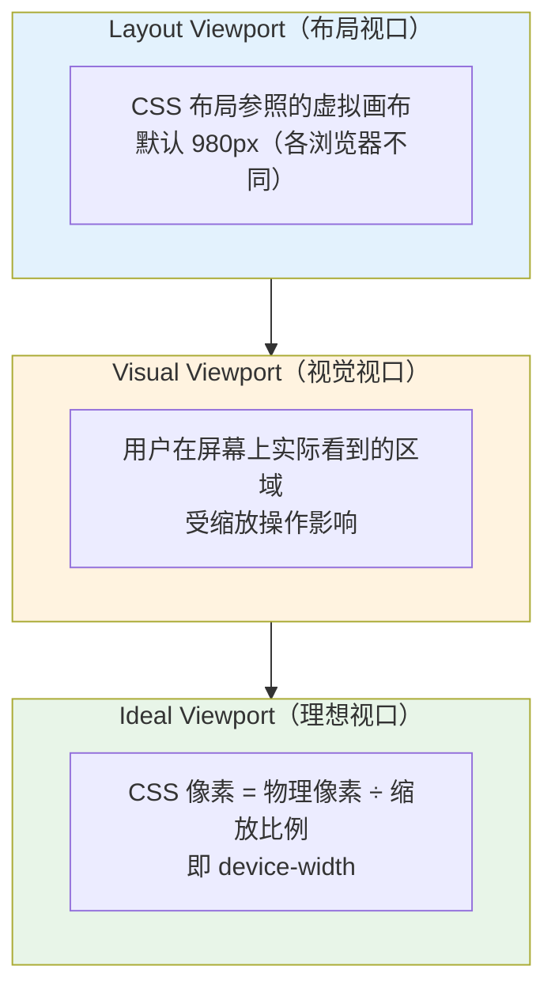
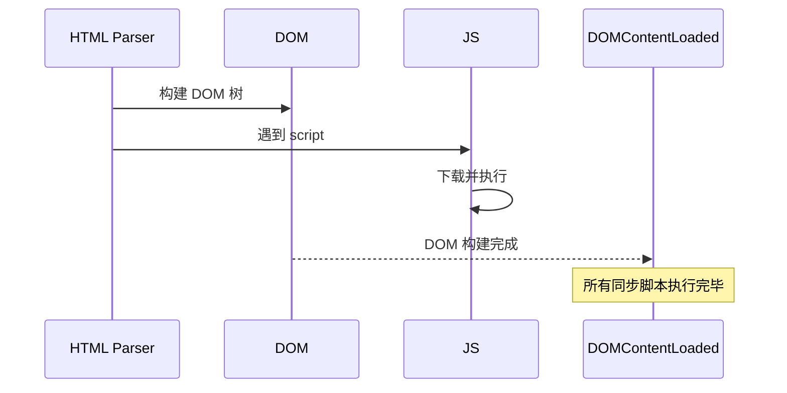
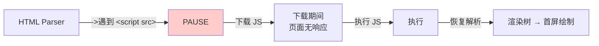
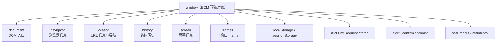
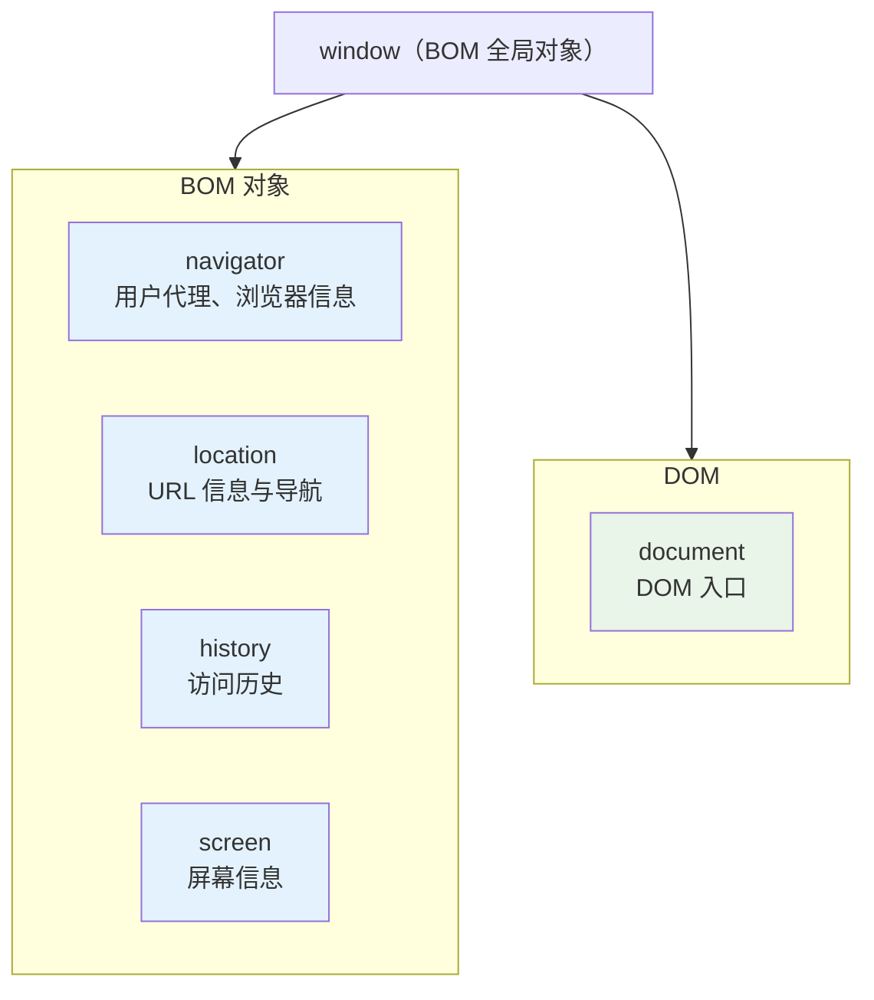
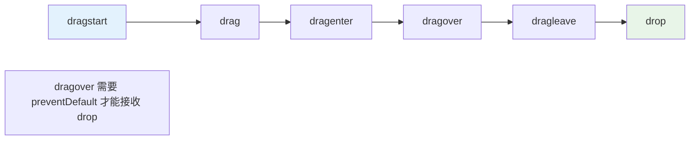
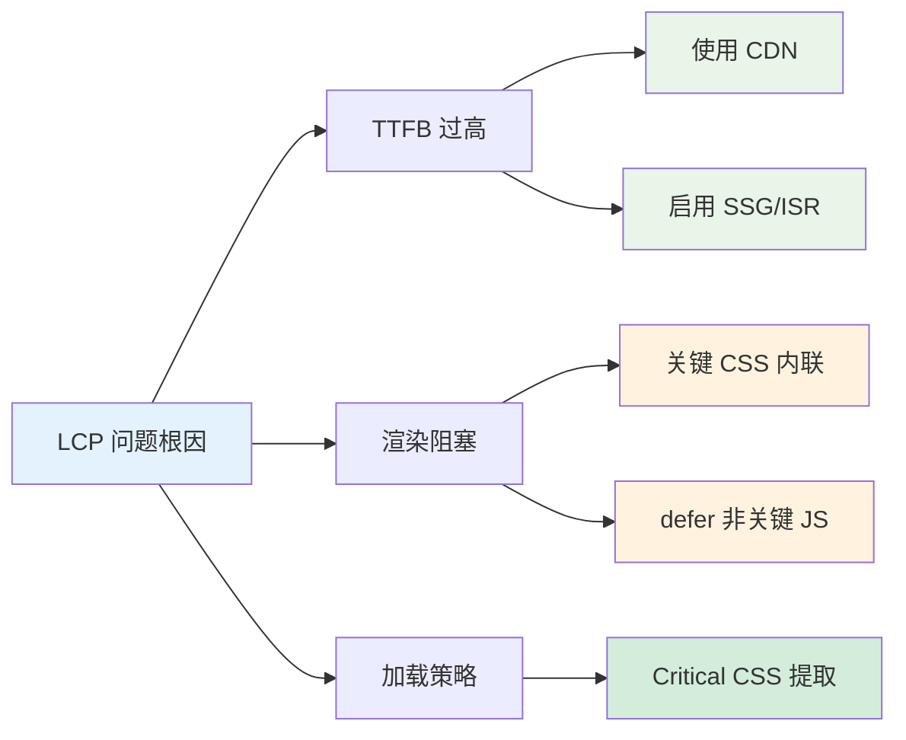

```mermaid
gantt
    title HTML 解析与资源加载时序
    dateFormat X
    axisFormat %sms

    section 无属性 (sync)
    HTML解析    :0, 80
    JS下载      :80, 130
    JS执行      :130, 150
    HTML恢复    :150, 200

    section link href
    HTML解析    :0, 300
    CSS下载     :0, 150

    section script src
    HTML解析    :0, 50
    JS下载      :50, 150
    JS执行      :150, 200
    HTML恢复    :200, 250

    section img src
    HTML解析    :0, 300
    图片下载    :100, 180
```

### 1. HTML5 新特性

HTML5 是 HTML 的第五次重大修改，引入了大量新特性和 API，大幅提升了 Web 应用的能力。

#### 1.1 语义化标签

HTML5 新增了大量语义化标签，使页面结构更清晰、可读性更强：

```html
<!-- 页面结构标签 -->
<header>页面头部</header>
<nav>导航栏</nav>
<main>
  <article>
    <section>文章内容区块</section>
  </article>
  <aside>侧边栏</aside>
</main>
<footer>页面底部</footer>

<!-- 语义化元素 -->
<figure>
  
  <figcaption>图1：2024年数据趋势</figcaption>
</figure>

<mark>高亮文本</mark>
<time datetime="2024-01-01">2024年1月1日</time>
<progress value="70" max="100">70%</progress>
<meter value="3" min="0" max="10">3 of 10</meter>
<details>
  <summary>点击展开</summary>
  展开后的详细内容
</details>
```

**语义化标签的浏览器默认样式：**
- `display: block`（大部分）
- `display: inline`（`mark`, `time`, `span`类似元素）

#### 1.2 多媒体标签

```html
<!-- video 元素 -->
<video width="640" height="480" controls poster="cover.jpg" preload="metadata">
  <source src="movie.mp4" type="video/mp4">
  <source src="movie.webm" type="video/webm">
  <!-- 兼容旧浏览器 -->
  您的浏览器不支持 video 标签。
</video>

<!-- audio 元素 -->
<audio controls>
  <source src="music.mp3" type="audio/mpeg">
  <source src="music.ogg" type="audio/ogg">
  您的浏览器不支持 audio 元素。
</audio>

<!-- source 元素：让浏览器选择支持的格式 -->
<!-- track 元素：字幕 -->
<video src="movie.mp4">
  <track kind="subtitles" src="subs_zh.vtt" srclang="zh" label="中文" default>
  <track kind="subtitles" src="subs_en.vtt" srclang="en" label="English">
</video>
```

**video/audio 常用属性：**
- `controls`：显示播放控件
- `autoplay`：自动播放（现代浏览器需配合 muted）
- `loop`：循环播放
- `muted`：静音
- `preload`：预加载策略（`none`/`metadata`/`auto`）
- `poster`（video专有）：封面图

#### 1.3 表单增强

HTML5 大幅增强了表单功能，引入了大量新的 input 类型和属性：

```html
<form action="/api/submit" method="POST">
  <!-- 新的 input 类型 -->
  <input type="email" placeholder="请输入邮箱" required>
  <input type="url" placeholder="请输入网址">
  <input type="tel" placeholder="请输入手机号" pattern="1[3-9]\d{9}">
  <input type="number" min="0" max="100" step="5" value="50">
  <input type="range" min="0" max="100" value="50" id="range">
  <input type="date">
  <input type="time">
  <input type="datetime-local">
  <input type="month">
  <input type="week">
  <input type="color" value="#ff0000">

  <!-- 新属性 -->
  <input type="text" autocomplete="off" spellcheck="true">
  <input type="text" autofocus>
  <input type="text" multiple> <!-- file input 多选 -->
  <input type="text" pattern="[A-Za-z]{3}">

  <!-- datalist 候选输入 -->
  <input list="browsers" placeholder="选择或输入浏览器">
  <datalist id="browsers">
    <option value="Chrome">
    <option value="Firefox">
    <option value="Safari">
  </datalist>

  <!-- 输出元素 -->
  <output for="range" name="result">50</output>

  <button type="submit">提交</button>
</form>
```

**表单验证 API：**
```javascript
const input = document.querySelector('input[type="email"]');
input.checkValidity(); // 返回布尔值
input.validity.valid;   // 是否有效
input.validity.valueMissing;
input.validity.typeMismatch;
input.validity.patternMismatch;
input.setCustomValidity('自定义错误信息');
input.reportValidity();
```

#### 1.4 Canvas 画布

Canvas 是 HTML5 新增的位图画布，通过 JavaScript 动态绑定绘图：

```javascript
const canvas = document.getElementById('myCanvas');
const ctx = canvas.getContext('2d'); // 2D 绑定

// 设置分辨率（高清屏适配）
const dpr = window.devicePixelRatio;
canvas.width = canvas.offsetWidth * dpr;
canvas.height = canvas.offsetHeight * dpr;
ctx.scale(dpr, dpr);

// 绑定矩形
ctx.fillStyle = '#ff0000';
ctx.fillRect(10, 10, 100, 100);
ctx.strokeStyle = 'blue';
ctx.strokeRect(10, 10, 100, 100);

// 绑定路径
ctx.beginPath();
ctx.moveTo(50, 50);
ctx.lineTo(150, 50);
ctx.lineTo(100, 150);
ctx.closePath();
ctx.fill();

// 绑定文本
ctx.font = '20px Arial';
ctx.fillText('Hello Canvas', 10, 50);

// 绑定图片
const img = new Image();
img.onload = () => ctx.drawImage(img, 0, 0, 200, 200);
img.src = 'image.png';

// 绑定渐变
const gradient = ctx.createLinearGradient(0, 0, 200, 0);
gradient.addColorStop(0, 'red');
gradient.addColorStop(1, 'blue');
ctx.fillStyle = gradient;
ctx.fillRect(0, 0, 200, 100);

// 清空画布
ctx.clearRect(0, 0, canvas.width, canvas.height);
```

**Canvas 与 SVG 的对比（见 1.9 节）**

#### 1.5 Web Storage 本地存储

| 特性 | sessionStorage | localStorage |
|------|----------------|---------------|
| 生命周期 | 标签页关闭即清除 | 永久保存（手动清除） |
| 作用域 | 同源同标签页 | 同源跨标签页共享 |
| 容量 | 约 5MB | 约 5-10MB |
| API | 同步 | 同步 |

```javascript
// localStorage
localStorage.setItem('name', 'Alice');
localStorage.getItem('name');        // 'Alice'
localStorage.getItem('age');         // null（不存在）
localStorage.setItem('age', 25);
localStorage.removeItem('age');
localStorage.clear();

// 只能存字符串，需 JSON 序列化
localStorage.setItem('user', JSON.stringify({ name: 'Alice', age: 25 }));
const user = JSON.parse(localStorage.getItem('user'));

// sessionStorage
sessionStorage.setItem('token', 'abc123');
sessionStorage.getItem('token');

// storage 事件监听（localStorage 跨标签页通信）
window.addEventListener('storage', (e) => {
  console.log('key:', e.key);
  console.log('oldValue:', e.oldValue);
  console.log('newValue:', e.newValue);
  console.log('url:', e.url);
});
```

**IndexedDB：** 大规模结构化数据存储，支持索引、事务，适合离线 Web 应用。

```javascript
const request = indexedDB.open('MyDatabase', 1);

request.onupgradeneeded = (e) => {
  const db = e.target.result;
  if (!db.objectStoreNames.contains('users')) {
    const store = db.createObjectStore('users', { keyPath: 'id' });
    store.createIndex('name', 'name', { unique: false });
  }
};

request.onsuccess = (e) => {
  const db = e.target.result;
  const tx = db.transaction('users', 'readwrite');
  const store = tx.objectStore('users');
  store.add({ id: 1, name: 'Alice', age: 25 });
  store.put({ id: 2, name: 'Bob', age: 30 });
};
```

#### 1.6 WebSocket 全双工通信

##### 1.6.1 定义与核心原理

**WebSocket** 是一种在单个 TCP 连接上提供**全双工（full-duplex）通信**的协议，由 HTML5 标准引入（RFC 6455）。与 HTTP 的"请求→响应"模式不同，WebSocket 建立连接后，服务器和客户端可**随时互相发送数据**，无需每次重新建立连接。

**核心原理：**
- 通过 HTTP handshake（握手）建立连接，随后协议从 HTTP"升级"为 WebSocket
- 连接建立后是持久的 TCP 连接，双方可随时发送帧（frame）
- 头部开销极小（每帧仅 2-14 字节），适合高频数据交换

##### 1.6.2 产生背景：为什么需要 WebSocket？

**传统实时通信方案的困境：**

| 方案 | 原理 | 致命缺陷 |
|------|------|----------|
| 短轮询（Short Polling） | 客户端每隔 N 秒发 HTTP 请求 | 99% 请求是无效的，浪费带宽 |
| 长轮询（Long Polling） | 请求挂起直到服务器有数据 | 仍然是一请求一响应，服务端压力大 |
| 双向通信模拟（ Comet） | 综合轮询+流式传输 | 实现复杂，HTTP 头开销巨大（每个消息带完整 HTTP 头） |

**WebSocket 的诞生：**
- 2011 年，RFC 6455 正式标准化
- 一次 HTTP 握手 → 升级为 WebSocket → 持久 TCP 连接
- 消除 HTTP 头开销，支持任意时刻双向推送
- 适用于：聊天、游戏、实时协作、金融行情、物联网等场景

##### 1.6.3 握手与连接建立流程

```mermaid
sequenceDiagram
    participant Client as 客户端
    participant Server as 服务器

    Client->>Server: ① HTTP Upgrade 请求
    Note over Client,Server: GET /ws HTTP/1.1
    Note over Client,Server: Upgrade: websocket
    Note over Client,Server: Connection: Upgrade
    Note over Client,Server: Sec-WebSocket-Key

    Server-->>Client: ② HTTP 101 Switching Protocols
    Note over Client,Server: Sec-WebSocket-Accept

    Client<=>Server: ③ WebSocket 全双工通信开始
    Note over Client,Server: 双向帧传输，无 HTTP 头开销
```

**握手算法（Sec-WebSocket-Key 验证）：**
```javascript
// 客户端生成 Key
const key = 'dGhlIHNhbXBsZSBb25seQ=='; // 示例 key
const MAGIC_STRING = '258EAFA5-E914-47DA-95CA-C5AB0DC85B11';
const accept = sha1(key + MAGIC_STRING); // SHA-1 后 base64 编码
// 服务器返回 Sec-WebSocket-Accept，浏览器自动验证
```

##### 1.6.4 帧结构（RFC 6455）

WebSocket 通信的基本单元是**帧（Frame）**，每个帧格式如下：

```
字节 0: FIN + opcode(4) + RSV1-3(3位)
字节 1: MASK(1位) + payload_len(7位)
字节 2-3 (或 2-8): 扩展长度 / Masking-Key

负载数据
```

| 位 | 含义 |
|----|------|
| **FIN**（1位） | 是否是最后一帧（1=是，0=继续帧） |
| **opcode**（4位） | 帧类型：`0x0`=继续帧，`0x1`=文本，`0x2`=二进制，`0x8`=关闭，`0x9`=Ping，`0xA`=Pong |
| **MASK**（1位） | 客户端→服务器必须置 1（数据被掩码） |
| **payload_len**（7位） | 负载长度（<126 直接表示，126=后续2字节，127=后续8字节） |
| **Masking-Key**（32位） | 掩码密钥（仅 MASK=1 时存在） |

**为什么掩码？** 防止恶意代理服务器注入攻击数据。客户端使用 32 位随机密钥对数据做 XOR 掩码，服务端解码。

##### 1.6.5 代码级示例

```javascript
// 客户端 WebSocket 封装（含心跳 + 自动重连）
class RobustWebSocket {
  constructor(url, options = {}) {
    this.url = url;
    this.pingTimeout = options.pingTimeout ?? 8000;     // 发心跳间隔
    this.pongTimeout = options.pongTimeout ?? 15000;     // 收心跳超时
    this.reconnectInterval = options.reconnectInterval ?? 3000;
    this.maxAttempts = options.maxAttempts ?? 10;
    this.attempts = 0;
    this.ws = null;
    this.pingTimer = null;
    this.pongTimer = null;
    this.lockReconnect = false; // 防重复连接
    this.connect();
  }

  connect() {
    try {
      this.ws = new WebSocket(this.url);
      this.ws.onopen = () => this.#onOpen();
      this.ws.onmessage = (e) => this.#onMessage(e);
      this.ws.onerror = (e) => this.#onError(e);
      this.ws.onclose = (e) => this.#onClose(e);
    } catch (e) {
      this.#reconnect();
    }
  }

  // 握手成功后启动心跳
  #onOpen() {
    console.log('[WS] 连接已建立');
    this.attempts = 0;
    this.#startHeartbeat();
  }

  // 收到任何消息 → 重置心跳计时器
  #onMessage(event) {
    try {
      const data = JSON.parse(event.data);
      if (data.type === 'pong') {
        this.#resetPongTimer();
      } else {
        this.#handleMessage(data);
      }
    } catch {
      this.#handleMessage(event.data);
    }
    this.#resetPongTimer();
  }

  #onError(error) {
    console.error('[WS] 错误:', error);
  }

  #onClose(event) {
    console.log('[WS] 连接关闭，code:', event.code);
    this.#stopHeartbeat();
    if (event.code !== 1000) { // 非正常关闭则重连
      this.#reconnect();
    }
  }

  #startHeartbeat() {
    this.#stopHeartbeat();
    this.pingTimer = setTimeout(() => {
      if (this.ws?.readyState === WebSocket.OPEN) {
        this.ws.send(JSON.stringify({ type: 'ping', ts: Date.now() }));
        this.#startPongTimer();
      }
    }, this.pingTimeout);
  }

  #stopHeartbeat() {
    clearTimeout(this.pingTimer);
    clearTimeout(this.pongTimer);
  }

  #startPongTimer() {
    this.pongTimer = setTimeout(() => {
      console.warn('[WS] 心跳超时，强制重连');
      this.ws.close();
      this.#reconnect();
    }, this.pongTimeout);
  }

  #resetPongTimer() {
    clearTimeout(this.pongTimer);
  }

  #reconnect() {
    if (this.lockReconnect) return;
    if (this.attempts >= this.maxAttempts) {
      console.error('[WS] 达到最大重连次数');
      return;
    }
    this.lockReconnect = true;
    this.attempts++;
    console.log(`[WS] ${this.reconnectInterval}ms 后第 ${this.attempts} 次重连...`);
    setTimeout(() => {
      this.lockReconnect = false;
      this.connect();
    }, this.reconnectInterval);
  }

  #handleMessage(data) {
    // 业务逻辑子类覆盖
  }

  send(data) {
    if (this.ws?.readyState === WebSocket.OPEN) {
      this.ws.send(JSON.stringify(data));
    }
  }

  close(code = 1000, reason = 'normal') {
    this.#stopHeartbeat();
    this.ws?.close(code, reason);
  }
}

// 使用
const ws = new RobustWebSocket('wss://api.example.com/ws', {
  pingTimeout: 8000,
  pongTimeout: 15000,
  reconnectInterval: 3000,
  maxAttempts: 10
});
```

##### 1.6.6 常见应用场景

| 场景 | 说明 | 为什么选 WebSocket |
|------|------|------------------|
| 即时聊天（IM） | 消息实时送达 | 全双工，高频双向推送 |
| 在线游戏 | 帧同步，延迟敏感 | 低延迟，支持二进制帧 |
| 实时协作编辑 | 多人同时编辑同一文档 | 双向推送，即时同步 |
| 金融行情 | 股票/加密货币价格实时更新 | 高频单向推送（可考虑 SSE） |
| 物联网（IoT） | 设备状态实时上报 | 持久连接，减少电量消耗 |
| 视频会议 | 信令（SDP/ICE）传输 | 低延迟可靠传输 |
| 直播弹幕 | 弹幕实时显示 | 连接量大的推送场景 |

##### 1.6.7 为什么不直接用轮询？重连策略详解

**为什么不用轮询？**
```
短轮询：每 5 秒一次 → 每天 17280 次 HTTP 请求，其中 99% 无数据返回
长轮询：请求挂起 → 服务端并发受限 → 1 万并发用户需要 1 万个挂起连接

WebSocket：一次握手持久连接 → 每天仅 1 次握手 + 心跳包（每 30 秒）
HTTP 头对比：HTTP 请求头 ~500 字节 vs WebSocket 帧头 2 字节
           → 带宽节省 ~99.6%
```

**重连策略（指数退避 + 抖动）：**
```javascript
#reconnect() {
  // 指数退避：1s → 2s → 4s → 8s... 上限 30s
  const delay = Math.min(30000, this.reconnectInterval * Math.pow(2, this.attempts - 1));
  // 随机抖动 ±30%，避免惊群效应
  const jitter = delay * (0.7 + Math.random() * 0.6);
  setTimeout(() => this.connect(), jitter);
}
```

##### 1.6.8 WebSocket vs HTTP vs SSE vs 长轮询（完整对比表）

| 维度 | HTTP 轮询 | 长轮询 | **SSE** | **WebSocket** |
|------|:---------:|:------:|:-------:|:------------:|
| 方向 | 客户端→服务端 | 客户端→服务端 | **服务端→客户端** | **双向全双工** |
| 连接特性 | 短连接 | 挂起连接 | 长连接（持久） | 长连接（持久） |
| 协议基础 | HTTP | HTTP | HTTP（text/event-stream） | TCP（升级） |
| 头部开销 | 高（每请求） | 高 | 低（仅首次） | **极低（每帧 2 字节）** |
| 服务器推送 | ❌ | ❌ | ✅ | ✅ |
| 客户端推送 | ✅ | ✅ | ❌ | ✅ |
| 断线重连 | 浏览器自动 | 浏览器自动 | **自动重连** | **需手动实现** |
| 二进制支持 | ✅（Base64/表单） | ✅ | ❌（仅文本） | ✅（原生二进制帧） |
| 兼容性 | 极高 | 高 | IE 不支持 | 现代浏览器 |
| 实现复杂度 | 低 | 中 | 低 | 中高 |
| 适用场景 | 低频轮询 | 中频轮询 | **推送通知、聊天、实时数据** | **实时游戏、双向协作** |
| 可穿透防火墙 | ✅ | ✅ | ✅ | ✅（HTTP 升级） |
| 支持代理 | ✅ | ✅ | 部分 | 部分（可能降级为 HTTP） |

> **选型建议：**
> - **只需服务端推送**（如通知、实时数据、股票行情）→ SSE（实现简单，自动重连，原生 HTTP）
> - **需要双向通信**（聊天、游戏、实时协作）→ WebSocket
> - **低频轮询**（每隔几十秒查一次）→ 短轮询（最简单的方案）
> - **高频单向推送，但浏览器不支持 SSE** → WebSocket

##### 1.6.9 常见坑点与最佳实践

| 坑点 | 说明 | 解决方案 |
|------|------|----------|
| **代理服务器截断** | 某些代理服务器不认识 WebSocket 升级，可能关闭连接 | 使用 WSS（TLS 加密）；配置 nginx proxy_read_timeout |
| **连接数限制** | 浏览器同源 WebSocket 连接数有限制（各浏览器不同） | 使用连接池；或用 SSE 代替单向推送 |
| **心跳被浏览器节流** | 页面后台时 setTimeout 可能被合并 | 使用 `visibilitychange` 事件，页面不可见时停止心跳 |
| **消息丢失** | 网络断开时 send 的消息不会自动重发 | 应用层实现确认机制（ACK）+ 重发队列 |
| **粘包/拆包** | 消息可能被分割或合并 | 自定义消息边界（长度前缀 / 分隔符 / JSON envelope） |
| **重连风暴** | 大面积断线后所有客户端同时重连 | **指数退避 + 随机抖动** |
| **内存泄漏** | onmessage 中不断创建对象未释放 | 对象池复用；注意定时器未清理 |
| **TLS 终止前泄露** | 在 nginx 前面终止 TLS 时数据不加密 | nginx 1.3.13+ 支持 proxy_wsockify |
| **nginx 默认超时** | nginx 默认 proxy_read_timeout 60s | 设置 `proxy_read_timeout 86400;` |

**Nginx WebSocket 配置：**
```nginx
location /ws {
    proxy_pass http://backend;
    proxy_http_version 1.1;
    proxy_set_header Upgrade $http_upgrade;
    proxy_set_header Connection "upgrade";
    proxy_read_timeout 86400;       # 24 小时不断连
    proxy_send_timeout 86400;
}
```

##### 1.6.10 高频面试追问

**Q1：WebSocket 断线后如何保证消息可靠性？**
> 采用应用层 ACK + 重发队列机制：
> 1. 每条消息带唯一 `id`
> 2. 发送后等待服务端 `ack`（N 秒内未收到则重发）
> 3. 服务端维护去重集合（Set），收到重复 `id` 直接返回 `ack` 不重复处理
> 4. 对于极高可靠性场景，使用 MQ（Kafka/RabbitMQ）作为消息总线

**Q2：WebSocket 如何实现房间/群组功能？**
> 方案一：**服务端维护路由表** —— 每个连接 fd 关联一个 userId；joinRoom 时在 Redis/内存中建立 userId → [fd] 映射；广播时遍历房间内所有 fd
> 方案二：**消息中携带房间 ID** —— 客户端发送时带 `roomId`，服务端路由根据消息 `roomId` 转发到对应订阅者
> 方案三：**使用 Socket.IO 等封装库** —— 库自带 rooms 抽象，内部处理 fd 与房间映射

**Q3：WebSocket 与 WebRTC 如何选型？**
> WebSocket：适合**应用层数据**（文本/JSON，二进制协议），基于 TCP，可靠传输
> WebRTC：适合**媒体流**（音视频），基于 UDP，低延迟，支持 P2P 直连
> 实际架构：WebSocket 用于信令通道（交换 SDP/ICE），WebRTC 用于实际媒体传输

**Q4：如何检测 WebSocket 连接是否真正存活？**
> 仅靠 `onopen` 不够——可能网络已断开但 TCP 连接未检测到关闭。
> 正确做法：定期发送**应用层心跳**（ping/pong），在 `onmessage` 中重置计时器；若计时器超时则判定为断连。
> RFC 6455 原生提供 Ping/Pong 帧（opcode 0x9/0xA），但浏览器的 WebSocket API **不暴露**这些帧，需自行用 JSON 消息模拟。

> 📚 参考：
> - [RFC 6455 - The WebSocket Protocol](https://datatracker.ietf.org/doc/html/rfc6455)
> - [MDN WebSocket API](https://developer.mozilla.org/en-US/docs/Web/API/WebSocket)
> - [实时技术对比: SSE vs WebSocket vs Long Polling](https://cloud.tencent.com/developer/article/2521124)
> - [WebSocket心跳重连机制](https://cloud.tencent.com/developer/article/2182509)

##### 1.6.11 与 SSE 的关联

> ⚠️ **注意：SSE（Server-Sent Events）是 6.13 节的网络协议知识点，在"HTML 新特性"部分仅简介。SSE 的详细原理、代码示例、与 WebSocket 的完整对比请详见 **Chapter 6 第 6.13 节**。
>
> 在 HTML 章节中你需要掌握的：SSE 是**单向**（服务端→客户端）的实时通信技术，使用 `EventSource` API，在只需要服务器推送的场景下（通知、实时数据）比 WebSocket 轻量得多，且**原生支持自动重连**。

#### 1.7 History API 与路由

History API 允许 JavaScript 操作浏览器历史记录，实现无刷新页面切换：

```javascript
// 导航
history.pushState({ page: 1 }, 'Page 1', '/page1');
history.replaceState({ page: 2 }, 'Page 2', '/page2');

// 前进/后退
history.back();      // 后退
history.forward();   // 前进
history.go(-2);      // 后退两步

// 监听浏览器前进/后退（popstate 事件）
window.addEventListener('popstate', (event) => {
  if (event.state) {
    console.log('当前页面状态:', event.state);
    renderPage(location.pathname);
  }
});

// 监听链接点击（单页应用路由示例）
document.addEventListener('click', (e) => {
  const link = e.target.closest('a[data-spa]');
  if (link) {
    e.preventDefault();
    const url = link.getAttribute('href');
    history.pushState(null, '', url);
    renderPage(url);
  }
});
```

**pushState/replaceState 区别：**
- `pushState`：创建新历史记录（可后退）
- `replaceState`：替换当前历史记录（不可后退）

#### 1.8 Geolocation 地理定位

```javascript
if (navigator.geolocation) {
  // 获取当前位置
  navigator.geolocation.getCurrentPosition(
    (position) => {
      const { latitude, longitude, accuracy } = position.coords;
      console.log(`纬度: ${latitude}, 经度: ${longitude}, 精度: ${accuracy}m`);
    },
    (error) => {
      switch (error.code) {
        case error.PERMISSION_DENIED: console.log('用户拒绝定位'); break;
        case error.POSITION_UNAVAILABLE: console.log('位置不可用'); break;
        case error.TIMEOUT: console.log('请求超时'); break;
      }
    },
    { enableHighAccuracy: true, timeout: 10000, maximumAge: 0 }
  );

  // 持续监听位置变化
  const watchId = navigator.geolocation.watchPosition(
    (position) => { /* 持续更新 */ },
    null,
    { frequency: 5000 }
  );

  // 停止监听
  navigator.geolocation.clearWatch(watchId);
}
```

#### 1.9 Drag and Drop 拖放 API

```html
<div id="source" draggable="true" style="width:100px;height:100px;background:red;"></div>
<div id="target" style="width:200px;height:200px;background:#eee;margin-top:20px;"></div>
```

```javascript
const source = document.getElementById('source');
const target = document.getElementById('target');

// 被拖拽元素
source.addEventListener('dragstart', (e) => {
  e.dataTransfer.setData('text/plain', 'Hello');
  e.dataTransfer.effectAllowed = 'copy';
  console.log('开始拖拽');
});

source.addEventListener('dragend', (e) => {
  console.log('拖拽结束');
});

// 目标元素
target.addEventListener('dragover', (e) => {
  e.preventDefault(); // 阻止默认行为（允许 drop）
  e.dataTransfer.dropEffect = 'copy';
});

target.addEventListener('dragenter', (e) => {
  target.style.background = '#ddd';
});

target.addEventListener('dragleave', (e) => {
  target.style.background = '#eee';
});

target.addEventListener('drop', (e) => {
  e.preventDefault();
  const data = e.dataTransfer.getData('text/plain');
  console.log('接收到数据:', data);
  target.textContent = data;
});
```

---

### 2. HTML 语义化

#### 2.1 定义与核心原理

**HTML 语义化**是指使用具有明确含义的 HTML 标签来描述页面结构和内容，使机器（浏览器、爬虫、屏幕阅读器）和开发者都能理解代码的意图。

**核心原则：**
> "Use an element for its intended purpose. If it is a button, use `<button>`. If it is a link, use `<a>`."

```html
<!-- 非语义化写法 -->
<div class="header">
  <div class="nav">
    <div class="nav-item">首页</div>
  </div>
</div>
<div class="content">
  <div class="article">
    <div class="title">文章标题</div>
    <div class="text">文章内容...</div>
  </div>
</div>

<!-- 语义化写法 -->
<header>
  <nav>
    <a href="/">首页</a>
  </nav>
</header>
<main>
  <article>
    <h1>文章标题</h1>
    <p>文章内容...</p>
  </article>
</main>
```

**语义化的核心价值：**

| 维度 | 价值 |
|------|------|
| **可访问性（a11y）** | 屏幕阅读器能正确识别页面结构，视觉障碍用户可顺畅导航 |
| **SEO** | 搜索引擎能理解页面主题和内容层级，提升排名和摘要质量 |
| **可维护性** | 开发者通过标签名即可理解代码意图，降低协作成本 |
| **跨设备兼容** | 语义化结构在解析时更稳定，不依赖特定 CSS 类名或样式 |

#### 2.2 产生背景与历史演进

**为什么需要语义化标签？**

| 历史阶段 | 特征 | 问题 |
|---------|------|------|
| HTML 4.01 | `<div>` 被大量滥用做布局 | 机器无法区分"导航区"和"正文区" |
| XHTML 1.0 | 严格语法，推动标准化 | 仍缺乏页面结构语义 |
| **HTML5（2014）** | 引入 `<header>/<nav>/<article>/<section>/<main>` | 浏览器兼容性（现均已解决） |
| WCAG 2.1（2018） | POUR 原则系统化 | 与 HTML5 语义化并行发展 |
| WAI-ARIA 1.2（2023） | 自定义组件语义补充 | 针对复杂 SPA 组件 |

**语义化解决了 5 个核心问题：**
1. **`<div>` 地狱**：机器无法区分 `div class="nav"` 和 `div class="sidebar"`
2. **SEO 瓶颈**：早期爬虫靠 title/meta/关键词密度，无法理解页面结构层次
3. **无障碍鸿沟**：视障用户依赖屏幕阅读器，`div` 对阅读器毫无含义
4. **可维护性危机**：`div class="box-1"` 对新加入的开发者零含义提示
5. **跨团队协作**：设计师、前端、后端需要共同的结构语言

#### 2.3 运行机制：浏览器如何解析语义标签

```
HTML 源码
  ↓
[解析器 Parser] → 构建 DOM 树（所有节点，包括语义元素）
  ↓
[CSS 计算] → 样式计算（UA 样式表对语义元素有默认样式）
  ↓
[Accessibility Tree 生成]
  ↓  映射为 Accessibility API
  ↓  (Windows: IAccessible2 / macOS: NSAccessibility / Linux: ATK)
  ↓
屏幕阅读器（NVDA/JAWS/VoiceOver）消费 Accessibility API
```

**UA 样式表内置语义：**
```css
/* 浏览器内置默认样式（Chrome 简化示例） */
nav, main, article, section, aside, header, footer { display: block; }
button {
  display: inline-block;
  /* 内置 focus ring、cursor: pointer、border 等 */
}
a { color: -webkit-link; text-decoration: underline; }
```

#### 2.4 代码级示例：完整语义化页面模板

```html
<!DOCTYPE html>
<html lang="zh-CN">
<head>
  <meta charset="UTF-8">
  <meta name="viewport" content="width=device-width, initial-scale=1.0">
  <title>前端技术博客 — 文章列表</title>
  <!-- schema.org JSON-LD 结构化数据 -->
  <script type="application/ld+json">
  {
    "@context": "https://schema.org",
    "@type": "BlogPosting",
    "headline": "前端技术博客",
    "author": { "@type": "Person", "name": "张三" },
    "datePublished": "2026-05-10"
  }
  </script>
</head>
<body>
  <!-- 跳链：键盘用户直接跳过导航到主要内容 -->
  <a href="#main-content" class="skip-link">跳转到主要内容</a>

  <header role="banner">
    <nav role="navigation" aria-label="主导航">
      <ul>
        <li><a href="/" aria-current="page">首页</a></li>
        <li><a href="/articles">文章</a></li>
      </ul>
    </nav>
  </header>

  <main id="main-content" role="main">
    <section aria-labelledby="section-title">
      <h1 id="section-title">最新文章</h1>
      <article>
        <header>
          <h2>CSS Grid 布局实战</h2>
          <p>
            <time datetime="2026-05-10">2026年5月10日</time>
          </p>
        </header>
        <figure>
          
          <figcaption>图1: CSS Grid 三栏响应式布局示例</figcaption>
        </figure>
        <footer>
          <a href="/tag/css" rel="tag">CSS</a>
        </footer>
      </article>
    </section>
  </main>

  <aside role="complementary" aria-label="侧边栏">
    <section aria-labelledby="popular-title">
      <h3 id="popular-title">热门文章</h3>
      <ul>
        <li><a href="/article-2">React 18 新特性</a></li>
      </ul>
    </section>
  </aside>

  <footer role="contentinfo">
    <nav aria-label="页脚导航">
      <a href="/privacy">隐私政策</a>
    </nav>
  </footer>
</body>
</html>
```

#### 2.5 `<section>` vs `<article>` vs `<div>` 区别

| 维度 | `<section>` | `<article>` | `<div>` |
|------|-------------|-------------|---------|
| 语义 | 文档中的章节（主题相关） | 独立可分发的内容单元 | 纯容器，无语义 |
| 标题 | **一般需要 `<h1>-<h6>`**（规范要求） | 通常有标题 | 无要求 |
| 使用场景 | 书籍章节、功能区块 | 博客文章、新闻、产品卡片 | 纯粹视觉分组、CSS 样式钩子 |
| 独立性 | 依赖周围内容 | **可独立存在**，脱离上下文仍完整 | 无所谓独立 |
| 对应 ARIA | `role="region"` | `role="article"` | 无默认 ARIA role |

> **黄金判断法**："这段内容拔出来放在 RSS 订阅里，读者能看懂吗？" 能 → `<article>`；不能但有意义关联 → `<section>`；纯布局 → `<div>`。

#### 2.6 高频面试追问

**Q1：`<div role="banner">` 和 `<header>` 在无障碍层面是完全等价的吗？**
> 不完全等价。`<header>` 在**顶级页面**时语义等价于 `role="banner"`，但当 `<header>` 嵌套在 `<article>` 或 `<section>` 内时，它的语义变为"该区块的头部"，而非整页 banner。
> `<div role="banner">` 始终声明为 banner，不受嵌套影响。
> **建议**：优先使用原生语义标签 `<header>`，只有在无法用原生标签时才用 ARIA。

**Q2：为什么 `<button>` 比 `<div onclick>` 更好？**
> `<button>` 原生具有：键盘可操作（Space/Enter）、聚焦管理、内置 `cursor: pointer`、无障碍角色声明、UA 样式、禁止文本选择等行为。
> `<div onclick>` 需要手动补充 `tabindex="0"`、`onkeydown`（处理 Enter/Space）、`role="button"`、CSS 样式——而这些只要一个 `<button>` 标签就全部覆盖了。

**Q3：屏幕阅读器读取 SPA 时，JavaScript 动态注入的内容能被感知吗？**
> 默认情况下**不能感知**。解决方案：
> 1. **ARIA Live Regions**：动态内容区域设置 `aria-live="polite"`（不打断）或 `"assertive"`（打断）
> 2. **MutationObserver**：监听 DOM 变化，向 live region 写入内容
> 3. **路由切换时焦点管理**：SPA 路由跳转后，用 `focus()` 将焦点移到新页面的 `<main>` 或 `<h1>`

**Q4："No ARIA is better than bad ARIA" 这句话怎么理解？**
> WebAIM 2024 年调查数据显示：使用 ARIA 的页面平均无障碍错误率高出 41%。
> 原因：冗余 ARIA（如 `<nav role="navigation">`）、错误状态同步（如 `aria-checked` 但 DOM 未更新）、过时的 ARIA 属性。
> **原则**：能用原生 HTML 实现的功能，坚决不用 ARIA。

> 📚 参考：
> - [MDN — HTML Semantic Elements](https://developer.mozilla.org/en-US/docs/Web/HTML/Element)
> - [MDN — ARIA Roles](https://developer.mozilla.org/en-US/docs/Web/Accessibility/ARIA/Roles)
> - [W3C WAI — WCAG 2.1](https://www.w3.org/WAI/standards-guidelines/wcag/)
> - [Schema.org — JSON-LD](https://schema.org/docs/gs.html)

---

### 3. meta 标签

#### 3.1 定义与核心原理

`<meta>` 标签位于 `<head>` 中，提供关于 HTML 文档的元数据，不会显示在页面上，但机器（浏览器、爬虫、社交平台）可读取。

**核心原理：**
- meta 标签是**声明性元数据**，不是文档内容
- 浏览器、搜索引擎、社交平台爬虫都会解析 `<head>` 中的 meta
- 错误的 meta 设置可能导致：乱码、布局错乱、SEO 降权、社交分享失败

#### 3.2 字符编码（charset）

```html
<!-- ✅ 推荐写法（HTML5 简化语法） -->
<meta charset="UTF-8">

<!-- ❌ 不推荐（HTML4 兼容写法） -->
<meta http-equiv="Content-Type" content="text/html; charset=UTF-8">
```

**为什么必须放在 `<head>` 最前面（前 1024 字节）？**
- 浏览器以此编码来解析**整个文档**，包括 `<title>` 和其他 meta
- 若放在 `<title>` 之后，浏览器会用默认编码（Latin-1）先解析一遍，发现 charset 后再回退重解析——导致乱码或重复解析
- 浏览器在解析前 1024 字节时就必须知道编码，所以 `<meta charset>` 必须在最前面

**UTF-8 vs UTF-16：**
- UTF-8：变长编码（1~4 字节），ASCII 兼容，网络传输体积小，**Web 默认**
- UTF-16：定长 2 字节，中文效率高，但 ASCII 文件体积翻倍，且网络传输时字节序（Endianness）问题复杂——**仅在有大量 CJK 字符的专业场景使用**

#### 3.3 视口设置（viewport）— 详见 1.4 节

viewport 标签是移动端适配的基石，详见 **1.4 viewport 原理**。

#### 3.4 robots 爬虫指令

```html
<meta name="robots" content="index, follow">
```

| 值 | 含义 |
|---|---|
| `index` | 允许索引（默认） |
| `noindex` | 禁止索引 |
| `follow` | 跟踪链接（默认） |
| `nofollow` | 不跟踪链接 |
| `none` | 等价于 `noindex, nofollow` |
| `noarchive` | 不缓存快照 |
| `nosnippet` | SERP 不显示描述片段 |

**与 HTTP Equiv 的关系：**
- `<meta name="robots">` 是页面级别的控制
- `X-Robots-Tag` HTTP header 是**请求级别**的控制，优先级更高（用于 PDF、图片等非 HTML 资源）
- `robots.txt` 的 `Disallow` 是爬虫**主动遵守的规则**，技术上无法强制（恶意爬虫不遵守）

#### 3.5 Open Graph（OG）标签

Open Graph Protocol 由 Facebook 2010 年发布，已被微信、Twitter、LinkedIn 等几乎所有主流社交平台采用。

```html
<meta property="og:title" content="前端面试八股文完整题库">
<meta property="og:type" content="website">         <!-- website/article/product -->
<meta property="og:description" content="覆盖12大模块的海量真题详解">
<meta property="og:image" content="https://example.com/og-image.jpg">
<meta property="og:url" content="https://example.com/article">
<meta property="og:site_name" content="前端面试网">
```

**og:image 最佳规格（必须满足，否则被裁剪或降级）：**
| 参数 | 要求 |
|------|------|
| 最小尺寸 | 600×315 px |
| 推荐尺寸 | 1200×630 px |
| 长宽比 | 固定 1.91:1（否则自动裁剪） |
| 文件大小 | ≤ 5MB |
| 格式 | JPG/PNG/WebP，**避免 GIF**（静态平台不支持） |

**og:url 与 canonical 的关系：**
- `og:url` 声明该内容在社交平台上的"规范 URL"
- 社交平台爬虫会参考 `og:url` 作为分享链接的规范化地址
- 建议与 `<link rel="canonical">` **保持一致**，避免重复内容问题

**Twitter Card 扩展：**
```html
<meta name="twitter:card" content="summary_large_image">
<meta name="twitter:title" content="前端面试八股文">
<meta name="twitter:description" content="最全面的前端面试题库">
<meta name="twitter:image" content="https://example.com/twitter-image.jpg">
```
> ⚠️ Twitter 在 2024 年后对未声明 `twitter:card` 的页面默认降级为 `summary`（小图），建议显式声明。

#### 3.6 其他常用 meta

```html
<!-- 渲染模式（仅针对旧 IE，Modern IE 已不需此标签） -->
<meta http-equiv="X-UA-Compatible" content="IE=edge">
<!-- 现代浏览器中此标签被忽略，安全无害但属冗余 -->

<!-- 页面刷新/跳转（⚠️ SEO 不友好，仅用于特殊引导页） -->
<meta http-equiv="refresh" content="5;url=https://example.com">
<!-- 5 秒后跳转到目标 URL -->

<!-- 禁止 iOS 自动识别电话/邮箱/地址 -->
<meta name="format-detection" content="telephone=no, email=no, address=no">

<!-- Android 状态栏颜色（配合 manifest.json 使用） -->
<meta name="theme-color" content="#4A90E2">

<!-- iOS 剪切屏颜色（启动图加载前显示的背景色） -->
<meta name="apple-mobile-web-app-status-bar-style" content="black-translucent">

<!-- Windows 磁贴（Windows 8/10 开始屏幕） -->
<meta name="msapplication-TileColor" content="#4A90E2">
<meta name="msapplication-TileImage" content="/tile.png">
```

#### 3.7 生产级完整 head 模板

```html
<head>
  <!-- ① 字符编码必须第一 -->
  <meta charset="UTF-8">

  <!-- ② DNS 预解析（第三方域名） -->
  <link rel="dns-prefetch" href="//fonts.googleapis.com">

  <!-- ③ 预连接关键域名（TCP + TLS 握手） -->
  <link rel="preconnect" href="https://fonts.gstatic.com" crossorigin>

  <!-- ④ 预加载当前页面关键资源 -->
  <link rel="preload" href="/fonts/main.woff2" as="font" crossorigin type="font/woff2">
  <link rel="preload" href="/hero.webp" as="image">

  <!-- ⑤ title + description（SEO 最基础） -->
  <title>前端面试八股文 | 覆盖12大模块</title>
  <meta name="description" content="最全面的前端面试八股文，覆盖HTML/CSS/JavaScript等12大模块，2026年最新版">

  <!-- ⑥ viewport 必须 -->
  <meta name="viewport" content="width=device-width, initial-scale=1.0">

  <!-- ⑦ 爬虫指令 + 规范化 -->
  <meta name="robots" content="index, follow">
  <link rel="canonical" href="https://example.com/article">

  <!-- ⑧ Open Graph -->
  <meta property="og:title" content="前端面试八股文">
  <meta property="og:description" content="最全面的前端面试题库">
  <meta property="og:image" content="https://example.com/og-image.jpg">
  <meta property="og:url" content="https://example.com/article">
  <meta property="og:type" content="article">
  <meta property="og:site_name" content="前端面试网">

  <!-- ⑨ Twitter Card -->
  <meta name="twitter:card" content="summary_large_image">

  <!-- ⑩ Favicon -->
  <link rel="icon" href="/favicon.svg" type="image/svg+xml">

  <!-- ⑪ Critical CSS 内联（首屏必须） -->
  <style>body{margin:0;font-family:system-ui}</style>
</head>
```

#### 3.8 高频面试追问

**Q1：如果把 `<meta charset>` 放在 `<title>` 之后，会发生什么？**
> 浏览器在解析 HTML 时，遇到 `<meta charset>` 之前的部分会**先用默认编码（通常是 Latin-1/ISO-8859-1）解析一遍**，发现 charset 后才回退并用正确编码重新解析。这会导致：
> 1. **两次解析**（性能浪费）
> 2. 在某些浏览器中，如果 `<title>` 中包含非 ASCII 字符（如中文），在第一次 Latin-1 解析时会变成乱码，即使最终正确解析也无法消除已产生的 BOM 问题
> 3. 极少数情况下，如果 `<meta charset>` 不在文档前 1024 字节内，浏览器直接使用默认编码，整个页面乱码

**Q2：`<meta http-equiv="X-UA-Compatible" content="IE=edge">` 在现代浏览器中还有用吗？**
> 现代 IE（Edge Chromium）已不再识别此标签。此标签的用途是让旧版 IE（IE6-IE9）使用最新渲染引擎，避免 IE7/8 默认的 Quirks Mode。
> **现状**：IE 已于 2022 年正式退役（微软 2023 停止支持），此 meta 标签在 2026 年已是**冗余无害但无意义**的存在，建议从模板中移除。

> 📚 参考：
> - [MDN — meta charset](https://developer.mozilla.org/en-US/docs/Web/HTML/Element/meta#attr-charset)
> - [Open Graph Protocol](https://ogp.me/)
> - [Google — Robots meta tag](https://developers.google.com/search/docs/crawling-indexing/robots-meta-tag)
> - [MDN — HTML head](https://developer.mozilla.org/en-US/docs/Learn/HTML/Introduction_to_HTML/The_head_metadata_in_HTML)

---

### 4. viewport 原理

#### 4.1 定义与核心原理

**viewport（视口）** 是浏览器用于布局渲染的可见区域。在桌面端，viewport 就是浏览器窗口大小；但在移动端，由于屏幕物理尺寸远小于传统桌面显示器，需要引入虚拟视口机制。

**三个 viewport 体系（PPK，2011）：**



| 视口类型 | 说明 | 获取方式 | 决定因素 |
|---------|------|---------|---------|
| **Layout Viewport** | CSS 布局参照的虚拟画布 | `document.documentElement.clientWidth` | 浏览器默认（移动端约 980px） |
| **Visual Viewport** | 用户在屏幕上实际看到的区域 | `window.innerWidth` | 用户缩放操作 |
| **Ideal Viewport** | 设备最佳显示宽度 | 等于 CSS 像素 1:1 物理像素的宽度 | 设备物理分辨率 |

#### 4.2 产生背景：为什么移动端需要 viewport

**桌面网页入侵移动端（2007 年 iPhone）：**
- 早期智能手机 Safari 将桌面网页缩放为 980px 宽的"虚拟画布"
- 用户看到的是一个微缩的整页，必须双击或缩放才能阅读
- Apple 引入了 `<meta name="viewport">` 解决此问题

**DPR 的出现（iPhone 4，2010）：**
- Retina 屏幕：DPR=2（1 CSS px = 2×2 物理像素）
- 导致 `border: 1px` 在 Retina 屏上渲染为 2px 物理像素，边框视觉上偏粗

#### 4.3 运行机制：visual viewport 与 layout viewport 的关系

**缩放时两者如何联动：**

```
缩放比例 = Visual Viewport CSS 像素宽度 / Layout Viewport CSS 像素宽度

initial-scale=1.0  →  Visual = Layout = device-width（Ideal Viewport）
initial-scale=2.0  →  Visual = Layout / 2（页面缩小 2 倍，内容更精细）
initial-scale=0.5  →  Visual = Layout × 2（页面放大，内容更粗糙）
```

**JS 视口监听（ResizeObserver + Visual Viewport API）：**
```javascript
// 监听 layout viewport 变化（窗口大小改变）
window.addEventListener('resize', () => {
  console.log('Layout VP:', document.documentElement.clientWidth);
});

// 监听 visual viewport 变化（用户缩放/滚动/虚拟键盘弹出）
// VisualViewport API（Chrome 61+，iOS Safari 13.4+）
if (window.visualViewport) {
  const vv = window.visualViewport;
  vv.addEventListener('resize', () => {
    console.log('Visual VP width:', vv.width);
    console.log('Scale:', vv.scale);
    // 虚拟键盘弹出时：vv.height < window.innerHeight
    document.body.style.setProperty('--vh', `${vv.height * 0.01}px`);
  });
  vv.addEventListener('scroll', () => {
    console.log('Visual VP offset:', vv.offsetLeft, vv.offsetTop);
  });
}
```

#### 4.4 CSS 像素 vs 物理像素 vs DPR

```
物理像素（Device Pixel）= 屏幕实际发光的硬件点，出厂固定
CSS 像素（CSS Pixel）    = Web 编程中的抽象单位
DPR（devicePixelRatio）  = 物理像素 / CSS 像素
```

| 设备 | DPR | CSS 1px 对应 |
|------|-----|-------------|
| 普通 Android | 1.0 | 1×1 物理像素 |
| iPhone 6/7/8/X | 2.0 | 2×2 物理像素 |
| iPhone Plus / 三星旗舰 | 3.0 | 3×3 物理像素 |
| iPad Pro | 2.0+ | 2×2 物理像素 |

#### 4.5 DPR=2 屏幕 1px 边框过粗：五种解法

**问题本质：** `border: 1px` 在 DPR=2 设备上 = 2×2 物理像素 = 视觉 2px

| 方案 | 原理 | 优点 | 缺点 |
|------|------|------|------|
| **① scaleY(0.5) 伪元素** | 将伪元素的 1px 缩小到 0.5 CSS px | 通用性好 | 需额外 DOM |
| **② 直接写 0.5px** | 部分浏览器支持 | 最简洁 | iOS <13/Android 旧版不支持 |
| **③ box-shadow 模拟** | 用 0.5px 阴影替代边框 | 无额外 DOM | 颜色控制不灵活 |
| **④ 媒体查询** | DPR=2 时用 1px，DPR=3 时用 0.33px | 精准 | 维护成本高 |
| **⑤ SVG border-image** | 矢量 SVG 线 | 清晰 | 过于复杂 |

**推荐方案（伪元素 + transform）：**
```css
/* 方案①：推荐，兼容所有现代设备 */
.scale-1px {
  position: relative;
  border: none;
}
.scale-1px::after {
  content: '';
  position: absolute;
  left: 0;
  bottom: 0;
  width: 100%;
  height: 1px;
  background: #d1d5db;
  transform: scaleY(0.5);       /* DPR=2 时视觉 1px */
  transform-origin: 0 0;          /* 从左下角缩放 */
}

/* 多方向边框（上下左右） */
.all-borders::before,
.all-borders::after {
  content: '';
  position: absolute;
  background: #d1d5db;
}
.all-borders::before { /* 上边框 */
  top: 0; left: 0; right: 0; height: 1px;
  transform: scaleY(0.5);
}
.all-borders::after { /* 下边框 */
  bottom: 0; left: 0; right: 0; height: 1px;
  transform: scaleY(0.5);
}
```

**方案②（直接 0.5px）：**
```css
/* iOS Safari 13+ / Android Chrome 107+ 支持 */
.border-half {
  border-bottom: 0.5px solid #d1d5db;
}
```

#### 4.6 常见 viewport 问题与避坑

```html
<!-- ❌ 未设置 viewport：移动端页面缩放成"微缩桌面" -->
<!-- 浏览器用 980px layout viewport，内容极小 -->

<!-- ❌ width=320 固定值：宽屏设备（390px+）上页面被截断 -->
<meta name="viewport" content="width=320">

<!-- ❌ user-scalable=no：禁止缩放（影响无障碍，违反 WCAG） -->
<meta name="viewport" content="user-scalable=no">
<!-- WCAG 2.1 Success Criterion 1.4.4 要求允许文本缩放至 200% -->

<!-- ✅ 正确写法 -->
<meta name="viewport" content="width=device-width, initial-scale=1.0">
```

**virtual keyboard 导致的视口变化（移动端表单常见）：**
```javascript
// 虚拟键盘弹出时，visual viewport 高度 < layout viewport 高度
// 但 window.innerHeight 不变，document.documentElement.clientHeight 也不变
// 只有 window.visualViewport.height 会变小

// 解决方案：CSS 引入 custom property，结合 JS 动态更新
:root {
  --vh: 1vh; /* JS 会动态更新这个值 */
}
.card { height: calc(var(--vh, 1vh) * 50); }
```
```javascript
// JS 中监听虚拟键盘弹出
window.visualViewport?.addEventListener('resize', () => {
  document.documentElement.style.setProperty(
    '--vh',
    `${window.visualViewport.height * 0.01}px`
  );
});
```


**行为**：
- 下载与 HTML 解析并行
- 渲染树（Render Tree）构建时，`img` 需要图片数据才能绘制 → **渲染被阻塞**
- 图片下载完成后触发重绘（repaint）

### 5.3.2 link href — 样式表链接（非阻塞）

```html
<!-- href: 建立文档与 CSS 的关系，不替换任何内容 -->
<link rel="stylesheet" href="styles.css" />

<!-- 浏览器行为： -->
<!-- 1. 发现 href，识别为 CSS 资源 -->
<!-- 2. 发起并行下载，不停顿地继续解析 HTML -->
<!-- 3. CSS 下载完成后，应用样式 -->


**关键区别**：即使 `<link>` 和 `<script src>` 都会在下载期间引发资源请求，`link` 的下载**不暂停解析器**，而 `script src` **会暂停解析器**。

---

## 5.4 边缘场景

### 5.4.1 link rel="preload" — 提前加载关键资源

```html
<!-- preload 是一种 hint，告诉浏览器提前获取该资源 -->
<!-- 与 href 不同的是：preload 专门用于关键路径资源优化 -->
<link rel="preload" href="critical-font.woff2" as="font" crossorigin="anonymous" />
<link rel="preload" href="main.js" as="script" />

<!-- 对比普通 href： -->
<link rel="stylesheet" href="styles.css" />    <!-- 非关键，不阻塞解析 -->
<link rel="preload" href="critical.css" as="style" /> <!-- 关键，优先级最高 -->
```

| 属性 | 用途 | 阻塞解析器？ | 阻塞渲染？ |
|------|------|-------------|-----------|
| `href`（link） | 建立关联 | 否 | 看资源类型 |
| `src` | 替换内容 | 是（需等资源就绪） | 是（需等资源就绪） |
| `rel="preload"` | 提前获取但不应用 | 否 | 否（只预获取） |

### 5.4.2 link rel="preconnect" — 提前建立 TCP 连接

```html
<!-- preconnect 提前建立网络连接，不获取资源 -->
<link rel="preconnect" href="https://api.example.com" />
<link rel="dns-prefetch" href="https://api.example.com" />

<!-- preconnect 包含 DNS 解析 + TCP handshake + TLS（如果是 HTTPS） -->
<!-- 比 dns-prefetch 更全面，现代浏览器优先使用 preconnect -->
```

**为什么用 preconnect 而不是 preload？** preload 用于资源本体；preconnect 只建立连接，为后续资源请求节省 DNS+TCP 时间。

---

## 5.5 面试追问

### Q1：为什么 CSS 用 link href 而不是 link src？

**答**：CSS 文件不是用来"替换" `<link>` 元素的——`<link>` 是一个空元素，没有可供替换的内容。`href` 的语义是"建立关系"，`rel="stylesheet"` 告诉浏览器这个关系是样式表关联。CSS 的作用是影响已有 DOM 的渲染，而非替换任何元素。

反过来，如果用 `src`，语义就变成"这个 link 元素的内容就是 styles.css"——这在概念上是错误的，因为 link 元素没有内容区可以放样式。

---

### Q2：`<a href="page.html">` 和 `` 哪个会阻塞渲染？

**答**：

- `<a href>`：**不阻塞渲染**。它只是声明一个链接关系，浏览器不会预加载目标页面（除非被 `<link rel="prefetch">` 提示）。点击时才导航。
- ``：**不阻塞 HTML 解析**，但**阻塞渲染**。图片下载完成后，浏览器才能绘制该区域。

本质上，两者都不阻塞 HTML 解析器的继续工作。关键区别在于渲染：CSS 是渲染阻塞资源（必须等所有 CSS 下载和应用后才能绘制），图片下载完成后才绘制（异步）。

---

### Q3：什么情况下 `href` 也会阻塞页面？

**答**：当 href 指向的资源是**渲染阻塞型资源**时，会间接导致渲染阻塞。最典型的情况是 CSS：

1. `<link rel="stylesheet" href="main.css">` 被解析
2. HTML 解析器继续工作，DOM 在增长
3. CSS 文件下载完成，CSSOM 构建
4. DOM + CSSOM 合并为 Render Tree
5. **在 CSSOM 完成之前，渲染被阻塞**（不会先绘制没有完整样式的页面，避免 FOUC）

所以 `href` 本身不阻塞解析器，但如果它关联的是 CSS，就会阻塞**渲染**。

---

## 5.6 总结对比表

| 维度 | `src` | `href` |
|------|-------|--------|
| 语义 | 内容来源（替换当前元素） | 关系引用（建立关联） |
| 典型元素 | img, script, iframe, video | link, a, area |
| HTML 解析器阻塞？ | 是（同步下载+执行） | 否（并行下载） |
| 渲染阻塞？ | 是（需资源就绪才能渲染元素） | 取决于资源类型（CSS 阻塞，preload 不阻塞） |
| 执行时机 | 立即替换元素内容 | 不直接"执行"，只是建立关系 |
| 能否省略结束标签 | 替换型空元素可以（如 ``） | link 等也为空元素 |

> 📚 参考：
> - https://blog.csdn.net/Bianca427/article/details/125421327
> - https://www.cnblogs.com/gavinzzh-firstday/p/5735010.html
> - https://blog.csdn.net/weixin_42420703/article/details/83213799

---

### 6. script async/defer 区别

# Section 6: script async / defer 的区别

## 6.1 基本概念

默认情况下（无 async/defer），浏览器加载 `<script src="...">` 时：

1. 暂停 HTML 解析器（Parse）
2. 发起网络请求下载 JS
3. 下载完成后**立即执行**（Execute）
4. 恢复 HTML 解析

这称为**同步阻塞式加载**，会显著延迟首屏渲染（FCP, LCP）。

`async` 和 `defer` 是解决这一问题的两个布尔属性（可共存？不，可二选一）。

---

## 6.2 时序图：三种模式的完整对比


### 关键时间点标记



---

## 6.3 渲染阻塞（Render-Blocking）详解

### 默认（sync）脚本的渲染阻塞链



### async 的渲染阻塞


**async 的陷阱**：如果 JS 在解析完成前下载完毕，会再次暂停解析器来执行脚本，这仍是渲染阻塞。async 只保证"不等待下载"，不保证"不阻塞执行"。

### defer 的渲染阻塞


**defer 是最理想的**：`async` 下载期间不阻塞，但**执行时**可能阻塞解析；`defer` 完全不阻塞解析，**执行时 DOM 已就绪**，且按顺序执行。

---

## 6.4 多个脚本的执行顺序

### 无属性（sync）— 按文档顺序，依次下载+执行

```html
<script src="a.js"></script>  <!-- 下载a，执行a，阻塞b的下载 -->
<script src="b.js"></script>  <!-- 等a执行完，才下载b，执行b -->
<script src="c.js"></script>  <!-- 等b执行完，才下载c，执行c -->
<!-- 100 + 200 + 150 = 450ms+ 阻塞 -->
```

### async — 顺序不保证（谁先下载完谁先执行）

```html
<script async src="a.js"></script>  <!-- 下载中，继续解析 -->
<script async src="b.js"></script>  <!-- 下载中，继续解析 -->
<script async src="c.js"></script>  <!-- 下载中，继续解析 -->
<!-- 假设网络顺序: b→c→a，执行顺序: b, c, a -->
<!-- 乱序执行！依赖关系必须避免！ -->
```

### defer — 按文档顺序执行（保证顺序）

```html
<script defer src="a.js"></script>  <!-- 下载并行，执行等待 -->
<script defer src="b.js"></script>  <!-- 下载并行，执行等待 -->
<script defer src="c.js"></script>  <!-- 下载并行，执行等待 -->
<!-- 下载顺序: 任意 → 执行顺序: a → b → c -->
<!-- ✅ 顺序有保证，适合有依赖关系的模块 -->
```

**defer 的执行时机**：所有 defer scripts 在 DOM 解析完成后、DOMContentLoaded 事件触发**之前**，按文档顺序执行。

---

## 6.5 现代打包 vs 原生 ESM 对比

### 传统打包（Bundle）

```html
<!-- 打包后：单个大 JS 文件，defer 全部 -->
<script defer src="bundle.js"></script>

<!-- 等同于：defer 按顺序加载，模拟打包的顺序执行 -->
```

### 原生 ESM（ES Modules）

```html
<!-- ESM 天然 defer 行为（延迟执行） -->
<script type="module" src="app.js"></script>

<!-- 特性对比： -->
<!-- 1. 默认 defer 行为（不阻塞解析） -->
<!-- 2. 自动 strict mode -->
<!-- 3. 模块级别作用域（不会污染全局） -->
<!-- 4. 静态依赖解析，按依赖顺序执行（类似 defer） -->
<!-- 5. CORS 要求（必须 same-origin 或有 CORS header） -->
```

```javascript
// app.js — ES Module 示例
import { helper } from './helper.js';    // 静态解析，按顺序
import { ui } from './ui.js';            // 在 helper.js 之后执行

export function bootstrap() {
  document.getElementById('app');       // DOM 已就绪（defer 语义）
}
```

### 打包 vs 原生 ESM 关键区别

| 特性 | 打包（Bundle + defer） | 原生 ESM |
|------|----------------------|---------|
| 执行顺序 | 按 bundle 入口顺序（defer） | 按 import 依赖顺序 |
| HTTP 请求数 | 1（大文件） | N（每个模块单独请求） |
| 渲染阻塞 | defer（无阻塞） | defer（无阻塞） |
| 缓存粒度 | 整体失效 | 模块级，可精细化缓存 |
| 依赖共享 | 打包后内联 | 按需加载，可能重复请求 |
| 生产环境 | 仍建议合并减少请求 | 可用 import maps / dynamic import |
| 供应商前缀 | 需配置（browserslist） | 自动按浏览器支持 |

---

## 6.6 何时使用哪个

### 使用 `defer` — 最佳默认选择

- 脚本**有顺序依赖**（a.js 依赖 b.js 的导出）
- 脚本需要**访问 DOM**（已保证解析完毕）
- 通用第三方库、分析脚本（不需要立即执行）

```html
<!-- ✅ 推荐：第三方库、框架、工具函数 -->
<script defer src="vendor.bundle.js"></script>
<script defer src="app.js"></script>
```

### 使用 `async` — 独立运行的脚本

- 脚本**完全独立**，不依赖 DOM 也不被其他脚本依赖
- 如：统计脚本、监控脚本、广告脚本、独立的 widget

```html
<!-- ✅ 推荐：独立脚本，不在乎执行时机 -->
<script async src="analytics.js"></script>
<!-- 加载完立即执行，不等 DOM，不保证顺序 -->
```

### 无属性（sync）— 不推荐，但有场景

- 脚本需要**在页面渲染前运行**（如 Modernizr 检测）
- 使用 `document.write()`（虽然这是糟糕的实践）
- 古老的不兼容 async/defer 的第三方标签

```html
<!-- ⚠️ 明确知道需要阻塞渲染的场景才用 -->
<script src="critical-init.js"></script>
<!-- 不推荐：除非有明确理由，否则用 defer -->
```

---

## 6.7 TypeScript / React 示例

### 在 React + Vite 项目中

```html
<!-- vite 生成的 index.html 默认用 defer -->
<!-- 无需手动加 defer，Vite 打包后的 script 自动 defer -->
<script type="module" src="/src/main.tsx"></script>
<!-- 等效于 defer，天然延迟执行 -->
```

### 动态加载（非阻塞）

```typescript
// 场景：用户点击才加载功能模块
// 不阻塞首屏，用户交互后按需加载
async function loadFeature(): Promise<void> {
  // 动态 import 返回一个 promise，模块下载是异步的
  const { FeatureModule } = await import('./features/FeatureModule.ts');

  const container = document.getElementById('feature-root');
  if (container) {
    const instance = new FeatureModule();
    instance.mount(container);
  }
}

// 按需加载，不影响首屏性能
document.getElementById('load-btn')?.addEventListener('click', loadFeature);
```

### 关键脚本预加载（preload + defer 配合）

```html
<!-- 关键 JS 预加载，但不阻塞解析 -->
<link rel="preload" href="main.js" as="script" />
<!-- 后续脚本自然用 defer 或 type="module" -->
<script defer src="main.js"></script>
```

---

## 6.8 常见陷阱

### 陷阱 1：async 脚本中直接访问 DOM 可能失败

```html
<script async src="app.js"></script>
<script>
  // ❌ 错误：async 脚本可能在 DOM 解析完成前执行
  const btn = document.getElementById('btn'); // null！
</script>

<script defer src="app.js"></script>
<script>
  // ✅ 正确：defer 保证 DOM 解析完成后才执行
  const btn = document.getElementById('btn'); // 必定存在
</script>
```

### 陷阱 2：多个 async 脚本假设顺序执行

```html
<script async src="vue.js"></script>
<script async src="my-plugin.js"></script>
<!-- my-plugin.js 依赖 vue.js，但如果 vue.js 下载更慢， -->
<!-- my-plugin.js 会先执行，报错：Vue is not defined -->
```

### 陷阱 3：模块脚本（type="module"）默认 defer，但不支持 nomodule

```html
<!-- module 脚本默认 defer，但无 polyfill 回退机制 -->
<script type="module" src="app.mjs"></script>
<!-- 旧浏览器不认识 module，旧 JS 不会执行 -->

<!-- 正确做法：module + nomodule 双版本 -->
<script type="module" src="app.mjs"></script>
<script nomodule src="legacy-app.js" defer></script>
```

---

## 6.9 面试追问

### Q1：defer 脚本和 DOMContentLoaded 事件的执行顺序是什么？

**答**：**所有 defer 脚本在 DOMContentLoaded 事件触发之前执行**，且按文档顺序执行。时序：

1. HTML 解析器解析 HTML
2. 遇到 defer 脚本 → 并行下载，不阻塞解析
3. HTML 解析完毕（DOM 完全构建）
4. **defer 脚本按顺序执行**
5. DOMContentLoaded 事件触发
6. 后续同步任务（如 `DOMContentLoaded` 回调）执行

```javascript
// DOMContentLoaded 回调在 defer scripts 之后才运行
document.addEventListener('DOMContentLoaded', () => {
  // 此时所有 defer script 已执行完毕
});
```

---

### Q2：给所有 script 都加 defer 有什么潜在问题？

**答**：主要问题是**执行时机延迟**：

1. **依赖立即执行的脚本**会失效（如老旧的 `document.write` 注入、无模块系统的全局变量初始化）
2. **首屏交互延迟**：用户可见页面但点击无响应，因为 defer 脚本还没执行（用户会感知"页面卡顿"）
3. **破坏需要 early execution 的逻辑**：如需要尽早读取 `window.pluginAPI` 的第三方集成代码

最佳做法是分析依赖关系，按需分层：
- **关键路径（阻塞首屏交互）**：内联少量同步脚本
- **框架/核心逻辑**：defer
- **统计/监控**：async（不需要等 DOM）
- **按需加载**：dynamic import

---

### Q3：模块脚本（type="module"）和 defer 一起使用会怎样？

**答**：**模块脚本默认就是 defer 行为**，两者语义重复：

```html
<!-- 完全等效 -->
<script type="module" src="app.mjs"></script>
<script type="module" defer src="app.mjs"></script>

<!-- 等效原因：ES Module spec 规定模块延迟执行 -->
```

区别在于：`type="module"` 会：
- 默认请求 CORS（需要 `crossorigin` 属性配合）
- 在 `window.module` 中暴露为模块（而非普通脚本）
- 有独立的模块级作用域（不污染全局）
- 支持 `import.meta` 对象

`defer` 则没有这些特性。所以实际开发中，如果用 `type="module"`，**不需要再加 defer**。

---

## 6.10 总结表

| 特性 | 无属性（sync） | `async` | `defer` |
|------|--------------|--------|--------|
| 下载阻塞解析器？ | 是（暂停） | 否（并行） | 否（并行） |
| 执行阻塞解析器？ | 是 | 是（执行时阻塞） | 否（DOM 已就绪） |
| 执行顺序 | 文档顺序 | 乱序（谁先下完谁执行） | 文档顺序 |
| DOMContentLoaded 之前执行？ | 是（会延迟 DCL） | 否（可能在 DCL 前后） | 是（执行完才触发 DCL） |
| 适合场景 | 需要 early run 的脚本 | 独立第三方脚本 | 有依赖关系的脚本 |
| 渲染阻塞 | 严重 | 中等 | 最小 |

> 📚 参考：
> - https://segmentfault.com/a/1190000045432965
> - https://juejin.cn/post/6844904197423382535
> - https://blog.csdn.net/canjava/article/details/140057832
> - https://blog.csdn.net/weixin_45092437/article/details/129752333

---

### 7. preload/prefetch/preconnect 区别

#### 7.1 定义与核心原理

这三个指令都是浏览器**资源提示（Resource Hints）**，用于在浏览器自然发现资源之前**提前告知浏览器**即将需要的资源，从而减少等待时间。

**关键区别：**

| 指令 | 连接 | 下载资源 | 优先级 | 执行时机 |
|------|------|---------|--------|---------|
| `dns-prefetch` | ✅ 仅 DNS | ❌ | 中 | 立即 DNS 解析 |
| `preconnect` | ✅ DNS + TCP + TLS | ❌ | 高 | 立即建立连接 |
| `preload` | ✅（复用已有） | ✅ **立即下载** | **High** | 解析到 link 时立即下载 |
| `prefetch` | ✅（复用已有） | ✅ **空闲时下载** | **Lowest** | 网络空闲时下载 |
| `modulepreload` | ✅ | ✅ 立即下载模块 | High | 立即下载 ESM 模块 |

#### 7.2 详细工作原理

**dns-prefetch：** 仅解析 DNS，不建立 TCP 连接。
```html
<!-- 老旧浏览器不支持 preconnect 时的降级方案 -->
<link rel="dns-prefetch" href="//cdn.example.com">
```

**preconnect：** DNS + TCP 握手 + TLS 握手全部提前完成（以 Google Fonts 为例）：
```
无 preconnect：
  → DNS(50ms) → TCP(50ms) → TLS(100ms) → 请求(200ms)
  总计：~400ms

有 preconnect：
  → preconnect 完成 DNS+TCP+TLS（~200ms，并行）
  → 实际请求：~200ms
  总计：~200ms（节省约 50%）
```

**preload 的"延迟执行"机制：**
```html
<!-- 浏览器在解析到 link 时立即下载，但不阻塞解析 -->
<link rel="preload" href="/api/user" as="fetch" crossorigin>

<!-- 脚本中真正需要时才执行请求（此时资源已在缓存中） -->
<script>
  // 此时 /api/user 早已下载好，直接使用
  const res = await fetch('/api/user');
</script>
```

**`as` 属性的关键作用（缺少 as 会导致错误加载）：**

| as 值 | 触发效果 |
|-------|---------|
| `as="font"` | 正确缓存；正确 CORS；正确优先级；必须加 `crossorigin` |
| `as="image"` | 正确优先级；正确缓存 |
| `as="script"` | 正确优先级；避免重复执行 |
| `as="style"` | 正确优先级；正确加载 CSS |
| `as="fetch"` | 正确优先级（High）；正确 CORS |
| `as="video"`/`as="audio"` | 正确优先级 |

> ⚠️ **最常见错误：** 预加载字体时不加 `crossorigin`，导致 CORS 失败，字体下载后被丢弃：
> ```html
> <!-- ❌ 错误：缺 crossorigin，字体被 CORS 拦截并丢弃 -->
> <link rel="preload" href="/fonts/Lato.woff2" as="font">
> <!-- ✅ 正确 -->
> <link rel="preload" href="/fonts/Lato.woff2" as="font" crossorigin>
> ```

#### 7.3 完整代码示例

```html
<head>
  <!-- 1. 预连接即将请求的第三方域名（节省 ~200ms） -->
  <link rel="preconnect" href="https://fonts.googleapis.com">
  <link rel="preconnect" href="https://fonts.gstatic.com" crossorigin>

  <!-- 2. 预加载首屏关键资源（当前页面必需，优先加载） -->
  <!-- LCP 图片（最大内容绘制） -->
  <link rel="preload" href="/hero.webp" as="image" fetchpriority="high">
  <!-- 字体文件（防止 FOIT） -->
  <link rel="preload" href="/fonts/Lato.woff2" as="font" crossorigin type="font/woff2">
  <!-- 关键 CSS（首屏渲染必需） -->
  <link rel="preload" href="/critical.css" as="style">
  <!-- 入口脚本（依赖 DOM 的模块） -->
  <link rel="preload" href="/main.js" as="script">

  <!-- 3. 预取下一个导航的资源（空闲时加载，不影响当前页面） -->
  <link rel="prefetch" href="/about.js" as="script">
  <link rel="prefetch" href="/api/recommendations" as="fetch">

  <!-- 4. ES Module 预加载（比 prefetch 更精确） -->
  <link rel="modulepreload" href="/utils/format.js">
</head>
```

#### 7.4 preload vs prefetch 场景对照表

| 场景 | 推荐 | 原因 |
|------|------|------|
| 首屏大图（LCP） | `preload` as="image" | 延迟加载会严重影响 LCP 分数 |
| 入口 JS 模块 | `preload` as="script" | 高优先级，立即下载，解析后执行 |
| 首屏字体 | `preload` as="font" crossorigin | 避免 FOIT（文字不可见闪烁） |
| 下一页面需要的资源 | `prefetch` | 网络空闲时下载，不抢当前页面带宽 |
| Google Maps SDK / 分析脚本 | `preconnect` | 即将使用但不确定具体资源，先建连接 |
| JS 动态引入的脚本 | 动态 `import()`（代码分割） | 比 preload 更精确地控制时机 |

#### 7.5 常见坑点与最佳实践

| 坑点 | 说明 | 解决方案 |
|------|------|----------|
| **preload 后重复请求** | 同一资源被 preload 后，脚本中又 fetch/import，导致两次请求 | preload 仅用于后续不会自动发现的资源 |
| **字体缺 crossorigin** | 字体 CORS 失败，被浏览器丢弃 | 所有字体 preload 必须加 `crossorigin` |
| **prefetch 被 CSP 拦截** | Content-Security-Policy 可能阻止 prefetch | CSP 中声明允许的连接域 |
| **as 错误导致降级** | as 属性缺失或错误，浏览器降级为低优先级 | 严格匹配资源类型 |
| **prefetch 滥用** | prefetch 过多反而浪费带宽，影响当前页面加载 | 仅 prefetch 下一个确定会访问的页面 |

**Chrome DevTools 验证：**
- Network 面板中，preload 资源显示为 `preload` 类型（橙色）
- prefetch 资源显示为 `prefetch` 类型（灰色，`High` 优先级请求在末尾）
- 检查是否有 `preload-missing` 警告（说明 preload 了但未实际使用）

#### 7.6 高频面试追问

**Q1：preload 了资源后，浏览器会重复请求吗？缓存策略是什么？**
> 不会重复请求。preload 将资源放入内存缓存（HTTP 缓存取决于 Cache-Control）。后续 `fetch()` 或 `import()` 找到缓存中的资源直接使用。但需注意：**preload 的 `as` 必须匹配实际请求类型**，否则会降级或被忽略。

**Q2：同时设置 `rel="preload"` 和 `rel="prefetch"` 同一个资源，会产生两次请求吗？**
> 不会。浏览器会对同一 URL 进行去重处理。但执行时机取决于优先级——preload 立即执行，prefetch 在空闲时执行。

**Q3：`modulepreload` 和 `preload as="script"` 在加载 ES Module 时有什么区别？**
> `modulepreload` 会：① 预解析模块文件；② 预解析依赖图（import 的子模块）；③ 预建立 CORS 连接。而 `preload as="script"` 仅下载主模块，不处理依赖图。大型 ESM 应用（Next.js/Nuxt）中 `modulepreload` 可显著减少首屏模块解析时间。

> 📚 参考：
> - [web.dev — Preload, prefetch and priorities](https://web.dev/articles/preload-prefetch-and-priorities)
> - [MDN — Link prefetching FAQ](https://developer.mozilla.org/en-US/docs/Web/HTML/Link_types/prefetch)
> - [MDN — modulepreload](https://developer.mozilla.org/en-US/docs/Web/HTML/Link_types/modulepreload)

---

# Section 8: iframe 问题与通信

## 8.1 iframe 基础回顾

iframe（Inline Frame）是在当前 HTML 页面内嵌入另一个独立 HTML 页面的元素：

```html
<iframe src="https://example.com/page" width="800" height="600"></iframe>
```

虽然现代 Web 开发中 SPA（单页应用）减少了 iframe 的使用，但在以下场景 iframe 仍有价值：

- 第三方内容隔离嵌入（广告、视频、支付组件）
- 微前端架构中的子应用隔离
- 跨域内容展示（如跨域文档预览）
- 沙箱执行（代码编辑器、预览面板）

---

## 8.2 安全问题详解

### 8.2.1 sandbox 属性 — 沙箱隔离

`sandbox` 属性对 iframe 内的内容施加一系列安全限制。没有值时应用所有限制，也可以用空格分隔的值列表来精确控制。

```html
<!-- 最严格：应用所有限制，无法运行脚本、提交表单、访问父页面 -->
<iframe sandbox src="untrusted.html"></iframe>

<!-- 逐步开放限制 -->
<iframe sandbox="allow-scripts"       <!-- 允许执行 JS -->
        sandbox="allow-scripts allow-same-origin"  <!-- 允许 JS + 同源访问 -->
        sandbox="allow-scripts allow-same-origin allow-forms" <!-- + 表单提交 -->
        sandbox="allow-scripts allow-top-navigation-by-user-activation"
        src="semi-trusted.html"></iframe>
```

#### sandbox 权限标记完整列表

| 值 | 作用 |
|----|------|
| `allow-downloads` | 允许下载（需用户主动触发） |
| `allow-forms` | 允许提交表单 |
| `allow-modals` | 允许 `alert()`、`confirm()`、`prompt()` |
| `allow-orientation-lock` | 允许锁定屏幕方向 |
| `allow-pointer-lock` | 允许指针锁定（游戏等） |
| `allow-popups` | 允许 `window.open()`、弹窗 |
| `allow-popups-to-escape-sandbox` | 允许弹窗访问父页面（需同 sandbox 标记） |
| `allow-presentation` | 允许演示模式 |
| `allow-same-origin` | 将内容视为同源（**会削弱 sandbox**） |
| `allow-scripts` | 允许执行 JavaScript |
| `allow-storage-access-by-user-activation` | 允许 Storage Access API |
| `allow-top-navigation` | 允许导航顶层窗口 |
| `allow-top-navigation-by-user-activation` | 仅在用户触发时允许导航 |
| `allow-top-navigation-to-custom-protocols` | 允许调用自定义协议（`app://`） |

#### 安全建议

```html
<!-- ✅ 最安全：只允许内容和样式展示，关闭所有脚本和表单 -->
<iframe sandbox src="embed-content.html"></iframe>

<!-- ⚠️ 谨慎：如果 iframe 内需要同源能力 -->
<!-- 注意：allow-same-origin 配合 allow-scripts 会让 iframe 获得完全权限 -->
<iframe sandbox="allow-scripts allow-same-origin"
         src="sandbox-app.html"></iframe>
```

**最佳实践**：始终包含 `sandbox` 属性，从最严格开始，按需逐步添加权限。

### 8.2.2 allow 属性 — 功能策略（Permissions Policy）

`allow` 是 CSP（Content Security Policy）级别的控制，比 `sandbox` 更细粒度地控制 iframe 可以使用的浏览器特性：

```html
<!-- 限制 iframe 只能使用摄像头和麦克风，禁止地理位置 -->
<iframe src="video-call.html"
        allow="camera; microphone; geolocation 'none'"
        sandbox="allow-scripts"></iframe>

<!-- 更多示例 -->
<iframe allow="payment 'self'"           src="payment.html"></iframe>
<iframe allow="fullscreen"                src="presentation.html"></iframe>
<iframe allow="clipboard-read; clipboard-write" src="editor.html"></iframe>
```

| 策略值 | 控制能力 |
|--------|---------|
| `camera` / `microphone` | 媒体设备 |
| `geolocation` | 地理位置 |
| `payment` | Payment API |
| `fullscreen` | 全屏 API |
| `clipboard-read` / `clipboard-write` | 剪贴板读写 |
| `display-capture` | 屏幕捕获 |
| `web-share` | Web Share API |
| `xr-spatial-tracking` | WebXR |

---

## 8.3 postMessage API — 跨窗口安全通信

`window.postMessage()` 是唯一安全的跨域通信方式，它绕过了同源策略（SOP）的限制。

### 8.3.1 基础 API

```typescript
// 发送消息
otherWindow.postMessage(message: any, targetOrigin: string, transfer?: Transferable[])

// 接收消息
window.addEventListener('message', (event: MessageEvent) => {
  // event.source — 发送方的 window 代理
  // event.origin — 发送时的源（protocol + host + port）
  // event.data   — 消息内容
});
```

### 8.3.2 父页面 → iframe 通信

```typescript
// 父页面
const iframe = document.getElementById('child-frame') as HTMLIFrameElement;

// 等待 iframe 加载完成（onload 后才能安全发送消息）
iframe.onload = () => {
  iframe.contentWindow?.postMessage(
    { type: 'AUTH_TOKEN', token: 'eyJhbGci...' },
    'https://trusted-subdomain.example.com'  // ✅ 精确指定目标源
  );
};

// ❌ 错误：targetOrigin 设为 '*' 在生产环境是安全风险
// iframe.contentWindow?.postMessage(data, '*');
```

```typescript
// iframe 内部：验证 origin 并处理消息
window.addEventListener('message', (event: MessageEvent) => {
  // ✅ 第一步：验证来源（绝对必要！）
  const ALLOWED_ORIGINS = [
    'https://parent.example.com',
    'https://staging.example.com',
  ];

  if (!ALLOWED_ORIGINS.includes(event.origin)) {
    console.warn(`Rejected message from unauthorized origin: ${event.origin}`);
    return; // 不处理不信任来源的消息
  }

  // ✅ 第二步：处理消息
  const { type, token } = event.data;

  switch (type) {
    case 'AUTH_TOKEN':
      // 安全地使用 token
      localStorage.setItem('auth_token', token);
      break;
    case 'NAVIGATE':
      // 安全地执行导航
      if (typeof event.data.path === 'string') {
        history.pushState(null, '', event.data.path);
      }
      break;
    default:
      console.warn(`Unknown message type: ${type}`);
  }
});
```

### 8.3.3 iframe → 父页面通信

```typescript
// iframe 内发送消息
window.parent.postMessage(
  { type: 'READY', payload: { userId: 12345 } },
  'https://parent.example.com'
);

// 父页面接收
window.addEventListener('message', (event) => {
  if (event.origin !== 'https://iframe.example.com') return;

  if (event.data.type === 'READY') {
    console.log('Child iframe ready, user:', event.data.payload.userId);
  }
});
```

### 8.3.4 Origin 验证的完整模式

```typescript
// 工具函数：安全的消息处理
type MessageHandler = (data: unknown, origin: string, source: Window) => void;

function createMessageChannel(
  allowedOrigins: string[],
  handler: MessageHandler
) {
  window.addEventListener('message', (event) => {
    // 严格校验 origin
    if (!allowedOrigins.includes(event.origin)) {
      return;
    }

    // 校验 source（防止通过 window.frames[n] 伪造来源）
    try {
      if (event.source !== window.frames[event.data.__frameId__]) {
        return;
      }
    } catch (_) {
      // cross-origin 无法访问 source，但 event.origin 已经保护
    }

    handler(event.data, event.origin, event.source);
  });
}

// TypeScript 类型安全的消息格式
interface CrossFrameMessage {
  type: string;
  payload: unknown;
  __frameId__?: string;
  __timestamp__?: number;
}
```

---

## 8.4 iframe 加载时机问题

### 8.4.1 onload vs load 事件

```html
<!-- 两种监听方式：HTML 属性（不推荐） -->
<iframe src="page.html" onload="iframeLoaded()"></iframe>

<!-- JS 属性绑定（推荐） -->
<iframe id="myframe" src="page.html"></iframe>
```

```typescript
// ❌ 错误：在未加载完成时发送消息
const iframe = document.getElementById('myframe') as HTMLIFrameElement;
iframe.contentWindow?.postMessage(data, origin); // iframe 未就绪，消息可能丢失

// ✅ 正确：等待 onload 后再通信
const iframe = document.getElementById('myframe') as HTMLIFrameElement;
iframe.addEventListener('load', () => {
  iframe.contentWindow?.postMessage({ type: 'INIT' }, origin);
});
```

### 8.4.2 onload 触发时机说明

```
iframe.onload 触发条件：
  ✅ iframe 的完整页面（包括所有子资源：CSS/JS/图片）加载完毕
  ✅ 同源：window.onload 相同
  ⚠️ 跨域：无法访问 document，但 onload 仍会触发
  ❌ 如果 src 指向一个长时间加载的资源，onload 也会等待
  ❌ 如果 iframe 内 JS 执行 endless loop，onload 永不触发
```

### 8.4.3 更精细的加载状态检测

```typescript
// 跨域场景：无法访问 iframe.contentDocument
// 使用 contentWindow.document.body 检测（需同源）
function waitForIframeContent(iframe: HTMLIFrameElement): Promise<void> {
  return new Promise((resolve) => {
    iframe.addEventListener('load', () => {
      try {
        // 同源检查：能访问 body 说明可以深入检测
        const doc = iframe.contentDocument || iframe.contentWindow?.document;
        if (doc?.body?.childNodes.length > 0) {
          resolve();
        } else {
          // 内容可能还在渲染，等待 DOMContentLoaded
          const innerDoc = iframe.contentWindow?.document;
          innerDoc?.addEventListener('DOMContentLoaded', resolve);
        }
      } catch (_) {
        // 跨域，无法深入检测，使用 load 事件
        resolve();
      }
    });
  });
}
```

---

## 8.5 内存与性能问题

### 8.5.1 iframe 内存开销

每个 iframe 都是一个独立的**浏览上下文**（Browsing Context），会：

- 创建独立的 **JS 堆**（JavaScript heap）
- 创建独立的 **CSSOM / DOM**
- 消耗主进程的内存（多个 iframe = 多倍内存占用）
- 独立的事件循环（但共享主线程渲染）

```typescript
// 监控 iframe 内存（Chrome DevTools）
// Performance.measureUserAgentSpecificMemory() (Chrome 89+)

// 主动释放 iframe（减少内存占用）
function destroyIframe(iframe: HTMLIFrameElement) {
  // 清除内容
  iframe.src = 'about:blank';
  // 移除元素
  iframe.remove();
}

// ⚠️ 注意事项：
// - 移除 iframe 前设置 src 为空白页，防止内存泄漏
// - 复杂的 SPA iframe 可能需要显式调用 cleanup 函数
```

### 8.5.2 性能优化策略

```html
<!-- 1. 懒加载：不进入视口时不加载 iframe -->
<iframe src="heavy-page.html" loading="lazy"></iframe>

<!-- 等效的 JS 实现（兼容不支持 loading="lazy" 的浏览器） -->
<iframe src="heavy-page.html" loading="lazy" 
         style="border:none;width:1px;height:1px;opacity:0;"
         class="lazy-iframe"></iframe>

<!-- IntersectionObserver 实现懒加载 -->
const observer = new IntersectionObserver((entries) => {
  entries.forEach(entry => {
    if (entry.isIntersecting) {
      const iframe = entry.target as HTMLIFrameElement;
      iframe.src = iframe.dataset.src!;  // 用 data-src 存真实 URL
      observer.unobserve(iframe);
    }
  });
});
document.querySelectorAll('iframe[data-src]').forEach(iframe => {
  observer.observe(iframe);
});
```

```html
<!-- 2. 预连接（减少 iframe 连接时间） -->
<link rel="preconnect" href="https://embed.example.com" crossorigin />

<!-- 3. 设置宽高避免布局抖动（CLS 优化） -->
<iframe src="widget.html"
        width="400"
        height="300"
        style="border:none; display:block;"
        title="Embedded Widget">
</iframe>
```

### 8.5.3 iframe 与 Core Web Vitals

| 指标 | iframe 影响 | 缓解方法 |
|------|----------|---------|
| LCP | iframe 内图片可能成为 LCP 元素 | 预加载 iframe 内容，或用 `loading="eager"` |
| FID/INP | 重的 iframe JS 影响主线程 | 使用 `sandbox="allow-scripts"` 隔离，不共享主线程（其实还是共享） |
| CLS | iframe 无高度时页面跳动 | 始终设定 `width`/`height` 或 `aspect-ratio` |

---

## 8.6 srcdoc 属性

`srcdoc` 直接在 HTML 中嵌入完整的 HTML 文档内容，替代通过 `src` 加载外部 URL：

```html
<!-- 等效于 src="data:text/html,..."，但更可读 -->
<iframe srcdoc='
  <!DOCTYPE html>
  <html>
    <head><style>body{background:#f0f0f0}</style></head>
    <body>
      <h1>Hello from srcdoc</h1>
      <script>console.log("embedded script running");</script>
    </body>
  </html>
'></iframe>
```

### 使用场景

```html
<!-- 1. 嵌入动态生成的内容（不需要单独的 HTML 文件） -->
<iframe srcdoc='
  <div style="padding:20px">
    <h2>Report: Q3 2025</h2>
    <p>Generated at: ' + new Date().toISOString() + '</p>
  </div>
'></iframe>

<!-- 2. 预览组件（编辑器的实时预览） -->
<iframe srcdoc="<%= previewHTML %>" id="preview-frame"></iframe>

<!-- 3. 配合 sandbox 嵌入安全内容 -->
<iframe srcdoc='
  <script>
    // 安全的沙箱预览，不加载外部资源
    document.body.innerHTML = "<p>Preview content</p>";
  </script>
' sandbox="allow-scripts"></iframe>
```

### srcdoc vs src 对比

| 特性 | `src` | `srcdoc` |
|------|-------|---------|
| 内容来源 | 外部 URL | 内联 HTML 字符串 |
| 发起网络请求 | 是（加载外部页面） | 否（纯前端） |
| 支持 CSP | 继承父页面 CSP | 可独立设置 |
| 跨域能力 | 支持 | 无外部请求 |
| JavaScript | 正常执行 | 正常执行 |
| 兼容 IE | 支持 | 不支持（IE 无 srcdoc） |
| 安全 | 依赖外部内容安全性 | 更可控（配合 sandbox） |

---

## 8.7 React + TypeScript 中使用 iframe

```tsx
// IframeMessageBus.tsx — 类型安全的 iframe 通信 Hook
import { useEffect, useRef, useCallback } from 'react';

interface MessagePayload {
  type: string;
  data?: unknown;
}

interface UseIframeMessageOptions {
  targetOrigin: string;
  allowedOrigins: string[];
}

export function useIframeMessage(
  iframeRef: React.RefObject<HTMLIFrameElement>,
  { targetOrigin, allowedOrigins }: UseIframeMessageOptions
) {
  const postMessage = useCallback((payload: MessagePayload) => {
    const iframe = iframeRef.current;
    if (!iframe?.contentWindow) return;
    iframe.contentWindow.postMessage(payload, targetOrigin);
  }, [iframeRef, targetOrigin]);

  useEffect(() => {
    const handler = (event: MessageEvent) => {
      if (!allowedOrigins.includes(event.origin)) return;

      // 处理消息，更新 React 状态
      console.log('[iframe→parent]', event.data);
    };

    window.addEventListener('message', handler);
    return () => window.removeEventListener('message', handler);
  }, [allowedOrigins]);

  return { postMessage };
}

// 使用示例
function ParentComponent() {
  const iframeRef = useRef<HTMLIFrameElement>(null);
  const { postMessage } = useIframeMessage(iframeRef, {
    targetOrigin: 'https://child.example.com',
    allowedOrigins: ['https://child.example.com'],
  });

  return (
    <>
      <iframe
        ref={iframeRef}
        src="https://child.example.com/app"
        title="Child App"
        width="800"
        height="600"
        sandbox="allow-scripts allow-same-origin"
        onLoad={() => {
          // iframe 就绪后，发送初始化数据
          postMessage({ type: 'INIT', data: { userId: 42 } });
        }}
      />
      <button onClick={() => postMessage({ type: 'UPDATE', data: {} })}>
        Update Child
      </button>
    </>
  );
}
```

---

## 8.8 面试追问

### Q1：iframe 的 sandbox 属性中 `allow-same-origin` 有什么风险？

**答**：`allow-same-origin` 会将 iframe 内容视为与父页面同源。这意味着：

1. **绕过跨域限制**：iframe 内的 JS 可以通过 `parent.window` 访问父页面的 DOM（如果父页面没有设置 `sandbox` 防御的话）
2. **共享 Cookie**：如果父页面和 iframe 来自同一域（或子域），`allow-same-origin` 让 iframe 可以读写父页面的 Cookie
3. **storage 访问**：iframe 可以访问 `localStorage`/`sessionStorage` 中父页面的数据

```html
<!-- 高危组合：allow-same-origin + allow-scripts 让 iframe 几乎等同于父页面 -->
<iframe sandbox="allow-same-origin allow-scripts" src="malicious.html">
</iframe>
<!-- 如果 src 是同域恶意页面，它可以：
   - 读取父页面的 localStorage（敏感 token）
   - 访问父页面的 DOM（keylogger）
   - 向外发送数据（数据泄露）
-->
```

**安全做法**：
- 如果 iframe 内容不需要同源访问，**不要加 `allow-same-origin`**
- 如果必须同源（需要共享数据），配合 CSP 的 `child-src` 和 `frame-src` 限制来源
- 始终限制 `allow-scripts`，按需加上 `allow-same-origin`

---

### Q2：postMessage 的 origin 参数设为 `*` 有什么问题？

**答**：

**`targetOrigin: '*'` 的问题**：

```typescript
// ❌ 不安全：消息会发送给任何窗口
iframe.contentWindow?.postMessage(data, '*');

// 攻击场景：
// 1. 页面被嵌入到恶意第三方网站
// 2. 恶意网站劫持消息（即使无法读懂内容，可能触发副作用）
// 3. 消息内容可能是认证 token，被中间人拿走
```

**正确做法**：

```typescript
// ✅ 安全：精确指定目标 origin
iframe.contentWindow?.postMessage(data, 'https://trusted-app.example.com');

// ✅ 备选：检查消息后发送（动态 origin）
function sendWithOrigin(targetWindow: Window, data: unknown, origin: string) {
  // 先验证窗口确实是预期的 origin
  const expected = 'https://expected.example.com';
  if (origin !== expected) return;
  targetWindow.postMessage(data, expected);
}
```

接收方也必须验证 `event.origin`：

```typescript
window.addEventListener('message', (event) => {
  // ✅ 必须在处理任何数据前验证 origin
  if (event.origin !== 'https://parent.example.com') return;

  // 安全处理 event.data
});
```

---

### Q3：iframe 对页面性能的影响，如何优化？

**答**：主要问题和优化策略：

**内存问题**：
- 每个 iframe 创建一个独立的 JS 上下文，开销约 2-5MB+
- 不使用的 iframe 应当移除并设为 `src="about:blank"` 再 remove

```typescript
// 清理 iframe
function cleanupIframe(iframe: HTMLIFrameElement) {
  iframe.src = 'about:blank';
  // 清空内容，加速内存释放
  const doc = iframe.contentDocument;
  if (doc) doc.open(); doc.close();
  iframe.remove();
}
```

**加载阻塞问题**：
- iframe 是独立资源，会和主页面竞争带宽和 TCP 连接
- 使用 `loading="lazy"` 让视口外的 iframe 延迟加载
- 对关键 iframe 提前用 `prefetch` 预加载

```html
<!-- 关键 iframe（用户可见区域）用 eager -->
<iframe src="critical-widget.html" loading="eager" fetchpriority="high"></iframe>

<!-- 非关键 iframe 用 lazy -->
<iframe src="analytics-dashboard.html" loading="lazy"></iframe>
```

**CLS 问题**：
- iframe 没有设定宽高会导致布局偏移
- 始终在 iframe 上设置 `width` 和 `height`（或 `aspect-ratio`）
- 使用 CSS `contain` 属性隔离重排/重绘影响

```html
<iframe src="widget.html"
        width="400" height="300"
        style="aspect-ratio: 4/3; border:none; display:block;"
        title="Widget"></iframe>
```

**渲染层问题**：
- iframe 创建新的 **浏览上下文**，与父页面共享主线程
- 重 iframe 的 JS 计算会抢占主线程，影响 INP（Interaction to Next Paint）
- 使用 `sandbox` 隔离并限制功能，防止 iframe 内 JS 过度消耗

---

### Q4：如何检测 iframe 是否加载成功或加载失败？

```typescript
function setupIframeTracking(iframe: HTMLIFrameElement): Promise<void> {
  return new Promise((resolve, reject) => {
    iframe.addEventListener('load', resolve);

    // 网络层面错误（跨域时无法区分具体错误类型）
    iframe.addEventListener('error', () => {
      reject(new Error(`Iframe failed to load: ${iframe.src}`));
    });

    // 跨域时无法访问 contentWindow，但可以用 timeout 兜底
    const timeoutId = setTimeout(() => {
      reject(new Error('Iframe load timeout (>10s)'));
    }, 10000);

    iframe.addEventListener('load', () => clearTimeout(timeoutId));
  });
}
```

---

## 8.9 总结表：iframe 安全属性

| 属性 | 作用 | 推荐值 |
|------|------|--------|
| `sandbox` | 沙箱隔离 | 从空开始，逐步加权限 |
| `allow` | 功能策略 | 按需精确列出 |
| `referrerpolicy` | 请求来源头 | `no-referrer` / `same-origin` |
| `csp` | iframe 内 CSP | `frame-src 'self'` |
| `loading` | 懒加载 | `lazy`（非关键）或 `eager`（关键） |

> 📚 参考：
> - https://blog.csdn.net/weixin_42845571/article/details/118335177
> - https://blog.csdn.net/m0_51429350/article/details/147372919
> - https://www.cnblogs.com/excellent-vb/archive/2004/01/13/15860501.html
> - https://www.cnblogs.com/acttan/p/16498360.html

---

### 9. Canvas vs SVG 区别

#### 9.1 定义与核心原理

| 技术 | 核心定义 | 渲染模型 |
|------|---------|---------|
| **Canvas** | 通过 JavaScript 在位图画布上逐**像素**绑制图形的 HTML5 API |  Immediate Mode（立即模式）：绑定后像素进入显存，丢失绘图命令 |
| **SVG** | 用 XML 语言描述**矢量图形**，由浏览器渲染引擎解析并绘制为矢量 | Retained Mode（保留模式）：每个图形是 DOM 节点，浏览器维护对象树 |

**根本区别：**
```
Canvas：Pixels in → Bitmap in GPU memory（绑定后无法单独修改某个像素）
SVG：DOM Node Tree → Render Engine → Vector Pixels（每个节点独立，可单独修改）
```

#### 9.2 性能边界（面试高频）

**Canvas 优势区间（什么时候选 Canvas）：**

| 条件 | Canvas 表现 | SVG 表现 |
|------|------------|---------|
| 图形数量 > **1000** | ✅ 60fps 流畅 | ❌ 严重卡顿（DOM 节点过多） |
| 高频更新（**>30fps**） | ✅ 直接重绘帧缓冲区 | ❌ 频繁 DOM 更新 + 重排 |
| 像素级操作（滤镜/像素抓取） | ✅ 原生支持 getImageData | ❌ 难以实现 |
| 游戏（帧同步） | ✅ requestAnimationFrame 驱动 | ❌ 不适合 |
| 图表/数据可视化（实时数据） | ✅ 大数据量渲染 | ⚠️ 数据点 <500 可行 |

**SVG 优势区间（什么时候选 SVG）：**

| 条件 | SVG 表现 | Canvas 表现 |
|------|---------|------------|
| 图形数量 < **500** | ✅ 流畅 | ⚠️ 也可以 |
| 需要交互（点击/悬停） | ✅ 天然 DOM 事件 | ❌ 需手动坐标检测 |
| 需要 CSS 样式控制 | ✅ 直接用 CSS | ❌ 需重新绑定 |
| 需要导出矢量文件 | ✅ 原生 SVG | ❌ 需 toDataURL 转换 |
| 响应式（不同尺寸清晰） | ✅ 矢量，放大不失真 | ❌ 依赖分辨率 |
| 图标/UI 组件 | ✅ 最佳选择 | ❌ 过度设计 |

**经验公式：**
> 图形数量 < 500 且需要交互 → **SVG**
> 图形数量 > 1000 或需要像素级操作 → **Canvas**
> 两者之间 → 根据具体场景权衡

#### 9.3 代码级示例

**Canvas 完整工作流（高清屏适配 + 动画）：**
```javascript
const canvas = document.getElementById('myCanvas');
const ctx = canvas.getContext('2d');

// 高清屏适配（必须）
const dpr = window.devicePixelRatio || 1;
const rect = canvas.getBoundingClientRect();
canvas.width = rect.width * dpr;
canvas.height = rect.height * dpr;
ctx.scale(dpr, dpr); // 将逻辑像素坐标系缩放回 CSS 像素坐标系

// 绑定图形
ctx.fillStyle = '#ff6b6b';
ctx.beginPath();
ctx.arc(100, 100, 50, 0, Math.PI * 2);
ctx.fill();

// 动画循环（游戏场景）
let angle = 0;
function animate() {
  ctx.clearRect(0, 0, canvas.width, canvas.height); // 清空画布
  angle += 0.05;
  ctx.save();
  ctx.translate(rect.width / 2, rect.height / 2);
  ctx.rotate(angle);
  ctx.fillRect(-25, -25, 50, 50);
  ctx.restore();
  requestAnimationFrame(animate);
}
animate();

// 导出为图片
const dataUrl = canvas.toDataURL('image/png');
```

**SVG 完整工作流（交互 + CSS + 动画）：**
```html
<svg viewBox="0 0 200 200" width="200" height="200">
  <!-- CSS 控制样式 -->
  <style>
    .bar { fill: #4ecdc4; transition: fill 0.2s; }
    .bar:hover { fill: #ff6b6b; cursor: pointer; }
  </style>

  <!-- DOM 事件天然支持 -->
  <rect class="bar" x="10" y="10" width="50" height="80"
        data-value="80"
        onclick="console.log('Clicked!', this.dataset.value)"
        onmouseover="console.log('Value:', this.dataset.value)"/>
</svg>

<!-- 通过 JS 操作 SVG DOM -->
<script>
  const rect = document.querySelector('.bar');
  rect.setAttribute('fill', '#f39c12');
  rect.style.transform = 'scale(1.1)'; // CSS transform 驱动
</script>
```

#### 9.4 Canvas 内存管理与高清屏适配

```javascript
// Canvas 内存泄漏常见原因
// 1. requestAnimationFrame 循环未停止
let animId;
function animate() {
  draw();
  animId = requestAnimationFrame(animate);
}
animate();
// 页面切换时未清理
window.addEventListener('unload', () => cancelAnimationFrame(animId));

// 2. Canvas 内容未清空导致离屏缓存占用
// 离屏 Canvas 应在不用时设为 null
let offscreenCanvas = null;
function createOffscreenBuffer() {
  offscreenCanvas = document.createElement('canvas');
  // ...
}
// 清理
function cleanup() {
  offscreenCanvas = null;
}
```

#### 9.5 SVG 常见性能问题与优化

| 问题 | 原因 | 解决方案 |
|------|------|---------|
| SVG 内存泄漏 | 每个 SVG 节点是活跃的 DOM 对象 | 减少 SVG 中的 `<style>` 标签；用 CSS 类替代 |
| SVG 重绘慢 | 复杂路径在每次 DOM 变化时重新光栅化 | 用 `will-change: transform` 提示 GPU 加速 |
| SVG 首屏渲染慢 | 内嵌 SVG 大文件阻塞解析 | 外部引用 `` 而非内嵌 |
| SVG 不支持多线程解析 | SVG 解析在主线程 | 大型 SVG 考虑转为 Canvas 绘制一次 |

**SVG 首屏优化：**
```html
<!-- ❌ 内嵌 SVG 大文件（阻塞 HTML 解析） -->
<svg>...5000 行 SVG...</svg>

<!-- ✅ 外部引用（不阻塞解析，懒加载） -->


<!-- ✅ 小图标用内嵌（减少请求数） -->
<svg width="24" height="24"><path d="..."/></svg>
```

#### 9.6 高频面试追问

**Q1：Canvas 能实现 SVG 的放大不失真吗？**
> 不能。Canvas 是位图，放大后像素化。但可以通过**矢量图转 Canvas 预绘制**方案：外部 SVG 文件加载后，绘制到 Canvas，后续缩放操作只缩放 Canvas 位图，看起来不失真——但本质还是位图放大，不是真矢量。

**Q2：在 Vue/React 中渲染 10000 个数据点的折线图，用 Canvas 好还是 SVG 好？**
> Canvas。SVG 10000 个 DOM 节点会让浏览器渲染树爆炸（每个 `<path>`/`<circle>` 都是独立节点），即使有虚拟 DOM 也会因为节点数过多导致 diff 成本极高。Canvas 只需一个 `<canvas>` 元素 + JS 遍历 10000 个数据点绑制像素。

**Q3：Canvas 的 `toBlob()` 和 `toDataURL()` 有什么区别？**
> `toDataURL()` 返回 Base64 编码字符串（体积大 33%），`toBlob()` 返回 `Blob` 对象（体积小，可流式上传）。生产环境应优先用 `canvas.toBlob(callback, 'image/png', 0.9)`。

> 📚 参考：
> - [MDN — Canvas API](https://developer.mozilla.org/en-US/docs/Web/API/Canvas_API)
> - [MDN — SVG](https://developer.mozilla.org/en-US/docs/Web/SVG)
> - [Google Web Fundamentals — Canvas vs SVG](https://developers.google.com/web/fundamentals/design-and-ux/graphics/choosing-effective-m格式)

---

# Section 10: DOM vs BOM 区别

## 10.1 核心概念

### DOM — Document Object Model（文档对象模型）

DOM 是 W3C 定义的**标准规范**，描述了如何将 HTML/XML 文档表示为对象结构。它是**语言无关的**（language-agnostic）API，JavaScript、Python、Java 等均可操作 DOM。

核心特点：
- **W3C 标准**：所有浏览器严格遵循（高度一致）
- **操作文档内容**：元素、属性、文本节点
- 以 `document` 对象为根节点的一棵树形结构

### BOM — Browser Object Model（浏览器对象模型）

BOM 是浏览器厂商提供的**非标准扩展**，用于访问和操作浏览器窗口本身。不同浏览器实现不同，没有统一规范。

核心特点：
- **无统一标准**：各浏览器实现差异大（IE vs Chrome vs Firefox）
- **操作浏览器环境**：窗口、历史记录、地址栏、屏幕信息
- 以 `window` 对象为全局根对象

### 两者关系



**关键关系**：`window.document` 是 DOM 的入口——DOM 嵌在 BOM 内，DOM 是 BOM 的子集。

---

## 10.2 对象层级结构图



---

## 10.3 DOM 详解

### 10.3.1 核心 API

```typescript
// 获取元素
const elem = document.getElementById('app');     // 已知 ID
const elems = document.getElementsByTagName('div');  // 标签名（live HTMLCollection）
const elems = document.getElementsByClassName('card'); // 类名（live HTMLCollection）
const elem = document.querySelector('.container');   // 单个匹配（CSS 选择器）
const elems = document.querySelectorAll('div.card'); // 所有匹配（static NodeList）

// 创建元素
const div = document.createElement('div');
div.id = 'dynamic';
div.className = 'wrapper';
div.textContent = 'Hello';         // 纯文本，不解析 HTML
div.innerHTML = '<span>Bold</span>'; // 解析 HTML（有 XSS 风险）

// 插入/移除 DOM
document.body.appendChild(div);
parent.insertBefore(newNode, referenceNode);
parent.replaceChild(newChild, oldChild);
element.remove();                  // 现代 API（IE 不支持）
element.removeChild(child);       // 经典 API

// 元素属性操作
element.setAttribute('data-id', '123');
element.getAttribute('data-id');
element.hasAttribute('disabled');
element.removeAttribute('disabled');

// 类名操作（推荐）
element.classList.add('active');
element.classList.remove('hidden');
element.classList.toggle('expanded');
element.classList.contains('selected');

// 样式操作
element.style.color = 'red';
element.style.backgroundColor = '#f0f0f0'; // 注意驼峰命名
```

### 10.3.2 DOM 节点类型（Node Types）

```typescript
// 每个节点都有 nodeType 属性
enum NodeType {
  ELEMENT_NODE               = 1,   // <div> <p>
  TEXT_NODE                 = 3,   // 文本内容
  COMMENT_NODE              = 8,   // <!-- comment -->
  DOCUMENT_NODE             = 9,   // document 本身
  DOCUMENT_FRAGMENT_NODE     = 11, // DocumentFragment
  DOCUMENT_TYPE_NODE        = 10, // <!DOCTYPE html>
}

// Node 常用属性和方法
const textNode = document.createTextNode('Hello');
textNode.nodeType;   // 3
textNode.nodeName;   // '#text'
textNode.textContent; // 'Hello'

// 节点关系遍历
element.parentNode;
element.parentElement;
element.children;           // 只含元素节点（HTMLCollection）
element.childNodes;         // 含文本、注释等所有节点（NodeList）
element.firstChild;
element.lastChild;
element.nextSibling;
element.previousSibling;

// Element 特有的遍历
element.closest('.container'); // 向上查找匹配选择器的最近祖先
element.matches('.card');     // 检查元素是否匹配选择器
```

### 10.3.3 React/TypeScript 中的 DOM 操作

```tsx
// 在 React 中，直接操作 DOM 的场景（ref）：
function FocusInput() {
  const inputRef = useRef<HTMLInputElement>(null);

  useEffect(() => {
    // 直接调用 DOM API（非 React 渲染流程）
    inputRef.current?.focus();
  }, []);

  return <input ref={inputRef} type="text" />;
}

// 手动创建复杂 DOM 结构（不推荐，但在低抽象层有用）
function createCard(title: string, body: string): HTMLElement {
  const card = document.createElement('div');
  card.className = 'card';
  card.setAttribute('role', 'article');

  const heading = document.createElement('h2');
  heading.textContent = title;
  heading.className = 'card__title';

  const content = document.createElement('p');
  content.textContent = body;
  content.className = 'card__body';

  card.appendChild(heading);
  card.appendChild(content);

  return card;
}

// 监听 DOM 事件
document.getElementById('btn')?.addEventListener('click', (e: MouseEvent) => {
  const target = e.currentTarget as HTMLElement;
  target.classList.toggle('active');
});
```

---

## 10.4 BOM 详解

### 10.4.1 window 对象

```typescript
// window 是全局对象，以下写法等效：
window.document === document;
window.setTimeout === setTimeout;
window.alert === alert;

// 窗口尺寸
window.innerWidth;   // 视口宽度（含滚动条）
window.innerHeight;  // 视口高度
window.outerWidth;   // 浏览器窗口总宽度（含工具栏）
window.outerHeight;  // 浏览器窗口总高度
window.resizeTo(1024, 768);
window.moveTo(100, 200);

// 滚动
window.scrollY;       // 垂直滚动位置
window.scrollTo(0, 0); // 滚动到顶部
window.scrollBy(0, 100); // 相对滚动

// 屏幕可用区域
window.screenX;  // 窗口左边缘到屏幕左边缘的距离
window.screenY;
```

### 10.4.2 navigator 对象 — 浏览器信息

```typescript
// ⚠️ 不要用 appName / appVersion 判断浏览器类型（不准确）
navigator.appName;    // 'Netscape'（所有现代浏览器都是）
navigator.appVersion; // 浏览器版本字符串（不可靠）
navigator.platform;   // 操作系统信息

// ✅ 推荐：使用 userAgent（配合正则匹配已知浏览器）
const ua = navigator.userAgent;
const isFirefox = /Firefox/i.test(ua);
const isSafari = /Safari/i.test(ua) && !/Chrome/i.test(ua);
const isEdge = /Edg/i.test(ua);

// 现代浏览器检测（Feature Detection 优先）
const isSecure = location.protocol === 'https:';
const hasTouch = 'ontouchstart' in window;
const hasPointerEvents = window.matchMedia('(pointer: fine)').matches;

// Service Worker 与 PWA
navigator.serviceWorker?.register('/sw.js');
navigator.share?.({ title: 'Title', url: location.href }); // Web Share API

// 硬件信息（需权限）
// 内存（Chrome 限制）
const deviceMemory = (navigator as any).deviceMemory; // GB（可能是 4 或 8）
// CPU 核心数
const hardwareConcurrency = navigator.hardwareConcurrency;

// 网络信息（网络信息 API）
if ('connection' in navigator) {
  const conn = (navigator as any).connection;
  conn.effectiveType; // '4g', '3g', '2g', 'slow-2g'
  conn.downlink;      // Mbps（估算带宽）
  conn.rtt;           // 毫秒
  conn.addEventListener('change', () => console.log(conn.effectiveType));
}

// 电池状态（Battery API）
if ('getBattery' in navigator) {
  (navigator as any).getBattery().then((battery: any) => {
    console.log(`Battery: ${battery.level * 100}%`);
    console.log(`Charging: ${battery.charging}`);
  });
}
```

### 10.4.3 location 对象 — URL 与导航

```typescript
// URL 各部分
location.href;       // 完整 URL（可读写）
location.protocol;   // 'https:'
location.host;       // 'example.com:8080'
location.hostname;   // 'example.com'
location.port;       // '8080'（空字符串表示默认端口）
location.pathname;   // '/path/to/page'
location.search;     // '?foo=bar&baz=123'
location.hash;       // '#section-id'

// 解析查询参数
const params = new URLSearchParams(location.search);
params.get('foo');   // 'bar'
params.set('page', '2');
history.replaceState(null, '', `?${params.toString()}`);

// 导航
location.assign('https://example.com/new-page');  // 触发跳转（写入历史）
location.replace('https://example.com/new-page'); // 替换当前（不写入历史）
location.reload();                                  // 刷新页面

// 从 URL 解析数据（TypeScript 工具函数）
function parseUrl(url: string) {
  const { protocol, host, pathname, search, hash } = new URL(url);
  return { protocol, host, pathname, search, hash };
}

const parsed = parseUrl('https://example.com/search?q=react&page=1#results');
console.log(parsed.search); // '?q=react&page=1'
```

### 10.4.4 history 对象 — 历史记录

```typescript
// 导航
history.back();      // 后退一页
history.forward();  // 前进一页
history.go(-2);     // 后退两页

// 替换/添加历史记录（不刷新页面）
history.pushState(stateObj, title, url);
history.replaceState(stateObj, title, url);

// 监听 popstate（浏览器前进/后退触发）
window.addEventListener('popstate', (event) => {
  console.log('state:', event.state);
  // ⚠️ pushState/replaceState 不触发 popstate
});

// SPA 路由示例（结合 history）
function navigate(path: string) {
  history.pushState({ page: path }, '', path);
  renderPage(path);  // 手动渲染对应页面
}

window.addEventListener('popstate', () => {
  renderPage(location.pathname);
});
```

### 10.4.5 screen 对象 — 屏幕信息

```typescript
screen.width;       // 屏幕总宽度（像素）
screen.height;      // 屏幕总高度（像素）
screen.availWidth;  // 浏览器可用宽度（减去任务栏等）
screen.availHeight; // 浏览器可用高度
screen.colorDepth;  // 颜色深度（如 24）
screen.pixelDepth;  // 像素深度（如 24）

// 布局相关：设备像素比（DPR）
const dpr = window.devicePixelRatio; // 通常 1, 2, 或 3
// 高清屏适配：画布或图片使用 @2x 资源
if (dpr > 1) {
  canvas.width = designWidth * dpr;
  canvas.height = designHeight * dpr;
  ctx.scale(dpr, dpr);
}
```

### 10.4.6 其他重要 BOM API

```typescript
// Storage
localStorage.setItem('theme', 'dark');      // 持久存储（5-10MB）
sessionStorage.setItem('tabId', '123');   // 会话级存储（关闭标签页清除）
localStorage.removeItem('theme');

// 定时器
const timerId = setTimeout(() => alert('5s passed'), 5000);
clearTimeout(timerId);

const intervalId = setInterval(() => tick(), 1000);
clearInterval(intervalId);

// requestAnimationFrame（动画帧）
function animate(timestamp: number) {
  // 每帧调用，约 60fps
  element.style.transform = `translateX(${timestamp / 10}px)`;
  if (running) requestAnimationFrame(animate);
}
requestAnimationFrame(animate);

// alert / confirm / prompt（模态框）
const confirmed = confirm('Delete this item?'); // 返回 boolean
const name = prompt('Enter your name:', 'John'); // 返回 string 或 null

// open / close
const popup = window.open('https://example.com', 'popup', 'width=400,height=300');
popup?.close();

// 全屏 API
element.requestFullscreen();                          // 进入全屏
document.exitFullscreen();                             // 退出全屏
document.fullscreenElement; // 当前全屏元素或 null
```

---

## 10.5 DOM vs BOM 核心对比

| 维度 | DOM | BOM |
|------|-----|-----|
| 全称 | Document Object Model | Browser Object Model |
| 标准 | W3C 制定（标准规范） | 各浏览器厂商实现（无标准） |
| 规范程度 | 极高（所有浏览器一致） | 低（实现细节各异） |
| 核心对象 | `document` | `window` |
| 操作对象 | HTML/XML 文档的元素和内容 | 浏览器窗口本身 |
| 作用范围 | 文档内容（节点树） | 浏览器环境（窗口、导航、屏幕） |
| 与 JS 的关系 | 语言无关的 API | JS 与浏览器交互的桥梁 |
| 规范组织 | W3C DOM Working Group | WHATWG（Browser Environment）|
| 使用场景 | 动态修改页面内容 | 获取浏览器信息、导航、历史管理 |

---

## 10.6 实际应用：判断运行环境

```typescript
// 检测是否为浏览器环境
const isBrowser = typeof window !== 'undefined' && typeof document !== 'undefined';

// 检测 SSR（Next.js / Remix / Angular Universal）
const isSSR = typeof window === 'undefined';

// 检测 iOS/Android
const isIOS = /iPhone|iPad|iPod/i.test(navigator.userAgent);
const isAndroid = /Android/i.test(navigator.userAgent);

// 检测是否为 WeChat 浏览器
const isWeChat = /MicroMessenger/i.test(navigator.userAgent);

// 检测是否支持某些 API（Feature Detection）
const hasIntersectionObserver = 'IntersectionObserver' in window;
const hasWebSocket = 'WebSocket' in window;
const hasPointerEvents = window.matchMedia('(pointer: fine)').matches;

// 检测在线状态
window.addEventListener('online', () => console.log('Back online'));
window.addEventListener('offline', () => console.log('Lost connection'));
const isOnline = navigator.onLine;

// 检测视口方向（移动端）
const isLandscape = window.matchMedia('(orientation: landscape)').matches;
window.matchMedia('(orientation: portrait)').addEventListener('change', (e) => {
  console.log('Orientation changed:', e.matches ? 'portrait' : 'landscape');
});
```

---

## 10.7 面试追问

### Q1：为什么说 BOM 是浏览器厂商的私有实现，而 DOM 是 W3C 标准？

**答**：

**BOM 的私有性**：`window`、`navigator`、`location`、`history`、`screen` 这些对象不是 ECMA 或 W3C 规范的一部分，而是各浏览器在实现 JavaScript 引擎时额外暴露的 API。不同浏览器中：

```javascript
// IE 有一些 BOM 扩展（现在已废弃）
window.execScript;     // IE 私有
window.showModelessDialog; // IE 私有

// Chrome/Firefox 有各自的实现差异
// location 对象的 API 基本一致（WHATWG 规范了 URL 标准）
// 但 history.pushState 的行为在不同浏览器中仍可能有微小差异
```

**DOM 的标准性**：

```javascript
// W3C DOM 规范保证了这些 API 在所有浏览器中行为一致
document.getElementById('app');     // ✅ 跨浏览器完全一致
document.querySelectorAll('div');    // ✅ 跨浏览器完全一致
element.classList.add('active');    // ✅ 跨浏览器完全一致

// 但 DOM 实现仍有差异（如 IE 的 oldIE 实现 vs 现代浏览器）
// 现代浏览器的 DOM 实现高度一致（HTML5 规范统一后）
```

关键点：DOM 有规范文本（DOM4、DOM Living Standard），BOM 没有规范约束（现代浏览器趋于遵循 WHATWG 的 `window` 规范）。

---

### Q2：如何在不刷新页面的情况下改变 URL 并保持 SPA 路由正常工作？

**答**：使用 History API（属于 BOM）。

```typescript
// React Router 的核心原理：
// 1. pushState / replaceState 改变 URL（不刷新）
// 2. popstate 监听浏览器前进/后退

// 基础实现
function createRouter(routes: Record<string, () => void>) {
  function handleRoute() {
    const path = location.pathname; // BOM: location 对象
    const handler = routes[path] || routes['/'];
    handler();
  }

  // 监听导航
  window.addEventListener('popstate', handleRoute);

  // 暴露 navigate 函数
  return function navigate(path: string) {
    // 推入新历史记录（不刷新）
    history.pushState(null, '', path); // BOM: history 对象
    handleRoute();
  };
}

const router = createRouter({
  '/': () => renderHome(),
  '/about': () => renderAbout(),
  '/contact': () => renderContact(),
});

document.addEventListener('DOMContentLoaded', () => {
  document.querySelectorAll('a').forEach(link => {
    link.addEventListener('click', (e) => {
      e.preventDefault();
      router(link.getAttribute('href')!);
    });
  });
});


### 坑 2：navigator.userAgent 不可靠

```typescript
// ❌ 依赖 UA 字符串判断浏览器类型（可伪造，且不准确）
if (navigator.userAgent.includes('Chrome')) {
  // chrome code
}

// ✅ 使用 Feature Detection（功能检测）
if ('IntersectionObserver' in window) {
  // 使用 IntersectionObserver
} else {
  // 回退方案
}
```

### 坑 3：BOM 对象属性访问返回不同类型

```typescript
// location.search 返回字符串（带 ?）
location.search; // '?foo=bar'
// 使用 URLSearchParams 解析
const params = new URLSearchParams(location.search);

// location.hash 返回字符串（带 #）
location.hash; // '#section'
// 直接去掉 # 号使用
const id = location.hash.slice(1);

// screen 对象可能在某些嵌入式环境中返回奇怪的值
screen.width; // 某些嵌入式设备可能是 0（安全考虑）
```

---

> 📚 参考：
> - https://www.cnblogs.com/chosen-yn/p/18458105
> - https://www.cnblogs.com/scg0624/p/9855540.html
> - https://www.cnblogs.com/lonelyshy/p/14272280.html
> - https://blog.csdn.net/bing_JavaScript/article/details/52618695

---

# Section 11: innerHTML vs innerText vs textContent

## 11.1 概念定义

这三个属性都是 DOM 用来读取或更新元素内容的接口，但行为各异：

| 属性 | 定义 | 返回值 |
|------|------|--------|
| `innerHTML` | 读写元素内部的 HTML 标记（包括标签和文本） | 包含 HTML 标签的字符串 |
| `innerText` | 读写元素内部可见的文本（CSS 感知，会触发回流） | 仅可见文本，受 CSS 样式影响 |
| `textContent` | 读写元素及所有后代节点的纯文本（raw） | 所有文本，不含 HTML 标签 |

```html
<div id="demo">
  <span style="display:none">hidden</span>
  <span>visible</span>
</div>
```

```javascript
const el = document.getElementById('demo');
el.innerHTML    // "<span style="display:none">hidden</span><span>visible</span>"
el.innerText    // "visible"        (考虑CSS可见性，无缩进格式化)
el.textContent  // "hiddenvisible"  (包含隐藏内容，原样输出所有文本)
```

## 11.2 性能对比

```
+---------------------------+---------------------------+---------------------------+
|         innerHTML         |         innerText         |       textContent         |
+---------------------------+---------------------------+---------------------------+
| 1. 解析 HTML 标记         | 1. 读取计算样式           | 1. 直接读取 DOM 节点       |
| 2. 构建 DOM 树            | 2. 考虑 CSS 可见性        | 2. 递归拼接文本节点        |
| 3. 触发完整的解析/渲染    | 3. 触发回流(reflow)       | 3. 无额外计算，最快        |
|    (最慢)                 |    (中等)                 |    (最快)                 |
+---------------------------+---------------------------+---------------------------+
```

**性能实测规律（Chrome DevTools Performance 面板）：**
- `textContent` 写入：O(n)，纯文本拼接，无 DOM 解析
- `innerText` 读取：O(n) + 样式计算，每次触发 `getComputedStyle`
- `innerHTML` 写入：O(n) + HTML 解析器 + DOM 构建，大文档下慢 5-10x

**写入时的性能差异尤为显著：** 当频繁更新内容时，`textContent` 是最高效的选择。

## 11.3 安全：innerHTML XSS 漏洞与防护

### XSS 攻击原理

```javascript
// 攻击者注入恶意脚本
const userInput = '';
document.getElementById('app').innerHTML = userInput;
// 恶意脚本将随图片加载自动执行
```

### 防护方案

| 方案 | 说明 | 适用场景 |
|------|------|----------|
| DOMPurify | HTML 清洗库，过滤危险标签/属性 | 生产环境首选 |
| textContent 替代 | 完全不解析 HTML，攻击无效 | 仅需纯文本时 |
| 白名单正则过滤 | 自定义过滤逻辑 | 轻量级场景 |
| CSP Content-Security-Policy | 浏览器端安全策略 | 服务端配合 |

**DOMPurify 示例：**

```javascript
import DOMPurify from 'dompurify';

const dirty = userInput; // 不可信输入
const clean = DOMPurify.sanitize(dirty, {
  ALLOWED_TAGS: ['b', 'i', 'em', 'strong', 'p', 'br'],
  ALLOWED_ATTR: ['href'],
});
document.getElementById('app').innerHTML = clean;
```

```typescript
// React 中使用 DOMPurify
import DOMPurify from 'dompurify';

const SafeHTML = ({ html }: { html: string }) => {
  const sanitizer = typeof window !== 'undefined'
    ? DOMPurify.sanitize(html, { USE_PROFILES: { html: true } })
    : html;
  return <div dangerouslySetInnerHTML={{ __html: sanitizer }} />;
};
```

**React 中 `dangerouslySetInnerHTML` 的风险：**

```tsx
// 危险：将用户输入直接传入
<p dangerouslySetInnerHTML={{ __html: userInput }} />

// 安全：先清洗再使用
<p dangerouslySetInnerHTML={{ __html: DOMPurify.sanitize(userInput) }} />
```

## 11.4 现代替代方案

### insertAdjacentHTML / insertAdjacentText

```javascript
// 比 innerHTML 更细粒度地插入，效率更高
element.insertAdjacentHTML('beforeend', '<span>追加内容</span>');
element.insertAdjacentText('beforeend', '纯文本');
/*
beforebegin | <div>           | afterbegin
            | content         | beforeend
            | </div>          | afterend
afterend    |                 | beforebegin
*/
```

### 模板字面量（Template Literals）

```tsx
// React 函数组件
const UserCard = ({ name, avatar, bio }: UserProps) => (
  <div className="card">
    
    <h2>{name}</h2>
    <p>{bio}</p>
  </div>
);

// Vue 模板
const template = `<div class="card">
  <h2>${name}</h2>
  <p>${bio}</p>
</div>`;
```

**对比表格：**

| 场景 | 推荐方案 | 原因 |
|------|----------|------|
| 渲染用户提供的富文本 | DOMPurify + innerHTML | 需要保留格式但需防护 XSS |
| 渲染用户纯文本 | textContent | 最高效，无解析开销 |
| 需要获取样式感知文本 | innerText | 含 hidden 内容排除 |
| 动态替换整个元素内容 | innerHTML | 一次性替换 |
| 在元素末尾追加 HTML | insertAdjacentHTML | 局部插入，效率更高 |
| 在元素末尾追加纯文本 | insertAdjacentText | 局部插入，无 HTML 解析 |
| 搜索/过滤文本内容 | textContent | 最快，最准确 |
| 富文本编辑器 | contenteditable + 自定义 Model | 详见 Section 14 |

## 11.5 使用场景速查表

| 场景 | 选择 | 理由 |
|------|------|------|
| 向页面注入安全 HTML 片段 | DOMPurify.sanitize + innerHTML | 安全 + 保留格式 |
| 渲染纯文本内容 | textContent | 最高效，无 XSS 风险 |
| 获取用户看到的文本（含 CSS 效果） | innerText | 排除 `display:none` 等 |
| 动态替换整个元素内容 | innerHTML | 一次性替换 |
| 在元素末尾追加 HTML | insertAdjacentHTML | 局部插入，效率更高 |
| 在元素末尾追加纯文本 | insertAdjacentText | 局部插入，无 HTML 解析 |
| 搜索/过滤文本内容 | textContent | 最快，最准确 |
| 富文本编辑器 | contenteditable + 自定义 Model | 详见 Section 14 |

## 11.6 常见陷阱

```javascript
// 陷阱1: innerText 会受 display:none 影响
<div style="display:none">hidden text</div>
// innerText = ""（不可见文本被排除）
// textContent = "hidden text"（全部文本）

// 陷阱2: innerHTML 会执行 <script> 标签
el.innerHTML = '<script>alert(1)</script>'; // 不执行！
el.innerHTML = ''; // 会执行！

// 陷阱3: innerText 在隐藏元素上读取返回空字符串
const hidden = document.createElement('div');
hidden.style.display = 'none';
hidden.textContent = 'foo';
hidden.innerText; // "" (Firefox/Chrome 均返回 "")
// textContent 始终返回 "foo"

// 陷阱4: 写入时 innerHTML 会丢失原有事件监听
const wrapper = document.getElementById('wrapper');
wrapper.innerHTML = '<button onclick="fn()">click</button>';
// 原 wrapper 上的事件监听全部丢失

// 陷阱5: IE 兼容性
// innerText: IE6+ 支持
// textContent: IE9+ 支持
// 需要兼容 IE8 时需做 polyfill
```

## 11.7 面试 follow-up 问题

### Q1: 如果一个 div 里有 `<span style="display:none">foo</span>bar`，三个属性的返回值分别是什么？为什么？

**答案：**
- `innerHTML` 返回完整 HTML 字符串：`<span style="display:none">foo</span>bar`
- `innerText` 返回可见文本（排除 hidden 内容）：`bar`
- `textContent` 返回所有文本节点：`foobar`

原因：`innerText` 是 CSS 感知的，会触发 `getComputedStyle`，不返回 `display:none` 元素的内容；`textContent` 是 raw 读取，遍历所有 Text 节点。

---

### Q2: 为什么说 React 的 `dangerouslySetInnerHTML` 是"危险的"？如何安全使用？

**答案：**
`dangerouslySetInnerHTML` 等同于直接操作 `innerHTML`，如果传入未经过滤的用户输入，会导致 DOM 型 XSS 攻击。安全使用方式：

```tsx
import DOMPurify from 'dompurify';

const sanitize = (html: string) => DOMPurify.sanitize(html);

const SafeContent = ({ html }: { html: string }) => (
  <div dangerouslySetInnerHTML={{ __html: sanitize(html) }} />
);
```

此外，现代编辑器（如 Tiptap、Lexical）采用自定义 Model 而非 `contenteditable`，从架构上规避了此类风险。

---

### Q3: 为什么频繁更新列表内容时推荐用 `textContent` 而不是 `innerHTML`？

**答案：**
`innerHTML` 每次写入都需要：
1. 字符串解析为 tokens
2. 构建临时 DOM 树
3. 计算样式（CSSOM）
4. 合并到主 DOM 树

而 `textContent` 只需将字符串直接写入 Text 节点，无解析过程。在 1000+ 条目的列表渲染中，`textContent` 比 `innerHTML` 快 5-10 倍，也更安全（无 XSS 风险）。

---

> 📚 参考：
> - https://blog.csdn.net/sunyctf/article/details/124873855 （innerHTML/innerText/textContent 区别）
> - https://blog.csdn.net/weixin_34184158/article/details/85584313 （innerHTML XSS 利用）
> - https://www.cnblogs.com/cybozu/p/17692802.html （DOMPurify 使用方法）
> - https://blog.csdn.net/qq_41444226/article/details/138995095 （DOMPurify XSS 防御）
> - https://www.cnblogs.com/delishcomcn/p/17645080.html （HTML5 拖拽事件）

---

# Section 12: data-* 属性

## 12.1 概念定义

`data-*` 属性允许在 HTML 元素上存储自定义数据，供 JavaScript 访问：

```html
<button
  data-id="123"
  data-name="Alice"
  data-user='{"age":25}'
  data-list="a,b,c"
  class="btn"
>点击</button>
```

## 12.2 dataset API vs getAttribute

```javascript
const btn = document.querySelector('.btn');

// dataset API（驼峰式访问）
console.log(btn.dataset.id);       // '123'（字符串）
console.log(btn.dataset.name);     // 'Alice'
console.log(btn.dataset.user);     // '{"age":25}'（字符串，需 JSON.parse）
console.log(btn.dataset.list);    // 'a,b,c'
console.log(btn.dataset);          // DOMStringMap { id: '123', name: 'Alice', ... }

// 属性方式访问（烤肉串式）
console.log(btn.getAttribute('data-id')); // '123'

// 写入
btn.dataset.role = 'admin';
// 实际渲染为 data-role="admin"

// 删除
delete btn.dataset.id;
btn.removeAttribute('data-id');
```

### 命名转换规则

```
data-user-name  →  dataset.userName（烤肉串 → 驼峰）
data-userId     →  dataset.userId（保持）
data-item       →  dataset.item
```

## 12.3 存储模式与类型转换

### 基本类型

```javascript
// 数字 → 自动转字符串
el.dataset.count = 42;
el.dataset.count; // '42'

// 布尔 → 字符串
el.dataset.loading = true;
el.dataset.loading; // 'true'

// JSON → 需要手动序列化
el.dataset.config = JSON.stringify({ theme: 'dark' });
JSON.parse(el.dataset.config); // { theme: 'dark' }
```

### 存储模式对比

| 存储方式 | 适用场景 | 特点 |
|---------|---------|------|
| `data-id="123"` | 简单数字 ID | 直接访问，最快 |
| `data-tags="a,b,c"` | 简单列表 | split(',') 解析 |
| `data-config='{"key":"value"}'` | 复杂对象 | JSON.stringify/parse |
| `data-user-id` | 复合命名 | 驼峰式访问 |

## 12.4 data-* 与 React/Vue

### React 中的 data 属性

```tsx
// React 中 data-* 属性需用 data- 前缀
<button
  data-id={item.id}
  data-action="delete"
  onClick={(e) => {
    const id = e.currentTarget.dataset.id;
    const action = e.currentTarget.dataset.action;
  })}
>
  删除
</button>
```

### Vue 中的 data 属性

```vue
<template>
  <button
    :data-id="item.id"
    @click="handleClick"
  >
    删除
  </button>
</template>

<script setup>
const handleClick = (e) => {
  const id = e.target.dataset.id; // 驼峰式访问
};
</script>
```

### TypeScript 类型定义

```typescript
// 扩展 HTMLElement dataset 类型
interface HTMLElement {
  dataset: DOMStringMap & {
    id?: string;
    action?: string;
    config?: string;
  };
}

// 或使用接口合并
declare global {
  interface HTMLElement {
    dataset: HTMLElement['dataset'] & {
      customId?: string;
    };
  }
}
```

## 12.5 CSS 选择器中的 data-*

```css
/* 精确匹配 */
button[data-id="123"] {
  color: red;
}

/* 属性存在（不关心值） */
[data-active] {
  background: blue;
}

/* 属性值包含 */
[data-type~="primary"] {
  font-weight: bold;
}

/* 开头匹配 */
[class^="btn-"] {
  /* 以 btn- 开头的 class */
}

/* CSS 变量与 data- 结合 */
[data-theme="dark"] {
  --bg: #1a1a1a;
  --text: #fff;
}
```

## 12.6 data-* 与 ARIA 的关系

```html
<!-- data-* 存储状态，aria-* 声明语义 -->
<div
  role="button"
  data-status="loading"
  aria-pressed="false"
  aria-live="polite"
>
  提交
</div>
```

| 属性 | 用途 | 访问方式 |
|------|------|---------|
| `data-*` | 存储应用状态/元数据 | `element.dataset` |
| `aria-*` | 声明无障碍语义（屏幕阅读器） | `element.getAttribute('aria-*')` |

## 12.7 常见陷阱

```javascript
// 陷阱1: 直接赋值对象（不会自动 JSON.stringify）
el.dataset.config = { theme: 'dark' };
el.dataset.config; // '[object Object]' ❌

// ✅ 正确
el.dataset.config = JSON.stringify({ theme: 'dark' });

// 陷阱2: 命名冲突
// data-id vs data-ID：dataset 不区分大小写
el.dataset.id = '1';
el.dataset.ID; // '1' — 同名！

// 陷阱3: 复杂数据结构
// 不要在 data-* 中存储大量数据
// 适合：简单配置、状态、ID
// 不适合：大对象、函数、循环引用
```

## 12.8 面试 follow-up 问题

### Q1: `dataset.id` 和 `getAttribute('data-id')` 有什么区别？

**答案：**
- `dataset.id`：返回 DOMStringMap，自动处理命名转换（data-id → id，data-user-id → userId）
- `getAttribute('data-id')`：返回原始字符串，不做转换

```javascript
el.dataset.id;          // '123'
el.getAttribute('data-id'); // '123'

// 区别在于命名转换
el.dataset.userId;       // 访问 data-user-id
el.getAttribute('data-user-id'); // 直接访问原始属性
```

---

### Q2: data-* 属性和 React state/props 的区别和使用场景？

**答案：**
| 场景 | 推荐 | 原因 |
|------|------|------|
| 简单 UI 状态（如展开/收起） | `data-*` | 纯 HTML/原生 JS 即可实现 |
| 组件内部状态 | `useState` / `ref` | React 响应式渲染 |
| 跨组件共享数据 | `useContext` / `zustand` | 全局状态管理 |
| DOM 操作需要的数据 | `data-*` | 如拖拽、第三方库集成 |
| 动态样式 | CSS 变量 + `data-*` | `div[data-theme="dark"]` |

---

### Q3: data-* 属性在 SSR 场景下有什么注意事项？

**答案：**
1. **Hydration 不匹配**：SSR 和客户端 dataset 访问方式相同，但注意 data-* 必须是字符串
2. **序列化**：SSR 时，`data-config` 必须是 JSON 字符串（`JSON.stringify`），而非对象
3. **安全性**：data-* 内容会出现在 HTML 中，**不要存放敏感信息**（token、密码）
4. **SEO**：data-* 属性对爬虫无意义（不是语义标记），用于存储而非展示内容

---

> 📚 参考：
> - https://developer.mozilla.org/en-US/docs/Web/API/HTMLElement/dataset
> - https://developer.mozilla.org/en-US/docs/Web/HTML/Global_attributes/data-*

---

### 13. Web Component / Shadow DOM / Slot

#### 13.1 定义与核心原理

**Web Component** 是一套原生 Web 平台技术栈，包含三个核心规范：
- **Custom Elements**：创建自定义 HTML 标签（`class MyElement extends HTMLElement`）
- **Shadow DOM**：样式和 DOM 结构的隔离封装
- **HTML Templates**（`<template>` + `<slot>`）：可复用的组件结构模板

**核心价值：**
- 跨框架复用（Angular / React / Vue / 原生均可使用）
- 原生支持，无需构建工具
- 样式天然隔离，不会污染全局

#### 13.2 Custom Elements 生命周期详解

```javascript
class MyCounter extends HTMLElement {
  constructor() {
    super();
    // ① 在构造函数中初始化：创建 Shadow DOM，绑定事件监听
    this.attachShadow({ mode: 'open' });
    this._count = 0;
  }

  // ② 元素首次插入 DOM 时调用
  connectedCallback() {
    this.shadowRoot.innerHTML = `
      <button id="dec">-</button>
      <span id="count">${this._count}</span>
      <button id="inc">+</button>
    `;
    this.shadowRoot.querySelector('#inc').onclick = () => this.#increment();
    this.shadowRoot.querySelector('#dec').onclick = () => this.#decrement();
  }

  // ③ 元素从 DOM 中移除时调用
  disconnectedCallback() {
    console.log('元素已从 DOM 移除，清理资源');
  }

  // ④ 元素属性变化时调用（需在 static observedAttributes 中声明监听哪些属性）
  attributeChangedCallback(name, oldValue, newValue) {
    if (oldValue === newValue) return;
    if (name === 'count') {
      this._count = Number(newValue);
      this.shadowRoot.querySelector('#count').textContent = newValue;
    }
  }

  // ⑤ observedAttributes 静态 getter：声明要监听哪些属性
  static get observedAttributes() { return ['count']; }

  // ⑥ 元素移动到新文档时调用（极少用）
  adoptedCallback() {}

  #increment() {
    this._count++;
    this.setAttribute('count', this._count);
  }
  #decrement() {
    this._count--;
    this.setAttribute('count', this._count);
  }
}

// 注册（标签名必须包含连字符，如 x- / my-，避免与原生标签冲突）
customElements.define('my-counter', MyCounter);
```

```html
<!-- 使用 -->
<my-counter count="0"></my-counter>
<!-- JS 动态控制 -->
<script>
  const counter = document.querySelector('my-counter');
  counter.setAttribute('count', '10');
  // 观察变化：attributeChangedCallback 触发
</script>
```

#### 13.3 Shadow DOM 样式隔离原理

**什么是 Shadow DOM？**
每个 Shadow DOM 有一个**Shadow Root**（根节点），Shadow Root 内的 DOM 形成一棵独立的子树，与主文档 DOM 完全隔离。

**样式渗透规则：**

```html
<!-- 外部 CSS 无法渗透进 Shadow DOM -->
<style> my-card { color: red; } </style>  <!-- ❌ 不生效，Shadow DOM 隔离 -->

<!-- :host 伪类：选择自定义元素本身（Shadow DOM 根元素） -->
<style>
  :host { display: block; }
  :host([disabled]) { opacity: 0.5; }       /* 根据宿主属性样式化 */
  :host-context(.dark-theme) { color: white; } /* 根据祖先.is-dark 样式化 */
</style>

<!-- ::slotted()：选择被插入的插槽内容（只能做有限样式） -->
<style>
  ::slotted(*) { color: inherit; }      /* ✅ 可样式化 */
  ::slotted(h1) { font-size: 2em; }    /* ✅ 可样式化 */
  ::slotted(h1 .title) { ... }        /* ❌ 无法穿透插槽，CSS 选择器不支持 */
</style>

<!-- CSS 变量（Custom Properties）：跨 Shadow Boundary 传递样式 -->
<!-- 父组件： -->
<my-card style="--card-bg: #f0f0f0; --card-padding: 16px;">

<!-- Shadow DOM 内部： -->
<div class="card" style="background: var(--card-bg); padding: var(--card-padding);">
```

#### 13.4 Slot 插槽机制详解

**默认插槽 vs 具名插槽：**

```html
<my-layout>
  <h1 slot="header">页面标题</h1>      <!-- 匹配 name="header" 的插槽 -->
  <p>正文内容</p>                       <!-- 进入默认插槽（无 name 属性） -->
  <p slot="footer">页脚</p>           <!-- 匹配 name="footer" 的插槽 -->
</my-layout>
```

```javascript
class MyLayout extends HTMLElement {
  connectedCallback() {
    this.attachShadow({ mode: 'open' }).innerHTML = `
      <header><slot name="header"></slot></header>
      <main><slot></slot></main>
      <footer><slot name="footer"></slot></footer>
    `;
  }
}
```

**插槽内容分发规则：**
- 有 `slot="X"` 属性的节点 → 进入 `name="X"` 的具名插槽
- 无 `slot` 属性的节点 → 进入默认 `<slot>`（无名插槽）
- 多个节点指定同一 `slot` → 按文档顺序依次填入
- 插槽内容**仍属于主文档**（可被主文档 CSS 样式化，但受 `::slotted()` 限制）

**插槽事件（面试加分项）：**
```javascript
// slotchange 事件：插槽内容变化时触发
const slot = this.shadowRoot.querySelector('slot');
slot.addEventListener('slotchange', (e) => {
  const nodes = e.target.assignedNodes(); // 获取分配到此插槽的节点
  console.log('插槽内容已变化，当前节点数:', nodes.length);
});
```

#### 13.5 Shadow DOM vs iframe 对比

| 维度 | Shadow DOM | iframe |
|------|-----------|--------|
| 隔离程度 | 样式隔离 + DOM 隔离（节点不在主文档树中） | 完全隔离（独立 document/global/window） |
| 通信方式 | 通过 props/events/CSS 变量 | postMessage |
| 性能开销 | 极小（无额外文档解析） | 大（独立 HTML 解析、JS 上下文） |
| URL 共享 | 共享父页面 URL/History/Cookie | 独立 URL（可设 src） |
| 样式继承 | 可通过 CSS 变量穿透 | 不行（除非 postMessage 通知） |
| SEO | 可被爬虫解析（主文档 HTML 包含组件标签） | iframe 内容取决于是否有 robots 访问权限 |
| 适用场景 | UI 组件库、跨框架复用 | 第三方内容隔离（广告/沙箱）、多团队独立部署 |

#### 13.6 Web Component 与 Vue Slot / React Children 对比

| 维度 | Web Component Slot | Vue Slot | React Children |
|------|--------------------|---------|----------------|
| 分发依据 | `slot` 属性名 | `v-slot` 指令 | 组件 JSX 中的位置 |
| 样式隔离 | ✅ Shadow DOM | ❌ 透传（可用 scoped CSS 限制） | ❌ 透传（可用 CSS Modules） |
| 跨框架 | ✅ 原生，任意框架使用 | ❌ 仅 Vue | ❌ 仅 React |
| 默认内容 | `<slot>默认文本</slot>` | `<slot>默认文本</slot>` | `props.children ?? 默认内容` |
| 作用域插槽 | ❌ 不支持（但可通过 props 实现） | ✅ 支持 | ✅ render props |

#### 13.7 高频面试追问

**Q1：Web Component 的 `customElements.define('my-element', ...)` 中，标签名必须包含连字符，这是为什么？**
> HTML 规范要求：所有自定义标签名必须包含连字符（`-`），以确保与未来可能加入的原生 HTML 标签不会冲突。例如 `<my-element>` 不可能与原生标签冲突，而 `<customelement>` 可能在未来原生支持该标签时产生歧义。这是 W3C 的刻意设计——通过命名空间约定避免冲突。

**Q2：Shadow DOM 的样式隔离是 100% 安全的吗？有什么方式可以穿透？**
> 不是 100%。穿透方式：
> 1. **CSS 变量（Custom Properties）**：`--color: red` 可穿过 Shadow Boundary
> 2. **`:host-context()`**：根据祖先元素匹配 Shadow Root
> 3. **JavaScript**：在 open 模式下可通过 `element.shadowRoot` 直接操作
> 4. **`<link rel="stylesheet">`（内部）**：外部 stylesheet 无法穿透，但内部 `@import` 可以从内部加载
> 如果需要完全隔离（如第三方组件），需用 `mode: 'closed'`（但仍有 `querySelector` 绕过方式）。

> 📚 参考：
> - [MDN — Web Components](https://developer.mozilla.org/en-US/docs/Web/Web_Components)
> - [MDN — Using custom elements](https://developer.mozilla.org/en-US/docs/Web/API/Web_components/Using_custom_elements)
> - [MDN — Using shadow DOM](https://developer.mozilla.org/en-US/docs/Web/API/Web_components/Using_shadow_DOM)
> - [Google Developers — Web Components](https://developers.google.com/web/fundamentals/web-components)

---

# Section 14: contenteditable 与 draggable

## 14.1 contenteditable 可编辑内容

### 基本用法

```html
<!-- 使元素内容可编辑 -->
<div contenteditable="true">点击编辑这段文字</div>

<!-- 纯文本编辑（不解析 HTML） -->
<div contenteditable="plaintext-only">纯文本</div>

<!-- inherit：继承父元素 -->
<div contenteditable="true">
  <span contenteditable="inherit">继承父级</span>
</div>
```

### contenteditable 值

| 值 | 行为 |
|---|------|
| `true` / `"true"` | 可编辑 |
| `false` / `"false"` | 不可编辑 |
| `"plaintext-only"` | 仅纯文本（Chrome 78+） |
| `"caret"` | 仅可设置光标位置（不插入文本） |
| `"inherit"` | 继承父元素值 |

### JS 操作

```javascript
const editor = document.querySelector('[contenteditable]');

// 监听输入
editor.addEventListener('input', () => {
  console.log('内容已改变:', editor.innerHTML);
  console.log('纯文本:', editor.innerText);
});

// 粘贴为纯文本（阻止格式化）
editor.addEventListener('paste', (e) => {
  e.preventDefault();
  const text = e.clipboardData.getData('text/plain');
  document.execCommand('insertText', false, text);
});

// 只读切换
editor.contentEditable = 'false'; // 禁用编辑
editor.contentEditable = 'true';  // 启用编辑
editor.contentEditable = 'inherit'; // 继承

// 检测是否可编辑
console.log(editor.isContentEditable); // true/false
```

## 14.2 Selection API 与 Range

现代富文本编辑使用 Selection API 替代 `execCommand`：

```javascript
// 获取选区
const selection = window.getSelection();

// 获取 Range
const range = selection.getRangeAt(0);

// 选中所有内容
const allRange = document.createRange();
allRange.selectNodeContents(editor);
selection.removeAllRanges();
selection.addRange(allRange);

// 插入文本（不使用 execCommand）
function insertText(text) {
  const selection = window.getSelection();
  if (!selection.rangeCount) return;

  const range = selection.getRangeAt(0);
  range.deleteContents();
  range.insertNode(document.createTextNode(text));
  range.collapse(false);
}

// 获取光标位置
function getCaretPosition(element) {
  let position = 0;
  const selection = window.getSelection();
  if (selection.rangeCount > 0) {
    const range = selection.getRangeAt(0);
    const preRange = range.cloneRange();
    preRange.selectNodeContents(element);
    preRange.setEnd(range.startContainer, range.startOffset);
    position = preRange.toString().length;
  }
  return position;
}

// 设置光标位置
function setCaretPosition(element, position) {
  const range = document.createRange();
  const selection = window.getSelection();

  let charCount = 0;
  function traverseNodes(node) {
    if (node.nodeType === Node.TEXT_NODE) {
      const nextCount = charCount + node.textContent.length;
      if (position <= nextCount) {
        range.setStart(node, position - charCount);
        range.collapse(true);
        return true;
      }
      charCount = nextCount;
    } else {
      for (const child of node.childNodes) {
        if (traverseNodes(child)) return true;
      }
    }
    return false;
  }

  traverseNodes(element);
  selection.removeAllRanges();
  selection.addRange(range);
}
```

## 14.3 execCommand（已废弃，但需了解）

```javascript
// ⚠️ execCommand 已废弃，但面试仍会问
document.execCommand('bold');          // 加粗
document.execCommand('italic');          // 斜体
document.execCommand('underline');      // 下划线
document.execCommand('insertOrderedList'); // 有序列表
document.execCommand('insertUnorderedList'); // 无序列表

// 选中文本后执行
const selection = window.getSelection();
if (selection.toString()) {
  document.execCommand('copy');         // 复制
  document.execCommand('paste');        // 粘贴
}
```

现代替代方案：
- `document.execCommand` → Selection API + Range
- `queryCommandEnabled` → `selection.rangeCount > 0`
- 建议使用 Tiptap/Lexical 等编辑器库

## 14.4 draggable 拖拽属性

### 基本用法

```html
<!-- 让元素可拖拽 -->
<div draggable="true">拖拽我</div>

<!-- 图片默认可拖拽，且会显示拖拽预览 -->


<!-- 链接默认可拖拽（拖拽 URL） -->
<a href="https://example.com" draggable="true">链接</a>


### effectAllowed 值

| 值 | 说明 |
|---|------|
| `copy` | 仅复制 |
| `move` | 仅移动 |
| `copyMove` | 复制或移动 |
| `link` | 仅创建链接 |
| `all` | 全部允许 |
| `none` | 不允许 |

### dropEffect 值（放置目标）

| 值 | 说明 |
|---|------|
| `copy` | 复制到目标 |
| `move` | 移动到目标 |
| `link` | 创建链接 |
| `none` | 不允许（停止） |

## 14.5 拖拽文件上传

```javascript
// 拖拽文件上传区域
const dropZone = document.getElementById('drop-zone');

dropZone.addEventListener('dragover', (e) => {
  e.preventDefault(); // 允许放置
  e.dataTransfer.dropEffect = 'copy';
  dropZone.classList.add('drag-over');
});

dropZone.addEventListener('dragleave', () => {
  dropZone.classList.remove('drag-over');
});

dropZone.addEventListener('drop', (e) => {
  e.preventDefault();
  dropZone.classList.remove('drag-over');

  const files = e.dataTransfer.files;
  for (const file of files) {
    if (file.type.startsWith('image/')) {
      uploadFile(file);
    }
  }
});
```

## 14.6 contenteditable vs contenteditable + 设计模式

| 实现方式 | 适用场景 | 复杂度 | 稳定性 |
|---------|---------|--------|--------|
| 原生 `contenteditable` | 简单文本编辑 | 低 | 差（浏览器行为不一致） |
| `execCommand` 封装 | 中等复杂度富文本 | 中 | 差（已废弃） |
| Selection API + Range | 自定义富文本编辑器 | 高 | 良好 |
| Tiptap / Lexical / Slate | 生产级富文本编辑器 | 高 | 优秀 |
| 原生拖拽 API | 简单拖拽排序 | 低 | 良好 |
| react-dnd / @dnd-kit | React 拖拽组件 | 中 | 优秀 |

## 14.7 常见陷阱

```javascript
// 陷阱1: contenteditable 内部可嵌套其他 HTML
// 粘贴时可能带入不需要的格式
editor.addEventListener('paste', (e) => {
  e.preventDefault();
  const text = e.clipboardData.getData('text/plain');
  document.execCommand('insertText', false, text);
});

// 陷阱2: dragstart 中没设置数据导致 drop 失败
el.addEventListener('dragstart', (e) => {
  e.dataTransfer.setData('text/plain', 'data'); // 必须设置！
});

// 陷阱3: drop 目标没有 preventDefault
// 浏览器会打开链接或导航
dropTarget.addEventListener('dragover', (e) => {
  e.preventDefault(); // 必须！
});

// 陷阱4: iOS 不支持原生拖拽
// 需要使用 Pointer Events + Touch Events
// 或使用 @dnd-kit 等跨平台库
```

## 14.8 面试 follow-up 问题

### Q1: contenteditable 和 `<input>` / `<textarea>` 的区别是什么？

**答案：**
| 维度 | contenteditable | input/textarea |
|------|----------------|----------------|
| 容器 | 任意块级元素 | 专用表单元素 |
| 格式 | 可包含 HTML（富文本） | 纯文本 |
| 表单集成 | ❌ 不参与表单提交 | ✅ 参与 |
| 样式 | 任意 CSS 样式 | 浏览器默认样式 |
| 复杂度 | 高（需自己处理光标/选区） | 低 |
| 适用场景 | 富文本编辑器、代码块 | 普通文本输入 |

---

### Q2: 如何实现一个自定义的富文本编辑器（不使用 contenteditable）？

**答案：**
现代富文本编辑器（如 Lexical、Slate）不使用 contenteditable，而是：
1. **自定义数据模型**：存储为 JSON/Delta 格式（如 `{ type: 'paragraph', children: [...] }`）
2. **React 组件渲染**：每个节点是 React 组件，内容是受控的
3. **Selection 追踪**：通过 Selection API 追踪光标位置
4. **操作转换（OT/CRDT）**：处理并发编辑冲突

架构示例：
```
数据模型（JSON/Delta）
    ↓
渲染器（React 组件树）
    ↓
Selection（光标位置）
    ↓
编辑器核心（输入事件 → 操作 → 更新模型 → 重新渲染）
```

---

### Q3: 原生 HTML5 拖拽 API 有哪些局限性？实际项目中如何解决？

**答案：**
局限性：
1. **iOS 不支持**：移动端无法使用
2. **自定义拖拽预览困难**：只能通过 setDragImage
3. **跨 iframe 拖拽问题**：DataTransfer 跨域限制
4. **拖拽事件触发时机不精确**：dragover 节流问题

解决方案：
- 移动端：使用 Pointer Events + Touch Events 自定义实现
- 复杂场景：使用 `@dnd-kit/core`（React）/ `react-dnd` / `@dnd-kit/sortable`
- 拖拽排序：`@dnd-kit/sortable` 提供跨浏览器一致的体验

---

> 📚 参考：
> - https://developer.mozilla.org/en-US/docs/Web/Guide/HTML/Editable_content
> - https://developer.mozilla.org/en-US/docs/Web/API/HTML_Drag_and_Drop_API
> - https://github.com/nickzuber/slate （Slate 编辑器）
> - https://github.com/ueberdosis/tiptap （Tiptap 编辑器）

---

### 15. picture / source / audio / video 多媒体

#### 15.1 picture 响应式图片

```html
<picture>
  <!-- 浏览器逐个检查 source，找到第一个匹配的 -->
  <!-- WebP 格式，优先 -->
  <source
    srcset="image.avif"
    type="image/avif"
  >
  <source
    srcset="image.webp"
    type="image/webm"
  >
  <!-- 大屏幕使用 2x 图片 -->
  <source
    srcset="image-800.jpg 1x, image-1600.jpg 2x"
    media="(min-width: 800px)"
  >
  <!-- 默认图片（兜底） -->
  
</picture>
```

**img srcset vs picture：**
- `img srcset`：在单个 img 元素内指定多个图片源
- `picture`：用 media 查询或 type 判断选择不同图片（适合 art direction 或格式协商）

#### 15.2 audio / video

见 1.2 节多媒体标签。

---

# Section 16: Form 表单提交原理

## 16.1 表单属性详解

### action / method / enctype 三剑客

```html
<form
  action="/api/submit"
  method="POST"
  enctype="application/x-www-form-urlencoded"
  target="_blank"
  novalidate
>
```

| 属性 | 作用 | 值 |
|------|------|-----|
| `action` | 表单提交的 URL | URL 字符串 |
| `method` | HTTP 方法 | `GET` / `POST` |
| `enctype` | 编码类型 | 见下表 |
| `target` | 提交后响应显示位置 | `_self` / `_blank` / iframe name |
| `novalidate` | 禁用原生验证 | boolean |

**method 取值对比：**

| 方法 | 数据位置 | 大小限制 | 安全性 | 缓存 |
|------|----------|----------|--------|------|
| `GET` | URL query string `?key=value` | ~2KB | ❌ 参数暴露在 URL | ✅ 可缓存 |
| `POST` | Request body | 无限制 | ✅ 稍好 | ❌ 不可缓存 |

## 16.2 enctype 编码类型详解

| enctype | 编码方式 | 适用场景 | 示例 |
|---------|----------|----------|------|
| `application/x-www-form-urlencoded` | URL 编码（默认） | 普通文本表单 | `name=John&age=30` |
| `multipart/form-data` | 多部分编码（边界分隔） | **含文件上传** | 二进制分块 |
| `text/plain` | 纯文本（空格转+） | 调试/简单文本 | 不推荐 |

### multipart/form-data 请求体结构

```
-----------------------------14462084971952162691234567890
Content-Disposition: form-data; name="username"

John
-----------------------------14462084971952162691234567890
Content-Disposition: form-data; name="avatar"; filename="avatar.png"
Content-Type: image/png

[二进制文件内容]
-----------------------------14462084971952162691234567890
Content-Disposition: form-data; name="bio"

Hello, I'm John!
-----------------------------14462084971952162691234567890--
```

## 16.3 文件上传机制

### 原生文件上传表单

```html
<form method="POST" enctype="multipart/form-data" action="/api/upload">
  <input type="file" name="avatar" accept="image/png,image/jpeg" />
  <input type="file" name="gallery" multiple accept="image/*" />
  <button type="submit">Upload</button>
</form>
```

**accept 属性扩展名和 MIME 类型：**
```html
<input type="file" accept=".pdf,.doc,.docx" />                    <!-- 扩展名 -->
<input type="file" accept="image/*" />                             <!-- 所有图片 -->
<input type="file" accept="application/pdf" />                    <!-- PDF -->
```

### 文件上传的请求流程

```
用户选择文件 → 表单 enctype="multipart/form-data" →
 浏览器构建 multipart body →
  每个字段作为独立 part 发送（边界字符串分隔） →
  服务器解析 multipart body →
  提取文件二进制数据写入临时目录
```

**后端解析 multipart（Node.js 示例）：**
```javascript
import formidable from 'formidable';

const form = formidable({
  uploadDir: './uploads',
  keepExtensions: true,
  maxFileSize: 5 * 1024 * 1024, // 5MB
});

form.parse(req, (err, fields, files) => {
  console.log(files.avatar[0].originalFilename);
  console.log(files.avatar[0].filepath);
});
```

## 16.4 FormData API 与 fetch

### FormData 基础

```javascript
const form = document.querySelector('form');
const formData = new FormData(form); // 直接从表单构建

// 手动添加字段
const data = new FormData();
data.append('username', 'john');
data.append('avatar', fileInput.files[0]);
data.append('tags', 'dev');
data.append('tags', 'frontend'); // 同一字段多个值

// 发送
fetch('/api/submit', {
  method: 'POST',
  body: data, // ❌ 不要设置 Content-Type！浏览器自动设置 multipart/form-data
});
```

```typescript
// TypeScript 类型
interface UploadPayload {
  username: string;
  avatar: File;
  bio: string;
}

const submitForm = async (payload: UploadPayload) => {
  const formData = new FormData();
  formData.append('username', payload.username);
  formData.append('avatar', payload.avatar);
  formData.append('bio', payload.bio);

  const res = await fetch('/api/upload', {
    method: 'POST',
    body: formData,
    // 注意：不要写 headers 的 Content-Type
    // 浏览器会自动添加正确的 Content-Type 和 boundary
  });

  return res.json();
};
```

### React 中的表单处理

```tsx
import { useState } from 'react';

const UploadForm = () => {
  const [file, setFile] = useState<File | null>(null);
  const [uploading, setUploading] = useState(false);

  const handleSubmit = async (e: React.FormEvent<HTMLFormElement>) => {
    e.preventDefault();
    setUploading(true);

    const formData = new FormData(e.currentTarget);
    // formData 已包含所有表单字段

    try {
      const res = await fetch('/api/upload', {
        method: 'POST',
        body: formData,
      });
      const result = await res.json();
      console.log(result);
    } finally {
      setUploading(false);
    }
  };

  return (
    <form onSubmit={handleSubmit}>
      <input type="text" name="title" required />
      <input
        type="file"
        name="document"
        accept=".pdf,.docx"
        onChange={(e) => setFile(e.target.files?.[0] ?? null)}
      />
      {file && <p>Selected: {file.name} ({(file.size / 1024).toFixed(1)} KB)</p>}
      <button type="submit" disabled={uploading}>
        {uploading ? 'Uploading...' : 'Submit'}
      </button>
    </form>
  );
};
```

## 16.5 原生表单验证

### 验证属性

| 属性 | 作用 | 示例 |
|------|------|------|
| `required` | 必填 | `<input required>` |
| `minlength` / `maxlength` | 字符长度限制 | `<input minlength="3" maxlength="20">` |
| `min` / `max` | 数值/日期范围 | `<input type="number" min="1" max="100">` |
| `pattern` | 正则表达式验证 | `<input pattern="[A-Za-z]+">` |
| `type` | 内置类型校验 | `email`, `url`, `tel`, `number` |
| `step` | 数值步长 | `<input type="number" step="0.01">` |

```html
<!-- 完整示例 -->
<form id="signup" novalidate>
  <input
    type="email"
    name="email"
    required
    placeholder="your@email.com"
  />

  <input
    type="password"
    name="password"
    required
    minlength="8"
    pattern="^(?=.*[A-Za-z])(?=.*\d)[A-Za-z\d]{8,}$"
    title="At least 8 chars with letters and numbers"
  />

  <input
    type="url"
    name="website"
    placeholder="https://example.com"
  />

  <input
    type="number"
    name="age"
    min="18"
    max="120"
  />

  <button type="submit">Sign up</button>
</form>
```

### 自定义验证消息

```javascript
const input = document.querySelector('input[name="password"]');

input.addEventListener('invalid', (e) => {
  // 阻止默认消息
  e.preventDefault();

  // 自定义消息
  if (input.validity.valueMissing) {
    input.setCustomValidity('Password is required');
  } else if (input.validity.tooShort) {
    input.setCustomValidity(`Need ${input.minLength} chars, you entered ${input.value.length}`);
  } else if (input.validity.patternMismatch) {
    input.setCustomValidity('Must contain letters and numbers');
  }
  // 显示自定义消息
  input.reportValidity();
});

input.addEventListener('input', () => {
  input.setCustomValidity(''); // 清除错误消息
});
```

```typescript
// ValidityState 接口
input.validity.valid;                    // 是否全部通过
input.validity.valueMissing;              // required 且为空
input.validity.typeMismatch;              // 类型不匹配 (email/url)
input.validity.patternMismatch;           // 正则不匹配
input.validity.tooLong;                   // 超过 maxlength
input.validity.tooShort;                  // 低于 minlength
input.validity.rangeUnderflow;            // 低于 min
input.validity.rangeOverflow;              // 超过 max
input.validity.stepMismatch;              // 不符合 step
input.validity.badInput;                  // 输入类型错误
input.validity.customError;               // 有 setCustomValidity
```

## 16.6 preventDefault vs return false

### 对比表

| 行为 | 阻止默认行为 | 阻止冒泡 | 兼容性 |
|------|------------|----------|--------|
| `e.preventDefault()` | ✅ | ❌ | 所有浏览器 |
| `e.stopPropagation()` | ❌ | ✅ | 所有浏览器 |
| `return false` | ✅ | ❌（在 jQuery 中同时阻止冒泡） | jQuery only |
| `onclick="return false"` | ✅ 表单不提交 | ✅ 事件不冒泡 | 原生 HTML |

```html
<!-- 原生事件中 return false 等价于 preventDefault -->
<form onsubmit="return validate()">
  <!-- return false → 阻止提交 -->
</form>

<!-- 阻止默认行为但不阻止冒泡 -->
<form onsubmit="handleSubmit(event)">
```

```javascript
// 表单提交事件
form.addEventListener('submit', (e) => {
  e.preventDefault();           // ✅ 阻止浏览器默认提交
  // 自定义提交逻辑
  customSubmit();
});

// ❌ return false 在 addEventListener 中无效！
form.addEventListener('submit', () => {
  return false; // 不起作用！
});

// ✅ 正确：使用 preventDefault
```

**实际场景选择：**

```typescript
const onFormSubmit = (e: SubmitEvent) => {
  if (!validateForm()) {
    e.preventDefault(); // 验证失败，阻止提交
    return;
  }
  // 验证通过，走默认提交流程（但可改为 fetch 提交）
  e.preventDefault(); // SPA 中通常改为 AJAX 提交
  submitViaAjax(new FormData(e.target as HTMLFormElement));
};
```

## 16.7 表单隐式提交（Implicit Submission）

W3C 规范定义的机制：当用户在文本输入框中按 Enter 键时，浏览器自动触发表单的默认提交按钮。

```
触发条件：
1. 表单内有 <input type="submit"> 或 <button type="submit">
2. 焦点在表单内任意文本输入框
3. 用户按 Enter 键

→ 浏览器模拟触发 default button 的 click 事件
```

```html
<!-- 隐式提交示例 -->
<form action="/search">
  <input type="text" name="q" /> <!-- Enter 键自动提交 -->
  <button type="submit">Search</button>
</form>
```

## 16.8 常见陷阱

```javascript
// 陷阱1: fetch 手动设置 Content-Type
fetch('/api/upload', {
  method: 'POST',
  body: formData,
  headers: {
    'Content-Type': 'multipart/form-data', // ❌ 错误！缺少 boundary
  },
});
// ✅ 不写 Content-Type，让浏览器自动生成含 boundary 的 Content-Type

// 陷阱2: disabled 表单元素不参与提交
// disabled 的 input 在表单提交时不会包含其值
// ✅ 解决方案：使用 readonly 替代，或通过 hidden input 传递值

// 陷阱3: enctype 不匹配文件上传
<form method="POST" enctype="application/x-www-form-urlencoded">
  <input type="file" name="avatar" />  <!-- ❌ 文件不会上传！ -->
</form>
// ✅ 必须改为 enctype="multipart/form-data"

// 陷阱4: form 嵌套导致提交混乱
<form>
  <form> <!-- ❌ 嵌套 form 会被浏览器忽略，inner form 失效 -->
    ...
  </form>
</form>
// ✅ 最多嵌套一层，或使用 fieldset 分组
```

## 16.9 面试 follow-up 问题

### Q1: 表单的 `enctype` 为 `multipart/form-data` 时，请求体是如何构建的？boundary 字符串的作用是什么？

**答案：**
`multipart/form-data` 将表单数据拆分为多个独立部分，每个部分用 `boundary` 字符串作为分隔符：

```
--{boundary}                          ← 开始边界
Content-Disposition: form-data; name="field1"
Value1
--{boundary}
Content-Disposition: form-data; name="file"; filename="a.png"
Content-Type: image/png
[二进制数据]
--{boundary}--
```

`boundary` 是服务器在解析时用来分割不同字段的标记。浏览器自动生成随机字符串（如 `----WebKitFormBoundary7MA4YWxTrZu0gW`），确保不会与用户输入的内容冲突。

---

### Q2: 为什么用 fetch + FormData 上传文件时，不应该手动设置 `Content-Type` header？

**答案：**
`Content-Type: multipart/form-data` 必须包含 `boundary=xxx` 参数才能被服务器正确解析：

```
Content-Type: multipart/form-data; boundary=----WebKitFormBoundary7MA4YWxTrZu0gW
```

如果手动写 `Content-Type: multipart/form-data` 而不带 boundary，服务器将无法解析。如果手动写完整的 `Content-Type`（含 boundary），则需要确保 boundary 正确且一致，过于复杂。

正确做法：**让浏览器自动生成**，不写 `Content-Type` header。浏览器会自动处理：

```javascript
fetch('/api/upload', {
  method: 'POST',
  body: formData,
  // 不写 headers！浏览器自动添加带 boundary 的 Content-Type
});
```

---

### Q3: `preventDefault` 在表单提交事件中的正确用法是什么？和 `return false` 有什么区别？

**答案：**
在 `addEventListener` 中，`e.preventDefault()` 阻止默认行为（浏览器提交表单并跳转）；`return false` 不起作用。

```javascript
form.addEventListener('submit', (e) => {
  e.preventDefault(); // ✅ 正确：阻止默认提交，进行 AJAX 提交
  fetch('/api/submit', { method: 'POST', body: new FormData(form) });
});
```

在 HTML `onsubmit="return false"` 中，`return false` 等价于 `preventDefault`（同时也阻止冒泡，仅限 jQuery）。

现代 SPA 中通常用 `e.preventDefault()` 阻止默认跳转，通过 AJAX/Fetch 提交数据，实现无刷新体验。

---

### Q4: 表单的原生验证 `checkValidity()` 和 `reportValidity()` 有什么区别？在 React 中如何使用？

**答案：**
- `checkValidity()`：仅检查，返回 boolean，不显示错误提示
- `reportValidity()`：检查并显示浏览器原生错误气泡

```typescript
// 在 React 中使用
const handleSubmit = (e: React.FormEvent<HTMLFormElement>) => {
  const form = e.currentTarget;

  // 方案1: 手动检查
  if (!form.checkValidity()) {
    form.reportValidity(); // 显示错误气泡
    return;
  }

  // 方案2: 直接报告（自动 check + 显示）
  if (!form.reportValidity()) {
    return;
  }

  // 通过验证，继续提交
  submitForm(new FormData(form));
};
```

---

> 📚 参考：
> - https://www.runoob.com/tags/att-form-enctype.html （form enctype 属性）
> - https://cloud.tencent.com/developer/article/2579682 （enctype 详细解析）
> - https://blog.csdn.net/weixin_39568133/article/details/117801966 （form 隐式提交）
> - https://blog.csdn.net/qq_34573534/article/details/97613322 （input 表单详解）
> - https://blog.csdn.net/truong/article/details/8296018 （multipart/form-data 详解）
> - https://blog.csdn.net/weixin_42289080/article/details/140204145 （React DOMPurify）

---

# Section 17: label 关联 input 原理

## 17.1 两种关联方式

### 显式关联（for/id）

```html
<label for="username">Username</label>
<input type="text" id="username" name="username" />
```

### 隐式关联（包裹）

```html
<label>
  Username
  <input type="text" name="username" />
</label>
```mermaid
flowchart TB
    subgraph explicit["显式关联（for + id）"]
        L1["&lt;label for=\"username\">"]
        I1["&lt;input id=\"username\">"]
        L1 -->|"for"| I1
    end

    subgraph implicit["隐式关联（嵌套）"]
        L2["&lt;label&gt;&lt;br/&gt;用户名&lt;input&gt;&lt;/label&gt;"]
    end

    subgraph aria["ARIA 标注"]
        C["combobox"]
        I2["input aria-expanded<br/>aria-haspopup<br/>aria-controls"]
        C --> I2
    end
```

### 可关联的控件类型

| 控件 | label 行为 |
|------|-----------|
| `<input>` (非 hidden) | ✅ 触发聚焦（type=text/email/password/number 等） |
| `<input type="checkbox">` | ✅ 触发切换选中状态 |
| `<input type="radio">` | ✅ 触发选中（同 name 组） |
| `<input type="range">` | ✅ 触发聚焦 |
| `<select>` | ✅ 触发下拉展开 |
| `<textarea>` | ✅ 触发聚焦 |
| `<output>` | ✅ 关联但无交互效果 |
| `<input type="hidden">` | ❌ 不关联 |

## 17.3 label 的 control 属性

JS 中可通过 `label.control` 直接访问关联的控件：

```javascript
const label = document.querySelector('label[for="username"]');
const input = label.control; // 等同于 document.getElementById('username')
input.focus();
input.disabled = false;
```

```typescript
// TypeScript 类型
const label = document.querySelector('label') as HTMLLabelElement;
const ctrl = label.control; // HTMLElement | null

// 通过 label 点击切换 checkbox
const toggleViaLabel = (labelEl: HTMLLabelElement) => {
  const input = labelEl.control as HTMLInputElement | null;
  if (input?.type === 'checkbox') {
    input.checked = !input.checked;
    // 触发 change 事件
    input.dispatchEvent(new Event('change', { bubbles: true }));
  }
};
```

## 17.4 显式 vs 隐式关联对比

| 维度 | 显式关联（for/id） | 隐式关联（包裹） |
|------|------------------|----------------|
| 代码结构 | 分离（可跨层级） | 必须嵌套 |
| 灵活性 | ✅ 高（可远距离） | ❌ 必须相邻 |
| 可维护性 | ✅ ID 唯一性好管理 | ✅ 结构直观 |
| 样式控制 | ✅ label/input 可独立布局 | ✅ 整体布局 |
| 表单辅助软件 | ✅ 完全支持 | ✅ 完全支持 |
| 点击区域 | 等于 label 区域 | 等于 label 区域 |
| 多控件 | ❌ 一个 label 对应一个控件 | ✅ 可对应多个控件（仅第一个生效） |
| 隐式提交 | ✅ 参与 | ✅ 参与 |

## 17.5 无障碍（Accessibility）

### 屏幕阅读器行为

屏幕阅读器读取表单时，会将 label 的文本与 input 关联播报：

```
VoiceOver (macOS): "Username, text field, edit text"
NVDA (Windows): "Username 编辑文本  输入"
JAWS: "Username, 文本输入框"
```

### 必须使用 label 的场景

```html
<!-- ❌ 无 label：屏幕阅读器只知道"edit text" -->
<input type="email" placeholder="your@email.com" />

<!-- ✅ 有 label：屏幕阅读器播报完整语义 -->
<label for="email">Email address</label>
<input id="email" type="email" placeholder="your@email.com" />
```

## 17.6 面试 follow-up 问题

### Q1: `<label>` 点击时底层是如何触发对应 input 聚焦的？和直接点击 input 有什么区别？

**答案：**
底层机制：点击 label 时，浏览器自动将 `click` 事件转发给关联的 input 控件（通过 `for/id` 或 DOM 树查找），input 接收到 click 后执行自己的默认行为（聚焦、切换 checked 状态）。

从 input 的角度来看，点击 label 触发 input 聚焦，与直接点击 input 效果**完全相同**（触发同一套 focus/click 事件序列）。唯一区别是事件 target 不同：
- 直接点击 input：事件 target 是 input
- 点击 label：事件 target 先是 label，然后转发到 input

这也是为什么 `label.control` 能直接访问 input — 关联关系在 DOM 解析阶段就已建立。

---

### Q2: 如果一个 label 包裹了多个 input，哪个会被触发？如何在同一个 label 内关联多个控件？

**答案：**
根据 HTML 规范，label 只关联其包裹的第一个可关联控件。后续控件不受该 label 控制。

```html
<!-- ❌ 只有第一个 checkbox 会被 label 控制 -->
<label>
  <input type="checkbox" /> Select all
  <input type="checkbox" /> Option 1  <!-- 不受 label 控制！ -->
</label>
```

正确做法：每个控件拆分独立 label，或使用 fieldset 分组。

---

### Q3: 如何实现自定义样式的 checkbox/radio，使其点击区域最大化（可访问）？

**答案：**
核心技巧：**将原生 input 放在 label 内并隐藏**（不用 `display:none`），而是用 `opacity:0` + `position:absolute` 保持可交互：

```html
<label class="custom-checkbox">
  <input type="checkbox" hidden />
  <span class="checkmark"></span>
  <span class="text">I accept the terms</span>
</label>
```

关键点：
1. input 必须在 label 内（自动关联，无需 `for/id`）
2. 用 `opacity:0` 而非 `display:none`（保持可访问）
3. 点击区域 = 整个 `.custom-checkbox` = 整行，最大化可点击面积

---

> 📚 参考：
> - https://www.w3.org/TR/html52/sec-forms.html#implicit-submission
> - https://developer.mozilla.org/en-US/docs/Web/Accessibility/ARIA/Attributes/aria-describedby
> - https://developer.mozilla.org/en-US/docs/Web/Accessibility/ARIA/Attributes/aria-labelledby

---

# Section 18: disabled vs readonly vs autocomplete

## 18.1 disabled vs readonly 核心区别

### 属性对比表

| 维度 | `disabled` | `readonly` |
|------|-----------|-----------|
| 可编辑 | ❌ 完全不可编辑 | ✅ 不可编辑，但可聚焦 |
| 可复制 | ❌ 不可选择、复制 | ✅ 可选择、复制 |
| 提交到服务器 | ❌ **不提交** | ✅ **提交** |
| Tab 键可聚焦 | ❌ 跳过 | ✅ 可以聚焦 |
| 表单验证 | ❌ 跳过 | ✅ 参与 |
| CSS 默认样式 | 灰色、不可用 | 正常样式 |
| JS 可修改值 | ❌ readOnly 不可用 setter | ✅ 可修改 |
| 适用元素 | 所有表单元素 | `input` + `textarea` |

## 18.2 视觉样式差异

```css
/* 默认 disabled 样式 */
input:disabled {
  opacity: 0.6;
  cursor: not-allowed;
  background-color: #e0e0e0;
}

/* readonly 样式（需手动设置） */
input:read-only {
  background-color: #f5f5f5;
  cursor: default;
}
```

## 18.3 autocomplete 属性详解

### autocomplete 值与 name 属性映射表

| autocomplete 值 | 对应字段 | 触发条件 |
|----------------|---------|----------|
| `name` | 全名 | — |
| `given-name` | 名 | — |
| `email` | 邮箱 | — |
| `username` | 用户名 | — |
| `current-password` | 当前密码 | 登录页 |
| `new-password` | 新密码/确认密码 | 注册/修改密码页 |
| `off` | 关闭自动填充 | 任何敏感字段 |

### new-password 防止自动填充

```html
<!-- 方法1: 直接设置 autocomplete -->
<input type="password" autocomplete="new-password" />

<!-- 方法2: 配合 display:none 的虚假 input -->
<input type="password" style="display:none" name="fake-password" />
<input type="password" name="real-password" />
```

## 18.4 disabled / readonly / autocomplete 组合使用

```html
<!-- 场景：查看模式 + 部分字段可编辑 -->
<form>
  <!-- 只读字段：用户信息，不可编辑 -->
  <input type="text" value="user@example.com" readonly />

  <!-- 禁用字段：管理员不可修改的系统字段 -->
  <input type="text" value="admin" disabled />

  <!-- 可编辑字段 -->
  <input type="text" name="display-name" autocomplete="name" />

  <!-- 新密码设置 -->
  <input type="password" name="new-password" autocomplete="new-password" minlength="8" required />
</form>
```

## 18.5 常见陷阱

```javascript
// 陷阱1: disabled 的 input 值不提交
<form method="POST" action="/update">
  <input type="hidden" name="user-id" value="42" />  <!-- ✅ 解决方案：用 hidden 传值 -->
  <input type="text" name="name" disabled />          <!-- name 字段不提交 -->
</form>

// 陷阱2: autocomplete 失效
// 常见原因：input 在 display:none 的容器内 / name 属性名不标准 / 全局 autocomplete="off"

// 陷阱3: disabled 的 radio/checkbox 仍可能被 label 切换
input:disabled { pointer-events: none; }  // 配合防止切换
```

## 18.6 面试 follow-up 问题

### Q1: 为什么 disabled 的表单元素不提交值，但 readonly 的会？

**答案：**
根据 HTML 规范，`disabled` 的元素不是 **successful**（成功的）表单控件，不参与表单提交序列化。`readonly` 仍属于 successful 控件。

| 场景 | disabled | readonly |
|------|----------|----------|
| 编辑已有数据时传递 ID | ✅ 用 hidden input 传值 | ✅ 直接传值 |
| 表单验证 | ❌ 跳过 | ✅ 参与 |

---

### Q2: `autocomplete="new-password"` 失效时有哪些替代方案？

**答案：**
1. **添加虚假 password input**：浏览器填充假 input，真实 input 保持空白
2. **动态生成 name 属性**：如 `pwd_${Date.now()}`
3. **确保 form action 正确**：action="/register" + name="password"

---

### Q3: 如何实现一个"条件只读"字段——当用户未勾选某 checkbox 时 readonly，勾选后变为可编辑？

**答案：**
```tsx
const ConditionalEditable = () => {
  const [agreed, setAgreed] = useState(false);
  const [feedback, setFeedback] = useState('');

  return (
    <form>
      <label>
        <input type="checkbox" checked={agreed} onChange={(e) => setAgreed(e.target.checked)} />
        I agree to provide feedback
      </label>

      <textarea
        name="feedback"
        value={feedback}
        onChange={(e) => setFeedback(e.target.value)}
        readOnly={!agreed}
        disabled={!agreed}
        placeholder={agreed ? '' : 'Agree above to enable'}
      />

      <input type="hidden" name="feedback" value={feedback} />
    </form>
  );
};
```

---

> 📚 参考：
> - https://cloud.tencent.com/developer/article/2544332
> - https://blog.csdn.net/zcy_wxy/article/details/80550665
> - https://blog.csdn.net/lxx_110/article/details/132958800
> - https://cloud.tencent.com/developer/article/2522332
```

---

# Section 19: 清除浏览器默认样式

## 19.1 为什么浏览器有默认样式

浏览器的 **User Agent Stylesheet**（浏览器内置样式表）是 HTML 规范的刻意设计，目的是在没有自定义 CSS 的情况下，让文档「看起来能看」。核心目的：

1. **基本可读性**：段落有间距、标题有字号，链接有颜色
2. **语义传达**：不同标签在视觉上有所区分
3. **向后兼容**：早期互联网页面不依赖外链 CSS，内置样式是唯一样式来源

---

## 19.2 normalize.css vs reset.css vs sanitize.css

### CSS Reset（重置样式）

**理念**：先破后立 —— 把所有浏览器默认样式全部清零，再自行按需重建。

```css
/* 最简化的 reset */
*, *::before, *::after {
  box-sizing: border-box;
  margin: 0;
  padding: 0;
}

/* YUI3 Reset 核心代码 */
body, div, dl, dt, dd, ul, ol, li,
h1, h2, h3, h4, h5, h6,
pre, form, fieldset, input, textarea, p, blockquote, th, td {
  margin: 0; padding: 0;
}
table { border-collapse: collapse; border-spacing: 0; }
fieldset, img { border: 0; }
img { display: block; }
ol, ul { list-style: none; }
```

**缺点**：暴力清零，丢失有用的默认样式（button、input 的系统外观）。

### normalize.css（规范化样式）

**理念**：保留有用的浏览器默认样式，消除浏览器差异，修复跨浏览器 bug。

```css
/* normalize.css 核心示例 */
button {
  overflow: visible; /* IE 修复 */
  -webkit-appearance: button; appearance: button;
}
img { border-style: none; vertical-align: middle; }
a { color: inherit; text-decoration: none; }
main, header, nav, section, article, aside, footer {
  display: block; /* IE9 及之前需要 */
}
```

被用于 Twitter Bootstrap、HTML5 Boilerplate、GOV.UK。

### sanitize.css

**理念**：在 normalize.css 基础上，额外处理无障碍（Accessibility）和安全性。

```css
/* sanitize.css 额外处理 */
img, video, svg { max-width: 100%; height: auto; }
[hidden] { display: none !important; }
input, button, select, textarea {
  font-family: inherit; font-size: inherit;
  line-height: inherit; color: inherit;
}
```

---

## 19.3 常见默认样式清除

```css
/* 移除列表标记 */
ul, ol { list-style: none; }

/* 图片：去除底部间隙（行内块元素默认 baseline 对齐） */
img, video { display: block; width: 100%; }

/* 去除 a 和 button 的默认样式 */
a { color: inherit; text-decoration: none; }
button { font: inherit; cursor: pointer; border: none; background: none; }

/* 表格：合并边框 */
table { border-collapse: collapse; }

/* 表单元素 */
input, textarea, select {
  font: inherit;
  outline: none; /* 通常需要自定义 focus 样式 */
}

/* 隐藏元素但保持可访问性 */
.sr-only {
  position: absolute;
  width: 1px;
  height: 1px;
  padding: 0;
  margin: -1px;
  overflow: hidden;
  clip: rect(0, 0, 0, 0);
  white-space: nowrap;
  border: 0;
}
```

## 19.4 面试 follow-up 问题

### Q1: CSS Reset 和 normalize.css 各自适合什么场景？

**答案：**
- **CSS Reset**：适合完全自定义 UI 的项目（如设计系统、组件库），需要从零构建所有样式。缺点是会丢失浏览器原生的 button/input 样式，需要自己实现。
- **normalize.css**：适合需要保留部分原生行为但消除浏览器差异的项目（如内容型网站、CMS），或依赖浏览器原生表单控件的场景。

---

### Q2: `box-sizing: border-box` 为什么推荐全局设置？

**答案：**
传统 `content-box`（标准盒模型）让 width/height 只包含内容区，padding 和 border 会撑大元素，导致布局计算复杂（特别是需要精确计算宽度的场景）。

`border-box` 让 width/height 包含 padding 和 border，布局更直观：

```css
/* content-box: width=200px + padding:40px + border:4px = 244px 实际宽度 */
.box1 { width: 200px; padding: 20px; border: 2px solid #333; }

/* border-box: width=200px 包含 padding 和 border */
.box2 { box-sizing: border-box; width: 200px; padding: 20px; border: 2px solid #333; }
```

现代 CSS 框架（Bootstrap、Tailwind）默认使用 `border-box`，已成为事实标准。

---

### Q3: `.sr-only` 的作用是什么？为什么不用 `display:none`？

**答案：**
`.sr-only`（Screen Reader Only）让元素视觉上隐藏但仍可被屏幕阅读器读取：

| 方式 | 视觉隐藏 | 屏幕阅读器 | 搜索引擎 |
|------|---------|-----------|---------|
| `display:none` | ✅ | ❌ 不读 | ❌ 不索引 |
| `visibility:hidden` | ✅ | ❌ 不读 | ❌ 不索引 |
| `opacity:0` | ✅ | ⚠️ 取决于实现 | ✅ 索引 |
| `.sr-only` | ✅ | ✅ 读 | ✅ 索引 |

典型场景：图标按钮（`<button><svg>🔍</svg></button>`）需要为屏幕阅读器提供 "搜索" 文本。

---

> 📚 参考：
> - https://necolas.github.io/normalize.css/ （normalize.css 官方）
> - https://github.com/csstools/sanitize.css （sanitize.css）
> - https://github.com/sindresorhus/modern-normalize （modern-normalize）

---

# Section 20: HTMLCollection vs NodeList 区别

## 20.1 核心区别

| 特性 | HTMLCollection | NodeList |
|------|----------------|----------|
| 获取方式 | `getElementsByTagName`等 | `querySelectorAll` |
| 包含节点类型 | 仅 Element 节点 | 任意节点类型（Element/Text/Comment等） |
| 是否实时 | **实时**（live，DOM 变化时自动更新） | **静态**（static，DOM 变化不自动更新） |
| 支持方法 | `namedItem()` | `forEach`, `entries`, `keys`, `values` |
| 有长度 | 有 `.length` | 有 `.length` |
| 可枚举 | 可（但不是 Array） | 可（但不是 Array） |

## 20.2 Live vs Static 行为演示

```javascript
const divs = document.getElementsByTagName('div'); // HTMLCollection（实时）
const spans = document.querySelectorAll('span');    // NodeList（静态）

// HTMLCollection 是实时的
document.body.appendChild(document.createElement('div'));
console.log(divs.length); // 增加 1（实时更新！）

// NodeList 是静态的
document.body.appendChild(document.createElement('span'));
console.log(spans.length); // 不变（快照）

// 都不是真正的数组
divs.push(); // 报错：HTMLCollection 没有 push

// 转为数组
const arr = Array.from(divs);
const arr2 = [...divs];
const arr3 = Array.prototype.slice.call(divs);

// NodeList 支持 forEach（现代浏览器）
spans.forEach(el => console.log(el));
```

## 20.3 childNodes vs children

```javascript
element.childNodes;   // NodeList，包含所有节点（包括文本/注释）
element.children;     // HTMLCollection，只包含 Element 子节点（实时）

// 示例
<div id="container">
  文本节点
  <span>元素节点</span>
  <!-- 注释节点 -->
</div>

container.childNodes.length;  // 5 (文本 + span + 文本 + 注释 + 文本)
container.children.length;    // 1 (只有一个 span 元素)
```

## 20.4 性能与内存影响

| 场景 | HTMLCollection | NodeList |
|------|--------------|----------|
| 频繁 DOM 操作 | ⚠️ 实时更新导致额外开销 | ✅ 快照，无额外开销 |
| 静态内容遍历 | ❌ 每次访问都重新计算 | ✅ 一次性快照 |
| 缓存引用 | ⚠️ 每次访问 live 结果 | ✅ 稳定引用 |
| 适合场景 | 需要实时反映 DOM 变化的场景 | 大部分场景（推荐 querySelectorAll） |

```typescript
// ⚠️ HTMLCollection 在循环中可能出问题
const divs = document.getElementsByTagName('div');
for (let i = 0; i < divs.length; i++) {
  // 如果循环中删除 div，length 会实时变化，导致跳过元素
}

// ✅ 安全做法：先转为数组
const divsArr = Array.from(document.getElementsByTagName('div'));
for (const div of divsArr) {
  // 安全删除，不会跳过
  if (shouldRemove(div)) div.remove();
}

// ✅ 或者从后往前删（live collection）
while (divs.length > 0) {
  divs[0].remove(); // 每次移除第一个，length 减小
}
```

## 20.5 namedItem 方法

HTMLCollection 有 `namedItem()` 方法，通过 name 或 id 获取元素：

```javascript
// HTMLCollection 有 namedItem
const forms = document.forms; // HTMLCollection of forms
const myForm = forms.namedItem('myForm'); // 获取 name="myForm" 的表单

// NodeList 没有 namedItem，但可以用多种方式访问
const buttons = document.querySelectorAll('.btn');
const first = buttons[0];           // 数组索引
const named = document.querySelector('[name="save-btn"]'); // CSS 选择器
```

## 20.6 面试 follow-up 问题

### Q1: 为什么 HTMLCollection 是"实时"的？这种设计有什么优缺点？

**答案：**
HTMLCollection 内部维护了对 DOM 树的实时引用。当 DOM 变化时，HTMLCollection 自动更新，无需重新查询。

**优点：**
- 始终反映 DOM 最新状态，不需要手动刷新
- 适合需要实时监听 DOM 变化的场景

**缺点：**
- 每次访问 `.length` 或索引时，都会重新计算（遍历底层引用）
- 在循环中修改 DOM 时可能导致意外行为（跳过元素）
- 内存占用比静态 NodeList 高（需要维护引用）

---

### Q2: `querySelectorAll` 返回的 NodeList 真的是"静态"的吗？

**答案：**
在现代浏览器中，`querySelectorAll` 返回的 NodeList 是**静态的**（snapshot），DOM 变化不会影响已返回的 NodeList 内容。

但需要注意：
1. **子 NodeList** 可能不是静态的：`element.childNodes` 返回的 NodeList 在某些场景下是 live 的（规范允许）
2. **旧版浏览器**（如 IE）行为可能不同
3. **TreeWalker/NodeIterator** 返回的不是 NodeList

---

### Q3: 如何安全地遍历可能动态变化的集合？

**答案：**
方案一：转为数组（创建快照）
```javascript
const arr = [...collection]; // 或 Array.from(collection)
arr.forEach(item => process(item));
```

方案二：从后往前遍历（避免跳过）
```javascript
for (let i = collection.length - 1; i >= 0; i--) {
  process(collection[i]);
}
```

方案三：while 循环
```javascript
while (collection.length > 0) {
  process(collection[0]);
  collection[0].remove(); // 移除后，集合自动更新
}
```

---

> 📚 参考：
> - https://developer.mozilla.org/en-US/docs/Web/API/HTMLCollection
> - https://developer.mozilla.org/en-US/docs/Web/API/NodeList
> - https://blog.csdn.net/weixin_43807979/article/details/123851813
> - https://blog.csdn.net/weixin_43317551/article/details/125519289

---

# Section 21: document.write 为什么不推荐

## 21.1 document.write 的问题

### 问题详解

```javascript
// 不推荐的原因：
document.write('<script>alert(1)</script>');

// 1. 同步覆盖页面内容（如果在页面加载后调用，会清空整个文档）
if (condition) {
  document.write('<h1>条件内容</h1>'); // 慎用！
}

// 2. 阻塞页面解析和渲染
// 3. 无法进行错误处理
// 4. 无法利用 CSP（Content Security Policy）
// 5. 违背了 DOM 编程模型
```

### document.write 时机行为

```
页面加载中调用 document.write：
→ 追加到当前解析位置继续解析

页面加载完成后调用 document.write：
→ 调用 document.open() 清空当前文档
→ 重新开始解析（等同于重新加载页面）
→ 之前的 DOM 树、事件监听全部丢失
```

```javascript
// 危险演示
document.addEventListener('DOMContentLoaded', () => {
  document.write('<p>Hello</p>'); // 清除整个页面！
  // 之前的 DOM 树消失
  // 之前的事件监听器消失
  // 页面重新开始渲染
});
```

## 21.2 CSP 限制

Content Security Policy (CSP) 会阻止 `document.write`：

```html
<!-- CSP 策略阻止内联脚本和外链 document.write -->
<meta http-equiv="Content-Security-Policy" content="script-src 'self'">
<!-- 任何 document.write 都会被 CSP 拦截 -->
```

现代浏览器越来越倾向于弃用 `document.write`，原因：
1. **安全风险**：XSS 攻击常用手段
2. **性能问题**：同步阻塞解析
3. **与现代 Web 不兼容**：模块系统、async/defer 等机制无法配合

## 21.3 现代替代方案

```javascript
// 替代 document.write 的正确方式
const container = document.getElementById('root');

// 方式1：innerHTML
container.innerHTML = '<p>动态内容</p>';

// 方式2：createElement（更安全）
const p = document.createElement('p');
p.textContent = '安全文本';
container.appendChild(p);

// 方式3：insertAdjacentHTML（性能更好，插入位置可选）
container.insertAdjacentHTML('beforeend', '<p>追加内容</p>');
// 位置：'beforebegin' | 'afterbegin' | 'beforeend' | 'afterend'

// 方式4：template 元素（适合复杂结构）
const template = document.createElement('template');
template.innerHTML = '<p>Template content</p>';
container.appendChild(template.content.cloneNode(true));
```

### React/Vue 中的替代

```tsx
// React: 使用 JSX
function App() {
  const [show, setShow] = useState(false);
  return show ? <p>Dynamic content</p> : null;
}

// Vue: 使用 v-if/v-show
// <p v-if="show">Dynamic content</p>

// 绝对不要在 React 中使用 document.write
// 它会破坏虚拟 DOM 机制
```

## 21.4 面试 follow-up 问题

### Q1: 如果页面加载完成后调用 `document.write`，实际会发生什么？

**答案：**
页面加载完成后调用 `document.write` 实际上等同于：

1. 隐式调用 `document.open()` — 清空当前文档（包括 DOM 树）
2. 将新内容写入文档流
3. 触发新的页面解析和渲染流程

**后果：**
- 当前页面的 DOM 树完全销毁
- 所有 JavaScript 变量和状态丢失
- 所有事件监听器被解除
- 页面 URL 保持不变（不是真正的页面跳转）
- 如果在 `window.onload` 之后调用，浏览器行为不可预测

```javascript
// 实际效果等同于
document.open(); // 清除文档
document.write('<p>New content</p>');
document.close(); // 结束写入
```

---

### Q2: 有什么场景必须用 `document.write` 吗？

**答案：**
几乎没有。现代 Web 开发中，**没有任何场景必须使用 `document.write`**。

可能的遗留场景：
1. **极老项目的书签脚本**（bookmarklet）
2. **CDN 注入脚本的简单方案**（但有安全风险）
3. **测试/调试时的快速注入**（仅开发阶段）

**替代方案总结：**

| 场景 | document.write | 现代替代 |
|------|--------------|---------|
| 动态插入内容 | `doc.write('<div>')` | `innerHTML` / `createElement` |
| 延迟加载脚本 | `doc.write('<script src=...>')` | `dynamic import` / `JSONP` |
| 第三方脚本注入 | `doc.write(script)` | `appendChild(createElement('script'))` |
| 书签脚本 | `doc.write(...)` | `body.insertAdjacentHTML` |

---

> 📚 参考：
> - https://developer.mozilla.org/en-US/docs/Web/API/Document/write
> - https://developer.mozilla.org/en-US/docs/Web/HTTP/CSP
> - https://blog.csdn.net/weixin_45517869/article/details/123851813
> - https://blog.csdn.net/qq_43522036/article/details/122890463

---

# Section 22: XHTML vs HTML vs XML vs JSON

## 22.1 核心对比表

| 特性 | HTML | XHTML | XML | JSON |
|------|------|-------|-----|------|
| 设计目的 | 显示 Web 页面 | 结构化 Web 内容 | 传输/存储数据 | 传输数据 |
| 语法严格性 | 宽松（容错性强） | 严格（必须闭合标签） | 极度严格 | 语法简洁 |
| 大小写敏感 | 不敏感 | 敏感（必须小写） | 敏感 | 敏感 |
| 引号 | 可省略 | 必须双引号 | 必须双引号 | 字符串必须双引号 |
| 标签闭合 | 不强制 | 必须闭合 | 必须闭合 | 无标签 |
| 属性写法 | `disabled` | `disabled="disabled"` | — | — |
| 根元素 | 可省略 | 必须有 | 必须有 | 必须是对象或数组 |
| 空白处理 | 折叠 | 保留 | 保留 | 取决于具体实现 |
| 解析方式 | 浏览器容错解析 | XML 解析器 | XML 解析器 | JSON.parse() |
| 校验 | 不强制 | 可用 DTD/Schema | DTD/Schema | JSON Schema |

## 22.2 HTML vs XHTML 深度对比

### HTML5 宽松语法

```html
<!DOCTYPE html>
<html>
<head><title>HTML</title>
<body>
  <input type="checkbox" checked>  <!-- 属性可省略值 -->
                   <!-- 自闭合标签可省略斜杠 -->
  <br>                              <!-- 单标签不用 /> -->
  <p>段落                            <!-- 未闭合标签浏览器容错处理 -->
</body>
```

### XHTML 严格语法

```html
<?xml version="1.0" encoding="UTF-8"?>
<!DOCTYPE html PUBLIC "-//W3C//DTD XHTML 1.0//EN"
  "http://www.w3.org/TR/xhtml1/DTD/xhtml1-strict.dtd">
<html xmlns="http://www.w3.org/1999/xhtml">
<head><title>XHTML</title></head>
<body>
  <input type="checkbox" checked="checked" />  <!-- 属性必须有值 -->
                 <!-- 必须有斜杠 -->
  <br />                                       <!-- 自闭合必须 /> -->
  <p>段落</p>                                  <!-- 必须闭合标签 -->
  <div class="box"></div>                       <!-- 双标签也要闭合 -->
</body>
</html>
```

### 为什么 XHTML 被淘汰

```
XHTML 目标：让 HTML 符合 XML 严格语法
↓ 
实际结果：
1. 浏览器为了兼容性，仍需要"容错"解析 XHTML
2. 严格的语法要求让开发成本提高
3. HTML5 出现后，统一了"宽松但有规则"的语法
4. XHTML 2.0 被废弃，HTML5 成为标准

HTML5 的设计哲学：
- 宽松语法 + 明确规范
- 浏览器统一容错规则（HTML 解析算法）
- 向后兼容 + 新特性（video/canvas/web components）
```

## 22.3 XML 详解

### XML 语法要求

```xml
<!-- XML 必须有且只有一个根元素 -->
<root>
  <child>内容</child>
</root>

<!-- 标签必须成对 -->
<tag></tag>
<self-closing />

<!-- 属性必须加引号 -->
<element attr="value" />

<!-- 大小写敏感 -->
<Book> ≠ <book>

<!-- CDATA 区块：包含特殊字符的内容 -->
<data><![CDATA[
  <script>这里可以写 < > & 不需要转义</script>
]]></data>

<!-- XML 声明（可选但推荐） -->
<?xml version="1.0" encoding="UTF-8"?>
```

### XML 用途（现代场景）

| 场景 | 为什么用 XML | 替代方案 |
|------|-------------|---------|
| SOAP API | XML 是 SOAP 协议规范 | REST + JSON |
| RSS/Atom | 历史原因（2000年代） | JSON Feed |
| SVG | SVG 是 XML 格式 | ✅ 无替代 |
| Office 文档 | .docx/.xlsx 内部是 ZIP+XML | — |
| 配置文件 | Java/XML 遗留项目 | YAML/JSON/TOML |
| SAML/OAuth | 企业 SSO 协议 | OIDC/JWT |

## 22.4 JSON 详解

### JSON 语法

```json
// 正确
{ "name": "张三", "age": 30 }

// 错误示例
{
  name: "张三",      // ❌ 键必须加引号（简单值除外）
  'age': 30,         // ❌ 只能用双引号
  age: null,         // ✅ 支持 null
  active: true,     // ✅ 支持 boolean
  score: [1, 2, 3]  // ✅ 支持数组
}
```

### JSON 的优势

| 优势 | 说明 |
|------|------|
| 解析速度快 | 原生 `JSON.parse()`，无需 DOM 解析 |
| 体积更小 | 无冗余标签，数据密度高 |
| 类型丰富 | 支持 null、boolean、number、string、array，object |
| 跨语言 | JavaScript/Python/Java/Go 都有原生支持 |
| 无循环引用 | JSON 结构简单，不会有循环引用问题 |

### JSON 的局限

| 局限 | 说明 |
|------|------|
| 无注释 | 不能加注释（可考虑 JSON5/JSONC） |
| 无小数精度保证 | JavaScript number 精度问题 |
| 无日期类型 | 只能传字符串或时间戳 |
| 无 undefined | undefined 会被忽略 |
| 无循环引用 | 包含循环引用的对象无法序列化 |

```javascript
// JSON.stringify 的限制
const obj = {
  name: "张三",
  fn: () => {},       // ❌ 函数被忽略
  undefinedVal: undefined, // ❌ 被忽略
  symbol: Symbol('s'), // ❌ 被忽略
  bigInt: BigInt(123), // ❌ 报错
};
JSON.stringify(obj); // '{"name":"张三"}'
```

## 22.5 互相转换

### HTML ↔ XHTML

```javascript
// HTML 转 XHTML 规则
1. 所有标签小写
2. 所有属性加引号
3. 所有标签闭合（包括 <br> → <br />）
4. 属性值加引号（checked → checked="checked"）
5. 根元素必须有 xmlns 属性
```

### JSON ↔ XML

```javascript
// JSON 转 XML（简单转换）
function jsonToXml(obj, root = 'root') {
  let xml = `<${root}>`;
  for (const [key, value] of Object.entries(obj)) {
    if (typeof value === 'object' && value !== null) {
      xml += jsonToXml(value, key);
    } else {
      xml += `<${key}>${value}</${key}>`;
    }
  }
  xml += `</${root}>`;
  return xml;
}

// XML 转 JSON（用 DOMParser）
const parser = new DOMParser();
const doc = parser.parseFromString(xmlString, 'text/xml');
// 遍历 doc 构建 JSON 对象
```

## 22.6 面试 follow-up 问题

### Q1: 为什么现代 Web 开发中 JSON 取代了 XML 成为主流数据格式？

**答案：**
1. **语法简洁**：JSON 无需闭合标签、无需大写敏感，体积比 XML 小 20-30%
2. **解析速度**：JSON.parse() 比 XML DOM 解析快 5-10 倍
3. **原生支持**：JavaScript 直接处理，无需额外解析器
4. **类型丰富**：支持 null、boolean、number，XML 只有文本
5. **API 设计**：RESTful API + JSON 成为事实标准（90%+ 新 API）

---

### Q2: XHTML 和 HTML5 有什么区别？

**答案：**
- **XHTML**：XML 语法的 HTML，要求严格闭合标签、小写、引号
- **HTML5**：融合了宽松语法（HTML4 风格）和新特性（video、canvas、WebSocket）

| 对比 | XHTML | HTML5 |
|------|-------|-------|
| 语法 | 严格 XML | 宽松 + 规范 |
| DTD | 需要声明 | 不需要 |
| 解析 | XML 解析器 | HTML5 解析算法 |
| 新标签 | 无 | video/audio/canvas/header/main |
| API | 少 | 丰富的 JS API |
| 浏览器支持 | 全部 | 全部（更一致） |

---

### Q3: SVG 是 XML 格式，这带来什么优势和问题？

**答案：**
**优势：**
- 可编程：通过 JavaScript 操作 SVG DOM
- 可压缩：文本格式，gzip 压缩率高
- 可搜索：文本内容可被搜索引擎索引
- 可编辑：可用文本编辑器打开和修改
- 可动画：CSS/JS/SMIL 多种动画方式

**问题：**
- 复杂 SVG 体积大（需要优化工具如 SVGO）
- 浏览器兼容性问题（不同浏览器渲染略有差异）
- 大数量节点性能差（复杂图表建议用 Canvas）
- 需要处理命名空间（SVG/MathML/Mixed）

---

> 📚 参考：
> - https://www.w3.org/TR/html52/ （HTML5.2 规范）
> - https://developer.mozilla.org/en-US/docs/Web/XML/XML_reference
> - https://www.json.org/json-zh.html （JSON 官方）

---

### 23. 微格式（microdata）/ aria-* / a11y / screen reader

#### 23.1 定义与核心原理

**微格式（HTML Microdata）** 是在 HTML 中嵌入语义化机器可读数据的 W3C 标准（现已逐渐被 JSON-LD 取代）。通过 `itemscope`/`itemprop` 属性，将语义数据嵌入 HTML 供搜索引擎和工具解析。

**ARIA（Accessible Rich Internet Applications）** 是一套为复杂自定义组件补充语义的标准，通过向 **Accessibility Tree** 注入额外语义节点，让屏幕阅读器能正确理解自定义组件的结构和状态。

#### 23.2 微格式 vs JSON-LD（Schema.org）

**微格式（旧标准，逐步淘汰）：**
```html
<div itemscope itemtype="https://schema.org/Person">
  <h1 itemprop="name">张三</h1>
  
  <span itemprop="jobTitle">高级前端工程师</span>
  <a itemprop="email" href="mailto:zhang@example.com">邮箱</a>
</div>
```

**JSON-LD（现代标准，推荐）：**
```html
<!-- 在 <head> 中嵌入，SEO 最优，不污染 DOM 语义 -->
<script type="application/ld+json">
{
  "@context": "https://schema.org",
  "@type": "Person",
  "name": "张三",
  "jobTitle": "高级前端工程师",
  "email": "mailto:zhang@example.com",
  "image": "https://example.com/photo.jpg"
}
</script>
```

**为什么 JSON-LD 优于微格式？**

| 维度 | 微格式（Microdata） | JSON-LD |
|------|---------------------|--------|
| 位置 | 内嵌 HTML，污染 DOM | 独立 script 块，不影响 DOM |
| 语法验证 | 依赖 HTML 解析器 | 独立 JSON 验证 |
| 工具支持 | 逐渐减少 | Google / Bing / Yandex 全面支持 |
| 维护性 | 属性散落各处 | 集中在 head，维护简单 |
| 推荐度 | ❌ 逐步淘汰 | ✅ **强烈推荐** |

#### 23.3 ARIA 属性全景详解

**ARIA 的三条黄金定律（必背）：**
> 1. **能用原生 HTML 实现的功能，不使用 ARIA**
> 2. **不要在原生 HTML 元素上添加冗余 ARIA**（如 `<nav role="navigation">` 是冗余的）
> 3. **所有 ARIA 属性都必须有效**

**role（角色）分类：**

| 类别 | role 值 | 说明 |
|------|---------|------|
| 文档结构 | `banner/navigation/main/contentinfo/complementary` | 对应 HTML5 语义标签 |
| 组件角色 | `button/checkbox/radio/menuitem/tab/tabpanel` | 对应原生交互组件 |
| 组件结构 | `list/listitem/tree/treeitem` | 列表类组件 |
| 实时区域 | `status/alert/log/marquee/progressbar` | 动态内容区 |

**常用 aria-* 属性详解：**

```html
<!-- 标签类：提供可访问名称 -->
<button aria-label="关闭对话框">X</button>
<button aria-labelledby="title-id">打开</button>

<!-- 描述类：提供额外说明 -->
<input aria-describedby="error-hint password-hint">
<p id="error-hint">此字段必填</p>
<p id="password-hint">至少8位，包含数字和字母</p>

<!-- 状态类：声明组件状态 -->
<button aria-pressed="false">收藏</button>           <!-- 切换按钮 -->
<input aria-checked="true" type="checkbox">           <!-- 复选框 -->
<div aria-expanded="false" aria-controls="menu">菜单</div> <!-- 折叠 -->

<!-- 实时区域：通知屏幕阅读器动态变化 -->
<div aria-live="polite">新消息：3条未读</div>    <!-- 等待空闲时朗读 -->
<div aria-live="assertive">操作失败</div>        <!-- 立即打断当前朗读 -->
<div aria-atomic="true">更新计数器：5/10</div>  <!-- 整个区域作为整体播报 -->
```

**aria-live 的取值与行为：**

| 值 | 触发时机 | 典型场景 |
|---|---------|---------|
| `off`（默认） | 不通知 | 静态内容 |
| `polite` | 等待当前朗读结束后通知 | 消息列表追加、非紧急更新 |
| `assertive` | **立即打断**当前朗读 | 错误提示、支付失败、紧急通知 |

> ⚠️ **警告**：`aria-live="assertive"` 会立即打断用户当前操作，使用时极其谨慎——用 `polite` 能解决的场景坚决不用 `assertive`。

#### 23.4 无障碍核心：WCAG POUR 原则

| 原则 | 核心要求 | 关键检查点 |
|------|---------|-----------|
| **P — Perceivable（可感知）** | 所有信息可通过某种方式感知 | 图片有 alt、视频有字幕、颜色对比度 ≥ 4.5:1 |
| **O — Operable（可操作）** | 所有功能可通过键盘操作 | Tab 导航、focus 可见、无键盘陷阱 |
| **U — Understandable（可理解）** | 信息和操作可理解 | 一致导航、错误提示、语言声明 `lang` |
| **R — Robust（健壮）** | 兼容各类辅助技术 | 符合 HTML 规范、ARIA 正确使用 |

**WCAG 2.1 AA 合规 checklist（前端必须检查项）：**
- [ ] 所有图片有 `alt` 属性（装饰性图片用 `alt=""` + `aria-hidden="true"`）
- [ ] 表单有显式 `<label>` 关联（不能用 placeholder 替代 label）
- [ ] 颜色对比度 ≥ 4.5:1（文字）/ 3:1（大文字 ≥ 18pt）
- [ ] 所有交互控件可通过键盘聚焦和操作
- [ ] Focus 顺序合理（Tab 顺序与视觉顺序一致）
- [ ] Focus 样式可见（不能 `outline: none` 而无替代）
- [ ] 无 heading 跳级（h1 → h3，跳过 h2 是不合规的）
- [ ] 页面有 `lang` 属性（`<html lang="zh-CN">`）

#### 23.5 屏幕阅读器工作原理

```
DOM 树
  ↓
[Accessibility Tree 生成器]
  ↓ 注入 ARIA 语义
  ↓
Accessibility API 节点（Windows: IAccessible2 / macOS: NSAccessibility）
  ↓
屏幕阅读器（NVDA + Firefox / JAWS + Chrome / VoiceOver + Safari）
  ↓
语音/盲文输出给用户
```

**常见屏幕阅读器：**
| 平台 | 阅读器 | 推荐组合 |
|------|--------|---------|
| Windows | NVDA（免费）| + Firefox |
| Windows | JAWS（商业）| + Chrome |
| macOS/iOS | VoiceOver | + Safari |
| Android | TalkBack | + Chrome |

#### 23.6 常见坑点与最佳实践

| 坑点 | 错误写法 | 正确写法 |
|------|---------|---------|
| placeholder 替代 label | `<input placeholder="邮箱">` | `<label for="e">邮箱</label><input id="e" placeholder="...">` |
| 装饰性图片无 alt | `` | `` |
| 冗余 ARIA | `<nav role="navigation">` | `<nav>`（原生已携带 role） |
| 图片按钮无标签 | `<button></button>` | `<button></button>` 或 `<button aria-label="关闭">` |
| 动态更新无通知 | `div.textContent = '已保存'` | `<div aria-live="polite">已保存</div>` |
| 模态框无焦点锁定 | dialog 打开后 Tab 跳到背景 | 焦点锁定在 dialog 内，关闭后焦点回触发元素 |

**Focus 管理最佳实践（模态框）：**
```javascript
class Modal {
  constructor() {
    this.previousFocus = null; // 记住打开前的焦点元素
  }

  open() {
    this.previousFocus = document.activeElement; // 记录
    this.dialog.showModal();
    // 焦点锁定到第一个可聚焦元素
    this.dialog.querySelector('button, [href], input').focus();
  }

  close() {
    this.dialog.close();
    // 焦点回到触发元素
    this.previousFocus?.focus();
  }
}

// CSS：dialog 外部不可聚焦
dialog::backdrop { background: rgba(0,0,0,0.5); }
dialog:not([open]) { display: none; }
```

#### 23.7 高频面试追问

**Q1：`aria-label`、`aria-labelledby`、`aria-describedby` 三者的区别是什么？**
> `aria-label`：显式提供可访问名称，**覆盖**元素内部文本（当两者同时存在时，内部文本被忽略）
> `aria-labelledby`：引用页面中**另一个元素**的文本作为标签，优先级高于 `aria-label`
> `aria-describedby`：引用描述性文本，**补充** label，不替代——屏幕阅读器先读 label，再读 description
> 优先级：`aria-labelledby` > `aria-label` > 元素内部文本 > `aria-describedby`

**Q2：SPA 路由切换时，屏幕阅读器用户如何感知页面变化？**
> 默认情况下**无法感知**。解决方案：
> 1. 在每个页面 `<main>` 或 `<h1>` 上设置 `aria-live="polite"`
> 2. 路由切换时，向 live region 写入"已导航至 XX 页面"
> 3. 路由切换完成后，`focus()` 到新页面 `<h1>` 或 `<main>`
> 4. 配合 `document.title` 更新（屏幕阅读器会朗读标题）

**Q3：Lighthouse Accessibility 得分 100 分，是否等同于 WCAG 2.1 AA 合规？**
> **不等于**。Lighthouse 只能检测**静态可验证**的问题（约覆盖 WCAG 约 30-40% 的规则）。以下问题无法被自动检测：
> - 键盘焦点的实际顺序（需要手动 Tab 测试）
> - 颜色对比度的精确值（自动化只能检测 CSS 中的声明值）
> - 动态内容（AJAX/React/Vue 条件渲染）的无障碍性
> - 屏幕阅读器的真实朗读效果（必须用 NVDA/VoiceOver 实测）
> - 认知障碍用户的可用性

> 📚 参考：
> - [W3C WAI — WCAG 2.1](https://www.w3.org/WAI/standards-guidelines/wcag/)
> - [MDN — ARIA](https://developer.mozilla.org/en-US/docs/Web/Accessibility/ARIA)
> - [MDN — ARIA Roles](https://developer.mozilla.org/en-US/docs/Web/Accessibility/ARIA/Roles)
> - [WebAIM — WebAIM Million](https://webaim.org/projects/million/)
> - [axe-core — Accessibility Testing](https://www.deque.com/axe/)

---

# Section 24: SEO 优化：Core Web Vitals、Meta 标签、渲染策略与最佳实践

> 更新日期：2026-05-10 | 版本：2.0 | 覆盖：HTML / CSS / JavaScript / TypeScript / 浏览器 / 网络 / 安全 / React / Vue / 工程化 / 性能优化

---

## 24.1 Core Web Vitals（CWV）核心指标

Google 以 Core Web Vitals 作为页面体验（Page Experience）信号纳入排名因素。2024年5月起，INP（Interaction to Next Paint）正式取代 FID（First Input Delay），成为 Core Web Vitals 三件套之一。

### 24.1.1 三大指标速览

| 指标 | 全称 | 衡量什么 | 良好（Good） | 需改进（Needs Improvement） | 差（Poor） |
|------|------|---------|-------------|---------------------------|-----------|
| **LCP** | Largest Contentful Paint | 最大内容绘制时间（页面主要内容的加载速度） | ≤ 2.5s | 2.5s ~ 4.0s | > 4.0s |
| **CLS** | Cumulative Layout Shift | 累计布局偏移（视觉稳定性） | ≤ 0.1 | 0.1 ~ 0.25 | > 0.25 |
| **INP** | Interaction to Next Paint | 交互响应性（取代 FID，衡量所有用户交互的延迟） | ≤ 200ms | 200ms ~ 500ms | > 500ms |

> 📚 参考：MDN - Interaction to Next Paint 定义（2026），https://developer.mozilla.org/en-US/docs/Glossary/Interaction_to_next_paint

### 24.1.2 LCP 优化策略

**LCP 是指页面视口内最大元素（如英雄图、标题文本）的渲染时间，通常是页面加载性能的瓶颈。**

#### 关键资源加载优化

```html
<!-- 预加载 LCP 元素（首屏关键图片） -->
<link rel="preload" href="/hero.webp" as="image">

<!-- 预连接关键域名（减少 DNS/TLS 握手时间） -->
<link rel="preconnect" href="https://fonts.googleapis.com">
<link rel="dns-prefetch" href="https://fonts.gstatic.com" crossorigin>
```

```css
/* 字体优化：使用 font-display: swap 避免文字阻塞 */
@font-face {
  font-family: 'MyFont';
  src: url('/fonts/myfont.woff2') format('woff2');
  font-display: swap;
}
```

#### Next.js 14 App Router 中的图片优化

```tsx
// app/page.tsx
import Image from 'next/image';

export default function Hero() {
  return (
    // priority=true 触发预加载，fetchpriority="high" 告知浏览器高优先级
    <Image
      src="/hero.webp"
      alt="产品介绍主图"
      width={1920}
      height={1080}
      priority           // 等价于 loading="eager"，同时生成 preload hint
      fetchPriority="high"
      sizes="(max-width: 768px) 100vw, 50vw"
    />
  );
```



### 24.1.4 INP 优化策略

**INP（Interaction to Next Paint）** 衡量用户交互（点击、键盘输入）到视觉反馈的时间。优化方向：

```
[ ] 长任务拆分：单个任务不超过 50ms，使用 scheduler.yield() 让步
[ ] 第三方脚本延迟加载：chatbot、分析工具用 script async/defer
[ ] 事件委托：减少重复绑定，同一父元素用 onClick 统一处理
[ ] CSS 动画：只用 transform/opacity，不触发 Layout/Paint
[ ] 懒加载非首屏组件：减少 JS Bundle 大小，加快 TTI
[ ] Web Worker：将重计算移出主线程（格式转换、加密等）
[ ] DOM 节点数建议 < 1400（Google 基准）
[ ] React 19 useOptimistic：提升交互感知速度
```

> 📚 参考：五个超级有效优化 React 中 INP 的技巧（掘金 2025），https://juejin.cn/post/7468141313423638567

---

## 24.2 SEO Meta 标签体系

### 24.2.1 robots meta 指令

```tsx
// Next.js App Router 中的 robots 配置
export const metadata: Metadata = {
  robots: {
    index: true,        // 允许爬虫索引（默认 true）
    follow: true,       // 跟随链接（默认 true）
    googleBot: {
      index: true,
      follow: true,
      'max-image-preview': 'large',
      'max-snippet': -1,    // 不限制摘要长度
    },
  },
};
```

**输出 HTML：**

```html
<meta name="robots" content="index, follow">
<meta name="googlebot" content="index, follow, max-image-preview:large, max-snippet:-1">
```

#### 常见 robots 指令场景

| 指令 | 场景 | 说明 |
|------|------|------|
| `noindex, follow` | 登录页/后台页面 | 不索引但允许爬取链接 |
| `noindex, nofollow` | 隐私政策/法律页面 | 完全阻止索引 |
| `index, nofollow` | 用户生成内容页（如搜索结果） | 索引但不跟踪外链 |

### 24.2.2 canonical URL（规范化链接）

```tsx
// app/layout.tsx - 全局设置默认 canonical
export const metadata: Metadata = {
  alternates: {
    canonical: 'https://example.com',
  },
};

// app/blog/[slug]/page.tsx - 动态页面覆盖
export async function generateMetadata({ params }: Props): Promise<Metadata> {
  const post = await getPost(params.slug);
  return {
    alternates: {
      canonical: `https://example.com/blog/${params.slug}`,
    },
  };
}
```

**作用：** 防止 www vs 非 www、HTTP vs HTTPS、带参 URL 等导致的重复内容问题。

### 24.2.3 完整的 SEO Metadata 配置（Next.js 14 App Router）

```tsx
// app/blog/[slug]/page.tsx
type Props = { params: { slug: string } };

export async function generateMetadata({ params }: Props): Promise<Metadata> {
  const post = await getPost(params.slug);
  const canonicalUrl = `https://example.com/blog/${params.slug}`;

  return {
    title: `${post.title} | 前端面试指南`,
    description: post.excerpt,                        // 150-160 字符
    keywords: post.tags.join(', '),                  // 次要，Google 已不再重视
    authors: [{ name: '张三', url: 'https://example.com/about' }],
    openGraph: {
      title: post.title,
      description: post.excerpt,
      url: canonicalUrl,
      siteName: '前端面试指南',
      locale: 'zh_CN',
      type: 'article',
      publishedTime: post.datePublished,
      images: [{ url: post.coverImage, width: 1200, height: 630, alt: post.title }],
    },
    twitter: {
      card: 'summary_large_image',
      title: post.title,
      description: post.excerpt,
    },
    alternates: { canonical: canonicalUrl },
    robots: { index: true, follow: true, googleBot: { index: true, follow: true } },
  };
}
```

---

## 24.3 渲染策略（SSR vs SSG vs ISR vs CSR）

### 24.3.1 四种渲染策略对比

| 策略 | 说明 | 首屏 | SEO | 交互性 | 适用场景 |
|------|------|------|-----|--------|---------|
| **CSR** | 客户端渲染，JS 生成内容 | 慢（白屏） | 需等待 JS | 最快 | 管理后台、个性化 DashBoard |
| **SSR** | 服务端实时渲染 | 快 | ✅ 优 | 中（需 hydrate） | 需要实时数据的页面 |
| **SSG** | 构建时生成静态 HTML | 最快 | ✅ 优 | 差（纯静态） | 博客、文档、营销页 |
| **ISR** | 增量静态，再生成 | 快 | ✅ 优 | 中（再生成期间旧） | 内容更新频繁的页面 |

### 24.3.2 Next.js 14 App Router 中的渲染策略

```tsx
// SSG（构建时生成）- 静态博客列表
export async function generateStaticParams() {
  const posts = await getAllPosts();
  return posts.map((post) => ({ slug: post.slug }));
}

// ISR（增量静态）- 内容定期更新
export const revalidate = 3600; // 每小时重新验证

// SSR（服务端渲染）- 动态数据
export const dynamic = 'force-dynamic';

// PPR（Partial Prerendering）- Next.js 15 实验特性
// 同时流式输出静态 HTML shell + 动态 Suspense 边界


验证工具：https://search.google.com/test/rich-results

---

## 24.5 常见 SEO 陷阱与排查

| 症状 | 根因 | 解决方案 |
|------|------|---------|
| 页面未被抓取 | robots.txt 阻止 / noindex | 检查 robots.txt，添加 sitemap |
| 内容重复 | 多 URL 指向同一内容 | 添加 canonical + 规范 URL |
| 排名下降 | 大量 404 链接 / 内容变更 | 使用 301 重定向，提交更新 sitemap |
| 图片未索引 | 缺少 alt 属性 / 懒加载 | 添加 alt，提供图片 sitemap |
| JS 内容未收录 | CSR 内容 Google 未渲染 | 改用 SSR/SSG，或添加 HTML 快照 |

---

## 24.6 面试 follow-up 问题

### Q1: LCP 波动大（有时快有时慢）的根因是什么？

**答案：**
LCP 波动通常由以下原因导致：
1. **缓存命中率不一致**：动态内容（如个性化 hero 图）无法被 CDN 缓存
2. **网络波动**：第三方资源（如字体、API）响应时间不稳定
3. **CLS 导致延迟**：图片无尺寸导致布局偏移，LCP 元素位置变化
4. **JavaScript 阻塞**：同步脚本延迟了 LCP 资源加载

解决：确保 LCP 元素是静态的（同一 URL）、使用 `fetchpriority="high"`、预加载关键资源。

---

### Q2: SSG 和 SSR 各自的不可替代场景是什么？

**答案：**
- **SSG 不可替代**：构建时数据已固定的页面（文档站、博客、帮助中心），构建速度最快，SEO 最优
- **SSR 不可替代**：需要用户个性化内容的页面（个性化首页、用户专属 Dashboard），或内容依赖实时数据库/外部 API

最佳实践：**同构（SSR + 缓存）** 或 **ISR**（频繁更新但可缓存），而非非此即彼。

---

### Q3: JSON-LD 能直接提升搜索排名吗？

**答案：**
**不能直接提升排名**，但对 SEO 有间接帮助：
1. **丰富摘要（Rich Snippets）**：搜索结果出现星级、价格、FAQ 等样式，提升 CTR（点击率）
2. **帮助爬虫理解内容**：结构化数据让 Google 更准确理解页面主题
3. **语音搜索优化**：FAQ 结构化数据对语音搜索有帮助

**JSON-LD 的核心价值是让 Google 正确"读懂"你的内容，而非直接传递排名信号。**

---

> 📚 参考：
> - https://developer.chrome.com/docs/crux（Chrome UX Report）
> - https://nextjs.org/docs/app/building-your-application/optimizing/metadata（Next.js Metadata API）
> - https://schema.org/docs/schemas.html（Schema.org 类型参考）
> - https://search.google.com/test/rich-results（结构化数据测试工具）

---

### 25. favicon 配置 / dns-prefetch / 首屏 HTML 优化

#### 25.1 favicon 配置

```html
<!-- 现代多格式 favicon（放在 <head> 中） -->
<link rel="icon" type="image/svg+xml" href="/favicon.svg">
<!-- PNG favicon（兼容性最强） -->
<link rel="icon" type="image/png" sizes="32x32" href="/favicon-32.png">
<link rel="icon" type="image/png" sizes="16x16" href="/favicon-16.png">

<!-- Apple Touch Icon（iOS 添加到主屏幕） -->
<link rel="apple-touch-icon" href="/apple-touch-icon.png">

<!-- Windows 磁贴 -->
<meta name="msapplication-TileColor" content="#4A90E2">
<meta name="msapplication-TileImage" content="/tile.png">

<!-- theme-color：浏览器地址栏颜色 -->
<meta name="theme-color" content="#4A90E2">
```

#### 25.2 dns-prefetch 预解析

```html
<!-- 提前解析第三方域名 DNS -->
<link rel="dns-prefetch" href="//fonts.googleapis.com">
<link rel="dns-prefetch" href="//cdn.example.com">
<link rel="dns-prefetch" href="//analytics.example.com">

<!-- preconnect：更进一步，预先建立 TCP + TLS 连接 -->
<link rel="preconnect" href="https://fonts.googleapis.com" crossorigin>
<link rel="preconnect" href="https://fonts.gstatic.com" crossorigin>
```

#### 25.3 首屏 HTML 优化

```html
<!DOCTYPE html>
<html lang="zh-CN">
<head>
  <!-- 1. charset 必须在最前面（前 1024 字节内） -->
  <meta charset="UTF-8">

  <!-- 2. viewport 必须 -->
  <meta name="viewport" content="width=device-width, initial-scale=1.0">

  <!-- 3. title 和 description -->
  <title>关键：快速加载的标题</title>
  <meta name="description" content="简短描述">

  <!-- 4. 关键 CSS 内联（避免渲染阻塞） -->
  <style>
    /* 首屏渲染必需的关键样式 */
    body { margin: 0; font-family: sans-serif; }
    .header { background: #fff; }
    /* 仅包含首屏可见内容所需的 CSS */
  </style>

  <!-- 5. 非关键 CSS 异步加载 -->
  <link rel="stylesheet" href="non-critical.css" media="print" onload="this.media='all'">

  <!-- 6. 预连接关键域名 -->
  <link rel="preconnect" href="https://your-cdn.com" crossorigin>

  <!-- 7. 预加载关键资源 -->
  <link rel="preload" href="fonts/main.woff2" as="font" crossorigin>
  <link rel="preload" href="hero-image.webp" as="image">

  <!-- 8. 延迟加载非首屏 JS -->
  <script defer src="analytics.js"></script>
</head>
<body>
  <!-- 9. 首屏内容直接可用（SSR 或 内联关键 HTML） -->
  <div id="app">
    <!-- 服务器端渲染的初始 HTML -->
  </div>

  <!-- 10. defer JS 在 body 末尾 -->
  <script defer src="app.js"></script>
</body>
</html>
```

**Critical CSS（关键渲染路径 CSS）：**
- 提取首屏可见内容所需的 CSS
- 内联到 `<head>` 中（避免额外网络请求）
- 非关键 CSS 异步加载（不阻塞渲染）

---

