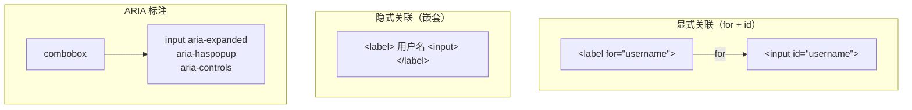

# label 关联与 input 状态属性

## 1. label 关联 input 原理

### 1.1 两种关联方式

#### 显式关联（for/id）

```html
<label for="username">Username</label>
<input type="text" id="username" name="username" />
```

#### 隐式关联（包裹）

```html
<label>
  Username
  <input type="text" name="username" />
</label>
```



#### 可关联的控件类型

| 控件 | label 行为 |
|------|-----------|
| `<input>` (非 hidden) | 是 触发聚焦（type=text/email/password/number 等） |
| `<input type="checkbox">` | 是 触发切换选中状态 |
| `<input type="radio">` | 是 触发选中（同 name 组） |
| `<input type="range">` | 是 触发聚焦 |
| `<select>` | 是 触发下拉展开 |
| `<textarea>` | 是 触发聚焦 |
| `<output>` | 是 关联但无交互效果 |
| `<input type="hidden">` | 否 不关联 |

### 1.2 label 的 control 属性

JS 中可通过 `label.control` 直接访问关联的控件：

```javascript
const label = document.querySelector('label[for="username"]');
const input = label.control; // 等同于 document.getElementById('username')
input.focus();
input.disabled = false;
```

```typescript
// TypeScript 类型
const label = document.querySelector('label') as HTMLLabelElement;
const ctrl = label.control; // HTMLElement | null

// 通过 label 点击切换 checkbox
const toggleViaLabel = (labelEl: HTMLLabelElement) => {
  const input = labelEl.control as HTMLInputElement | null;
  if (input?.type === 'checkbox') {
    input.checked = !input.checked;
    // 触发 change 事件
    input.dispatchEvent(new Event('change', { bubbles: true }));
  }
};
```

### 1.3 显式 vs 隐式关联对比

| 维度 | 显式关联（for/id） | 隐式关联（包裹） |
|------|------------------|----------------|
| 代码结构 | 分离（可跨层级） | 必须嵌套 |
| 灵活性 | 是 高（可远距离） | 否 必须相邻 |
| 可维护性 | 是 ID 唯一性好管理 | 是 结构直观 |
| 样式控制 | 是 label/input 可独立布局 | 是 整体布局 |
| 表单辅助软件 | 是 完全支持 | 是 完全支持 |
| 点击区域 | 等于 label 区域 | 等于 label 区域 |
| 多控件 | 否 一个 label 对应一个控件 | 是 可对应多个控件（仅第一个生效） |
| 隐式提交 | 是 参与 | 是 参与 |

### 1.4 无障碍（Accessibility）

#### 屏幕阅读器行为

屏幕阅读器读取表单时，会将 label 的文本与 input 关联播报：

```
VoiceOver (macOS): "Username, text field, edit text"
NVDA (Windows): "Username 编辑文本  输入"
JAWS: "Username, 文本输入框"
```

#### 必须使用 label 的场景

```html
<!-- 错误：无 label：屏幕阅读器只知道"edit text" -->
<input type="email" placeholder="your@email.com" />

<!-- 正确：有 label：屏幕阅读器播报完整语义 -->
<label for="email">Email address</label>
<input id="email" type="email" placeholder="your@email.com" />
```

### 1.5 面试 follow-up 问题

#### Q1: `<label>` 点击时底层是如何触发对应 input 聚焦的？和直接点击 input 有什么区别？

**答案：**
底层机制：点击 label 时，浏览器自动将 `click` 事件转发给关联的 input 控件（通过 `for/id` 或 DOM 树查找），input 接收到 click 后执行自己的默认行为（聚焦、切换 checked 状态）。

从 input 的角度来看，点击 label 触发 input 聚焦，与直接点击 input 效果**完全相同**（触发同一套 focus/click 事件序列）。唯一区别是事件 target 不同：

- 直接点击 input：事件 target 是 input
- 点击 label：事件 target 先是 label，然后转发到 input

这也是为什么 `label.control` 能直接访问 input — 关联关系在 DOM 解析阶段就已建立。

---

#### Q2: 如果一个 label 包裹了多个 input，哪个会被触发？如何在同一个 label 内关联多个控件？

**答案：**
根据 HTML 规范，label 只关联其包裹的第一个可关联控件。后续控件不受该 label 控制。

```html
<!-- 错误：只有第一个 checkbox 会被 label 控制 -->
<label>
  <input type="checkbox" /> Select all
  <input type="checkbox" /> Option 1  <!-- 不受 label 控制！ -->
</label>
```

正确做法：每个控件拆分独立 label，或使用 fieldset 分组。

---

#### Q3: 如何实现自定义样式的 checkbox/radio，使其点击区域最大化（可访问）？

**答案：**
核心技巧：**将原生 input 放在 label 内并隐藏**（不用 `display:none`），而是用 `opacity:0` + `position:absolute` 保持可交互：

```html
<label class="custom-checkbox">
  <input type="checkbox" hidden />
  <span class="checkmark"></span>
  <span class="text">I accept the terms</span>
</label>
```

关键点：

1. input 必须在 label 内（自动关联，无需 `for/id`）
2. 用 `opacity:0` 而非 `display:none`（保持可访问）
3. 点击区域 = 整个 `.custom-checkbox` = 整行，最大化可点击面积

---

> 参考：
> - https://www.w3.org/TR/html52/sec-forms.html#implicit-submission
> - https://developer.mozilla.org/en-US/docs/Web/Accessibility/ARIA/Attributes/aria-describedby
> - https://developer.mozilla.org/en-US/docs/Web/Accessibility/ARIA/Attributes/aria-labelledby

## 2. disabled vs readonly vs autocomplete

### 2.1 disabled vs readonly 核心区别

#### 属性对比表

| 维度 | `disabled` | `readonly` |
|------|-----------|-----------|
| 可编辑 | 否 完全不可编辑 | 是 不可编辑，但可聚焦 |
| 可复制 | 否 不可选择、复制 | 是 可选择、复制 |
| 提交到服务器 | 否 **不提交** | 是 **提交** |
| Tab 键可聚焦 | 否 跳过 | 是 可以聚焦 |
| 表单验证 | 否 跳过 | 是 参与 |
| CSS 默认样式 | 灰色、不可用 | 正常样式 |
| JS 可修改值 | 否 readOnly 不可用 setter | 是 可修改 |
| 适用元素 | 所有表单元素 | `input` + `textarea` |

### 2.2 视觉样式差异

```css
/* 默认 disabled 样式 */
input:disabled {
  opacity: 0.6;
  cursor: not-allowed;
  background-color: #e0e0e0;
}

/* readonly 样式（需手动设置） */
input:read-only {
  background-color: #f5f5f5;
  cursor: default;
}
```

### 2.3 autocomplete 属性详解

#### autocomplete 值与 name 属性映射表

| autocomplete 值 | 对应字段 | 触发条件 |
|----------------|---------|----------|
| `name` | 全名 | — |
| `given-name` | 名 | — |
| `email` | 邮箱 | — |
| `username` | 用户名 | — |
| `current-password` | 当前密码 | 登录页 |
| `new-password` | 新密码/确认密码 | 注册/修改密码页 |
| `off` | 关闭自动填充 | 任何敏感字段 |

#### new-password 防止自动填充

```html
<!-- 方法1: 直接设置 autocomplete -->
<input type="password" autocomplete="new-password" />

<!-- 方法2: 配合 display:none 的虚假 input -->
<input type="password" style="display:none" name="fake-password" />
<input type="password" name="real-password" />
```

### 2.4 disabled / readonly / autocomplete 组合使用

```html
<!-- 场景：查看模式 + 部分字段可编辑 -->
<form>
  <!-- 只读字段：用户信息，不可编辑 -->
  <input type="text" value="user@example.com" readonly />

  <!-- 禁用字段：管理员不可修改的系统字段 -->
  <input type="text" value="admin" disabled />

  <!-- 可编辑字段 -->
  <input type="text" name="display-name" autocomplete="name" />

  <!-- 新密码设置 -->
  <input type="password" name="new-password" autocomplete="new-password" minlength="8" required />
</form>
```

### 2.5 常见陷阱

```javascript
// 陷阱1: disabled 的 input 值不提交
<form method="POST" action="/update">
  <input type="hidden" name="user-id" value="42" />  <!-- 正确：解决方案：用 hidden 传值 -->
  <input type="text" name="name" disabled />          <!-- name 字段不提交 -->
</form>

// 陷阱2: autocomplete 失效
// 常见原因：input 在 display:none 的容器内 / name 属性名不标准 / 全局 autocomplete="off"

// 陷阱3: disabled 的 radio/checkbox 仍可能被 label 切换
input:disabled { pointer-events: none; }  // 配合防止切换
```

### 2.6 面试 follow-up 问题

#### Q1: 为什么 disabled 的表单元素不提交值，但 readonly 的会？

**答案：**
根据 HTML 规范，`disabled` 的元素不是 **successful**（成功的）表单控件，不参与表单提交序列化。`readonly` 仍属于 successful 控件。

| 场景 | disabled | readonly |
|------|----------|----------|
| 编辑已有数据时传递 ID | 是 用 hidden input 传值 | 是 直接传值 |
| 表单验证 | 否 跳过 | 是 参与 |

---

#### Q2: `autocomplete="new-password"` 失效时有哪些替代方案？

**答案：**

1. **添加虚假 password input**：浏览器填充假 input，真实 input 保持空白
2. **动态生成 name 属性**：如 `pwd_${Date.now()}`
3. **确保 form action 正确**：action="/register" + name="password"

---

#### Q3: 如何实现一个"条件只读"字段——当用户未勾选某 checkbox 时 readonly，勾选后变为可编辑？

**答案：**
```tsx
const ConditionalEditable = () => {
  const [agreed, setAgreed] = useState(false);
  const [feedback, setFeedback] = useState('');

  return (
    <form>
      <label>
        <input type="checkbox" checked={agreed} onChange={(e) => setAgreed(e.target.checked)} />
        I agree to provide feedback
      </label>

      <textarea
        name="feedback"
        value={feedback}
        onChange={(e) => setFeedback(e.target.value)}
        readOnly={!agreed}
        disabled={!agreed}
        placeholder={agreed ? '' : 'Agree above to enable'}
      />

      <input type="hidden" name="feedback" value={feedback} />
    </form>
  );
};
```

---

> 参考：
> - https://cloud.tencent.com/developer/article/2544332
> - https://blog.csdn.net/zcy_wxy/article/details/80550665
> - https://blog.csdn.net/lxx_110/article/details/132958800
> - https://cloud.tencent.com/developer/article/2522332

## 深入阅读与参考

!!! tip "怎么用这些资料"
    先读「官方文档与规范」建立准确的概念，再读「源码与示例」核对细节，最后用「教程、书籍与视频」换一种讲法加深理解。每条都写明了读哪一节、带着什么问题读。

### 官方文档与规范

| 资源 | 为什么读 | 怎么读 |
|---|---|---|
| [`<input>` HTML input element](https://developer.mozilla.org/en-US/docs/Web/HTML/Reference/Elements/input) | input 全属性总览，label 关联、disabled、readonly、autocomplete 都汇总在此。 | 读属性表与 Labels 相关小节，把它当总目录，再跳到各具体属性页深读并逐条动手试。 |
| [`disabled` HTML attribute](https://developer.mozilla.org/en-US/docs/Web/HTML/Reference/Attributes/disabled) | disabled 的权威定义，说明不可聚焦、不提交、不参与校验等行为。 | 重点读描述与提交、校验相关段落，写一个含禁用必填字段的表单，观察提交结果。 |
| [`readonly` HTML attribute](https://developer.mozilla.org/en-US/docs/Web/HTML/Reference/Attributes/readonly) | 明确 readonly 只禁止修改、仍可聚焦与提交，是区分三者的关键。 | 重点读与 disabled 的差异及其对提交的影响，读完为「可复制不可编辑」字段选对属性。 |
| [`autocomplete` HTML attribute](https://developer.mozilla.org/en-US/docs/Web/HTML/Reference/Attributes/autocomplete) | autocomplete 取值表决定浏览器能否正确识别并自动填充字段。 | 查 token 表，给登录、注册、地址字段各选一个 token，注意 new-password 与 current-password 的区别。 |
| [`:disabled` CSS pseudo-class](https://developer.mozilla.org/en-US/docs/Web/CSS/Reference/Selectors/:disabled) | 讲清 :disabled 只匹配真正 disabled 的元素，readonly 不匹配。 | 读选择器说明与示例后写样式，验证 readonly 字段需用属性选择器而非 :disabled。 |
| [Input validation](https://developer.mozilla.org/en-US/docs/Web/Security/Defenses/Input_validation) | 说明被禁用或只读的控件在约束校验与提交中的处理差异。 | 带着「禁用的必填字段还会报错吗」去读，再用 DevTools 在页面上验证一次结论。 |
| ['`<input type="password">` HTML attribute value'](https://developer.mozilla.org/en-US/docs/Web/HTML/Reference/Elements/input/password) | password 类型与 autocomplete 配合的典型场景，登录注册必读。 | 读 autocomplete 一节，登录密码用 current-password、注册用 new-password，避免浏览器错填。 |
| ['`<input type="hidden">` HTML attribute value'](https://developer.mozilla.org/en-US/docs/Web/HTML/Reference/Elements/input/hidden) | hidden 输入不支持 disabled/readonly，是「不可见仍提交」的对照案例。 | 读其提交行为，与禁用控件比较，练习需要传值又不展示时如何选型。 |
| ['`<input type="checkbox">` HTML attribute value'](https://developer.mozilla.org/en-US/docs/Web/HTML/Reference/Elements/input/checkbox) | checkbox 与 label 配合是最常见的关联场景，可验证点击 label 触发控件。 | 读 label 关联示例，写一个 checkbox + label 页面，用鼠标和键盘各验证一次点击效果。 |

### 源码与示例

| 资源 | 为什么读 | 怎么读 |
|---|---|---|
| [<input>](https://react.dev/reference/react-dom/components/input) | React 受控与非受控 input 示例，展示 disabled、readOnly 的组件写法。 | 看受控 input 与 readOnly、defaultValue 示例，把同一个表单改写成受控组件体会差异。 |

### 教程、书籍与视频

| 资源 | 为什么读 | 怎么读 |
|---|---|---|
| [Reacting to Input with State](https://react.dev/learn/reacting-to-input-with-state) | 以状态驱动表单 UI，帮助判断何时该把输入设为禁用或只读。 | 读状态驱动 UI 的思路，做提交中禁用按钮、成功后只读回显的小练习。 |
| [web.dev Learn Forms](https://web.dev/learn/forms) | 系统讲解 label 与控件关联、autocomplete 和原生校验的实践课程。 | 先读 label 与 autocomplete 相关章节，再跟做一个不依赖 JS 的注册表单。 |

## 应用与行业实践

### 应用场景地图

| 场景 | 用到本页哪个知识点 | 典型技术选型 | 注意事项 |
| :-- | :-- | :-- | :-- |
| 后台管理的万行可编辑表格 | label 的 for/id 关联；readonly 与 disabled 的取舍 | 原生 table + input，React Hook Form | 行号要进 id；只读列用 readonly，提交时才不丢值 |
| 低端安卓手机上的结账表单 | autocomplete 规范 token；label 扩大点击区域 | 原生 form + autocomplete | token 写错就失效；label 点击高度不低于 44px |
| 多人协作看板的属性面板 | disabled 表示无权，readonly 表示暂不可改 | WebSocket 同步 + 框架响应式绑定 | 同步中用 readonly 保住焦点；两种状态文案要分开 |
| 政务服务表单的读屏走查 | 显式 label 关联；可访问名称计算 | 原生控件 + ARIA，axe DevTools | 占位符顶替不了 label；错误提示用 aria-describedby 绑回字段 |
| 移动端登录页的自动填充 | autocomplete 的 username 与 current-password | 原生 input + 系统密码管理器 | 同表单同类字段写同名 token，会被填成同一个值 |
| 批量操作工具栏的按钮态 | disabled 与 aria-disabled 的选择 | 原生 button | 用 aria-disabled 时要在 click 里自己拦截 |
| 电商地址表单的省市联动 | 上级未选时下级置 disabled | 原生 select + 框架状态 | 重置联动时同步清空值并改回 disabled |
| 打印视图的只读回显 | readonly 保住可复制与可提交 | 原生 input readonly，CSS 去边框 | disabled 字段不进表单提交，回显页用它就丢数据 |

### 三个场景拆解

#### 场景 1：后台管理的万行可编辑表格

**业务背景**：运营要在列表里直接改库存和备注，改错列就得回滚订单。表格按接口分页，单页 50 行、每行 6 个控件，用 `document.querySelectorAll('input,select,textarea').length` 就能量出这一页有 300 个可聚焦元素。

**怎么用本页知识解决**：思路是把每行的可见列名与控件用 for/id 绑起来，只读列统一用 readonly，靠浏览器自己完成名称与提交两件事。

```html
<!-- 行号进 id，整表才不会出现重复 id -->
<tr>
  <!-- 可见文本放进 label，点文字也能聚焦输入框 -->
  <td><label for="sku-1001">SKU</label></td>
  <!-- 只读列用 readonly：值照样提交，也能复制 -->
  <td><input id="sku-1001" name="sku" readonly value="A-1001"></td>
  <td><label for="qty-1001">数量</label></td>
  <td><input id="qty-1001" name="qty" type="number" autocomplete="off"></td>
  <td><label for="note-1001">备注</label></td>
  <td><input id="note-1001" name="note" autocomplete="off"></td>
</tr>
```

- `for` 与 `id` 一一对应，行号进 id。id 重复时读屏会念到别的行。
- SKU 列用 `readonly`，提交时值还在；换成 `disabled` 后该字段从 Form Data 消失。
- 数量与备注加 `autocomplete="off"`，避免浏览器弹历史值盖住当前行内容。
- label 文本控制在 2 到 4 个字，写长了会挤掉列宽。
- 测试里用 `getByLabelText` 查控件，没绑 label 的输入框直接查不到。

**怎么度量收益**：

- 指标一：每个控件都有可访问名称。测量：axe DevTools 扫 label 规则，Chrome DevTools 的 Accessibility 面板看 computed name。
- 指标二：提交字段数与可见列数一致。测量：DevTools 的 Network 面板比对 Form Data 的字段个数。

**什么时候不该用**：

- 单元格只展示数字、没有输入行为时，不要硬塞 input 加 label，写文本节点就够。
- 需要整行粘进 Excel 的表格，input 会破坏复制结果，改用只读表格或 contenteditable。

#### 场景 2：低端安卓手机上的结账表单

**业务背景**：用户在旧安卓机上用 4G 打开结账页，手输卡号与地址是主要摩擦点。复现方法是在 Chrome DevTools 开 CPU 4 倍降速加 Slow 4G 节流，记录从加载到提交的耗时。

**怎么用本页知识解决**：思路是把字段交给浏览器和密码管理器去填，再用 label 把点击区域撑到整行，减少误触和手输。

```html
<!-- 稳定 id，for 指向它，点文字即可聚焦 -->
<label for="email">邮箱</label>
<!-- type 管校验，inputmode 管键盘，autocomplete 用规范 token -->
<input id="email" name="email" type="email" inputmode="email"
       autocomplete="email" required>

<label for="card">卡号</label>
<!-- cc-number 让密码管理器认得这个字段 -->
<input id="card" name="card" inputmode="numeric" autocomplete="cc-number">

<label for="addr">收货地址</label>
<!-- street-address 触发地址自动填充 -->
<input id="addr" name="addr" autocomplete="street-address">
```

- `autocomplete` 的取值必须在规范 token 表里，拼错就失效。
- `type` 与 `inputmode` 分开设：前者管校验规则，后者管弹出的键盘布局。
- label 用 `for` 绑到 id，移动端把整行做成可点区域，高度不低于 44px。
- 必填字段不要先设 `disabled` 再靠 JS 打开，用户会当成表单坏了。
- `required` 交给浏览器做基础校验，JS 只补业务规则。

**怎么度量收益**：

- 指标一：表单完成耗时中位数。测量：Chrome DevTools Performance 面板记录 INP，Lighthouse 移动端审计。
- 指标二：逐字段输入时长。测量：埋点记 `field_focus` 到 `field_blur` 的分位值。
- 指标三：自动填充命中率。测量：监听输入事件里有没有伴随按键事件，没有按键事件的值来自自动填充。

**什么时候不该用**：

- 同一页面既有付款人邮箱又有收件人邮箱时，两处都写 `autocomplete="email"`，浏览器会填同一个值，此时要靠 name 区分并考虑省略该 token。
- 金额确认这类必须让人手动核对一次的字段，自动填充会让人跳过核对，改成手输。

#### 场景 3：多人协作看板的属性面板

**业务背景**：多人同时改同一张卡片的标题与负责人，服务端按字段做乐观更新，冲突时回滚。痛点是被回滚的一方看不到提示，还会丢掉正在输入的焦点。

**怎么用本页知识解决**：思路是把"没权限"和"正在同步"拆成两种状态，前者用 disabled，后者用 readonly 加 aria-busy，让焦点和已输入的值都留住。

```jsx
// 三种状态：可编辑、同步中、无权限
const canEdit = card.permissions.includes(user.id);
const syncing = card.pendingFields.has('title');

// 无权限才用 disabled，提交时该字段不参与
// 同步中只用 readonly，焦点和已输入的值都留住
const state = !canEdit
  ? { disabled: true }
  : syncing
    ? { readOnly: true, 'aria-busy': 'true' }
    : {};

// id 带卡片号，label 与控件一一对应
<label htmlFor={`title-${card.id}`}>标题</label>
<input id={`title-${card.id}`} name="title"
       defaultValue={card.title} {...state} />
```

- `disabled` 会把控件移出 Tab 顺序并触发 blur，同步中用它会让人丢焦点。
- `readonly` 保留焦点与选区，用户能看到自己刚敲进去的值。
- `aria-busy="true"` 告诉读屏这块正在更新，同步结束要立刻移除。
- 权限不足用 `disabled` 时，旁边要写出原因，并用 `aria-describedby` 把原因绑到字段。
- 回滚时复用同一个 `id`，不要重建 DOM，否则焦点同样会丢。

**怎么度量收益**：

- 指标一：回滚后的重输率。测量：埋点记冲突提示出现到该字段再次失焦之间的输入次数。
- 指标二：焦点丢失次数。测量：Playwright 断言同步期间 `document.activeElement` 不变，MutationObserver 统计输入框卸载次数。
- 指标三：同步延迟。测量：WebSocket 消息往返时间的中位数。

**什么时候不该用**：

- 字段取值决定后续控件是否出现（选了"自定义"才冒出输入框）时，readonly 会让人以为能改，应该隐藏或置 disabled 并写明原因。
- 后端只接受全量字段提交时，别用 disabled 表达"暂不可改"，它不会进 Form Data。

### 行业先进实践

**label 与控件的显式关联（出处：MDN Web Docs 的 `<label>` 页面）**
文档写明 `for` 必须匹配表单控件的 `id`，也支持把控件包在 label 内部。有效的原因是点击区域与可访问名称来自同一处声明。借鉴方式是把"控件与 label 写在同一段"写进代码评审清单。

**autocomplete 的规范 token 表（出处：MDN Web Docs 的 autocomplete 属性页面、WHATWG HTML 规范的自动填充小节）**
规范给出 `username`、`current-password`、`cc-number`、`street-address` 这些固定取值。有效的原因是浏览器与密码管理器按 token 匹配，不靠字段名去猜。借鉴方式是把项目用到的 token 收进常量白名单。

**axe-core 的自动化可访问性检查（出处：axe-core 开源项目、Deque 的 axe DevTools）**
它的 label 类规则能直接跑在 CI 里，只报判定明确的问题。有效的原因是判定标准来自可访问名称计算规范，误报低。借鉴方式是在 Playwright 里引入 @axe-core/playwright，对表单路由扫描。

**按可访问名称查询元素（出处：Testing Library 官方文档的查询优先级说明）**
文档建议优先用 `getByLabelText` 这类面向用户的查询方式。有效的原因是查不到就说明 label 没关联上，测试顺便当了检查工具。借鉴方式是把 `getByLabelText` 设为默认，表单控件禁用 `getByTestId`。

**可访问名称的计算顺序（出处：W3C 的 Accessible Name and Description Computation 规范）**
规范规定了从 label、aria-label、aria-labelledby 到内容文本的取值顺序。有效的原因是排查"读屏念错名字"时有确定路径，不用逐项试。借鉴方式是用 Chrome DevTools 的 Accessibility 面板对照顺序核对。

### 从学到用：落地路线

1. **试点**：挑一个提交型页面（登录页或结账页），只改 label 关联和 autocomplete 取值，不动结构。验收：axe 扫描该页 label 类规则零 error，Tab 能依次走完每个控件。
2. **验证**：跑一遍 Lighthouse 移动端审计与 axe，再找一位键盘用户走查，记录改动前后表单完成耗时的中位数。验收：连续 10 次自动化运行没有新增可访问性错误，每个 token 都能在规范表里找到。
3. **推广**：把规则收进 ESLint 插件或表单模板，新页面默认带 label 与 autocomplete。验收：模板仓库里每个输入控件都能被 `getByLabelText` 查到。
4. **防回退**：对表单路由在 CI 里跑 axe 扫描，出现 label 类错误就阻断合并。验收：任一合并请求触发扫描，故意注入一个无 label 的输入框时流水线变红。

### 动手作业

**目标**：做一个"账户设置"页面，含用户名、邮箱、密码、收货地址、账号 ID 五组字段，把可编辑、readonly、disabled 三种状态都表达清楚。

**步骤**：

1. 用原生 HTML 写页面，每组字段配一个 label，用 `for` 与 `id` 绑好，先不写 CSS。
2. 逐个字段补 `autocomplete`，取值从规范 token 表里挑，并在代码注释里写下选择理由。
3. 账号 ID 设为 `readonly`，邮箱旁边加一个只读副本设为 `disabled`。
4. 提交表单，在 DevTools 的 Network 面板对比两次 Form Data，确认 readonly 字段在、disabled 字段不在。
5. 装 axe DevTools 扫描页面，把 label 类提示逐条改掉。
6. 用键盘 Tab 走一遍，记下焦点顺序与读屏读出的名称。
7. 写 Playwright 断言：五组字段能被 `getByLabelText` 查到；readonly 字段能聚焦；disabled 字段不在 Tab 顺序里。

**验收标准**：

- axe DevTools 扫描该页，label 类规则没有 error。
- 每个字段都能用 `getByLabelText` 查到，测试里不出现 `getByTestId`。
- 提交数据里含 readonly 的账号 ID，不含 disabled 的只读副本。
- Tab 依次到达各可编辑字段，`document.activeElement` 不落在 disabled 字段上。
- 每个 `autocomplete` 取值都能在规范 token 表里查到，且代码注释写明了理由。

