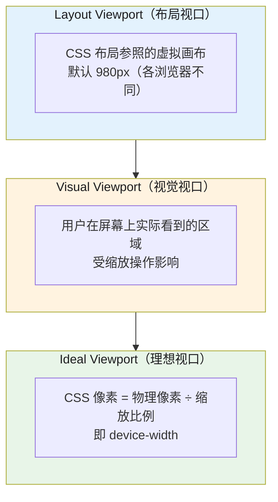

# meta 标签与 viewport

## 1. meta 标签

### 1.1 定义与核心原理

`<meta>` 标签位于 `<head>` 中，提供关于 HTML 文档的元数据，不会显示在页面上，但机器（浏览器、爬虫、社交平台）可读取。

**核心原理：**
- meta 标签是**声明性元数据**，不是文档内容
- 浏览器、搜索引擎、社交平台爬虫都会解析 `<head>` 中的 meta
- 错误的 meta 设置可能导致：乱码、布局错乱、SEO 降权、社交分享失败

### 1.2 字符编码（charset）

```html
<!-- 正确：推荐写法（HTML5 简化语法） -->
<meta charset="UTF-8">

<!-- 错误：不推荐（HTML4 兼容写法） -->
<meta http-equiv="Content-Type" content="text/html; charset=UTF-8">
```

**为什么必须放在 `<head>` 最前面（前 1024 字节）？**
- 浏览器以此编码来解析**整个文档**，包括 `<title>` 和其他 meta
- 若放在 `<title>` 之后，浏览器会用默认编码（Latin-1）先解析一遍，发现 charset 后再回退重解析——导致乱码或重复解析
- 浏览器在解析前 1024 字节时就必须知道编码，所以 `<meta charset>` 必须在最前面

**UTF-8 vs UTF-16：**
- UTF-8：变长编码（1~4 字节），ASCII 兼容，网络传输体积小，**Web 默认**
- UTF-16：定长 2 字节，中文效率高，但 ASCII 文件体积翻倍，且网络传输时字节序（Endianness）问题复杂——**仅在有大量 CJK 字符的专业场景使用**

### 1.3 视口设置（viewport）— 详见本页第 2 章

viewport 标签是移动端适配的基石，详见本页第 2 章「viewport 原理」。

### 1.4 robots 爬虫指令

```html
<meta name="robots" content="index, follow">
```

| 值 | 含义 |
|---|---|
| `index` | 允许索引（默认） |
| `noindex` | 禁止索引 |
| `follow` | 跟踪链接（默认） |
| `nofollow` | 不跟踪链接 |
| `none` | 等价于 `noindex, nofollow` |
| `noarchive` | 不缓存快照 |
| `nosnippet` | SERP 不显示描述片段 |

**与 HTTP Equiv 的关系：**
- `<meta name="robots">` 是页面级别的控制
- `X-Robots-Tag` HTTP header 是**请求级别**的控制，优先级更高（用于 PDF、图片等非 HTML 资源）
- `robots.txt` 的 `Disallow` 是爬虫**主动遵守的规则**，技术上无法强制（恶意爬虫不遵守）

### 1.5 Open Graph（OG）标签

Open Graph Protocol 由 Facebook 2010 年发布，已被微信、Twitter、LinkedIn 等几乎所有主流社交平台采用。

```html
<meta property="og:title" content="前端面试八股文完整题库">
<meta property="og:type" content="website">         <!-- website/article/product -->
<meta property="og:description" content="覆盖12大模块的海量真题详解">
<meta property="og:image" content="https://example.com/og-image.jpg">
<meta property="og:url" content="https://example.com/article">
<meta property="og:site_name" content="前端面试网">
```

**og:image 最佳规格（必须满足，否则被裁剪或降级）：**
| 参数 | 要求 |
|------|------|
| 最小尺寸 | 600×315 px |
| 推荐尺寸 | 1200×630 px |
| 长宽比 | 固定 1.91:1（否则自动裁剪） |
| 文件大小 | ≤ 5MB |
| 格式 | JPG/PNG/WebP，**避免 GIF**（静态平台不支持） |

**og:url 与 canonical 的关系：**
- `og:url` 声明该内容在社交平台上的"规范 URL"
- 社交平台爬虫会参考 `og:url` 作为分享链接的规范化地址
- 建议与 `<link rel="canonical">` **保持一致**，避免重复内容问题

**Twitter Card 扩展：**
```html
<meta name="twitter:card" content="summary_large_image">
<meta name="twitter:title" content="前端面试八股文">
<meta name="twitter:description" content="最全面的前端面试题库">
<meta name="twitter:image" content="https://example.com/twitter-image.jpg">
```
> Twitter 在 2024 年后对未声明 `twitter:card` 的页面默认降级为 `summary`（小图），建议显式声明。

### 1.6 其他常用 meta

```html
<!-- 渲染模式（仅针对旧 IE，Modern IE 已不需此标签） -->
<meta http-equiv="X-UA-Compatible" content="IE=edge">
<!-- 现代浏览器中此标签被忽略，安全无害但属冗余 -->

<!-- 页面刷新/跳转（SEO 不友好，仅用于特殊引导页） -->
<meta http-equiv="refresh" content="5;url=https://example.com">
<!-- 5 秒后跳转到目标 URL -->

<!-- 禁止 iOS 自动识别电话/邮箱/地址 -->
<meta name="format-detection" content="telephone=no, email=no, address=no">

<!-- Android 状态栏颜色（配合 manifest.json 使用） -->
<meta name="theme-color" content="#4A90E2">

<!-- iOS 剪切屏颜色（启动图加载前显示的背景色） -->
<meta name="apple-mobile-web-app-status-bar-style" content="black-translucent">

<!-- Windows 磁贴（Windows 8/10 开始屏幕） -->
<meta name="msapplication-TileColor" content="#4A90E2">
<meta name="msapplication-TileImage" content="/tile.png">
```

### 1.7 生产级完整 head 模板

```html
<head>
  <!-- ① 字符编码必须第一 -->
  <meta charset="UTF-8">

  <!-- ② DNS 预解析（第三方域名） -->
  <link rel="dns-prefetch" href="//fonts.googleapis.com">

  <!-- ③ 预连接关键域名（TCP + TLS 握手） -->
  <link rel="preconnect" href="https://fonts.gstatic.com" crossorigin>

  <!-- ④ 预加载当前页面关键资源 -->
  <link rel="preload" href="/fonts/main.woff2" as="font" crossorigin type="font/woff2">
  <link rel="preload" href="/hero.webp" as="image">

  <!-- ⑤ title + description（SEO 最基础） -->
  <title>前端面试八股文 | 覆盖12大模块</title>
  <meta name="description" content="最全面的前端面试八股文，覆盖HTML/CSS/JavaScript等12大模块，2026年最新版">

  <!-- ⑥ viewport 必须 -->
  <meta name="viewport" content="width=device-width, initial-scale=1.0">

  <!-- ⑦ 爬虫指令 + 规范化 -->
  <meta name="robots" content="index, follow">
  <link rel="canonical" href="https://example.com/article">

  <!-- ⑧ Open Graph -->
  <meta property="og:title" content="前端面试八股文">
  <meta property="og:description" content="最全面的前端面试题库">
  <meta property="og:image" content="https://example.com/og-image.jpg">
  <meta property="og:url" content="https://example.com/article">
  <meta property="og:type" content="article">
  <meta property="og:site_name" content="前端面试网">

  <!-- ⑨ Twitter Card -->
  <meta name="twitter:card" content="summary_large_image">

  <!-- ⑩ Favicon -->
  <link rel="icon" href="/favicon.svg" type="image/svg+xml">

  <!-- ⑪ Critical CSS 内联（首屏必须） -->
  <style>body{margin:0;font-family:system-ui}</style>
</head>
```

### 1.8 高频面试追问

**Q1：如果把 `<meta charset>` 放在 `<title>` 之后，会发生什么？**
> 浏览器在解析 HTML 时，遇到 `<meta charset>` 之前的部分会**先用默认编码（通常是 Latin-1/ISO-8859-1）解析一遍**，发现 charset 后才回退并用正确编码重新解析。这会导致：
> 1. **两次解析**（性能浪费）
> 2. 在某些浏览器中，如果 `<title>` 中包含非 ASCII 字符（如中文），在第一次 Latin-1 解析时会变成乱码，即使最终正确解析也无法消除已产生的 BOM 问题
> 3. 极少数情况下，如果 `<meta charset>` 不在文档前 1024 字节内，浏览器直接使用默认编码，整个页面乱码

**Q2：`<meta http-equiv="X-UA-Compatible" content="IE=edge">` 在现代浏览器中还有用吗？**
> 现代 IE（Edge Chromium）已不再识别此标签。此标签的用途是让旧版 IE（IE6-IE9）使用最新渲染引擎，避免 IE7/8 默认的 Quirks Mode。
> **现状**：IE 已于 2022 年正式退役（微软 2023 停止支持），此 meta 标签在 2026 年已是**冗余无害但无意义**的存在，建议从模板中移除。

> 参考：
> - [MDN — meta charset](https://developer.mozilla.org/en-US/docs/Web/HTML/Element/meta#attr-charset)
> - [Open Graph Protocol](https://ogp.me/)
> - [Google — Robots meta tag](https://developers.google.com/search/docs/crawling-indexing/robots-meta-tag)
> - [MDN — HTML head](https://developer.mozilla.org/en-US/docs/Learn/HTML/Introduction_to_HTML/The_head_metadata_in_HTML)

## 2. viewport 原理

### 2.1 定义与核心原理

**viewport（视口）** 是浏览器用于布局渲染的可见区域。在桌面端，viewport 就是浏览器窗口大小；但在移动端，由于屏幕物理尺寸远小于传统桌面显示器，需要引入虚拟视口机制。

**三个 viewport 体系（PPK，2011）：**



| 视口类型 | 说明 | 获取方式 | 决定因素 |
|---------|------|---------|---------|
| **Layout Viewport** | CSS 布局参照的虚拟画布 | `document.documentElement.clientWidth` | 浏览器默认（移动端约 980px） |
| **Visual Viewport** | 用户在屏幕上实际看到的区域 | `window.innerWidth` | 用户缩放操作 |
| **Ideal Viewport** | 设备最佳显示宽度 | 等于 CSS 像素 1:1 物理像素的宽度 | 设备物理分辨率 |

### 2.2 产生背景：为什么移动端需要 viewport

**桌面网页入侵移动端（2007 年 iPhone）：**
- 早期智能手机 Safari 将桌面网页缩放为 980px 宽的"虚拟画布"
- 用户看到的是一个微缩的整页，必须双击或缩放才能阅读
- Apple 引入了 `<meta name="viewport">` 解决此问题

**DPR 的出现（iPhone 4，2010）：**
- Retina 屏幕：DPR=2（1 CSS px = 2×2 物理像素）
- 导致 `border: 1px` 在 Retina 屏上渲染为 2px 物理像素，边框视觉上偏粗

### 2.3 运行机制：visual viewport 与 layout viewport 的关系

**缩放时两者如何联动：**

```
缩放比例 = Visual Viewport CSS 像素宽度 / Layout Viewport CSS 像素宽度

initial-scale=1.0  →  Visual = Layout = device-width（Ideal Viewport）
initial-scale=2.0  →  Visual = Layout / 2（页面缩小 2 倍，内容更精细）
initial-scale=0.5  →  Visual = Layout × 2（页面放大，内容更粗糙）
```

**JS 视口监听（ResizeObserver + Visual Viewport API）：**
```javascript
// 监听 layout viewport 变化（窗口大小改变）
window.addEventListener('resize', () => {
  console.log('Layout VP:', document.documentElement.clientWidth);
});

// 监听 visual viewport 变化（用户缩放/滚动/虚拟键盘弹出）
// VisualViewport API（Chrome 61+，iOS Safari 13.4+）
if (window.visualViewport) {
  const vv = window.visualViewport;
  vv.addEventListener('resize', () => {
    console.log('Visual VP width:', vv.width);
    console.log('Scale:', vv.scale);
    // 虚拟键盘弹出时：vv.height < window.innerHeight
    document.body.style.setProperty('--vh', `${vv.height * 0.01}px`);
  });
  vv.addEventListener('scroll', () => {
    console.log('Visual VP offset:', vv.offsetLeft, vv.offsetTop);
  });
}
```

### 2.4 CSS 像素 vs 物理像素 vs DPR

```
物理像素（Device Pixel）= 屏幕实际发光的硬件点，出厂固定
CSS 像素（CSS Pixel）    = Web 编程中的抽象单位
DPR（devicePixelRatio）  = 物理像素 / CSS 像素
```

| 设备 | DPR | CSS 1px 对应 |
|------|-----|-------------|
| 普通 Android | 1.0 | 1×1 物理像素 |
| iPhone 6/7/8/X | 2.0 | 2×2 物理像素 |
| iPhone Plus / 三星旗舰 | 3.0 | 3×3 物理像素 |
| iPad Pro | 2.0+ | 2×2 物理像素 |

### 2.5 DPR=2 屏幕 1px 边框过粗：五种解法

**问题本质：** `border: 1px` 在 DPR=2 设备上 = 2×2 物理像素 = 视觉 2px

| 方案 | 原理 | 优点 | 缺点 |
|------|------|------|------|
| **① scaleY(0.5) 伪元素** | 将伪元素的 1px 缩小到 0.5 CSS px | 通用性好 | 需额外 DOM |
| **② 直接写 0.5px** | 部分浏览器支持 | 最简洁 | iOS <13/Android 旧版不支持 |
| **③ box-shadow 模拟** | 用 0.5px 阴影替代边框 | 无额外 DOM | 颜色控制不灵活 |
| **④ 媒体查询** | DPR=2 时用 1px，DPR=3 时用 0.33px | 精准 | 维护成本高 |
| **⑤ SVG border-image** | 矢量 SVG 线 | 清晰 | 过于复杂 |

**推荐方案（伪元素 + transform）：**
```css
/* 方案①：推荐，兼容所有现代设备 */
.scale-1px {
  position: relative;
  border: none;
}
.scale-1px::after {
  content: '';
  position: absolute;
  left: 0;
  bottom: 0;
  width: 100%;
  height: 1px;
  background: #d1d5db;
  transform: scaleY(0.5);       /* DPR=2 时视觉 1px */
  transform-origin: 0 0;          /* 从左下角缩放 */
}

/* 多方向边框（上下左右） */
.all-borders::before,
.all-borders::after {
  content: '';
  position: absolute;
  background: #d1d5db;
}
.all-borders::before { /* 上边框 */
  top: 0; left: 0; right: 0; height: 1px;
  transform: scaleY(0.5);
}
.all-borders::after { /* 下边框 */
  bottom: 0; left: 0; right: 0; height: 1px;
  transform: scaleY(0.5);
}
```

**方案②（直接 0.5px）：**
```css
/* iOS Safari 13+ / Android Chrome 107+ 支持 */
.border-half {
  border-bottom: 0.5px solid #d1d5db;
}
```

### 2.6 常见 viewport 问题与避坑

```html
<!-- 错误：未设置 viewport：移动端页面缩放成"微缩桌面" -->
<!-- 浏览器用 980px layout viewport，内容极小 -->

<!-- 错误：width=320 固定值：宽屏设备（390px+）上页面被截断 -->
<meta name="viewport" content="width=320">

<!-- 错误：user-scalable=no：禁止缩放（影响无障碍，违反 WCAG） -->
<meta name="viewport" content="user-scalable=no">
<!-- WCAG 2.1 Success Criterion 1.4.4 要求允许文本缩放至 200% -->

<!-- 正确写法 -->
<meta name="viewport" content="width=device-width, initial-scale=1.0">
```

**virtual keyboard 导致的视口变化（移动端表单常见）：**
```javascript
// 虚拟键盘弹出时，visual viewport 高度 < layout viewport 高度
// 但 window.innerHeight 不变，document.documentElement.clientHeight 也不变
// 只有 window.visualViewport.height 会变小

// 解决方案：CSS 引入 custom property，结合 JS 动态更新
:root {
  --vh: 1vh; /* JS 会动态更新这个值 */
}
.card { height: calc(var(--vh, 1vh) * 50); }
```
```javascript
// JS 中监听虚拟键盘弹出
window.visualViewport?.addEventListener('resize', () => {
  document.documentElement.style.setProperty(
    '--vh',
    `${window.visualViewport.height * 0.01}px`
  );
});
```


## 深入阅读与参考

!!! tip "怎么用这些资料"
    先读「官方文档与规范」建立准确的概念，再读「源码与示例」核对细节，最后用「教程、书籍与视频」换一种讲法加深理解。每条都写明了读哪一节、带着什么问题读。

### 官方文档与规范

| 资源 | 为什么读 | 怎么读 |
|---|---|---|
| [`<meta>` HTML metadata element](https://developer.mozilla.org/en-US/docs/Web/HTML/Reference/Elements/meta) | meta 元素总览，先建立 name、http-equiv、charset 的分类框架，再定位 viewport。 | 读 Attributes 表与 Examples，回答“viewport 属于哪一类 meta”，并把示例改写成自己页面的写法。 |
| [`<meta name>` HTML attribute](https://developer.mozilla.org/en-US/docs/Web/HTML/Reference/Elements/meta/name) | 说明 name 值的语义与注册表，viewport、theme-color 等都挂在 name 上。 | 看 Value 列表并跳到规范链接，记下 name 值如何被解析，再回头对照 viewport 的取值写法。 |
| [`<meta http-equiv>` HTML attribute](https://developer.mozilla.org/en-US/docs/Web/HTML/Reference/Elements/meta/http-equiv) | http-equiv 是 meta 的第二类用法，与 name 对照可避免概念混淆。 | 浏览各 http-equiv 值的用途，思考为何 viewport 不用 http-equiv，读完整理一张对照表备用。 |
| ['`<meta name="viewport">` HTML attribute value'](https://developer.mozilla.org/en-US/docs/Web/HTML/Reference/Elements/meta/name/viewport) | viewport 的权威参考，逐项列出 content 各值的含义、默认行为与注意事项。 | 精读 Values 表，重点看 width、initial-scale、viewport-fit，再在 DevTools 改值观察布局视口变化。 |
| [Viewport concepts](https://developer.mozilla.org/en-US/docs/Web/CSS/Guides/CSSOM_view/Viewport_concepts) | 讲清 layout viewport、visual viewport 与初始包含块，是理解 viewport 原理的关键 | 先读概念定义与示意图，回答“没有 viewport meta 时手机为何按桌面宽度布局”，再用真机缩放验证。 |
| [CSS viewport](https://developer.mozilla.org/en-US/docs/Web/CSS/Guides/Viewport) | 从 CSS 视角讲视口单位与缩放，补齐 meta viewport 之外的另一半知识。 | 读视口单位与缩放相关小节，测试 vw、vh、dvh 在有无 viewport meta 时的差异。 |
| [<meta name="responsive-embedded-sizing">](https://developer.mozilla.org/en-US/docs/Web/HTML/Reference/Elements/meta/name/responsive-embedded-sizing) | 较新的 name 值，涉及被嵌入 iframe 的响应式尺寸，是 viewport 协商的扩展场景。 | 读语法与示例，弄清它解决什么问题；若工作中有内嵌页面，加一行到 iframe 文档里验证。 |
| [<meta name="text-scale">](https://developer.mozilla.org/en-US/docs/Web/HTML/Reference/Elements/meta/name/text-scale) | 展示 viewport 与可访问性的交互，避免只把缩放当成固定数值来写。 | 读 Values 与无障碍提醒，检查自己的 initial-scale 与 maximum-scale 是否妨碍用户放大字号。 |
| ['`<meta name="robots">` HTML attribute value'](https://developer.mozilla.org/en-US/docs/Web/HTML/Reference/Elements/meta/name/robots) | 最常用的 name 值之一，用它熟悉 name 元数据的通用写法与作用范围。 | 快速浏览 Values 表确认元数据标签的书写契约即可，不必深读，重点是理解 name 的解析规则。 |
| ['`<meta name="theme-color">` HTML attribute value'](https://developer.mozilla.org/en-US/docs/Web/HTML/Reference/Elements/meta/name/theme-color) | 移动端浏览器 UI 着色，常与 viewport 一起配置，是移动适配的具体实例。 | 读示例与 media 查询用法，给自己页面加一行 theme-color，在手机浏览器地址栏观察颜色变化。 |
| ['`<meta name="color-scheme">` HTML attribute value'](https://developer.mozilla.org/en-US/docs/Web/HTML/Reference/Elements/meta/name/color-scheme) | 深浅色模式与浏览器 UI 联动，展示 meta 如何影响页面的渲染环境。 | 读 Values 与示例，配合 prefers-color-scheme 试一遍，观察滚动条和表单控件默认样式变化。 |

### 源码与示例

| 资源 | 为什么读 | 怎么读 |
|---|---|---|
| [meta.md](https://react.dev/reference/react-dom/components/meta) | 框架侧如何把 meta 提升到 head，附带可运行示例，理解组件化下的元数据处理。 | 读 Usage 与示例，注意哪些标签可被提升，再把自己页面的 viewport 元数据写成组件试一次。 |

## 应用与行业实践

### 应用场景地图

| 场景 | 用到本页哪个知识点 | 典型技术选型 | 注意事项 |
| --- | --- | --- | --- |
| 后台管理的万行表格（平板查看） | viewport 的 width=device-width | Vue / React 加横向滚动容器 | 表格最小宽度交给容器，页面根元素不横向滚动 |
| 低端安卓机的首屏活动页 | initial-scale 与布局视口的关系 | 服务端直出 HTML 加内联关键 CSS | 不要靠缩放把 750px 设计稿整体压进手机屏 |
| 微信内打开的报名表单页 | viewport-fit 与安全区 | H5 加 env(safe-area-inset-*) | 软键盘弹出时固定底栏要留在键盘上方 |
| 多人协作白板 | 用户缩放与手势归属 | canvas 加 pointer 事件加 touch-action | 画布区域独占双指手势，页面其他区域保留缩放 |
| 添加到主屏的 PWA | viewport 与 display 模式 | Web App Manifest 加 service worker | standalone 下没有地址栏，顶部要留安全区 |
| 深色模式下的设置页 | color-scheme | CSS prefers-color-scheme 与 meta 声明配套 | meta 声明与 CSS 配色不一致时输入框会变白 |
| 横竖屏切换的移动端阅读器 | 布局视口随旋转重算 | 纯 CSS 媒体查询 | 旋转后复测滚动位置是否被重置 |
| 展厅触控一体机 | 固定视口与禁用缩放 | kiosk 浏览器加 maximum-scale | 一体机分辨率与手机不同，按实际物理分辨率测 |

### 三个场景拆解

#### 场景 1：后台管理的万行表格

**业务背景**：运营在平板上查订单明细，表格列数在 12 列上下，数据行数在万行量级。默认视口按 980px 排版，表格被压窄到每列只剩几个汉字宽，用户横向拖动整页才能看清一行。

**怎么用本页知识解决**：思路是让布局视口等于设备宽度，把横向滚动关进表格自己的容器里，页面根元素不产生横向滚动。

```html
<meta charset="utf-8">
<!-- 布局视口等于设备宽度，初始缩放 1，页面按真实 CSS 像素排版 -->
<meta name="viewport" content="width=device-width, initial-scale=1">
<!-- 声明两种配色都支持，滚动条与原生控件跟随系统 -->
<meta name="color-scheme" content="light dark">
<style>
  .table-scroll { overflow-x: auto; }        /* 横向滚动只发生在这个容器内 */
  .table-scroll table { min-width: 960px; }  /* 列多时保持最小可读列宽 */
</style>
```

- `width=device-width` 让布局视口等于设备宽度，表格不再被默认视口压缩。
- `initial-scale=1` 让 CSS 像素与布局视口按 1:1 对应，设计稿标注值可直接使用。
- 横向滚动交给 `.table-scroll`，页面根元素不出现横向滚动条，整页滑动与下拉刷新不被干扰。
- `color-scheme` 只声明能力，实际颜色由 CSS 决定，两者不一致时深色页面里会出现白色输入框。

**怎么度量收益**：主指标是 `document.documentElement.scrollWidth` 与 `clientWidth` 的差值，目标为 0。次指标是出现横向滚动的路由占比。测量方法用 Playwright 在 360×640 与 768×1024 两种视口打开每条路由，读取上述两个值并写入 CI 报告，DevTools 的 Device Toolbar 用来人工复核。

**什么时候不该用**：

- 表格只有 3 到 4 列且单元格内容短，设 `min-width: 960px` 会凭空产生横向滚动。
- 桌面端定宽 1440px 的后台页面，容器宽度由设计稿决定，套用 `device-width` 会让列被压窄。
- 打印样式表按纸张宽度排版，不需要 viewport 声明。

#### 场景 2：微信内打开的报名表单页

**业务背景**：报名页从聊天窗口点开，顶部标题栏和底部手势条会盖住内容，用户点提交时软键盘把按钮顶出可视区域。访问量取决于活动规模，并发集中在开场前后。

**怎么用本页知识解决**：思路是先让布局视口铺满整屏，再用环境变量把固定底栏推进安全区，最后声明软键盘出现时压缩内容区。

```html
<!-- 布局视口覆盖整屏，安全区数值才会返回非 0 -->
<meta name="viewport"
      content="width=device-width, initial-scale=1, viewport-fit=cover, interactive-widget=resizes-content">
<!-- 地址栏与状态栏跟随品牌色，仅支持的浏览器生效 -->
<meta name="theme-color" content="#1f6feb">
<!-- 声明支持深浅色，避免系统深色下出现白色输入框 -->
<meta name="color-scheme" content="light dark">
<style>
  .submit-bar {
    position: fixed; bottom: 0; left: 0; right: 0;
    /* 底部手势条高度由环境变量给出，设备没有安全区时为 0 */
    padding-bottom: env(safe-area-inset-bottom, 0px);
  }
</style>
```

- `viewport-fit=cover` 让布局视口铺满屏幕，`env(safe-area-inset-*)` 才返回插入区高度，不加时返回 0。
- `env(safe-area-inset-bottom, 0px)` 把提交按钮推到手势条上方，第二个参数是回退值。
- `interactive-widget=resizes-content` 声明软键盘出现时缩小布局视口，固定底栏随之抬升，需核对目标浏览器支持情况。
- 三条 meta 放在 `<head>` 靠前位置，避免浏览器先按默认视口排版再重排。

**怎么度量收益**：主指标是提交按钮被遮挡的比例，用埋点记录 `document.querySelector('.submit-bar').getBoundingClientRect().bottom` 是否小于等于 `window.visualViewport.height`。次指标是软键盘弹出前后 `window.innerHeight` 的变化量。测量方法为 iOS 与 Android 各取一台真机，点开输入框后记录按钮可见性，再在 DevTools 的 Sensors 面板模拟不同机型复测。

**什么时候不该用**：

- 长文档阅读页不要加 `interactive-widget=resizes-content`，软键盘出现时布局重算会让阅读位置跳动。
- 不处理安全区就不要加 `viewport-fit=cover`，否则内容会被刘海或手势条遮住。
- 页面没有固定底栏时，把 `env(safe-area-inset-bottom)` 加到 `body` 上会留下一条空白。

#### 场景 3：多人协作白板

**业务背景**：白板要在平板上用手指同时完成画布缩放与拖动，浏览器把双指手势当成页面缩放，画布坐标系与手指落点错位。单个房间的在线人数从 2 人到几十人。

**怎么用本页知识解决**：思路是把双指手势的归属权从浏览器收回到画布，页面级只保留初始缩放，画布自己实现缩放计算。

```html
<!-- 页面级只允许 1 倍缩放，双指手势留给画布 -->
<meta name="viewport" content="width=device-width, initial-scale=1, maximum-scale=1, user-scalable=no">
<style>
  html, body { margin: 0; height: 100%; overflow: hidden; }
  #board {
    touch-action: none;    /* 画布内的平移与缩放不再由浏览器接管 */
    width: 100%; height: 100%;
  }
</style>
<script>
  const board = document.getElementById('board');
  const points = new Map();   // 记录每个指针的 id 与坐标
  board.addEventListener('pointerdown', e => points.set(e.pointerId, e));
  board.addEventListener('pointermove', e => {
    if (points.has(e.pointerId)) points.set(e.pointerId, e);   // 更新指针位置
    if (points.size === 2) renderZoom(points);                 // 两指时调用自有缩放函数
  });
  board.addEventListener('pointerup', e => points.delete(e.pointerId));
</script>
```

- `touch-action: none` 让画布区域内的浏览器默认手势失效，指针事件完整交给脚本。
- `user-scalable=no` 与 `maximum-scale=1` 阻止页面级缩放，需核对目标浏览器对这两个值的处理，不能只依赖它们。
- 指针事件用 `pointerId` 区分手指，松开一指后要删除记录，否则残留坐标会把缩放算歪。
- 根元素设 `overflow: hidden`，防止画布外的橡皮筋滚动带动坐标系。

**怎么度量收益**：主指标是操作过程中 `window.visualViewport.scale` 是否保持 1。次指标是双指操作后画布坐标与指针坐标的偏差，取连续两次操作的绝对误差平均。测量方法为真机开启远程调试读取 `visualViewport.scale`，把误差计算写成测试钩子，在自动化设备上重复跑。

**什么时候不该用**：

- 页面主体是可缩放的文字内容时，禁用缩放会挡住低视力用户放大阅读。
- 只在画布区域用 `touch-action: none`，给 `body` 全局加会让页面其他控件的滚动失效。
- 需要让用户放大查看细节的图片预览页，不要在 viewport 里写 `maximum-scale=1`。

### 行业先进实践

`viewport-fit=cover` 配合 `env(safe-area-inset-*)`（出处：WebKit 官方博客关于 viewport-fit 的文章、CSS 环境变量规范）
声明 `viewport-fit=cover` 后页面铺满整屏，四边安全区高度由 `env()` 给出。固定顶栏和底栏读取对应变量加内边距，内容就不会被刘海或手势条压住。项目里从底部固定操作栏开始改，改完在带刘海的真机上核对。

框架层把 viewport 与 metadata 分开导出（出处：Next.js 官方文档）
Next.js 在 App Router 里提供 `export const viewport`，与 `export const metadata` 分开，由框架渲染对应 meta 标签。viewport 因此可以按路由动态生成，不必每页手写。项目里把默认值放在根 layout，页面级只覆盖需要变的部分。

Lighthouse 的移动端视口审计（出处：Chrome Lighthouse 官方文档）
审计会检查 `<meta name="viewport">` 是否带 `width` 或 `initial-scale`，在移动端模拟下还会报告内容宽度与视口不一致的页面。它能在合并前发现漏写或写错。项目里把移动端审计接入 CI，阈值按现有基线设定。

`<meta name="color-scheme">`（出处：MDN Web Docs 的 color-scheme 条目、WHATWG HTML 规范）
声明 `light dark` 后，浏览器把滚动条、输入框切成与页面一致的配色。深色页面里出现白色输入框就是漏了这一步。项目里把这一行加进 head 模板，再让 CSS 的 `prefers-color-scheme` 分支与之对应。

`interactive-widget` 控制软键盘行为（出处：Chrome for Developers 官方博客）
`resizes-content` 让布局视口随软键盘缩小，`resizes-visual` 只缩可视视口，两种取值下固定底栏表现不同。选哪个取决于页面用布局视口还是可视视口定位。项目里先核对目标用户的浏览器版本支持范围，再决定是否启用。

### 从学到用：落地路线

第 1 步（试点）：选一个结构简单的移动端页面，只改 viewport 与底部安全区，其他样式不动。验收标准：360×640 视口下页面无横向滚动，底部按钮在带手势条的真机上完整可见。

第 2 步（验证）：用 Playwright 在 360×640、390×844、768×1024 三种视口打开该页面，对比改动前后的截图与 `scrollWidth`。验收标准：三种视口下 `document.documentElement.scrollWidth` 等于 `clientWidth`，截图差异只出现在安全区内边距。

第 3 步（推广）：把 viewport 标签收进页面模板统一注入，页面不再各自声明。验收标准：仓库中手写 viewport 的文件数为 0，新页面不写也能通过检查。

第 4 步（防回退）：在 CI 里加入移动端 Lighthouse 审计与一条检查重复 meta 的规则，在 PR 阶段拦截。验收标准：构造一个带两个 viewport 标签的 PR，CI 报错并阻止合并。

### 动手作业

**目标**：给一个自己项目里的移动端页面补齐 viewport 声明与安全区适配，并留下可重复运行的检查脚本。

**步骤**：

1. 挑一个自己项目的移动端页面，记录页面路径与主要用户机型。
2. 打开 Chrome DevTools 的 Device Toolbar，选 360×640 与带刘海屏的机型，截图存档。
3. 检查该页面 head 中 viewport、color-scheme、theme-color 三条 meta 是否缺失或冲突。
4. 给固定顶栏和底栏加上 `env(safe-area-inset-*)` 内边距，同步补上 `viewport-fit=cover`。
5. 写一段 Playwright 脚本，在三种视口下读取 `scrollWidth`、`clientWidth` 与 `visualViewport.scale` 并打印。
6. 在真机上打开页面，点开输入框，记录底部按钮是否被软键盘遮挡。
7. 把脚本与截图一起提交，写清改动前后的指标对比。

**验收标准**：

- 三种视口下 `document.documentElement.scrollWidth` 等于 `clientWidth`。
- 带手势条的真机上，底部按钮下边缘位于手势条上方，点按可触发。
- `document.querySelectorAll('meta[name="viewport"]').length` 等于 1。
- Playwright 脚本本地一条命令跑完，输出三种视口的全部指标。
- 深色系统下输入框与页面配色一致，不出现白色方块。

