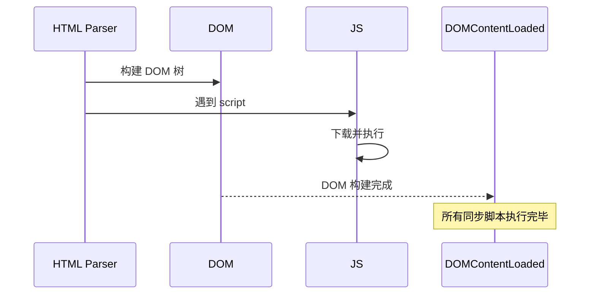

# script 加载与渲染阻塞

## 1. src 与 href：资源加载与渲染阻塞

### 1.1 img src — 图片资源的加载行为

**行为**：

- 下载与 HTML 解析并行
- 渲染树（Render Tree）构建时，`img` 需要图片数据才能绘制 → **渲染被阻塞**
- 图片下载完成后触发重绘（repaint）

### 1.2 link href — 样式表链接（非阻塞）

```html
<!-- href: 建立文档与 CSS 的关系，不替换任何内容 -->
<link rel="stylesheet" href="styles.css" />

<!-- 浏览器行为： -->
<!-- 1. 发现 href，识别为 CSS 资源 -->
<!-- 2. 发起并行下载，不停顿地继续解析 HTML -->
<!-- 3. CSS 下载完成后，应用样式 -->
```



**关键区别**：即使 `<link>` 和 `<script src>` 都会在下载期间引发资源请求，`link` 的下载**不暂停解析器**，而 `script src` **会暂停解析器**。

---

### 1.3 边缘场景

#### link rel="preload" — 提前加载关键资源

```html
<!-- preload 是一种 hint，告诉浏览器提前获取该资源 -->
<!-- 与 href 不同的是：preload 专门用于关键路径资源优化 -->
<link rel="preload" href="critical-font.woff2" as="font" crossorigin="anonymous" />
<link rel="preload" href="main.js" as="script" />

<!-- 对比普通 href： -->
<link rel="stylesheet" href="styles.css" />    <!-- 非关键，不阻塞解析 -->
<link rel="preload" href="critical.css" as="style" /> <!-- 关键，优先级最高 -->
```

| 属性 | 用途 | 阻塞解析器？ | 阻塞渲染？ |
|------|------|-------------|-----------|
| `href`（link） | 建立关联 | 否 | 看资源类型 |
| `src` | 替换内容 | 是（需等资源就绪） | 是（需等资源就绪） |
| `rel="preload"` | 提前获取但不应用 | 否 | 否（只预获取） |

#### link rel="preconnect" — 提前建立 TCP 连接

```html
<!-- preconnect 提前建立网络连接，不获取资源 -->
<link rel="preconnect" href="https://api.example.com" />
<link rel="dns-prefetch" href="https://api.example.com" />

<!-- preconnect 包含 DNS 解析 + TCP handshake + TLS（如果是 HTTPS） -->
<!-- 比 dns-prefetch 更全面，现代浏览器优先使用 preconnect -->
```

**为什么用 preconnect 而不是 preload？** preload 用于资源本体；preconnect 只建立连接，为后续资源请求节省 DNS+TCP 时间。

---

### 1.4 面试追问

#### Q1：为什么 CSS 用 link href 而不是 link src？

**答**：CSS 文件不是用来"替换" `<link>` 元素的——`<link>` 是一个空元素，没有可供替换的内容。`href` 的语义是"建立关系"，`rel="stylesheet"` 告诉浏览器这个关系是样式表关联。CSS 的作用是影响已有 DOM 的渲染，而非替换任何元素。

反过来，如果用 `src`，语义就变成"这个 link 元素的内容就是 styles.css"——这在概念上是错误的，因为 link 元素没有内容区可以放样式。

---

#### Q2：`<a href="page.html">` 和 `` 哪个会阻塞渲染？

**答**：

- `<a href>`：**不阻塞渲染**。它只是声明一个链接关系，浏览器不会预加载目标页面（除非被 `<link rel="prefetch">` 提示）。点击时才导航。
- ``：**不阻塞 HTML 解析**，但**阻塞渲染**。图片下载完成后，浏览器才能绘制该区域。

本质上，两者都不阻塞 HTML 解析器的继续工作。关键区别在于渲染：CSS 是渲染阻塞资源（必须等所有 CSS 下载和应用后才能绘制），图片下载完成后才绘制（异步）。

---

#### Q3：什么情况下 `href` 也会阻塞页面？

**答**：当 href 指向的资源是**渲染阻塞型资源**时，会间接导致渲染阻塞。最典型的情况是 CSS：

1. `<link rel="stylesheet" href="main.css">` 被解析
2. HTML 解析器继续工作，DOM 在增长
3. CSS 文件下载完成，CSSOM 构建
4. DOM + CSSOM 合并为 Render Tree
5. **在 CSSOM 完成之前，渲染被阻塞**（不会先绘制没有完整样式的页面，避免 FOUC）

所以 `href` 本身不阻塞解析器，但如果它关联的是 CSS，就会阻塞**渲染**。

---

### 1.5 总结对比表

| 维度 | `src` | `href` |
|------|-------|--------|
| 语义 | 内容来源（替换当前元素） | 关系引用（建立关联） |
| 典型元素 | img, script, iframe, video | link, a, area |
| HTML 解析器阻塞？ | 是（同步下载+执行） | 否（并行下载） |
| 渲染阻塞？ | 是（需资源就绪才能渲染元素） | 取决于资源类型（CSS 阻塞，preload 不阻塞） |
| 执行时机 | 立即替换元素内容 | 不直接"执行"，只是建立关系 |
| 能否省略结束标签 | 替换型空元素可以（如 ``） | link 等也为空元素 |

> 参考：
> - https://blog.csdn.net/Bianca427/article/details/125421327
> - https://www.cnblogs.com/gavinzzh-firstday/p/5735010.html
> - https://blog.csdn.net/weixin_42420703/article/details/83213799

## 2. script async/defer 区别

### 2.1 基本概念

默认情况下（无 async/defer），浏览器加载 `<script src="...">` 时：

1. 暂停 HTML 解析器（Parse）
2. 发起网络请求下载 JS
3. 下载完成后**立即执行**（Execute）
4. 恢复 HTML 解析

这称为**同步阻塞式加载**，会显著延迟首屏渲染（FCP, LCP）。

`async` 和 `defer` 是解决这一问题的两个布尔属性（可共存？不，可二选一）。

---

### 2.2 时序图：三种模式的完整对比

```mermaid
gantt
    title HTML 解析与资源加载时序
    dateFormat X
    axisFormat %sms

    section 无属性 (sync)
    HTML解析    :0, 80
    JS下载      :80, 130
    JS执行      :130, 150
    HTML恢复    :150, 200

    section link href
    HTML解析    :0, 300
    CSS下载     :0, 150

    section script src
    HTML解析    :0, 50
    JS下载      :50, 150
    JS执行      :150, 200
    HTML恢复    :200, 250

    section img src
    HTML解析    :0, 300
    图片下载    :100, 180
```


#### 关键时间点标记



---

### 2.3 渲染阻塞（Render-Blocking）详解

#### 默认（sync）脚本的渲染阻塞链


#### async 的渲染阻塞


**async 的陷阱**：如果 JS 在解析完成前下载完毕，会再次暂停解析器来执行脚本，这仍是渲染阻塞。async 只保证"不等待下载"，不保证"不阻塞执行"。

#### defer 的渲染阻塞


**defer 是最理想的**：`async` 下载期间不阻塞，但**执行时**可能阻塞解析；`defer` 完全不阻塞解析，**执行时 DOM 已就绪**，且按顺序执行。

---

### 2.4 多个脚本的执行顺序

#### 无属性（sync）— 按文档顺序，依次下载+执行

```html
<script src="a.js"></script>  <!-- 下载a，执行a，阻塞b的下载 -->
<script src="b.js"></script>  <!-- 等a执行完，才下载b，执行b -->
<script src="c.js"></script>  <!-- 等b执行完，才下载c，执行c -->
<!-- 100 + 200 + 150 = 450ms+ 阻塞 -->
```

#### async — 顺序不保证（谁先下载完谁先执行）

```html
<script async src="a.js"></script>  <!-- 下载中，继续解析 -->
<script async src="b.js"></script>  <!-- 下载中，继续解析 -->
<script async src="c.js"></script>  <!-- 下载中，继续解析 -->
<!-- 假设网络顺序: b→c→a，执行顺序: b, c, a -->
<!-- 乱序执行！依赖关系必须避免！ -->
```

#### defer — 按文档顺序执行（保证顺序）

```html
<script defer src="a.js"></script>  <!-- 下载并行，执行等待 -->
<script defer src="b.js"></script>  <!-- 下载并行，执行等待 -->
<script defer src="c.js"></script>  <!-- 下载并行，执行等待 -->
<!-- 下载顺序: 任意 → 执行顺序: a → b → c -->
<!-- 正确：顺序有保证，适合有依赖关系的模块 -->
```

**defer 的执行时机**：所有 defer scripts 在 DOM 解析完成后、DOMContentLoaded 事件触发**之前**，按文档顺序执行。

---

### 2.5 现代打包 vs 原生 ESM 对比

#### 传统打包（Bundle）

```html
<!-- 打包后：单个大 JS 文件，defer 全部 -->
<script defer src="bundle.js"></script>

<!-- 等同于：defer 按顺序加载，模拟打包的顺序执行 -->
```

#### 原生 ESM（ES Modules）

```html
<!-- ESM 天然 defer 行为（延迟执行） -->
<script type="module" src="app.js"></script>

<!-- 特性对比： -->
<!-- 1. 默认 defer 行为（不阻塞解析） -->
<!-- 2. 自动 strict mode -->
<!-- 3. 模块级别作用域（不会污染全局） -->
<!-- 4. 静态依赖解析，按依赖顺序执行（类似 defer） -->
<!-- 5. CORS 要求（必须 same-origin 或有 CORS header） -->
```

```javascript
// app.js — ES Module 示例
import { helper } from './helper.js';    // 静态解析，按顺序
import { ui } from './ui.js';            // 在 helper.js 之后执行

export function bootstrap() {
  document.getElementById('app');       // DOM 已就绪（defer 语义）
}
```

#### 打包 vs 原生 ESM 关键区别

| 特性 | 打包（Bundle + defer） | 原生 ESM |
|------|----------------------|---------|
| 执行顺序 | 按 bundle 入口顺序（defer） | 按 import 依赖顺序 |
| HTTP 请求数 | 1（大文件） | N（每个模块单独请求） |
| 渲染阻塞 | defer（无阻塞） | defer（无阻塞） |
| 缓存粒度 | 整体失效 | 模块级，可精细化缓存 |
| 依赖共享 | 打包后内联 | 按需加载，可能重复请求 |
| 生产环境 | 仍建议合并减少请求 | 可用 import maps / dynamic import |
| 供应商前缀 | 需配置（browserslist） | 自动按浏览器支持 |

---

### 2.6 何时使用哪个

#### 使用 `defer` — 最佳默认选择

- 脚本**有顺序依赖**（a.js 依赖 b.js 的导出）
- 脚本需要**访问 DOM**（已保证解析完毕）
- 通用第三方库、分析脚本（不需要立即执行）

```html
<!-- 正确：推荐：第三方库、框架、工具函数 -->
<script defer src="vendor.bundle.js"></script>
<script defer src="app.js"></script>
```

#### 使用 `async` — 独立运行的脚本

- 脚本**完全独立**，不依赖 DOM 也不被其他脚本依赖
- 如：统计脚本、监控脚本、广告脚本、独立的 widget

```html
<!-- 正确：推荐：独立脚本，不在乎执行时机 -->
<script async src="analytics.js"></script>
<!-- 加载完立即执行，不等 DOM，不保证顺序 -->
```

#### 无属性（sync）— 不推荐，但有场景

- 脚本需要**在页面渲染前运行**（如 Modernizr 检测）
- 使用 `document.write()`（虽然这是糟糕的实践）
- 古老的不兼容 async/defer 的第三方标签

```html
<!-- 明确知道需要阻塞渲染的场景才用 -->
<script src="critical-init.js"></script>
<!-- 不推荐：除非有明确理由，否则用 defer -->
```

---

### 2.7 TypeScript / React 示例

#### 在 React + Vite 项目中

```html
<!-- vite 生成的 index.html 默认用 defer -->
<!-- 无需手动加 defer，Vite 打包后的 script 自动 defer -->
<script type="module" src="/src/main.tsx"></script>
<!-- 等效于 defer，天然延迟执行 -->
```

#### 动态加载（非阻塞）

```typescript
// 场景：用户点击才加载功能模块
// 不阻塞首屏，用户交互后按需加载
async function loadFeature(): Promise<void> {
  // 动态 import 返回一个 promise，模块下载是异步的
  const { FeatureModule } = await import('./features/FeatureModule.ts');

  const container = document.getElementById('feature-root');
  if (container) {
    const instance = new FeatureModule();
    instance.mount(container);
  }
}

// 按需加载，不影响首屏性能
document.getElementById('load-btn')?.addEventListener('click', loadFeature);
```

#### 关键脚本预加载（preload + defer 配合）

```html
<!-- 关键 JS 预加载，但不阻塞解析 -->
<link rel="preload" href="main.js" as="script" />
<!-- 后续脚本自然用 defer 或 type="module" -->
<script defer src="main.js"></script>
```

---

### 2.8 常见陷阱

#### 陷阱 1：async 脚本中直接访问 DOM 可能失败

```html
<script async src="app.js"></script>
<script>
  // 错误：async 脚本可能在 DOM 解析完成前执行
  const btn = document.getElementById('btn'); // null！
</script>

<script defer src="app.js"></script>
<script>
  // 正确：defer 保证 DOM 解析完成后才执行
  const btn = document.getElementById('btn'); // 必定存在
</script>
```

#### 陷阱 2：多个 async 脚本假设顺序执行

```html
<script async src="vue.js"></script>
<script async src="my-plugin.js"></script>
<!-- my-plugin.js 依赖 vue.js，但如果 vue.js 下载更慢， -->
<!-- my-plugin.js 会先执行，报错：Vue is not defined -->
```

#### 陷阱 3：模块脚本（type="module"）默认 defer，但不支持 nomodule

```html
<!-- module 脚本默认 defer，但无 polyfill 回退机制 -->
<script type="module" src="app.mjs"></script>
<!-- 旧浏览器不认识 module，旧 JS 不会执行 -->

<!-- 正确做法：module + nomodule 双版本 -->
<script type="module" src="app.mjs"></script>
<script nomodule src="legacy-app.js" defer></script>
```

---

### 2.9 面试追问

#### Q1：defer 脚本和 DOMContentLoaded 事件的执行顺序是什么？

**答**：**所有 defer 脚本在 DOMContentLoaded 事件触发之前执行**，且按文档顺序执行。时序：

1. HTML 解析器解析 HTML
2. 遇到 defer 脚本 → 并行下载，不阻塞解析
3. HTML 解析完毕（DOM 完全构建）
4. **defer 脚本按顺序执行**
5. DOMContentLoaded 事件触发
6. 后续同步任务（如 `DOMContentLoaded` 回调）执行

```javascript
// DOMContentLoaded 回调在 defer scripts 之后才运行
document.addEventListener('DOMContentLoaded', () => {
  // 此时所有 defer script 已执行完毕
});
```

---

#### Q2：给所有 script 都加 defer 有什么潜在问题？

**答**：主要问题是**执行时机延迟**：

1. **依赖立即执行的脚本**会失效（如老旧的 `document.write` 注入、无模块系统的全局变量初始化）
2. **首屏交互延迟**：用户可见页面但点击无响应，因为 defer 脚本还没执行（用户会感知"页面卡顿"）
3. **破坏需要 early execution 的逻辑**：如需要尽早读取 `window.pluginAPI` 的第三方集成代码

最佳做法是分析依赖关系，按需分层：

- **关键路径（阻塞首屏交互）**：内联少量同步脚本
- **框架/核心逻辑**：defer
- **统计/监控**：async（不需要等 DOM）
- **按需加载**：dynamic import

---

#### Q3：模块脚本（type="module"）和 defer 一起使用会怎样？

**答**：**模块脚本默认就是 defer 行为**，两者语义重复：

```html
<!-- 完全等效 -->
<script type="module" src="app.mjs"></script>
<script type="module" defer src="app.mjs"></script>

<!-- 等效原因：ES Module spec 规定模块延迟执行 -->
```

区别在于：`type="module"` 会：

- 默认请求 CORS（需要 `crossorigin` 属性配合）
- 在 `window.module` 中暴露为模块（而非普通脚本）
- 有独立的模块级作用域（不污染全局）
- 支持 `import.meta` 对象

`defer` 则没有这些特性。所以实际开发中，如果用 `type="module"`，**不需要再加 defer**。

---

### 2.10 总结表

| 特性 | 无属性（sync） | `async` | `defer` |
|------|--------------|--------|--------|
| 下载阻塞解析器？ | 是（暂停） | 否（并行） | 否（并行） |
| 执行阻塞解析器？ | 是 | 是（执行时阻塞） | 否（DOM 已就绪） |
| 执行顺序 | 文档顺序 | 乱序（谁先下完谁执行） | 文档顺序 |
| DOMContentLoaded 之前执行？ | 是（会延迟 DCL） | 否（可能在 DCL 前后） | 是（执行完才触发 DCL） |
| 适合场景 | 需要 early run 的脚本 | 独立第三方脚本 | 有依赖关系的脚本 |
| 渲染阻塞 | 严重 | 中等 | 最小 |

> 参考：
> - https://segmentfault.com/a/1190000045432965
> - https://juejin.cn/post/6844904197423382535
> - https://blog.csdn.net/canjava/article/details/140057832
> - https://blog.csdn.net/weixin_45092437/article/details/129752333

## 应用与行业实践

### 应用场景地图

| 场景 | 用到本页哪个知识点 | 典型技术选型 | 注意事项 |
| --- | --- | --- | --- |
| 后台管理的万行表格 | 经典脚本阻塞解析、defer 执行时机 | 入口用 type="module"，表格组件走动态 import() | 表格若在首屏就要可筛选，应改为预加载该 chunk |
| 低端安卓的首屏加载 | async 与 defer 的差别 | 首屏样式内联、非关键脚本 defer | 内联内容按压缩后字节控制，避免撑大 HTML |
| 多人协作白板 | defer 保证执行顺序 | SDK 与业务脚本都加 defer | 内联脚本在解析阶段读 SDK 全局变量会拿到 undefined |
| 电商详情页接入第三方客服脚本 | async 下载不阻塞解析 | 第三方脚本 async 加固定尺寸占位容器 | 脚本若在解析阶段写 DOM，会顶开已布局内容 |
| 营销落地页的分支实验脚本 | 同步脚本在解析阶段执行的语义 | 分支判断内联，其余脚本 async | 分支脚本必须在首屏渲染前执行，不能改成 defer |
| 文档站的 SSR 页面 | 模块脚本默认延迟执行 | type="module" 加 rel="modulepreload" | 模块脚本本身已延迟执行，再加 defer 不改变行为 |
| 单页应用的路由切换 | 动态 import() 触发的脚本请求 | 打包器代码分割加空闲预取 | 预取要等首屏渲染完成，否则抢首屏带宽 |
| 错误监控与埋点 SDK | async 下载完立即执行 | 内联事件队列加 async SDK | 内联队列必须排在 SDK 之前，否则早期事件丢失 |

### 三个场景拆解

#### 场景 1：后台管理的万行表格

**业务背景**：运营后台进入首页要显示一张几万行的数据表，表格库与图表库都打进入口脚本。入口脚本体积决定首屏白屏时长，网络慢时用户盯着空白页等待。

**怎么用本页知识解决**：思路是把表格与图表从入口拆出去，只在主线程空闲时拉取。入口脚本保持很小，先渲染壳与骨架屏。

```js
// main.js：入口脚本用 type="module" 引入，浏览器按 defer 处理，不阻塞解析
import { renderShell } from './shell.js';
renderShell(document.getElementById('app'));  // 先画壳与骨架屏

// 首屏渲染完成后再拉表格模块，避开与首屏抢主线程
requestIdleCallback(async () => {
  const { mountTable } = await import('./table.js');  // 拆成独立文件，走到这里才下载
  mountTable(document.getElementById('app'));
});
```

- 入口用 type="module"：模块脚本延迟到解析结束后执行，HTML 解析不被卡住。
- renderShell 只做壳与骨架屏，首帧不依赖表格库和图表库。
- 动态 import() 把 table.js 拆成独立文件，浏览器只在执行到这行时才发起请求。
- requestIdleCallback 把下载与执行推到空闲时段，不与首屏渲染争主线程。
- 表格组件内部按可视区域渲染行，避免一次性创建几万个 DOM 节点。

**怎么度量收益**：

- Chrome DevTools Performance 面板：录制加载过程，读 Main 轨道的长任务时长与首次内容绘制（FCP）时间点。
- Lighthouse：跑 Render-blocking resources 审计，确认入口脚本不再被标为阻塞资源。
- 自定义打点：首屏渲染完成处调用 performance.mark()，表格挂载完成处再打一个 mark，用 performance.measure() 读出间隔。

**什么时候不该用**：

- 用户进页面第一件事就是筛选这张表时，推到空闲加载会拖后可交互时间，应当在入口直接 import 表格模块。
- 整个页面由这个脚本挂载时，放进 requestIdleCallback 会让首帧只有空白，应保留提前加载的入口。

#### 场景 2：低端安卓的首屏加载

**业务背景**：同一张营销页在低端安卓机上白屏时间明显变长，在高配机型上差别不大。瓶颈多在脚本下载与执行占用主线程，设备 CPU 与网络同时吃紧。

**怎么用本页知识解决**：思路是逐个检查 script 标签，把不影响首屏渲染的脚本搬出解析路径。首屏样式与骨架内联，其余脚本按是否依赖顺序选 defer 或 async。

```html
<head>
  <!-- 首屏样式内联：首次渲染不等待外部资源 -->
  <style>/* 骨架屏与布局样式 */</style>
  <!-- 解析阶段必须执行的脚本留在 head，用 defer 延后到解析结束再执行 -->
  <script defer src="/js/app.js"></script>
  <!-- 不依赖 DOM 与执行顺序的统计脚本用 async：下载完就执行 -->
  <script async src="/js/analytics.js"></script>
</head>
<body>
  <div id="app">骨架内容</div>
  <!-- 放在 body 末尾的同步脚本只阻塞最后的解析阶段 -->
  <script src="/js/legacy-widget.js"></script>
</body>
```

- defer 脚本并行下载，解析结束后按文档顺序执行，执行发生在 DOMContentLoaded 之前。
- async 脚本并行下载，下载完立刻执行，执行时可能打断 HTML 解析。
- 同步脚本移到 body 末尾，缩短的是它阻塞的解析区间，下载仍占用带宽。
- 首屏样式内联后，首次渲染不再等外部 CSS 请求，骨架出现的时间提前。
- legacy-widget.js 这类旧脚本若自带 document.write，保持同步比改成 async 稳妥。

**怎么度量收益**：

- Lighthouse：读 First Contentful Paint 与 Largest Contentful Paint，运行时开启移动端 CPU 节流。
- Chrome DevTools Performance：录制后看 Main 轨道的长任务与 Blocking Time，确认解析阶段的阻塞区间变短。
- Network 面板：按 Start time 排序，看各脚本的下载窗口是否还压在 HTML 解析区间上。

**什么时候不该用**：

- 脚本会用 document.write 往首屏位置插入内容时，改成 async 或 defer 会让插入位置错乱。
- 多个脚本之间存在依赖顺序时，不能用 async，因为执行顺序取决于各自的下载完成时间。

#### 场景 3：多人协作白板

**业务背景**：白板页要先加载第三方实时协作 SDK，再运行自己的业务脚本。两者都放在 head 里同步引入，网络抖动时用户看到长时间空白页。画布本身是 HTML 元素，不依赖脚本就能占位。

**怎么用本页知识解决**：思路是让画布与工具栏先由 HTML 渲染出来，SDK 与业务脚本改用 defer 保持执行顺序。

```html
<!-- 画布容器与工具栏由 HTML 直接渲染，脚本未执行时也能看到界面 -->
<div id="board"></div>
<!-- defer：两个脚本并行下载，解析结束后按文档顺序执行 -->
<script defer src="/vendor/board-sdk.js"></script>
<script defer src="/js/board-app.js"></script>
<!-- async：埋点不参与初始化顺序，下载完就执行 -->
<script async src="/js/tracker.js"></script>
```

- defer 保证 board-sdk.js 先于 board-app.js 执行，业务脚本能拿到 SDK 挂到 window 上的对象。
- defer 的执行时机在解析结束之后，此时画布元素已在 DOM 里，可以直接读尺寸。
- tracker.js 用 async，即使它先于 SDK 执行，也不影响白板初始化。
- 内联脚本若要在解析阶段读取 SDK 暴露的全局变量，这种情况用 defer 不成立。

**怎么度量收益**：

- Lighthouse：读 Largest Contentful Paint 与 Total Blocking Time，白板的 LCP 元素通常是画布容器。
- Chrome DevTools Performance：录制后看解析阶段是否还存在同步脚本造成的长任务。
- 自定义打点：在 board-app.js 第一行取 performance.now() 与 performance.timeOrigin 相减，得到脚本开始执行的时刻。

**什么时候不该用**：

- SDK 要求在解析阶段写入全局变量、供后面的内联脚本读取时，defer 会让内联脚本读到 undefined。
- 页面靠脚本设置画布高度、且要求首帧就是最终高度时，defer 执行前容器先按 CSS 默认高度显示。

### 行业先进实践

**显式标注脚本加载策略（出处：MDN Web Docs 条目 Scripts: async, defer）**
该条目写清了经典脚本阻塞解析、async 下载完执行、defer 解析后按序执行三种行为。把它做成评审清单：每个 script 标签必须写出 async、defer 或 type="module" 之一。没写明就要在 PR 里说明理由。

**用 modulepreload 提前获取模块依赖（出处：WHATWG HTML 规范中的 modulepreload 链接类型）**
浏览器解析到该 link 时就开始获取模块及其依赖图，可不排在模块脚本请求的串行队列后面。规范里也写明了它与 preload 的差别：modulepreload 会处理依赖图，preload 只取单个资源。借鉴方式是在入口 HTML 里给关键 chunk 加 rel="modulepreload"，非关键 chunk 不加。

**按执行时机给脚本分档（出处：Next.js 官方文档的 Script 组件页面）**
该页面给出 beforeInteractive、afterInteractive、lazyOnload 三档策略。分档的意义是把"脚本何时执行"变成声明式配置，不让它散落在模板里。即使不用 Next.js，也可以在构建配置里维护同样三档的分类表。

**把阻塞资源审计接入 CI（出处：Chrome for Developers 的 Lighthouse 文档）**
该文档描述了 Render-blocking resources 审计，会列出阻塞首次渲染的脚本与样式。做法是在 CI 里对首页跑一次 Lighthouse，对审计结果设阈值，超出就让流水线失败。这样能拦住新加的同步脚本悄悄回到 head 里。

**默认零客户端脚本、按需水合（出处：Astro 官方文档的 Islands architecture 概念页）**
该页面说明默认输出不含客户端 JS 的 HTML，只有交互组件才加载脚本并水合。对内容型页面，这直接压掉了脚本下载与执行的总量。借鉴方式是让阅读类页面先走这条路，交互区再单独挂载脚本。

### 从学到用：落地路线

1. 试点：选一个访问量中等的页面，把 head 里的同步脚本逐个分类为保留同步、改 async、改 defer。验收标准：评审表里每个 script 标签都有明确归类。
2. 验证：对试点页跑一次带 CPU 节流的 Lighthouse 与一次 Performance 录制，和改动前对比。验收标准：审计里的阻塞脚本条目减少，且控制台没有新增报错。
3. 推广：把标注规则写进页面模板与构建配置，让新页面默认带上正确策略。验收标准：模板里不存在未标注加载策略的 script 标签。
4. 防回退：在 CI 里跑 Lighthouse 并对审计结果设阈值，同时把这条检查留在代码评审清单里。验收标准：引入同步阻塞脚本的 PR 会被 CI 或评审拦住。

### 动手作业

**目标**：改造一个含三处阻塞脚本的页面，用可复现的测量方法说明每步改动的效果。

**步骤**：

1. 写一个 HTML 页面，放三个脚本：解析阶段必须执行的配置脚本、第三方依赖库、依赖该库的业务脚本，全部同步引入 head。
2. 用 Chrome DevTools Performance 面板录制首次加载，记录 FCP 与 Main 轨道上解析阶段的长任务时长。
3. 把配置脚本内联进 head，把依赖库与业务脚本改成都带 defer 的外部脚本，重新录制一次。
4. 再把依赖库改成 async，观察业务脚本是否因为读不到库的全局变量而报错。
5. 用 Lighthouse 跑一次 Render-blocking resources 审计，记录改动前后的条目数量。
6. 把两次录制的截图与指标填进一张对照表，标明每一步改动的指标方向。

**验收标准**：

- 改动后页面无控制台报错，业务脚本能读到依赖库暴露的全局变量。
- defer 版本中，Performance 面板里解析阶段不再出现该脚本造成的长任务。
- Lighthouse 的 Render-blocking resources 审计条目数量少于改动前。
- 对照表能说明把依赖库改成 async 之后执行顺序被打乱的具体现象。
- 每一步改动都附一次可复现的录制文件或截图。

## 深入阅读与参考

!!! tip "怎么用这些资料"
    先读「官方文档与规范」建立准确的概念，再读「源码与示例」核对细节，最后用「教程、书籍与视频」换一种讲法加深理解。每条都写明了读哪一节、带着什么问题读。

### 官方文档与规范

| 资源 | 为什么读 | 怎么读 |
|---|---|---|
| [`<script>` HTML script element](https://developer.mozilla.org/en-US/docs/Web/HTML/Reference/Elements/script) | async/defer 属性的权威定义与执行时机对照表，本页首选参考。 | 读 Attributes 中 async、defer、type 三节，对照加载顺序表，再写 demo 验证。 |
| [`<script type>` HTML attribute](https://developer.mozilla.org/en-US/docs/Web/HTML/Reference/Elements/script/type) | 讲清 classic 与 module 的差异，module 默认延迟这一关键前提。 | 读 type 取值一节，确认 module 默认 defer，判断哪些脚本可省去属性。 |
| ['`<script type="importmap">` HTML attribute value'](https://developer.mozilla.org/en-US/docs/Web/HTML/Reference/Elements/script/type/importmap) | importmap 必须在首个模块脚本前解析，直接影响加载顺序。 | 看语法与示例，亲手配一个裸模块名映射，观察解析顺序报错。 |
| ['`<script type="speculationrules">` HTML attribute value'](https://developer.mozilla.org/en-US/docs/Web/HTML/Reference/Elements/script/type/speculationrules) | script 的另一种 type 用法，说明脚本标签还能承载预渲染规则。 | 读示例一节，确认预渲染不阻塞当前页渲染，评估是否值得启用。 |
| [import defer](https://developer.mozilla.org/en-US/docs/Web/JavaScript/Reference/Statements/import/defer) | 静态 import defer 新语法，是 defer 语义在模块图中的延伸。 | 读语法与浏览器兼容性两节，判断当前项目能否直接落地使用。 |
| [import.defer()](https://developer.mozilla.org/en-US/docs/Web/JavaScript/Reference/Operators/import/defer) | 动态 import 的延迟变体，补上 defer 在运行时加载的对应写法。 | 看语法与示例，对比 import() 与 import.defer() 的求值时机差异。 |
| [script.md](https://react.dev/reference/react-dom/components/script) | 框架视角的红宝书，说明 script 组件的 async 与去重规则。 | 读 props 中 async、src 小节，理解 SSR 下脚本注入与执行顺序。 |
| [Chromium 开发文档](https://chromium.googlesource.com/chromium/src/+/main/docs/README.md) | 从浏览器实现侧查渲染阻塞与预加载行为的权威入口。 | 按目录定位 HTML parser 与 preload scanner 主题，带着“为何阻塞”查阅。 |

### 源码与示例

| 资源 | 为什么读 | 怎么读 |
|---|---|---|
| [Scheduler.js](https://github.com/facebook/react/blob/main/packages/scheduler/src/forks/Scheduler.js) | 真实任务调度实现，解释长任务为何会拖住渲染与交互。 | 读 workLoop 与 shouldYieldToHost，理解时间切片如何让出主线程。 |
| [SchedulerPriorities.js](https://github.com/facebook/react/blob/main/packages/scheduler/src/SchedulerPriorities.js) | 极短文件，一眼看清任务优先级如何划分与命名。 | 通读常量定义，再回到 Scheduler.js 找对应优先级的使用点。 |

### 教程、书籍与视频

| 资源 | 为什么读 | 怎么读 |
|---|---|---|
| [现代 JavaScript 教程：异步](https://zh.javascript.info/async) | 把 async/await 语义练扎实，避免与 async 属性混为一谈。 | 做完回调、Promise、async/await 全部练习，能向读者澄清两者无关。 |
| [MDN 使用 Promise](https://developer.mozilla.org/en-US/docs/Web/JavaScript/Guide/Using_promises) | 官方 Promise 指南，补足属性之外的异步编程基础。 | 读链式调用与错误处理两节，把一段回调代码改写为 async/await。 |

