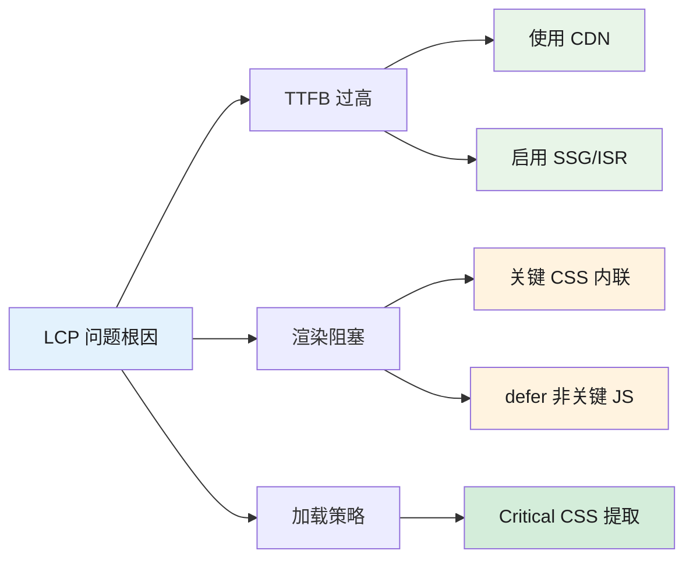

# SEO 与 Core Web Vitals

> 更新日期：2026-05-10 | 版本：2.0 | 覆盖：HTML / CSS / JavaScript / TypeScript / 浏览器 / 网络 / 安全 / React / Vue / 工程化 / 性能优化

---

## 1. Core Web Vitals（CWV）核心指标

Google 以 Core Web Vitals 作为页面体验（Page Experience）信号纳入排名因素。2024年5月起，INP（Interaction to Next Paint）正式取代 FID（First Input Delay），成为 Core Web Vitals 三件套之一。

### 1.1 三大指标速览

| 指标 | 全称 | 衡量什么 | 良好（Good） | 需改进（Needs Improvement） | 差（Poor） |
|------|------|---------|-------------|---------------------------|-----------|
| **LCP** | Largest Contentful Paint | 最大内容绘制时间（页面主要内容的加载速度） | ≤ 2.5s | 2.5s ~ 4.0s | > 4.0s |
| **CLS** | Cumulative Layout Shift | 累计布局偏移（视觉稳定性） | ≤ 0.1 | 0.1 ~ 0.25 | > 0.25 |
| **INP** | Interaction to Next Paint | 交互响应性（取代 FID，衡量所有用户交互的延迟） | ≤ 200ms | 200ms ~ 500ms | > 500ms |

> 参考：MDN - Interaction to Next Paint 定义（2026），https://developer.mozilla.org/en-US/docs/Glossary/Interaction_to_next_paint

### 1.2 LCP 优化策略

**LCP 是指页面视口内最大元素（如英雄图、标题文本）的渲染时间，通常是页面加载性能的瓶颈。**

#### 关键资源加载优化

```html
<!-- 预加载 LCP 元素（首屏关键图片） -->
<link rel="preload" href="/hero.webp" as="image">

<!-- 预连接关键域名（减少 DNS/TLS 握手时间） -->
<link rel="preconnect" href="https://fonts.googleapis.com">
<link rel="dns-prefetch" href="https://fonts.gstatic.com" crossorigin>
```

```css
/* 字体优化：使用 font-display: swap 避免文字阻塞 */
@font-face {
  font-family: 'MyFont';
  src: url('/fonts/myfont.woff2') format('woff2');
  font-display: swap;
}
```

#### Next.js 14 App Router 中的图片优化

```tsx
// app/page.tsx
import Image from 'next/image';

export default function Hero() {
  return (
    // priority=true 触发预加载，fetchpriority="high" 告知浏览器高优先级
    <Image
      src="/hero.webp"
      alt="产品介绍主图"
      width={1920}
      height={1080}
      priority           // 等价于 loading="eager"，同时生成 preload hint
      fetchPriority="high"
      sizes="(max-width: 768px) 100vw, 50vw"
    />
  );
```



### 1.3 INP 优化策略

**INP（Interaction to Next Paint）** 衡量用户交互（点击、键盘输入）到视觉反馈的时间。优化方向：

```
[ ] 长任务拆分：单个任务不超过 50ms，使用 scheduler.yield() 让步
[ ] 第三方脚本延迟加载：chatbot、分析工具用 script async/defer
[ ] 事件委托：减少重复绑定，同一父元素用 onClick 统一处理
[ ] CSS 动画：只用 transform/opacity，不触发 Layout/Paint
[ ] 懒加载非首屏组件：减少 JS Bundle 大小，加快 TTI
[ ] Web Worker：将重计算移出主线程（格式转换、加密等）
[ ] DOM 节点数建议 < 1400（Google 基准）
[ ] React 19 useOptimistic：提升交互感知速度
```

> 参考：五个超级有效优化 React 中 INP 的技巧（掘金 2025），https://juejin.cn/post/7468141313423638567

---

## 2. SEO Meta 标签体系

### 2.1 robots meta 指令

```tsx
// Next.js App Router 中的 robots 配置
export const metadata: Metadata = {
  robots: {
    index: true,        // 允许爬虫索引（默认 true）
    follow: true,       // 跟随链接（默认 true）
    googleBot: {
      index: true,
      follow: true,
      'max-image-preview': 'large',
      'max-snippet': -1,    // 不限制摘要长度
    },
  },
};
```

**输出 HTML：**

```html
<meta name="robots" content="index, follow">
<meta name="googlebot" content="index, follow, max-image-preview:large, max-snippet:-1">
```

#### 常见 robots 指令场景

| 指令 | 场景 | 说明 |
|------|------|------|
| `noindex, follow` | 登录页/后台页面 | 不索引但允许爬取链接 |
| `noindex, nofollow` | 隐私政策/法律页面 | 完全阻止索引 |
| `index, nofollow` | 用户生成内容页（如搜索结果） | 索引但不跟踪外链 |

### 2.2 canonical URL（规范化链接）

```tsx
// app/layout.tsx - 全局设置默认 canonical
export const metadata: Metadata = {
  alternates: {
    canonical: 'https://example.com',
  },
};

// app/blog/[slug]/page.tsx - 动态页面覆盖
export async function generateMetadata({ params }: Props): Promise<Metadata> {
  const post = await getPost(params.slug);
  return {
    alternates: {
      canonical: `https://example.com/blog/${params.slug}`,
    },
  };
}
```

**作用：** 防止 www vs 非 www、HTTP vs HTTPS、带参 URL 等导致的重复内容问题。

### 2.3 完整的 SEO Metadata 配置（Next.js 14 App Router）

```tsx
// app/blog/[slug]/page.tsx
type Props = { params: { slug: string } };

export async function generateMetadata({ params }: Props): Promise<Metadata> {
  const post = await getPost(params.slug);
  const canonicalUrl = `https://example.com/blog/${params.slug}`;

  return {
    title: `${post.title} | 前端面试指南`,
    description: post.excerpt,                        // 150-160 字符
    keywords: post.tags.join(', '),                  // 次要，Google 已不再重视
    authors: [{ name: '张三', url: 'https://example.com/about' }],
    openGraph: {
      title: post.title,
      description: post.excerpt,
      url: canonicalUrl,
      siteName: '前端面试指南',
      locale: 'zh_CN',
      type: 'article',
      publishedTime: post.datePublished,
      images: [{ url: post.coverImage, width: 1200, height: 630, alt: post.title }],
    },
    twitter: {
      card: 'summary_large_image',
      title: post.title,
      description: post.excerpt,
    },
    alternates: { canonical: canonicalUrl },
    robots: { index: true, follow: true, googleBot: { index: true, follow: true } },
  };
}
```

---

## 3. 渲染策略（SSR vs SSG vs ISR vs CSR）

### 3.1 四种渲染策略对比

| 策略 | 说明 | 首屏 | SEO | 交互性 | 适用场景 |
|------|------|------|-----|--------|---------|
| **CSR** | 客户端渲染，JS 生成内容 | 慢（白屏） | 需等待 JS | 最快 | 管理后台、个性化 DashBoard |
| **SSR** | 服务端实时渲染 | 快 | 是 优 | 中（需 hydrate） | 需要实时数据的页面 |
| **SSG** | 构建时生成静态 HTML | 最快 | 是 优 | 差（纯静态） | 博客、文档、营销页 |
| **ISR** | 增量静态，再生成 | 快 | 是 优 | 中（再生成期间旧） | 内容更新频繁的页面 |

### 3.2 Next.js 14 App Router 中的渲染策略

```tsx
// SSG（构建时生成）- 静态博客列表
export async function generateStaticParams() {
  const posts = await getAllPosts();
  return posts.map((post) => ({ slug: post.slug }));
}

// ISR（增量静态）- 内容定期更新
export const revalidate = 3600; // 每小时重新验证

// SSR（服务端渲染）- 动态数据
export const dynamic = 'force-dynamic';

// PPR（Partial Prerendering）- Next.js 15 实验特性
// 同时流式输出静态 HTML shell + 动态 Suspense 边界
```



```mermaid
gantt
    title HTML 解析与资源加载时序
    dateFormat X
    axisFormat %sms

    section 无属性 (sync)
    HTML解析    :0, 80
    JS下载      :80, 130
    JS执行      :130, 150
    HTML恢复    :150, 200

    section link href
    HTML解析    :0, 300
    CSS下载     :0, 150

    section script src
    HTML解析    :0, 50
    JS下载      :50, 150
    JS执行      :150, 200
    HTML恢复    :200, 250

    section img src
    HTML解析    :0, 300
    图片下载    :100, 180
```

验证工具：https://search.google.com/test/rich-results

---

## 4. 常见 SEO 陷阱与排查

| 症状 | 根因 | 解决方案 |
|------|------|---------|
| 页面未被抓取 | robots.txt 阻止 / noindex | 检查 robots.txt，添加 sitemap |
| 内容重复 | 多 URL 指向同一内容 | 添加 canonical + 规范 URL |
| 排名下降 | 大量 404 链接 / 内容变更 | 使用 301 重定向，提交更新 sitemap |
| 图片未索引 | 缺少 alt 属性 / 懒加载 | 添加 alt，提供图片 sitemap |
| JS 内容未收录 | CSR 内容 Google 未渲染 | 改用 SSR/SSG，或添加 HTML 快照 |

---

## 5. 面试 follow-up 问题

### 5.1 Q1: LCP 波动大（有时快有时慢）的根因是什么？

**答案：**
LCP 波动通常由以下原因导致：
1. **缓存命中率不一致**：动态内容（如个性化 hero 图）无法被 CDN 缓存
2. **网络波动**：第三方资源（如字体、API）响应时间不稳定
3. **CLS 导致延迟**：图片无尺寸导致布局偏移，LCP 元素位置变化
4. **JavaScript 阻塞**：同步脚本延迟了 LCP 资源加载

解决：确保 LCP 元素是静态的（同一 URL）、使用 `fetchpriority="high"`、预加载关键资源。

---

### 5.2 Q2: SSG 和 SSR 各自的不可替代场景是什么？

**答案：**
- **SSG 不可替代**：构建时数据已固定的页面（文档站、博客、帮助中心），构建速度最快，SEO 最优
- **SSR 不可替代**：需要用户个性化内容的页面（个性化首页、用户专属 Dashboard），或内容依赖实时数据库/外部 API

最佳实践：**同构（SSR + 缓存）** 或 **ISR**（频繁更新但可缓存），而非非此即彼。

---

### 5.3 Q3: JSON-LD 能直接提升搜索排名吗？

**答案：**
**不能直接提升排名**，但对 SEO 有间接帮助：
1. **丰富摘要（Rich Snippets）**：搜索结果出现星级、价格、FAQ 等样式，提升 CTR（点击率）
2. **帮助爬虫理解内容**：结构化数据让 Google 更准确理解页面主题
3. **语音搜索优化**：FAQ 结构化数据对语音搜索有帮助

**JSON-LD 的核心价值是让 Google 正确"读懂"你的内容，而非直接传递排名信号。**

---

> 参考：
> - https://developer.chrome.com/docs/crux（Chrome UX Report）
> - https://nextjs.org/docs/app/building-your-application/optimizing/metadata（Next.js Metadata API）
> - https://schema.org/docs/schemas.html（Schema.org 类型参考）
> - https://search.google.com/test/rich-results（结构化数据测试工具）

## 深入阅读与参考

!!! tip "怎么用这些资料"
    先读「官方文档与规范」建立准确的概念，再读「源码与示例」核对细节，最后用「教程、书籍与视频」换一种讲法加深理解。每条都写明了读哪一节、带着什么问题读。

### 官方文档与规范

| 资源 | 为什么读 | 怎么读 |
|---|---|---|
| [Core Web Vitals](https://web.dev/articles/vitals) | 指标定义与阈值的权威来源，面试答题基准 | 读 LCP、INP、CLS 三节，记阈值与分级，再对照自己项目实测一遍 |
| [Web Vitals 现场测量最佳实践](https://web.dev/articles/vitals-field-measurement-best-practices) | 现场测量最佳实践，避免上报方案常见错误 | 重点读归因与上报时机两节，检查是否用 sendBeacon、是否区分首屏与整页 |
| [Next.js 文档](https://nextjs.org/docs) | App Router 下 SSR/SSG/ISR 的官方口径 | 读渲染与缓存章节，画出四种策略的请求到渲染时序图 |
| [`<meta>` HTML metadata element](https://developer.mozilla.org/en-US/docs/Web/HTML/Reference/Elements/meta) | meta 元素总览，Meta 标签体系的地图 | 通读属性分类，梳理 name、http-equiv、charset 各自适用场景 |
| [`<meta http-equiv>` HTML attribute](https://developer.mozilla.org/en-US/docs/Web/HTML/Reference/Elements/meta/http-equiv) | http-equiv 类元数据与 HTTP 头的取舍 | 读 refresh 与 CSP 条目，思考为何多数场景应改用响应头 |
| [`<meta name>` HTML attribute](https://developer.mozilla.org/en-US/docs/Web/HTML/Reference/Elements/meta/name) | name 值索引，SEO 相关 meta 最集中 | 按 description、viewport、referrer 逐个读，列出本站缺失项 |
| ['`<meta name="robots">` HTML attribute value'](https://developer.mozilla.org/en-US/docs/Web/HTML/Reference/Elements/meta/name/robots) | robots 指令与索引控制的关键细节 | 读 noindex、nofollow 与爬虫行为，检查预发环境是否误加 noindex |
| [Vue SSR 指南](https://vuejs.org/guide/scaling-up/ssr.html) | hydration 前提与 mismatch 原因讲得透彻 | 读客户端激活与 hydration mismatch 两节，回答 SSR 后为何必须 hydrate |
| [Hydration Bugs _(and how to avoid them)_](https://book.leptos.dev/ssr/24_hydration_bugs.html) | hydration bug 类型清单，SSR 排查速查表 | 对照陷阱清单逐条检查自己的 SSR 页面，记录命中项 |

### 源码与示例

| 资源 | 为什么读 | 怎么读 |
|---|---|---|
| [web-vitals 库](https://github.com/GoogleChrome/web-vitals) | 官方采集库，能直接落到线上监控里 | 读 README 的归因构建部分，接入项目并解释各字段含义 |

### 教程、书籍与视频

| 资源 | 为什么读 | 怎么读 |
|---|---|---|
| [HTTP Archive Web Almanac 2024 性能章](https://almanac.httparchive.org/en/2024/performance) | 大规模真实站点数据，校准对指标的认知 | 读 Core Web Vitals 通过率章节，记录行业分布并与自己项目对比 |
| [Jake Archibald 博客](https://jakearchibald.com/) | 渲染与事件循环深度长文，附可运行示例 | 选读渲染相关文章，运行示例并用 Performance 面板复现结论 |

## 应用与行业实践

### 应用场景地图

| 场景 | 用到本页哪个知识点 | 典型技术选型 | 注意事项 |
|---|---|---|---|
| 后台管理的万行表格 | CSR 渲染策略、INP 长任务排查 | React/Vue + 虚拟滚动组件 + Web Worker 排序筛选 | 登录后表格不做 SSG；虚拟滚动会破坏浏览器 Ctrl+F 与打印 |
| 低端安卓的营销落地页 | LCP、CLS、首屏资源加载 | 静态 HTML 或 SSG，WebP/AVIF 图片，内联关键 CSS | LCP 图片不能加 `loading="lazy"`；第三方统计延迟到 load 后 |
| 多人协作白板 | INP、长任务拆分、CSR 实时同步 | Canvas/WebGL + `requestIdleCallback` + Web Worker | 不要把每条同步消息全部触发整树重渲染；限制单帧 DOM 写入 |
| 电商商品详情页 | SEO Meta 标签、结构化数据、SSR/ISR、CLS | Next.js ISR + JSON-LD Product + 图片尺寸占位 | 价格库存用短缓存并标记不可缓存；防止过期价格展示 |
| 内容站文章页 | SSG、LCP、Meta 标签、JSON-LD | Astro 或 Next.js SSG，封面图预先生成多尺寸 | 首图不加 lazy；代码高亮等非关键脚本异步加载 |
| 文档站全站搜索 | SSR/SSG + robots meta、CSR 搜索索引 | 静态页面 + 客户端索引或服务端搜索接口 | 搜索结果页设 `noindex`；避免爬虫抓取无意义查询参数 |
| 新闻热点榜单页 | ISR、TTFB、CDN 缓存 | Next.js ISR 短期重新生成，CDN 缓存 HTML | 用 on-demand revalidate 应对突发流量；配置过期兜底页 |
| 视频图文 Feed 首页 | LCP、CLS、无限滚动、图片懒加载 | SSR 首屏 + 分页或虚拟列表，`content-visibility:auto` | 首屏首图 eager；滚动加载要提供分页链接供爬虫发现 |

### 三个场景拆解

#### 场景 1：低端安卓的营销落地页

**业务背景**：页面通过广告投到低端安卓设备，用户点击后等 4 秒以上会流失。用 WebPageTest 的 Android 中端设备档位连测 3 次，可复现 LCP 高出 2.5 秒。

**怎么用本页知识解决**：先让 LCP 图片直接出现在首屏 HTML，再延迟非关键脚本，最后固定图片尺寸防 CLS。

```html
<html>
<head>
  <style>/* 内联首屏 CSS，避免等待外部样式 */</style>
  <link rel="preconnect" href="https://img.example.com">
  <link rel="preload" as="image" href="/hero.avif">
</head>
<body>
   <!-- 固定宽高防 CLS -->
  <script src="/app.js" defer></script>
  <script>
    window.addEventListener('load', () => {
      const s = document.createElement('script');
      s.src = '/analytics.js';
      s.async = true;
      document.body.appendChild(s);
    });
  </script>
</body>
</html>
```

- `preload` 让 LCP 图片在网络层提前排队，不被脚本或样式推迟请求。
- `width` 和 `height` 在布局阶段留出固定区域，图片加载后不推挤文字。
- `app.js` 使用 `defer`，不阻塞 HTML 解析。
- 统计脚本在 `window.load` 后注入，避免抢占首屏主线程。
- 首屏 CSS 走内联，减少一次阻塞渲染的外部请求。

**怎么度量收益**：看 LCP、CLS 和首次内容绘制。用 WebPageTest 的 Android 中端档位测 3 次取 75 分位，用 Lighthouse 移动端做本地复测。

**什么时候不该用**：首屏是用户登录后才显示的地图或报表时，不必预加载首图。活动页只上线一晚且无 SEO 价值时，不必投入 SSG/ISR 改造，直接静态 HTML 加压缩图片即可。

#### 场景 2：后台管理的万行表格

**业务背景**：订单列表一次载入 30000 行，默认展示 50 行，现有代码把所有行都塞进 DOM。点击排序后主线程阻塞，勾选和筛选跟随卡顿。

**怎么用本页知识解决**：登录后工具页适合 CSR，不做 SEO；用虚拟滚动减少 DOM 节点；把排序发到 Web Worker，避免主线程长任务。

```tsx
// sortWorker 通过 new Worker(new URL('./sort.worker.ts', import.meta.url), { type: 'module' }) 创建
import { FixedSizeList } from 'react-window';

function onSort(key) {
  sortWorker.postMessage({ rows, key }); // 发消息给 Worker，避免主线程排序
}

function Row({ index, style, data }) {
  const row = data[index]; // 只渲染可视区行
  return <div style={style}>{row.orderId} {row.status}</div>;
}

export function OrderTable({ sortedRows }) {
  return (
    <FixedSizeList height={600} itemCount={sortedRows.length} itemSize={32} width="100%">
      {(props) => <Row {...props} data={sortedRows} />}
    </FixedSizeList>
  );
}
```

- `FixedSizeList` 只挂载可视区和缓冲区的行，DOM 节点从万级降到几十。
- `onSort` 只发消息，不直接执行大数组排序，降低 INP 超标风险。
- Worker 内部先复制数组再排序，避免原地修改 `props` 触发未知更新。
- 勾选状态单独存为集合，不把选中结果写回每一行对象。
- 大批量导入导出继续用 Worker 分片处理，不让单帧超过 50 毫秒。

**怎么度量收益**：看 INP、Total Blocking Time 和长任务数量。用 Chrome DevTools Performance 录制排序与勾选，用 `web-vitals.js` 在真实后台设备收集 INP。

**什么时候不该用**：行数只有几百时，虚拟滚动会增加键盘导航和测试成本。需求必须支持浏览器原生搜索或打印时，虚拟滚动会隐藏部分行。若列表实时变化且必须保持滚动位置，虚拟列表需要额外恢复逻辑，不如用服务端分页。

#### 场景 3：文档站文章页

**业务背景**：文档站有 500 篇文章，每篇约 3000 字，当前 CSR 让爬虫只看到空壳。用 Lighthouse 移动端对 20 篇样本跑分，首屏 JS 执行超过 1.2 秒，LCP 普遍高于 3 秒。

**怎么用本页知识解决**：改成 SSG 预渲染完整 HTML，让正文和 Meta 在构建时写入文件；图片固定宽高防 CLS。

```tsx
export async function getStaticProps({ params }) {
  const doc = await readDoc(params.slug); // 构建时读取 Markdown
  return { props: { doc } };
}
export async function getStaticPaths() {
  const slugs = await listDocSlugs();
  return { paths: slugs.map((slug) => ({ params: { slug } })), fallback: 'blocking' }; // 新文章按需生成
}
export default function Doc({ doc }) {
  return (
    <article>
       {/* 固定宽高防 CLS */}
      <div dangerouslySetInnerHTML={{ __html: doc.html }} /> {/* 正文已在构建时写入 HTML */}
    </article>
  );
}
```

- `getStaticProps` 在构建时读取内容，爬虫和用户拿到的首屏 HTML 已包含正文。
- `fallback: 'blocking'` 让新文章首次访问时按需生成，不必全站重构建。
- 封面图带 `width` 和 `height`，图片加载前后布局稳定。
- 正文内容不依赖客户端请求，减少 CSR 常见的二次加载和骨架屏空窗。
- JSON-LD 的 Article 和 Breadcrumb 可在返回 JSX 中一并输出，供 Rich Results 测试。

**怎么度量收益**：看 LCP、CLS、TTFB 和索引覆盖率。用 Lighthouse CI 对 20 篇样本页面跑移动端，用 Search Console 看索引增速，用 Rich Results Test 验证结构化数据。

**什么时候不该用**：文档包含付费或登录内容时，不能 SSG 缓存，否则会把非公开文本暴露在 CDN。文档每分钟发布且必须立即生效时，全量静态化构建时间可能超过发布容忍度，应改成 ISR 或 SSR。

### 行业先进实践

1. 首屏 LCP 图片直接用 img 标签加载，不使用 `loading="lazy"`（出处：web.dev Optimize Largest Contentful Paint）。浏览器会立即请求首屏主图，避免懒加载延迟 LCP。你的项目可把文章封面和商品首图设为 eager，只对后续图片懒加载。

2. 对 LCP 资源使用 `fetchpriority="high"`（出处：MDN `fetchpriority` 属性文档）。该属性提高图片或脚本的网络优先级。你的项目可在 `preload` 之外给首图设置该属性。

3. 使用 `content-visibility: auto` 减少离屏渲染（出处：web.dev content-visibility）。浏览器只渲染接近视口的区域，降低布局和绘制成本。你的项目可对长文档下方图集或列表应用该属性。

4. 使用 `font-display: optional` 并子集化字体（出处：MDN font-display）。字体在短时间未加载完成时显示回退字体，避免文本不可见。你的项目可对非品牌展示页的正文字体采用该策略。

5. 用 Event Timing API 定位 INP 超标的交互（出处：web.dev Optimize Interaction to Next Paint）。它记录 click、keydown 等事件的输入到绘制延迟。你的项目可在 PerformanceObserver 中上报长交互，再拆长任务。

### 从学到用：落地路线

1. 试点：选 3 个低端流量入口营销落地页建立 Lighthouse CI 基线。验收标准：三页移动端 Lighthouse 的 LCP 均低于 2.5 秒，CLS 低于 0.1。

2. 验证：在预发布环境用 WebPageTest 中端安卓复现首屏，修掉主线程长任务和 LCP 图片阻塞。验收标准：WebPageTest Android 中端档位 75 分位 INP 低于 200 毫秒。

3. 推广：把首图尺寸占位、关键资源预加载、SSG/ISR 模板复制到商品详情页和内容文章页。验收标准：Lighthouse CI 在 20 个抽样页面无 LCP/CLS 回归。

4. 防回退：接入 Search Console 与 CrUX，设置 LCP 和 CLS 阈值周报。验收标准：连续 7 天核心页面群不越过阈值，超限页面有负责人和修复日期。

### 动手作业

**目标**：把一个 2000 字图文教程页改成 SSG，并优化到移动端 LCP 和 CLS 达标。

**步骤**：
1. 用 Next.js 建立项目，把教程正文放进 Markdown 文件。
2. 用 `getStaticProps` 和 `getStaticPaths` 生成静态文章页。
3. 给封面图设置 `width` 和 `height`，并加 `fetchpriority="high"`。
4. 对非首屏图片加 `loading="lazy"`。
5. 用 Lighthouse 移动端连跑 3 次，记录每次 LCP 和 CLS。
6. 添加 JSON-LD Article，并通过 Rich Results Test 验证。
7. 用 Chrome DevTools Performance 检查主线程长任务，把非关键脚本改为 `defer`。

**验收标准**：
- Lighthouse 移动端模拟中端设备，3 次结果中最差的 LCP 小于 2.5 秒，CLS 小于 0.1。
- 页面 HTML 源码包含文章首段文字和 JSON-LD Article。
- Rich Results Test 能检测到 Article 类型。
- 封面图在 HTML 中的 `width` 和 `height` 比例与真实图片一致，且未使用 `loading="lazy"`。
- 非首屏图片带 `loading="lazy"`。

