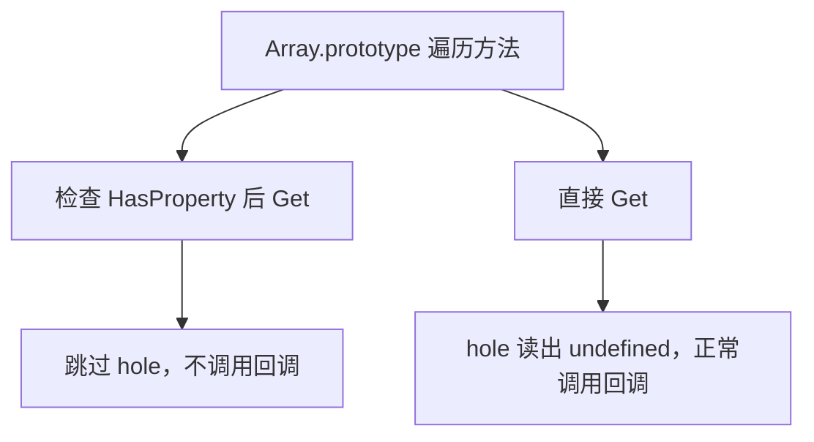

# Array API 全景：ES6 到 ES2025 与手写 polyfill

!!! abstract "核心结论"
    - Array 新增方法几乎全部只是规范层"糖"：它们只依赖 `LengthOfArrayLike`、`Get`、`HasProperty`、`Set`、`CreateDataPropertyOrThrow` 这几个抽象操作，因此天然对类数组泛型；理解这五个操作就能推出所有行为差异。
    - holes 的命运由"读值时用 `Get` 还是 `HasProperty`"决定：`find`/`at`/`entries` 用 `Get`，会把 hole 读成 `undefined`；`indexOf`/`flat`/`map` 用 `HasProperty`，会跳过 hole。
    - 写入语义分两派：`fill`/`copyWithin`/`sort` 用 `Set`（会触发原型链 setter，对不可写属性抛 TypeError）；`flat`/`with`/`toSorted`/`Array.from` 用 `CreateDataPropertyOrThrow`（不会触发 setter，且把 hole 变成实数属性）。
    - ES2023 的四个 "copy 方法"（`toReversed`/`toSorted`/`toSpliced`/`with`）刻意绕开 `Symbol.species`，永远返回普通 Array，这是与 `slice`/`map`/`filter` 的关键区别。
    - 复杂度上只有 `at` 是 O(1)，`sort`/`toSorted` 是 O(n log n)，其余遍历类方法都是 O(n)；真正的性能陷阱在 V8 的 elements kinds 退化，而不是算法本身。

## 1. 版本全景与语义速查

下表只列出与 Array 直接相关、且有明确规范版本归属的新增内容。ES2017、ES2018、ES2020、ES2021 的年度版本没有新增 `Array.prototype` 方法。

| 版本 | 新增 API | 核心语义 | 复杂度 |
| --- | --- | --- | --- |
| ES2015 (ES6) | `Array.from`、`Array.of`、`find`、`findIndex`、`fill`、`copyWithin`、`entries`、`keys`、`values`、`Array.prototype[Symbol.iterator]` | 迭代器协议接入数组；引入 holes 读取分歧 | 遍历 O(n)，`fill`/`copyWithin` O(n) |
| ES2016 | `includes` | 使用 SameValueZero，能命中 `NaN` | O(n) |
| ES2019 | `flat`、`flatMap`；`sort` 稳定性成为规范强制要求 | 递归展平；稳定排序从"实现自由"变为"规范义务" | O(n·d)，`sort` O(n log n) |
| ES2022 | `at` | 支持负索引，`ToIntegerOrInfinity` 归一 | O(1) |
| ES2023 | `findLast`、`findLastIndex`、`toReversed`、`toSorted`、`toSpliced`、`with` | 倒序查找；不可变（copy）版本，不走 species | O(n)，`toSorted` O(n log n) |
| ES2024 | `Object.groupBy`、`Map.groupBy` | 按 key 分组，`Object.groupBy` 使用属性键强制转换，`Map.groupBy` 使用 SameValueZero | O(n) |
| ES2025 | `Array.fromAsync` | 返回 Promise 的异步数组构造，逐元素 await | O(n) |

关于 `Array.fromAsync`：该提案于 2024 年达成 Stage 4，被收录进 ES2025；各运行时的落地版本（Node/Chrome）需核对官方文档与 caniuse。

## 2. 底层原理：从 V8 elements kinds 到规范算法

### 2.1 elements kinds：性能差异的真正来源

V8 把数组元素存储分为若干种类，创建时确定，之后只能向"更泛化"单向迁移：

| kind | 触发场景 | 属性访问成本 |
| --- | --- | --- |
| `PACKED_SMI_ELEMENTS` | `[1, 2, 3]` | 最低，元素是未装箱小整数 |
| `PACKED_DOUBLE_ELEMENTS` | `[1.5, 2.5]` 或 push 浮点后 | 中，需拆箱 |
| `PACKED_ELEMENTS` | 加入对象/字符串 | 高，元素是指针 |
| `HOLEY_SMI_ELEMENTS` | `new Array(3)`、`arr[5] = 1` | 需额外判断"空洞" |
| `HOLEY_DOUBLE_ELEMENTS` | holey 数组里写入浮点 | 高 |
| `HOLEY_ELEMENTS` | `delete arr[0]`、写入对象 | 最高 |

关键结论（来自 V8 官方博客 "Elements kinds in V8"）：`delete arr[0]`、`arr[1000] = 1`、`new Array(n)` 都会把数组推入 holey 分支；`PACKED_SMI` 一旦变成 `PACKED_DOUBLE` 就再也回不去。这就是"稀疏数组慢"的工程原因，与规范层语义无关。

### 2.2 LengthOfArrayLike / ToLength 与 2^53 - 1

历史规范里的 `ToLength` 在现行规范中已改名为 `LengthOfArrayLike`（草案编辑器改名，具体版次需核对官方文档），语义一致：

```text
LengthOfArrayLike(obj) = min(max(ToIntegerOrInfinity(Get(obj, "length")), 0), 2^53 - 1)
```

`ToIntegerOrInfinity`：`NaN` -> `0`，`±Infinity` 原样返回，其余向零截断。所有 Array 方法的 `len` 都来自这个操作，所以 `Array.prototype.map.call({ length: Math.pow(2, 60) }, fn)` 会尝试遍历天文数字次——这是一个真实的 DoS 面。

### 2.3 Get vs HasProperty：holes 的命运分叉



还有一个独立的细节：迭代器 `values()`/`entries()` 用 `Get` 读值，所以 `[...[, 1]]` 得到 `[undefined, 1]`；而 spread 展开用的是迭代器，因此 spread 会把 hole 变 dense。

### 2.4 写入语义：Set 与 CreateDataPropertyOrThrow

| 方法 | 写入抽象操作 | 触发原型 setter | hole 处理 |
| --- | --- | --- | --- |
| `fill` | `Set(O, k, v, true)` | 是 | 直接把 hole 填成实属性 |
| `copyWithin` | `Set` / `DeletePropertyOrThrow` | 是 | 源是 hole 时删除目标属性 |
| `sort` | `Set` | 是 | 原地排序，hole 保留在尾部 |
| `Array.from` | `CreateDataPropertyOrThrow` | 否 | array-like 路径产生密集 `undefined` |
| `flat` / `flatMap` | `CreateDataPropertyOrThrow` | 否 | 跳过 hole，结果 compress |
| `with` / `toReversed` / `toSorted` / `toSpliced` | `CreateDataPropertyOrThrow` | 否 | 读时 hole -> `undefined`，结果 densify |
| `Object.groupBy` | 在 null 原型对象上 `CreateDataPropertyOrThrow` | 否 | 不涉及 |

`Set` 走 `[[Set]]`，会沿原型链找访问器、会因目标属性不可写而抛 `TypeError`；`CreateDataPropertyOrThrow` 走 `[[DefineOwnProperty]]`，直接在自己身上建数据属性。这就是 `Array.prototype.sort.call('cba')` 抛错而 `Array.prototype.slice.call('abc')` 正常的原因。

## 3. ES6：手写实现

以下代码属于同一个脚本 `array-polyfills.js`，helper 只定义一次。运行环境：Node.js 18+；与原生对拍的部分需要 Node 22+ 才能覆盖 `Array.fromAsync`、`Object.groupBy`。

```js
'use strict';
const assert = require('node:assert/strict');

// 规范抽象操作 ToIntegerOrInfinity 的近似实现
function toIntegerOrInfinity(v) {
  const n = Number(v);
  if (Number.isNaN(n)) return 0;
  if (n === 0 || n === Infinity || n === -Infinity) return n; // 保留 ±0 与 ±Infinity
  return Math.trunc(n);
}

// 规范抽象操作 LengthOfArrayLike（即历史上的 ToLength）
function toLength(v) {
  const n = Number(v);
  if (Number.isNaN(n) || n <= 0) return 0;
  if (n === Infinity) return 2 ** 53 - 1;
  return Math.min(Math.floor(n), 2 ** 53 - 1);
}

// 规范抽象操作 GetMethod
function getMethod(obj, key) {
  const func = obj === null || obj === undefined ? undefined : obj[key];
  if (func === undefined || func === null) return undefined;
  if (typeof func !== 'function') throw new TypeError(`${String(key)} is not callable`);
  return func;
}

// 规范抽象操作 ToPropertyKey 的简化版
// 注意：若对象的 ToPrimitive 返回 Symbol，本实现与规范不同，需核对官方文档
function toPropertyKey(v) {
  return typeof v === 'symbol' ? v : String(v);
}
```

### 3.1 Array.from 与 Array.of

`Array.from` 优先走 `@@iterator`（`@@asyncIterator` 不参与），否则按 `LengthOfArrayLike` 走类数组路径。`Array.of` 与 `new Array(n)` 的区别是：前者把参数当元素，后者把单个数字参数当长度。

```js
function fromPolyfill(items, mapFn, thisArg) {
  const C = this;
  if (mapFn !== undefined && typeof mapFn !== 'function') {
    throw new TypeError('Array.from: mapFn must be callable');
  }
  const mapping = mapFn !== undefined;
  const isCtor = typeof C === 'function';
  const A = isCtor ? new C() : [];
  let k = 0;

  const iteratorMethod = getMethod(items, Symbol.iterator);
  if (iteratorMethod !== undefined) {
    // 迭代器路径：以迭代器返回的个数为准，不读 items.length
    const it = iteratorMethod.call(items);
    for (;;) {
      const step = it.next();
      if (typeof step !== 'object' || step === null) {
        throw new TypeError('iterator result is not an object');
      }
      if (step.done) break;
      const value = mapping ? mapFn.call(thisArg, step.value, k) : step.value;
      if (k >= 2 ** 53 - 1) throw new TypeError('Array.from: too many elements');
      A[k] = value; // 规范使用 CreateDataPropertyOrThrow
      k += 1;
    }
    A.length = k;
    return A;
  }

  // 类数组路径
  const O = Object(items);
  const len = toLength(O.length);
  if (isCtor) A.length = len;
  for (let i = 0; i < len; i += 1) {
    const value = mapping ? mapFn.call(thisArg, O[i], i) : O[i];
    A[i] = value;
  }
  A.length = len;
  return A;
}

function ofPolyfill(...args) {
  const C = this;
  const isCtor = typeof C === 'function';
  const A = isCtor ? new C() : [];
  for (let k = 0; k < args.length; k += 1) A[k] = args[k];
  A.length = args.length;
  return A;
}
```

验证标准：

```js
assert.deepEqual(fromPolyfill.call(Array, 'abc'), ['a', 'b', 'c']);
assert.deepEqual(fromPolyfill.call(Array, new Set([1, 2])), [1, 2]);
assert.deepEqual(fromPolyfill.call(Array, [1, 2, 3], (v) => v * 2), [2, 4, 6]);
assert.deepEqual(fromPolyfill.call(Array, { 0: 'x', 1: 'y', length: 2 }), ['x', 'y']);
assert.deepEqual(fromPolyfill.call(Array, { length: 2 }), [undefined, undefined]);
const ctx = { mul: 3 };
assert.deepEqual(
  fromPolyfill.call(Array, [1, 2], function (v) { return v * this.mul; }, ctx),
  [3, 6]
);
assert.throws(() => fromPolyfill.call(Array, [1], 'not-callable'), TypeError);
assert.throws(() => fromPolyfill.call(Array, { [Symbol.iterator]: 1 }), TypeError);

assert.deepEqual(ofPolyfill.call(Array, 1, 2, 3), [1, 2, 3]);
assert.deepEqual(ofPolyfill.call(Array, 7), [7]);   // 对比 new Array(7) 是长度 7 的 holey 数组
assert.deepEqual(ofPolyfill.call(Array), []);
console.log('[3.1 from/of] 全部断言通过');
// 预期输出：[3.1 from/of] 全部断言通过
```

### 3.2 find / findIndex（含 ES2023 的 findLast）

这三个方法读值时只用 `Get`，不查 `HasProperty`，因此会"访问" hole 并把 `undefined` 交给回调。

```js
function findIndexPolyfill(predicate, thisArg) {
  if (typeof predicate !== 'function') throw new TypeError('predicate must be callable');
  const O = Object(this);
  const len = toLength(O.length);
  for (let k = 0; k < len; k += 1) {
    const kValue = O[k]; // Get 语义：hole 得到 undefined，回调仍会被调用
    if (predicate.call(thisArg, kValue, k, O)) return k;
  }
  return -1;
}

function findPolyfill(predicate, thisArg) {
  if (typeof predicate !== 'function') throw new TypeError('predicate must be callable');
  const O = Object(this);
  const len = toLength(O.length);
  for (let k = 0; k < len; k += 1) {
    const kValue = O[k];
    if (predicate.call(thisArg, kValue, k, O)) return kValue;
  }
  return undefined;
}

function findLastPolyfill(predicate, thisArg) {
  if (typeof predicate !== 'function') throw new TypeError('predicate must be callable');
  const O = Object(this);
  const len = toLength(O.length);
  for (let k = len - 1; k >= 0; k -= 1) {
    const kValue = O[k];
    if (predicate.call(thisArg, kValue, k, O)) return kValue;
  }
  return undefined;
}

function findLastIndexPolyfill(predicate, thisArg) {
  if (typeof predicate !== 'function') throw new TypeError('predicate must be callable');
  const O = Object(this);
  const len = toLength(O.length);
  for (let k = len - 1; k >= 0; k -= 1) {
    const kValue = O[k];
    if (predicate.call(thisArg, kValue, k, O)) return k;
  }
  return -1;
}
```

验证标准：

```js
assert.equal(findPolyfill.call([1, 2, 3], (v) => v > 1), 2);
assert.equal(findPolyfill.call([1, 2, 3], (v) => v > 9), undefined);
assert.equal(findIndexPolyfill.call([1, 2, 3], (v) => v > 1), 1);
assert.equal(findIndexPolyfill.call([1, 2, 3], (v) => v > 9), -1);
// 与 indexOf 的核心差异：find 会访问 hole
assert.equal(findIndexPolyfill.call([, , 1], (v) => v === undefined), 0);
assert.equal([, , 1].indexOf(undefined), -1);
assert.equal(findLastPolyfill.call([1, 2, 3], (v) => v < 3), 2);
assert.equal(findLastIndexPolyfill.call([1, 2, 3], (v) => v < 3), 1);
assert.throws(() => findPolyfill.call([1], null), TypeError);
console.log('[3.2 find 系列] 全部断言通过');
// 预期输出：[3.2 find 系列] 全部断言通过
```

### 3.3 fill 与 copyWithin

两者都用 `Set` 写值，因此可以触发原型链上的 setter；`copyWithin` 还会在源位置是 hole 时用 `DeletePropertyOrThrow` 把目标位置删成 hole。

```js
function fillPolyfill(value, start, end) {
  const O = Object(this);
  const len = toLength(O.length);
  let k = toIntegerOrInfinity(start === undefined ? 0 : start);
  k = k < 0 ? Math.max(len + k, 0) : Math.min(k, len);
  const relEnd = end === undefined ? len : toIntegerOrInfinity(end);
  const final = relEnd < 0 ? Math.max(len + relEnd, 0) : Math.min(relEnd, len);
  while (k < final) {
    O[k] = value; // 规范使用 Set，会走 [[Set]]，可能命中原型 setter
    k += 1;
  }
  return O;
}

function copyWithinPolyfill(target, start, end) {
  const O = Object(this);
  const len = toLength(O.length);
  let to = toIntegerOrInfinity(target);
  to = to < 0 ? Math.max(len + to, 0) : Math.min(to, len);
  let from = toIntegerOrInfinity(start);
  from = from < 0 ? Math.max(len + from, 0) : Math.min(from, len);
  const relEnd = end === undefined ? len : toIntegerOrInfinity(end);
  const fin = relEnd < 0 ? Math.max(len + relEnd, 0) : Math.min(relEnd, len);

  let count = Math.min(fin - from, len - to);
  if (count < 0) count = 0;

  // 目标区间与源区间重叠且 from < to 时必须倒序复制，否则会自我覆盖
  let direction = 1;
  if (from < to && to < from + count) {
    direction = -1;
    from = from + count - 1;
    to = to + count - 1;
  }

  while (count > 0) {
    if (from in O) {
      O[to] = O[from]; // Set
    } else {
      delete O[to]; // DeletePropertyOrThrow
    }
    from += direction;
    to += direction;
    count -= 1;
  }
  return O;
}
```

验证标准：

```js
assert.deepEqual(copyWithinPolyfill.call([1, 2, 3, 4, 5], -2), [1, 2, 3, 1, 2]);
assert.deepEqual(copyWithinPolyfill.call([1, 2, 3, 4, 5], 1, 3), [1, 4, 5, 4, 5]);
assert.deepEqual(copyWithinPolyfill.call([1, 2, 3, 4, 5], 0, 3, 4), [4, 2, 3, 4, 5]);
// 源区间 [0,4) 与目标区间 [1,5) 重叠：必须先整体读取旧值再写入（等价于倒序复制），
// 结果是 [1,1,2,3,4]；若正序边读边写会读到刚写入的值，得到 [1,1,1,1,1]
assert.deepEqual(copyWithinPolyfill.call([1, 2, 3, 4, 5], 1, 0, 4), [1, 1, 2, 3, 4]);
// 源是 hole 时目标被删成 hole
const holey = [1, , 3];
copyWithinPolyfill.call(holey, 0, 1);
assert.equal(0 in holey, false);
assert.equal(holey[1], 3);

// fill 用 Set：对全 hole 数组写入时命中原型 setter
let setterCalls = 0;
Object.defineProperty(Array.prototype, '2', {
  configurable: true,
  get() { return undefined; },
  set() { setterCalls += 1; },
});
const sparse = new Array(3);
fillPolyfill.call(sparse, 9, 2, 3);
assert.equal(setterCalls, 1);
// 注意不能用 `2 in sparse`：in 会沿原型链查找，原型上的访问器 '2' 会让它恒为 true；
// 判断「是否成为自有属性」必须用 hasOwn
assert.equal(Object.hasOwn(sparse, 2), false); // 写入被原型 setter 吞掉，没有成为 own property
delete Array.prototype[2];

assert.deepEqual(fillPolyfill.call([1, 2, 3, 4], 0, 1, 3), [1, 0, 0, 4]);
assert.deepEqual(fillPolyfill.call([1, 2, 3, 4], 0, -2), [1, 2, 0, 0]);
console.log('[3.3 fill/copyWithin] 全部断言通过');
// 预期输出：[3.3 fill/copyWithin] 全部断言通过
```

### 3.4 entries / keys / values（Array Iterator）

真实的 Array Iterator 每次 `next()` 都重新读取 `length`，所以迭代中 push 会被继续消费；迭代器持有数组引用，不是快照。

```js
function createArrayIterator(array, kind) {
  const O = Object(array); // 迭代器持有对象引用，不是快照
  let index = 0;
  return {
    next() {
      const len = toLength(O.length); // 每次都重新读 length
      if (index >= len) return { value: undefined, done: true };
      const i = index;
      index += 1;
      if (kind === 'key') return { value: i, done: false };
      const value = O[i]; // Get 语义：hole -> undefined
      if (kind === 'value') return { value, done: false };
      return { value: [i, value], done: false };
    },
    [Symbol.iterator]() { return this; },
  };
}

function entriesPolyfill() { return createArrayIterator(this, 'key+value'); }
function keysPolyfill() { return createArrayIterator(this, 'key'); }
function valuesPolyfill() { return createArrayIterator(this, 'value'); }
```

验证标准：

```js
assert.deepEqual([...valuesPolyfill.call([1, 2, 3])], [1, 2, 3]);
assert.deepEqual([...keysPolyfill.call(['a', 'b'])], [0, 1]);
assert.deepEqual([...entriesPolyfill.call(['a'])], [[0, 'a']]);
// hole 被读成 undefined
const first = valuesPolyfill.call([, 'x']).next();
assert.deepEqual(first, { value: undefined, done: false });
// 迭代中增长会被继续消费
const growing = [1, 2];
const it = valuesPolyfill.call(growing);
it.next();
growing.push(3);
assert.deepEqual([...it], [2, 3]);
console.log('[3.4 Array Iterator] 全部断言通过');
// 预期输出：[3.4 Array Iterator] 全部断言通过
```

## 4. ES2016：includes 与 SameValueZero

`includes` 用 SameValueZero 比较（`NaN` 命中，`+0`/`-0` 相等）；`indexOf` 用严格相等且先 `HasProperty`，所以跳过 hole 也找不到 `NaN`。

```js
function sameValueZero(x, y) {
  // x === y 覆盖 ±0 相等；NaN 特判
  return x === y || (Number.isNaN(x) && Number.isNaN(y));
}

function includesPolyfill(searchElement, fromIndex) {
  const O = Object(this);
  const len = toLength(O.length);
  if (len === 0) return false;
  const n = toIntegerOrInfinity(fromIndex === undefined ? 0 : fromIndex);
  if (n === Infinity) return false;
  let k = n >= 0 ? n : Math.max(len + n, 0);
  while (k < len) {
    const kValue = O[k]; // 只用 Get，hole 读成 undefined
    if (sameValueZero(searchElement, kValue)) return true;
    k += 1;
  }
  return false;
}
```

验证标准：

```js
assert.equal(includesPolyfill.call([1, 2, NaN], NaN), true);
assert.equal([1, 2, NaN].indexOf(NaN), -1);
assert.equal(includesPolyfill.call([,], undefined), true);   // hole 等价于 undefined
assert.equal([,].indexOf(undefined), -1);                    // indexOf 跳过 hole
assert.equal(includesPolyfill.call([0], -0), true);          // SameValueZero 下 +0 等于 -0
assert.equal(includesPolyfill.call([1, 2, 3], 2), true);
assert.equal(includesPolyfill.call([1, 2, 3], 3, -1), true); // fromIndex 为 -1 时等价于从下标 2 开始搜索
assert.equal(includesPolyfill.call([1, 2, 3], -1), false);   // 第一个参数是要搜索的值 -1，而不是下标
assert.equal(includesPolyfill.call([1, 2, 3], Infinity), false);
console.log('[4 includes] 全部断言通过');
// 预期输出：[4 includes] 全部断言通过
```

## 5. ES2019：flat 与 flatMap

关键点：`FlattenIntoArray` 对每个源下标先 `HasProperty`，所以 hole 被跳过（结果 compress）；`flatMap` 不会丢弃 `undefined`，只是把"非数组"结果原样放入；`shouldFlatten` 用的是 `IsArray`，array-like 和字符串都不会被展开。

```js
function flattenIntoArray(target, source, sourceLen, start, depth, mapper, thisArg) {
  let targetIndex = start;
  let sourceIndex = 0;
  while (sourceIndex < sourceLen) {
    const P = String(sourceIndex);
    if (P in source) { // HasProperty：hole 直接跳过
      let element = source[P];
      if (mapper !== undefined) {
        element = mapper.call(thisArg, element, sourceIndex, source);
      }
      const shouldFlatten = depth > 0 && Array.isArray(element);
      if (shouldFlatten) {
        const newDepth = depth === Infinity ? Infinity : depth - 1;
        targetIndex = flattenIntoArray(
          target,
          Object(element),
          toLength(element.length),
          targetIndex,
          newDepth
        );
      } else {
        if (targetIndex >= 2 ** 53 - 1) throw new TypeError('too many elements');
        target[targetIndex] = element; // CreateDataPropertyOrThrow
        targetIndex += 1;
      }
    }
    sourceIndex += 1;
  }
  return targetIndex;
}

function flatPolyfill(depth) {
  const O = Object(this);
  const sourceLen = toLength(O.length);
  let depthNum = 1;
  if (depth !== undefined) {
    depthNum = toIntegerOrInfinity(depth);
    if (depthNum < 0) depthNum = 0;
  }
  const A = []; // 规范里是 ArraySpeciesCreate(O, 0)，本实现忽略 species
  flattenIntoArray(A, O, sourceLen, 0, depthNum);
  return A;
}

function flatMapPolyfill(mapper, thisArg) {
  if (typeof mapper !== 'function') throw new TypeError('mapper must be callable');
  const O = Object(this);
  const sourceLen = toLength(O.length);
  const A = [];
  flattenIntoArray(A, O, sourceLen, 0, 1, mapper, thisArg);
  return A;
}
```

验证标准：

```js
assert.deepEqual(flatPolyfill.call([1, [2, [3, [4]]]]), [1, 2, [3, [4]]]);
assert.deepEqual(flatPolyfill.call([1, [2, [3, [4]]]], Infinity), [1, 2, 3, 4]);
assert.deepEqual(flatPolyfill.call([1, [2, [3, [4]]]], -1), [1, [2, [3, [4]]]]);
assert.deepEqual(flatPolyfill.call([1, , 2]), [1, 2]);          // hole 被移除
assert.equal(flatPolyfill.call([1, , 2]).length, 2);
assert.deepEqual(flatPolyfill.call([1, { 0: 2, length: 1 }]), [1, { 0: 2, length: 1 }]);
assert.deepEqual(flatMapPolyfill.call([1, 2], (v) => [v, v * 10]), [1, 10, 2, 20]);
assert.deepEqual(flatMapPolyfill.call([1, 2], (v) => v), [1, 2]);          // 非数组不展开
assert.deepEqual(flatMapPolyfill.call([1, 2], () => undefined), [undefined, undefined]);
assert.throws(() => flatMapPolyfill.call([1], 'x'), TypeError);
console.log('[5 flat/flatMap] 全部断言通过');
// 预期输出：[5 flat/flatMap] 全部断言通过
```

## 6. ES2022：at

`at` 是唯一 O(1) 的新增方法。注意越界返回 `undefined`（不是抛错），这点与 ES2023 的 `with` 正相反。

```js
function atPolyfill(index) {
  const O = Object(this);
  const len = toLength(O.length);
  let relativeIndex = toIntegerOrInfinity(index);
  if (relativeIndex < 0) relativeIndex += len;
  if (relativeIndex < 0 || relativeIndex >= len) return undefined;
  return O[relativeIndex];
}
```

验证标准：

```js
assert.equal(atPolyfill.call([1, 2, 3], 0), 1);
assert.equal(atPolyfill.call([1, 2, 3], -1), 3);
assert.equal(atPolyfill.call([1, 2, 3], 3), undefined);
assert.equal(atPolyfill.call([1, 2, 3], -4), undefined);
assert.equal(atPolyfill.call([, 1], 0), undefined);       // hole 读成 undefined
assert.equal(atPolyfill.call('abc', -1), 'c');            // 对 String 对象泛型可用
assert.equal(atPolyfill.call({ 0: 'x', length: 1 }, -1), 'x');
console.log('[6 at] 全部断言通过');
// 预期输出：[6 at] 全部断言通过
```

## 7. ES2023：findLast 与四个 copy 方法

四个 copy 方法的共同点：`ArrayCreate(len)` 建普通数组（不查 `Symbol.species`），逐下标 `Get` 后 `CreateDataPropertyOrThrow`，因此 hole 会被 densify 成 own `undefined`。`toSorted` 与 `sort` 还有一个规范级差异：`sort` 用 `SortIndexedProperties(..., skip-holes)`，`toSorted` 用 `read-through-holes`。

```js
function toReversedPolyfill() {
  const O = Object(this);
  const len = toLength(O.length);
  const A = new Array(len); // 规范：ArrayCreate(len)，不走 species
  for (let k = 0; k < len; k += 1) {
    A[k] = O[len - k - 1];  // Get + CreateDataPropertyOrThrow，hole -> undefined
  }
  return A;
}

function toSortedPolyfill(comparator) {
  if (comparator !== undefined && typeof comparator !== 'function') {
    throw new TypeError('comparator must be callable or undefined');
  }
  const O = Object(this);
  const len = toLength(O.length);
  const list = [];
  for (let k = 0; k < len; k += 1) list.push(O[k]); // read-through-holes
  list.sort(comparator); // 原生 sort 自 ES2019 起保证稳定
  const A = new Array(len);
  for (let k = 0; k < len; k += 1) A[k] = list[k];
  return A;
}

function toSplicedPolyfill(start, deleteCount, ...items) {
  const O = Object(this);
  const len = toLength(O.length);
  const relativeStart = toIntegerOrInfinity(start);
  let actualStart;
  if (relativeStart < 0) actualStart = Math.max(len + relativeStart, 0);
  else actualStart = Math.min(relativeStart, len);

  let actualSkipCount;
  if (arguments.length === 0) actualSkipCount = 0;
  else if (arguments.length === 1) actualSkipCount = len - actualStart;
  else {
    const dc = toIntegerOrInfinity(deleteCount);
    actualSkipCount = Math.min(Math.max(dc, 0), len - actualStart);
  }

  const newLen = len + items.length - actualSkipCount;
  // 注意：new Array 只支持到 2^32-1，规范允许到 2^53-1，这是本实现的已知偏差
  const A = new Array(newLen);
  let i = 0;
  let r = actualStart + actualSkipCount;
  while (i < actualStart) { A[i] = O[i]; i += 1; }
  for (const item of items) { A[i] = item; i += 1; }
  while (i < newLen) { A[i] = O[r]; i += 1; r += 1; }
  return A;
}

function withPolyfill(index, value) {
  const O = Object(this);
  const len = toLength(O.length);
  let relativeIndex = toIntegerOrInfinity(index);
  if (relativeIndex < 0) relativeIndex += len;
  if (relativeIndex < 0 || relativeIndex >= len) {
    throw new RangeError('index out of range');
  }
  const A = new Array(len);
  for (let k = 0; k < len; k += 1) {
    A[k] = k === relativeIndex ? value : O[k];
  }
  return A;
}
```

验证标准：

```js
assert.deepEqual(toReversedPolyfill.call([1, 2, 3]), [3, 2, 1]);
assert.deepEqual(toReversedPolyfill.call({ 0: 'a', 1: 'b', length: 2 }), ['b', 'a']);

assert.deepEqual(toSortedPolyfill.call([10, 9, 1], (a, b) => a - b), [1, 9, 10]);
assert.deepEqual(toSortedPolyfill.call([1, 2, 3]), [1, 2, 3]);
assert.throws(() => toSortedPolyfill.call([1], 'x'), TypeError);

// sort 保留 hole，toSorted 把 hole 读成 undefined 并 densify
const sortedInPlace = [3, , 1].sort();
assert.equal(2 in sortedInPlace, false);
const sortedCopy = toSortedPolyfill.call([3, , 1]);
assert.equal(2 in sortedCopy, true);
assert.deepEqual(sortedCopy, [1, 3, undefined]);

assert.deepEqual(toSplicedPolyfill.call([1, 2, 3], 1, 1, 'a', 'b'), [1, 'a', 'b', 3]);
assert.deepEqual(toSplicedPolyfill.call([1, 2, 3], 1), [1]);
assert.deepEqual(toSplicedPolyfill.call([1, 2, 3], -1, 1, 9), [1, 2, 9]);
assert.deepEqual(toSplicedPolyfill.call([1, 2, 3]), [1, 2, 3]);
assert.deepEqual(toSplicedPolyfill.call([1, 2, 3], 1, 0), [1, 2, 3]);
assert.deepEqual(toSplicedPolyfill.call([1, 2, 3], 1, undefined, 'x'), [1, 'x', 2, 3]);

assert.deepEqual(withPolyfill.call([1, 2, 3], 1, 9), [1, 9, 3]);
assert.deepEqual(withPolyfill.call([1, 2, 3], -1, 9), [1, 2, 9]);
assert.throws(() => withPolyfill.call([1, 2, 3], 3, 9), RangeError);
assert.throws(() => withPolyfill.call([1, 2, 3], -4, 9), RangeError);
assert.equal(1 in withPolyfill.call([1, , 3], 2, 9), true); // hole 被 densify
console.log('[7 ES2023 copy 方法] 全部断言通过');
// 预期输出：[7 ES2023 copy 方法] 全部断言通过
```

## 8. ES2024：Object.groupBy 与 Map.groupBy

差异只有两点，但都是面试高频：`Object.groupBy` 会把 key 做 `ToPropertyKey`（所以 `1` 和 `'1'` 会合并），返回 null 原型对象；`Map.groupBy` 保留原始 key 的 SameValueZero 身份。另外 `GroupBy` 走迭代协议，所以纯 array-like 会抛 TypeError。

```js
function groupByCore(items, callback, coerceKey) {
  if (items === null || items === undefined) throw new TypeError('items is nullish');
  if (typeof callback !== 'function') throw new TypeError('callback must be callable');
  const records = [];
  const lookup = new Map(); // SameValueZero 语义，避免 __proto__ 之类的键名问题
  let k = 0;
  for (const value of items) { // 走迭代协议，非可迭代对象会抛 TypeError
    const key = coerceKey(callback(value, k));
    let record = lookup.get(key);
    if (record === undefined) {
      record = { key, elements: [] };
      lookup.set(key, record);
      records.push(record);
    }
    record.elements.push(value);
    k += 1;
  }
  return records;
}

function objectGroupByPolyfill(items, callback) {
  const records = groupByCore(items, callback, toPropertyKey);
  const obj = Object.create(null); // 规范：OrdinaryObjectCreate(null)
  for (const { key, elements } of records) {
    obj[key] = elements.slice();   // CreateDataPropertyOrThrow
  }
  return obj;
}

function mapGroupByPolyfill(items, callback) {
  const records = groupByCore(items, callback, (key) => key); // 不做 ToPropertyKey
  const map = new Map();
  for (const { key, elements } of records) {
    map.set(key, elements.slice());
  }
  return map;
}
```

验证标准：

```js
const g = objectGroupByPolyfill([1, 2, 3, 4], (v) => (v % 2 === 0 ? 'even' : 'odd'));
assert.deepEqual(Object.keys(g), ['odd', 'even']); // 按首次出现顺序
assert.deepEqual(g.odd, [1, 3]);
assert.deepEqual(g.even, [2, 4]);
assert.equal(Object.getPrototypeOf(g), null);
assert.deepEqual(Object.getOwnPropertyDescriptor(g, 'odd').value, [1, 3]);

// 整数样式键按升序排列
const gn = objectGroupByPolyfill([2, 1, 2], (v) => v);
assert.deepEqual(Object.keys(gn), ['1', '2']);
assert.deepEqual(gn[2], [2, 2]);

// key 会被 ToPropertyKey：数字 1 与字符串 '1' 合并
const gc = objectGroupByPolyfill([10, 20], (v) => (v === 10 ? 1 : '1'));
assert.deepEqual(Object.keys(gc), ['1']);
assert.deepEqual(gc[1], [10, 20]);

// Symbol 作为键
const sym = Symbol('s');
const gs = objectGroupByPolyfill([1], () => sym);
assert.deepEqual(gs[sym], [1]);

// null 原型让 __proto__ 成为普通数据属性
const gp = objectGroupByPolyfill([1], () => '__proto__');
assert.equal(Object.getPrototypeOf(gp), null);
assert.deepEqual(gp.__proto__, [1]);

const m = mapGroupByPolyfill([{ id: 1 }, { id: 1 }, { id: 2 }], (o) => o.id);
assert.deepEqual(m.get(1), [{ id: 1 }, { id: 1 }]);
assert.deepEqual(m.get(2), [{ id: 2 }]);
assert.equal(m instanceof Map, true);
assert.throws(() => objectGroupByPolyfill({ 0: 1, length: 1 }, (v) => v), TypeError);
assert.throws(() => mapGroupByPolyfill([1], 'x'), TypeError);
console.log('[8 groupBy] 全部断言通过');
// 预期输出：[8 groupBy] 全部断言通过
```

## 9. ES2025：Array.fromAsync

`fromAsync` = 异步版 `Array.from`。它按 `@@asyncIterator` -> `@@iterator` -> array-like 的顺序选择路径，并且逐元素 `Await`：如果提供了 `mapFn`，先同步调用 `mapFn`，再 await 它的返回值；否则直接 await 元素本身。这一点保证输出顺序与输入顺序一致，而不是 `Promise.all` 的"尽快完成"。

```js
async function drainIterator(iterator, isAsync, record) {
  try {
    for (;;) {
      const step = isAsync ? await iterator.next() : iterator.next();
      if (typeof step !== 'object' || step === null) {
        throw new TypeError('iterator result is not an object');
      }
      if (step.done) return;
      await record(step.value);
    }
  } catch (err) {
    // 规范要求出错时关闭迭代器（IteratorClose）
    if (typeof iterator.return === 'function') {
      try { await iterator.return(); } catch (ignored) { /* 忽略关闭异常 */ }
    }
    throw err;
  }
}

async function fromAsyncPolyfill(items, mapFn, thisArg) {
  const C = this;
  if (mapFn !== undefined && typeof mapFn !== 'function') {
    throw new TypeError('mapFn must be callable');
  }
  const mapping = mapFn !== undefined;
  const isCtor = typeof C === 'function';
  const A = isCtor ? new C() : [];
  let k = 0;

  async function record(rawValue) {
    let value = rawValue;
    if (mapping) value = mapFn.call(thisArg, rawValue, k); // 先调用 mapFn
    value = await value;                                   // 再 await 结果
    if (k >= 2 ** 53 - 1) throw new TypeError('too many elements');
    A[k] = value;
    k += 1;
  }

  const asyncMethod = getMethod(items, Symbol.asyncIterator);
  if (asyncMethod !== undefined) {
    await drainIterator(asyncMethod.call(items), true, record);
  } else {
    const syncMethod = getMethod(items, Symbol.iterator);
    if (syncMethod !== undefined) {
      await drainIterator(syncMethod.call(items), false, record);
    } else {
      const O = Object(items);
      const len = toLength(O.length);
      while (k < len) {
        await record(O[k]); // array-like 路径：逐元素 await
      }
    }
  }
  A.length = k;
  return A;
}
```

验证标准：

```js
(async () => {
  assert.deepEqual(await fromAsyncPolyfill.call(Array, [1, 2, 3]), [1, 2, 3]);
  assert.deepEqual(
    await fromAsyncPolyfill.call(Array, [Promise.resolve(1), Promise.resolve(2)]),
    [1, 2]
  );
  assert.deepEqual(
    await fromAsyncPolyfill.call(Array, { 0: Promise.resolve('a'), length: 1 }),
    ['a']
  );
  async function* gen() { yield 1; yield 2; }
  assert.deepEqual(await fromAsyncPolyfill.call(Array, gen()), [1, 2]);
  assert.deepEqual(await fromAsyncPolyfill.call(Array, [1, 2], async (v) => v * 2), [2, 4]);
  assert.throws(() => fromAsyncPolyfill.call(Array, [1], 'x'), TypeError);
  console.log('[9 Array.fromAsync] 全部断言通过');
})();
// 预期输出（由于 Promise 微任务调度，这一行会出现在所有同步日志之后）：
// [9 Array.fromAsync] 全部断言通过
```

关于 `mapFn` 收到的是"原始 Promise"还是"已 await 的值"，以及迭代器关闭（IteratorClose）的异常传播细节，不同运行时版本可能有差异，需核对官方规范与 test262。

## 10. 稀疏数组与 holes 行为差异表

| 方法 | 是否访问 hole | 结果是否保留 hole | 说明 |
| --- | --- | --- | --- |
| `forEach` | 否 | 不适用 | 跳过 hole，回调次数少于 `length` |
| `map` | 否 | 是 | 结果对应位置仍是 hole |
| `filter` | 否 | 否 | 结果密集 |
| `some` / `every` | 否 | 不适用 | 跳过 hole |
| `reduce` / `reduceRight` | 否 | 不适用 | 跳过 hole，不传初始值时以第一个存在元素为初始值 |
| `indexOf` / `lastIndexOf` | 否 | 不适用 | 先 `HasProperty`，所以找不到 hole 里的 `undefined` |
| `includes` | 是（等价 Get） | 不适用 | hole 读成 `undefined`，`[,].includes(undefined)` 为 `true` |
| `find` / `findIndex` / `findLast` / `findLastIndex` | 是 | 不适用 | 使用 `Get`，会把 `undefined` 交给回调 |
| `at` | 是 | 不适用 | hole 返回 `undefined` |
| `values` / `entries` | 是 | 不适用 | 迭代器用 `Get`，hole 产出 `undefined` |
| `keys` | 不适用 | 不适用 | 只产出下标 |
| `slice` | 否 | 是 | `HasProperty` + `CreateDataPropertyOrThrow` |
| `concat` | 否 | 是 | 同样保留 hole |
| `flat` / `flatMap` | 否 | 否 | hole 被跳过，结果 compress |
| `fill` | 不适用 | 否 | 用 `Set` 把 hole 变成实属性 |
| `copyWithin` | 源用 `HasProperty` | 目标可能被删成 hole | 源为 hole 时 `DeletePropertyOrThrow` |
| `sort` | 否（skip-holes） | 是 | hole 与 `undefined` 都排到尾部，hole 仍是 hole |
| `toReversed` / `toSorted` / `toSpliced` / `with` | 是（read-through-holes） | 否 | 结果 densify，hole 变 own `undefined` |
| `join` / `toString` | 否 | 不适用 | hole 输出空字符串 |

## 11. sort 稳定性与比较器陷阱

1. 稳定性：ES2019 起规范强制 `Array.prototype.sort` 稳定。V8 从 7.0（Node 11）起改用 TimSort，此前对小数组用插入排序、大数组用快排，不保证稳定。不要在面试里说"V8 一直稳定"。
2. 默认比较器：不传 `comparator` 时，元素先 `ToStr`（`ToString`），再按 UTF-16 码元比较。所以 `[10, 9, 1].sort()` 得到 `[1, 10, 9]`。
3. `undefined` 永远排在最后，且不受 `comparator` 控制；`null` 会走 `comparator`（默认比较时变成 `"null"`）。
4. 比较器必须满足自反/反对称/传递，否则结果由引擎实现决定，规范不再保证。返回 `boolean`（如 `(a, b) => a > b`）是经典 bug：`true` 会被转成 `1`、`false` 转成 `0`，永远不返回负数，排序退化成不可预期的顺序。
5. 比较器必须是纯函数；在比较器里改数组（除规范允许的写入位置外）会破坏 `sort` 的假设。
6. `sort` 会写回原数组（`Set` 语义），所以对类数组调用时目标属性必须可写，否则抛 `TypeError`。
7. `toSorted` 与 `sort` 的差异不只是"返回新数组"：`toSorted` 用 read-through-holes，结果 densify。
8. 排序前把数组变成 `PACKED_*` 能显著提速；对 `HOLEY_ELEMENTS` 排序，比较器里的 `Get` 要走原型链。

## 12. 类数组与 Array.prototype 的泛型性

Array 方法只依赖 `LengthOfArrayLike` 与上面那张"写入语义"表，因此可以直接 `.call` 到类数组上。限制来自"目标属性是否可写"：

```js
assert.deepEqual(Array.prototype.slice.call('abc'), ['a', 'b', 'c']);
assert.deepEqual(Array.prototype.map.call('abc', (c) => c.toUpperCase()), ['A', 'B', 'C']);
assert.equal(Array.prototype.join.call('abc'), 'a,b,c');
assert.equal(Array.prototype.indexOf.call('abc', 'b'), 1);
assert.deepEqual(Array.prototype.filter.call({ 0: 1, 1: 2, 2: 3, length: 3 }, (v) => v > 1), [2, 3]);

// String 对象的索引属性不可写，Set 语义的方法会抛 TypeError
assert.throws(() => Array.prototype.sort.call('cba'), TypeError);
assert.throws(() => Array.prototype.reverse.call('cba'), TypeError);

// push 用 Set + SetLength，对普通对象可用
const fake = { length: 0 };
assert.equal(Array.prototype.push.call(fake, 'a'), 1);
assert.equal(fake[0], 'a');
assert.equal(fake.length, 1);

// reduce 可以不用初始值，此时以第一个"存在的元素"作为初始值
assert.equal(Array.prototype.reduce.call([1, 2, 3], (a, b) => a + b), 6);
assert.equal(Array.prototype.reduce.call([, , 3], (a, b) => a + b), 3);
console.log('[12 泛型性] 全部断言通过');
// 预期输出：[12 泛型性] 全部断言通过
```

## 13. 常见陷阱

1. `new Array(3)` 生成 3 个 hole，`Array(3)` 同义；想要 `[3]` 必须用 `Array.of(3)` 或字面量。holey 数组在 V8 里进入 `HOLEY_*` 分支，性能更差。
2. `Array.from({ length: n })` 得到的是 n 个 own `undefined`（密集数组），不是 holes——因为它用 `CreateDataPropertyOrThrow`。
3. `includes` 找得到 `NaN`，`indexOf` 找不到；`includes` 把 hole 当 `undefined`，`indexOf` 跳过 hole。
4. `find` 系列会访问 hole，`forEach`/`map`/`filter`/`reduce` 不会。这是"回调少调用几次"这类诡异 bug 的根源。
5. 忘记 `sort` 默认按字符串比较，数字数组排序必须传比较器。
6. 比较器返回布尔值（`(a, b) => a > b`）是错的；必须返回负数/零/正数。
7. `flat` 只展开真正的数组（`IsArray`），不展开 array-like、不展开字符串（字符串是原始值，但 `"ab"[0]` 这种索引访问也不影响判断）。
8. `flatMap` 等价于 `flat(1)` 加映射，但 `flatMap` 不会丢弃 `undefined`，与 `map().filter(Boolean)` 不是一回事。
9. `at(-1)` 比 `arr[arr.length - 1]` 好在：负索引语义统一、越界返回 `undefined`、能泛型用于类数组和字符串。
10. `with` 越界抛 `RangeError`，而 `at` 越界返回 `undefined`，两者不一致是刻意的（`with` 要保证结果数组的下标一定被赋值）。
11. `toSorted`/`toReversed`/`toSpliced`/`with` 不尊重 `Symbol.species`，子类调用后拿到的是普通 `Array`；`slice`/`map`/`filter` 仍然尊重 species。
12. `Array.prototype.groupBy` 曾经是提案名称，最终落地为 `Object.groupBy` 与 `Map.groupBy`；不要写 `arr.groupBy`。
13. `Object.groupBy` 返回 null 原型对象，`result.hasOwnProperty(...)` 会抛 TypeError，要用 `Object.hasOwn(result, key)` 或 `Object.prototype.hasOwnProperty.call`。
14. `Object.groupBy` 会做 `ToPropertyKey`，`1` 与 `'1'` 合并；`Map.groupBy` 用 SameValueZero，对象 key 按引用区分。
15. `Array.fromAsync` 返回 Promise，且逐元素 await，串行等待会比 `Promise.all` 慢，但顺序确定；实际上它是"顺序正确"而不是"并发最优"。
16. `Array.prototype.push.apply(arr, bigArray)` 在参数极多时会爆栈，应改用 `arr.push(...chunk)` 分块或 `for` 循环。
17. 遍历中删除元素：`splice` 会改变长度导致跳元素，`delete` 会产生 hole 但不改长度，两者都容易写出越界或漏访问。

## 14. 面试题与答题要点

1. `[,].includes(undefined)` 和 `[,].indexOf(undefined)` 分别返回什么？
   要点：`includes` 只做 `Get` 再用 SameValueZero 比较，hole 读成 `undefined`，返回 `true`；`indexOf` 先 `HasProperty`，hole 不在 own/prototype 上，直接跳过，返回 `-1`。追问可以延伸到 `find`/`findIndex` 也是 `Get` 语义，而 `forEach`/`map`/`reduce` 是 `HasProperty` 语义。

2. 手写 `Array.prototype.flat` 并说明 depth 与 hole 的处理。
   要点：内层是 `FlattenIntoArray`，先 `HasProperty` 再 `Get`，因此 hole 被跳过、结果 compress；`shouldFlatten = depth > 0 && IsArray(element)`；`depth === Infinity` 时递归深度保持 `Infinity`，不能写成 `depth - 1`；`depth < 0` 归零；必须有 `targetIndex >= 2^53 - 1` 的抛错检查。

3. `Array.prototype.sort` 的稳定性从哪一版开始有规范保证？为什么重要？
   要点：ES2019 起强制稳定；此前实现自由（V8 7.0 之前大数组用不稳定的快排）。重要性在于多字段排序可以链式做：先按次关键字排，再按主关键字稳定排序即可。同时要指出 `toSorted` 的行为与 `sort` 一致（都稳定），但 holes 处理不同。

4. `Array.from(arrayLike)` 与 `[...arrayLike]` 有什么区别？
   要点：spread 必须走 `@@iterator`，纯 array-like（只有 `length`）会抛 TypeError；`Array.from` 有 array-like 回退路径。`Array.from` 支持 `mapFn`/`thisArg` 和自定义 `this` 构造器；spread 不支持。`Array.from` 创建的数组使用 `CreateDataPropertyOrThrow`，spread 走迭代器 `Get`，对 holes 的处理也不同（iterable 情况下迭代器产出 `undefined`）。

5. `toSorted()` 和 `slice().sort()` 有什么本质差异？
   要点：三者逐条对：`toSorted` 不修改原数组且返回普通 Array（`ArrayCreate(len)`，不走 species），`slice().sort()` 会尊重 species 可能返回子类；`toSorted` 用 read-through-holes，hole 变成 own `undefined`，`sort` 是 skip-holes，hole 留在尾部仍是 hole；`toSorted` 会先校验 comparator 可调用再建数组。

6. `Array.prototype.push.call({ length: 0 }, 'a')` 为什么可行？哪些 Array 方法不能这么用？
   要点：Array 方法只依赖 `LengthOfArrayLike` 和抽象操作，所以对任意对象泛型可用；`push` 用 `Set` + `SetLength`，普通对象上没问题。不能用的场景是"目标下标不可写"：`String` 对象的索引属性是非可写非可配置，`sort`/`reverse` 这类写回原数组的方法会抛 TypeError。`map`/`slice` 反而可用，因为写入目标是新建的普通 Array。

7. `Object.groupBy` 与 `Map.groupBy` 的区别？为什么前者返回 null 原型对象？
   要点：`Object.groupBy` 对 key 做 `ToPropertyKey` 并返回 `OrdinaryObjectCreate(null)`，因此没有 `hasOwnProperty`、也不会有 `__proto__` setter 污染；`Map.groupBy` 保留原始 key（SameValueZero），对象 key 按引用区分。两者都走迭代协议，非可迭代对象抛 TypeError。属性枚举顺序遵循普通对象的整数键升序规则。

8. `Array.fromAsync` 与 `Promise.all` + `Array.from` 的区别？
   要点：`fromAsync` 逐元素 `Await`，是串行的，输入顺序等于输出顺序；`Promise.all` 是并发的，结果顺序按输入下标而非完成时间。`fromAsync` 支持三种输入（async iterable、sync iterable、array-like），会 await array-like 的每个元素，也会 await `mapFn` 的返回值；出错时会按规范关闭迭代器。它是 Stage 4/ES2025 内容，落地版本需核对官方文档。

9. 为什么说 `at(-1)` 优于 `arr[arr.length - 1]`？
   要点：语义上不需要手工换算负索引，越界统一返回 `undefined`；行为上是泛型方法，可用在类数组、`String` 对象、`arguments` 上；实现是 `ToIntegerOrInfinity` 后加 `len`，O(1)。注意它和 `with` 的越界策略不同。

10. V8 的 elements kinds 对 Array 操作的性能有什么影响？
    要点：`PACKED_SMI` -> `PACKED_DOUBLE` -> `PACKED_ELEMENTS`，以及 `PACKED_*` -> `HOLEY_*` 都是单向迁移，无法回退。`delete arr[0]`、`new Array(n)`、稀疏赋值都会把数组推入 holey 分支，导致后续访问需要额外空洞判断和原型链查找。优化手段：避免 `delete`，用 `splice`/`filter` 重建；用字面量初始化；避免数组元素类型混用。

## 15. 整合验证用例集

把前面所有代码块按顺序放进同一个 `array-polyfills.js`，用 `node array-polyfills.js` 运行。最后一节做 polyfill 与原生实现的差分对拍；运行时越新，能覆盖的方法越多。

```js
// 与原生实现逐项对拍，覆盖到的方法越多说明运行时越新
const polyfillsByName = {
  at: atPolyfill,
  findLast: findLastPolyfill,
  findLastIndex: findLastIndexPolyfill,
  toReversed: toReversedPolyfill,
  toSorted: toSortedPolyfill,
  toSpliced: toSplicedPolyfill,
  with: withPolyfill,
  flat: flatPolyfill,
  flatMap: flatMapPolyfill,
  includes: includesPolyfill,
  find: findPolyfill,
  findIndex: findIndexPolyfill,
  fill: fillPolyfill,
  copyWithin: copyWithinPolyfill,
};

const cases = [
  ['at', [-1], () => [1, 2, 3]],
  ['findLast', [(v) => v > 1], () => [1, 2, 3]],
  ['findLastIndex', [(v) => v > 1], () => [1, 2, 3]],
  ['toReversed', [], () => [1, 2, 3]],
  ['toSorted', [(a, b) => a - b], () => [3, 1, 2]],
  ['toSorted', [], () => [3, , 1]],
  ['toSpliced', [1, 1, 9], () => [1, 2, 3]],
  ['with', [1, 9], () => [1, 2, 3]],
  ['flat', [1], () => [1, [2, [3]]]],
  ['flat', [Infinity], () => [1, [2, [3]]]],
  ['flatMap', [(v) => [v, v]], () => [1, 2]],
  ['includes', [NaN], () => [1, NaN]],
  ['find', [(v) => v === undefined], () => [, 1]],
  ['findIndex', [(v) => v === undefined], () => [, 1]],
  ['fill', [0, 1, 3], () => [1, 2, 3, 4]],
  ['copyWithin', [-2], () => [1, 2, 3, 4, 5]],
];

let checked = 0;
const skipped = [];
for (const [name, args, makeReceiver] of cases) {
  const nativeFn = Array.prototype[name];
  if (typeof nativeFn !== 'function') {
    skipped.push(name);
    continue;
  }
  const expected = nativeFn.apply(makeReceiver(), args);
  const actual = polyfillsByName[name].apply(makeReceiver(), args);
  assert.deepEqual(actual, expected, `polyfill mismatch on ${name}`);
  checked += 1;
}
console.log(`[15] 与原生对拍通过，共 ${checked} 项；跳过 ${[...new Set(skipped)].join(',') || '无'}`);
// 预期输出（Node 22）：[15] 与原生对拍通过，共 16 项；跳过 无
// 预期输出（Node 18）：会缺少 toSorted/toReversed/toSpliced/with/findLast 等项，checked 变小
```

验证标准与预期输出：

```text
$ node --version            # 建议 v18 以上；要覆盖全部对比项需要 v20+
$ node array-polyfills.js
[3.1 from/of] 全部断言通过
[3.2 find 系列] 全部断言通过
[3.3 fill/copyWithin] 全部断言通过
[3.4 Array Iterator] 全部断言通过
[4 includes] 全部断言通过
[5 flat/flatMap] 全部断言通过
[6 at] 全部断言通过
[7 ES2023 copy 方法] 全部断言通过
[8 groupBy] 全部断言通过
[9 Array.fromAsync] 全部断言通过
[12 泛型性] 全部断言通过
[15] 与原生对拍通过，共 16 项；跳过 无
```

如果第 9 节的日志出现在 `[12]` 之后，属于预期现象：`fromAsyncPolyfill` 是 async 函数，其 `await` 续体排在微任务队列里，会在所有同步代码执行完之后才输出。要让它按顺序输出，把第 9 节的整个 IIFE 挪到文件末尾，或改用 ESM 顶层 await。

对 `Array.fromAsync`、`Object.groupBy`、`Map.groupBy`、`toSorted` 等较新的 API，上面的手写实现做了若干简化（species 处理、2^53 - 1 长度上限、迭代器关闭的异常细节、`ToPropertyKey` 对返回 Symbol 的对象的处理），生产环境请优先使用原生实现；需要精确对齐时，以 TC39 官方规范和 test262 为准。

## 深入阅读与参考

!!! tip "怎么用这些资料"
    先读「官方文档与规范」建立准确的概念，再读「源码与示例」核对细节，最后用「教程、书籍与视频」换一种讲法加深理解。每条都写明了读哪一节、带着什么问题读。

### 官方文档与规范

| 资源 | 为什么读 | 怎么读 |
|---|---|---|
| [Array.prototype.includes()](https://developer.mozilla.org/en-US/docs/Web/JavaScript/Reference/Global_Objects/Array/includes) | ES2016 includes 的官方语义与 SameValueZero 说明，对照手写 polyfill。 | 读参数、返回值与 SameValueZero 示例；用 NaN 和 -0 验证，再补全 polyfill。 |
| [Array.prototype.flat()](https://developer.mozilla.org/en-US/docs/Web/JavaScript/Reference/Global_Objects/Array/flat) | flat 的 depth 参数与稀疏数组处理规则，是手写 polyfill 的基准。 | 读 depth 与 holes 示例；构造多层稀疏数组，写递归 flatten 并比对。 |
| [Array.prototype.flatMap()](https://developer.mozilla.org/en-US/docs/Web/JavaScript/Reference/Global_Objects/Array/flatMap) | flatMap 与 map+flat 的等价条件及返回值展开规则。 | 读回调返回值处理；比较返回数组与非数组的回调，手写一版 flatMap。 |
| [Array.prototype.findLast()](https://developer.mozilla.org/en-US/docs/Web/JavaScript/Reference/Global_Objects/Array/findLast) | findLast 从后向前查找的语义与稀疏数组行为。 | 读参数与返回值；用 holes 数组测试，对照 find 写反向查找 polyfill。 |
| [Array.fromAsync()](https://developer.mozilla.org/en-US/docs/Web/JavaScript/Reference/Global_Objects/Array/fromAsync) | Array.fromAsync 的异步可迭代转换与错误处理。 | 读同步/异步可迭代示例；用异步生成器测试，写简化版 fromAsync。 |
| [Array.prototype.sort()](https://developer.mozilla.org/en-US/docs/Web/JavaScript/Reference/Global_Objects/Array/sort) | sort 稳定性与比较器返回值陷阱的官方说明。 | 读稳定性与比较器章节；测试 10 个以上元素，验证比较器返回布尔值的后果。 |
| [TypeError: invalid Array.prototype.sort argument](https://developer.mozilla.org/en-US/docs/Web/JavaScript/Reference/Errors/Array_sort_argument) | sort 比较器非法时抛 TypeError 的触发条件。 | 读错误原因；传入非函数比较器，验证原生与 polyfill 是否抛错。 |
| [Array.prototype[Symbol.iterator]()](https://developer.mozilla.org/en-US/docs/Web/JavaScript/Reference/Global_Objects/Array/Symbol.iterator) | 数组迭代器协议，理解类数组与 Array.prototype 泛型性。 | 读 Symbol.iterator 描述；为类数组对象实现迭代器，观察展开与 for...of。 |
| [Array.prototype[Symbol.unscopables]](https://developer.mozilla.org/en-US/docs/Web/JavaScript/Reference/Global_Objects/Array/Symbol.unscopables) | Array.prototype[Symbol.unscopables] 与 with 语句的排除机制。 | 读排除列表；在 with 中访问数组方法，理解泛型性与作用域交互。 |

## 应用与行业实践

### 应用场景地图

| 场景 | 用到本页哪个知识点 | 典型技术选型 | 注意事项 |
|:---|:---|:---|:---|
| 后台管理的万行表格点表头排序 | ES2023 `toSorted` 绕开 `Symbol.species`、`sort` 稳定性、O(n log n) | 原生 `toSorted` 加虚拟滚动库 | 比较器返回 0 时依赖稳定排序，字段缺失要先给默认值 |
| 低端安卓机的首屏列表整理 | 遍历类方法 O(n)、V8 elements kinds 退化 | 原生 `for` 循环加预分配数组 | 混入非数字属性或 hole 会把 PACKED 档位降级 |
| 多人协作白板的历史步进与回放 | `fill`/`copyWithin` 用 `Set`，`with`/`toSorted` 用 `CreateDataPropertyOrThrow` | 冻结快照加结构化克隆 | 对 `Object.freeze` 的数组调用 `fill` 会抛 TypeError |
| 埋点日志的批量清洗 | `flat`/`flatMap` 用 `HasProperty` 跳过 hole | `flatMap` 管道或手写循环 | 上游产生 hole 时输出长度与直觉不符 |
| 虚拟滚动窗口的区间计算 | `at` 的 O(1) 与负索引、`findLast` 反向查找 | `at` 取尾部元素 | 负索引按 `LengthOfArrayLike` 折算，类数组要先定长 |
| 表单多选值的批量提交 | `Array.from` 对类数组泛型、`CreateDataPropertyOrThrow` 写入 | `Array.from(formData)` | 输入 hole 会变成 own 属性，长度保留 |
| 数据看板的判重与累加 | `includes` 用 SameValueZero、`indexOf` 用严格相等 | `includes` 或 `Set` | 含 NaN 的判定只能用 `includes`，`indexOf` 返回 -1 |
| 跨端小程序兼容旧内核 | 五个抽象操作决定的 polyfill 边界 | core-js 按模块引入 | 旧内核 `sort` 未必稳定，比较器要自带兜底 |

### 三个场景拆解

#### 场景 1：后台管理的万行表格排序

**业务背景**：运营后台一次渲染上万行数据，用户点表头触发排序，若原地 `sort` 会改动 store 里的同一份数组引用，浅比较失效导致不重渲染。规模在 1e4 到 1e5 行之间，耗时可以在 DevTools 的 4 倍 CPU 降速下用 `performance.now()` 复现。

**怎么用本页知识解决**：思路是让排序产出新数组，用新引用驱动更新；`toSorted` 不查 `Symbol.species`，返回值一定是普通 Array，交给 `postMessage` 或结构化克隆都安全。

```js
// rows: [{ id, score }]，score 可能缺失
const sorted = rows.toSorted((a, b) => {
  const av = a.score ?? Number.NEGATIVE_INFINITY; // 缺失值排到末尾
  const bv = b.score ?? Number.NEGATIVE_INFINITY;
  if (av === bv) return 0;                        // 返回 0 时依赖稳定排序
  return bv - av;
});
// toSorted 用 CreateDataPropertyOrThrow 写入，不触发原型 setter
// 输入里的 hole 在结果中变成 own 属性，length 保持不变
store.replace(sorted); // 新引用触发浅比较更新
```

- 返回普通 Array 这一点，让结果可以安全地跨线程传递，不会被自定义子类改写。
- 写入走 `CreateDataPropertyOrThrow`，表格行对象即使冻结也不会抛错。
- 比较器显式处理 `undefined`，避免减法得到 NaN 让排序结果不可预期。
- hole 变成 own 属性，后续 `map` 不会跳过这些位置。

**怎么度量收益**：用 Chrome DevTools Performance 面板录制一次排序交互，看 Long Tasks 数量、Scripting 时长和 Total Blocking Time；用 `PerformanceObserver` 订阅 `longtask`，记录 duration 的 p95；再用 React DevTools Profiler 看 commit 阶段耗时。

**什么时候不该用**：只有几十行且用户连续点击表头时，每次复制的分配开销高于原地排序，用原地 `sort` 配合版本号即可。需要复用 TypedArray 缓冲区做上传时，用 `TypedArray.prototype.sort` 原地排，不要产生副本。

#### 场景 2：低端安卓机的首屏列表整理

**业务背景**：首屏要把接口返回的约 5000 条嵌套列表项做去重和拍平，链式 `flat` 加 `map` 会生成多个中间数组，低端机上主线程卡顿。用 DevTools 的 6 倍 CPU 降速加 `performance.now()` 分阶段打点即可复现。

**怎么用本页知识解决**：思路是单遍循环完成去重与拷贝，预分配输出数组，让 V8 维持 PACKED 档位，避免中间数组和 hole。

```js
// raw 为接口返回的嵌套结构，长度约 5000
const out = new Array(raw.length);  // 预分配，保持 PACKED_ELEMENTS
const seen = new Set();
let n = 0;
for (let i = 0; i < raw.length; i++) {
  if (!(i in raw)) continue;        // 复刻 HasProperty 语义，跳过 hole
  const item = raw[i];
  if (!item || seen.has(item.id)) continue; // 按键去重
  seen.add(item.id);
  out[n++] = item;                  // 顺序写入，不制造 hole
}
out.length = n;                     // 截断尾部空位
```

- 预分配长度让数组从创建起就是 PACKED，减少一次迁移。
- `i in raw` 对应规范的 `HasProperty`，与 `flat` 跳过 hole 的行为一致。
- 顺序写入不产生空洞，后续遍历不会被 `HasProperty` 短路。
- 截断用 `length` 赋值，代价是 O(1)，不触发逐元素删除。

**怎么度量收益**：看 Lighthouse 的 Total Blocking Time 与 Performance 分数；用 DevTools Performance 面板看 Scripting 占用；用 `performance.now()` 在整理函数前后各打一点，记录 p95。

**什么时候不该用**：数据只有几百条时，手写循环换来的收益抵不上可读性损失。需要惰性求值时不要先物化整个数组，用生成器按需产出。去重键是对象引用而非标量 id 时，`Set` 存的是引用，要改用显式 id 或 `WeakMap`。

#### 场景 3：多人协作白板的历史步进与回放

**业务背景**：白板要保存每一步笔画快照，用于撤销重做和回放，快照数组常被冻结来防止误改。快照数量随会话时长线性增长，可用 Memory 面板对比同一会话不同时长的 retained size。

**怎么用本页知识解决**：思路是先分清写入语义两派，冻结快照只能用 `CreateDataPropertyOrThrow` 派的方法改写；读值用 `at`，避免下标运算里的隐式转换。

```js
// strokes 为冻结的快照数组，长度为笔画数
function patch(index, color) {
  const len = strokes.length;
  if (index < -len || index >= len) throw new RangeError('index 越界'); // with 越界会抛错
  // at 用 Get 读值、O(1)，负索引从尾部折算
  const next = strokes.with(index, { ...strokes.at(index), color });
  return next; // 返回普通 Array，不查 Symbol.species
}
// slice 会查 Symbol.species，白板子类要留意返回值类型
const frame = strokes.slice(0, cursor);
```

- `with` 走 `CreateDataPropertyOrThrow`，对冻结数组不抛 TypeError。
- `at` 的复杂度是 O(1)，回放里频繁取尾部元素时开销恒定。
- `with` 越界直接抛 RangeError，边界校验必须放在调用之前。
- 返回的是普通 Array，不经过子类构造，序列化时不会带上自定义原型。

**怎么度量收益**：用 `performance.mark` 与 `performance.measure` 标记"应用补丁到画布"这一段，记录 p95；用 DevTools Memory 面板看快照数量增长与 retained size；用 Performance 面板看回放阶段的帧间隔。

**什么时候不该用**：指针事件每帧触发数次时，不要每帧复制整个历史数组，改用命令日志加定期快照。元素数量固定且要复用缓冲区传给 WebGL 时，用原地写入的 TypedArray，不要每步产副本。

### 行业先进实践

规范优先于二手描述（出处：TC39 ECMAScript Language Specification / ecma262 仓库）。做法是直接读方法定义里的抽象操作序列，标注每一步用的是 `Get` 还是 `HasProperty`。它的有效性在于行为差异都写在步骤里，不依赖任何解释性文章。借鉴方式是在评审 polyfill 时逐步对照规范条目。

Baseline 判定可用性（出处：MDN Web Docs）。做法是用 Baseline 标记判断方法在目标内核上是否可直接使用，兼容性表同时给出最低版本。它的有效性在于把"能不能用"变成可查的结论，而不是凭印象。借鉴方式是把目标内核对应的 Baseline 结论写进项目 README，作为代码评审依据。

按需分层 polyfill（出处：core-js 开源项目）。做法是 core-js 按 stable 与 proposed 分层，并支持按模块引入，每个方法有独立的入口路径。它的有效性在于打包体积只随实际用到的模块增长。借鉴方式是只引入项目用到的方法，并在 CI 里跑一遍全量 polyfill 的对照用例。

elements kinds 与退化观测（出处：V8 官方博客）。做法是博客解释了 PACKED、HOLEY 与 SMI、DOUBLE、ELEMENTS 之间的转移条件。它的有效性在于把性能问题定位到数组的内部表示，而不是停在算法复杂度。借鉴方式是在性能用例里故意混入 `undefined` 或制造 hole，观察前后差异。

用 Web Platform Tests 做验收（出处：web-platform-tests 开源项目）。做法是每个新 Array 方法都有对应测试文件，覆盖 hole、越界、类数组、冻结对象等分支。它的有效性在于用例来自规范作者与引擎实现者，覆盖面经过多方交叉。借鉴方式是把相关 WPT 用例当作自研 polyfill 的验收基线。

### 从学到用：落地路线

第 1 步：在一个读取密集、写入冻结的模块试点，例如白板的历史快照或后台表格的排序函数。验收标准是试点模块只用 `toSorted`、`with`、`at` 三个方法完成改写。

第 2 步：为试点模块建对照测试，同一套输入同时跑原生实现与 polyfill。验收标准是稀疏输入、越界索引、冻结对象、类数组四类用例输出逐项相等。

第 3 步：把测试模板和抽象操作对照表推到其他模块，配一份评审清单。验收标准是新增代码里出现 `Set` 派写入方法时，评审清单要求给出冻结输入的处理说明。

第 4 步：在 CI 里加一条静态检查，扫描 `fill`、`copyWithin`、`sort` 在冻结数据上的调用。验收标准是 CI 命中即失败，且修复提交里留下对应的规范步骤引用。

### 动手作业

**目标**：写一个 `toSorted` 的 polyfill，并用它验证本页关于 hole 与写入语义的结论。

**步骤**：

1. 从规范里抄出 `toSorted` 的步骤序列，逐步标注用到的抽象操作。
2. 用 `LengthOfArrayLike`、`HasProperty`、`Get`、`CreateDataPropertyOrThrow` 写出实现，允许先在普通对象上跑。
3. 建测试集：含 hole 的数组、冻结数组、带 splice 陷阱的类数组、继承自 Array 的子类、越界比较器。
4. 用同一套测试同时跑原生 `toSorted` 与 polyfill，逐项比对结果。
5. 用 `performance.now()` 在 1e4 与 1e5 两个规模上各跑 20 次，记录 p95。
6. 把测试集接进 CI，与原生实现共用一份 fixture。
7. 写一段说明，记录它与 `slice`、`map` 在 `Symbol.species` 上的差别。

**验收标准**：

- 五类测试输入下，polyfill 与原生 `toSorted` 的结果逐项相等，含 NaN 位置一致。
- 对 `Object.freeze` 的输入不抛错，且原型链上的 setter 不被触发。
- 稀疏输入的结果长度为原长度，hole 位置在输出里是 own 属性。
- 测试在目标最低内核版本上全部通过。
- 提交信息里引用至少两条规范步骤编号。

