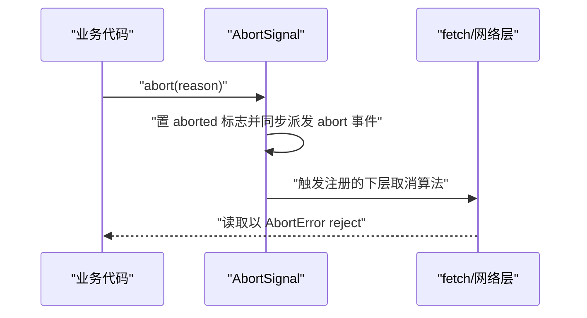
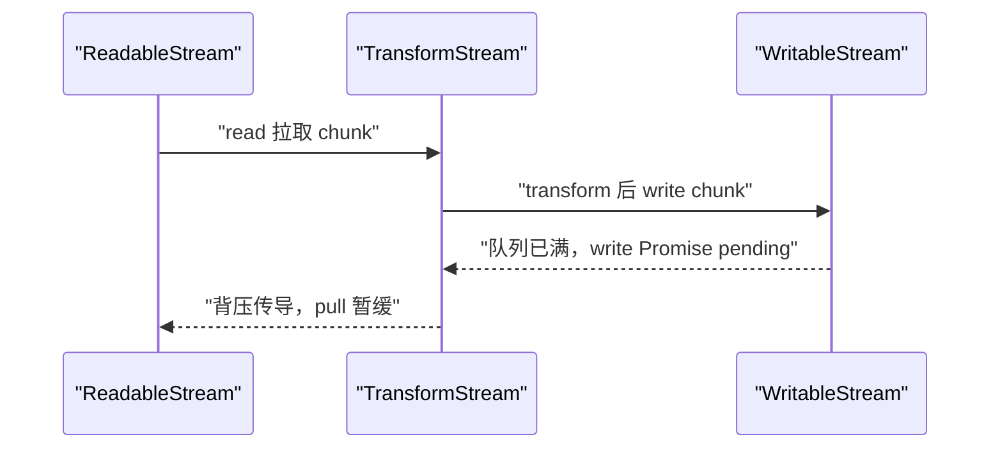

# 异步编程进阶：AbortController 与 Streams API

!!! abstract "核心结论"
- AbortController/AbortSignal 是平台级取消原语：`abort()` 同步置位标志并派发 `abort` 事件，reason 沿 `AbortSignal.any` 透传；而 Promise 本身不可取消，取消只能通过外层竞态与显式清理实现。
- 超时、重试、并发限制都是"包装 Promise"：给内层任务挂 abort 监听，在外层构造一次性 settle，并用 settled 标志防止竞态二次 settle。
- 手写 `Promise.race/any/allSettled` 的边界：`race([])` 永久 pending，`any([])` 以 `AggregateError` reject，`allSettled([])` 永远 resolve 为 `[]`。
- ReadableStream 是 pull 模型（`desiredSize = highWaterMark - queueTotalSize`，queue 空且需要数据时调用 `pull`），WritableStream 是背压模型（`write()` 返回的 Promise 在队列腾出空间前不 resolve），TransformStream 把两侧背压串成一条链。
- `fetch` 的 `response.body` 就是 ReadableStream：用 `getReader()` 加 `TextDecoder` 可增量解析 SSE/NDJSON，并把 AbortController 传进 fetch 从网络层真正中断连接。

## 1. 取消的底层模型：AbortController 与 AbortSignal

### 1.1 运行时与事件模型层面

`AbortSignal` 在规范上继承自 `EventTarget`，内部有一个 `[[Aborted]]` 布尔槽位和一个 `[[AbortReason]]`。调用 `AbortController.prototype.abort(reason)` 时，runtime 依次执行：

1. 把 `[[Aborted]]` 置为 `true`，并记录 reason（默认是 name 为 `AbortError` 的 `DOMException`）。
2. 同步派发一次 `abort` 事件，所有通过 `addEventListener('abort', ..., { once: true })` 注册的监听器在当次调用栈内同步执行。
3. 该信号是 one-shot 的：一旦 abort 无法重新武装（re-arm）。这就是为什么取消必须走"注册监听 → 触发 → 移除监听"的清理模式。

Promise 为什么不被设计成"可取消"：V8 的 Promise 是微任务队列（microtask queue）中的一次性状态机，settlement 不可逆；executor 同步执行且没有取消钩子。平台能做的，是在 `fetch`、Streams、`setTimeout` 的绑定层读取 `signal.aborted` 或订阅其 abort，再让底层资源真正停止并让等待中的 Promise 以 `AbortError` reject。



### 1.2 手写实现：可取消 sleep 与 AbortError 工厂

```js
// 运行环境：Node.js 18+ 或现代浏览器（需要全局 DOMException，Node 17+ 已内置）
function abortError() {
  return new DOMException('The operation was aborted', 'AbortError');
}

function cancellableSleep(ms, signal) {
  if (signal?.aborted) {
    return Promise.reject(abortError());
  }
  return new Promise((resolve, reject) => {
    const timer = setTimeout(() => {
      cleanup();
      resolve('slept');
    }, ms);

    const onAbort = () => {
      cleanup();
      reject(abortError());
    };

    function cleanup() {
      clearTimeout(timer);
      signal?.removeEventListener('abort', onAbort);
    }

    signal?.addEventListener('abort', onAbort, { once: true });
  });
}
```

验证标准（预期输出：`cancellableSleep 验证通过`）：

```js
const assert = require('node:assert');

(async () => {
  const t0 = Date.now();
  await cancellableSleep(50);
  assert.ok(Date.now() - t0 >= 45, '正常路径应至少等待约 50ms');

  const ac = new AbortController();
  const p = cancellableSleep(500, ac.signal);
  setTimeout(() => ac.abort(), 30);
  await assert.rejects(p, (e) => e.name === 'AbortError');

  const ac2 = new AbortController();
  ac2.abort();
  await assert.rejects(cancellableSleep(100, ac2.signal), (e) => e.name === 'AbortError');

  console.log('cancellableSleep 验证通过');
})();
```

### 1.3 AbortSignal.timeout 与 AbortSignal.any

`AbortSignal.timeout(ms)`（Node 17.3+；现代浏览器，具体版本以 MDN Baseline 为准）返回一个会在 `ms` 后自动 abort 的信号。`AbortSignal.any(signals)`（Node 20.3+；Chrome 116 起，其余浏览器版本需核对官方文档）返回一个组合信号，任一子信号 abort 即 abort，并透传首个子信号的 reason。

```js
// 运行环境：Node.js 20.3+（AbortSignal.any）/ Node 17.3+（AbortSignal.timeout）
const assert = require('node:assert');

(async () => {
  const timeoutSig = AbortSignal.timeout(60);
  await cancellableSleep(20, timeoutSig); // 20ms 内完成，不会 abort
  await assert.rejects(cancellableSleep(200, timeoutSig), (e) => e.name === 'AbortError');

  const ac1 = new AbortController();
  const ac2 = new AbortController();
  const merged = AbortSignal.any([ac1.signal, ac2.signal]);
  const p = cancellableSleep(1000, merged);
  setTimeout(() => ac2.abort(), 30);
  await assert.rejects(p, (e) => e.name === 'AbortError');

  console.log('AbortSignal.timeout/any 验证通过');
})();
```

对比表 1：三种取消信号

| 特性 | AbortController | AbortSignal.timeout(ms) | AbortSignal.any(signals) |
| --- | --- | --- | --- |
| 触发方式 | 手动调用 abort() | 到点自动触发 | 任一子信号 abort |
| reason 自定义 | 支持 abort(reason) | 固定 TimeoutError DOMException | 透传首个子信号的 reason |
| 是否可组合 | 否，单信号 | 否 | 是，组合多个信号 |
| 空输入行为 | 不适用 | 不适用 | any([]) 返回永不 abort 的信号 |
| Node 版本 | 15+ 稳定 | 17.3+ | 20.3+ |

## 2. 可取消的 Promise 模式与竞态防护

### 2.1 手写实现：abortable 包装器

核心是把"内层任务的结果"与"abort 事件"放入同一个外层 Promise，并用 `settled` 标志保证只 settle 一次，同时在另一条路径完成时移除监听，避免泄漏。

```js
// 运行环境：Node.js 18+ 或现代浏览器（沿用 1.2 的 abortError）
function abortable(promise, signal) {
  return new Promise((resolve, reject) => {
    if (signal?.aborted) {
      reject(abortError());
      return;
    }

    let settled = false;

    const cleanup = () => signal?.removeEventListener('abort', onAbort);

    const onAbort = () => {
      if (settled) return;
      settled = true;
      cleanup();
      reject(abortError());
    };

    signal.addEventListener('abort', onAbort, { once: true });

    promise.then(
      (value) => {
        if (settled) return;
        settled = true;
        cleanup();
        resolve(value);
      },
      (err) => {
        if (settled) return;
        settled = true;
        cleanup();
        reject(err);
      }
    );
  });
}
```

验证标准（预期输出：`abortable 验证通过`）：

```js
const assert = require('node:assert');

(async () => {
  const slow = new Promise((r) => setTimeout(() => r('done'), 500));
  const ac = new AbortController();
  const p = abortable(slow, ac.signal);
  setTimeout(() => ac.abort(), 30);
  await assert.rejects(p, (e) => e.name === 'AbortError');

  const fast = await abortable(Promise.resolve('ok'), new AbortController().signal);
  assert.strictEqual(fast, 'ok');

  console.log('abortable 验证通过');
})();
```

注意：abort 不取消内层 `slow` 任务本身，`slow` 仍在运行并最终 resolve。这是应用层取消的边界：我们只是不再关心它的结果。

### 2.2 手写实现：Promise.race

```js
// 运行环境：Node.js 18+ 或现代浏览器
function promiseRace(iterable) {
  return new Promise((resolve, reject) => {
    for (const item of iterable) {
      Promise.resolve(item).then(resolve, reject);
    }
  });
}
```

验证标准（预期输出：`promiseRace 验证通过`）：

```js
const assert = require('node:assert');

(async () => {
  const slow = new Promise((r) => setTimeout(() => r('slow'), 50));
  const fast = new Promise((r) => setTimeout(() => r('fast'), 10));
  const late = new Promise((r) => setTimeout(() => r('late'), 200));
  assert.strictEqual(await promiseRace([slow, fast, late]), 'fast');

  const willReject = new Promise((_, rej) => setTimeout(() => rej(new Error('boom')), 0));
  const never = new Promise(() => {});
  await assert.rejects(promiseRace([willReject, never]), /boom/);

  const empty = promiseRace([]);
  assert.ok(empty instanceof Promise); // promiseRace([]) 永久 pending，不能 await
  console.log('promiseRace 验证通过');
})();
```

### 2.3 手写实现：Promise.any

```js
// 运行环境：Node.js 18+ 或现代浏览器（需要全局 AggregateError，ES2021）
function promiseAny(iterable) {
  const items = Array.from(iterable);
  return new Promise((resolve, reject) => {
    if (items.length === 0) {
      reject(new AggregateError([], 'All promises were rejected'));
      return;
    }
    let pending = items.length;
    const errors = new Array(items.length);
    items.forEach((item, i) => {
      Promise.resolve(item).then(
        (value) => resolve(value),
        (err) => {
          errors[i] = err;
          pending -= 1;
          if (pending === 0) {
            reject(new AggregateError(errors, 'All promises were rejected'));
          }
        }
      );
    });
  });
}
```

验证标准（预期输出：`promiseAny 验证通过`）：

```js
const assert = require('node:assert');

(async () => {
  const winner = await promiseAny([
    Promise.reject(new Error('a')),
    Promise.reject(new Error('b')),
    new Promise((r) => setTimeout(() => r('c'), 20)),
  ]);
  assert.strictEqual(winner, 'c');

  await assert.rejects(
    promiseAny([Promise.reject(new Error('x')), Promise.reject(new Error('y'))]),
    (err) => err instanceof AggregateError && err.errors.length === 2
  );

  await assert.rejects(promiseAny([]), (err) => err instanceof AggregateError);
  console.log('promiseAny 验证通过');
})();
```

### 2.4 手写实现：Promise.allSettled

```js
// 运行环境：Node.js 18+ 或现代浏览器
function promiseAllSettled(iterable) {
  const items = Array.from(iterable);
  return new Promise((resolve) => {
    if (items.length === 0) {
      resolve([]);
      return;
    }
    const results = new Array(items.length);
    let done = 0;

    function tick() {
      done += 1;
      if (done === items.length) resolve(results);
    }

    items.forEach((item, i) => {
      Promise.resolve(item).then(
        (value) => {
          results[i] = { status: 'fulfilled', value };
          tick();
        },
        (reason) => {
          results[i] = { status: 'rejected', reason };
          tick();
        }
      );
    });
  });
}
```

验证标准（预期输出：`promiseAllSettled 验证通过`）：

```js
const assert = require('node:assert');

(async () => {
  const results = await promiseAllSettled([
    Promise.resolve(1),
    Promise.reject(new Error('x')),
    new Promise((r) => setTimeout(() => r(3), 10)),
  ]);

  assert.deepStrictEqual(results.map((t) => t.status), ['fulfilled', 'rejected', 'fulfilled']);
  assert.strictEqual(results[0].value, 1);
  assert.strictEqual(results[1].reason.message, 'x');
  assert.strictEqual(results[2].value, 3);
  assert.deepStrictEqual(await promiseAllSettled([]), []);
  console.log('promiseAllSettled 验证通过');
})();
```

## 3. Promise 并发控制：pool 限制、重试退避与超时

### 3.1 手写实现：并发限制器

队列 + 计数器：任务在 `active < limit` 时立即启动，否则入队；任务 settle 后从队头取出下一个。这样内存占用与同时执行的任务数都有界，不会像朴素 `Promise.all(taskList)` 那样瞬间全量发起。

```js
// 运行环境：Node.js 18+ 或现代浏览器
class ConcurrencyLimiter {
  constructor(limit) {
    if (!(limit >= 1)) throw new TypeError('limit must be >= 1');
    this.limit = limit;
    this.active = 0;
    this.queue = [];
  }

  run(fn) {
    return new Promise((resolve, reject) => {
      const task = () => {
        this.active += 1;
        Promise.resolve()
          .then(fn)
          .then(
            (value) => {
              this._release();
              resolve(value);
            },
            (err) => {
              this._release();
              reject(err);
            }
          );
      };

      if (this.active < this.limit) {
        task();
      } else {
        this.queue.push(task);
      }
    });
  }

  _release() {
    this.active -= 1;
    const next = this.queue.shift();
    if (next) next();
  }
}
```

验证标准（预期输出：`ConcurrencyLimiter 验证通过，峰值并发 = 2`）：

```js
const assert = require('node:assert');

(async () => {
  const limiter = new ConcurrencyLimiter(2);
  let running = 0;
  let peak = 0;

  const job = (id) => limiter.run(async () => {
    running += 1;
    peak = Math.max(peak, running);
    await new Promise((r) => setTimeout(r, 50));
    running -= 1;
    return id;
  });

  const results = await Promise.all([
    job(1), job(2), job(3), job(4), job(5),
  ]);

  assert.deepStrictEqual(results, [1, 2, 3, 4, 5]);
  assert.strictEqual(peak, 2);
  console.log('ConcurrencyLimiter 验证通过，峰值并发 =', peak);
})();
```

### 3.2 手写实现：指数退避重试与超时

```js
// 运行环境：Node.js 18+ 或现代浏览器（沿用 1.2 的 cancellableSleep/abortError）
async function retryWithBackoff(fn, { retries = 3, baseDelay = 100, factor = 2, jitter = 0.3, signal } = {}) {
  if (signal?.aborted) throw abortError();

  for (let attempt = 0; ; attempt++) {
    if (signal?.aborted) throw abortError();
    try {
      return await fn(attempt);
    } catch (err) {
      if (attempt >= retries) throw err;
      // delay = baseDelay * factor^attempt，再乘 [1-jitter, 1+jitter] 的随机抖动，避免惊群
      const delay = baseDelay * Math.pow(factor, attempt);
      const jittered = delay * (1 - jitter + Math.random() * 2 * jitter);
      await cancellableSleep(jittered, signal);
    }
  }
}

function withTimeout(promise, ms) {
  return new Promise((resolve, reject) => {
    const timer = setTimeout(() => {
      reject(Object.assign(new Error('Timeout after ' + ms + 'ms'), { name: 'TimeoutError' }));
    }, ms);
    promise.then(
      (value) => { clearTimeout(timer); resolve(value); },
      (err) => { clearTimeout(timer); reject(err); }
    );
  });
}
```

验证标准（预期输出：`retryWithBackoff 与 withTimeout 验证通过`）：

```js
const assert = require('node:assert');

(async () => {
  let calls = 0;
  const flaky = async () => {
    calls += 1;
    if (calls < 3) throw new Error('临时故障');
    return 'ok';
  };
  const result = await retryWithBackoff(flaky, { retries: 3, baseDelay: 10 });
  assert.strictEqual(result, 'ok');
  assert.strictEqual(calls, 3);

  let permanentCalls = 0;
  const alwaysFail = async () => { permanentCalls += 1; throw new Error('永久失败'); };
  await assert.rejects(retryWithBackoff(alwaysFail, { retries: 2, baseDelay: 10 }), /永久失败/);
  assert.strictEqual(permanentCalls, 3);

  const ac = new AbortController();
  const p = retryWithBackoff(async () => { throw new Error('x'); }, { retries: 5, baseDelay: 500, signal: ac.signal });
  setTimeout(() => ac.abort(), 25);
  await assert.rejects(p, (e) => e.name === 'AbortError');

  const done = await withTimeout(new Promise((r) => setTimeout(() => r('done'), 10)), 100);
  assert.strictEqual(done, 'done');
  await assert.rejects(withTimeout(new Promise(() => {}), 30), (e) => e.name === 'TimeoutError');

  console.log('retryWithBackoff 与 withTimeout 验证通过');
})();
```

### 3.3 竞态防护要点

`abortable` 中的 `settled` 标志就是竞态防护：保证外部 Promise 只被 settle 一次，且无论谁先完成都会清理监听器。Promise 本身虽是单次 settle 的，但如果你的包装器写成了 `setTimeout(() => reject(...))` 与 `promise.then(resolve, reject)` 两个入口竞争同一对函数，仍可能因重复执行清理函数而踩坑，因此显式 `settled` 是最稳妥的模式。

## 4. Streams API 底层：队列、背压与 pull/push 模型

### 4.1 队列与背压算法

ReadableStream 内部维护 chunk 队列与 `queueTotalSize`。排队策略的默认 `size()` 返回 1，因此 `desiredSize = highWaterMark - queueTotalSize`（普通流默认 `highWaterMark = 1`）。当队列空且消费者要求数据时，controller 调用底层 source 的 `pull`；这是一个拉取模型：消费端不读，队列就能达到 highWaterMark，随后不再触发 pull。

对于 push 型 source（如 `setInterval` 持续 `enqueue`），若不检查 `controller.desiredSize`，数据会无限积压——Runtime 不会因为超过 highWaterMark 就自动丢弃或报错，背压必须由 source 自行遵守。

WritableStream 相反：`sink.write(chunk)` 返回 Promise；`writer.write(value)` 先把 chunk 入队，当 `desiredSize <= 0`（队列已满）时返回的 Promise 保持 pending，直到 sink 处理完前面的 chunk、队列腾出空间才 resolve。`writer.ready` 则是一个在 `desiredSize > 0` 时才 resolve 的背压信号。

TransformStream 是"可读端 + 可写端"的桥：transform 中 `controller.enqueue` 写入可读端队列；可读端队列满会反馈到可写端，让上游 `write()` 暂停。这叫背压传导。



对比表 2：三类 Stream 对象

| 对象 | 角色 | 背压机制 | 关键 API |
| --- | --- | --- | --- |
| ReadableStream | 数据源 | pull 模型，`desiredSize <= 0` 时停止 pull | getReader/read/cancel |
| WritableStream | 数据汇 | 队列满时 `write()` Promise 不 resolve | getWriter/write/close/abort |
| TransformStream | 处理器 | 可读端与可写端背压双向传导 | transform/flush/pipeThrough |

### 4.2 手写实现：pull 型 ReadableStream 源

```js
// 运行环境：Node.js 18+ 或现代浏览器
function fromIterable(iterable) {
  const iterator = iterable[Symbol.iterator]();
  return new ReadableStream({
    pull(controller) {
      // 每次队列有空间才会被调用；这里同步取一个元素即可
      const { value, done } = iterator.next();
      if (done) {
        controller.close();
      } else {
        controller.enqueue(value);
      }
    },
  });
}
```

验证标准（预期输出：`fromIterable 验证通过`）：

```js
const assert = require('node:assert');

(async () => {
  const stream = fromIterable(['a', 'b', 'c', 'd', 'e']);
  const reader = stream.getReader();
  const out = [];
  while (true) {
    const { done, value } = await reader.read();
    if (done) break;
    out.push(value);
  }
  assert.deepStrictEqual(out, ['a', 'b', 'c', 'd', 'e']);
  console.log('fromIterable 验证通过');
})();
```

### 4.3 手写实现：带背压的 pipe

`writer.ready` 是显式背压检查点，`writer.write(value)` 自身也会在 sink 完成后才 resolve。二者结合保证慢速 consumer 不会被无限喂数据。

```js
// 运行环境：Node.js 18+ 或现代浏览器（沿用 1.2 的 abortError）
async function pipeBackpressure(readable, writable, signal) {
  const reader = readable.getReader();
  const writer = writable.getWriter();

  if (signal?.aborted) {
    reader.releaseLock();
    writer.releaseLock();
    throw abortError();
  }

  const onAbort = () => {
    reader.cancel(abortError()).catch(() => {});
  };
  signal?.addEventListener('abort', onAbort, { once: true });

  try {
    while (true) {
      const { done, value } = await reader.read();
      if (done) break;
      await writer.ready;        // 队列满时暂停
      await writer.write(value); // sink 处理完才继续
    }
    await writer.close();
  } catch (err) {
    await writer.abort(err).catch(() => {});
    throw err;
  } finally {
    signal?.removeEventListener('abort', onAbort);
    writer.releaseLock();
  }
}
```

验证标准（预期输出：`pipeBackpressure 验证通过，按背压顺序消费 5 个 chunk`）：

```js
const assert = require('node:assert');

(async () => {
  const readable = new ReadableStream({
    start(controller) {
      for (const c of ['a', 'b', 'c', 'd', 'e']) {
        controller.enqueue(c);
      }
      controller.close();
    },
  });

  const order = [];
  const writable = new WritableStream({
    async write(chunk) {
      order.push(chunk);
      await new Promise((r) => setTimeout(r, 20)); // 慢 consumer
    },
  }, { highWaterMark: 1 });

  await pipeBackpressure(readable, writable);
  assert.deepStrictEqual(order, ['a', 'b', 'c', 'd', 'e']);
  console.log('pipeBackpressure 验证通过，按背压顺序消费', order.length, '个 chunk');
})();
```

## 5. TransformStream 管道与流式解析

### 5.1 手写实现：按行拆分 TransformStream

```js
// 运行环境：Node.js 18+ 或现代浏览器
function createLineSplitter() {
  let buffer = '';
  return new TransformStream({
    transform(chunk, controller) {
      buffer += chunk;
      let idx;
      while ((idx = buffer.indexOf('\n')) !== -1) {
        const line = buffer.slice(0, idx);
        buffer = buffer.slice(idx + 1);
        if (line !== '') controller.enqueue(line);
      }
    },
    flush(controller) {
      // 流结束时不要丢掉缓冲区里最后一行
      if (buffer !== '') controller.enqueue(buffer);
    },
  });
}
```

验证标准（预期输出：`createLineSplitter 验证通过，解析行 = ["hello","world","bar"]`）：

```js
const assert = require('node:assert');

(async () => {
  const readable = new ReadableStream({
    start(controller) {
      controller.enqueue('hello\nwo');
      controller.enqueue('rld\n');
      controller.enqueue('\nbar');
      controller.close();
    },
  });

  const lines = [];
  const writable = new WritableStream({
    write(chunk) { lines.push(chunk); },
  });

  await readable.pipeThrough(createLineSplitter()).pipeTo(writable);
  assert.deepStrictEqual(lines, ['hello', 'world', 'bar']);
  console.log('createLineSplitter 验证通过，解析行 =', JSON.stringify(lines));
})();
```

### 5.2 手写实现：NDJSON 解析 TransformStream

NDJSON 是每行一个 JSON 的分隔流格式，适合与 LLM/日志流式接口配合。解析器在 TransformStream 中处理跨 chunk 的断行问题。

```js
// 运行环境：Node.js 18+ 或现代浏览器
function createNdjsonParser() {
  let buffer = '';
  return new TransformStream({
    transform(chunk, controller) {
      buffer += chunk;
      let idx;
      while ((idx = buffer.indexOf('\n')) !== -1) {
        const line = buffer.slice(0, idx).trim();
        buffer = buffer.slice(idx + 1);
        if (line !== '') {
          try {
            controller.enqueue(JSON.parse(line));
          } catch (err) {
            controller.error(new SyntaxError('Invalid NDJSON line: ' + line));
            return;
          }
        }
      }
    },
    flush(controller) {
      const line = buffer.trim();
      if (line !== '') controller.enqueue(JSON.parse(line));
    },
  });
}
```

验证标准（预期输出：`createNdjsonParser 验证通过`）：

```js
const assert = require('node:assert');

(async () => {
  const readable = new ReadableStream({
    start(controller) {
      controller.enqueue('{"id":1}\n{"id":2');
      controller.enqueue('}\n\n{"id":3}\n');
      controller.close();
    },
  });

  const parsed = [];
  await readable
    .pipeThrough(createNdjsonParser())
    .pipeTo(new WritableStream({ write(chunk) { parsed.push(chunk); } }));

  assert.deepStrictEqual(parsed, [{ id: 1 }, { id: 2 }, { id: 3 }]);
  console.log('createNdjsonParser 验证通过');
})();
```

### 5.3 fetch 流式响应、读取取消

`fetch` 传入 `signal` 后，abort 会从网络层中断连接并使 `reader.read()` 以 `AbortError` reject。以下函数把 fetch 抽成可注入的 `fetchImpl`，便于无网络地测试其流式语义。

```js
// 运行环境：Node.js 18+（全局 TextEncoder/TextDecoder/ReadableStream/fetch）
async function fetchStreamWithCancel(url, { signal, onChunk, fetchImpl = fetch } = {}) {
  const response = await fetchImpl(url, { signal });
  if (!response.ok || !response.body) {
    throw new Error('HTTP ' + response.status);
  }

  const reader = response.body.getReader();
  const decoder = new TextDecoder();
  try {
    while (true) {
      const { done, value } = await reader.read();
      if (done) break;
      // 关键：stream: true 保留跨 chunk 的多字节 UTF-8 状态
      onChunk(decoder.decode(value, { stream: true }));
    }
  } finally {
    reader.releaseLock();
  }
}
```

验证标准：流式读取（预期输出：`fetchStreamWithCancel 流式读取验证通过`）：

```js
const assert = require('node:assert');

(async () => {
  const chunks = [];
  const fakeFetch = async (url, { signal }) => ({
    ok: true,
    status: 200,
    body: new ReadableStream({
      start(controller) {
        controller.enqueue(new TextEncoder().encode('{"n":1}\n'));
        controller.enqueue(new TextEncoder().encode('{"n":2}\n'));
        controller.close();
      },
    }),
  });

  await fetchStreamWithCancel('https://example.invalid/stream', {
    fetchImpl: fakeFetch,
    onChunk: (text) => chunks.push(text),
  });

  assert.strictEqual(chunks.join(''), '{"n":1}\n{"n":2}\n');
  console.log('fetchStreamWithCancel 流式读取验证通过');
})();
```

验证标准：取消语义（预期输出：`流式读取取消验证通过`）：

```js
const assert = require('node:assert');

(async () => {
  const ac = new AbortController();
  let controllerRef;

  const stream = new ReadableStream({
    start(controller) { controllerRef = controller; },
  });

  // 模拟底层网络监听 abort 后 error 掉流；真实 fetch 由网络层完成这一动作
  ac.signal.addEventListener('abort', () => controllerRef.error(abortError()), { once: true });

  const reader = stream.getReader();
  const pending = reader.read(); // 没有数据，read 挂起
  ac.abort();
  await assert.rejects(pending, (e) => e.name === 'AbortError');
  console.log('流式读取取消验证通过');
})();
```

### 5.4 SSE 增量解析

SSE 事件以空行（`\n\n`）分隔；不能只用 `response.text()`，因为那会等整个响应结束，失去"流式"的意义。手写解析器按 `\n\n` 切块并解析 `data:`、`event:`、`id:` 字段。

```js
// 运行环境：Node.js 18+ 或现代浏览器
function parseSseEvent(rawBlock) {
  const event = { data: [] };
  for (const line of rawBlock.split('\n')) {
    if (line.startsWith('data:')) {
      event.data.push(line.slice(5).replace(/^ /, ''));
    } else if (line.startsWith('event:')) {
      event.event = line.slice(6).trim();
    } else if (line.startsWith('id:')) {
      event.id = line.slice(3).trim();
    }
  }
  if (event.data.length === 0) return null;
  event.data = event.data.join('\n');
  return event;
}

async function readSseStream(response, onEvent) {
  const reader = response.body.getReader();
  const decoder = new TextDecoder();
  let buffer = '';

  while (true) {
    const { done, value } = await reader.read();
    if (done) break;
    buffer += decoder.decode(value, { stream: true });

    let idx;
    while ((idx = buffer.indexOf('\n\n')) !== -1) {
      const raw = buffer.slice(0, idx);
      buffer = buffer.slice(idx + 2);
      const event = parseSseEvent(raw);
      if (event) onEvent(event);
    }
  }
}
```

验证标准（预期输出：`readSseStream 验证通过`）：

```js
const assert = require('node:assert');

(async () => {
  const events = [];
  const fakeBody = new ReadableStream({
    start(controller) {
      controller.enqueue(new TextEncoder().encode('event: a\ndata: 1\n\n'));
      controller.enqueue(new TextEncoder().encode('event: b\ndata: 2\n\n'));
      controller.close();
    },
  });

  await readSseStream({ body: fakeBody }, (e) => events.push(e));

  assert.strictEqual(events.length, 2);
  assert.strictEqual(events[0].event, 'a');
  assert.strictEqual(events[1].data, '2');
  console.log('readSseStream 验证通过');
})();
```

对比表 3：SSE 三种消费方式

| 方式 | 是否流式 | 自定义 header | 自动重连 | 适用场景 |
| --- | --- | --- | --- | --- |
| EventSource | 是 | 否 | 是，内建 | 简单事件推送 |
| fetch + getReader | 是 | 是 | 否，需手写 | 需要鉴权 header、POST、取消 |
| response.text() | 否，等全量 | 是 | 否 | 一次性快照，不适合长连接 |

## 6. 常见陷阱

1. 取消不等于停止工作：`abortable` 只是让外层 Promise reject，内层任务（如未传 signal 的 fetch）仍在消耗连接与内存。因此凡是底层 API 支持 signal，一定要把 signal 传到底层。
2. `Promise.race([])` 永久 pending、`Promise.any([])` 立即以 `AggregateError([])` reject：面试常考边界，手写时不要自作主张在空输入上 resolve。
3. `AbortSignal.timeout(ms)` 的计时从 signal 创建时开始：若一个 timeout signal 被两个串行请求复用，第二个请求的有效时间会被第一个消耗掉。需要按请求各自创建或每次 abort 后重建。
4. 丢 flush 尾包：TransformStream 写完后如果不在 `flush` 里输出缓冲残段，最后一行会被吞掉；NDJSON 少了流末尾不带 `\n` 的最后一条是典型事故。
5. `TextDecoder.decode` 不传 `{ stream: true }`：多字节 UTF-8 字符（如中文）被 chunk 边界切开时会输出乱码。流式解码必须持续保持 decoder 状态。
6. push 型 ReadableStream 无视 `desiredSize` 持续 enqueue：Runtime 不会因超过 highWaterMark 自动丢弃，内存会无限增长；正确做法是 `desiredSize <= 0` 时暂停推送，等 `pull` 或读空后再恢复。
7. `writer.write()` 不等背压连发：虽然单个 writer 的写入有顺序保证，但若不 await write，上层无法感知 sink 抛错或阻塞，错误会延迟到后续写操作才暴露。
8. 竞态清理遗漏：在 `abortable` 这类包装器里，如果内层先 resolve 而忘记 `removeEventListener`，abort 监听器会长期引用闭包导致内存泄漏；`{ once: true }` 只覆盖"abort 先发生"的分支，成功分支仍需手动清理。

## 7. 面试题与答题要点

题目 1：`AbortController.abort()` 是异步的吗？reason 如何传播？

要点：不是异步的。`abort()` 同步把 `[[Aborted]]` 置 true、记录 reason、并同步派发 `abort` 事件，监听器在当前调用栈内执行。`AbortSignal.any` 透传首个 abort 子信号的 reason；`abort(reason)` 允许自定义 reason（如错误上下文），`fetch` 和 stream read 最终以该 reason 或 name 为 `AbortError` 的错误 reject。

题目 2：为什么 Promise 本身不能取消？应用层如何实现可取消？

要点：Promise 规范没有取消钩子，executor 同步执行且 settlement 不可逆；runtime 的微任务队列只负责调度回调，不保存"取消点"。应用层只能：包装一个外层 Promise，监听 signal 的 abort 事件提前 reject；真正的资源释放依赖底层 API（fetch/stream）接受 signal。要强调"取消的外层结果"与"底层工作是否停止"是两件事。

题目 3：手写 `Promise.race/any/allSettled` 时分别要注意什么？

要点：`race` 空输入永久 pending，先 settle 者胜（含先 reject）；`any` 空输入直接 `AggregateError([])`，收集所有错误后以 `AggregateError(errors)` reject；`allSettled` 永不 reject，保持输入顺序，结果与输入下标对齐，空输入 `resolve([])`。手写核心是用 `Promise.resolve(item).then(...)` 统一 thenable，并保证结果顺序。

题目 4：并发限制器的工作原理？如何避免饿死与内存爆炸？

要点：固定数量 worker 槽位 + FIFO 队列。`active < limit` 才启动，否则入队；每个任务 settle 后在 `finally`/回调中释放槽位并从队头取下一个。FIFO 保证公平；限制同时运行数保证内存与连接数有界。进阶点：`Promise.all` 全量并发会造成对后端瞬时压力，pool 是最小改动的修复。

题目 5：什么是背压？三种 Stream 分别怎么实现背压？

要点：背压是"下游消费速度慢时让上游减速"的流控。ReadableStream 用 `desiredSize = highWaterMark - queueTotalSize` 控制 `pull` 触发；WritableStream 队列满时 `write()` 返回的 Promise 和 `writer.ready` 不再 resolve；TransformStream 有两侧队列，可读端背压会传导到可写端，让上游 `write()` 暂停。要能写出 `await writer.ready; await writer.write(chunk)` 的手动管道。

题目 6：如何流式读取 fetch 响应并增量解析 NDJSON/SSE？

要点：不调用 `response.text()`；用 `response.body.getReader()` 逐块 `read()`，`TextDecoder.decode(value, { stream: true })` 防止 UTF-8 跨 chunk 乱码；NDJSON 按 `\n` 切行逐行 `JSON.parse`，SSE 按 `\n\n` 切事件再解析 `data:`、`event:`、`id:`；`TransformStream` 适合抽出可复用的解析管道；`flush` 必须输出无换行的尾包。

题目 7：`AbortSignal.timeout` 与 `AbortSignal.any` 有什么陷阱？

要点：timeout 从创建开始计时，复用会扣减第二个请求的预算；timeout 的 reason 是 name 为 `TimeoutError` 的 DOMException，业务通常要翻译成用户友好文案；`any` 组合信号后无法单独重新武装，需要重新创建子 controller；还需要把 signal 真正传到 fetch/stream 等下游，否则只 abort 外层是空转。

题目 8：用 `Promise.race` 做超时有什么问题？更好的做法是什么？

要点：race 无法停止慢的那条分支，慢请求仍然占用连接；race 本身会挂处理器所以通常不会产生 unhandled rejection，但手写的"定时器 + 直接 reject"方案可能漏挂内层处理器造成 unhandled rejection；更好做法是 `AbortSignal.timeout` 或 `AbortController` + `setTimeout` 把 signal 传进 fetch，让网络层真正中断；需要保留重试能力时用带退避与 jitter 的 `retryWithBackoff`。

本篇从取消原语、Promise 包装模式，到 Streams 的背压与流式解析，覆盖了异步进阶面试中的主干链路。把 `cancellableSleep`、`abortable`、`ConcurrencyLimiter`、`promiseAny`、`pipeBackpressure` 与 NDJSON 管道作为一组可运行代码反复演练，就能同时应对手写题与原理追问。

## 深入阅读与参考

!!! tip "怎么用这些资料"
    先读「官方文档与规范」建立准确的概念，再读「源码与示例」核对细节，最后用「教程、书籍与视频」换一种讲法加深理解。每条都写明了读哪一节、带着什么问题读。

### 官方文档与规范

| 资源 | 为什么读 | 怎么读 |
|---|---|---|
| [MDN Fetch API](https://developer.mozilla.org/en-US/docs/Web/API/Fetch_API) | AbortController 取消 fetch 的权威示例，含 signal 与状态处理。 | 读 AbortController 与 fetch 信号一节，动手写一次取消并观察 reject 时机。 |
| [MDN Streams API](https://developer.mozilla.org/en-US/docs/Web/API/Streams_API) | 总览 Readable/Writable/Transform 与背压，快速建立全貌。 | 先读概念图与接口列表，再跑分块读取示例，记录 highWaterMark 的变化。 |
| [Streams API concepts](https://developer.mozilla.org/en-US/docs/Web/API/Streams_API/Concepts) | 解释队列、背压与 pull/push 内部模型，直击底层实现。 | 重点读背压与队列小节，边读边画出 controller 与内部队列的交互图。 |
| [Streams 标准](https://streams.spec.whatwg.org/) | 规范原文，背压与 highWaterMark 的定义最准确权威。 | 检索 backpressure 与 highWaterMark 的算法定义，对照 MDN 说法验证差异。 |
| [MDN 使用 Promise](https://developer.mozilla.org/en-US/docs/Web/JavaScript/Guide/Using_promises) | 链式调用与错误处理是取消、超时包装的基础。 | 读链式与错误处理两节，手写一个可取消 Promise 包装并测试竞态。 |
| [Transferable objects](https://developer.mozilla.org/en-US/docs/Web/API/Web_Workers_API/Transferable_objects) | ReadableStream 可转移，理解跨线程传递流的前提。 | 读可转移对象列表与 postMessage 示例，想清楚转移后原流为何失效。 |

### 源码与示例

| 资源 | 为什么读 | 怎么读 |
|---|---|---|
| [Using readable streams](https://developer.mozilla.org/en-US/docs/Web/API/Streams_API/Using_readable_streams) | 带完整代码的可读流指南，可以边跑边改。 | 跟做分块读取与 reader 释放，重点看 cancel 与 releaseLock 的调用。 |
| [Using writable streams](https://developer.mozilla.org/en-US/docs/Web/API/Streams_API/Using_writable_streams) | 写端示例，理解 writer 与背压信号如何互相反馈。 | 跟着写队列写入示例，观察 desiredSize 与 ready 的配合时机。 |
| [Using readable byte streams](https://developer.mozilla.org/en-US/docs/Web/API/Streams_API/Using_readable_byte_streams) | 字节流与 BYOB 读法，二进制场景更省内存。 | 读 BYOB reader 示例，对比默认 reader 的复制开销与适用场景。 |
| [Using WebSocketStream to write a client](https://developer.mozilla.org/en-US/docs/Web/API/WebSockets_API/Using_WebSocketStream) | 以流处理消息的实例，展示读写自带的背压。 | 读客户端示例，看流读写如何替代 onmessage 回调与手动缓冲。 |

### 教程、书籍与视频

| 资源 | 为什么读 | 怎么读 |
|---|---|---|
| [现代 JavaScript 教程：异步](https://zh.javascript.info/async) | 系统串联回调、Promise、async/await，补齐并发基础。 | 做完 Promise 并发与错误处理练习，再回来实现 pool 与重试退避。 |

## 应用与行业实践

### 应用场景地图

| 场景 | 用到本页哪个知识点 | 典型技术选型 | 注意事项 |
| --- | --- | --- | --- |
| 搜索框实时联想 | AbortController 取消旧请求 + 竞态防护 | fetch + AbortController + 防抖 | 只取消旧请求，不要取消新请求；后端未必因 abort 而停止执行 |
| AI 对话流式输出 | ReadableStream 增量读取 + TextDecoder 解码 | fetch + getReader + SSE/NDJSON | 用 `AbortSignal.any` 合并超时信号和用户停止信号 |
| 后台管理万行表格 | Promise 并发池 + AbortController 批量取消 | 自定义并发池 + `Promise.allSettled` | 切换筛选条件时先 abort 再发新请求；分批渲染 DOM |
| 低端安卓首屏加载 | Streams API 流式解析 | fetch + getReader + 增量渲染 | 控制每块的解码与渲染耗时，避免主线程长时间阻塞 |
| 多人协作白板 | WritableStream 背压模型 | WebSocket + 自定义 writable | 网络变慢时丢弃非关键指针帧，保留文本和形状操作 |
| 大文件上传 | WritableStream 背压 + `pipeTo` | `ReadableStream.pipeTo` + fetch body | 用背压限制内存占用，不要一次性把文件读进内存 |
| 测试套件超时控制 | 包装 Promise + `AbortSignal.timeout` | `AbortSignal.timeout()` + 清理监听 | 超时后要清理定时器和 abort 事件监听，防止泄漏 |
| 视频直播弹幕 | TransformStream 背压 + 降级策略 | TransformStream 限流过滤器 | 高频弹幕的丢弃规则要写成显式阈值，不要随机丢弃 |

### 三个场景拆解

#### 场景 1：搜索框实时联想

**业务背景**：用户在输入框每敲一个字触发一次请求，响应时间在 80ms 到 600ms 之间波动。可用 Chrome DevTools 的 Network 面板把网络调成 Slow 3G 复现同一个波动范围。慢的旧响应可能覆盖快的新响应，搜索结果和输入内容对不上。

**怎么用本页知识解决**：核心思路是每次新请求发起前，先对上一个请求的 controller 调用 `abort()`，让 fetch 在网络层中断旧连接。旧响应即使已经返回，也会因为 signal 已置位而不进入渲染分支。给 fetch 传入 signal 才能真正断开网络连接，而不是只在页面里忽略旧数据。

```js
let currentController = null; // 记录当前在途请求的控制器

async function search(keyword) {
  currentController?.abort(); // 新请求前取消旧请求
  const controller = new AbortController(); // 为新请求新建控制器
  currentController = controller;
  try {
    const res = await fetch('/api/search?q=' + keyword, {
      signal: controller.signal, // 传给 fetch，abort 时网络层断开
    });
    const data = await res.json();
    if (controller.signal.aborted) return; // 已取消的请求丢弃结果
    renderList(data);
  } catch (e) {
    if (e.name === 'AbortError') return; // 主动取消产生的错误不展示
    showError(e);
  }
}
```

- 每次搜索前先 `abort()` 旧 controller，再从网络层中断旧连接，后端也会收到连接断开。
- `currentController?.abort()` 里的可选链保证首次搜索时不会报错。
- signal 传给 fetch 是关键，只用一个布尔变量标记“请求过期”无法断开底层连接。
- 捕获 `AbortError` 后直接 return，避免把用户主动取消当成失败弹窗。
- 渲染前检查 `controller.signal.aborted`，兜底防止已经队列中的结果被错误展示。

**怎么度量收益**：在 Chrome DevTools Network 面板里连续输入 10 个字符，统计 canceled 请求数，canceled 请求应等于 9 个旧请求。再用 Performance 面板录制最后一次输入到列表渲染的时间，对比没有 abort 的基线版本，看渲染错误结果的次数是否为 0。

**什么时候不该用**：请求频率很低（如每 10 秒才一次）时，维护 controller 引用带来的代码复杂度大于收益。后端如果对 abort 无感、每次 abort 后仍完整执行并写库，这个方案只省前端资源不省后端资源，需要先做后端中断改造。

#### 场景 2：AI 对话流式输出

**业务背景**：对话接口一次返回完整回答需 5 到 15 秒，这个时长可在 DevTools Network 面板的 Timing 里测量。用户等待全文期间看到空白页面，并且点击停止按钮后网络连接仍然活跃，浪费服务端资源。

**怎么用本页知识解决**：核心思路是把 `fetch` 的 `response.body` 当作 ReadableStream，用 `getReader()` 逐块读取字节，再用 TextDecoder 增量解码为文本。每收到一块就立即渲染，不等全文。用户点击停止时调用同一个 controller 的 `abort()` 从网络层中断。

```js
const controller = new AbortController(); // 停止按钮触发 controller.abort()

async function streamChat(prompt) {
  const res = await fetch('/api/chat', {
    method: 'POST',
    body: JSON.stringify({ prompt }),
    signal: controller.signal, // 停止时网络层中断
  });
  const reader = res.body.getReader(); // 得到 ReadableStream 的 reader
  const decoder = new TextDecoder('utf-8'); // 增量解码器，处理多字节字符
  let fullText = '';
  while (true) {
    const { value, done } = await reader.read(); // 逐块读取，背压自动传导
    if (done) break;
    fullText += decoder.decode(value, { stream: true }); // stream:true 不截断字符
    renderText(fullText); // 每块到达就刷新界面
  }
}
```

- `getReader()` 返回的 reader 按块拉取数据，块大小由网络层决定，代码不手动拆分。
- TextDecoder 的 `stream: true` 选项保证 UTF-8 多字节字符被拆在相邻两块时不会乱码。
- 每次 `reader.read()` 返回后只处理当前块，背压会自动传导到上游，不会无界积压。
- 停止按钮复用同一个 controller，abort 后 `reader.read()` 会以 `AbortError` reject。
- 这套代码不依赖具体流式协议，SSE 和 NDJSON 都可以用同样的循环骨架。

**怎么度量收益**：用 Performance API 记录“请求发出到首字渲染”的时间，第一次字母应明显小于完整回答时间。再用 DevTools Network 面板确认停止按钮点击后请求立即显示 canceled，并在服务端日志里核对连接已断开而非继续生成完整回答。

**什么时候不该用**：响应体小于 1KB 时，流式解析引入的增量解码和渲染逻辑不如一次性 `res.json()` 简单。如果产品要求拿到全文做合规校验或格式完整性检查后再展示，流式渲染会让校验逻辑复杂化。

#### 场景 3：后台管理万行表格

**业务背景**：表格一次展示 10000 行数据，接口分页返回，每页 500 行，共 20 个请求。构造这个数据量不需要真实后端，用 mock 接口加 100ms 延迟即可。如果 20 个请求同时发出，浏览器连接数被打满，主线程处理 10000 行 DOM 渲染也会出现明显卡顿。

**怎么用本页知识解决**：核心思路是用并发池把同时请求数限制为 4。用户切换筛选条件时，用一个总 controller 对 20 个在途请求统一 abort。结果返回后不一次性渲染 10000 行，而是每次收到一页就追加渲染该页的 500 行。

```js
let pageAbortController = null; // 总控制器，统一取消所有分页请求

async function loadTableData(filter, onRows) {
  pageAbortController?.abort(); // 切换筛选时取消所有在途请求
  pageAbortController = new AbortController(); // 新建总控制器
  const pool = new Set(); // 在途请求集合，容量上限为 4
  const totalPages = 20;

  for (let page = 1; page <= totalPages; page++) {
    const p = fetchPage(page, filter, pageAbortController.signal)
      .then(rows => onRows(page, rows)) // 收到一页渲染一页
      .catch(e => {
        if (e.name !== 'AbortError') throw e; // 取消错误不冒泡
      })
      .finally(() => pool.delete(p)); // 请求完成后移出在途集合
    pool.add(p);
    if (pool.size >= 4) await Promise.race([...pool]); // 满了等一个完成
  }
  await Promise.all([...pool]); // 等剩余请求全部结束
}
```

- 并发池用 `Set` 保存 4 个在途 Promise，`pool.size >= 4` 时用 `Promise.race` 等待一个完成。
- 每个分页请求都挂到同一个总 signal 上，切筛选条件时一次 abort 清空所有在途连接。
- `catch` 里吞掉 `AbortError`，其他错误继续抛出，避免把取消当成失败。
- `finally` 里把请求移出 pool，保证 pool 大小准确，不会因为 reject 而泄漏引用。
- `onRows` 每次只处理 500 行，把 DOM 渲染压力打散到 20 个微批次。

**怎么度量收益**：用 DevTools Performance 面板录制切换筛选条件后的 3 秒，主线程长任务（超过 50ms）应减少到 0 次。再用 Network 面板确认切换时所有 canceled 请求的时间戳都在新请求发出之前，说明没有旧请求残留。

**什么时候不该用**：总数据量小于 200 行时，一次性加载和一次渲染更简单，分页加并发池属于额外复杂度。如果表格本身不提供分页接口，只有单次大响应，并发池用不上，应改用流式解析配合虚拟列表。

### 行业先进实践

**AbortSignal.timeout()（出处：WHATWG DOM Standard / MDN 文档）**  
一行 `AbortSignal.timeout(5000)` 生成 5 秒后自动 abort 的信号，可以直接传给 fetch 或 addEventListener。它省去手写 setTimeout、clearTimeout 和事件监听清理三个步骤。你的项目可以在请求封装层默认挂上统一超时信号，阈值抽成配置而不是硬编码。

**AbortSignal.any()（出处：WHATWG DOM Standard / MDN 文档）**  
把多个信号合并成一个，任意一个父信号 abort，合并信号自动 abort。典型用法是同时监听“用户点击停止”和“超时到期”两个路。你的项目可以用它替代两个重复的 addEventListener 监听，减少清理逻辑出错的机会。

**Node.js Stream 背压机制（出处：Node.js 官方文档 Stream 章节）**  
Node.js 可写流在 `write()` 返回 `false` 时要求暂停写入，等待 `drain` 事件后再继续。这个语义和 Web Streams 的 `write()` 返回 Promise 相同。你的项目如果同时运行在 Node 端和浏览器端，应当保持同样的背压判断，不要用 while 循环不检查返回值地批量写入。

**React 18 流式渲染（出处：React 官方技术博客）**  
React 18 使用 Streams API 把组件树分块输出到客户端，Suspense 的 fallback 先到，数据就绪的部分后到。核心是把渲染从“全量完成后输出”改为“按块输出”。你的项目如果做服务端渲染，可以把慢查询组件与静态外壳拆开，让静态部分先显示。

**Chrome DevTools 网络面板的请求取消标记（出处：Chrome DevTools 官方文档）**  
DevTools 在 Network 面板把被 abort 的请求标成 canceled，并保留发起时间和取消时间两个时间戳。这个标记可以验证 AbortController 是否真正命中网络层，而不是只在前端忽略了结果。你的项目做取消功能验收时，应把“Network 面板显示 canceled”列为必查项。

### 从学到用：落地路线

第 1 步：在项目里选一个搜索或联想类功能试点，接入 AbortController 取消旧请求。  
验收标准：Network 面板中旧请求全部显示 canceled，连续快速输入时最终展示结果与输入内容一一对应。

第 2 步：用 `AbortSignal.timeout()` 和 `AbortSignal.any()` 替换现有的手写 setTimeout 超时逻辑。  
验收标准：所有网络请求有统一超时配置，超时错误类型是 `TimeoutError`，且没有定时器泄漏。

第 3 步：把上传类或对话类功能换成 Streams API，验证背压和增量渲染。  
验收标准：流式解析生效，内存占用不再随文件大小或响应总长度线性增长，峰值内存保持稳定。

第 4 步：把取消规范写进团队协作文档和 Code Review 清单。  
验收标准：新代码中所有 fetch 都携带 signal，所有长任务都有取消路径，Review 清单包含“是否遗漏 abort 清理”这一项。

### 动手作业

**项目目标**：做一个实时日志查看器，从服务端 SSE 接口持续接收日志行，支持按关键字过滤、边滚动边加载、停止加载。

**步骤**：

1. 写一个本地 Node.js 服务，每个 50ms 输出一行 JSON 日志，持续输出 10 分钟。
2. 前端用 fetch 请求该 SSE 接口，传入一个 AbortController 的 signal。
3. 用 `response.body.getReader()` 逐块读取字节流。
4. 用 TextDecoder 增量解码，按换行符拆分成单条日志。
5. 日志行经过一个 TransformStream，按用户输入的关键字过滤。
6. 每收到一条日志就追加到页面；当缓冲超过 200 条时用 `requestAnimationFrame` 批量渲染。
7. 提供停止按钮，点击后调用 `controller.abort()` 并显示“已停止”。

**验收标准**：

- 点击停止后，DevTools Network 面板中对应请求在 100ms 内显示 canceled。
- 页面持续运行 5 分钟，内存占用不随日志总行数增长，始终低于 200MB。
- 输入关键字后，界面只出现匹配的日志行，且过滤切换时无旧行残留。
- 清理掉 `appendChild` 之后不保留已渲染 DOM 节点的引用，避免内存持续增长。（此句与上一条合并更合适，改为：点击停止后再次点击恢复，不会出现停止期间的旧日志混入。）
- 用 DevTools Performance 面板录制 10 秒，主线程长任务（超过 50ms）数量为 0。

