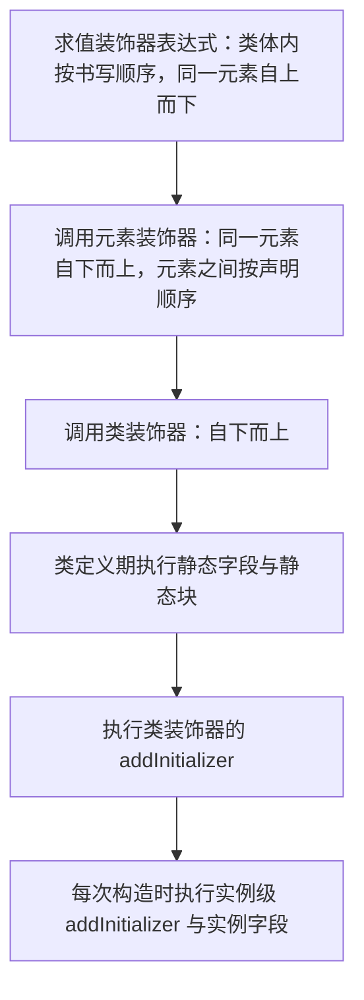

# Class 进阶：私有字段、静态块与装饰器

!!! abstract "核心结论"
    - 类方法是原型上的非枚举方法；`super` 的查找起点由方法定义时的 `[[HomeObject]]` 决定，与调用者、与是否被解构无关。
    - 实例字段在构造时用 `CreateDataProperty` 定义成 own、可枚举的数据属性；基类字段先于构造函数体，派生类字段在 `super()` 返回之后、构造函数体剩余语句之前。
    - `#x` 是词法作用域的 Private Name，brand 存在对象内部；`#x in obj` 是不抛异常的 brand check；WeakMap 只能模拟外观，brand 粒度与语义存在差异。
    - `static {}` 在类定义求值时按书写顺序执行一次，`this` 指向类本身；`accessor x = v` 展开为私有槽加原型上的 getter/setter 对。
    - Stage 3 装饰器统一为 `(value, context)` 签名，靠 `context.addInitializer` 注入实例级逻辑；它与 TypeScript 的 `experimentalDecorators` 是两套互斥语义。

## 1. class 的运行时模型：prototype 链、super、new.target

### 1.1 方法、[[HomeObject]] 与 super 的查找规则

`class` 声明在求值时会做三件事：创建构造函数、把每个方法用 `CreateMethodProperty` 定义到 `prototype` 上（`writable: true, enumerable: false, configurable: true`）、把 `prototype.constructor` 指回构造函数。类声明本身有 TDZ，不参与变量提升；类体内部代码始终是严格模式。

关键点在于：每个方法的函数对象在**定义时**获得一个内部槽 `[[HomeObject]]`。执行 `super.m()` 时，运行时做的是：

1. 取 `[[HomeObject]]`（实例方法即 `C.prototype`，静态方法即构造函数 `C` 本身）；
2. 令 `home = Object.getPrototypeOf([[HomeObject]])`；
3. 在 `home` 上做 `Get(home, "m", this)`，即**接收者仍然是 `this`**。

所以 `super` 既不指向父类的实例，也不指向调用者，它是一个静态绑定的查找起点。派生类构造函数的 `super(...)` 走的是 `[[Construct]]` 路径，并且把 `new.target` 原样传下去，这也是抽象基类能工作的原因。

### 1.2 手写实现与验证标准

```js
'use strict';
// 运行环境：Node.js 18+（CommonJS）
const assert = require('node:assert/strict');

const trace = [];

class Animal {
  constructor(name) {
    trace.push('Animal.ctor');
    this.name = name;
  }
  speak() { return `${this.name} makes a sound`; }
  static kingdom() { return 'Animalia'; }
  static of(...args) { return new this(...args); } // new.target === this
}

class Dog extends Animal {
  constructor(name) {
    trace.push('Dog.ctor:before');
    super(name);
    trace.push('Dog.ctor:after');
  }
  speak() { return `dog:${super.speak()}`; }
  static kingdom() { return `dog:${super.kingdom()}`; }
}

const d = new Dog('Rex');
assert.deepEqual(trace, ['Dog.ctor:before', 'Animal.ctor', 'Dog.ctor:after']);
assert.equal(d.speak(), 'dog:Rex makes a sound');
assert.equal(Dog.kingdom(), 'dog:Animalia');

// 静态方法里的 super 走构造函数原型链，但接收者仍是 this
assert.ok(Animal.of('a') instanceof Animal);
assert.ok(!(Animal.of('a') instanceof Dog));
assert.ok(Dog.of('a') instanceof Dog);
assert.equal(Dog.of('a').name, 'a');

// [[HomeObject]] 在定义时固定：把方法搬到别的对象上，super 依然从 Dog.prototype 起算
const detached = { __proto__: Animal.prototype, speak: Dog.prototype.speak };
assert.equal(detached.speak.call({ name: 'Bob' }), 'dog:Bob makes a sound');

// 删除父类原型上的方法会改变 super 的查找结果
const saved = Animal.prototype.speak;
delete Animal.prototype.speak;
assert.throws(() => d.speak(), TypeError);
Animal.prototype.speak = saved;
assert.equal(d.speak(), 'dog:Rex makes a sound');

// new.target
class AbstractShape {
  constructor() {
    if (new.target === AbstractShape) throw new TypeError('AbstractShape 不能直接实例化');
  }
}
class Circle extends AbstractShape {}
assert.throws(() => new AbstractShape(), TypeError);
assert.ok(new Circle() instanceof Circle);

// 派生类构造函数中 super() 之前访问 this 抛 ReferenceError
class Tdz extends Animal {
  constructor() {
    const probe = () => this;
    assert.throws(probe, ReferenceError);
    super('tdz');
  }
}
assert.equal(new Tdz().name, 'tdz');

// 类的调用限制
assert.throws(() => Animal('x'), TypeError);                     // 不能当普通函数调用
assert.throws(() => new (Animal.prototype.speak)(), TypeError);  // 方法不是构造函数

console.log('block1 ok');
```

预期输出（stdout）：`block1 ok`，期间无断言失败。

## 2. 字段初始化顺序与 static 块

### 2.1 实例字段的执行时机

字段初始化不是"写在构造函数最前面"，而是由运行时在固定的两个点插入：

- **基类**：`[[Construct]]` 创建 `this` 之后、构造函数体执行之前，按声明顺序初始化。
- **派生类**：`this` 在 `super()` 返回前处于 TDZ；`super()` 一返回，立刻按声明顺序初始化本类字段，然后才继续执行构造函数体的剩余语句。

字段用 `CreateDataPropertyOrThrow` 定义，所以是 own、`writable/enumerable/configurable` 全为 `true` 的数据属性，并且**不会触发原型上的 setter**，而是直接遮蔽它。这也解释了为什么 `accessor` 需要私有槽：普通字段会把原型访问器盖掉。

### 2.2 static 块

`static { ... }` 是类定义求值阶段执行一次的语句块，与静态字段按书写顺序交错执行。它拥有独立的词法作用域，`this` 指向类本身，因此是"用多条语句、try/catch 初始化静态私有状态"的唯一位置。

### 2.3 验证标准

```js
'use strict';
const assert = require('node:assert/strict');
const seq = [];

class Base {
  a = (seq.push('Base.field a'), 1);
  b = (seq.push('Base.field b'), this.a + 1); // 可以引用前面已初始化的字段
  constructor() { seq.push('Base.ctor body'); }
}

class Derived extends Base {
  c = (seq.push('Derived.field c'), this.b + 1);
  constructor() {
    seq.push('Derived.ctor:before super');
    super();
    seq.push('Derived.ctor:after super');
  }
}

const inst = new Derived();
assert.deepEqual(seq, [
  'Derived.ctor:before super',
  'Base.field a',
  'Base.field b',
  'Base.ctor body',
  'Derived.field c',
  'Derived.ctor:after super',
]);
assert.deepEqual([inst.a, inst.b, inst.c], [1, 2, 3]);

// 字段是 own、可枚举的可写数据属性
assert.deepEqual(Object.getOwnPropertyDescriptor(inst, 'a'),
  { value: 1, writable: true, enumerable: true, configurable: true });

// 字段遮蔽原型访问器，访问器本身仍在原型上
class WithGetter { get v() { return 'from prototype getter'; } }
class Shadows extends WithGetter { v = 'from field'; }
const s = new Shadows();
assert.equal(s.v, 'from field');
assert.equal(Object.getOwnPropertyDescriptor(WithGetter.prototype, 'v').get.call(s), 'from prototype getter');

// 静态字段与 static 块按书写顺序执行
const staticSeq = [];
class Statics {
  static first = (staticSeq.push('static field first'), 1);
  static { staticSeq.push('static block'); }
  static second = (staticSeq.push('static field second'), this.first + 1);
}
assert.deepEqual(staticSeq, ['static field first', 'static block', 'static field second']);
assert.equal(Statics.second, 2);

// static 块访问静态私有状态，并用 try/catch 兜住初始化失败
class Registry {
  static #items = [];
  static #ready = false;
  static {
    try {
      Registry.#items.push('boot');
      Registry.#ready = true;
    } catch {
      Registry.#ready = false;
    }
  }
  static get ready() { return Registry.#ready; }
  static get items() { return [...Registry.#items]; }
}
assert.equal(Registry.ready, true);
assert.deepEqual(Registry.items, ['boot']);

// static 块内的 var 不会泄漏到外层作用域
class ScopeCheck {
  static { var inner = 1; ScopeCheck.inner = inner; }
}
assert.equal(ScopeCheck.inner, 1);
assert.equal(typeof inner, 'undefined');

// 陷阱：父类构造函数里调用子类覆盖的方法，此时子类字段尚未初始化
class Base2 {
  constructor() { this.render(); }
  render() { this.rendered = 'base'; }
}
class Derived2 extends Base2 {
  label = 'derived';
  render() { this.seenLabel = this.label; }
}
const d2 = new Derived2();
assert.equal(d2.seenLabel, undefined);
assert.equal(d2.label, 'derived');

// 陷阱：构造函数返回其他对象时，字段装在被丢弃的 this 上
class Returns {
  x = 1;
  constructor() { return { y: 2 }; }
}
const r = new Returns();
assert.deepEqual(Object.keys(r), ['y']);
assert.equal(r.x, undefined);

console.log('block2 ok');
```

预期输出：`block2 ok`。

## 3. 私有字段 #x 的本质

### 3.1 Private Name 与 brand check

`#x` 不是"带特殊前缀的属性名"，而是类体求值时创建的 **Private Name** 值，保存在该类的 PrivateEnvironment 里。它与普通字符串 key 属于完全不同的命名空间：`'x' in obj`、`Object.keys`、`Object.getOwnPropertyNames`、`JSON.stringify` 都看不到它。

私有元素（字段、方法、访问器）在构造时被装进接收者的内部槽 `[[PrivateElements]]`。访问 `obj.#x` 时执行的是 `PrivateGet`：在 `obj.[[PrivateElements]]` 中查找该 Private Name，找不到就抛 `TypeError`（**不是返回 undefined**）。这个"有无该私有元素"的判定就是 brand check。私有方法不在原型上，它同样是按实例安装的，这正是它能做 brand check 的原因。

### 3.2 #x in obj

`#x in obj` 是 ES2022 引入的 ergonomic brand check：它复用同一条查找路径，但找不到时返回 `false` 而非抛错，并且右侧必须是对象（否则 `TypeError`）。私有名字必须是**词法可见**的——只有声明它的类体（含嵌套类、类内静态方法）才能写 `#x`，子类写 `#x` 会在解析期直接 `SyntaxError`。

### 3.3 WeakMap 模拟与降级产物

TypeScript 在 `target` 低于 ES2022 时，会把 `#x` 降级为"一张 WeakMap + `__classPrivateFieldGet/Set` helper"；Babel 的私有字段插件也是同类形状（helper 名以实际编译输出为准，需核对你的编译器版本）。下面用可运行的等价代码还原这个形状。

```js
'use strict';
const assert = require('node:assert/strict');

// 模拟编译器注入的 helper：brand check 就是"这张 WeakMap 里有没有这个键"
function __classPrivateFieldGet(receiver, state, label) {
  if (!state.has(receiver)) {
    throw new TypeError(`Cannot read private member ${label} from an object whose class did not declare it`);
  }
  return state.get(receiver);
}
function __classPrivateFieldSet(receiver, state, value, label) {
  if (!state.has(receiver)) {
    throw new TypeError(`Cannot write private member ${label} to an object whose class did not declare it`);
  }
  state.set(receiver, value);
  return value;
}

var _count; // 每字段一张 WeakMap
var _step;

class LegacyCounter {
  constructor(step = 1) {
    _count.set(this, 0);
    _step.set(this, step);
  }
  inc() {
    __classPrivateFieldSet(this, _count,
      __classPrivateFieldGet(this, _count, '#count') + __classPrivateFieldGet(this, _step, '#step'),
      '#count');
    return this;
  }
  get value() { return __classPrivateFieldGet(this, _count, '#count'); }
  static isLegacyCounter(o) { return _count.has(o) && _step.has(o); }
}
_count = new WeakMap();
_step = new WeakMap();

const lc = new LegacyCounter(2);
lc.inc().inc();
assert.equal(lc.value, 4);
assert.equal(LegacyCounter.isLegacyCounter(lc), true);
assert.equal(LegacyCounter.isLegacyCounter({}), false);
assert.equal(LegacyCounter.isLegacyCounter(null), false); // WeakMap.has 对非对象返回 false，不抛错
assert.throws(() => LegacyCounter.prototype.inc.call({}), TypeError);
assert.deepEqual(Object.keys(lc), []);

// 对照：同样的类用原生 #x，可观察行为一致
class NativeCounter {
  #count = 0;
  #step;
  constructor(step = 1) { this.#step = step; }
  inc() { this.#count += this.#step; return this; }
  get value() { return this.#count; }
}
const nc = new NativeCounter(2);
nc.inc().inc();
assert.equal(nc.value, lc.value);
assert.throws(() => NativeCounter.prototype.inc.call({}), TypeError);
assert.deepEqual(Object.keys(nc), Object.keys(lc));

console.log('block3a ok');
```

预期输出：`block3a ok`。

| 维度 | 原生 `#x` | WeakMap 方案 |
| --- | --- | --- |
| 存储位置 | 对象内部槽 `[[PrivateElements]]` | 模块级 WeakMap 外部表 |
| brand 粒度 | 以 Private Name 为单位，语义精确 | 每个字段一张表，需要多次 `has` |
| 私有方法 | 原生支持 `#m()`、`#get()` | 需把函数塞进 map 或改用闭包 |
| 反射可见性 | 任何反射 API 都不可达 | 持有 map 引用的代码可任意读写 |
| 继承语义 | 由父类构造函数安装，子类不可见 | 同样由构造函数安装，行为取决于实现 |
| 内存形态 | 每实例每字段一个内部 slot | 每实例每字段一条 map entry |

### 3.4 验证标准

```js
'use strict';
const assert = require('node:assert/strict');

class Counter {
  #count = 0;
  static #total = 0;
  #step;
  constructor(step = 1) {
    this.#step = step;
    Counter.#total += 1;
  }
  inc() { this.#count += this.#step; return this; }
  get value() { return this.#count; }
  get #double() { return this.#count * 2; }        // 私有访问器
  #snapshot() { return { count: this.#count }; }   // 私有方法
  describe() { return `${this.#snapshot().count}/${this.#double}`; }
  static get total() { return Counter.#total; }
  static isCounter(o) { return #count in o; }      // 不抛异常的 brand check
}

const c = new Counter(3);
c.inc().inc();
assert.equal(c.value, 6);
assert.equal(c.describe(), '6/12');
assert.equal(Counter.isCounter(c), true);
assert.equal(Counter.isCounter({}), false);
assert.deepEqual(Object.keys(c), []);
assert.equal(Object.getOwnPropertyNames(c).includes('count'), false);
assert.equal('count' in c, false);                // 私有名字不是普通属性名

// 未 brand 的对象上访问私有成员 -> TypeError，不是 undefined
assert.throws(() => Counter.prototype.inc.call({}), TypeError);
assert.throws(() => Counter.prototype.inc.call(null), TypeError);

// 子类实例执行了父类构造函数，因此拥有父类 brand
class Sub extends Counter {}
assert.equal(Counter.isCounter(new Sub(1)), true);
assert.equal(new Sub(1).value, 0);

// 私有名字是词法作用域：嵌套类能访问外层类的私有字段
class Outer {
  #x = 42;
  static makeReader() {
    return class Inner { static read(o) { return o.#x; } };
  }
}
const Inner = Outer.makeReader();
assert.equal(Inner.read(new Outer()), 42);

// 不同类中的同名私有字段互不影响
class A1 { #v = 'a'; read() { return this.#v; } }
class A2 { #v = 'b'; read() { return this.#v; } }
assert.equal(new A1().read(), 'a');
assert.equal(new A2().read(), 'b');

// 私有名字不在词法作用域内 -> 解析期 SyntaxError
globalThis.__Counter = Counter;
assert.throws(
  () => new Function('return class Sub2 extends globalThis.__Counter { read() { return this.#count; } }'),
  SyntaxError,
);

console.log('block3b ok');
```

预期输出：`block3b ok`。

## 4. accessor 关键字与自动访问器

### 4.1 语义

`accessor` 是装饰器提案（Stage 3）带来的语法糖，只能在类体内使用：

```js
class C {
  accessor x = 1;
}
```

它等价于"一个私有后备槽 + 原型上的一对 getter/setter"：

```js
class C {
  #x = 1;
  get x() { return this.#x; }
  set x(v) { this.#x = v; }
}
```

由此可得三个可观察结论：访问器本身在 `C.prototype` 上（`Object.getOwnPropertyDescriptor(C.prototype, 'x').get` 是函数）；实例上没有 own 的 `x`；`Object.keys(instance)` 看不到 `x`。它存在的意义是让装饰器**同时**拦截读写，同时保留"字段式"的声明写法。V8/Node 对 `accessor` 的原生支持情况请核对你所用版本；TypeScript 4.9+ 支持该语法。

### 4.2 手写等价实现与验证标准

```js
'use strict';
const assert = require('node:assert/strict');

// 用 WeakMap 当私有槽，getter/setter 定义在原型上
function makeAutoAccessor(proto, name, initialValue) {
  const store = new WeakMap();
  Object.defineProperty(proto, name, {
    get() { return store.get(this); },
    set(v) { store.set(this, v); },
    enumerable: false,
    configurable: true,
  });
  return function init(instance, value = initialValue) {
    store.set(instance, value);
  };
}

class Point {
  // 真实语法：accessor x = 0;  这里用上面这个 helper 等价实现
  constructor(x = 0) { Point.#initX(this, x); }
  static #initX = makeAutoAccessor(Point.prototype, 'x', 0);
  static #initY = makeAutoAccessor(Point.prototype, 'y', 0);
  getPair() { return [this.x, this.y]; }
}

const p = new Point(3);
assert.equal(p.x, 3);
p.x = 10;
assert.equal(p.x, 10);
assert.deepEqual(p.getPair(), [10, 0]);
assert.deepEqual(Object.keys(p), []);                            // 实例上没有 own 属性
assert.equal(Object.getOwnPropertyDescriptor(p, 'x'), undefined);
const protoDesc = Object.getOwnPropertyDescriptor(Point.prototype, 'x');
assert.equal(typeof protoDesc.get, 'function');
assert.equal(typeof protoDesc.set, 'function');
assert.equal(protoDesc.enumerable, false);

// 没走 init 的实例读出来是 undefined（值在私有槽里，不在实例上）
class Broken {
  static #init = makeAutoAccessor(Broken.prototype, 'v', 1);
  read() { return this.v; }
}
assert.equal(new Broken().read(), undefined);

console.log('block4 ok');
```

预期输出：`block4 ok`。注意：`accessor` 装饰器的 `value` 是 `{ get, set }`，可以返回 `{ get, set, init }` 来接管初始化；该细节在 2023-11 版本中定型，精确形状请核对官方 README 的 Accessor Decorators 一节。

## 5. Stage 3 装饰器

### 5.1 context 对象与装饰器种类

Stage 3 装饰器（2023-11 版本）的统一签名是 `(value, context) => replacement | undefined`。返回 `undefined` 表示"保持原值"，不是删除。

| kind | value 参数 | 返回值含义 | context 额外字段 |
| --- | --- | --- | --- |
| `class` | 类本身 | 替换类 | `name`、`addInitializer` |
| `method` | 方法函数 | 替换方法 | `addInitializer` |
| `getter` | getter 函数 | 替换 getter | `addInitializer` |
| `setter` | setter 函数 | 替换 setter | `addInitializer` |
| `field` | `undefined` | 返回初始化函数（替换原初始化器） | `access` |
| `accessor` | `{ get, set }` | 返回 `{ get, set, init }` | `access` |

所有 kind 共有的字段：`kind`、`name`、`static`、`private`、`metadata`、`addInitializer`。其中 `metadata` 聚合到 `Class[Symbol.metadata]`（细节需核对官方 README）。

### 5.2 手写最小装饰器运行时

下面的运行时覆盖上述语义，可让装饰器函数以**标准签名**被驱动，从而在 Node 原生环境里可运行验证。它不是 spec 实现，只是等价的教学版本。真实语法长这样（需要 Babel `version: "2023-11"` 或 TypeScript 5.x 编译，Node 原生直接运行会 `SyntaxError`，因此本页不附运行断言）：

```js
class Task {
  @log
  @bind
  run(id) { return id; }
}
```

```js
'use strict';
// 运行环境：Node.js 18+
const assert = require('node:assert/strict');

function decorate(Class, plan, classDecorators = []) {
  const instanceInits = [];
  const staticInits = [];
  const classInits = [];
  const protoPatches = [];
  const staticPatches = [];
  const instanceFieldInits = [];
  const staticFieldInits = [];

  for (const el of plan) {
    const isStatic = el.static === true;
    const isField = el.kind === 'field';
    const target = isStatic ? Class : Class.prototype;
    const desc = isField ? null : Object.getOwnPropertyDescriptor(target, el.key);
    if (!isField && !desc) throw new TypeError(`找不到元素 ${String(el.key)}`);

    let original;
    if (el.kind === 'method') original = desc.value;
    else if (el.kind === 'getter') original = desc.get;
    else if (el.kind === 'setter') original = desc.set;
    else original = undefined;

    const inits = isStatic ? staticInits : instanceInits;
    const context = {
      kind: el.kind,
      name: el.key,
      static: isStatic,
      private: false,
      metadata: el.metadata ?? {},
      addInitializer(fn) {
        if (typeof fn !== 'function') throw new TypeError('initializer 必须是函数');
        inits.push(fn);
      },
    };
    if (isField) {
      context.access = {
        has: (obj) => Object.prototype.hasOwnProperty.call(obj, el.key),
        get: (obj) => obj[el.key],
        set: (obj, value) => Object.defineProperty(obj, el.key, {
          value, writable: true, enumerable: true, configurable: true,
        }),
      };
    }

    // 同一元素的装饰器自下而上应用，每次把上一次的结果作为新的 value
    let result = original;
    for (let i = el.decorators.length - 1; i >= 0; i -= 1) {
      const next = el.decorators[i](result, context);
      if (next !== undefined) result = next;
    }

    if (isField) {
      const init = typeof result === 'function' ? result : (el.init ?? (() => undefined));
      (isStatic ? staticFieldInits : instanceFieldInits).push({ key: el.key, init });
    } else if (result !== original) {
      (isStatic ? staticPatches : protoPatches).push({ kind: el.kind, key: el.key, value: result });
    }
  }

  // 装饰后的类：原型链保持，实例初始化器与字段初始化在构造时执行
  class Decorated extends Class {
    constructor(...args) {
      super(...args);
      for (const fn of instanceInits) fn.call(this);
      for (const { key, init } of instanceFieldInits) {
        Object.defineProperty(this, key, {
          value: init.call(this), writable: true, enumerable: true, configurable: true,
        });
      }
    }
  }

  for (const { key, init } of staticFieldInits) {
    Object.defineProperty(Decorated, key, {
      value: init.call(Decorated), writable: true, enumerable: true, configurable: true,
    });
  }
  for (const fn of staticInits) fn.call(Decorated);

  const patch = (target, { kind, key, value }, base) => {
    if (kind === 'method') {
      Object.defineProperty(target, key, { value, writable: true, enumerable: false, configurable: true });
    } else if (kind === 'getter') {
      Object.defineProperty(target, key, {
        get: value, set: base ? base.set : undefined, enumerable: false, configurable: true,
      });
    } else {
      Object.defineProperty(target, key, {
        get: base ? base.get : undefined, set: value, enumerable: false, configurable: true,
      });
    }
  };
  for (const p of protoPatches) patch(Decorated.prototype, p, Object.getOwnPropertyDescriptor(Class.prototype, p.key));
  for (const p of staticPatches) patch(Decorated, p, Object.getOwnPropertyDescriptor(Class, p.key));

  let Result = Decorated;
  for (let i = classDecorators.length - 1; i >= 0; i -= 1) {
    const ctx = {
      kind: 'class',
      name: Result.name || undefined,
      metadata: {},
      addInitializer(fn) {
        if (typeof fn !== 'function') throw new TypeError('initializer 必须是函数');
        classInits.push(fn);
      },
    };
    const next = classDecorators[i](Result, ctx);
    if (next !== undefined) Result = next;
  }
  for (const fn of classInits) fn.call(Result);
  return Result;
}
```

### 5.3 @log、@bind、@memoize 与验证标准

```js
const logLines = [];

// 方法装饰器：返回替换函数；不返回则保持原方法
function log(value, context) {
  if (context.kind !== 'method') throw new TypeError('@log 只支持方法');
  const original = value;
  function replacement(...args) {
    const out = original.apply(this, args);
    logLines.push(`${String(context.name)}(${args.map((a) => JSON.stringify(a)).join(', ')}) -> ${JSON.stringify(out)}`);
    return out;
  }
  Object.defineProperty(replacement, 'name', { value: String(context.name), configurable: true });
  return replacement;
}

// 实例方法装饰器：用 addInitializer 在实例上写入绑定后的函数
function bind(value, context) {
  if (context.kind !== 'method' || context.static) throw new TypeError('@bind 只支持实例方法');
  context.addInitializer(function () {
    Object.defineProperty(this, context.name, {
      value: value.bind(this), writable: true, enumerable: false, configurable: true,
    });
  });
  return undefined; // 不改原型上的方法
}

const MEMO = Symbol('memoize');

// 每实例一份缓存：缓存 Map 必须在 addInitializer 里创建，否则所有实例共享
function memoize(value, context) {
  if (context.kind !== 'method' || context.static) throw new TypeError('@memoize 只支持实例方法');
  context.addInitializer(function () {
    Object.defineProperty(this, MEMO, { value: new Map(), writable: true, configurable: true });
  });
  return function (...args) {
    const cache = this[MEMO];
    const key = JSON.stringify(args);
    if (!cache.has(key)) cache.set(key, value.apply(this, args));
    return cache.get(key);
  };
}

// 字段装饰器工厂：返回的函数替换原字段初始化器
function defaultTo(fallback) {
  return function (value, context) {
    if (context.kind !== 'field') throw new TypeError('@defaultTo 只支持字段');
    return function () { return fallback; };
  };
}

// 类装饰器：返回新类
function seal(value, context) {
  if (context.kind !== 'class') throw new TypeError('@seal 只支持类');
  return class extends value {
    constructor(...args) {
      super(...args);
      Object.defineProperty(this, 'sealed', { value: true, enumerable: false });
    }
  };
}

class Api {
  #secret = 's3cr3t';
  constructor(base) { this.base = base; this.hits = 0; }
  greet(name) { return `hi ${name}`; }
  slow(n) { this.hits += 1; return n * 2; }
  read() { return this.#secret; }
}

// 数组顺序即书写顺序：@bind 在上、@log 在下 -> 先应用 log，再应用 bind
const ApiD = decorate(Api, [
  { kind: 'method', key: 'greet', decorators: [bind, log] },
  { kind: 'method', key: 'slow', decorators: [memoize] },
  { kind: 'field', key: 'tag', decorators: [defaultTo('fallback')] },
]);

const api = new ApiD('https://example.test');
assert.equal(api.base, 'https://example.test');
assert.equal(api.read(), 's3cr3t');   // 私有字段穿过装饰后的新类依旧可用
assert.equal(api.tag, 'fallback');    // 字段装饰器返回的初始化器生效

assert.equal(api.greet('Bob'), 'hi Bob');
const detachedGreet = api.greet;
assert.equal(detachedGreet('Ann'), 'hi Ann'); // @bind 生效
assert.deepEqual(logLines, [
  'greet("Bob") -> "hi Bob"',
  'greet("Ann") -> "hi Ann"',
]);

assert.equal(api.slow(3), 6);
assert.equal(api.slow(3), 6);
assert.equal(api.hits, 1);            // 命中缓存，原方法只执行一次
assert.ok(api instanceof Api);        // 装饰后原型链保持
assert.equal(Object.getPrototypeOf(api), ApiD.prototype);

// 类装饰器：整体替换为新类
const ApiS = decorate(Api, [{ kind: 'method', key: 'greet', decorators: [log] }], [seal]);
const api2 = new ApiS('x');
assert.equal(api2.greet('Zoe'), 'hi Zoe');
assert.equal(api2.sealed, true);
assert.ok(api2 instanceof Api);
assert.equal(logLines[logLines.length - 1], 'greet("Zoe") -> "hi Zoe"');

console.log('block5 ok');
```

预期输出：`block5 ok`。

### 5.4 执行顺序



元素装饰器与静态初始化块的精确先后关系，请以官方 README 的执行顺序章节为准（需核对官方文档）。本页运行时的顺序是：父类字段 -> 实例级 `addInitializer` -> 实例字段初始化器。

### 5.5 与 TS experimentalDecorators 的区别

| 维度 | `experimentalDecorators` 旧语义 | 标准 Stage 3 装饰器 |
| --- | --- | --- |
| 来源 | 早期提案的 TS 自定义实现，长期保留 | tc39 Stage 3，2023-11 版本 |
| 启用方式 | `"experimentalDecorators": true` | TS 5.0+ 默认，需关闭 `experimentalDecorators` |
| 签名 | 类 `(target)`；方法 `(target, key, descriptor)`；属性 `(target, key)`；参数 `(target, key, index)` | 统一 `(value, context)` |
| 返回值 | 可返回 descriptor 或构造函数，属性装饰器返回值被忽略 | 返回替换值，`undefined` 表示保持原值 |
| 参数装饰器 | 支持 | 不支持 |
| 字段能力 | 无法感知/替换字段初始化 | 有 `context.access` 与"返回初始化函数" |
| 实例级逻辑 | 需要自行包构造函数 | `context.addInitializer` |
| 元数据 | `emitDecoratorMetadata` 加 `reflect-metadata` | 标准只提供 `context.metadata`，不生成设计类型元数据 |
| 应用顺序 | 官方文档 Decorator Evaluation：实例成员（参数再方法/访问器/属性）-> 静态成员 -> 构造器参数 -> 类 | 元素装饰器自下而上、元素间按声明顺序、类装饰器最后 |
| 混用 | 同一项目不能同时启用两套语义 | 同左 |

## 6. mixin

### 6.1 手写实现与验证标准

`Object.assign` 版本一定失败：class 的方法是**非枚举**属性，`Object.assign` 只拷贝 own enumerable 属性，所以一个方法都不会被拷过去。正确做法是"接受基类、返回子类"的函数式 mixin。

```js
'use strict';
const assert = require('node:assert/strict');

// 反例：Object.assign 拷不动 class 方法
class SpeakMixin { speak() { return `speak:${this.name}`; } }
assert.equal(Object.getOwnPropertyDescriptor(SpeakMixin.prototype, 'speak').enumerable, false);
class NaivePerson { constructor(name) { this.name = name; } }
Object.assign(NaivePerson.prototype, SpeakMixin.prototype);
assert.deepEqual(Object.keys(NaivePerson.prototype), []);
assert.equal(typeof new NaivePerson('n').speak, 'undefined');

// 正例：函数式 mixin，用 class 表达式继承传入的 Base
const Serializable = (Base) => class extends Base {
  toJSON() {
    const out = {};
    for (const key of Object.keys(this)) out[key] = this[key];
    return out;
  }
  serialize() { return JSON.stringify(this.toJSON()); }
};

const Timestamped = (Base) => class extends Base {
  createdAt = 1_700_000_000_000;
  touch(now) { this.createdAt = now; return this; }
};

class Entity { constructor(id) { this.id = id; } }

// 注意嵌套顺序：最后应用的 Timestamped 离 Entity 最近，其字段先于 User 的赋值
class User extends Serializable(Timestamped(Entity)) {
  constructor(id, name) { super(id); this.name = name; }
}

const u = new User(7, 'ada');
assert.equal(u.serialize(), '{"id":7,"createdAt":1700000000000,"name":"ada"}');
assert.equal(u.createdAt, 1_700_000_000_000);
u.touch(1_800_000_000_000);
assert.equal(u.createdAt, 1_800_000_000_000);
assert.ok(u instanceof Entity, '原型链不断');
assert.ok(u instanceof User);

// 用类装饰器组合多个 mixin：mix(a, b)(Base) === b(a(Base))
const mix = (...behaviors) => (Base) => behaviors.reduce((C, B) => B(C), Base);
const Hi = (B) => class extends B { hi() { return `hi ${this.name}`; } };
const Bye = (B) => class extends B { bye() { return `bye ${this.name}`; } };

class Plain { constructor(name) { this.name = name; } }
class Talker extends mix(Hi, Bye)(Plain) {}

const t = new Talker('bo');
assert.equal(t.hi(), 'hi bo');
assert.equal(t.bye(), 'bye bo');
assert.ok(t instanceof Plain);
assert.equal(t instanceof Hi, false); // 每次调用工厂都是新类，不能对 mixin 结果做 instanceof

console.log('block6 ok');
```

预期输出：`block6 ok`。若需要 mixin 级别的 `instanceof`，只能额外实现 `static [Symbol.hasInstance]`，这是另一套成本。

## 7. 常见陷阱

- **`super()` 之前访问 `this` 抛 `ReferenceError`**，不是 `undefined`；派生类构造函数里任何箭头函数也会捕获这个 TDZ。
- **字段遮蔽原型访问器**：字段用 `CreateDataProperty` 定义，不会触发 setter，而是直接盖掉原型上的 getter/setter。需要"取值走访问器"的场景必须用 `accessor` 或私有槽。
- **父类构造函数里调用子类覆盖的方法**：此时子类字段还没初始化，读到 `undefined`。要么别在构造函数里调用可覆盖方法，要么把初始化逻辑推迟。
- **构造函数返回别的对象**：字段被装在被丢弃的 `this` 上，返回的对象上没有这些字段。
- **`#x` 不是软私有**：访问未 brand 的对象抛 `TypeError`。写 `obj.#x ?? fallback` 挡不住这个异常。
- **`#x in obj` 与 `'x' in obj` 完全不同**：前者是词法 brand check，后者沿原型链查字符串属性。
- **子类无法访问父类的 `#x`**：私有名字不在子类作用域内，是解析期 `SyntaxError`，不是运行时错误。
- **`static` 块里不要写实例逻辑**：它只在类定义时跑一次，`this` 是类本身。
- **装饰器返回 `undefined` 表示保持原值**，不是删除元素；想删除只能返回别的东西或改 `context.access`。
- **mixin 的 `Object.assign` 陷阱**：class 方法非枚举，拷贝结果为空。
- **装饰器会改变类身份**：返回新类后，旧引用不再是构造器；`Class.name`、静态属性引用都可能与新类不一致。
- **`experimentalDecorators` 与标准装饰器不能混用**，`emitDecoratorMetadata` 只在 legacy 下有效（需核对你的 TS 版本与文档）。

## 8. 面试题与答题要点

### 8.1 类的方法和字段分别定义在哪里？为什么 `#x` 不在原型上？

- 方法定义在 `prototype`（静态方法定义在构造函数自身），描述符为 `writable: true, enumerable: false, configurable: true`。
- 字段在**构造时**用 `CreateDataProperty` 定义到实例上，因此是 own、可枚举的数据属性，天然遮蔽原型属性。
- `#x` 走的是 Private Name 机制，装在实例内部槽 `[[PrivateElements]]`。它必须在实例上，因为 brand check 的判定单位是"该实例是否由声明它的构造函数初始化过"，原型共享会直接破坏封装。

### 8.2 派生类构造函数中，`super()` 返回到构造函数体继续执行之间发生了什么？

- `super()` 内部以 `new.target` 调用父类 `[[Construct]]`，得到/创建 `this`，绑定派生类构造函数的 `this` 并解除 TDZ。
- 紧接着执行**本类**所有实例字段初始化器（按声明顺序），然后才继续执行构造函数体的剩余语句。
- 顺序陷阱：父类构造函数体执行时，子类字段还不存在。

### 8.3 `#x in obj` 解决了什么问题？和 WeakMap 方案相比优劣？

- 解决的问题：在不抛异常的前提下判断对象是否有某个 brand，替代 `try { obj.#x } catch` 或自建 WeakSet。
- 原生：brand 粒度是 Private Name，私有方法/访问器同样被覆盖，且无法被任何反射 API 触达。
- WeakMap：需要为每个字段维护一张表，多次 `has` 查找；私有方法难以表达；持有 map 引用的代码可以任意读写。优点是不依赖 `#` 语法，可在任意目标环境运行（这正是编译器的降级策略）。

### 8.4 static 块解决了什么问题，什么时候执行？

- 解决"静态初始化需要多条语句、需要 `try/catch`、需要访问静态私有成员"这三类需求。
- 在类定义求值时执行，且只执行一次，按书写顺序与静态字段交错。
- `this` 是类本身；块内 `var` 有自己的作用域，不泄漏到外层。

### 8.5 `accessor` 关键字展开成什么？为什么需要它？

- 展开为"私有后备槽 + 原型上的 getter/setter 对"，实例上没有同名 own 属性。
- 需要它是因为普通字段用 `CreateDataProperty` 定义，会遮蔽原型访问器，装饰器无法同时拦截读写。
- 代价：取值多一层访问器调用；`Object.keys(instance)` 看不到该字段。

### 8.6 Stage 3 装饰器的 context 有哪些字段？求值顺序与执行顺序分别是什么？

- 共有：`kind`、`name`、`static`、`private`、`metadata`、`addInitializer`；`field` 与 `accessor` 额外有 `access: { get, set, has }`。
- 求值顺序：类体内自上而下，同一元素多个装饰器自上而下。
- 执行顺序：同一元素的装饰器自下而上（最靠近声明的先执行），元素之间按声明顺序，类装饰器最后且自下而上。
- 只有 `addInitializer` 能拿到"每个实例构造时"的钩子；装饰器函数本身在类定义时就执行完了。

### 8.7 `experimentalDecorators` 和标准装饰器有哪些不可调和的差异？

- 签名不同：`(target, key, descriptor)` 对比 `(value, context)`；参数装饰器在标准中不存在。
- 能力不同：标准提供 `access` 与字段初始化器替换，legacy 没有；legacy 提供 `emitDecoratorMetadata`，标准没有对应的设计类型元数据。
- 顺序不同：legacy 按"参数 -> 方法/访问器/属性 -> 类"分组应用，标准是"元素自下而上、类最后"。
- 二者同一项目不能同时启用，迁移需要重写装饰器实现和依赖 `reflect-metadata` 的代码。

### 8.8 怎么实现 `@bind`？为什么必须用 `addInitializer`？

- 在构造时为每个实例写入绑定后的函数，通常是 `Object.defineProperty(this, name, { value: value.bind(this) })`，用 own 属性遮蔽原型方法。
- 不能在装饰器函数里直接 `bind`：装饰器在类定义期执行，此时没有实例，`this` 不存在，而且把一个共享的绑定函数写回原型会让所有实例共用同一个 `this`。
- 同理 `@memoize` 的缓存 Map 也必须在 `addInitializer` 里创建，否则退化成所有实例共享缓存。

### 8.9 `new.target` 能做什么？

- 在构造函数/函数体内判断"当前是否被 `new` 调用以及被谁调用"，未 `new` 时是 `undefined`。
- 实现抽象基类：`if (new.target === Base) throw new TypeError(...)`。
- 实现工厂式静态方法：`static of(...args) { return new this(...args); }`，子类调用时自动构造子类实例。
- 与 `super()` 配套：`super()` 会把当前 `new.target` 透传给父类构造函数。

## 9. 小结

class 的"魔法"全部落在三处规范机制上：方法定义时的 `[[HomeObject]]` 决定 `super` 的查找起点；实例字段用 `CreateDataProperty` 在构造的两个固定时点插入；`#x` 是词法作用域的 Private Name，brand 存在对象内部。装饰器只是在类定义期对这三者做一次可组合的重写，标准版靠 `context` 与 `addInitializer` 把"类定义期"和"实例构造期"两个时机区分清楚——理解了这条时间线，绝大多数装饰器教程里含糊的顺序问题都会自己消失。

## 深入阅读与参考

!!! tip "怎么用这些资料"
    先读「官方文档与规范」建立准确的概念，再读「源码与示例」核对细节，最后用「教程、书籍与视频」换一种讲法加深理解。每条都写明了读哪一节、带着什么问题读。

### 官方文档与规范

| 资源 | 为什么读 | 怎么读 |
|---|---|---|
| [class](https://developer.mozilla.org/en-US/docs/Web/JavaScript/Reference/Statements/class) | class 声明/表达式的语法与运行时语义总览，先立框架。 | 读语法与示例，再用 Object.getOwnPropertyNames 验证方法与静态成员挂在哪。 |
| [Inheritance and the prototype chain](https://developer.mozilla.org/en-US/docs/Web/JavaScript/Guide/Inheritance_and_the_prototype_chain) | 讲透 [[Prototype]] 与 constructor，是理解 class 继承的地基。 | 重点读继承一节，手画子类、父类、实例三层链，再回看 super 指向谁。 |
| [Function: prototype](https://developer.mozilla.org/en-US/docs/Web/JavaScript/Reference/Global_Objects/Function/prototype) | 区分函数的 prototype 属性与对象的 [[Prototype]]，避免概念混淆。 | 读描述与示例，验证 class C{} 的 C.prototype 与 getPrototypeOf(C) 不同。 |
| [super](https://developer.mozilla.org/en-US/docs/Web/JavaScript/Reference/Operators/super) | super 两种用法及调用语义的权威说明，覆盖本页核心。 | 分读属性访问与调用两节，思考 super.x 与 this.x 取值为何可能不同。 |
| [new.target](https://developer.mozilla.org/en-US/docs/Web/JavaScript/Reference/Operators/new.target) | new.target 是看懂派生类构造与抽象基类写法的关键。 | 读示例后写一个禁止直接 new 的基类，并在子类构造里打印 new.target。 |
| [Public class fields](https://developer.mozilla.org/en-US/docs/Web/JavaScript/Reference/Classes/Public_class_fields) | 字段初始化时机与顺序的官方定义，解释 this 被覆盖的坑。 | 读实例字段与构造器执行顺序一节，做字段与构造器赋值互相覆盖的实验。 |
| [Static initialization blocks](https://developer.mozilla.org/en-US/docs/Web/JavaScript/Reference/Classes/Static_initialization_blocks) | static 块语法与执行时机，替代类外静态初始化的老写法。 | 读示例，验证静态块在类求值时按书写顺序各执行一次，且能访问私有字段。 |
| [static](https://developer.mozilla.org/en-US/docs/Web/JavaScript/Reference/Classes/static) | 静态成员能否被继承、super 怎么用，最容易误解。 | 读 static 成员继承相关示例，实测子类通过 super 调用静态方法。 |
| [class expression](https://developer.mozilla.org/en-US/docs/Web/JavaScript/Reference/Operators/class) | 类表达式是 mixin 与装饰器包装类的语法基础。 | 读示例，练习用类表达式返回匿名类，构造一个可复用 mixin 函数。 |
| [SyntaxError: use of super property/member accesses only valid within methods or eval code within methods](https://developer.mozilla.org/en-US/docs/Web/JavaScript/Reference/Errors/Bad_super_prop) | 解释 super 成员访问只允许出现在方法内，是高频报错来源。 | 读报错原因与示例，把方法体里的 super 抽到普通函数中复现报错。 |
| [ReferenceError: must call super constructor before using 'this' in derived class constructor](https://developer.mozilla.org/en-US/docs/Web/JavaScript/Reference/Errors/Super_not_called) | 派生类构造器中 this 与 super 的时序规则最易踩坑。 | 读示例，在 super() 之前访问 this 复现报错，记录调用顺序结论。 |
| [JavaScript prototype pollution](https://developer.mozilla.org/en-US/docs/Web/Security/Attacks/Prototype_pollution) | 原型链可被污染，理解原型就能看懂一类安全陷阱。 | 读攻击与防护示例，回头检查自己代码里对原型对象的写操作。 |

### 源码与示例

| 资源 | 为什么读 | 怎么读 |
|---|---|---|
| [TC39 提案仓库](https://github.com/tc39/proposals) | 装饰器仍在演进，TC39 提案仓库是唯一权威依据。 | 读 decorators 提案 README 的动机、语法与示例代码，留意 Stage 3 的改动。 |

## 应用与行业实践

### 应用场景地图

| 场景 | 用到本页哪个知识点 | 典型技术选型 | 注意事项 |
| --- | --- | --- | --- |
| 后台管理的万行表格行模型 | 类方法在原型上且非枚举；实例字段是 own 属性 | TanStack Table 加自建 RowModel 类 | 在实例上赋同名属性会遮蔽原型方法；`for...in` 不会遍历类方法 |
| 低端安卓首屏的 Web Component 注册 | `static {}` 在类定义求值时执行一次，`this` 指向类 | 原生 Custom Elements 加动态 `import()` | static 块里的同步重活算进那次 import 的耗时 |
| 多人协作白板的图元类型判断 | `#x in obj` 作为 brand check | Yjs 或自建 CRDT 图元层 | 结构化克隆不复制私有槽，跨 Worker 后要靠重建恢复 |
| 表单校验 SDK 的多实例 | 实例字段在构造时定义；派生类字段在 `super()` 返回之后 | TypeScript 加发布为 ESM 的 SDK | 基类字段先于构造函数体执行，顺序写错会读到 undefined |
| 微前端基座下的插件系统 | `super` 的起点由 `[[HomeObject]]` 决定 | 插件注册表加类继承 | 方法被解构或在别处调用，`super` 仍然指向定义它的那个对象 |
| 组件库的主题开关与注册表 | `static {}` 加私有静态字段 | 组件库的 CSS 变量层 | 注册表放私有静态字段，外部改不到 |
| 埋点 SDK 的字段校验 | `accessor` 展开为私有槽加原型上的 getter/setter 对 | 标准装饰器加 `accessor` 关键字 | 序列化看不到 accessor 背后的私有槽，要显式取值 |
| 动画循环里的实体状态 | 私有字段加 brand check | 自建 ECS 或 Canvas 渲染层 | 私有字段不参与 `JSON.stringify`，快照逻辑要单独写 |

### 三个场景拆解

#### 场景 1：后台管理系统的万行表格行模型

**业务背景**：团队把表格从几百行扩到几万行，每行建一个 RowModel 实例，排序与筛选会整批重建实例。痛点有两处：行对象传到 Worker 做计算时方法丢失；用 `for...in` 遍历时把方法名也带出来。

**怎么用本页知识解决**：思路是数据进实例字段、行为留在原型、类型判断交给私有字段。实例字段是 own 的可枚举数据属性，结构化克隆会带走；原型方法是 non-enumerable，不会污染 `Object.keys`。brand check 用来在函数入口确认“这确实是一个 Row”。

```js
class Row {
  #id;                                  // 私有 brand：只有 new 出来的 Row 才有
  constructor(data) {
    this.id = data.id;                  // own、可枚举的数据属性，能被结构化克隆
    this.cells = data.cells;
    this.#id = data.id;
  }
  label() { return "row#" + this.id; }  // 原型方法，非枚举，不进 own 属性
  static isRow(value) {                 // brand check：不是 Row 就返回 false
    return typeof value === "object" && value !== null && #id in value;
  }
}
const row = new Row({ id: 7, cells: [1, 2] });
Object.keys(row);                       // ["id", "cells"]
Row.isRow(row);                         // true
Row.isRow({ id: 7, cells: [1, 2] });    // false
```

- `Object.keys` 只列数据字段，说明方法没有落到实例上，序列化和克隆的负载变小。
- `label` 放在原型上，几万个实例共享一份函数，不增加每个实例的体积。
- `Row.isRow` 里的 `#id in value` 对普通对象返回 false 且不抛异常，可以直接当守卫条件。
- 从 Worker 传回来的对象经过结构化克隆，brand 已经丢失，必须先 `new Row(...)` 再进业务逻辑。

**怎么度量收益**：用 Chrome DevTools 的 Performance 面板录制一次全量排序，比较 "Scripting" 时间与 Long Task 条数。用 `performance.measure("row-rebuild")` 在代码里打点，统计每轮重建的耗时。内存侧用 Memory 面板取两次 heap snapshot，看 Row 实例的 Shallow Size 之和。

**什么时候不该用**：

- 数据要 `postMessage` 到 Worker 再传回、对端还要做 `Row.isRow` 判断。结构化克隆不复制私有槽，对端必须重新 `new Row`，否则判断永远是 false。
- 表格只渲染一次、没有行级状态。此时用普通对象数组加纯函数更省内存，类实例只是多一层开销。
- 项目的深拷贝工具依赖 `for...in` 或 `Object.assign`。私有字段不会被这两者复制，得改用 `structuredClone` 加显式重建。

#### 场景 2：低端安卓首屏的图表组件注册

**业务背景**：首屏要注册一批 Web Component 并载入配置表，在低端安卓上主线程任务长，滑动前几百毫秒能感到卡顿。配置表的注册只该发生一次，重复注册要当场报错。

**怎么用本页知识解决**：把注册动作放进 `static {}`，它在类定义求值那一刻同步跑一次，`this` 指向类本身。再把整个模块改成首屏之后的动态 `import()`，注册成本就挪出了关键路径。注册表放私有静态字段，外部拿不到也改不了。

```js
export class ChartWidget extends HTMLElement {
  static tag = "chart-widget";    // 先书写，后面的 static 块才能读到
  static #registry = new Map();   // 私有静态字段，外部改不到
  static {
    // 类定义求值时同步跑一次，this 指向 ChartWidget
    this.#registry.set(this.tag, this);
    customElements.define(this.tag, this);
  }
  #count = 0;                     // 实例字段在 super() 返回之后初始化
  render(rows) { this.#count = rows.length; }
}
```

- static 块按书写顺序执行一次，把 `tag` 写在块之前才能读到值。
- `this` 指向类本身，所以块内可以用 `this.#registry` 操作私有静态字段。
- 块内是同步代码，网络请求和大量计算放进去会拖长这次 import 的耗时。
- 注册表私有化后，重复注册的检查由类自己控制，外部代码无法绕过。

**怎么度量收益**：用 `PerformanceObserver` 监听 `longtask`，统计首屏内 `duration` 超过 50 毫秒的条目总时长与条数。用 Lighthouse 看 TBT（Total Blocking Time）。设备侧用 DevTools 的 CPU 节流把速度降到 4 倍或 6 倍，复现低端机的表现。

**什么时候不该用**：

- 项目要做 SSR。static 块在服务端模块加载时就会执行，Node 里没有 `customElements`，会抛 ReferenceError。
- 配置需要运行时热更新。static 块只在模块首次求值时跑一次，改配置得重新 import 模块。
- 元素必须在首屏立刻出现。挪进动态 import 会推迟定义，未升级的元素在升级前没有行为。

#### 场景 3：多人协作白板的图元合并

**业务背景**：白板要合并来自多个客户端的图元，输入里混着自家类实例、JSON 还原的普通对象、插件传入的对象。合并代码需要一道可靠的类型闸门，否则错误对象会在后续渲染里炸开。

**怎么用本页知识解决**：用私有字段当 brand，只有真正经过构造函数链的对象才有这个槽。`#brand in value` 做判断不抛异常，可以安全地放在入口。跨边界进来的一律走工厂重建，brand 由构造函数重新打上。

```js
class Shape {
  #brand;                      // 构造过的实例才有这个槽
  constructor(kind) {
    this.kind = kind;          // 可序列化的 own 属性
    this.#brand = true;
  }
  static isShape(value) {
    return typeof value === "object" && value !== null && #brand in value;
  }
}
class Rect extends Shape {     // 派生类：字段在 super() 返回之后初始化
  constructor(w, h) {
    super("rect");
    this.w = w;
    this.h = h;
  }
}
Shape.isShape(new Rect(1, 2));                 // true
Shape.isShape(JSON.parse('{"kind":"rect"}'));  // false
```

- 子类实例在 `super()` 里执行了父类构造函数，因此也带上了 `#brand`，判断成立。
- `in` 形式对缺少该槽的值返回 false，不必用 try/catch 包住私有字段访问。
- JSON 往返得到的是普通对象，`kind` 字段看起来对但 brand 不在，必须走 `new Rect(...)`。
- 每个 realm 的私有名字独立，跨 iframe 传进来的实例要按外部数据处理。

**怎么度量收益**：用 `node:test` 回放固定的操作序列，统计 `isShape` 的误判次数（把非图元判成图元、把图元判成非图元各计一类）。用 `performance.measure("merge")` 统计合并一万个图元的耗时，与改造前的 WeakMap 版本做同机对照。

**什么时候不该用**：

- 需要在 Worker 与主线程之间传递图元并保留 brand。结构化克隆不复制私有槽，只能在边界重建。
- 图元要存进 IndexedDB 再读回并保持类型。必须自建 `type` 字段加工厂函数，brand 帮不上忙。
- 插件在自己的 iframe 里 `new` 出子类实例再传进来。私有名字表按 realm 隔离，宿主侧的判断会返回 false。

### 行业先进实践

**私有字段的 ergonomic brand check（出处：TC39 提案 Ergonomic brand checks for Private Fields / MDN `in` 运算符文档）**

做法是用 `#field in obj` 判断对象是否由本类构造，取代 WeakMap 侧表。brand 存在对象内部，不需要跨模块维护一张表，对非本类对象返回 false 且不抛异常。借鉴时把 SDK 入口的类型校验从 WeakMap 换成 brand check，同时保留 `typeof value === "object" && value !== null` 的空值短路。

**Stage 3 装饰器的 `context.addInitializer`（出处：TC39 proposal-decorators 仓库 / TypeScript 5.0 发布说明）**

标准装饰器统一为 `(value, context)` 签名，字段装饰器拿不到实例，`addInitializer` 提供了在实例创建后运行的钩子。它把元数据驱动的初始化从构造函数里挪出来，构造函数只留业务参数。借鉴方式是把注册、默认值注入改写成装饰器，让构造函数保持干净。

**TypeScript 装饰器两套语义的互斥（出处：TypeScript 官方文档 Decorators 与 tsconfig 参考）**

`experimentalDecorators` 打开时装饰器用 `(target, key, descriptor)` 签名，关闭后用 `(value, context)`，两套参数含义不同，混用会静默拿到错的值。项目里要在一个包内固定一套，并在 tsconfig 里显式写出开关。需核对官方文档：核对目标 TS 版本下 `experimentalDecorators` 与 `emitDecoratorMetadata` 的默认值，以及 `useDefineForClassFields` 对字段语义的影响。

**Lit 用静态字段声明响应式属性与样式（出处：Lit 官方文档）**

Lit 把 `static properties` 与 `static styles` 写在类定义上，元素升级时按声明处理这些元数据。元数据在类求值时确定，与实例创建解耦，升级逻辑不必猜实例状态。借鉴方式是把注册表和默认配置放到静态字段，让初始化顺序由类定义的书写顺序决定。

**Angular 装饰器与标准装饰器的兼容矩阵（需核对官方文档：核对 Angular 版本说明与项目 tsconfig 中 `experimentalDecorators`、`useDefineForClassFields` 的取值）**

Angular 的类装饰器长期依赖 TypeScript 的遗留装饰器语义，迁到标准签名需要框架侧提供支持。核对清楚之前，不要在同一个仓库里对同类语法同时启用两套语义。

### 从学到用：落地路线

**第 1 步 试点**：挑一个对外暴露的工具类，把状态改成实例字段，方法留在原型上，先不引入私有字段和装饰器。验收标准是 `Object.keys` 出来的集合与改动前列出的数据字段集合完全一致。

**第 2 步 验证**：给这个类加一个私有 brand 和 `static isX`，在克隆与跨 Worker 的边界上加断言。验收标准是存在一个用例，把 `structuredClone` 的结果喂给 `isX` 得到 false，并确认代码走了重建分支。

**第 3 步 推广**：把注册表初始化改成 `static {}`，把装饰器改成 `(value, context)` 签名，在包里关掉 `experimentalDecorators`。验收标准是构建通过，且产物中不再出现 `__decorate` 这类装饰器辅助函数。

**第 4 步 防回退**：在 CI 里加 lint 规则与回归测试，禁止在实例上赋与原型方法同名的属性。验收标准是新增规则能命中故意写坏的样例，且有测试覆盖“方法被解构后调用仍能访问 `super`”。

### 动手作业

**目标**：把一个小模块从“普通对象加 WeakMap 标记”改成“类加私有字段加 `static {}` 加标准装饰器”的实现，并用测试证明跨序列化边界后的语义。

**步骤**：

1. 确认运行时支持 `#x in obj`：在 `node -e` 里跑 `class A { #x = 1; static has(v) { return #x in v; } } console.log(A.has(new A()), A.has({}))`，应输出 `true false`。
2. 建 `src/node.js`，写基类 `Node`：实例字段存 `type` 与 `payload`，加一个私有字段做 brand，再加 `static isNode`。
3. 在基类里加私有静态 `Map` 和 `static register(ctor)`，让每个子类用 `static { Node.register(this); }` 在类求值时登记自己。
4. 写一个 `(value, context)` 签名的字段装饰器，用 `context.addInitializer` 给实例补默认值。
5. 写 `toJSON` 与 `Node.fromJSON`，让对象能往返，且在 `fromJSON` 里按 `type` 从注册表取构造函数重建。
6. 用 `node:test` 加 `assert` 写用例：brand 判断、重复注册抛错、克隆后 brand 丢失、重建后恢复。
7. 加一条断言检查：遍历 `Object.keys` 确认方法名不在 own 属性里；把某个派生类的 `super` 调用方法解构出来单独调用，确认仍能正确访问父类方法。

**验收标准**：

1. `Object.keys(new Leaf(...))` 只包含数据字段，不包含任何方法名。
2. `Node.isNode(structuredClone(node))` 返回 false，而 `Node.fromJSON(JSON.parse(JSON.stringify(node)))` 得到的实例 `isNode` 返回 true。
3. 对同一个 `type` 注册两次会抛错，错误信息里带出冲突的 `type`。
4. 装饰器注入的默认值在实例字段初始化之后可见，两个实例各持一份，互不影响。
5. 关掉 `experimentalDecorators` 后测试与构建全部通过。

