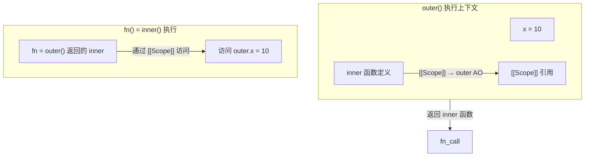
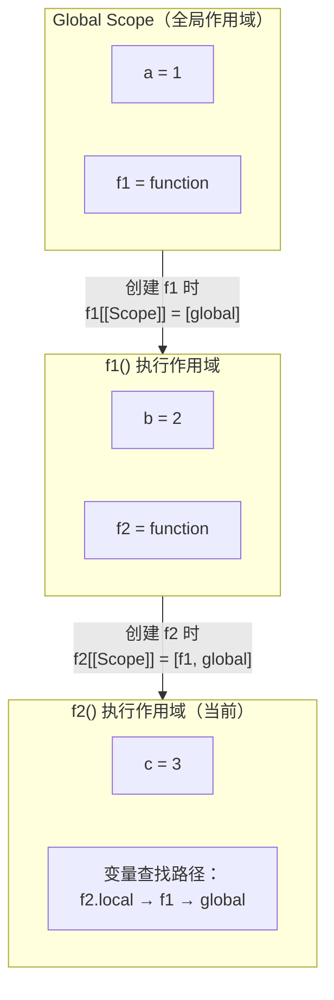

# 闭包、作用域与变量声明

## 1. 闭包

### 1.1 什么是闭包

```javascript
// 闭包：函数记住并访问其词法作用域之外的变量
function outer() {
  const x = 10;
  function inner() {
    console.log(x); // 访问outer的变量
  }
  return inner;
}
const fn = outer();
fn(); // 10
```



### 1.2 为什么能访问外层变量

```javascript
// 每个函数在创建时记录其创建位置的词法作用域（[[Scope]]）
// 无论函数在哪里执行，都能通过[[Scope]]链访问外层变量

function makeAdder(x) {
  return function(y) { return x + y; };
}
const add5 = makeAdder(5);
const add10 = makeAdder(10);
console.log(add5(2));  // 7（访问x=5）
console.log(add10(2)); // 12（访问x=10）

// 即使makeAdder已返回，其执行上下文已出栈
// add5/add10的[[Scope]]仍持有对x的引用
```

### 1.3 内存泄漏与闭包

```javascript
// 闭包导致内存泄漏的场景：
// 持有对大型对象或DOM节点的引用，但已不再需要

function leak() {
  const bigArray = new Array(1000000).fill("x");
  const handler = function() { return bigArray.length; };
  document.getElementById("btn").onclick = handler; // DOM引用
  // bigArray 无法被回收，因为 handler 引用它
}

// 解决：手动置空
function noLeak() {
  const bigArray = new Array(1000000).fill("x");
  const handler = function() { return bigArray.length; };
  document.getElementById("btn").onclick = handler;
  return function() { bigArray = null; }; // 解绑
}
```

### 1.4 应用场景

```javascript
// 1. 数据私有/模块化
const counter = (function() {
  let count = 0;
  return {
    inc: () => ++count,
    dec: () => --count,
    get: () => count
  };
})();
counter.inc();
counter.inc();
console.log(counter.get()); // 2

// 2. 函数柯里化
function currying(fn) {
  return function curried(...args) {
    if (args.length >= fn.length) {
      return fn.apply(this, args);
    }
    return function(...args2) {
      return curried.apply(this, args.concat(args2));
    };
  };
}

// 3. 防抖节流
function debounce(fn, delay) {
  let timer;
  return function(...args) {
    clearTimeout(timer);
    timer = setTimeout(() => fn.apply(this, args), delay);
  };
}

// 4. 缓存（记忆化）
function memo(fn) {
  const cache = {};
  return function(...args) {
    const key = JSON.stringify(args);
    if (cache[key] !== undefined) return cache[key];
    return cache[key] = fn.apply(this, args);
  };
}
```

## 2. 作用域与作用域链

```javascript
// 作用域链：
// 函数创建时形成 [[Scope]] 链，运行时顺着这条链查找变量

var a = 1;
function f1() {
  var b = 2;
  function f2() {
    var c = 3;
    console.log(a, b, c); // 1, 2, 3
    // 查找路径：f2 → f1 → global（scope chain）
  }
  f2();
}
f1();
```



```javascript
// var vs let/const 作用域：
// var：函数作用域，let/const：块级作用域
function test() {
  if (true) {
    var x = 10;    // 函数作用域
    let y = 20;    // 块级作用域
  }
  console.log(x); // 10（可见）
  console.log(y); // ReferenceError（块外不可见）
}
```

## 3. var / let / const

```javascript
// var特性：
// 1. 函数作用域（非块级）
// 2. 声明提升（值为undefined）
// 3. 可重复声明

// let特性：
// 1. 块级作用域
// 2. 暂时性死区（TDZ）
// 3. 不可重复声明

// const特性：
// 1. 块级作用域
// 2. 暂时性死区
// 3. 声明时必须初始化
// 4. 不能重新赋值（但引用类型内部可修改）

// 暂时性死区：
console.log(a); // undefined（var提升）
// console.log(b); // ReferenceError（TDZ）
let b = 1;

// var提升：
console.log(x); // undefined，var x在后但提升了
var x = 10;
// 等价于：
// var x; // 提升
// console.log(x);
// x = 10;

// 循环中的闭包问题：
for (var i = 0; i < 3; i++) {
  setTimeout(() => console.log(i), 100); // 3,3,3
}
// 原因：var是函数作用域，i是共享的
// 解决1：let（每次迭代有独立副本）
for (let j = 0; j < 3; j++) {
  setTimeout(() => console.log(j), 100); // 0,1,2
}
// 解决2：IIFE
for (var k = 0; k < 3; k++) {
  (function(k) {
    setTimeout(() => console.log(k), 100);
  })(k);
}

// const对象内部可改：
const obj = { name: "张三" };
obj.name = "李四"; // OK
// obj = {}; // TypeError：不能重新赋值
```

## 深入阅读与参考

!!! tip "怎么用这些资料"
    先读「官方文档与规范」建立准确的概念，再读「源码与示例」核对细节，最后用「教程、书籍与视频」换一种讲法加深理解。每条都写明了读哪一节、带着什么问题读。

### 官方文档与规范

| 资源 | 为什么读 | 怎么读 |
|---|---|---|
| [var](https://developer.mozilla.org/en-US/docs/Web/JavaScript/Reference/Statements/var) | var 的规范行为：变量提升、函数作用域、可重复声明。 | 读『描述』中提升与作用域小节，带着『为什么 var 会泄漏到循环外』去读。 |
| [let](https://developer.mozilla.org/en-US/docs/Web/JavaScript/Reference/Statements/let) | let 的块级作用域与暂时性死区，是理解作用域链的关键。 | 重点读 TDZ 与『与 var 的区别』，读后用 let 重写 id 0 的循环示例并对比输出。 |
| [const](https://developer.mozilla.org/en-US/docs/Web/JavaScript/Reference/Statements/const) | 讲清 const 绑定不可变而值可变，纠正最常见的误解。 | 读『描述』中绑定与值的区别，动手给 const 对象的属性赋值验证。 |
| [SyntaxError: missing = in const declaration](https://developer.mozilla.org/en-US/docs/Web/JavaScript/Reference/Errors/Missing_initializer_in_const) | 说明 const 必须初始化这一语法约束，补齐声明语义。 | 读错误示例，分清声明与初始化，再回看 var/let/const 三者声明差异。 |
| ['ReferenceError: assignment to undeclared variable "x"'](https://developer.mozilla.org/en-US/docs/Web/JavaScript/Reference/Errors/Undeclared_var) | 未声明即赋值会隐式创建全局变量，正中作用域陷阱。 | 读报错触发条件，在函数内不加声明地赋值，观察全局污染后改用严格模式。 |
| ['TypeError: invalid assignment to const "x"'](https://developer.mozilla.org/en-US/docs/Web/JavaScript/Reference/Errors/Invalid_const_assignment) | 解释 const 重赋值抛 TypeError，区分绑定与值两层语义。 | 对照示例找出自己代码中违规的赋值，判明该改声明为 let 还是只改属性。 |

### 教程、书籍与视频

| 资源 | 为什么读 | 怎么读 |
|---|---|---|
| [MDN 闭包](https://developer.mozilla.org/en-US/docs/Web/JavaScript/Closures) | 官方教程，闭包定义与循环陷阱讲得最透彻，示例可直接跑。 | 读『实用闭包』与『循环中的闭包』两节，先自己写出 var 循环打印 3 的例子再对照修正。 |

## 应用与行业实践

### 应用场景地图

| 场景 | 用到本页哪个知识点 | 典型技术选型 | 注意事项 |
| --- | --- | --- | --- |
| 后台管理的万行表格，虚拟滚动加行内编辑 | 循环里的 var 与 let 绑定差异、闭包捕获索引 | 原生 `addEventListener` 加事件委托、React `useCallback` | 用委托就不必给每行绑回调；用闭包就必须解绑 |
| 低端安卓机的首屏脚本加载 | 模块作用域、闭包持有大对象的时长 | ES Module、Rollup 或 Vite 打包 | 顶层闭包引用的对象不会被回收，首屏后要断开 |
| 多人协作白板，两人同画一条笔迹 | 闭包保存会话状态、const 固定不可变值 | Canvas 2D、`pointerdown` / `pointermove` | 每个会话一份闭包，不要把画笔状态挂到 window |
| 一次性营销活动页的倒计时与埋点 | 块级作用域、闭包读到当次渲染的值 | `setInterval`、`IntersectionObserver` | 页面卸载前必须 `clearInterval`，否则回调继续跑 |
| 小程序商品列表的分页加载与本地缓存 | 闭包加作用域链，控制缓存可见范围 | 页面级 `Map` 缓存、`onReachBottom` | 缓存放在页面函数作用域内，切页后自动释放 |
| Node.js 里每分钟扫过期文件的清理任务 | 块级作用域、每个任务独立状态 | `fs.promises`、`setInterval` 加 `Promise` | 任务处理器别共享外层可变变量，避免状态串场 |
| 富文本编辑器的撤销栈 | 闭包保存历史快照、作用域链长度 | 命令模式、不可变数据结构 | 快照持有 DOM 节点会让整棵树无法回收 |
| 图表看板在多个页面间来回切换 | 闭包持有 DOM 引用、清理函数 | 路由懒加载、`ResizeObserver` | 切页做清理，否则 detached 节点累积 |

### 三个场景拆解

#### 场景 1：后台管理万行表格的行内编辑

**业务背景**：表格用虚拟滚动只渲染可视区，用户点某一行就地改字段。行数按万计，滚动时绑定与解绑频繁发生。

**怎么用本页知识解决**：先判断事件是委托还是逐行绑定。逐行绑定时用 `let` 让每次迭代产生独立绑定，并把清理函数集中返回。

```js
// var 版本：循环里的回调共享同一个 i，点任意行都得到最后一行的索引
// let 版本：每次迭代新建绑定，回调各自记住自己的 i
function bindRows(rows, openEditor) {
  const offs = [];                                   // 清理函数收集在函数作用域内
  for (let i = 0; i < rows.length; i++) {
    const row = rows[i];                             // const 固定本次迭代的行引用
    const onClick = () => openEditor(i, row.dataset.id); // 闭包捕获 i 与 row
    row.addEventListener('click', onClick);
    offs.push(() => row.removeEventListener('click', onClick));
  }
  return () => offs.forEach((off) => off());          // 返回总清理函数
}
```

- `let` 在 `for` 头部声明时，每次迭代创建新的绑定，回调读到的索引与行一一对应。
- `const row` 把当次迭代的行固定下来，回调不会因为后续赋值而指向别的行。
- 把 `off` 收集进数组，调用方在滚动回收行时一次性解绑，避免监听器堆积。
- 如果改用事件委托，只需要在容器上绑一个回调，通过 `event.target` 找行，可以整段跳过此逻辑。

**怎么度量收益**：在 Chrome DevTools 的 Performance 面板录一段滚动加点击的操作，看主线程长任务数量与 JS Heap 曲线；用 Performance 面板的 Bottom-Up 视图确认点击回调耗时；用 Memory 面板拍两次堆快照，比较 `EventListener` 相关对象数量。

**什么时候不该用**：
- 表格已经用事件委托，逐行绑定与清理函数都是多余开销。
- 行数据由框架的 keyed diff 管理，手写闭包会和框架的重用逻辑冲突，索引可能对不上行。

#### 场景 2：多人协作白板的画笔状态

**业务背景**：一块画布同时显示两到三人的笔迹，切换颜色、粗细后继续画。笔迹点数随绘制时长增长，一条笔迹可能攒到上千个点。

**怎么用本页知识解决**：把每条笔迹的状态收进一个工厂函数，用闭包保存颜色与会话号，外部拿不到也改不动，只能通过返回的方法改。

```js
function createBrush(initial) {
  let color = initial.color;             // 闭包变量，外部改不到
  const sessionId = initial.sessionId;   // const：会话建立后不再变

  return {
    setColor(next) {
      color = next;                      // 只改自己闭包里的这一份
    },
    onPointerDown(ctx, point) {
      ctx.strokeStyle = color;           // 读取当前闭包值
      ctx.beginPath();
      ctx.moveTo(point.x, point.y);
      ctx.session = sessionId;           // 把会话标记交给绘图上下文
    },
    onPointerMove(ctx, point) {
      ctx.lineTo(point.x, point.y);      // 同一条笔迹复用同一个闭包
      ctx.stroke();
    },
  };
}
```

- `color` 用 `let`，因为要随调色板更新；`sessionId` 用 `const`，写错赋值会立刻报错。
- 每个参与者各调一次 `createBrush`，得到互不干扰的闭包，不必给状态加前缀防冲突。
- 返回的方法构成唯一入口，状态变更点收敛在三处，排查串色问题只需看这几个方法。
- 若要加"撤销上一笔"，在闭包里维护一个数组并暴露 `undo`，外部依旧碰不到原始数组。

**怎么度量收益**：用 Chrome DevTools 的 Performance 面板录制双人同时绘制的 10 秒片段，看每帧的脚本耗时；用 Memory 面板比较绘制前后快照里画笔对象与 canvas 相关对象的数量；用 `PerformanceObserver` 订阅 `longtask` 统计卡顿次数。

**什么时候不该用**：
- 状态需要被序列化后同步到服务端时，闭包里的变量读不到，应改为显式的状态对象。
- 需要把画笔状态交给撤销栈或时间旅行调试时，隐藏状态会挡住回放。

#### 场景 3：图表看板来回切换后的内存增长

**业务背景**：看板有多个图表页，用户来回切换查看。每次进入页面都要监听窗口尺寸变化并重建图表，长时间停留后堆占用上升。

**怎么用本页知识解决**：挂载函数返回自己的卸载函数。闭包把图表实例与回调绑在一起，卸载时同一份闭包负责解引用。

```js
function mountPanel(root, createChart) {
  const chart = createChart();                 // 体积较大的对象，被下面的回调捕获
  const onResize = () => chart.resize(window.innerWidth);
  window.addEventListener('resize', onResize);

  return function unmount() {
    window.removeEventListener('resize', onResize); // 解除引用，chart 才可被回收
    chart.destroy();
    root.textContent = '';                     // 断开 DOM 引用，避免 detached 节点堆积
  };
}
```

- `onResize` 闭包持有 `chart`，只要监听器还在，图表实例就无法被回收。
- `unmount` 与挂载逻辑共用同一个作用域，清理时拿得到原始引用，不必靠全局变量找回。
- 路由层在离开页面时调用返回的 `unmount`，把清理责任交给创建方，减少漏写。
- 多个图表共用一份容器时，让每个 `mountPanel` 管理自己的节点，卸载互不影响。

**怎么度量收益**：Chrome DevTools 的 Memory 面板拍堆快照，对比"切换 20 次后"与"首次进入后"两次结果，看 Detached 节点与图表构造函数实例数；Performance 面板看 JS Heap 曲线是否随切换次数阶梯上升；Lighthouse 复测 TBT 与主线程长任务。

**什么时候不该用**：
- 图表所在路由本来就不会卸载（单页常驻），额外返回卸载函数属于无效代码路径。
- 图表库自带 `dispose` 且在元素移除时自动触发，重复手动清理可能报错。

### 行业先进实践

把作用域问题交给静态检查（出处：ESLint 官方文档，no-loop-func 与 prefer-const 规则）
`no-loop-func` 会报告在循环中创建、且引用了循环外可变变量的函数；`prefer-const` 要求不再重新赋值的绑定用 `const`。有效原因是这两类缺陷在运行时才暴露，静态检查能在提交前挡住。你的项目可以先在新增代码目录把两条规则设为 `error`，再逐步扩到全仓。

Effect 依赖与闭包捕获（出处：React 官方文档，Synchronizing with Effects 与 Removing Effect Dependencies 章节）
文档写明每次渲染的 Effect 都捕获当次渲染的 props 与 state，因此依赖数组要覆盖闭包读取的每个值。配套的 `eslint-plugin-react-hooks` 的 exhaustive-deps 规则能做静态提示。借鉴方式是把"Effect 内读取的外部变量是否都进了依赖数组"写进 PR 模板的检查项。

CommonJS 的模块包装函数（出处：Node.js 官方文档，Modules: CommonJS modules）
文档说明每个模块文件执行前会被包进一个函数，形参包含 `exports`、`require`、`module`、`__filename`、`__dirname`。这让模块顶层变量天然落在函数作用域内，不会污染全局。借鉴方式是 Node 侧坚持一文件一模块，不在顶层往 `global` 挂东西。

用堆快照定位残留引用（出处：Chrome DevTools 官方文档，Memory 面板与 Fix memory problems 文档）
官方文档给出的流程是连续拍两次堆快照并做对比，再筛出 Detached 元素与保留路径。做法有效是因为它直接指出"谁还引用着这个对象"。借鉴方式是把"切换页面若干次后拍快照对比"写进前端性能验收步骤，作为回归项固定下来。

构建输出的块级作用域降级（出处：需核对官方文档：具体核对目标构建工具与 tsconfig 的 `target` 在旧浏览器下如何输出 `let` / `const` 与暂时性死区行为）
我无法确认各工具当前版本的输出细节，因此不写结论。你的做法是选定 `target` 后编译一个只含循环闭包的玩具文件，直接读产物。若产物把 `let` 降级成 `var`，循环闭包会退回共享绑定，此时需要在源码层改用函数工厂显式隔离每次迭代。

### 从学到用：落地路线

1. 试点：选一个含行内编辑或列表渲染的模块，把 `var` 改为 `let` / `const`，并开启 `no-var`、`prefer-const`、`no-loop-func`。验收标准：该目录 lint 零报错，模块的手动回归用例全部通过。
2. 验证：用 Chrome DevTools 的 Memory 面板做"进入页面若干次后"的堆快照对比，记录 Detached 节点数与自定义构造函数实例数。验收标准：两次快照之间这些计数不增长，或增长项能逐条给出归因。
3. 推广：把规则写进仓库根 ESLint 配置并接入 CI，同时在 PR 模板加上"闭包读取的外部变量是否被依赖数组或清理函数覆盖"。验收标准：CI 对新增代码强制执行，PR 模板包含该检查项。
4. 防回退：对定时器与事件监听要求返回清理函数，并对 `setInterval`、`addEventListener` 的新增点做评审。验收标准：主干出现 `no-var` 报错或未返回清理函数的定时器时，流水线失败。

### 动手作业

**目标**：写一个可挂载、可卸载的计数器卡片模块，用它验证闭包捕获、块级作用域与清理函数的配合。

**步骤**：
1. 建 `index.html` 与 `app.js`，用 `<script type="module">` 引入，确认代码处在模块作用域而不是全局。
2. 实现 `createCounter(initial)`，内部用 `let` 保存 `count`，返回 `increment`、`decrement`、`getCount` 三个方法。
3. 实现 `mountCounter(root, counter)`，用 `const` 保存 DOM 引用，绑定点击监听，并启动一个 `setInterval` 每秒刷新运行时长文本。
4. 让 `mountCounter` 返回 `unmount()`，内部清除定时器、解绑监听、清空 `root`。
5. 在循环里创建 3 个计数器，挂载后立刻卸载第一个，观察它的运行时长是否停止刷新。
6. 用 Chrome DevTools 的 Memory 面板拍两次堆快照：挂载 3 个之后、全部卸载之后，比较计数器相关对象数量。
7. 用 `no-var`、`prefer-const`、`no-loop-func` 三条规则跑一遍代码。

**验收标准**：
- 卸载后调用 `getCount()` 仍返回卸载前的值，说明闭包保住了状态。
- 卸载后控制台不再出现该卡片的运行时长刷新，说明定时器被清除。
- 连续挂载卸载 20 次后，堆快照里该模块的自定义对象数量不随次数增长。
- 循环里创建的回调读到的索引与各自计数器一致，不会全部指向最后一个。
- 三条 ESLint 规则对本次代码零报错。

