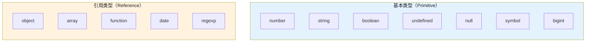
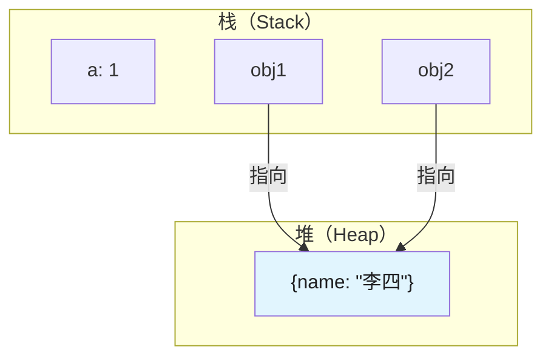
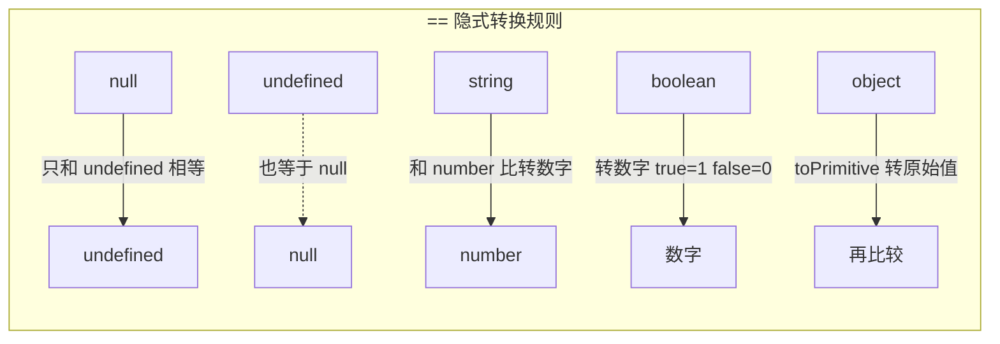

# 数据类型与类型转换

## 1. 数据类型

### 1.1 七种基本类型 vs 引用类型

JavaScript 共9种数据类型，分为两大类：



**typeof 判断方法：**

| 值 | typeof 结果 |
|---|---|
| `123` | `number` |
| `"hello"` | `string` |
| `true` | `boolean` |
| `undefined` | `undefined` |
| `null` | `object` |
| `Symbol('id')` | `symbol` |
| `123n` | `bigint` |
| `{}` | `object` |
| `[]` | `object` |
| `function(){}` | `function` |


存储方式区别：

```javascript
// 基本类型：栈Stack，存值
let a = 1;
let b = a;    // b是副本
b = 2;
console.log(a); // 1，原值不变

// 引用类型：栈存指针，堆Heap存值
let obj1 = { name: "张三" };
let obj2 = obj1;    // obj2和obj1指向同一堆地址
obj2.name = "李四";
console.log(obj1.name); // "李四"，原对象被修改
```



### 1.2 null vs undefined

```javascript
// undefined：已声明但未赋值
let a;
console.log(a); // undefined

// null：主动赋值为"无"
let b = null;
console.log(b); // null

// 场景区别：
// 1. 函数参数未传
function fn(x) { console.log(x); }
fn();          // undefined

// 2. 对象属性不存在
let obj = {};
console.log(obj.name); // undefined

// 3. 函数没有返回值
function noReturn() {}
console.log(noReturn()); // undefined

// 4. 显式空值（通常用null）
let empty = null;  // 明确表示"这里没有值"
```

### 1.3 typeof null 为什么是 "object"

这是 JavaScript 历史悠久的 bug，源于 JS 早期的类型系统：

```javascript
// 0在机器码中代表"全为零"，null的32位全0被错误地判断为对象
// 内部实现（简化）：
// if (value is 0x00000000) return "object";  // bug

// 正确判断null的方法：
console.log(null === null); // true
console.log(Object.prototype.toString.call(null)); // "[object Null]"
console.log(Array.isArray(null)); // false
```

## 2. 运算符与比较

### 2.1 == vs ===

```javascript
// ==：宽松相等，隐式类型转换
console.log(1 == "1");      // true，字符串转数字
console.log(true == 1);     // true，boolean转数字
console.log(null == undefined); // true
console.log(0 == false);    // true

// ===：严格相等，不转换类型
console.log(1 === "1");     // false，类型不同
console.log(true === 1);    // false

// 实际建议：始终使用 ===
```



### 2.2 Object.is vs ===

```javascript
// Object.is 判断更精确
console.log(Object.is(NaN, NaN));       // true（=== 为 false）
console.log(Object.is(+0, -0));        // false（=== 为 true）
console.log(Object.is({}, {}));        // false（引用不同）)

// Object.is 内部实现：
function is(x, y) {
  if (x === y) {
    // 区分 +0 和 -0
    return x !== 0 || 1 / x === 1 / y;
  }
  // 区分 NaN 和 非NaN
  return x !== x && y !== y; // 只有 NaN 满足 x !== x
}
```

## 3. 数据类型转换

### 3.1 ToPrimitive 规则

ToPrimitive 是 JS 内部用于将对象转为原始值的算法：

```javascript
// ToPrimitive(obj, preferredType)
// 1. 如果是原始类型，直接返回
// 2. 调用 valueOf()，如果返回原始类型就返回
// 3. 调用 toString()，如果返回原始类型就返回
// 4. 抛出 TypeError

const obj = {
  valueOf() { return 42; },
  toString() { return "hello"; }
};
console.log(obj + 1); // 43，优先调用 valueOf

// [] + [] = ""：两边都转成字符串再拼接
// [] + {} = "[object Object]"：数组先转字符串
// {} + [] = 0：{}被当成语句，+[]转为0
```

### 3.2 隐式转换规则

```javascript
// 加法：有一边是字符串就拼接，否则转数字
console.log(1 + "2");   // "12"
console.log(1 + 2);    // 3
console.log(true + 1); // 2

// 减/乘/除：转数字
console.log("5" - 2);  // 3
console.log("5" * 2);  // 10

// 比较：转数字或字符串
console.log("10" > 9); // true

// 逻辑运算：转boolean
console.log(!0);       // true
console.log(!"");      // true
console.log(!!null);   // false
```

## 4. Symbol 与 BigInt

### 4.1 Symbol 作用

```javascript
// Symbol：创建唯一值
const s1 = Symbol("desc");
const s2 = Symbol("desc");
console.log(s1 === s2); // false

// 应用场景1：对象属性名（避免冲突）
const obj = {
  [Symbol.iterator]: function* () {},
  [Symbol.toStringTag]: "MyObj"
};

// 应用场景2：模拟私有属性（约定，非真正私有）
const _private = Symbol("private");
const user = {
  name: "张三",
  [_private]: "内部数据"  // 外部无法直接访问
};

// 应用场景3：消除魔法字符串
const STATUS = {
  PENDING: Symbol("pending"),
  FULFILLED: Symbol("fulfilled")
};

// 应用场景4：全局Symbol注册
const globalSym = Symbol.for("app.key"); // 全局唯一
const same = Symbol.for("app.key");
console.log(globalSym === same); // true

// 获取Symbol描述
console.log(s1.description); // "desc"
```

### 4.2 BigInt

```javascript
// BigInt：处理大整数（number最大安全整数 2^53-1）
const big = 9007199254740993n;
console.log(big + 1n); // 9007199254740994n

// 不能和number混用运算
// big + 1; // 报错
big + BigInt(1); // OK

// 使用场景：时间戳（毫秒级）、ID计算、加密
const timestamp = 1715000000000n; // 超过Number.MAX_SAFE_INTEGER
```

### 4.3 0.1 + 0.2 !== 0.3

```javascript
// 浮点数精度问题：IEEE 754二进制浮点
console.log(0.1 + 0.2); // 0.30000000000000004

// 原因：
// 0.1 → 0.000110011001100110...（二进制无限循环）
// 0.2 → 0.001100110011001100...（二进制无限循环）
// IEEE 754截断后产生微小误差

// 解决方案：
// 1. toFixed（注意返回字符串）
console.log((0.1 + 0.2).toFixed(2)); // "0.30"

// 2. 转为整数运算（推荐）
function add(a, b, precision = 2) {
  const p = Math.pow(10, precision);
  return (a * p + b * p) / p;
}
console.log(add(0.1, 0.2)); // 0.3

// 3. ES2021 BigDecimal 或 decimal.js 库
// import Decimal from 'decimal.js';
// new Decimal(0.1).plus(0.2).toNumber(); // 0.3

// 4. 使用epsilon比较
function isEqual(a, b, epsilon = 1e-10) {
  return Math.abs(a - b) < epsilon;
}
console.log(isEqual(0.1 + 0.2, 0.3)); // true
```

## 深入阅读与参考

!!! tip "怎么用这些资料"
    先读「官方文档与规范」建立准确的概念，再读「源码与示例」核对细节，最后用「教程、书籍与视频」换一种讲法加深理解。每条都写明了读哪一节、带着什么问题读。

### 官方文档与规范

| 资源 | 为什么读 | 怎么读 |
|---|---|---|
| [Symbol](https://developer.mozilla.org/en-US/docs/Web/JavaScript/Reference/Global_Objects/Symbol) | Symbol 类型总览：唯一性、不可枚举、可作属性键的语义都在这。 | 读类型与描述部分，弄清不能用 new、typeof 为 symbol；再跑一遍示例。 |
| [Symbol() constructor](https://developer.mozilla.org/en-US/docs/Web/JavaScript/Reference/Global_Objects/Symbol/Symbol) | 说明 Symbol() 只能当函数调用，参数仅作描述。 | 对比普通构造函数写法，验证两次 Symbol('a') 不相等，再当属性键试用。 |
| [Symbol.prototype.description](https://developer.mozilla.org/en-US/docs/Web/JavaScript/Reference/Global_Objects/Symbol/description) | 取符号描述文本的标准方式，避免解析 toString 输出。 | 读示例区分 description 与 toString()；给自定义 Symbol 打印描述。 |
| [Symbol.for()](https://developer.mozilla.org/en-US/docs/Web/JavaScript/Reference/Global_Objects/Symbol/for) | 全局注册表：跨模块共享同名 Symbol 的唯一途径。 | 读共享与跨 realm 注意事项，用 for 注册后比较两次返回值。 |
| [Symbol.keyFor()](https://developer.mozilla.org/en-US/docs/Web/JavaScript/Reference/Global_Objects/Symbol/keyFor) | 配合 Symbol.for 反查全局键，理解注册表语义。 | 读示例，验证普通 Symbol 返回 undefined、全局 Symbol 返回键名。 |
| [Symbol.hasInstance](https://developer.mozilla.org/en-US/docs/Web/JavaScript/Reference/Global_Objects/Symbol/hasInstance) | instanceof 运算符背后的钩子，连接运算符与类型判断。 | 读示例后重写 Symbol.hasInstance，观察 instanceof 结果如何变化。 |
| [BigInt](https://developer.mozilla.org/en-US/docs/Web/JavaScript/Reference/Global_Objects/BigInt) | BigInt 总览：字面量语法、与 Number 的边界及互操作限制。 | 读描述与运算符限制，亲手触发 1n + 1 报错并记录原因。 |
| [BigInt() constructor](https://developer.mozilla.org/en-US/docs/Web/JavaScript/Reference/Global_Objects/BigInt/BigInt) | BigInt() 转换规则：哪些值能转、哪些会抛错。 | 读转换表与示例，分别用字符串、Number、布尔值调用 BigInt() 试转。 |
| [BigInt.prototype.toString()](https://developer.mozilla.org/en-US/docs/Web/JavaScript/Reference/Global_Objects/BigInt/toString) | 数值转字符串，含进制参数，可与 Number 行为对照。 | 读参数说明，用 2 与 16 进制输出同一 BigInt，对照 Number 结果。 |
| [BigInt.asIntN()](https://developer.mozilla.org/en-US/docs/Web/JavaScript/Reference/Global_Objects/BigInt/asIntN) | asIntN 演示按位宽环绕，解释 BigInt 位运算溢出。 | 读示例并传入超范围值观察截断结果，思考为何需要定宽语义。 |
| [BigInt.asUintN()](https://developer.mozilla.org/en-US/docs/Web/JavaScript/Reference/Global_Objects/BigInt/asUintN) | 与 asIntN 互补的无符号截断，理解定宽大整数语义。 | 对同一负数分别调用 asIntN 和 asUintN，记录两者输出差异。 |

### 源码与示例

| 资源 | 为什么读 | 怎么读 |
|---|---|---|
| [Symbol.iterator](https://developer.mozilla.org/en-US/docs/Web/JavaScript/Reference/Global_Objects/Symbol/iterator) | 迭代协议最典型示例，看 Symbol 如何驱动 for...of。 | 读示例与内置可迭代对象列表，自己写可迭代对象并用 for...of 验证。 |

## 应用与行业实践

本章把前几节的概念放进真实工程场景：哪些字段会踩类型坑，业界用什么工具把坑挡住。

### 应用场景地图

| 场景 | 用到本页哪个知识点 | 典型技术选型 | 注意事项 |
| --- | --- | --- | --- |
| 后台管理的万行订单表格 | 对象引用比较、`===`、`Map` 键 | React + 虚拟滚动（TanStack Virtual） | 每次渲染新建的行对象引用不同，`===` 判断失效 |
| 低端安卓机的首屏渲染 | 原始类型与包装对象、字符串转换 | 原生 ES 模块 + 打包器 | 循环里用 `+` 拼字符串会生成中间字符串 |
| 多人协作白板的图元标识 | `Symbol` 唯一键、对象引用身份 | 协同库（Yjs） | `Symbol` 键不会被 `JSON.stringify` 写入 |
| 跨境订单的金额结算 | `Number` 安全整数、浮点误差 | 整数分 + 后端 Decimal 字段 | 累加前先统一成最小货币单位的整数 |
| 埋点上报的雪花订单号 | 超过 `2^53-1` 的整数、`BigInt` | 后端返回字符串 ID | `JSON.stringify` 遇到 `BigInt` 抛 `TypeError` |
| 搜索框的关键字过滤 | `truthy` 与 `falsy`、字符串转换 | 本地过滤 + 防抖 | `'0'` 为 `true`，`0` 为 `false` |
| 前端请求去重与缓存 | `Map` 与 `Set` 的键比较、`NaN` | `Map` 缓存 Promise | 对象键按引用比较，需先序列化成字符串 |
| 本地存储的读写 | 序列化会丢失类型 | `localStorage` + 数据结构版本号 | `undefined`、`Symbol`、`BigInt` 无法原样往返 |

### 三个场景拆解

#### 场景 1：多人协作白板的图元标识

**业务背景**：白板在同一房间内允许多人同时拖动图元，图元数量从几十涨到几千。每次增量同步都要判断这个图元是不是当前选中的那个，判断出错会出现选中态漂移。

**怎么用本页知识解决**：把图元对象的引用当作身份，用 `Map` 存它的状态；内部字段用 `Symbol` 键，避免和外部传入的属性名撞车。

```js
// 图元对象本身作为 Map 的键，引用即身份
const state = new Map();

// 内部标识用 Symbol 键，外部传入的属性名不会覆盖它
const INTERNAL_ID = Symbol('internalId');

function createRect(x, y) {
  const rect = { x, y };
  rect[INTERNAL_ID] = crypto.randomUUID(); // 唯一标识，不出现在 JSON 里
  state.set(rect, { selected: false });
  return rect;
}

const a = createRect(10, 20);
const b = createRect(10, 20);

console.log(a === b);                           // false：内容相同，引用不同
console.log(state.has(a));                      // true：Map 按引用查找
console.log(a[INTERNAL_ID] === b[INTERNAL_ID]); // false：标识互不相同
```

- `a === b` 为 `false`：对象比较的是引用，属性值相同不代表相等。
- `state.has(a)` 为 `true`：`Map` 的键用 `SameValueZero` 比较，对象键按引用命中。
- `Symbol` 键不参与 `JSON.stringify`，同步协议里要显式带上 `a[INTERNAL_ID]`。
- 不要用字符串 `id` 字段代替引用比较：两个图元的 `id` 若被复用会被误判成同一个。
- 每次重连后要按 `INTERNAL_ID` 重建 `Map`，旧引用在新会话里查不到。

**怎么度量收益**：统计选中态出错的次数，从协同房间的操作日志里筛出"选中图元与实际被拖动图元不一致"的记录。重连重建的耗时用 `performance.mark` 与 `performance.measure` 包住重建 `Map` 的循环。内存占用用 Chrome DevTools 的 Memory 面板拍堆快照，看销毁的图元是否被回收。

**什么时候不该用**：图元要写进 `localStorage` 或发给服务端时，`Symbol` 键会被 `JSON.stringify` 忽略，必须换成字符串字段。要传给 Web Worker 时，结构化克隆会丢掉 `Symbol` 键，传输前要转成普通属性。需要按内容去重（同位置同尺寸只留一个）时，引用比较不起作用，要先算内容哈希。

#### 场景 2：跨境结算的金额与订单号

**业务背景**：一个订单包含多件商品和一次汇率换算，金额要在前后端之间往返校验。订单号由后端生成，位数超过 `Number` 能精确表示的范围。

**怎么用本页知识解决**：金额统一用最小货币单位的整数参与运算，只在展示时做一次除法；订单号用字符串或 `BigInt` 接收。

```js
// 金额用整数分参与运算，乘法不引入小数误差
const unitPriceCents = 1999;  // 19.99 元
const quantity = 3;
const totalCents = unitPriceCents * quantity; // 5997

// 只在展示这一步做除法
const display = (totalCents / 100).toFixed(2); // '59.97'

// 订单号超过 2^53-1，用 BigInt 接收
const orderId = 1234567890123456789n;
console.log(orderId > Number.MAX_SAFE_INTEGER); // true

// JSON.stringify 不能直接处理 BigInt，出参先转字符串
const payload = { orderId: orderId.toString(), totalCents };
console.log(JSON.stringify(payload));
```

- `0.1 + 0.2 !== 0.3`：`Number` 是双精度浮点，小数运算存在舍入误差。
- `Number.MAX_SAFE_INTEGER` 是 `2^53 - 1`，超过它的整数在比较和自增时会丢位。
- `JSON.stringify(1n)` 抛 `TypeError`，接口出参里的 `BigInt` 必须先 `toString()`。
- `JSON.parse` 会把响应里的数字先转成 `Number`，超长整数在解析阶段就已丢精度，需让后端返回字符串。
- `BigInt` 只支持整数运算，除法结果向零截断，金额分摊要事先定好舍入规则。

**怎么度量收益**：对账差异用接口返回的订单总额与本地 `totalCents` 做断言，统计不等的条数。金额计算的单元测试用 Vitest 或 Jest 写表驱动用例，覆盖 `0.1 + 0.2`、`1.005` 乘以 100 再取整这类输入。接口层的 `Number.isSafeInteger` 断言失败时上报字段名与原始值，按天统计命中次数。

**什么时候不该用**：涉及开方、对数的计算不能换成 `BigInt`，它只支持整数运算。后端坚持用 JSON number 返回超长 ID 时，前端在 `JSON.parse` 之后再换 `BigInt` 已经无效，只能推动后端改成字符串。只用于展示、不参与累加的牌价可以直接用 `Number` 加 `toFixed`，再套一层整数分换算会多出一次来回。

#### 场景 3：后台万行表格的排序与筛选

**业务背景**：运营后台的订单列表一次加载几千行，列头排序与金额筛选都在前端完成。接口里部分字段是字符串形式的数字，来自 CSV 导入的历史数据。

**怎么用本页知识解决**：比较前显式转成数字，筛选时用 `!== ''` 判断空关键字，不依赖隐式转换。

```js
const rows = [
  { id: 1, amount: '100' },
  { id: 2, amount: 99 },
  { id: 3, amount: '20' },
];

// 显式转数字，比较函数返回负数、0 或正数
const sorted = [...rows].sort((a, b) => Number(a.amount) - Number(b.amount));
console.log(sorted.map((r) => r.id)); // [3, 2, 1]

// 比较函数返回布尔值，会被当成 0 或 1，顺序不可靠
const bad = [...rows].sort((a, b) => a.amount > b.amount);

// 输入框的 value 永远是字符串，'0' 是 truthy
const keyword = document.querySelector('#amount').value;
const hasKeyword = keyword !== ''; // 显式判断，不依赖 truthy
const shown = sorted.filter((r) => !hasKeyword || String(r.amount).includes(keyword));
console.log(shown.length, bad.length);
```

- `'100'` 与 `'20'` 直接比较走字符串字典序，`'100' < '20'` 为 `true`，与数值顺序相反。
- `sort` 的比较函数要求返回数值，返回布尔值时 `true` 被视为 1，排序结果不可靠。
- 输入框的 `value` 是字符串，`'0'` 为 `true`，`0` 为 `false`，空判断要写 `!== ''`。
- `String(r.amount).includes(keyword)` 先转字符串再匹配，数字行也能命中。
- `[...rows]` 复制数组后再排序，避免改动 React 状态里的原数组。

**怎么度量收益**：排序正确性用表驱动测试覆盖字符串与数字混排的输入，断言输出顺序。耗时用 `performance.mark` 在 `sort` 前后打点，`performance.measure` 读取时长，在 Chrome DevTools 的 Performance 面板核对主线程阻塞。静态检查用 ESLint 的 `eqeqeq` 与 `no-implicit-coercion`，统计命中的告警数。

**什么时候不该用**：数据量只有几十行、排序只在点击表头时触发一次，不必引入 Web Worker 或索引结构。后端已保证字段是 `number` 且不需要展示千分位时，不要再包一层转换函数，否则同一字段会出现两种类型定义。需要保留 CSV 原始文本用于导出时，不要在 `rows` 上就地改写，转换只放在比较函数里。

### 行业先进实践

序列化边界统一转字符串（出处：MDN Web Docs《JSON.stringify》）
该文档写明 `BigInt` 会抛 `TypeError`，`undefined` 与函数作为对象属性时被跳过。把出参里的大整数与 ID 先转成字符串，序列化流程就不会中断。可以在接口层写一个 `toJSONSafe` 函数统一处理。

TypeScript 的 `strict` 编译选项（出处：TypeScript 官方文档 tsconfig 参考）
打开 `strict` 会同时启用 `strictNullChecks`、`noImplicitAny` 等选项，`undefined` 与 `null` 进入类型检查。编译期报错早于运行时崩溃。新项目直接开启，老项目按目录逐步开启。

ESLint 的 `eqeqeq` 与 `no-implicit-coercion` 规则（出处：ESLint 官方文档规则索引）
`eqeqeq` 要求使用 `===`，`no-implicit-coercion` 报告 `!!x`、`+x`、`'' + x` 这类写法。两条规则把隐式转换从评审争论变成可自动修复的告警。先设为 `warn` 统计存量，清零后再改 `error`。

在接口校验层使用安全整数断言（出处：MDN Web Docs《Number.MAX_SAFE_INTEGER》）
文档给出安全整数范围是 `-(2^53 - 1)` 到 `2^53 - 1`。解析响应后对 ID 字段做 `Number.isSafeInteger` 断言，能在测试阶段发现后端改了 ID 生成规则。断言失败时记录字段名与原始值。

用 `Symbol` 标记不参与序列化的内部字段（出处：MDN Web Docs《Symbol》）
文档说明 `Symbol` 值唯一，且 `Symbol` 键不出现在 `JSON.stringify` 与 `Object.keys` 的结果里。适合标记不希望被外部覆盖的内部状态。跨进程传输前要显式转成字符串属性。

### 从学到用：落地路线

第一步试点：先只在接口响应适配层引入显式类型转换，其他目录不动。验收标准：该目录 `eqeqeq` 告警降到 0，新增单测覆盖 `undefined`、`null`、`'0'`、`0` 四种入参。

第二步验证：给这批转换函数补表驱动单测，跑通后对比改造前后的接口错误上报条数。验收标准：单测在 CI 全绿，连续两周的 `TypeError` 上报条数不高于改造前。

第三步推广：把同一套规则写进仓库的 ESLint 配置与评审清单，按目录开启 `strict`。验收标准：新增文件必须通过 `strict` 与 `eqeqeq`，`git log` 能查到规则加入的提交。

第四步防止回退：把类型检查与 lint 设为 CI 必须通过的步骤，接口层保留边界断言。验收标准：故意提交一处 `==` 比较会让 CI 失败，断言命中时有日志可查。

### 动手作业

目标：写一个把接口响应转成安全类型的适配层，并用测试覆盖边界输入。

步骤：

1. 造一份含 6 条记录的 JSON，里面放入 `'100'` 字符串金额、缺失字段、`null` 字段、超过 `2^53-1` 的订单号、`NaN`。
2. 写 `parseOrder(raw)`，把金额转成整数分，把订单号转成字符串，缺失字段填默认值。
3. 在 `parseOrder` 里用 `Number.isSafeInteger` 检查金额，失败时抛带字段名的 `TypeError`。
4. 写 `sortByAmount(list)`，比较函数显式转数字并返回数值。
5. 写 `filterByAmount(list, keyword)`，用 `!== ''` 判断空关键字，覆盖 `'0'` 输入。
6. 用 Vitest 或 Jest 写表驱动测试，输入里同时包含字符串与数字。
7. 在 CI 配置里加上 `eqeqeq` 规则，跑一次全量 lint。

验收标准：

- 6 条记录的金额都能还原成预期整数分，测试断言全部通过。
- 超长订单号解析后与原始字符串逐字符相等。
- 关键字为 `'0'` 时返回结果非空，关键字为 `''` 时返回全部记录。
- lint 阶段 `eqeqeq` 无告警。
- 适配层不修改入参对象，测试里对入参做一次深比较验证。

