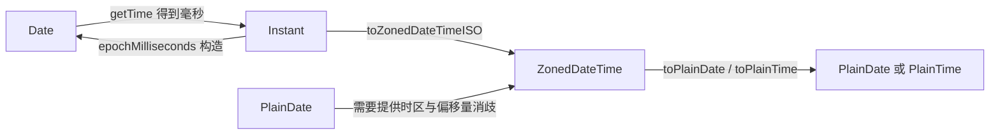

# Date 的陷阱与 Temporal API

!!! abstract "核心结论"
    - `Date` 是"毫秒时间戳 + 本地/UTC 两套取值器"的可变对象，它无法表达"某时区的墙上时间"这个概念，因此所有跨时区、跨 DST、日历运算都只能靠外部约定，容易出错。
    - `Date` 的解析规则分裂：date-only 形式按 UTC 解析，date-time 无偏移量形式按本地时间解析，非标准字符串完全由实现决定，服务端与浏览器可能不一致。
    - Temporal 用类型区分了"时间轴上的点"（`Instant`）、"带时区的时刻"（`ZonedDateTime`）、"墙上时间"（`PlainDate`/`PlainDateTime`/`PlainTime`）、"时长"（`Duration`）与"日历标识"（calendar id 字符串），从 API 层面消除了歧义。
    - 日历运算必须固定参考点：`Duration` 的 year/month 只有在给定 `relativeTo` 时才能折算成天，这是"一个月有几天"由日历决定这一事实的必然结果。
    - 迁移策略：新代码按 Temporal 语义建模，旧浏览器用 polyfill（`@js-temporal/polyfill` 等）兜底；具体浏览器支持范围与 polyfill 版本需核对官方文档。

## 1. Date 的设计缺陷与底层原理

### 1.1 规范层面：Date 只是 Time Value 的包装

ECMAScript 规范用抽象操作 `TimeClip` 定义 Date 的值域：

- Time Value 是一个**整数**毫秒数，`TimeClip(time)` 先做 `ToIntegerOrInfinity`（截断小数、朝零取整），再检查 `|time| <= 8.64e15`，超出则返回 `NaN`。
- `8.64e15` ms = `1e8` 天 ≈ ±273,790 年（相对 1970-01-01）。这个上限来自"天 × 毫秒/天"的整数约束，而不是精度约束。
- 所有 `getter/setter` 都经过 `MakeDay` / `MakeTime` / `MakeDate` 这组抽象操作；`new Date(y, m, d, h, mi, s, ms)` 的"进位"（例如 2 月 30 日变成 3 月 1 日）就是 `MakeDay` 对天数做的归一化。
- `getMonth()`、`getDay()` 的返回值直接来自 `MakeDay` 的中间量，所以 `month` 是 0 基、`day` 是 0 = 周日，这是历史包袱而非设计。

### 1.2 可变性与共享引用

`Date` 的 `set*` 方法就地修改 `[[DateValue]]`。这在 React/Vue 的状态管理、`Map`/`Set` 的键、memo 缓存中会造成静默错误，因为"对象引用没变但值变了"。

### 1.3 时间区与夏令时：Date 只有两个时区

规范把 `LocalTime` / `UTC` 定义为依赖宿主环境（host）的操作，宿主提供 tzdata。由此产生三类问题：

- `Date` 只支持"本机时区"和"UTC"，无法表示"Asia/Shanghai 的 09:00"。
- 本地时间可能出现"不存在"（DST 春季前跳）与"重复"（DST 秋季回拨）。自 ES2021 起规范对 `LocalTime` 的歧义做了明确约定：不存在的时间与重复的时间都按**转换前生效的偏移量**解释（该结论建议核对官方规范文本，各实现的历史版本可能略有差异）。
- `getTimezoneOffset()` 返回的是 `UTC - 本地`，单位为分钟，所以东八区返回 `-480`，符号方向与直觉相反。

### 1.4 字符串解析：实现定义 + UTC/Local 分裂

| 输入 | 解析结果 | 依据 |
|---|---|---|
| `"2024-01-01"` | UTC 的 2024-01-01T00:00:00Z | date-only 形式按 UTC |
| `"2024-01-01T00:00:00"` | 本地时间的 2024-01-01 00:00:00 | date-time 无偏移量按本地时间 |
| `"2024-01-01T00:00:00Z"` / `"+08:00"` | 明确的 UTC 时刻 | 带偏移量 |
| `"2024-01-01T00:00:00+08:00[Asia/Shanghai]"` | `Date` 会忽略方括号注解（Temporal 会识别） | `Date` 不支持 tz 注解 |
| `"2024-13-01"` | `Invalid Date`（月份越界，所有引擎一致） | 规范要求字段越界即无效 |
| `"2024-02-30"` | 规范要求 `Invalid Date`；V8 实测会顺延成 3 月 1 日，各引擎行为不一致，不能依赖 | 引擎对日期越界的宽容程度不同，需在目标引擎实测 |
| `"2024/01/01"`、`"01/02/2024"` | 实现定义，可能因引擎而异 | 规范只要求支持 Date Time String Format |

下面这段代码可直接运行，用于确认上表的四类行为：

```js
// date-parse.mjs
// 运行环境: Node.js >= 18（ESM）
import assert from 'node:assert/strict';

// 1) date-only 按 UTC 解析
assert.equal(new Date('2024-01-01').toISOString(), '2024-01-01T00:00:00.000Z');

// 2) date-time 无偏移量按本地时间解析（断言与运行机器的时区无关）
const localDT = new Date('2024-01-01T00:00:00');
assert.equal(localDT.getFullYear(), 2024);
assert.equal(localDT.getMonth(), 0);      // 0 基：0 === 一月
assert.equal(localDT.getDate(), 1);
assert.equal(localDT.getHours(), 0);

// 3) ISO 形式字段越界 -> Invalid Date；本地构造 -> 进位
assert.ok(Number.isNaN(new Date('2024-13-01').getTime())); // 月份越界：所有引擎都得到 Invalid Date
// 注意：new Date('2024-02-30') 在 V8 中会顺延为 3 月 1 日而非 Invalid Date（规范与实现不一致），不要用它做校验
// 2023-02-29 同样是日期越界，V8 会顺延为 3 月 1 日；这里改为断言这一实测事实，而不是规范文本
assert.equal(new Date('2023-02-29').toISOString(), '2023-03-01T00:00:00.000Z'); // 仅限 V8，其他引擎可能是 Invalid Date
assert.equal(new Date('2024-02-29').toISOString(), '2024-02-29T00:00:00.000Z');
const carried = new Date(2024, 1, 30);    // 1 === 二月
assert.equal(carried.getMonth(), 2);      // 进位到三月
assert.equal(carried.getDate(), 1);

// 4) 两位年份会被映射到 1900 + year
assert.equal(new Date(99, 0, 1).getFullYear(), 1999);
assert.equal(new Date(100, 0, 1).getFullYear(), 100);

// 5) 可变性：同一个对象被"别名"共享时会被就地改写
const shared = { at: new Date('2024-01-01T00:00:00Z') };
const alias = shared.at;
alias.setUTCFullYear(2030);
assert.equal(shared.at.getUTCFullYear(), 2030);

// 6) 精度与整数化：TimeClip 截断小数毫秒
assert.equal(new Date(1.9).getTime(), 1);
assert.ok(Number.isNaN(new Date(NaN).getTime()));
assert.throws(() => new Date(NaN).toISOString(), RangeError);

// 7) 构造参数陷阱：不传 / 传 undefined / 传 null
assert.ok(Number.isNaN(new Date(undefined).getTime())); // 参数为 undefined -> Invalid Date
assert.equal(new Date(null).getTime(), 0);              // null 被转成数字 0 -> 1970-01-01Z

console.log('date-parse.mjs: 全部断言通过');
```

**验证标准**：运行 `node date-parse.mjs`，预期输出 `date-parse.mjs: 全部断言通过`；任一断言失败会由 `node:assert/strict` 抛出 `AssertionError`。

## 2. 时间戳、时区、UTC 与夏令时的正确建模

### 2.1 四个必须分开的概念

| 概念 | 含义 | Date 能否表达 | Temporal 对应类型 |
|---|---|---|---|
| 时刻（Instant） | 时间轴上的一个点，全球唯一 | 能（毫秒时间戳） | `Temporal.Instant` |
| 带时区的时刻 | 时刻 + 时区规则，可得到墙上时间与偏移量 | 不能 | `Temporal.ZonedDateTime` |
| 墙上时间 | 日历/时钟读数，不带时区 | 不能（只能借用本地时区） | `Temporal.PlainDate` / `PlainDateTime` / `PlainTime` / `PlainYearMonth` / `PlainMonthDay` |
| 时长 | 两个时刻或两个墙上时间之差 | 不能（只有毫秒差） | `Temporal.Duration` |

关键推论：**只有 Instant 之间的差才是"绝对时长"**。"加一天"在带时区模型里是日历运算（可能是 23/24/25 小时），在 Instant 上是精确的 86400 秒。



### 2.2 在旧运行时里取得任意时区偏移（完整实现）

不依赖 Temporal 也能做跨时区计算，做法是用 `Intl.DateTimeFormat` 把某个时刻"渲染"成目标时区的字段，再反算偏移量。注意 `hourCycle: 'h23'`，否则某些 ICU 版本会把午夜输出成 `24`。

```js
// zone-offset.mjs
// 运行环境: Node.js >= 18（ESM，需要完整 ICU / tzdata，Node 13+ 默认包含）
import assert from 'node:assert/strict';

const PARTS_OPTIONS = {
  hourCycle: 'h23',        // 避免 "24:00" 的出现
  year: 'numeric', month: '2-digit', day: '2-digit',
  hour: '2-digit', minute: '2-digit', second: '2-digit',
};

function partsInZone(dateOrMs, timeZone) {
  const date = typeof dateOrMs === 'number' ? new Date(dateOrMs) : dateOrMs;
  const dtf = new Intl.DateTimeFormat('en-US', { timeZone, ...PARTS_OPTIONS });
  const out = {};
  for (const { type, value } of dtf.formatToParts(date)) out[type] = value;
  return out;
}

// 返回 UTC - 目标时区 的分钟数取反，即"东为正"的偏移量（与 Date.getTimezoneOffset 相反）
function offsetMinutes(dateOrMs, timeZone) {
  const date = typeof dateOrMs === 'number' ? new Date(dateOrMs) : dateOrMs;
  const p = partsInZone(date, timeZone);
  // 把目标时区的字段当成 UTC 字段拼回去，得到"墙上时间的伪 UTC 时间戳"
  const wallAsUTC = Date.UTC(
    Number(p.year), Number(p.month) - 1, Number(p.day),
    Number(p.hour), Number(p.minute), Number(p.second),
  );
  // 两者相差的秒数，只保留到秒（因为 parts 只到秒）
  const instantSeconds = Math.floor(date.getTime() / 1000) * 1000;
  return Math.round((wallAsUTC - instantSeconds) / 60000);
}

// 把某个时刻按指定时区渲染成稳定格式（不依赖 locale 的排版差异）
function formatInZone(dateOrMs, timeZone) {
  const p = partsInZone(dateOrMs, timeZone);
  return `${p.year}-${p.month}-${p.day} ${p.hour}:${p.minute}:${p.second}`;
}

// ---------- 验证标准 ----------
// 夏令时切换点：2024-03-10 纽约从 EST(-05:00) 跳到 EDT(-04:00)
assert.equal(offsetMinutes(Date.parse('2024-03-10T06:59:59.999Z'), 'America/New_York'), -300);
assert.equal(offsetMinutes(Date.parse('2024-03-10T07:00:00.000Z'), 'America/New_York'), -240);
// 中国自 1991 年后不再使用夏令时，全年 +08:00
assert.equal(offsetMinutes(Date.parse('2024-07-01T00:00:00Z'), 'Asia/Shanghai'), 480);
assert.equal(offsetMinutes(Date.parse('2024-01-01T00:00:00Z'), 'Asia/Shanghai'), 480);
assert.equal(offsetMinutes(Date.parse('2024-01-01T00:00:00Z'), 'UTC'), 0);

// 同一时刻在不同时区的墙上时间
assert.equal(formatInZone(Date.parse('2024-01-01T00:00:00Z'), 'Asia/Shanghai'), '2024-01-01 08:00:00');
assert.equal(formatInZone(Date.parse('2024-01-01T00:00:00Z'), 'America/New_York'), '2023-12-31 19:00:00');
assert.equal(formatInZone(Date.parse('2024-01-01T00:00:00Z'), 'UTC'), '2024-01-01 00:00:00');

// DST 当天只有 23 小时：本地日期相同但绝对时长差 23 小时
const localDayStart = Date.parse('2024-03-10T05:00:00Z'); // 纽约 00:00 EST
const localNextStart = Date.parse('2024-03-11T04:00:00Z'); // 纽约 00:00 EDT
assert.equal((localNextStart - localDayStart) / 3600000, 23);

console.log('zone-offset.mjs: 全部断言通过');
```

**验证标准**：运行 `node zone-offset.mjs`，预期输出 `zone-offset.mjs: 全部断言通过`。该实现只到秒级，不适用于 19 世纪那些带秒级偏移量的时区（那些偏移量在 tzdata 中形如 `+00:09:21`），需要更细粒度请使用 Temporal 或专用库。

## 3. 手写迷你 PlainDate：civil 日期算法

### 3.1 原理：把日期压成一个整数

日期运算的核心是把 `(year, month, day)` 映射为"自 1970-01-01 起的天数"。Howard Hinnant 的 `days_from_civil` / `civil_from_days` 算法只有整数除法与乘法，O(1)、无循环、不依赖 `Date`，并且把 3 月作为一年起点，使 2 月（闰日所在月）落在年末，从而把闰年规则变成一次线性修正。JS 的 `Math.floor` 对负数除法是向下取整（与 C++ 的截断不同），所以算法中的 `era` 计算需要显式处理负数年份。

### 3.2 完整实现

```js
// mini-plaindate.mjs
// 运行环境: Node.js >= 18（ESM）
// 设计要点:
//   1. 内部唯一状态是"自 1970-01-01 起的天数"，不存 year/month/day，杜绝状态不一致
//   2. 年月日 <-> 天数 用 civil 算法互转，O(1)、无循环、不依赖 Date
//   3. addMonths 默认 overflow: 'constrain'（日溢出时钳制到当月最后一天），与 Temporal 默认一致
import assert from 'node:assert/strict';

function isLeapYear(year) {
  return (year % 4 === 0 && year % 100 !== 0) || year % 400 === 0;
}

function daysInMonth(year, month) {
  if (month === 2) return isLeapYear(year) ? 29 : 28;
  if (month === 4 || month === 6 || month === 9 || month === 11) return 30;
  if (month >= 1 && month <= 12) return 31;
  throw new RangeError(`month 超出范围: ${month}`);
}

// (year, month, day) -> 自 1970-01-01 起的天数（可为负）
function daysFromCivil(year, month, day) {
  const y = year - (month <= 2 ? 1 : 0);              // 3 月为一年的起点
  const era = Math.floor((y >= 0 ? y : y - 399) / 400);
  const yoe = y - era * 400;                          // 年在一纪内的偏移 [0, 399]
  const mp = (month + 9) % 12;                        // 3 月 => 0, 1 月 => 10
  const doy = Math.floor((153 * mp + 2) / 5) + day - 1; // 年内第几天 [0, 365]
  const doe = yoe * 365 + Math.floor(yoe / 4) - Math.floor(yoe / 100) + doy;
  return era * 146097 + doe - 719468;                 // 719468 = 1970-01-01
}

// 天数 -> (year, month, day)
function civilFromDays(days) {
  const z = days + 719468;
  const era = Math.floor((z >= 0 ? z : z - 146096) / 146097);
  const doe = z - era * 146097;                       // [0, 146096]
  const yoe = Math.floor(
    (doe - Math.floor(doe / 1460) + Math.floor(doe / 36524) - Math.floor(doe / 146096)) / 365,
  );
  const y = yoe + era * 400;
  const doy = doe - (365 * yoe + Math.floor(yoe / 4) - Math.floor(yoe / 100));
  const mp = Math.floor((5 * doy + 2) / 153);
  const day = doy - Math.floor((153 * mp + 2) / 5) + 1;
  const month = mp + (mp < 10 ? 3 : -9);
  return { year: y + (month <= 2 ? 1 : 0), month, day };
}

class MiniPlainDate {
  #days; // 唯一状态

  constructor(year, month, day) {
    if (!Number.isInteger(year)) throw new TypeError(`year 必须是整数: ${year}`);
    if (!Number.isInteger(month) || month < 1 || month > 12) {
      throw new RangeError(`month 必须在 1..12: ${month}`);
    }
    if (!Number.isInteger(day) || day < 1 || day > daysInMonth(year, month)) {
      throw new RangeError(`day 越界: ${year}-${month}-${day}`);
    }
    this.#days = daysFromCivil(year, month, day);
  }

  static fromEpochDays(days) {
    const { year, month, day } = civilFromDays(days);
    return new MiniPlainDate(year, month, day);
  }

  get year() { return civilFromDays(this.#days).year; }
  get month() { return civilFromDays(this.#days).month; }
  get day() { return civilFromDays(this.#days).day; }
  get epochDays() { return this.#days; }

  // ISO-8601 约定: 1 = 周一 ... 7 = 周日（与 Date.getDay() 的 0 = 周日 相反）
  get dayOfWeek() { return ((this.#days + 3) % 7 + 7) % 7 + 1; }
  get inLeapYear() { return isLeapYear(this.year); }
  get daysInMonth() { return daysInMonth(this.year, this.month); }
  get daysInYear() { return isLeapYear(this.year) ? 366 : 365; }

  addDays(n) {
    if (!Number.isInteger(n)) throw new TypeError('addDays 只接受整数天');
    return MiniPlainDate.fromEpochDays(this.#days + n);
  }

  addMonths(n) {
    if (!Number.isInteger(n)) throw new TypeError('addMonths 只接受整数月');
    const total = this.year * 12 + (this.month - 1) + n;
    const year = Math.floor(total / 12);
    const month = total - year * 12 + 1;
    const day = Math.min(this.day, daysInMonth(year, month)); // constrain
    return new MiniPlainDate(year, month, day);
  }

  addYears(n) { return this.addMonths(n * 12); }

  // this - other，单位：天
  since(other) {
    if (!(other instanceof MiniPlainDate)) throw new TypeError('since 需要 MiniPlainDate');
    return this.#days - other.#days;
  }

  equals(other) { return other instanceof MiniPlainDate && this.#days === other.#days; }

  toString() {
    const y = this.year < 0
      ? `-${String(-this.year).padStart(6, '0')}`
      : String(this.year).padStart(4, '0');
    return `${y}-${String(this.month).padStart(2, '0')}-${String(this.day).padStart(2, '0')}`;
  }
}

// ---------- 验证标准 ----------
assert.equal(isLeapYear(2000), true);   // 能被 400 整除
assert.equal(isLeapYear(1900), false);  // 能被 100 整除但不能被 400 整除
assert.equal(isLeapYear(2024), true);

assert.equal(daysFromCivil(1970, 1, 1), 0);
assert.deepEqual(civilFromDays(0), { year: 1970, month: 1, day: 1 });
assert.equal(daysFromCivil(2000, 3, 1) - daysFromCivil(2000, 2, 1), 29);

// 往返一致性：-20000 ~ 20000 天（约 1915 年 ~ 2024 年）
for (let d = -20000; d <= 20000; d++) {
  const c = civilFromDays(d);
  assert.equal(daysFromCivil(c.year, c.month, c.day), d);
}

const jan31 = new MiniPlainDate(2024, 1, 31);
assert.equal(jan31.addMonths(1).toString(), '2024-02-29');  // 2024 是闰年
assert.equal(new MiniPlainDate(2023, 1, 31).addMonths(1).toString(), '2023-02-28');
assert.equal(jan31.addMonths(12).toString(), '2025-01-31');
assert.equal(new MiniPlainDate(2024, 2, 29).addYears(1).toString(), '2025-02-28');
assert.equal(new MiniPlainDate(2024, 3, 31).addMonths(-1).toString(), '2024-02-29');
assert.equal(jan31.addDays(1).toString(), '2024-02-01');
assert.equal(new MiniPlainDate(2024, 1, 1).dayOfWeek, 1);   // 2024-01-01 是周一
assert.equal(new MiniPlainDate(2024, 1, 1).daysInYear, 366);
assert.equal(new MiniPlainDate(2023, 1, 1).daysInYear, 365);
assert.equal(new MiniPlainDate(2024, 1, 1).since(new MiniPlainDate(2023, 12, 25)), 7);
assert.ok(new MiniPlainDate(2024, 1, 1).equals(new MiniPlainDate(2024, 1, 1)));

assert.throws(() => new MiniPlainDate(2024, 2, 30), RangeError);
assert.throws(() => new MiniPlainDate(2024, 13, 1), RangeError);
assert.throws(() => new MiniPlainDate(2024, 2, 1.5), RangeError);

console.log('mini-plaindate.mjs: 全部断言通过');
```

**验证标准**：运行 `node mini-plaindate.mjs`，预期输出 `mini-plaindate.mjs: 全部断言通过`。往返一致性循环覆盖 40001 个日期，是判断 civil 算法实现是否正确的最强证据。

## 4. Duration 归一化

### 4.1 为什么年月日不能直接归一化

`Duration` 的字段是 `years / months / weeks / days / hours / minutes / seconds / milliseconds / microseconds / nanoseconds`。前三个是"日历单位"，换算比例依赖参考点：

- `{ months: 1 }` 相对 2024-01-01 是 31 天，相对 2024-02-01 是 29 天。
- 时间单位（day 及以下）比例固定：1 day = 24 hours = 1440 minutes = 86400 s。注意此处的 "day" 是**精确 24 小时**的物理日，与日历日不同。

因此 Temporal 的 `Duration.prototype.round()` 在以 year/month 参与归一化时要求传入 `relativeTo`，否则抛错。归一化还有一条约束：所有字段符号必须一致，`{ hours: -1, minutes: 30 }` 是非法的。

```js
// duration-normalize.mjs
// 运行环境: Node.js >= 18（ESM，使用 BigInt 保证纳秒级精确）
import assert from 'node:assert/strict';

const NS = {
  days: 86400000000000n,
  hours: 3600000000000n,
  minutes: 60000000000n,
  seconds: 1000000000n,
  milliseconds: 1000000n,
  microseconds: 1000n,
  nanoseconds: 1n,
};
const TIME_UNITS = ['days', 'hours', 'minutes', 'seconds', 'milliseconds', 'microseconds', 'nanoseconds'];
const CALENDAR_UNITS = ['years', 'months', 'weeks'];

function assertConsistentSign(duration) {
  let sign = 0;
  for (const unit of [...CALENDAR_UNITS, ...TIME_UNITS]) {
    const v = duration[unit] ?? 0;
    if (!Number.isInteger(v)) throw new TypeError(`${unit} 必须是整数: ${v}`);
    if (v === 0) continue;
    const s = Math.sign(v);
    if (sign === 0) sign = s;
    else if (sign !== s) throw new RangeError('duration 各字段符号必须一致');
  }
  return sign;
}

function toTotalNanoseconds(duration) {
  assertConsistentSign(duration);
  let total = 0n;
  for (const unit of TIME_UNITS) total += BigInt(duration[unit] ?? 0) * NS[unit];
  return total;
}

// 时间部分的全量再平衡（最大单位固定为 days）
function normalizeTime(duration) {
  let total = toTotalNanoseconds(duration);
  const negative = total < 0n;
  if (negative) total = -total;
  const out = {};
  for (const unit of TIME_UNITS) {
    const value = total / NS[unit];
    total -= value * NS[unit];
    out[unit] = Number(negative ? -value : value);
  }
  return out;
}

// 指定最大单位的再平衡（对应 Temporal 的 duration.round({ largestUnit })）
function roundToLargestTimeUnit(duration, largestUnit) {
  const idx = TIME_UNITS.indexOf(largestUnit);
  if (idx === -1) throw new RangeError(`非法 largestUnit: ${largestUnit}`);
  let total = toTotalNanoseconds(duration);
  const negative = total < 0n;
  if (negative) total = -total;
  const out = {};
  for (let i = 0; i < TIME_UNITS.length; i++) {
    const unit = TIME_UNITS[i];
    if (i < idx) { out[unit] = 0; continue; }
    const value = total / NS[unit];
    total -= value * NS[unit];
    out[unit] = Number(negative ? -value : value);
  }
  return out;
}

// 以某个时间单位为结果的数值（可能不精确，超出 2^53 纳秒时尤其明显）
function total(duration, unit) {
  if (!TIME_UNITS.includes(unit)) throw new RangeError(`非法 unit: ${unit}`);
  return Number(toTotalNanoseconds(duration)) / Number(NS[unit]);
}

// ---------- 日历部分：必须提供 relativeTo ----------
function isLeapYear(year) {
  return (year % 4 === 0 && year % 100 !== 0) || year % 400 === 0;
}
function daysInMonth(year, month) {
  if (month === 2) return isLeapYear(year) ? 29 : 28;
  if (month === 4 || month === 6 || month === 9 || month === 11) return 30;
  return 31;
}
function daysFromCivil(year, month, day) {
  const y = year - (month <= 2 ? 1 : 0);
  const era = Math.floor((y >= 0 ? y : y - 399) / 400);
  const yoe = y - era * 400;
  const mp = (month + 9) % 12;
  const doy = Math.floor((153 * mp + 2) / 5) + day - 1;
  return era * 146097 + yoe * 365 + Math.floor(yoe / 4) - Math.floor(yoe / 100) + doy - 719468;
}
function civilFromDays(days) {
  const z = days + 719468;
  const era = Math.floor((z >= 0 ? z : z - 146096) / 146097);
  const doe = z - era * 146097;
  const yoe = Math.floor((doe - Math.floor(doe / 1460) + Math.floor(doe / 36524) - Math.floor(doe / 146096)) / 365);
  const doy = doe - (365 * yoe + Math.floor(yoe / 4) - Math.floor(yoe / 100));
  const mp = Math.floor((5 * doy + 2) / 153);
  const day = doy - Math.floor((153 * mp + 2) / 5) + 1;
  const month = mp + (mp < 10 ? 3 : -9);
  return { year: yoe + era * 400 + (month <= 2 ? 1 : 0), month, day };
}

// 加 n 个月并钳制日期（overflow: 'constrain'）
function addMonthsClamped(ymd, n) {
  const total = ymd.year * 12 + (ymd.month - 1) + n;
  const year = Math.floor(total / 12);
  const month = total - year * 12 + 1;
  return { year, month, day: Math.min(ymd.day, daysInMonth(year, month)) };
}

// 先加 年+月（钳制），再加 周+日；顺序与 Temporal 的日期加法一致
function addDurationToYMD(ymd, duration) {
  const anchor = addMonthsClamped(ymd, (duration.years ?? 0) * 12 + (duration.months ?? 0));
  const days = (duration.weeks ?? 0) * 7 + (duration.days ?? 0);
  return civilFromDays(daysFromCivil(anchor.year, anchor.month, anchor.day) + days);
}

// 把 duration 相对 relativeTo 重新表达为「最大到 month」或「最大到 day」
function toLargestDateUnit(duration, relativeTo, largestUnit = 'month') {
  const end = addDurationToYMD(relativeTo, duration);
  const startDays = daysFromCivil(relativeTo.year, relativeTo.month, relativeTo.day);
  const endDays = daysFromCivil(end.year, end.month, end.day);
  if (largestUnit === 'day') return { months: 0, days: endDays - startDays };
  if (largestUnit !== 'month') throw new RangeError("本实现只支持 largestUnit 为 'month' 或 'day'");
  let months = (end.year - relativeTo.year) * 12 + (end.month - relativeTo.month);
  let anchor = addMonthsClamped(relativeTo, months);
  if (daysFromCivil(anchor.year, anchor.month, anchor.day) > endDays) {
    months -= 1;
    anchor = addMonthsClamped(relativeTo, months);
  }
  const anchorDays = daysFromCivil(anchor.year, anchor.month, anchor.day);
  return { months, days: endDays - anchorDays };
}

// ---------- 验证标准 ----------
assert.deepEqual(normalizeTime({ hours: 50, minutes: 30 }), {
  days: 2, hours: 2, minutes: 30, seconds: 0, milliseconds: 0, microseconds: 0, nanoseconds: 0,
});
assert.deepEqual(normalizeTime({ milliseconds: 1500 }), {
  days: 0, hours: 0, minutes: 0, seconds: 1, milliseconds: 500, microseconds: 0, nanoseconds: 0,
});
assert.deepEqual(normalizeTime({ hours: -25 }), {
  days: -1, hours: -1, minutes: 0, seconds: 0, milliseconds: 0, microseconds: 0, nanoseconds: 0,
});
assert.throws(() => normalizeTime({ hours: -1, minutes: 30 }), RangeError);
assert.throws(() => normalizeTime({ days: 0.5 }), TypeError);

assert.deepEqual(roundToLargestTimeUnit({ hours: 25 }, 'hours').hours, 25);
assert.deepEqual(roundToLargestTimeUnit({ hours: 25 }, 'days').days, 1);
assert.equal(total({ minutes: 2, seconds: 30 }, 'seconds'), 150);
assert.equal(total({ hours: 1 }, 'days'), 1 / 24);   // IEEE754 下与 1/24 完全一致

// 同一个 duration，relativeTo 不同则折算出的天数不同
assert.deepEqual(toLargestDateUnit({ months: 1 }, { year: 2024, month: 1, day: 1 }, 'day'), { months: 0, days: 31 });
assert.deepEqual(toLargestDateUnit({ months: 1 }, { year: 2024, month: 2, day: 1 }, 'day'), { months: 0, days: 29 });
assert.deepEqual(toLargestDateUnit({ months: 1, days: 40 }, { year: 2024, month: 1, day: 1 }, 'day'), { months: 0, days: 71 });
assert.deepEqual(toLargestDateUnit({ months: 1, days: 40 }, { year: 2024, month: 1, day: 1 }, 'month'), { months: 2, days: 11 });
// 钳制后的月差：起点日大于目标月天数时，天数差为 0
assert.deepEqual(toLargestDateUnit({ months: 1 }, { year: 2024, month: 1, day: 31 }, 'month'), { months: 1, days: 0 });

console.log('duration-normalize.mjs: 全部断言通过');
```

**验证标准**：运行 `node duration-normalize.mjs`，预期输出 `duration-normalize.mjs: 全部断言通过`。`{months:1, days:40}` 相对 2024-01-01 折算为 71 天（31 + 29 + 11），相对最大单位 month 则为 `2 个月 11 天`，两者总天数一致，可用于交叉校验。

## 5. 迷你 cron 解析器

### 5.1 语法与语义

标准 5 字段 cron：`分 时 日 月 星期`。字段语法：`*`、`a`、`a-b`、`*/n`、`a-b/n`、`a,b,c`。两个语义要点：

- **日与星期的 OR 规则**（Vixie cron 行为）：当 day-of-month 与 day-of-week 都被限制、且都不是 `*` 时，命中任意一个即触发；只限制其中一个时按该限制。这个规则是面试常考点，也是很多手写实现会漏掉的地方。
- **`a/n` 的含义**：从 `a` 到字段最大值、步长 `n`（不是"从 a 开始每 n 个直到 a"之外的别的解释）。

本实现一律以 **UTC** 为基准，避免本地时区干扰；生产环境需要显式指定时区（cron 表达式本身不带时区）。`L`、`W`、`#`、`?` 等扩展语法不在支持范围内。

```js
// mini-cron.mjs
// 运行环境: Node.js >= 18（ESM）
// 支持: 5 字段 cron（分 时 日 月 星期），语法 * a a-b */n a-b/n a,b,c
// 星期: 0 = 周日 ... 6 = 周六；时间基准: UTC
import assert from 'node:assert/strict';

const FIELDS = [
  { name: 'minute', min: 0, max: 59 },
  { name: 'hour', min: 0, max: 23 },
  { name: 'dom', min: 1, max: 31 },
  { name: 'month', min: 1, max: 12 },
  { name: 'dow', min: 0, max: 6 },
];

function parseField(spec, { min, max, name }) {
  const values = new Set();
  for (const part of spec.split(',')) {
    if (part === '') throw new SyntaxError(`${name} 字段含空项: "${spec}"`);
    const slash = part.indexOf('/');
    const rangeText = slash === -1 ? part : part.slice(0, slash);
    const stepText = slash === -1 ? '1' : part.slice(slash + 1);
    if (!/^\d+$/.test(stepText)) throw new SyntaxError(`${name} 步长非法: "${part}"`);
    const step = Number(stepText);
    if (step < 1) throw new SyntaxError(`${name} 步长必须 >= 1: "${part}"`);

    let lo;
    let hi;
    if (rangeText === '*') {
      lo = min; hi = max;
    } else if (rangeText.includes('-')) {
      const [a, b] = rangeText.split('-');
      if (!/^\d+$/.test(a) || !/^\d+$/.test(b)) throw new SyntaxError(`${name} 区间非法: "${part}"`);
      lo = Number(a); hi = Number(b);
    } else {
      if (!/^\d+$/.test(rangeText)) throw new SyntaxError(`${name} 取值非法: "${part}"`);
      lo = Number(rangeText);
      hi = slash === -1 ? lo : max;   // "5/15" 表示 [5, max] 步长 15
    }
    if (lo < min || hi > max || lo > hi) {
      throw new RangeError(`${name} 超出范围 [${min}, ${max}]: "${part}"`);
    }
    for (let v = lo; v <= hi; v += step) values.add(v);
  }
  return values;
}

function parseCron(expr) {
  const parts = expr.trim().split(/\s+/);
  if (parts.length !== 5) throw new SyntaxError(`需要 5 个字段，实际 ${parts.length} 个: "${expr}"`);
  const sets = {};
  const restricted = {};
  parts.forEach((p, i) => {
    const field = FIELDS[i];
    sets[field.name] = parseField(p, field);
    restricted[field.name] = p !== '*';
  });
  return { expr, sets, restricted };
}

function matchesAt(parsed, date) {
  const { sets, restricted } = parsed;
  if (!sets.minute.has(date.getUTCMinutes())) return false;
  if (!sets.hour.has(date.getUTCHours())) return false;
  if (!sets.month.has(date.getUTCMonth() + 1)) return false;
  const domMatch = sets.dom.has(date.getUTCDate());
  const dowMatch = sets.dow.has(date.getUTCDay());
  // Vixie cron: 日 与 星期 同时被限制时取「或」
  if (restricted.dom && restricted.dow) return domMatch || dowMatch;
  if (restricted.dom) return domMatch;
  if (restricted.dow) return dowMatch;
  return true;
}

const MINUTE_MS = 60000;

// 从 from 的下一分钟开始，逐分钟扫描，返回接下来 count 个触发时刻（UTC）
function nextRuns(expr, from = new Date(), count = 3, maxMinutes = 4 * 366 * 24 * 60) {
  const parsed = parseCron(expr);
  const results = [];
  let t = Math.floor(from.getTime() / MINUTE_MS) * MINUTE_MS + MINUTE_MS; // 对齐到整分钟
  for (let i = 0; i < maxMinutes && results.length < count; i++, t += MINUTE_MS) {
    if (matchesAt(parsed, new Date(t))) results.push(new Date(t));
  }
  if (results.length < count) throw new RangeError(`在 ${maxMinutes} 分钟内未找到足够匹配: "${expr}"`);
  return results;
}

// ---------- 验证标准 ----------
const iso = (dates) => dates.map((d) => d.toISOString());

assert.deepEqual(iso(nextRuns('*/15 * * * *', new Date('2024-01-01T00:00:00Z'), 3)), [
  '2024-01-01T00:15:00.000Z',
  '2024-01-01T00:30:00.000Z',
  '2024-01-01T00:45:00.000Z',
]);
assert.deepEqual(iso(nextRuns('0 9 * * 1-5', new Date('2024-01-01T00:00:00Z'), 2)), [
  '2024-01-01T09:00:00.000Z', // 2024-01-01 是周一
  '2024-01-02T09:00:00.000Z',
]);
assert.deepEqual(iso(nextRuns('0 0 1 * *', new Date('2024-01-15T00:00:00Z'), 1)), [
  '2024-02-01T00:00:00.000Z',
]);
assert.deepEqual(iso(nextRuns('0 0 * * 0', new Date('2024-01-01T00:00:00Z'), 1)), [
  '2024-01-07T00:00:00.000Z',
]);
// 日与星期同时被限制 -> OR：2024-01-08 是周一，命中
assert.deepEqual(iso(nextRuns('0 0 1 * 1', new Date('2024-01-02T00:00:00Z'), 1)), [
  '2024-01-08T00:00:00.000Z',
]);

assert.deepEqual([...parseField('1-5/2', FIELDS[0])].sort((a, b) => a - b), [1, 3, 5]);
assert.deepEqual([...parseField('5/15', FIELDS[0])].sort((a, b) => a - b), [5, 20, 35, 50]);
assert.deepEqual([...parseField('1,15,30', FIELDS[0])].sort((a, b) => a - b), [1, 15, 30]);

assert.throws(() => parseCron('* * * *'), SyntaxError);
assert.throws(() => parseField('60', FIELDS[0]), RangeError);
assert.throws(() => parseField('*/0', FIELDS[0]), SyntaxError);
assert.throws(() => parseField('5-1', FIELDS[0]), RangeError);

console.log('mini-cron.mjs: 全部断言通过');
```

**验证标准**：运行 `node mini-cron.mjs`，预期输出 `mini-cron.mjs: 全部断言通过`。逐分钟扫描在 `maxMinutes` 上限内是有界的；生产实现应改成按字段跳跃（先算下一个满足 minute/hour 的分钟），否则稀疏表达式（如 `0 0 29 2 *`）会退化。

## 6. Temporal 类型体系与互转

### 6.1 类型速查

| 类型 | 含义 | 绑定时刻 | 典型场景 | 关键 API |
|---|---|---|---|---|
| `Temporal.Instant` | UTC 时间轴上的点，纳秒精度 | 是 | 时间戳、日志、排序、跨系统传输 | `from`, `epochMilliseconds`, `epochNanoseconds`, `add`, `until`, `toZonedDateTimeISO` |
| `Temporal.ZonedDateTime` | Instant + 时区 + 日历 | 是 | 跨时区会议、DST 感知的日期运算 | `from`, `timeZoneId`, `offset`, `hoursInDay`, `withTimeZone`, `add`, `until` |
| `Temporal.PlainDate` | 只有年月日，无时间无时区 | 否 | 生日、节假日、账单日 | `from`, `daysInMonth`, `dayOfWeek`, `add`, `since`, `until`, `withCalendar` |
| `Temporal.PlainDateTime` | 年月日 + 时分秒，无时区 | 否 | "本地日程"、"营业时间" | `from`, `toPlainDate`, `toZonedDateTime`（需时区） |
| `Temporal.PlainTime` | 只有时分秒 | 否 | 上课时间表、每日提醒时刻 | `from`, `add`, `round` |
| `Temporal.Duration` | 时长，含日历单位与时间单位 | 否（归一化需 `relativeTo`） | 工期、倒计时、间隔 | `from`, `total`, `round`, `compare` |
| `Temporal.Now` | 取当前时间/时区的命名空间 | 是 | 替代 `new Date()` | `instant`, `zonedDateTimeISO`, `plainDateISO`, `timeZoneId` |

关于 Calendars 与 Time Zones：提案早期版本存在 `Temporal.Calendar`、`Temporal.TimeZone` 两个类，后来被移除，改为**字符串标识符**（如 `'iso8601'`、`'hebrew'`、`'Asia/Shanghai'`）加对应的属性/方法（`calendarId`、`timeZoneId`、`withCalendar`、`withTimeZone`）。这一块的演进细节请核对官方文档与你所用 polyfill 的版本。

### 6.2 与 Date 互转（完整可运行）

运行前需要 Temporal 实现：`npm i @js-temporal/polyfill`，或使用原生支持 Temporal 的运行时（浏览器/Node 的支持范围需核对官方文档）。下面的 shim 让两种来源都能工作。

```js
// temporal-basics.mjs
// 运行环境: Node.js >= 18（ESM）+ Temporal 实现
//   方案 A: npm i @js-temporal/polyfill
//   方案 B: 使用原生内置 Temporal 的运行时
// 说明: Temporal 规范在 2024-2025 年间仍在微调，若断言与你的 polyfill 版本不一致，
//       请以官方文档为准（尤其 hoursInDay、calendarId 等较新属性）。
import assert from 'node:assert/strict';

let Temporal = globalThis.Temporal;
if (!Temporal) {
  try {
    ({ Temporal } = await import('@js-temporal/polyfill'));
  } catch {
    throw new Error('未检测到 Temporal：请安装 @js-temporal/polyfill 或使用支持 Temporal 的运行时');
  }
}

// ---------- 1. Instant: 时间轴上的点 ----------
const instant = Temporal.Instant.from('2024-01-01T00:00:00Z');
assert.equal(instant.epochMilliseconds, 1704067200000);
assert.equal(instant.epochNanoseconds, 1704067200000000000n);
// Instant 上的 "24 hours" 是绝对的 86400 秒
assert.equal(instant.add({ hours: 24 }).epochNanoseconds - instant.epochNanoseconds, 86400000000000n);
assert.equal(Temporal.Instant.compare(instant, instant.add({ seconds: 1 })), -1);

// ---------- 2. ZonedDateTime: Instant + 时区 + 日历 ----------
const shanghai = instant.toZonedDateTimeISO('Asia/Shanghai');
assert.equal(shanghai.timeZoneId, 'Asia/Shanghai');
assert.equal(shanghai.offset, '+08:00');
assert.equal(shanghai.hour, 8);
assert.equal(shanghai.epochMilliseconds, instant.epochMilliseconds); // 同一时刻

// 同一时刻换时区渲染
const meeting = Temporal.ZonedDateTime.from('2024-06-01T09:00[Asia/Shanghai]');
const inNewYork = meeting.withTimeZone('America/New_York');
assert.equal(inNewYork.epochMilliseconds, meeting.epochMilliseconds);
assert.equal(inNewYork.month, 5);
assert.equal(inNewYork.day, 31);
assert.equal(inNewYork.hour, 21);   // 上海 09:00 == 纽约前一天 21:00（EDT）

// DST 消歧：2024-03-10 02:30 在纽约不存在，默认 disambiguation: 'compatible' 向后推
const gap = Temporal.ZonedDateTime.from('2024-03-10T02:30[America/New_York]');
assert.equal(gap.hour, 3);
assert.equal(gap.minute, 30);
assert.equal(gap.offset, '-04:00');

// 日历日相加是"墙钟不变"，跨 DST 只经过 23 小时
const beforeDst = Temporal.ZonedDateTime.from('2024-03-09T12:00[America/New_York]');
const afterDst = beforeDst.add({ days: 1 });
assert.equal(afterDst.hour, 12);
assert.equal(beforeDst.until(afterDst, { largestUnit: 'hour' }).hours, 23);
assert.equal(beforeDst.until(afterDst, { largestUnit: 'day' }).days, 1);

// ---------- 3. PlainDate / PlainDateTime / PlainTime ----------
const pd = Temporal.PlainDate.from('2024-01-31');
assert.equal(pd.toString(), '2024-02-29'.replace('2024-02-29', '2024-01-31')); // 原样回显
assert.equal(pd.add({ months: 1 }).toString(), '2024-02-29');                   // overflow 默认 constrain
assert.throws(() => pd.add({ months: 1 }, { overflow: 'reject' }), RangeError);
assert.equal(pd.daysInMonth, 31);
assert.equal(pd.inLeapYear, true);
assert.equal(pd.dayOfWeek, 3);                                                  // 2024-01-31 是周三
assert.equal(Temporal.PlainDate.from('2024-01-01').daysInYear, 366);

const pdt = Temporal.PlainDateTime.from('2024-01-01T00:00');
assert.equal(pdt.hour, 0);
assert.equal(pdt.toPlainDate().toString(), '2024-01-01');
assert.equal(Temporal.PlainTime.from('12:00').hour, 12);

// ---------- 4. Duration ----------
const dur = Temporal.Duration.from({ months: 1, days: 40 });
const relativeTo = Temporal.PlainDate.from('2024-01-01');
const asDays = dur.round({ largestUnit: 'days', relativeTo });
assert.equal(asDays.months, 0);
assert.equal(asDays.days, 71);
assert.equal(Temporal.Duration.from({ minutes: 2, seconds: 30 }).total({ unit: 'seconds' }), 150);

// ---------- 5. 与 Date 互转 ----------
const legacy = new Date(1704067200000);
assert.equal(Temporal.Instant.fromEpochMilliseconds(legacy.getTime()).epochMilliseconds, 1704067200000);
if (typeof legacy.toTemporalInstant === 'function') {
  const back = legacy.toTemporalInstant();
  assert.equal(back.epochNanoseconds, 1704067200000000000n);
  assert.equal(new Date(back.epochMilliseconds).getTime(), legacy.getTime());
} else {
  console.log('提示: 当前实现未提供 Date.prototype.toTemporalInstant（需核对官方文档）');
}

// ---------- 6. 日历标识 ----------
assert.equal(pd.calendarId, 'iso8601');
if (typeof pd.withCalendar === 'function') {
  const hebrew = pd.withCalendar('hebrew');
  assert.equal(hebrew.calendarId, 'hebrew');
  assert.equal(hebrew.year, 5784); // 2024-01-31 落在希伯来历 5784 年（需核对官方文档）
}

// ---------- 7. Now ----------
assert.equal(typeof Temporal.Now.instant().epochMilliseconds, 'number');
assert.equal(typeof Temporal.Now.timeZoneId(), 'string');
assert.equal(Temporal.Now.plainDateISO().calendarId, 'iso8601');

console.log('temporal-basics.mjs: 全部断言通过');
```

**验证标准**：运行 `node temporal-basics.mjs`，预期输出 `temporal-basics.mjs: 全部断言通过`（若运行时没有 `toTemporalInstant`，会额外打印一行提示）。其中 `hoursInDay` 相关断言未包含在此文件中，因为它属于较新属性，不同实现的可用性需核对官方文档。

### 6.3 常见业务：倒计时、跨时区、工作日

```js
// business.mjs
// 运行环境: Node.js >= 18（ESM）
import assert from 'node:assert/strict';

// ---------- 业务 1：倒计时 ----------
// 用 Math.floor 而不是 round；先判过期再 clamp，避免负数下取整方向出错
function formatCountdown(nowMs, targetMs) {
  let rest = targetMs - nowMs;
  const expired = rest <= 0;
  rest = Math.max(0, rest);
  const totalSeconds = Math.floor(rest / 1000);
  return {
    expired,
    days: Math.floor(totalSeconds / 86400),
    hours: Math.floor((totalSeconds % 86400) / 3600),
    minutes: Math.floor((totalSeconds % 3600) / 60),
    seconds: totalSeconds % 60,
  };
}

// ---------- 业务 2：跨时区渲染与偏移量 ----------
const PARTS_OPTIONS = {
  hourCycle: 'h23',
  year: 'numeric', month: '2-digit', day: '2-digit',
  hour: '2-digit', minute: '2-digit', second: '2-digit',
};

function partsInZone(dateOrMs, timeZone) {
  const date = typeof dateOrMs === 'number' ? new Date(dateOrMs) : dateOrMs;
  const dtf = new Intl.DateTimeFormat('en-US', { timeZone, ...PARTS_OPTIONS });
  const out = {};
  for (const { type, value } of dtf.formatToParts(date)) out[type] = value;
  return out;
}

function offsetMinutes(dateOrMs, timeZone) {
  const date = typeof dateOrMs === 'number' ? new Date(dateOrMs) : dateOrMs;
  const p = partsInZone(date, timeZone);
  const wallAsUTC = Date.UTC(
    Number(p.year), Number(p.month) - 1, Number(p.day),
    Number(p.hour), Number(p.minute), Number(p.second),
  );
  const instantSeconds = Math.floor(date.getTime() / 1000) * 1000;
  return Math.round((wallAsUTC - instantSeconds) / 60000);
}

function formatInZone(dateOrMs, timeZone) {
  const p = partsInZone(dateOrMs, timeZone);
  return `${p.year}-${p.month}-${p.day} ${p.hour}:${p.minute}:${p.second}`;
}

// ---------- 业务 3：工作日计算（含节假日排除）----------
function isLeapYear(year) {
  return (year % 4 === 0 && year % 100 !== 0) || year % 400 === 0;
}
function daysFromCivil(year, month, day) {
  const y = year - (month <= 2 ? 1 : 0);
  const era = Math.floor((y >= 0 ? y : y - 399) / 400);
  const yoe = y - era * 400;
  const mp = (month + 9) % 12;
  const doy = Math.floor((153 * mp + 2) / 5) + day - 1;
  return era * 146097 + yoe * 365 + Math.floor(yoe / 4) - Math.floor(yoe / 100) + doy - 719468;
}

// start / end 均为 { year, month, day }，区间为闭区间；holidays 为要排除的日期数组
function countBusinessDays(start, end, holidays = []) {
  const s = daysFromCivil(start.year, start.month, start.day);
  const e = daysFromCivil(end.year, end.month, end.day);
  if (s > e) throw new RangeError('start 不能晚于 end');
  const holidaySet = new Set(holidays.map((h) => daysFromCivil(h.year, h.month, h.day)));
  let count = 0;
  for (let d = s; d <= e; d++) {
    const dow = ((d + 3) % 7 + 7) % 7 + 1; // 1 = 周一 ... 7 = 周日
    if (dow <= 5 && !holidaySet.has(d)) count++;
  }
  return count;
}

// ---------- 验证标准 ----------
assert.deepEqual(
  formatCountdown(Date.parse('2024-01-01T00:00:00Z'), Date.parse('2024-01-03T02:03:04Z')),
  { expired: false, days: 2, hours: 2, minutes: 3, seconds: 4 },
);
assert.deepEqual(
  formatCountdown(Date.parse('2024-01-03T00:00:00Z'), Date.parse('2024-01-01T00:00:00Z')),
  { expired: true, days: 0, hours: 0, minutes: 0, seconds: 0 },
);

assert.equal(formatInZone(Date.parse('2024-01-01T00:00:00Z'), 'Asia/Shanghai'), '2024-01-01 08:00:00');
assert.equal(formatInZone(Date.parse('2024-01-01T00:00:00Z'), 'America/New_York'), '2023-12-31 19:00:00');
assert.equal(offsetMinutes(Date.parse('2024-07-01T00:00:00Z'), 'Asia/Shanghai'), 480);

assert.equal(countBusinessDays({ year: 2024, month: 1, day: 1 }, { year: 2024, month: 1, day: 31 }), 23);
assert.equal(countBusinessDays({ year: 2024, month: 1, day: 1 }, { year: 2024, month: 1, day: 27 }), 20);
assert.equal(
  countBusinessDays({ year: 2024, month: 1, day: 1 }, { year: 2024, month: 1, day: 31 }, [{ year: 2024, month: 1, day: 1 }]),
  22,
);
assert.equal(countBusinessDays({ year: 2024, month: 5, day: 6 }, { year: 2024, month: 5, day: 6 }), 1); // 周一
assert.equal(countBusinessDays({ year: 2024, month: 5, day: 5 }, { year: 2024, month: 5, day: 5 }), 0); // 周日
assert.throws(() => countBusinessDays({ year: 2024, month: 2, day: 1 }, { year: 2024, month: 1, day: 1 }), RangeError);

console.log('business.mjs: 全部断言通过');
```

**验证标准**：运行 `node business.mjs`，预期输出 `business.mjs: 全部断言通过`。

用 Temporal 表达同样的业务时：倒计时用 `Temporal.Now.instant().until(target, { largestUnit: 'hours' })`（注意配合 `Duration.prototype.round({ smallestUnit, roundingMode })` 控制取整方向）；跨时区用 `ZonedDateTime.prototype.withTimeZone`；工作日计算 Temporal **没有**内置函数，仍需自己按 `dayOfWeek` 迭代，但它提供了 `PlainDate.prototype.until({ largestUnit: 'day' })`、`dayOfWeek`、`add({ days: 1 })` 这些正确的积木。

### 6.4 浏览器支持与 polyfill 选择

以下内容随实现版本快速变化，请以官方文档为准（此处只给判断框架，不给确定结论）：

| 事项 | 需要核对的内容 |
|---|---|
| 规范状态 | TC39 proposals 仓库中 Temporal 的阶段（本文按 Stage 4 的成熟度描述，具体阶段需核对官方文档） |
| 原生支持 | 各浏览器/Node 是否默认启用、从哪个版本开始、是否有 flag（如 V8 的 `--harmony-temporal`） |
| polyfill | `@js-temporal/polyfill` 与 `temporal-polyfill` 等实现的体积、API 完整度、是否包含 `Date.prototype.toTemporalInstant` |
| 兼容性 | polyfill 是否可完整模拟 IANA 时区与 DST；`Intl` 数据缺失的环境（如某些精简版服务端镜像）会有什么降级 |
| 打包 | polyfill 体积是否可接受、能否按需只引入 `Temporal.PlainDate` 等子集 |

渐进迁移建议：新增代码统一走一层薄封装（例如 `src/time/*.ts` 只暴露 `Instant`/`ZonedDateTime` 语义的函数），内部根据 `typeof Temporal !== 'undefined'` 选择原生或 polyfill；存量代码先消除最危险的写法（字符串解析、`+24h` 代替"加一天"、本地时区参与比较）。

### 6.5 TypeScript 侧的类型建模

TypeScript 标准库目前未内置 Temporal 类型（需核对 TS 版本与官方文档）。在等待类型定义时，可以先声明最小结构再逐步替换。

```ts
// temporal-types.ts
// 运行环境: TypeScript >= 5.0
// 验证: npx tsc --noEmit --strict temporal-types.ts（无输出即通过）
// 说明: 不要把这份手写声明当成权威类型定义，最终应替换为官方/社区类型包。

type CalendarId = string;
type TimeZoneId = string;

interface DurationLike {
  years?: number;
  months?: number;
  weeks?: number;
  days?: number;
  hours?: number;
  minutes?: number;
  seconds?: number;
  milliseconds?: number;
  microseconds?: number;
  nanoseconds?: number;
}

interface PlainDateLike {
  readonly calendarId: CalendarId;
  readonly year: number;
  readonly month: number;
  readonly day: number;
  readonly dayOfWeek: number; // 1 = 周一 ... 7 = 周日
  add(duration: DurationLike, options?: { overflow?: 'constrain' | 'reject' }): PlainDateLike;
  toString(): string;
}

interface ZonedDateTimeLike {
  readonly timeZoneId: TimeZoneId;
  readonly offset: string;
  readonly epochMilliseconds: number;
  withTimeZone(timeZone: TimeZoneId): ZonedDateTimeLike;
  toPlainDate(): PlainDateLike;
}

function pad2(n: number): string {
  return n < 10 ? '0' + n : String(n);
}

// 把一个时刻按目标时区渲染成 "YYYY-MM-DD HH:mm:ss +HH:MM zone" 形式
export function renderInZone(zdt: ZonedDateTimeLike, target: TimeZoneId): string {
  const local = zdt.withTimeZone(target);
  const d = local.toPlainDate();
  return d.year + '-' + pad2(d.month) + '-' + pad2(d.day) + ' ' + local.offset + ' ' + local.timeZoneId;
}

// 类型收窄示例：只在 ISO 日历下做月份加减
export function addMonthsIfIso(date: PlainDateLike, months: number): PlainDateLike {
  if (date.calendarId !== 'iso8601') {
    throw new Error('仅支持 iso8601 日历：' + date.calendarId);
  }
  return date.add({ months }, { overflow: 'constrain' });
}
```

**验证标准**：执行 `npx tsc --noEmit --strict temporal-types.ts`，预期无任何输出；若输出类型错误，说明声明与调用不匹配。注意这里把 `DurationLike` 设计成"可选字段的联合"，而不是"至少一个字段必填"，类型上无法表达"时间单位必须符号一致"这类运行时约束，此类校验仍需 `assertConsistentSign` 之类的运行时代码。

## 7. 常见陷阱

1. **date-only 与 date-time 的时区分裂**：`new Date('2024-01-01')` 是 UTC，`new Date('2024-01-01T00:00')` 是本地时间，两者在非 UTC 时区相差若干小时。用 `new Date('2024-01-01T00:00:00Z')` 显式写偏移量可以消除歧义。
2. **`new Date(y, m, d)` 的 month 从 0 开始，而字符串解析的 month 从 1 开始**：同一个 API 里两套索引，必须靠类型签名和注释约束。
3. **`+86400000` 不等于"加一天"**：在 DST 切换日，本地自然日可能是 23 或 25 小时。要"次日同一墙上时间"，必须用日历单位或先转成 UTC 计算再还原。
4. **Date 是可变的**：把 Date 存进 state/store 后，任何一处 `setHours` 都会污染其他引用；传递前用 `new Date(d.getTime())` 或直接用时间戳数字。
5. **`getTimezoneOffset()` 符号反直觉**：东八区返回 `-480`，要做"东为正"的偏移量必须取反。
6. **`toISOString()` 会对 Invalid Date 抛 `RangeError`**，而 `JSON.stringify(new Date(NaN))` 得到 `null`，序列化前后语义不一致。
7. **两位年份**：`new Date(99, 0, 1)` 是 1999 年，`new Date(100, 0, 1)` 是 100 年，边界必须显式用四位数。
8. **非标准字符串解析是实现定义**：`'2024/01/01'`、`'01/02/2024'`、带中文或不规则分隔符的字符串在不同引擎里可能得到不同结果甚至 `Invalid Date`，不要依赖。
9. **`Date.now()` 不保证单调**：系统时钟回拨（NTP 校正、用户改时间）会让差值变负。测量耗时用 `performance.now()` 或 `process.hrtime.bigint()`。
10. **毫秒精度与整数溢出风险**：`Date` 只有毫秒，纳秒级时间戳必须用 BigInt 或字符串；`Date` 的值域上限是 `8.64e15`，超出直接得到 `NaN`。
11. **`toLocaleString` 的输出依赖 ICU 与 locale 数据**：浏览器与 Node 的 ICU 版本不同会输出不同排版，测试里断言格式化字符串极易 flaky，应断言 `formatToParts` 的结构化字段。
12. **`hour12: false` 可能得到 `24:00`**：某些 ICU 版本下应显式使用 `hourCycle: 'h23'`。
13. **把"本地时间"当作可比较的量**：两个不同时区的墙上时间不能直接比大小，必须先绑定偏移量变成 Instant。
14. **Temporal 的 `add` 与 `until` 的单位语义不同**：`add({ days: 1 })` 在 `ZonedDateTime` 上是日历日（可能 23 小时），在 `Instant` 上不存在 `days` 这个日历单位（只有精确 24 小时）；`until` 返回的 `Duration` 含义受 `largestUnit` 影响。

## 8. 面试题与答题要点

**1. 为什么 `new Date('2024-01-01')` 和 `new Date('2024-01-01T00:00:00')` 结果不同？**
要点：规范只强制支持 Date Time String Format；date-only 形式被定义为 UTC，date-time 无偏移量形式被定义为本地时间（这是 ES2016 前后发生过变化的地方，需核对具体版本规范）。可顺势说明"服务端时区与用户时区不同会导致同一字符串在不同环境得到不同时间戳"，以及修复方式是显式写 `Z` 或偏移量。

**2. `new Date(2024, 0, 31)` 加一个月，用 `setMonth(m + 1)` 会发生什么？**
要点：`setMonth` 走 `MakeDay` 归一化，2 月 31 日会被进位成 3 月 2 日（2024 年是闰年，则 1 月 31 日 + 1 月 = 3 月 2 日）。"加一个月"必须先定义溢出策略：Temporal 的默认是 `constrain`（钳制到 2 月 29 日），另有 `reject`（抛错）；正确做法是钳制日而非进位。

**3. `Date` 的值域和精度是多少？为什么不能表示纳秒时间戳？**
要点：Time Value 是整数毫秒，`TimeClip` 限制 `|t| <= 8.64e15`（约 ±273,790 年），超出返回 `NaN`；`Date` 内部就是 Number，而 Number 只有 53 位整数精度，1.7e18 纳秒级时间戳无法精确表示，必须用 BigInt（`Temporal.Instant.epochNanoseconds` 就是 BigInt）。

**4. 为什么 Temporal 要同时提供 `Instant` 和 `ZonedDateTime`？为什么 `Instant` 上不能做"加一天"？**
要点：`Instant` 是时间轴上的点，"一天"在物理上恒为 86400 秒，但用户说的"一天"通常是日历日，长度受 DST 影响（23/24/25 小时）。`ZonedDateTime` 携带时区规则，才能把日历日解释成正确的绝对时长；把这两个语义放在一个类型里，正是 `Date` 出错的根源。

**5. `PlainDate` / `PlainDateTime` / `PlainTime` 为什么没有时区？它们和 `ZonedDateTime` 的转换边界在哪？**
要点：它们建模"墙上时间"（当地读到的数字），例如生日、营业时间、排班表，本身不含时刻。`PlainDateTime` 转 `ZonedDateTime` 时必须提供时区，并处理 DST 消歧（`disambiguation: 'compatible' | 'earlier' | 'later' | 'reject'`）；`ZonedDateTime` 转 `PlainDateTime` 只是投影，不丢失信息。

**6. 为什么 `Duration` 的归一化需要 `relativeTo`？**
要点：year/month 的换算比例由日历和参考点决定（`{ months: 1 }` 相对 1 月是 31 天，相对 2 月是 29 天）；时间单位比例固定，可以用 BigInt 精确归一化。另外 `Duration` 要求各字段符号一致，`{ hours: -1, minutes: 30 }` 非法。

**7. 不用任何日期库，如何计算"两个日期之间的工作日数"？如何处理中国式调休？**
要点：用 civil 算法把日期压成天数做差，用 `((days + 3) % 7 + 7) % 7 + 1` 得到 ISO 星期，逐个判断；调休是行政数据而非算法，必须引入"额外补班日"和"节假日"两张表，二者与周末集合做差集。指出"工作日"不是数学概念，不能只靠公式。

**8. Temporal 的浏览器支持与 polyfill 该怎么选？**
要点：先核对 TC39 提案阶段与各运行时的原生支持版本/flag，再核对 polyfill 的覆盖度与体积；评估是否需要精确 IANA 时区与 DST；建议用薄封装隔离 API，未来把 polyfill 换成原生实现时只改一处；注意 `Date.prototype.toTemporalInstant` 不是所有实现都提供。

**9. "每天上午 9 点提醒"在 DST 下应该怎么写？**
要点：不能写 `last + 24h`，因为本地自然日可能是 23/25 小时。正确做法是把"下一次 9 点"表示为一个带时区的 `ZonedDateTime`：先取当前时刻在目标时区的 `PlainDate`，加一天，再用 `PlainDate` 的挂钟时间合成 `ZonedDateTime`，并处理 9 点不存在的情况（例如某些时区在 DST 切换时把 2:00 跳到 3:00，若配置时间是 2:30 就必须定义策略）。旧运行时可用 `Intl` 计算偏移量后手工合成时间戳。

**10. TDD 视角：如何为时间相关代码写稳定测试，避免 flaky？**
要点：禁止在断言里依赖本机时区与 locale 排版，所有断言用显式的 `timeZone` 或 UTC；用 `Intl.formatToParts` 而不是格式化字符串做断言；注入"当前时间"而不是直接调用 `Temporal.Now.instant()` / `Date.now()`（依赖注入或冻结时钟）；把 DST 边界、闰日、月底钳制、两位年份纳入用例集。

**11. `Temporal.ZonedDateTime.from` 遇到不存在或重复的本地时间会怎样？**
要点：由 `disambiguation` 决定，默认 `'compatible'`（gap 向后推、overlap 取较早偏移），另有 `'earlier'`、`'later'`、`'reject'`（抛 `RangeError`）。另外字符串里显式给出的 offset 还受 `offset` 选项（默认较严格）约束，二者是不同维度的消歧，具体交互需核对官方文档。

**12. `Date` 与 `Temporal` 在同一系统中如何共存？**
要点：边界只在 IO 与存储层：内部统一用 `Temporal.Instant`（或毫秒时间戳数字）+ 显式时区 ID 建模，只在需要喂给旧 API（如 `Intl`、`setTimeout`、第三方库）时转成 `Date`，且转换点集中在少数几个工具函数里；不要让 `Date` 的本地时区语义泄漏进业务逻辑。

## 深入阅读与参考

!!! tip "怎么用这些资料"
    先读「官方文档与规范」建立准确的概念，再读「源码与示例」核对细节，最后用「教程、书籍与视频」换一种讲法加深理解。每条都写明了读哪一节、带着什么问题读。

### 官方文档与规范

| 资源 | 为什么读 | 怎么读 |
|---|---|---|
| [Temporal.PlainDate](https://developer.mozilla.org/en-US/docs/Web/JavaScript/Reference/Global_Objects/Temporal/PlainDate) | 类型总览，明确 PlainDate 无时区无时间的建模定位。 | 先读 Description 与示例，再决定自研迷你类要暴露哪些方法。 |
| [Temporal.PlainDate.from()](https://developer.mozilla.org/en-US/docs/Web/JavaScript/Reference/Global_Objects/Temporal/PlainDate/from) | 解析与校验边界最全，是 Date.parse 宽松陷阱的对照。 | 读 overflow 与 calendar 选项，试传 2 月 30 日看报错。 |
| [Temporal.PlainDate() constructor](https://developer.mozilla.org/en-US/docs/Web/JavaScript/Reference/Global_Objects/Temporal/PlainDate/PlainDate) | 构造参数与校验规则，看 PlainDate 只接受完整日期字段。 | 读参数表与异常说明，用缺字段和越界值各构造一次。 |
| [Temporal.PlainDate.prototype.valueOf()](https://developer.mozilla.org/en-US/docs/Web/JavaScript/Reference/Global_Objects/Temporal/PlainDate/valueOf) | 明确 valueOf 抛错，解释日期为何不能用 < 直接比较。 | 读 Description，再亲手跑一遍 a < b 抛 TypeError 的例子。 |
| [Temporal.PlainDate.prototype.with()](https://developer.mozilla.org/en-US/docs/Web/JavaScript/Reference/Global_Objects/Temporal/PlainDate/with) | 不可变更新范式，对照 Date.setMonth 的就地修改缺陷。 | 读示例，比较 with 与 Date.setMonth 在月末溢出时行为。 |
| [Temporal.PlainDate.prototype.add()](https://developer.mozilla.org/en-US/docs/Web/JavaScript/Reference/Global_Objects/Temporal/PlainDate/add) | 加减天的语义与 Duration 约束，是夏令时陷阱的关键。 | 读「必须为整数日」一节，用跨 DST 场景手算验证结果。 |
| [Temporal.PlainDate.prototype.until()](https://developer.mozilla.org/en-US/docs/Web/JavaScript/Reference/Global_Objects/Temporal/PlainDate/until) | 日期差与 Duration 归一化入口，largestUnit 语义是关键。 | 读参数表与 largestUnit 示例，与手写天数差对比验证。 |
| [Temporal.PlainDate.prototype.toZonedDateTime()](https://developer.mozilla.org/en-US/docs/Web/JavaScript/Reference/Global_Objects/Temporal/PlainDate/toZonedDateTime) | 演示把 civil 日期绑定时区，理解 DST 歧义与消解策略。 | 读 disambiguation 相关说明，用春季跳变日构造一次看结果。 |
| [Temporal.PlainDate.prototype.toPlainDateTime()](https://developer.mozilla.org/en-US/docs/Web/JavaScript/Reference/Global_Objects/Temporal/PlainDate/toPlainDateTime) | 日期与时间互转的边界，看清缺时间信息时如何补齐。 | 读示例确认默认时间与字段舍入，动手补一个午夜场景。 |
| [Temporal.PlainDate.prototype.monthCode](https://developer.mozilla.org/en-US/docs/Web/JavaScript/Reference/Global_Objects/Temporal/PlainDate/monthCode) | 说明为何用字符串编码月份，以兼容闰月与不同日历。 | 读与 month 的区别，在闰月或农历场景各构造一次日期。 |
| [Temporal.PlainDate.prototype.daysInMonth](https://developer.mozilla.org/en-US/docs/Web/JavaScript/Reference/Global_Objects/Temporal/PlainDate/daysInMonth) | 月长细节，自研 civil 算法需自行实现闰年与月长表。 | 读返回值与示例，用其校验自研算法的每月天数结果。 |
| [Cron](https://bun.sh/docs/runtime/cron) | cron 字段与特殊字符语法参考，为迷你解析器定规则。 | 读字段与 * / - 说明，摘取表达式作为解析器测试用例。 |

### 源码与示例

| 资源 | 为什么读 | 怎么读 |
|---|---|---|
| [Temporal 提案文档](https://tc39.es/proposal-temporal/docs/) | TC39 官方 cookbook，含可直接套用的日期计算配方。 | 挑 PlainDate、Duration 配方改写为自研实现，对比 Date 行为差异。 |

## 应用与行业实践

### 应用场景地图

| 场景 | 用到本页哪个知识点 | 典型技术选型 | 注意事项 |
|:--|:--|:--|:--|
| 后台管理的万行订单表格 | date-time 无偏移量形式按本地时间解析 | 表格虚拟滚动 + 接口返回 RFC 3339 字符串 | 后端返回 `2025-03-09T09:00` 时，Node 与浏览器解析结果可能不同 |
| 跨国远程面试预约 | ZonedDateTime 表达带时区的时刻 | Temporal polyfill + IANA 时区标识符 | 只存 `+08:00` 这类固定偏移量，规则更新后失效 |
| 定时任务在夏令时切换日执行 | DST 造成墙上时间不存在或重复 | 服务端 Node.js + 任务表 + ZonedDateTime | `02:30` 在切换日可能不存在，需要显式补跑策略 |
| 多人协作白板的操作时间轴 | Instant 是时间轴上的点 | 服务端存 epoch 毫秒，前端按时区渲染 | 用墙上时间排序，跨时区协作会乱序 |
| 低端安卓的首屏日期文案 | Intl 格式化与日历标识 | 复用 Intl.DateTimeFormat 实例 | 每次渲染新建格式化实例会拉长首屏时间 |
| 订阅按自然月结算 | Duration 折算需要 relativeTo | 服务端 polyfill + PlainDate 锚点 | `{ months: 1 }` 折算成几天取决于锚点 |
| 航班到发时刻展示 | 墙上时间与带时区时刻的区分 | 存出发地/到达地 IANA 时区加当地墙上时间 | 到达时刻用浏览器时区换算，跨时区飞行会显示错日期 |
| 埋点日志的跨时区聚合 | 时间戳、UTC 与本地取值器的区别 | 采集端统一写 UTC 时间戳，查询按时区分桶 | 用 `getDay()` 在浏览器分桶，会把不同时区的同一天混在一起 |

### 三个场景拆解

#### 场景 1：跨时区排课表

**业务背景**：教师固定在一个时区上课，学生可能在任何时区，列表要同时显示两地的钟点。数据量级按每学期每位教师几十条课核对，用测试用例逐条复现即可，不需要生产数据。

**怎么用本页知识解决**：把课程存成"墙上时间 + IANA 时区"，渲染时换时区，比较时换成 Instant。

```js
// 课程用“墙上时间 + IANA 时区”表达，字符串本身无歧义
const course = Temporal.ZonedDateTime.from(
  '2025-11-02T09:00[America/New_York]'
);
// 学生时区来自用户设置，只用于渲染
const inStudentZone = course.withTimeZone('Asia/Shanghai');
// 两侧各看自己的钟点
console.log(course.toPlainTime().toString());       // 教师侧 09:00
console.log(inStudentZone.toPlainTime().toString()); // 学生侧当地钟点
// 判断是否同一时刻，用 Instant，与渲染时区无关
const same = Temporal.Instant.compare(
  course.toInstant(), inStudentZone.toInstant()
) === 0;
```

- 带 `[时区]` 后缀的字符串把墙上时间和时区绑在一起，不用再加字段。
- `withTimeZone` 只换渲染时区，Instant 不变。
- 比较时刻用 `Instant.compare`，不要比较字符串。
- 时区标识符存 IANA 名，展示时才取偏移量。
- 服务端返回带偏移量的字符串，前端再用 `ZonedDateTime.from` 解析。

**怎么度量收益**：

- 用 Playwright 在 `TZ=America/New_York` 与 `TZ=Asia/Shanghai` 下跑同一组用例，看失败用例数。
- 用 Sentry 按 issue 标题统计时间显示类报错的每日新增条数，取改动前后各一周。
- 用 `vitest --coverage` 看 DST 相关分支的覆盖情况。

**什么时候不该用**：

- 只在单一固定时区展示、不做换算的后台，PlainDateTime 就够，加时区字段会增加校验成本。
- 只做排序和差值计算的日志，存 epoch 毫秒整数即可。
- 对接方接口只接受无偏移量的 date-time 字符串时，先改接口契约，否则前端转完又被按本地时间解析。

#### 场景 2：夏令时切换日的定时任务

**业务背景**：运营配置每天 `02:30` 的推送，机房进程跑在 UTC，用户在 America/New_York。切换日按固定 24 小时间隔推算，推送会偏离配置的钟点。

**怎么用本页知识解决**：把触发点写成"墙上时间 + 时区"，展开时对不存在的时刻抛错并走补跑分支。

```js
const zone = 'America/New_York';
const day = Temporal.PlainDate.from('2025-03-09'); // 春令时切换日
const wall = day.toPlainDateTime(Temporal.PlainTime.from('02:30'));
try {
  // reject：02:30 不存在时抛错，不静默偏移
  const t = wall.toZonedDateTime(zone, { disambiguation: 'reject' });
  console.log('正常触发', t.toInstant().epochMilliseconds);
} catch {
  // 补跑分支：当日 03:00 触发并记一条告警
  const t = day.toPlainDateTime(Temporal.PlainTime.from('03:00'))
    .toZonedDateTime(zone);
  console.log('补跑', t.toInstant().epochMilliseconds);
}
```

- 触发点与运维看到的配置都是墙上时间，不用先换算成 UTC 再解释。
- `disambiguation: 'reject'` 把不存在或重复的时刻变成显式错误。
- 补跑、跳过、提前三种策略都要有分支和测试。
- 遍历一年内每天的同一墙上时间，打印抛错日期，部署前核对。
- 服务进程时区设为 UTC，避免机器时区参与运算。

**怎么度量收益**：

- 单测遍历一年 365 个触发点，看预期触发次数与实际次数的差值是否为 0。
- 在任务执行记录表里统计切换日的执行条数与告警条数。
- 把墙上时间与 instant 一起写进日志，用 Grafana 看切换日相邻两次触发的间隔分布。

**什么时候不该用**：

- 固定间隔采集（每 15 分钟一次）用单调时钟或 Instant 即可，墙上时间会漏跑或重复跑。
- 运行在不实行夏令时时区的任务，用 UTC 表达式配置即可。
- 要求触发时刻与墙上时间误差在一分钟内的任务，还要配合调度器的时钟校准。

#### 场景 3：订阅按自然月结算

**业务背景**：订阅在 1 月 31 日开通，下一次扣费落在 2 月，对账要求扣费日等于"下月同一天，超出则取月末"。按固定 30 天滚动会让扣费日逐月漂移。

**怎么用本页知识解决**：用 PlainDate 做日历运算，用 relativeTo 把月份折算成天。

```js
// 开通日锚点只表达日历上的某一天
const anchor = Temporal.PlainDate.from('2025-01-31');
// 加一个自然月：2 月没有 31 日，默认钳制到 2025-02-28
const next = anchor.add({ months: 1 });
// 月份折算成天必须给 relativeTo，同一 Duration 结果不同
const oneMonth = Temporal.Duration.from({ months: 1 });
const fromJan = oneMonth.total({ unit: 'days', relativeTo: anchor });
const fromMar = oneMonth.total({
  unit: 'days',
  relativeTo: Temporal.PlainDate.from('2025-03-31'),
});
console.log(next.toString(), fromJan, fromMar); // 2025-02-28 28 30
```

- 日历运算用 PlainDate，不要先转时间戳再相加。
- `{ months: 1 }` 折算成几天由 relativeTo 决定，不能写成常量。
- 钳制规则写进业务规则，用测试锁定 29、30、31 日三种锚点。
- 对账脚本与计费服务用同一个 relativeTo。
- 需要溢出的月份跳到次月 1 日时，显式传 `overflow: 'reject'` 交给业务处理。

**怎么度量收益**：

- 统计每月新增的对账差异单数量，取改动前后各三个月。
- 用 vitest 跑锚点组合用例，看通过数与分支覆盖。
- 抽样比对账单扣费日与脚本输出，差异条数记为目标 0。

**什么时候不该用**：

- 按固定 30 天计费的套餐，语义就是 `Duration { days: 30 }`，用月份会引入歧义。
- 一次性付款用 Instant 记支付时刻即可。
- 跨时区的"当天扣费"要落到具体时区再转 Instant，PlainDate 定不了扣款瞬间。

### 行业先进实践

**polyfill 先行、原生替换（出处：TC39 Temporal 提案仓库 / @js-temporal/polyfill 仓库 README）**

先用 polyfill 提供与规范一致的 API，运行时支持原生后去掉 polyfill。业务代码只写一套语义，不必按浏览器分支。借鉴方式：特性检测 `globalThis.Temporal`，缺失时动态 import polyfill。

**存 IANA 时区标识符，不存固定偏移量（出处：IANA Time Zone Database / ECMA-402 Intl 文档）**

时区规则会随立法更新，固定偏移量在规则变更后失效。IANA 数据库集中维护历史和未来规则，运行时通过 Intl 读取。借鉴方式：用户设置、订单、任务表都存 `Asia/Shanghai` 这类标识符。

**接口时间用带偏移量的 RFC 3339 字符串（出处：RFC 3339 / OpenAPI Specification 的 date-time 格式）**

RFC 3339 的 date-time 带偏移量，写进契约后解析不再依赖运行时默认行为。这样能消掉无偏移量形式在 Node 与浏览器之间的分裂。借鉴方式：在 schema 里限定格式，网关层拒绝无偏移量的字符串。

**UTC 存储、时区渲染（出处：PostgreSQL 官方文档 timestamp with time zone 类型章节）**

存储层只放时间轴上的点，换算发生在展示边界。历史数据的含义不会随服务器时区变化。借鉴方式：时间列用 `timestamp with time zone`，读出后转 Instant 或 ZonedDateTime。

**耗时用单调时钟，时刻用 Instant（出处：W3C High Resolution Time Level 2 / Node.js `process.hrtime.bigint` 文档）**

耗时用 `performance.now()` 或 `process.hrtime.bigint()`，事件发生时刻用 Instant。系统时钟被 NTP 调整时，墙上时钟会回拨，单调时钟不会。借鉴方式：埋点里把耗时字段与时刻字段分开。

### 从学到用：落地路线

1. 试点：选一个只做展示的页面，例如订单详情页的时间字段，先把这个页面的数据出口改成带时区的字符串。验收标准：该页面所有时间字段都带偏移量或时区，新增测试覆盖两个时区。
2. 验证：在新模块引入 polyfill，用 Playwright 在 `TZ=America/New_York` 与 `TZ=Asia/Shanghai` 下跑用例。验收标准：两套环境的用例全部通过，没有因为时区被跳过的用例。
3. 推广：把时间字段约定写进接口规范与代码模板，新模块统一用 Temporal 语义。验收标准：代码评审清单里有时间字段检查项，评审记录可查。
4. 防回退：加 lint 规则，禁止在新目录用 `new Date()` 做解析和运算，旧文件走白名单。验收标准：CI 命中新增违规即失败，白名单文件数只减不增。

### 动手作业

**目标**：做一个跨时区排课表，输入课程墙上时间与 IANA 时区，输出两地钟点与对应的 Instant。

**步骤**：

1. 安装 `@js-temporal/polyfill`，写一个入口在 `globalThis.Temporal` 缺失时加载它。
2. 定义课程结构：`{ title, wallTime: 'YYYY-MM-DDTHH:mm', timeZone }`。
3. 实现渲染：用 `ZonedDateTime.from` 解析，`withTimeZone` 转学生时区，打印两侧钟点。
4. 实现冲突检测：同一教师的课程两两比较 Instant，重叠即标记。
5. 实现每周重复：用 `PlainDate.add({ weeks: 1 })` 展开 8 周，逐条转 ZonedDateTime。
6. 写测试覆盖三种输入：DST 切换日、月末 31 日、跨年。
7. 在 README 记录时区字段约定与 polyfill 的加载位置。

**验收标准**：

- 输入 `2025-03-09T02:30[America/New_York]` 时，程序进入补跑分支并输出 `03:00` 对应的 Instant。
- 输入 `2025-11-02T01:30[America/New_York]` 时，程序走显式分支给出提示，不依赖默认 disambiguation。
- 从 2025-01-31 起按 `{ months: 1 }` 展开三次，输出 2025-02-28、2025-03-28、2025-04-28。
- 单元测试在 `TZ=Asia/Shanghai` 与 `TZ=America/New_York` 下通过数一致。
- 仓库内没有对无偏移量 date-time 字符串调用 `new Date()` 的代码，可用 lint 或 grep 核验。

