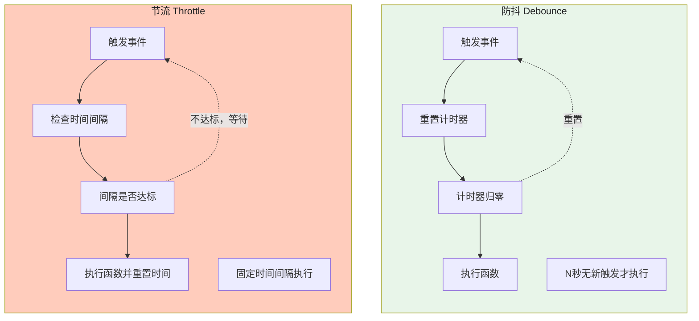

# 防抖与节流

## 1. 概念定义与对比




| 维度 | 防抖（Debounce） | 节流（Throttle） |
|------|----------------|----------------|
| 核心思想 | N 秒内无新触发才执行 | 固定时间间隔内最多执行一次 |
| 定时器行为 | 每次触发重置计时器 | 不重置，等时间窗口结束 |
| 执行时机 | 尾部（默认）或头部（`immediate`） | 头部（默认）或尾部 |
| 适用场景 | 搜索输入、窗口 resize 停止后、提交按钮 | 滚动、拖拽、射击游戏点击 |
| 性能影响 | 更节省（只执行一次） | 稳定（定期执行） |

## 2. 防抖实现（完整版）

```javascript
// 基础防抖（尾部执行）
function debounce(fn, delay) {
  let timer = null;
  return function(...args) {
    clearTimeout(timer);
    timer = setTimeout(() => {
      fn.apply(this, args);
      timer = null;
    }, delay);
  };
}

// 防抖 + 头部执行（immediate）
function debounceLeadingTrailing(fn, delay, immediate = false) {
  let timer = null;
  return function(...args) {
    if (immediate && !timer) {
      // 头部：立即执行
      fn.apply(this, args);
    }
    clearTimeout(timer);
    timer = setTimeout(() => {
      if (!immediate) {
        // 尾部：延迟后执行
        fn.apply(this, args);
      }
      timer = null;
    }, delay);
  };
}

// 完整防抖（头部+尾部都执行）
function debounceFull(fn, delay) {
  let leadingTimer = null;
  let trailingTimer = null;
  let lastArgs = null;

  return function(...args) {
    lastArgs = args;

    // 尾部执行（延迟）
    clearTimeout(trailingTimer);
    trailingTimer = setTimeout(() => {
      fn.apply(this, lastArgs);
      leadingTimer = null;
      trailingTimer = null;
    }, delay);

    // 头部执行（立即，只在没有等待中的尾部时执行）
    if (!leadingTimer) {
      fn.apply(this, args);
      leadingTimer = setTimeout(() => { leadingTimer = null; }, delay);
    }
  };
}

// 使用示例
const debouncedSearch = debounce((query) => {
  console.log(`搜索: ${query}`);
  fetch(`/api/search?q=${query}`);
}, 300);

const input = document.getElementById('search');
input.addEventListener('input', (e) => debouncedSearch(e.target.value));
```

## 3. 节流实现

```javascript
// 方式1：时间戳版（头部执行）
function throttleTimestamp(fn, delay) {
  let lastTime = 0;
  return function(...args) {
    const now = Date.now();
    if (now - lastTime >= delay) {
      fn.apply(this, args);
      lastTime = now;
    }
  };
}

// 方式2：定时器版（尾部执行）
function throttleTimer(fn, delay) {
  let timer = null;
  return function(...args) {
    if (timer) return; // 已注册，等待执行
    timer = setTimeout(() => {
      fn.apply(this, args);
      timer = null;
    }, delay);
  };
}

// 方式3：时间戳+定时器混用（头部+尾部都保证执行）
function throttle(fn, delay) {
  let lastTime = 0;
  let timer = null;

  return function(...args) {
    const now = Date.now();
    const remaining = delay - (now - lastTime);

    if (remaining <= 0 || remaining > delay) {
      // 超过等待时间，立即执行并重置
      if (timer) {
        clearTimeout(timer);
        timer = null;
      }
      lastTime = now;
      fn.apply(this, args);
    } else if (!timer) {
      // 没超过等待时间，注册尾部执行
      timer = setTimeout(() => {
        lastTime = Date.now();
        timer = null;
        fn.apply(this, args);
      }, remaining);
    }
  };
}
```

## 4. requestAnimationFrame 节流

```javascript
// rAF 节流：最精确，匹配屏幕刷新率，60fps 约每 16.67ms 执行一次
// 优点：与屏幕刷新同步，不掉帧，不卡顿
// 缺点：标签页后台时不执行（节省资源），不保证执行频率

function throttleRAF(fn) {
  let requestId = null;
  let lastArgs = null;

  return function(...args) {
    lastArgs = args;

    if (requestId === null) {
      requestId = requestAnimationFrame(() => {
        fn.apply(this, lastArgs);
        requestId = null;
      });
    }
  };
}

// rAF 防抖：只在最后一次 rAF 帧执行
function debounceRAF(fn) {
  let requestId = null;
  return function(...args) {
    if (requestId !== null) {
      cancelAnimationFrame(requestId);
    }
    requestId = requestAnimationFrame(() => {
      fn.apply(this, args);
      requestId = null;
    });
  };
}

// 实际场景：滚动时更新位置指示器
function setupScrollProgress() {
  const progressBar = document.getElementById('progress');

  const updateProgress = throttleRAF(() => {
    const scrollTop = window.scrollY;
    const docHeight = document.documentElement.scrollHeight - window.innerHeight;
    const progress = (scrollTop / docHeight) * 100;
    progressBar.style.width = `${progress}%`;
  });

  window.addEventListener('scroll', updateProgress, { passive: true });
}
```

## 5. React/TypeScript 防抖节流 Hook

```tsx
import { useEffect, useRef, useCallback } from 'react';
import { useMemo } from 'react';
// 第 1 段：引入 React 依赖（准备本文件所需的 Hooks 与类型）
// useRef 用来存放"跨渲染保持不变的可变引用"（定时器 id、时间戳），这是实现防抖/节流的关键：
// 它不会触发重渲染，正好适合存这类"纯副作用状态"。注意下面组件里用到的 useState 并未在此导入，
// 属于原代码的遗漏（运行时会报错），教学时需留意。
// 另外 useMemo 在此文件中未被使用，属于冗余导入。

// 防抖 Hook
// 第 2 段：useDebounce —— 延迟执行，反复调用只保留"最后一次"
// 泛型 <T extends (...args:any[])=>any> 保留原函数的参数签名，返回值用 Parameters<T> 推导出参数元组，
// 这样包装后仍能获得完整的类型检查，而不会退化成 any。
function useDebounce<T extends (...args: any[]) => any>(
  fn: T,
  delay: number
): (...args: Parameters<T>) => void {
  // 用 ref 存 timer id：多次渲染共享同一份，clearTimeout 才能取消到"上一次"的定时器。
  const timerRef = useRef<ReturnType<typeof setTimeout>>(null);
  // 初始值给 null 是为了配合 clearTimeout 对空值的容忍；ReturnType<typeof setTimeout> 让返回值
  // 在 Node 与浏览器环境下都能正确推导（Node 返回 Timeout 对象，浏览器返回 number）。

  useEffect(() => {
    // 卸载时清掉未触发的定时器，避免组件已销毁后回调仍执行造成内存泄漏或 setState 警告。
    // 空依赖数组 => 只在挂载时注册、卸载时执行清理。
    return () => clearTimeout(timerRef.current!);
  }, []);

  return useCallback(
    // 返回的函数体每次调用都先清掉旧定时器再起新定时器，这正是"防抖"的本质：
    // 连续触发期间不断重置计时，只有当调用间隔超过 delay 时才真正执行 fn。
    (...args: Parameters<T>) => {
      clearTimeout(timerRef.current!);
      timerRef.current = setTimeout(() => fn(...args), delay);
    },
    // 依赖 fn/delay：二者变化时重建回调，保证闭包捕获的是最新的 fn。
    // 若 fn 是内联箭头函数（如 SearchComponent 中），每次渲染都是新引用，会导致回调频繁重建，
    // 这是该实现的已知代价（可配合 useRef 保存最新 fn 优化）。
    [fn, delay]
  );
}

// 节流 Hook（时间戳版）
// 第 3 段：useThrottle —— 固定时间窗口内最多执行一次（"第一次立即执行"语义）
// 与防抖的区别：防抖是"等安静下来再执行"，节流是"按固定频率放行"；
// 时间戳版实现简单，但首次调用会立即执行，且窗口内被丢弃的调用不会补执行（尾部不触发）。
function useThrottle<T extends (...args: any[]) => any>(
  fn: T,
  delay: number
): (...args: Parameters<T>) => void {
  // lastTimeRef 记录"上一次真正执行"的时间戳；用 ref 而非 state，避免更新它引发额外渲染。
  // 初值 0 使首次调用必然满足 now - 0 >= delay（除非 delay 设为超大值），从而立即执行。
  const lastTimeRef = useRef(0);

  return useCallback(
    (...args: Parameters<T>) => {
      const now = Date.now();
      // 只有距上次执行已超过 delay 才放行，并立即刷新时间戳；否则直接丢弃本次调用。
      if (now - lastTimeRef.current >= delay) {
        lastTimeRef.current = now;
        fn(...args);
      }
    },
    [fn, delay]
  );
}

// 在 React 组件中使用
// 第 4 段：SearchComponent —— 一个受控输入 + 防抖搜索的真实用例
// 数据流：input 变更 => 同步更新 query（受控显示）=> 触发防抖搜索 => 300ms 内无新输入才发请求。
function SearchComponent() {
  // query 用于输入框受控显示，results 存放后端返回结果；两处 setState 会各自触发一次渲染。
  const [query, setQuery] = useState('');
  const [results, setResults] = useState([]);

  // 搜索函数是 async，但 useDebounce 只负责"何时调用"，不关心返回值，
  // 所以这里不会 await 防抖函数（它返回 void），Promise 由内部自行吞掉。
  const debouncedSearch = useDebounce(async (q: string) => {
    // 空查询直接清空结果，避免发出无意义的请求；
    // 注意 async 回调里的异常（fetch 失败、res.json() 解析失败）没有 try/catch，
    // 会变成未处理的 Promise rejection，生产环境应补上错误处理。
    if (!q) { setResults([]); return; }
    const res = await fetch(`/api/search?q=${q}`);
    setResults(await res.json());
  }, 300);

  return (
    <>
      // 第 5 段：输入事件绑定 —— 即时更新 + 防抖触发搜索
      // 这里刻意把 setQuery 与 debouncedSearch 放在同一事件里：
      // UI 必须立刻回显（受控组件），而请求则被推迟到停止输入 300ms 后，兼顾响应与性能。
      // 易错点：事件频繁触发时只有最后一次会真正发请求；若用 useThrottle 则表现为固定频率请求。
      <input onChange={e => {
        setQuery(e.target.value);
        debouncedSearch(e.target.value);
      }} />
      {/* results... */}
    </>
  );
}
```
## 6. 常见陷阱与最佳实践

| 陷阱 | 说明 | 解决方案 |
|------|------|---------|
| 防抖在 `input` 事件中用 `keydown` | 每个按键都触发防抖，搜索体验差 | 用 `input` 事件而非 `keydown` |
| 节流间隔设置过短 | 失去节流意义，频繁执行 | 根据场景设合适间隔（滚动 16ms, resize 200ms） |
| `this` 指向丢失 | 防抖/节流包装后 `this` 可能指向错误 | 用 `fn.apply(this, args)` 或箭头函数 |
| 忘记取消定时器 | 内存泄漏、组件卸载后仍执行 | 在 `useEffect` return / `componentWillUnmount` 中清理 |
| `debounce` 尾部模式在懒加载场景失效 | 懒加载组件的防抖因组件挂载而失效 | 用 `useDebouncedCallback`（useCallback + debounce） |
| scroll 事件不用 `{ passive: true }` | scroll 是不可取消的宏任务，影响滚动性能 | `addEventListener('scroll', handler, { passive: true })` |

## 7. 面试追问

**Q1: `leading: true` 和 `leading: false` 的防抖在什么场景分别适用？**

```javascript
// leading: true（头部执行）：用户体验"立即响应"
const save = debounceLeadingTrailing((data) => saveToServer(data), 1000, true);
// 场景：用户不希望等待，直接看到反馈

// leading: false（尾部执行，默认）：确保用户"最终完成"后才处理
const validate = debounceLeadingTrailing((data) => validateOnServer(data), 1000, false);
// 场景：搜索建议，用户输入完才请求
```

**Q2: 如何取消一个已防抖的函数调用？**

```javascript
const debouncedFn = debounce(doSomething, 1000);

// 方法1：调用 clearTimeout
debouncedFn.cancel?.(); // 需要在实现中加入 cancel 方法

// 改进的防抖（带 cancel）
function debounceCancelable(fn, delay) {
  let timer = null;
  const debounced = function(...args) {
    clearTimeout(timer);
    timer = setTimeout(() => { fn(...args); timer = null; }, delay);
  };
  debounced.cancel = () => { clearTimeout(timer); timer = null; };
  debounced.flush = () => { if (timer) { clearTimeout(timer); fn(...lastArgs); } };
  let lastArgs;
  return debounced;
}

const fn = debounceCancelable(doSomething, 1000);
fn.cancel(); // 取消等待中的调用
fn.flush();  // 立即执行
```

**Q3: `lodash` 的 `debounce` 和手写实现的区别？**
手写版本适用于简单场景。`lodash.debounce` 更完善：支持 `maxWait`（最大等待时间，即使频繁触发也至少执行一次）、`trailing`/`leading` 独立配置、`cancel()` 取消、`flush()` 立即执行、正确的 `this` 上下文。生产环境推荐使用 `lodash.debounce` 或 `lodash-es`（支持 Tree Shaking）。

## 8. 精简回顾：防抖与节流速记版

```javascript
// 防抖（debounce）：事件触发n秒后才执行，n秒内再次触发则重新计时
function debounce(fn, delay, immediate = false) {
  let timer;
  return function(...args) {
    const context = this;
    // 立即执行模式
    if (immediate && !timer) fn.apply(context, args);
    clearTimeout(timer);
    timer = setTimeout(() => {
      if (!immediate) fn.apply(context, args);
      timer = null;
    }, delay);
  };
}

// 场景：搜索框输入（等待用户停止输入后才搜索）、窗口调整大小（调整完成后执行一次）

// 节流（throttle）：n秒内只执行一次（固定频率）
function throttle(fn, delay) {
  let lastTime = 0;
  return function(...args) {
    const now = Date.now();
    if (now - lastTime >= delay) {
      fn.apply(this, args);
      lastTime = now;
    }
  };
}

// 场景：滚动事件（滚动时每隔一段时间处理）、按钮防重复点击、拖拽

// requestAnimationFrame节流（更精确）：
function throttleRAF(fn) {
  let pending = false;
  return function(...args) {
    if (!pending) {
      pending = true;
      requestAnimationFrame(() => {
        fn.apply(this, args);
        pending = false;
      });
    }
  };
}

// leading + trailing 组合：
function throttleFull(fn, delay, options = {}) {
  let timer, lastArgs;
  const { leading = true, trailing = true } = options;
  return function(...args) {
    if (!timer && leading) fn.apply(this, args);
    lastArgs = args;
    clearTimeout(timer);
    timer = setTimeout(() => {
      if (trailing && lastArgs) fn.apply(this, lastArgs);
      timer = null;
    }, delay);
  };
}

// 应用区别：
// 搜索框输入：debounce（停笔后才搜）
// 滚动加载：throttle（滚动时持续加载）
// 窗口resize：debounce（停止调整后才处理）
```

## 深入阅读与参考

!!! tip "怎么用这些资料"
    先读「官方文档与规范」建立准确的概念，再读「源码与示例」核对细节，最后用「教程、书籍与视频」换一种讲法加深理解。每条都写明了读哪一节、带着什么问题读。

### 官方文档与规范

| 资源 | 为什么读 | 怎么读 |
|---|---|---|
| [useCallback](https://react.dev/reference/react/useCallback) | useCallback 官方说明是稳定函数引用、写好防抖 Hook 的基础。 | 读 Caveats 与依赖数组说明，思考：去掉 useCallback 后防抖计时器为何会被重置。 |
| [useDeferredValue](https://react.dev/reference/react/useDeferredValue) | 官方对比延迟更新与防抖，帮你判断该选哪种方案。 | 读 Usage 中与防抖节流对比的小节，用同一个搜索框分别实现两种方案再比较。 |
| [useEffectEvent](https://react.dev/reference/react/useEffectEvent) | 解决防抖回调里读最新值却不重建计时器的老问题。 | 读用法与限制，把 useEffect 里的防抖闭包改成 Effect Event，对比行为差异。 |
| [useTransition](https://react.dev/reference/react/useTransition) | 另一种「少做点事」的思路，可与节流并列权衡。 | 读 Usage 与 Troubleshooting，给长列表输入加 transition，观察卡顿是否改善。 |
| [React API 参考](https://react.dev/reference/react) | Hook 规则与坑的速查入口，用来排查防抖失效。 | 只读 Caveats 与 Troubleshooting，对照自己的 useDebounce 找出违规写法。 |
| [React Compiler 介绍](https://react.dev/learn/react-compiler/introduction) | 编译器自动记忆化后，手写 useCallback 的必要性会变。 | 按文档在 Vite 启用编译器，对比启用前后防抖函数是否仍被重新创建。 |
| [React 官方文档](https://react.dev/) | 官方交互沙盒里可直接改代码验证思路。 | 在沙盒里写输入框加定时器的例子，逐步改造成防抖与节流各一版。 |

### 源码与示例

| 资源 | 为什么读 | 怎么读 |
|---|---|---|
| [React TypeScript Cheatsheet](https://react-typescript-cheatsheet.netlify.app/) | Hook 泛型与事件类型的现成写法，写 TS 版 Hook 直接抄。 | 查 Hooks 与 Events 两节，照着给 useDebounce 补全泛型与参数类型。 |
| [React 源码仓库](https://github.com/facebook/react) | 看 React 自己的调度实现，理解 rAF 与时间片的取舍。 | 读 packages/scheduler 源码，配合断点看一次任务分片如何让出主线程。 |

### 教程、书籍与视频

| 资源 | 为什么读 | 怎么读 |
|---|---|---|
| [Josh Comeau：常见初学者错误](https://www.joshwcomeau.com/react/common-beginner-mistakes/) | 闭包与 stale 值清单，正是防抖节流最易踩的坑。 | 逐条对照自己的实现自查，把命中项写成测试用例覆盖。 |
| [Epic React](https://www.epicreact.dev/) | 练习驱动，闭包与 Hook 的刻意训练最有效。 | 做 Hook 与性能相关练习，先自己实现防抖再看解答复盘。 |
| [TkDodo 博客](https://tkdodo.eu/blog) | React 实践中闭包、依赖数组与副作用的深度讲解。 | 挑闭包与依赖数组相关篇目，整理正确写法的要点清单。 |
| [Kent C. Dodds 博客](https://kentcdodds.com/blog) | 按 React 标签能找到 Hook 用法与测试的实战文章。 | 挑三篇性能或 Hook 文章，每篇写一个可运行的最小示例。 |

## 应用与行业实践

### 应用场景地图

| 场景 | 用到本页哪个知识点 | 典型技术选型 | 注意事项 |
| --- | --- | --- | --- |
| 后台管理系统的万行表格滚动加载 | rAF 节流、尾调用 | rAF 合并 scroll + IntersectionObserver 哨兵 | 距底部阈值要留出请求往返时间，否则露出空白 |
| 低端安卓机的首屏图片懒加载 | 节流、passive 监听 | IntersectionObserver，降级用 scroll 节流 | 回调里不做尺寸测量，低端机主线程本就紧张 |
| 多人协作白板的光标同步 | 节流（时间戳 + 尾调用） | WebSocket + throttle(50ms) | 尾调用决定光标停住时能否上报最终位置 |
| 电商搜索框输入联想 | 防抖、取消竞态 | debounce(300) + AbortController | 不取消飞行中的旧请求，旧结果会覆盖新结果 |
| 地图拖拽结束后的标点拉取 | 防抖（trailing edge） | debounce(300) 绑 moveend | 拖拽中用节流画预览，拖拽结束再拉全量 |
| 浏览器窗口 resize 后的图表重绘 | 防抖 + rAF | ResizeObserver + debounce(150) | 重绘前集中读取尺寸，避免反复触发布局 |
| 编辑页草稿自动保存 | 防抖 + flush | debounce(1000) + 离开前 flush | 不 flush 会丢掉最后一次编辑 |
| 下单按钮重复提交拦截 | 节流（leading edge） | throttle(1000, { leading: true, trailing: false }) | 只取首次点击，按钮置灰状态与请求状态绑定 |
| 聊天窗口高频消息的批量渲染 | 节流 + 批处理 | 缓冲区 + rAF 消费 | 消息顺序按到达顺序消费，不能乱序 |
| 富文本编辑器的实时字数统计 | 防抖 | debounce(200) | 延迟超过 300ms 用户会感到统计滞后 |

### 三个场景拆解

#### 场景 1：后台管理系统的万行表格滚动加载

**业务背景**

表格有 1 万行以上，用户滚到底部触发下一页，触控板每秒能触发几十到上百次 scroll。若每次都读 scrollTop 与 scrollHeight，读写交替会让主线程被切碎。

量级可以用可复现的方式测：在 DevTools Performance 面板录制 10 秒连续滚动，数 scroll 回调次数与 scripting 时间。

**怎么用本页知识解决**

思路是让同一帧内的多次 scroll 只做一次读取与一次判断，把 N 次回调压成 1 次。

```ts
// 用 requestAnimationFrame 合并同一帧内的多次 scroll 事件
let ticking = false;
function onScroll() {
  if (ticking) return;               // 本帧已排队，直接跳过
  ticking = true;
  requestAnimationFrame(() => {
    ticking = false;                 // 先复位，保证下一帧还能触发
    const nearBottom =
      el.scrollTop + el.clientHeight >= el.scrollHeight - 200; // 距底 200px
    if (nearBottom) loadNextPage();  // 触发下一页请求
  });
}
el.addEventListener('scroll', onScroll, { passive: true }); // 不阻塞滚动
```

- `ticking` 是锁，保证一帧最多进入一次逻辑。
- 三个尺寸属性在 rAF 回调里集中读取，读操作不跨帧。
- `passive: true` 让浏览器不必等回调返回就可以滚动。
- 阈值 200px 是留给请求往返的缓冲，按接口 P95 耗时调整。
- 卸载时调用 `removeEventListener`，把同一个函数引用存起来。

**怎么度量收益**

看三个指标：scroll 回调实际执行次数、每帧 scripting 时间、Long Task（超过 50ms 的任务）数量。工具用 Chrome DevTools 的 Performance 面板录制，配合 PerformanceObserver 监听 `longtask` 条目。

**什么时候不该用**

- 表格已经做虚拟滚动，只渲染可见行，滚动回调本身开销低，再包一层 rAF 收益有限。
- 加载下一页由"加载更多"按钮触发，没有滚动监听，不需要合并。
- 需要根据滚动位置实时改变元素样式，rAF 里的读写在下一帧生效，会有跟手延迟。

#### 场景 2：电商搜索框输入联想

**业务背景**

用户连续打字，每敲一个字符发一次请求，输入"无线耳机"会打出 4 次请求，其中 3 次的结果被丢弃。移动网络下这些多余请求还会争抢连接，拖慢真正要用的那一次。

**怎么用本页知识解决**

思路是两道闸：防抖控制发不发，AbortController 控制旧请求还算不算数。

```ts
// 输入防抖 300ms，只保留最后一次输入对应的请求
function createSearch(debounceMs = 300) {
  let timer: ReturnType<typeof setTimeout> | null = null;
  let controller: AbortController | null = null; // 持有飞行中的请求
  return function search(keyword: string) {
    if (timer) clearTimeout(timer);              // 清掉上一次定时器
    timer = setTimeout(async () => {
      controller?.abort();                       // 取消仍在飞行的旧请求
      controller = new AbortController();
      const res = await fetch(`/api/search?q=${encodeURIComponent(keyword)}`, {
        signal: controller.signal,               // 绑定取消信号
      });
      render(await res.json());                  // 只渲染最新一次结果
    }, debounceMs);
  };
}
```

- `timer` 与 `controller` 都放在闭包里，每个输入框一份状态。
- 每次新请求前先 `abort`，旧请求的 Promise 以 AbortError 拒绝。
- `abort` 之后旧请求不会走进 `render`，最后渲染的一定是最新输入。
- 捕获 AbortError 并静默跳过，不要让它冒泡成全局错误。
- 组件卸载时清 timer 并 abort，避免对已卸载组件赋值。

**怎么度量收益**

指标是每会话的 `/api/search` 请求数、从停止输入到结果渲染的耗时、AbortError 占比。工具用 DevTools 的 Network 面板过滤接口路径，前端用 `performance.now()` 在按下按键与渲染完成两处打点，上报到 RUM。

**什么时候不该用**

- 用户按回车才触发的搜索表单，输入过程不产生请求，防抖没有作用对象。
- 本地数组过滤（几百条以内的静态数据），加 300ms 防抖会让按键到结果出现有可感知的滞后。
- 输入内容需要逐字符校验格式，防抖会漏掉中间的非法状态提示。

#### 场景 3：多人协作白板的光标同步

**业务背景**

白板上多人拖动指针，高刷新率设备上 pointermove 每秒触发 120 次。每次都发 WebSocket 消息，服务端广播量与带宽随在线人数成倍上涨，房间里人数一多就卡。

**怎么用本页知识解决**

思路是按时间窗口采样：窗口内只发一次，但要保证停住之后还能补发最终位置。

```ts
// 节流：窗口内首次立即执行，窗口结束时补一次尾调用
function throttle(fn, wait) {
  let last = 0;
  let timer = null;
  return function (...args) {
    const now = Date.now();
    const remain = wait - (now - last);
    if (remain <= 0) {
      last = now;              // 记录本次执行时间
      fn(...args);             // 立即上报，保证跟手
    } else if (!timer) {
      timer = setTimeout(() => { // 补一次尾调用
        last = Date.now();
        timer = null;
        fn(...args);
      }, remain);
    }
  };
}
```

- `last` 记录上次真正执行的时间，决定是否进入等待窗口。
- 窗口内只创建一个定时器，高频事件不会攒出一堆 timer。
- 尾调用保证用户停住指针后，最终坐标仍会上报一次。
- `wait` 取 50ms，与每秒 20 次的上报上限对应。
- 服务端按房间广播时丢弃过期坐标，只保留每人最新位置。

**怎么度量收益**

指标是每客户端每秒发出的消息条数、对端从指针停住到看到最终位置的延迟、渲染帧耗时。工具用 DevTools 的 Network 面板切到 WS 看帧数与帧大小；本地把 pointermove 的 `performance.now()` 时间戳随消息带上，在对端收到并渲染后相减。

**什么时候不该用**

- 单房间 2 到 3 人的局域网协作，每帧上报也不会造成可测量的卡顿。
- 需要逐像素还原的绘制笔迹，50ms 节流会丢点，应改成按帧采样并在接收端插值。

### 行业先进实践

**lodash 防抖函数的 cancel 与 flush（出处：lodash 官方文档）**

lodash 的 `debounce` 和 `throttle` 返回的函数带有 `cancel` 与 `flush` 方法，前者丢弃待执行调用，后者立即执行。组件卸载或依赖变化时调用 `cancel`，可以避免回调打到已经销毁的实例上。你的项目可以在 hook 的清理函数里统一调用这两个方法。

**RxJS 的 debounceTime / throttleTime / auditTime / sampleTime（出处：RxJS 官方文档）**

这四个操作符对应不同的时间窗口取值策略，`auditTime` 与 `sampleTime` 都取窗口内的最后一次，适合流式事件。把事件源当作流并用操作符声明时间策略，比手写定时器容易写单元测试。项目的搜索与光标模块可以先用这套思路做原型。

**用 AbortController 取消 fetch（出处：MDN Web Docs 的 AbortController 与 Fetch 条目）**

fetch 接受 `signal` 参数，`abort` 之后 Promise 以 AbortError 拒绝。在防抖回调开头先 abort 旧请求，可以避免过期响应覆盖最新结果。项目里把 controller 与请求一起保存，在同一个闭包里管理生命周期。

**被动事件监听与 rAF 合并（出处：web.dev 关于 passive 事件监听的文章，MDN 的 requestAnimationFrame 条目）**

滚动与触摸监听加上 `passive: true`，浏览器不必等待监听器返回就能开始滚动。rAF 把同一帧内的多次回调合并到下一次绘制之前执行。项目的代码规范可以把所有 scroll、touchmove、wheel 监听默认要求带 passive。

**InstantSearch 的输入防抖配置（出处：Algolia InstantSearch 官方文档）**

需核对官方文档：核对 InstantSearch.js 与 React InstantSearch 中控制搜索防抖的配置项名称、默认时长，以及 queryHook 的用法，再决定是照搬还是自研。

### 从学到用：落地路线

**第 1 步：在搜索联想试点。** 只改这一个组件，保留旧分支作为开关。验收标准是开关切回旧分支时行为与改动前一致。

**第 2 步：用录制数据验证。** 在 DevTools 里录制改动前后的同一段输入。验收标准是 PR 里给出请求数与停止输入到渲染的耗时两组数字。

**第 3 步：封装并推广。** 把验证过的逻辑抽成项目内的 `useDebouncedCallback` 与 `useThrottleCallback`，推到滚动加载、resize、光标同步三处。验收标准是三处改造都引用同一个 hook。

**第 4 步：防止回退。** 在 ESLint 或评审清单里加两条：定时器必须在卸载时清理，scroll 与 touchmove 监听必须带 passive。验收标准是 CI 对新增代码运行规则，命中即失败。

### 动手作业

**目标**

做一个本地可跑的页面，包含搜索联想、滚动加载、resize 重排三块，用可复现的录制数据说明防抖与节流各自改变了什么。

**步骤**

1. 起一个静态服务，写一个返回数组的本地接口，每条结果带服务器时间戳。
2. 写搜索框，先不加防抖，每次 input 都发请求。在 Network 面板记录输入 `abcdef` 时的请求数。
3. 加上 300ms 防抖与 AbortController，重复步骤 2 的输入，记录请求数与 AbortError 次数。
4. 造 1 万条数据的列表，scroll 直接绑加载函数。用 Performance 面板录制 10 秒连续滚动，记录 Long Task 数量。
5. 改成 rAF 合并版本，重复步骤 4 的录制，把两组数字并列。
6. 给窗口加 resize 重排网格。先测无节流版本，再测 debounce(150) 版本，记录重排次数。
7. 把三组对比写进 README，写明测量工具、操作步骤，以及哪一处不适合改用防抖。

**验收标准**

1. README 里列出三组对比数字，每组都写明测量工具与操作步骤。
2. 输入 `abcdef` 后只发出 1 次有效请求，且被替换的旧请求状态为 canceled。
3. 滚动版本 10 秒录制里的 Long Task 数量低于直连版本，或有数据说明两者接近。
4. 组件卸载后 1 秒内不再有定时器回调触发，用回调内的 `console.log` 验证。
5. 代码里所有 scroll、touchmove、wheel 监听都带 `passive: true`，且卸载时移除。

