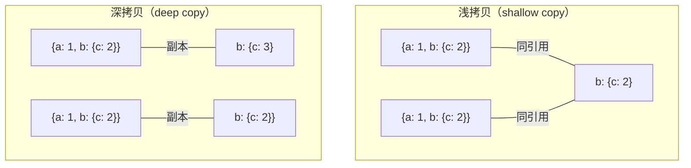

# 深拷贝与浅拷贝

## 1. 概念定义



## 2. 主流深拷贝方法对比

### 2.1 JSON.parse(JSON.stringify())

```javascript
const original = { name: 'Alice', nested: { score: 90 } };
const clone = JSON.parse(JSON.stringify(original));
clone.nested.score = 100;
console.log(original.nested.score); // 90（未受影响）
```

**缺点（注意）：**

| 问题 | 示例 |
|------|------|
| 函数、`undefined`、`Symbol` 丢失 | `{ fn: () => {}, u: undefined }` → `{}` |
| 无法处理循环引用 | 抛 `TypeError: Converting circular structure to JSON` |
| Date 变成字符串 | `new Date()` → `"2024-01-01T..."` |
| RegExp 变成空对象 | `/test/g` → `{}` |
| Error 丢失 | `new Error("msg")` → `{}` |
| BigInt 报错 | `BigInt(123)` → `TypeError` |
| Map/Set 变成 `{}` | `new Map([[1,2]])` → `{}` |
| 原型链丢失 | 丢失 constructor 等 |

### 2.2 structuredClone（现代浏览器 / Node 17+）

```javascript
// structuredClone：浏览器原生深拷贝，使用结构化克隆算法
// 支持：循环引用、BigInt、Date、RegExp、Error、TypedArray、Map、Set、Blob 等
const original = {
  date: new Date(),
  big: 123n,
  map: new Map([[1, 2]]),
  regex: /test/gi,
  nested: { value: 42 }
};
const clone = structuredClone(original);
clone.nested.value = 100;
console.log(original.nested.value);  // 42
clone.big === 123n;                  // true
clone.date instanceof Date;          // true
clone.map instanceof Map;             // true

// structuredClone 的 transfer 选项（转移所有权，不拷贝）
const buffer = new ArrayBuffer(8);
const clone2 = structuredClone({ buffer }, { transfer: [buffer] });
// buffer 在原位置被"掏空"（长度为 0），transfer 数组中获得所有权
```

**structuredClone 不支持的类型**：函数、Symbol 键、DOM 节点（Node）、Error（部分实现）。

### 2.3 手写深拷贝（完整版）

```javascript
function deepClone(target, memory = new WeakMap()) {
  // 处理原始类型和 null
  if (target === null || typeof target !== 'object') return target;

  // 处理循环引用：发现已拷贝的对象，直接返回该拷贝的引用
  if (memory.has(target)) return memory.get(target);

  // 处理 Date
  if (target instanceof Date) return new Date(target);

  // 处理 RegExp
  if (target instanceof RegExp) return new RegExp(target.source, target.flags);

  // 处理 Error
  if (target instanceof Error) {
    const err = new Error(target.message);
    err.name = target.name;
    err.stack = target.stack;
    return err;
  }

  // 处理函数（区分箭头函数和普通函数）
  if (typeof target === 'function') {
    if (!target.prototype) return target; // 箭头函数无自己的this
    return function(...args) { return target.apply(this, args); };
  }

  // 处理 Map
  if (target instanceof Map) {
    const cloneMap = new Map();
    memory.set(target, cloneMap);
    target.forEach((v, k) => cloneMap.set(deepClone(k, memory), deepClone(v, memory)));
    return cloneMap;
  }

  // 处理 Set
  if (target instanceof Set) {
    const cloneSet = new Set();
    memory.set(target, cloneSet);
    target.forEach(v => cloneSet.add(deepClone(v, memory)));
    return cloneSet;
  }

  // 处理 Array 和 Object
  const clone = Array.isArray(target) ? [] : {};
  memory.set(target, clone);
  for (const key of Reflect.ownKeys(target)) {
    // 使用 Reflect.ownKeys 包含 Symbol 键
    clone[key] = deepClone(target[key], memory);
  }
  return clone;
}
```

## 3. TypeScript Deep Merge

```typescript
// TypeScript 深度合并工具类型
type DeepPartial<T> = {
  [P in keyof T]?: T[P] extends object ? DeepPartial<T[P]> : T[P];
};

type DeepRequired<T> = {
  [P in keyof T]-?: T[P] extends object ? DeepRequired<T[P]> : T[P];
};

function deepMerge<T extends object>(target: T, ...sources: DeepPartial<T>[]): T {
  return sources.reduce((acc, src) => {
    for (const key in src) {
      const srcVal = (src as any)[key];
      const accVal = (acc as any)[key];
      if (
        srcVal !== null &&
        typeof srcVal === 'object' &&
        !Array.isArray(srcVal) &&
        accVal !== null &&
        typeof accVal === 'object' &&
        !Array.isArray(accVal)
      ) {
        (acc as any)[key] = deepMerge(accVal, srcVal as any);
      } else if (srcVal !== undefined) {
        (acc as any)[key] = srcVal;
      }
    }
    return acc;
  }, { ...target });
}

// 使用示例
interface Config {
  server: {
    host: string;
    port: number;
    options: { timeout: number; retries: number };
  };
  logging: { level: string };
}

const defaultConfig: Config = {
  server: { host: 'localhost', port: 3000, options: { timeout: 5000, retries: 3 } },
  logging: { level: 'info' },
};

const userConfig: DeepPartial<Config> = {
  server: { port: 8080, options: { timeout: 10000 } },
};

const finalConfig = deepMerge(defaultConfig, userConfig);
// finalConfig.server.options.retries === 3（保留默认值）
// finalConfig.server.port === 8080（覆盖）
// finalConfig.logging.level === 'info'（保留默认值）
```

## 4. 常见陷阱与最佳实践

| 陷阱 | 说明 | 解决方案 |
|------|------|---------|
| `JSON.stringify` 处理 Date | Date 变成字符串 | 用 `structuredClone` 或手动处理 |
| 循环引用 | `JSON.stringify` 报错 | 用 `structuredClone` 或带 memo 的手写实现 |
| 函数丢失 | `JSON.stringify` 丢失函数 | 用手写深拷贝，箭头函数直接返回，普通函数返回包装函数 |
| Symbol 键 | 手写深拷贝时遗漏 | 用 `Reflect.ownKeys()` 或 `Object.getOwnPropertySymbols()` |
| 原型链 | `JSON.parse` 丢失 constructor | 用 `Object.create(Object.getPrototypeOf(obj))` |
| Map/Set 作为键的对象 | 深拷贝时键未正确克隆 | 在带 memo 的实现中处理 Map/Set 类型的键 |
| 性能问题 | 大对象深拷贝性能差 | 用 `structuredClone`（原生实现，性能最优） |

## 5. 面试追问

**Q1: 如何处理带有循环引用的对象进行深拷贝？**

```javascript
// 方法1: structuredClone（最简洁）
const obj = { name: 'test' };
obj.self = obj;  // 循环引用
const clone = structuredClone(obj);

// 方法2: 带 WeakMap 的手写实现（见上文的 deepClone 函数）
// 方法3: 使用 lodash
// import { cloneDeep } from 'lodash';
// const clone = _.cloneDeep(obj);
```

**Q2: `structuredClone` 和 `JSON.stringify` 的核心区别是什么？**
`structuredClone` 使用结构化克隆算法（浏览器内部算法，用于 `postMessage`/IndexedDB），支持循环引用、BigInt、TypedArray、Map、Set、Date、RegExp、Error 等复杂类型，但不支持函数和 Symbol 键。`JSON.stringify` 是文本序列化，不支持循环引用，会丢失函数/undefined/Symbol/BigInt，Date 变字符串，RegExp 变空对象。

**Q3: 如何实现一个高性能的深拷贝？**
优先使用 `structuredClone`（原生实现，无 JS 开销）。需要手写时，用 `WeakMap` 做 memo 避免重复拷贝（尤其是处理图结构时），对 TypedArray 用 `.slice()` 拷贝（比递归快），对普通对象用 `Object.assign({}, obj)` 配合递归。

## 6. 精简回顾：深浅拷贝速记版

```javascript
// 浅拷贝：只拷贝一层，引用类型共享
const a = { obj: { x: 1 } };
const b = Object.assign({}, a);
b.obj.x = 2;
console.log(a.obj.x); // 2（共享！）

// 深拷贝：递归拷贝所有层级
const c = { obj: { x: 1 } };
const d = JSON.parse(JSON.stringify(c));
d.obj.x = 2;
console.log(c.obj.x); // 1（独立）

// JSON深拷贝缺点：
// 1. 不能拷贝函数、undefined、Symbol
// 2. 不能拷贝循环引用（报错）
// 3. 不能拷贝 Date（变成字符串）、RegExp（变成空对象）、Error（丢失）
// 4. BigInt报错
// 5. 对象属性顺序可能改变（特别是稀疏数组）
const bad = {
  date: new Date(),
  regex: /test/,
  err: new Error("错误"),
  fn: function() {},
  big: BigInt(123),
  sym: Symbol("desc"),
  undefinedProp: undefined,
  nested: { fn: () => {} }
};
JSON.parse(JSON.stringify(bad));
// 结果：{date:"2024-01-01T...", regex:{}, err:{}, nested:{}}
// 函数、undefined、BigInt、Symbol全丢失！

// structuredClone（浏览器原生深拷贝，Node 17+）：
// 支持：循环引用、BigInt、Date、RegExp、Error、TypedArray等
const original = { date: new Date(), sym: Symbol("test"), big: 123n };
const cloned = structuredClone(original);
cloned.big === 123n; // true
original.date instanceof Date; // true（克隆后仍是Date）

// 手写深拷贝（完整版）：
function deepClone(target, map = new WeakMap()) {
  // 处理原始类型
  if (target === null || typeof target !== 'object') return target;

  // 处理循环引用
  if (map.has(target)) return map.get(target);

  // 处理Date
  if (target instanceof Date) return new Date(target);

  // 处理RegExp
  if (target instanceof RegExp) return new RegExp(target.source, target.flags);

  // 处理Error
  if (target instanceof Error) {
    const err = new Error(target.message);
    err.name = target.name;
    err.stack = target.stack;
    return err;
  }

  // 处理函数（普通函数和箭头函数分开）
  if (typeof target === 'function') {
    // 箭头函数没有自己的this，直接返回
    if (!target.prototype) return target;
    // 普通函数返回一个包装函数
    return function(...args) { return target.apply(this, args); };
  }

  // 处理Map
  if (target instanceof Map) {
    const cloneMap = new Map();
    map.set(target, cloneMap);
    target.forEach((v, k) => cloneMap.set(deepClone(k, map), deepClone(v, map)));
    return cloneMap;
  }

  // 处理Set
  if (target instanceof Set) {
    const cloneSet = new Set();
    map.set(target, cloneSet);
    target.forEach(v => cloneSet.add(deepClone(v, map)));
    return cloneSet;
  }

  // 处理Array和Object
  const clone = Array.isArray(target) ? [] : {};
  map.set(target, clone);
  for (const key of Reflect.ownKeys(target)) {
    clone[key] = deepClone(target[key], map);
  }
  return clone;
}
```

## 深入阅读与参考

!!! tip "怎么用这些资料"
    先读「官方文档与规范」建立准确的概念，再读「源码与示例」核对细节，最后用「教程、书籍与视频」换一种讲法加深理解。每条都写明了读哪一节、带着什么问题读。

### 官方文档与规范

| 资源 | 为什么读 | 怎么读 |
|---|---|---|
| [TypeScript Handbook](https://www.typescriptlang.org/docs/handbook/intro.html) | 官方权威来源，对象类型、展开语法与类型推断写深拷贝类型时必查。 | 读对象类型与展开相关小节，在 Playground 改写示例，再回本页核对结论。 |
| [TypeScript 官方文档中文站](https://www.typescriptlang.org/zh/docs/) | 中文入口，快速确认对象类型与结构化类型的官方表述，降低阅读门槛。 | 先查对象类型与类型兼容性，遇到术语歧义再切英文版核对原文。 |
| [TypeScript Playground](https://www.typescriptlang.org/play) | 官方在线编译器，可现场验证 structuredClone 与深拷贝泛型的类型。 | 贴入本页深拷贝函数，看推导出的返回类型，调泛型直到不再退化为 any。 |

### 源码与示例

| 资源 | 为什么读 | 怎么读 |
|---|---|---|
| [Total TypeScript](https://www.totaltypescript.com/tutorials) | DeepReadonly、DeepPartial 等练习题，正好训练深合并所需的递归类型。 | 先做 Deep Readonly 与 Deep Partial，再回本页实现递归 DeepMerge 类型。 |
| [TypeScript AST Viewer](https://ts-ast-viewer.com/) | 看到编译器眼中的 AST 节点，理解展开语法与递归类型的解析过程。 | 把 DeepMerge 类型贴进去，观察条件类型节点如何逐层展开与收敛。 |
| [tsx](https://tsx.is/) | 零配置直接跑 TypeScript 脚本，实测 structuredClone 与递归拷贝行为。 | 写脚本对嵌套对象做深浅拷贝，改一处嵌套值看原对象是否被污染。 |

### 教程、书籍与视频

| 资源 | 为什么读 | 怎么读 |
|---|---|---|
| [Effective TypeScript（第 2 版）](https://effectivetypescript.com/) | 每条建议配一处重构，可用来审视自己封装的 clone 工具函数。 | 挑类型推断与只读相关的条目，逐条套到本页的 clone 实现上验证。 |
| [Exploring JS 系列（Axel Rauschmayer）](https://exploringjs.com/) | 免费在线阅读，对象复制与属性描述符章节直接讲深浅拷贝差别。 | 读对象与复制相关章节，重点关注引用共享和 structuredClone 的限制。 |
| [TypeScript Deep Dive](https://basarat.gitbook.io/typescript/) | 系统梳理 TS 设计思路，理解类型工具在真实项目里的组织方式。 | 读设计思路与项目配置部分，与官方 Handbook 对照补齐概念。 |
| [TypeScript Cheat Sheets](https://www.typescriptlang.org/cheatsheets/) | 类型与类速查表，写泛型工具时可随时对照语法细节。 | 收藏备用，写 DeepMerge 类型卡壳时查映射类型与条件类型写法。 |

## 应用与行业实践

### 应用场景地图

| 场景 | 用到本页哪个知识点 | 典型技术选型 | 注意事项 |
|---|---|---|---|
| 后台管理的万行表格行内编辑 | 浅拷贝会共享嵌套引用 | React 展开语法 + 不可变更新 | 只替换命中的那一行，嵌套数组要单独复制一层 |
| 低端安卓机型的首屏加载 | 深拷贝的耗时与内存成本 | structuredClone + requestIdleCallback | 克隆仍在主线程执行，要避开首屏关键路径 |
| 多人协作白板的撤销栈 | 环形引用下 JSON 序列化失败 | structuredClone 整块快照 | 快照粒度大，节点数量上升时内存增长快 |
| 表单"取消编辑"还原草稿 | 深拷贝做隔离 | lodash cloneDeep / structuredClone | 函数字段、DOM 节点、Proxy 克隆会失败 |
| 写入 localStorage 的本地缓存 | JSON 往返丢失类型信息 | JSON.stringify + JSON.parse | Date 变字符串，undefined 与函数字段被丢弃 |
| Node 服务端合并多来源配置 | TypeScript Deep Merge 类型 | 类型级深合并 + 运行时递归合并 | 数组按索引合并还是整体替换，要写进类型定义 |
| 图表库数据源更新触发重绘 | 引用相等判断 | 浅拷贝 + 逐条替换 | 整块替换会让引用全变，触发全量重绘 |
| 测试夹具在多个用例间复用 | 深拷贝做隔离 | structuredClone / beforeEach 重建 | 夹具被用例原地改写，导致用例互相污染 |

### 三个场景拆解

#### 场景 1：后台管理的万行表格行内编辑

**业务背景**：表格一次渲染上万行，用户点某一行改名。改动若落在原对象上，同一行在汇总栏、详情抽屉里的引用会同步变化，两处显示的数据对不上。

**怎么用本页知识解决**：让改动只产生新对象，其余行沿用原引用。命中行用展开语法做浅拷贝，嵌套的 `tags` 按需再复制一层。

```ts
type Row = { id: number; name: string; tags: string[] };

// 反例：原地写入，所有持有该行引用的视图同时被改
function editBad(rows: Row[], id: number, name: string) {
  const row = rows.find(r => r.id === id);
  if (row) row.name = name;               // 直接改字段，新旧引用指向同一对象
}

// 正例：只替换命中的那一行，其余行保持原引用
function editGood(rows: Row[], id: number, name: string): Row[] {
  return rows.map(r => (r.id === id ? { ...r, name } : r)); // 命中行生成新对象
}
```

- 命中行用展开语法生成新对象，其余行沿用原引用，引用比较能定位到真正变化的那一行。
- 这是浅拷贝：`tags` 数组仍被两个行对象共享，要改它必须写成 `{ ...r, tags: [...r.tags, tag] }`。
- 原地写入的问题只在有多处引用时暴露，单测要刻意构造两个变量指向同一个行对象。
- 表格用 `React.memo` 优化时，只有引用变化的行会重新渲染，浅拷贝是让该优化生效的前提。

**怎么度量收益**：指标是 React DevTools Profiler 里单次提交的渲染行数与 Render duration。测量方法是在 DevTools Performance 面板开启 CPU 降速 4 倍，录制一次改名操作，对比改动前后两次录制的提交耗时与渲染行数。

**什么时候不该用**：只在当前函数内部读取、没有第二处引用同一行时，逐行 map 会多出一次数组遍历，直接改字段即可。数据以 ID 为键存成字典、且视图按 ID 取值时，替换引用不带来收益，改字典里的那一项就行。

#### 场景 2：低端安卓机型的首屏加载

**业务背景**：首屏要拿到接口返回的配置树，导航栏和权限模块都读同一份。若在首屏渲染路径上递归深拷贝整棵树，主线程被占住，首帧会出现延后。

**怎么用本页知识解决**：把深拷贝拆成两段。首屏只用只读的浅拷贝共享同一份结构，真正需要写入的副本推迟到空闲时段再克隆。

```ts
// 首屏只做浅拷贝，两个模块共享同一份只读视图
const view = { ...config } as const;

// 需要写入的副本推迟到空闲时段再深拷贝
function cloneWhenIdle<T>(src: T, apply: (copy: T) => void) {
  const run = () => apply(structuredClone(src)); // 克隆在主线程执行，放到空闲回调里
  if ('requestIdleCallback' in window) {
    (window as any).requestIdleCallback(run, { timeout: 500 }); // 超时兜底，防止一直不执行
  } else {
    setTimeout(run, 0); // 不支持该接口时退化为下一个宏任务
  }
}
```

- 首屏路径上只做一层展开，耗时与字段层级无关，只与顶层键的数量相关。
- `structuredClone` 仍在主线程执行，空闲回调只是把工作挪出首帧，不改变总耗时。
- 克隆数据量较大时应改放到 Web Worker，结果通过 postMessage 传回，传输本身也按结构化克隆算法复制。
- `as const` 只约束当前模块，其他模块原地写入时共享视图一样会变，需要靠冻结或约定约束。

**怎么度量收益**：指标是 PerformanceObserver 收集的 `longtask` 条目数量与最长时长，以及 Lighthouse 的 Total Blocking Time。测量方法是 DevTools Performance 面板开启 CPU 降速 4 倍后重新加载首屏，对比 `longtask` 条目的时间戳分布。

**什么时候不该用**：配置树只有几十个节点时，一次 `structuredClone` 的耗时低于一帧预算，拆到空闲时段只增加代码分支。数据要立刻参与计算并写回时，推迟克隆会让读到的仍是共享对象，写入会污染别的模块的读数。

#### 场景 3：多人协作白板的撤销栈

**业务背景**：白板的连线节点互相持有引用，形成环。每个操作都要能撤销回上一步，所以需要按步保存状态。用 JSON 序列化保存时，遇到环会直接抛错。

**怎么用本页知识解决**：用 `structuredClone` 做整块快照，它按结构化克隆算法复制数据，支持环形引用、Date、Map、Set。撤销时把快照整块写回。

```ts
type Node = { id: string; x: number; y: number; peers: Node[] };

const undoStack: Node[][] = []; // 每步一个整块快照

function commit(nodes: Node[]) {
  undoStack.push(structuredClone(nodes)); // 结构化克隆保留 peers 之间的环形引用
  if (undoStack.length > 50) undoStack.shift(); // 限制深度，控制堆内存上限
}

function undo(current: Node[]): Node[] {
  return undoStack.pop() ?? current; // 栈空时保留当前状态
}
```

- `JSON.parse(JSON.stringify(nodes))` 遇到 `peers` 形成的环会抛 `TypeError`，因为 JSON 没有表示引用的语法。
- `structuredClone` 会记录已访问对象，因此能把环结构原样复制到副本里。
- 副本内的 `peers` 指向副本内部的节点，与原节点不再共享引用，撤销时整块替换即可。
- 快照里若含函数、DOM 节点、`WeakMap`，克隆会抛 `DataCloneError`，这类字段要在快照前摘掉。
- 撤销栈用 `shift` 截断，被移出的快照交给垃圾回收，长度上限直接决定内存上限。

**怎么度量收益**：指标是撤销栈占用的堆内存与单次 commit 的耗时。测量方法是在 DevTools Memory 面板抓两张 heap snapshot（打开白板后、执行 50 步操作后）比较差异，并在 Performance 面板火焰图上看 commit 的自耗时。

**什么时候不该用**：画布节点规模上万且每帧都在改动时，整块快照的内存与耗时随节点数线性上涨，应改为记录操作日志或差量补丁。节点上挂了函数回调或外部实例引用时，`structuredClone` 会因无法克隆而抛错，此类字段必须先摘除。

### 行业先进实践

- **Immer 的草稿代理与结构共享（出处：Immer 官方文档）**：`produce` 让你在草稿对象上直接赋值，它记录改动并在结束时生成新对象，未被改动的分支沿用原引用。这样做把"深拷贝整个状态"换成"只复制改动路径"。若你的 reducer 里到处是手写展开语法，可以先挑一个分支复杂的 reducer 换成 Immer。
- **React 官方文档要求把 state 当作只读对象（出处：React 官方文档 Updating Objects in State）**：文档给出的做法是用展开语法复制对象与嵌套对象，而不是修改已有对象。原因是 React 靠引用比较判断是否重新渲染，原地修改会让新旧引用相同。借鉴方式是在 code review 清单里加一条：reducer 与 setState 回调里不得直接给入参赋值。
- **structuredClone 的克隆语义与限制（出处：MDN Web Docs 的 structuredClone 条目）**：该函数按结构化克隆算法复制数据，支持环形引用、Date、RegExp、Map、Set、ArrayBuffer，遇到函数与 DOM 节点会抛 DataCloneError。它替代了 JSON 往返，同时保留类型信息。借鉴方式是逐个评估仓库里 `JSON.parse(JSON.stringify(x))` 的调用点能否替换。
- **Node.js 的 v8.serialize 与 v8.deserialize（出处：Node.js 官方文档 v8 模块）**：这两个接口把对象序列化成 Buffer，支持环形引用，适合在进程间或缓存里传递结构化数据。它与 `structuredClone` 的取舍在于目标是内存对象还是字节流。若服务端要把状态写进 Redis 或发给 Worker，可以先评估这条路径。
- **lodash cloneDeep 的适用边界（出处：lodash 官方文档 cloneDeep 条目）**：文档说明它按结构化克隆算法的思路实现，支持数组、ArrayBuffer、Date、Map、Set、RegExp、TypedArray；错误对象、函数、DOM 节点、WeakMap 这类不可克隆的值会返回空对象。这解释了为什么它在普通数据对象上可用，遇到类实例与外部句柄就会丢字段。借鉴方式是凡要克隆类实例，先确认目标字段是否属于可克隆类型。

### 从学到用：落地路线

1. 试点：挑一个共享状态少、测试覆盖够的子模块，把其中直接改写入参的函数改成返回新对象。验收标准：该模块新增单测，断言"入参对象在函数返回后字段值仍与调用前一致"。
2. 验证：对试点模块跑一次完整交互流程，对比改动前后的渲染次数与堆内存。验收标准：Profiler 记录的提交次数不高于改动前，且交换运行顺序重复两次得到同样结论。
3. 推广：把试点用到的规则写进 lint 规则或 code review 清单，覆盖同类模块。验收标准：新增规则在 CI 上全量通过，例外处都写了注释说明原因。
4. 防回退：给共享的公共数据结构加冻结或类型标记，在测试里检查关键对象未被原地改写。验收标准：CI 中存在至少一条会因为原地改写而失败的用例。

### 动手作业

**目标**：写一个 `snapshot` 工具与配套测试，能对含环形引用的对象做深拷贝，并给出浅拷贝与深拷贝的行为差异对比。

**步骤**：

1. 定义 `Node` 类型，含 `id`、`x`、`y`、`peers`（`Node[]`），构造三个节点互相引用形成环。
2. 用 `JSON.parse(JSON.stringify(nodes))` 复制一次，记录抛出的错误类型与错误信息。
3. 用 `structuredClone(nodes)` 复制，检查副本里的 `peers` 指向副本内部的节点，而不是原节点。
4. 用展开语法做一次浅拷贝，分别修改副本的顶层字段与嵌套 `peers` 数组，记录原对象是否变化。
5. 写一个 `deepCloneByHand` 递归函数，用 `WeakMap` 记录已访问节点以处理环，并保留 `Date` 与 `Map`。
6. 写测试：改深拷贝结果后断言原对象不变，改浅拷贝结果后断言原对象发生变化。
7. 用 DevTools Performance 面板录制 1000 个节点下三种复制方式的耗时，记录各自数值。

**验收标准**：

- `deepCloneByHand` 对含环结构不抛错，且副本的 `peers` 环结构与原结构一致。
- 测试覆盖 `Date`、`Map`、`undefined` 三种情况，三种情况下深拷贝结果与原值相等。
- 浅拷贝用例明确断言嵌套数组的改动会波及原对象，该断言必须通过。
- 测试文件在 `structuredClone` 不可用的运行时跳过对应用例，而不是直接失败。
- 记录三种复制方式在 1000 节点下的耗时，并给出各自的增长趋势说明。

