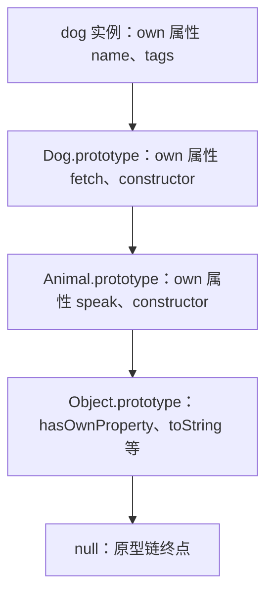

# Class 与原型继承：MDN 精读

!!! abstract "核心结论"

    - JavaScript 的继承只有一种机制：对象的 `[[Prototype]]` 内部槽构成的原型链。`class` 是这套机制之上的语法抽象，不是新的继承模型（MDN《Inheritance and the prototype chain》明确表述）。
    - 属性读取是"先自有、再沿 `[[Prototype]]` 逐级向上、直到 `null` 为止"的查找；写入（赋值）默认只落在对象自身上，即 property shadowing。
    - `class` 与 `function` 构造函数的可观测差异至少有四处：不能无 `new` 调用、声明存在 TDZ、原型方法不可枚举、`Class.prototype` 属性不可写且不可配置。
    - 枚举（enumerable）与所有权（own / inherited）是两个正交维度。`for...in` 会遍历继承来的可枚举字符串键，`Object.keys` 只看自有可枚举字符串键，二者不能混用。
    - 手写 `new` / `instanceof` / `Object.create` / 寄生组合继承的价值不在于替代它们，而在于把 `[[Construct]]`、`OrdinaryHasInstance`、`OrdinaryObjectCreate` 这些抽象操作变成可验证的代码。

## 1. 原型链与属性查找：直达抽象操作

### 1.1 三个必须分清的概念

MDN 反复强调不要混淆三样东西：

- `obj.[[Prototype]]`：对象的原型内部槽，对应 `Object.getPrototypeOf(obj)`，用 `Object.setPrototypeOf` 修改。
- `func.prototype`：函数对象上的一个**普通数据属性**，只在把该函数当作构造函数 `new` 时，被用作新对象的 `[[Prototype]]`。
- `obj.__proto__`：`Object.prototype` 上的一个访问器属性（getter/setter），是历史遗留的"事实标准"，虽然现代引擎都实现了它，但 MDN 明确建议用 `Object.getPrototypeOf` / `Object.setPrototypeOf`。注意 `{ __proto__: x }` 这种**对象字面量语法**是标准且未废弃的，与 `obj.__proto__` 访问器不是一回事。

### 1.2 属性读取的抽象操作

规范层面的读取路径可以概括为 `OrdinaryGet`：

1. 令 `desc = O.[[GetOwnProperty]](P)`；
2. 若 `desc` 存在：数据属性直接返回 value；访问器属性返回调用 getter 的结果（`this` 为接收者 `Receiver`，这正是"继承的方法里 `this` 指向调用者"的原因）；
3. 若 `desc` 不存在，令 `parent = O.[[Prototype]]`；`parent` 为 `null` 则返回 `undefined`，否则回到第 1 步并令 `O = parent`。

写入路径则是 `OrdinarySetWithOwnDescriptor`：若沿链找到的是一个**访问器**（且无 setter）或是一个**不可写数据属性**，写入会被拒绝（严格模式抛 `TypeError`）；否则在**接收者自身上**创建/更新属性，这就是 property shadowing 的本质——原型不会被改写。



### 1.3 手写查找器与验证

这段代码要解决的是：把"属性到底属于链上的哪一环"变成一个可断言的返回值，从而把上面的抽象操作落到可运行代码上。

```js
// 运行环境：Node.js（CommonJS，建议 18 及以上），文件名 lookup.js，node lookup.js
"use strict";
const assert = require("node:assert/strict");

// 第 1 段：统一的自有属性判断。Object.hasOwn 属于较新 API，用 hasOwnProperty.call
// 可以保证代码在任何现代运行时都能跑，且不会因为对象自身覆盖了 hasOwnProperty 而失效。
const hasOwn = (obj, key) => Object.prototype.hasOwnProperty.call(obj, key);

// 第 2 段：搭出一条长度为 4 的原型链：child -> parent -> grandparent -> Object.prototype -> null
const grandparent = { d: 5 };
const parent = Object.create(grandparent);
parent.b = 3;
parent.c = 4;
const child = Object.create(parent);
child.a = 1;
child.b = 2;

// 第 3 段：模拟 OrdinaryGet 里"找到属性归属者"的那部分循环。
// 关键点：从对象自身开始比较，命中即返回；每轮回退到 [[Prototype]]；null 表示整条链都没找到。
function findOwner(obj, key) {
  let cur = obj;
  while (cur !== null) {
    if (hasOwn(cur, key)) return cur;
    cur = Object.getPrototypeOf(cur);
  }
  return null;
}

// 第 4 段：验证。注意 child.b === 2 而不是 3，这是 shadowing 的直接证据。
assert.strictEqual(findOwner(child, "a"), child);
assert.strictEqual(findOwner(child, "b"), child);
assert.strictEqual(findOwner(child, "c"), parent);
assert.strictEqual(findOwner(child, "d"), grandparent);
assert.strictEqual(findOwner(child, "toString"), Object.prototype);
assert.strictEqual(findOwner(child, "nope"), null);
assert.strictEqual(child.b, 2);
assert.strictEqual(child.nope, undefined);
console.log("OK: 原型链查找");
```

预期输出：

```plain
OK: 原型链查找
```

逐段解析：

1. `hasOwn` 用 `call` 绑定，避免 `obj.hasOwnProperty` 被同名自有属性遮蔽后调用失败——这正是 `Object.hasOwn` 被引入的动机之一。
2. 三个对象用 `Object.create` 串联，链的最后默认是 `Object.prototype`，因此 `toString` 的归属者是 `Object.prototype`。
3. `findOwner` 的循环边界是 `null`。规范中 `null` 被定义为链的终点，它自身没有 `[[Prototype]]`，所以不能用 `getPrototypeOf(null)` 去继续找（那会抛 `TypeError`）。
4. 易错点：`Object.getPrototypeOf(1)` 会先装箱并返回 `Number.prototype`，而原始的属性查找对原始值走的是 `ToObject` 之后的路径，两者在 `instanceof` 语义上并不等价，第 6 节会再遇到这个问题。

## 2. 属性枚举与所有权

### 2.1 三个维度

MDN《Enumerability and ownership of properties》把每个属性按三个维度分类：可枚举 / 不可枚举，字符串键 / symbol 键，自有 / 继承。**简单赋值和对象字面量创建的属性默认可枚举**；`Object.defineProperty` 创建的属性默认**不可枚举**。`class` 的方法按规范是用 `DefinePropertyOrThrow` 定义的，因此不可枚举；而 `F.prototype.m = function () {}` 这种赋值方式创建的方法**可枚举**。

### 2.2 查询方法对比

| 方法 | 可枚举自有 | 可枚举继承 | 不可枚举自有 | 不可枚举继承 |
| :-- | :-- | :-- | :-- | :-- |
| `propertyIsEnumerable()` | true | false | false | false |
| `hasOwnProperty()` | true | false | true | false |
| `Object.hasOwn()` | true | false | true | false |
| `in` 运算符 | true | true | true | true |

### 2.3 遍历方法对比

| 方法 | 可枚举自有 | 可枚举继承 | 不可枚举自有 | 不可枚举继承 |
| :-- | :-- | :-- | :-- | :-- |
| `Object.keys` / `values` / `entries` | 是（字符串） | 否 | 否 | 否 |
| `Object.getOwnPropertyNames` | 是（字符串） | 否 | 是（字符串） | 否 |
| `Object.getOwnPropertySymbols` | 是（symbol） | 否 | 是（symbol） | 否 |
| `Object.getOwnPropertyDescriptors` | 是 | 否 | 是 | 否 |
| `Reflect.ownKeys` | 是 | 否 | 是 | 否 |
| `for...in` | 是（字符串） | 是（字符串） | 否 | 否 |
| `Object.assign`（第一个参数之后） | 是 | 否 | 否 | 否 |
| 对象展开 `{ ...obj }` | 是 | 否 | 否 | 否 |

### 2.4 手写属性分类检索器与验证

这段代码要解决的是：把上两张表变成可以逐条断言的函数，顺便印证"方法名不同则可见集合不同"。

```js
// 运行环境：Node.js（CommonJS），文件名 enumerability.js，node enumerability.js
"use strict";
const assert = require("node:assert/strict");

const hasOwn = (obj, key) => Object.prototype.hasOwnProperty.call(obj, key);

// 第 1 段：准备四种属性形态。defineProperty 不写 enumerable 时默认为 false。
const proto = {};
Object.defineProperty(proto, "inheritedNonEnum", { value: 1, enumerable: false });
proto.inheritedEnum = 2;

const obj = Object.create(proto);
obj.ownEnum = 3;
Object.defineProperty(obj, "ownNonEnum", { value: 4, enumerable: false });
const sym = Symbol("s");
obj[sym] = 5;

// 第 2 段：按"自有/继承 × 可枚举/不可枚举 × 字符串/symbol"分类检索。
// 注意 propertyIsEnumerable 对继承属性一律返回 false，所以"自有的不可枚举键"可以这样反推。
const SimplePropertyRetriever = {
  getOwnEnumProps(o) {
    return Object.keys(o);
  },
  getOwnNonEnumProps(o) {
    return Object.getOwnPropertyNames(o).filter(
      (k) => !Object.prototype.propertyIsEnumerable.call(o, k),
    );
  },
  getOwnStringProps(o) {
    return Object.getOwnPropertyNames(o);
  },
  getOwnSymbolProps(o) {
    return Object.getOwnPropertySymbols(o);
  },
  getInheritedEnumProps(o) {
    const out = [];
    for (const k in o) if (!hasOwn(o, k)) out.push(k);
    return out;
  },
  getAllEnumProps(o) {
    const out = [];
    for (const k in o) out.push(k);
    return out;
  },
};

// 第 3 段：验证属性键集合。整数样式的键会排在字符串键之前，这里没有整数键，顺序即创建顺序。
assert.deepStrictEqual(SimplePropertyRetriever.getOwnEnumProps(obj), ["ownEnum"]);
assert.deepStrictEqual(SimplePropertyRetriever.getOwnNonEnumProps(obj), ["ownNonEnum"]);
assert.deepStrictEqual(SimplePropertyRetriever.getOwnStringProps(obj), ["ownEnum", "ownNonEnum"]);
assert.deepStrictEqual(SimplePropertyRetriever.getOwnSymbolProps(obj), [sym]);
assert.deepStrictEqual(SimplePropertyRetriever.getInheritedEnumProps(obj), ["inheritedEnum"]);
assert.deepStrictEqual(SimplePropertyRetriever.getAllEnumProps(obj), ["ownEnum", "inheritedEnum"]);
assert.deepStrictEqual(Reflect.ownKeys(obj), ["ownEnum", "ownNonEnum", sym]);

// 第 4 段：验证四类查询方法的判定差异。
assert.strictEqual(obj.propertyIsEnumerable("ownEnum"), true);
assert.strictEqual(obj.propertyIsEnumerable("inheritedEnum"), false);
assert.strictEqual(hasOwn(obj, "ownNonEnum"), true);
assert.strictEqual(hasOwn(obj, "inheritedNonEnum"), false);
assert.strictEqual("inheritedNonEnum" in obj, true);
assert.strictEqual("inheritedEnum" in obj, true);
assert.strictEqual("nope" in obj, false);
if (typeof Object.hasOwn === "function") {
  assert.strictEqual(Object.hasOwn(obj, "ownNonEnum"), true);
  assert.strictEqual(Object.hasOwn(obj, "inheritedNonEnum"), false);
}

// 第 5 段：拷贝类操作只看"自有且可枚举"，但 symbol 键会被一起带走。
const copy = Object.assign({}, obj);
assert.deepStrictEqual(Object.keys(copy), ["ownEnum"]);
assert.strictEqual(copy[sym], 5);
assert.strictEqual(hasOwn(copy, "ownNonEnum"), false);
console.log("OK: 枚举与所有权");
```

预期输出：

```plain
OK: 枚举与所有权
```

逐段解析：

1. `proto.inheritedEnum = 2` 用的是赋值，所以可枚举；`defineProperty` 那条默认可枚举为 false，这就是"默认值不同"的对照实验。
2. `getOwnNonEnumProps` 依赖 `propertyIsEnumerable` 只对自有的可枚举属性返回 true 这一事实，属于演示级写法；生产环境更直接的方式是读取 `Object.getOwnPropertyDescriptors` 里的 `enumerable` 字段。
3. `deepStrictEqual` 可以直接比较包含 symbol 的数组，因为 symbol 按引用同一性比较。
4. `Object.hasOwn` 是较新的静态方法，代码里用 `typeof` 做了能力检测，保证在缺少该 API 的运行时依然可跑；具体引入版本请核对官方文档与目标运行时的兼容性表。
5. 易错点：`for...in` 的顺序规范只保证"自有键先于继承键"，跨原型的整体顺序在各实现间不承诺严格一致，业务代码不应依赖。

## 3. `new`、`Object.create` 与手写实现

### 3.1 `[[Construct]]` 做了什么

`new F(...args)` 触发 `EvaluateNew`，最终走到 `F.[[Construct]]`（`OrdinaryCreateFromConstructor` 路径），可观测的步骤是：

1. 检查 `F` 是否可构造。箭头函数、方法简写、`async` 函数没有 `[[Construct]]`，会抛 `TypeError`；`class` 构造器有 `[[Construct]]`，但其 `[[Call]]` 会直接抛错。
2. 取 `F.prototype`，若它是对象就以它为原型创建新对象（`OrdinaryObjectCreate`），否则以 `Object.prototype` 为原型。
3. 以新对象为 `this`，以 `new.target`（此处即 `F`）调用函数体。
4. 若构造函数返回的是**对象或函数**，整体表达式的结果就是那个返回值；否则结果是第 2 步创建的对象。

### 3.2 手写 `myNew` 与 `myObjectCreate`

这段代码要解决的是：把上面四个步骤写成一个可以对照原生行为做断言的函数。

```js
// 运行环境：Node.js（CommonJS），文件名 my-new.js，node my-new.js
"use strict";
const assert = require("node:assert/strict");

// 第 1 段：手写 new。
// 第 1.1 步：非函数直接抛错，模拟引擎在 [[Construct]] 失败时的行为。
// 第 1.2 步：只接受对象/函数型的 prototype，其余回退到 Object.prototype。
// 第 1.3 步：用 Reflect.apply 以新对象为 this 调用，避免 F.apply 被自身覆盖。
// 第 1.4 步：返回值只有是对象/函数时才采用，原始值被忽略。
function myNew(Constructor, ...args) {
  if (typeof Constructor !== "function") {
    throw new TypeError("Constructor is not a function");
  }
  const proto = Constructor.prototype;
  const targetProto =
    proto !== null && (typeof proto === "object" || typeof proto === "function")
      ? proto
      : Object.prototype;
  const obj = Object.create(targetProto);
  const result = Reflect.apply(Constructor, obj, args);
  const isObjectLike =
    result !== null && (typeof result === "object" || typeof result === "function");
  return isObjectLike ? result : obj;
}

// 第 2 段：手写 Object.create。真实实现走 OrdinaryObjectCreate，不经过中间对象；
// 这里用 {} + setPrototypeOf 是为了演示语义，性能与副作用都不等价，代码注释里标注了取舍。
function myObjectCreate(proto, propertiesObject) {
  if (proto !== null && typeof proto !== "object" && typeof proto !== "function") {
    throw new TypeError("Object prototype may only be an Object or null");
  }
  const obj = {};
  Object.setPrototypeOf(obj, proto);
  if (propertiesObject !== undefined) {
    Object.defineProperties(obj, propertiesObject);
  }
  return obj;
}

// 第 3 段：验证 myNew 的四种典型情形。
function Point(x, y) {
  this.x = x;
  this.y = y;
}
Point.prototype.norm = function () {
  return this.x + this.y;
};
const p = myNew(Point, 3, 4);
assert.ok(p instanceof Point);
assert.strictEqual(p.norm(), 7);
assert.strictEqual(Object.getPrototypeOf(p), Point.prototype);

function ReturnsObject() {
  this.tag = "own";
  return { tag: "returned" };
}
assert.strictEqual(myNew(ReturnsObject).tag, "returned");

function ReturnsPrimitive() {
  this.tag = "own";
  return 42;
}
assert.strictEqual(myNew(ReturnsPrimitive).tag, "own");

// 第 4 段：myNew 无法覆盖的场景，必须诚实标注。
// 类构造器的 [[Call]] 会抛错，所以手写 new 无法通用地构造 class 实例。
assert.throws(() => myNew(class A { constructor() { this.a = 1; } }), TypeError);
// 箭头函数没有 prototype，手写实现会静默回退到 Object.prototype，而原生 new 会抛错。
assert.throws(() => new (() => {})(), TypeError);
assert.ok(myNew(() => {}) instanceof Object);

// 第 5 段：验证 myObjectCreate 与原型属性描述符。
assert.strictEqual(Object.getPrototypeOf(myObjectCreate(null)), null);
assert.strictEqual(myObjectCreate(null).toString, undefined);
assert.throws(() => myObjectCreate(1), TypeError);
const made = myObjectCreate({}, { k: { value: 1, enumerable: true } });
assert.strictEqual(made.k, 1);
assert.strictEqual(Object.getPrototypeOf(made).hasOwnProperty("k"), false);

const pd = Object.getOwnPropertyDescriptor(Point, "prototype");
assert.strictEqual(pd.writable, true);
assert.strictEqual(pd.enumerable, false);
assert.strictEqual(pd.configurable, false);
console.log("OK: new 与 Object.create");
```

预期输出：

```plain
OK: new 与 Object.create
```

逐段解析：

1. 第 1.2 步的分支对应规范里"`prototype` 不是对象就退回 `Object.prototype`"的规则；如果用 `F.prototype = null`，原生 `new` 会给出以 `Object.prototype` 为原型的对象，而不是 `null` 原型的对象，这一点很容易记反。
2. 第 1.4 步的返回值规则解释了"构造函数里 `return {}` 会顶替实例"这类笔试题。注意 `return function () {}` 同样会顶替，因为函数也是对象。
3. `myObjectCreate(null)` 得到的对象没有 `Object.prototype`，所以 `toString` 不存在、`instanceof Object` 为 false，这是做纯字典对象的常见手段。
4. 手写 `myNew` 的两处能力缺口必须在面试中说出来：一是 `class` 的 `[[Call]]` 会抛错，二是箭头函数没有 `prototype`。不要声称手写 `new` 与原生完全等价。
5. 易错点：`myObjectCreate` 先建 `{}` 再 `setPrototypeOf`，会触发已有的原型修改钩子（若发生在代理对象上）；真实 `Object.create` 不经过这一步。

## 4. `class` 的语义：静态、私有、getter 与 `super`

### 4.1 `class` 与函数构造函数的可观测差异

| 维度 | `class` 声明 | `function` 构造函数 |
| :-- | :-- | :-- |
| 无 `new` 调用 | 抛 `TypeError` | 正常执行，`this` 为 `undefined`（严格模式）或全局对象 |
| 声明提升 | 存在 TDZ，声明前使用抛 `ReferenceError` | 函数声明整体提升，可先用后声明 |
| 原型方法可枚举性 | 不可枚举 | 赋值方式创建则可枚举 |
| `Ctor.prototype` 属性描述符 | `writable: false, configurable: false` | `writable: true, configurable: false` |
| 实例字段初始化 | 字段初始化器在 `super()` 之后、构造体之前按声明顺序执行 | 需在构造函数体内手写赋值 |
| 私有成员 | `#x` 语法，真正的词法作用域私有 | 无等价物 |
| `new.target` | 支持 | 支持 |

### 4.2 私有成员、静态块与 brand check

这段代码要解决的是：把实例字段、私有字段、getter/setter、静态字段、静态块、`#x in obj` 放在一个类里，逐项断言其存储位置与可枚举性。

```js
// 运行环境：Node.js（CommonJS），文件名 class-features.js，node class-features.js
// 说明：私有字段、静态块、#x in obj 属于较新的语言特性，请在目标环境核对兼容性。
"use strict";
const assert = require("node:assert/strict");
const hasOwn = (obj, key) => Object.prototype.hasOwnProperty.call(obj, key);

// 第 1 段：静态块只在类求值时执行一次，适合做一次性的静态初始化。
let staticBlockRuns = 0;
class Counter {
  static #created = 0;      // 私有静态字段
  static max;               // 公有静态字段（未初始化时值为 undefined）
  static {
    staticBlockRuns++;
    Counter.max = 1000;
  }
  #value = 0;               // 私有实例字段：只对类体可见，不是字符串键
  label;                    // 公有实例字段：会被定义为自有可枚举属性
  constructor(label) {
    this.label = label;     // 字段初始化器先于构造体执行，这里对 label 重新赋值
    Counter.#created++;     // 类体内可以访问自己的私有静态字段
  }
  get value() {
    return this.#value;
  }
  set value(v) {
    if (typeof v !== "number") throw new TypeError("value must be a number");
    this.#value = v;
  }
  static get created() {
    return Counter.#created;
  }
  static isCounter(o) {
    return #value in o;     // brand check：判断 o 是否带这个私有字段
  }
}

// 第 2 段：验证静态部分。
assert.strictEqual(staticBlockRuns, 1);
assert.strictEqual(Counter.max, 1000);

// 第 3 段：验证实例、私有字段与访问器。
const c1 = new Counter("c1");
assert.strictEqual(Counter.created, 1);
assert.strictEqual(c1.value, 0);
c1.value = 5;
assert.strictEqual(c1.value, 5);
assert.throws(() => {
  c1.value = "x";
}, TypeError);
assert.strictEqual(Counter.isCounter(c1), true);
assert.strictEqual(Counter.isCounter({}), false);

// 第 4 段：验证属性落位。私有字段不进 Object.keys，访问器不落在实例上。
assert.strictEqual(hasOwn(c1, "label"), true);
assert.strictEqual(hasOwn(c1, "value"), false);
assert.deepStrictEqual(Object.keys(c1), ["label"]);
const valueDesc = Object.getOwnPropertyDescriptor(Counter.prototype, "value");
assert.strictEqual(typeof valueDesc.get, "function");
assert.strictEqual(typeof valueDesc.set, "function");
assert.strictEqual(valueDesc.enumerable, false);

// 第 5 段：类不能被当普通函数调用；类的 prototype 属性不可写不可配置。
assert.throws(() => Counter("x"), TypeError);
const protoDesc = Object.getOwnPropertyDescriptor(Counter, "prototype");
assert.strictEqual(protoDesc.writable, false);
assert.strictEqual(protoDesc.configurable, false);
console.log("OK: class 成员语义");
```

预期输出：

```plain
OK: class 成员语义
```

逐段解析：

1. 静态块按规范在类定义求值时执行且只执行一次，它和"给静态字段赋值"的区别是前者可以写多语句、可以访问类名。
2. `#value` 是词法私有，不存在于对象属性表中，因此 `Object.keys` 看不到它；但它确实存在于对象内部槽对应的私有字段列表中，`#value in o` 就是对这个列表做 brand check。
3. 访问器定义在 `Counter.prototype` 上而非实例上，所以 `hasOwn(c1, "value")` 为 false，而沿着原型链读取 `c1.value` 会触发 getter，`this` 为 `c1`。
4. 实例字段用 `CreateDataPropertyOrThrow` 定义，`enumerable`、`writable`、`configurable` 都为 true；类方法用 `DefinePropertyOrThrow` 且显式设置 `enumerable: false`。这条差异是"`Object.keys` 拿不到类方法"的根因。
5. 易错点：`Counter.max` 未在静态块里赋值前是 `undefined`，字段声明不等于赋值；另外 `static max;` 与 `Counter.max = 1000` 的组合只是演示，实际项目里直接 `static max = 1000` 更清晰。

### 4.3 `super` 与派生类

`super` 的解析依赖方法的 `[[HomeObject]]` 内部槽：`super.x` 的查找起点是 `HomeObject.[[Prototype]]`，而 `this` 仍然是当前调用者，因此静态 `super` 沿"构造函数的原型链"走，实例 `super` 沿"实例原型的原型链"走。派生类的构造器在调用 `super()` 之前 `this` 处于未初始化状态，访问会抛 `ReferenceError`。

```js
// 运行环境：Node.js（CommonJS），文件名 super-demo.js，node super-demo.js
"use strict";
const assert = require("node:assert/strict");

// 第 1 段：基类。静态方法用 new this(...) 而不是 new Animal(...)，这样派生类调用时能返回派生类实例。
class Animal {
  constructor(name) {
    this.name = name;
  }
  static create(name) {
    return new this(name);
  }
  describe() {
    return "Animal:" + this.name;
  }
}

// 第 2 段：派生类。super() 调用父构造并初始化 this；super.describe() 从 [[HomeObject]] 的原型开始找；
// 静态 super 沿 Dog 的 [[Prototype]]（即 Animal）找。
class Dog extends Animal {
  constructor(name, breed) {
    super(name);
    this.breed = breed;
  }
  describe() {
    return super.describe() + "/" + this.breed;
  }
  static create(name) {
    return super.create(name);
  }
}

const d = new Dog("Rex", "corgi");
assert.strictEqual(d.describe(), "Animal:Rex/corgi");
assert.ok(Dog.create("Fido") instanceof Dog);
assert.strictEqual(Object.getPrototypeOf(Dog), Animal);
assert.strictEqual(Object.getPrototypeOf(Dog.prototype), Animal.prototype);
assert.strictEqual(Dog.prototype.constructor, Dog);

// 第 3 段：super() 之前访问 this 会抛 ReferenceError；类声明有 TDZ；类表达式名字只在类体内可见。
class Bad extends Animal {
  constructor() {
    let caught = null;
    try {
      this.x = 1;
    } catch (e) {
      caught = e.constructor;
    }
    super("b");
    Bad.caught = caught;
  }
}
new Bad();
assert.strictEqual(Bad.caught, ReferenceError);

assert.throws(() => new NotYetDeclared(), ReferenceError);
class NotYetDeclared {}

const Named = class Inner {
  static self() {
    return Inner;
  }
};
assert.strictEqual(Named.self(), Named);
assert.throws(() => Inner, ReferenceError);
console.log("OK: super 与类语义");
```

预期输出：

```plain
OK: super 与类语义
```

逐段解析：

1. 实例方法里的 `super.describe()` 不是"拷贝父方法再调用"，而是带 `[[HomeObject]]` 的动态查找，`this` 保持为 `d`。所以父方法内部读到的 `this.name` 来自子类实例。
2. 静态 `super.create(name)` 的接收者 `this` 是 `Dog`，父方法里 `new this(name)` 因此创建 `Dog` 实例。若父方法写成 `new Animal(name)`，多态就断了，这一点在第 5.4 节的手写版本里会形成对照。
3. 派生构造器必须先 `super()` 才能用 `this`，这不是风格约定而是规范要求：`this` 由父构造器返回的 `this` 绑定初始化。
4. 类声明存在 TDZ，`new NotYetDeclared()` 在声明前执行会抛 `ReferenceError`；类表达式命名只在类体内部可解析。
5. 易错点：`assert.throws(() => Inner, ReferenceError)` 之所以成立，是因为 `Inner` 在模块作用域从未声明，读取它本身就是 `ReferenceError`，不要误读为"类名泄漏后被检测到"。

## 5. 继承的几种写法与寄生组合继承

### 5.1 原型链继承

```js
// 运行环境：Node.js（CommonJS），文件名 inherit-forms.js，node inherit-forms.js
"use strict";
const assert = require("node:assert/strict");

// 第 1 段：父构造函数。tags 是引用类型，专门用来暴露共享缺陷。
function Animal(name) {
  this.name = name;
  this.tags = ["animal"];
}
Animal.prototype.speak = function () {
  return this.name + " speaks";
};

// 第 2 段：原型链继承——直接把"一个父实例"当作子类的 prototype。
function DogChain() {}
DogChain.prototype = new Animal("anonymous");
DogChain.prototype.constructor = DogChain;

const dc1 = new DogChain();
const dc2 = new DogChain();
dc1.tags.push("puppy");
assert.strictEqual(dc1.name, "anonymous");            // 无法逐实例传参
assert.strictEqual(dc1.speak(), "anonymous speaks");
assert.deepStrictEqual(dc2.tags, ["animal", "puppy"]); // 引用类型被所有实例共享

// 第 3 段：构造函数继承——在子构造里调用父构造，只拿到实例属性，拿不到原型方法。
function DogCall(name) {
  Animal.call(this, name);
}
const call1 = new DogCall("Rex");
assert.strictEqual(call1.name, "Rex");
assert.deepStrictEqual(call1.tags, ["animal"]);
assert.strictEqual(call1.speak, undefined);            // 原型链没接上
assert.strictEqual(call1.constructor, Object);         // 原型仍是普通对象

// 第 4 段：组合继承——两种缺陷都补上，代价是父构造被执行两次。
let animalCalls = 0;
function AnimalCounted(name) {
  animalCalls++;
  this.name = name;
  this.tags = ["animal"];
}
AnimalCounted.prototype.speak = function () {
  return this.name + " speaks";
};
function DogCombo(name) {
  AnimalCounted.call(this, name);
}
animalCalls = 0;
DogCombo.prototype = new AnimalCounted("__proto__");   // 第 1 次调用：为了搭原型链
const combo = new DogCombo("Combo");                    // 第 2 次调用：为了初始化实例
assert.strictEqual(animalCalls, 2);
assert.strictEqual(combo.name, "Combo");
assert.deepStrictEqual(combo.tags, ["animal"]);
assert.strictEqual(combo.speak(), "Combo speaks");
console.log("OK: 三种经典继承写法");
```

预期输出：

```plain
OK: 三种经典继承写法
```

逐段解析：

1. 原型链继承把父实例当原型，于是"每个实例都该独立"的引用型属性变成了原型上的共享属性，这是最经典的 bug。
2. 构造函数继承解决了共享与传参，但 `DogCall.prototype` 依然是默认的普通对象，原型方法链没有建立，`call1.speak` 为 `undefined`。
3. 组合继承两条都补上，但 `new AnimalCounted("__proto__")` 这一次调用只是为了拿到原型对象，其产生的 `name`、`tags` 成了永远被遮蔽的僵尸属性，这就是"父构造调用两次"的浪费来源。
4. 第 2 段里 `DogChain.prototype.constructor = DogChain` 用的是赋值，会创建**可枚举**的 `constructor` 属性，这是个常被忽略的副作用；第 5.4 节用手写 `defineProperty` 修正。
5. 易错点：只用 `DogCall.prototype = Animal.prototype` 是更危险的写法，因为两个构造器会共享同一个原型对象，给子类加方法会污染父类。

### 5.2 寄生组合继承与 `class extends` 对照

这段代码要解决的是：给出一个不重复调用父构造、又完整接上原型链与静态链的手写继承工具，并和 `class extends` 逐项对照。

```js
// 运行环境：Node.js（CommonJS），文件名 parasitic.js，node parasitic.js
"use strict";
const assert = require("node:assert/strict");
const hasOwn = (obj, key) => Object.prototype.hasOwnProperty.call(obj, key);

// 第 1 段：父构造函数 + 原型方法 + 静态方法。
function Animal(name) {
  this.name = name;
  this.tags = ["animal"];
}
Animal.prototype.speak = function () {
  return this.name + " speaks";
};
Animal.create = function (name) {
  return new Animal(name);      // 注意：写死 Animal，不具备多态
};

// 第 2 段：寄生组合继承。核心是 Object.create(Parent.prototype) 只借用原型、
// 不执行父构造，再用 defineProperty 静默修正 constructor，最后把构造函数本身也挂到父构造函数上。
function inherit(Child, Parent) {
  Child.prototype = Object.create(Parent.prototype, {
    constructor: {
      value: Child,
      writable: true,
      enumerable: false,
      configurable: true,
    },
  });
  Object.setPrototypeOf(Child, Parent);
  return Child;
}

// 第 3 段：子类。实例属性靠父构造调用初始化，原型方法靠自己定义。
function Dog(name) {
  Animal.call(this, name);
}
inherit(Dog, Animal);
Dog.prototype.fetch = function () {
  return this.name + " fetches";
};

// 第 4 段：验证原型链、属性落位、引用独立性与描述符。
const d1 = new Dog("Rex");
const d2 = new Dog("Fido");
assert.strictEqual(d1.speak(), "Rex speaks");
assert.strictEqual(d1.fetch(), "Rex fetches");
assert.ok(d1 instanceof Dog && d1 instanceof Animal && d1 instanceof Object);
assert.strictEqual(Object.getPrototypeOf(d1), Dog.prototype);
assert.strictEqual(Object.getPrototypeOf(Dog.prototype), Animal.prototype);
assert.strictEqual(Object.getPrototypeOf(Dog), Animal);
assert.ok(hasOwn(d1, "name") && hasOwn(d1, "tags"));
assert.ok(!hasOwn(d1, "speak") && !hasOwn(d1, "fetch"));
assert.deepStrictEqual(Object.keys(d1), ["name", "tags"]);
d1.tags.push("puppy");
assert.deepStrictEqual(d2.tags, ["animal"]);          // 引用类型不再共享
assert.strictEqual(Dog.prototype.constructor, Dog);
assert.strictEqual(Object.getOwnPropertyDescriptor(Dog.prototype, "constructor").enumerable, false);
assert.strictEqual(Object.getOwnPropertyDescriptor(Dog.prototype, "fetch").enumerable, true);
assert.strictEqual(typeof Dog.create, "function");    // 静态成员沿构造函数原型链继承
assert.ok(Dog.create("x") instanceof Animal);          // 但返回的是 Animal，不是 Dog

// 第 5 段：等价的 class 写法，注意静态方法的 new this。
class AnimalC {
  constructor(name) {
    this.name = name;
    this.tags = ["animal"];
  }
  speak() {
    return this.name + " speaks";
  }
  static create(name) {
    return new this(name);
  }
}
class DogC extends AnimalC {
  constructor(name) {
    super(name);
  }
  fetch() {
    return this.name + " fetches";
  }
}
const c1 = new DogC("Rex");
assert.ok(c1 instanceof DogC && c1 instanceof AnimalC);
assert.ok(DogC.create("x") instanceof DogC);
assert.strictEqual(Object.getPrototypeOf(DogC), AnimalC);
assert.strictEqual(Object.getPrototypeOf(DogC.prototype), AnimalC.prototype);
assert.strictEqual(Object.getOwnPropertyDescriptor(DogC.prototype, "fetch").enumerable, false);
assert.deepStrictEqual(Object.keys(c1), ["name", "tags"]);
console.log("OK: 寄生组合继承与 class 对照");
```

预期输出：

```plain
OK: 寄生组合继承与 class 对照
```

逐段解析：

1. 第 2 段是全篇最值得背的十行代码：`Object.create(Parent.prototype)` 把原型链一次接好且不执行父构造，因此父构造只在实例化时被调用一次。
2. `constructor` 必须用 `defineProperty` 且显式 `enumerable: false`，否则它会出现在 `for...in` 与 `Object.keys` 里，与 `class` 的行为不一致。
3. `Object.setPrototypeOf(Child, Parent)` 让子构造函数继承父构造函数的静态成员，对应 `class extends` 里 `Object.getPrototypeOf(DogC) === AnimalC`。
4. 静态成员继承是"函数对象共用"，`Dog.create` 实际执行的是 `Animal.create`，内部 `new Animal(name)` 写死了父类，所以返回的是 `Animal` 实例。`class` 版本用 `new this(name)` 才是多态的。这是手写继承与 `class` 最容易踩的语义鸿沟。
5. 手写版本的 `Dog.prototype.fetch` 用赋值创建，因此可枚举；`class` 版本不可枚举。两者在 `Object.keys(Dog.prototype)`、`for...in` 上表现不同，属于已知差异而非 bug。

### 5.3 五种继承写法对比

| 写法 | 能否逐实例传参 | 引用属性是否共享 | 原型方法可用 | 父构造调用次数 | 主要缺陷 |
| :-- | :-- | :-- | :-- | :-- | :-- |
| 原型链继承 `Child.prototype = new Parent()` | 否 | 是 | 是 | 1（定义期） | 共享引用属性、无法传参 |
| 构造函数继承 `Parent.call(this, ...)` | 是 | 否 | 否 | 每实例 1 次 | 拿不到原型方法 |
| 组合继承 | 是 | 否 | 是 | 2 | 父构造多执行一次、原型上有僵尸属性 |
| 寄生组合继承 | 是 | 否 | 是 | 1 | 需要手写 prototype 与 constructor 修正 |
| `class extends` | 是 | 否 | 是 | 1 | 需要较新的运行时；方法与静态方法不可枚举 |

## 6. `instanceof` 与 `Symbol.hasInstance`

### 6.1 判定算法

`obj instanceof F` 的求值顺序是：

1. 取 `F[Symbol.hasInstance]`。若它不是 `undefined`，调用它并把结果转成布尔值返回。
2. 否则若 `F` 不是可调用对象，抛 `TypeError`。
3. 否则若 `F` 是绑定函数，用其目标函数重做判定。
4. 令 `P = F.prototype`，若 `P` 不是对象，抛 `TypeError`。
5. 令 `O = obj`，循环：若 `O` 不是对象则返回 false；若 `P` 与 `O.[[Prototype]]` 相同则返回 true；否则 `O = O.[[Prototype]]`，继续。

这正是它常被称作"用原型链做品牌检查"的原因，也是"`Object.create(null)` 的实例对任何构造器都返回 false"的原因。

### 6.2 手写 `myInstanceOf`

这段代码要解决的是：把上面的五步落成代码，并正确处理原始值、非对象原型与自定义 `Symbol.hasInstance` 三种边界。

```js
// 运行环境：Node.js（CommonJS），文件名 my-instanceof.js，node my-instanceof.js
"use strict";
const assert = require("node:assert/strict");

// 第 1 段：手写 instanceof。
// 第 1.1 步：右操作数必须可调用。规范是先查 @@hasInstance 再查可调用性，
//            这里把可调用性前置，属于简化，对普通构造器结果一致。
// 第 1.2 步：用户自定义了 Symbol.hasInstance 时交给它处理；若与内置实现相同则继续走原型链比较。
// 第 1.3 步：原始值直接返回 false，避免 Object.getPrototypeOf 对原始值装箱带来的误判。
// 第 1.4 步：F.prototype 必须是对象，否则按规范抛 TypeError。
function myInstanceOf(value, C) {
  if (typeof C !== "function") {
    throw new TypeError("Right-hand side of 'instanceof' is not callable");
  }
  const custom = C[Symbol.hasInstance];
  if (typeof custom === "function" && custom !== Function.prototype[Symbol.hasInstance]) {
    return Boolean(custom.call(C, value));
  }
  if (value === null || (typeof value !== "object" && typeof value !== "function")) {
    return false;
  }
  const targetProto = C.prototype;
  if (
    targetProto === null ||
    (typeof targetProto !== "object" && typeof targetProto !== "function")
  ) {
    throw new TypeError("Function has non-object prototype in instanceof check");
  }
  let cur = Object.getPrototypeOf(value);
  while (cur !== null) {
    if (cur === targetProto) return true;
    cur = Object.getPrototypeOf(cur);
  }
  return false;
}

// 第 2 段：常规继承链上的验证，与原生结果逐条对照。
class A {}
class B extends A {}
const b = new B();
for (const Ctor of [B, A, Object]) {
  assert.strictEqual(myInstanceOf(b, Ctor), b instanceof Ctor);
}
assert.strictEqual(myInstanceOf(b, String), false);

// 第 3 段：边界情形。
assert.strictEqual(myInstanceOf(1, Number), 1 instanceof Number);   // 都是 false
assert.strictEqual(myInstanceOf(Object.create(null), Object), false);
assert.throws(() => myInstanceOf({}, 1), TypeError);
assert.throws(() => myInstanceOf({}, {}), TypeError);
function NoProto() {}
NoProto.prototype = 1;
assert.throws(() => myInstanceOf({}, NoProto), TypeError);

// 第 4 段：自定义 Symbol.hasInstance。
class Even {
  static [Symbol.hasInstance](n) {
    return typeof n === "number" && n % 2 === 0;
  }
}
assert.strictEqual(2 instanceof Even, true);
assert.strictEqual(3 instanceof Even, false);
assert.strictEqual(myInstanceOf(2, Even), true);
assert.strictEqual(myInstanceOf(3, Even), false);
console.log("OK: instanceof");
```

预期输出：

```plain
OK: instanceof
```

逐段解析：

1. 第 1.3 步的原始值短路是必需的：`Object.getPrototypeOf(1)` 会返回 `Number.prototype`，若不短路，`myInstanceOf(1, Number)` 会错误地得到 true。
2. `Object.create(null)` 的对象链上只有 `null`，循环一次都不进，返回 false，与原生一致。
3. `NoProto.prototype = 1` 会触发规范里"原型不是对象"的 `TypeError`，原生 `({}) instanceof NoProto` 同样抛错。
4. 自定义 `Symbol.hasInstance` 绕开了整条原型链，所以 `2 instanceof Even` 为 true，而 `new Object()` 并不在 `Even` 的原型链上。手写版通过比对内置实现来避免无限递归，这是一个有意的工程取舍。
5. 易错点：`a instanceof b` 存在"跨 realm 失效"的问题——来自 iframe 或 `vm` 上下文的数组，其 `Array.prototype` 与当前 realm 的不是同一个对象，因此判定为 false，实践中常改用 `Array.isArray` 或 `Object.prototype.toString.call`。

## 7. mixin：按描述符混入

### 7.1 为什么不能用 `Object.assign`

`Object.assign` 与对象展开都只处理**可枚举的自有属性**，而 `class` 的方法是不可枚举的。因此 `Object.assign(Target.prototype, Mixin)` 在 Mixin 本身是类原型时会静默失效；只有在 Mixin 是普通对象字面量时才碰巧可用。稳健做法是用 `Reflect.ownKeys` 枚举字符串键与 symbol 键，再用 `defineProperty` 原样搬运属性描述符。

### 7.2 手写 mixin 与验证

这段代码要解决的是：实现一个保留描述符标志的混入工具，并演示 `Object.assign` 在类原型上失效的过程。

```js
// 运行环境：Node.js（CommonJS），文件名 mixin.js，node mixin.js
"use strict";
const assert = require("node:assert/strict");
const hasOwn = (obj, key) => Object.prototype.hasOwnProperty.call(obj, key);

// 第 1 段：混入源。对象字面量创建的属性默认可枚举，这一点稍后会体现在描述符断言上。
const Serializable = {
  serialize() {
    return JSON.stringify({ ...this });
  },
};
const tagged = Symbol("tagged");
const Tagged = { [tagged]: true };

// 第 2 段：按描述符混入。Reflect.ownKeys 同时覆盖字符串键与 symbol 键，
// getOwnPropertyDescriptor + defineProperty 可以保留 enumerable/writable/get/set 等标志。
// 跳过 constructor，避免破坏目标类自己的构造引用。
function applyMixin(target, ...sources) {
  for (const source of sources) {
    for (const key of Reflect.ownKeys(source)) {
      if (key === "constructor") continue;
      Object.defineProperty(target, key, Object.getOwnPropertyDescriptor(source, key));
    }
  }
  return target;
}

// 第 3 段：证明 Object.assign 对 class 原型的失效。
class Base {
  constructor(x) {
    this.x = x;
  }
  baseMethod() {
    return "base";
  }
}
assert.deepStrictEqual(Object.keys(Base.prototype), []);
assert.deepStrictEqual(Object.assign({}, Base.prototype), {});
assert.deepStrictEqual({ ...Base.prototype }, {});

// 第 4 段：把 mixin 应用到类原型上并验证。
applyMixin(Base.prototype, Serializable, Tagged);
const b = new Base(1);
assert.strictEqual(b.baseMethod(), "base");
assert.strictEqual(b.serialize(), '{"x":1}');
assert.strictEqual(b[tagged], true);
assert.ok(b instanceof Base);
assert.strictEqual(hasOwn(b, "serialize"), false);          // 方法挂在原型上
assert.strictEqual(Object.getOwnPropertyDescriptor(Base.prototype, "serialize").enumerable, true);
assert.deepStrictEqual(Object.keys(b), ["x"]);

// 第 5 段：subclass factory 形式的 mixin，符合 MDN 给出的另一种写法。
const withScaled = (BaseClass) =>
  class extends BaseClass {
    scaled() {
      return this.x * 10;
    }
  };
class Point extends withScaled(Base) {}
const p = new Point(2);
assert.strictEqual(p.scaled(), 20);
assert.strictEqual(p.serialize(), '{"x":2}');   // 继承链上仍然带着前面混入的成果
assert.ok(p instanceof Point && p instanceof Base);
console.log("OK: mixin");
```

预期输出：

```plain
OK: mixin
```

逐段解析：

1. `Object.keys(Base.prototype)` 为空是关键证据：`baseMethod` 不可枚举，因此 `Object.assign({}, Base.prototype)` 得到空对象。若 Mixin 是类原型，`Object.assign` 会"什么都不做且不报错"，这是最难排查的一类失效。
2. `Reflect.ownKeys` 覆盖了 `Object.getOwnPropertyNames` 与 `Object.getOwnPropertySymbols` 的并集，因此 symbol 键也能被搬运；`b[tagged] === true` 就是证据。
3. 搬运的是**描述符本身**，所以源自对象字面量的 `serialize` 依然可枚举（断言为 true），而源自类方法的属性会保持不可枚举。mixin 不会"纠正"来源的可枚举性，这一点要明确写进文档。
4. 跳过 `constructor` 是为了不让混入源意外覆盖 `Base.prototype.constructor`，否则 `b.constructor` 会指向混入源对象。
5. subclass factory 用闭包把扩展放在类继承链上，好处是可以叠加、可以访问 `super`；代价是每调用一次就生成一个新的类，且 `instanceof` 的判定目标会随之变化。

## 8. 常见陷阱

1. 把 `obj.__proto__` 与 `func.prototype` 混为一谈。前者是对象原型链上的一环，后者是函数对象的一个普通属性；实例的原型是 `Func.prototype`，不是 `Func`。
2. 用 `Dog.prototype = Animal.prototype` 做继承。两个构造器共享同一个原型对象，给子类加方法会直接污染父类，且 `constructor` 指向错乱。
3. 把 `for...in` 当 `Object.keys` 用。`for...in` 会遍历继承来的可枚举字符串键，祖先对象上任何一个赋值式属性都会混进来。需要枚举自有键时用 `Object.keys`，需要可枚举的全部键时用 `for...in` 加 `hasOwn` 过滤。
4. 认为 `class` 的方法会出现在 `Object.keys` 或 `for...in` 里。类方法按规范显式设为不可枚举，所以 `Object.assign` 拷贝不到它们。
5. 认为 `Object.assign` 能做深拷贝。它只做一层"自有可枚举属性"的赋值，嵌套对象仍是同一个引用；也不复制原型、`getter` 描述符（getter 会被求值后拷贝成数据属性）。
6. 认为 `instanceof` 是类型系统。它在跨 realm（iframe、`vm`、worker 返回的对象）时会失效，而且 `Function.prototype[Symbol.hasInstance]` 可被自定义覆盖以改变语义。
7. 在派生类构造器里 `super()` 之前使用 `this`。规范规定此时 `this` 未初始化，抛 `ReferenceError`；`super()` 之后再访问则正常。
8. 以为 `Object.create(null)` 的对象能直接当普通对象用。它没有 `Object.prototype`，`obj.toString`、`obj.hasOwnProperty` 都不存在，`JSON.stringify` 之外的很多工具函数会抛错。需要 `hasOwnProperty` 时用 `Object.prototype.hasOwnProperty.call`。
9. 以为私有字段 `#x` 能被 `JSON.stringify` 或展开运算符看到。它是词法私有，不在属性表中，`{ ...obj }` 只展开可枚举自有属性。
10. 赋值到原型上被冻结的引用。若某属性是只读数据属性或只有 getter，严格模式下子类实例赋值会抛 `TypeError`，而不是静默失败。
11. 在构造函数里 `return 原始值` 以为能改变结果。原始值被忽略，返回对象或函数才会顶替 `this`。
12. 认为 `getPrototypeOf` 对原始值等于属性查找的原型。`Object.getPrototypeOf(1)` 返回 `Number.prototype`，而 `1 instanceof Number` 为 false，两者的语义路径不同。

## 9. 面试题与答题要点

1. JavaScript 的继承模型是什么，`class` 带来了新机制吗？
   要点：只有一种机制，即对象的 `[[Prototype]]` 链，直到 `null` 终止。`class` 是原型继承之上的抽象，MDN 明确表述为"所有 class 模式都能转换为基于原型的写法"。要能说出 `class` 的可观测差异：不能无 `new` 调用、声明有 TDZ、原型方法不可枚举、`Class.prototype` 不可写不可配置，以及私有字段在函数构造器里没有等价物。

2. `new F()` 的完整步骤，手写一个 `new` 需要覆盖哪些分支？
   要点：检查可构造性；取 `F.prototype`，非对象则回退 `Object.prototype`；以新对象为 `this` 调用；返回值若是对象/函数则采用，否则返回新对象。手写时要说明两处能力缺口：`class` 的 `[[Call]]` 会抛错、箭头函数没有 `prototype`。还要提到 `new.target` 的存在。

3. `instanceof` 的判定算法，为什么会有跨 realm 失效？
   要点：先看 `Symbol.hasInstance`，再检查可调用性与 `prototype` 是否为对象，然后沿 `[[Prototype]]` 逐级与 `F.prototype` 做同一性比较。跨 realm 失效的根因是同一性比较，不同 realm 有各自的 `Object.prototype`/`Array.prototype`，替代方案是 `Array.isArray`、`Object.prototype.toString.call`、鸭子类型判断或 `Symbol.toStringTag`。

4. `Object.keys`、`for...in`、`Reflect.ownKeys` 的区别，如何自己实现分类检索？
   要点：`Object.keys` 只看自有可枚举字符串键；`for...in` 看可枚举字符串键且包含继承；`Reflect.ownKeys` 看全部自有键（字符串加 symbol，含不可枚举）。能写出以 `getOwnPropertyNames`、`getOwnPropertySymbols`、`propertyIsEnumerable` 组合出的检索器，并说明 `propertyIsEnumerable` 对继承属性恒为 false。

5. 实现一个不重复调用父构造器的继承方案。
   要点：`Child.prototype = Object.create(Parent.prototype)`，再用 `defineProperty` 把 `constructor` 修正为 `Child` 且 `enumerable: false`，最后 `Object.setPrototypeOf(Child, Parent)` 接上静态成员链。要指出父构造只在实例化时通过 `Parent.call(this, ...)` 执行一次，并主动说明与 `class extends` 在方法可枚举性、静态方法多态（`new this` 对 `new Parent`）上的差别。

6. mixin 为什么不能直接用 `Object.assign`？
   要点：`Object.assign` 只处理自有可枚举属性，类方法默认不可枚举，所以对 `class` 原型做混入会静默失败。稳健做法是 `Reflect.ownKeys` 加 `getOwnPropertyDescriptor` / `defineProperty`，同时跳过 `constructor`，并说明它保留来源的描述符标志。

7. 私有字段 `#x` 和约定俗成的 `_x` 有什么本质区别？
   要点：`_x` 只是命名约定，仍是可枚举或可访问的普通字符串键，`for...in`、`Object.getOwnPropertyNames`、`JSON.stringify` 都可能碰到；`#x` 是词法私有，不在属性表中，只能用类体内的代码通过 brand check（`#x in obj`）检测。同时要说明它没有"反射式"的运行时访问入口，这也是它与 WeakMap 私有方案的核心差别。

8. 属性查找和属性赋值在原型链上的行为对称吗？
   要点：不对称。查找沿链向上直到命中或 `null`；赋值默认在**接收者自身上**创建或更新属性，形成 shadowing。若沿链遇到访问器或不可写数据属性，赋值会被拒绝（严格模式抛 `TypeError`）。要能举出 `child.value = 4` 遮蔽 `parent.value = 2` 的例子。

9. `super` 和 `this` 的关系，静态 `super` 与实例 `super` 的查找起点分别是什么？
   要点：`super` 依赖方法的 `[[HomeObject]]`。实例方法里 `super.x` 从 `HomeObject.[[Prototype]]` 开始查，`this` 是不变的调用者；静态方法里 `super.x` 沿构造函数的 `[[Prototype]]` 查。`super()` 只用于派生类构造器，且调用前不能访问 `this`。

10. 类字段初始化器、静态块、`super()` 的执行顺序是什么？
    要点：类求值时依次安装 `prototype`、原型方法、静态方法/静态字段、执行静态块；实例化时先 `super()`（派生类），再按声明顺序执行实例字段初始化器，最后执行构造体剩余语句。静态块只执行一次，实例字段每次实例化都执行。具体到某个运行时的边界行为，请以官方文档与兼容性表为准。

## 深入阅读与参考

!!! tip "怎么用这些资料"
    先读「官方文档与规范」建立准确的概念，再读「源码与示例」核对细节，最后用「教程、书籍与视频」换一种讲法加深理解。每条都写明了读哪一节、带着什么问题读。

### 官方文档与规范

| 资源 | 为什么读 | 怎么读 |
|---|---|---|
| [Object.create()](https://developer.mozilla.org/en-US/docs/Web/JavaScript/Reference/Global_Objects/Object/create) | 语义与属性描述符参数，是手写继承与 mixin 的基础。 | 读参数中属性描述符一节，用它实现寄生组合继承的原型赋值并验证。 |
| [new](https://developer.mozilla.org/en-US/docs/Web/JavaScript/Reference/Operators/new) | 给出 new 调用的四步内部过程，是手写实现的依据。 | 读描述中的步骤列表，然后据此手写 myNew，与 MDN 示例对照验证。 |
| [class](https://developer.mozilla.org/en-US/docs/Web/JavaScript/Reference/Statements/class) | 规范 class 的提升、TDZ 与严格模式等语义边界。 | 读描述与示例，重点看 TDZ 与不可提升，写出会抛错的用例加以验证。 |
| [Public class fields](https://developer.mozilla.org/en-US/docs/Web/JavaScript/Reference/Classes/Public_class_fields) | 说明字段初始化时机与所有权，区分实例字段与原型方法。 | 读字段初始化顺序一节，验证字段在构造器前赋值，且不挂在原型上。 |
| [super](https://developer.mozilla.org/en-US/docs/Web/JavaScript/Reference/Operators/super) | 明确 super() 与 super.prop 两种用法的语义差别。 | 读描述段，带着「super 指向谁的原型」做实验，验证静态方法中的 super。 |
| [instanceof](https://developer.mozilla.org/en-US/docs/Web/JavaScript/Reference/Operators/instanceof) | 讲清 instanceof 沿原型链逐一比较的判定过程与陷阱。 | 重点读示例中的判定步骤，读完手写等价的原型链遍历实现。 |
| [Symbol.hasInstance](https://developer.mozilla.org/en-US/docs/Web/JavaScript/Reference/Global_Objects/Symbol/hasInstance) | 自定义 instanceof 行为的唯一入口，直击抽象操作。 | 读示例中的自定义判定，再改写 instanceof 右操作数观察行为变化。 |
| [Function.prototype[Symbol.hasInstance]()](https://developer.mozilla.org/en-US/docs/Web/JavaScript/Reference/Global_Objects/Function/Symbol.hasInstance) | 给出默认 instanceof 算法的准确描述与不可覆盖性。 | 读描述中继承与不可写特性，解释为何改写它会报错并动手验证。 |
| [TypeError: invalid 'instanceof' operand 'x'](https://developer.mozilla.org/en-US/docs/Web/JavaScript/Reference/Errors/invalid_right_hand_side_instanceof_operand) | 右侧非对象报错的成因，覆盖常见陷阱小节。 | 读报错条件，构造 f instanceof 1 等用例，总结右操作数必须是函数。 |
| [ReferenceError: must call super constructor before using 'this' in derived class constructor](https://developer.mozilla.org/en-US/docs/Web/JavaScript/Reference/Errors/Super_not_called) | 派生类构造器中 this 使用顺序的经典陷阱。 | 读示例并复现报错，总结派生类中必须先 super() 才能用 this。 |
| [TypeError: class constructors must be invoked with 'new'](https://developer.mozilla.org/en-US/docs/Web/JavaScript/Reference/Errors/Class_ctor_no_new) | 说明 class 与普通函数调用方式的语义差异。 | 读报错原因，对比 class 与 function 的调用结果，记录 class 不可直接调用。 |
| [MDN Web Docs](https://developer.mozilla.org/zh-CN/) | 概念不确定时先查它，避免凭记忆产生偏差。 | 把它作为本页每个知识点的第一查证入口，遇到分歧回到规范页面确认。 |

### 源码与示例

| 资源 | 为什么读 | 怎么读 |
|---|---|---|
| [MDN 继承与原型链](https://developer.mozilla.org/en-US/docs/Web/JavaScript/Inheritance_and_the_prototype_chain) | 可直接运行的原型链搭建示例，把抽象查找过程具象化。 | 按文末 Object.create 三层链示例动手敲一遍，用 console.dir 逐层验证属性查找终点。 |

### 教程、书籍与视频

| 资源 | 为什么读 | 怎么读 |
|---|---|---|
| [MDN 元编程](https://developer.mozilla.org/en-US/docs/Web/JavaScript/Guide/Meta_programming) | Proxy/Reflect 拦截属性查找，反向印证原型链查找规则。 | 读 Proxy 的 get 与 has 陷阱一节，实现带校验对象，观察查找是否穿透到原型。 |

## 应用与行业实践

### 应用场景地图

| 场景 | 用到本页哪个知识点 | 典型技术选型 | 注意事项 |
|:--|:--|:--|:--|
| 后台管理的万行表格 | 属性读取先自有、再沿 `[[Prototype]]` 向上；赋值只落在自身上 | 虚拟滚动组件 + 行数据对象 | 默认值挂共享原型，写一行不能写原型，否则全部行跟着变 |
| 低端安卓的首屏加载 | `class` 原型方法不可枚举，函数构造函数上挂的方法可枚举 | 打包器 + 手写 `class` | 老代码里的 `for...in` 在换成 `class` 后结果会变，改前改后各跑一次 |
| 多人协作白板 | `instanceof` 与 `Symbol.hasInstance`、属性所有权 | 图元基类 + 跨 iframe 序列化 | 跨副本后原型链断开，`instanceof` 默认判定失效，要加品牌字段 |
| 表单校验规则拼装 | mixin：按描述符混入 | 校验器组合、规则注册表 | `Object.assign` 复制的是取值结果，getter 会变成普通值 |
| 组件库的插件扩展 | 混入只复制自有属性，原型链上的拿不到 | 插件注册表 + 描述符拷贝 | 想继承行为用原型链，想拼接能力用混入，两条路不要混着走 |
| Node 服务的错误分层 | 继承的几种写法与寄生组合继承 | 自定义 `Error` 子类 | 转译目标低于 ES2015 时 `extends Error` 的原型链要单独验证 |
| 埋点 SDK 的多端适配 | 静态成员、`super` 调用 | 平台适配器子类 | 静态成员挂在类本身，实例上访问不到 |
| 老系统兼容兜底 | 不能无 `new` 调用、声明有 TDZ、`Class.prototype` 不可写 | Babel 转译产物 | 转译后的行为与原生四点差异不完全一致，按目标浏览器实测 |

### 三个场景拆解

#### 场景 1：后台管理的万行表格的行数据模型

**业务背景**：表格一次要渲染万行级别的数据，每行有十几个字段，其中大半是同一个默认值。痛点是有人把默认值挂在共享原型上，编辑一行时其他行跟着变，用户看到的是"改一行串一片"。

**怎么用本页知识解决**：思路是分清"读得到"和"写得进"。默认值放原型省内存，可变字段写成自有属性。

```js
// 行默认值放原型，一万行对象共享同一份
const rowDefaults = { selected: false, status: 'draft' };

function createRow(id) {
  // 新对象的 [[Prototype]] 指向 rowDefaults
  const row = Object.create(rowDefaults);
  row.id = id;      // id 每行不同，写成自有属性
  return row;
}

const a = createRow(1);
const b = createRow(2);
a.selected = true;   // 赋值创建自有属性，落在 a 自己身上
console.log(a.selected);                   // true
console.log(b.selected);                   // false
console.log(Object.hasOwn(b, 'selected')); // false，读的是原型上的值
```

- `Object.create` 只做一件事：把新对象的 `[[Prototype]]` 指向入参，不调用构造函数，也不初始化实例属性。
- 属性读取先查自有、再沿 `[[Prototype]]` 逐级向上，直到 `null` 为止；`b.selected` 命中原型，返回 `false`。
- 赋值 `a.selected = true` 不写原型，只在 `a` 上新建自有属性，这就是 property shadowing。
- `Object.hasOwn` 只问自有属性，`b` 上查不到 `selected`，值为 `false` 不代表它拥有这个属性。
- 若改成 `rowDefaults.selected = true`，所有还没 shadow 的行一起变，这是共享原型的代价。

**怎么度量收益**：看两个指标，内存与构造耗时。方法是用 Chrome DevTools 的 Memory 面板抓两次 Heap Snapshot，分别统计构造 1 万行、5 万行后的 retained size；再用 `performance.now()` 包住构造循环，重复 10 次取中位数。

**什么时候不该用**：

- 行数在几百以内，且每行字段都要单独赋值，共享原型省不下内存，还多一次原型查找。
- 行数据要 `JSON.stringify` 后发给后端时，原型上的默认值不进 JSON，前后端看到的结构不一致。
- 下游代码用 `Object.keys` 枚举行字段，原型上的默认值本来就枚举不到，改不改它结果一样。

#### 场景 2：低端安卓首屏脚本里的 `for...in` 迁移

**业务背景**：老代码用函数构造函数加 `prototype` 挂方法，某处用 `for...in` 遍历实例来收集数据字段。有人把构造函数整体改写成 `class` 之后，收集到的字段少了一项，首屏渲染出来的卡片丢了文案。

**怎么用本页知识解决**：先把枚举维度和所有权维度拆开，再替换掉 `for...in`，最后才动构造函数。

```js
function LegacyCard(id) {
  this.id = id;
}
// 挂在 prototype 上的方法默认可枚举
LegacyCard.prototype.render = function () {};

class Card {
  constructor(id) {
    this.id = id;
  }
  // class 体内定义的原型方法不可枚举
  render() {}
}

const l = new LegacyCard(1);
const c = new Card(1);
for (const k in l) console.log('legacy', k);  // id, render
for (const k in c) console.log('class', k);   // 只打印 id
```

- `for...in` 遍历的是自有加原型链上全部可枚举的字符串键，所以 `LegacyCard` 实例会带出 `render`。
- `class` 体内定义的方法描述符是 `enumerable: false`，`for...in` 拿不到，这是四处可观测差异之一。
- 要拿自己的数据字段，用 `Object.keys(obj)` 或 `Object.entries(obj)`，它们只看自有可枚举字符串键。
- 要连不可枚举的自有属性一起拿，用 `Object.getOwnPropertyNames(obj)`。
- 迁移分两步提交：先换掉 `for...in`，再换构造函数，出问题能直接定位到是哪一步。

**怎么度量收益**：看首屏主线程被占用的时长和 `for...in` 的调用次数。方法是用 Chrome DevTools 的 Performance 面板录制首屏加载，在 Bottom-Up 视图里按函数名聚合 Self Time，找到 `for...in` 所在函数；改完后在同样网络与 CPU 节流条件下再录一次对比。

**什么时候不该用**：

- 遍历的是用户传入、键名随机的字典对象，`Object.keys` 和 `for...in` 结果一致，改它没有收益。
- 目标浏览器要支持到 IE，转译后的原型方法可能被处理成可枚举，这时必须按转译产物实测，不能按原生 `class` 的语义推断。
- 对象上还有 `Symbol` 键需要遍历，`for...in` 和 `Object.keys` 都拿不到，得用 `Object.getOwnPropertySymbols`。

#### 场景 3：多人协作白板里的图元类型判定

**业务背景**：白板里的图元分矩形、画笔、文本几类，序列化后要跨 iframe 传给渲染进程。协作编辑时图元对象从 `postMessage` 进来，原型链断了，`instanceof` 判定全返回 `false`，所有图元都被当成本地未分类对象。

**怎么用本页知识解决**：给图元写一个能跟着序列化走的品牌字段，再用 `Symbol.hasInstance` 接管 `instanceof`。

```js
class Shape {
  constructor(kind) {
    this.kind = kind;          // 字符串品牌，JSON 序列化后仍在
  }
  static [Symbol.hasInstance](value) {
    // 先走默认的原型链判定
    if (Function.prototype[Symbol.hasInstance].call(Shape, value)) return true;
    // 跨副本时原型链断了，退回品牌字段判定
    return Boolean(value) && typeof value.kind === 'string';
  }
}
class Rect extends Shape {
  constructor(w, h) {
    super('rect');
    this.w = w;
    this.h = h;
  }
}
console.log(new Rect(10, 20) instanceof Shape); // true
console.log({ kind: 'rect' } instanceof Shape); // true，跨副本对象也能认出
```

- `instanceof` 的默认语义走 `OrdinaryHasInstance`：沿右侧构造函数的 `prototype` 去比左侧对象的原型链，跨 iframe 后断开，默认判定返回 `false`。
- 在类上定义 `Symbol.hasInstance` 会接管 `instanceof`，运行的是你自己的函数，默认路径不再生效。
- 在自定义函数里调 `Function.prototype[Symbol.hasInstance].call(Shape, value)` 可以取回默认判定，同副本内的严格语义不丢。
- 品牌字段用字符串键，才能通过 `JSON.stringify` 和 `postMessage` 的结构化克隆活下来，`Symbol` 键两者都不保留。
- 这条路径只解决分类，不解决可信：外部传入的 `{ kind: 'rect' }` 同样会通过判定，安全边界要靠别的机制。

**怎么度量收益**：看分类失败率和每帧分类耗时。方法是在判定函数里累加计数并周期性上报，用 Performance 面板录制拖动 1000 个图元的一段操作，观察分类函数的调用次数与 Self Time。

**什么时候不该用**：

- 图元从不跨副本传递，全在同一份 JS 堆里，默认的 `instanceof` 就够用，自定义判定只是多一层函数调用。
- 被判定的是宿主对象或 `Proxy` 包裹的对象，此时要核对官方文档中 `Symbol.hasInstance` 与 `getPrototypeOf` 陷阱的交互规则。
- 类型判定用于权限或安全校验时不要走这条路径，品牌字段是普通属性，任何调用方都能伪造。

### 行业先进实践

**自定义元素用 `class extends HTMLElement`（出处：MDN《Using custom elements》）**
自定义元素的构造函数必须继承 `HTMLElement`，MDN 的示例统一用 `class` 加 `super()` 的写法。这样定义在原型上的生命周期回调不会被 `for...in` 扫出来，避免遍历元素属性时误伤。你的项目里若用自定义元素做组件边界，构造函数里先调 `super()` 再碰 `this`，并把属性读写放进 `connectedCallback`。

**混入用描述符拷贝而不是 `Object.assign`（出处：MDN《Object.assign》）**
MDN 明确写了 `Object.assign` 对源对象调 `[[Get]]`、对目标对象调 `[[Set]]`，所以 getter 只会被求值成普通值。要让 getter、setter 原样搬过去，得用 `Object.getOwnPropertyDescriptors` 配 `Object.defineProperties`。项目里的能力混入层按这条改，访问器才不会在混入过程中被压平成快照。

**`util.inherits` 已标记为 Legacy（出处：Node.js 官方文档《Util》）**
Node 官方文档在 `util.inherits` 条目上标注了它已被弃用，建议改用 ES2015 的 `class` 与 `extends`。这条对维护老服务的团队有用：新写的模块直接上 `class`，老模块在重构时顺手迁移。借鉴方式是先在新文件里统一用 `class`，再逐步替换调用点。

**用 `Symbol.hasInstance` 定制 `instanceof`（出处：MDN《Symbol.hasInstance》）**
MDN 记录了这个 well-known symbol 的用法，以及默认判定由 `Function.prototype[Symbol.hasInstance]` 提供。它适合处理跨 realm、跨进程传对象后原型链断开的场景，做法是加一个可序列化的品牌字段。项目里读框架源码时留意这个符号，很多类型系统在用它做兜底。

**`extends` 内置对象在低转译目标下的行为（出处：需核对官方文档：TypeScript 关于 `--target` 低于 ES2015 时 `extends` 内置对象的说明，以及 Babel 对应插件的转译产物）**
要核对的是两点：转译后子类实例的 `[[Prototype]]` 是否指向父类，以及 `instanceof` 是否仍然成立。核对方法很直接：写一段 `class MyError extends Error`，转译后在目标浏览器里跑 `new MyError('x') instanceof MyError` 和 `instanceof Error`，再看 `message` 与 `stack` 是否正常。

### 从学到用：落地路线

**第 1 步：在一个模块里试点。** 挑一个自己维护、依赖少、有测试覆盖的模块，先只改继承写法，不动业务逻辑。验收标准：该模块的全部既有测试通过，`git diff` 里只有继承相关的行发生变化。

**第 2 步：用可复现的实验验证行为差异。** 针对不能无 `new` 调用、TDZ、原型方法不可枚举、`Class.prototype` 不可写这四点，各写一个断言脚本。验收标准：脚本在该模块支持的全部浏览器上跑过，每条断言的结果被记录下来，与预期一致或差异有明确解释。

**第 3 步：推广到同类模块。** 按第 2 步的脚本做成模板，逐模块套用，每个模块单独提交。验收标准：每个模块的提交都能单独回滚，回滚后测试仍然通过。

**第 4 步：加静态检查防回退。** 用 ESLint 规则把新增的 `for...in`、`prototype` 上直接赋值方法、混入里的 `Object.assign` 标为需要确认。验收标准：CI 上这条规则为 error 级别，新增违规会让流水线失败，且团队里有书面说明怎么申请例外。

### 动手作业

**目标**：写一个叫 `shape-kit` 的小模块，提供图元的继承体系、跨副本可用的类型判定、以及一套按描述符混入的能力扩展，并附一份可复现的行为差异测试。

**步骤**：

1. 建目录，放 `src/shape.js`、`src/mixin.js`、`test/`，测试用 Node 内置的 `node:test` 与 `node:assert`，不引入第三方依赖。
2. 在 `src/shape.js` 里定义 `Shape` 基类与至少两个子类，基类构造函数写入字符串品牌字段，子类用 `super()` 传参。
3. 给 `Shape` 写静态 `Symbol.hasInstance`，先调 `Function.prototype[Symbol.hasInstance]` 走默认判定，再退回品牌字段判定。
4. 在 `src/mixin.js` 里实现 `applyMixins(target, ...sources)`，用 `Object.getOwnPropertyDescriptors` 加 `Object.defineProperties`，跳过 `constructor` 键。
5. 写测试一：`Object.create` 造两个共享原型的数据对象，改其中一个的自有属性，断言另一个不受影响，并断言 `Object.hasOwn` 的返回值。
6. 写测试二：同一个方法分别用 `class` 体和 `Foo.prototype.bar = ...` 定义，用 `for...in` 与 `Object.keys` 各跑一次，把两边结果打印出来断言差异。
7. 写测试三：混入一个带 getter 的源对象，断言目标是真访问器而不是被求值后的普通值；再对一个 `JSON.parse` 出来的纯对象做 `instanceof` 判定。

**验收标准**：

- `node --test` 全部通过，测试文件里没有跳过或用例被注释掉。
- 测试一里，修改一个实例后另一个实例的对应属性值与 `Object.hasOwn` 结果都符合预期。
- 测试二的输出能同时证明两种定义方式在 `for...in` 下结果不同、在 `Object.keys` 下结果相同。
- 测试三里，混入后目标上的 getter 用 `Object.getOwnPropertyDescriptor` 查出来 `get` 是函数。
- 对 `JSON.parse` 得到的纯对象做判定返回 `true`，且代码里没有出现 `proxy`、`eval` 或对宿主对象的依赖。

