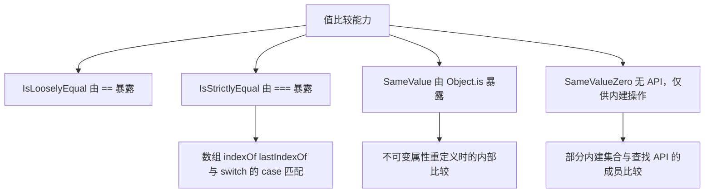
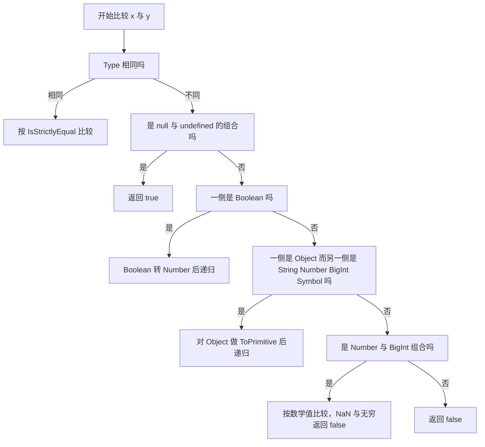

# 相等性、类型转换与数字字符串：MDN 精读

!!! abstract "核心结论"

    - JavaScript 有四种相等算法：IsLooselyEqual（`==`）、IsStrictlyEqual（`===`）、SameValue（`Object.is`）、SameValueZero（没有直接 API，被多个内建操作使用）。
    - 四者的分歧只发生在原始值上，且只集中在 `NaN`、`+0`、`-0` 三个特殊值；对任意两个结构相同但引用不同的对象，四种算法一律返回 `false`。
    - `==` 只有在两侧类型相同时才退化为 `===`；类型不同时按固定顺序转换：null/undefined 互等、Boolean 先转 Number、Number 与 String 互转、Object 走 ToPrimitive、Number 与 BigInt 按数学值比较。
    - 对象参与 `==` 时调用 ToPrimitive，默认 hint 是 `"default"`；普通对象把 `"default"` 当 `"number"` 处理（先 `valueOf` 后 `toString`），而 `Symbol.toPrimitive` 优先级最高。
    - Number 是 IEEE 754 双精度 64 位（精度 53 位），±(2^53 − 1) 之外的整数无法精确表示，这是 `0.1 + 0.2 !== 0.3` 与安全整数问题的共同根源。

## 1. 四种相等算法：从规范到内建 API

### 1.1 三个运算符与四种算法的对应关系

MDN 明确指出：JavaScript 提供三种值比较操作符——`==`（loose equality）、`===`（strict equality）、`Object.is()`（same-value equality）。它们分别对应 ECMAScript 抽象操作 IsLooselyEqual、IsStrictlyEqual、SameValue，而第四个算法 SameValueZero 没有直接暴露 API，只被内建操作使用。



这张图要表达的核心是：四种算法不是四个"功能"，而是同一件事（判断两个值是否相同）在 `NaN`、`+0`、`-0` 上的四种取舍。除这三个特殊值之外，`===` 与 `Object.is` 的行为完全一致；`==` 与 `===` 的差别则来自类型转换。

还需要强调 MDN 的一句话：这些差异全部关于原始值（primitive）。对任意两个非原始对象 `x`、`y`，即使结构完全一样但引用不同，上述所有形式都返回 `false`。递归比较对象内容叫深比较（deep comparison），JavaScript 不提供通用的深比较运算符，只能由库或宿主 API 提供，且规则各不相同。

### 1.2 四种算法的差异对照

| 算法 | 对应 API | 是否做类型转换 | `NaN` 与 `NaN` | `+0` 与 `-0` | 典型使用场景 |
| --- | --- | --- | --- | --- | --- |
| IsLooselyEqual | `==` | 是 | `false` | 相等 | 仅 `==` 运算符 |
| IsStrictlyEqual | `===` | 否 | `false` | 相等 | `===`、`Array.prototype.indexOf`、`Array.prototype.lastIndexOf`、TypedArray 的 `indexOf`/`lastIndexOf`、`switch` 的 `case` 匹配 |
| SameValue | `Object.is()` | 否 | `true` | 不相等 | `Object.is()`、不可变属性重定义时的内部比较 |
| SameValueZero | 无直接 API | 否 | `true` | 相等 | 多个内建操作（具体清单以官方文档为准） |

由表可见，`==` 与 `===` 对 `NaN`、`+0`、`-0` 的处理完全相同，差别只在类型转换；`Object.is` 与 `===` 的差别只在那三个特殊值上。

### 1.3 同一对值在三种 API 下的实测结果

| 表达式 | `==` | `===` | `Object.is` |
| --- | --- | --- | --- |
| `NaN` 与 `NaN` | false | false | true |
| `0` 与 `-0` | true | true | false |
| `1` 与 `"1"` | true | false | false |
| `null` 与 `undefined` | true | false | false |
| `true` 与 `1` | true | false | false |
| `[]` 与 `[]`（两个不同引用） | false | false | false |
| `new String("a")` 与 `"a"` | true | false | false |
| `1n` 与 `1` | true | false | false |
| `Symbol.for("k")` 与 `Symbol.for("k")` | true | true | true |
| `Symbol("k")` 与 `Symbol("k")` | false | false | false |

最后一行值得单独记：`Symbol.for` 走全局注册表，同 key 返回同一个 symbol，因此严格相等；而 `Symbol` 每次调用都创建新 symbol。

`===` 在数组查找上的后果，MDN 给了一个经典例子：`[NaN].indexOf(NaN)` 返回 `-1`，因为 `indexOf` 使用 IsStrictlyEqual；同理 `switch (NaN) { case NaN: ... }` 永远不会命中。

### 1.4 SameValue 存在的理由：不可变属性的重定义

MDN 用 `Object.defineProperty` 解释了 SameValue 的用途：当把一个不可配置、不可写的属性重新定义为相同的值时不报错，只有当"实际发生变化"时才抛异常。内部判断"是否发生变化"用的就是 SameValue 语义。

原因很直接：`+0` 和 `-0` 在数学上是两个不同的值，对一个不可变属性来说，从 `-0` 改成 `+0` 是一次真实变更，`===` 无法区分它们，SameValue 可以。

## 2. 手写 IsStrictlyEqual、SameValue 与 SameValueZero

### 2.1 完整实现与逐段解析

这段代码要解决两个问题：把 `===` 的语义（尤其是 `NaN` 与 `±0`）显式写出来，以及给出 SameValue、SameValueZero 的可运行实现，并用原生 API 逐一对拍。

```js
// 文件：equality-algorithms.js
// 运行环境：Node.js 16+（CommonJS，无第三方依赖）
"use strict";

const assert = require("node:assert/strict");

// 第 1 段：把规范中的 Type(x) 映射成字符串
// 规范里函数属于 Object 类型，因此 typeof 得到 "function" 时要归并到 "object"
function typeOf(x) {
  if (x === null) return "null";
  const t = typeof x;
  return t === "function" ? "object" : t;
}

// 第 2 段：IsStrictlyEqual
// 先比类型，再对 Number 单独处理 NaN；+0 与 -0 交给原生 === 即可
function strictEquals(x, y) {
  if (typeOf(x) !== typeOf(y)) return false;
  if (typeof x === "number") {
    if (x !== x || y !== y) return false; // 任一侧是 NaN 就不相等
    return x === y; // 走到这里 0 === -0 为 true，符合 IsStrictlyEqual
  }
  return x === y; // 非 Number：同一原始值，或同一对象引用
}

// 第 3 段：SameValue（即 Object.is 的语义）
function sameValue(x, y) {
  if (x === y) {
    // x === y 为真时唯一需要翻案的情况：+0 与 -0
    // 用 1/x 与 1/y 的符号区分零：Infinity 与 -Infinity 不等
    return x !== 0 || 1 / x === 1 / y;
  }
  // x !== y 时唯一需要翻案的情况：两侧都是 NaN
  return x !== x && y !== y;
}

// 第 4 段：SameValueZero（MDN 给出的自定义实现）
// 与 SameValue 的唯一区别是 +0 与 -0 视为相等
function sameValueZero(x, y) {
  if (typeof x === "number" && typeof y === "number") {
    // 两个 Number：要么相等（覆盖 +0 与 -0），要么两个都是 NaN
    return x === y || (x !== x && y !== y);
  }
  return x === y;
}

// 第 5 段：SameValue 与 Object.is 对拍
const o1 = {};
const o2 = {};
const sameValueCases = [
  [NaN, NaN, true],
  [NaN, 0, false],
  [0, 0, true],
  [0, -0, false],
  [-0, -0, true],
  [1, 1, true],
  [1, "1", false],
  ["a", "a", true],
  [null, null, true],
  [null, undefined, false],
  [undefined, undefined, true],
  [true, true, true],
  [1n, 1n, true],
  [1n, 1, false],
  [o1, o1, true],
  [o1, o2, false],
];

for (const [a, b, expected] of sameValueCases) {
  assert.strictEqual(sameValue(a, b), expected, "sameValue 与预期不符");
  assert.strictEqual(Object.is(a, b), expected, "Object.is 与预期不符");
  assert.strictEqual(sameValue(a, b), Object.is(a, b), "实现与原生不一致");
}

// 第 6 段：SameValueZero 与 Array.prototype.includes 对拍
const szCases = [
  [NaN, NaN, true],
  [0, -0, true],
  [-0, 0, true],
  [0, 0, true],
  [NaN, 0, false],
  [1, "1", false],
  [1n, 1n, true],
  [1n, 1, false],
  [null, null, true],
  [null, undefined, false],
  [undefined, undefined, true],
  [o1, o1, true],
  [o1, o2, false],
];

for (const [a, b, expected] of szCases) {
  assert.strictEqual(sameValueZero(a, b), expected, "sameValueZero 与预期不符");
  // Array.prototype.includes 使用 SameValueZero，可直接当作原生基准
  assert.strictEqual([a].includes(b), expected, "includes 与预期不符");
  assert.strictEqual(sameValueZero(a, b), [a].includes(b), "实现与原生不一致");
}

console.log(
  `sameValue 对拍 ${sameValueCases.length} 组，sameValueZero 对拍 ${szCases.length} 组，全部通过`
);
```

保存为 `equality-algorithms.js`，执行 `node equality-algorithms.js`。

预期输出（单行）：

```text
sameValue 对拍 16 组，sameValueZero 对拍 13 组，全部通过
```

逐段解析数据流与易错点：

1. `typeOf` 把 `typeof` 的结果与规范 Type 对齐。这里不处理的是 `document.all`：按 MDN 的说法，多数浏览器允许它在某些上下文中"模拟" `undefined`，但 Node 里不存在这个宿主对象，所以自定义实现不做模拟。
2. `strictEquals` 先比类型再比值。如果没有 `x !== x` 这一步，`NaN` 就会被漏掉；如果额外做 `Object.is` 式的零判断，就跟 `===` 语义相反了。
3. `sameValue` 用 `1 / x === 1 / y` 区分 `+0` 与 `-0`。这是唯一可靠且不依赖 `Object.is` 自身的写法；注意 `x !== 0` 的判断必须在前面，否则 `1 / NaN` 这类无意义路径会被误用。
4. `sameValueZero` 直接采用 MDN 的写法：只在两侧都是 `number` 时走特殊分支，其余分支交给 `===`。它的关键取舍是"接受 `+0` 与 `-0` 相等"，从而让缓存键、集合成员判定符合直觉。
5. 对拍循环的设计是"三重断言"：先断言实现结果符合预期，再断言原生符合预期，最后断言两者一致。这样一旦某条预期写错，会立刻暴露在原生断言上，而不是被实现错误掩盖。
6. 易错点：`assert.strictEqual` 对 `NaN` 会失败，所以第 5、6 段的用例里不能直接断言 `NaN === NaN`，必须断言运行结果（布尔值）而不是被比较的值本身。

## 3. IsLooselyEqual：抽象相等的完整推导

### 3.1 规范步骤还原

MDN 的 guide 用自然语言描述了 `==` 的规则。把这套规则展开成"条件 → 动作"的判定表，就得到下面这张表（顺序按抽象操作的组织方式；MDN guide 把 null/undefined 之后的部分重排为"对象转原始值 → 原始值逐类型比较"，两者等价）。

| 步骤 | 条件 | 动作 |
| --- | --- | --- |
| 1 | `Type(x)` 与 `Type(y)` 相同 | 返回 IsStrictlyEqual(x, y) |
| 2 | `x` 是 null 且 `y` 是 undefined | 返回 true |
| 3 | `x` 是 undefined 且 `y` 是 null | 返回 true |
| 4 | `x` 是 Number 且 `y` 是 String | 递归比较 `x` 与 StringToNumber(y) |
| 5 | `x` 是 String 且 `y` 是 Number | 递归比较 StringToNumber(x) 与 `y` |
| 6 | `x` 是 BigInt 且 `y` 是 String | 令 n = StringToBigInt(y)，n 为 undefined 则 false，否则递归 |
| 7 | `x` 是 String 且 `y` 是 BigInt | 与步骤 6 对称 |
| 8 | `x` 是 Boolean | 递归比较 ToNumber(x) 与 `y` |
| 9 | `y` 是 Boolean | 递归比较 `x` 与 ToNumber(y) |
| 10 | `x` 是 String/Number/BigInt/Symbol 且 `y` 是 Object | 递归比较 `x` 与 ToPrimitive(y) |
| 11 | `x` 是 Object 且 `y` 是 String/Number/BigInt/Symbol | 递归比较 ToPrimitive(x) 与 `y` |
| 12 | Number 与 BigInt 组合 | 任一侧为 NaN 或 ±Infinity 返回 false，否则按数学值比较 |
| 13 | 其他 | 返回 false（包含 Symbol 与非 Symbol 的一切组合） |

两个必须记住的推论：`==` 是对称的（`A == B` 与 `B == A` 语义相同，只是转换方向可能不同）；"Number 转 String 时把字符串转成数字"，转换失败得到 `NaN`，而 `NaN` 参与任何相等比较都是 false。



### 3.2 手写 looseEquals（严格按规范步骤）

这段代码把第 3.1 节的判定表逐条翻译成函数，并补上它依赖的三个转换原语：ToPrimitive、StringToNumber、StringToBigInt。目标不是"写一个比 `==` 更聪明的运算符"，而是证明 `==` 的行为完全可预测、可复现。

```js
// 文件：loose-equals.js
// 运行环境：Node.js 16+（CommonJS，无第三方依赖）
"use strict";

const assert = require("node:assert/strict");

// 第 1 段：规范类型判定
function typeOf(x) {
  if (x === null) return "null";
  const t = typeof x;
  return t === "function" ? "object" : t;
}

function isPrimitive(x) {
  return x === null || (typeof x !== "object" && typeof x !== "function");
}

// 第 2 段：IsStrictlyEqual，供步骤 1 使用
function strictEquals(x, y) {
  if (typeOf(x) !== typeOf(y)) return false;
  if (typeof x === "number") {
    if (x !== x || y !== y) return false;
    return x === y;
  }
  return x === y;
}

// 第 3 段：ToPrimitive（简化版）
// 简化点：未实现 [[Get]] 抛错、Proxy 陷阱等 exotic 细节，核心分支与规范一致
function toPrimitive(input, hint) {
  if (isPrimitive(input)) return input;
  const finalHint = hint === undefined ? "default" : hint; // 未传 hint 等价于 "default"
  const exotic = input[Symbol.toPrimitive];
  if (exotic !== undefined && exotic !== null) {
    if (typeof exotic !== "function") {
      throw new TypeError("Symbol.toPrimitive 存在但不是函数");
    }
    // 关键：hint 原样传给钩子，可能是 "default"，不能提前改写成 "number"
    const result = exotic.call(input, finalHint);
    if (isPrimitive(result)) return result;
    throw new TypeError("Cannot convert object to primitive value");
  }
  // 没有钩子时走 OrdinaryToPrimitive：此时 "default" 被当作 "number"
  const order =
    finalHint === "string" ? ["toString", "valueOf"] : ["valueOf", "toString"];
  for (const name of order) {
    const method = input[name];
    if (typeof method === "function") {
      const result = method.call(input);
      if (isPrimitive(result)) return result;
    }
  }
  throw new TypeError("Cannot convert object to primitive value");
}

// 第 4 段：三种转换原语
// StringToNumber 对字符串的语义与 Number(str) 一致：
// 空白串与空串得 0，0x/0o/0b 前缀被识别，含非法字符得 NaN，"Infinity" 得 Infinity
function stringToNumber(str) {
  return Number(str);
}

// StringToBigInt 转换失败时规范用 undefined 表示，而不是抛错
function stringToBigInt(str) {
  try {
    return BigInt(str);
  } catch {
    return undefined;
  }
}

function toNumber(x) {
  if (typeof x === "number") return x;
  // ToNumber 对 BigInt 是抛 TypeError，与 Number(1n) 返回 1 不是一回事
  if (typeof x === "bigint") throw new TypeError("不能把 BigInt 隐式转成 Number");
  if (typeof x === "string") return stringToNumber(x);
  if (typeof x === "boolean") return x ? 1 : 0;
  if (x === null) return 0;
  if (x === undefined) return NaN;
  if (typeof x === "symbol") throw new TypeError("不能把 Symbol 隐式转成 Number");
  return toNumber(toPrimitive(x, "number"));
}

// 第 5 段：Number 与 BigInt 按数学值比较
function numberBigIntEquals(num, big) {
  if (!Number.isFinite(num)) return false; // NaN、Infinity、-Infinity
  if (!Number.isInteger(num)) return false;
  return BigInt(num) === big; // BigInt(整数 Number) 得到该双精度的精确整数值
}

// 第 6 段：IsLooselyEqual
function isSymbolLike(t) {
  return t === "string" || t === "number" || t === "bigint" || t === "symbol";
}

function looseEquals(x, y) {
  const tx = typeOf(x);
  const ty = typeOf(y);

  if (tx === ty) return strictEquals(x, y); // 步骤 1
  if (x === null && y === undefined) return true; // 步骤 2
  if (x === undefined && y === null) return true; // 步骤 3
  if (tx === "number" && ty === "string") return looseEquals(x, stringToNumber(y)); // 步骤 4
  if (tx === "string" && ty === "number") return looseEquals(stringToNumber(x), y); // 步骤 5
  if (tx === "bigint" && ty === "string") {
    const n = stringToBigInt(y); // 步骤 6
    return n === undefined ? false : looseEquals(x, n);
  }
  if (tx === "string" && ty === "bigint") {
    const n = stringToBigInt(x); // 步骤 7
    return n === undefined ? false : looseEquals(n, y);
  }
  if (tx === "boolean") return looseEquals(toNumber(x), y); // 步骤 8
  if (ty === "boolean") return looseEquals(x, toNumber(y)); // 步骤 9
  if (tx === "object" && isSymbolLike(ty)) return looseEquals(toPrimitive(x), y); // 步骤 10
  if (ty === "object" && isSymbolLike(tx)) return looseEquals(x, toPrimitive(y)); // 步骤 11
  if (tx === "number" && ty === "bigint") return numberBigIntEquals(x, y); // 步骤 12
  if (tx === "bigint" && ty === "number") return numberBigIntEquals(y, x); // 步骤 12
  return false; // 步骤 13
}

// 第 7 段：60 组与原生 == 逐一对拍
const looseCases = [
  ["1 == '1'", 1, "1", true],
  ["1 == true", 1, true, true],
  ["0 == false", 0, false, true],
  ["0 == ''", 0, "", true],
  ["0 == '  '", 0, "  ", true],
  ["0 == '\\n\\t'", 0, "\n\t", true],
  ["0 == -0", 0, -0, true],
  ["0 == '0'", 0, "0", true],
  ["'' == false", "", false, true],
  ["'0' == false", "0", false, true],
  ["'0' == ''", "0", "", false],
  ["true == '1'", true, "1", true],
  ["true == 'true'", true, "true", false],
  ["true == '0'", true, "0", false],
  ["true == 1n", true, 1n, true],
  ["null == undefined", null, undefined, true],
  ["null == 0", null, 0, false],
  ["undefined == 0", undefined, 0, false],
  ["null == false", null, false, false],
  ["undefined == false", undefined, false, false],
  ["null == ''", null, "", false],
  ["null == NaN", null, NaN, false],
  ["undefined == NaN", undefined, NaN, false],
  ["NaN == NaN", NaN, NaN, false],
  ["NaN == 0", NaN, 0, false],
  ["Infinity == Infinity", Infinity, Infinity, true],
  ["Infinity == 'Infinity'", Infinity, "Infinity", true],
  ["'0x10' == 16", "0x10", 16, true],
  ["'0b101' == 5", "0b101", 5, true],
  ["'0o17' == 15", "0o17", 15, true],
  ["'1e2' == 100", "1e2", 100, true],
  ["' 12 ' == 12", " 12 ", 12, true],
  ["'12px' == 12", "12px", 12, false],
  ["'abc' == NaN", "abc", NaN, false],
  ["'' == 0n", "", 0n, true],
  ["'1' == 1n", "1", 1n, true],
  ["'1.5' == 1n", "1.5", 1n, false],
  ["1 == 1n", 1, 1n, true],
  ["0 == 0n", 0, 0n, true],
  ["NaN == 0n", NaN, 0n, false],
  ["[] == false", [], false, true],
  ["[] == ''", [], "", true],
  ["[0] == false", [0], false, true],
  ["[1] == true", [1], true, true],
  ["[1] == 1", [1], 1, true],
  ["[1,2] == '1,2'", [1, 2], "1,2", true],
  ["[null] == ''", [null], "", true],
  ["[undefined] == ''", [undefined], "", true],
  ["[[]] == 0", [[]], 0, true],
  ["[] == []", [], [], false],
  ["{} == {}", {}, {}, false],
  ["{} == '[object Object]'", {}, "[object Object]", true],
  ["new String('a') == 'a'", new String("a"), "a", true],
  ["new Number(1) == 1", new Number(1), 1, true],
  ["new Boolean(false) == false", new Boolean(false), false, true],
  ["Symbol.for('k') 同 key", Symbol.for("k"), Symbol.for("k"), true],
  ["Symbol('k') 两次调用", Symbol("k"), Symbol("k"), false],
  ["Symbol.for('k') == 'k'", Symbol.for("k"), "k", false],
  ["Symbol('s') == {}", Symbol("s"), {}, false],
  ["[] == ![]", [], ![], true],
];

for (const [label, a, b, expectedLoose] of looseCases) {
  assert.strictEqual(a == b, expectedLoose, `原生 == 与预期不符：${label}`);
  assert.strictEqual(looseEquals(a, b), expectedLoose, `实现与预期不符：${label}`);
  assert.strictEqual(looseEquals(a, b), a == b, `实现与原生不一致：${label}`);
}

console.log(`looseEquals 与原生 == 对拍通过：${looseCases.length} 组`);
```

保存为 `loose-equals.js`，执行 `node loose-equals.js`。

预期输出（单行）：

```text
looseEquals 与原生 == 对拍通过：60 组
```

逐段解析数据流、设计取舍与易错点：

1. `typeOf` 与 `isPrimitive` 是整条链路的地基。注意 `isPrimitive(undefined)` 必须为 true（`typeof undefined` 是 `"undefined"`），而 `isPrimitive({})` 为 false。
2. `strictEquals` 被放在 `looseEquals` 的第一步，所以"两侧类型相同"的分支根本不会发生隐式转换。这也是为什么 `[] == []` 是 false：两个数组引用不同，走 IsStrictlyEqual。
3. `toPrimitive` 中 `finalHint` 只在传给 `Symbol.toPrimitive` 时保留 `"default"`，而在 OrdinaryToPrimitive 阶段把 `"default"` 当 `"number"` 处理——顺序写反会导致 `Date` 与普通对象的转换顺序都出错。
4. `toNumber` 对 BigInt 和 Symbol 抛 `TypeError`，这是规范行为，不是实现偷懒。注意路径上永远不会把 BigInt 传进来：Boolean 分支先转成 Number，Number-BigInt 组合由步骤 12 单独处理。
5. `stringToBigInt` 用 `BigInt(str)` 加 `try/catch` 模拟 StringToBigInt，失败返回 `undefined`。这里有一个需要核对的细节：StringToBigInt 对 `"1e2"`、`"0x10"` 这类字符串是否接受，取决于其引用的字符串字面量语法，**需核对官方文档**。因此本文件的 BigInt 用例只选取两种定义下结论一致的样本（`""`、`"1"`、`"1.5"`），避免把不确定的行为写进测试。
6. 步骤 10、11 用 `isSymbolLike` 限定"另一侧是 String/Number/BigInt/Symbol"，而不是笼统的 `isPrimitive`。差别出现在 `({}) == null` 这类用例上：若用 `isPrimitive` 判断，会多做一次 ToPrimitive（结果仍是 false，但语义与规范不一致，也可能因 `toString` 有副作用而出错）。
7. 步骤 13 兜底返回 false，覆盖了"Symbol 与非 Symbol"以及"Object 与 null/undefined"两类情况。这也解释了 `Symbol.for("k") == "k"` 为 false：Symbol 永远不会被转换成字符串再比较。
8. 对拍循环里三条断言各司其职：第一条防止预期值本身写错，第二条防止实现跑偏，第三条是真正的"逐一对拍"。用"三方交叉"而不是只断言 `looseEquals`，才能在预期有误时立刻定位。
9. 本实现不模拟 `document.all`。按 MDN 的说明，多数浏览器允许这个宿主对象在部分上下文中模拟 `undefined`，从而使 `null == document.all`、`undefined == document.all` 为 true。这是宿主扩展行为，不是语言语义。

## 4. ToPrimitive、valueOf 与 toString

### 4.1 两个方法 + 一个钩子的优先级

对象参与 `==`、`+`、模板字符串、`Number()`、`String()` 时都会走 ToPrimitive。规则可以压缩成三句话：

- 如果对象上有 `Symbol.toPrimitive` 方法，直接调用它，并把原始 hint（`"default"`、`"number"`、`"string"`）原样传入；返回值必须是原始值，否则抛 `TypeError`。
- 没有钩子时走 OrdinaryToPrimitive：hint 为 `"string"` 时先 `toString` 再 `valueOf`；hint 为 `"number"` 或 `"default"` 时先 `valueOf` 再 `toString`。取到的值必须是原始值，否则换下一个方法。
- 两个方法都返回对象时抛 `TypeError`。

对 `==` 来说，ToPrimitive 使用的是 `"default"` hint。数组的 `valueOf` 继承自 `Object.prototype`，返回数组自身（非原始值），因此会退到 `toString`，这就是 `[1,2] == "1,2"` 为 true 的原因。Date 比较特殊，它自带 `Symbol.toPrimitive`，在 `"default"` hint 下按字符串处理。

### 4.2 手写 toPrimitive 与调用顺序验证

这段代码要解决的是"调用顺序不可见"的问题：通过一个记录调用轨迹的探针对象，把 OrdinaryToPrimitive 的分支选择显式暴露出来。

```js
// 文件：to-primitive.js
// 运行环境：Node.js 16+（CommonJS，无第三方依赖）
"use strict";

const assert = require("node:assert/strict");

// 第 1 段：原始值判定
function isPrimitive(v) {
  return v === null || (typeof v !== "object" && typeof v !== "function");
}

// 第 2 段：ToPrimitive
function toPrimitive(input, hint) {
  if (isPrimitive(input)) return input;
  const finalHint = hint === undefined ? "default" : hint;
  const exotic = input[Symbol.toPrimitive];
  if (exotic !== undefined && exotic !== null) {
    if (typeof exotic !== "function") {
      throw new TypeError("Symbol.toPrimitive 存在但不是函数");
    }
    const result = exotic.call(input, finalHint);
    if (isPrimitive(result)) return result;
    throw new TypeError("Cannot convert object to primitive value");
  }
  const order =
    finalHint === "string" ? ["toString", "valueOf"] : ["valueOf", "toString"];
  for (const name of order) {
    const method = input[name];
    if (typeof method === "function") {
      const result = method.call(input);
      if (isPrimitive(result)) return result;
    }
  }
  throw new TypeError("Cannot convert object to primitive value");
}

// 第 3 段：会记录调用轨迹的探针对象
function makeProbe() {
  const calls = [];
  const probe = {
    valueOf() {
      calls.push("valueOf");
      return 42;
    },
    toString() {
      calls.push("toString");
      return "probe";
    },
  };
  return { probe, calls };
}

// 第 4 段：三种 hint 的分支选择
const a = makeProbe();
assert.strictEqual(toPrimitive(a.probe, "number"), 42);
assert.deepStrictEqual(a.calls, ["valueOf"]);

const b = makeProbe();
assert.strictEqual(toPrimitive(b.probe, "string"), "probe");
assert.deepStrictEqual(b.calls, ["toString"]);

const c = makeProbe();
assert.strictEqual(toPrimitive(c.probe), 42); // 不传 hint 等价于 "default"
assert.deepStrictEqual(c.calls, ["valueOf"]); // 普通对象的 "default" 按 number 顺序

// 第 5 段：valueOf 返回对象时退到 toString
const d = makeProbe();
d.probe.valueOf = function () {
  d.calls.push("valueOf");
  return {}; // 非原始值，必须继续尝试
};
assert.strictEqual(toPrimitive(d.probe), "probe");
assert.deepStrictEqual(d.calls, ["valueOf", "toString"]);

// 第 6 段：Symbol.toPrimitive 优先，且收到原始 hint
const hookCalls = [];
const hooked = {
  [Symbol.toPrimitive](hint) {
    hookCalls.push(hint);
    return "hooked";
  },
  valueOf() {
    throw new Error("valueOf 不应被调用");
  },
  toString() {
    throw new Error("toString 不应被调用");
  },
};
assert.strictEqual(toPrimitive(hooked), "hooked");
assert.strictEqual(toPrimitive(hooked, "string"), "hooked");
assert.deepStrictEqual(hookCalls, ["default", "string"]);

// 第 7 段：两个方法都返回对象时抛 TypeError，与原生一致
const stuck = { valueOf: () => ({}), toString: () => ({}) };
assert.throws(() => toPrimitive(stuck), TypeError);
assert.throws(() => Number(stuck), TypeError);

// 第 8 段：与内建对象的默认转换对拍
assert.strictEqual(toPrimitive([1, 2]), "1,2"); // 数组 valueOf 返回自身，退到 toString
assert.strictEqual(toPrimitive(new Number(5)), 5); // Number 包装对象 valueOf 返回原始值
assert.strictEqual(toPrimitive(new String("s")), "s"); // String 包装对象 valueOf 返回原始值
assert.strictEqual(typeof toPrimitive(new Date(0)), "string"); // Date 的 default 走字符串
assert.strictEqual(toPrimitive(new Date(0)), String(new Date(0)));

console.log("toPrimitive 全部用例通过");
```

保存为 `to-primitive.js`，执行 `node to-primitive.js`。

预期输出（单行）：

```text
toPrimitive 全部用例通过
```

逐段解析：

1. `isPrimitive` 把 `null` 单独列出，因为 `typeof null === "object"`；同时把函数视为非原始值，与规范 Type 一致。
2. `finalHint` 的默认值是 `"default"` 而不是 `"number"`，这是与规范一致的关键；如果把默认值写成 `"number"`，`Date` 的转换结果会从字符串变成时间戳。
3. 第 3 段的探针把 `valueOf` 与 `toString` 的调用轨迹记录在闭包数组中，让"先调谁"从隐式行为变成可断言的数据。
4. 第 4 段验证三条分支：`"number"` 先 `valueOf`、`"string"` 先 `toString`、省略 hint 时普通对象先 `valueOf`。
5. 第 5 段验证回退逻辑：`valueOf` 返回对象时必须继续尝试 `toString`，这也是数组能被转换成 `"1,2"` 的机制。
6. 第 6 段验证钩子优先级与 hint 透传。注意 `hooked` 的 `valueOf`/`toString` 直接抛错，只要钩子机制正确，这两个函数永远不会被执行。
7. 第 7 段验证异常路径，并与原生 `Number(stuck)` 对拍，确认"抛 TypeError"是语言行为而非实现选择。
8. 第 8 段验证内建对象的行为。`new Date(0)` 的字符串结果依赖时区，所以这里不断言具体文本，而是断言类型与"与 `String(date)` 相同"这一相对关系，避免测试在别的时区失败。

## 5. 数字与字符串的数字字面量细节

### 5.1 IEEE 754 双精度：范围、精度与三个符号值

按 MDN：JavaScript 的 Number 采用双精度 64 位二进制格式 IEEE 754，取值范围是 ±2^−1022 到 ±2^+1023（约 ±10^−308 到 ±10^+308），数值精度为 53 位；能精确表示的整数上限是 ±(2^53 − 1)。除普通浮点值外，Number 还有三个符号值：`NaN`、`-Infinity`、`+Infinity`。

`Number` 对象上几个常量的精确值（MDN 表格给出）：`Number.MAX_VALUE` 为 `1.7976931348623157e+308`，`Number.MIN_VALUE` 为 `5e-324`，`Number.EPSILON` 为 `2.220446049250313e-16`，`Number.MAX_SAFE_INTEGER` 为 `+2^53 − 1`（`9007199254740991`），`Number.MIN_SAFE_INTEGER` 为 `−2^53 + 1`（`-9007199254740991`）。

字面量语法方面，MDN 列出四类：十进制、二进制（`0b`/`0B`）、八进制（`0o`/`0O`，以及严格模式下被禁止的旧式前导零写法）、十六进制（`0x`/`0X`）。指数字面量如 `0e-5` 得 `0`、`5e1` 得 `50`、`175e-2` 得 `1.75`；所有字面量都允许用下划线 `_` 做数字分隔符（`1_050.95` 合法）。旧式八进制在非严格模式下 `0644 === 420`、`0755` 得 `493`，而 `0888` 因为含 8 会被当作十进制解析；字符串里的旧式八进制转义 `"\045" === "%"`。这些旧写法在严格模式下都会报语法错误，因此本文的代码统一使用 `0o` 前缀与 `String.fromCharCode`。

### 5.2 Number()、parseInt()、parseFloat() 的分工

| 输入 | `Number(x)` | `parseInt(x)` | `parseFloat(x)` |
| --- | --- | --- | --- |
| `""` | 0 | NaN | NaN |
| `" "` | 0 | NaN | NaN |
| `"12"` | 12 | 12 | 12 |
| `"12px"` | NaN | 12 | 12 |
| `"12.5px"` | NaN | 12 | 12.5 |
| `"0x10"` | 16 | 16 | 0 |
| `"0b101"` | 5 | 0 | 0 |
| `"0o17"` | 15 | 0 | 0 |
| `"1e2"` | 100 | 1 | 100 |
| `"Infinity"` | Infinity | NaN | Infinity |
| `" 12 "` | 12 | 12 | 12 |
| `"abc"` | NaN | NaN | NaN |

规律是：`Number(x)` 要求整串是一个合法的字符串数字字面量，空串与纯空白串得 0；`parseInt` 从左往右读到第一个非法字符就停止（因此 `"1e2"` 得 1），且默认基数是 10，只有前缀为 `0x`/`0X` 时才按 16 解析；`parseFloat` 同样"能读多少读多少"，但不识别 `0x` 前缀。

`Number` 上的方法按 MDN 的分类：`Number.parseFloat`、`Number.parseInt` 与全局同名函数相同；`Number.isFinite`、`Number.isInteger`、`Number.isSafeInteger` 用于判定；`Number.isNaN` 是"比全局 `isNaN` 更健壮"的版本。`Number.prototype` 提供 `toExponential`、`toFixed`、`toPrecision` 三个格式化方法。

### 5.3 数字与字符串行为的验证

这段代码把第 5.1、5.2 节的结论固化成断言，重点覆盖精度丢失、字面量解析与三种字符串转数字 API 的差异。

```js
// 文件：numbers-and-strings.js
// 运行环境：Node.js 16+（CommonJS，无第三方依赖）
"use strict";

const assert = require("node:assert/strict");

// 第 1 段：Number 的取值边界与常量
assert.strictEqual(Number.MAX_VALUE, 1.7976931348623157e308);
assert.strictEqual(Number.MIN_VALUE, 5e-324);
assert.strictEqual(Number.EPSILON, 2.220446049250313e-16);
assert.strictEqual(Number.MAX_SAFE_INTEGER, 9007199254740991);
assert.strictEqual(Number.MIN_SAFE_INTEGER, -9007199254740991);

// 第 2 段：超出安全整数范围后的精度丢失
assert.strictEqual(2 ** 53, 9007199254740992);
assert.strictEqual(2 ** 53 + 1, 2 ** 53); // 2^53 + 1 落在两个可表示值中间，舍入到偶数 2^53
assert.strictEqual(9007199254740993, 9007199254740992); // 字面量阶段就已经舍入
assert.strictEqual(Number.isSafeInteger(2 ** 53), false);
assert.strictEqual(Number.isSafeInteger(2 ** 53 - 1), true);

// 第 3 段：浮点舍入，以及工程上常用的 EPSILON 比较法
assert.strictEqual(0.1 + 0.2, 0.30000000000000004);
assert.strictEqual(0.1 + 0.2 === 0.3, false);
assert.strictEqual(Math.abs(0.1 + 0.2 - 0.3) < Number.EPSILON, true);

// 第 4 段：各类数字字面量
assert.strictEqual(0b10000000000000000000000000000000, 2147483648);
assert.strictEqual(0o755, 493);
assert.strictEqual(0xfffffffffffff, 4503599627370495);
assert.strictEqual(0xa, 10);
assert.strictEqual(0e-5, 0);
assert.strictEqual(5e1, 50);
assert.strictEqual(175e-2, 1.75);
assert.strictEqual(1_050.95, 1050.95);
assert.strictEqual(String.fromCharCode(0o45), "%"); // 旧式 "\045" 的等价写法

// 第 5 段：Number()、parseInt()、parseFloat() 的分工对拍
// 用 Object.is 比较，这样 NaN 与 NaN 也能判定为"相同"
const cases = [
  ["", 0, NaN, NaN],
  [" ", 0, NaN, NaN],
  ["12", 12, 12, 12],
  ["12px", NaN, 12, 12],
  ["12.5px", NaN, 12, 12.5],
  ["0x10", 16, 16, 0],
  ["0b101", 5, 0, 0],
  ["0o17", 15, 0, 0],
  ["1e2", 100, 1, 100],
  ["Infinity", Infinity, NaN, Infinity],
  [" 12 ", 12, 12, 12],
  ["abc", NaN, NaN, NaN],
];

for (const [input, n, i, f] of cases) {
  const label = JSON.stringify(input);
  assert.ok(Object.is(Number(input), n), `Number(${label}) 与预期不符`);
  assert.ok(Object.is(parseInt(input), i), `parseInt(${label}) 与预期不符`);
  assert.ok(Object.is(parseFloat(input), f), `parseFloat(${label}) 与预期不符`);
}

// 第 6 段：字符串化与零的符号
assert.strictEqual(String(Symbol("s")), "Symbol(s)"); // String() 对 Symbol 有特例
assert.throws(() => "" + Symbol("s"), TypeError); // 隐式字符串化 Symbol 会抛错
assert.strictEqual(String(-0), "0"); // -0 字符串化后看不出符号
assert.strictEqual(Object.is(-0, 0), false); // 但 Object.is 能区分

console.log(`数字与字符串用例通过：${cases.length} 组转换对拍`);
```

保存为 `numbers-and-strings.js`，执行 `node numbers-and-strings.js`。

预期输出（单行）：

```text
数字与字符串用例通过：12 组转换对拍
```

逐段解析：

1. 第 1 段的五个常量直接来自 MDN 表格。注意 `Number.MIN_VALUE` 是"最小的正可表示数"，不是最小的负数。
2. 第 2 段说明精度边界：`2 ** 53 + 1` 无法表示，会舍入到 `2 ** 53`；顺带展示 `9007199254740993` 这个字面量在解析阶段就已经变成 `9007199254740992`。
3. 第 3 段是浮点舍入的可见证据，并给出常见的容差比较写法。要注意"用 EPSILON 直接比较"只适用于数量级接近 1 的场景，通用做法是相对误差，具体策略需按业务精度要求确定。
4. 第 4 段覆盖二进制、八进制、十六进制、指数与数字分隔符。这里刻意用 `String.fromCharCode(0o45)` 代替旧式八进制字符串转义，因为文件开头的 `"use strict"` 会让旧式语法的解析结果不同。
5. 第 5 段用 `Object.is` 而不是 `assert.strictEqual` 做比较：后者在期望值是 `NaN` 时必然失败，而 `Object.is(NaN, NaN)` 为 true，正好满足"把 NaN 也当作一个确定结果"的测试需求。
6. 第 6 段区分 `String()` 与隐式字符串化：`String(sym)` 返回 `"Symbol(s)"`，而 `"" + sym` 抛 `TypeError`。同时展示 `-0` 在字符串化时丢失符号，但 `Object.is` 仍能区分。

## 6. 常见陷阱

### 6.1 `null == 0` 为 false，但 `null >= 0` 为 true

`==` 走的是第 3.1 节的判定表，`null` 只能和 `undefined` 互等；而关系运算符 `<`、`>`、`<=`、`>=` 使用另一套算法，会把两侧转成数值，`null` 转成 0。所以 `null == 0` 是 false、`null >= 0` 是 true、`null > 0` 是 false。三件事同时成立并不矛盾。

### 6.2 `[] == ![]` 为 true

`![]` 先算，得到 `false`（对象恒为真值）；于是变成 `[] == false`，Boolean 分支把 `false` 转成 0，对象分支把 `[]` 通过 ToPrimitive 转成 `""`，Number 与 String 分支再把 `""` 转成 0，最终 `0 == 0`。整条链路上每一步都有规范依据，所以结果完全可推导。

### 6.3 `"0" == false` 为 true，而 `if ("0")` 为真

`==` 会做类型转换，`"0"` 与 `false` 都会被转成 0，于是相等；而条件判断走的是 ToBoolean，非空字符串恒为真。把"比较语义"和"真值语义"混为一谈是这类 bug 的根源。

### 6.4 `NaN` 与自身不等，`-0` 与 `+0` 相等，`Object.is` 恰好相反

记住三行：`NaN === NaN` 为 false；`0 === -0` 为 true；`Object.is(NaN, NaN)` 为 true 且 `Object.is(0, -0)` 为 false。检测 `NaN` 用 `Object.is(x, NaN)` 或 `Number.isNaN(x)`，不要用全局 `isNaN`，因为后者会先做 ToNumber（`isNaN("abc")` 为 true）。

### 6.5 用 `indexOf` 找 `NaN` 会得到 `-1`

MDN 明确说明 `Array.prototype.indexOf`、`Array.prototype.lastIndexOf`、TypedArray 的同名方法以及 `switch` 的 `case` 匹配都使用 IsStrictlyEqual，因此 `[NaN].indexOf(NaN)` 为 `-1`，`switch (NaN) { case NaN: }` 也不会命中。需要匹配 `NaN` 时应使用按 SameValueZero 语义工作的查找 API（例如 `Array.prototype.includes`），具体清单以官方文档为准。

### 6.6 包装对象：`new Boolean(false) == false` 为 true，但对象本身是真值

`new Boolean(false)` 是对象，ToBoolean 恒为真；但参与 `==` 时会被 ToPrimitive 拆成原始值 `false`，于是与 `false` 相等。永远不要用包装对象做条件判断。

### 6.7 自定义 `valueOf`/`toString` 会让 `==` 结果难以预测

对象参与 `==` 会调用 ToPrimitive，也就意味着会执行用户代码：可能抛异常、可能有副作用、可能返回不稳定结果。生产代码中让对象参与宽松相等，等于把比较结果交给自定义方法。

### 6.8 `parseInt` 的基数

`parseInt("08")` 在现代引擎中按十进制解析得 8，但 `parseInt("0x10")` 在不传基数时按十六进制得 16，`parseInt("0x10", 10)` 得 0（读到 `x` 停止）。需要确定语义时永远显式传第二个参数。

### 6.9 安全整数之外的算术

`Number.MAX_SAFE_INTEGER + 1 === Number.MAX_SAFE_INTEGER + 2` 为 true，因为两者都被舍入到同一个可表示值。金额、ID、时间戳的精确运算应改用 BigInt 或定点整数方案，并注意 `bigint` 与 `number` 不能混用算术运算。

### 6.10 `document.all` 的宿主特例

按 MDN 的说明，多数浏览器允许 `document.all` 在包括宽松相等在内的部分上下文中模拟 `undefined`，从而使 `null == document.all` 与 `undefined == document.all` 为 true。这是宿主对象的历史遗留行为，用纯 JavaScript 无法复现，做跨环境判断时不要依赖它。

## 7. 面试题与答题要点

### 7.1 `==` 的完整转换步骤是什么

- 先比类型：类型相同直接退化为 `===`，这一步不产生任何转换。
- `null` 与 `undefined` 互相相等，且只与彼此相等。
- Boolean 先转 Number（`true` 变 1，`false` 变 0），然后重新比较。
- Number 与 String 比较时把 String 转成 Number，失败得 `NaN`，而 `NaN` 保证结果 false。
- Number 与 BigInt 按数学值比较，任一为 `NaN` 或 ±Infinity 直接 false。
- Object 与原始值比较时对 Object 做 ToPrimitive，然后重新比较。
- 其余情况（典型是 Symbol 与非 Symbol）一律 false。
- 加分项：说明 `==` 是对称的，并指出它只用于 `==` 运算符本身。

### 7.2 `Object.is` 与 `===` 的区别，为什么需要它

- 两者都不做类型转换，差别只在一处：`NaN` 与 `NaN` 在 `Object.is` 下相等，`+0` 与 `-0` 在 `Object.is` 下不相等，而 `===` 恰好相反。
- 需要它是因为 SameValue 表达的是"功能上完全同一"：不可变属性重定义时，`-0` 改 `+0` 是一次真实变更，只有 SameValue 能识别。
- 实践用途：缓存键、记忆化、需要区分 `±0` 或需要把 `NaN` 视为同一个值的场景。

### 7.3 SameValueZero 用在哪些地方，为什么 `indexOf` 找不到 `NaN`

- SameValueZero 等于 SameValue 但 `+0` 与 `-0` 视为相等，它没有暴露为 API，被多个内建操作使用（完整清单需核对官方文档）。
- `indexOf` 使用 IsStrictlyEqual，`NaN !== NaN`，所以永远找不到 `NaN`。
- 使用 SameValueZero 的查找 API 可以把 `NaN` 当作一个正常元素匹配，这是两者最容易被问到差异。
- 答题时要说明选择依据：需要"引用相同"用 `indexOf` 语义，需要"值相同（含 `NaN`）"用 SameValueZero 语义。

### 7.4 `[] == ![]` 为什么是 true，逐步推导

- `![]` 走 ToBoolean，对象恒为真值，所以 `![]` 是 `false`。
- 表达式变成 `[] == false`；Boolean 分支把 `false` 转成 0，变成 `[] == 0`。
- 对象与 Number 比较，`[]` 走 ToPrimitive：`valueOf` 返回数组自身（非原始值），退到 `toString` 得 `""`。
- 变成 `"" == 0`；String 与 Number 比较，`Number("")` 得 0。
- 最终 `0 === 0` 为 true。每一跳都能对上规范步骤，这是最好的"证明你懂 `==`"的题。

### 7.5 `0.1 + 0.2 !== 0.3` 的原因与工程解法

- 原因：Number 是 IEEE 754 双精度 64 位，0.1、0.2、0.3 在二进制下都是无限循环小数，只能存最近似值；相加后再舍入，结果不是 0.3。
- 结论：`0.1 + 0.2 === 0.30000000000000004`，而用 `===` 比较浮点结果在一般意义上不可靠。
- 解法：数量级接近 1 时可用 `Math.abs(a - b) < Number.EPSILON`；一般场景应使用相对误差；金额场景改用整数（最小货币单位）或定点方案，超出 2^53 的安全范围改用 BigInt。
- 加分项：说明 `Number.EPSILON` 是 `1` 与"比 1 大的最小可表示数"之差，不是万能的容差。

### 7.6 `Number("")`、`parseInt("")`、`parseFloat("")` 分别是什么，为什么

- `Number("")` 是 0：字符串数字字面量语义下空串（以及纯空白串）被视为 0。
- `parseInt("")` 是 `NaN`：它需要至少一个可解析的数字字符。
- `parseFloat("")` 同样是 `NaN`，原因相同。
- 关键区别：`Number` 要求整串合法，`parseInt`/`parseFloat` 允许尾部垃圾（`parseInt("12px")` 得 12），并且 `parseInt` 不认小数点与指数（`parseInt("1e2")` 得 1，`Number("1e2")` 得 100）。
- 顺带说清 `Number("0x10")` 为 16、`parseFloat("0x10")` 为 0。

### 7.7 `valueOf` 与 `toString` 谁先被调用，`Symbol.toPrimitive` 的优先级如何

- 存在 `Symbol.toPrimitive` 时优先调用它，hint 原样传 `"default"`、`"number"` 或 `"string"`，返回值必须是原始值，否则抛 `TypeError`。
- 没有钩子时走 OrdinaryToPrimitive：`"string"` hint 先 `toString` 后 `valueOf`；`"number"` 与 `"default"` hint 先 `valueOf` 后 `toString`。
- 每个候选方法返回非原始值就换下一个；都失败则抛 `TypeError`。
- `==` 对对象使用 `"default"` hint，因此普通对象先 `valueOf`；数组的 `valueOf` 返回自身，所以实际走 `toString`；Date 自带 `Symbol.toPrimitive`，`"default"` 下按字符串处理。

### 7.8 如何写一个符合规范的 `looseEquals`，以及为什么生产代码推荐 `===`

- 实现要点：先把 Type 判定与 IsStrictlyEqual 写对；严格按顺序处理 null/undefined、Boolean、Number 与 String、Object 与原始值、Number 与 BigInt；最后兜底 false。
- 难点：ToPrimitive 的 hint 透传、`ToNumber(BigInt)` 必须抛 `TypeError`、StringToBigInt 失败用 `undefined` 表达、步骤 10/11 只对 String/Number/BigInt/Symbol 生效。
- 验证方式：构造覆盖所有分支的用例表，同时断言自定义实现与原生 `==` 的结果一致，避免把"实现错误"当成"规范如此"。
- 推荐 `===` 的理由：没有隐式转换，结果更容易预测；MDN 也指出严格相等"可能因为缺少类型转换而求值更快"。
- 如果必须容忍 `null` 与 `undefined` 混用，更清晰的做法是显式写出 `x == null` 这样的窄例外，或使用 `x === null || x === undefined`，而不是全局放行 `==`。

## 深入阅读与参考

!!! tip "怎么用这些资料"
    先读「官方文档与规范」建立准确的概念，再读「源码与示例」核对细节，最后用「教程、书籍与视频」换一种讲法加深理解。每条都写明了读哪一节、带着什么问题读。

### 官方文档与规范

| 资源 | 为什么读 | 怎么读 |
|---|---|---|
| [MDN Web API 参考](https://developer.mozilla.org/zh-CN/docs/Web/API) | MDN API 总入口，查证类型与规范链接的起点。 | 先看参考页结构，遇到相等相关 API 时顺链接跳规范，读完回填笔记。 |
| [ECMA-402 国际化 API](https://tc39.es/ecma402/) | NumberFormat 展示数字与字符串边界，验证解析与格式化假设。 | 读 NumberFormat 章节与示例，试 format/parse 往返，记录误差点。 |
| [The structured clone algorithm](https://developer.mozilla.org/en-US/docs/Web/API/Web_Workers_API/Structured_clone_algorithm) | 讲清值复制规则，区分可克隆类型与原始值差异。 | 读算法步骤，注意 NaN、undefined、-0 的处理，再用 console 验证。 |
| [IndexedDB key characteristics and basic terminology](https://developer.mozilla.org/en-US/docs/Web/API/IndexedDB_API/Basic_Terminology) | 键比较排序规则，是内建比较算法少见的应用视角。 | 读键类型与比较排序一节，搞清数字键与字符串键何时视为相等。 |
| [Transferable objects](https://developer.mozilla.org/en-US/docs/Web/API/Web_Workers_API/Transferable_objects) | 说明可转移与可克隆边界，加深对值种类的理解。 | 读可转移对象列表，动手 postMessage 各类值观察前后差异。 |
| [MDN MutationObserver](https://developer.mozilla.org/en-US/docs/Web/API/MutationObserver) | 观察回调入队时机，理解任务与微任务的执行顺序。 | 读回调时机说明，写观察代码记录其与 Promise 微任务的先后。 |

### 源码与示例

| 资源 | 为什么读 | 怎么读 |
|---|---|---|
| [Non-cryptographic uses of SubtleCrypto](https://developer.mozilla.org/en-US/docs/Web/API/Web_Crypto_API/Non-cryptographic_uses_of_subtle_crypto) | 含字符串与字节、Base64 互转的完整示例代码。 | 跑示例，观察编码转换中的隐式字符串化与 ArrayBuffer 类型。 |
| [MDN URL API](https://developer.mozilla.org/en-US/docs/Web/API/URL_API) | URLSearchParams 示例展示字符串化与数值解析写法。 | 用代码解析查询参数，把字符串转数字，比较 Number 与字面量差异。 |

### 教程、书籍与视频

| 资源 | 为什么读 | 怎么读 |
|---|---|---|
| [Using HTML form validation and the Constraint Validation API](https://developer.mozilla.org/en-US/docs/Web/HTML/Guides/Constraint_validation) | 表单值天然是字符串，是数字字符串转换的真实场景。 | 读约束校验与 valueAsNumber 部分，对比数值与字符串校验差异。 |
| [Checking when a deadline is due](https://developer.mozilla.org/en-US/docs/Web/API/IndexedDB_API/Checking_when_a_deadline_is_due) | 日期比较实战教程，示范比较逻辑落到业务代码。 | 跟做到期判断实现，注意 Date 相等与大小比较的写法差异。 |

## 应用与行业实践

### 应用场景地图

| 场景 | 用到本页哪个知识点 | 典型技术选型 | 注意事项 |
| --- | --- | --- | --- |
| 后台管理的万行订单表格，多选与去重 | SameValueZero、IsStrictlyEqual | `Set`、`Map`、`Array.prototype.includes` | `Map`/`Set` 走 SameValueZero，`-0` 与 `+0` 是同一个键；`indexOf` 走 `===`，找 `NaN` 找不到 |
| 低端安卓机首屏的金额合计 | IEEE 754 双精度、`0.1 + 0.2 !== 0.3` | 整数分、`BigInt` | 不要用 `===` 直接比较浮点运算结果 |
| 多人协作白板的图元索引与版本比对 | `Object.is`、SameValueZero | `Map`、自定义比较函数 | `Object.is(-0, 0)` 为 `false`，`Map` 却认为二者是同一个键 |
| 表单里的年龄、数量输入校验 | Number 与 String 互转、`==` 的转换顺序 | `Number()`、`inputmode="numeric"` | `"" == 0` 为 `true`，空字符串要先判空 |
| 埋点上报与 URL 查询参数解析 | 抽象相等、Boolean 先转 Number | `URLSearchParams`、显式 `Number()` | 取出的参数永远是字符串，`"0" == false` 为 `true` |
| 国际化金额展示与结算对账 | 安全整数、`Number.isSafeInteger` | `Intl.NumberFormat`、整数分 | ±(2^53 − 1) 之外的整数无法精确表示，对账前先校验 |
| SSR 水合时判断状态是否变化 | `Object.is` | React 的依赖比较 | `NaN` 与自身相等，`-0` 与 `+0` 不等，自定义比较要保持同一套规则 |
| 前端缓存键与 LRU 淘汰 | SameValueZero、引用相等 | `Map` | 对象做键时按引用判定，结构相同的两个对象不是同一个键 |

### 三个场景拆解

#### 场景 1：后台管理的万行订单表格，多选与去重

**业务背景**：运营在列表里勾选几百行做批量改价，勾选状态要跨分页保留，滚动与筛选都不能丢。表格一次渲染上万行，勾选集合的重建发生在每次筛选之后。

**怎么用本页知识解决**：先确定键的类型，再选容器。`Set` 与 `Map` 的内部判定是 SameValueZero，`has` 和 `delete` 用同一套规则，只要写入和查询用同一种键类型就不会漏删。

```js
// 选中行集合用 Set 保存，Set 的成员判定走 SameValueZero
const selected = new Set();

function toggle(id) {
  const key = String(id); // id 同时来自 URL 与接口，统一按字符串比较，避免 "01" 与 "1" 被合并
  if (selected.has(key)) selected.delete(key); // has 与 delete 同一算法，不会 has 为真却删不掉
  else selected.add(key);
  return selected.size;
}

// 汇总选中行的金额：先把字符串显式转成整数分
function sumSelected(rows) {
  let total = 0;
  for (const row of rows) {
    if (!selected.has(String(row.id))) continue; // 与 add 时的键类型保持一致
    total += Number(row.amountCents); // 整数分做加法，不做浮点乘除
  }
  return total;
}
```

- 键类型不一致是本场景的主要 bug 来源：`selected.add(1)` 之后 `selected.has("1")` 返回 `false`。
- 用 `String(id)` 而不是 `Number(id)`，是为了保住 `"01"` 与 `"1"` 的区别，避免两行被当成一行。
- 判断某行是否选中时复用 `selected.has`，不要再写一遍比较逻辑，两处规则容易走偏。
- 若把选中项换成数组，`indexOf` 走的是 IsStrictlyEqual，遇到 `NaN` 永远返回 `-1`。

**怎么度量收益**：用 Chrome DevTools Performance 面板看筛选操作触发的 `Long Tasks` 条数和 `Scripting` 时间；用 React DevTools Profiler 记录表格组件的 render 次数；用 `performance.mark` 与 `performance.measure` 量出「点筛选」到「重渲染完成」的时长。

**什么时候不该用**：
- 若选中项要按用户点击顺序展示，`Set` 删除后重新加入会排到末尾，顺序与点击顺序不一致，此时用数组加索引表。
- 若列表固定只有几十行且不做跨分页保留，直接遍历数组判断就够了，多一层 `Set` 只是增加同步成本。

#### 场景 2：低端安卓机首屏的金额合计

**业务背景**：结算页要在首屏内把当天的收支流水加总，流水条数在几千到几万之间，用户设备以低端安卓机为主。金额字段从接口拿到的是字符串形式的「元」，带两位小数。

**怎么用本页知识解决**：先把元转成整数分，用整数做累加，展示时再除回元。整数分在安全整数范围内不会产生舍入误差，也不会踩到 `0.1 + 0.2 !== 0.3`。

```js
// 页面上的金额一律以整数分参与计算，展示时再转成元
function toCents(input) {
  if (input === "") return null;           // Number("") 是 0，空串必须先挡掉
  const yuan = Number(input);              // 输入框与接口给的都是字符串，显式转 Number
  if (!Number.isFinite(yuan)) return null; // NaN 与 Infinity 单独返回，不进入累加
  const cents = Math.round(yuan * 100);    // 乘 100 后取整，得到整数分
  if (!Number.isSafeInteger(cents)) return null; // 超出 ±(2^53 − 1) 的整数无法精确表示
  return cents;
}

function totalCents(list) {
  let sum = 0;
  for (const item of list) {
    const c = toCents(item.amount);
    if (c === null) continue; // 跳过非法值，避免 NaN 污染总和
    sum += c;
  }
  return sum;
}

console.log(totalCents([{ amount: "0.1" }, { amount: "0.2" }])); // 输出 30，即 0.3 元
```

- 直接写 `Number("0.1") + Number("0.2") === 0.3` 得到 `false`，累加结果位数越多偏差越难查。
- `Number("")` 返回 `0`，`toCents` 里若不先判空串，缺失金额会被当成零元计入。
- `Number.isFinite` 同时挡掉 `NaN` 与 `Infinity`，比 `=== NaN` 可靠，因为 `NaN === NaN` 为 `false`。
- 对账时用 `Number.isSafeInteger` 做边界检查，超出边界的值改用 `BigInt` 或字符串处理。

**怎么度量收益**：用 Chrome DevTools Performance 的 `Scripting` 时间与 Lighthouse 的 `Total Blocking Time` 看首屏脚本开销；用 `performance.mark('sum-start')` 与 `performance.mark('sum-end')` 量累加耗时；用对账脚本输出的差异条数验证精度。

**什么时候不该用**：
- 若接口已经返回整数分，前端不要再乘 100，多一次 `Math.round` 会掩盖字段单位写错的问题。
- 若业务需要 16 位以上有效数字，双精度不够用，应改用十进制字符串或 `BigInt`，不要靠 `Number.EPSILON` 兜底。
- `a - b < Number.EPSILON` 只在两数都接近 1 时成立，数量级相差大时会把不等的两数判成相等。

#### 场景 3：多人协作白板的图元索引与版本比对

**业务背景**：十来人同时在一块画布上拖拽图元，前端要按坐标做命中检测，也要判断收到的远端快照是否与本地一致。版本号在初始化前可能是 `NaN`，表示「版本未知」。

**怎么用本页知识解决**：版本比对用 `Object.is`，让 `NaN` 与自身相等；坐标索引用 `Map`，它的键判定是 SameValueZero。两种算法对 `-0` 的结论不同，代码里要把这个差别写清楚。

```js
// 远端快照版本可能是 NaN，表示"版本未知"
const isSameVersion = (local, remote) => Object.is(local, remote);
// Object.is(NaN, NaN) 为 true，用 === 会得到 false，触发多余的重绘

// 图元索引：Map 的键判定是 SameValueZero
const index = new Map();

function indexShape(shape) {
  const key = shape.x + "," + shape.y; // 坐标先转字符串再做键
  const bucket = index.get(key);       // get 与 set 用同一套键判定
  if (bucket) bucket.push(shape.id);
  else index.set(key, [shape.id]);
  return index.size;
}

// 直接拿数字做键时要注意：Map 认为 -0 与 +0 是同一个键
const m = new Map();
m.set(-0, "a");
console.log(m.get(0));        // 输出 a
console.log(Object.is(-0, 0)); // 输出 false
```

- `isSameVersion` 用 `===` 时，两边都是 `NaN` 会判为「变了」，每次远端消息都触发一次全量重绘。
- `Map` 的 `set` 与 `get` 用同一套键判定，所以用 `-0` 写入、用 `0` 也能读到。
- `Object.is(-0, 0)` 为 `false`，若把它当成 `Map` 的键判定来推理，会得出与运行时相反的结论。
- 坐标转字符串做键，是为了让 `1.5,2` 与 `1,5.2` 这类拼接不冲突，用分隔符 `,` 保证边界清晰。

**怎么度量收益**：用 React DevTools Profiler 看画布组件的 render 次数是否随远端消息线性增长；用 Chrome DevTools Performance 看每秒帧数与掉帧时长；在控制台打印 `index.size` 与图元总数的比值，观察索引是否重复膨胀。

**什么时候不该用**：
- 若画布坐标固定为整数像素且不会产生负零，`-0` 相关的分支是多余的，删掉可以少一次判断。
- 若合并逻辑由服务端的 OT 或 CRDT 负责，前端再做版本相等判断会形成第二套真相来源，两边结论不一致时难定位。
- 若版本号本身是字符串，`Object.is` 与 `===` 结论一致，引入 `Object.is` 不会带来行为差别。

### 行业先进实践

**eqeqeq 规则（出处：ESLint 官方文档）**
该规则默认要求用 `===` 与 `!==`，配置成 `"smart"` 时允许 `== null` 这种同时覆盖 `null` 与 `undefined` 的写法。有效的原因是它把「类型不同的隐式转换」限制在一处可枚举的例外里。借鉴方式是在新目录先开 `eqeqeq: error`，历史文件用 `"smart"` 过渡。

**Airbnb JavaScript Style Guide 的相等规则（出处：Airbnb JavaScript Style Guide）**
该指南要求统一用 `===` 与 `!==`，并明确把 `obj == null` 作为保留 `==` 的场景。规则的价值在于让每次比较的意图在代码里直接可见。借鉴方式是把例外写进 lint 配置或评审清单，不停留在口头约定。

**Number.isSafeInteger 做边界校验（出处：MDN `Number.isSafeInteger` 文档）**
在任何解析用户输入或对账的动作之前，先用它筛出越界值，再决定走 `BigInt` 还是字符串。它对应的事实是 IEEE 754 双精度能精确表示的整数上限为 ±(2^53 − 1)。借鉴方式是在金额、ID、计数器三类数据入库前各加一次校验。

**BigInt 处理超出安全整数范围的整数（出处：MDN BigInt 文档）**
`BigInt` 与 Number 用 `==` 比较时按数学值比较，`1n == 1` 为 `true`，但 `1n === 1` 为 `false`，两者也不能直接做算术混算。借鉴方式是在金额服务里统一用 `BigInt` 或整数分，只在边界处显式转换并写注释。

**React 用 Object.is 比较状态与依赖（出处：React 官方文档 `useState` 与 `useEffect` 说明）**
React 判断 state 是否需要重渲染、以及对比依赖数组时使用 `Object.is`。所以 `NaN` 与自身相等、`-0` 与 `+0` 不相等这两条会直接影响重渲染行为。借鉴方式是自定义 hook 里的依赖对比沿用 `Object.is`，不要改成 `===` 或 `JSON.stringify`。

### 从学到用：落地路线

**第 1 步：试点**
在新增的订单列表模块启用 `eqeqeq: error`，把该目录下所有 `==` 改成显式比较。
验收标准：`npx eslint src/orders` 输出 0 条 `eqeqeq` 报错，且该目录的单元测试全部通过。

**第 2 步：验证**
为 `NaN`、`-0`、空字符串与 0、数字字符串这四类输入各写一组断言，跑一遍比较行为。
验收标准：断言覆盖 `Object.is(NaN, NaN)`、`Object.is(0, -0)`、`"" == 0`、`["1"] == 1` 四条，实测结果与规范一致。

**第 3 步：推广**
把规则提升为仓库级配置，历史目录按模块分批打开，每批单独提一个 PR。
验收标准：CI 的 lint 步骤对全仓库执行，报错即阻断合并。

**第 4 步：防止回退**
例外处必须写 `// eslint-disable-next-line` 加原因注释，并把例外条数记进仓库的清单文件。
验收标准：每次改动同步更新清单，CI 脚本能打印当前例外条数。

### 动手作业

**目标**：写一个比较实验项目，把四种相等算法在 `NaN`、`+0`、`-0`、数字字符串、对象上的结果跑成一张表，并把结论落成项目内的比较工具函数。

**步骤**
1. 建目录并选定测试运行器，用 Node 内置的 `node:test` 或 Vitest。
2. 写 `compare.js`，导出四个函数：`loose` 用 `==`、`strict` 用 `===`、`sameValue` 用 `Object.is`、`sameValueZero` 手写实现。
3. 列出输入集合：`NaN`、`+0`、`-0`、`1`、`"1"`、`null`、`undefined`、`""`、`[]`、`[1]`、`{}`、`1n`。
4. 用双重循环生成全部配对，输出一张 Markdown 表格。
5. 为每一格补断言，并把「与 `===` 结论不同」的格子单独标出。
6. 用 SameValueZero 与 `===` 各实现一个 `unique`，对 `[NaN, NaN, -0, +0]` 跑一遍，比较结果差异。
7. 写一份 README，列出本项目里每种算法应该用在哪里，并附上对照表。

**验收标准**
- `npm test` 全部通过，断言条数不少于 30 条，`NaN`、`+0`、`-0` 三类各覆盖至少 2 条。
- 表格中 `NaN` 一列显示：`==` 与 `===` 返回 `false`，`Object.is` 返回 `true`。
- 表格中 `-0` 与 `+0` 一列显示：`===` 返回 `true`，`Object.is` 返回 `false`。
- 两个 `unique` 的结果不同：SameValueZero 版本对 `[NaN, NaN]` 返回 1 个元素，`===` 版本返回 2 个。
- README 里的每种算法都能对应到代码中的实际调用点，用 `grep` 计数核对数量一致。

