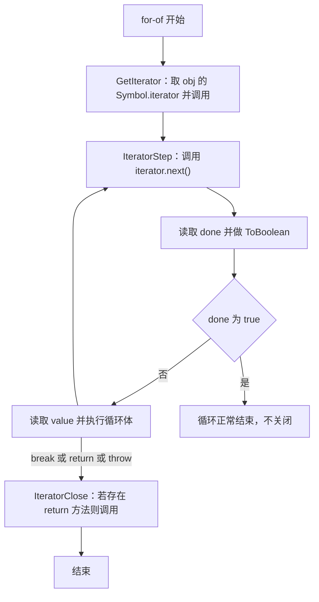
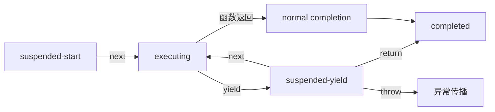

# 迭代协议与生成器：MDN 精读

!!! abstract "核心结论"

    - 迭代器协议只要求 `next()` 返回 `{ value, done }`；可迭代协议只要求 `[Symbol.iterator]()` 返回迭代器。`for...of`、展开、解构都建立在二者之上。
    - 生成器函数被调用时不执行函数体，返回一个既是迭代器又是可迭代对象的 Generator；它的 `[Symbol.iterator]()` 返回 `this`，所以只能被完整迭代一次。
    - `yield` 是双向通道：`next(v)` 把 `v` 作为挂起 `yield` 表达式的值，但第一次 `next()` 传入的参数总是被忽略；`return(v)` 从挂起点终止并触发 `finally`，`throw(e)` 在挂起点抛出。
    - `yield*` 不只是转发 `next`，它还会转发 `return` / `throw`，并把被委托迭代器完成时的 `value` 作为整个表达式的结果。
    - 惰性管道（range / map / filter / take）依靠生成器的按需计算与 `IteratorClose` 提前收尾；异步迭代把协议升级为 `Promise<{ value, done }>` 与 `for await...of`。

## 1. 迭代协议：可迭代与迭代器

### 1.1 两个协议的定义

在 JavaScript 中，**迭代器（iterator）**是任意一个实现了迭代器协议的对象：它有一个 `next()` 方法，返回带 `value` 与 `done` 两个属性的对象。`done` 为 `true` 表示序列已被消费完；若此时 `value` 存在，它就是迭代器的返回值。迭代器一旦被消费，通常只能消费一次，终止后继续调用 `next()` 应当继续返回 `{ done: true }`。

**可迭代对象（iterable）**则要求实现 `[Symbol.iterator]()` 方法，该方法返回一个迭代器。对象本身没有这个方法时，会沿原型链查找。只能迭代一次的可迭代对象（例如 Generator）惯例上从 `[Symbol.iterator]()` 返回 `this`；能被多次迭代的对象必须在每次调用 `[Symbol.iterator]()` 时返回新的迭代器。

需要留意：MDN 明确指出无法用反射方式判断一个对象是不是迭代器，只能通过"是否是可迭代对象"来做能力检测。

| 维度 | 迭代器协议 | 可迭代协议 |
| --- | --- | --- |
| 必备成员 | `next()` | `[Symbol.iterator]()` |
| 返回形式 | `{ value, done }` | 迭代器对象 |
| 谁使用它 | `for...of` 的内部步骤、手写消费逻辑 | `for...of`、展开、解构、`Array.from` 等 |
| 复用性 | 通常一次性，终止后持续 `done: true` | 由实现决定一次或多次 |
| 典型例子 | 数组迭代器、Generator | Array、String、Map、Set、arguments |

### 1.2 for...of 的运行时步骤

`for...of` 不是语法糖式的 `while`，它有一套明确的抽象操作。核心是获取迭代器、反复推进、以及在循环被提前打断时关闭迭代器。



要点有三。第一，`next()` 的返回值如果不是一个对象，会抛 `TypeError`。第二，`done` 会被 `ToBoolean` 化，不要求严格是布尔值。第三，循环体因 `break`、`return` 或抛出而提前退出时，会执行 `IteratorClose`，取出迭代器的 `return` 方法（若存在且可调用）并调用它。这正是"提前结束也必须释放资源"的落点。

### 1.3 手写一个符合协议的 range 迭代器

这段代码把 MDN 的 `makeRangeIterator` 补齐为"结束后状态稳定"的版本：记录已产出个数作为最终返回值，并用 `finished` 保证终止后不再产出新值。

```js
// 运行环境：Node.js（CommonJS），任何支持 ES2015 的版本
"use strict";

const assert = require("assert").strict;

// 第 1 段：工厂函数用闭包保存 nextIndex / iterationCount / finished
function makeRangeIterator(start = 0, end = Infinity, step = 1) {
  let nextIndex = start;
  let iterationCount = 0;
  let finished = false;

  // 第 2 段：迭代器协议只强制要求 next()
  return {
    next() {
      // 第 3 段：终止后必须稳定返回 done: true，避免重复消费出新值
      if (finished) {
        return { value: iterationCount, done: true };
      }
      if (nextIndex < end) {
        const value = nextIndex;
        nextIndex += step;
        iterationCount += 1;
        return { value, done: false };
      }
      finished = true;
      // 第 4 段：done 为 true 时 value 相当于 return 语句的返回值
      return { value: iterationCount, done: true };
    },
    // 第 5 段：可迭代协议，一次性迭代器惯例返回 this
    [Symbol.iterator]() {
      return this;
    },
  };
}

// 第 6 段：手动消费
const iter = makeRangeIterator(1, 10, 2);
const seen = [];
let cursor = iter.next();
while (!cursor.done) {
  seen.push(cursor.value);
  cursor = iter.next();
}
assert.deepEqual(seen, [1, 3, 5, 7, 9]);
assert.equal(cursor.value, 5);
assert.deepEqual(iter.next(), { value: 5, done: true });

// 第 7 段：放进 for...of 与展开，语义与手动 next 一致
assert.deepEqual([...makeRangeIterator(1, 10, 2)], [1, 3, 5, 7, 9]);

console.log("1.3 通过", seen, cursor.value);
// 预期输出：1.3 通过 [ 1, 3, 5, 7, 9 ] 5
```

1. 状态流：`nextIndex` 从 `start` 出发，每次产出后按 `step` 前进；`iterationCount` 只在真正产出时递增，所以它等于序列长度。
2. 设计取舍：把 `finished` 独立出来，是为了不依赖"再次比较 `nextIndex < end`"来判定终止，语义上更贴近规范里 `done` 一旦为真就保持为真的要求。
3. 易错点：`[Symbol.iterator]()` 返回 `this` 使这个对象成为"一次性可迭代对象"，把它放进两次 `for...of` 时第二次将拿不到任何值。需要可复用时，必须返回新的迭代器。
4. 验证标准：断言终止值为 5、二次调用仍为 `done: true`、展开结果与手动消费一致。若把 `finished` 去掉，`iter.next()` 的重复调用仍会返回 `{ value: 5, done: true }`，因为此时 `nextIndex` 已不小于 `end`，但换成正向 `step` 以外的边界情形就可能暴露重复产出问题。

### 1.4 IteratorClose：提前退出时发生了什么

这段代码构造一个带 `return()` 的迭代器，并暴露"是否被关闭"的探针，用来验证 `break` 与正常结束的区别。

```js
// 运行环境：Node.js（CommonJS）
"use strict";

const assert = require("assert").strict;

// 第 1 段：带 return() 的迭代器 + 关闭探针
function makeTracked(count) {
  let index = 0;
  let closed = false;
  return {
    iterator: {
      next() {
        if (index >= count) return { value: undefined, done: true };
        const value = index;
        index += 1;
        return { value, done: false };
      },
      // 第 2 段：return() 是 IteratorClose 唯一会调用的钩子
      return() {
        closed = true;
        return { value: undefined, done: true };
      },
    },
    isClosed: () => closed,
  };
}

// 第 3 段：break 提前退出，触发 IteratorClose
const a = makeTracked(5);
for (const v of { [Symbol.iterator]: () => a.iterator }) {
  if (v === 2) break;
}
assert.equal(a.isClosed(), true);

// 第 4 段：正常消费到 done，不会调用 return()
const b = makeTracked(5);
let sum = 0;
for (const v of { [Symbol.iterator]: () => b.iterator }) sum += v;
assert.equal(sum, 10);
assert.equal(b.isClosed(), false);

console.log("1.4 通过", a.isClosed(), sum, b.isClosed());
// 预期输出：1.4 通过 true 10 false
```

1. 数据流：`break` 发生在 `v === 2` 时，循环体退出触发 `IteratorClose`，取出并调用 `iterator.return()`，于是 `closed` 变为 `true`。
2. 设计取舍：`IteratorClose` 只在"提前退出"时发生；正常走到 `done: true` 时不调用 `return()`，这是区别"资源耗尽"与"资源被放弃"的关键。
3. 易错点：生成器的 `return()` 会执行其内部 `finally`，所以 `try/finally` 是清理逻辑的正确位置；如果迭代器没有 `return` 方法，`IteratorClose` 什么都做不了。
4. 验证标准：断言 `break` 后 `isClosed()` 为 `true`，正常求和为 10 且 `isClosed()` 为 `false`。

## 2. 生成器函数：从语法到状态机

### 2.1 生成器对象的语义与生命周期

生成器函数用 `function*` 声明。调用它不会执行函数体，而是返回一个 Generator 对象。规范层面，生成器对象带有 `[[GeneratorState]]` 等内部槽，其状态在 `suspended-start`、`suspended-yield`、`executing`、`completed` 之间迁移（内部槽的具体命名以 ECMAScript 规范为准，需核对官方文档）。在原型链上，生成器对象先经过 `%GeneratorPrototype%`（提供 `next` / `return` / `throw`），再到 `%IteratorPrototype%`（提供返回自身的 `[Symbol.iterator]`），因此它天然同时满足迭代器协议与可迭代协议。



引擎实现上，各主流引擎会把生成器函数编译或转换为可挂起的状态机（例如 Babel 通过 regenerator 系列插件把生成器降级为带 `switch` 的状态机，TypeScript 在低 `target` 下也会做降级）。不同引擎的具体实现策略随版本变动，需核对官方文档与源码，这里只确认规范语义。

| 方法 | 作用点 | 返回值 | 关键语义 |
| --- | --- | --- | --- |
| `next(v)` | 从当前挂起点恢复 | `{ value, done }` | `v` 成为挂起 `yield` 表达式的值；第一次调用时 `v` 被忽略 |
| `return(v)` | 从当前挂起点终止 | `{ value: v, done: true }` | 等价于在挂起点执行 `return v`，会执行 `finally` |
| `throw(e)` | 从当前挂起点抛出 | 由内部 `catch` 决定 | 等价于把挂起的 `yield` 替换为 `throw e` |
| `[Symbol.iterator]()` | 可迭代协议入口 | `this` | 因此 Generator 只能完整迭代一次 |

### 2.2 手写等价状态机与 next 双向通信

这段代码做两件事：先把一个三段式生成器展开为手写状态机，证明 `yield` 可以在不依赖语法的情况下实现；再用 `echo` 演示 `next(v)` 的双向取值。

```js
// 运行环境：Node.js（CommonJS）
"use strict";

const assert = require("assert").strict;

// 第 1 段：原生生成器作为对照组
function* nativeGen() {
  const a = yield 1;
  const b = yield a + 1;
  return a + b;
}

// 第 2 段：手写状态机
// state 表示"下次 next() 应该从哪个 yield 之后继续"
function machineGen() {
  let state = 0;
  let a;
  let b;
  let finished = false;
  return {
    next(input) {
      if (finished) return { value: undefined, done: true };
      if (state === 0) {
        state = 1;
        // 第一次进入，input 被忽略
        return { value: 1, done: false };
      }
      if (state === 1) {
        a = input;
        state = 2;
        return { value: a + 1, done: false };
      }
      b = input;
      state = 3;
      finished = true;
      return { value: a + b, done: true };
    },
    [Symbol.iterator]() {
      return this;
    },
  };
}

// 第 3 段：用同一驱动顺序比对两个实现
function drive(iterator) {
  return [
    iterator.next(),
    iterator.next(10),
    iterator.next(20),
    iterator.next(30),
  ];
}

const expected = [
  { value: 1, done: false },
  { value: 11, done: false },
  { value: 30, done: true },
  { value: undefined, done: true },
];
assert.deepEqual(drive(nativeGen()), expected);
assert.deepEqual(drive(machineGen()), expected);

// 第 4 段：next(value) 的双向通信
function* echo() {
  const first = yield "ready";
  const second = yield "echo:" + first;
  return "done:" + second;
}

const e = echo();
assert.deepEqual(e.next("ignored"), { value: "ready", done: false });
assert.deepEqual(e.next("a"), { value: "echo:a", done: false });
assert.deepEqual(e.next("b"), { value: "done:b", done: true });

console.log("2.2 通过");
// 预期输出：2.2 通过
```

1. 数据流：`drive` 依次传 10、20、30。状态机在 `state === 1` 时把 10 赋给 `a`，于是第二段产出 11；在 `state === 2` 时把 20 赋给 `b`，返回 30；最后一次 `next(30)` 因为 `finished` 已为真，返回 `{ undefined, true }`。
2. 设计取舍：把 `state` 当作"下一条指令地址"是状态机的核心思想，Babel 的 regenerator 降级产物就是这个结构与 `try/finally`、上下文对象的组合。
3. 易错点：原生生成器在 `state 0` 到 `state 1` 的过渡中，第一次 `next` 的参数被丢弃；手写实现若在这里把 `input` 赋给变量，就会与规范行为不一致。
4. 验证标准：`nativeGen` 与 `machineGen` 的四步轨迹完全相同，且 `echo` 的第一次 `next("ignored")` 不影响输出。

## 3. return、throw 与 yield*

### 3.1 return 与 throw：从挂起点终止或抛出

这段代码把两种终止方式放在一起验证：`return(v)` 触发 `finally` 并把 `v` 作为完成值；`throw(e)` 在挂起点抛出，可被内部 `catch` 捕获，未捕获则从 `throw()` 抛出并使生成器完成。

```js
// 运行环境：Node.js（CommonJS）
"use strict";

const assert = require("assert").strict;

// 第 1 段：return(v) 触发 finally
let cleanup = false;
function* guarded() {
  try {
    yield 1;
    yield 2;
  } finally {
    cleanup = true;
  }
}

const it = guarded();
assert.deepEqual(it.next(), { value: 1, done: false });
assert.deepEqual(it.return(99), { value: 99, done: true });
assert.equal(cleanup, true);
assert.deepEqual(it.next(), { value: undefined, done: true });

// 第 2 段：throw(e) 在挂起点注入异常，可被内部捕获
function* catcher() {
  try {
    yield "a";
    yield "b";
  } catch (err) {
    yield "caught:" + err.message;
  }
  return "end";
}

const c = catcher();
assert.deepEqual(c.next(), { value: "a", done: false });
assert.deepEqual(c.throw(new Error("boom")), {
  value: "caught:boom",
  done: false,
});
assert.deepEqual(c.next(), { value: "end", done: true });

// 第 3 段：未被内部捕获时，异常从 throw() 抛出，生成器立即完成
function* bare() {
  yield 1;
}
const b = bare();
b.next();
assert.throws(() => b.throw(new Error("uncaught")), /uncaught/);
assert.deepEqual(b.next(), { value: undefined, done: true });

console.log("3.1 通过", cleanup);
// 预期输出：3.1 通过 true
```

1. 数据流：`guarded` 挂起在第一个 `yield` 后调用 `return(99)`，控制流跳入 `finally`，`cleanup` 置真，最终完成值为 99。
2. 设计取舍：`throw(e)` 被内部 `catch` 接住时，生成器并未结束，而是继续执行到下一个 `yield`，返回 `done: false`；这使生成器可以充当"可恢复的错误边界"。
3. 易错点：如果 `finally` 块里自己含有 `yield`，`return()` 的返回值语义会变化，此时应以规范描述为准，需要核对官方文档。
4. 验证标准：`return(99)` 后 `cleanup` 为真、后续 `next()` 为 `done: true`；`catcher` 在被注入异常后先产出 `caught:boom`，再以 `end` 完成；`bare` 的 `throw` 会外抛且之后即完成。

### 3.2 yield*：委托与返回值

`yield*` 会把当前生成器临时"委托"给另一个可迭代对象：转发 `next`，也转发 `return` / `throw`，并把被委托迭代器的完成值作为表达式结果。这段代码先验证原生 `yield*` 的返回值语义，再手写一个迭代器级别的委托函数展示转发逻辑。

```js
// 运行环境：Node.js（CommonJS）
"use strict";

const assert = require("assert").strict;

// 第 1 段：内层生成器带有 return 值
function* inner() {
  yield "a";
  yield "b";
  return "inner-return";
}

// 第 2 段：yield* 的表达式结果就是内层的完成值
function* outer() {
  const result = yield* inner();
  return "outer:" + result;
}

const it = outer();
assert.deepEqual(it.next(), { value: "a", done: false });
assert.deepEqual(it.next(), { value: "b", done: false });
assert.deepEqual(it.next(), { value: "outer:inner-return", done: true });

// 第 3 段：手写迭代器级别的委托函数
function delegate(iterable) {
  const iterator = iterable[Symbol.iterator]();
  let finished = false;
  let finalValue;
  return {
    next(input) {
      if (finished) return { value: finalValue, done: true };
      const step = iterator.next(input);
      if (step.done) {
        finished = true;
        finalValue = step.value;
        return { value: step.value, done: true };
      }
      return { value: step.value, done: false };
    },
    [Symbol.iterator]() {
      return this;
    },
  };
}

const forwarded = delegate(inner());
assert.deepEqual(forwarded.next(), { value: "a", done: false });
assert.deepEqual(forwarded.next(), { value: "b", done: false });
assert.deepEqual(forwarded.next(), { value: "inner-return", done: true });

console.log("3.2 通过");
// 预期输出：3.2 通过
```

1. 数据流：`outer` 里 `yield* inner()` 先把 `a`、`b` 原样发出，内层以 `inner-return` 完成时，该值作为表达式结果赋给 `result`，随后 `outer` 继续执行并返回 `outer:inner-return`。
2. 设计取舍：`delegate` 只做迭代器层面的转发，因此内层完成值出现在 `done: true` 的 `value` 中，而不会像 `yield*` 那样"回到外层继续执行"。这正是 `yield*` 比手写循环多出来的能力。
3. 易错点：`yield*` 委托一个 Generator 时，若外层被提前 `return`，终止信号会被转发到内层；手写的 `delegate` 没有实现这一点，需要额外转发 `return` / `throw` 才与 `yield*` 等价。
4. 验证标准：原生 `yield*` 的三步轨迹与手写 `delegate` 的三步轨迹都通过断言。

## 4. 自定义可迭代对象与惰性管道

### 4.1 可重用可迭代对象：makeRange

这段代码返回一个"可多次迭代"的对象：`[Symbol.iterator]()` 是生成器方法，每次调用都生成新的迭代器，从而支持正步长、负步长与无限区间。

```js
// 运行环境：Node.js（CommonJS）
"use strict";

const assert = require("assert").strict;

// 第 1 段：返回可重用可迭代对象
function makeRange(start, end, step = 1) {
  if (step === 0) throw new RangeError("step 不能为 0");
  return {
    // 第 2 段：生成器方法简写，每次调用产生新迭代器
    *[Symbol.iterator]() {
      if (step > 0) {
        for (let i = start; i < end; i += step) yield i;
      } else {
        for (let i = start; i > end; i += step) yield i;
      }
    },
  };
}

const asc = makeRange(1, 5);
assert.deepEqual([...asc], [1, 2, 3, 4]);
// 第 3 段：可重用，第二次迭代结果一致
assert.deepEqual([...asc], [1, 2, 3, 4]);

// 第 4 段：负步长
assert.deepEqual([...makeRange(5, 0, -2)], [5, 3, 1]);

// 第 5 段：无限区间只在被消费时计算
const firstThree = [];
for (const n of makeRange(0, Infinity)) {
  if (n >= 3) break;
  firstThree.push(n);
}
assert.deepEqual(firstThree, [0, 1, 2]);

console.log("4.1 通过", firstThree);
// 预期输出：4.1 通过 [ 0, 1, 2 ]
```

1. 数据流：`[...asc]` 触发一次 `[Symbol.iterator]()` 得到全新生成器，第二次展开再取一个新生成器，所以两次结果相同。
2. 设计取舍：无限区间之所以安全，是因为生成器按需计算；但一旦用展开或 `Array.from` 消费无限区间就会耗尽内存，必须配合中断手段。
3. 易错点：`step` 为零时正负分支都写不出循环，必须在入口处抛 `RangeError`，而不是静默返回空序列。
4. 验证标准：正步长、负步长、可重用、无限区间配合 `break` 四类断言全部通过。

### 4.2 map / filter / take 惰性管道

这三个算子都以生成器实现：`map` 逐项转换，`filter` 逐项筛选，`take` 取够个数后用 `return` 主动结束。配合 4.1 的 `makeRange`，可以组合出只在被消费时才计算的无限管道。

```js
// 运行环境：Node.js（CommonJS）
"use strict";

const assert = require("assert").strict;

function makeRange(start, end, step = 1) {
  if (step === 0) throw new RangeError("step 不能为 0");
  return {
    *[Symbol.iterator]() {
      if (step > 0) for (let i = start; i < end; i += step) yield i;
      else for (let i = start; i > end; i += step) yield i;
    },
  };
}

// 第 1 段：map 逐项转换，顺带提供下标
function* map(iterable, fn) {
  let index = 0;
  for (const value of iterable) {
    yield fn(value, index);
    index += 1;
  }
}

// 第 2 段：filter 只向下游发送通过的元素
function* filter(iterable, predicate) {
  let index = 0;
  for (const value of iterable) {
    const keep = predicate(value, index);
    index += 1;
    if (keep) yield value;
  }
}

// 第 3 段：take 取够 n 个后 return，触发上游 IteratorClose
function* take(iterable, n) {
  if (n <= 0) return;
  let count = 0;
  for (const value of iterable) {
    yield value;
    count += 1;
    if (count >= n) return;
  }
}

// 第 4 段：组合管道
const squares = map(makeRange(1, Infinity), (x) => x * x);
const oddSquares = filter(squares, (x) => x % 2 === 1);
assert.deepEqual([...take(oddSquares, 4)], [1, 9, 25, 49]);

// 第 5 段：验证惰性，只计算了被消费到的部分
let computed = 0;
const counted = map(makeRange(1, Infinity), (x) => {
  computed += 1;
  return x;
});
assert.deepEqual([...take(counted, 3)], [1, 2, 3]);
assert.equal(computed, 3);

console.log("4.2 通过", computed);
// 预期输出：4.2 通过 3
```

1. 数据流：`makeRange(1, Infinity)` 的平方序列是 1、4、9、16、25、36、49……过滤奇数得 1、9、25、49、81……`take` 取前 4 个即 `[1, 9, 25, 49]`。
2. 设计取舍：`take` 用 `return` 结束，而不是在循环外 `break`，是为了让"取够"成为生成器自身的完成条件；无论如何，`for...of` 都会对上游执行 `IteratorClose`。
3. 易错点：`computed` 恰好为 3，说明 `take` 取满后没有再拉取第四个值。若把 `take` 写成先把整个 `iterable` 转数组再切片，这个数字会变成无穷大导致死循环。
4. 验证标准：管道结果等于 `[1, 9, 25, 49]`，且惰性计数为 3。

### 4.3 zip 与 chunk

`zip` 按最短序列截断，并保证提前退出时关闭全部上游；`chunk` 把流按固定大小切块，最后一块可以不足。两者都展示生成器处理"多输入"与"缓冲"的方式。

```js
// 运行环境：Node.js（CommonJS）
"use strict";

const assert = require("assert").strict;

// 第 1 段：zip 同时推进多个迭代器，最短者结束即停止
function* zip(...iterables) {
  const iterators = iterables.map((it) => it[Symbol.iterator]());
  try {
    while (true) {
      const steps = iterators.map((it) => it.next());
      if (steps.some((s) => s.done)) return;
      yield steps.map((s) => s.value);
    }
  } finally {
    // 第 2 段：正常结束与外部 break 都会走到这里
    for (const it of iterators) {
      if (typeof it.return === "function") it.return();
    }
  }
}

// 第 3 段：chunk 缓冲到 size 就发送，最后一块可以不足
function* chunk(iterable, size) {
  if (!Number.isInteger(size) || size <= 0) {
    throw new RangeError("size 必须是正整数");
  }
  let buffer = [];
  for (const value of iterable) {
    buffer.push(value);
    if (buffer.length === size) {
      yield buffer;
      buffer = []; // 重新绑定，已发出的数组不会被后续修改
    }
  }
  if (buffer.length > 0) yield buffer;
}

assert.deepEqual(
  [...zip([1, 2, 3], ["a", "b"])],
  [
    [1, "a"],
    [2, "b"],
  ],
);
assert.deepEqual([...chunk([1, 2, 3, 4, 5], 2)], [[1, 2], [3, 4], [5]]);

// 第 4 段：提前 break 也要关闭上游
let zipClosed = false;
function* tracked() {
  try {
    let i = 0;
    while (true) yield i++;
  } finally {
    zipClosed = true;
  }
}
for (const pair of zip(tracked(), tracked())) {
  if (pair[0] >= 2) break;
}
assert.equal(zipClosed, true);

console.log("4.3 通过", zipClosed);
// 预期输出：4.3 通过 true
```

1. 数据流：`zip([1,2,3], ["a","b"])` 第一轮得到 1 与 `a`，第二轮得到 2 与 `b`，第三轮第二个迭代器已结束，`some` 命中即返回。
2. 设计取舍：`zip` 把关闭逻辑放进 `finally`，让"正常截断"和"外部提前退出"共用同一条清理路径；这是生成器与 `try/finally` 协作的典型用法。
3. 易错点：`chunk` 用 `buffer = []` 重新绑定而不是 `buffer.length = 0`。如果复用同一个数组并清空，先前 `yield` 出去的数组会被之后的操作改写。
4. 验证标准：`zip` 截断结果、`chunk` 分块结果、提前 `break` 后上游被关闭三项断言全部通过。

## 5. 经典生成器：斐波那契与树遍历

### 5.1 可重置的斐波那契

这段代码直接采用 MDN 的递归式写法：`yield` 的返回值可以接收 `next(v)`，用 `next(true)` 重置序列。

```js
// 运行环境：Node.js（CommonJS）
"use strict";

const assert = require("assert").strict;

// 第 1 段：MDN 的可重置斐波那契生成器
function* fibonacci() {
  let current = 0;
  let next = 1;
  while (true) {
    // reset 接收下一次 next(v) 传入的值
    const reset = yield current;
    [current, next] = [next, next + current];
    if (reset) {
      current = 0;
      next = 1;
    }
  }
}

const sequence = fibonacci();
const values = [];
for (let i = 0; i < 7; i += 1) values.push(sequence.next().value);
assert.deepEqual(values, [0, 1, 1, 2, 3, 5, 8]);

// 第 2 段：next(true) 重置序列
assert.equal(sequence.next(true).value, 0);
assert.equal(sequence.next().value, 1);
assert.equal(sequence.next().value, 1);
assert.equal(sequence.next().value, 2);

console.log("5.1 通过", values.join(","));
// 预期输出：5.1 通过 0,1,1,2,3,5,8
```

1. 数据流：初始 `current = 0`、`next = 1`。第一次 `next()` 产出 0；之后每次 `next()` 先交换再做加法，依次产出 1、1、2、3、5、8。`next(true)` 让 `reset` 为真，先完成一轮交换再重置为 0 与 1。
2. 设计取舍：`reset` 是在产出之后读取的，所以"重置"发生在本次产出之后，下一轮才会看到效果。这与 MDN 示例中 `next(true)` 立刻返回 0 的行为一致。
3. 易错点：把 `if (reset)` 写在 `yield` 之前会改变重置时机的语义；另外解构交换必须用数组模式，不能写成 `current = next; next = next + current;`。
4. 验证标准：前七项等于 `[0, 1, 1, 2, 3, 5, 8]`，重置后继续产出 `0, 1, 1, 2`。

### 5.2 树的前序、后序、层序遍历

`yield*` 让递归生成器可以直接接入当前流，避免在每一层手动拼数组。层序遍历则用一个数组当队列。

```js
// 运行环境：Node.js（CommonJS）
"use strict";

const assert = require("assert").strict;

// 第 1 段：树结构
const tree = {
  value: 1,
  children: [
    { value: 2, children: [{ value: 4, children: [] }, { value: 5, children: [] }] },
    { value: 3, children: [{ value: 6, children: [] }] },
  ],
};

// 第 2 段：前序，yield* 把递归生成器接到当前流
function* preorder(node) {
  if (node == null) return;
  yield node.value;
  for (const child of node.children) yield* preorder(child);
}

// 第 3 段：后序
function* postorder(node) {
  if (node == null) return;
  for (const child of node.children) yield* postorder(child);
  yield node.value;
}

// 第 4 段：层序，用数组当队列
function* breadthFirst(root) {
  if (root == null) return;
  const queue = [root];
  while (queue.length > 0) {
    const node = queue.shift();
    yield node.value;
    for (const child of node.children) queue.push(child);
  }
}

assert.deepEqual([...preorder(tree)], [1, 2, 4, 5, 3, 6]);
assert.deepEqual([...postorder(tree)], [4, 5, 2, 6, 3, 1]);
assert.deepEqual([...breadthFirst(tree)], [1, 2, 3, 4, 5, 6]);

console.log("5.2 通过");
// 预期输出：5.2 通过
```

1. 数据流：前序先发根再递归子树，得到 1、2、4、5、3、6；后序先递归再发根，得到 4、5、2、6、3、1；层序按队列顺序发出 1、2、3、4、5、6。
2. 设计取舍：`yield*` 把递归调用变成"流拼接"，不需要中层数组；代价是每个递归层级都会创建一个生成器对象。
3. 易错点：`node == null` 同时覆盖 `null` 与 `undefined`；若只判 `undefined`，传入 `null` 会在访问 `node.children` 时抛错。
4. 验证标准：三种遍历的输出与断言数组完全一致。

## 6. 用生成器实现协程调度器

### 6.1 同步轮转调度

生成器可以主动 `yield` 让出执行权，调度器在多个生成器之间轮转，等价于一个单线程协程调度器。

```js
// 运行环境：Node.js（CommonJS）
"use strict";

const assert = require("assert").strict;

// 第 1 段：每个任务是一个生成器，yield 表示让出
const log = [];
function* taskA() {
  for (let i = 0; i < 2; i += 1) {
    log.push("A" + i);
    yield;
  }
}
function* taskB() {
  for (let i = 0; i < 2; i += 1) {
    log.push("B" + i);
    yield;
  }
}

// 第 2 段：每一轮让每个未完成任务各推进一步
function roundRobin(genFns) {
  const iterators = genFns.map((fn) => fn());
  let alive = true;
  while (alive) {
    alive = false;
    for (const it of iterators) {
      const step = it.next();
      if (!step.done) alive = true;
    }
  }
}

roundRobin([taskA, taskB]);
assert.deepEqual(log, ["A0", "B0", "A1", "B1"]);

console.log("6.1 通过", log.join(","));
// 预期输出：6.1 通过 A0,B0,A1,B1
```

1. 数据流：第一轮 A 执行到第一个 `yield`（记录 A0），B 执行到第一个 `yield`（记录 B0）；第二轮同理记录 A1、B1；第三轮两个生成器都完成，`alive` 保持假，循环退出。
2. 设计取舍：`alive` 每轮先置假再被未完成任务重新置真，是判断"是否还有活"的经典写法；生成器天然承担了保存与恢复局部变量的职责。
3. 易错点：若把 `it.next()` 放在 `try` 之外且任务抛错，整个调度会中断，其他任务不会被清理；生产级调度器需要 `try/catch` 加任务状态标记。
4. 验证标准：交错顺序等于 `["A0", "B0", "A1", "B1"]`。

### 6.2 Promise 版协程运行器

把 `yield` 出来的值当作 thenable，成功时用 `next` 恢复、失败时用 `throw` 恢复，就能用同步写法组织异步流程。这段代码实现一个简化版运行器。

```js
// 运行环境：Node.js（CommonJS），需要 Promise 与 async/await
"use strict";

const assert = require("assert").strict;

// 第 1 段：run 把 yield Promise 解释为 await
function run(genFn) {
  const it = genFn();
  return new Promise((resolve, reject) => {
    function step(method, arg) {
      let result;
      try {
        result = it[method](arg);
      } catch (err) {
        // 第 2 段：生成器内部未捕获的异常统一 reject
        reject(err);
        return;
      }
      if (result.done) {
        resolve(result.value);
        return;
      }
      // 第 3 段：成功回到 next，失败回到 throw
      Promise.resolve(result.value).then(
        (value) => step("next", value),
        (err) => step("throw", err),
      );
    }
    step("next", undefined);
  });
}

// 第 4 段：成功示例
function* successTask() {
  const a = yield Promise.resolve(1);
  const b = yield Promise.resolve(a + 1);
  return a + b;
}

// 第 5 段：失败被注入生成器内部的 catch
function* recoveryTask() {
  try {
    yield Promise.reject(new Error("boom"));
  } catch (err) {
    return "recovered:" + err.message;
  }
}

(async () => {
  assert.equal(await run(successTask), 3);
  assert.equal(await run(recoveryTask), "recovered:boom");
  console.log("6.2 通过");
  // 预期输出：6.2 通过
})();
```

1. 数据流：`successTask` 先 `yield` 一个已解决的 Promise，`then` 回调把 1 传回 `next(1)` 赋给 `a`；再 `yield` 一个 2，回到 `next(2)` 赋给 `b`；最后 `return 3` 触发 `done` 并 `resolve(3)`。
2. 设计取舍：`step` 用方法名字符串分派 `next` 与 `throw`，把异步异常映射回生成器的异常语义；这正是 `async/await` 出现前 co 一类库的核心。
3. 易错点：`it[method]` 若方法不存在或生成器已完成，调用结果仍要检查 `done`；另外 `run` 必须捕获同步异常，否则 `reject` 不会被触发，Promise 会悬挂。
4. 验证标准：`successTask` 解析为 3，`recoveryTask` 解析为 `recovered:boom`。

## 7. 异步迭代协议

### 7.1 异步生成器与 for await...of

异步迭代协议把迭代器协议的返回值升级为 `Promise<{ value, done }>`，入口是 `[Symbol.asyncIterator]`，消费语法是 `for await...of`。`async function*` 声明的异步生成器同时满足这两个角色。

| 维度 | 同步迭代 | 异步迭代 |
| --- | --- | --- |
| 入口方法 | `[Symbol.iterator]` | `[Symbol.asyncIterator]` |
| `next()` 返回 | `{ value, done }` | `Promise<{ value, done }>` |
| 消费语法 | `for...of` | `for await...of` |
| 可消费同步可迭代对象 | 是 | 是，内部会包装同步迭代器 |
| 声明方式 | `function*` | `async function*` |

```js
// 运行环境：Node.js（CommonJS）
"use strict";

const assert = require("assert").strict;

function delay(ms) {
  return new Promise((resolve) => setTimeout(resolve, ms));
}

// 第 1 段：异步生成器，每次产出前等待
async function* countdown(from) {
  for (let i = from; i > 0; i -= 1) {
    await delay(1);
    yield i;
  }
}

(async () => {
  // 第 2 段：for await...of 会等待每个 next() 的结果
  const output = [];
  for await (const value of countdown(3)) output.push(value);
  assert.deepEqual(output, [3, 2, 1]);

  // 第 3 段：for await...of 也能消费同步可迭代对象
  const syncOutput = [];
  for await (const value of [1, 2, 3]) syncOutput.push(value);
  assert.deepEqual(syncOutput, [1, 2, 3]);

  console.log("7.1 通过", output.join(","));
  // 预期输出：7.1 通过 3,2,1
})();
```

1. 数据流：`countdown(3)` 的每次 `next()` 都返回一个 Promise，`for await...of` 逐次等待并解出 3、2、1，最后看到 `done: true` 退出。
2. 设计取舍：异步迭代把"等待"下沉到协议层，调用方不需要写 `then`；代价是每次迭代都至少产生一个微任务。
3. 易错点：`for await...of` 消费同步可迭代对象时，若同步迭代器产出的 `value` 本身是 thenable，它会被额外 await，这可能与直觉不同。具体细节需核对官方文档。
4. 验证标准：异步倒计时输出 `[3, 2, 1]`，同步数组被 `for await...of` 解出 `[1, 2, 3]`。

### 7.2 手写异步可迭代对象与异步 yield*

这段代码实现两个异步可迭代对象：一个模拟分页接口，每次 `next()` 返回一批数据并带 `return()`；一个逐项产出。异步生成器再通过 `yield*` 委托后者。

```js
// 运行环境：Node.js（CommonJS）
"use strict";

const assert = require("assert").strict;

function delay(ms) {
  return new Promise((resolve) => setTimeout(resolve, ms));
}

// 第 1 段：分页异步可迭代对象
let pagedClosed = false;
function makeAsyncRange(start, end, pageSize) {
  return {
    [Symbol.asyncIterator]() {
      let cursor = start;
      return {
        async next() {
          if (cursor >= end) return { value: undefined, done: true };
          const batch = [];
          while (batch.length < pageSize && cursor < end) {
            batch.push(cursor);
            cursor += 1;
          }
          await delay(1);
          return { value: batch, done: false };
        },
        // 第 2 段：异步迭代器的 return() 返回 Promise
        async return() {
          pagedClosed = true;
          cursor = end;
          return { value: undefined, done: true };
        },
      };
    },
  };
}

// 第 3 段：逐项产出的异步可迭代对象
function makeAsyncSeq(start, end) {
  return {
    [Symbol.asyncIterator]() {
      let cursor = start;
      return {
        async next() {
          if (cursor >= end) return { value: undefined, done: true };
          const value = cursor;
          cursor += 1;
          await delay(1);
          return { value, done: false };
        },
      };
    },
  };
}

// 第 4 段：异步生成器中 yield* 委托异步可迭代对象
async function* chained() {
  yield 0;
  yield* makeAsyncSeq(1, 4);
  yield 9;
}

(async () => {
  const batches = [];
  for await (const batch of makeAsyncRange(0, 5, 2)) batches.push(batch);
  assert.deepEqual(batches, [[0, 1], [2, 3], [4]]);

  // 第 5 段：提前 break 触发异步 return()
  const early = [];
  for await (const batch of makeAsyncRange(0, 100, 2)) {
    early.push(batch);
    if (early.length === 2) break;
  }
  assert.deepEqual(early, [[0, 1], [2, 3]]);
  assert.equal(pagedClosed, true);

  const flat = [];
  for await (const value of chained()) flat.push(value);
  assert.deepEqual(flat, [0, 1, 2, 3, 9]);

  console.log("7.2 通过", flat.join(","));
  // 预期输出：7.2 通过 0,1,2,3,9
})();
```

1. 数据流：`makeAsyncRange(0, 5, 2)` 依次产出 `[0, 1]`、`[2, 3]`、`[4]` 后完成；`chained` 先产出 0，再委托 `makeAsyncSeq(1, 4)` 产出 1、2、3，最后产出 9。
2. 设计取舍：分页对象的 `return()` 是 `async` 的，`for await...of` 的提前退出会 await 它，因此清理逻辑本身也可以异步（例如释放网络连接）。
3. 易错点：`pagedClosed` 是模块级变量，用来验证 `break` 确实走到了 `return()`；如果换成普通 `for` 循环手动调用 `next()`，就必须自己调用 `return()`，否则资源不会释放。
4. 验证标准：分页结果、提前退出标记、`yield*` 委托结果三项断言全部通过。

## 8. 常见陷阱

- 生成器只能完整迭代一次。它的 `[Symbol.iterator]()` 返回 `this`，第二次 `for...of` 会立即结束。需要复用时写成返回新生成器的普通对象。
- 第一次 `next(v)` 的参数一定被忽略。因为此时生成器尚未停在任何 `yield` 表达式上，没有位置接收这个值。
- `return()` 会执行 `finally`，但若 `finally` 内部还有 `yield`，`return()` 的返回结果会变成"未完成"，此时的行为需要核对官方文档。
- `IteratorClose` 只在提前退出时触发，且只调用 `return` 方法；迭代器没有 `return` 就只能任其自然结束。
- 用展开、`Array.from`、`new Set` 消费无限生成器会耗尽内存。这类序列只能配合 `take`、`break` 或 `return` 使用。
- `for...of` 和 `forEach` 对稀疏数组的处理不同：`forEach` 会跳过被省略的空槽，而数组迭代器不会做存在性检查，`for...of` 会把它们产出为 `undefined`。可用带空槽的数组实测确认。
- 生成器函数不能作为构造函数，也不能写成箭头函数；`yield` 只能直接出现在生成器函数体内，不能出现在嵌套的普通函数里。
- 生成器内部的局部变量在每次挂起时都会保留，长时间不消费会造成可观的闭包与上下文开销；一次性把无限序列缓存在数组里反而更糟。
- 异步迭代中，没有 `[Symbol.asyncIterator]` 的对象会回退到 `[Symbol.iterator]` 并被包装；此时产出的 `value` 若是 thenable 会被额外 await，需要核对官方文档确认细节。
- `Iterator.prototype` 上的迭代器辅助方法（例如 `map`、`filter`、`take`）属于较新特性，是否可用取决于运行时版本，需核对官方文档。

## 9. 面试题与答题要点

### 9.1 迭代器协议和可迭代协议有什么区别

- 迭代器协议只要求 `next()` 返回 `{ value, done }`；可迭代协议只要求 `[Symbol.iterator]()` 返回迭代器。
- 迭代器用于"推进"，可迭代对象用于"被 `for...of`、展开、解构消费"。
- 一次性迭代器惯例让 `[Symbol.iterator]()` 返回 `this`；可多次迭代的对象必须返回新迭代器。
- 无法可靠地用反射判断"是不是迭代器"，通常检测"是不是可迭代对象"。

### 9.2 生成器为什么只能迭代一次

- 生成器对象自身实现了 `[Symbol.iterator]()`，返回 `this`，所以同一个对象第二次进入 `for...of` 时状态已经是 `completed`。
- 生成器内部状态只有一份：`[[GeneratorState]]` 与执行上下文，无法被两个消费者并行推进。
- 想要复用，应把逻辑放进一个普通对象的生成器方法 `*[Symbol.iterator]()`，每次调用得到新生成器。
- 这也是"可迭代对象"与"迭代器"两个概念必须分开的原因。

### 9.3 yield* 和手写 for...of 加 yield 有什么区别

- `yield*` 会转发 `next`，同时转发 `return` 与 `throw`；手写循环默认不会把终止和异常信号传给内层迭代器。
- `yield*` 表达式的值是内层迭代器完成时的 `value`；手写循环通常拿不到这个值。
- `yield*` 可以直接委托任何可迭代对象，包括字符串、数组、Set、别的 Generator。
- 手写循环更直观，适合需要在委托过程中插入额外逻辑的场景。

### 9.4 next(v) 的双向通信怎么理解

- 生成器在 `yield` 处挂起，`yield expr` 本身是一个表达式，其求值结果来自下一次 `next(v)` 的 `v`。
- 第一次 `next(v)` 的参数一定被忽略，因为此时没有挂起的 `yield` 表达式接收它。
- `return(v)` 相当于在挂起点执行 `return v`，会走 `finally`；`throw(e)` 相当于把挂起的 `yield` 换成 `throw e`。
- 这种双向能力是"用生成器实现协程"的基础：外部把结果送回生成器内部继续计算。

### 9.5 for...of 提前 break 时会发生什么

- 会执行 `IteratorClose`：取出迭代器的 `return` 方法，若存在且可调用就调用，并把返回值当对象校验。
- 生成器的 `return()` 会执行其内部 `finally`，这是释放资源、取消订阅的正确位置。
- 正常走到 `done: true` 不会调用 `return()`。
- 如果 `return()` 自身抛错，异常处理优先级需要按规范处理，务必核对官方文档。

### 9.6 异步迭代协议和同步迭代协议的差异

- 入口从 `[Symbol.iterator]` 换成 `[Symbol.asyncIterator]`，`next()` 返回 `Promise<{ value, done }>`。
- 消费语法是 `for await...of`，它在每次迭代时等待 `next()` 的结果。
- `async function*` 声明的异步生成器同时满足异步迭代器与异步可迭代对象两个角色。
- `for await...of` 也能消费同步可迭代对象；同步迭代器产出的 thenable 会被额外 await，细节需核对官方文档。

### 9.7 用生成器实现协程调度器的原理

- 生成器在 `yield` 处保存完整执行上下文，可以在之后用 `next` 精确恢复，这就是"可挂起的函数"。
- 调度器持有多个生成器迭代器，按轮转或其他策略推进，并在推进时把外部结果通过 `next(v)` 送回。
- 把 `yield` 出来的值解释为 thenable，并在成功时 `next`、失败时 `throw`，就得到 `async/await` 出现前的协程运行器。
- 关键在于调度器决定"何时恢复"，生成器决定"在哪里挂起"。

### 9.8 生成器的状态保存在哪里，引擎如何实现

- 规范层面，生成器对象带有 `[[GeneratorState]]` 与执行上下文相关的内部槽，取值大致在 `suspended-start`、`suspended-yield`、`executing`、`completed` 之间迁移。
- 规范只规定可观察行为，不规定实现方式；引擎与转译器可以采用不同的降级策略。
- Babel 的 regenerator 系列插件会把生成器转成带 `switch` 的状态机加上下文对象，TypeScript 在低 `target` 下也会做降级，通常需要启用 `downlevelIteration` 才能正确迭代非数组可迭代对象。
- 各引擎的当前实现策略随版本变化，具体细节需核对官方文档与对应源码。

## 深入阅读与参考

!!! tip "怎么用这些资料"
    先读「官方文档与规范」建立准确的概念，再读「源码与示例」核对细节，最后用「教程、书籍与视频」换一种讲法加深理解。每条都写明了读哪一节、带着什么问题读。

### 官方文档与规范

| 资源 | 为什么读 | 怎么读 |
|---|---|---|
| [yield*](https://developer.mozilla.org/en-US/docs/Web/JavaScript/Reference/Operators/yield*) | 准确说明 yield* 对可迭代对象的委托与返回值语义。 | 重点读委托迭代器与返回值两节，写例子验证 yield* 的求值结果与异常传递路径。 |
| [yield](https://developer.mozilla.org/en-US/docs/Web/JavaScript/Reference/Operators/yield) | yield 的求值暂停与 next 双向传值，是理解状态机的基础。 | 读语法与描述，用 next(v) 向生成器传值，观察每次暂停点的局部变量状态。 |
| [return](https://developer.mozilla.org/en-US/docs/Web/JavaScript/Reference/Statements/return) | 区分函数内 return 语句与生成器 return()，避免概念混淆。 | 只读语法与描述，写一段代码对比 return 语句与 gen.return() 的返回结构差异。 |
| [throw](https://developer.mozilla.org/en-US/docs/Web/JavaScript/Reference/Statements/throw) | throw 语句与生成器 throw() 的异常注入路径需要分清。 | 读语法部分，再在暂停的生成器上调用 throw()，观察 try/catch 如何捕获注入异常。 |
| [AsyncGenerator.prototype.return()](https://developer.mozilla.org/en-US/docs/Web/JavaScript/Reference/Global_Objects/AsyncGenerator/return) | 异步生成器提前结束时的 finally 与资源释放语义。 | 读返回值与 finally 行为两节，写带 finally 的异步生成器验证提前退出顺序。 |
| [AsyncGenerator.prototype.throw()](https://developer.mozilla.org/en-US/docs/Web/JavaScript/Reference/Global_Objects/AsyncGenerator/throw) | 理解异步生成器内部异常注入与 Promise 拒绝的差别。 | 读示例，分别验证 throw() 被内部 try/catch 捕获与返回被拒绝 Promise 两种情况。 |
| [Generator.prototype.return()](https://developer.mozilla.org/en-US/docs/Web/JavaScript/Reference/Global_Objects/Generator/return) | 生成器提前结束、finally 执行与返回值语义的权威说明。 | 读描述与示例，在 for...of 中 break 后调用 return，确认 finally 是否执行。 |
| [Generator.prototype.throw()](https://developer.mozilla.org/en-US/docs/Web/JavaScript/Reference/Global_Objects/Generator/throw) | 向暂停的生成器注入异常，是协程错误处理的关键机制。 | 读示例，构造带 try/catch 的生成器，验证异常在暂停点被捕获与向外抛出。 |
| [SyntaxError: await/yield expression can't be used in parameter](https://developer.mozilla.org/en-US/docs/Web/JavaScript/Reference/Errors/await_yield_in_parameter) | 参数默认值中不能用 yield/await，是易踩的语法陷阱。 | 读报错原因与正反例，改写一个把 yield 写进默认参数的生成器函数使其合法。 |
| [MDN JavaScript 参考](https://developer.mozilla.org/en-US/docs/Web/JavaScript/Reference) | 查内置对象方法签名与浏览器兼容性的稳定入口。 | 不当教程通读；写生成器代码遇到 API 不确定时，按条目查签名与兼容表。 |

### 源码与示例

| 资源 | 为什么读 | 怎么读 |
|---|---|---|
| [MDN 迭代器与生成器](https://developer.mozilla.org/en-US/docs/Web/JavaScript/Guide/Iterators_and_generators) | MDN 指南给出生成器与异步迭代的完整可运行示例。 | 读生成器与异步迭代两节，动手实现惰性分页读取器，再用 for await 消费并与一次性加载对比。 |

### 教程、书籍与视频

| 资源 | 为什么读 | 怎么读 |
|---|---|---|
| [MDN JavaScript 文档](https://developer.mozilla.org/zh-CN/docs/Web/JavaScript) | 系统学习入口，帮助把生成器放回语言整体中定位。 | 先看语言总览中的函数与异步章节，再回看生成器细节，形成知识地图。 |

## 应用与行业实践

### 应用场景地图

| 场景 | 用到本页哪个知识点 | 典型技术选型 | 注意事项 |
| --- | --- | --- | --- |
| 后台管理的万行订单表格 | 生成器惰性管道、`IteratorClose` | React + react-window、AsyncGenerator 分页 | 生成器只能完整迭代一次，别把实例缓存后复用 |
| 低端安卓活动页首屏 | 异步迭代协议、`for await...of` | fetch + AbortController、web-vitals | 每个 `await` 都要能被取消，否则退出页面仍占连接 |
| 多人协作白板操作同步 | `yield` 双向通道、生成器协程调度器 | Yjs 或自研 OT 队列 + Generator 调度器 | `next(v)` 只回传给当前挂起的 `yield`，不是广播 |
| 浏览器上传大日志文件 | 自定义可迭代对象、`IteratorClose` | `File.stream()` + TextDecoderStream + AsyncGenerator | `break` 要触发 `finally` 关闭 reader |
| 权限树菜单逐层展开 | 经典生成器树遍历、`yield*` | Generator DFS + `requestIdleCallback` | 委托迭代器的 `return` 会向下传播，注意清理 |
| 搜索框连续输入 | 异步迭代协议、`return` 终止 | AsyncGenerator + AbortSignal | 新搜索要调用 `return()`，旧迭代器才会收尾 |
| Node 端百万行 CSV 导出 | 惰性管道 `range/map/filter/take` | Node Readable + async generator + pipeline | 背压交给 stream，别在生成器里无界 push |
| 前端埋点批量上报 | 生成器协程调度器、`throw` | Generator 状态机 + 定时 flush | flush 失败要 `throw` 回生成器，不能只吞异常 |
| 游戏帧循环任务切片 | `yield` 双向通道、生成器调度器 | `requestAnimationFrame` + 时间片调度 | 时间片用尽必须 `yield`，避免长任务阻塞输入 |

### 三个场景拆解

#### 场景 1：后台管理的万行订单表格

**业务背景**：运营后台一次要展示数万行订单，滚动时只渲染视口内的行。接口按每页 200 行返回，一次性拉全量会让首屏等待变长。

**怎么用本页知识解决**：先把分页接口包成异步生成器，再让虚拟列表按需消费。滚动到哪就拉哪一页，用户离开时提前关闭迭代器。

```js
async function* fetchOrders(query, signal) { // 把分页接口包成异步迭代器
  let page = 1; // 从第一页开始
  try {
    while (true) {
      const res = await fetch(`/api/orders?page=${page}&q=${query}`, { signal }); // 带取消信号
      const { rows, hasMore } = await res.json(); // 取当前页数据
      for (const row of rows) yield row; // 逐行吐出给虚拟列表
      if (!hasMore) return; // 没有下一页就结束
      page += 1; // 继续下一页
    }
  } finally {
    console.debug('orders iterator closed'); // 提前 break 时也会执行
  }
}

for await (const row of fetchOrders(keyword, controller.signal)) { // 按需消费
  renderRow(row); // 渲染一行
  if (enough()) break; // for await 会调用 return()，触发 finally
}
```

- `async function*` 把“第几页”藏在生成器里，调用方只看到一条条订单。
- `for await...of` 每轮拉一页，虚拟列表滚到哪就消费到哪。
- `break` 会触发 `for await...of` 调用 `return()`，生成器 `finally` 执行。
- `signal` 让用户切换筛选时取消在途请求，避免旧页数据覆盖新页。
- 生成器实例只能完整迭代一次，别把它挂在组件状态里复用。

**怎么度量收益**：
- 指标：首屏可交互时间、长任务数量、JS 堆峰值。
- 工具：Chrome DevTools Performance 面板、`PerformanceObserver` 的 `longtask`、`performance.memory`。
- 测量：固定 Fast 3G 限速，滚动 30 秒，记录 Long Task 次数与 JS 堆峰值。

**什么时候不该用**：
- 总行数少于 200 且接口一次返回全部数据时，分页生成器增加状态。
- 表格要求前端全量排序或全量聚合时，逐行 `yield` 拿不到完整数组。
- 需要随机跳到第 9000 行而后端只支持游标分页时，生成器无法直接定位。

#### 场景 2：低端安卓活动页首屏

**业务背景**：低端安卓机打开活动页，首屏要展示个人卡片、横幅、推荐列表。三个接口串行等待会让白屏时间变长，用户可能直接退出。

**怎么用本页知识解决**：先把三个请求并发发出，再用异步生成器按优先级交付。哪个分片轮到时先渲染，页面退出就取消剩余请求。

```js
async function* firstScreen(uid, signal) { // 先发起请求，再按优先级交付
  const profile = fetchProfile(uid, signal); // 个人卡片
  const banners = fetchBanners(signal); // 横幅
  const feed = fetchFeed(uid, signal); // 推荐列表
  yield ['profile', await profile]; // 按优先级先交付个人卡片
  yield ['banners', await banners]; // 再交付横幅
  yield ['feed', await feed]; // 最后交付推荐列表
}

const controller = new AbortController(); // 页面退出时统一取消
try {
  for await (const [slot, data] of firstScreen(uid, controller.signal)) {
    renderSlot(slot, data); // 哪个分片先回来先渲染
  }
} catch (err) {
  if (err.name !== 'AbortError') report(err); // 取消不算错误
} finally {
  controller.abort(); // 组件卸载时收尾
}
```

- 三个 `fetch` 先并发发出，`await` 只决定交付顺序。
- `for await...of` 每收到一个分片就渲染，首屏不用等全部接口。
- `controller.abort()` 在组件卸载时取消剩余请求。
- `catch` 里放过 `AbortError`，避免把主动取消记成错误。
- 如果接口之间有依赖，先并发会拿到未就绪的数据，要改成串行。

**怎么度量收益**：
- 指标：LCP、白屏时间、TTFB。
- 工具：`web-vitals`、Lighthouse 移动端节流、Chrome DevTools Network。
- 测量：DevTools 设 Slow 4G + 4x CPU 降速，跑 10 次取 LCP 中位数。

**什么时候不该用**：
- 首屏布局必须等三个接口全部成功才能定高时，分片渲染会多次重排。
- 接口 B 的请求参数依赖接口 A 返回的 token 时，不能先并发。
- 页面要求首屏内容整体一次性出现在截图里时，分片交付会让截图不完整。

#### 场景 3：多人协作白板操作同步

**业务背景**：白板房间有几十个客户端同时画线，操作要按顺序广播。网络抖动时本地队列要重试，房间关闭要清理定时器。

**怎么用本页知识解决**：把“发送、等确认、失败重试”写成生成器协程。调度器把 Promise 结果通过 `next` 回传，把异常通过 `throw` 抛回挂起点。

```js
function* sendLoop(op, send, waitAck) { // 发送协程
  let attempt = 0; // 重试次数
  while (attempt < 3) { // 最多重试 3 次
    send(op); // 发出操作
    const ok = yield waitAck(op.id); // 挂起，等调度器回传 ack
    if (ok) return; // 成功就结束
    attempt += 1; // 失败计数
    yield delay(200 * attempt); // 退避等待
  }
  throw new Error('ack timeout'); // 交给调度器统一上报
}
function run(gen) { // 极简调度器
  const it = gen(); // 得到生成器
  function step(input) { // 回传上次 yield 的结果
    const { value, done } = it.next(input); // 推进协程
    if (done) return; // 协程结束
    Promise.resolve(value).then(step, (e) => it.throw(e)); // 回传成功或异常
  }
  step(); // 启动
}
```

- `yield waitAck(op.id)` 把 ack 的 Promise 交给调度器。
- 调度器用 `it.next(result)` 把成功结果回传给 `ok`。
- 失败时 `it.throw(e)` 在挂起的 `yield` 处抛出，进入 `catch`。
- 房间关闭调用 `it.return()`，生成器的 `finally` 负责清理定时器。
- 重试次数和退避公式写在生成器里，测试时替换 `waitAck` 即可。

**怎么度量收益**：
- 指标：操作端到端确认延迟 P95、重连后未确认操作数、残留定时器数量。
- 工具：Chrome DevTools Network 的 Offline 开关、自建 counter、Sentry。
- 测量：切 Offline 再恢复，记录队列从积压到清零的耗时。

**什么时候不该用**：
- 服务端已提供可靠有序队列和确认机制时，客户端不要再叠一层重试。
- 单个操作体积大且需要二进制批处理时，逐条 `yield` 会增加调度开销。
- 白板只允许单人编辑或冲突由服务端全权裁决时，本地协程重试没有收益。

### 行业先进实践

**用 `for await...of` 消费 ReadableStream（出处：MDN Web Docs《for await...of》/ Node.js 官方文档《Streams》）**  
Node 的 Readable 与浏览器的 `Response.body` 都实现异步可迭代协议。代码用 `for await` 读分片，`break` 时自动调用 `return()`。你的项目可以把文件预览改成按块读取，释放逻辑写进 `finally`。

**用 Generator 描述副作用流水（出处：Redux-Saga 官方文档）**  
saga 里 `yield` 一个指令对象，middleware 执行后把结果通过 `next(result)` 送回。异步流程写成同步顺序，测试时替换 middleware 即可。借鉴方式是把重试、超时、取消集中到调度器，业务生成器只写步骤。

**`IteratorClose` 与 `finally` 清理（出处：MDN Web Docs《迭代协议》/ ECMAScript 规范）**  
`for...of` 提前 `break` 会调用迭代器的 `return()`。资源释放不依赖调用方记忆。自定义可迭代对象把 close 逻辑写进 `return()` 或生成器的 `finally`，就能覆盖提前退出路径。

**取消信号贯穿异步迭代（出处：MDN Web Docs《AbortController》/ WHATWG Fetch 规范）**  
把 `signal` 传入 `fetch`，并在迭代器 `return()` 里 `abort`。用户离开页面后不再占用连接。每个长生命周期异步迭代器绑定一个 `AbortController`，取消路径只有一条。

**背压交给流（出处：Node.js 官方文档《Backpressuring in Streams》）**  
async generator 作为 `pipeline` 的一环，下游慢时上游暂停。内存不会因为无界 push 而堆积。导出大文件时用 `pipeline` 而不是在生成器里手动攒数组。需核对官方文档：核对所用 Node.js 版本中 `pipeline` 与 async generator 的配合方式。

### 从学到用：落地路线

1. 试点：选日志预览组件，把一次性 `FileReader` 换成 async generator 按块读取。验收：10 MB 文件读取期间 Performance 面板无超过 50 ms 的 Long Task。
2. 验证：为迭代器写 `break`、`return`、`throw` 三条路径的单元测试。验收：覆盖 `finally` 执行、`AbortError` 不当作失败、`take(10)` 只拉一页。
3. 推广：把分页接口统一封装成 AsyncGenerator 工厂，替换手写 `while(page)` 循环。验收：代码搜索不到直接手写分页 `while` 的调用点。
4. 防回退：在 CI 加规则或模板测试，新增自定义可迭代对象必须带 `[Symbol.iterator]` 测试。验收：CI 上缺少迭代器测试的 MR 无法合并。

### 动手作业

**目标**：做一个“可取消的分页日志查看器”，支持关键词过滤和提前停止。

**步骤**：
1. 写 `async function* fetchLogs(query, signal)`，每页 50 条，逐条 `yield`。
2. 写同步生成器 `mapLogs(it, fn)` 与 `filterLogs(it, pred)`，包成惰性管道。
3. 写 `takeLogs(it, n)`，取够 n 条后调用 `it.return()`。
4. 页面用 `for await...of` 消费管道，渲染到列表。
5. 输入新关键词时调用当前迭代器的 `return()`，并用 `AbortController` 取消 `fetch`。
6. 在生成器 `finally` 里关闭 loading 状态、清空定时器。
7. 写测试覆盖 `break`、`return`、`throw` 三条路径。

**验收标准**：
- 连续输入 5 个关键词，Network 面板没有旧请求处于 pending。
- `takeLogs(10)` 只发起 1 次分页请求（每页 50 条）。
- 提前 `break` 后，`finally` 中的清理日志恰好执行 1 次。
- 页面卸载后无未处理的 Promise rejection。
- 测试文件包含 `next`、`return`、`throw` 三条路径的断言。

