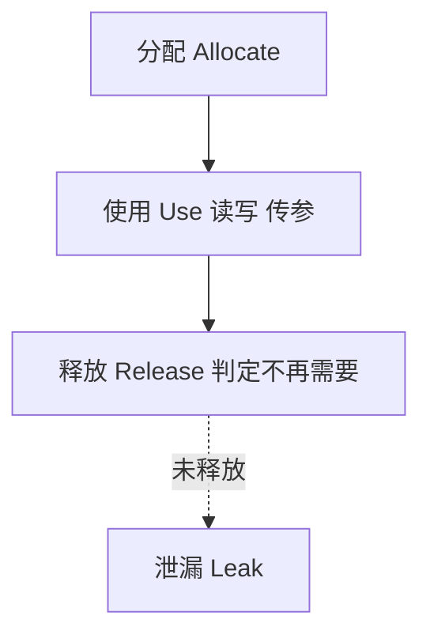
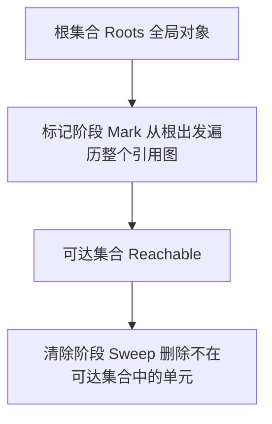
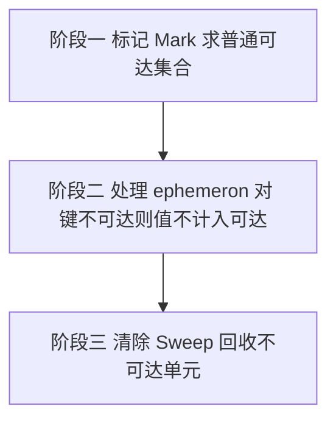

# 内存管理与闭包：MDN 精读

!!! abstract "核心结论"

    - 内存生命周期固定为三步：分配、使用、释放。分配与释放在低层语言里显式，在 JavaScript 里隐式，这种隐式化正是"以为不用管内存"的错觉来源。
    - "这块内存还需要吗"在一般意义上是不可判定的，GC 只能实现一个受限近似：引用计数用"零引用"，标记清除用"不可达"。
    - 现代 JavaScript 引擎已不再使用引用计数；所有现代引擎都采用标记清除，generational / incremental / concurrent / parallel 都只是该算法的实现改进。
    - 闭包是函数与其词法环境的组合，环境在函数**创建时**被捕获；闭包的内存含义就是"函数对象强引用环境对象，整条作用域链因此可达"。
    - WeakMap / WeakSet 的键、WeakRef 的目标是弱持有；但 WeakRef 与 FinalizationRegistry 的运行时语义几乎完全无保证，官方建议尽量避免使用。

## 1. 内存生命周期

### 1.1 三步模型

不管用什么语言，内存生命周期几乎总是一样的：

1. 分配你需要的内存
2. 使用分配到的内存（读、写）
3. 内存不再需要时释放它

第 2 步在所有语言里都是显式的；第 1 步和第 3 步在低层语言（如 C 的 `malloc()` 与 `free()`）里显式，在 JavaScript 这类高层语言里则基本是隐式的。



这种自动性会带来一种误解：开发者以为自己完全不必关心内存管理。MDN 明确把"自动分配、自动释放"列为潜在的混淆源。

各语言的显式程度对比：

|:--|:--|:--|
| 阶段 | 低层语言（例如 C） | JavaScript |
| 分配 | 显式，需要调用分配原语 | 隐式，声明值时就分配 |
| 使用 | 显式读写 | 显式读写 |
| 释放 | 显式，需要手动判定并释放 | 隐式，由 GC 负责 |

### 1.2 分配在 JavaScript 中的来源

分配发生在两处容易被忽略的地方：值初始化，以及函数/方法调用。

```js
// 运行环境：任意支持 ES2015+ 的 JavaScript 运行时
// 第 1 段：值初始化即分配
const n = 123;               // 为 number 分配内存
const s = "string";          // 为 string 分配内存

const o = { a: 1, b: null }; // 为对象及其内部的值分配内存

const a = [1, null, "str2"]; // 为数组及其内部的值分配内存

function f(a) {              // 为函数（可调用对象）分配内存
  return a + 2;
}

// 函数表达式同样分配一个对象
someElement.addEventListener("click", () => {
  someElement.style.backgroundColor = "blue";
});
```

```js
// 第 2 段：函数调用与方法调用触发的分配
const d = new Date();                        // 分配一个 Date 对象
const e = document.createElement("div");     // 分配一个 DOM 元素

const s = "string";
const s2 = s.substring(0, 3);
// 字符串是不可变值，JavaScript 可能决定不真正分配内存，
// 而只记录 [0, 3] 这个区间

const a = ["yeah yeah", "no no"];
const a2 = ["generation", "no no"];
const a3 = a.concat(a2);
// concat 返回新数组，分配了一块能容纳 4 个元素的内存
```

1. 第 1 段说明"声明即分配"：`const n = 123` 不只是命名，它对应一次分配。闭包常量的分配往往被忽略，但它是真实开销。
2. 对象字面量与数组字面量会连带内部值一起分配，所以一个"看起来很小"的对象可能通过嵌套持有大量内存。
3. 字符串不可变，因此 `substring` 这类方法存在"逻辑上产生新值、物理上不复制"的可能。这是实现自由度，不是规范保证，具体行为需核对官方文档与引擎实现。
4. 第 2 段点出 `new Date()`、`createElement()` 这类调用也是分配来源，DOM 元素的分配尤其重要，因为 DOM 节点同时被 JS 对象和渲染树引用。
5. 事件回调、`Promise` 的 `then` 回调、`setTimeout` 的回调，都是函数对象分配，且往往被某个宿主结构长期强引用。这是后续泄漏章节的伏笔。

### 1.3 释放为什么最难：不可判定性

绝大多数内存管理问题都发生在释放阶段。最困难的部分是判断"这块已分配的内存在程序后续执行中是否还需要"。

对一般程序而言，这个问题是不可判定的（undecidable）。因此 GC 只能实现受限的解：它不判断"是否还需要"，而判断一个可计算的代理指标。

### 1.4 引擎内存模型的配置入口

JavaScript 引擎通常提供暴露内存模型的 flag。Node.js 提供了暴露底层 V8 机制用于配置和调试内存问题的选项；浏览器不一定有，网页（通过 HTTP 头等方式）更不可能有。

```bash
# 提高可用的堆内存上限
node --max-old-space-size=6000 index.js

# 暴露 GC 用于调试内存问题
node --expose-gc --inspect index.js
```

需要牢记：JavaScript 核心语言里无法以编程方式触发 GC，并且很可能永远不会。引擎可能在 opt-in flag 后面暴露这类 API，例如上面的 `--expose-gc`。除此之外的一切"强制 GC"技巧都不可靠。

## 2. 引用与"对象"的边界

### 2.1 什么是引用

GC 算法依赖的核心概念是**引用**。在内存管理语境下，如果对象 A 能访问到对象 B（无论隐式还是显式），就说 A 引用了 B。

- JavaScript 对象对它的 prototype 有隐式引用
- JavaScript 对象对它各属性的值有显式引用

### 2.2 函数作用域也是对象

MDN 特别指出：这里的"对象"概念比普通 JavaScript 对象更宽，它**还包含函数作用域（function scope）以及全局词法作用域（global lexical scope）**。

这一点是把"内存管理"和"闭包"缝在一起的关键。一个闭包之所以能让外层局部变量存活，正是因为函数作用域被当成了 GC 眼中的对象，而函数对象对它持有一个（隐含的）引用。

## 3. 引用计数模拟器

### 3.1 算法契约

引用计数把问题从"对象是否还需要"缩减为"是否还有别的对象引用它"：当指向某个对象的引用数为零时，它就是可回收的垃圾。

注意 MDN 的明确声明：**没有任何现代 JavaScript 引擎还在用引用计数做垃圾回收**。下面这个模拟器只用于理解算法本身的能力边界。

### 3.2 完整实现

这段代码用一个显式的堆模型实现引用计数 GC，包含核心的级联释放（自己死了就释放自己持有的引用）。

```js
// 运行环境：Node.js 18+（只用 ES 内置语法，不依赖浏览器 API）
// 文件：refcount-gc.mjs

// 第 1 段：堆与单元定义
// 每个 cell 代表一个被引擎分配的对象：
//   refCount 是当前指向它的引用数量
//   edges 是它自己持有、指向别的单元的引用（即对象属性）
export class RefCountHeap {
  constructor() {
    this.cells = new Map(); // id -> { id, refCount, edges: Set<id> }
    this.freed = [];        // 回收日志，按发生顺序记录被回收的 id
  }

  // 第 2 段：分配
  alloc(id) {
    if (this.cells.has(id)) throw new Error(`已存在同 id 单元：${id}`);
    this.cells.set(id, { id, refCount: 0, edges: new Set() });
    return id;
  }

  // 第 3 段：建立"对象属性"引用
  // 幂等：对同一个属性重复赋同一个引用，不应该重复计数
  link(fromId, toId) {
    const from = this.mustGet(fromId);
    this.mustGet(toId);
    if (from.edges.has(toId)) return;
    from.edges.add(toId);
    this.cells.get(toId).refCount += 1;
  }

  // 断开"对象属性"引用，对应显式地写 x.a = null
  unlink(fromId, toId) {
    const from = this.mustGet(fromId);
    if (!from.edges.has(toId)) return;
    from.edges.delete(toId);
    this.release(toId);
  }

  // 第 4 段：变量层面的持有与释放
  // retain  对应 let y = x
  // release 对应 y = null，或函数作用域结束
  retain(id) {
    this.mustGet(id).refCount += 1;
  }

  release(id) {
    const cell = this.mustGet(id);
    cell.refCount -= 1;
    if (cell.refCount === 0) this.collect(id);
  }

  // 第 5 段：递归回收
  // 经典引用计数的级联释放：自己死了，就把自己持有的引用一并释放
  collect(id) {
    const cell = this.mustGet(id);
    this.cells.delete(id); // 先摘除自己，避免自引用造成的无限递归
    this.freed.push(id);
    for (const targetId of cell.edges) {
      if (this.cells.has(targetId)) this.release(targetId);
    }
  }

  mustGet(id) {
    const cell = this.cells.get(id);
    if (!cell) throw new Error(`单元 ${id} 已被回收或不存在`);
    return cell;
  }

  room() {
    return this.cells.size;
  }
}
```

1. `cells` 用 `Map` 的插入顺序天然模拟了堆的任意遍历顺序，后面的标记清除模拟器会依赖这个顺序。
2. `link` 做成幂等是引用计数的常见坑：对象字面量初始化时先创建属性再赋值，如果实现不去重，`refCount` 会被虚增，导致本该回收的对象永久存活。
3. `release` 是唯一可能触发递归回收的入口。它先减计数，再在归零时调用 `collect`。
4. `collect` 中"先 `delete` 自己、再释放出边"的顺序不可交换。如果先释放出边，一旦存在自引用，就会在自身尚未摘除时再次 `release` 自己，形成无限递归。
5. 代价：`retain` / `release` 散落在所有赋值点上，实现需要编译器或运行时在每个写屏障处打点，这是引用计数在工程上的真实负担。

### 3.3 验证标准

```js
// 运行环境：Node.js 18+，执行 node refcount.test.mjs
// 文件：refcount.test.mjs
import assert from "node:assert/strict";
import { RefCountHeap } from "./refcount-gc.mjs";

// 第 1 段：MDN 引用计数示例的完整轨迹
{
  const heap = new RefCountHeap();
  const x = heap.alloc("x");
  const a = heap.alloc("a");

  heap.link(x, a);   // x = { a: { b: 2 } } 中的属性引用
  heap.retain(x);    // let x = { ... }
  heap.retain(x);    // let y = x
  heap.release(x);   // x = 1
  heap.retain(a);    // let z = y.a
  assert.equal(heap.room(), 2, "两个对象都仍可达");

  heap.release(x);   // y = "mozilla"
  assert.equal(heap.room(), 1, "x 被回收，a 仍被 z 引用");
  assert.deepEqual(heap.freed, ["x"]);

  heap.release(a);   // z = null
  assert.equal(heap.room(), 0);
  assert.deepEqual(heap.freed, ["x", "a"]);
}

// 第 2 段：循环引用无法回收
{
  const heap = new RefCountHeap();
  const x = heap.alloc("x");
  const y = heap.alloc("y");
  heap.link(x, y);   // x.a = y
  heap.link(y, x);   // y.a = x
  heap.retain(x);    // 函数内的局部变量 x
  heap.retain(y);    // 函数内的局部变量 y
  heap.release(x);   // 函数返回，局部变量 x 消失
  heap.release(y);   // 函数返回，局部变量 y 消失

  assert.equal(heap.room(), 2, "循环引用下两个对象都无法回收");
  assert.deepEqual(heap.freed, []);

  // 第 3 段：显式打断循环后，级联回收发生
  heap.unlink(x, y); // 手工执行 x.a = null
  assert.equal(heap.room(), 0);
  assert.deepEqual(heap.freed, ["y", "x"]);
}

console.log("refcount.test.mjs 全部断言通过");
```

预期输出：

```text
refcount.test.mjs 全部断言通过
```

第 1 段复现 MDN 原文的引用轨迹：`x` 在 `y` 被改写后归零、`a` 因仍被 `z` 引用而存活，最后 `z = null` 才被回收。

第 2 段是算法的能力边界：两个对象各自持有对方，`refCount` 各为 1，永远不归零。这就是"循环引用是常见的内存泄漏原因"的机理。

第 3 段对应 MDN 的结论：要释放内存，必须让对象变成显式不可达。断开一条边后，级联释放会连带回收另一个对象。

## 4. 标记清除模拟器

### 4.1 算法契约

标记清除把"对象不再需要"缩减为"对象不可达"。算法假设存在一组**根（roots）**。在 JavaScript 中，根是全局对象。GC 周期性地从根出发，找出所有被根直接引用的对象，再找出被这些对象引用的对象，如此递推。最终所有**可达（reachable）**对象被标记，所有不可达对象被回收。

它比引用计数强的地方在于：零引用一定不可达，但不可达不一定零引用（循环引用就是反例）。



### 4.2 完整实现

这段代码实现标记清除的两阶段：先从根做图遍历求出可达集合，再扫描整个堆删除不可达单元。

```js
// 运行环境：Node.js 18+
// 文件：marksweep-gc.mjs

// 第 1 段：堆加根集合
// roots 代表"从全局对象出发可达的入口"。真实引擎的根还包括调用栈上的
// 局部变量、活动闭包等；这里把根显式化，便于观察算法行为。
export class MarkSweepHeap {
  constructor() {
    this.cells = new Map(); // id -> { id, edges: Set<id> }
    this.roots = new Set();
    this.swept = [];
  }

  alloc(id) {
    if (this.cells.has(id)) throw new Error(`已存在同 id 单元：${id}`);
    this.cells.set(id, { id, edges: new Set() });
    return id;
  }

  link(fromId, toId) {
    const from = this.mustGet(fromId);
    this.mustGet(toId);
    from.edges.add(toId);
  }

  addRoot(id) {
    this.mustGet(id);
    this.roots.add(id);
  }

  removeRoot(id) {
    this.roots.delete(id);
  }

  // 第 2 段：标记阶段
  // 用显式栈而不是递归：深引用链会撑爆调用栈
  mark() {
    const reachable = new Set();
    const stack = [...this.roots];
    while (stack.length > 0) {
      const id = stack.pop();
      if (reachable.has(id)) continue;
      const cell = this.cells.get(id);
      if (!cell) continue; // 悬空引用：目标已在上一轮被回收
      reachable.add(id);
      for (const next of cell.edges) stack.push(next);
    }
    return reachable;
  }

  // 第 3 段：清除阶段
  sweep() {
    const reachable = this.mark();
    for (const id of [...this.cells.keys()]) {
      if (!reachable.has(id)) {
        this.cells.delete(id);
        this.swept.push(id);
      }
    }
    return this.swept.slice();
  }

  mustGet(id) {
    const cell = this.cells.get(id);
    if (!cell) throw new Error(`单元 ${id} 已被回收或不存在`);
    return cell;
  }

  room() {
    return this.cells.size;
  }
}
```

1. `roots` 是集合而不是单值，因为真实根集合包含全局对象、活动栈帧的局部变量、被注册的定时器等。模拟器只保留"谁可达"这个语义核心。
2. `mark` 里 `reachable.has(id)` 的检查同时承担去重和防环两职。图遍历必须去重，否则双向引用会死循环。
3. `mark` 中 `if (!cell) continue` 处理悬空边。真实的写屏障有类似职责：被回收对象的引用需要被清理或容忍。
4. `sweep` 先 `mark` 得到快照，再遍历堆删除。**标记和清除之间不能有新的强引用产生**，这正是真实 GC 需要 stop-the-world 或写屏障的原因。
5. `swept` 是累积日志，`sweep()` 返回它的副本。这样测试里可以断言"这一轮清掉了哪些"。

### 4.3 验证标准

```js
// 运行环境：Node.js 18+，执行 node marksweep.test.mjs
// 文件：marksweep.test.mjs
import assert from "node:assert/strict";
import { MarkSweepHeap } from "./marksweep-gc.mjs";

// 第 1 段：悬空引用链的回收（引用计数做不到的场景）
{
  const heap = new MarkSweepHeap();
  const a = heap.alloc("a");
  const b = heap.alloc("b");
  heap.link(a, b);      // a 持有 b
  heap.addRoot(a);      // a 从根可达

  assert.deepEqual(heap.sweep(), [], "全部可达，无回收");
  assert.equal(heap.room(), 2);

  heap.removeRoot(a);    // a 不再从根可达
  assert.deepEqual(heap.sweep(), ["a", "b"], "a 不可达，b 随之不可达");
  assert.equal(heap.room(), 0);
}

// 第 2 段：循环引用被正确回收
{
  const heap = new MarkSweepHeap();
  const x = heap.alloc("x");
  const y = heap.alloc("y");
  heap.link(x, y);      // x.a = y
  heap.link(y, x);      // y.a = x
  heap.addRoot(x);
  heap.addRoot(y);      // 函数作用域内，两个局部变量都是根

  assert.deepEqual(heap.sweep(), [], "仍被根引用，不回收");

  heap.removeRoot(x);
  heap.removeRoot(y);    // 函数返回，局部变量不再是根
  assert.deepEqual(heap.sweep(), ["x", "y"]);
  assert.equal(heap.room(), 0);
}

console.log("marksweep.test.mjs 全部断言通过");
```

预期输出：

```text
marksweep.test.mjs 全部断言通过
```

第 1 段演示可达性的**传递性**：`a` 被回收后，只有 `a` 引用的 `b` 也失去可达性。引用计数在同样场景下能回收，但需要级联释放；标记清除无需级联，因为清除阶段是一次全堆扫描。

第 2 段是引言里那句"循环不再是问题"的直接证据：两个对象互相引用，只要没有根可达路径，就一起被回收。

### 4.4 循环引用对比实验

```js
// 运行环境：Node.js 18+，执行 node cycle-compare.mjs
// 文件：cycle-compare.mjs
import { RefCountHeap } from "./refcount-gc.mjs";
import { MarkSweepHeap } from "./marksweep-gc.mjs";

// 第 1 段：构造等价的循环引用场景
function buildCycleOfRefCount(heap) {
  const x = heap.alloc("x");
  const y = heap.alloc("y");
  heap.link(x, y);
  heap.link(y, x);
  heap.retain(x);
  heap.retain(y);
  heap.release(x); // 函数作用域结束
  heap.release(y);
}

function buildCycleOfMarkSweep(heap) {
  const x = heap.alloc("x");
  const y = heap.alloc("y");
  heap.link(x, y);
  heap.link(y, x);
  heap.addRoot(x);
  heap.addRoot(y);
  heap.removeRoot(x); // 函数作用域结束
  heap.removeRoot(y);
}

const rc = new RefCountHeap();
buildCycleOfRefCount(rc);

const ms = new MarkSweepHeap();
buildCycleOfMarkSweep(ms);
ms.sweep();

console.log(`引用计数剩余单元: ${rc.room()}`);
console.log(`标记清除剩余单元: ${ms.room()}`);
console.log(`标记清除本轮回收: ${JSON.stringify(ms.swept)}`);
```

预期输出：

```text
引用计数剩余单元: 2
标记清除剩余单元: 0
标记清除本轮回收: ["x","y"]
```

1. 两个函数构造了完全等价的引用图：两个对象互为对方的属性，且没有任何外部强引用。
2. 引用计数版本剩余 2 个单元，因为 `refCount` 从未归零。这就是"循环引用造成泄漏"。
3. 标记清除版本剩余 0 个，且回收日志按 `Map` 插入顺序给出 `["x","y"]`。
4. 结论要落到工程上：今天你在浏览器或 Node.js 里写出的循环引用**不会**泄漏，因为引擎用的是标记清除。老教程里"手动打断循环"的建议，在现代引擎上属于无必要操作（但仍可用于尽早降低峰值内存）。

## 5. 闭包的内存含义

### 5.1 MDN 的定义

闭包是**函数**与其**词法环境**的组合。换句话说，闭包让函数能访问它的外层作用域。在 JavaScript 中，每次创建函数时都会创建闭包，创建时机是函数创建时。

关键的一句是：词法作用域使用变量在源码中**声明的位置**来决定它在哪可用。所以闭包捕获的是环境，不是某一次调用的值快照。

### 5.2 环境链模拟器实现

这段代码用一个显式的 `EnvironmentRecord` 链和 `Closure` 对象复现 MDN 的两个示例：`makeAdder` 的"共享代码、独立环境"，以及 `makeCounter` 的"多个闭包共享同一个环境"。

```js
// 运行环境：Node.js 18+
// 文件：closure-env.mjs

// 第 1 段：词法环境记录
// 每层作用域是一个记录，outer 指向外层，构成作用域链。
export class EnvironmentRecord {
  constructor(outer = null) {
    this.bindings = new Map(); // name -> { value }
    this.outer = outer;
  }

  define(name, value) {
    this.bindings.set(name, { value });
  }

  // 沿作用域链向上查找，返回持有该名字的那一层环境
  lookup(name) {
    let env = this;
    while (env !== null) {
      if (env.bindings.has(name)) return env;
      env = env.outer;
    }
    throw new ReferenceError(`${name} is not defined`);
  }

  get(name) {
    return this.lookup(name).bindings.get(name).value;
  }

  set(name, value) {
    this.lookup(name).bindings.get(name).value = value;
  }
}

// 第 2 段：闭包对象 = 函数代码 + 创建时捕获的环境
export class Closure {
  constructor(code, env) {
    this.code = code; // 函数体定义，可被多个闭包共享
    this.env = env;   // 创建时捕获的词法环境，闭包的内存成本就在这里
  }

  call(...args) {
    return this.code(this.env, ...args);
  }
}
```

```js
// 第 3 段：makeAdder，共享代码、独立环境
export const GLOBAL = new EnvironmentRecord(null);

// 单独抽出的函数体定义，用来验证两个闭包共享同一份代码
export const ADDER_CODE = (env, y) => env.get("x") + y;

export function makeAdder(x) {
  const env = new EnvironmentRecord(GLOBAL); // 每次调用都新建一层环境
  env.define("x", x);
  return new Closure(ADDER_CODE, env);
}

// 第 4 段：makeCounter，三个闭包共享同一个环境
export function makeCounter() {
  const env = new EnvironmentRecord(GLOBAL);
  env.define("privateCounter", 0);

  // 这个私有函数不被外部持有，只能通过返回的三个闭包间接访问
  const changeBy = (delta) =>
    env.set("privateCounter", env.get("privateCounter") + delta);

  return {
    increment: new Closure(() => { changeBy(1); }, env),
    decrement: new Closure(() => { changeBy(-1); }, env),
    value: new Closure((e) => e.get("privateCounter"), env),
  };
}

// 第 5 段：块作用域捕获
export function outer() {
  const fnEnv = new EnvironmentRecord(GLOBAL);
  fnEnv.define("getY", null);

  const blockEnv = new EnvironmentRecord(fnEnv); // 块作用域也是一层环境
  blockEnv.define("y", 6);

  fnEnv.set("getY", new Closure((e) => e.get("y"), blockEnv));
  return fnEnv.get("getY");
}
```

1. `EnvironmentRecord.outer` 构成链条。`lookup` 的向上遍历就是规范里"作用域链"的行为，也是闭包能访问所有外层作用域的原因。
2. `Closure` 把"代码"和"环境"拆成两个字段，这是理解闭包内存占用的核心：代码可以被大量闭包共享，环境不行。`makeAdder(5)` 和 `makeAdder(10)` 的环境是两个不同对象。
3. `GLOBAL` 作为整条链的终点。真实引擎里链的终点是全局词法环境，这里用空记录代替。
4. `makeCounter` 只有**一个**环境对象，被 `increment`、`decrement`、`value` 共享。因此 `privateCounter` 的读写对三者一致，这就是 MDN 说的"共享同一个词法环境"。
5. `changeBy` 不被返回，外部拿不到它，但它被三个闭包引用的环境间接可达，所以不会被回收。这同时实现了数据隐藏与内存驻留。
6. 第 5 段说明闭包也能捕获块作用域。`blockEnv` 是 `fnEnv` 的一层，`getY` 捕获的是 `blockEnv`，即使块已经执行结束。

### 5.3 验证标准

```js
// 运行环境：Node.js 18+，执行 node closure-env.test.mjs
// 文件：closure-env.test.mjs
import assert from "node:assert/strict";
import { makeAdder, makeCounter, outer } from "./closure-env.mjs";

// 第 1 段：共享代码、独立环境
{
  const add5 = makeAdder(5);
  const add10 = makeAdder(10);
  assert.equal(add5.code, add10.code, "两个闭包共享同一份函数代码");
  assert.notEqual(add5.env, add10.env, "两个闭包持有不同的环境对象");
  assert.equal(add5.call(2), 7);
  assert.equal(add10.call(2), 12);
}

// 第 2 段：同一计数器的三个闭包共享环境，不同计数器互相独立
{
  const counter1 = makeCounter();
  const counter2 = makeCounter();

  assert.equal(counter1.value.call(), 0);
  counter1.increment.call();
  counter1.increment.call();
  assert.equal(counter1.value.call(), 2);
  counter1.decrement.call();
  assert.equal(counter1.value.call(), 1);
  assert.equal(counter2.value.call(), 0, "两个计数器互相独立");

  assert.equal(counter1.increment.env, counter1.value.env, "同一计数器共享环境");
  assert.notEqual(counter1.increment.env, counter2.increment.env);
}

// 第 3 段：块作用域闭包
{
  assert.equal(outer().call(), 6);
}

// 第 4 段：作用域链求和，对应 MDN 的 sum 示例
{
  const e = 10; // 全局绑定
  const sum = (a) => (b) => (c) => (d) => a + b + c + d + e;
  assert.equal(sum(1)(2)(3)(4), 20);
}

console.log("closure-env.test.mjs 全部断言通过");
```

预期输出：

```text
closure-env.test.mjs 全部断言通过
```

1. 第 1 段用 `add5.code === add10.code` 与 `add5.env !== add10.env` 两条断言，直接把 MDN 的措辞"分享同一份函数体定义，但保存不同的词法环境"变成了可执行事实。
2. 第 2 段验证共享与独立：同一计数器的三个闭包 `env` 相同，跨计数器 `env` 不同。这正是 `counter1.value()` 与 `counter2.value()` 各自独立的机制来源。
3. 第 3 段证明嵌套函数能访问外层作用域，包括块作用域，即使块已经执行完毕。
4. 第 4 段对应 MDN 的 `sum(1)(2)(3)(4)` 示例，结果是 `20`，说明闭包能访问**所有**外层作用域，而不是最靠近的一层。

### 5.4 闭包捕获的粒度与模块作用域

MDN 说明闭包能捕获 `var`/`let`/`const` 所在的函数作用域、块作用域和模块作用域。模块导出的一对 getter/setter 会闭包捕获模块作用域变量：

```js
// 文件：myModule.js
let x = 5;
export const getX = () => x;
export const setX = (val) => {
  x = val;
};
```

```js
// 文件：main.js
import { getX, setX } from "./myModule.js";

console.log(getX()); // 5
setX(6);
console.log(getX()); // 6
```

即使 `x` 不能被其他模块直接访问，它依然被 `getX` 与 `setX` 的环境强引用，因此**永远不会**因为"模块加载完毕"而被回收。这是"闭包让数据常驻"在模块系统里的标准形态。

一个必须标注不确定的点：MDN 表述是"环境包含闭包创建时所有在作用域内的变量"。引擎是否对单个变量做"只捕获被引用变量"的优化，属于实现细节，需核对官方文档与具体引擎。可以确定的是：**只要闭包可达，它捕获的环境就可达，这一点是语言语义，不是优化**。

## 6. 弱引用家族

### 6.1 强弱持有

所有以对象为值的变量都是对该对象的引用。这类引用是**强引用**：它们的存在会阻止 GC 回收对象。弱引用则相反：通过它可以访问到对象，但它的存在不会让对象变得可达。

`WeakMap` 和 `WeakSet` 的名字就来自"弱持有"。如果 `x` 被 `y` 弱持有，意味着虽然你能通过 `y` 访问 `x` 的值，但如果没有别的东西强持有 `x`，标记清除不会把 `x` 当作可达。

MDN 给出两条保证弱键可回收的特性：

- `WeakMap` 和 `WeakSet` 只能存对象或 symbol。原因是只有对象会被 GC；primitive 值可以被"伪造"（`1 === 1` 但 `{} !== {}`），所以它们会永远留在集合里。`Symbol.for("key")` 这类注册符号也能被伪造，因此不可回收；`Symbol("key")` 创建的 symbol 是可回收的；`Symbol.iterator` 这类 well-known symbol 数量固定且全程序唯一，类似 `Array.prototype` 这类内置对象，因此允许作为键。
- `WeakMap` 和 `WeakSet` 不可迭代。这阻止你用 `Array.from(map.keys()).length` 观察对象存活，也阻止你拿到一个本应可回收的任意键。GC 行为应该尽可能不可见。

### 6.2 MyWeakMap 心智模型与验证

MDN 给了一个"粗略心智模型"。它明确说明这不是 polyfill，也远不是引擎实现的真实方式（引擎是挂进 GC 机制里的）。它的价值在于揭示一个反直觉的结论：`WeakMap` 从不真正持有一份键的集合。

```js
// 运行环境：Node.js 18+
// 文件：my-weak-map.mjs
// 心智模型来自 MDN，作用是理解"弱"的语义，不用于生产

export class MyWeakMap {
  #marker = Symbol("MyWeakMapData");

  get(key) {
    return key[this.#marker];
  }

  set(key, value) {
    key[this.#marker] = value;
  }

  has(key) {
    return this.#marker in key;
  }

  delete(key) {
    delete key[this.#marker];
  }
}
```

1. 关键在于 `MyWeakMap` 只在传入对象上挂了一段以 symbol 为键的元数据，自己没有保存任何键引用。所以对象能否被回收，完全由外部是否强持有它决定。
2. `#marker` 是类的私有字段，外部无法直接构造出同一个 symbol，因此不会和别的库碰撞。这也解释了为什么真实 `WeakMap` 无法被完整 polyfill：真 GC 语义无法用纯 JS 模拟。
3. 因为不持有键的集合，所以无法实现迭代，也无法实现 `clear`。`clear` 需要知道全部键，而知道全部键就意味着强持有它们，与"弱"自相矛盾。
4. 这个模型也解释了为什么 `WeakMap` 没有 `size`：它根本没有可计数的集合。

```js
// 运行环境：Node.js 18+，执行 node my-weak-map.test.mjs
// 文件：my-weak-map.test.mjs
import assert from "node:assert/strict";
import { MyWeakMap } from "./my-weak-map.mjs";

// 第 1 段：基本读写与删除
{
  const mwm = new MyWeakMap();
  const key = {};

  mwm.set(key, 42);
  assert.equal(mwm.has(key), true);
  assert.equal(mwm.get(key), 42);

  // "元数据挂在对象自己身上"这一点的直接证据
  assert.equal(Object.getOwnPropertySymbols(key).length, 1);

  mwm.delete(key);
  assert.equal(mwm.has(key), false);
  assert.equal(mwm.get(key), undefined);
  assert.equal(Object.getOwnPropertySymbols(key).length, 0);
}

// 第 2 段：无法枚举键，也就没有 size 语义
{
  const mwm = new MyWeakMap();
  const keys = [{ i: 0 }, { i: 1 }, { i: 2 }];
  for (const k of keys) mwm.set(k, k.i);

  assert.equal(typeof mwm.size, "undefined");
  assert.equal(typeof mwm[Symbol.iterator], "undefined");
}

// 第 3 段：真实 WeakMap 的 API 边界
{
  const wm = new WeakMap();
  const key = {};
  wm.set(key, { key }); // 值反过来引用键，见下一节讨论
  assert.equal(wm.get(key).key, key);
  assert.equal("size" in wm, false);
  assert.equal(typeof wm[Symbol.iterator], "undefined");

  // 键只能是对象或 symbol：primitive 会被拒绝
  assert.throws(() => wm.set(1, "v"), TypeError);
  // symbol 作为弱键的具体支持情况依赖运行时版本，使用前需核对官方文档
}

console.log("my-weak-map.test.mjs 全部断言通过");
```

预期输出：

```text
my-weak-map.test.mjs 全部断言通过
```

1. 第 1 段用 `Object.getOwnPropertySymbols` 的计数变化，把"元数据挂在对象上、删除即摘除"这一心智模型变成可观测事实。
2. 第 2 段断言 `size` 与迭代器都不存在，对应 MDN 的"不可迭代"特性。
3. 第 3 段里 `wm.set(key, { key })` 是 MDN 专门讨论的疑难场景：值持有键的引用，而值被 map 强持有，因此键无法被回收。
4. `wm.set(1, "v")` 抛 `TypeError` 是规范行为。symbol 作为键的支持情况与运行时版本相关，所以这里不做断言，只留注释提醒核对官方文档。

### 6.3 ephemeron 与 WeakRef、FinalizationRegistry

MDN 指出 `WeakMap` / `WeakSet` 的条目不是真正的引用，而是 **ephemeron**，一种对标记清除机制的增强。原文引用如下：

> Ephemerons are a refinement of weak pairs where neither the key nor the value can be classified as weak or strong. The connectivity of the key determines the connectivity of the value, but the connectivity of the value does not affect the connectivity of the key. [...] when the garbage collection offers support to ephemerons, it occurs in three phases instead of two (mark and sweep).

翻译成工程语言：键的可达性决定值的可达性，但值的可达性**不**影响键的可达性。当 GC 支持 ephemeron 时，回收从两阶段变成三阶段。



这个三阶段设计正是为了解决 `wm.set(key, { key })` 那类情形。如果条目是真正的引用，键和值会形成环，双方都无法回收，即使外部已经不再引用 `key`。而 GC 一旦回收了 `key`，`value.key` 就会指向不存在的地址，这是非法的。ephemeron 用"键决定值"的规则绕开了这个两难。

关于 `WeakRef` 与 `FinalizationRegistry`，MDN 的立场非常强烈：它们提供了对 GC 机制的直接内省能力，**应尽量避免使用**，因为运行时语义几乎完全无保证。

```js
// 运行环境：Node.js，需要 node --expose-gc 启动才能请求 GC
// 文件：weakref-observation.mjs
// 重要：本文件只用于观察，不可作为业务正确性的依赖

import assert from "node:assert/strict";

// 第 1 段：强持有期间，deref 必然拿得到目标
let target = { tag: "payload" };
const ref = new WeakRef(target);
assert.equal(ref.deref(), target);

// 第 2 段：丢弃强引用后，deref 的结果是"目标对象或 undefined"，两者都合法
target = null;
if (typeof globalThis.gc === "function") globalThis.gc();
const observed = ref.deref();
assert.ok(observed === undefined || typeof observed === "object");

// 第 3 段：FinalizationRegistry 的回调时机完全不可断言
const finalized = [];
const registry = new FinalizationRegistry((heldValue) => {
  finalized.push(heldValue);
});

let victim = { tag: "temp" };
registry.register(victim, "held-value");
victim = null;
if (typeof globalThis.gc === "function") globalThis.gc();

// 回调可能永远不被调用，也可能在任意时刻被调用。
// 这里只能断言"它现在是一个数组"，无法断言长度。
assert.ok(Array.isArray(finalized));

console.log("weakref-observation.mjs 全部断言通过");
```

预期输出：

```text
weakref-observation.mjs 全部断言通过
```

1. 第 1 段是唯一强保证：只要还有强引用，`deref()` 就返回目标。这是"弱引用不阻止回收，但有强引用时能读到"的直接体现。
2. 第 2 段的断言有意写成"二者皆可"。如果写成 `assert.equal(observed, undefined)`，测试就会变得偶发失败，因为 GC 是否已运行、是否回收了该对象都由引擎决定。
3. 第 3 段同理。`FinalizationRegistry` 的回调不能作为清理逻辑的正确性依赖，否则程序行为会随 GC 时机漂移。
4. `registry.unregister(token)` 可以撤销注册。但"撤销成功"同样不代表目标会或不会存活，它只影响回调是否可能被调用。细节语义需核对官方文档。

## 7. 泄漏复现与检测脚本

### 7.1 两种典型泄漏

结合前面的算法与数据结构，可以抽象出两类最常见的泄漏：

- **强容器累积**：`Map`、`Set`、数组、全局对象被当作缓存，条目只增不减。容器强持有键和值，任何一条都能让整条引用链存活。
- **宿主结构累积**：事件监听器、定时器、订阅回调。回调是函数对象，被宿主（DOM 节点、定时器队列、发布订阅器）强引用，而闭包又会连带让捕获的环境存活。

### 7.2 检测脚本

这段代码用同一个数据源对比强缓存与弱缓存，并复现未取消订阅导致的闭包泄漏。

```js
// 运行环境：Node.js 18+，建议用 node --expose-gc leak-detector.mjs 运行
// 文件：leak-detector.mjs

import assert from "node:assert/strict";

// 第 1 段：强引用缓存，键和值都不会被回收
function leakyCache(records) {
  const cache = new Map();
  for (const r of records) cache.set(r, r.payload);
  return cache;
}

// 第 2 段：弱引用缓存，键可以在外部不可达后被回收
function weakCache(records) {
  const cache = new WeakMap();
  for (const r of records) cache.set(r, r.payload);
  return cache;
}

// 第 3 段：可观测的记录生成器
function makeRecords(n) {
  const out = [];
  for (let i = 0; i < n; i += 1) {
    out.push({ id: i, payload: "x".repeat(64) });
  }
  return out;
}

// 第 4 段：可取消订阅的事件发布器
export class Emitter {
  constructor() {
    this.listeners = new Set();
  }

  on(fn) {
    this.listeners.add(fn);
    return () => this.listeners.delete(fn); // 返回取消订阅函数
  }

  emit(value) {
    for (const fn of this.listeners) fn(value);
  }
}
```

```js
// 第 5 段：检测与断言
const N = 10000;

// 场景 A：强 Map 与 WeakMap 的对比
{
  const records = makeRecords(N);
  const strong = leakyCache(records);
  const weak = weakCache(records);

  assert.equal(strong.size, N, "Map 能报告长度，说明它强持有全部键");
  assert.equal("size" in weak, false, "WeakMap 没有 size，无法观察存活数量");
  assert.equal(weak.get(records[0]), records[0].payload, "仍有强引用时可读");

  records.length = 0; // 丢弃全部外部强引用
  if (typeof globalThis.gc === "function") globalThis.gc();

  assert.equal(strong.size, N, "强引用 Map 依旧持有全部条目，这就是泄漏");
  const heapMB = (process.memoryUsage().heapUsed / 1024 / 1024).toFixed(2);
  console.log(`heapUsed 参考值（依赖运行环境）: ${heapMB} MB`);
}

// 场景 B：未取消订阅导致闭包及其捕获对象存活
{
  const emitter = new Emitter();
  let sum = 0;

  for (let i = 0; i < 100; i += 1) {
    const payload = { index: i };       // 被闭包捕获的对象
    emitter.on(() => { sum += payload.index; });
  }

  assert.equal(emitter.listeners.size, 100, "Set 强持有全部闭包");
  emitter.emit();
  assert.equal(sum, 4950, "闭包仍可执行，0 到 99 求和");
}

// 场景 C：显式取消订阅，让闭包与其捕获对象变为不可达
{
  const emitter = new Emitter();
  let count = 0;
  const offs = [];

  for (let i = 0; i < 100; i += 1) {
    offs.push(emitter.on(() => { count += 1; }));
  }
  assert.equal(emitter.listeners.size, 100);

  for (const off of offs) off(); // 逐条取消订阅
  assert.equal(emitter.listeners.size, 0, "Set 不再持有任何闭包");

  emitter.emit();
  assert.equal(count, 0, "已取消的订阅不再执行");
}

console.log("leak-detector.mjs 全部断言通过");
```

预期输出（`heapUsed` 随运行环境变化）：

```text
heapUsed 参考值（依赖运行环境）: 6.42 MB
leak-detector.mjs 全部断言通过
```

1. 场景 A 的两条核心断言都是确定性的：`strong.size === N` 说明强 Map 把全部键锁在堆里；`"size" in weak === false` 说明 `WeakMap` 在 API 层面就不打算让你观察存活数量。这正是 MDN 说的"GC 应尽可能不可见"。
2. `heapUsed` 只是参考信号，不参与断言。它受运行时版本、JIT 状态、分配器行为影响，把它写进断言会制造偶发失败。
3. 场景 B 说明了闭包链的连带效应：`listeners` 集合持有闭包，闭包的环境持有 `payload`，因此 100 个 `payload` 一起存活。
4. 场景 C 展示了正确的做法：**显式让对象不可达**。MDN 的原话是"要释放一个对象的内存，需要让它显式不可达"。取消订阅就是让闭包不可达。
5. 现实中的泄漏往往同时包含两类：一个全局 `Map` 缓存着 DOM 节点，节点上挂着未移除的监听器，监听器闭包又引用着整个组件状态。定位时先找强容器，再顺着闭包链找宿主结构。

### 7.3 运行环境准备

```bash
# 观察堆增长（数值依赖运行环境，仅作趋势参考）
node --expose-gc leak-detector.mjs

# 用 Chrome DevTools 做堆快照对比
node --expose-gc --inspect leak-detector.mjs
```

`--expose-gc` 只是让 `globalThis.gc` 存在以便手动请求回收，它不改变"JavaScript 无法以编程方式触发 GC"这一结论：这是一个引擎在 opt-in flag 后暴露的调试能力。

## 8. 对比表汇总

|:--|:--|:--|
| 维度 | 引用计数 Reference-counting | 标记清除 Mark-and-sweep |
| 判定标准 | 指向对象的引用数为零 | 从根出发不可达 |
| 循环引用 | 无法回收，是常见泄漏原因 | 可以回收，不成问题 |
| 现代引擎使用情况 | 已无现代 JavaScript 引擎使用 | 所有现代引擎都使用 |
| 回收时机 | 计数归零时即可回收，天然增量 | 周期性触发 |
| 与零引用的关系 | 零引用即回收 | 零引用必然不可达，反之不成立 |
| 后续演进 | 无 | generational / incremental / concurrent / parallel 均为其实现改进 |
| 能否手动干预 | 不能 | 不能，但可让对象显式不可达 |

|:--|:--|:--|
| 维度 | Map / Set | WeakMap / WeakSet |
| 可存的键或值 | 任意值 | 只能是对象或 symbol |
| 持有强度 | 强持有 | 弱持有 |
| 是否可迭代 | 可以 | 不可以 |
| 是否有 size | 有 | 没有 |
| 是否有 clear | 有 | 没有 |
| 键被回收后 | 不会发生，键被容器锁住 | 整条条目可被回收 |
| 能否观测存活 | 可以 | 不可以 |

|:--|:--|:--|
| 特性 | WeakMap / WeakSet | WeakRef / FinalizationRegistry |
| 定位 | 常规数据结构，弱语义由 engine 内建 | 对 GC 机制的直接内省 |
| 运行时语义保证 | 有明确的语言语义 | 几乎完全无保证 |
| 官方建议 | 正常使用 | 尽量避免使用 |
| 需要额外机制 | ephemeron，三阶段回收 | 无，时机不可预测 |
| 典型风险 | 误以为"用了 WeakMap 就一定不泄漏" | 把清理逻辑绑定到不可预测的回调时机 |

## 9. 常见陷阱

1. **把老文章的循环引用结论直接搬到现代引擎上**。MDN 明确说没有任何现代 JavaScript 引擎还在使用引用计数。循环引用在今天的引擎里会被正常回收。真正需要担心的不是环，而是"根可达路径上挂着不该挂的东西"。
2. **以为 WeakMap 一定不泄漏**。MDN 给出了反例：如果 value 反过来引用 key，`key` 无法被回收，因为 value 被 map 强持有。正确的心智模型是"键的连通性决定值的连通性，值的连通性不影响键"。
3. **试图枚举 or 观测 WeakMap / WeakSet**。它们不可迭代，没有 `size`，没有 `clear`。任何"统计一下缓存里还有多少条"的需求都必须换成别的数据结构。
4. **把闭包当成值的快照**。闭包捕获的是词法环境本身，环境中的绑定是可变的、共享的。`var` 循环里创建闭包会得到 `[3, 3, 3]` 而不是 `[0, 1, 2]`，因为整个循环共享同一个函数作用域。
5. **认为"函数返回后局部变量一定释放"**。只要有闭包可达，函数作用域作为 GC 眼中的对象就可达，链上绑定的值一并存活。
6. **用 FinalizationRegistry 做关键资源清理**。回调可能永远不触发，也可能在任意时刻触发。把文件句柄、连接池归还绑定在这个时机上，会得到随机性 bug。
7. **试图用 JS 代码强制 GC**。核心语言不提供该能力，且很可能永远不会有。唯一合法途径是引擎在 opt-in flag 后暴露的调试 API，例如 `node --expose-gc`。
8. **用 `var`/`let` 之外的信号判断闭包捕获了什么**。MDN 的表述是"环境包含闭包创建时所有在作用域内的变量"。引擎是否做变量级捕获优化属于实现细节，需核对官方文档，不要把它当作可以依赖的行为。

`var` 与 `let` 在循环闭包上的差异可以直接验证：

```js
// 运行环境：Node.js 18+
// 文件：loop-closure.mjs
import assert from "node:assert/strict";

// 第 1 段：var 只有函数作用域，整个循环共享同一层环境
function viaVar() {
  const fns = [];
  for (var i = 0; i < 3; i += 1) {
    fns.push(() => i);
  }
  return fns.map((f) => f());
}

// 第 2 段：let 是块作用域，每次迭代创建新的绑定
function viaLet() {
  const fns = [];
  for (let i = 0; i < 3; i += 1) {
    fns.push(() => i);
  }
  return fns.map((f) => f());
}

assert.deepStrictEqual(viaVar(), [3, 3, 3]);
assert.deepStrictEqual(viaLet(), [0, 1, 2]);
console.log("loop-closure.mjs 全部断言通过");
```

预期输出：

```text
loop-closure.mjs 全部断言通过
```

1. `viaVar` 返回 `[3, 3, 3]`：三个闭包捕获的是同一层环境里的同一个 `i`，循环结束后 `i` 为 3。
2. `viaLet` 返回 `[0, 1, 2]`：`let` 在每次迭代创建新的绑定，三个闭包各自捕获一个独立的 `i`。
3. 这就是 MDN 关于"用 `var` 声明循环变量"是罪魁祸首的说明的可执行版本。

## 10. 面试题与答题要点

### 10.1 说一下 JavaScript 的内存生命周期

要点：三步是分配、使用、释放。第 2 步（读写）在所有语言里都显式；第 1 步和第 3 步在 C 这类低层语言里显式（`malloc()`、`free()`），在 JavaScript 里隐式。隐式化带来误解，让人以为不需要关心内存。

### 10.2 为什么"这块内存还需要吗"无法被精确判断，GC 怎么处理

要点：一般意义下这是不可判定的问题。GC 不解决原问题，而是实现一个受限的解——用一个可计算代理指标替代"是否还需要"。引用计数用"引用数是否为零"，标记清除用"从根是否可达"。因此 GC 的本质是近似，不是精确判定。

### 10.3 引用计数和标记清除的区别是什么，循环引用分别怎么处理

要点：引用计数看引用数，标记清除看可达性。零引用一定不可达，不可达不一定零引用，所以标记清除是更强的不动点。循环引用下，引用计数的 `refCount` 永远不归零，双方永久存活；标记清除从根遍历，环上没有根可达路径就整体回收。补充：MDN 明确现代 JavaScript 引擎已不再使用引用计数，所有现代引擎都用标记清除，generational / incremental / concurrent / parallel 都只是它的实现改进。

### 10.4 WeakMap 和 Map 有什么区别，内部为什么需要 ephemeron

要点：`WeakMap` 弱持有键，键被回收后值也可被回收；键只能是对象或 symbol（因为 primitive 可被伪造，会永久留存）；不可迭代，没有 `size` 和 `clear`——因为没有键的集合，否则就违背"弱"。内部条目不是真正的引用，而是 ephemeron：键的连通性决定值的连通性，值的连通性不影响键。支持 ephemeron 的 GC 需要三阶段而不是两阶段。反例：`wm.set(key, { key })` 中值引用键，键依然无法被回收。

### 10.5 闭包的内存本质是什么，为什么会导致内存问题

要点：闭包是函数与其词法环境的组合，环境在函数**创建时**捕获。内存层面，函数对象对创建时所在的作用域链有可达性贡献，链上所有绑定因此存活。只要闭包可达，捕获的环境就可达。泄漏通常发生在闭包被某个长期存活的宿主结构强引用（事件监听器、定时器、全局缓存），而捕获的环境里含有大对象时。

### 10.6 var 和 let 在循环里创建闭包有什么区别，为什么

要点：`var` 只有函数作用域，循环体不创建作用域，`i` 是整段代码共享的一个绑定，所有闭包读到同一个值，循环结束后为 3，所以是 `[3, 3, 3]`。`let` 是块作用域，每次迭代创建新的绑定，闭包各自捕获一个独立的 `i`，所以是 `[0, 1, 2]`。这正是 MDN 把 `var item = helpText[i]` 标为"罪魁祸首"的原因。

### 10.7 WeakRef 和 FinalizationRegistry 能做什么，为什么官方建议避免

要点：它们提供对 GC 机制的直接内省。`WeakRef` 让你在不阻止回收的前提下持有一个可以 `deref()` 的目标；`FinalizationRegistry` 允许在对象被回收后执行回调。MDN 建议尽量避免，因为运行时语义几乎完全无保证：`deref()` 可能在任意时刻返回 `undefined`，回调可能永远不触发，也可能在任意时刻触发。因此它们只能用于"失败也没关系"的场景，例如辅助缓存和观测，绝不能用于关键资源释放。

### 10.8 如何定位并避免内存泄漏

要点：先分类。第一类是强容器累积（`Map`、`Set`、数组、全局对象当缓存），改法是换成 `WeakMap`/`WeakSet` 或加容量上限与淘汰策略。第二类是宿主结构累积（事件监听器、定时器、订阅），改法是保存并调用取消函数，让闭包显式不可达。定位上，用 `node --expose-gc` 配合堆快照做前后对比，观测 `process.memoryUsage().heapUsed` 的趋势，注意它只是参考信号。要牢记：JavaScript 无法以编程方式主动触发 GC，这个限制很可能永远不会改变。

## 深入阅读与参考

!!! tip "怎么用这些资料"
    先读「官方文档与规范」建立准确的概念，再读「源码与示例」核对细节，最后用「教程、书籍与视频」换一种讲法加深理解。每条都写明了读哪一节、带着什么问题读。

### 官方文档与规范

| 资源 | 为什么读 | 怎么读 |
|---|---|---|
| [MDN 内存管理](https://developer.mozilla.org/en-US/docs/Web/JavaScript/Memory_management) | 内存生命周期、引用计数与标记清除的官方中文梳理，本页知识骨架。 | 精读垃圾回收与常见泄漏两节，对照本页两个模拟器，再用 Memory 面板复现一次泄漏。 |
| [MDN JavaScript 文档](https://developer.mozilla.org/zh-CN/docs/Web/JavaScript) | 查证原始值与对象在赋值、传参时的差异，用于厘清引用的边界。 | 遇到 typeof、相等比较、浅拷贝疑问时从此入口进数据结构章节，读完写下三条结论。 |
| [MDN Performance API](https://developer.mozilla.org/zh-CN/docs/Web/API/Performance_API) | 用 mark/measure 给泄漏复现脚本加计时，把内存问题量化成可观测数据。 | 读 mark、measure 与 PerformanceObserver 用法，给检测脚本加时间轴，比较反复创建对象的耗时变化。 |
| [MDN JavaScript 参考](https://developer.mozilla.org/en-US/docs/Web/JavaScript/Reference) | 查 WeakMap、WeakRef、FinalizationRegistry 的签名与兼容性，写弱引用示例必备。 | 不通读；按需查这三个构造器，记下键类型限制与 GC 回收时机的差异再动手改代码。 |
| [MDN Storage API](https://developer.mozilla.org/en-US/docs/Web/API/Storage_API) | persist 与 estimate 给出配额与用量，用于判断数据该驻留内存还是落盘。 | 调用 estimate 打印 usage 与 quota，对比不同浏览器行为，据此调整本页示例的缓存策略。 |

### 源码与示例

| 资源 | 为什么读 | 怎么读 |
|---|---|---|
| [MDN 元编程](https://developer.mozilla.org/en-US/docs/Web/JavaScript/Guide/Meta_programming) | Proxy 与 Reflect 演示了对象操作的拦截点，有助于理解引用与对象边界。 | 跟做 Proxy 校验对象示例，再思考拦截器长期持有目标对象是否会阻碍回收。 |

### 教程、书籍与视频

| 资源 | 为什么读 | 怎么读 |
|---|---|---|
| [MDN 闭包](https://developer.mozilla.org/en-US/docs/Web/JavaScript/Closures) | 讲清闭包如何持有外层变量与循环陷阱，直接对应闭包的内存含义。 | 读实用闭包与循环中的闭包两节，复现 var 循环问题，思考被闭包引用的变量为何不回收。 |
| [MDN Web 性能](https://developer.mozilla.org/zh-CN/docs/Web/Performance) | 中文梳理性能概念与优化手段，把内存问题放回性能全局来理解。 | 扫目录挑内存与运行时相关小节精读，读完列出三条可套用到本页示例的检查项。 |

## 应用与行业实践

本章把前面几步原理落到具体工作面上：哪些场景值得投入内存排查，动手时先改什么，改完怎么证明有效。

### 应用场景地图

| 场景 | 用到本页哪个知识点 | 典型技术选型 | 注意事项 |
| --- | --- | --- | --- |
| 后台管理的万行表格 | WeakMap 弱持有、闭包捕获范围 | 虚拟滚动 + WeakMap 关联行节点与数据 | 键必须是对象；条目回收时机不做承诺 |
| 低端安卓机首屏加载 | 分配与释放的隐式性、可达性判定 | 分片解析 + Performance 面板观测 | 拆分拉长代码路径，需盯 Total Blocking Time |
| 多人协作白板 | 闭包捕获环境、作用域链可达 | 增量补丁 + 不可变数据 | 补丁要带版本号，否则回放失败 |
| 单页应用路由来回切换 | 标记清除用不可达做近似 | 路由级缓存上限配置 | 缓存住的组件会连同闭包环境留在堆上 |
| 地图与图表大对象 | 引用与对象的边界、显式置空 | AbortController 批量解绑 + destroy | 只解绑监听不够，实例自身的销毁也要调 |
| 长连接聊天消息列表 | 泄漏复现与检测脚本 | Heap Snapshot 三次快照对比 | 消息对象不要挂在事件总线或全局变量上 |
| 服务端渲染的请求处理 | 标记清除近似、Node 堆指标 | process.memoryUsage + v8.getHeapStatistics | 单请求的闭包不要写进模块级变量 |
| Worker 处理大文件 | 引用可达、结构化克隆拷贝 | Transferable ArrayBuffer | 转移之后原线程的 buffer 不能再读 |
| Canvas 图片编辑器 | 弱引用家族、FinalizationRegistry 语义 | 手动释放 + WeakRef 仅作观测 | 不依赖 FinalizationRegistry 触发资源释放 |

### 三个场景拆解

#### 场景 1：后台管理的万行表格

**业务背景**：一张表格分页放开到万行，用户滚动几分钟后又切到别的菜单再切回来。多次往返后 JS Heap 曲线单向抬升，回不到初始位置。

**怎么用本页知识解决**：先改数据的挂载方式，把"行节点对应哪条记录"从节点自定义属性搬到 WeakMap。再收窄事件回调的闭包面，让它只拿单条记录而不是整个数据集。

```js
// 行节点与行数据只在 WeakMap 里关联，节点被移除后条目可被回收
const rowData = new WeakMap();

function bindRow(node, record) {
  rowData.set(node, record);            // 键是 DOM 节点，弱持有
  node.addEventListener('click', () => {
    const r = rowData.get(node);        // 用节点取回数据，不闭包整个数组
    openDetail(r.id);
  });
  return node;
}

function unmountRow(node) {
  node.remove();                        // 节点不可达后，WeakMap 条目随之失效
}
```

- 监听器闭包里出现 `node`，监听器又被 `node` 自己持有，形成的是自环，标记清除能处理，不构成泄漏。
- 真正制造泄漏的写法是把全部 `records` 数组捕获进回调，那样整个数组随任意一行常驻。
- WeakMap 的条目回收时机不做承诺，所以不要写"删了节点立刻读不到"的逻辑。
- 弹窗、导出这类需要跨节点存活的数据，另存一份强引用，别指望从 WeakMap 里取。

**怎么度量收益**：在 Chrome DevTools 的 Memory 面板做三次快照：进入前、滚动并切走再回来、手工触发 GC 后重复同样操作。对比 DOM 节点相关的 Retained Size 与 Detached 节点数量。Performance 面板勾选 Memory 录制，看 JS Heap 在多次往返后是否回到同一条基线。

**什么时候不该用**：行数在几百以内且一次渲染完，WeakMap 加一层间接查找的代价高于收益。数据需要在行节点销毁后继续存活（导出、批量勾选），WeakMap 会取不到值。

#### 场景 2：低端安卓的首屏加载

**业务背景**：首屏要在一段固定时间内可交互，低端机上大响应体解析后整份常驻。用户停留在首页期间滑动会明显卡顿。

**怎么用本页知识解决**：思路是缩短大对象的存活区间，把解析结果分片消费，用完的片段不进入闭包。同时把弱引用类 API 限制在调试观测，不做业务分支。

```js
// 分片处理大文本：每片用完即弃，不把整份响应留在闭包里
function consumeInChunks(text, chunkSize, handle) {
  let offset = 0;
  while (offset < text.length) {
    handle(text.slice(offset, offset + chunkSize)); // 只在本次迭代存活
    offset += chunkSize;
  }
}

let largeObject = buildPayload();   // 解析后的大对象
const watch = new WeakRef(largeObject); // 仅调试期观测
largeObject = null;                 // 解除引用才是释放手段
setTimeout(() => {
  console.log(watch.deref() !== undefined); // 结果不保证
}, 1000);
```

- `text.slice` 产生的新字符串在本次迭代结束后不再被引用，标记清除在下一次回收时即可判定其不可达。
- `largeObject = null` 断开的是唯一强引用路径，这是可控的释放动作。
- `watch.deref()` 返回什么取决于回收时机，写进 if 分支就会产生偶发 bug。
- 观测内存优先用 Performance 面板与 `performance.measureUserAgentSpecificMemory()`，后者需要页面处于跨源隔离状态。

**怎么度量收益**：Chrome DevTools Performance 面板的 JS Heap 与 DOM Nodes 曲线，取首页稳定后的平台段。Lighthouse 看 Total Blocking Time 与 First Contentful Paint。真机走 Chrome 远程调试，用 Memory 面板取堆快照。

**什么时候不该用**：首屏数据量本来就小、设备内存充足时，分片解析只是多写代码。返回首页要秒开而主动保留数据的产品，把数据置空会破坏体验，应改用带淘汰上限的缓存。

#### 场景 3：多人协作白板

**业务背景**：一次编辑会话会累积大量撤销步骤，每一步都进撤销栈。长时间编辑后帧率下滑，撤销一次要等一瞬。

**怎么用本页知识解决**：把撤销栈的每一项压到最小，只存增量补丁，不存整张画布。绘制回调的闭包只捕获撤销栈与画笔配置，不捕获画布对象。

```js
// 反例：回调闭包捕获整个 scene，撤销栈里的每一项都让它保持可达
function makeBrushBad(scene) {
  return (point) => {
    scene.undoStack.push({ ...scene }); // 浅拷贝仍持有 scene 的嵌套对象
    scene.draw(point);
  };
}

// 改法：闭包只捕获撤销栈与画笔配置，栈里存增量补丁
function makeBrush(undoStack, paint) {
  return (point) => {
    undoStack.push({ type: 'dot', point, color: paint.color });
  };
}
```

- 浅拷贝只复制第一层，嵌套的画布元素数组仍然共享同一份引用，可达性没有断开。
- 改法后的补丁对象只带坐标与颜色，任一步被丢弃都不会牵连画布。
- 补丁要带类型与版本字段，回放逻辑才能跨版本识别旧数据。
- 撤销栈本身要有长度上限，删栈顶之外的策略要提前定好。

**怎么度量收益**：Memory 面板取三张快照：画十笔之前、撤销之后、再画十笔之后。看撤销栈数组的 Retained Size 是否随步数线性增长。也可以在每个阶段调 `performance.measureUserAgentSpecificMemory()`，对比返回的 bytes 差值。

**什么时候不该用**：画布图元总数很少时，整份快照的实现成本低于增量补丁的维护成本。撤销栈需要跨会话持久化并支持多人合并时，增量补丁要做冲突处理与版本迁移，投入明显更大。

### 行业先进实践

**三次快照对比法（出处：Chrome DevTools 官方文档 Fix memory problems）**
做法是在操作前、操作后、以及触发一次垃圾回收后再重复同一操作后，各拍一张 Heap Snapshot，对比 Retained Size 与 Detached 节点。区分得开"确实泄漏"和"只是还没回收"。借鉴方式是把这三步写成固定检查清单，任何内存问题都按这个顺序取证。

**用 WeakMap 关联对象附加数据（出处：MDN WeakMap 文档）**
MDN 把"给对象关联额外数据而不阻止它被回收"列为 WeakMap 的用途。键是弱持有，对象不可达时条目随之失效。借鉴方式是把挂在 DOM 节点自定义属性上的业务数据迁移到 WeakMap，避免节点被移除后数据跟着常驻。

**不把清理逻辑压在 FinalizationRegistry 上（出处：MDN WeakRef 与 FinalizationRegistry 文档、TC39 WeakRefs 提案说明）**
文档明确写出回调时机不确定，可能在页面结束前不执行。把资源释放交给它，等于把正确性交给调度器。借鉴方式是这类 API 只用在调试观测与埋点统计，释放动作仍走显式的销毁流程。

**订阅写成建立加清理的成对结构（出处：React 官方文档 Synchronizing with Effects）**
是在副作用里建立订阅，并从副作用返回一个清理函数，依赖变化或组件卸载时由运行时调用。清理路径与建立路径写在同一个函数里，漏写一眼能看出来。借鉴方式是把这条写进 Code Review 清单，逐条核对每个订阅的清理位置。

**用 AbortSignal 批量解绑事件监听（出处：MDN addEventListener 的 signal 选项与 AbortController 文档）**
做法是给一个 `AbortController` 的 signal 绑定多个监听，需要解绑时调一次 `abort()`，所有监听同时移除。逐个 `removeEventListener` 时参数写错就静默失效，批量解绑避开了这类失误。借鉴方式是在组件或模块的销毁入口统一持有 controller，销毁时只调一次。

### 从学到用：落地路线

第 1 步，试点选取。挑一个进入频繁、带长列表或大量订阅的路由，本周只加观测不改结构。
验收标准：能用一段固定脚本稳定复现"进入、操作、离开"，并取到基线 Retained Size。

第 2 步，验证假设。用三次快照对比法把增长对象定位到具体类型，再决定是收窄闭包捕获、给缓存加淘汰上限，还是改成批量解绑。
验收标准：同一段脚本连跑三次，第二张快照里新增的可疑对象数量不再增长。

第 3 步，推广做法。把订阅成对写、缓存带淘汰、跨模块大对象显式置空写进团队规范与 Review 清单。
验收标准：新提交的代码里，新增订阅都能在同一个文件内指出对应清理点，Review 记录可查。

第 4 步，防止回退。把操作脚本与内存阈值接进持续集成，或纳入发版前的手工回归。
验收标准：连续两个发布周期内，回归脚本测得的堆占用回到基线附近，超阈值时未发生合入。

### 动手作业

**目标**：写一个能稳定复现一处泄漏的页面，用本页方法定位、修复并证明修复有效。

**步骤**：

1. 建一个页面，渲染 5000 行列表，每行绑定一个 click 监听。
2. 加一个模块级数组充当事件总线，每次点击把该行数据推进去，只推不清。
3. 放一个按钮，反复执行"进入列表、滚动到底、返回首页"这段流程。
4. 打开 DevTools 的 Memory 面板，操作前拍一张 Heap Snapshot。
5. 点一次垃圾回收图标，再重复同一段流程，拍第二张快照；再重复一次拍第三张。
6. 对比三张快照，找出 Retained Size 持续增长的对象类型，写出它的引用路径。
7. 修复：把事件总线改成 WeakMap 关联，或在卸载时清空数组并解绑监听，然后重复步骤 4 到 6。

**验收标准**：

- 能给出三张快照中可疑对象数量的对比结果，附上导出文件或截图。
- 修复后的代码里，每一处 `addEventListener` 都能指出对应的解绑位置。
- 离开列表页后，堆快照中该列表相关 DOM 节点被标记为 Detached 的条目数为零。
- 整套测量步骤写成文档后，别人按文档在自己的机器上能复现同样的对比结果。

