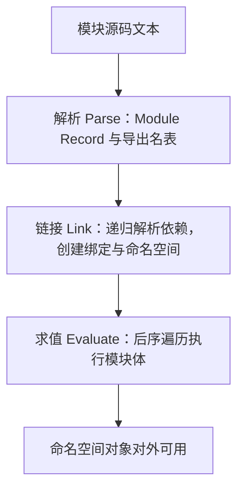
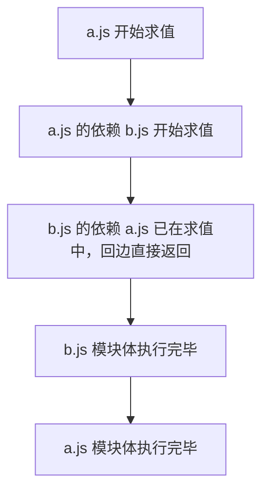

# JavaScript 模块：MDN 精读

!!! abstract "核心结论"

    - ES Module 是静态结构：`import`/`export` 只能出现在模块顶层，引擎在求值之前就能解析出完整模块图并完成链接（linking），这是静态检查、tree-shaking 与 chunk 切分的前提。
    - 导入的是 live binding，不是值拷贝：导入标识符是导出方变量的只读视图，导出方重新赋值后导入方读到新值；但导入方不能给它赋值。
    - 模块脚本自动 defer、自动严格模式、绑定只存在于模块作用域、同一模块 URL 只求值一次；跨源加载要走 CORS，`file://` 打开会失败。
    - 循环依赖下函数声明因 hoisting 通常可用，`let`/`const`/`class` 绑定在初始化前被跨模块读取会触发 TDZ 的 `ReferenceError`。
    - `import()` 是运行时表达式，返回 Promise，可条件化、可放在非顶层作用域；`import.meta` 暴露模块自身元信息（如 URL）。

## 1. 引擎视角：一个模块从文本到执行要经过什么

### 1.1 三个阶段

规范把模块求值拆成 Parse、Link、Evaluate 三个互不重叠的阶段。Parse 生成 Module Record 并收集导出名表；Link 递归解析依赖、为每个模块创建绑定槽位与命名空间对象，此时还不执行任何模块代码；Evaluate 才真正按拓扑顺序执行模块体。三阶段分离的直接收益是"依赖图在任何用户代码运行前就已经是确定的事实"。



关键在于 Link 阶段完成时，每个导出名都已经有对应的绑定槽位（binding slot），槽位里装的是"引用"而不是"值"。Evaluate 阶段只是往槽位里填值或改变引用目标。live binding 的全部魔法来自这一步：导入方读到的是槽位的当前指向。

### 1.2 为什么必须静态

`import`/`export` 是声明而非调用，不参与运行时控制流。引擎因此可以在不执行任何代码的情况下回答三个问题：这个模块导出了什么、它依赖了谁、这些依赖的导出名是否存在。命名导入写错名字会在链接阶段直接抛 `SyntaxError`，而不是运行时返回 `undefined`。这也是 bundler 能做 tree-shaking 的前提：它不需要运行代码就能确定哪些导出从未被引用。

### 1.3 模块脚本与经典脚本的差异

| 维度 | 经典脚本 `script` | 模块脚本 `script type="module"` |
| --- | --- | --- |
| 严格模式 | 默认非严格，需手写 `"use strict"` | 自动严格模式 |
| 顶层声明的作用域 | 全局对象（`var`/函数声明） | 模块作用域，不污染全局 |
| 执行时机 | 同步阻塞解析 | 自动 defer，HTML 解析完成后按序执行 |
| 是否可重复执行 | 引用多次执行多次 | 只执行一次 |
| `import`/`export` | 语法错误 | 合法，且只能出现在顶层 |
| 跨源加载 | 无 CORS 限制的传统脚本 | 受 CORS 约束，需 JavaScript MIME 类型 |
| 本地 `file://` 调试 | 可用 | 报 CORS 错误，需本地服务器 |

## 2. 语法精读：export / import 的形式

### 2.1 命名导出

命名导出可以写在声明前（`export const name = "square"`），也可以在文件末尾统一导出（`export { name, draw }`）。`export` 只能作用于顶层项，不能写在函数体里。被导出的绑定在模块内部依然可以自由重新赋值，这一点和默认导出一致。

### 2.2 默认导出

`export default randomSquare;` 不加花括号，一个模块只能有一个默认导出。它等价于导出一个名为 `default` 的命名导出，因此 `import randomSquare from "./m.js"` 是 `import { default as randomSquare } from "./m.js"` 的语法糖。默认导出存在的历史原因之一是与 CommonJS/AMD 互操作。

### 2.3 重命名与再导出

`as` 同时服务于导入和导出两侧。当多个模块导出同名成员时，必须在导入侧重命名，否则引擎会抛重复声明类错误（Firefox 报 `SyntaxError: redeclaration of import name`，其他引擎文案不同，需以实际报错为准）。

### 2.4 形式对照

| 写法 | 含义 | 导入侧对应写法 |
| --- | --- | --- |
| `export const x = 1` | 命名导出 `x` | `import { x } from "./m.js"` |
| `export { x as y }` | 命名导出，改名为 `y` | `import { y } from "./m.js"` |
| `export default x` | 导出名为 `default` | `import any from "./m.js"` |
| `export default function () {}` | 匿名默认导出 | `import any from "./m.js"` |
| `import { a as b } from "./m.js"` | 本地名 `b` 指向导出 `a` | 读作只读视图 |
| `import * as ns from "./m.js"` | 取整个命名空间对象 | `ns.a`，对象本身被密封 |
| `import "./m.js"` | 只执行副作用，不绑定名字 | 无 |
| `import("./m.js")` | 动态导入，返回 Promise | 任意作用域可用 |

## 3. live binding：模块绑定的语义

### 3.1 语义要点

MDN 的表述是"imported values are read-only views"。拆开看是两句话：一是视图，导出方改变量，导入方看到新值；二是只读，导入方对导入标识符赋值会抛 `TypeError`，但可以修改对象值的属性（因为那是在改对象的属性，不是改绑定）。

### 3.2 手写实现：用 getter 复现绑定视图

这段代码要解决：在没有 ESM 的环境中，用访问器属性精确复现"读一次的快照"与"每次读的视图"这两种行为的差别。

```js
// 文件：live-binding.js
// 运行环境：Node.js（CommonJS 包），执行 `node live-binding.js`
'use strict';

// 第 1 段：导出方。把可变绑定放在闭包里，用 getter 暴露只读视图。
// 闭包变量对应模块顶层的 `let count = 0`，getter 对应规范里的绑定槽位读取。
function createExporter() {
  let count = 0;
  const increment = () => {
    count += 1;
  };

  const namespace = {}; // 对应模块命名空间对象
  Object.defineProperty(namespace, 'count', {
    enumerable: true,
    get() {
      return count; // 每次读取都取当前值，这就是 live binding
    },
  });
  Object.defineProperty(namespace, 'increment', {
    enumerable: true,
    get() {
      return increment;
    },
  });

  // 命名空间对象在规范中是密封的：不能新增属性
  Object.preventExtensions(namespace);
  return namespace;
}

module.exports = { createExporter };
```

验证标准：

```js
// 文件：live-binding.test.js
// 运行环境：Node.js，执行 `node live-binding.test.js`
'use strict';
const assert = require('node:assert/strict');
const { createExporter } = require('./live-binding.js');

const ns = createExporter();

// 第 1 段：区分快照与视图
const snapshot = ns.count; // 立即求值，冻结当时的值
const readLive = () => ns.count; // 延迟到调用时才求值

// 第 2 段：导出方修改自己的绑定
ns.increment();
ns.increment();

// 第 3 段：断言
assert.strictEqual(snapshot, 0); // 快照停在导出前的值
assert.strictEqual(readLive(), 2); // 视图读到导出方的最新值

// 第 4 段：只读性。访问器只有 getter，严格模式下赋值抛 TypeError
assert.throws(() => {
  ns.count = 99;
}, TypeError);
assert.strictEqual(readLive(), 2); // 失败的赋值没有产生任何副作用

// 第 5 段：命名空间不可扩展
assert.strictEqual(Object.isExtensible(ns), false);

console.log('live-binding ok');
// 预期输出：live-binding ok
```

1. 数据流：`createExporter` 返回的 `namespace` 里只有访问器属性，没有任何数据属性。`ns.count` 触发 `get`，`get` 读取闭包里的 `count`。导出方执行 `count += 1` 时改的是闭包变量本身，下次 `get` 自然返回新值。
2. 设计取舍：用 getter 而不是 `Proxy`，是因为 getter 已经能覆盖"读取时求值"这一核心语义，且不引入额外的陷阱（trap）转发开销。用 `Object.preventExtensions` 而不是 `Object.freeze`，是因为 `freeze` 会把访问器属性也一起处理成不可配置，虽然行为上仍然正确，但语义上命名空间对象只是"不可增删属性"，不是"属性不可写"，用 `preventExtensions` 更贴近原意。
3. 易错点一：`const snapshot = ns.count` 与 `const readLive = () => ns.count` 的差别，正是"值拷贝"和"绑定视图"的差别。很多人以为 `import { count } from ...` 是前者，实际上规范规定是后者。
4. 易错点二：`assert.throws` 能通过，依赖文件顶部的 `'use strict'`。非严格模式下给只有 getter 的访问器属性赋值会静默失败而不是抛错，此时断言会失效。
5. 与真实 ESM 的差距：真实命名空间对象在 `Object.prototype.toString` 上返回 `[object Module]`，属性描述符中 `[[Writable]]` 为 `false`，本实现只做近似。这部分细节需核对官方文档。

## 4. 循环依赖

### 4.1 求值顺序：后序遍历

规范用深度优先搜索处理模块图，模块体在自己的所有依赖求值完成之后才执行，因此实际执行顺序是后序遍历。遇到已经在栈上的模块（回边），不再递归，直接返回。这条规则让循环依赖不会死循环：环上总有一个模块先执行完，其他模块随后读到它已经初始化的绑定。



### 4.2 手写实现：模块图的后序求值

这段代码要解决：把"依赖优先、重复引用只求值一次、回边不阻塞"这三条规则固化成可断言的算法。

```js
// 文件：module-graph.js
// 运行环境：Node.js，执行 `node module-graph.js`
'use strict';

// 第 1 段：用三态标记驱动后序遍历
// modules: { [id]: { deps: string[], run: () => void } }
function evaluateGraph(entry, modules) {
  const state = new Map(); // id -> 'new' | 'evaluating' | 'evaluated'
  const order = []; // 实际求值顺序，便于断言

  function visit(id) {
    const current = state.get(id) || 'new';
    if (current === 'evaluated') return; // 幂等：被多个模块引用也只执行一次
    if (current === 'evaluating') return; // 回边：交给正在求值的那个调用栈完成
    state.set(id, 'evaluating');

    const mod = modules[id];
    if (!mod) throw new Error("Cannot find module '" + id + "'");

    for (const dep of mod.deps) visit(dep); // 第 2 段：依赖优先

    mod.run(); // 第 3 段：依赖全部就绪后才执行自身
    order.push(id);
    state.set(id, 'evaluated');
  }

  visit(entry);
  return order;
}

module.exports = { evaluateGraph };
```

验证标准：

```js
// 文件：module-graph.test.js
// 运行环境：Node.js，执行 `node module-graph.test.js`
'use strict';
const assert = require('node:assert/strict');
const { evaluateGraph } = require('./module-graph.js');

// 第 1 段：菱形依赖，store 被两条路径引用
const log = [];
const modules = {
  'app.js': { deps: ['./router.js', './store.js'], run: () => log.push('app') },
  './router.js': { deps: ['./store.js'], run: () => log.push('router') },
  './store.js': { deps: [], run: () => log.push('store') },
};
const order = evaluateGraph('app.js', modules);
assert.deepStrictEqual(order, ['./store.js', './router.js', 'app.js']);
assert.deepStrictEqual(log, ['store', 'router', 'app']); // store 只出现一次

// 第 2 段：二元环
const cyc = [];
const cycModules = {
  'a.js': { deps: ['./b.js'], run: () => cyc.push('a') },
  './b.js': { deps: ['./a.js'], run: () => cyc.push('b') },
};
const cycOrder = evaluateGraph('a.js', cycModules);
assert.deepStrictEqual(cycOrder, ['./b.js', 'a.js']); // b 先于 a
assert.deepStrictEqual(cyc, ['b', 'a']);

// 第 3 段：缺失模块要在求值前失败
assert.throws(() => evaluateGraph('missing.js', {}), /Cannot find module/);

console.log('module-graph ok');
// 预期输出：module-graph ok
```

1. 数据流：`visit` 第一次进入某模块时把状态置为 `evaluating` 并立即递归依赖。等所有依赖返回后再调用 `run`。`order` 数组记录的是模块体的执行顺序，正好是模块图的后序序列。
2. 设计取舍：用字符串状态而不是布尔标记，是为了区分"正在求值"和"已求值"这两种都需要提前返回、但语义完全不同的情况。如果只用布尔的 `visited`，回边会被误判为已完成，模块体的执行顺序会错。
3. 易错点一：`store.js` 在菱形依赖里只会 `run` 一次，因为第二次访问时状态已经是 `evaluated`。这对应规范里的"模块只执行一次"。
4. 易错点二：`cycOrder` 是 `['./b.js', 'a.js']`，和 import 语句写的位置无关，只由依赖图决定。写单元测试时不要凭直觉假设入口模块先执行。

## 5. 动态 import() 与 import.meta

### 5.1 静态与动态的差异

| 维度 | 静态 `import` | 动态 `import()` |
| --- | --- | --- |
| 语法性质 | 声明 | 返回 Promise 的表达式 |
| 出现位置 | 仅模块顶层 | 任意作用域，可在条件分支、函数体内 |
| 求值时机 | 链接阶段解析，求值阶段执行 | 调用时才发起 |
| 模块说明符 | 必须是字符串字面量 | 可以是运行时拼出的表达式 |
| 预加载 | bundler 可静态分析 | 需要打包工具配合做 chunk 命名 |
| 失败形式 | 链接阶段 `SyntaxError` | Promise reject |

### 5.2 手写实现：可记忆化的动态导入

这段代码要解决：复现 `import()` 的三个行为特征，即始终异步返回、并发同 id 只求值一次、失败不缓存。

```js
// 文件：dynamic-import.js
// 运行环境：Node.js，执行 `node dynamic-import.js`
'use strict';

// 第 1 段：loader 接口约定
// loader.cache: Map<string, namespace>
// loader.load(id): namespace   —— 同步求值，抛错表示加载失败
function createDynamicImporter(loader) {
  const inFlight = new Map(); // id -> Promise<namespace>

  return function dynamicImport(id) {
    // 第 2 段：已求值，直接命中缓存，但仍然以异步形式返回
    if (loader.cache.has(id)) {
      return Promise.resolve(loader.cache.get(id));
    }
    // 第 3 段：并发去重，同一个 id 共享同一个 Promise
    if (inFlight.has(id)) return inFlight.get(id);

    const promise = new Promise((resolve, reject) => {
      queueMicrotask(() => {
        try {
          const ns = loader.load(id);
          loader.cache.set(id, ns);
          inFlight.delete(id);
          resolve(ns);
        } catch (err) {
          inFlight.delete(id); // 第 4 段：失败不缓存，允许重试
          reject(err);
        }
      });
    });
    inFlight.set(id, promise);
    return promise;
  };
}

module.exports = { createDynamicImporter };
```

验证标准：

```js
// 文件：dynamic-import.test.js
// 运行环境：Node.js，执行 `node dynamic-import.test.js`
'use strict';
const assert = require('node:assert/strict');
const { createDynamicImporter } = require('./dynamic-import.js');

const evaluated = [];
const fakeLoader = {
  cache: new Map(),
  load(id) {
    evaluated.push(id);
    return { id };
  },
};

(async () => {
  const dynamicImport = createDynamicImporter(fakeLoader);

  // 第 1 段：返回值一定是 Promise
  const pending = dynamicImport('./a.js');
  assert.ok(pending instanceof Promise);

  // 第 2 段：同一个 id 只求值一次，且拿到同一个命名空间对象
  const [first, second] = await Promise.all([
    dynamicImport('./b.js'),
    dynamicImport('./b.js'),
  ]);
  assert.strictEqual(first, second);

  const cached = await dynamicImport('./b.js');
  assert.strictEqual(cached, first);

  assert.deepStrictEqual(evaluated, ['./a.js', './b.js']);

  // 第 3 段：失败不缓存，第二次仍然会重新尝试加载
  let attempts = 0;
  const failing = createDynamicImporter({
    cache: new Map(),
    load() {
      attempts += 1;
      throw new Error('boom');
    },
  });
  await assert.rejects(() => failing('./c.js'), /boom/);
  await assert.rejects(() => failing('./c.js'), /boom/);
  assert.strictEqual(attempts, 2);

  console.log('dynamic-import ok');
  // 预期输出：dynamic-import ok
})();
```

1. 数据流：第一次调用创建 Promise，构造函数内的 `queueMicrotask` 把真正的求值推迟到当前同步任务之后，保证调用点之后紧跟的同步代码先跑。Promise 在构造完成后立刻写入 `inFlight`，因此紧随其后的第二次调用会命中并发去重分支。
2. 设计取舍：用 `queueMicrotask` 而不是 `setTimeout`，是因为微任务在当前宏任务末尾清空，行为更接近真实 `import()` 的异步时序，也不会引入额外的计时器延迟。
3. 易错点一：把 `inFlight.set` 写在 Promise 构造函数内部（`queueMicrotask` 回调里）会导致并发去重失效，因为两个同步调用都会走到创建 Promise 那一步。
4. 易错点二：失败路径必须在 `catch` 里 `inFlight.delete`，否则一次网络抖动会让该 id 永久卡在 rejected 的 Promise 上。
5. 易错点三：`Promise.resolve(ns)` 命中缓存时虽然值已经就绪，但依然返回 Promise，调用方必须 `await`。以为"缓存命中就同步返回"是常见误解。

### 5.3 import.meta

`import.meta` 是模块专有的元信息对象，最常用的属性是 `import.meta.url`，即当前模块的 URL。它在经典脚本里是语法错误。注意 `import.meta` 只提供宿主环境决定的信息，属性集合与宿主相关，浏览器与 Node.js 的字段并不完全一致，具体字段需核对官方文档。

## 6. 手写迷你 ESM 加载器

### 6.1 设计目标与支持子集

这个加载器把前面所有分散的语义串起来：解析简化的 `import`/`export`、为每个导出名建立 live binding、深度优先链接、后序遍历求值、循环依赖回边处理。

支持的语法子集：`import d from "x"`、`import { a, b as c } from "x"`、`import * as ns from "x"`、`import "x"`、`import.meta`、`export function f`、`export async function f`、`export class C`、`export const/let/var x`、`export default <expr>`、`export { a, b as c }`。

明确不支持：`export ... from` 再导出、`export *`、一个声明导出多个绑定、`import()` 动态导入、import attributes、模板字符串插值中的标识符替换、嵌套字符串中的关键字。这些限制是刻意的简化，不是规范行为。

### 6.2 完整实现

```js
// 文件：mini-esm.js
// 运行环境：Node.js（CommonJS），执行 `node mini-esm.js`
'use strict';

class ModuleSyntaxError extends SyntaxError {
  constructor(id, message) {
    super('[' + id + '] ' + message);
    this.name = 'ModuleSyntaxError';
    this.moduleId = id;
  }
}

// ============================================================
// 第 1 段：只在"代码区"做替换的词法扫描
// 把源码切成代码片段与字符串/注释片段，只对代码片段调用 replacer
// ============================================================
function transformOutsideStrings(src, replacer) {
  let out = '';
  let plainStart = 0;
  let i = 0;
  const n = src.length;

  while (i < n) {
    const ch = src[i];
    const next = src[i + 1];

    // 行注释：整段原样保留
    if (ch === '/' && next === '/') {
      out += replacer(src.slice(plainStart, i));
      const end = src.indexOf('\n', i);
      const stop = end === -1 ? n : end;
      out += src.slice(i, stop);
      i = stop;
      plainStart = i;
      continue;
    }
    // 块注释：同上
    if (ch === '/' && next === '*') {
      out += replacer(src.slice(plainStart, i));
      const end = src.indexOf('*/', i + 2);
      const stop = end === -1 ? n : end + 2;
      out += src.slice(i, stop);
      i = stop;
      plainStart = i;
      continue;
    }
    // 字符串与模板串：整段原样保留，内部标识符不参与替换
    if (ch === '"' || ch === "'" || ch === '`') {
      out += replacer(src.slice(plainStart, i));
      const quote = ch;
      let j = i + 1;
      while (j < n) {
        if (src[j] === '\\') {
          j += 2;
          continue;
        }
        if (src[j] === quote) {
          j += 1;
          break;
        }
        j += 1;
      }
      out += src.slice(i, j);
      i = j;
      plainStart = i;
      continue;
    }
    i += 1;
  }
  out += replacer(src.slice(plainStart, n));
  return out;
}

// ============================================================
// 第 2 段：模块记录与命名空间对象
// ============================================================
class ModuleRecord {
  constructor(id) {
    this.id = id;
    this.state = 'new'; // new | evaluating | evaluated
    this.deps = new Map(); // 模块说明符 -> ModuleRecord
    this.exportNames = []; // 导出名列表，含 "default"
    this.cells = Object.create(null); // 导出名 -> 取值函数
    this.namespace = null;
    this.body = null;
    this.meta = { url: 'file:///' + id.replace(/^\.\//, '') };
  }
}

function createNamespace(record) {
  const ns = {};
  for (const name of record.exportNames) {
    Object.defineProperty(ns, name, {
      enumerable: true,
      get() {
        const cell = record.cells[name];
        if (typeof cell !== 'function') {
          // 绑定在初始化前被跨模块读取，与规范的 TDZ 行为对齐
          throw new ReferenceError("Cannot access '" + name + "' before initialization");
        }
        return cell();
      },
    });
  }
  Object.preventExtensions(ns);
  return ns;
}

// ============================================================
// 第 3 段：解析
// ============================================================
const RE_IMPORT_NS = /\bimport\s*\*\s*as\s+([A-Za-z_$][\w$]*)\s+from\s*(["'])([^"']+)\2\s*;?/g;
const RE_IMPORT_DEFAULT = /\bimport\s+([A-Za-z_$][\w$]*)\s+from\s*(["'])([^"']+)\2\s*;?/g;
const RE_IMPORT_NAMED = /\bimport\s*\{([^}]*)\}\s*from\s*(["'])([^"']+)\2\s*;?/g;
const RE_IMPORT_SIDE = /\bimport\s*(["'])([^"']+)\1\s*;?/g;
const RE_IMPORT_META = /\bimport\s*\.\s*meta\b/g;
const RE_EXPORT_LIST = /\bexport\s*\{([^}]*)\}(\s*from\s*["'][^"']*["']\s*;?)?/g;
const RE_EXPORT_FN = /\bexport\s+(async\s+)?function\s+([A-Za-z_$][\w$]*)/g;
const RE_EXPORT_CLASS = /\bexport\s+class\s+([A-Za-z_$][\w$]*)/g;
const RE_EXPORT_DECL = /\bexport\s+(const|let|var)\s+([A-Za-z_$][\w$]*)/g;
const RE_EXPORT_DEFAULT = /\bexport\s+default\s+/g;

// 解析 `a as b` 列表。source 表示左侧名字，alias 表示右侧名字。
function parseAsList(inner, id, what) {
  const result = [];
  for (const raw of inner.split(',')) {
    const piece = raw.trim();
    if (!piece) continue;
    const m = /^([A-Za-z_$][\w$]*)(?:\s+as\s+([A-Za-z_$][\w$]*))?$/.exec(piece);
    if (!m) throw new ModuleSyntaxError(id, '无法解析' + what + ': ' + piece);
    result.push({ source: m[1], alias: m[2] || m[1] });
  }
  return result;
}

function parseModule(id, source) {
  let body = source;
  const dependencies = new Set();
  const exportNames = [];
  const hoistedCells = []; // 模块体执行前注册，依赖函数声明的 hoisting
  const deferredCells = []; // 模块体讲解末尾注册
  const bindings = []; // 局部名 -> 访问表达式
  let defaultSeen = false;

  const addExport = (name) => {
    if (exportNames.includes(name)) {
      throw new ModuleSyntaxError(id, "重复导出 '" + name + "'");
    }
    exportNames.push(name);
  };

  // 3.1 import.meta 先替换，避免被后续的 import 规则误伤
  body = body.replace(RE_IMPORT_META, '__importMeta');

  // 3.2 import * as ns from "x"
  body = body.replace(RE_IMPORT_NS, (m, local, q, spec) => {
    dependencies.add(spec);
    bindings.push({ local: local, access: '__ns(' + JSON.stringify(spec) + ')' });
    return '';
  });

  // 3.3 import d from "x"
  body = body.replace(RE_IMPORT_DEFAULT, (m, local, q, spec) => {
    dependencies.add(spec);
    bindings.push({ local: local, access: '__ns(' + JSON.stringify(spec) + ').default' });
    return '';
  });

  // 3.4 import { a, b as c } from "x"
  body = body.replace(RE_IMPORT_NAMED, (m, inner, q, spec) => {
    dependencies.add(spec);
    for (const item of parseAsList(inner, id, '导入项')) {
      bindings.push({
        local: item.alias,
        access: '__ns(' + JSON.stringify(spec) + ').' + item.source,
      });
    }
    return '';
  });

  // 3.5 import "x" 副作用导入
  body = body.replace(RE_IMPORT_SIDE, (m, q, spec) => {
    dependencies.add(spec);
    return '';
  });

  // 3.6 export { local as exported };
  body = body.replace(RE_EXPORT_LIST, (m, inner, fromPart) => {
    if (fromPart) throw new ModuleSyntaxError(id, '本实现不支持 export ... from 再导出');
    for (const item of parseAsList(inner, id, '导出项')) {
      addExport(item.alias);
      deferredCells.push('__cell[' + JSON.stringify(item.alias) + '] = () => ' + item.source + ';');
    }
    return '';
  });

  // 3.7 export function f / export async function f
  body = body.replace(RE_EXPORT_FN, (m, asyncKw, name) => {
    addExport(name);
    // 函数声明会被 hoist，所以取值函数可以放在模块体最前面注册
    hoistedCells.push('__cell[' + JSON.stringify(name) + '] = () => ' + name + ';');
    return (asyncKw || '') + 'function ' + name;
  });

  // 3.8 export class C
  body = body.replace(RE_EXPORT_CLASS, (m, name) => {
    addExport(name);
    deferredCells.push('__cell[' + JSON.stringify(name) + '] = () => ' + name + ';');
    return 'class ' + name;
  });

  // 3.9 export const/let/var x，每个声明只支持一个绑定
  body = body.replace(RE_EXPORT_DECL, (m, kind, name) => {
    addExport(name);
    deferredCells.push('__cell[' + JSON.stringify(name) + '] = () => ' + name + ';');
    return kind + ' ' + name;
  });

  // 3.10 export default。统一改写成 const 声明，表达式与函数表达式都能覆盖
  body = body.replace(RE_EXPORT_DEFAULT, () => {
    if (defaultSeen) throw new ModuleSyntaxError(id, '一个模块只能有一个 default 导出');
    defaultSeen = true;
    addExport('default');
    deferredCells.push('__cell["default"] = () => __defaultExport;');
    return 'const __defaultExport = ';
  });

  // 3.11 把导入的局部名替换成命名空间属性访问
  const seen = new Set();
  for (const b of bindings) {
    if (seen.has(b.local)) throw new ModuleSyntaxError(id, "重复的导入绑定 '" + b.local + "'");
    seen.add(b.local);
  }

  const cellCode = hoistedCells.concat([body], deferredCells).join('\n');
  let finalCode = cellCode;
  if (bindings.length > 0) {
    const access = new Map(bindings.map((b) => [b.local, b.access]));
    const escaped = [...access.keys()].map((k) => k.replace(/[.*+?^${}()|[\]\\]/g, '\\$&'));
    // 用环视代替 \b，这样以 $ 开头的标识符也能正确匹配
    const pattern = new RegExp('(?<![\\w$])(' + escaped.join('|') + ')(?![\\w$])', 'g');
    finalCode = transformOutsideStrings(cellCode, (chunk) =>
      chunk.replace(pattern, (name) => access.get(name)),
    );
  }

  return {
    dependencies: [...dependencies],
    exportNames: exportNames,
    code: "'use strict';\n" + finalCode,
  };
}

// ============================================================
// 第 4 段：加载器
// ============================================================
class MiniLoader {
  constructor(sources) {
    this.sources = sources; // { [id]: sourceText }
    this.registry = new Map(); // id -> ModuleRecord
  }

  // 4.1 实例化：解析、建命名空间、递归链接依赖
  instantiate(id) {
    const cached = this.registry.get(id);
    if (cached) return cached;

    const source = this.sources[id];
    if (typeof source !== 'string') throw new Error("Cannot find module '" + id + "'");

    const record = new ModuleRecord(id);
    this.registry.set(id, record); // 先登记再递归，否则循环依赖会无限展开

    const parsed = parseModule(id, source);
    record.exportNames = parsed.exportNames;
    record.namespace = createNamespace(record); // 链接阶段就建好命名空间

    for (const spec of parsed.dependencies) {
      record.deps.set(spec, this.instantiate(spec));
    }

    const lookup = (spec) => {
      const dep = record.deps.get(spec);
      if (!dep) throw new ReferenceError('未链接的依赖: ' + spec);
      return dep.namespace;
    };
    const fn = new Function('__cell', '__ns', '__importMeta', parsed.code);
    record.body = () => fn(record.cells, lookup, record.meta);
    return record;
  }

  // 4.2 求值：后序遍历，每个模块只执行一次
  evaluate(record) {
    if (record.state === 'evaluated') return;
    if (record.state === 'evaluating') return; // 循环回边
    record.state = 'evaluating';
    for (const dep of record.deps.values()) this.evaluate(dep);
    record.body();
    record.state = 'evaluated';
  }

  // 4.3 对外 API
  load(id) {
    const record = this.instantiate(id);
    this.evaluate(record);
    return record.namespace;
  }
}

module.exports = { MiniLoader, ModuleSyntaxError, parseModule };
```

### 6.3 验证标准

```js
// 文件：mini-esm.test.js
// 运行环境：Node.js，执行 `node mini-esm.test.js`
'use strict';
const assert = require('node:assert/strict');
const { MiniLoader, ModuleSyntaxError } = require('./mini-esm.js');

const sources = {
  './counter.js': `
    export let count = 0;
    export const initial = 0;
    export const selfUrl = import.meta.url;
    export function increment(step = 1) { count += step; }
    export default function describe() { return 'count=' + count; }
  `,
  './app.js': `
    import describe, { count, increment } from './counter.js';
    export const snapshot = count;
    increment();
    increment(2);
    export const live = count;
    export const text = describe();
  `,
  './even.js': `
    import { isOdd } from './odd.js';
    export function isEven(n) { return n === 0 ? true : isOdd(n - 1); }
  `,
  './odd.js': `
    import { isEven } from './even.js';
    export function isOdd(n) { return n === 0 ? false : isEven(n - 1); }
  `,
  './trap-a.js': `
    import { later } from './trap-b.js';
    export let early = 'A';
    export const seen = later;
  `,
  './trap-b.js': `
    import { early } from './trap-a.js';
    export const readEarly = early;
    export let later = 'B';
  `,
};

const loader = new MiniLoader(sources);

// 第 1 段：命名导出 + 默认导出
const app = loader.load('./app.js');
assert.strictEqual(app.snapshot, 0); // 求值那一刻的 count
assert.strictEqual(app.live, 3); // 0 + 1 + 2
assert.strictEqual(app.text, 'count=3'); // 默认导出读到最新的绑定

// 第 2 段：live binding 与"只执行一次"
const counter = loader.load('./counter.js');
assert.strictEqual(counter.count, 3);
counter.increment(7);
assert.strictEqual(counter.count, 10);
assert.strictEqual(counter.initial, 0); // const 导出不受影响
assert.strictEqual(loader.load('./counter.js'), counter); // 同一命名空间对象
assert.ok(counter.selfUrl.endsWith('counter.js')); // import.meta.url

// 第 3 段：循环依赖中函数声明可用
const even = loader.load('./even.js');
assert.strictEqual(even.isEven(10), true);
const odd = loader.load('./odd.js');
assert.strictEqual(odd.isOdd(7), true);

// 第 4 段：循环依赖中 let 绑定在初始化前被读取
assert.throws(() => loader.load('./trap-a.js'), ReferenceError);

// 第 5 段：不支持的语法必须显式失败，而不是静默给出错误结果
assert.throws(
  () => new MiniLoader({ './bad.js': `export { a } from './x.js';` }).load('./bad.js'),
  ModuleSyntaxError,
);

console.log('mini-esm ok');
// 预期输出：mini-esm ok
```

### 6.4 数据流与易错点

1. 数据流之一，实例化：`instantiate` 先写 `registry` 再递归依赖，所以环上的第二个模块拿到的是同一个 `ModuleRecord` 实例。命名空间对象在链接阶段就已经创建好，属性是惰性 getter，读取失败会抛 `ReferenceError`。这正是 `trap-a.js` 用例能复现 TDZ 的原因：`trap-b` 求值时，`trap-a` 的 `early` 单元格还没注册。
2. 数据流之二，求值：`evaluate` 用 `evaluating` 状态挡住回边，实现后序遍历。所有依赖执行完后才执行自身，因此函数导出的取值函数在跨模块调用时一定能拿到已 hoist 的函数。
3. 设计取舍之一：把导出名的取值函数分成 `hoistedCells` 与 `deferredCells` 两组。函数声明因为 hoisting，在模块体第一条语句执行前就已初始化，所以它的单元格可以提前注册，这恰好对应规范中函数声明导出在实例化阶段就已完成初始化这一行为；`let`/`const`/`class` 只能在声明求值后才可用，因此推迟到模块体末尾。
4. 设计取舍之二：导入标识符的替换走"词法扫描 + 单次正则替换"。单次替换是必要的，否则第一个替换插入的 `__ns("x").default` 里的 `default` 可能被后续规则再次替换。
5. 易错点一：正则解析不是真正的词法分析。模块自由变量名与导入名同名、字符串里出现 `export const`、模板字符串插值中引用导入名，这些情况本实现都会给出错误结果。生产代码必须用 SWC、Acorn、esbuild 这类完整解析器。
6. 易错点二：`parseModule` 抛错后，已写入 `registry` 的残缺记录不会清理。真实加载器需要把失败状态显式记录到注册表，避免后续导入拿到半成品。
7. 易错点三：`new Function` 构造出的函数体默认是非严格模式，所以必须在拼接时手动加上 `'use strict';`，否则很多本该抛错的赋值会静默失败。

## 7. 浏览器里的加载语义

### 7.1 type="module" 与 CORS

模块必须通过 `<script type="module" src="main.js">` 或内联 `<script type="module">` 引入。内联模块可以导入其他模块，但它自身没有 URL，因此它 `export` 的内容无法被其他模块访问。服务器必须返回 JavaScript MIME 类型（如 `text/javascript`），否则浏览器会因严格 MIME 类型检查而拒绝执行。用 `file://` 直接打开页面会触发 CORS 错误，本地调试必须起一个 HTTP 服务器。`<link rel="modulepreload">` 可以提前加载模块及其依赖，减少关键路径上的往返。

### 7.2 import maps

import map 写在 `<script type="importmap">` 里的 JSON 对象中，让浏览器把裸模块名或任意文本映射到真实 URL。匹配规则是：键没有结尾斜杠时整体匹配并整体替换；键有结尾斜杠时按路径前缀匹配并替换前缀。多个键都能匹配时，选最长（最具体）的那个。`scopes` 键根据引用方脚本的路径选择不同的映射表，从而实现同一模块名在不同依赖路径下解析到不同版本。作用域是文档级的，规范没有覆盖 worker 或 worklet 上下文中的行为。可以用 `HTMLScriptElement.supports("importmap")` 做特性检测。

另一个常见用法是把带哈希的文件名映射掉：源码里只依赖 `dependency_script` 这样的稳定名字，文件名哈希变化时只改 import map。

### 7.3 import attributes 与非 JS 资源

导入非 JavaScript 资源必须显式声明类型，否则浏览器按 JavaScript 解析并在类型不符时报错：

```js
import colors from "./colors.json" with { type: "json" };
import styles from "./styles.css" with { type: "css" };
```

导入成功后，JSON 得到普通 JavaScript 对象，CSS 得到 `CSSStyleSheet` 对象，可以直接赋值给 `document.adoptedStyleSheets`。浏览器会对模块类型做校验，防止把数据文件当代码执行。

## 8. 常见陷阱

1. 把导入当成值拷贝。`import { count }` 后立刻算出的派生值不会随导出方变化；需要每次都读取绑定，或者调用导出方的函数。
2. 试图给导入的绑定赋值。会抛 `TypeError`；但 `import { obj } from ...; obj.x = 1` 是合法的，因为那是在改对象属性。
3. 在经典脚本里写 `import`。会得到 `SyntaxError: import declarations may only appear at top level of a module` 之类的错误，`<script>` 缺 `type="module"` 是常见原因。
4. 以为模块需要手写 `defer`。模块脚本自动 defer，重复引用也只会执行一次。
5. 在模块里依赖全局暴露。模块作用域不外泄，DevTools 控制台里访问不到模块内的变量。反过来，全局的 `var` 和 `document` 在模块里是可见的。
6. 用 `file://` 打开带模块的页面。跨源检查会直接失败，必须走本地服务器。
7. 循环依赖里读 `let`/`const`。在初始化前读取会得到 TDZ 的 `ReferenceError`，函数声明则通常安全。
8. 在 import map 里写相对值却忘了它是相对文档 base URL 解析的，而不是相对 import map 所在脚本的路径。
9. 认为 `.mjs` 一定比 `.js` 好。`V8` 文档推荐 `.mjs` 以便区分，但部分服务器不会为 `.mjs` 返回正确的 MIME 类型，需自行确认服务器配置与工具链支持情况。
10. 把 `import.meta` 当成跨环境统一的元信息对象。字段由宿主决定，使用前需核对官方文档。

## 9. 面试题与答题要点

### 9.1 import 进来的是值还是绑定

要点：是绑定，具体说是只读视图（live binding）。规范在链接阶段为每个导出名建立绑定槽位，导入方读的是槽位当前指向。因此导出方 `count += 1` 之后，导入方再读 `count` 得到新值；但导入方对导入标识符赋值会抛 `TypeError`。可以补一句：修改对象属性是允许的，因为改的是对象的属性而不是绑定本身。

### 9.2 为什么 import 必须在顶层，import() 却可以放在任何地方

要点：`import` 是声明，不是表达式，它参与模块图的静态构建。引擎需要在不执行任何代码的前提下确定依赖关系和导出名，所以语法上限制在顶层。`import()` 是表达式，返回 Promise，求值时机由调用点决定，因此可以出现在条件分支和函数体内。这一区分也决定了 bundler 对静态 import 可以做 tree-shaking，对动态 import 只能生成独立 chunk。

### 9.3 循环依赖什么时候会报错

要点：报错的不是"存在环"这件事，而是"在绑定初始化前跨模块读取"。函数声明在实例化阶段就完成初始化并且被 hoist，所以环两端的函数互相调用通常没问题。`let`/`const`/`class` 绑定在声明求值前处于 TDZ，跨模块读取会抛 `ReferenceError`。后序遍历决定了环上先执行完的那个模块，把它的绑定准备好，剩下的模块才有东西可读。

### 9.4 模块脚本为什么不需要 defer，它和普通脚本的执行时机差在哪

要点：模块脚本默认就是 defer 行为，HTML 解析完成后、`DOMContentLoaded` 之前按顺序执行，所以不需要手写 `defer`。经典脚本默认是阻塞式同步执行。至于给模块脚本加 `async` 属性的行为，涉及超出本页资料范围的细节，需核对官方文档。

### 9.5 同一个模块被多个 script 标签引用会执行几次

要点：只执行一次。模块实例按 URL 缓存，第二次引用直接复用已求值的命名空间。这一点和经典脚本不同，经典脚本每被引用一次就执行一次。这条差异在写全局初始化逻辑时非常关键。

### 9.6 import maps 的匹配规则是什么

要点：`imports` 里键和值都是字符串。键没有结尾斜杠时整体匹配整体替换；键有结尾斜杠时值也必须有结尾斜杠，按路径前缀替换。多个键都能匹配同一说明符时取最长（最具体）的键。`scopes` 允许按引用方路径覆盖 `imports` 的映射，匹配不到时回退到 `imports`。作用域仅在文档内生效，worker 场景不在规范范围内。

### 9.7 为什么本地 file:// 打开模块会失败，怎么解决

要点：模块加载受 CORS 约束，`file://` 协议下同源判定不成立，浏览器直接拒绝。解决办法是用本地 HTTP 服务器提供文件。同时服务器必须返回 JavaScript MIME 类型，否则会触发严格 MIME 类型检查错误。

### 9.8 import attributes 解决了什么问题

要点：默认情况下浏览器把导入的模块当 JavaScript 解析。要导入 JSON 或 CSS 必须用 `with { type: "json" }` 这类语法显式声明资源类型，浏览器据此选择解析器并做类型校验，避免把数据文件当代码执行。导入成功后，JSON 是普通对象，CSS 是 `CSSStyleSheet` 对象。

### 9.9 手写一个模块加载器时，最容易做错的地方

要点：第一，注册表必须在递归依赖之前写入记录，否则循环依赖会无限展开；第二，求值状态必须区分"正在求值"和"已求值"，否则后序顺序会出错；第三，导出取值函数的注册时机要和绑定的初始化时机对齐，函数声明可以提前，`let`/`const` 只能延后；第四，导入标识符的替换必须一次性完成，避免替换产物被二次替换。

## 深入阅读与参考

!!! tip "怎么用这些资料"
    先读「官方文档与规范」建立准确的概念，再读「源码与示例」核对细节，最后用「教程、书籍与视频」换一种讲法加深理解。每条都写明了读哪一节、带着什么问题读。

### 官方文档与规范

| 资源 | 为什么读 | 怎么读 |
|---|---|---|
| [import.meta](https://developer.mozilla.org/en-US/docs/Web/JavaScript/Reference/Operators/import.meta) | 拿到模块自身 URL 与环境信息的标准入口，加载器必备 | 读示例后在模块内打印 import.meta.url，确认它只存在于模块作用域 |
| [import.meta.resolve()](https://developer.mozilla.org/en-US/docs/Web/JavaScript/Reference/Operators/import.meta/resolve) | 规范化的模块说明符解析，手写加载器的解析步骤依赖它 | 对照 URL 解析规则读，改造迷你加载器的 resolve 环节并验证结果 |
| [import()](https://developer.mozilla.org/en-US/docs/Web/JavaScript/Reference/Operators/import) | 动态导入的返回值、时机与静态 import 的关键差别 | 读描述与示例，写条件加载与失败重试，观察 Promise 的时序 |
| [import.defer()](https://developer.mozilla.org/en-US/docs/Web/JavaScript/Reference/Operators/import/defer) | defer 阶段导入，直观展示加载与求值是可分离的两步 | 读动机与示例，与 import() 对比，记录两者求值时机差异 |
| [export](https://developer.mozilla.org/en-US/docs/Web/JavaScript/Reference/Statements/export) | 导出语法权威清单，含重导出与实时绑定说明 | 逐条抄写各形式示例，重点看 export { x as default } 与重导出 |
| [import](https://developer.mozilla.org/en-US/docs/Web/JavaScript/Reference/Statements/import) | 静态导入全部形式与提升语义的权威说明 | 读 Syntax 各形式与备注，验证导入声明被提升到模块顶部 |
| [Import attributes](https://developer.mozilla.org/en-US/docs/Web/JavaScript/Reference/Statements/import/with) | with 属性语法与模块类型校验语义，现代加载链路一环 | 读语法与示例，做 JSON 模块实验，观察属性不匹配的报错 |
| [SyntaxError: import declarations may only appear at top level of a module](https://developer.mozilla.org/en-US/docs/Web/JavaScript/Reference/Errors/import_decl_module_top_level) | 常见陷阱的权威解释：import 只能出现在模块顶层 | 读错误原因与示例，复现顶层外的 import，区分 script 与 module |
| [Add JavaScript to your web page](https://developer.mozilla.org/en-US/docs/Web/HTML/How_to/Add_JavaScript_to_your_web_page) | 讲清 script 的 defer、module 加载与执行时机 | 读 type=module 一节，画一张 HTML 解析到模块求值的时序图 |

### 源码与示例

| 资源 | 为什么读 | 怎么读 |
|---|---|---|
| [ESM External Require Plugin](https://rolldown.rs/builtin-plugins/esm-external-require) | 真实插件源码，展示 ESM 与 require 互操作的取舍 | 读源码与配置示例，理解 external 模块如何被转换为可 require 产物 |
| [Non ESM Output Formats](https://rolldown.rs/in-depth/non-esm-output-formats) | 对比 CJS/IIFE 产物的代码样例，看清 ESM 语义差异 | 读各格式示例代码，思考 live binding 在 CJS 产物里如何被模拟 |

### 教程、书籍与视频

| 资源 | 为什么读 | 怎么读 |
|---|---|---|
| [MDN JavaScript 模块](https://developer.mozilla.org/en-US/docs/Web/JavaScript/Guide/Modules) | MDN 模块指南，示例可在浏览器直接跑，覆盖加载与求值差异 | 用本地服务器跑通全部 type=module 示例，对照 CommonJS 记录解析与求值差异 |

## 应用与行业实践

### 应用场景地图

| 场景 | 用到本页哪个知识点 | 典型技术选型 | 注意事项 |
| --- | --- | --- | --- |
| 后台管理的万行表格，带筛选与导出 | 静态模块图、动态 import() | Vite + 功能级分包 | 导出依赖别留在入口 chunk 的静态依赖里 |
| 低端安卓机上的活动页首屏 | 模块脚本自动 defer、静态依赖图 | Vite/Rollup + modulepreload | 首屏只留关键路径依赖，水合逻辑别写进入口 |
| 多人协作白板的状态与渲染互引 | 循环依赖、live binding | 原生 ESM + WebSocket | 跨模块读取放进函数体内，避免顶层读 let/const |
| 组件库被业务方按需引入 | export 的静态形式、tree-shaking | Rollup + exports / sideEffects | 模块顶层写副作用代码会让摇树失效 |
| 微前端子应用运行时挂载 | 动态 import()、同一模块 URL 只求值一次 | 原生 ESM + import maps | 主应用与子应用共用的库要约定成外部依赖 |
| Node.js SSR 服务的同构渲染 | live binding、循环依赖 | Node ESM + Vite SSR | 服务端模块缓存跨请求复用，别在顶层存请求态 |
| 数据分析看板的图表插件按需加载 | import() 返回 Promise | 自研插件 + Vite | 加载失败要兜底，条件分支要处理 reject |
| 浏览器扩展的 content script 注入 | 模块作用域、CORS、file:// 限制 | MV3 + 打包成单文件 | content script 默认不是模块，file:// 加载会失败 |

### 三个场景拆解

#### 场景 1：后台管理的万行表格

**业务背景**：表格页要支持筛选、分页、导出 Excel，导出依赖一个解析与写文件的库。痛点在于导出按钮点击率远低于页面打开率，这份依赖却跟着入口一起下载和解析。

**怎么用本页知识解决**：思路是先确认导出库没有被别处静态 import，再把它改成运行时 import()，让打包器切出独立 chunk。

```js
// main.js —— 入口只保留静态 import，模块图在求值前就能解析完
import { renderTable } from './table.js';

document.querySelector('#export').addEventListener('click', () => {
  // import() 是运行时表达式，返回 Promise，可写在事件回调里
  import('./export-xlsx.js').then(({ exportXlsx }) => {
    exportXlsx(rows); // 该模块按 URL 缓存，只求值一次
  }).catch((err) => {
    showToast('导出模块加载失败'); // 网络失败必须有兜底路径
  });
});
```

- 静态 import 只留表格渲染，入口 chunk 的解析时间不再包含导出库。
- import() 的参数是字符串字面量，打包器才能识别并切出独立 chunk。
- 同一模块 URL 只求值一次，重复点击导出不会重复初始化。
- Promise 会 reject，CORS 或断网时要有提示，不能让按钮卡在加载态。
- 不要用变量拼路径，打包器分析不出结果，chunk 切不出来。

**怎么度量收益**：指标看 Lighthouse 的 LCP 与 TBT，以及 Chrome DevTools Coverage 面板里入口 chunk 的未使用字节占比。测量方法是在改前改后各做 5 次冷启动，记录中位数，再用 webpack-bundle-analyzer 或 Rollup 构建输出的 chunk 体积表对照。

**什么时候不该用**：反例一，页面本身就是数据导出页，导出是主操作，动态 import() 会把它推到关键路径，多一次网络往返。反例二，站点跑在 HTTP/1.1 且并发连接受限，多切一个 chunk 会排队。

#### 场景 2：低端安卓机上的活动页首屏

**业务背景**：活动页要在低端安卓机上打开，脚本的解析与执行时间占主线程的比例偏高。用 Chrome DevTools Performance 面板录制一次冷启动，看 Scripting 时间占总时长的份额。

**怎么用本页知识解决**：思路是把非首屏模块改成运行时 import()，在首屏渲染完的空闲时段预取，Worker 用 import.meta.url 定位。

```js
// entry.js —— 入口只保留首屏必须的静态 import
import { mountHero } from './hero.js';
mountHero();

// 首屏渲染后在空闲时段预取下一屏，用户滚动时不必等待
const idle = window.requestIdleCallback || ((fn) => setTimeout(fn, 200));
idle(() => { import('./below-fold.js'); }); // 触发该 chunk 的下载与求值

// Worker 入口用 import.meta.url 拼路径，打包器据此改写为产物 URL
const worker = new Worker(new URL('./parse.worker.js', import.meta.url), { type: 'module' });
```

- 模块脚本自动 defer，入口不会阻塞 HTML 解析，但下载仍占首屏带宽。
- 非首屏依赖走 import() 后，首次求值推迟到用户真正需要时。
- requestIdleCallback 在 Safari 上不可用，需要 setTimeout 兜底。
- new URL(..., import.meta.url) 让打包器把 Worker 当独立入口处理。
- import.meta.url 是模块自身 URL，部署路径变化时不需要改代码。

**怎么度量收益**：指标看 Lighthouse 的 LCP、TBT 与 CLS，Chrome DevTools Performance 里 Scripting 的时长。测量方法是在同一台低端机上用 Network 面板的 Slow 4G 节流加 4x CPU 降速，各跑 5 次取中位数，再用 Network 面板的 Transfer Size 核对首屏字节数。

**什么时候不该用**：反例一，页面本身是仪表盘，首屏之后的操作立刻要用全部模块，切分后首次交互会触发多次请求。反例二，内网带宽充足但往返延迟高，多一次请求等待反而拉长首屏。

#### 场景 3：多人协作白板

**业务背景**：白板里房间状态模块与渲染模块互相 import，重构后启动时报 `Cannot access 'x' before initialization`。规模量级可以用最小复现脚本衡量：抽出两个互相引用的模块，用 node 直接跑，看报错是否稳定复现。

**怎么用本页知识解决**：思路是先判断循环边上是函数声明还是 let/const/class 绑定，再把跨模块读取推迟到函数体内执行。

```js
// room.js —— 与 render.js 互相 import，构成循环依赖
import { drawCursor } from './render.js';
export const members = new Map(); // 导出方绑定，导入方读到的是同一份

export function join(user) {
  members.set(user.id, user);
  drawCursor(user); // 函数声明有提升，进入 room.js 时已可用
}

// render.js
import { members } from './room.js'; // 循环回来，但只在函数体内读 members
export function drawCursor(user) {
  if (!members.has(user.id)) return; // 读取发生在求值之后，不触发 TDZ
  paint(user);
}
```

- 函数声明有提升，循环依赖下通常能正常调用。
- let、const、class 绑定在初始化前被跨模块读取，会抛 TDZ 的 ReferenceError。
- 把读取放进函数体，就把时机从"链接阶段"推迟到"调用阶段"。
- 光标位置这类可变状态用 export let 暴露，导入方读到的是最新值。
- 导入方给导入的绑定赋值会抛 TypeError，写入要通过导出方的函数。

**怎么度量收益**：指标看 PerformanceObserver 订阅 longtask 得到的条目数与次数，DevTools Performance 面板里的单帧渲染耗时。另外用一个覆盖循环依赖的单元测试作为回归指标，运行 `node --input-type=module` 跑最小复现脚本，确认不再抛 ReferenceError。

**什么时候不该用**：反例一，两个模块本来就属于同一个领域概念，直接合并成一个模块，比维护循环边省事。反例二，循环边上必须读模块顶层的 let/const 配置对象，此时应改成惰性函数或在入口处显式初始化，而不是靠调整 import 顺序。

### 行业先进实践

**在 package.json 里声明 sideEffects（出处：webpack 官方文档 Tree Shaking）**
做法是把 `"sideEffects": false` 写进包描述，或者列出确实带副作用的文件路径。摇树只删"删除后行为不变"的代码，而打包器默认无法判断模块顶层有没有副作用。借鉴前先确认模块顶层没有全局注册、polyfill 注入和样式副作用。

**用 exports 字段做条件导出（出处：Node.js 官方文档 Modules: Packages）**
做法是在 `"exports"` 里按 `import`、`require`、`browser` 条件分出不同入口。打包器与 Node 各自按条件选入口，能同时满足模块语法与兼容老代码。借鉴时先显式声明入口，再补条件映射，并检查同一进程里不会同时命中两份代码。

**路由级代码分割（出处：React 官方文档 React.lazy 与 Suspense；Vue Router 官方文档的懒加载路由）**
做法是用 import() 返回 Promise 这一点，把路由组件变成独立 chunk，首屏只下载当前路由需要的代码。借鉴时先量入口 chunk 体积，再把访问频率低的路由改成动态 import，并给加载失败留兜底 UI。

**用 modulepreload 提前抓取模块图（出处：MDN 的 `<link rel="modulepreload">` 文档）**
做法是在 HTML 里为入口的下游静态依赖加上 `rel="modulepreload"`，浏览器提前抓取并解析。借鉴时只标注首屏必需的静态依赖；给动态 import 的目标加这一条，要看它是否真的属于首屏。

**Worker 入口写成 new URL(..., import.meta.url)（出处：Vite 官方文档 Web Workers）**
做法是让打包器把 Worker 文件当成独立入口处理，运行时再拼出产物路径。写死相对路径在产物目录结构变化后容易 404。借鉴时把 Worker 的构造写在模块里，路径交给打包器改写。

### 从学到用：落地路线

第 1 步：选一个访问量可控的功能页试点，把它的非首屏依赖改成动态 import()。验收标准是构建产物里出现独立 chunk，入口 chunk 的静态依赖列表里不再包含该模块。

第 2 步：验证行为与收益。验收标准是试点页的单元测试与端到端测试全部通过，Lighthouse 的 LCP 与 TBT 在 5 次冷启动中的中位数不差于改造前。

第 3 步：推广到同类页面，并把约定写进项目规范。验收标准是新增页面默认按功能切分，代码评审清单里有对应条目。

第 4 步：防止回退。验收标准是 CI 里跑构建产物体积检查，入口 chunk 超过阈值时构建失败，并在 PR 里输出体积对比。

### 动手作业

**目标**：做一个按需加载的 Markdown 预览器，用原生 ESM 加 Vite，把解析库放进动态 import()，再用 import.meta.url 启动一个 Worker。

**步骤**：
1. 建 Vite 项目，入口 HTML 用 `<script type="module" src="/src/main.js"></script>`。
2. 写 `src/editor.js`，导出 `getText()` 与 `setPreview(html)`，在 main.js 里静态 import。
3. 写 `src/parse.js`，导出 `parse(md)`，内部静态 import 一个 Markdown 解析库。
4. 在 main.js 的输入事件里用 `import('./parse.js')` 按需加载，并处理 catch 分支。
5. 写 `src/parse.worker.js`，用 `new Worker(new URL('./parse.worker.js', import.meta.url), { type: 'module' })` 创建，把解析搬进 Worker。
6. 写 `src/config.js` 用 `export let` 暴露主题变量，另写 `src/theme.js` 导入并渲染，验证 live binding。
7. 执行构建，检查 dist 目录里的 chunk 划分与 HTML 中的引用。

**验收标准**：
- 构建产物中解析库不在入口 chunk 的静态依赖里。
- 页面刚加载完时，Network 面板里没有解析库的请求，第一次输入后才出现。
- Worker 收到消息并返回 HTML，Performance 面板记录不到超过 50ms 的长任务。
- 修改主题变量后渲染结果同步变化，而在 theme.js 里给导入的绑定赋值会抛 TypeError。
- 用 file:// 打开入口 HTML 会因跨源限制失败，改用本地静态服务器访问正常。

