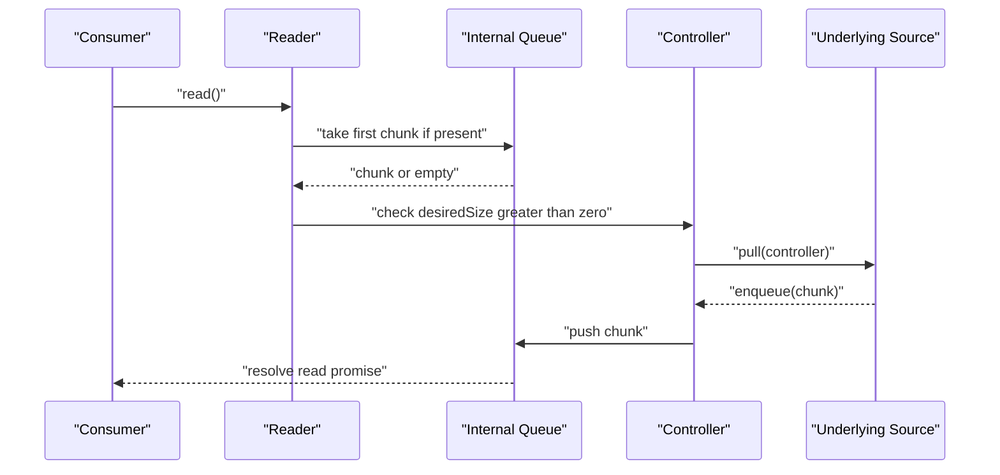

# Streams、Fetch 与 Web Workers：MDN 精读

!!! abstract "核心结论"

    - Streams API 把网络资源切成 chunk 逐块处理，不必先把整个响应缓冲成 string、Blob 或 ArrayBuffer。
    - 一条 ReadableStream 同时只能被一个 active reader 锁定（locked）；需要并行读取时用 tee 得到两份可独立读取的副本。
    - 背压由 internal queue 与 controller 的 desiredSize 驱动：队列越满，desiredSize 越小，读取端就越少向 underlying source 拉取数据。
    - fetch 在收到响应头时 resolve，即使 HTTP 状态是错误码；Response.body 默认暴露为一条 ReadableStream。
    - Web Worker 在独立线程运行脚本，postMessage 默认走结构化克隆（复制），Transferable 则转移所有权且源对象随后不可用。

## 1. Streams 的抽象模型：数据如何流进 JavaScript

### 1.1 push source 与 pull source

MDN 把 underlying source 分成两类。push source 会在你可访问它之后持续把数据推给你，控制权在你手上的是启动、暂停与取消，例如视频流与 TCP/WebSocket；pull source 需要你在建立连接后显式请求数据，例如通过 fetch 发起的文件访问。

这个区分决定了流内部由谁驱动：pull source 让运行时有能力"按需拉取"，从而给背压留下自然接口；push source 则需要运行时用内部队列把"推过来的数据"先缓冲住，再回过来通知生产者暂停或减速。

### 1.2 chunk、internal queue 与锁

数据被顺序读取，读的单位是 chunk。chunk 可以是单个 byte，也可以是某个大小的 typed array；一条流里的 chunk 可以大小不同、类型不同。放入流中的 chunk 称为 enqueued，也就是排在队列里等待被读取，而负责记录"还没被读走的 chunk"的结构叫 internal queue。

读取 chunk 的角色是 reader，它一次处理一个 chunk，reader 加上配套处理代码合称 consumer。每个 reader 都有一个关联的 controller 用来控制流，例如关闭它。

锁是理解流行为的关键：同一时刻只能有一个 reader 读取一条流；当 reader 创建并开始读取（active reader），这条流就被 locked 了。想让另一个 reader 读取，通常要先取消前一个 reader，或者改用 tee。

### 1.3 byte stream、BYOB 与三种流对象

除了常规 readable stream，还有一类 byte stream，它是为读取底层字节源而扩展的版本。相比常规流，byte stream 允许 BYOB（bring your own buffer）reader 读取，也就是把数据直接读进开发者提供的缓冲区，最小化复制次数。你的代码最终用到哪种 underlying stream、reader、controller，取决于流最初是怎么创建的。

下表把三类核心对象与配套角色放在一起。

| 对象 | 角色 | 关键接口/属性 |
| --- | --- | --- |
| ReadableStream | 数据来源 | getReader、pipeTo、pipeThrough、tee、locked |
| WritableStream | 数据目的地（sink），自带背压与队列 | getWriter |
| TransformStream | 位于 pipe chain 中的变换 | readable、writable |
| Reader / Writer | 逐 chunk 读写的句柄 | read、write、close |
| Controller | 操控流状态与内部队列 | enqueue、close、desiredSize |

需要区分：控制器分默认控制器与 byte stream 控制器，默认控制器用于非 byte stream。表里的 enqueue、close、desiredSize 是默认控制器提供的能力，byte stream 的 controller 属于另一套接口，细节需核对官方文档。

## 2. 背压：readable 与 writable 的握手协议

### 2.1 背压的最小模型

背压不是某个 API，而是"消费者没准备好，生产者就别生产"的协议。在 Streams 里它体现为两个量：internal queue 的当前总量，以及 controller 的 desiredSize。desiredSize 可理解为"还能再塞多少个 chunk"：它为正时，运行时才会继续调用 underlying source 的 pull；它降到 0 或以下，pull 就停下来。下图是这条握手的骨架。



### 2.2 手写一个简化版 ReadableStream

这段代码要解决的是：把"internal queue、锁、desiredSize 驱动的 pull"三条主干抽出来，做成一个可运行的最小模型，用来观察背压的触发时机。它不追求规范级细节，只保留行为主干。

```javascript
// 运行环境：Node.js 18+（代码本身只依赖 JS 语言特性，不依赖 Web API）
// 说明：非规范级实现，只保留队列、锁、背压三条主干，便于观察算法走向
class SimpleReadableStream {
  // 第 1 段：私有状态。queue 是 internal queue，queueSize 是它的总大小
  #queue = [];
  #queueSize = 0;
  #pendingReads = [];
  #pullPending = false;
  #closeRequested = false;
  #closed = false;
  #errored = null;
  #source;
  #strategy;
  #controller;

  constructor(source, strategy = {}) {
    this.#source = source;
    // size 函数决定一个 chunk 占多少队列预算，默认每个 chunk 计 1
    this.#strategy = {
      highWaterMark: strategy.highWaterMark ?? 1,
      size: strategy.size ?? (() => 1),
    };

    // 第 2 段：controller 是 underlying source 与流交互的唯一入口
    this.#controller = {
      enqueue: (chunk) => {
        if (this.#closed || this.#errored) return;
        this.#queue.push(chunk);
        this.#queueSize += this.#strategy.size(chunk);
        this.#settleReads();
      },
      close: () => {
        if (this.#closed || this.#errored) return;
        this.#closeRequested = true;
        this.#settleReads();
      },
      error: (reason) => {
        if (this.#closed || this.#errored) return;
        this.#errored = reason ?? new Error('stream error');
        this.#queue = [];
        this.#queueSize = 0;
        this.#settleReads();
      },
    };

    // 第 3 段：构造完成先尝试填满队列，这一步就是背压的起点
    this.#callPullIfNeeded();
  }

  // desiredSize 为正代表还能接收更多 chunk
  get desiredSize() {
    return this.#strategy.highWaterMark - this.#queueSize;
  }

  get locked() {
    return this.#pendingReads.length > 0;
  }

  getReader() {
    // 第 4 段：reader 的 read 优先从队列取；队列空则挂起，并顺带触发 pull
    return {
      read: () => {
        if (this.#errored) return Promise.reject(this.#errored);
        if (this.#queue.length > 0) {
          const value = this.#queue.shift();
          this.#queueSize -= this.#strategy.size(value);
          this.#callPullIfNeeded();
          return Promise.resolve({ value, done: false });
        }
        if (this.#closeRequested) {
          this.#closed = true;
          return Promise.resolve({ value: undefined, done: true });
        }
        return new Promise((resolve, reject) => {
          this.#pendingReads.push({ resolve, reject });
          this.#callPullIfNeeded();
        });
      },
    };
  }

  // 第 5 段：把已入队的数据分发给挂起的 read，或把错误/结束状态传下去
  #settleReads() {
    while (this.#pendingReads.length > 0) {
      const pending = this.#pendingReads.shift();
      if (this.#errored) {
        pending.reject(this.#errored);
      } else if (this.#queue.length > 0) {
        const value = this.#queue.shift();
        this.#queueSize -= this.#strategy.size(value);
        pending.resolve({ value, done: false });
      } else if (this.#closeRequested) {
        this.#closed = true;
        pending.resolve({ value: undefined, done: true });
      } else {
        this.#pendingReads.unshift(pending);
        break;
      }
    }
    this.#callPullIfNeeded();
  }

  // 第 6 段：只有当 desiredSize 为正且没有在途 pull 时，才向 source 索要数据
  #callPullIfNeeded() {
    if (this.#pullPending || this.#closed || this.#closeRequested || this.#errored) return;
    if (this.desiredSize <= 0) return;
    this.#pullPending = true;
    let result;
    try {
      result = this.#source.pull(this.#controller);
    } catch (err) {
      this.#pullPending = false;
      this.#controller.error(err);
      return;
    }
    Promise.resolve(result).then(
      () => {
        this.#pullPending = false;
        this.#callPullIfNeeded();
      },
      (err) => {
        this.#pullPending = false;
        this.#controller.error(err);
      },
    );
  }
}
```

逐段解析：

1. 第 1 段的私有字段直接对应规范里的内部槽位：队列、队列总量、挂起读、pull 在途标志、关闭请求、已关闭、已出错。
2. 第 2 段把 controller 收敛成一个对象，enqueue 只做两件事：入队、更新 queueSize，然后唤醒读等待者。写法上不直接暴露队列，保证只有 enqueue 能改变队列总量。
3. 第 3 段在构造末尾主动 pull 一次，行为等价于"流创建后立即尝试填充 internal queue"，这也是为什么很多流在没有任何 read 之前就已经有数据在队列里。
4. 第 4 段 read 的分支顺序很重要：先查错误，再查队列，再查关闭，最后才挂起。顺序错了就会出现"已经关闭却还在等数据"的死等。
5. 第 5 段是核心分发逻辑。注意 break 之前用 unshift 把等待者放回队首，避免在队列暂时为空时把它丢掉。
6. 第 6 段是背压闸门。desiredSize 小于等于 0 直接 return，就是"消费者没跟上，不再拉取"；pullPending 保证不会并发发起多次 pull。

验证标准：

```javascript
// 运行环境：Node.js 18+。需要与本页 2.2 的 SimpleReadableStream 一起运行
const assert = require('node:assert/strict');

async function main() {
  const produced = [];
  const stream = new SimpleReadableStream({
    pull(controller) {
      if (produced.length >= 3) {
        controller.close();
        return;
      }
      produced.push(produced.length);
      controller.enqueue(produced[produced.length - 1]);
    },
  }, { highWaterMark: 1 });

  const got = [];
  const reader = stream.getReader();
  for (;;) {
    const { value, done } = await reader.read();
    if (done) break;
    got.push(value);
  }

  assert.deepStrictEqual(got, [0, 1, 2]);
  assert.deepStrictEqual(produced, [0, 1, 2]);
  console.log('实现 A 通过：按需 pull、顺序读取、正常关闭');
}

main().catch((error) => {
  console.error(error);
  process.exitCode = 1;
});
// 预期输出：实现 A 通过：按需 pull、顺序读取、正常关闭
```

### 2.3 手写简化版 pipeTo

这段代码要解决的是：显式复现"读取端等待写入端准备好"的背压闭环，说明 pipeTo 为什么不会把内存吃爆。

```javascript
// 运行环境：Node.js 18+（使用全局 Web Streams）
// 第 1 段：手动实现简化版 pipeTo，等待 write 完成形成背压
async function simplePipeTo(readable, writable) {
  const reader = readable.getReader();
  const writer = writable.getWriter();
  try {
    for (;;) {
      const { value, done } = await reader.read();
      if (done) break;
      // write 返回的 Promise 在底层 sink 接受该 chunk 后 resolve，
      // 因此 await 它就等于“等下游腾出空间”，这就是背压
      await writer.write(value);
    }
    await writer.close();
  } catch (error) {
    await writer.abort(error);
    throw error;
  } finally {
    reader.releaseLock();
  }
}

// 第 2 段：验证写入顺序与 close 是否被调用
async function main() {
  const assert = require('node:assert/strict');
  const events = [];
  const source = new ReadableStream({
    start(controller) {
      for (let i = 0; i < 3; i += 1) controller.enqueue(i);
      controller.close();
    },
  });
  const sink = new WritableStream({
    async write(chunk) {
      events.push(`write:${chunk}`);
      await new Promise((resolve) => setTimeout(resolve, 1));
    },
    close() {
      events.push('close');
    },
  });

  await simplePipeTo(source, sink);
  assert.deepStrictEqual(events, ['write:0', 'write:1', 'write:2', 'close']);
  console.log('实现 C1 通过：pipeTo 顺序写入并以 close 收尾');
}

main().catch((error) => {
  console.error(error);
  process.exitCode = 1;
});
// 预期输出：实现 C1 通过：pipeTo 顺序写入并以 close 收尾
```

逐段解析：

1. 第 1 段的关键在 `await writer.write(value)`。这个 Promise 在底层 sink 的 write 完成后才 resolve，所以循环天然被下游速度约束；如果改成不 await，队列就会无界增长。
2. 出错路径用 `writer.abort(error)` 把错误传进管道的写入端，然后重新抛出，让调用方能看到失败。
3. `finally` 里 releaseLock 保证句柄释放，否则流会一直处于 locked 状态。
4. 第 2 段用事件数组记录顺序，断言包含四段：三次 write 加一次 close。

### 2.4 WritableStream 的串行化保证

这段代码要解决的是：验证同一条 WritableStream 的 sink.write 不会并发执行。这是背压能成立的前提，也是"写入端自带队列"的直接结果。

```javascript
// 运行环境：Node.js 18+（使用全局 Web Streams）
const assert = require('node:assert/strict');

async function main() {
  let inFlight = 0;
  let maxInFlight = 0;
  const written = [];

  // 第 1 段：sink 里手动统计并发度
  const writable = new WritableStream({
    async write(chunk) {
      inFlight += 1;
      maxInFlight = Math.max(maxInFlight, inFlight);
      await new Promise((resolve) => setTimeout(resolve, 2));
      written.push(chunk);
      inFlight -= 1;
    },
  }, { highWaterMark: 1 });

  // 第 2 段：一次性塞 6 个 chunk，交给运行时排队
  const source = new ReadableStream({
    start(controller) {
      for (let i = 0; i < 6; i += 1) controller.enqueue(i);
      controller.close();
    },
  });

  await source.pipeTo(writable);
  assert.equal(maxInFlight, 1);
  assert.deepStrictEqual(written, [0, 1, 2, 3, 4, 5]);
  console.log('实现 C2 通过：sink.write 串行执行且顺序一致');
}

main().catch((error) => {
  console.error(error);
  process.exitCode = 1;
});
// 预期输出：实现 C2 通过：sink.write 串行执行且顺序一致
```

逐段解析：

1. 第 1 段用 inFlight 计数记录 sink.write 的并发度，maxInFlight 是观测值。highWaterMark 设为 1，队列最多只允许一个 chunk 在途。
2. 第 2 段一次性 enqueue 六个 chunk，读端在 pull 时会把它们按序交出去，写入端负责排队。
3. 断言 maxInFlight 等于 1，说明写入端对同一个 sink 的调用是串行的；如果这段逻辑由业务自己用 `Promise.all` 写，就会并发调用 sink，maxInFlight 可能大于 1。
4. 断言 written 与输入顺序完全一致，说明队列是 FIFO，不会打乱 chunk 顺序。

## 3. TransformStream 与 NDJSON 流解析

### 3.1 分块边界与 TextDecoder 的 stream 模式

网络给出的 chunk 边界是任意的：一次 read 返回的 Uint8Array 可能在 JSON 中间断开，甚至在一个 UTF-8 多字节字符的中间断开。把每个 chunk 直接 `toString()` 再 `JSON.parse` 是必然出错的。正确做法有两条：用 TextDecoder 的 stream 模式把"半个字符"留在解码器内部，用字符串缓冲把"半行"留到下一次 transform。

### 3.2 实现 NDJSONTransformStream

这段代码要解决的是：把任意切分的字节流还原成一条条完整的 JSON 记录。NDJSON 指每行一个 JSON 对象，因此"行"是天然的分帧边界。

```javascript
// 运行环境：Node.js 18+（使用全局 TransformStream 与 TextDecoder）
// 第 1 段：继承 TransformStream，把 transform 与 flush 交给父类管理
class NDJSONTransformStream extends TransformStream {
  constructor() {
    const decoder = new TextDecoder();
    let buffer = '';

    super({
      // 第 2 段：transform 累加解码文本，按换行切出完整行
      transform(chunk, controller) {
        // stream: true 让不完整的多字节字符留在 decoder 内部
        buffer += decoder.decode(chunk, { stream: true });
        let index = buffer.indexOf('\n');
        while (index >= 0) {
          const line = buffer.slice(0, index);
          buffer = buffer.slice(index + 1);
          if (line.trim() !== '') {
            controller.enqueue(JSON.parse(line));
          }
          index = buffer.indexOf('\n');
        }
      },
      // 第 3 段：flush 时把 decoder 残留字节与最后一行处理掉
      flush(controller) {
        buffer += decoder.decode();
        if (buffer.trim() !== '') {
          controller.enqueue(JSON.parse(buffer));
        }
      },
    });
  }
}

// 第 4 段：复用的读取助手
async function readAll(stream) {
  const reader = stream.getReader();
  const out = [];
  for (;;) {
    const { value, done } = await reader.read();
    if (done) break;
    out.push(value);
  }
  return out;
}

// 第 5 段：构造按字节切分的输入，故意切开多字节字符
async function main() {
  const assert = require('node:assert/strict');
  const text = '{"id":1,"name":"甲"}\n{"id":2,"name":"乙丙"}\n{"id":3,"name":"丁"}';
  const bytes = new TextEncoder().encode(text);

  const source = new ReadableStream({
    start(controller) {
      controller.enqueue(bytes.slice(0, 5));
      controller.enqueue(bytes.slice(5, 12));
      controller.enqueue(bytes.slice(12, 13));
      controller.enqueue(bytes.slice(13));
      controller.close();
    },
  });

  const records = await readAll(source.pipeThrough(new NDJSONTransformStream()));
  assert.deepStrictEqual(records, [
    { id: 1, name: '甲' },
    { id: 2, name: '乙丙' },
    { id: 3, name: '丁' },
  ]);
  console.log('实现 B 通过：跨 chunk 边界与多字节字符均正确解析');
}

main().catch((error) => {
  console.error(error);
  process.exitCode = 1;
});
// 预期输出：实现 B 通过：跨 chunk 边界与多字节字符均正确解析
```

逐段解析：

1. 第 1 段在 `super()` 之前声明 decoder 与 buffer。不能在这里用 `this`，所以状态放在闭包里，由 transform 与 flush 共享。
2. 第 2 段用 while 循环而不是 if，因为一个 chunk 里可能包含多行。每次切走一行后重新查找换行。空行用 trim 判空跳过。
3. 第 3 段 flush 是必需的：最后一行通常没有结尾换行，且 decoder 里可能还压着半个字符。`decoder.decode()` 不带参数会把这些残留吐出来。
4. 第 4 段 readAll 把 reader 循环封装起来，后面 Fetch 一节会复用，避免重复代码。
5. 第 5 段的切片点故意落在多字节字符中间（`甲` 是 3 字节），如果实现里用了 `chunk.toString()` 或 `decoder.decode(chunk)`（没有 stream: true），这里就会解析失败。

### 3.3 pipeThrough、pipeTo 与 tee 的差别

| 操作 | 返回 | 用途 | 注意点 |
| --- | --- | --- | --- |
| pipeThrough | 一条新的 ReadableStream | 插入 TransformStream 形成管道 | 上游被锁定，不能再直接读 |
| pipeTo | Promise | 把 ReadableStream 灌进 WritableStream | 需要处理 reject，负责关闭写入端 |
| tee | 两条 ReadableStream 的数组 | 一份数据给两个消费者 | 原流被锁；慢分支会积压缓冲 |

下面验证锁、tee 与重复 getReader 的报错行为。

```javascript
// 运行环境：Node.js 18+（使用全局 Web Streams）
const assert = require('node:assert/strict');

async function readAll(stream) {
  const reader = stream.getReader();
  const out = [];
  for (;;) {
    const { value, done } = await reader.read();
    if (done) break;
    out.push(value);
  }
  return out;
}

async function main() {
  // 第 1 段：重复 getReader 会抛 TypeError
  const single = new ReadableStream({
    start(controller) { controller.close(); },
  });
  const first = single.getReader();
  assert.throws(() => single.getReader(), TypeError);
  first.releaseLock();
  const second = single.getReader();
  assert.ok(second);

  // 第 2 段：tee 之后原流被锁，两条副本各自完整读取
  const origin = new ReadableStream({
    start(controller) {
      controller.enqueue(1);
      controller.enqueue(2);
      controller.close();
    },
  });
  const [left, right] = origin.tee();
  assert.equal(origin.locked, true);
  const [leftValues, rightValues] = await Promise.all([readAll(left), readAll(right)]);
  assert.deepStrictEqual(leftValues, [1, 2]);
  assert.deepStrictEqual(rightValues, [1, 2]);

  console.log('实现 B2 通过：锁语义与 tee 行为符合预期');
}

main().catch((error) => {
  console.error(error);
  process.exitCode = 1;
});
// 预期输出：实现 B2 通过：锁语义与 tee 行为符合预期
```

逐段解析：

1. 第 1 段先创建 reader 占住锁，再断言第二次 getReader 抛 TypeError；releaseLock 后可以重新获取，说明锁是可以通过释放解除的。
2. 第 2 段调用 tee 后断言 `origin.locked` 为 true，因为 tee 内部会为原流创建一个 reader。
3. 两条副本都能完整读到 `[1, 2]`，说明 tee 是"复制"而不是"分流丢弃"。实践中要注意：如果其中一个分支读得很慢，它自己的队列会积压，内存随数据量增长，具体缓冲与拉取调度细节需核对官方规范。

## 4. Fetch 与流式响应

### 4.1 fetch 的 resolve 时机

按 MDN 的描述，fetch 返回一个 Promise，它会在服务器响应头到达时 resolve 成对应的 Response，即使服务器返回的是 HTTP 错误状态。这意味着 `fetch` 的 reject 只对应网络层面的失败（例如连接失败、被 abort），而不是 `4xx/5xx`。要判断业务是否成功，必须自己看 `response.ok` 或状态码。

### 4.2 Response.body 是流

成功 fetch 返回的 response body 默认暴露为 ReadableStream，可以挂 reader 读取，也可以直接 `pipeThrough` 插入变换。下面的完整示例同时验证三件事：流式解析、HTTP 错误状态仍然 resolve、用 AbortController 取消挂起请求。

```javascript
// 运行环境：Node.js 18+（需要全局 fetch、AbortController 与 Web Streams）
// 依赖：本页 3.2 的 NDJSONTransformStream 与 readAll
const http = require('node:http');
const assert = require('node:assert/strict');

async function main() {
  // 第 1 段：起一个本地服务，提供三条路由
  const server = http.createServer((req, res) => {
    if (req.url === '/ndjson') {
      res.writeHead(200, { 'Content-Type': 'application/x-ndjson' });
      res.write('{"id":1}\n{"id":2}\n');
      setTimeout(() => res.end('{"id":3}\n'), 10);
      return;
    }
    if (req.url === '/missing') {
      res.writeHead(404, { 'Content-Type': 'text/plain' });
      res.end('not found');
      return;
    }
    // /slow：故意延迟，用于验证取消
    setTimeout(() => {
      try {
        res.writeHead(200);
        res.end('late');
      } catch {
        // 客户端可能已断开，忽略
      }
    }, 200);
  });
  await new Promise((resolve) => server.listen(0, '127.0.0.1', resolve));
  const base = `http://127.0.0.1:${server.address().port}`;

  // 第 2 段：200 响应直接 pipeThrough 做流式解析
  const response = await fetch(`${base}/ndjson`);
  assert.equal(response.status, 200);
  assert.equal(response.ok, true);
  assert.ok(response.body instanceof ReadableStream);
  const records = await readAll(response.body.pipeThrough(new NDJSONTransformStream()));
  assert.deepStrictEqual(records.map((r) => r.id), [1, 2, 3]);

  // 第 3 段：HTTP 404 不会 reject，需要自己判断 ok
  const missing = await fetch(`${base}/missing`);
  assert.equal(missing.status, 404);
  assert.equal(missing.ok, false);
  assert.equal(await missing.text(), 'not found');

  // 第 4 段：取消挂起请求会 reject
  const controller = new AbortController();
  const pending = fetch(`${base}/slow`, { signal: controller.signal });
  controller.abort();
  await assert.rejects(pending);

  server.closeAllConnections?.();
  server.close();
  console.log('实现 E 通过：流式解析、状态码语义、取消行为均符合预期');
}

main().catch((error) => {
  console.error(error);
  process.exitCode = 1;
});
// 预期输出：实现 E 通过：流式解析、状态码语义、取消行为均符合预期
```

逐段解析：

1. 第 1 段用 `listen(0)` 让系统分配随机端口，避免端口冲突；三条路由分别覆盖成功流式、错误状态、长延迟。
2. 第 2 段断言 `response.body instanceof ReadableStream`，把"body 是流"这件事变成可执行检查，然后直接 pipeThrough，说明整条链路可以零缓冲拼起来。
3. 第 3 段断言 404 时 `status` 是 404、`ok` 是 false，并且 body 仍可读为文本。这里 `missing.text()` 会消费 body，之后不能再读同一份 body；如需多次读取可考虑 `response.clone()`，其可用性与限制需核对官方文档。
4. 第 4 段先拿到 pending Promise 再立即 abort，断言 Promise reject。注意 abort 后不会再有正常响应，调用方必须把 reject 路径纳入错误处理。
5. `closeAllConnections` 是较新版本 Node 的方法，代码里用可选调用兼容旧版本。

### 4.3 取消与资源回收

取消的意义不只是"用户点了停止"。长连接如果一直不消费 body，会占用连接与内存；AbortController 可以把"挂起的 fetch"和"正在流式读取的 body"一并中断。实践中建议把 signal 一路传下去，而不是只在最外层 abort。

## 5. Web Workers：多线程、消息与所有权

### 5.1 worker 上下文与可用能力

Worker 是用构造函数创建的，它运行一个具名 JavaScript 文件，这个文件里的代码在 worker 线程执行。除标准 JS 函数外，worker 里几乎可以运行任意代码，但有例外：不能直接在 worker 中操作 DOM，也不能使用 window 上的一些默认方法与属性。具体可用清单见 MDN 的 Functions and classes available to workers。

worker 也分类型：dedicated worker 由单个脚本使用，上下文是 DedicatedWorkerGlobalScope；shared worker 可被同域下多个窗口、iframe 使用，脚本之间通过 active port 通信；service worker 处于 Web 应用、浏览器与网络之间，用于离线体验、拦截请求、更新资源等。各类型的 scope 对象都继承自 WorkerGlobalScope，对应 window 在普通页面里的角色。

还有几点值得记住：worker 可以再创建 worker，只要新 worker 与父页面同源；worker 里可以用 fetch 或 XMLHttpRequest 发请求，但 XMLHttpRequest 的 responseXML 永远是 null；importScripts 只在 worker 里可用。

### 5.2 postMessage 的两种语义

| 维度 | 结构化克隆（默认） | Transferable（transfer list） |
| --- | --- | --- |
| 数据归属 | 复制一份给接收方 | 资源所有权转移给接收方 |
| 源对象状态 | 仍然可用 | 原对象不再可用，读写会抛异常 |
| 典型对象 | 普通对象、数组、Map、Set、Date、RegExp、Blob 等 | ArrayBuffer 等拥有独占资源的对象 |
| 失败情况 | 函数、DOM 节点会抛 DataCloneError | 转移后原引用失效 |
| 适用场景 | 小对象、需要保留源数据 | 大缓冲区、避免复制开销 |

结构化克隆算法会递归复制输入对象，并在过程中维护已访问引用的映射，从而避免无限遍历循环。它有几个已知限制：函数无法被复制，会抛 DataCloneError；DOM 节点同理；某些属性不会被保留，例如 RegExp 的 lastIndex 不保留，property descriptor、setter、getter 等元数据不复制，原型链不会被遍历或复制，类的私有元素也不会被复制。Error 类型的 name 必须属于允许集合，否则会被设为 "Error"。

### 5.3 实现一个 Worker 池

这段代码要解决的是：把"任务"和"线程"解耦，让多个任务复用固定数量的 worker，并在任务完成后立刻调度下一个，而不是为每个任务新建线程。运行环境用 Node.js 的 worker_threads，它与浏览器 Worker 的 postMessage 语义接近，便于单文件运行。

```javascript
// 运行环境：Node.js 18+（node:worker_threads 的 postMessage 语义接近浏览器 Worker）
const { Worker } = require('node:worker_threads');
const assert = require('node:assert/strict');

// 第 1 段：worker 脚本内联成字符串，便于单文件运行；真实项目应写成独立文件
const workerCode = `
const { parentPort } = require('node:worker_threads');
function fib(n) { return n < 2 ? n : fib(n - 1) + fib(n - 2); }
parentPort.on('message', (task) => {
  parentPort.postMessage({ id: task.id, value: fib(task.n) });
});
`;

class WorkerPool {
  // 第 2 段：三个集合把任务与线程解耦
  constructor(size, code) {
    this.queue = [];          // 待调度任务
    this.idle = [];           // 空闲 worker
    this.pending = new Map(); // worker 到正在执行任务的映射
    this.workers = [];

    for (let i = 0; i < size; i += 1) {
      const worker = new Worker(code, { eval: true });

      // 第 3 段：worker 回消息后归还线程，并立刻尝试调度下一个任务
      worker.on('message', (message) => {
        const task = this.pending.get(worker);
        this.pending.delete(worker);
        this.idle.push(worker);
        if (task) task.resolve(message);
        this.#dispatch();
      });

      worker.on('error', (error) => {
        const task = this.pending.get(worker);
        this.pending.delete(worker);
        if (task) task.reject(error);
      });

      this.workers.push(worker);
      this.idle.push(worker);
    }
  }

  // 第 4 段：run 只负责入队，返回由调用方 await 的 Promise
  run(payload) {
    return new Promise((resolve, reject) => {
      this.queue.push({ payload, resolve, reject });
      this.#dispatch();
    });
  }

  // 第 5 段：调度循环，只要还有空闲 worker 和排队任务就继续配对
  #dispatch() {
    while (this.queue.length > 0 && this.idle.length > 0) {
      const task = this.queue.shift();
      const worker = this.idle.pop();
      this.pending.set(worker, task);
      worker.postMessage(task.payload);
    }
  }

  destroy() {
    return Promise.all(this.workers.map((worker) => worker.terminate()));
  }
}

async function main() {
  const pool = new WorkerPool(2, workerCode);
  const tasks = [];
  for (let i = 0; i < 8; i += 1) {
    tasks.push(pool.run({ id: i, n: 10 + (i % 3) }));
  }

  const results = await Promise.all(tasks);
  // Promise.all 保持输入顺序，因此 id 与提交顺序一致
  assert.deepStrictEqual(results.map((r) => r.id), [0, 1, 2, 3, 4, 5, 6, 7]);
  // fib(10)=55, fib(11)=89, fib(12)=144，按 i % 3 循环
  assert.deepStrictEqual(results.map((r) => r.value), [55, 89, 144, 55, 89, 144, 55, 89]);

  await pool.destroy();
  console.log('实现 D 通过：Worker 池复用线程且结果与任务一一对应');
}

main().catch((error) => {
  console.error(error);
  process.exitCode = 1;
});
// 预期输出：实现 D 通过：Worker 池复用线程且结果与任务一一对应
```

逐段解析：

1. 第 1 段把 worker 脚本写成字符串，用 `eval: true` 启动。注意：eval worker 的模块类型与 require 可用性依赖运行环境，真实项目更推荐独立文件加浏览器 Worker 构造方式，细节需核对官方文档。
2. 第 2 段用 queue、idle、pending 三个结构表达池化要点：任务排队、线程空闲、在途映射。线程数固定，避免频繁创建开销。
3. 第 3 段在 message 回调里先归还线程再调度，顺序很关键；如果先调度后归还，空闲线程数会被少算，吞吐下降。
4. 第 4 段 run 返回 Promise，调用方可以 `Promise.all` 等待一批任务；任务结果通过 resolve 传出，错误通过 reject 传出。
5. 第 5 段是调度核心。用 while 而不是 if，保证一次回调可以连续配对多个任务。
6. 验证用例用 `Promise.all` 保证结果顺序，逐个断言 id 与斐波那契值，把"调度正确"变成可执行检查。

### 5.4 Transferable 的所有权转移

这段代码要解决的是：把一个大缓冲区从主线程交给 worker 再交回来，全程不复制，并验证源对象在转移后失效。

```javascript
// 运行环境：Node.js 18+
const { Worker } = require('node:worker_threads');
const assert = require('node:assert/strict');

const echoCode = `
const { parentPort } = require('node:worker_threads');
parentPort.on('message', (message) => {
  // 第 1 段：在 worker 侧原地修改，再把缓冲区转移回主线程
  new Uint8Array(message.buffer)[0] += 1;
  parentPort.postMessage({ buffer: message.buffer }, [message.buffer]);
});
`;

async function main() {
  // 第 2 段：主线程创建缓冲区，并把所有权转移出去
  const buffer = new ArrayBuffer(1);
  new Uint8Array(buffer)[0] = 41;

  const worker = new Worker(echoCode, { eval: true });
  const received = await new Promise((resolve, reject) => {
    worker.on('message', (message) => resolve(message.buffer));
    worker.on('error', reject);
    worker.postMessage({ buffer }, [buffer]);
  });

  // 第 3 段：转移后原对象被 detach，byteLength 归零
  assert.equal(buffer.byteLength, 0);
  assert.equal(new Uint8Array(received)[0], 42);

  await worker.terminate();
  console.log('实现 D2 通过：Transferable 转移后源对象失效，接收方拿到所有权');
}

main().catch((error) => {
  console.error(error);
  process.exitCode = 1;
});
// 预期输出：实现 D2 通过：Transferable 转移后源对象失效，接收方拿到所有权
```

逐段解析：

1. 第 1 段在 worker 里直接改 `message.buffer` 的内容，再用 transfer list 发回，说明转移的是底层内存资源本身。
2. 第 2 段把 buffer 放进消息体，并把它列进 transferList；这一步之后主线程侧的 buffer 已经不再指向任何内存。
3. 第 3 段断言 `buffer.byteLength` 为 0，这是"原对象不再可用"的可观测表现。接收方读到的值是 42，说明 worker 的修改落在同一块内存上。
4. 结构化克隆的补充验证可以用 `structuredClone`：对含函数的对象调用它会抛错，错误名按 MDN 是 DataCloneError。

```javascript
// 运行环境：Node.js 17+ 或现代浏览器（需要全局 structuredClone）
const assert = require('node:assert/strict');
assert.throws(() => structuredClone({ fn: () => {} }), (error) => error.name === 'DataCloneError');
console.log('实现 D3 通过：函数无法被结构化克隆');
// 预期输出：实现 D3 通过：函数无法被结构化克隆
```

## 6. 常见陷阱

1. 直接对 chunk 调用 `toString()` 或 `JSON.parse`。chunk 边界是任意的，必须先按行分帧再解析；多字节字符还要靠 `TextDecoder` 的 stream 模式兜底。
2. 忘记 flush。最后一行往往没有结尾换行，不在 flush 里处理就会丢掉最后一条记录。
3. 对同一条流调用两次 getReader。会抛 TypeError，因为流已被锁定；需要并行消费时用 tee。
4. 误以为 tee 没有代价。两个分支各自维护队列，慢分支会积压数据，内存随时间增长；具体调度细节需核对官方规范。
5. 把 fetch 的 reject 当成"服务器返回了 500"。按 MDN，fetch 在收到响应头时 resolve，哪怕状态码是错误码；业务失败必须自己判断 `response.ok` 或状态码。
6. 消费过的 body 再读一次。`response.text()`、`response.json()`、`response.body` 会消费同一份 body；需要两份时考虑 `response.clone()`，限制需核对官方文档。
7. 只取消 fetch，不处理流式读取链路。长连接不消费会占资源；应把 signal 传下去，并在 abort 后走 reject 分支。
8. 在 worker 里访问 DOM。DOM 只在主线程可用，worker 里要用消息把结果传回主线程更新 UI。
9. 用 postMessage 传函数或 DOM 节点。结构化克隆对它们会抛 DataCloneError。
10. 转移 ArrayBuffer 后继续使用原对象。转移即失效，原对象 byteLength 会归零，继续读写会得到错误结果或抛异常。
11. 在 worker 里读 `XMLHttpRequest.responseXML`。按 MDN，这个属性在 worker 中永远是 null。
12. 忘记 await `pipeTo` 的 Promise 或 `writer.close()`。管道尾部数据可能丢失，错误也可能被静默吞掉。
13. Worker 池调度顺序写反。必须先归还空闲线程再调度，否则并发度会被低估。
14. 为每个任务新建 worker。线程创建开销大，应使用池化复用。

## 7. 面试题与答题要点

### 7.1 一条 ReadableStream 能否被两个消费者同时读取？为什么？

要点：不能。同一时刻只能有一个 active reader，流会被 locked；重复 getReader 抛 TypeError。要想两份数据，用 tee 得到两条独立副本，两条副本可以各自创建 reader；代价是数据被复制成两份，慢分支会积压。也可以先 releaseLock 再换 reader，但这不是并行读取。

### 7.2 背压是什么？desiredSize 在其中的作用是什么？

要点：背压是"消费者没准备好，生产者就别生产"的协议。readable 侧由 internal queue 与 desiredSize 驱动：desiredSize 为正时运行时才继续 pull underlying source，降到 0 或以下就停止拉取。writable 侧通过内部队列与 sink 的串行调用来体现。二者通过 pipeTo 连起来，write 的 Promise 在 sink 接受数据后 resolve，形成闭环。

### 7.3 fetch 什么时候 reject，什么时候 resolve？

要点：按 MDN，只要服务器响应头到达，fetch 就 resolve，即使 HTTP 状态是错误码。reject 对应网络层失败或请求被 abort。判断业务成功要看 `response.ok` 或具体状态码。另外要在拿到 Response 后主动消费 body，否则连接与资源会占用。

### 7.4 为什么 NDJSON 解析必须处理 chunk 边界？TextDecoder 的 stream 模式解决了什么？

要点：chunk 边界任意，可能落在 JSON token 中间甚至一个 UTF-8 字符的中间。处理方式是行缓冲加 decoder 状态：`decoder.decode(chunk, { stream: true })` 会把不完整的多字节序列留在 decoder 内部，下次继续拼接；最后用不带参数的 `decode()` 收尾。行级用字符串缓冲保留半个 JSON。

### 7.5 pipeThrough、pipeTo、tee 的区别与选择？

要点：pipeThrough 插入 TransformStream 并返回新的 ReadableStream，适合构造变换链；pipeTo 把 ReadableStream 灌进 WritableStream 并返回 Promise，适合终点是 sink；tee 把一条流拆成两条可独立读取的副本，适合多消费者。pipeThrough 与 pipeTo 都会锁定上游，tee 会锁定原流。

### 7.6 结构化克隆与 Transferable 的差别是什么？

要点：默认 postMessage 走结构化克隆，数据被复制，源对象仍可用；它会递归复制并维护已访问引用映射以避免循环。限制包括函数与 DOM 节点抛 DataCloneError、RegExp 的 lastIndex 不保留、property descriptor 与原型链不复制、类私有元素不复制。Transferable 则是转移所有权，原对象失效，典型是 ArrayBuffer 转移后 byteLength 归零，适合大缓冲区避免复制。

### 7.7 为什么要用 Worker 池，而不是每个任务一个 worker？

要点：worker 创建与初始化有固定开销，频繁创建会拖慢吞吐。池化用固定线程数复用线程，任务排队等待调度；调度时要把"归还空闲线程"放在"发起下一个任务"之前，否则并发度被低估。还要处理任务与结果的对应关系，通常给每个任务一个 id 或用 Map 记录在途任务。CPU 密集任务收益明显，IO 密集任务收益有限。

### 7.8 Worker 有哪些能力边界？

要点：不能直接操作 DOM，不能使用 window 的部分方法与属性；可用标准 JS 函数，以及通过 WorkerGlobalScope 派生上下文提供的大量 Web API。可以用 fetch 或 XMLHttpRequest 发请求，但 XHR 的 responseXML 恒为 null；importScripts 只在 worker 中可用。worker 可以再创建 worker，只要同源。按类型分 dedicated、shared、service 三种，上下文分别是 DedicatedWorkerGlobalScope、SharedWorkerGlobalScope、ServiceWorkerGlobalScope。

## 8. 收束

把这一页串起来看，Streams 提供了"以 chunk 为单位流动"的通用抽象，背压是它在运行时层面的调度约束；fetch 则把 Response.body 直接暴露为 ReadableStream，让网络读取天然可流式处理；Web Workers 把 CPU 密集工作移出主线程，通过 postMessage 的结构化克隆或 Transferable 在两端交换数据。三者组合起来，就是"边到达边解析、边解析边计算、主线程不被阻塞"的完整链路。

需要核对官方文档的部分：byte stream controller 与 BYOB reader 的具体接口细节、tee 在慢分支上的缓冲与拉取调度、`response.clone()` 的行为限制、worker 中可用 API 的完整清单，以及各运行环境提供全局 Web Streams 与 fetch 的具体版本。

## 深入阅读与参考

!!! tip "怎么用这些资料"
    先读「官方文档与规范」建立准确的概念，再读「源码与示例」核对细节，最后用「教程、书籍与视频」换一种讲法加深理解。每条都写明了读哪一节、带着什么问题读。

### 官方文档与规范

| 资源 | 为什么读 | 怎么读 |
|---|---|---|
| [Streams API concepts](https://developer.mozilla.org/en-US/docs/Web/API/Streams_API/Concepts) | 用图示讲清分块、内部队列与背压，是整章理论地基。 | 精读背压与队列小节，带着“数据何时进入 JS”画一张读写两队时序图。 |
| [Using readable streams](https://developer.mozilla.org/en-US/docs/Web/API/Streams_API/Using_readable_streams) | 可读流的构造、拉取与消费全套官方说明，对应本章前半。 | 手敲 ReadableStream 与 reader.read 循环，改 start/pull 观察背压变化。 |
| [Using writable streams](https://developer.mozilla.org/en-US/docs/Web/API/Streams_API/Using_writable_streams) | 写端如何处理 desiredSize 与 write 返回的 Promise。 | 重点读背压一节，实现一个慢速 WritableStream，验证 write 何时被挂起。 |
| [Using readable byte streams](https://developer.mozilla.org/en-US/docs/Web/API/Streams_API/Using_readable_byte_streams) | BYOB 读取器与字节流，理解二进制分块与缓冲转移。 | 对比默认读取器与 BYOB 的差别，为 NDJSON 或二进制场景做选型。 |
| [Using the Fetch API](https://developer.mozilla.org/en-US/docs/Web/API/Fetch_API/Using_Fetch) | Response.body 流式读取与请求取消的官方权威用法。 | 读 Response.body 与取消两节，用 fetch 消费流式接口并打印分块。 |
| [MDN Fetch API](https://developer.mozilla.org/en-US/docs/Web/API/Fetch_API) | Fetch API 总览，配合 AbortController 与状态码最实用。 | 写一个带 signal 与 res.ok 校验的请求封装，中途 abort 观察错误对象。 |
| [MDN Web Workers API](https://developer.mozilla.org/en-US/docs/Web/API/Web_Workers_API) | 一次分清专用、共享、Service Worker 的适用边界。 | 扫类型总览表，为“耗时的 NDJSON 解析”选一种并写下理由。 |
| [The structured clone algorithm](https://developer.mozilla.org/en-US/docs/Web/API/Web_Workers_API/Structured_clone_algorithm) | 结构化克隆决定 postMessage 能传什么，是最大陷阱来源。 | 读不可克隆类型清单，实测传 Stream、函数、Proxy 时的报错。 |
| [Transferable objects](https://developer.mozilla.org/en-US/docs/Web/API/Web_Workers_API/Transferable_objects) | 转移所有权而非复制，是 Worker 传大缓冲区的性能关键。 | 读转移示例，用 transfer 传 ArrayBuffer 后验证原线程已置空。 |
| [Functions and classes available to Web Workers](https://developer.mozilla.org/en-US/docs/Web/API/Web_Workers_API/Functions_and_classes_available_to_workers) | 列出 Worker 内可用 API，避免踩 DOM 不可用的坑。 | 扫一遍清单，确认 Streams 与 fetch 在 Worker 中是否可用。 |

### 源码与示例

| 资源 | 为什么读 | 怎么读 |
|---|---|---|
| [MDN Streams API](https://developer.mozilla.org/en-US/docs/Web/API/Streams_API) | 现成的 fetch + 流读取 + 进度示例，可整段改写复用。 | 复现示例，把控制台输出换成进度条，再接上 NDJSON 逐行解析。 |

### 教程、书籍与视频

| 资源 | 为什么读 | 怎么读 |
|---|---|---|
| [MDN 使用 Web Workers](https://developer.mozilla.org/en-US/docs/Web/API/Web_Workers_API/Using_web_workers) | 手把手把耗时任务搬进 Worker 并验证主线程不再阻塞。 | 照做一遍，再用 Performance 面板对比迁移前后的长任务。 |

## 应用与行业实践

### 应用场景地图

| 场景 | 用到本页哪个知识点 | 典型技术选型 | 注意事项 |
| --- | --- | --- | --- |
| 后台管理导出十万行订单，边到达边渲染表格 | Response.body 默认是一条 ReadableStream；fetch 在响应头到达时 resolve | `pipeThrough(new TextDecoderStream())` 加逐行 JSON.parse | 状态码非 2xx 也会 resolve，先判 `res.ok`；被切断的残行要缓存到下一轮 |
| 低端安卓机型的首屏白屏过长 | 逐 chunk 处理，不必先把整个响应缓冲成 string | `res.body.getReader()` 加按分隔符插入 DOM | 分块插入会触发多次布局；不执行 JS 的抓取方读不到注入内容 |
| 多人协作白板贴大图，上传前算内容哈希去重 | Transferable 转移所有权；背压由 internal queue 的 desiredSize 驱动 | `file.stream()` 配合 Worker 与 `postMessage(msg, [buffer])` | 转移后主线程侧视图变为 detached；视图不覆盖整个 buffer 时不能放进 transfer list |
| 聊天与会话日志的增量输出 | TransformStream 串接解析管线 | `body.pipeThrough(ndjsonTransform)` | Transform 的 flush 要吐出最后一行残数据 |
| 同一响应既要边解析又要边缓存一份副本 | 一条 ReadableStream 同时只能被一个 active reader 锁定，需要两份用 tee | `const [a, b] = res.body.tee()` | 两侧消费速度差大时，慢的一侧的数据堆在内存里 |
| 前端日志分片上报 | 背压：desiredSize 变小则读取端少向 underlying source 拉数据 | 自定义 ReadableStream 作为 fetch 的请求体 | 请求体流式上传要先核对浏览器对 `duplex` 的支持 |
| 把打包好的大 JSON 建成前端搜索索引 | Worker 在独立线程运行脚本；Transferable 转移缓冲 | Worker 内解析并写入 IndexedDB | Worker 里没有 DOM，解析失败要把错误回传主线程呈现 |
| 表单里拖拽文件字段，输入框不能卡住 | 分块读取加 Worker 转移 | `File.stream()` 配合 Worker | 小文件用 Worker 会增加消息往返，得不偿失 |

### 三个场景拆解

#### 场景 1：后台管理的万行列表导出

**业务背景**：运营后台的导出接口返回 NDJSON，一行一个对象，行的数量级在本地可以按 2 的倍数往上翻来做实验。旧实现等待完整响应再解析并建 DOM，点击导出后页面在这段时间里不接受输入。

**怎么用本页知识解决**：让数据以 chunk 到达、以 chunk 落地，每读完一轮就插入一次 DOM，然后让出主线程，让渲染和输入事件先跑。

```js
const res = await fetch('/api/orders/export.ndjson');
if (!res.ok) throw new Error(`HTTP ${res.status}`); // 状态码非 2xx 也会 resolve，需自查
const reader = res.body
  .pipeThrough(new TextDecoderStream()) // 字节流按 UTF-8 解码成字符串流
  .getReader();
let buf = '';
const tbody = document.querySelector('#rows');
for (;;) {
  const { value, done } = await reader.read(); // 只消费当前已到达的 chunk
  if (done) break;
  buf += value;
  const lines = buf.split('\n');
  buf = lines.pop(); // 末尾残行可能被切断，留到下一轮
  const frag = document.createDocumentFragment();
  for (const line of lines) if (line) frag.appendChild(makeRow(JSON.parse(line)));
  tbody.appendChild(frag); // 每轮只插入一次，减少布局次数
  await new Promise((r) => setTimeout(r, 0)); // 让出主线程，先处理渲染与输入
}
```

- `res.ok` 必须在读取 body 之前判断，401 与 500 的响应体也带着一条可读的流。
- `TextDecoderStream` 处理多字节字符跨 chunk 断开的情况，手动用 `TextDecoder` 就要自己传 `{ stream: true }`。
- `lines.pop()` 是这套写法的关键点：任何一个 chunk 都可能停在半行中间，残行留到下一轮拼接。
- `DocumentFragment` 把一轮里的多行合成一次插入，避免每行都触发一次布局。
- `setTimeout(r, 0)` 让出主线程，代价是总耗时略增，换来的是导出期间页面仍可交互。

**怎么度量收益**：指标取最长单次长任务时长、长任务总时长、首行插入耗时、堆内存峰值。方法是在 DevTools Performance 面板录制导出全过程看 Long Tasks 轨道，用 `performance.mark` 与 `performance.measure` 记录起始、首行插入、结束三个点，用 Memory 面板的 Allocation instrumentation on timeline 看峰值。同一份数据分别跑一次性解析与流式解析，各录三次做对照。

**什么时候不该用**：

- 导出总量在几千行以内时，`await res.json()` 加一次 DOM 插入的代码量少，也测不出卡顿。
- 表格组件要求拿到完整数组才能初始化客户端排序与筛选时，先收集完整数组再交给组件，维护成本低于在流中途插入行。
- 中间层只支持把整个响应缓冲后再发出时，客户端的逐块读取会退化成一次读取，改动拿不到收益。

#### 场景 2：低端安卓的首屏加载

**业务背景**：服务端渲染的首页文档体积高于首屏交互所需的最小结构，低端安卓机上解析这段文档占住主线程。网络慢的时候用户先看白屏，然后整页一起出现。

**怎么用本页知识解决**：让服务端在文档里插入区块分隔符，客户端读到一段就渲染一段，先到的区块先上屏，不必等文档结束。

```js
const SEP = '<!--split-->'; // 服务端把文档切成可独立渲染的区块
const res = await fetch('/page?stream=1');
const reader = res.body.pipeThrough(new TextDecoderStream()).getReader();
let buf = '';
const app = document.querySelector('#app');
for (;;) {
  const { value, done } = await reader.read();
  if (done) break;
  buf += value;
  let i;
  while ((i = buf.indexOf(SEP)) !== -1) {
    const html = buf.slice(0, i);
    buf = buf.slice(i + SEP.length); // 切走已渲染部分，只留未完成片段
    if (html) app.insertAdjacentHTML('beforeend', html);
  }
}
if (buf) app.insertAdjacentHTML('beforeend', buf); // 收尾处理最后一个区块
```

- 分隔符要用不会被正文内容命中的字符串，否则会提前切断区块。
- 每个区块必须自带完整标签结构，`insertAdjacentHTML` 不接受跨区块未闭合的标签。
- 循环退出后还要处理 `buf` 里的最后一个区块，这一步漏掉就会丢内容。
- 区块要按优先级排：先发首屏可见部分，把折叠线以下的区块放到后面。
- 页面其余脚本要能对"区块陆续出现"做处理，事件委托优于在插入时逐个绑定监听器。

**怎么度量收益**：指标取 LCP、白屏时长、长任务条数。方法是用 `PerformanceObserver` 观察 `largest-contentful-paint` 与 `longtask`，用 `performance.mark` 与 `performance.measure` 记录导航开始到首次插入区块的时长，用 Network 面板 Timing 分段看首字节与内容下载，用 Lighthouse 的 LCP 审计做交叉验证。

**什么时候不该用**：

- 首屏布局依赖整页高度时（例如顶部是按容器高度计算的画布），分块插入会让布局反复重算。
- 内容需要被不执行 JS 的抓取方读到时，靠脚本注入的区块不在初始响应里。
- 服务端与 CDN 都无法控制分块边界时，切分点会落在标签中间，客户端要额外处理不完整片段。

#### 场景 3：多人协作白板的大图上传

**业务背景**：白板允许拖入几十 MB 的图片，上传前要在客户端算内容哈希，用于同一文件重复上传时复用已有对象。主线程一次性 `await file.arrayBuffer()` 再算哈希，计算期间画笔与拖拽不接受输入。

**怎么用本页知识解决**：用 `file.stream()` 分块读取，把每块底衬的 ArrayBuffer 转移给 Worker，主线程只维护进度与 UI。

```js
const worker = new Worker('/hash-worker.js'); // Worker 内不能访问 DOM
const [forUpload, forHash] = file.stream().tee(); // 两份副本，各自只能有一个 reader
const reader = forHash.getReader();
worker.postMessage({ type: 'start', size: file.size });
for (;;) {
  const { value, done } = await reader.read(); // 背压让读取节奏跟随 Worker 处理速度
  if (done) break;
  // 转移 buffer 的所有权，转移后主线程侧的 value 变为 detached
  worker.postMessage({ type: 'chunk', buffer: value.buffer }, [value.buffer]);
}
worker.postMessage({ type: 'end' }); // Worker 收到 end 后回传最终哈希
// forUpload 交给上传逻辑；tee 会缓存慢的一侧
```

- 转移后主线程再读 `value` 会抛错，进度统计要在转移之前取 `value.byteLength`。
- 若 chunk 的视图只覆盖底衬 buffer 的一部分，把它放进 transfer list 会抛 DataCloneError，需要先复制到新的 ArrayBuffer。
- Worker 里的哈希实现要按顺序吸收分块，并在 `end` 消息之后才输出结果。
- `tee()` 生成的 `forUpload` 与 `forHash` 各自只能有一个 reader，两个用途不能共用同一份。
- 上传与哈希的消费速度不一致时，慢的一侧会在内存里堆积，需要给快的一侧加节流。

**怎么度量收益**：指标取主线程长任务条数与总时长、消息往返耗时、堆内存峰值、上传总耗时。方法是采集 `longtask` 条目，用 `performance.mark` 与 `performance.measure` 记录每次往返，用 Memory 面板的堆快照对比转移前后，用 Network 面板看上传请求的总时长。

**什么时候不该用**：

- 文件在几 MB 以内、哈希能在几毫秒内算完时，Worker 启动与消息往返的开销超过收益。
- 服务端在上传响应里返回内容哈希时，客户端重复计算只在本地去重场景下有意义。
- 仅仅为了"顺手留一份副本"就调用 `tee()` 时，慢的一侧会持续占用内存，此时不如按需重新读取文件。

### 行业先进实践

**用管道组合解码与分帧（出处：MDN Web Docs 的 Streams API 概念页与 WHATWG Streams Standard）**。官方文档给出的用法是让 ReadableStream 经过一到多个 TransformStream，每段只负责一件事，错误沿管道向下传递并让上游被取消。这样替换某一段不会影响其他段。项目里可以把日志管线拆成解码、分帧、解析、批量入库四段，分帧段单独喂字符串就能测。

**用 tee 把同一路数据交给两个独立消费者（出处：MDN Web Docs 的 Using readable streams）**。文档说明 `tee()` 返回两条可分别读取的流，用来绕开 locked 的限制，同时提醒慢的一侧数据会在内存里排队。项目里可以让哈希校验与上传共用一次读取，但要给快的一侧加节流。若两处用途可以错开时间，改成读取两次往往更省内存。

**流式服务端渲染（出处：react.dev 的 Server APIs 中 renderToPipeableStream 文档）**。该 API 的文档说明它按 Suspense 边界把 HTML 分块写出，先能渲染的部分先到达浏览器，后续块到达时补上挂起部分的内容。项目里若要自研，先抽出"区块分隔符加客户端插入"这套最小机制，再考虑引入完整框架。

**在 Worker 里做大文件哈希与压缩（出处：Comlink 开源项目、hash-wasm 开源项目）**。Comlink 把 postMessage 包装成函数调用，并提供带转移参数的调用方式；hash-wasm 把哈希实现编译为 WebAssembly，在 Worker 里流式吸收分块。两者结合可以让主线程只处理任务分发与结果呈现。项目借鉴时要在消息层固定"任务加可转移缓冲"的形状，避免同一份大对象被克隆两次。

**流式请求体上传（出处：需核对官方文档——核对 MDN 的 fetch() 页面中 duplex 选项与浏览器兼容性表）**。把 ReadableStream 作为 fetch 的请求体可以边生成边上传，Chromium 要求显式传 `duplex: 'half'`。核对清楚目标浏览器的支持情况后，再决定是否需要回退为整块上传。

### 从学到用：落地路线

- **第 1 步：在一处响应体积可控的接口上试点流式读取**，只改客户端的数据落地方式，不动服务端契约。验收标准：本地把行数翻倍两次，Performance 面板录到的最长单次长任务时长不随行数成比例增长。
- **第 2 步：为试点接口加指标与对照录制**，同一份数据跑一次性解析与流式解析各三次。验收标准：两次结果可复现，且流式版本的首行落地时间早于一次性版本。
- **第 3 步：把读取循环抽成解码、分帧、解析三段可复用的 TransformStream**，推广到列表页与日志上报。验收标准：新接口接入只写解析函数与渲染函数，不重复写读取循环。
- **第 4 步：加回退开关与回归检查**，覆盖错误码、残行缓存、tee 后被取消一侧的释放。验收标准：关掉流式开关后功能与旧实现一致，CI 中有断言覆盖"残行留到下一轮"。

### 动手作业

**目标**：做一个万行 NDJSON 的流式表格，并用可复现的录制对比一次性解析的差别。

**步骤**：

1. 用 Node 脚本生成 20 万行 NDJSON，每行含 `id`、`name`、`amount` 三个字段，写到本地文件并由静态服务返回。
2. 写页面 A：`await res.json()` 之后一次解析并建 DOM；写页面 B：用 `res.body.pipeThrough(new TextDecoderStream()).getReader()` 逐块读取。
3. 在页面 B 的循环里做残行缓存，每轮用 DocumentFragment 插入一次，循环末尾用 `setTimeout(r, 0)` 让出主线程。
4. 给两条路径打 `performance.mark`，记录开始、首行插入、结束三个点，用 `performance.measure` 输出耗时。
5. 在 DevTools Performance 面板分别录制两条路径，记录 Long Tasks 轨道的最长任务时长与总时长。
6. 把行数改成原来的四分之一与四倍各跑一遍，比较两条路径耗时的变化趋势。
7. 请求一个不存在的路径，确认页面 B 在读取 body 之前就因 `res.ok` 为 false 而报错。

**验收标准**：

- 页面 B 在行数翻四倍时，最长单次长任务时长不随行数成比例增长，并有 Performance 面板录制作为证据。
- 两条路径输出的行数相同，且对 `id` 求和得到同一个值。
- 请求返回 404 时页面 B 提示错误，不进入读取循环。
- 服务端在最后一个字节前停止写入时，页面 B 不丢失已到达的完整行，也不抛 JSON 解析错误。

