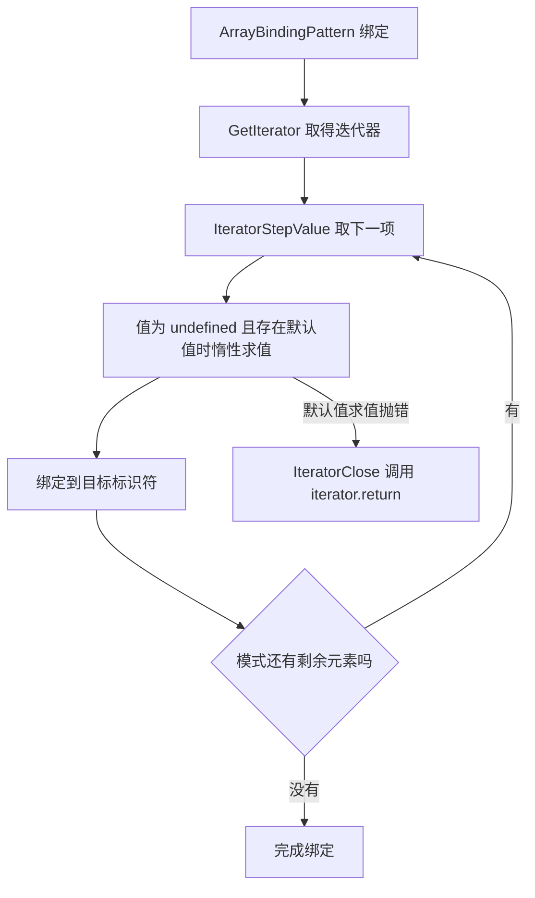

# 解构、展开、模板字符串与标签模板

!!! abstract "核心结论"

    - 数组解构不是"按下标取值"，而是对右侧值执行 `GetIterator(value, sync)` 后逐步 `next()`。因此 `Set`、`Map`、生成器、字符串（按码点）都能解构，而 `{0:'a', length:1}` 这类纯类数组对象会抛 `TypeError`。
    - 解构默认值只在"取到的值为 `undefined`"时惰性求值：`null`、`0`、`''`、`NaN` 都不会触发；默认值表达式抛错属于 abrupt completion，是否触发 `IteratorClose` 取决于规范版本对分支的写法，依赖前请以 ECMA-262 最新文本和实测为准。
    - 对象展开 `{...o}` 走 `CopyDataProperties`：只取自有可枚举属性（含 Symbol 键），getter 被求值并扁平化为数据属性，原型与不可枚举属性丢失；`Object.assign` 走 `[[Set]]`，会触发目标上的 setter，目标不可写/不可扩展时抛 `TypeError`；`structuredClone` 是结构化深克隆，支持循环引用但不保留原型。
    - 模板字符串在词法阶段同时产出 cooked 与 raw 两套值；标签模板的第一个参数是**冻结数组**（`Object.isFrozen(strings)` 为 `true`，`strings.raw` 同样冻结），同一调用点在同一 realm 内复用同一个数组对象。
    - ES2018 起标签模板允许非法转义序列，此时对应 cooked 元素为 `undefined`，raw 保留原文，这让 `String.raw`、路径/正则/DSL 成为可靠用法。

## 1. 数组解构的底层：迭代器协议

### 1.1 取值流程与规范算法

规范里 `[a, b] = value` 大致按下面的顺序执行（不同 ECMA-262 版本的步骤措辞略有差异，较新的文本把 `IteratorStep` + `IteratorValue` 合并成了 `IteratorStepValue`，需核对你所参考的版本）：

1. 求值右侧表达式，得到 `value`。
2. `GetIterator(value, sync)`：即 `GetMethod(value, Symbol.iterator)`，若结果是 `undefined` 就抛 `TypeError`；否则调用它并把返回值当作迭代器对象。
3. 对模式里的每个元素位置执行一次 `next()`：读 `result.done`，`done` 为真则该位置的值为 `undefined`，否则取 `result.value`。
4. 该位置有默认值且值为 `undefined` 时，惰性求值默认值表达式。
5. 绑定标识符。
6. 出现 abrupt completion（抛错）时执行 `IteratorClose`。



关键推论：迭代器不是"数组下标访问"，所以 `length` 不参与运算，真正决定取几个值的是**模式里元素的个数**。

### 1.2 验证：next() 的调用次数

运行环境：Node.js（CommonJS 模块，保存为 `iterator-destructuring.js` 后 `node iterator-destructuring.js`）。

```js
'use strict';
const assert = require('node:assert/strict');

// 一个"记录每次 next/return 调用"的可迭代对象
function makeIterable(values) {
  const log = [];
  let nextCalls = 0;
  const iterable = {
    [Symbol.iterator]() {
      let index = 0;
      return {
        next() {
          nextCalls += 1;
          log.push('next#' + nextCalls);
          if (index < values.length) {
            return { value: values[index++], done: false };
          }
          return { value: undefined, done: true };
        },
        return() {
          log.push('return');
          return { done: true };
        },
      };
    },
  };
  return { iterable, log };
}

// 用例 1：模式有 2 个标识符，右侧有 3 个值 -> 只调用 2 次 next()；
// 此时迭代器尚未 done，规范要求在解构结束时调用 IteratorClose，即再调用一次 return()
{
  const { iterable, log } = makeIterable([10, 20, 30]);
  const [a, b] = iterable;
  assert.strictEqual(a, 10);
  assert.strictEqual(b, 20);
  assert.deepStrictEqual(log, ['next#1', 'next#2', 'return']);
}

// 用例 2：右侧值不够 -> 第 2 次 next() 就拿到 done: true，解构停止，剩余标识符直接赋 undefined
{
  const { iterable, log } = makeIterable(['x']);
  const [a, b, c] = iterable;
  assert.strictEqual(a, 'x');
  assert.strictEqual(b, undefined);
  assert.strictEqual(c, undefined);
  assert.deepStrictEqual(log, ['next#1', 'next#2']);
}

// 用例 3：纯类数组对象没有 Symbol.iterator -> TypeError
assert.throws(() => {
  const [a, b] = { 0: 'a', 1: 'b', length: 2 };
}, TypeError);

// 用例 4：只要有 Symbol.iterator，任何对象都能解构
{
  const custom = {
    [Symbol.iterator]() {
      const items = ['p', 'q'];
      let i = 0;
      return { next: () => (i < items.length ? { value: items[i++], done: false } : { value: undefined, done: true }) };
    },
  };
  const [first, second] = custom;
  assert.deepStrictEqual([first, second], ['p', 'q']);
}

console.log('ALL PASS: 数组解构基于迭代器协议');
```

预期输出：`ALL PASS: 数组解构基于迭代器协议`；任何断言失败会抛 `AssertionError` 并打印期望值与实际值。

### 1.3 字符串、Set、Map、生成器与类数组

```js
'use strict';
const assert = require('node:assert/strict');

const s = 'ab' + '\u{1F600}';           // 3 个码点 / 4 个 UTF-16 码元
assert.strictEqual(s.length, 4);

// 字符串迭代器按码点产出，所以解构与展开都是"码点安全"的
const [c1, c2, c3] = s;
assert.deepStrictEqual([c1, c2, c3], ['a', 'b', '\u{1F600}']);
assert.deepStrictEqual([...s], ['a', 'b', '\u{1F600}']);

// 对照：按索引访问是码元级别的，会把代理对劈开
assert.strictEqual(s[2], '\uD83D');
assert.deepStrictEqual(s.split(''), ['a', 'b', '\uD83D', '\uDE00']);

// Set / Map / 生成器走的是同一条路径
{
  const [first, second] = new Set(['p', 'q']);
  assert.deepStrictEqual([first, second], ['p', 'q']);

  const [[k1, v1], [k2, v2]] = new Map([['a', 1], ['b', 2]]);   // 嵌套解构
  assert.deepStrictEqual([k1, v1, k2, v2], ['a', 1, 'b', 2]);

  function* gen() { yield 1; yield 2; }
  const [g1, g2] = gen();
  assert.deepStrictEqual([g1, g2], [1, 2]);
}

console.log('ALL PASS: 字符串按码点，Set/Map/生成器按迭代器');
```

预期输出：`ALL PASS: 字符串按码点，Set/Map/生成器按迭代器`。

### 1.4 for-of 的 IteratorClose 对照

`for-of` 在 `break` / `return` / 抛错时会执行 `IteratorClose`（`ForIn/OfBodyEvaluation` 中明确调用），这是最容易观察到的"关闭迭代器"场景。

```js
'use strict';
const assert = require('node:assert/strict');

function makeIterable() {
  return {
    [Symbol.iterator]() {
      let i = 0;
      return {
        next() { return i < 3 ? { value: i++, done: false } : { value: undefined, done: true }; },
        return() { closed = true; return { done: true }; },
      };
    },
  };
}

let closed = false;
const iterable = makeIterable();
for (const v of iterable) {
  if (v === 0) break;          // break -> IteratorClose -> 调用 return()
}
assert.strictEqual(closed, true);

// 对照：迭代器被读到 done（正常完成）时不需要关闭
closed = false;
for (const v of makeIterable()) { /* 全部消费 */ }
assert.strictEqual(closed, false);

console.log('ALL PASS: for-of 的 IteratorClose');
```

预期输出：`ALL PASS: for-of 的 IteratorClose`。

### 1.5 手写 _slicedToArray / _toArray

降级产物里，`const [a, b] = x` 会被编译成 `_slicedToArray(x, 2)`（Babel）或等价内联代码。下面是手写版本，语义对齐规范里的要点，并用 thunk 暴露默认值的惰性求值时机。

```js
'use strict';
const assert = require('node:assert/strict');

// _applyDefault: defaults[i] 是 thunk（函数），null/undefined 表示该位没有默认值
function _applyDefault(value, defaults, index) {
  if (value !== undefined || defaults === undefined) return value;
  const thunk = defaults[index];
  return typeof thunk === 'function' ? thunk() : value;
}

// _slicedToArray(iterable, count, defaults)
//   1) null/undefined 直接抛 TypeError（RequireObjectCoercible）
//   2) 数组走快路径：数组元素即 0..length-1，空洞产出 undefined
//   3) 非数组必须满足迭代器协议，否则抛 TypeError
//   4) 默认值只在值为 undefined 时惰性求值
//   5) 取值/默认值抛错时尝试 iterator.return()（IteratorClose 思路）
function _slicedToArray(iterable, count, defaults) {
  if (iterable === null || iterable === undefined) {
    throw new TypeError('Cannot destructure ' + String(iterable) + ' as it is null or undefined');
  }

  const out = [];
  if (Array.isArray(iterable)) {
    for (let i = 0; i < count; i++) out.push(_applyDefault(iterable[i], defaults, i));
    return out;
  }

  const iteratorMethod = iterable[Symbol.iterator];
  if (typeof iteratorMethod !== 'function') throw new TypeError('Object is not iterable');
  const iterator = iteratorMethod.call(iterable);
  if (iterator === null || typeof iterator !== 'object') {
    throw new TypeError('Result of the Symbol.iterator method is not an object');
  }

  let done = false;
  try {
    for (let i = 0; i < count; i++) {
      let value;
      if (!done) {
        const step = iterator.next();
        if (step === null || typeof step !== 'object') throw new TypeError('Iterator result is not an object');
        done = Boolean(step.done);
        if (!done) value = step.value;
      }
      out.push(_applyDefault(value, defaults, i));
    }
  } catch (err) {
    if (!done && typeof iterator.return === 'function') {
      try { iterator.return(); } catch (ignored) { /* 规范会把关闭错误与原错误合并，这里简化 */ }
    }
    throw err;
  }
  return out;
}

// _toArray: 对应 [...rest]，把迭代器读到 done（正常路径不需要 IteratorClose）
function _toArray(iterable) {
  if (Array.isArray(iterable)) return iterable.slice();
  if (iterable === null || iterable === undefined) {
    throw new TypeError('Cannot destructure ' + String(iterable) + ' as it is null or undefined');
  }
  const iteratorMethod = iterable[Symbol.iterator];
  if (typeof iteratorMethod !== 'function') throw new TypeError('Object is not iterable');
  const iterator = iteratorMethod.call(iterable);
  const out = [];
  for (;;) {
    const step = iterator.next();
    if (step === null || typeof step !== 'object') throw new TypeError('Iterator result is not an object');
    if (step.done) break;
    out.push(step.value);
  }
  return out;
}

// 对应 Babel 对含 rest 的模式生成的代码：先整体取出，再按下标切分
function _destructureWithRest(iterable, headCount) {
  const all = _toArray(iterable);
  const head = [];
  for (let i = 0; i < headCount; i++) head.push(all[i]);
  return { head, rest: all.slice(headCount) };
}

// ---- 验证标准 ----
assert.deepStrictEqual(_slicedToArray([1, 2, 3], 2), [1, 2]);
assert.deepStrictEqual(_slicedToArray([1], 2), [1, undefined]);
assert.deepStrictEqual(_slicedToArray(new Set(['a']), 2), ['a', undefined]);
assert.deepStrictEqual(_slicedToArray('ab\u{1F600}', 3), ['a', 'b', '\u{1F600}']);
assert.deepStrictEqual(_slicedToArray(new Map([['k', 'v']]), 1), [['k', 'v']]);

// 默认值只在 undefined 时求值
let calls = 0;
const thunk = () => { calls += 1; return 'D'; };
assert.deepStrictEqual(
  _slicedToArray([undefined, null, 0, ''], 4, [thunk, thunk, thunk, thunk]),
  ['D', null, 0, ''],
);
assert.strictEqual(calls, 1);

// null / 非可迭代对象
assert.throws(() => _slicedToArray(null, 1), TypeError);
assert.throws(() => _slicedToArray(undefined, 1), TypeError);
assert.throws(() => _slicedToArray({ 0: 'a', length: 1 }, 1), TypeError);

// IteratorClose：默认值求值抛错时尝试关闭迭代器
{
  const log = [];
  let n = 0;
  const iterable = {
    [Symbol.iterator]() {
      let i = 0;
      return {
        next() {
          n += 1;
          log.push('next#' + n);
          const done = i >= 2;
          return { value: done ? undefined : [1, undefined][i++], done };
        },
        return() { log.push('return'); return { done: true }; },
      };
    },
  };
  assert.throws(
    () => _slicedToArray(iterable, 2, [null, () => { throw new Error('boom'); }]),
    /boom/,
  );
  assert.deepStrictEqual(log, ['next#1', 'next#2', 'return']);
}

// rest 收集
{
  const { head, rest } = _destructureWithRest(new Set([1, 2, 3, 4]), 2);
  assert.deepStrictEqual(head, [1, 2]);
  assert.deepStrictEqual(rest, [3, 4]);
  assert.deepStrictEqual(_toArray('ab\u{1F600}'), ['a', 'b', '\u{1F600}']);
}

console.log('ALL PASS: _slicedToArray / _toArray');
```

预期输出：`ALL PASS: _slicedToArray / _toArray`。

两个已知偏差，写 helper 时必须心里有数：

1. 数组快路径绕过了自定义的 `Symbol.iterator`。Babel 的 `_slicedToArray` 也用 `Array.isArray` 走快路径，这是性能取舍而非规范语义。
2. 规范中数组解构在模式求值完成后，只要迭代器的 [[Done]] 仍为 false，就会执行 IteratorClose，也就是调用 `iterator.return()`；这在正常完成和异常完成两种路径上都成立（用例 1 的日志以 `return` 结尾即是证据）。Babel 的 `_iterableToArrayLimit` 在 `finally` 分支里按“没读到 done 就调用 return()”实现，不同 Babel 版本的产物略有差异，需要核对你实际使用的版本。

## 2. 默认值与对象解构

### 数组解构与对象解构的机制对照

| 维度 | 数组解构 `[a, b]` | 对象解构 `{a, b}` |
| --- | --- | --- |
| 取值机制 | `GetIterator` + 逐步 `next()` | `RequireObjectCoercible` + `[[Get]]` |
| 决定顺序 | 迭代器产出的顺序 | 属性名，与书写顺序无关 |
| 纯类数组对象 | 抛 `TypeError`（缺少 `Symbol.iterator`） | 正常按同名属性取值 |
| 字符串 | 按码点迭代 | 按属性取（`length`、`0` 等） |
| Set/Map | 可解构，按迭代顺序 | 可解构，但只能按属性名（如 `const { size } = new Set([1])`） |
| 剩余元素 | rest 收集剩余迭代值，必须放最后 | rest 走 `CopyDataProperties`，排除已取出的键 |
| 默认值触发条件 | 取到的值为 `undefined` | 属性值为 `undefined` |
| 右侧为 null/undefined | 抛 `TypeError` | 抛 `TypeError` |

### 2.1 默认值的求值时机

```js
'use strict';
const assert = require('node:assert/strict');

let evaluations = 0;
const init = () => { evaluations += 1; return 'DEFAULT'; };

const [a = init()] = [undefined];   // 触发
const [b = init()] = [null];        // null 不触发
const [c = init()] = [0];           // 0 不触发
const [d = init()] = [''];          // 空字符串不触发
const [e = init()] = [NaN];         // NaN 不触发
const [f = init()] = [];            // 越界 -> undefined，触发
assert.strictEqual(evaluations, 2);
assert.deepStrictEqual([a, b, c, d, e, f], ['DEFAULT', null, 0, '', NaN, 'DEFAULT']);

// 对象解构同一规则
const source = { x: null };
const { x = init(), y = init() } = source;   // x 为 null 不触发；y 不存在触发
assert.strictEqual(x, null);
assert.strictEqual(y, 'DEFAULT');
assert.strictEqual(evaluations, 3);

// 默认值可以引用外层变量
const outer = 42;
const [p = outer] = [];
assert.strictEqual(p, 42);

// 但不能引用同一模式里正在绑定的名字：绑定已创建但未初始化，处于 TDZ
assert.throws(() => {
  const [q = q] = [];
}, ReferenceError);

// 函数参数同理：解构参数没有整体默认值时，传 undefined 会抛 TypeError
function f({ a = 1 } = {}) { return a; }
assert.strictEqual(f(), 1);
assert.strictEqual(f({}), 1);
assert.strictEqual(f({ a: undefined }), 1);
assert.strictEqual(f({ a: null }), null);
assert.throws(() => {
  const g = ({ a = 1 }) => a;   // 缺少 "= {}"
  g(undefined);
}, TypeError);

console.log('ALL PASS: 默认值求值时机');
```

预期输出：`ALL PASS: 默认值求值时机`。

### 2.2 对象解构与对象 rest

```js
'use strict';
const assert = require('node:assert/strict');

// RequireObjectCoercible 先执行：null/undefined 抛 TypeError
assert.throws(() => { const { a } = null; }, TypeError);
assert.throws(() => { const { a } = undefined; }, TypeError);

// 原始值会被 ToObject 包装后取属性
assert.strictEqual(({ length } = 'abc', length), 3);
assert.strictEqual(({ constructor } = 1, constructor), Number);

// 键可以是计算属性
const key = 'dyn';
const { [key]: value } = { dyn: 7 };
assert.strictEqual(value, 7);

// rest 是 CopyDataProperties：自有可枚举（含 Symbol），排除已取出的键
const sym = Symbol('s');
const src = Object.defineProperty({ a: 1, b: 2, [sym]: 3 }, 'hidden', { value: 4, enumerable: false });
const { a, ...others } = src;
assert.strictEqual(a, 1);
assert.deepStrictEqual(Object.keys(others), ['b']);                       // hidden 不可枚举
assert.deepStrictEqual(Object.getOwnPropertySymbols(others), [sym]);      // Symbol 键会带上
assert.strictEqual(others[sym], 3);
assert.strictEqual(others.hidden, undefined);

// getter 会被调用一次，结果成为数据属性
let getterCalls = 0;
const withGetter = { get lazy() { getterCalls += 1; return 'v'; } };
const { lazy } = withGetter;
assert.strictEqual(lazy, 'v');
assert.strictEqual(getterCalls, 1);

// 关键差异：对象 rest 遇到 null/undefined 会抛错，对象展开不会
assert.throws(() => { const { ...r } = null; }, TypeError);
assert.deepStrictEqual({ ...null, ...undefined }, {});

console.log('ALL PASS: 对象解构与对象 rest');
```

预期输出：`ALL PASS: 对象解构与对象 rest`。

原因是规范里两处写法不同：对象字面量展开调用 `CopyDataProperties`，该算法第一步就是"source 为 null/undefined 则直接返回 target"；而 `ObjectBindingPattern` 的 `BindingInitialization` 第一步是 `RequireObjectCoercible(value)`。

## 3. 展开运算符的三套语义

展开在不同语法位置走不同算法：数组字面量与函数实参展开走迭代器协议；对象字面量展开走 `CopyDataProperties`。

### 3.1 数组字面量与实参展开

```js
'use strict';
const assert = require('node:assert/strict');

// 数组字面量展开：GetIterator + 读到 done
function* gen() { yield 1; yield 2; }
assert.deepStrictEqual([...gen(), ...gen()], [1, 2, 1, 2]);
assert.deepStrictEqual([...new Set([1, 1, 2])], [1, 2]);   // 顺带去重

// 实参展开同样走迭代器，并且受引擎参数个数上限约束
assert.strictEqual(Math.max(...[1, 5, 3]), 5);

// 用 push 接收大数组是安全写法；用展开传参会撞上参数上限
const big = new Array(200000).fill(1);
assert.throws(() => Math.max(...big), RangeError);   // 上限值与引擎/栈状态有关，需实测
assert.strictEqual(big.reduce((acc, n) => acc + n, 0), 200000);

console.log('ALL PASS: 数组与实参展开');
```

预期输出：`ALL PASS: 数组与实参展开`。

### 3.2 手写 _objectSpread

编译器降级时的两种实现风格不同：Babel 的 `_objectSpread2` 用 `_defineProperty`（`Object.defineProperty`）写入；TypeScript 生成的 `__assign` 优先使用 `Object.assign`，fallback 用 `for...in` + `hasOwnProperty`（会漏掉 Symbol 键）。下面是按 `CopyDataProperties` 语义手写的版本。

```js
'use strict';
const assert = require('node:assert/strict');

// 自有可枚举键：字符串键 + 可枚举 Symbol 键，顺序遵循 [[OwnPropertyKeys]]
function ownEnumerableKeys(source) {
  const keys = Object.keys(source);
  const symbols = Object.getOwnPropertySymbols(source);
  for (let i = 0; i < symbols.length; i++) {
    const desc = Object.getOwnPropertyDescriptor(source, symbols[i]);
    if (desc !== undefined && desc.enumerable) keys.push(symbols[i]);
  }
  return keys;
}

function _defineDataProperty(target, key, value) {
  Object.defineProperty(target, key, { value, writable: true, enumerable: true, configurable: true });
}

// _objectSpread(target, ...sources)
//   1) 源为 null/undefined 时跳过（CopyDataProperties 先判空）
//   2) 只处理自有可枚举属性（含 Symbol 键）
//   3) 通过 [[Get]] 读源属性，因此 getter 会被求值一次，结果变成数据属性
//   4) 用 define 语义写入（CreateDataPropertyOrThrow 的等价物），不触发 setter
function _objectSpread(target, ...sources) {
  const result = target === undefined ? {} : target;
  for (let i = 0; i < sources.length; i++) {
    const source = sources[i];
    if (source === null || source === undefined) continue;
    const boxed = Object(source);                 // 原始值先 ToObject（'{...\'ab\'}' 会得到 0/1 两个键）
    const keys = ownEnumerableKeys(boxed);
    for (let j = 0; j < keys.length; j++) {
      const key = keys[j];
      _defineDataProperty(result, key, boxed[key]);
    }
  }
  return result;
}

// ---- 验证标准 ----
assert.deepStrictEqual(_objectSpread({}, { a: 1 }, { b: 2 }), { a: 1, b: 2 });
assert.deepStrictEqual(_objectSpread({}, null, undefined, { a: 1 }), { a: 1 });

// 后面的源覆盖前面的键，但键的位置保持第一次出现的顺序
const merged = _objectSpread({}, { a: 1, b: 2 }, { a: 9, c: 3 });
assert.deepStrictEqual(merged, { a: 9, b: 2, c: 3 });
assert.deepStrictEqual(Object.keys(merged), ['a', 'b', 'c']);

// getter 被求值并扁平化
let calls = 0;
const src = { get g() { calls += 1; return 'G'; } };
const copied = _objectSpread({}, src);
assert.strictEqual(copied.g, 'G');
assert.strictEqual(calls, 1);
assert.strictEqual(Object.getOwnPropertyDescriptor(copied, 'g').get, undefined);
assert.strictEqual(Object.getOwnPropertyDescriptor(copied, 'g').value, 'G');
assert.strictEqual(Object.getOwnPropertyDescriptor(copied, 'g').enumerable, true);

// 不可枚举属性与原型属性都不复制；结果原型是 Object.prototype
const proto = { inherited: 1 };
const obj = Object.create(proto);
Object.defineProperty(obj, 'hidden', { value: 2, enumerable: false });
obj.own = 3;
const copy = _objectSpread({}, obj);
assert.deepStrictEqual(copy, { own: 3 });
assert.strictEqual(Object.getPrototypeOf(copy), Object.prototype);
assert.strictEqual('hidden' in copy, false);
assert.strictEqual('inherited' in copy, false);

// Symbol 键会复制（Object.keys 看不到）
const sym = Symbol('s');
assert.deepStrictEqual(Object.getOwnPropertySymbols(_objectSpread({}, { [sym]: 1 })), [sym]);

// 原始值：字符串按字符展开，数字没有自有可枚举属性
assert.deepStrictEqual(_objectSpread({}, 'ab'), { 0: 'a', 1: 'b' });
assert.deepStrictEqual(_objectSpread({}, 1), {});

// 浅拷贝：嵌套对象共享引用
const nested = { deep: { n: 1 } };
assert.strictEqual(_objectSpread({}, nested).deep, nested.deep);

console.log('ALL PASS: _objectSpread');
```

预期输出：`ALL PASS: _objectSpread`。

## 4. 展开 vs Object.assign vs structuredClone

### 4.1 对比表

| 维度 | 对象展开 `{...o}` | `Object.assign(t, o)` | `structuredClone(o)` |
| --- | --- | --- | --- |
| 深度 | 浅拷贝 | 浅拷贝 | 结构化深克隆 |
| 返回值 | 新对象 | 原地修改并返回 `t` | 新对象 |
| 源为 null/undefined | 跳过 | 跳过 | 不适用（克隆 `null` 得到 `null`） |
| 自有可枚举字符串键 | 复制 | 复制 | 复制 |
| Symbol 键 | 复制 | 复制 | 需核对 HTML 标准（Symbol 作为**值**会抛 `DataCloneError`） |
| getter | `[[Get]]` 求值一次，扁平化为数据属性 | `[[Get]]` 求值一次 | `[[Get]]` 求值一次（不保留描述符） |
| 写入方式 | CreateDataProperty（define） | `[[Set]]`，会触发目标 setter | 内部序列化/反序列化 |
| 目标冻结时 | 不适用（目标总是新对象） | 抛 `TypeError` | 不适用 |
| 原型链 | 不复制，结果是 `Object.prototype` | 不复制，`t` 的原型不变 | 不复制，结果是 `Object.prototype` |
| 不可枚举属性 | 不复制 | 不复制 | 不复制 |
| 属性描述符 | 全部重置为可写/可枚举/可配置 | 按 `[[Set]]` 语义写入 | 不保留 |
| 循环引用 | 不涉及（浅拷贝） | 不涉及 | 支持 |
| Date/RegExp/Map/Set | 同一引用 | 同一引用 | 克隆为新的同类型对象 |
| 函数 | 复制引用 | 复制引用 | 抛 `DataCloneError` |
| 额外能力 | 无 | 可批量合并到已有对象 | `transfer` 转移 ArrayBuffer 所有权 |

`Object.assign` 目标冻结会抛错的原因在规范里很明确：它执行的是 `Set(to, key, value, true)`，第四个参数 `Throw` 为 `true`，因此 `[[Set]]` 返回 `false` 时会抛 `TypeError`，与调用方是否严格模式无关。

### 4.2 可运行对比实验

运行环境：Node.js（`structuredClone` 自 Node 17 起为全局函数，更早版本需要自己 polyfill；浏览器支持情况请核对 MDN）。

```js
'use strict';
const assert = require('node:assert/strict');

// 准备一个带 getter / 不可枚举属性 / 原型属性 / Symbol 键的源对象
let getterCalls = 0;
const proto = { inherited: 'fromProto' };
const source = Object.create(proto);
source.own = 1;
Object.defineProperty(source, 'hidden', { value: 2, enumerable: false });
Object.defineProperty(source, 'lazy', {
  get() { getterCalls += 1; return 3; },
  enumerable: true,
});
const sym = Symbol('sym');
source[sym] = 4;

// ---- 1) 对象展开 ----
const spread = { ...source };
assert.deepStrictEqual(Object.keys(spread), ['own', 'lazy']);   // hidden 不可枚举；顺序按 [[OwnPropertyKeys]]
assert.deepStrictEqual(Object.getOwnPropertySymbols(spread), [sym]);
assert.strictEqual(spread.lazy, 3);
assert.strictEqual(getterCalls, 1);
assert.strictEqual(Object.getOwnPropertyDescriptor(spread, 'lazy').get, undefined);
assert.strictEqual(Object.getPrototypeOf(spread), Object.prototype);
assert.strictEqual(spread.inherited, undefined);
assert.strictEqual(spread.hidden, undefined);

// ---- 2) Object.assign ----
getterCalls = 0;
const target = {};
const returned = Object.assign(target, source);
assert.strictEqual(returned, target);
assert.deepStrictEqual(Object.keys(target), ['own', 'lazy']);
assert.deepStrictEqual(Object.getOwnPropertySymbols(target), [sym]);
assert.strictEqual(target.inherited, undefined);
assert.strictEqual(getterCalls, 1);

// Object.assign 走 [[Set]]：触发目标上的 setter
let setterCalls = 0;
const withSetter = { set x(v) { setterCalls += 1; this._x = v; }, get x() { return this._x; } };
Object.assign(withSetter, { x: 'V' });
assert.strictEqual(setterCalls, 1);
assert.strictEqual(withSetter.x, 'V');

// Object.assign 内部是 Set(to, key, value, true)：目标冻结时抛 TypeError
assert.throws(() => Object.assign(Object.freeze({}), { a: 1 }), TypeError);
// 对象展开永远写进新对象，没有这个问题
assert.deepStrictEqual({ ...Object.freeze({ a: 1 }) }, { a: 1 });

// ---- 3) structuredClone ----
const graph = { name: 'root', when: new Date(0), re: /ab+/gi, map: new Map([['k', 1]]), set: new Set([1, 2]) };
graph.self = graph;                                  // 循环引用
const clone = structuredClone(graph);
assert.notStrictEqual(clone, graph);
assert.strictEqual(clone.self, clone);                // 循环引用被还原
assert.notStrictEqual(clone.when, graph.when);        // 深克隆
assert.strictEqual(clone.when.getTime(), 0);
assert.strictEqual(clone.re instanceof RegExp, true);
assert.strictEqual(clone.re.flags, 'gi');
assert.strictEqual(clone.map instanceof Map, true);
assert.strictEqual(clone.map.get('k'), 1);
assert.strictEqual(clone.set instanceof Set, true);

// 原型不保留：class 实例被克隆成普通对象
class Point {
  constructor(x, y) { this.x = x; this.y = y; }
  get sum() { return this.x + this.y; }
}
const pointClone = structuredClone(new Point(1, 2));
assert.strictEqual(pointClone.x, 1);
assert.strictEqual(Object.getPrototypeOf(pointClone), Object.prototype);
assert.strictEqual(pointClone.sum, undefined);        // 原型上的 getter 丢失

// 函数与 Symbol 值不可克隆
assert.throws(() => structuredClone({ f() {} }), { name: 'DataCloneError' });
assert.throws(() => structuredClone(Symbol('s')), { name: 'DataCloneError' });

// transfer：转移 ArrayBuffer 所有权后原 buffer 被 detach
const buffer = new ArrayBuffer(8);
const moved = structuredClone({ buffer }, { transfer: [buffer] });
assert.strictEqual(buffer.byteLength, 0);
assert.strictEqual(moved.buffer.byteLength, 8);

// ---- 4) JSON 深拷贝的对照 ----
assert.throws(() => JSON.parse(JSON.stringify(graph)), TypeError);          // 循环引用直接抛错
assert.strictEqual(JSON.parse(JSON.stringify({ d: new Date(0) })).d, '1970-01-01T00:00:00.000Z');
assert.deepStrictEqual(JSON.parse(JSON.stringify({ r: /x/ })), { r: {} });  // RegExp 变空对象
assert.deepStrictEqual(JSON.parse(JSON.stringify({ u: undefined })), {});   // undefined 属性被丢掉
assert.deepStrictEqual(JSON.parse(JSON.stringify(new Map([['k', 1]]))), {}); // Map 变空对象

console.log('ALL PASS: 展开 vs Object.assign vs structuredClone');
```

预期输出：`ALL PASS: 展开 vs Object.assign vs structuredClone`。

补充说明：`structuredClone` 的边界（哪些内建类型可克隆、Symbol 键如何处理、DOM 节点是否可克隆）以 HTML Living Standard 的 structured clone 算法为准，本节只覆盖上面实测到的行为。

## 5. 模板字符串：cooked 与 raw

### 5.1 词法层面的两套值

模板字面量在词法分析阶段同时计算两套字符序列：

- cooked（规范里的 TV，Template Value）：转义后的值，`\n` 是一个 LF 字符。
- raw（TRV，Template Raw Value）：源码原样，`

## 应用与行业实践

### 应用场景地图

| 场景 | 用到本页哪个知识点 | 典型技术选型 | 注意事项 |
| --- | --- | --- | --- |
| 后台管理万行表格的增量刷新 | 对象展开的 CopyDataProperties 语义 | React + TanStack Virtual | 展开只做一层，嵌套字段仍共享引用 |
| 低端安卓首屏的内联关键 CSS | 模板字符串的 cooked 与 raw | 构建期 Node.js 脚本 + String.raw | 非法转义处 cooked 为 `undefined`，要回退到 raw |
| 多人协作白板的状态快照 | structuredClone 的结构化克隆 | Yjs 或自研 OT 服务 | 函数和 DOM 节点会抛 `DataCloneError` |
| 表单初始值填充 | 解构默认值只在取到 `undefined` 时求值 | React Hook Form | 后端把缺字段写成 `null`，默认值不生效 |
| GraphQL 片段与 CSS 片段做 DSL | 标签模板的 strings 冻结且按调用点复用 | graphql-tag、styled-components | 别往 strings 上写属性，缓存要外置 |
| 生成器驱动的 CSV 逐行解析 | 数组解构走迭代器协议 | Node.js 流 + csv-parse | 解构会消费迭代器，剩余项要显式收集 |
| 埋点 SDK 的配置合并 | Object.assign 走 `[[Set]]` | 自研 SDK | 目标对象上的 setter 会被调用 |
| Worker 之间的消息传递 | structuredClone 支持循环引用 | Web Worker、MessageChannel | 不保留原型，还原时要重建实例 |
| 撤销重做栈 | structuredClone 深克隆 | Immer 或自研命令栈 | 快照体积随对象图增长，要做上限 |

### 三个场景拆解

#### 场景 1：后台管理的万行表格——增量刷新与撤销快照

**业务背景**：后台表格单页要渲染几千到几万行，服务端每隔几秒推一次增量，增量里只带变化字段。用户改完单元格要能撤销，撤销栈需要在本地存快照。

**怎么用本页知识解决**：思路是三步。先把增量按 id 映射，用对象展开产出新行；没增量的行原样返回，保住引用相等；快照交给 structuredClone。

```js
// rows 是当前页行数组，patchById 是 id 到增量字段的映射
function applyPatch(rows, patchById) {
  return rows.map((row) => {
    const patch = patchById.get(row.id);
    if (!patch) return row;        // 没增量就返回原引用，保住 memo 的引用比较
    return { ...row, ...patch };   // CopyDataProperties：只取自有可枚举属性
  });
}

// 撤销快照：结构化克隆，环形引用能处理，原型会丢
const snapshot = structuredClone(rows);

// 行对象上挂了 getter 时，展开会把它求值成数据属性
const plain = { ...rows[0] };
// Object.getOwnPropertyDescriptor(plain, 'total') 拿到的是 value，不是 get
```

- 展开只做一层：`row` 里的嵌套对象仍旧共享引用，要改嵌套字段得自己再拷一层。
- 返回原引用让没增量的行跳过重渲染，React DevTools Profiler 的 render 次数能看出差别。
- structuredClone 不保留原型，行对象是类实例时，还原要写工厂函数重建。
- 行对象里含函数或 DOM 节点时，structuredClone 抛 `DataCloneError`，快照前先过滤字段。
- 解构默认值只在取到 `undefined` 时生效，后端把缺字段写成 `null`，默认值兜不住。

**怎么度量收益**：看 commit 时长和 render 次数（React DevTools Profiler）、Long Task 条数（Chrome DevTools Performance 面板）、单次 applyPatch 耗时（`performance.now()` 打点）。同一份数据切换前后各跑 3 次取中位数。

**什么时候不该用**：

- 行对象是类实例、渲染依赖原型上的方法时，不能拿展开做浅拷贝。
- 增量里含深层嵌套、需要真深合并时，一层展开会漏掉子字段。
- 行内编辑依赖 getter 实时派生值时，展开会把 getter 冻结成静态数据属性。

#### 场景 2：低端安卓首屏的内联关键 CSS

**业务背景**：低端安卓机上首屏要内联关键 CSS，构建脚本在 Node.js 里用模板拼出这段 CSS。CSS 里会出现 `\n`、`\2014` 这类转义序列，普通字符串会先把它们解释掉。

**怎么用本页知识解决**：路径和转义片段交给 `String.raw`。CSS 拼接写成标签模板函数，用 `strings` 数组当缓存键，非法转义处回退到 raw。

```js
// 1) 路径：反斜杠要原样交给下游
const entry = String.raw`C:\app\dist\main.js`; // cooked 里 \a 被吃成 a，raw 保留原文

// 2) 标签模板函数：strings 与 strings.raw 都是冻结数组
const cache = new WeakMap();
function css(strings, ...values) {
  if (cache.has(strings)) return cache.get(strings); // 同一调用点复用同一个数组
  // cooked 元素为 undefined 说明是非法转义，回退到 raw
  const parts = strings.map((s, i) => (s === undefined ? strings.raw[i] : s));
  const text = parts.reduce((out, s, i) => out + s + (values[i] ?? ''), '');
  cache.set(strings, text);
  return text;
}
```

- `String.raw` 用 raw 数组拼接，反斜杠不进入转义流程，Windows 路径和正则源串照原样拼。
- `Object.isFrozen(strings)` 为 `true`，往 strings 上挂属性抛 `TypeError`，缓存必须外置。
- 用 `strings` 当 WeakMap 键能命中，因为同一调用点在同一 realm 内拿到的是同一个数组对象。
- `cooked` 为 `undefined` 只出现在非法转义处，回退 `strings.raw[i]` 是规范给出的用法。
- 插值 `${...}` 仍会求值，内容来自用户输入时依旧要做转义和过滤。

**怎么度量收益**：看 FCP 和 LCP（Lighthouse 或 Chrome DevTools Performance 面板）、内联 style 标签的字节数（Network 面板的文档体积）。测量时把 CPU 节流到 4x、网络设为 Slow 4G，跑 5 次取中位数。

**什么时候不该用**：

- 下游是 HTML 正文而不是 CSS 时，把用户输入直接插进标签模板仍会产生注入。
- 把模板字符串先存进变量再拼接的场景，调用点变了，`strings` 数组不复用，缓存全部不命中。
- 目标引擎低于 ES2018 时，非法转义的 cooked 行为不同，须核对 ECMA-262 对应版本后再决定是否回退。

#### 场景 3：多人协作白板——操作合并与断线重连快照

**业务背景**：白板上同时存在几千个图元，几个人一起拖动，客户端每一帧都会产出一批扁平的操作对象。这些操作要先合并成一条再广播，同时每隔一段时间本地存一份快照用于重连。

**怎么用本页知识解决**：操作对象的字段是扁平的，用展开做一层合并。广播前用对象解构的 rest 剔掉本地预览字段，快照交给 structuredClone。

```js
// op 是一次拖拽产生的操作对象，字段是扁平的
function mergeOp(base, next) {
  return { ...base, ...next };          // 一层合并，嵌套对象仍共享引用
}

// 广播前剔掉本地预览字段
const { preview = null, ...wire } = op; // 默认值只在取到 undefined 时生效
socket.send(JSON.stringify(wire));      // wire 是新对象，原型是 Object.prototype

// 快照：结构化克隆，图元互指形成的环也能处理
const snap = structuredClone(scene);    // 图元里不能放函数、Canvas 上下文、DOM 引用
```

- `mergeOp` 只合并一层，`style` 这类嵌套对象要显式再拷一次。
- 解构的 rest 只收自有可枚举属性，`wire` 上不带原型方法，序列化不会丢字段。
- structuredClone 保留 Map、Set、Date，但不保留原型，重连后要用工厂函数重建图元。
- 目标对象上写了 setter 时，`Object.assign` 会触发它，展开不会，纯数据合并选展开。
- 快照前用 `Reflect.ownKeys` 扫一遍字段，发现函数就提前剔除，别等 `DataCloneError`。

**怎么度量收益**：看 WebSocket 每帧传输字节数（Chrome DevTools Network 面板的 WebSocket 帧大小）、单次 mergeOp 耗时（`performance.now()` 打点）、重连恢复耗时（自己在重连流程首尾打点）。同一份场景图跑 3 次取中位数。

**什么时候不该用**：

- 图元上挂着 Canvas 上下文或事件回调时，不能把场景对象直接丢给 structuredClone。
- 需要保留原型方法或 getter 语义时，展开和结构化克隆都不能替代手写还原逻辑。
- 操作对象含深层嵌套结构且要求深合并时，一层展开会覆盖掉整棵子树。

### 行业先进实践

**String.raw 当标签用（出处：MDN 的 String.raw 页面、ECMA-262 的模板字面量词法）**：它在 cooked 之外保留 raw，反斜杠不进入转义流程。你的项目做代码生成或路径拼接时，先判断字段里有没有反斜杠，有就交给 `String.raw`。

**标签模板做 DSL 入口（出处：styled-components 官方文档、graphql-tag 开源项目）**：两者都把标签模板当解析入口，样式片段和查询片段在调用点被解析。规范保证同一调用点复用同一个 `strings` 数组，所以它可以当稳定的缓存键。你的项目给 DSL 加缓存时，用 WeakMap 以 `strings` 为键，不要往数组上挂属性。

**structuredClone 作为消息与快照的克隆手段（出处：MDN 的 structuredClone 页面，规范为 HTML 的结构化克隆算法）**：它支持循环引用、Map、Set、Date，传递函数会抛 `DataCloneError`，原型不保留。你的项目在 worker 传参前，先列出待传对象的字段类型清单再决定用不用它。

**纯数据合并优先用展开而不是 Object.assign（出处：MDN 的 Object.assign 页面、ECMAScript 规范的 CopyDataProperties）**：展开不触发 `[[Set]]`，不会被目标上的 setter 拦下来。你的项目合并配置时先确认目标对象有没有 setter。需核对官方文档：`Object.assign` 在目标属性不可写时抛 `TypeError` 的具体判定路径。

**数组解构依赖迭代器（出处：ECMA-262 的 GetIterator 抽象操作、MDN 的解构赋值页面）**：Set、Map、生成器都能被解构，纯类数组对象会抛 `TypeError`。你的项目写"取首个和剩余"的工具函数时，先确认入参是不是可迭代对象，是类数组就先 `Array.from`。

### 从学到用：落地路线

**第 1 步：先在单页试点。** 挑一个已经在用展开合并或模板拼接的页面，把写法改成显式版本。验收标准：该页面全部单测通过，并新增一条用例覆盖"取到 `null` 不触发解构默认值"。

**第 2 步：在小范围验证行为。** 用 DevTools 和现有测试对比替换前后的表现，把边界写进用例。验收标准：Performance 面板里该页面没有新增 Long Task，structuredClone 路径在传入含函数的对象时按预期抛 `DataCloneError`。

**第 3 步：写进规范和评审项。** 把这两类写法固化成 lint 规则或代码评审清单，推到团队其他页面。验收标准：仓库里 grep 不到往 `strings` 上写属性的代码，配置合并的新代码统一用展开。

**第 4 步：用 CI 兜底防回退。** 把边界场景写成常驻测试，挂在合并前检查里。验收标准：CI 中针对解构默认值、迭代器解构、structuredClone 边界的用例不少于 3 条，任一失败阻断合并。

### 动手作业

**目标**：写一个迷你 DSL 工具包，包含一个标签模板函数、一层配置合并函数、一个快照函数和一组解构取值函数，并用测试把本页的边界全部钉住。

**步骤**：

1. 建一个 Node.js 项目，写 `tag.js`，导出一个 `css` 标签模板函数。
2. 在 `css` 里用 WeakMap 以 `strings` 为键做缓存，并在函数内断言 `Object.isFrozen(strings)` 为 `true`。
3. 写一个 `safe` 函数，遇到 cooked 元素为 `undefined` 时回退到 `strings.raw`。
4. 写 `mergeConfig(base, patch)`，用对象展开做一层合并，并写测试证明嵌套对象仍共享引用。
5. 写 `snapshot(scene)`，用 structuredClone，并写测试证明含函数的对象抛 `DataCloneError`。
6. 写 `take(list)`，用数组解构从 Set、Map 和生成器取值，再用 `{0:'a', length:1}` 证明它会抛 `TypeError`。
7. 用 `performance.now()` 包住 `mergeConfig`，拿 5 万条数据跑 3 次，把耗时写进 README。

**验收标准**：

- 同一调用点的 `css` 标签被调用两次，返回同一个字符串，且两次拿到的 `strings` 是同一个对象。
- `safe` 接收含 `\unicode` 的模板时不抛错，输出里保留原文反斜杠。
- `mergeConfig` 的测试能证明 `base` 没被修改，且嵌套对象与 `patch` 共享引用。
- `snapshot` 对含函数的对象抛 `DataCloneError`，对含环形引用的对象成功返回。
- `take` 对 Set、Map、生成器成功，对 `{0:'a', length:1}` 抛 `TypeError`。

