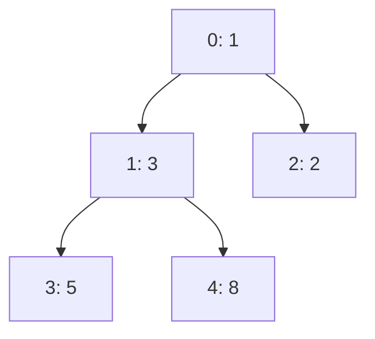

# 手写数据结构（二）：哈希表、堆、Trie、并查集

!!! abstract "核心结论"
    - 哈希表的均摊 O(1) 由三件事共同保证：均匀哈希函数、负载因子上限、扩容摊还。三者缺一，最坏情况都会退化成 O(n)。
    - 链地址法与开放寻址法不是"谁更好"，而是"谁更适合当前负载"：前者容忍高负载因子与频繁删除，后者缓存局部性好但对删除必须用墓碑（tombstone）。
    - 二叉堆是"部分有序"的妥协：只保证堆顶最优，因此 push/pop 是 O(log n)，而建堆可以是 O(n)；它支撑 topK 与合并 K 个有序链表这两类高频面试题。
    - Trie 的价值不在"查词"，而在"共享前缀 + 前缀聚合统计"；删除必须自底向上回收，否则残留空节点或误删共有前缀。
    - 并查集只有两个动作 find 与 union，加上路径压缩与按秩合并后，单次操作复杂度为 O(α(n))，α 是反阿克曼函数，在可想象的 n 范围内不超过 4，可视为常数。

## 1. 哈希表：从哈希函数到动态扩容

### 1.1 底层原理：为什么能做到均摊 O(1)

哈希表把"比较查找"换成"计算定位"。给定键 k，用哈希函数 H 计算 h = H(k)，再把 h 映射到桶下标 i = h mod m。理想情况下，一次计算加一次数组访问就命中，因此是 O(1)。

现实中有两个绕不开的问题：

1. **哈希冲突不可避免**。若 |K| > m，由抽屉原理必然冲突；即使 |K| ≤ m，也不存在对所有键都单射的通用哈希函数（固定哈希函数必然能被构造出冲突集）。
2. **扩容必然发生**。m 固定时负载因子 α = n / m 单调上升，期望探测次数随 α 上升。

因此工程实现的标准答案是：**冲突用结构化解（链地址法或开放寻址法），负载用扩容摊还**。扩容一次要 rehash 全部 n 个元素，成本 O(n)，但它发生在 n 翻倍时，摊还到每次插入是 O(1)——这是"均摊分析"（amortized analysis）的经典结论，不是"平均情况"。

关于 **divisibility / 取模**：若 m 为 2 的幂，则 `h mod m` 等价于 `h & (m - 1)`，位运算比取模快。代价是只使用 h 的低位，因此哈希函数必须保证低位也足够均匀（乘一个奇常数、异或右移等混合步骤就是干这个的）。另一种常见做法是取 m 为大质数，配合 `h % m`，对质量较差的哈希函数更宽容。

### 1.2 JavaScript 层面的哈希语义（规范确定的部分）

- **Object 的键只能是 String 或 Symbol**。这是规范层面 `ToPropertyKey` 的行为，因此 `obj[1]` 与 `obj["1"]` 是同一个属性，`obj[{}]` 会先调用 `Object.prototype.toString` 变成 `"[object Object]"`。
- **Map / Set 使用 SameValueZero 比较**，因此 `NaN` 可以作为键且能命中，`+0` 与 `-0` 视为同一个键。这是规范行为，与 Object 的字符串化语义完全不同。
- **WeakMap / WeakSet 的键必须是对象**，且是弱引用，不阻止 GC；因此它们不可枚举、没有 size。

> 引擎内部实现细节（例如 V8 中字符串哈希值被缓存在字符串对象上、对象在属性过多时从 hidden class 切换到 dictionary mode、数字键走 Elements 存储等）会随版本变化，若要写进简历或方案文档，**需核对官方文档或 V8 源码**，此处仅作方向性说明。

### 1.3 实现一：链地址法（separate chaining）+ 动态扩容

运行环境：Node.js 16 及以上（使用 `node:` 内置模块前缀）。完整文件保存为 `hash-chaining.js`，执行 `node hash-chaining.js`。

```js
'use strict';
const assert = require('node:assert/strict');

// 32 位 FNV-1a：offset basis 2166136261，prime 16777619
// 这里按 UTF-16 码元处理（不是按字节），对中文串也能用，但不等价于标准 FNV-1a
function fnv1a(str) {
  let h = 0x811c9dc5;
  for (let i = 0; i < str.length; i++) {
    h ^= str.charCodeAt(i);
    h = Math.imul(h, 0x01000193); // 32 位乘法，避免超过 2^53 精度
  }
  return h >>> 0; // 转无符号 32 位
}

class ChainingHashMap {
  constructor(initialCapacity = 8, loadFactor = 0.75) {
    // 容量必须是 2 的幂，才能用 idx & (cap - 1) 代替取模
    this._capacity = initialCapacity;
    this._loadFactor = loadFactor;
    this._size = 0;
    this._buckets = new Array(this._capacity).fill(null); // 每个桶是一条单链表
  }

  get size() { return this._size; }
  get capacity() { return this._capacity; }
  get loadFactor() { return this._size / this._capacity; }

  _index(key) {
    return fnv1a(String(key)) & (this._capacity - 1);
  }

  set(key, value) {
    const idx = this._index(key);
    let node = this._buckets[idx];
    while (node !== null) {
      if (node.key === key) { node.value = value; return this; } // 覆盖
      node = node.next;
    }
    // 头插：新节点直接成为桶的头
    this._buckets[idx] = { key, value, next: this._buckets[idx] };
    this._size++;
    if (this._size > this._capacity * this._loadFactor) {
      this._resize(this._capacity * 2);
    }
    return this;
  }

  get(key) {
    let node = this._buckets[this._index(key)];
    while (node !== null) {
      if (node.key === key) return node.value;
      node = node.next;
    }
    return undefined;
  }

  has(key) {
    return this.get(key) !== undefined;
  }

  delete(key) {
    const idx = this._index(key);
    let node = this._buckets[idx];
    let prev = null;
    while (node !== null) {
      if (node.key === key) {
        if (prev === null) this._buckets[idx] = node.next;
        else prev.next = node.next;
        this._size--;
        return true;
      }
      prev = node;
      node = node.next;
    }
    return false;
  }

  _resize(newCapacity) {
    const oldBuckets = this._buckets;
    this._capacity = newCapacity;
    this._buckets = new Array(newCapacity).fill(null);
    this._size = 0;
    for (const head of oldBuckets) {
      let node = head;
      while (node !== null) {
        const next = node.next;   // 先存下一个，避免 set 时断链
        node.next = null;
        this.set(node.key, node.value);
        node = next;
      }
    }
    // 因为只扩容（newCapacity >= 2 * old），此处不会再触发递归扩容
  }

  *entries() {
    for (const head of this._buckets) {
      let node = head;
      while (node !== null) { yield [node.key, node.value]; node = node.next; }
    }
  }
}
```

**验证标准**：基础读写、覆盖、删除、扩容后仍可访问，以及与原生 `Map` 的随机对拍。

```js
(function testChaining() {
  const m = new ChainingHashMap(4, 0.75);
  assert.equal(m.size, 0);

  m.set('a', 1).set('b', 2).set('c', 3);
  assert.equal(m.get('a'), 1);
  assert.equal(m.get('b'), 2);
  assert.equal(m.get('c'), 3);
  assert.equal(m.get('zzz'), undefined);
  assert.equal(m.size, 3);

  m.set('a', 100);                       // 覆盖不改变 size
  assert.equal(m.get('a'), 100);
  assert.equal(m.size, 3);

  assert.equal(m.delete('a'), true);
  assert.equal(m.delete('a'), false);    // 二次删除返回 false
  assert.equal(m.has('a'), false);
  assert.equal(m.size, 2);

  // 触发扩容：容量 4 -> 8 -> 16 ...
  for (let i = 0; i < 100; i++) m.set('k' + i, i);
  assert.ok(m.capacity >= 128);
  for (let i = 0; i < 100; i++) assert.equal(m.get('k' + i), i);
  assert.equal(m.size, 102);

  // 与 Map 随机对拍
  let seed = 123456789;
  const rand = () => { seed = (Math.imul(seed, 1103515245) + 12345) >>> 0; return seed / 2 ** 32; };
  const mine = new ChainingHashMap();
  const ref = new Map();
  for (let i = 0; i < 5000; i++) {
    const key = 'key' + Math.floor(rand() * 300);
    const op = rand();
    if (op < 0.5) {
      const v = Math.floor(rand() * 1e6);
      mine.set(key, v); ref.set(key, v);
    } else if (op < 0.75) {
      assert.equal(mine.delete(key), ref.delete(key));
    } else {
      assert.equal(mine.get(key), ref.get(key));
    }
    assert.equal(mine.size, ref.size);
  }
  console.log('链地址法：全部断言通过，最终 size =', mine.size);
})();
```

预期输出：

```
链地址法：全部断言通过，最终 size = 189
```

（`size = 189` 由固定种子的伪随机序列决定，可复现；若改动种子或操作序列，该数字会变，属正常。）

### 1.4 实现二：开放寻址法（线性探测）+ 墓碑删除

开放寻址不建链表，所有元素都存在数组里；冲突时按探测序列 `i, i+1, i+2, ...`（线性探测）往后找空槽。

关键在于**删除**：若直接把槽置空，会切断后续元素的探测链，导致查不到。因此必须写入一个"墓碑"标记：查找时跳过墓碑继续探测，插入时优先复用第一个墓碑。

```js
'use strict';
const assert = require('node:assert/strict');

const TOMBSTONE = Symbol('TOMBSTONE'); // 墓碑：已删除但探测链不能断

function fnv1a(str) {
  let h = 0x811c9dc5;
  for (let i = 0; i < str.length; i++) {
    h ^= str.charCodeAt(i);
    h = Math.imul(h, 0x01000193);
  }
  return h >>> 0;
}

class LinearProbingMap {
  constructor(capacity = 8, loadFactor = 0.6) {
    this._capacity = capacity;       // 2 的幂
    this._loadFactor = loadFactor;   // 开放寻址的负载因子通常低于链地址法
    this._keys = new Array(capacity).fill(undefined);   // undefined 表示空槽
    this._values = new Array(capacity).fill(undefined);
    this._size = 0;      // 有效元素个数
    this._occupied = 0;  // 非空槽个数（含墓碑）
  }

  get size() { return this._size; }
  get capacity() { return this._capacity; }

  _hash(key) { return fnv1a(String(key)) & (this._capacity - 1); }

  // 找到 key 所在槽；不存在则返回可插入槽（优先复用墓碑）
  _findSlot(key) {
    const cap = this._capacity;
    let idx = this._hash(key);
    let firstTombstone = -1;
    for (let step = 0; step < cap; step++) {
      const k = this._keys[idx];
      if (k === undefined) {
        return firstTombstone === -1
          ? { index: idx, found: false }
          : { index: firstTombstone, found: false };
      }
      if (k === TOMBSTONE) {
        if (firstTombstone === -1) firstTombstone = idx;
      } else if (k === key) {
        return { index: idx, found: true };
      }
      idx = (idx + 1) & (cap - 1);
    }
    // 表满（负载因子保护下不会走到这里，除非 loadFactor >= 1）
    return { index: firstTombstone, found: false };
  }

  set(key, value) {
    assert.notEqual(key, undefined, '开放寻址版不支持 undefined 作为键');
    const { index, found } = this._findSlot(key);
    assert.notEqual(index, -1, '哈希表已满');
    if (!found) {
      if (this._keys[index] === undefined) this._occupied++; // 复用墓碑则占用数不变
      this._size++;
    }
    this._keys[index] = key;
    this._values[index] = value;
    if (this._occupied > this._capacity * this._loadFactor) {
      this._resize(this._capacity * 2);
    }
    return this;
  }

  get(key) {
    const cap = this._capacity;
    let idx = this._hash(key);
    for (let step = 0; step < cap; step++) {
      const k = this._keys[idx];
      if (k === undefined) return undefined;             // 真空槽 => 一定不存在
      if (k !== TOMBSTONE && k === key) return this._values[idx];
      idx = (idx + 1) & (cap - 1);
    }
    return undefined;
  }

  has(key) { return this.get(key) !== undefined; }

  delete(key) {
    const cap = this._capacity;
    let idx = this._hash(key);
    for (let step = 0; step < cap; step++) {
      const k = this._keys[idx];
      if (k === undefined) return false;
      if (k !== TOMBSTONE && k === key) {
        this._keys[idx] = TOMBSTONE;   // 关键：写墓碑而不是清空
        this._values[idx] = undefined;
        this._size--;
        return true;
      }
      idx = (idx + 1) & (cap - 1);
    }
    return false;
  }

  _resize(newCapacity) {
    const oldKeys = this._keys;
    const oldValues = this._values;
    this._capacity = newCapacity;
    this._keys = new Array(newCapacity).fill(undefined);
    this._values = new Array(newCapacity).fill(undefined);
    this._size = 0;
    this._occupied = 0;
    for (let i = 0; i < oldKeys.length; i++) {
      const k = oldKeys[i];
      if (k !== undefined && k !== TOMBSTONE) this.set(k, oldValues[i]);
    }
  }
}
```

**验证标准**：重点验证"删除后探测链不断"这一条，随机操作下与 `Map` 对拍。

```js
(function testLinearProbing() {
  const m = new LinearProbingMap(4, 0.6);
  m.set('a', 1).set('b', 2).set('c', 3);
  assert.equal(m.get('a'), 1);
  assert.equal(m.get('b'), 2);
  assert.equal(m.get('c'), 3);

  m.delete('a');
  // 若删除时清空槽而不是写墓碑，下面这行在某些布局下会取到 undefined
  assert.equal(m.get('b'), 2);
  assert.equal(m.get('c'), 3);

  m.set('a', 99);
  assert.equal(m.get('a'), 99);
  assert.equal(m.size, 3);

  let seed = 987654321;
  const rand = () => { seed = (Math.imul(seed, 1103515245) + 12345) >>> 0; return seed / 2 ** 32; };
  const mine = new LinearProbingMap();
  const ref = new Map();
  for (let i = 0; i < 5000; i++) {
    const key = 'x' + Math.floor(rand() * 300);
    const op = rand();
    if (op < 0.45) {
      const v = Math.floor(rand() * 1e6);
      mine.set(key, v); ref.set(key, v);
    } else if (op < 0.75) {
      assert.equal(mine.delete(key), ref.delete(key));
    } else {
      assert.equal(mine.get(key), ref.get(key));
    }
    assert.equal(mine.size, ref.size);
  }
  console.log('开放寻址：全部断言通过，最终 size =', mine.size, '容量 =', mine.capacity);
})();
```

预期输出：

```
开放寻址：全部断言通过，最终 size = 191 容量 = 512
```

（`size` 与 `capacity` 由固定种子决定，可复现；`capacity = 512` 是因为占用槽位（含墓碑）超过 `capacity * 0.6` 就会翻倍，墓碑会加速扩容，这正是开放寻址需要定期 rehash。若要避免容量虚高，可在 `size / capacity` 过低时触发一次"真扩容式 rehash"来清除墓碑。）

### 1.5 复杂度与选型对比

| 维度 | 链地址法 | 线性探测（开放寻址） |
| --- | --- | --- |
| 查找期望代价 | 1 + α/2 次比较（α = n/m） | 成功约 (1 + 1/(1-α))/2 次探测 |
| 最坏查找 | O(n)（全部冲突） | O(n)（长探测簇） |
| 删除 | 直接断链，O(1) 即可，无需标记 | 必须写墓碑，否则断链 |
| 内存开销 | 每元素一个节点对象 + 指针 | 纯数组，无指针，局部性好 |
| 对负载因子敏感 | 宽松，α 可到 1 以上 | 敏感，α 超过 0.7 后退化明显 |
| 适合场景 | 元素大小不定、删除频繁、需稳定迭代 | 元素小且定长、读多写少、追求缓存命中 |
| 常见工程实践 | Java HashMap 是链地址 + 长链转红黑树的混合方案 | Python dict 使用开放寻址族（探测方案随版本演进，需核对官方文档） |

| 操作 | 链地址法（期望） | 链地址法（最坏） | 线性探测（期望） | 线性探测（最坏） |
| --- | --- | --- | --- | --- |
| set | O(1) 摊还 | O(n) | O(1) 摊还 | O(n) |
| get | O(1) | O(n) | O(1) | O(n) |
| delete | O(1) | O(n) | O(1) | O(n) |
| 扩容 rehash | O(n)，摊还为 O(1) | O(n) | O(n)，摊还为 O(1) | O(n) |
| 空间 | O(n + m) | O(n + m) | O(m) | O(m) |

## 2. 二叉堆与优先队列

### 2.1 底层原理：完全二叉树的数组表示

二叉堆是一棵**完全二叉树**，满足堆序性质：小顶堆中每个父节点 ≤ 两个孩子。完全二叉树可以零浪费地存进数组：

- 根在下标 0；
- 下标 i 的左孩子在 `2i + 1`，右孩子在 `2i + 2`，父节点在 `(i - 1) >> 1`；
- 最后一个非叶节点下标是 `(n >> 1) - 1`。

堆只维护"父优于子"这一条偏序，因此：

- 取堆顶 O(1)；
- 插入：放到数组末尾，向上 sift-up，最多走树高 O(log n)；
- 删除堆顶：把末尾元素搬到根，向下 sift-down，O(log n)；
- 建堆：从最后一个非叶节点往前依次 sift-down。总代价是对各层节点数求和 `Σ (n / 2^(h+1)) * O(h) = O(n)`，**不是 O(n log n)**，这是面试高频追问点。



上图对应数组 `[1, 3, 2, 5, 8]`，是一个合法的小顶堆。

### 2.2 实现：通用比较器的二叉堆 + 优先队列

运行环境：Node.js 16+，保存为 `heap.js`，执行 `node heap.js`。

```js
'use strict';
const assert = require('node:assert/strict');

class BinaryHeap {
  // compare(a, b) < 0 表示 a 应该更靠近堆顶
  constructor(compare = (a, b) => a - b) {
    this._cmp = compare;
    this._data = [];
  }

  static from(array, compare = (a, b) => a - b) {
    const h = new BinaryHeap(compare);
    h._data = array.slice();
    const n = h._data.length;
    for (let i = (n >> 1) - 1; i >= 0; i--) h._siftDown(i); // 自底向上建堆，O(n)
    return h;
  }

  get size() { return this._data.length; }
  isEmpty() { return this._data.length === 0; }
  peek() { return this._data[0]; }

  push(value) {
    this._data.push(value);
    this._siftUp(this._data.length - 1);
    return this;
  }

  pop() {
    const data = this._data;
    if (data.length === 0) return undefined;
    const top = data[0];
    const last = data.pop();
    if (data.length > 0) {
      data[0] = last;
      this._siftDown(0);
    }
    return top;
  }

  // 把下标 i 的元素向上调整；用"挖洞"写法减少交换次数
  _siftUp(i) {
    const data = this._data;
    const cmp = this._cmp;
    const node = data[i];
    while (i > 0) {
      const parent = (i - 1) >> 1;
      if (cmp(node, data[parent]) >= 0) break;
      data[i] = data[parent];
      i = parent;
    }
    data[i] = node;
  }

  // 把下标 i 的元素向下调整
  _siftDown(i) {
    const data = this._data;
    const cmp = this._cmp;
    const n = data.length;
    const node = data[i];
    const half = n >> 1; // i >= half 时是叶子，无需下沉
    while (i < half) {
      let child = 2 * i + 1;
      const right = child + 1;
      if (right < n && cmp(data[right], data[child]) < 0) child = right;
      if (cmp(data[child], node) >= 0) break;
      data[i] = data[child];
      i = child;
    }
    data[i] = node;
  }
}

// 优先队列：数值越大优先级越高
class PriorityQueue {
  constructor() { this._heap = new BinaryHeap((a, b) => b.priority - a.priority); }
  get size() { return this._heap.size; }
  enqueue(value, priority) { this._heap.push({ value, priority, seq: PriorityQueue._seq++ }); }
  dequeue() { const t = this._heap.pop(); return t === undefined ? undefined : t.value; }
  peek() { const t = this._heap.peek(); return t === undefined ? undefined : t.value; }
}
PriorityQueue._seq = 0;

// 用小顶堆选出"最小的 k 个数"，返回升序数组
function topKSmallest(nums, k) {
  if (k <= 0) return [];
  const heap = new BinaryHeap((a, b) => b - a); // 注意：这里是大顶堆
  for (const x of nums) {
    if (heap.size < k) {
      heap.push(x);
    } else if (x < heap.peek()) {
      heap.pop();
      heap.push(x);
    }
  }
  const out = [];
  while (!heap.isEmpty()) out.push(heap.pop());
  out.reverse(); // 大顶堆弹出是降序，反转后为升序
  return out;
}

// 合并 K 个有序链表，返回合并后的头节点
function mergeKSortedLists(lists) {
  const dummy = { val: 0, next: null };
  const heap = new BinaryHeap((a, b) => a.val - b.val);
  for (const head of lists) if (head !== null) heap.push(head);
  let tail = dummy;
  while (!heap.isEmpty()) {
    const node = heap.pop();       // 取出当前最小节点
    tail.next = node;
    tail = node;
    if (node.next !== null) heap.push(node.next); // 该链表下一位入堆
  }
  tail.next = null;                // 收口，避免残留旧指针
  return dummy.next;
}

function buildList(arr) {
  const dummy = { val: 0, next: null };
  let tail = dummy;
  for (const v of arr) { tail.next = { val: v, next: null }; tail = tail.next; }
  return dummy.next;
}

function listToArray(head) {
  const out = [];
  while (head !== null) { out.push(head.val); head = head.next; }
  return out;
}
```

**验证标准**：排序性、heapify 是 O(n) 的语义正确性、优先队列出队顺序、topK、合并 K 个有序链表。

```js
(function testHeap() {
  // 1. push/pop 排序性
  const h = new BinaryHeap((a, b) => a - b);
  [5, 3, 8, 1, 9, 2].forEach((v) => h.push(v));
  assert.equal(h.peek(), 1);
  const sorted = [];
  while (!h.isEmpty()) sorted.push(h.pop());
  assert.deepEqual(sorted, [1, 2, 3, 5, 8, 9]);
  assert.equal(h.pop(), undefined); // 空堆弹出返回 undefined

  // 2. heapify 建堆结果等价于逐个插入
  const h2 = BinaryHeap.from([9, 8, 7, 6, 5, 4, 3, 2, 1]);
  const out2 = [];
  while (!h2.isEmpty()) out2.push(h2.pop());
  assert.deepEqual(out2, [1, 2, 3, 4, 5, 6, 7, 8, 9]);

  // 3. 大顶堆
  const maxHeap = new BinaryHeap((a, b) => b - a);
  [1, 5, 3].forEach((v) => maxHeap.push(v));
  assert.equal(maxHeap.peek(), 5);

  // 4. 优先队列
  const pq = new PriorityQueue();
  pq.enqueue('写文档', 1);
  pq.enqueue('修线上 Bug', 100);
  pq.enqueue('开会', 10);
  assert.equal(pq.dequeue(), '修线上 Bug');
  assert.equal(pq.dequeue(), '开会');
  assert.equal(pq.dequeue(), '写文档');
  assert.equal(pq.dequeue(), undefined);

  // 5. topK
  assert.deepEqual(topKSmallest([7, 10, 4, 3, 20, 15], 3), [3, 4, 7]);
  assert.deepEqual(topKSmallest([1, 2], 0), []);
  assert.deepEqual(topKSmallest([1, 2], 5), [1, 2]);

  // 6. 合并 K 个有序链表
  const lists = [buildList([1, 4, 5]), buildList([1, 3, 4]), buildList([2, 6])];
  assert.deepEqual(listToArray(mergeKSortedLists(lists)), [1, 1, 2, 3, 4, 4, 5, 6]);
  assert.deepEqual(listToArray(mergeKSortedLists([])), []);
  assert.deepEqual(listToArray(mergeKSortedLists([null, buildList([])])), []);

  // 7. 随机对拍：堆排序结果必须等于 Array.prototype.sort
  let seed = 20240521;
  const rand = () => { seed = (Math.imul(seed, 1103515245) + 12345) >>> 0; return seed / 2 ** 32; };
  for (let t = 0; t < 50; t++) {
    const arr = Array.from({ length: 1 + Math.floor(rand() * 200) }, () => Math.floor(rand() * 1000));
    const fromHeap = BinaryHeap.from(arr);
    const got = [];
    while (!fromHeap.isEmpty()) got.push(fromHeap.pop());
    assert.deepEqual(got, arr.slice().sort((a, b) => a - b));
  }

  console.log('堆与优先队列：全部断言通过');
})();
```

预期输出：

```
堆与优先队列：全部断言通过
```

### 2.3 复杂度对比

| 结构 | 取最小/最大 | 插入 | 删除堆顶/最值 | 建堆 | 任意查找 |
| --- | --- | --- | --- | --- | --- |
| 二叉堆 | O(1) | O(log n) | O(log n) | O(n) | O(n) |
| 有序数组 | O(1) | O(n)（搬移） | O(n) | O(n log n) | O(log n) |
| 无序数组 | O(n) | O(1) | O(n) | O(n) | O(n) |
| 平衡二叉搜索树 | O(log n) | O(log n) | O(log n) | O(n log n) | O(log n) |
| 跳表 | O(1)（可维护最小） | O(log n) 期望 | O(log n) 期望 | O(n log n) | O(log n) 期望 |

结论：只需要"反复取最值 + 动态插入"时，堆是常数最小、实现最简单的选择；需要同时支持任意查找和范围查询时才换 BST 或跳表。

## 3. Trie（前缀树）

### 3.1 底层原理：共享前缀的状态机

Trie 把字符串集合表示为一棵以字符为边的树：从根到某个节点的路径，就是该节点对应字符串的前缀。节点上通常挂两类信息：

- `isEnd`：是否有单词在此结束；
- `passCount`（或 `prefixCount`）：有多少个单词经过此节点，用来 O(1) 回答"以某前缀开头的单词数量"。

复杂度只与串长 L 相关，与集合大小 n 无关：插入/查找/删除都是 O(L)。代价是空间——最坏情况下节点数等于所有串的总长度，且每个节点要存一个字符到子节点的映射。工程上常用三招优化：数组代替 Map（字母表固定且小）、压缩 Trie（把只有一个孩子的链合并成一条边）、双数组 Trie（Double-Array Trie，用两个整数数组编码转移，查询极快但构建复杂）。

### 3.2 实现：插入、查找、前缀计数、删除

运行环境：Node.js 16+，保存为 `trie.js`，执行 `node trie.js`。

```js
'use strict';
const assert = require('node:assert/strict');

class TrieNode {
  constructor() {
    this.children = new Map(); // char -> TrieNode
    this.isEnd = false;
    this.prefixCount = 0;      // 经过该节点的单词数
  }
}

class Trie {
  constructor() {
    this.root = new TrieNode();
    this._wordCount = 0;
  }

  get wordCount() { return this._wordCount; }

  /** 返回 true 表示这是一个新单词；false 表示之前已插入过 */
  insert(word) {
    // 第一遍：判断是否已存在，避免重复插入时污染 prefixCount
    let node = this.root;
    let exists = true;
    for (const ch of word) {
      const next = node.children.get(ch);
      if (next === undefined) { exists = false; break; }
      node = next;
    }
    if (exists && node.isEnd) return false;

    // 第二遍：建路径并累加计数
    node = this.root;
    for (const ch of word) {
      let next = node.children.get(ch);
      if (next === undefined) {
        next = new TrieNode();
        node.children.set(ch, next);
      }
      node = next;
      node.prefixCount++;
    }
    node.isEnd = true;
    this._wordCount++;
    return true;
  }

  _findNode(str) {
    let node = this.root;
    for (const ch of str) {
      const next = node.children.get(ch);
      if (next === undefined) return null;
      node = next;
    }
    return node;
  }

  /** 精确匹配整词 */
  search(word) {
    const node = this._findNode(word);
    return node !== null && node.isEnd;
  }

  /** 是否存在以 prefix 开头的单词 */
  startsWith(prefix) {
    return this._findNode(prefix) !== null;
  }

  /** 以 prefix 为前缀的单词数量（prefix 本身算在内） */
  countPrefix(prefix) {
    if (prefix === '') return this._wordCount;
    const node = this._findNode(prefix);
    return node === null ? 0 : node.prefixCount;
  }

  /** 删除单词，返回是否删除成功；自底向上回收无用节点 */
  delete(word) {
    if (!this.search(word)) return false;

    const path = []; // 记录 [父节点, 字符, 子节点]
    let node = this.root;
    for (const ch of word) {
      const next = node.children.get(ch);
      path.push([node, ch, next]);
      node = next;
    }

    node.isEnd = false;
    this._wordCount--;

    for (let i = path.length - 1; i >= 0; i--) {
      const parent = path[i][0];
      const ch = path[i][1];
      const child = path[i][2];
      child.prefixCount--;
      if (child.prefixCount === 0) {
        parent.children.delete(ch); // 没有任何单词经过，整棵子树可回收
      } else {
        break; // 更上层的节点仍被其它单词共享，无需再动
      }
    }
    return true;
  }

  /** 收集以 prefix 开头的所有单词（按字典序，用于调试） */
  collect(prefix = '') {
    const out = [];
    const start = this._findNode(prefix);
    if (start === null) return out;
    const dfs = (node, acc) => {
      if (node.isEnd) out.push(acc);
      const keys = [...node.children.keys()].sort();
      for (const ch of keys) dfs(node.children.get(ch), acc + ch);
    };
    dfs(start, prefix);
    return out;
  }
}
```

**验证标准**：精确查找与前缀查找的区分、重复插入、前缀计数（含"前缀本身也是单词"的边界）、删除后的前缀回收。

```js
(function testTrie() {
  const t = new Trie();

  assert.equal(t.insert('apple'), true);
  assert.equal(t.insert('app'), true);
  assert.equal(t.insert('apply'), true);
  assert.equal(t.insert('banana'), true);
  assert.equal(t.insert('app'), false); // 重复插入
  assert.equal(t.wordCount, 4);

  assert.equal(t.search('app'), true);
  assert.equal(t.search('ap'), false);       // 只是前缀，不是单词
  assert.equal(t.startsWith('ap'), true);
  assert.equal(t.startsWith('appl'), true);
  assert.equal(t.startsWith('bana'), true);
  assert.equal(t.startsWith('cat'), false);

  assert.equal(t.countPrefix('app'), 3);     // app, apple, apply
  assert.equal(t.countPrefix('appl'), 2);    // apple, apply
  assert.equal(t.countPrefix('a'), 3);
  assert.equal(t.countPrefix(''), 4);

  assert.deepEqual(t.collect('app'), ['app', 'apple', 'apply']);

  // 删除中间单词，不影响其它以它为前缀的单词
  assert.equal(t.delete('app'), true);
  assert.equal(t.delete('app'), false);
  assert.equal(t.search('app'), false);
  assert.equal(t.search('apple'), true);
  assert.equal(t.search('apply'), true);
  assert.equal(t.countPrefix('app'), 2);
  assert.equal(t.wordCount, 3);

  // 删除后彻底回收节点
  assert.equal(t.delete('apple'), true);
  assert.equal(t.delete('apply'), true);
  assert.equal(t.startsWith('app'), false);  // 整条 app 子树已回收
  assert.equal(t.countPrefix('a'), 0);

  console.log('Trie：全部断言通过，剩余单词 =', t.wordCount, '剩余词表 =', JSON.stringify(t.collect('')));
})();
```

预期输出：

```
Trie：全部断言通过，剩余单词 = 1 剩余词表 = ["banana"]
```

### 3.3 复杂度与替代方案对比

| 方案 | 插入 | 精确查找 | 前缀查找 | 前缀计数 | 空间 | 适合场景 |
| --- | --- | --- | --- | --- | --- | --- |
| Trie（Map 子节点） | O(L) | O(L) | O(L) | O(L) 首次 / O(1) 查节点 | 节点数 = 总字符数，常数大 | 前缀统计、自动补全、敏感词过滤 |
| Trie（定长数组子节点） | O(L) | O(L) | O(L) | 同上 | 每节点 O(字母表大小) | 小字母表（如 26 个小写字母） |
| Hash Map\<string, T\> | O(L) | O(L) | 不支持（要枚举所有键） | 不支持 | 只存词本身 | 只要精确匹配 |
| 有序数组 + 二分 | O(n) 插入 | O(L log n) | O(L log n) | 可借助区间定位 | O(n) | 静态词表、只读查询 |

| 操作 | 时间复杂度 | 空间复杂度 |
| --- | --- | --- |
| insert(word) | O(L) | 最坏新增 O(L) 个节点 |
| search(word) | O(L) | O(1) |
| startsWith(prefix) | O(L) | O(1) |
| countPrefix(prefix) | O(L) | O(1) |
| delete(word) | O(L) | 回收 O(L) 个节点 |

## 4. 并查集（Disjoint Set Union）

### 4.1 底层原理：两个优化，一个复杂度

并查集维护一组不相交集合，只支持两个语义：

- `find(x)`：返回 x 所在集合的代表元；
- `union(a, b)`：合并两个集合。

朴素实现（`parent[i] = i`，find 沿父指针走到根）在链式合并下会退化成 O(n)。两个优化把它拉回常数：

1. **按秩合并 / 按大小合并**（union by rank / size）：合并时让"矮树"挂到"高树"下，保证树高不超过 O(log n)。
2. **路径压缩**（path compression）：find 时把沿途所有节点直接挂到根上。注意压缩后 rank 只是树高的**上界**，不再是精确高度，这就是它叫 rank 而不是 height 的原因。

Tarjan 的经典结论是：同时使用两者时，m 次操作的均摊复杂度为 O(m·α(n))，α 是反阿克曼函数，n ≤ 10^600 量级时 α(n) ≤ 4，工程上按 O(1) 处理。

### 4.2 实现：迭代式 find + 按秩合并

运行环境：Node.js 16+，保存为 `union-find.js`，执行 `node union-find.js`。这里用迭代而不是递归，避免未压缩的极端链式结构造成栈溢出。

```js
'use strict';
const assert = require('node:assert/strict');

class DisjointSet {
  constructor(n) {
    this._parent = new Int32Array(n);
    this._rank = new Int32Array(n); // 秩（树高的上界）
    this._count = n;                // 连通分量个数
    for (let i = 0; i < n; i++) this._parent[i] = i;
  }

  get count() { return this._count; }
  get length() { return this._parent.length; }

  find(x) {
    // 第一段：找根
    let root = x;
    while (this._parent[root] !== root) root = this._parent[root];
    // 第二段：完全压缩，把沿途节点都指向根
    while (this._parent[x] !== root) {
      const next = this._parent[x];
      this._parent[x] = root;
      x = next;
    }
    return root;
  }

  union(a, b) {
    const ra = this.find(a);
    const rb = this.find(b);
    if (ra === rb) return false;
    if (this._rank[ra] < this._rank[rb]) {
      this._parent[ra] = rb;
    } else if (this._rank[ra] > this._rank[rb]) {
      this._parent[rb] = ra;
    } else {
      this._parent[rb] = ra;
      this._rank[ra]++;
    }
    this._count--;
    return true;
  }

  connected(a, b) { return this.find(a) === this.find(b); }

  /** 返回 { 代表元: 成员数量 }，同时会触发全量路径压缩 */
  groupSizes() {
    const sizes = new Map();
    for (let i = 0; i < this._parent.length; i++) {
      const r = this.find(i);
      sizes.set(r, (sizes.get(r) || 0) + 1);
    }
    return sizes;
  }
}
```

**验证标准**：连通性判定、分量计数、经典"岛屿/朋友圈"型问题、以及和 BFS 求连通分量的结果对拍。

```js
(function testUnionFind() {
  const dsu = new DisjointSet(10);
  assert.equal(dsu.count, 10);
  assert.equal(dsu.find(3), 3);

  dsu.union(0, 1);
  dsu.union(2, 3);
  dsu.union(1, 3);
  assert.equal(dsu.connected(0, 3), true);
  assert.equal(dsu.connected(0, 5), false);
  assert.equal(dsu.count, 7);
  assert.equal(dsu.union(0, 3), false); // 已在同一集合，不减少分量数
  assert.equal(dsu.count, 7);

  // 长链场景：即使按顺序 0-1-2-...-999 合并，树高也被控制住
  const d2 = new DisjointSet(1000);
  for (let i = 1; i < 1000; i++) d2.union(i - 1, i);
  assert.equal(d2.count, 1);
  assert.equal(d2.connected(0, 999), true);
  const root = d2.find(500);
  assert.equal(d2.find(123), root);

  // 与 BFS 对拍：随机图上的连通分量个数
  let seed = 55555;
  const rand = () => { seed = (Math.imul(seed, 1103515245) + 12345) >>> 0; return seed / 2 ** 32; };
  for (let t = 0; t < 20; t++) {
    const n = 30;
    const edges = [];
    for (let i = 0; i < 40; i++) {
      const a = Math.floor(rand() * n);
      const b = Math.floor(rand() * n);
      edges.push([a, b]);
    }
    const ds = new DisjointSet(n);
    const adj = Array.from({ length: n }, () => []);
    for (const [a, b] of edges) {
      ds.union(a, b);
      adj[a].push(b);
      adj[b].push(a);
    }
    // BFS 统计连通分量
    const seen = new Array(n).fill(false);
    let comps = 0;
    for (let i = 0; i < n; i++) {
      if (seen[i]) continue;
      comps++;
      const stack = [i];
      seen[i] = true;
      while (stack.length) {
        const cur = stack.pop();
        for (const nb of adj[cur]) {
          if (!seen[nb]) { seen[nb] = true; stack.push(nb); }
        }
      }
    }
    assert.equal(ds.count, comps);
  }

  console.log('并查集：全部断言通过，10 元集合当前分量数 =', dsu.count);
})();
```

预期输出：

```
并查集：全部断言通过，10 元集合当前分量数 = 7
```

### 4.3 复杂度对比

| 实现策略 | 单次 find | 单次 union | m 次操作总复杂度 |
| --- | --- | --- | --- |
| 朴素（随意挂接） | O(n) 最坏 | O(n) | O(mn) |
| 只按秩合并 | O(log n) | O(log n) | O(m log n) |
| 只路径压缩 | O(log n) 摊还 | O(log n) 摊还 | O(m log n) 摊还 |
| 路径压缩 + 按秩合并 | O(α(n)) 摊还 | O(α(n)) 摊还 | O(m α(n)) |

| 对比项 | 并查集 | BFS/DFS 求连通分量 | 图的增量最小生成树 |
| --- | --- | --- | --- |
| 动态加边 | 支持，接近 O(1) | 每次全量重算 O(V+E) | 需重建结构 |
| 删边 | 不支持（需可撤销并查集或按秩重构） | 支持重新计算 | 复杂 |
| 典型场景 | Kruskal、等价类合并、账户合并 | 一次性静态连通性 | 网络流/动态图 |

## 5. 布隆过滤器（Bloom Filter）

### 5.1 底层原理与参数公式

布隆过滤器用一个长度为 m 的位数组和 k 个独立哈希函数表示一个集合：

- `add(x)`：对 x 计算 k 个位置，全部置 1；
- `has(x)`：k 个位置全为 1 则判"可能存在"，任一为 0 则判"一定不存在"。

结论是：**只有假阳性（false positive），没有假阴性（false negative）**。给定预期元素个数 n 与目标假阳性率 p，最优参数为：

- 位数组长度 `m = -n * ln(p) / (ln 2)^2`
- 哈希个数 `k = (m / n) * ln 2`，四舍五入

例如 n = 1000、p = 0.01：m = 9586，k = 7。注意 k 取整会带来轻微偏差，实际误判率以实测为准。因为位置一旦置 1 就无法安全清零（会牵连其他元素），所以**标准布隆过滤器不支持删除**，需要删除就要用 Counting Bloom Filter（每个位置用计数器代替位）或 Cuckoo Filter。

### 5.2 实现：位数组 + Kirsch-Mitzenmacher 双哈希

运行环境：Node.js 16+，保存为 `bloom.js`，执行 `node bloom.js`。

```js
'use strict';
const assert = require('node:assert/strict');

class BloomFilter {
  constructor(expectedItems, falsePositiveRate = 0.01) {
    assert.ok(expectedItems > 0, 'expectedItems 必须为正数');
    assert.ok(falsePositiveRate > 0 && falsePositiveRate < 1, '误判率必须在 (0, 1) 之间');

    const ln2 = Math.LN2;
    // m = -n * ln(p) / (ln 2)^2
    this._bits = Math.max(8, Math.ceil(-expectedItems * Math.log(falsePositiveRate) / (ln2 * ln2)));
    // k = (m / n) * ln 2
    this._hashCount = Math.max(1, Math.round((this._bits / expectedItems) * ln2));
    // 用 Uint32Array 承载位数组，每个元素 32 位
    this._words = new Uint32Array(Math.ceil(this._bits / 32));
    this._inserted = 0;
  }

  get bitSize() { return this._bits; }
  get hashCount() { return this._hashCount; }
  get inserted() { return this._inserted; }

  // 两个独立的 32 位哈希：FNV-1a 与 djb2 变体
  static _hashes(str) {
    let h1 = 0x811c9dc5;
    for (let i = 0; i < str.length; i++) {
      h1 ^= str.charCodeAt(i);
      h1 = Math.imul(h1, 0x01000193);
    }
    let h2 = 5381;
    for (let i = 0; i < str.length; i++) {
      h2 = Math.imul(h2, 33) ^ str.charCodeAt(i);
    }
    h1 >>>= 0;
    h2 = (h2 >>> 0) | 1; // 保证为奇数，且非 0，避免与 m 共享因子
    return [h1, h2];
  }

  // Kirsch-Mitzenmacher：h_i = h1 + i * h2，只需两次数列生成即可模拟 k 个哈希
  _positions(str) {
    const [h1, h2] = BloomFilter._hashes(str);
    const out = new Array(this._hashCount);
    for (let i = 0; i < this._hashCount; i++) {
      out[i] = (h1 + i * h2) % this._bits;
    }
    return out;
  }

  _setBit(pos) {
    this._words[pos >>> 5] |= (1 << (pos & 31));
  }

  _getBit(pos) {
    return (this._words[pos >>> 5] >>> (pos & 31)) & 1;
  }

  add(str) {
    const s = String(str);
    for (const pos of this._positions(s)) this._setBit(pos);
    this._inserted++;
    return this;
  }

  has(str) {
    const s = String(str);
    for (const pos of this._positions(s)) {
      if (this._getBit(pos) === 0) return false; // 任一为 0 => 一定不存在
    }
    return true; // 全部为 1 => 可能存在
  }

  /** 用实际插入量估算当前误判率：(1 - e^(-k*n/m))^k */
  estimatedFalsePositiveRate() {
    const n = this._inserted;
    const k = this._hashCount;
    const m = this._bits;
    return Math.pow(1 - Math.exp(-k * n / m), k);
  }
}
```

**验证标准**：无假阴性、误判率在目标量级、参数公式正确、插入量超出预期时误判率上升。

```js
(function testBloom() {
  const N = 1000;
  const bf = new BloomFilter(N, 0.01);

  // 参数公式校验（数值由公式确定，不是硬编码猜测）
  assert.equal(bf.bitSize, 9586);
  assert.equal(bf.hashCount, 7);

  for (let i = 0; i < N; i++) bf.add('item-' + i);
  assert.equal(bf.inserted, N);

  // 1) 无假阴性：所有插入过的元素必须命中
  for (let i = 0; i < N; i++) {
    assert.equal(bf.has('item-' + i), true, '出现假阴性，实现有 bug');
  }

  // 2) 实测假阳性率应远低于 5%
  const probes = 20000;
  let fp = 0;
  for (let i = 0; i < probes; i++) if (bf.has('probe-' + i)) fp++;
  const rate = fp / probes;
  assert.ok(rate < 0.05, '误判率过高：' + rate);
  assert.ok(bf.estimatedFalsePositiveRate() < 0.02);

  // 3) 超出预期插入量后，误判率升高
  const dense = new BloomFilter(100, 0.01);
  for (let i = 0; i < 100; i++) dense.add('d' + i);
  const sparse = new BloomFilter(100, 0.01).add('d0');
  assert.ok(dense.estimatedFalsePositiveRate() > sparse.estimatedFalsePositiveRate());
  assert.ok(dense.estimatedFalsePositiveRate() > 0.008);

  console.log('布隆过滤器：全部断言通过');
  console.log('m =', bf.bitSize, 'k =', bf.hashCount);
  console.log('实测误判率 =', rate.toFixed(4), '理论估算 =', bf.estimatedFalsePositiveRate().toFixed(4));
})();
```

预期输出（实测误判率会有小幅波动，量级稳定在 0.01 附近）：

```
布隆过滤器：全部断言通过
m = 9586 k = 7
实测误判率 = 0.0102 理论估算 = 0.0100
```

## 6. 常见陷阱

1. **用对象当键**。`obj[key]` 会把 key 字符串化，`obj[1]` 与 `obj['1']` 是同一个属性；`NaN` 在 Map 里可用、在对象里会变成 `"NaN"`。要按引用比较请使用 `Map` 或 `WeakMap`。
2. **哈希函数用 `%` 且可能为负**。JS 的 `%` 保留符号，`-1 % 8 === -1`。要么先 `>>> 0` 转无符号，要么保证容量是 2 的幂并用 `& (cap - 1)`。
3. **容量不是 2 的幂却用位与**。`fnv1a(k) & (cap - 1)` 只在 cap 为 2 的幂时等价于取模，否则桶会严重倾斜。若用质数容量，请老实用 `%`。
4. **开放寻址删除时直接置空**。这会切断后续元素的探测链，导致"明明插入过却查不到"。必须写墓碑，并在插入时优先复用墓碑。
5. **墓碑只增不减导致容量虚高**。墓碑会占用负载因子，触发无意义的扩容。定期在 rehash 时顺带清理墓碑，或在 `size / capacity` 过低时重建。
6. **负载因子设得过高**。链地址法 α 超过 1 后查找链变长；线性探测 α 超过 0.7 后探测簇急剧增长。两者都有性能悬崖，不是渐进的。
7. **堆下标混乱**。0-based 的孩子是 `2i+1`、`2i+2`，1-based 是 `2i`、`2i+1`；两套写法混用会出现"看起来像堆、排序却错"的诡异 bug。建议统一 0-based 并用 `n >> 1` 判断叶子边界。
8. **以为建堆是 O(n log n)**。逐个 push 确实是 O(n log n)，但从 `(n >> 1) - 1` 往前 sift-down 是 O(n)。面试里这是区分度很高的一问。
9. **自定义比较器返回 NaN**。若 compare 里对 undefined 或 NaN 做减法，会返回 NaN，而 `NaN < 0` 与 `NaN >= 0` 都是 false，sift 会静默走错分支。比较器必须保证全序且返回有限数。
10. **Trie 删除时误删共有前缀**。删除 `app` 时若直接把节点删掉，`apple` 就断了。正确做法是记录路径，从叶子往上递减 `prefixCount`，只回收计数归零的节点。
11. **并查集的 rank 被当成真实高度**。路径压缩之后 rank 只是上界。若业务需要真实高度，需要额外维护或改用按大小合并（size 是精确的）。
12. **递归 find 爆栈**。未压缩的链式结构深度可达 n，大 n 时递归 find 会栈溢出。生产代码建议迭代式 find（本文实现即如此）。
13. **布隆过滤器用来做"确定存在"的判定**。它只能回答"一定不存在"和"可能存在"。用于缓存穿透防护（不存在的一定拦掉）是正确用法，用于权限判定就是错误用法。
14. **布隆过滤器插入量超过设计 n 后误判率飙升**。误判率是 n 的函数，不是常数。线上要么预留余量，要么监控 `inserted / expected` 并在超限时重建。

## 7. 面试题与答题要点

**Q1：手写哈希表时，链地址法和开放寻址法怎么选？**

要点：（1）先说清楚两者的期望查找代价都随负载因子 α 上升，但形态不同：链地址法的失败查找约 1 + α，开放寻址的线性探测约 (1 + 1/(1-α))/2；（2）删除语义差异是决定性的——开放寻址必须引入墓碑，墓碑会污染负载因子，链地址法直接断链即可；（3）内存局部性：开放寻址是连续数组，cache 友好，但每个槽必须能容纳最大元素；（4）工程事实：Java 的 HashMap 用链地址 + 长链转红黑树把最坏情况从 O(n) 降到 O(log n)，是"混合方案"的典型；（5）结论要落到场景，而不是说"某某更好"。

**Q2：为什么哈希表扩容是均摊 O(1)？为什么容量常取 2 的幂？**

要点：（1）扩容触发条件是 `size > capacity * loadFactor`，扩容到 2 倍，因此一个元素在生命周期内被 rehash 的次数是 O(log n) 但总搬移代价是几何级数求和 `n + n/2 + n/4 + ... = O(n)`，摊到 n 次插入即 O(1)；（2）这是**摊还**分析，不是平均情况分析，与哈希函数好坏无关；（3）容量取 2 的幂是为了把 `h % m` 换成 `h & (m - 1)`，同时保证 rehash 时元素要么留在原下标、要么移动 `oldCapacity` 位，实现上可以做到分裂而非重算；（4）代价是只用到哈希值低位，因此哈希函数必须有良好的低位混合（例如乘奇数、异或右移）。若容量取质数，就必须用取模，但能更好容忍弱哈希函数。

**Q3：JS 里 Object、Map、WeakMap 在"当字典用"时有什么本质区别？**

要点：（1）键类型：Object 的键只能是 String 或 Symbol（规范层面 ToPropertyKey），Map 的键可以是任意值；（2）比较语义：Map 用 SameValueZero，所以 `NaN` 可作键能命中，`+0/-0` 视为同键；Object 一律字符串化；（3）迭代与顺序：Map 保留插入顺序且可迭代，Object 的属性顺序有"整型键升序，其余插入序"的规则；（4）WeakMap 的键必须是对象且为弱引用，不计入 GC 可达性，因此不可枚举、无 size，适用于给对象挂私有数据、做缓存；（5）性能上，V8 的 Object 在属性少时走 hidden class 的内联存储，属性多了会切换到 dictionary mode（哈希表），Map 则是专用实现。具体内部机制**需核对官方文档或引擎源码**。

**Q4：为什么建堆是 O(n) 而不是 O(n log n)？**

要点：（1）自底向上建堆从最后一个非叶节点 `(n >> 1) - 1` 开始，对每个节点做 sift-down；（2）代价随深度分布：高度为 h 的节点约有 `n / 2^(h+1)` 个，每个最多下沉 h 层，总代价 `Σ h * n / 2^(h+1) = n * Σ h/2^(h+1)`，而 `Σ h/2^(h+1) = 1`，因此是 O(n)；（3）对比逐个 push（每个元素可能升到根，是 O(n log n)）；（4）直观解释：底层节点数量多但几乎不下沉，顶层节点下沉多但数量极少，加权后总和线性。可以加一句"小顶堆建堆后 pop 出全部元素仍是 O(n log n)，省下的只是建堆这一步"。

**Q5：topK 问题有哪几种解法，各自复杂度？**

要点：（1）小顶堆维护 k 个元素，遍历一遍，每个元素 O(log k)，总时间 O(n log k)、额外空间 O(k)，适合 n 极大且流式读取；（2）快速选择（Quickselect）平均 O(n)、最坏 O(n^2)，原地修改数组，不适用于流式数据；（3）全排序 O(n log n)，只在 k 接近 n 时才划算；（4）大数据场景用分布式归并：各分片求局部 topK 再归并；（5）注意方向：求最大 K 个用**小顶堆**，求最小 K 个用**大顶堆**，堆顶是"当前结果的守门员"。

**Q6：合并 K 个有序链表，堆解法和分治解法怎么选？**

要点：（1）最小堆解法：初始化把 K 个头节点入堆，每次弹出最小节点并把它的 next 入堆，堆大小始终 ≤ K，时间 O(N log K)，空间 O(K)，N 是总节点数；（2）分治法：两两合并，第 i 轮处理 `K / 2^i` 对，每轮总共遍历 N 个节点，共 log K 轮，也是 O(N log K)，但空间是递归栈 O(log K)，且不需要堆；（3）如果 K 很小（如 K ≤ 8），直接顺序两两合并常数更小；（4）如果数据无法一次全部载入内存（外部排序），堆解法更适合流式推进；（5）注意细节：入堆的元素必须带链表节点引用，比较键相同（val 相等）时不会出错，因为堆只做位置调整不改变节点归属。

**Q7：Trie 与哈希表都能做字符串查找，什么时候必须用 Trie？**

要点：（1）需要"前缀"语义时：自动补全、前缀计数、按前缀遍历、通配符匹配、最长前缀匹配（如 IP 路由查找）；（2）需要共享前缀节省空间时：大量同前缀的字符串（如 URL、域名）；（3）需要字典序有序遍历时：Trie 的 DFS 天然输出字典序；（4）Trie 的劣势：空间常数大，节点映射开销高，且对随机长字符串没有优势，此时哈希表更省内存；（5）优化方向：压缩 Trie（Patricia Trie / Radix Tree）、双数组 Trie（Double-Array Trie）。（6）删除是难点，必须自底向上按计数回收。

**Q8：并查集为什么能做到近似 O(1)？路径压缩和按秩合并分别解决什么问题？**

要点：（1）按秩合并解决的是"树高失控"：总是把小树挂到大树上，保证树高 O(log n)；（2）路径压缩解决的是"重复查找的浪费"：find 时把沿途节点直连根，均摊后树高极低；（3）两者叠加的理论界是 O(α(n))，α 是反阿克曼函数，n 在实际范围内 α(n) ≤ 4；（4）注意 rank 在路径压缩后只是上界，不是精确高度，这是常见追问点；（5）局限：不支持删边和分裂，需要的话得用可撤销并查集（记录操作栈）或按时间分治；（6）典型应用：Kruskal 最小生成树、账户合并、等价类划分、网格连通性。

**Q9：布隆过滤器为什么不能删除？如何估算参数？**

要点：（1）一个位置可能被多个元素共享，清零会误伤其他元素的判定，造成假阴性，而"没有假阴性"是布隆过滤器的核心契约；（2）要支持删除就换 Counting Bloom Filter（每位用计数器）或 Cuckoo Filter（支持删除、查询更快，但插入可能失败需要踢出重放）；（3）参数：`m = -n * ln p / (ln 2)^2`，`k = (m / n) * ln 2`，其中 n 是预期元素数、p 是目标假阳性率；（4）实现上常用 Kirsch-Mitzenmacher 技巧：用两个独立哈希 `h1 + i * h2` 生成 k 个位置，把 k 次哈希计算压成两次；（5）误判率随实际插入量上升，`(1 - e^(-kn/m))^k` 可用于监控，超限需重建。典型应用是缓存穿透防护、爬虫 URL 去重。

## 8. 一页速查

| 结构 | 核心不变量 | 关键操作与复杂度 | 最难写对的地方 |
| --- | --- | --- | --- |
| 链地址哈希表 | 桶内链表 + α ≤ loadFactor | set/get/delete 期望 O(1)，扩容摊还 O(1) | rehash 时先保存 next 再重插 |
| 开放寻址哈希表 | 探测序列单调、墓碑标记删除 | set/get/delete 期望 O(1) | 删除必须写墓碑，插入优先复用墓碑 |
| 二叉堆 | 父优于子、完全二叉树 | push/pop O(log n)，建堆 O(n) | 0-based 下标与 siftDown 的叶子边界 |
| Trie | 根到节点路径即前缀，节点带 prefixCount | 全部 O(L)，L 为串长 | 删除时自底向上递减计数并回收 |
| 并查集 | parent 指向祖先、rank/size 约束树高 | find/union 摊还 O(α(n)) | find 用迭代避免爆栈，rank 只是上界 |
| 布隆过滤器 | 位数组 + k 个哈希，只增不减 | add/has O(k) | 参数公式与"只有假阳性"的语义边界 |

手写这些结构的共同方法论：**先明确不变量（invariant），再让每个操作维护它，最后用随机对拍（与原生 Map / sort / BFS 对照）验证不变量没有被破坏**。调试经验是：单点测试通过不代表实现正确，随机对拍才能暴露边界 bug——本页每个实现的验证代码都体现了这一点。

## 深入阅读与参考

!!! tip "怎么用这些资料"
    先读「官方文档与规范」建立准确的概念，再读「源码与示例」核对细节，最后用「教程、书籍与视频」换一种讲法加深理解。每条都写明了读哪一节、带着什么问题读。

### 官方文档与规范

| 资源 | 为什么读 | 怎么读 |
|---|---|---|
| [Set](https://developer.mozilla.org/en-US/docs/Web/JavaScript/Reference/Global_Objects/Set) | JS 内建哈希集合，其判等规则与迭代顺序能反衬手写实现。 | 读描述与时间复杂度表，重点看值相等判断；用 Set 对照自己哈希表的增删查行为。 |
| [Map.prototype.set()](https://developer.mozilla.org/en-US/docs/Web/JavaScript/Reference/Global_Objects/Map/set) | 内建哈希表的插入语义，可用来校准键覆盖与返回值约定。 | 读参数与返回值，注意 NaN 与 -0 的键处理；给自己的 put 方法补上同样的语义。 |
| [WeakMap.prototype.set()](https://developer.mozilla.org/en-US/docs/Web/JavaScript/Reference/Global_Objects/WeakMap/set) | 弱引用哈希表，理解键的生命周期如何影响哈希结构设计。 | 读描述与键必须为对象的限制；思考对象作键时手写表如何避免内存泄漏。 |
| [Set.prototype.add()](https://developer.mozilla.org/en-US/docs/Web/JavaScript/Reference/Global_Objects/Set/add) | 插入去重的语义参考，简短但可用于校准自己的 add 行为。 | 读返回值说明，确认重复插入的表现；为自己的哈希表补一条去重测试。 |
| [Set.prototype.delete()](https://developer.mozilla.org/en-US/docs/Web/JavaScript/Reference/Global_Objects/Set/delete) | 删除返回布尔值的约定，提示删除前需先判断键是否存在。 | 读示例，注意删除不存在键的返回；给手写实现的 remove 补同样断言。 |
| [Set.prototype[Symbol.iterator]()](https://developer.mozilla.org/en-US/docs/Web/JavaScript/Reference/Global_Objects/Set/Symbol.iterator) | 迭代顺序决定哈希表调试时的可预期性，值得一看。 | 读迭代顺序说明；打印自己哈希表的遍历结果，检查顺序是否稳定可复现。 |
| [Set.prototype.union()](https://developer.mozilla.org/en-US/docs/Web/JavaScript/Reference/Global_Objects/Set/union) | 集合合并语义，与并查集的 union 操作形成直接对照。 | 读示例，比较它与并查集 union 的差别；思考为何 DSU 不做全量拷贝。 |
| [Set.prototype.intersection()](https://developer.mozilla.org/en-US/docs/Web/JavaScript/Reference/Global_Objects/Set/intersection) | 集合交集，帮助理解哈希集合运算的复杂度来源。 | 读复杂度说明；用自己哈希表实现交集，比较 O(n) 与排序方案的取舍。 |

### 源码与示例

| 资源 | 为什么读 | 怎么读 |
|---|---|---|
| [javascript-algorithms（trekhleb）](https://github.com/trekhleb/javascript-algorithms) | 合上仓库自己写，是检验是否真懂 Trie 与 LRU 的最快方式。 | 读 Trie 与 LRUCache 两个目录，看插入与扩容分支；合上仓库手写一遍再对照。 |

### 教程、书籍与视频

| 资源 | 为什么读 | 怎么读 |
|---|---|---|
| [CS50x（哈佛）](https://cs50.harvard.edu/x/) | 哈希表与 Trie 的讲解配有题目，能把理论推导补齐。 | 看数据结构那一周的讲座，跟做哈希表与 Trie 的题；完成后写下冲突处理方案的选择理由。 |
| [CSES Problem Set](https://cses.fi/problemset/) | 数据结构分类里有堆与并查集的实战题，可验证实现正确性。 | 按 Data Structures 分类刷，先写自己的堆和并查集，再对照题解优化复杂度。 |

## 应用与行业实践

### 应用场景地图

| 场景 | 用到本页哪个知识点 | 典型技术选型 | 注意事项 |
| --- | --- | --- | --- |
| 后台管理的万行订单表格翻页与单元格编辑 | 哈希表（订单号到行记录） | 前端 Map、Java HashMap | 键必须用不可变订单号，编辑时整对象替换 |
| 低端安卓首屏判断"这条数据是否已缓存" | 布隆过滤器 | Guava BloomFilter、自实现位数组 | 有假阳性，判定命中后仍要回源校验一次 |
| 多人协作白板的操作去重与幂等提交 | 哈希表加集合 | 前端 Set、Redis SETNX | 只保留窗口期内的操作 ID，超期要清理 |
| 电商大促的实时销售排行取前 100 | 二叉堆 | heapq.nlargest、Java PriorityQueue | 数据流不能全量排序，K 要远小于总数 |
| 日志聚合服务合并 K 个已排序分片 | 二叉堆 | heapq.merge、自定义归并堆 | 每个分片必须先按时间字段排好序 |
| 搜索框输入联想词推荐 | Trie 加前缀聚合计数 | 自建 Trie、Elasticsearch completion suggester | 删词要自底向上回收空节点 |
| 站内敏感词命中检测 | Trie | 自建 Trie（多模式匹配需 Aho-Corasick，本页不覆盖） | 命中后要按最长匹配处理，避免切碎词条 |
| 跨渠道账号合并与同战队判定 | 并查集 | 路径压缩加按大小合并 | 离线等价关系先全部 union，再统一查询 |

### 三个场景拆解

#### 场景 1：后台管理的万行表格翻页与 topK 排行

**业务背景**：运营后台要在一屏里翻十万行订单，前端每次筛选都重新全量排序，点一次"下一页"能明显感到卡顿。规模量级是行数 10^5、列数 20，测法是打开 Chrome DevTools 的 Performance 面板录制一次翻页，读 Long Task 的总时长。

**怎么用本页知识解决**：思路是两件事分开做。用哈希表把订单号映射到行记录，解决"找到某一行"；用堆只维护前 K 个元素，解决"热门榜单"。全量排序在翻页场景里是多余动作。

```python
import heapq

by_id = {}  # 主索引：订单号 -> 行记录，单条定位均摊 O(1)

def upsert(row):
    by_id[row["order_id"]] = row   # 同 ID 覆盖写，避免重复行

def remove(order_id):
    by_id.pop(order_id, None)      # 链地址法可直接删，无需墓碑

def top_k(k, field="amount"):
    return heapq.nlargest(k, by_id.values(), key=lambda r: r[field])
    # 只维护 k 个元素的堆，不排全量 10^5 行
```

- 哈希表的 O(1) 定位依赖订单号分布均匀，订单号自增时可以用取模加扰动打散。
- 编辑单元格走整对象替换，键不变，因此不需要重新插入。
- 链地址法允许直接删除，不需要开放寻址法的墓碑标记。
- `nlargest` 内部维护大小为 K 的最小堆，K 设为 20 时不随总行数增长。
- 删除会让负载因子下降，但不会自动缩容，长期运行的后台要定期重建索引。

**怎么度量收益**：前端用 Chrome DevTools Performance 面板的记录，读 Long Task 总时长；也可用 `PerformanceObserver` 监听 `longtask` 条目。接口侧用 Prometheus 的 `http_request_duration_seconds` 直方图，看 P99。内存看 Performance 面板的 JS Heap 曲线峰值。

**什么时候不该用**：
- 需要按金额区间 100 到 500 过滤时，哈希表不保序，要换成 B+ 树或有序数组加二分。
- 需要导出全量并按多列排序时，堆只给前 K，缺尾部结果，要退回全量排序。
- 要保留每次编辑的历史版本时，直接覆盖写会丢旧值，要改成追加版本链。

#### 场景 2：搜索框输入联想词

**业务背景**：站内搜索框每敲一个字符就请求一次联想词，词库在 10^6 量级，结果要按热度排序而不是按字典序。规模量级是前缀请求数远高于整词请求数，测法是用 `time.perf_counter` 记录构建耗时，用 `tracemalloc` 记录内存峰值。

**怎么用本页知识解决**：Trie 的价值在共享前缀加前缀聚合。节点里存一个字符到子节点的哈希表，再存一个经过该前缀的累计次数，插入时沿路径累加，查询时走到前缀节点取子节点里计数最高的一批。

```python
class Node:
    __slots__ = ("kids", "hits")
    def __init__(self):
        self.kids = {}    # 字符到子节点，哈希表实现分支
        self.hits = 0     # 经过该前缀的累计次数

root = Node()

def add(word, w=1):
    cur = root
    for ch in word:
        cur = cur.kids.setdefault(ch, Node())
        cur.hits += w     # 插入时沿路径累加，前缀统计即时可查

def suggest(prefix, k=10):
    cur = root
    for ch in prefix:
        cur = cur.kids.get(ch)
        if cur is None:
            return []     # 前缀不存在，直接返回空
    return sorted(cur.kids.items(), key=lambda kv: -kv[1].hits)[:k]
```

- `hits` 存在前缀节点上，统计是插入时顺手完成的，查询不再遍历子树。
- 用 `setdefault` 建立分支，代码短且避免两次查找。
- 查询走 `get`，前缀缺失时立刻返回，不进入排序。
- 返回的是下一层字符和计数，要转成完整词还需要继续向下补全。
- 删除词条时必须自底向上回收空节点，否则残留节点会让内存只增不减。

**怎么度量收益**：用 k6 或 wrk 压 `suggest` 接口，看 P95 延迟与 QPS。构建阶段用 `time.perf_counter` 记建 Trie 耗时，用 `tracemalloc.get_traced_memory` 取峰值内存。建议压测词表里混入高频前缀和冷门前缀两组数据，分别统计。

**什么时候不该用**：
- 词条只有几千且只需判断整词是否存在时，用 Python 的 set 就够，Trie 的节点开销划不来。
- 需要拼写纠错或模糊匹配时，Trie 只做前缀匹配，要换编辑距离或 n-gram 方案。
- 词库每天全量重建且查询走倒排表时，Trie 与倒排表功能重复，先看现有倒排能否满足。

#### 场景 3：跨渠道账号合并与同战队判定

**业务背景**：多个注册渠道会产出重复账号，需要把属于同一个人的账号归成一组，合并关系每天以边列表形式批量导入。规模量级是账号 10^6、边 10^6，单次查询要在线回答"这两个账号是不是一组"。

**怎么用本页知识解决**：并查集只有 find 和 union 两个动作。每条边做一次 union，边处理完以后，任意两次 find 的结果相同就说明同组。加上路径压缩与按大小合并，单次操作的摊还代价接近常数。

```python
parent = {}
size = {}

def find(x):
    parent.setdefault(x, x)
    size.setdefault(x, 1)
    root = x
    while parent[root] != root:
        root = parent[root]
    while parent[x] != root:      # 路径压缩：链上节点直接挂到根
        parent[x], x = root, parent[x]
    return root

def union(a, b):
    ra, rb = find(a), find(b)
    if ra == rb:
        return False
    if size[ra] < size[rb]:       # 按大小合并：小树挂到大树
        ra, rb = rb, ra
    parent[rb] = ra
    size[ra] += size[rb]
    return True
```

- `setdefault` 让没出现过的账号自动成为独立集合，导入顺序不影响结果。
- 第一个 while 找根，第二个 while 把路径上的节点直接挂到根，压平后续查询。
- 按大小合并保证树高受控，配合路径压缩后单次操作代价接近常数。
- `union` 返回 False 表示这条边形成环，可以用它统计有效合并次数。
- 边列表要先去重再 union，重复边只会多花时间，不改变结果。

**怎么度量收益**：在 find 的 while 里加计数器，用总跳数除以调用次数得到平均跳数。批量导入用 `time.perf_counter` 包住 union 循环，报每秒处理边数。用 `cProfile` 看 find 的累计耗时占比。

**什么时候不该用**：
- 需要把已合并的组再拆开时，并查集不支持拆分，要改成图结构或维护合并历史。
- 需要输出两个账号之间的具体关联路径时，并查集只存根指针，要改用 BFS 遍历邻接表。
- 关系是单向依赖时，并查集只处理无向等价关系，方向信息会丢失。

### 行业先进实践

**HashMap 桶内树化（出处：OpenJDK 源码 `HashMap.java` 中的 `TREEIFY_THRESHOLD` 与 `MIN_TREEIFY_CAPACITY` 常量）**
做法是当单个桶的链表长度达到阈值、且表容量达到另一个阈值时，把该桶的链表转成红黑树。有效的原因是它给最坏情况的单桶查找设了上界，键哈希冲突集中时不会退化成线性扫描。借鉴方式是在自研哈希表里记录单桶最大长度并打点告警。

**Redis 字典的渐进式 rehash（出处：Redis 源码 `dict.c` 的 `rehashidx` 字段）**
做法是字典同时持有新旧两张哈希表，用 `rehashidx` 记录迁移进度，每次增删改查顺带迁移一个桶。有效的原因是它把一次性搬迁的耗时摊到多次操作上，避免单次请求出现长暂停。借鉴方式是扩容时分批迁移，别在一个请求里重建整张表。

**LevelDB 的 BloomFilterPolicy（出处：LevelDB 源码 `include/leveldb/filter_policy.h` 的 `NewBloomFilterPolicy`）**
做法是为每个 SSTable 生成布隆过滤器，读路径先判断键是否可能存在，判定不存在就直接跳过磁盘读取。有效的原因是它把大量无效查找挡在磁盘之外。借鉴方式是在缓存层前面加一层布隆过滤器挡穿透。实施前需核对官方文档：`bits_per_key` 参数与哈希函数个数的换算关系。

**Elasticsearch completion suggester 使用 FST（出处：Elasticsearch 官方文档 Completion Suggester）**
做法是把联想词在内存里构建成有限状态转换器，相同前缀在状态机上只保存一份，查询沿状态机走。有效的原因是前缀共享减少了重复存储。借鉴方式是联想词库内存吃紧时先评估 FST 方案。实施前需核对官方文档：索引构建方式与内存占用的说明。

**CPython 的 heapq 只提供最小堆（出处：Python 官方文档 heapq）**
做法是官方模块只实现最小堆，需要最大值时把键取负或封装反向比较对象。有效的原因是省掉维护两套堆实现的代码。借鉴方式是取前 K 直接用 `heapq.nlargest`，不要手写最大堆。

### 从学到用：落地路线

第 1 步：试点。选一个纯读、数据量在 10^4 量级的列表页，把全量排序换成堆取前 K。验收标准是同一份输入数据下，改动前后的接口 P95 都能用脚本跑出数值并落在同一张表里。

第 2 步：验证。给试点页面加上哈希索引，用 Chrome DevTools Performance 录 Long Task，用 `tracemalloc` 记内存峰值。验收标准是这两项指标可由一条命令重跑，结果稳定。

第 3 步：推广。把索引与堆的封装抽成内部工具模块，指定 code owner，写清适用条件与反例。验收标准是新页面接入时不改业务逻辑，只换数据来源。

第 4 步：防回退。把基准脚本和单元测试挂到 CI，指标阈值写进配置。验收标准是当改动让 P95 或内存峰值越过阈值时，流水线直接失败。

### 动手作业

**目标**：写一个命令行工具，读取 10^5 行的订单 CSV，支持按订单号 O(1) 查询、按金额取前 20、按商品名前缀联想三种操作。

**步骤**：
1. 读 CSV，用 dict 建立订单号到行记录的索引，处理重复订单号的覆盖逻辑。
2. 用 `heapq.nlargest` 实现按金额取前 20，不允许对全量数据调用 `sorted`。
3. 用 Trie 实现商品名前缀联想，节点存字符到子节点的映射和累计次数。
4. 用并查集把同一用户的订单合并，统计合并后的组数。
5. 写单元测试覆盖插入、删除、重复键、不存在的前缀四类输入。
6. 用 `time.perf_counter` 分别测量 10^5 次查询、建 Trie、批量 union 的耗时。
7. 输出一份文本报告，包含四类操作的耗时和平均 find 跳数。

**验收标准**：
- 10^5 行数据下，按订单号查询 10^5 次的平均耗时小于建索引耗时的十分之一。
- 取前 20 的结果与全量排序后切片的前 20 条完全一致。
- 删除某个商品名后，Trie 中不残留空节点，用节点计数断言验证。
- 并查集的平均 find 跳数不超过 4，由计数器统计得出。
- 测试用例全绿，且报告中每项指标都能由一条命令复现。

