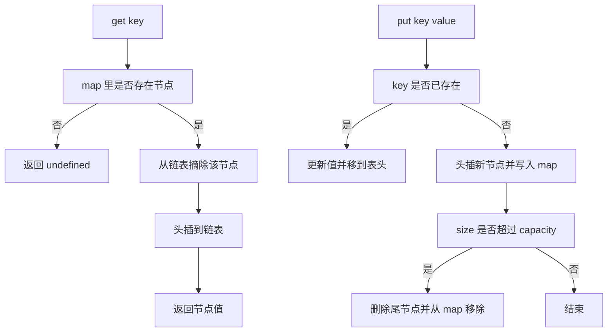
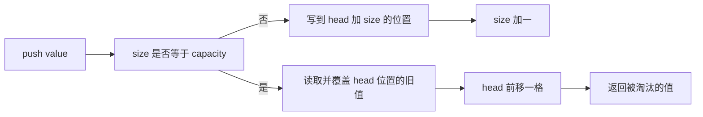

# 手写数据结构（一）：链表、栈、队列、双端队列、环形缓冲

!!! abstract "核心结论"

    - 在 JavaScript 里手写链表的收益远低于 C：每个节点都是独立对象，V8 要为它维护隐藏类与对象头，缓存局部性极差。能用数组就别用链表，除非需要"持有节点引用后 O(1) 删除"，典型场景就是 LRU。
    - 数组的 `push`/`pop` 均摊 O(1)，而 `shift`/`unshift`/`splice` 是 O(n)。队列和双端队列必须用环形数组（下标取模或掩码）实现，才能拿到真正的 O(1)。
    - 哨兵节点（sentinel/dummy）把"空链表、头尾边界"从分支判断变成普通指针操作，是链表实现里最重要的工程技巧，也是 LRU 一次写对的前提。
    - 单调栈/单调队列的本质是"维护尚未被解决的候选集合"并保持其单调性；每个元素至多入栈一次、出栈一次，所以总复杂度 O(n)，这是摊还分析而非平均复杂度。
    - 环形缓冲（ring buffer）是固定容量、可覆盖最旧数据的 FIFO；"空与满"的二义性必须靠额外 size 计数、留空槽、单调递增下标三者之一消解。

## 1. 底层原理：JS 的线性结构跑在什么之上

### 1.1 数组不是"数组"：element kinds 决定常数因子

V8 把数组元素存在独立的 backing store（`FixedArray`/`FixedDoubleArray`）里，元素种类（element kind）粗分为：

- `PACKED_SMI_ELEMENTS`：全是小整数，最快，元素直接按位存。
- `PACKED_DOUBLE_ELEMENTS`：全是 double，可以用 `FixedDoubleArray` 存未装箱的浮点数。
- `PACKED_ELEMENTS`：混入对象/字符串，元素是指针。
- `HOLEY_*`：出现空洞（`delete arr[i]`、`arr[10] = x` 跳号写入、`new Array(n)`）。

关键点：element kind 的转换是单向降级（`SMI -> DOUBLE -> ELEMENTS`，`PACKED -> HOLEY`），不会自动还原。所以 `arr[i] = undefined` 占位虽然不会造出 hole，但会把 `PACKED_SMI` 升级成 `PACKED_ELEMENTS`，后续每个元素都要按指针处理。这类内部细节随版本演进，具体阈值与实现需核对 V8 源码 `src/objects/elements-kind.h` 与官方文档。

想在本地观察，需要带 natives 语法启动，输出格式与版本强相关，不要背输出：

```js
// 运行：node --allow-natives-syntax inspect.js
// 输出格式随 V8 版本变化，仅用于观察，不要写入断言
const a = [1, 2, 3];
%DebugPrint(a);
a[0] = 1.5;
%DebugPrint(a);
a[3] = 'x';
%DebugPrint(a);
```

对本文的意义：`push`/`pop` 在 packed 数组上是均摊 O(1)（容量不足时按倍率扩容并复制），`shift`/`unshift` 需要整体搬移元素，是 O(n)；而"用对象做链表节点"会让每次访问都走一次指针解引用 + 隐藏类检查。

### 1.2 对象节点为什么贵：隐藏类与指针追逐

一个形如 `{ value, prev, next }` 的节点，在 V8 里是：

- 对象头：至少包含指向隐藏类（Map，与 JS 的 `Map` 容器同名但不同物）的指针、`properties` 指针、`elements` 指针，再加若干 in-object 属性槽。
- 属性访问：同一构造函数创建的对象共享隐藏类，属性按固定偏移访问，配合 inline cache 很快；但**每个节点仍是一次独立分配**。
- GC：链表会产生大量小对象，主要落在新生代，增加 scavenger 压力；节点之间不连续，遍历时几乎必然 cache miss。

所以 JS 里"链表"更适合当成逻辑结构来理解（面试考点、LRU 的载体），而不是默认的性能选择。需要局部性时可以用"数组模拟链表"：`next[i]` 存下一条边的下标，指针变成整数下标，一步变两步但省掉对象头。

### 1.3 操作复杂度对照

| 操作 | 数组（packed，V8） | 单向链表 | 双向链表 |
| --- | --- | --- | --- |
| 随机读 `arr[i]` | O(1)，偏移寻址 | O(n) | O(n) |
| 头部插入/删除 | O(n)（`unshift`/`shift`） | O(1) | O(1) |
| 尾部插入/删除 | 均摊 O(1) / O(1) | 无尾指针时 O(n) | O(1) |
| 持有节点引用时删除 | 不适用 | O(n)（要先找前驱） | O(1) |
| 按值查找 | O(n) | O(n) | O(n) |
| 缓存局部性 | 好（连续内存） | 差 | 差 |
| 每个元素的额外开销 | 0 | 1 个对象头 + 1 个 next | 1 个对象头 + 2 个指针 |

## 2. 链表：单哨兵与双哨兵

### 2.1 单向链表与快慢指针

运行环境：Node.js 16+（`require('node:assert')` 的 `node:` 前缀支持请核对官方文档对应版本）。保存为 `singly.js`，执行 `node singly.js`。

```js
'use strict';
const assert = require('node:assert');

class SNode {
  constructor(value, next = null) {
    this.value = value;
    this.next = next;
  }
}

/**
 * 带头哨兵的单向链表。
 * 哨兵 _dummy 不存业务数据，_dummy.next 才是第一个真实节点。
 * 这样 pushFront / popFront 永远不需要判断"表是否为空"。
 */
class SinglyLinkedList {
  constructor() {
    this._dummy = new SNode(undefined);
    this._tail = this._dummy; // 尾指针，让 pushBack 也是 O(1)
    this._size = 0;
  }

  get size() { return this._size; }
  get isEmpty() { return this._size === 0; }

  pushFront(value) {
    this._dummy.next = new SNode(value, this._dummy.next);
    if (this._tail === this._dummy) this._tail = this._dummy.next; // 原本为空
    this._size += 1;
    return this;
  }

  pushBack(value) {
    this._tail.next = new SNode(value, null);
    this._tail = this._tail.next;
    this._size += 1;
    return this;
  }

  popFront() {
    if (this._size === 0) return undefined;
    const node = this._dummy.next;
    this._dummy.next = node.next;
    node.next = null; // 断开引用，帮助 GC
    this._size -= 1;
    if (this._size === 0) this._tail = this._dummy; // 尾指针回退到哨兵
    return node.value;
  }

  toArray() {
    const out = [];
    for (let cur = this._dummy.next; cur !== null; cur = cur.next) out.push(cur.value);
    return out;
  }
}

/** 迭代反转一条无哨兵链表，返回新头。时间 O(n)，空间 O(1)。 */
function reverseList(head) {
  let prev = null;
  let cur = head;
  while (cur !== null) {
    const next = cur.next;
    cur.next = prev;
    prev = cur;
    cur = next;
  }
  return prev;
}

/** Floyd 判圈：有环返回相遇节点，无环返回 null。 */
function detectCycle(head) {
  let slow = head;
  let fast = head;
  while (fast !== null && fast.next !== null) {
    slow = slow.next;
    fast = fast.next.next;
    if (slow === fast) return slow;
  }
  return null;
}

/** 求环的入口。数学事实：从表头到入口的距离 = 从相遇点走到入口的距离（模环长）。 */
function cycleEntry(head) {
  const meet = detectCycle(head);
  if (meet === null) return null;
  let p = head;
  let q = meet;
  while (p !== q) {
    p = p.next;
    q = q.next;
  }
  return p;
}

/** 返回中间节点；偶数长度时返回第二个中间节点。 */
function middleNode(head) {
  let slow = head;
  let fast = head;
  while (fast !== null && fast.next !== null) {
    slow = slow.next;
    fast = fast.next.next;
  }
  return slow;
}
```

验证标准：追加到同文件末尾后执行 `node singly.js`。

```js
// ---------- 验证：单向链表 ----------
const l = new SinglyLinkedList();
assert.strictEqual(l.popFront(), undefined, '空表 popFront 应返回 undefined');
assert.strictEqual(l.size, 0);
l.pushBack(2).pushBack(3).pushFront(1);
assert.deepStrictEqual(l.toArray(), [1, 2, 3]);
assert.strictEqual(l.size, 3);
assert.strictEqual(l.popFront(), 1);
assert.strictEqual(l.popFront(), 2);
assert.deepStrictEqual(l.toArray(), [3]);
assert.strictEqual(l.popFront(), 3);
assert.strictEqual(l.popFront(), undefined);
l.pushFront(9);           // 清空后重新插入，验证 _tail 回退逻辑没写坏
assert.deepStrictEqual(l.toArray(), [9]);
l.pushBack(10);
assert.deepStrictEqual(l.toArray(), [9, 10]);

// ---------- 验证：反转 ----------
const build = (arr) => arr.reduceRight((next, v) => new SNode(v, next), null);
let h = build([1, 2, 3, 4]);
h = reverseList(h);
assert.deepStrictEqual([h.value, h.next.value, h.next.next.value, h.next.next.next.value], [4, 3, 2, 1]);
assert.strictEqual(h.next.next.next.next, null);
assert.strictEqual(reverseList(null), null);

// ---------- 验证：判圈与入口 ----------
assert.strictEqual(detectCycle(build([1, 2, 3])), null);
const c1 = new SNode(1), c2 = new SNode(2), c3 = new SNode(3), c4 = new SNode(4);
c1.next = c2; c2.next = c3; c3.next = c4; c4.next = c2; // 环入口是 c2
assert.strictEqual(detectCycle(c1), c4 === null ? null : detectCycle(c1));
assert.strictEqual(cycleEntry(c1), c2);
assert.strictEqual(cycleEntry(build([1, 2])), null);

// ---------- 验证：中间节点 ----------
assert.strictEqual(middleNode(build([1, 2, 3])).value, 2);
assert.strictEqual(middleNode(build([1, 2, 3, 4])).value, 3); // 偶数取第二个中间
assert.strictEqual(middleNode(build([1])).value, 1);

console.log('singly.js 全部断言通过');
```

预期输出（仅一行）：

```text
singly.js 全部断言通过
```

### 2.2 双向链表：双哨兵 + 节点句柄

双哨兵的写法是 `head <-> n1 <-> ... <-> nk <-> tail`，首尾各一个不存数据的节点。所有插入都可以统一成"在某个已知节点之前插入"，删除统一成"摘除已知节点"，不存在 null 检查。

保存为 `doubly.js`，执行 `node doubly.js`。

```js
'use strict';
const assert = require('node:assert');

class DNode {
  constructor(value) {
    this.value = value;
    this.prev = null;
    this.next = null;
  }
}

class DoublyLinkedList {
  constructor() {
    this._head = new DNode(undefined); // 头哨兵，永不删除
    this._tail = new DNode(undefined); // 尾哨兵，永不删除
    this._head.next = this._tail;
    this._tail.prev = this._head;
    this._size = 0;
  }

  get size() { return this._size; }
  get isEmpty() { return this._size === 0; }

  /** 在 node 之前插入新节点，返回新节点。O(1) */
  _insertBefore(node, value) {
    const n = new DNode(value);
    n.prev = node.prev;
    n.next = node;
    node.prev.next = n;
    node.prev = n;
    this._size += 1;
    return n;
  }

  /** 摘除已知节点，返回其值。O(1)，前提是持有节点引用 */
  _unlink(node) {
    if (node === this._head || node === this._tail) {
      throw new Error('cannot unlink sentinel node');
    }
    node.prev.next = node.next;
    node.next.prev = node.prev;
    node.prev = null;
    node.next = null;
    this._size -= 1;
    return node.value;
  }

  pushFront(value) { return this._insertBefore(this._head.next, value); }
  pushBack(value) { return this._insertBefore(this._tail, value); }
  popFront() { return this._size === 0 ? undefined : this._unlink(this._head.next); }
  popBack() { return this._size === 0 ? undefined : this._unlink(this._tail.prev); }
  peekFront() { return this._size === 0 ? undefined : this._head.next.value; }
  peekBack() { return this._size === 0 ? undefined : this._tail.prev.value; }

  /** 把已存在的节点移到表头。LRU 与"移动热数据"场景的基础操作。 */
  moveToFront(node) {
    this._unlink(node);
    node.prev = this._head;
    node.next = this._head.next;
    node.prev.next = node;
    node.next.prev = node;
    this._size += 1;
    return node;
  }

  removeNode(node) { return this._unlink(node); }

  find(predicate) {
    for (let cur = this._head.next; cur !== this._tail; cur = cur.next) {
      if (predicate(cur.value)) return cur;
    }
    return null;
  }

  toArray() {
    const out = [];
    for (let cur = this._head.next; cur !== this._tail; cur = cur.next) out.push(cur.value);
    return out;
  }

  /** 原地反转：交换每个节点的 prev/next，最后交换两个哨兵的角色 */
  reverseInPlace() {
    if (this._size === 0) return this; // 空表反转会把哨兵串成自环，必须短路
    let cur = this._head;
    while (cur !== null) {
      const next = cur.next;
      cur.next = cur.prev;
      cur.prev = next;
      cur = next;
    }
    const h = this._head;
    this._head = this._tail;
    this._tail = h;
    return this;
  }
}
```

验证标准：追加到同文件末尾后执行 `node doubly.js`。

```js
// ---------- 双向链表实现 ----------
class DNode {
  constructor(value, prev = null, next = null) {
    this.value = value;
    this.prev = prev;
    this.next = next;
  }
}

/**
 * 带头尾哨兵的双向链表。
 * _head 与 _tail 都是哨兵，不存业务数据。
 * 空表时 _head.next === _tail 且 _tail.prev === _head。
 */
class DoublyLinkedList {
  constructor() {
    this._head = new DNode(undefined);
    this._tail = new DNode(undefined);
    this._head.next = this._tail;
    this._tail.prev = this._head;
    this._size = 0;
  }

  get size() { return this._size; }
  get isEmpty() { return this._size === 0; }

  pushFront(value) {
    const node = new DNode(value, this._head, this._head.next);
    this._head.next.prev = node;
    this._head.next = node;
    this._size += 1;
    return this;
  }

  pushBack(value) {
    const node = new DNode(value, this._tail.prev, this._tail);
    this._tail.prev.next = node;
    this._tail.prev = node;
    this._size += 1;
    return this;
  }

  popFront() {
    if (this._size === 0) return undefined;
    return this._unlink(this._head.next);
  }

  popBack() {
    if (this._size === 0) return undefined;
    return this._unlink(this._tail.prev);
  }

  peekFront() {
    return this._size === 0 ? undefined : this._head.next.value;
  }

  peekBack() {
    return this._size === 0 ? undefined : this._tail.prev.value;
  }

  toArray() {
    const out = [];
    for (let cur = this._head.next; cur !== this._tail; cur = cur.next) {
      out.push(cur.value);
    }
    return out;
  }

  find(predicate) {
    for (let cur = this._head.next; cur !== this._tail; cur = cur.next) {
      if (predicate(cur.value)) return cur;
    }
    return null;
  }

  removeNode(node) {
    if (node === null || node === undefined) return undefined;
    return this._unlink(node);
  }

  moveToFront(node) {
    if (node === null || node === undefined) return this;
    if (node === this._head || node === this._tail) {
      throw new Error('cannot move sentinel node');
    }
    if (this._head.next === node) return this;

    // 从原位置摘下，不改变 size
    node.prev.next = node.next;
    node.next.prev = node.prev;

    // 挂到头哨兵之后
    node.prev = this._head;
    node.next = this._head.next;
    this._head.next.prev = node;
    this._head.next = node;
    return this;
  }

  _unlink(node) {
    if (node === this._head || node === this._tail) {
      throw new Error('cannot unlink sentinel node');
    }

    node.prev.next = node.next;
    node.next.prev = node.prev;
    node.prev = null;
    node.next = null;
    this._size -= 1;
    return node.value;
  }

  reverseInPlace() {
    // 空表或单节点无需反转，也避免哨兵之间产生自环
    if (this._size <= 1) return this;

    let cur = this._head;
    while (cur !== null) {
      const next = cur.next;
      cur.next = cur.prev;
      cur.prev = next;
      cur = next;
    }

    const oldHead = this._head;
    this._head = this._tail;
    this._tail = oldHead;
    return this;
  }
}

// ---------- 验证：双向链表 ----------
const d = new DoublyLinkedList();
assert.strictEqual(d.popFront(), undefined);
assert.strictEqual(d.popBack(), undefined);
assert.deepStrictEqual(d.toArray(), []);

d.pushBack(2); d.pushBack(3); d.pushFront(1);
assert.deepStrictEqual(d.toArray(), [1, 2, 3]);
assert.strictEqual(d.peekFront(), 1);
assert.strictEqual(d.peekBack(), 3);
assert.strictEqual(d.size, 3);

// 节点句柄：持有引用后删除是 O(1)，且不破坏哨兵
const n2 = d.find((v) => v === 2);
assert.notStrictEqual(n2, null);
assert.strictEqual(d.removeNode(n2), 2);
assert.deepStrictEqual(d.toArray(), [1, 3]);

// moveToFront
const n3 = d.find((v) => v === 3);
d.moveToFront(n3);
assert.deepStrictEqual(d.toArray(), [3, 1]);
assert.strictEqual(d.size, 2);

// 摘除哨兵必须抛错
assert.throws(() => d._unlink(d._head), /sentinel/);

// 反转
assert.deepStrictEqual(d.toArray(), [3, 1]);
d.reverseInPlace();
assert.deepStrictEqual(d.toArray(), [1, 3]);
d.pushBack(4); // 反转后尾哨兵必须仍然正确
assert.deepStrictEqual(d.toArray(), [1, 3, 4]);
d.pushFront(0);
assert.deepStrictEqual(d.toArray(), [0, 1, 3, 4]);
assert.strictEqual(d.popBack(), 4);
assert.strictEqual(d.popFront(), 0);
assert.deepStrictEqual(d.toArray(), [1, 3]);

// 空表反转不得产生自环
const empty = new DoublyLinkedList();
empty.reverseInPlace();
empty.pushBack(7);
assert.deepStrictEqual(empty.toArray(), [7]);

console.log('doubly.js 全部断言通过');
```

预期输出（仅一行）：

```text
doubly.js 全部断言通过
```

## 3. LRU 缓存：Map 版与"哈希表 + 双向链表"版

### 3.1 原理

LRU（Least Recently Used）要同时满足两件事：按 key O(1) 定位、按最近使用顺序 O(1) 调整。这两件事分别由哈希表和双向链表负责，缺一不可：

- 哈希表只提供"key 到节点"的映射，不维护顺序（用普通对象更糟：整数型 key 会被规范按升序排序，顺序语义直接丢失）。
- 双向链表维护访问顺序，但按 key 查找是 O(n)。
- 单向链表不行：删除节点前需要前驱，除非用"二级指针/前驱指针技巧"额外做工作，实际工程里不值得。



### 3.2 Map 版：依赖规范保证的插入顺序

`Map` 的迭代顺序由 ECMAScript 规范定义为插入顺序，这不是引擎巧合，可以放心依赖。实现只需在访问后"删了再插"。

保存为 `lru-map.js`，执行 `node lru-map.js`。

```js
'use strict';
const assert = require('node:assert');

class LRUCacheMap {
  constructor(capacity) {
    if (!Number.isInteger(capacity) || capacity <= 0) {
      throw new RangeError('capacity must be a positive integer');
    }
    this.capacity = capacity;
    this._map = new Map(); // key -> value，迭代顺序 = 插入顺序 = 最近使用顺序（旧 -> 新）
  }

  get size() { return this._map.size; }

  get(key) {
    if (!this._map.has(key)) return undefined;
    const value = this._map.get(key);
    this._map.delete(key); // 必须先删后插，才是"最近使用"
    this._map.set(key, value);
    return value;
  }

  put(key, value) {
    if (this._map.has(key)) this._map.delete(key);
    this._map.set(key, value);
    if (this._map.size > this.capacity) {
      const oldest = this._map.keys().next().value; // 迭代器第一个就是最旧的
      this._map.delete(oldest);
    }
  }

  has(key) { return this._map.has(key); }

  /** 仅供测试观察，从最旧到最新 */
  keys() { return [...this._map.keys()]; }
}
```

验证标准：追加到同文件末尾后执行 `node lru-map.js`。

```js
// ---------- Map 版 LRU 实现 ----------
class LRUCacheMap {
  constructor(capacity) {
    if (!Number.isInteger(capacity) || capacity <= 0) {
      throw new RangeError('capacity 必须是正整数');
    }
    this._capacity = capacity;
    // Map 的迭代顺序为插入顺序：最早插入的在最前，最新插入的在最后。
    // 因此 keys() 直接按该顺序返回即可表示“最旧 -> 最新”。
    this._map = new Map();
  }

  get size() {
    return this._map.size;
  }

  get(key) {
    if (!this._map.has(key)) return undefined;
    const value = this._map.get(key);
    // get 命中后刷新新鲜度：先删后插，使 key 移到最新端
    this._map.delete(key);
    this._map.set(key, value);
    return value;
  }

  put(key, value) {
    if (this._map.has(key)) {
      // 更新已有 key：覆盖值并刷新到最新端，不增加容量占用
      this._map.delete(key);
      this._map.set(key, value);
      return this;
    }

    // 新 key：容量已满时淘汰最旧的一个
    if (this._map.size >= this._capacity) {
      const oldestKey = this._map.keys().next().value;
      this._map.delete(oldestKey);
    }

    this._map.set(key, value);
    return this;
  }

  keys() {
    // map 的迭代顺序就是从最旧到最新
    return [...this._map.keys()];
  }
}

// ---------- 验证：Map 版 LRU ----------
assert.throws(() => new LRUCacheMap(0), RangeError);
assert.throws(() => new LRUCacheMap(1.5), RangeError);

const c = new LRUCacheMap(2);
assert.strictEqual(c.get('a'), undefined, '未命中返回 undefined');

c.put('a', 1);
c.put('b', 2);
assert.deepStrictEqual(c.keys(), ['a', 'b']);

assert.strictEqual(c.get('a'), 1, 'get 应刷新 a 的新鲜度');
assert.deepStrictEqual(c.keys(), ['b', 'a'], 'a 被移到最新端');

c.put('c', 3); // 淘汰最旧的 b
assert.strictEqual(c.get('b'), undefined);
assert.deepStrictEqual(c.keys(), ['a', 'c']);
assert.strictEqual(c.size, 2);

c.put('a', 100); // 更新已有 key，不应触发淘汰
assert.strictEqual(c.get('a'), 100);
assert.strictEqual(c.size, 2);
assert.deepStrictEqual(c.keys(), ['c', 'a']);

// 覆盖同一个 key 不改变容量
for (let i = 0; i < 10; i++) c.put('a', i);
assert.strictEqual(c.size, 2);
assert.strictEqual(c.get('a'), 9);
assert.strictEqual(c.get('c'), 3);

console.log('lru-map.js 全部断言通过');
```

预期输出（仅一行）：

```text
lru-map.js 全部断言通过
```

### 3.3 双向链表 + 哈希表版

这个版本把顺序维护显式化，是面试里真正想让你写的东西。哈希表存 `key -> 节点`，双向链表存节点顺序，头端最新、尾端最旧。

保存为 `lru-list.js`，执行 `node lru-list.js`。

```js
'use strict';
const assert = require('node:assert');

class LRUNode {
  constructor(key, value) {
    this.key = key;
    this.value = value;
    this.prev = null;
    this.next = null;
  }
}

class LRUCache {
  constructor(capacity) {
    if (!Number.isInteger(capacity) || capacity <= 0) {
      throw new RangeError('capacity must be a positive integer');
    }
    this.capacity = capacity;
    this._map = new Map(); // key -> LRUNode
    this._head = new LRUNode(undefined, undefined); // 哨兵：最新端
    this._tail = new LRUNode(undefined, undefined); // 哨兵：最旧端
    this._head.next = this._tail;
    this._tail.prev = this._head;
  }

  get size() { return this._map.size; }

  /** 把节点摘出来 */
  _detach(node) {
    node.prev.next = node.next;
    node.next.prev = node.prev;
    node.prev = null;
    node.next = null;
  }

  /** 头插到最新端 */
  _prepend(node) {
    node.prev = this._head;
    node.next = this._head.next;
    node.prev.next = node;
    node.next.prev = node;
  }

  /** 摘出再头插 */
  _touch(node) {
    this._detach(node);
    this._prepend(node);
  }

  get(key) {
    const node = this._map.get(key);
    if (node === undefined) return undefined;
    this._touch(node);
    return node.value;
  }

  put(key, value) {
    const existing = this._map.get(key);
    if (existing !== undefined) {
      existing.value = value;
      this._touch(existing);
      return;
    }
    const node = new LRUNode(key, value);
    this._map.set(key, node);
    this._prepend(node);
    if (this._map.size > this.capacity) {
      const victim = this._tail.prev; // 尾哨兵的前驱就是最旧真实节点
      this._detach(victim);
      this._map.delete(victim.key); // 链表节点必须自己记住 key，否则无法从 map 反查
    }
  }

  has(key) { return this._map.has(key); }

  /** 仅供测试观察，从最旧到最新 */
  keysLRUToMRU() {
    const out = [];
    for (let cur = this._tail.prev; cur !== this._head; cur = cur.prev) out.push(cur.key);
    return out;
  }
}
```

验证标准：追加到同文件末尾后执行 `node lru-list.js`。

```js
// ---------- 验证：双向链表版 LRU ----------
assert.throws(() => new LRUCache(0), RangeError);

const c = new LRUCache(3);
assert.strictEqual(c.get('x'), undefined);

c.put('a', 1); c.put('b', 2); c.put('c', 3);
assert.deepStrictEqual(c.keysLRUToMRU(), ['a', 'b', 'c']);
assert.strictEqual(c.size, 3);

assert.strictEqual(c.get('a'), 1);
assert.deepStrictEqual(c.keysLRUToMRU(), ['b', 'c', 'a']);

c.put('d', 4); // 淘汰 b
assert.strictEqual(c.has('b'), false);
assert.deepStrictEqual(c.keysLRUToMRU(), ['c', 'a', 'd']);
assert.strictEqual(c.size, 3);

c.put('c', 33); // 更新已有 key，只刷新新鲜度，不淘汰
assert.strictEqual(c.get('c'), 33);
assert.deepStrictEqual(c.keysLRUToMRU(), ['a', 'd', 'c']);
assert.strictEqual(c.size, 3);

// 容量为 1 的极端情况：链表结构必须仍然正确
const one = new LRUCache(1);
one.put('k1', 'v1');
assert.strictEqual(one.get('k1'), 'v1');
one.put('k2', 'v2');
assert.strictEqual(one.has('k1'), false);
assert.strictEqual(one.get('k2'), 'v2');
assert.deepStrictEqual(one.keysLRUToMRU(), ['k2']);

// 与 Map 版做随机对拍
const rnd = (() => {
  let s = 20240513;
  return () => {
    s ^= s << 13; s >>>= 0;
    s ^= s >>> 17;
    s ^= s << 5; s >>>= 0;
    return s / 2 ** 32;
  };
})();
const A = new LRUCache(4);
const B = new LRUCacheMap(4);
for (let i = 0; i < 20000; i++) {
  const key = Math.floor(rnd() * 8); // key 空间大于容量，制造淘汰
  const op = rnd();
  if (op < 0.5) {
    assert.strictEqual(A.get(key), B.get(key), `get 不一致 key=${key} i=${i}`);
  } else {
    const v = i;
    A.put(key, v);
    B.put(key, v);
  }
  assert.strictEqual(A.size, B.size);
  assert.deepStrictEqual(A.keysLRUToMRU(), B.keys());
}
console.log('lru-list.js 全部断言通过');
```

预期输出（仅一行）：

```text
lru-list.js 全部断言通过
```

### 3.4 两种 LRU 实现对比

| 维度 | Map 版 | 双向链表 + 哈希表版 |
| --- | --- | --- |
| 代码量 | 约 25 行 | 约 70 行 |
| get/put 复杂度 | O(1) | O(1) |
| 常数因子 | 更小（无链表指针追逐） | 更大（每个 entry 至少多 2 个指针） |
| 内存 | 每个 entry 1 个 Map entry | Map entry + 1 个节点对象 |
| 顺序维护 | 依赖规范定义的插入顺序 | 显式双向链表 |
| 可扩展性 | 想加 LFU、TTL、命中统计就要绕过 Map 顺序 | 节点结构可自由扩展，便于做 segmented LRU |
| 适用场景 | 业务里 90% 的缓存需求 | 面试、需要精细控制顺序语义的库内部 |

## 4. 栈与单调栈

### 4.1 栈：数组即最优解

在 JS 里没有理由手写链表栈：`push`/`pop` 均摊 O(1)，且内存连续。数组栈就是最优实现。真正需要"手写栈"的场合是**单调栈**这种带不变式的栈。

```js
'use strict';
// 数组栈：接口即 push/pop/peek/length，直接用 Array 即可，不需要包装类。
const stack = [];
stack.push(1);
stack.push(2);
console.assert(stack[stack.length - 1] === 2, 'peek 应为 2');
console.assert(stack.pop() === 2, 'pop 应为 2');
console.assert(stack.length === 1, '长度应为 1');
console.assert(stack.pop() === 1);
console.assert(stack.pop() === undefined, '空栈 pop 返回 undefined');
console.log('array-stack.js 全部断言通过');
```

预期输出（仅一行）：

```text
array-stack.js 全部断言通过
```

### 4.2 单调栈：把 O(n^2) 的枚举压成 O(n)

问题原型：对每个位置 i，求右侧第一个比 `nums[i]` 大的元素（Next Greater Element）。暴力是 O(n^2)。

单调栈的不变式：**栈内存放的是"还没找到答案的下标"，且它们对应的值从栈底到栈顶单调递减**。当 `nums[i]` 到来时，所有值小于 `nums[i]` 的栈顶下标都找到了答案 `nums[i]`，弹出并结算。每个下标最多入栈一次、出栈一次，故总额外操作 O(n)。

保存为 `monotonic-stack.js`，执行 `node monotonic-stack.js`。

```js
'use strict';
const assert = require('node:assert');

/**
 * 下一个更大元素：返回数组，res[i] 是 nums[i] 右侧第一个更大元素，不存在则 -1。
 * 栈内保存下标，对应值从栈底到栈顶严格递减。
 */
function nextGreaterElement(nums) {
  const res = new Array(nums.length).fill(-1);
  const stack = [];
  for (let i = 0; i < nums.length; i++) {
    while (stack.length > 0 && nums[stack[stack.length - 1]] < nums[i]) {
      res[stack.pop()] = nums[i];
    }
    stack.push(i);
  }
  return res;
}

/** 每日温度：返回需要等待的天数，等不到为 0。与上面同构，只是结算的是下标差。 */
function dailyTemperatures(temps) {
  const res = new Array(temps.length).fill(0);
  const stack = []; // 存下标
  for (let i = 0; i < temps.length; i++) {
    while (stack.length > 0 && temps[stack[stack.length - 1]] < temps[i]) {
      const j = stack.pop();
      res[j] = i - j;
    }
    stack.push(i);
  }
  return res;
}

/** 暴力参考实现，用于对拍 */
function nextGreaterBruteForce(nums) {
  const res = [];
  for (let i = 0; i < nums.length; i++) {
    let found = -1;
    for (let j = i + 1; j < nums.length; j++) {
      if (nums[j] > nums[i]) { found = nums[j]; break; }
    }
    res.push(found);
  }
  return res;
}
```

验证标准：追加到同文件末尾后执行 `node monotonic-stack.js`。

```js
// ---------- 实现：下一个更大元素 ----------
function nextGreaterElement(nums) {
  const result = new Array(nums.length).fill(-1);
  const stack = []; // 存下标，栈内对应的值单调不增
  for (let i = 0; i < nums.length; i++) {
    // 当前值比栈顶下标对应的值大，则当前值就是栈顶元素的“下一个更大元素”
    while (stack.length > 0 && nums[stack[stack.length - 1]] < nums[i]) {
      const index = stack.pop();
      result[index] = nums[i];
    }
    stack.push(i);
  }
  return result;
}

// ---------- 实现：每日温度 ----------
function dailyTemperatures(temperatures) {
  const result = new Array(temperatures.length).fill(0);
  const stack = []; // 存下标，栈内对应的温度单调不增
  for (let i = 0; i < temperatures.length; i++) {
    // 严格更高才出栈，相等不算更高
    while (stack.length > 0 && temperatures[stack[stack.length - 1]] < temperatures[i]) {
      const index = stack.pop();
      result[index] = i - index;
    }
    stack.push(i);
  }
  return result;
}

// ---------- 实现：暴力参考，用于对拍 ----------
function nextGreaterBruteForce(nums) {
  const result = new Array(nums.length).fill(-1);
  for (let i = 0; i < nums.length; i++) {
    for (let j = i + 1; j < nums.length; j++) {
      if (nums[j] > nums[i]) {
        result[i] = nums[j];
        break;
      }
    }
  }
  return result;
}

// ---------- 验证：下一个更大元素 ----------
assert.deepStrictEqual(nextGreaterElement([2, 1, 2, 4, 3]), [4, 2, 4, -1, -1]);
assert.deepStrictEqual(nextGreaterElement([]), []);
assert.deepStrictEqual(nextGreaterElement([5]), [-1]);
assert.deepStrictEqual(nextGreaterElement([1, 2, 3]), [2, 3, -1]);
assert.deepStrictEqual(nextGreaterElement([3, 2, 1]), [-1, -1, -1]);
assert.deepStrictEqual(nextGreaterElement([2, 2, 3]), [3, 3, -1], '相等不算更大');

// ---------- 验证：每日温度 ----------
assert.deepStrictEqual(
  dailyTemperatures([73, 74, 75, 71, 69, 72, 76, 73]),
  [1, 1, 4, 2, 1, 1, 0, 0]
);
assert.deepStrictEqual(dailyTemperatures([30, 40, 50, 60]), [1, 1, 1, 0]);
assert.deepStrictEqual(dailyTemperatures([30, 30, 30]), [0, 0, 0]);

// ---------- 对拍：确定性伪随机 ----------
let seed = 987654321;
function rnd() {
  seed ^= seed << 13; seed >>>= 0;
  seed ^= seed >>> 17;
  seed ^= seed << 5; seed >>>= 0;
  return seed / 2 ** 32;
}
for (let t = 0; t < 2000; t++) {
  const n = Math.floor(rnd() * 30);
  const nums = Array.from({ length: n }, () => Math.floor(rnd() * 20) - 10);
  assert.deepStrictEqual(nextGreaterElement(nums), nextGreaterBruteForce(nums));
}

console.log('monotonic-stack.js 全部断言通过');
```

预期输出（仅一行）：

```text
monotonic-stack.js 全部断言通过
```

### 4.3 单调栈与数组栈的行为差异

| 维度 | 普通栈 | 单调栈 |
| --- | --- | --- |
| 操作 | push/pop/peek/top | 同左，但 push 前要先 pop 掉破坏单调性的元素 |
| 不变式 | 无 | 栈内元素（或其下标对应的值）单调 |
| 单次操作最坏 | O(1) | 可能一次弹出 k 个 |
| 总复杂度 | O(n) | O(n)，摊还分析（每个元素至多入栈一次出栈一次） |
| 典型题目 | 括号匹配、表达式求值、DFS 模拟 | 下一个更大/更小元素、柱状图最大矩形、接雨水 |

## 5. 队列与双端队列

### 5.1 为什么 `arr.shift()` 不能做队列

`Array.prototype.shift` 会把剩余元素整体左移（V8 在快速元素路径上做的是元素搬移；当数组很大时可能切换到字典元素等其它表示，具体阈值与策略随版本变化，需核对 V8 源码）。因此"数组 + push/shift"实现的队列，出队是 O(n)，n 次出队就是 O(n^2)。

正确做法是环形数组：用一段固定长度的 buffer，`head` 指向队首，物理位置用 `(head + i) mod capacity` 计算。当容量不足时扩容并重排一次（均摊 O(1)）。

### 5.2 环形数组双端队列（ArrayDeque）

容量取 2 的幂，就可以用位与代替取模：`(head + i) & (capacity - 1)`。这依赖"非负整数对 2 的幂取模等于按位与"，以及 JS 位运算按 32 位补码处理负数（所以 `(0 - 1) & 7 === 7`）。

保存为 `deque.js`，执行 `node deque.js`。

```js
'use strict';
const assert = require('node:assert');

const MAX_CAPACITY = 2 ** 30; // 位运算在 int32 范围内有效，超过就无法用掩码

class ArrayDeque {
  constructor(initialCapacity = 8) {
    if (!Number.isInteger(initialCapacity) || initialCapacity < 1) {
      throw new RangeError('initialCapacity must be a positive integer');
    }
    let cap = 1;
    while (cap < initialCapacity) cap *= 2; // 向上取到 2 的幂
    if (cap > MAX_CAPACITY) throw new RangeError('capacity too large');
    this._cap = cap;
    this._mask = cap - 1;
    this._buf = new Array(cap);
    this._head = 0; // 队首元素的物理下标
    this._size = 0;
  }

  get size() { return this._size; }
  get capacity() { return this._cap; }
  get isEmpty() { return this._size === 0; }

  /** 逻辑下标 i 对应的物理下标 */
  _at(i) { return (this._head + i) & this._mask; }

  _grow() {
    const newCap = this._cap * 2;
    if (newCap > MAX_CAPACITY) throw new RangeError('deque capacity limit exceeded');
    const newBuf = new Array(newCap);
    for (let i = 0; i < this._size; i++) {
      newBuf[i] = this._buf[this._at(i)]; // 重排成从 0 开始，head 归零
    }
    this._buf = newBuf;
    this._cap = newCap;
    this._mask = newCap - 1;
    this._head = 0;
  }

  _ensure(need) {
    if (need > this._cap) this._grow();
  }

  pushBack(value) {
    this._ensure(this._size + 1);
    this._buf[(this._head + this._size) & this._mask] = value;
    this._size += 1;
    return this;
  }

  pushFront(value) {
    this._ensure(this._size + 1);
    this._head = (this._head - 1) & this._mask; // 负数补码下等价于 mod cap
    this._buf[this._head] = value;
    this._size += 1;
    return this;
  }

  popFront() {
    if (this._size === 0) return undefined;
    const v = this._buf[this._head];
    this._buf[this._head] = undefined; // 断开引用；注意这会让该位置产生空洞语义，见常见陷阱
    this._head = (this._head + 1) & this._mask;
    this._size -= 1;
    return v;
  }

  popBack() {
    if (this._size === 0) return undefined;
    const idx = this._at(this._size - 1);
    const v = this._buf[idx];
    this._buf[idx] = undefined;
    this._size -= 1;
    return v;
  }

  /** 双端队列支持 O(1) 随机访问 */
  get(i) {
    if (!Number.isInteger(i) || i < 0 || i >= this._size) return undefined;
    return this._buf[this._at(i)];
  }

  set(i, value) {
    if (!Number.isInteger(i) || i < 0 || i >= this._size) return false;
    this._buf[this._at(i)] = value;
    return true;
  }

  peekFront() { return this._size === 0 ? undefined : this._buf[this._head]; }
  peekBack() { return this._size === 0 ? undefined : this._buf[this._at(this._size - 1)]; }

  toArray() {
    const out = new Array(this._size);
    for (let i = 0; i < this._size; i++) out[i] = this._buf[this._at(i)];
    return out;
  }

  *[Symbol.iterator]() {
    for (let i = 0; i < this._size; i++) yield this._buf[this._at(i)];
  }
}
```

验证标准：追加到同文件末尾后执行 `node deque.js`。

```js
// ---------- 验证：基础行为 ----------
const d = new ArrayDeque(2);
assert.strictEqual(d.capacity, 2, '容量向上取到 2 的幂');
assert.strictEqual(d.popFront(), undefined);
assert.strictEqual(d.popBack(), undefined);
assert.strictEqual(d.get(0), undefined);
assert.strictEqual(d.set(0, 1), false, '越界 set 必须失败');

d.pushBack(1).pushBack(2);
assert.deepStrictEqual(d.toArray(), [1, 2]);
assert.strictEqual(d.size, 2);
d.pushFront(0);          // 触发扩容
assert.deepStrictEqual(d.toArray(), [0, 1, 2]);
assert.strictEqual(d.capacity, 4);
d.pushBack(3);
assert.deepStrictEqual(d.toArray(), [0, 1, 2, 3]);
assert.strictEqual(d.peekFront(), 0);
assert.strictEqual(d.peekBack(), 3);
assert.strictEqual(d.get(2), 2);
assert.strictEqual(d.get(-1), undefined);
assert.strictEqual(d.set(2, 22), true);
assert.deepStrictEqual(d.toArray(), [0, 1, 22, 3]);

assert.strictEqual(d.popFront(), 0);
assert.strictEqual(d.popBack(), 3);
assert.deepStrictEqual(d.toArray(), [1, 22]);
assert.strictEqual(d.size, 2);

// 头部环绕：head 变成非 0 之后再扩容
const e = new ArrayDeque(4);
e.pushBack('a').pushBack('b').pushBack('c');
assert.strictEqual(e.popFront(), 'a'); // head 前移
assert.strictEqual(e.popFront(), 'b'); // head 前移
e.pushBack('d'); e.pushBack('e');      // 物理上会绕回数组头部
assert.deepStrictEqual(e.toArray(), ['c', 'd', 'e']);
assert.strictEqual(e.popFront(), 'c');
assert.strictEqual(e.popBack(), 'e');
assert.deepStrictEqual(e.toArray(), ['d']);

// ---------- 验证：与数组参考实现随机对拍 ----------
const ref = [];
const dq = new ArrayDeque(1); // 故意从最小容量开始，逼迫频繁扩容
let seed = 13579;
function rnd() {
  seed ^= seed << 13; seed >>>= 0;
  seed ^= seed >>> 17;
  seed ^= seed << 5; seed >>>= 0;
  return seed / 2 ** 32;
}
for (let i = 0; i < 20000; i++) {
  const op = Math.floor(rnd() * 4);
  const v = i;
  if (op === 0) { ref.push(v); dq.pushBack(v); }
  else if (op === 1) { ref.unshift(v); dq.pushFront(v); }
  else if (op === 2) { assert.strictEqual(dq.popFront(), ref.length ? ref.shift() : undefined); }
  else { assert.strictEqual(dq.popBack(), ref.length ? ref.pop() : undefined); }
  assert.strictEqual(dq.size, ref.length, `size 不一致 i=${i}`);
  assert.deepStrictEqual(dq.toArray(), ref, `内容不一致 i=${i}`);
  if (ref.length > 0) {
    const idx = Math.floor(rnd() * ref.length);
    assert.strictEqual(dq.get(idx), ref[idx]);
  }
  assert.deepStrictEqual([...dq], ref); // 迭代器与参考一致
}
console.log('deque.js 全部断言通过');
```

预期输出（仅一行）：

```text
deque.js 全部断言通过
```

### 5.3 链表队列（对照用）

如果只是需要 FIFO，也可以用"哨兵 + 尾指针"的单向链表实现，`enqueue` 在尾部、`dequeue` 在头部，都是 O(1)。代价是每个元素一次对象分配，比环形数组慢得多。本文 2.1 节的 `SinglyLinkedList` 就是现成的链表队列（`pushBack` + `popFront`），不再重复。

### 5.4 单调队列：滑动窗口最大值

单调队列 = 双端队列 + 单调性。窗口右边界扩张时，从队尾弹出所有不大于新元素的候选；左边界收缩时，如果队首下标过期就从队首弹出。队首永远是窗口最大值。

实现上用"数组 + head/tail 双指针"避免 `shift` 的搬移成本。

保存为 `monotonic-deque.js`，执行 `node monotonic-deque.js`。

```js
'use strict';
const assert = require('node:assert');

/**
 * 滑动窗口最大值。
 * dq 是环形意义上的下标队列：存储区间 [head, tail)，值为 nums 的下标，对应值单调递减。
 * 每个下标至多入队一次、出队一次，总复杂度 O(n)。
 */
function maxSlidingWindow(nums, k) {
  if (!Number.isInteger(k) || k <= 0) throw new RangeError('k must be a positive integer');
  const n = nums.length;
  if (n === 0 || k > n) return [];
  const dq = new Array(n); // 每个下标最多入队一次，容量 n 足够
  let head = 0;
  let tail = 0;
  const res = [];
  for (let i = 0; i < n; i++) {
    // 队尾所有不大于 nums[i] 的候选都不可能是未来窗口的最大值，弹出
    while (tail > head && nums[dq[tail - 1]] <= nums[i]) tail -= 1;
    dq[tail] = i;
    tail += 1;
    // 队首下标若已滑出窗口，弹出
    if (dq[head] <= i - k) head += 1;
    // 窗口第一次形成完整长度为 k 时开始记录
    if (i >= k - 1) res.push(nums[dq[head]]);
  }
  return res;
}

/** 暴力参考实现 */
function maxSlidingWindowBruteForce(nums, k) {
  const res = [];
  for (let i = 0; i + k <= nums.length; i++) {
    let m = -Infinity;
    for (let j = i; j < i + k; j++) if (nums[j] > m) m = nums[j];
    res.push(m);
  }
  return res;
}
```

验证标准：追加到同文件末尾后执行 `node monotonic-deque.js`。

```js
// ---------- 验证：滑动窗口最大值 ----------
assert.deepStrictEqual(maxSlidingWindow([1, 3, -1, -3, 5, 3, 6, 7], 3), [3, 3, 5, 5, 6, 7]);
assert.deepStrictEqual(maxSlidingWindow([1], 1), [1]);
assert.deepStrictEqual(maxSlidingWindow([1, 2], 5), [], 'k 大于长度返回空');
assert.deepStrictEqual(maxSlidingWindow([], 1), []);
assert.deepStrictEqual(maxSlidingWindow([5, 4, 3, 2, 1], 2), [5, 4, 3, 2], '单调递减序列');
assert.deepStrictEqual(maxSlidingWindow([1, 2, 3, 4, 5], 2), [2, 3, 4, 5], '单调递增序列');
assert.deepStrictEqual(maxSlidingWindow([7, 7, 7], 2), [7, 7], '相等元素');
assert.throws(() => maxSlidingWindow([1, 2], 0), RangeError);

// ---------- 对拍 ----------
let seed = 24680;
function rnd() {
  seed ^= seed << 13; seed >>>= 0;
  seed ^= seed >>> 17;
  seed ^= seed << 5; seed >>>= 0;
  return seed / 2 ** 32;
}
for (let t = 0; t < 2000; t++) {
  const n = 1 + Math.floor(rnd() * 20);
  const k = 1 + Math.floor(rnd() * n);
  const nums = Array.from({ length: n }, () => Math.floor(rnd() * 40) - 20);
  assert.deepStrictEqual(maxSlidingWindow(nums, k), maxSlidingWindowBruteForce(nums, k));
}
console.log('monotonic-deque.js 全部断言通过');
```

预期输出（仅一行）：

```text
monotonic-deque.js 全部断言通过
```

## 6. 环形缓冲区（Ring Buffer）

### 6.1 原理

环形缓冲区是**固定容量**的 FIFO：写入时如果已满，按策略覆盖最旧的数据（overwrite）或拒绝写入（throw）。它不做扩容，因此不会有偶发的 O(n) 重排，常用于日志环形队列、音频/视频流缓冲、监控指标滑动窗口、内存紧张的嵌入式场景。

三个核心字段：`buf`（定长数组）、`head`（最旧元素的物理下标）、`size`（当前元素个数）。写入位置是 `(head + size) % capacity`。



注意：容量任意（不要求 2 的幂）时用 `%` 更直观；若容量固定为 2 的幂且是热点路径，可换成掩码 `& (cap - 1)`。

### 6.2 完整实现

保存为 `ring-buffer.js`，执行 `node ring-buffer.js`。

```js
'use strict';
const assert = require('node:assert');

class RingBuffer {
  /**
   * @param {number} capacity 固定容量，正整数
   * @param {'overwrite'|'throw'} overflowPolicy 满时策略
   */
  constructor(capacity, overflowPolicy = 'overwrite') {
    if (!Number.isInteger(capacity) || capacity < 1) {
      throw new RangeError('capacity must be a positive integer');
    }
    if (overflowPolicy !== 'overwrite' && overflowPolicy !== 'throw') {
      throw new TypeError('unknown overflowPolicy');
    }
    this._cap = capacity;
    this._buf = new Array(capacity);
    this._head = 0; // 最旧元素的位置
    this._size = 0;
    this._policy = overflowPolicy;
    this._totalWrites = 0; // 累计写入次数，与 size 不同
    this._totalEvictions = 0;
  }

  get capacity() { return this._cap; }
  get size() { return this._size; }
  get isEmpty() { return this._size === 0; }
  get isFull() { return this._size === this._cap; }
  get totalWrites() { return this._totalWrites; }
  get totalEvictions() { return this._totalEvictions; }

  /**
   * 写入一个值。
   * overwrite 模式：满时覆盖最旧值，返回被淘汰的值；未满返回 undefined。
   * throw 模式：满时抛 RangeError。
   */
  push(value) {
    if (this.isFull()) {
      if (this._policy === 'throw') throw new RangeError('ring buffer is full');
      const idx = this._head;
      const evicted = this._buf[idx];
      this._buf[idx] = value;
      this._head = (this._head + 1) % this._cap;
      this._totalWrites += 1;
      this._totalEvictions += 1;
      return evicted;
    }
    this._buf[(this._head + this._size) % this._cap] = value;
    this._size += 1;
    this._totalWrites += 1;
    return undefined;
  }

  /** 取出并删除最旧的值 */
  shift() {
    if (this._size === 0) return undefined;
    const v = this._buf[this._head];
    this._buf[this._head] = undefined;
    this._head = (this._head + 1) % this._cap;
    this._size -= 1;
    return v;
  }

  /** 查看最旧值，不删除 */
  peek() { return this._size === 0 ? undefined : this._buf[this._head]; }

  /** 按下标访问，0 是最旧 */
  at(i) {
    if (!Number.isInteger(i) || i < 0 || i >= this._size) return undefined;
    return this._buf[(this._head + i) % this._cap];
  }

  toArray() {
    const out = new Array(this._size);
    for (let i = 0; i < this._size; i++) out[i] = this._buf[(this._head + i) % this._cap];
    return out;
  }

  *[Symbol.iterator]() {
    for (let i = 0; i < this._size; i++) yield this._buf[(this._head + i) % this._cap];
  }

  clear() {
    this._buf = new Array(this._cap);
    this._head = 0;
    this._size = 0;
  }
}
```

验证标准：追加到同文件末尾后执行 `node ring-buffer.js`。

```js
// ---------- 验证：overwrite 模式 ----------
assert.throws(() => new RingBuffer(0), RangeError);
assert.throws(() => new RingBuffer(1, 'drop'), TypeError);

const rb = new RingBuffer(3);
assert.strictEqual(rb.shift(), undefined);
assert.strictEqual(rb.peek(), undefined);
assert.strictEqual(rb.at(0), undefined);

assert.strictEqual(rb.push(1), undefined, '未满时无淘汰');
assert.strictEqual(rb.push(2), undefined);
assert.strictEqual(rb.push(3), undefined);
assert.strictEqual(rb.isFull, true);
assert.deepStrictEqual(rb.toArray(), [1, 2, 3]);
assert.strictEqual(rb.size, 3);
assert.strictEqual(rb.capacity, 3);

assert.strictEqual(rb.push(4), 1, '满时淘汰最旧的 1');
assert.deepStrictEqual(rb.toArray(), [2, 3, 4]);
assert.strictEqual(rb.shift(), 2);
assert.deepStrictEqual(rb.toArray(), [3, 4]);
assert.strictEqual(rb.push(5), undefined, '腾出空间后不再淘汰');
assert.deepStrictEqual(rb.toArray(), [3, 4, 5]);
assert.strictEqual(rb.push(6), 3);
assert.deepStrictEqual(rb.toArray(), [4, 5, 6]);
assert.strictEqual(rb.peek(), 4);
assert.strictEqual(rb.at(2), 6);
assert.strictEqual(rb.at(3), undefined);
assert.strictEqual(rb.totalWrites, 6);
assert.strictEqual(rb.totalEvictions, 2);

rb.clear();
assert.strictEqual(rb.size, 0);
assert.deepStrictEqual(rb.toArray(), []);
rb.push('a');
assert.deepStrictEqual(rb.toArray(), ['a'], 'clear 后仍可正常写入');

// ---------- 验证：throw 模式 ----------
const tb = new RingBuffer(1, 'throw');
tb.push('x');
assert.throws(() => tb.push('y'), RangeError);
assert.deepStrictEqual(tb.toArray(), ['x'], 'throw 模式下数据不能被破坏');
assert.strictEqual(tb.shift(), 'x');
tb.push('z');
assert.deepStrictEqual(tb.toArray(), ['z']);

// ---------- 验证：环形覆盖 100 次，模拟"最近 N 条日志" ----------
const log = new RingBuffer(5);
for (let i = 1; i <= 100; i++) log.push(i);
assert.deepStrictEqual(log.toArray(), [96, 97, 98, 99, 100]);
assert.strictEqual(log.size, 5);

// ---------- 与数组参考实现随机对拍 ----------
const ref = [];
const rb2 = new RingBuffer(4);
let seed = 11223344;
function rnd() {
  seed ^= seed << 13; seed >>>= 0;
  seed ^= seed >>> 17;
  seed ^= seed << 5; seed >>>= 0;
  return seed / 2 ** 32;
}
for (let i = 0; i < 20000; i++) {
  if (rnd() < 0.7) {
    const expected = ref.length === 4 ? ref.shift() : undefined; // 参考实现：满则先淘汰最旧
    assert.strictEqual(rb2.push(i), expected, `淘汰值不一致 i=${i}`);
    ref.push(i);
  } else {
    assert.strictEqual(rb2.shift(), ref.length ? ref.shift() : undefined);
  }
  assert.deepStrictEqual(rb2.toArray(), ref, `内容不一致 i=${i}`);
  assert.strictEqual(rb2.size, ref.length);
}
console.log('ring-buffer.js 全部断言通过');
```

预期输出（仅一行）：

```text
ring-buffer.js 全部断言通过
```

### 6.3 ArrayDeque、RingBuffer、数组队列的取舍

| 维度 | 数组 + push/shift 队列 | ArrayDeque（环形数组双端队列） | RingBuffer（环形缓冲） |
| --- | --- | --- | --- |
| 容量 | 动态 | 动态，按 2 的幂扩容 | 固定，不扩容 |
| 出队复杂度 | O(n) | O(1) 均摊（扩容时偶发 O(n)） | O(1) |
| 双端操作 | 一端 O(1)、一端 O(n) | 两端均 O(1) | 通常只保证一端写一端读 |
| 随机访问 | O(1) | O(1) | O(1)（本文实现） |
| 满时行为 | 不适用 | 扩容 | 覆盖最旧 或 抛错 |
| 内存上界 | 无 | 无（约 2 倍于元素数） | 严格等于 capacity |
| 典型用途 | 小规模、偶发使用 | 单调队列、滑动窗口、BFS 队列 | 日志环形队列、流式缓冲、指标采样 |

## 7. 常见陷阱

- **`arr.shift()` 当队列用**：n 次出队是 O(n^2)，大数组上表现为"代码没错但一跑就卡"。判断信号是 CPU profile 落在 `Array.prototype.shift`。
- **数字 key 用普通对象做 LRU**：`Object.keys` 会把整数型属性名按升序排在字符串键之前，顺序语义与"插入顺序"不一致。要么用 `Map`，要么用显式链表。
- **Map 版 LRU 忘记 `delete` 再 `set`**：`map.set` 更新已存在的 key 不会改变其迭代位置，key 的新鲜度不会被刷新，导致错误的淘汰对象。
- **双向链表节点不存 key**：从链表淘汰最旧节点时，必须能用节点反查哈希表并删除，否则哈希表会无限增长（内存泄漏）且出现"幽灵命中"。
- **哨兵节点被误删或被遍历到**：循环条件必须是 `cur !== this._tail`（双哨兵）或 `cur !== null`（单哨兵尾后为 null），不能在 `_unlink` 里接受哨兵。
- **空表调用 `reverseInPlace`**：交换哨兵的实现如果不对长度为 0 短路，会得到 `head.next === head` 的自环，后续所有操作死循环或数据错乱。
- **环形数组容量不是 2 的幂却用掩码**：`& (cap - 1)` 只对 2 的幂等价于取模，否则结果错误。容量任意时老实用 `%`。
- **环形数组扩容后忘记重排 `head`**：扩容时必须把逻辑顺序 0..size-1 依次拷到新 buffer 的下标 0..，并令 `head = 0`，否则逻辑序与物理序不再对应。
- **`(head - 1) & mask` 被误认为会得到负数**：JS 位运算先转 int32 补码，`-1 & 7 === 7`。这依赖 `cap` 不超过 `2^30`，超过就溢出，所以要在扩容时显式检查上限。
- **弹出元素后不清理引用**：`this._buf[idx] = undefined` 能帮助 GC 回收对象；但如果该 buffer 是 SMI 数组，写 `undefined` 会把 element kind 升到 `PACKED_ELEMENTS`，属于"用性能换内存安全"的取舍，需要实测决定。
- **环形缓冲的"空/满"二义性**：不维护 `size` 时，`head === tail` 既可能是空也可能是满。三种消解方案：维护 `size` 计数（本文方案）、永远留一个空槽、或者用不取模的单调递增写指针再加一个读指针。
- **`throw` 模式下先写后判满**：如果先把新值写进 buffer 才发现满了再抛错，旧数据已经被破坏。判满必须在写入之前。

## 8. 面试题与答题要点

**1. 为什么 `arr.shift()` 是 O(n)，怎么实现 O(1) 队列？**

要点：`shift` 要把剩余 n-1 个元素整体前移（或在 elements backing store 上做等价搬移），所以单次 O(n)；V8 在大数组上可能切换到别的元素表示，具体策略需核对源码。O(1) 队列用环形数组：`head` 逻辑指针 + `(head + i) & (cap - 1)` 定位，容量不足时按 2 的幂扩容并一次性重排，均摊 O(1)。补充：链表队列也能 O(1)，但每元素一次对象分配，常数更大；JS 里优先环形数组。

**2. LRU 为什么必须是"哈希表 + 双向链表"？单向链表行不行？**

要点：哈希表提供 O(1) 定位但无顺序，双向链表提供 O(1) 顺序调整但查找 O(n)，两者互补。单向链表的问题是删除需要前驱：要么 O(n) 找前驱，要么把节点设计成"只有 next 的哈希链 + 额外前驱数组"，要么用更复杂的技巧，成本都高于直接在节点里加一个 `prev` 指针。另一个常被追问的点：节点里必须存 key，否则淘汰时无法从哈希表删除。

**3. 哨兵节点（dummy/sentinel）解决了什么？**

要点：把"空链表"和"头尾边界"这两种特殊情况变成普通情况，从而消除插入/删除里的分支。头哨兵让 `pushFront` 与"在任意节点前插入"复用同一段代码；双哨兵让 `head`/`tail` 永不为 null，遍历条件统一为 `cur !== tail`。代价是多两个节点对象和一点点内存；收益是代码短、分支少、不易写错。典型对比是"有哨兵的反转/删除"和"无哨兵的删除头节点要单独处理 `head = head.next`"。

**4. 单调栈为什么是 O(n)？它和单调队列什么关系？**

要点：不要答"平均 O(n)"，要答摊还分析——每个下标恰好入栈一次、出栈一次，`while` 循环的总执行次数不超过 n，所以是 O(n) 最坏（对总操作序列而言）。不变式是"栈内是尚未被解决的候选，且保持单调"。单调队列是它的双端版本：除了尾部维护单调性，还要从头部淘汰过期下标，用于滑动窗口类问题。注意"下一个更小元素"用递增栈，"下一个更大元素"用递减栈，方向由你要淘汰谁决定。

**5. 环形缓冲如何区分"空"和"满"？**

要点：三种标准方案。其一，维护 `size` 计数，`size === 0` 为空、`size === capacity` 为满，读写位置都靠 `(head + size) % cap` 推导（本文采用）。其二，牺牲一个槽位：`(write + 1) % cap === read` 视为满，容量为 capacity-1，好处是不需要额外计数。其三，指针不取模、单调递增（用无符号 32/64 位自然回绕），用 `write - read` 得到元素个数，适合单生产者单消费者场景。还要顺带说清满时策略（覆盖最旧 vs 抛错 vs 丢新数据）必须在写入之前判断。

**6. Map 版 LRU 和手写版 LRU，工程里选哪个？**

要点：Map 版代码短、常数小、依赖的是规范定义的插入顺序（不是引擎实现细节），业务里优先。手写版的价值在于：需要 LFU/TTL/命中率统计等扩展时，节点结构就是扩展点；或者需要控制"淘汰时的回调""批量逐出""分段 LRU"等行为。反过来，手写版要多维护 `size`、哨兵、key 反查三处一致性，出错概率更高。可以答"先 Map 版，等有明确扩展需求再换"。

**7. 如何判断链表有环并找到环入口？**

要点：Floyd 判圈，slow 每次 1 步、fast 每次 2 步，若相遇则有环，无环则在 fast 走到 null 时结束，时间 O(n)、空间 O(1)（对比哈希表法 O(n) 空间）。入口推导：设头到入口距离 a、入口到相遇点距离 b、环长 L。相遇时 slow 走了 a+b，fast 走了 a+b+kL，且 fast = 2 * slow，得 a + b = kL，即 a = kL - b。所以从表头与从相遇点同速前进，必在入口相遇。实现细节：循环条件必须是 `fast !== null && fast.next !== null`，否则偶数长度链表会空指针。

**8. JS 里手写链表，性能代价具体体现在哪？**

要点：三点。分配：每个节点是独立对象，需要对象头（含隐藏类指针、properties、elements 等字段）加 in-object 属性槽，内存放大明显。局部性：节点在堆上散落，遍历时几乎每次都是 cache miss，指针追逐无法预取。GC：大量短命小对象涌入新生代，提升 scavenger 频率。因此"能用数组就不用链表"，链表只在需要"持引用 O(1) 删除"（LRU）或者结构本身要求（LRU、某些算法教学）时才有优势。想量化必须自己在目标 Node 版本上做 benchmark，不要引用网上的数字。

**9. 环形数组双端队列为什么把容量取成 2 的幂？**

要点：`x % cap` 换成 `x & (cap - 1)`，省掉除法/取模，且不像取模那样对负数有符号语义分歧——按 32 位补码，`-1 & 7 === 7`，天然实现"向前一格回绕"。代价是容量被限制在 2 的幂且必须小于等于 `2^30`（位运算在 int32 内有效），扩容要写显式上限检查。如果容量是用户指定的任意值（如环形缓冲），直接用 `%` 更清晰，也不必担心溢出。

**10. 滑动窗口最大值为什么不能用单调栈？**

要点：栈只能在一端进出，无法表达"窗口左边界向右收缩、把过期元素从另一端丢弃"这个操作；滑动窗口需要两端操作，所以必须用双端队列。另外，窗口最大值需要的是"当前队列里的最大值"，而单调队列的队首恰好就是窗口内最大值（队尾维护单调性保证队首是最大，头部淘汰保证队首未过期），这是栈结构给不了的。

**11. 栈和队列在 JS 运行时里有没有真实对应物？**

要点：有，但要注意区分规范与实现。调用栈（call stack）是规范层面的执行上下文栈，超过引擎栈深上限会抛 `RangeError: Maximum call stack size exceeded`，具体上限随版本与调用形态变化。任务队列（microtask queue / macrotask 队列）是事件循环模型里的 FIFO 结构，microtask 队列在每轮宏任务后清空。这些是运行时机制而非可直接操作的 API，具体细节需核对 HTML 规范与 Node 官方文档；`queueMicrotask`、`MessageChannel` 等是把任务塞进队列的手段。

**12. 并发场景下环形缓冲要注意什么？**

要点：在 JS 的单线程事件循环里，同一 tick 内不会有并发写，所以本文实现足够；但一旦涉及 `SharedArrayBuffer` + `Atomics` 或 worker 线程共享内存，就必须用 `Atomics.load`/`Atomics.store` 做原子读写，并用单调递增的读写指针避免"读到半写状态"。是否需要用 `Atomics` 取决于是否真的跨线程共享内存，不能想当然；相关 API 的具体内存序语义需核对 MDN 与规范。

## 9. 一页速查

| 结构 | 关键不变式 | 必须记住的复杂度 | 一句话选择理由 |
| --- | --- | --- | --- |
| 单向链表（单哨兵） | 尾节点 `next === null` | 头插/头删 O(1)，查找 O(n) | 只需从一端操作，且要 O(1) 频繁删头 |
| 双向链表（双哨兵） | `head.next.prev === head` 恒成立 | 任意已持引用节点删除 O(1) | 需要 O(1) 删除任意节点（LRU 核心） |
| LRU（链表 + 哈希） | 哈希表与链表元素一一对应 | get/put O(1) | 缓存淘汰策略 |
| 栈 | 后进先出 | push/pop 均摊 O(1) | 括号匹配、DFS 模拟、表达式求值 |
| 单调栈 | 栈内候选值单调 | 总 O(n)（摊还） | 下一个更大/更小元素 |
| 环形数组 Deque | 逻辑序由 `head + i` 决定 | 两端均 O(1) 均摊 | 队列、BFS、单调队列、滑动窗口 |
| 环形缓冲 | `size <= capacity` 恒成立 | push/shift O(1)，不扩容 | 固定内存上界、只保留最近 N 条 |

以上实现均在 Node.js 下可直接运行，测试全部使用确定性输入或带固定种子的伪随机对拍，因此"预期输出"可复现。涉及 V8 内部布局、元素种类阈值、`shift` 在超大数组上的具体策略等内容随版本演进，工程上以本机 benchmark 与官方文档为准。

## 深入阅读与参考

!!! tip "怎么用这些资料"
    先读「官方文档与规范」建立准确的概念，再读「源码与示例」核对细节，最后用「教程、书籍与视频」换一种讲法加深理解。每条都写明了读哪一节、带着什么问题读。

### 官方文档与规范

| 资源 | 为什么读 | 怎么读 |
|---|---|---|
| [Map](https://developer.mozilla.org/en-US/docs/Web/JavaScript/Reference/Global_Objects/Map) | LRU 的 Map 版完全依赖它的插入顺序语义，是核心依据。 | 重点读「插入顺序」与「键的相等性」两节，确认 delete 后再 set 会排到末尾。 |
| [Map.prototype.keys()](https://developer.mozilla.org/en-US/docs/Web/JavaScript/Reference/Global_Objects/Map/keys) | 取最久未使用键的惯用写法就是 keys().next().value。 | 读返回值说明，写一行拿到首个键的代码，再配合容量循环验证淘汰顺序。 |
| [Map.prototype[Symbol.iterator]()](https://developer.mozilla.org/en-US/docs/Web/JavaScript/Reference/Global_Objects/Map/Symbol.iterator) | 迭代顺序就是从最久未使用到最新使用，能直接解释 LRU 淘汰。 | 用 for...of 和解构各遍历一次，观察 get 后顺序是否变化，写完做个小测试。 |
| [Map.prototype.get()](https://developer.mozilla.org/en-US/docs/Web/JavaScript/Reference/Global_Objects/Map/get) | Map.get 不改变顺序，这正是需要手动刷新热度的原因。 | 读示例确认键不存在时返回 undefined，再实测 get 前后迭代顺序不变。 |
| [Map.prototype.has()](https://developer.mozilla.org/en-US/docs/Web/JavaScript/Reference/Global_Objects/Map/has) | 缓存命中判断用它，注意与 get 的语义差别。 | 读描述后思考：为什么命中之后还要 delete 再 set，才能把键移到末尾。 |
| [Map.prototype.delete()](https://developer.mozilla.org/en-US/docs/Web/JavaScript/Reference/Global_Objects/Map/delete) | LRU 淘汰与刷新都要先删旧键，需弄清返回值与复杂度。 | 读描述与示例，实测删除不存在的键返回 false，并思考它对哈希桶的影响。 |
| [Map.prototype.size](https://developer.mozilla.org/en-US/docs/Web/JavaScript/Reference/Global_Objects/Map/size) | 容量控制靠 size，理解它为何是只读属性。 | 读完写淘汰循环 while (map.size > capacity)，并打印每轮被删掉的键。 |
| [Map.prototype.entries()](https://developer.mozilla.org/en-US/docs/Web/JavaScript/Reference/Global_Objects/Map/entries) | entries 的遍历顺序即插入顺序，是观察 LRU 冷热排序的窗口。 | 反复 get/set 后打印 entries，记录顺序变化，画一张键的先后次序表。 |
| [TypedArray.prototype.buffer](https://developer.mozilla.org/en-US/docs/Web/JavaScript/Reference/Global_Objects/TypedArray/buffer) | 环形缓冲常用 TypedArray 承载，需先理解它与底层 buffer 的关系。 | 读示例弄清 byteOffset 与 length 的含义，再动手建一个固定容量的 Uint8Array。 |
| [DataView.prototype.buffer](https://developer.mozilla.org/en-US/docs/Web/JavaScript/Reference/Global_Objects/DataView/buffer) | 写定长记录型环形缓冲时，DataView 配合 buffer 更灵活。 | 与 TypedArray.prototype.buffer 对照读，比较两种视图的读写差异后各写一版。 |

### 源码与示例

| 资源 | 为什么读 | 怎么读 |
|---|---|---|
| [javascript-algorithms（trekhleb）](https://github.com/trekhleb/javascript-algorithms) | 真实开源仓库里的链表与 LRU 实现，可直接对照阅读。 | 找到 linked-list 与 lru-cache 目录，重点看节点增删的指针改动，读完合上仓库自己默写一遍。 |

## 应用与行业实践

### 应用场景地图

| 场景 | 用到本页哪个知识点 | 典型技术选型 | 注意事项 |
| --- | --- | --- | --- |
| 后台管理的万行订单表格滚动 | 数组切片 + 下标窗口；`shift` 是 O(n) | 手写 `slice(start, start + 40)` 加 `translateY` | 窗口只用下标表达，每帧不搬数据 |
| 低端安卓的首屏长列表 | 队列用头指针或环形数组 | 分帧渲染 + 头指针队列 | 分帧任务入队不要用 `unshift` 插队 |
| 多人协作白板的撤销/重做 | 双栈 + 环形缓冲封顶 | 两个数组栈，历史用固定容量环形缓冲 | 弹出的命令对象要置 `undefined` 断开引用 |
| 实时日志尾部面板 | 环形缓冲（覆盖最旧） | 固定容量 ring buffer + 虚拟化渲染 | 空满用 `size` 计数区分；只渲染可见条数 |
| 图片列表页的接口结果缓存 | 哈希表 + 双向链表（LRU） | `Map` 插入顺序，或手写双向链表 | 命中后必须重新插入，容量按内存测量后定 |
| 接口限流的滑动窗口峰值 | 单调队列 | 单调队列维护窗口内最大值 | 时间戳出窗；窗口长度按时间而不是条数 |
| 监控图表的「右侧第一个更大值」 | 单调栈 | 单调递减栈，出栈时结算答案 | 相等元素是否出栈要先定规则 |
| 音频与传感器采样的实时处理 | 环形缓冲 + 单调队列 | 固定容量 ring buffer，采样与消费解耦 | 覆盖旧采样时记录丢帧计数 |
| 编辑器光标与文本缓冲 | 数组 + 光标下标，必要时链表节点引用 | 数组或 rope 结构 | 只有需要持有节点做 O(1) 删除时才上链表 |

### 三个场景拆解

#### 场景 1：后台管理的万行订单表格滚动

**业务背景**：运营后台的订单表格，行数在一万到十万之间，用户经常滚到底部查最新订单。每帧重建整张表会让主线程卡住，滚动时出现白屏。

**规模量级**：准备一个 20000 行的本地数组，在 Performance 面板录制一次从顶滚到底的操作，看长任务条数与帧率。

**怎么用本页知识解决**：数据整体放在数组里，视图只用「起始下标 + 窗口长度」表达，滚动只改整数下标，不搬数据。

```js
// 万行表格：全量数据放在一个数组里，视图只保留窗口下标
const rows = Array.from({ length: 20000 }, (_, i) => ({ id: i, total: i % 97 }));
let start = 0;                                        // 窗口起始下标，改动是 O(1)
const VIEW = 40;                                      // 一屏渲染 40 行
const ROW_H = 36;                                     // 行高固定，滚动位置可直接换算

function render() {
  const slice = rows.slice(start, start + VIEW);      // 只切 40 条，代价 O(VIEW)
  const offset = start * ROW_H;                       // 用偏移量把窗口推到正确位置
  list.textContent = '';
  for (const row of slice) list.append(makeRow(row)); // 只创建可见行的 DOM
}

function onScroll(e) {
  const top = Math.floor(e.target.scrollTop / ROW_H);
  start = Math.min(rows.length - VIEW, Math.max(0, top));
  render();                                           // 每帧改一个整数再重渲染窗口
}
```

- `rows.slice` 的耗时只跟窗口长度有关，跟总行数无关；总行数从 1 万涨到 10 万，这一行的耗时不变。
- 窗口位置用 `start * ROW_H` 换算成偏移量，滚动时只改 `start` 和偏移量，不重建列表数据。
- 窗口不要实现成 `shift` 加 `push`：`shift` 要移动剩余元素，总行数越大这一步越慢。
- 行高不固定时，先渲染一批测量平均行高，再用平均行高换算 `start`，否则滚动位置会漂移。
- 每行节点按索引复用，不要每帧重新创建整棵 DOM 子树。

**怎么度量收益**：指标看 Performance 面板里滚动区间的帧率、长任务条数与单条任务时长，以及 `PerformanceObserver` 订阅 `longtask` 拿到的事件数量。方法是固定同一份 20000 行数据，录制同一条滚动轨迹，改造前后各跑一次，再到目标低端机上重复一次。

**什么时候不该用**：
- 总行数在几百行以内且行高不固定时，直接渲染全部行加 CSS 滚动即可，虚拟化的测量逻辑不划算。
- 表格需要浏览器原生 Ctrl+F 全文查找或整表打印时，未渲染的行查不到也打不出来。
- 单元格高度差异大且要求自适应时，先把行高测量做稳，再上虚拟滚动。

#### 场景 2：多人协作白板的撤销/重做

**业务背景**：白板一次会话产生的操作条数随人数和时长增长，长时间会议后撤销栈会一直涨内存。用户按 Ctrl+Z 时要立刻响应，不能扫整个历史。

**规模量级**：用 10 个客户端同时绘制 5 分钟作为压力场景，记录堆快照里命令对象的数量。

**怎么用本页知识解决**：撤销栈只在一端进出，用固定容量环形缓冲封顶，写满后覆盖最旧操作，用 `size` 区分空与满。

```js
// 撤销栈用环形缓冲封顶：容量固定，写满后覆盖最旧的操作
class UndoStack {
  constructor(cap = 256) {
    this.buf = new Array(cap);
    this.head = 0;   // 下一个写入位置
    this.size = 0;   // 用 size 消解「空与满」的二义性
  }
  push(cmd) {
    this.buf[this.head] = cmd;
    this.head = (this.head + 1) % this.buf.length;   // 取模回到 0
    if (this.size < this.buf.length) this.size++;    // 写满后 size 停在容量上
  }
  pop() {
    if (this.size === 0) return undefined;
    this.head = (this.head - 1 + this.buf.length) % this.buf.length;
    const cmd = this.buf[this.head];
    this.buf[this.head] = undefined;                 // 断开引用，让命令对象可回收
    this.size--;
    return cmd;
  }
}
```

- `push` 与 `pop` 只改 `head` 一个下标，对容量取模，两端操作都是 O(1)。
- `size` 单独维护后，`head` 落在同一个位置时能区分「刚好写满」和「刚好清空」。
- 容量固定后，堆里最多常驻 `cap` 个命令对象；`pop` 时把槽位置空，避免整条历史被引用链吊住。
- 撤销栈和重做栈是两个独立实例，新操作入撤销栈时清空重做栈。
- 覆盖最旧操作后，用户无法再退到更早状态；业务不允许时改为压缩快照，而不是扩大容量。

**怎么度量收益**：指标看堆快照里命令对象的保留大小、`performance.memory.usedJSHeapSize`（Chrome 需开启精确内存信息）、以及按下 Ctrl+Z 到界面更新的耗时。方法是用固定脚本回放 5000 次操作，无封顶与有封顶两种实现各跑一次，对比对象数量与撤销耗时的分布。

**什么时候不该用**：
- 业务要求无限撤销且单条操作很小（只有几十字节的文本插入）时，丢历史会直接损失功能。
- 操作之间不是独立可逆的（依赖服务端分配 ID 的插入）时，压栈后撤销会产生悬空引用。
- 连续拖拽同一个元素这类可以合并的操作，先在合并层减少条数，扩大容量只是延后问题。

#### 场景 3：列表页的接口结果 LRU 缓存

**业务背景**：图片列表页反复上下滚动，用户往回滚时如果每次重新请求接口，会出现闪屏和重复等待。缓存条数又不能无限增长，低端机上内存会顶到上限。

**规模量级**：按 200 条接口结果、每条带若干图片 URL 的口径做测量，看命中率和堆内存两条曲线。

**怎么用本页知识解决**：`Map` 的迭代顺序就是从旧到新，命中后删掉再塞回，等于把该 key 移到最新端。

```js
class LruCache {
  constructor(cap = 50) { this.cap = cap; this.map = new Map(); } // 迭代顺序 = 从旧到新
  get(key) {
    if (!this.map.has(key)) return undefined;      // 未命中直接返回
    const val = this.map.get(key);
    this.map.delete(key); this.map.set(key, val);  // 删掉再塞 = 移到最新端
    return val;
  }
  set(key, val) {
    if (this.map.has(key)) this.map.delete(key);   // 命中先摘掉旧位置
    this.map.set(key, val);
    if (this.map.size > this.cap) {
      this.map.delete(this.map.keys().next().value); // 第一个 key 最旧，O(1) 淘汰
    }
  }
}
```

- `Map` 的迭代顺序按插入顺序，`keys().next().value` 拿到的是最旧的 key。
- 命中时先 `delete` 再 `set`，该 key 排到队尾，等价于把节点移到链表头。
- 容量超限只删一个 key，删除开销取决于哈希表，不随缓存条数线性增长。
- 需要持有节点引用做 O(1) 删除，或需要在遍历中途删节点时，才手写哈希表加双向链表。
- 缓存的 value 如果是大对象，淘汰后要确认别处没有引用它，否则内存不会回落。

**怎么度量收益**：指标看 `get` 里的命中与未命中计数、堆内存占用、以及返回列表时的 Largest Contentful Paint（`PerformanceObserver` 订阅 `largest-contentful-paint`）。方法是加一个缓存开关，同一段滚动脚本在有缓存和无缓存两种配置下各跑一遍。

**什么时候不该用**：
- 接口结果带用户维度的实时数据（库存、价格）时，缓存会把过期数据展示给用户。
- 结果条数少、单次请求耗时低时，加缓存层带来的失效逻辑风险超过省下的等待。
- 缓存对象里含 DOM 引用或 Blob URL 时，`Map` 淘汰不会释放这些资源，需要显式清理。

### 行业先进实践

用序号代替读写指针的环形缓冲（出处：Martin Fowler 网站文章《The LMAX Architecture》，介绍 LMAX 的 Disruptor）
做法是给环形缓冲的每个槽位配一个单调递增的 sequence，生产者与消费者各持一个 sequence，判断槽位能否写入靠序列号比较而不是指针相等。容量取 2 的幂后，用 `seq & (cap - 1)` 求下标，空与满的二义性从结构上消失。JS 是单线程，不需要无锁，但「单调序号 + 掩码取模」照样能省掉一次取模和一次空满判断。

用访问有序的哈希表实现 LRU（出处：Java SE API 文档的 `LinkedHashMap`）
构造函数传 `accessOrder = true` 时，每次 `get` 都会把该条目移到链表尾部，重写 `removeEldestEntry` 决定何时淘汰。哈希表负责查找，双向链表负责顺序，两步都在 O(1) 内完成。JS 里 `Map` 的插入顺序可以直接承担链表那一半，只有按节点引用删除时才手写双向链表。

分段数组实现双端队列（出处：cppreference 的 `std::deque` 词条）
容器由多段固定大小的连续数组拼成，两端插入写到新段或段内空位，已有元素不搬迁。跨段迭代时再跳到下一段，两端插入的代价与元素总数无关。JS 里不要用 `unshift`/`shift` 当队列，用环形数组或分段数组，把「移动数据」换成「移动下标」。

保持数组的元素种类单一（出处：V8 官方博客《Elements kinds in V8》）
数组只放同一种元素时，V8 保持对应的 elements kind；混入不同类型的元素会让数组退化为需要额外检查的表示。节点对象、日志条目这类高频数组，字段在构造时一次写全并保持类型一致，运行中不要给对象随意加字段。

采样近似 LRU 淘汰（出处：Redis 官方文档的 Key eviction 章节）
不维护全局访问链表，淘汰时采样若干 key，挑其中最久未使用的删除。这样省掉了每次访问都改链表的开销，代价是淘汰结果不精确。缓存条数上万时，先测量精确 LRU 的 `get` 开销与内存占用，再决定要不要换成采样淘汰。

### 从学到用：落地路线

第 1 步：选一个已经在跑的长列表页面试点，把里面用 `shift` 出队的队列换成环形缓冲或头指针队列。
验收标准：同一段滚动脚本跑完，Performance 面板里不再出现由数据搬迁引起的长任务，页面功能用例全部通过。

第 2 步：给这次改动补一个基准脚本，固定数据规模和操作次数，记录耗时与堆内存两组数字。
验收标准：脚本本地一键可跑，重复三次的输出写进仓库文档，波动范围在可解释区间内。

第 3 步：把队列、环形缓冲、LRU 抽成内部模块，统一 import 路径，替换各页面的手写实现。
验收标准：业务代码里搜不到 `shift()` 出队写法（白名单除外），模块有覆盖空、满、覆盖三种状态的单元测试。

第 4 步：加静态检查或代码评审清单，禁止在循环和滚动回调里写 `unshift`/`shift`/`splice(0, n)`。
验收标准：lint 规则上线并在 CI 里生效，遗留点在下个迭代复查一次并记录处理结果。

### 动手作业

**目标**：写一个单文件、不超过 200 行的模块，把本页的环形缓冲、基于它的撤销栈、以及 LRU 缓存串起来，并给出可复现的对比数据。

**步骤**：
1. 实现 `RingBuffer(cap)`：`push`、`at(i)`、`size`、`toArray`，空与满用 `size` 区分。
2. 在 `RingBuffer` 之上实现 `UndoStack`：`push(cmd)`、`undo()`、`redo()`、`clear()`，容量固定。
3. 实现 `LruCache(cap)`，用 `Map` 的插入顺序，`get` 命中后把 key 移到最新端。
4. 写基准脚本：用 `performance.now()` 对比数组 `shift()` 出队与 `RingBuffer` 出队，操作次数取 1e4、1e5、1e6 三档。
5. 用 `new PerformanceObserver` 订阅 `longtask`，记录批量操作期间的长任务条数。
6. 写测试用例：空缓冲出队、容量为 1、写入超过容量一倍后 `toArray` 的顺序。
7. 把结论写进 README：哪一档数据下两种实现出现可复现的差距，以及你选的默认容量和理由。

**验收标准**：
- 测试用例覆盖空、满、覆盖三种状态，全部通过。
- 基准脚本在三档数据下都能跑完并输出表格化结果，重复运行三次结果稳定。
- 撤销栈写入超过容量后，`undo` 顺序仍是从新到旧，且最旧操作被丢弃。
- LRU 在容量为 1 和容量为 2 时，`get` 顺序与淘汰结果符合预期。
- README 只引用本机跑出的数字，并写清机器型号与 Node/浏览器版本。

