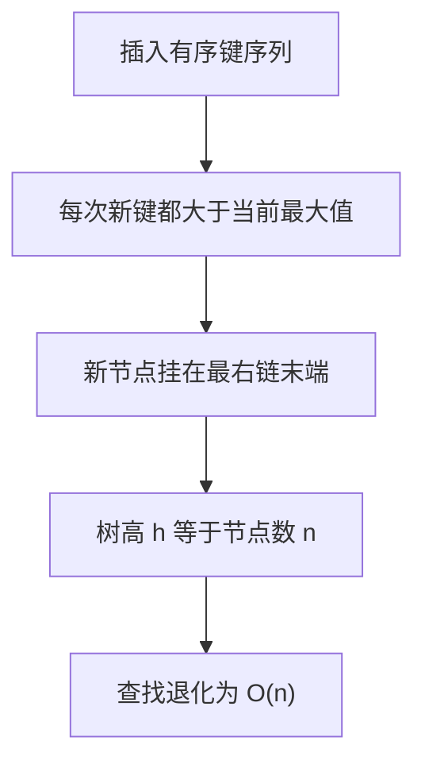

# 手写数据结构（三）：二叉搜索树、AVL、跳表、图

!!! abstract "核心结论"

    - BST 的全部代价来自树高：查找/插入/删除的复杂度是 O(h)，随机键下 h 约 1.39 log2 n，但有序键插入会退化成链表、h = n。写 BST 时必须能说清"退化"这一步。
    - AVL 用 height 与 balance factor 把 |bf| 约束在 1 以内，四种失衡 LL/RR/LR/RL 分别对应一次单旋、一次单旋、两次单旋、两次单旋；插入最多一次旋转即可恢复，删除可能需要沿回溯路径旋转 O(log n) 次。
    - 红黑树的平衡弱于 AVL，但把旋转次数摊还到 O(1)（插入最多 2 次、删除最多 3 次），因此写多读少的场景更优；两者都是 O(log n) 查找。
    - 跳表用几何分布的随机层数替代旋转，期望复杂度 O(log n)、实现比红黑树短一个数量级，代价是概率性保证与较大的常数因子（多级指针内存）。
    - 图的邻接表空间 O(V + E)，BFS/DFS 是 O(V + E)，拓扑排序是 O(V + E)，Dijkstra 用二叉堆是 O((V + E) log V) 且不能处理负权边。

## 1. 底层原理：从比较模型到平衡与近似

### 1.1 BST 的不变量与退化

二叉搜索树只维持一条不变量：对任意节点 x，左子树所有 key < x.key < 右子树所有 key。这条不变量足以让"查找"变成一次二分的下降路径，但**不约束树高**。

考虑按 1, 2, 3, ..., n 顺序插入：每次新 key 都大于当前最大值，于是新节点永远挂在最右侧，树退化成一条右斜链，树高 h = n。此时查找退化为 O(n) 的顺序扫描，递归插入还会把调用栈深度推到 n（n 很大时可能触发栈溢出）。这解释了为什么工程上几乎不直接用裸 BST，而用 AVL、红黑树、B 树或跳表。



### 1.2 平衡的本质：高度约束与旋转

AVL 的思路是把抽象的不变量强化为一条**可本地维护的数值约束**：每个节点的 `height(left) - height(right)` 的绝对值不超过 1。这条约束推出高度上界 h < 1.4405 log2(n + 2)，即 h = O(log n)。

维护手段是旋转。旋转是一种**保持 BST 中序序列不变**的局部指针改写：右旋把左孩子提上来，左旋把右孩子提上来。因为中序序列不变，BST 不变量自动保持；因为高度被重算，平衡约束可被恢复。

失衡只可能是四种形状，判定依据是失衡节点与其"较高孩子"的 bf 符号：

| 失衡形状 | 条件（以 node 为失衡节点） | 修复动作 |
| --- | --- | --- |
| LL | bf(node) > 1 且 bf(node.left) >= 0 | 对 node 右旋一次 |
| RR | bf(node) < -1 且 bf(node.right) <= 0 | 对 node 左旋一次 |
| LR | bf(node) > 1 且 bf(node.left) < 0 | 先对 node.left 左旋，再对 node 右旋 |
| RL | bf(node) < -1 且 bf(node.right) > 0 | 先对 node.right 右旋，再对 node 左旋 |

关键结论：**AVL 插入只需要在最低失衡祖先处做一次修复（单旋或双旋），其后高度恢复原值，更上层不可能失衡**。删除不同：删除会真正降低某棵子树的高度，因此需要沿回溯路径逐层检查并可能连续旋转。

### 1.3 跳表：用概率替代旋转

跳表的观察是：有序链表查找慢，是因为只能走一步。如果在链表上叠加"稀疏索引层"，就能像二分一样跳过大量节点。

跳表的每个节点带有若干层前向指针，层数由几何分布决定：以概率 p 继续升高一层（工程实现通常取 p = 0.25 或 0.5）。查找时从最高层的头结点出发，能往右就往右，不能就往下一层，等价于在多层链表上做一次"逐层收缩"的二分。它的期望查找长度是 O(log n)，且不需要任何旋转或再平衡代码。

### 1.4 图的表示与内存布局

图有两种主流表示：

| 维度 | 邻接矩阵 | 邻接表 |
| --- | --- | --- |
| 空间 | O(V^2) | O(V + E) |
| 判断边 (u, v) 是否存在 | O(1) | O(deg(u)) |
| 遍历 u 的所有邻居 | O(V) | O(deg(u)) |
| 适用 | 稠密图、需要频繁查边 | 稀疏图、遍历为主 |

在 JavaScript 中，邻接表常用 `Map<顶点, Array<[邻居, 权重]>>` 实现。`Map` 的键可以是任意值（数字、字符串、对象引用），这比"把顶点编号化成数组下标"更灵活，代价是哈希查找的常数开销。需要强调：`Map` 的迭代顺序是插入顺序，因此同一份输入的 BFS/拓扑排序结果是确定的、可复现的。

## 2. 手写 BST：增删查与迭代遍历

运行环境：Node.js 18 LTS，CommonJS。文件 `bst.js`，用 `node bst.js` 运行。

### 2.1 结构定义与迭代查找、插入

```js
'use strict';
// 运行环境：Node.js 18 LTS（CommonJS）
// 文件：bst.js
const assert = require('node:assert');

class BSTNode {
  constructor(key, value) {
    this.key = key;
    this.value = value;
    this.left = null;
    this.right = null;
  }
}

class BST {
  constructor() {
    this.root = null;
    this.size = 0;
  }

  // 一次比较决定向左还是向右，不需要递归栈
  _findNode(key) {
    let cur = this.root;
    while (cur !== null) {
      if (key === cur.key) return cur;
      cur = key < cur.key ? cur.left : cur.right;
    }
    return null;
  }

  get(key) {
    const node = this._findNode(key);
    return node === null ? undefined : node.value;
  }

  has(key) {
    return this._findNode(key) !== null;
  }

  // 重复 key 采用"覆盖"策略；另一种常见策略是维护计数，避免删除歧义
  set(key, value) {
    if (this.root === null) {
      this.root = new BSTNode(key, value);
      this.size += 1;
      return this;
    }
    let cur = this.root;
    for (;;) {
      if (key === cur.key) {
        cur.value = value;
        return this;
      }
      if (key < cur.key) {
        if (cur.left === null) {
          cur.left = new BSTNode(key, value);
          this.size += 1;
          return this;
        }
        cur = cur.left;
      } else {
        if (cur.right === null) {
          cur.right = new BSTNode(key, value);
          this.size += 1;
          return this;
        }
        cur = cur.right;
      }
    }
  }
}
```

### 2.2 删除：迭代版，分三种情况

删除的难点在于"被删节点有两个孩子"。标准做法是用**中序后继**（右子树最小节点）的 key/value 覆盖被删节点，然后删除那个后继节点。后继节点最多只有右孩子，于是问题退化为"删除至多一个孩子的节点"。

```js
  // 返回 true 表示确实删除了一个节点
  delete(key) {
    let parent = null;
    let cur = this.root;
    while (cur !== null && cur.key !== key) {
      parent = cur;
      cur = key < cur.key ? cur.left : cur.right;
    }
    if (cur === null) return false;

    // 情况一：有两个孩子，用中序后继覆盖，然后转为删除后继
    if (cur.left !== null && cur.right !== null) {
      let succParent = cur;
      let succ = cur.right;
      while (succ.left !== null) {
        succParent = succ;
        succ = succ.left;
      }
      cur.key = succ.key;
      cur.value = succ.value;
      parent = succParent;
      cur = succ; // 此后 cur 至多只有一个孩子
    }

    // 情况二/三：叶子或单孩子，直接用唯一孩子顶替
    const child = cur.left !== null ? cur.left : cur.right;
    if (parent === null) {
      this.root = child; // 删的是根
    } else if (parent.left === cur) {
      parent.left = child;
    } else {
      parent.right = child;
    }
    this.size -= 1;
    return true;
  }

  min() {
    if (this.root === null) return undefined;
    let cur = this.root;
    while (cur.left !== null) cur = cur.left;
    return cur.key;
  }

  max() {
    if (this.root === null) return undefined;
    let cur = this.root;
    while (cur.right !== null) cur = cur.right;
    return cur.key;
  }

  height() {
    const walk = (node) => {
      if (node === null) return 0;
      return 1 + Math.max(walk(node.left), walk(node.right));
    };
    return walk(this.root);
  }
```

### 2.3 四种遍历的迭代实现

递归遍历的问题是把栈深度交给调用栈。迭代版本把栈显式化，生产环境更可控。

```js
  // 中序：一路向左压栈，弹出即访问，再转向右子树
  inorderIterative() {
    const out = [];
    const stack = [];
    let cur = this.root;
    while (cur !== null || stack.length > 0) {
      while (cur !== null) {
        stack.push(cur);
        cur = cur.left;
      }
      cur = stack.pop();
      out.push(cur.key);
      cur = cur.right;
    }
    return out;
  }

  preorderIterative() {
    const out = [];
    if (this.root === null) return out;
    const stack = [this.root];
    while (stack.length > 0) {
      const node = stack.pop();
      out.push(node.key);
      // 先压右再压左，保证左先被弹出
      if (node.right !== null) stack.push(node.right);
      if (node.left !== null) stack.push(node.left);
    }
    return out;
  }

  // 双栈法：第一栈做"根右左"的先序，压入第二栈后逆序即"左右根"
  postorderIterative() {
    const out = [];
    if (this.root === null) return out;
    const stack = [this.root];
    const reversed = [];
    while (stack.length > 0) {
      const node = stack.pop();
      reversed.push(node.key);
      if (node.left !== null) stack.push(node.left);
      if (node.right !== null) stack.push(node.right);
    }
    while (reversed.length > 0) out.push(reversed.pop());
    return out;
  }

  // 用数组 + head 指针模拟队列，避免 Array.shift 的 O(n) 移动
  levelOrder() {
    const out = [];
    if (this.root === null) return out;
    const queue = [this.root];
    let head = 0;
    while (head < queue.length) {
      const node = queue[head++];
      out.push(node.key);
      if (node.left !== null) queue.push(node.left);
      if (node.right !== null) queue.push(node.right);
    }
    return out;
  }

  // 利用中序有序性剪枝：越上界即可整体停止
  range(lo, hi) {
    const out = [];
    const stack = [];
    let cur = this.root;
    while (cur !== null || stack.length > 0) {
      while (cur !== null) {
        stack.push(cur);
        cur = cur.left;
      }
      cur = stack.pop();
      if (cur.key > hi) break;
      if (cur.key >= lo) out.push(cur.key);
      cur = cur.right;
    }
    return out;
  }
}
```

### 2.4 验证标准

```js
// 运行环境：Node.js 18 LTS（CommonJS）
// 文件：bst.test.js
const assert = require('node:assert');
const t = new BST();
[8, 3, 10, 1, 6, 14, 4, 7, 13].forEach((k) => t.set(k, k * 10));

assert.strictEqual(t.size, 9);
assert.deepStrictEqual(t.inorderIterative(), [1, 3, 4, 6, 7, 8, 10, 13, 14]);
assert.deepStrictEqual(t.preorderIterative(), [8, 3, 1, 6, 4, 7, 10, 14, 13]);
assert.deepStrictEqual(t.postorderIterative(), [1, 4, 7, 6, 3, 13, 14, 10, 8]);
assert.deepStrictEqual(t.levelOrder(), [8, 3, 10, 1, 6, 14, 4, 7, 13]);
assert.strictEqual(t.get(6), 60);
assert.strictEqual(t.get(99), undefined);
assert.strictEqual(t.has(13), true);
assert.strictEqual(t.min(), 1);
assert.strictEqual(t.max(), 14);
assert.strictEqual(t.height(), 4);
assert.deepStrictEqual(t.range(4, 10), [4, 6, 7, 8, 10]);

// 覆盖写不增加 size
t.set(6, 66);
assert.strictEqual(t.get(6), 66);
assert.strictEqual(t.size, 9);

// 删除有两个孩子的根：后继 10 顶上
assert.strictEqual(t.delete(8), true);
assert.strictEqual(t.size, 8);
assert.deepStrictEqual(t.inorderIterative(), [1, 3, 4, 6, 7, 10, 13, 14]);
assert.strictEqual(t.delete(8), false); // 已不存在

assert.strictEqual(t.delete(1), true);  // 叶子
assert.strictEqual(t.delete(14), true); // 单孩子（左孩子 13 顶上）
assert.deepStrictEqual(t.inorderIterative(), [3, 4, 6, 7, 10, 13]);

// 有序插入必然退化，用来演示 O(n) 树高
const chain = new BST();
for (let i = 1; i <= 1000; i++) chain.set(i, i);
assert.strictEqual(chain.height(), 1000);
assert.strictEqual(chain.get(1000), 1000);

console.log('bst ok');
// 预期输出：bst ok
```

### 2.5 复杂度与退化演示

| 操作 | 平均（随机键） | 最坏（有序键） |
| --- | --- | --- |
| 查找 | O(log n) | O(n) |
| 插入 | O(log n) | O(n) |
| 删除 | O(log n) | O(n) |
| 中序/前后序/层序遍历 | O(n) | O(n) |
| 空间 | O(n) | O(n) |

上面的 `chain.height() === 1000` 就是这个表最坏列的可运行证据。

## 3. 手写 AVL：旋转全套

### 3.1 旋转与再平衡原语

```js
'use strict';
// 运行环境：Node.js 18 LTS（CommonJS）
// 文件：avl.js
const h = (node) => (node === null ? 0 : node.height);

const update = (node) => {
  node.height = 1 + Math.max(h(node.left), h(node.right));
};

// 平衡因子：大于 0 表示左重，小于 0 表示右重
const bf = (node) => h(node.left) - h(node.right);

// 右旋：把左孩子提上来，y 下沉为 x 的右孩子
const rotateRight = (y) => {
  const x = y.left;
  const t2 = x.right;
  x.right = y;
  y.left = t2;
  update(y); // 必须先更新下沉节点
  update(x);
  return x;
};

// 左旋：把右孩子提上来，x 下沉为 y 的左孩子
const rotateLeft = (x) => {
  const y = x.right;
  const t2 = y.left;
  y.left = x;
  x.right = t2;
  update(x);
  update(y);
  return y;
};
```

### 3.2 插入与删除

```js
class AVLNode {
  constructor(key, value) {
    this.key = key;
    this.value = value;
    this.left = null;
    this.right = null;
    this.height = 1;
  }
}

class AVL {
  constructor() {
    this.root = null;
    this.size = 0;
  }

  height() {
    return h(this.root);
  }

  // 统一的再平衡入口：先看 bf，再看较高孩子的 bf，判定四种形状
  _rebalance(node) {
    const b = bf(node);
    if (b > 1 && bf(node.left) >= 0) {
      return rotateRight(node); // LL
    }
    if (b > 1 && bf(node.left) < 0) {
      node.left = rotateLeft(node.left); // LR
      return rotateRight(node);
    }
    if (b < -1 && bf(node.right) <= 0) {
      return rotateLeft(node); // RR
    }
    if (b < -1 && bf(node.right) > 0) {
      node.right = rotateRight(node.right); // RL
      return rotateLeft(node);
    }
    return node;
  }

  insert(key, value) {
    this.root = this._insert(this.root, key, value);
  }

  _insert(node, key, value) {
    if (node === null) {
      this.size += 1;
      return new AVLNode(key, value);
    }
    if (key < node.key) {
      node.left = this._insert(node.left, key, value);
    } else if (key > node.key) {
      node.right = this._insert(node.right, key, value);
    } else {
      node.value = value;
      return node; // 已存在，原样返回，不增加 size
    }
    update(node);
    return this._rebalance(node);
  }

  _findNode(key) {
    let cur = this.root;
    while (cur !== null) {
      if (key === cur.key) return cur;
      cur = key < cur.key ? cur.left : cur.right;
    }
    return null;
  }

  get(key) {
    const node = this._findNode(key);
    return node === null ? undefined : node.value;
  }

  has(key) {
    return this._findNode(key) !== null;
  }

  delete(key) {
    if (this._findNode(key) === null) return false;
    this.root = this._delete(this.root, key);
    this.size -= 1; // 只在公共入口减一次，避免与递归重复计数
    return true;
  }

  _delete(node, key) {
    if (node === null) return null;
    if (key < node.key) {
      node.left = this._delete(node.left, key);
    } else if (key > node.key) {
      node.right = this._delete(node.right, key);
    } else {
      if (node.left === null) return node.right;
      if (node.right === null) return node.left;
      // 两个孩子：找右子树最小节点（后继）覆盖 key/value
      let succ = node.right;
      while (succ.left !== null) succ = succ.left;
      node.key = succ.key;
      node.value = succ.value;
      node.right = this._delete(node.right, succ.key);
    }
    update(node);
    return this._rebalance(node);
  }

  keys() {
    const out = [];
    const stack = [];
    let cur = this.root;
    while (cur !== null || stack.length > 0) {
      while (cur !== null) {
        stack.push(cur);
        cur = cur.left;
      }
      cur = stack.pop();
      out.push(cur.key);
      cur = cur.right;
    }
    return out;
  }

  // 自检：中序严格递增 + 每个节点 |bf| <= 1 + height 字段与子树一致
  isValid() {
    const keys = this.keys();
    if (keys.length !== this.size) return false;
    for (let i = 1; i < keys.length; i++) {
      if (keys[i - 1] >= keys[i]) return false;
    }
    const walk = (node) => {
      if (node === null) return true;
      if (bf(node) < -1 || bf(node) > 1) return false;
      if (node.height !== 1 + Math.max(h(node.left), h(node.right))) return false;
      return walk(node.left) && walk(node.right);
    };
    return walk(this.root);
  }
}
```

### 3.3 验证标准

```js
// 运行环境：Node.js 18 LTS（CommonJS）
// 文件：avl.test.js
const assert = require('node:assert');

// LR：先左旋左孩子，再右旋根
const a1 = new AVL();
[30, 10, 20].forEach((k) => a1.insert(k, k));
assert.strictEqual(a1.root.key, 20);
assert.deepStrictEqual(a1.keys(), [10, 20, 30]);
assert.ok(a1.isValid());

// RL：先右旋右孩子，再左旋根
const a2 = new AVL();
[10, 30, 20].forEach((k) => a2.insert(k, k));
assert.strictEqual(a2.root.key, 20);
assert.deepStrictEqual(a2.keys(), [10, 20, 30]);
assert.ok(a2.isValid());

// 有序插入：AVL 不退化，7 个节点高度不超过 4
const a3 = new AVL();
for (let i = 1; i <= 7; i++) a3.insert(i, i * 10);
assert.deepStrictEqual(a3.keys(), [1, 2, 3, 4, 5, 6, 7]);
assert.ok(a3.height() <= 4);
assert.strictEqual(a3.get(5), 50);
assert.ok(a3.isValid());

// 重复 key 覆盖，不增加 size
a3.insert(5, 55);
assert.strictEqual(a3.get(5), 55);
assert.strictEqual(a3.size, 7);

// 删除中间节点后仍然合法
assert.strictEqual(a3.delete(4), true);
assert.deepStrictEqual(a3.keys(), [1, 2, 3, 5, 6, 7]);
assert.strictEqual(a3.size, 6);
assert.strictEqual(a3.delete(42), false);
assert.ok(a3.isValid());

[1, 2, 3, 5, 6, 7].forEach((k) => a3.delete(k));
assert.strictEqual(a3.size, 0);
assert.strictEqual(a3.root, null);
assert.ok(a3.isValid());

// 200 个键随机插入，高度仍是对数级
let seed = 42;
const rand = () => {
  seed = (seed * 1103515245 + 12345) % 2147483648;
  return Math.floor((seed / 2147483648) * 1000000);
};
const keys = [];
for (let i = 0; i < 200; i++) keys.push(i);
for (let i = keys.length - 1; i > 0; i--) {
  const j = rand() % (i + 1);
  const tmp = keys[i];
  keys[i] = keys[j];
  keys[j] = tmp;
}
const a4 = new AVL();
keys.forEach((k) => a4.insert(k, k));
assert.strictEqual(a4.size, 200);
assert.deepStrictEqual(a4.keys(), Array.from({ length: 200 }, (_, i) => i));
assert.ok(a4.height() <= 11); // 200 个节点的 AVL 高度远小于 200
assert.ok(a4.isValid());

console.log('avl ok, height =', a4.height());
// 预期输出：第一行是 "avl ok, height = " 加上一个 8 到 11 之间的整数
// 注意：该整数由插入顺序与 AVL 规则完全决定，但不在断言中固定，避免与具体形状耦合
```

### 3.4 AVL 的复杂度

| 操作 | 时间复杂度 | 旋转次数 |
| --- | --- | --- |
| 查找 | O(log n) | 0 |
| 插入 | O(log n) | 至多 1 次（单旋或双旋） |
| 删除 | O(log n) | 沿回溯路径 0 到 O(log n) 次 |
| 中序遍历 | O(n) | 0 |

## 4. 红黑树要点与对比

红黑树放弃"子树高度差不超过 1"的强约束，改用颜色规则间接限制高度：

1. 每个节点是红色或黑色。
2. 根节点是黑色。
3. 每个叶子（NIL 空节点）是黑色。
4. 红色节点的两个孩子必须是黑色（不存在连续两个红节点）。
5. 从任一节点到其所有后代 NIL 的路径上，黑节点数量相同（黑高一致）。

由此可推出：最长路径不超过最短路径的两倍，树高上界为 2 log2(n + 1)，因此仍是 O(log n)。相比 AVL，红黑树为了换取更少的旋转而容忍更大的高度，实践中查找路径略长但写操作更便宜。

插入修复的核心是**叔父节点颜色**决定"变色上溯"还是"旋转"：叔父为红则把父与叔变黑、祖父变红并把冲突上移到祖父；叔父为黑则做一次或两次旋转并重新着色。删除修复更复杂，需要区分四种情形，通常会引入"双黑"概念。

| 维度 | AVL 树 | 红黑树 | 跳表 |
| --- | --- | --- | --- |
| 平衡保证 | 严格，\|bf\| <= 1 | 松弛，长路径 <= 2 倍短路径 | 概率性，期望 O(log n) |
| 树高/层数上界 | 约 1.4405 log2(n + 2) | 约 2 log2(n + 1) | 期望 O(log n)，无硬上界 |
| 查找性能 | 更优（更矮） | 略逊于 AVL | 常数因子较大 |
| 插入旋转 | 最多 1 次 | 最多 2 次 | 0 次（改指针） |
| 删除旋转 | 最多 O(log n) 次 | 最多 3 次 | 0 次（改指针） |
| 实现难度 | 中 | 高（删除尤其繁） | 低 |
| 典型使用 | 查找密集、插入删除较少 | 通用有序容器 | 有序集合、内存索引 |

补充事实性说明：Java 的 `TreeMap`/`TreeSet`、Linux 内核中若干需要有序区间的结构使用红黑树；C++ 标准库 `std::map`/`std::set` 的常见实现（libstdc++、libc++）使用红黑树，但**标准并未强制红黑树**，具体实现需核对对应版本的源码或文档。JavaScript 引擎方面，V8 的 `Map`/`Set` 不是红黑树（V8 使用哈希表实现），因此"JS 的 Map 是红黑树"是错误说法。

## 5. 手写跳表

### 5.1 随机层数

层数生成是跳表的灵魂。写法是"抛硬币直到失败"：

```js
randomLevel() {
  let level = 1;
  while (level < this.maxLevel && this.random() < this.probability) {
    level += 1;
  }
  return level;
}
```

若 `probability = p`，则层数 >= k 的概率是 p^(k-1)，这是参数为 p 的几何分布。期望层数是 1 / (1 - p)，因此 p 越小时平均层数越低、最高层越低、内存越省但索引越稀疏。为了让测试可复现，本文把随机源作为构造参数注入。

### 5.2 完整实现

```js
'use strict';
// 运行环境：Node.js 18 LTS（CommonJS）
// 文件：skiplist.js

class SkipListNode {
  constructor(key, value, level) {
    this.key = key;
    this.value = value;
    // next[i] 是第 i 层（0 为最底层）的下一个节点
    this.next = new Array(level).fill(null);
  }
}

class SkipList {
  /**
   * @param {number} maxLevel 最大层数，通常取 16 到 32
   * @param {number} probability 升层概率 p
   * @param {() => number} random 返回 [0, 1) 的随机源，便于测试注入
   */
  constructor(maxLevel = 16, probability = 0.5, random = Math.random) {
    this.maxLevel = maxLevel;
    this.probability = probability;
    this.random = random;
    this.level = 0; // 当前有效最高层数
    this.head = new SkipListNode(null, null, maxLevel);
    this.size = 0;
  }

  randomLevel() {
    let level = 1;
    while (level < this.maxLevel && this.random() < this.probability) {
      level += 1;
    }
    return level;
  }

  // 从最高层向下收缩，记录每一层"小于 key 的最后一个节点"
  _findUpdate(key) {
    const update = new Array(this.maxLevel).fill(this.head);
    let cur = this.head;
    for (let i = this.level - 1; i >= 0; i--) {
      while (cur.next[i] !== null && cur.next[i].key < key) {
        cur = cur.next[i];
      }
      update[i] = cur;
    }
    return update;
  }

  search(key) {
    let cur = this.head;
    for (let i = this.level - 1; i >= 0; i--) {
      while (cur.next[i] !== null && cur.next[i].key < key) {
        cur = cur.next[i];
      }
    }
    cur = cur.next[0];
    if (cur !== null && cur.key === key) return cur.value;
    return undefined;
  }

  // 返回 true 表示新增，false 表示覆盖已有 key
  insert(key, value) {
    const update = this._findUpdate(key);
    const candidate = update[0].next[0];
    if (candidate !== null && candidate.key === key) {
      candidate.value = value;
      return false;
    }
    const level = this.randomLevel();
    if (level > this.level) {
      for (let i = this.level; i < level; i++) update[i] = this.head;
      this.level = level;
    }
    const node = new SkipListNode(key, value, level);
    for (let i = 0; i < level; i++) {
      node.next[i] = update[i].next[i];
      update[i].next[i] = node;
    }
    this.size += 1;
    return true;
  }

  delete(key) {
    const update = this._findUpdate(key);
    const target = update[0].next[0];
    if (target === null || target.key !== key) return false;
    for (let i = 0; i < this.level; i++) {
      if (update[i].next[i] === target) {
        update[i].next[i] = target.next[i];
      }
    }
    // 若最高层已空，收缩有效层数
    while (this.level > 0 && this.head.next[this.level - 1] === null) {
      this.level -= 1;
    }
    this.size -= 1;
    return true;
  }

  // 闭区间 [lo, hi] 的范围查询，先跳到 >= lo 的位置再沿底层走
  range(lo, hi) {
    const out = [];
    let cur = this.head;
    for (let i = this.level - 1; i >= 0; i--) {
      while (cur.next[i] !== null && cur.next[i].key < lo) {
        cur = cur.next[i];
      }
    }
    cur = cur.next[0];
    while (cur !== null && cur.key <= hi) {
      out.push({ key: cur.key, value: cur.value });
      cur = cur.next[0];
    }
    return out;
  }

  toArray() {
    const out = [];
    let cur = this.head.next[0];
    while (cur !== null) {
      out.push({ key: cur.key, value: cur.value });
      cur = cur.next[0];
    }
    return out;
  }
}
```

### 5.3 验证标准

```js
// 运行环境：Node.js 18 LTS（CommonJS）
// 文件：skiplist.test.js
const assert = require('node:assert');

// 确定性随机源，保证每次运行结构完全一致
let seed = 1;
const rng = () => {
  seed = (seed * 1103515245 + 12345) % 2147483648;
  return seed / 2147483648;
};

const sl = new SkipList(8, 0.5, rng);
[5, 1, 9, 3, 7, 2, 8, 6, 4].forEach((k) => assert.strictEqual(sl.insert(k, k * 100), true));
assert.strictEqual(sl.size, 9);
assert.ok(sl.level >= 1 && sl.level <= 8);
assert.deepStrictEqual(sl.toArray().map((d) => d.key), [1, 2, 3, 4, 5, 6, 7, 8, 9]);
assert.strictEqual(sl.search(7), 700);
assert.strictEqual(sl.search(100), undefined);

// 覆盖已有 key
assert.strictEqual(sl.insert(7, 777), false);
assert.strictEqual(sl.search(7), 777);
assert.strictEqual(sl.size, 9);

assert.deepStrictEqual(sl.range(3, 7).map((d) => d.key), [3, 4, 5, 6, 7]);

assert.strictEqual(sl.delete(5), true);
assert.strictEqual(sl.delete(5), false);
assert.deepStrictEqual(sl.toArray().map((d) => d.key), [1, 2, 3, 4, 6, 7, 8, 9]);
assert.strictEqual(sl.size, 8);

// 全部删除后回到空表状态
[1, 2, 3, 4, 6, 7, 8, 9].forEach((k) => sl.delete(k));
assert.strictEqual(sl.size, 0);
assert.strictEqual(sl.level, 0);
assert.deepStrictEqual(sl.toArray(), []);

// 极端随机源：永不升层，退化为单层有序链表
const flat = new SkipList(8, 0.5, () => 0.99);
for (let i = 100; i >= 1; i--) flat.insert(i, i);
assert.strictEqual(flat.level, 1);
assert.strictEqual(flat.search(50), 50);

// 极端随机源：总是升层，直接顶到 maxLevel
const tall = new SkipList(8, 0.5, () => 0.1);
for (let i = 1; i <= 50; i++) tall.insert(i, i);
assert.strictEqual(tall.level, 8);
assert.deepStrictEqual(tall.toArray().map((d) => d.key), Array.from({ length: 50 }, (_, i) => i + 1));

console.log('skiplist ok');
// 预期输出：skiplist ok
```

### 5.4 复杂度

| 操作 | 期望复杂度 | 最坏复杂度 | 说明 |
| --- | --- | --- | --- |
| 查找 | O(log n) | O(n) | 最坏是指数级小概率事件 |
| 插入 | O(log n) | O(n) | 层数期望 O(1) |
| 删除 | O(log n) | O(n) | 需要重建 update 数组 |
| 范围查询 [lo, hi] | O(log n + k) | O(n) | k 为区间内元素个数 |
| 空间 | O(n) | O(n * maxLevel) | 期望每个节点 1 / (1 - p) 层 |

补充事实性说明：Redis 的有序集合（zset）同时使用哈希表与 skiplist（`ZSKIPLIST_P`、`ZSKIPLIST_MAXLEVEL` 等常量定义在其源码 `t_zset.c` 中，具体数值请核对你所使用的 Redis 版本源码）。LevelDB / RocksDB 的 MemTable 也采用 skiplist 作为内存有序索引。

## 6. 手写图：邻接表、BFS/DFS、拓扑排序、Dijkstra

### 6.1 邻接表与最小堆

```js
'use strict';
// 运行环境：Node.js 18 LTS（CommonJS）
// 文件：graph.js

class Graph {
  /**
   * @param {boolean} directed true 表示有向图
   */
  constructor(directed = false) {
    this.adj = new Map(); // 顶点 -> Array of [邻居, 权重]
    this.directed = directed;
  }

  addVertex(v) {
    if (!this.adj.has(v)) this.adj.set(v, []);
    return this;
  }

  addEdge(u, v, weight = 1) {
    this.addVertex(u);
    this.addVertex(v);
    this.adj.get(u).push([v, weight]);
    if (!this.directed) this.adj.get(v).push([u, weight]);
    return this;
  }

  neighbors(v) {
    const list = this.adj.get(v);
    return list === undefined ? [] : list;
  }

  get vertices() {
    return Array.from(this.adj.keys());
  }

  get order() {
    return this.adj.size;
  }
}

// 二叉最小堆。用惰性删除（重复入堆）替代 decrease-key，
// 因此需要调用方在 pop 后自行判断该条目是否已过期。
class MinHeap {
  constructor(compare = (a, b) => a - b) {
    this.data = [];
    this.compare = compare;
  }

  get size() {
    return this.data.length;
  }

  peek() {
    return this.data[0];
  }

  push(item) {
    const d = this.data;
    d.push(item);
    let i = d.length - 1;
    while (i > 0) {
      const parent = (i - 1) >> 1;
      if (this.compare(d[i], d[parent]) >= 0) break;
      const tmp = d[i];
      d[i] = d[parent];
      d[parent] = tmp;
      i = parent;
    }
  }

  pop() {
    const d = this.data;
    if (d.length === 0) return undefined;
    const top = d[0];
    const last = d.pop();
    if (d.length > 0) {
      d[0] = last;
      let i = 0;
      const n = d.length;
      for (;;) {
        let smallest = i;
        const left = 2 * i + 1;
        const right = 2 * i + 2;
        if (left < n && this.compare(d[left], d[smallest]) < 0) smallest = left;
        if (right < n && this.compare(d[right], d[smallest]) < 0) smallest = right;
        if (smallest === i) break;
        const tmp = d[i];
        d[i] = d[smallest];
        d[smallest] = tmp;
        i = smallest;
      }
    }
    return top;
  }
}
```

### 6.2 BFS：无权最短路与路径还原

```js
// 追加到 Graph 类内部的方法
function bfs(graph, start) {
  const order = [];
  const dist = new Map([[start, 0]]);
  const prev = new Map([[start, null]]);
  const queue = [start];
  let head = 0;
  while (head < queue.length) {
    const u = queue[head++];
    order.push(u);
    for (const edge of graph.neighbors(u)) {
      const v = edge[0];
      if (!dist.has(v)) {
        dist.set(v, dist.get(u) + 1);
        prev.set(v, u);
        queue.push(v);
      }
    }
  }
  return { order, dist, prev };
}

function pathFrom(prev, target) {
  const path = [];
  let cur = target;
  while (cur !== null && cur !== undefined && prev.has(cur)) {
    path.push(cur);
    cur = prev.get(cur);
  }
  return path.reverse();
}
```

关键点：`dist.has(v)` 这个检查同时承担了"是否访问过"和"是否已入队"两个职责，因此每个顶点最多入队一次，BFS 的总代价是 O(V + E)。用 `head` 指针而不是 `Array.prototype.shift()`，是因为 `shift` 在 V8 中对大数组可能触发元素搬移，使队列退化。

### 6.3 DFS：递归版与显式栈版

```js
function dfsRecursive(graph, start) {
  const order = [];
  const visited = new Set();
  const walk = (u) => {
    visited.add(u);
    order.push(u);
    for (const edge of graph.neighbors(u)) {
      if (!visited.has(edge[0])) walk(edge[0]);
    }
  };
  walk(start);
  return order;
}

// 显式栈版本。注意：单纯压栈得到的顺序与递归版不一定相同，
// 这里的顺序只保证是一棵合法的 DFS 森林遍历，不保证与递归版一致。
function dfsIterative(graph, start) {
  const order = [];
  const visited = new Set([start]);
  const stack = [start];
  while (stack.length > 0) {
    const u = stack.pop();
    order.push(u);
    const list = graph.neighbors(u);
    // 逆序入栈，使得弹出顺序与邻接表的自然顺序一致
    for (let i = list.length - 1; i >= 0; i--) {
      const v = list[i][0];
      if (!visited.has(v)) {
        visited.add(v);
        stack.push(v);
      }
    }
  }
  return order;
}
```

### 6.4 拓扑排序：Kahn 与 DFS 染色

```js
// Kahn 算法：反复取出入度为 0 的顶点。返回 null 表示有环。
function topoSortKahn(graph) {
  const indeg = new Map();
  for (const v of graph.vertices) indeg.set(v, 0);
  for (const u of graph.vertices) {
    for (const edge of graph.neighbors(u)) {
      indeg.set(edge[0], indeg.get(edge[0]) + 1);
    }
  }
  const queue = graph.vertices.filter((v) => indeg.get(v) === 0);
  const out = [];
  let head = 0;
  while (head < queue.length) {
    const u = queue[head++];
    out.push(u);
    for (const edge of graph.neighbors(u)) {
      const v = edge[0];
      indeg.set(v, indeg.get(v) - 1);
      if (indeg.get(v) === 0) queue.push(v);
    }
  }
  return out.length === graph.order ? out : null;
}

// DFS 三色标记：0 未访问，1 在栈中，2 已完成。遇到"在栈中"的邻居即发现环。
function topoSortDfs(graph) {
  const color = new Map();
  const out = [];
  let cyclic = false;
  const walk = (u) => {
    color.set(u, 1);
    for (const edge of graph.neighbors(u)) {
      const v = edge[0];
      const c = color.get(v) || 0;
      if (c === 1) {
        cyclic = true;
        return;
      }
      if (c === 0) walk(v);
      if (cyclic) return;
    }
    color.set(u, 2);
    out.push(u); // 后序位置入列，最后反转
  };
  for (const v of graph.vertices) {
    if ((color.get(v) || 0) === 0) {
      walk(v);
      if (cyclic) return null;
    }
  }
  return out.reverse();
}
```

### 6.5 Dijkstra：二叉堆实现

```js
// 单源最短路径。要求所有边权非负，否则抛错。
function dijkstra(graph, start) {
  const dist = new Map();
  for (const v of graph.vertices) dist.set(v, Infinity);
  dist.set(start, 0);
  const prev = new Map();
  const settled = new Set();
  const heap = new MinHeap((a, b) => a[0] - b[0]);
  heap.push([0, start]);

  while (heap.size > 0) {
    const top = heap.pop();
    const d = top[0];
    const u = top[1];
    if (settled.has(u)) continue;        // 惰性删除：跳过过期条目
    if (d > dist.get(u)) continue;        // 该条目已被更短路径取代
    settled.add(u);
    for (const edge of graph.neighbors(u)) {
      const v = edge[0];
      const w = edge[1];
      if (w < 0) throw new Error('Dijkstra 不支持负权边，请改用 Bellman-Ford');
      const nd = d + w;
      if (nd < dist.get(v)) {
        dist.set(v, nd);
        prev.set(v, u);
        heap.push([nd, v]);               // 惰性删除：直接压入新条目
      }
    }
  }
  return { dist, prev };
}
```

关于复杂度：每个顶点最多被"settle"一次，每条边最多触发一次成功的松弛；每次堆操作 O(log E) = O(log V)，因此总复杂度 O((V + E) log V)。

### 6.6 验证标准

```js
// 运行环境：Node.js 18 LTS（CommonJS）
// 文件：graph.test.js
const assert = require('node:assert');

// 无向无权图：验证 BFS/DFS
const ug = new Graph(false);
ug.addEdge('A', 'B');
ug.addEdge('A', 'C');
ug.addEdge('B', 'D');
ug.addEdge('C', 'D');
ug.addEdge('D', 'E');

const bfsResult = bfs(ug, 'A');
assert.deepStrictEqual(bfsResult.order, ['A', 'B', 'C', 'D', 'E']);
assert.strictEqual(bfsResult.dist.get('E'), 3);
assert.deepStrictEqual(pathFrom(bfsResult.prev, 'E'), ['A', 'B', 'D', 'E']);
assert.strictEqual(bfsResult.dist.get('A'), 0);

const dfsOrder = dfsRecursive(ug, 'A');
assert.strictEqual(dfsOrder.length, 5);
assert.deepStrictEqual(dfsOrder.slice().sort(), ['A', 'B', 'C', 'D', 'E']);
const dfsIterOrder = dfsIterative(ug, 'A');
assert.strictEqual(dfsIterOrder.length, 5);
assert.deepStrictEqual(dfsIterOrder.slice().sort(), ['A', 'B', 'C', 'D', 'E']);

// 有向带权图：验证拓扑排序与 Dijkstra
const dg = new Graph(true);
dg.addEdge('A', 'B', 4);
dg.addEdge('A', 'C', 2);
dg.addEdge('B', 'D', 10);
dg.addEdge('C', 'E', 3);
dg.addEdge('D', 'F', 11);
dg.addEdge('E', 'D', 4);
dg.addEdge('E', 'F', 8);

const topo = topoSortKahn(dg);
assert.deepStrictEqual(topo, ['A', 'B', 'C', 'E', 'D', 'F']);
const pos = new Map(topo.map((v, i) => [v, i]));
for (const u of dg.vertices) {
  for (const edge of dg.neighbors(u)) {
    assert.ok(pos.get(u) < pos.get(edge[0]), '拓扑序必须满足每条边 u 先于 v');
  }
}
assert.deepStrictEqual(topoSortDfs(dg).slice().sort(), topo.slice().sort());

const sp = dijkstra(dg, 'A');
assert.strictEqual(sp.dist.get('B'), 4);   // A -> B
assert.strictEqual(sp.dist.get('C'), 2);   // A -> C
assert.strictEqual(sp.dist.get('E'), 5);   // A -> C -> E
assert.strictEqual(sp.dist.get('D'), 9);   // A -> C -> E -> D，优于 A -> B -> D 的 14
assert.strictEqual(sp.dist.get('F'), 13);  // A -> C -> E -> F
assert.deepStrictEqual(pathFrom(sp.prev, 'F'), ['A', 'C', 'E', 'F']);

// 有环图：拓扑排序必须返回 null
const cyc = new Graph(true);
cyc.addEdge('X', 'Y', 1);
cyc.addEdge('Y', 'Z', 1);
cyc.addEdge('Z', 'X', 1);
assert.strictEqual(topoSortKahn(cyc), null);
assert.strictEqual(topoSortDfs(cyc), null);

// 负权边：Dijkstra 必须拒绝而不是给出错误答案
const neg = new Graph(true);
neg.addEdge('P', 'Q', -1);
assert.throws(() => dijkstra(neg, 'P'), /负权边/);

console.log('graph ok');
// 预期输出：graph ok
```

### 6.7 图算法复杂度汇总

| 算法 | 时间复杂度 | 空间复杂度 | 前提 |
| --- | --- | --- | --- |
| BFS | O(V + E) | O(V) | 无 |
| DFS（递归/迭代） | O(V + E) | O(V)，递归版另有 O(V) 栈深度 | 无 |
| Kahn 拓扑排序 | O(V + E) | O(V) | 有向图；有环返回 null |
| DFS 拓扑排序 | O(V + E) | O(V) | 有向图；有环返回 null |
| Dijkstra + 二叉堆 | O((V + E) log V) | O(V) | 边权非负 |
| Dijkstra + 朴素数组选最小 | O(V^2 + E) | O(V) | 边权非负，稠密图可用 |
| Bellman-Ford | O(V * E) | O(V) | 允许负权边，可检测负环 |

## 7. 常见陷阱

1. **用裸 BST 处理有序输入。** 顺序插入会退化成长链，`height()` 等于元素个数。要么使用 AVL/红黑树，要么在插入前打乱，要么改用跳表的随机层。
2. **删除节点时忘记同时删除"已入堆"的旧条目。** Dijkstra 用惰性删除时，堆里可能同时存在同一个顶点的多个距离条目。必须在 `pop` 后判断该条目是否已被更短距离取代（或该顶点已 settle），否则会重复扩展、复杂度退化。
3. **AVL 旋转后忘记自底向上更新 height。** 单旋中必须先 `update(下沉节点)` 再 `update(上升节点)`；顺序颠倒会用旧高度算出新高度，导致后续 bf 计算全部错误。这类错误不会立即崩，而是让树慢慢失衡。
4. **AVL 删除的 size 重复递减。** 如果递归的 `_delete` 内部也做 `size -= 1`，那么"两个孩子"分支里递归删除后继时会多减一次。正确做法是把计数集中到公共入口。
5. **BST 删除有两个孩子的节点时，只改 key 不改 value。** 覆盖必须 key 和 value 一起复制，否则会得到"键变了但值还是旧节点"的脏数据。
6. **跳表删除后忘记收缩 `level`。** 最高层如果没有节点，仍从该层开始查找会浪费循环；同时 `_findUpdate` 里 `update[i]` 的默认值必须是 `head`，否则新节点的指针会指向错误位置。
7. **BFS 用 `Array.prototype.shift` 出队。** 在某些引擎与规模下会带来额外的元素搬移开销。用 `head` 索引模拟队列更稳。
8. **认为 DFS 迭代版和递归版顺序一定相同。** 只有当入栈顺序与递归访问顺序严格匹配时才一致。面试中若被追问，应说明这一点而不是含糊带过。
9. **对含负权边的图跑 Dijkstra。** 已 settle 的顶点不会被再次放松，负权边会让"已确定最短"的结论失效，结果错误但不报错。必须显式检查并抛错，或改用 Bellman-Ford。
10. **把 JS 的 `Map` 当成有序树。** `Map` 保留插入顺序，不是 key 排序；需要按 key 有序遍历时必须显式排序或使用树/跳表。

## 8. 面试题与答题要点

**Q1：BST 查找的复杂度到底是 O(log n) 还是 O(n)？**

要点：复杂度是 O(h)，h 是树高。随机键下期望 h 约 1.39 log2 n（随机 BST 的经典结论），所以平均是 O(log n)；最坏情况是有序输入，h = n，退化为 O(n)。答完最好补一句"因此工程上用自平衡结构"，并给出可验证的现象：顺序插入 n 个键后 `height()` 返回 n。

**Q2：AVL 的四种失衡怎么判定？LR 和 LL 的本质区别是什么？**

要点：先看失衡节点 bf 的符号确定"哪一侧重"，再看较重孩子的 bf 符号确定"拐向"。bf > 1 且左孩子 bf >= 0 是 LL（直线），一次右旋即可；bf > 1 且左孩子 bf < 0 是 LR（折线），需要先对左孩子左旋"掰直"，再对根右旋。根因是折线情况下单旋无法把中间值提到根位置。

**Q3：AVL 和红黑树怎么选？**

要点：AVL 更严格平衡，树更矮，查找更快，但插入删除需要更多旋转；红黑树树高上界是 2 log2(n + 1)，查找略慢，但插入最多 2 次旋转、删除最多 3 次旋转，写性能更好且旋转次数是 O(1) 的。读多写少选 AVL，写多读少或有大量删除选红黑树。两者查找都是 O(log n)。

**Q4：跳表为什么能做到 O(log n)？最坏情况和随机性怎么处理？**

要点：层数服从参数 p 的几何分布，"层数 >= k"的概率是 p^(k-1)，因此第 k 层节点数期望是 n * p^(k-1)，最高层期望约 log(1/p) n。查找时从最高层向下逐层收缩，每层期望只走常数步，总期望 O(log n)。最坏情况（随机源极端不利，所有节点只有 1 层）退化为 O(n)，但概率随 n 指数衰减。工程上通过固定 maxLevel 与合理 p 控制内存与性能。

**Q5：为什么 Dijkstra 不能处理负权边？**

要点：Dijkstra 的正确性依赖一条贪心性质：每次从堆中取出的最小距离顶点，其距离已是最终最短距离。这条性质需要"任何一条从已 settle 顶点出发的路径都不会更短"这个单调性，而单调性由非负边权保证。出现负权边后，后加入的路径可能比已 settle 的更短，贪心前提破裂，算法会给出错误结果且不报错。负权场景应使用 Bellman-Ford（O(V*E)）或 Johnson 算法。

**Q6：Dijkstra 的堆实现里，decrease-key 怎么处理？**

要点：两种方案。一是实现带索引的堆，支持 O(log n) 的 decrease-key 并维护顶点到堆下标的映射，需要处理堆内位置交换时的下标更新，代码复杂但堆更小。二是惰性删除：不修改堆内条目，直接压入新的更短距离，出堆时若发现该距离大于当前记录距离或顶点已 settle 就跳过。后者实现简单，堆最多包含 O(E) 个条目，复杂度仍是 O((V + E) log V)，是手写时更常用的选择。

**Q7：拓扑排序的 Kahn 和 DFS 版本各自优势是什么？**

要点：Kahn 基于入度，天然适合"判断有环"（输出顶点数小于 V 即有环），且结果顺序直观、容易做字典序最小（把队列换成优先队列）。DFS 版本基于后序反转配合三色标记，能在一次遍历中同时完成环检测并得到逆拓扑序，适合已经需要 DFS 的场景（例如与强连通分量、DAG 上 DP 结合）。两者复杂度都是 O(V + E)。

**Q8：为什么 BFS 在无权图上给出的是最短路？**

要点：BFS 按层扩展，第 k 层顶点恰好是距起点 k 条边的顶点，这个归纳保证第一次访问某顶点时的层号就是最短边数。前提是图的边权相同且非负（等价于全为 1）。一旦边权不同，层的概念失效，需要用 Dijkstra 或 0-1 BFS（边权仅为 0 和 1 时用双端队列）。

**Q9：AVL 删除为什么可能需要 O(log n) 次旋转，而插入最多一次？**

要点：插入只会增加高度，最低失衡祖先被旋转修复后，其子树高度恢复到插入前的值，因此更上层的 bf 不会改变，修复到此结束。删除会真正降低子树高度，导致祖先的 bf 逐个变化，因此需要沿回溯路径逐层检查并可能连续旋转，最坏每层一次。

**Q10：手写有序容器时，跳表相比平衡树有什么工程优势？**

要点：实现简单，核心只有"逐层收缩定位 + 改指针"，没有旋转与再平衡代码，因此并发场景更容易用 CAS/锁分段实现无锁或细粒度锁版本；范围查询只需在底层顺序扫描，缓存局部性好。代价是概率性保证、常数因子较大、多级指针带来额外内存，以及需要一个高质量的随机源。

## 应用与行业实践

### 应用场景地图

| 场景 | 用到本页哪个知识点 | 典型技术选型 | 注意事项 |
| --- | --- | --- | --- |
| 后台管理万行表格的时间列排序与区间筛选 | BST 代价来自树高、AVL 四种旋转 | 跳表或 AVL 维护有序索引，配虚拟滚动 | 有序键连续插入会让 BST 退化成链表 |
| 低端安卓首屏加载离线数据索引 | 平衡树 O(log n) 查找 | 内存建有序索引，按需二分 | 指针内存与 GC 压力要真机压测 |
| 多人协作白板删除图形时的级联处理 | 邻接表、BFS/DFS | 邻接表存引用，BFS 求可达集合 | 硬引用与弱引用要分开处理 |
| 构建流水线的任务编排 | 拓扑排序 | Kahn 入度队列 | 有环必须报错，不能继续调度 |
| 地图导航的路径计算 | Dijkstra 加二叉堆 | 优先队列加邻接表 | 负权边会让 Dijkstra 结果出错 |
| 排行榜按分数区间分页 | 跳表 | Redis ZSET 或自写跳表 | 多层指针带来额外内存 |
| 搜索框实时前缀建议 | BST 增删查与中序遍历 | AVL 存候选词 | 大小写与分词先做归一化 |
| 文件同步工具的目录 diff | BST 增删查、迭代遍历 | 平衡树存路径字符串 | 路径分隔符与大小写规则要统一 |

### 三个场景拆解

#### 场景 1：后台管理的万行表格

**业务背景**
表格行数从千级涨到万级，时间列要支持反复点击排序和区间筛选。现在每次点击都整表 sort，用 performance.now() 打点能看到点击到画面更新之间有超过 50ms 的空档。

**怎么用本页知识解决**
思路：不再每次重排数组，改成用有序结构维护索引，插入和查询都以树高为代价。新行的创建时间通常递增，所以这里就是有序键插入，必须用 AVL 而不是普通 BST。

```python
def insert(node, key):              # 返回修复后的子树根
    if node is None:
        return Node(key)            # 新节点高度记 1
    if key < node.key:
        node.left = insert(node.left, key)
    elif key > node.key:
        node.right = insert(node.right, key)
    else:
        return node                 # 重复键不插入
    node.h = 1 + max(h(node.left), h(node.right))  # 回溯更新高度
    bf = h(node.left) - h(node.right)              # 平衡因子
    if bf > 1 and key < node.left.key:             # LL，一次右旋
        return rotate_right(node)
    if bf < -1 and key > node.right.key:           # RR，一次左旋
        return rotate_left(node)
    if bf > 1:                                     # LR
        node.left = rotate_left(node.left); return rotate_right(node)
    if bf < -1:                                    # RL
        node.right = rotate_right(node.right); return rotate_left(node)
    return node
```

- h() 返回节点高度，空节点记 0；rotate_left 与 rotate_right 是单旋。
- 有序键连续插入时普通 BST 退化成链表，树高等于节点数，查找退化为线性扫描。
- AVL 把 |bf| 约束在 1 以内，树高以 O(log n) 为界。
- 插入最多触发一次旋转，所以单次插入的旋转开销是常数。
- 删除需要沿回溯路径旋转 O(log n) 次，这是删除与插入的开销差异所在。

**怎么度量收益**
指标：树高、单次插入与区间查询的 p95 耗时、超过 50ms 的长任务条数。测量方法：用 performance.mark 与 performance.measure 打点，各跑 20 次取 p95；用 Chrome DevTools Performance 面板过滤 longtask；用 PerformanceObserver 监听 longtask 条目并上报。

**什么时候不该用**
- 行数只有几百、筛选条件每次都在变，全量 filter 加一次 sort 的代码量少，维护旋转逻辑不划算。
- 数据只在加载时排一次序，之后只读，用 array.sort 加二分查找就够。
- 需要按字符串前缀模糊匹配而不是按键比较时，平衡树帮不上忙，应换前缀树。

#### 场景 2：多人协作白板

**业务背景**
白板里箭头绑定两个图形，分组包含子对象，删除一个图形要找出所有依赖它的对象。漏删会留下指向空对象的箭头，画布上出现点不开的残留。对象规模按画布内元素数量衡量，从几百到几千。

**怎么用本页知识解决**
思路：把引用关系建成邻接表，从被删对象出发跑 BFS，得到需要一并处理的集合。遇到硬引用只标记不自动删除，交给业务层确认。

```js
function collectCascade(startId, edges) {        // edges: Map<id, id[]>
  const seen = new Set([startId]);               // 起点先标记，防止重复入队
  const queue = [startId];                       // 用下标出队，避免 shift 的 O(n)
  let head = 0;
  while (head < queue.length) {
    const cur = queue[head++];                   // 出队 O(1)
    for (const next of edges.get(cur) || []) {    // 邻接表取邻居
      if (seen.has(next)) continue;              // 已访问就跳过
      seen.add(next);                            // 入队前标记
      queue.push(next);
      if (isHardLink(next)) blocked.add(next);    // 硬引用只标记，不自动删
    }
  }
  return { seen, blocked };                      // 交给业务层确认
}
```

- 邻接表空间是 O(V + E)，节点是图形，边是引用。
- 用 head 下标出队，避免数组 shift 带来的 O(n) 元素搬移。
- seen 在入队时标记，每个节点只会入队一次，整体是 O(V + E)。
- 硬引用进 blocked 集合，由产品侧逐个确认，避免误删用户内容。
- BFS 不受调用栈深度限制，宽图上比递归 DFS 稳。

**怎么度量收益**
指标：单次删除触发的遍历节点数、级联删除耗时、帧耗时超过 50ms 的次数。测量方法：在 collectCascade 前后用 performance.now() 打点并记录 seen.size；用 Chrome DevTools Performance 录制一次删除操作，看主线程长任务；用 PerformanceObserver 的 longtask 监听汇总。

**什么时候不该用**
- 依赖关系是严格的父子树、且只沿单向查找时，一次递归下降就够，建邻接表属于多余。
- 元素规模只有几十个，删除又需要用户逐个确认，直接遍历数组检查引用字段即可。
- 对象间引用会高频变化时，每次变更同步维护邻接表的成本可能高于按需扫描，先做压测再定。

#### 场景 3：构建流水线的任务编排

**业务背景**
流水线里任务之间有依赖，各任务耗时不同。调度器要给出合法执行顺序，还要知道关键路径长度，才能判断加机器能否缩短总时长。任务数从几十到几百，依赖边数量级相近。

**怎么用本页知识解决**
思路：用 Kahn 算法做拓扑排序，出队顺序就是调度顺序；在拓扑序上做最长路 DP 得到关键路径，也就是理论最短工期。

```python
def topo_sort(n, adj, indeg):
    from collections import deque
    q = deque(i for i in range(n) if indeg[i] == 0)  # 入度 0 先入队
    order, dist = [], [0] * n
    while q:
        u = q.popleft()                              # 出队顺序即拓扑序
        order.append(u)
        for v, w in adj[u]:                          # 遍历下游任务
            if dist[u] + w > dist[v]:                # 关键路径取最长路
                dist[v] = dist[u] + w
            indeg[v] -= 1                            # 下游入度减一
            if indeg[v] == 0:
                q.append(v)                          # 依赖全部满足才入队
    if len(order) != n:
        raise ValueError('存在环，依赖无法调度')      # 环必须报错
    return order, max(dist)                          # 第二个返回值是总工期
```

- 入度为 0 的任务先执行，这是 Kahn 算法的起点。
- 出队时把下游入度减一，归零说明依赖都满足了。
- 拓扑序长度小于任务数说明有环，此时报错而不是硬跑。
- 拓扑排序整体是 O(V + E)，几百个任务的开销可以忽略。
- 单源最短路的 Dijkstra 加二叉堆是 O((V + E) log V)，但它不能处理负权边，工期为负的建模要先改掉。

**怎么度量收益**
指标：编排阶段耗时、关键路径长度、实际总时长与关键路径的差值、并行度。测量方法：在编排函数前后用 Python 的 time.perf_counter 打点；在 CI 平台看每个 stage 的墙钟时间（GitLab CI 的 Job 详情或 Jenkins 的 Stage View）；统计关键路径上的任务占用的时间比例。

**什么时候不该用**
- 任务少于 20 个且依赖固定不变，硬编码执行顺序就够用。
- 依赖在运行时才动态回填时，拓扑序要重算，改成事件驱动的就绪队列。
- 权重可能为负（例如把提前完成建模成负耗时），Dijkstra 会给出错误结果，需要重新建模为非负或换算法。

### 行业先进实践

Redis 有序集合用跳表实现（出处：Redis 官方文档 Redis data types 的 sorted set，源码 t_zset.c）。元素较多时 ZSET 用跳表加字典的组合，字典负责按成员取分数，跳表负责按分数区间与排名查询。跳表用随机层数替代旋转，范围查询沿层指针跨越区间。借鉴：需要按分数区间分页时，优先选带跳表的有序结构，不要在业务层每次排序。

Linux CFS 调度器用红黑树（出处：Linux 内核文档 Documentation/scheduler/sched-design-CFS.rst）。就绪任务按 vruntime 排序挂在红黑树上，取最左节点就是下一个运行任务，插入与删除保持 O(log n)。借鉴：既要频繁取最小键、又要频繁插入删除的场景，红黑树是成熟选择，插入最多 2 次旋转、删除最多 3 次。

LevelDB 的 memtable 用跳表（出处：LevelDB 官方文档 doc/impl.md）。写入先落跳表，读时先查跳表再查磁盘上的 SST 文件，跳表避开了红黑树的旋转与再平衡代码。借鉴：写多读少的缓冲层用跳表可以缩短实现路径，但要接受随机层数带来的多层指针内存。

OSPF 用 Dijkstra 计算最短路径树（出处：RFC 2328 OSPF Version 2 第 16 节）。链路开销被约束为非负，协议在每个区域跑一次 SPF 得到以自己为根的最短路径树。借鉴：权重保证非负时用 Dijkstra 加二叉堆即可，出现负权先改建模，不要硬跑。

JDK HashMap 桶内链表树化（出处：OpenJDK 源码 HashMap.java；需核对官方文档：TREEIFY_THRESHOLD 与 UNTREEIFY_THRESHOLD 的具体取值，以及不同 JDK 版本是否调整过）。桶内链表长度超过阈值时转成红黑树，把最坏查找从 O(n) 拉回 O(log n)。借鉴：哈希结构叠加平衡树是控制最坏情况的通用手法，落地前先确认自己用的语言运行时是否已经内置。

### 从学到用：落地路线

1. 试点：先在后台管理表格的“按时间排序加区间筛选”这一处替换索引结构。
验收标准：1 万行数据下连续插入 1000 条后，区间查询 p95 耗时不高于替换前的三分之一，用 performance.now() 各测 20 次取 p95。
2. 验证：用真实数据量的 10 倍做压测，并跑退化对照实验。
验收标准：AVL 树高满足理论界 h < 1.44 log2(n + 2)；普通 BST 按升序插入后树高等于 n - 1。
3. 推广：把有序索引封装成内部库，供排行榜、建议词、目录 diff 三处复用。
验收标准：调用方只使用插入、删除、区间查询三个接口，不直接持有树节点；单元测试覆盖 LL/RR/LR/RL 四种失衡与删除后的回溯旋转。
4. 防回退：把树高、单次操作耗时、长任务条数接入 CI 性能门禁与线上监控。
验收标准：任一指标超过基线 20% 时 CI 失败；线上按小时上报 p95 与树高分布，连续两次超标触发告警。

### 动手作业

**目标**
做一个“任务依赖编排器”：读入任务依赖，输出拓扑序与关键路径长度；同时用 AVL 维护一份按截止时间排序的任务索引，并用普通 BST 做退化对照。

**步骤**
1. 定义输入格式：任务数 n、依赖边列表、每条边的权重，用邻接表装载。
2. 实现 Kahn 拓扑排序，输出序列；遇到环时抛出异常并打印环上节点。
3. 在拓扑序上做最长路 DP，得到关键路径长度，并与小规模穷举结果比对。
4. 实现 AVL 的插入、删除、按截止时间区间查询，节点记录高度。
5. 实现普通 BST 的同名接口，作为退化对照组。
6. 写测试脚本：随机生成 100 组依赖图，校验拓扑序满足全部依赖边。
7. 加命令行开关，切换 AVL 与“每次 sort 的数组”两种索引，输出耗时对比。

**验收标准**
- 100 组随机依赖图全部通过校验：每条边 u 到 v 都满足 u 在 v 之前。
- 有环输入抛出异常，异常信息里包含环上至少一个节点 id。
- 1 万次随机插入删除后，AVL 每个节点的 |bf| 不超过 1，树高满足 h < 1.44 log2(n + 2)。
- 普通 BST 按升序插入 1 万个键后，实测树高等于 9999。
- 20 个节点以内的图上，最长路 DP 的结果与穷举所有路径的最大值一致。

