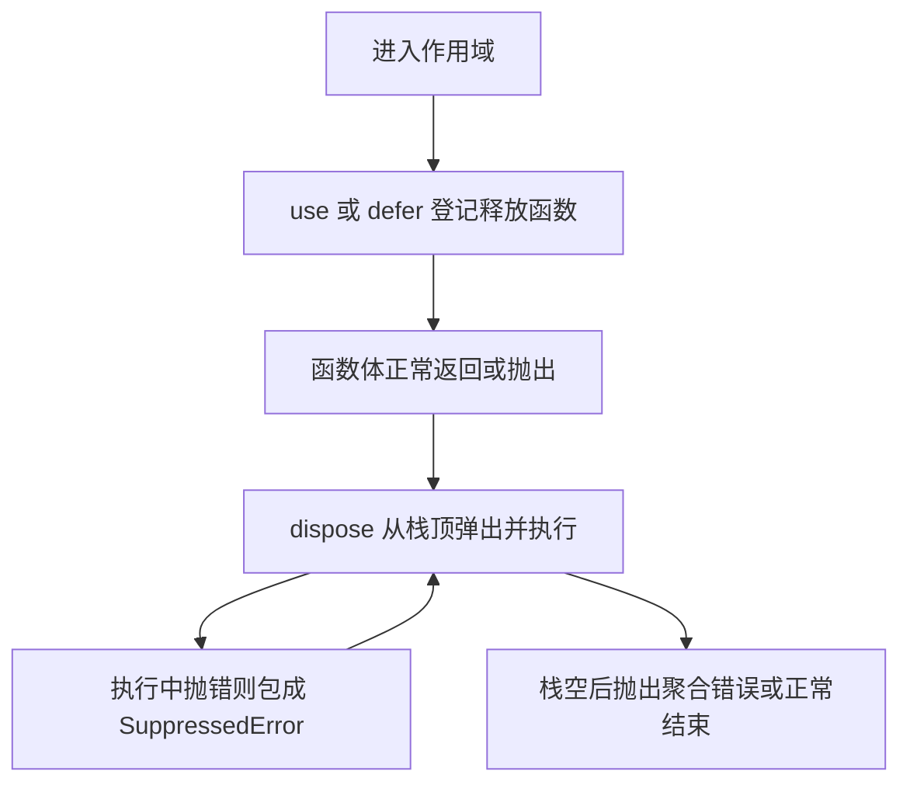

# ES2023–ES2025 新特性全解

!!! abstract "核心结论"

    - 这三年的新增能力可以归为三条主线：集合与迭代协议（Set 集合运算、Iterator helpers）、异步与资源生命周期（Promise.withResolvers、Promise.try、using/await using）、语法与宿主边界（RegExp v 标志、import attributes、Atomics.waitAsync）。
    - 判断"某特性属于哪个 ES 版本"的唯一依据是它进入 Stage 4 的时间点；判断"能不能用"的唯一依据是引擎与运行时版本。两者不是一回事，面试里必须分开回答。
    - Set 集合运算与 Iterator helpers 的规范语义分别建立在 SameValueZero 和迭代器协议之上；手写实现必须复刻这两条底层规则，否则边界行为不等价。
    - 显式资源管理（using）不只是语法糖：它规定了解构顺序（LIFO）、错误聚合（SuppressedError）以及 Symbol.dispose / Symbol.asyncDispose 两个协议槽。
    - 本页所有手写实现都附带可运行的 node:assert 用例；凡是版本归属或兼容性没有十足把握的地方，一律标注"需核对官方文档"。

## 1. 版本坐标与判据

### 1.1 Stage 4 与年度版本的关系

TC39 的提案流程大致是：Stage 0 strawman、Stage 1 proposal、Stage 2 draft、Stage 2.7（已有规范文本与测试）、Stage 3 candidate、Stage 4 finished。一个提案进入 Stage 4 意味着：规范文本已被 ECMA-262 的编辑接受并合入主干，且至少有两个符合规范的实现通过了 Test262 相关用例。

年度版本（ES2023、ES2024、ES2025）是该年 6 月前后 ECMA-262 快照所包含的全部 Stage 4 提案的集合。所以"某特性属于 ES2025"只是说它出现在该版规范文本里，不代表任何引擎都会在当年支持它——引擎按自己的发布节奏实现，Node.js 的支持则取决于它捆绑的 V8 版本。反过来，一个特性在 Chrome 上可用，也不代表它已经进入任何一版 ES。

### 1.2 本页覆盖的特性与版本归属

下表中的"规范归属"是我的判断；凡是需要以 TC39 官方 finished-proposals 列表复核的，都标了"需核对"。

| 特性 | 规范归属 | 备注 |
|---|---|---|
| Array.prototype.findLast / findLastIndex | ES2023 | |
| Array 只读变换：toReversed / toSorted / toSpliced / with | ES2023 | 常被合称 Change Array by copy |
| Hashbang Grammar、Symbols as WeakMap keys | ES2023 | 前者只影响源码文本解析 |
| Object.groupBy / Map.groupBy | ES2024 | 返回 null 原型对象 |
| Promise.withResolvers | ES2024 | |
| RegExp v 标志（unicodeSets） | ES2024 | 与 u 互斥 |
| String.prototype.isWellFormed / toWellFormed | ES2024 | |
| Atomics.waitAsync | ES2024 | 需要 SharedArrayBuffer |
| ArrayBuffer.prototype.transfer / resize | ES2024 | 可调整大小的 ArrayBuffer |
| Iterator helpers（map / filter / take / drop / flatMap / toArray ...） | ES2025（需核对） | 挂在 %Iterator.prototype% 上 |
| Set 集合方法（union / intersection / ...） | ES2025（需核对） | 接收 set-like 对象 |
| RegExp.escape | ES2025（需核对） | 具体转义集合需核对官方文档 |
| 重复命名捕获组 | ES2025（需核对） | 仅限同一 disjunction 的不同分支 |
| RegExp 修饰符 ( ?i: ... )、Error.isError、Array.fromAsync | ES2025（需核对） | |
| import attributes（with { type: ... }） | ES2025（需核对） | 早期语法 assert 已废弃 |
| JSON modules | ES2025（需核对） | 与 import attributes 配套 |
| Promise.try | ES2025（需核对） | |
| using / await using / DisposableStack | ES2025（需核对） | 需要转译器或新运行时 |
| Float16Array / Math.f16round / DataView get-setFloat16 | ES2025（需核对） | 运行时支持情况差异大 |

### 1.3 正确的可用性判据

不要靠 UA 字符串或版本号猜能力，直接用特性检测：

- `typeof Set.prototype.union === 'function'`
- `typeof Iterator === 'function' && typeof Iterator.prototype.toArray === 'function'`
- `typeof Promise.withResolvers === 'function'`、`typeof Object.groupBy === 'function'`
- v 标志：`try { new RegExp('a', 'v'); return true } catch { return false }`
- `typeof Atomics.waitAsync === 'function'`、`typeof Float16Array === 'function'`

这些检测都是安全的：不支持的引擎会在对应位置抛 SyntaxError 或返回 undefined。切忌用 `new RegExp('[\\q{a|b}]', 'v')` 这种"看 pattern 会不会报错"的写法来探测 v 标志——在非 unicode 模式下该 pattern 是合法字符类，会误判为支持。

## 2. Set 集合运算

### 2.1 底层语义：SameValueZero 与 set-like

Set 的成员判定使用 SameValueZero：NaN 与 NaN 视为同一成员，+0 与 -0 视为同一成员。V8 里 Set 底层是有序哈希表（ordered hash table），因此遍历顺序等于插入顺序，且 `has()` 是平均 O(1)。集合运算的结果顺序由规范规定：union 按 this 再按 other，intersection 与 difference 跟随 this，symmetricDifference 先输出 this 独有的再输出 other 独有的。

规范里这些方法的参数是"set-like"对象——只要有数字型的 `size` 属性和 `has`、`keys` 方法即可，不要求是 Set 实例。`isSubsetOf` 之类还会用 `size` 做快速否定。手写实现如果接受任意可迭代对象，是更宽松的近似，属于可接受的偏离，但要知道自己偏离在哪。

### 2.2 手写实现与验证

**验证标准**：运行下面整段（实现 + 断言），预期输出 `set ops ok`。

```js
// 运行环境：Node.js 16+，保存为 set-ops.js 后直接 node set-ops.js
const assert = require('node:assert/strict');

// 第 1 段：把任意可迭代对象规约为 Set，统一 SameValueZero 语义
function toSet(value) {
  return value instanceof Set ? value : new Set(value);
}

// 第 2 段：并集。按 this 的顺序输出，重复项交给 Set 去重
function setUnion(a, b) {
  const out = new Set(a);
  for (const v of b) out.add(v);
  return out;
}

// 第 3 段：交集。必须跟随 this 的迭代顺序，所以不能为了省 has() 调用而交换两侧
function setIntersection(a, b) {
  const left = toSet(a);
  const right = toSet(b);
  const out = new Set();
  for (const v of left) if (right.has(v)) out.add(v);
  return out;
}

// 第 4 段：差集 this \ other
function setDifference(a, b) {
  const left = toSet(a);
  const right = toSet(b);
  const out = new Set();
  for (const v of left) if (!right.has(v)) out.add(v);
  return out;
}

// 第 5 段：对称差集，先 this 独有，再 other 独有
function setSymmetricDifference(a, b) {
  const left = toSet(a);
  const right = toSet(b);
  const out = new Set();
  for (const v of left) if (!right.has(v)) out.add(v);
  for (const v of right) if (!left.has(v)) out.add(v);
  return out;
}

// 第 6 段：三个谓词。isDisjointFrom 不产生输出顺序，可以安全地按 size 选小的一侧
function setIsSubsetOf(a, b) {
  const left = toSet(a);
  const right = toSet(b);
  if (left.size > right.size) return false;
  for (const v of left) if (!right.has(v)) return false;
  return true;
}
function setIsSupersetOf(a, b) {
  return setIsSubsetOf(toSet(b), toSet(a));
}
function setIsDisjointFrom(a, b) {
  const left = toSet(a);
  const right = toSet(b);
  const [small, large] = left.size <= right.size ? [left, right] : [right, left];
  for (const v of small) if (large.has(v)) return false;
  return true;
}

// ---- 验证标准 ----
const A = new Set([1, 2, 3]);
const B = new Set([3, 4]);

assert.deepStrictEqual([...setUnion(A, B)], [1, 2, 3, 4]);
assert.deepStrictEqual([...setIntersection(A, B)], [3]);
assert.deepStrictEqual([...setDifference(A, B)], [1, 2]);
assert.deepStrictEqual([...setSymmetricDifference(A, B)], [1, 2, 4]);
assert.strictEqual(setIsSubsetOf(new Set([1, 2]), A), true);
assert.strictEqual(setIsSupersetOf(A, new Set([1, 2])), true);
assert.strictEqual(setIsDisjointFrom(A, new Set([4, 5])), true);
assert.strictEqual(setIsDisjointFrom(A, B), false);

// SameValueZero：NaN 与自身相等，并集不会出现两个 NaN
assert.strictEqual(setUnion(new Set([NaN]), new Set([NaN])).size, 1);
// +0 与 -0 视为同一成员
assert.strictEqual(setIntersection(new Set([0]), new Set([-0])).size, 1);

// 不修改入参
assert.deepStrictEqual([...A], [1, 2, 3]);

console.log('set ops ok');
```

逐段说明：

1. `toSet` 是所有函数的公共入口。它保证了后续代码可以无条件使用 `has()` 与 `size`，也把"参数可以是数组"这一便利固定下来。
2. `setUnion` 直接 `new Set(a)` 拷贝，再逐项并入 b。拷贝这一步是必要的：规范要求返回新集合，不能原地改 a。
3. `setIntersection` 遍历 left 而不是按 size 选小的一侧。这是一个刻意的取舍：交换两侧能把 `has()` 调用次数从 O(|left|) 降到 O(min)，但输出顺序会从"跟随 this"变成"跟随 other"，这就是可观察行为的破坏。凡是优化与规范可观察行为冲突，一律服从规范。
4. `setSymmetricDifference` 必须两次遍历。可以用 `left.has` 而不是 `right.has` 做第二趟判断，因为两侧此时都已是 Set 实例。
5. `isDisjointFrom` 没有输出顺序，所以按 size 选小侧是安全的优化，正好和 `setIntersection` 形成对照。
6. 断言里同时覆盖了顺序、SameValueZero 的两种典型场景、以及入参不可变性。易错点：`assert.deepStrictEqual` 对 NaN 使用 SameValue 比较，所以 `[NaN]` 与 `[NaN]` 相等，但这里刻意改成比较 `size`，避免读者对断言语义产生误解。

## 3. Iterator Helpers

### 3.1 底层：迭代器协议、一次性与惰性

迭代器协议是：对象有 `next()`，返回 `{ value, done }`；可选地有 `return()`，用于在消费方提前结束时释放资源。`for...of`、展开运算符、解构在遇到 break / return / throw 时都会尝试调用迭代器的 `return()`。这一点是 `take(n)` 能安全截断无限迭代器的根本原因。

原生 helpers 挂在 `%Iterator.prototype%` 上，也就是说只有迭代器对象才有 `map` / `filter` / `take` / `drop` / `flatMap` / `reduce` / `toArray` / `forEach` / `some` / `every` / `find`。数组本身是 iterable 但不是 iterator，必须先 `Iterator.from(arr)` 或 `arr.values()`。`Iterator.from(x)` 的语义是：如果 x 已经是迭代器（有 `next`）就直接用，否则调用 `x[Symbol.iterator]()` 并包装，结果保证拥有 %Iterator.prototype% 上的方法。

惰性的关键是"消费方驱动"：每个 helper 返回一个新的迭代器，只有被 `next()` 拉动时才向上游要一个元素。因此中间不产生数组，也不会预先算完整条链。

| 维度 | Array.prototype.map / filter | Iterator.prototype.map / filter |
|---|---|---|
| 求值时机 | 立即，返回新数组 | 惰性，返回迭代器 |
| 中间结果 | 每一步都物化一个完整数组 | 无中间数组，逐项传递 |
| 无限序列 | 不可用，会 OOM | 可用，配合 take 截断 |
| 重复遍历 | 可以，数组是持久的 | 不可以，迭代器一次性 |
| 回调参数 | (value, index, array) | (value, index)，没有集合本身 |
| 结束时机 | 遍历完整个集合 | 由消费方决定 |

### 3.2 手写实现与验证

**验证标准**：运行下面整段，预期输出 `iterator helpers ok`。

```js
// 运行环境：Node.js 16+（仅使用 generator 与 class，属于 ES2015 语法）
const assert = require('node:assert/strict');

// 第 1 段：Iter 同时充当 iterable 与链式容器，用 generator 实现惰性管道
class Iter {
  constructor(iterable) {
    this._src = iterable;
  }

  // 代理到上游的迭代器工厂，而不是缓存某个迭代器
  [Symbol.iterator]() {
    return this._src[Symbol.iterator]();
  }

  map(fn) {
    const src = this;
    return new Iter({
      *[Symbol.iterator]() {
        let i = 0;
        for (const v of src) yield fn(v, i++);
      },
    });
  }

  filter(fn) {
    const src = this;
    return new Iter({
      *[Symbol.iterator]() {
        let i = 0;
        for (const v of src) if (fn(v, i++)) yield v;
      },
    });
  }

  take(n) {
    const src = this;
    return new Iter({
      *[Symbol.iterator]() {
        if (n <= 0) return; // take(0) 不拉取任何上游元素
        let left = n;
        for (const v of src) {
          yield v;
          if (--left === 0) return; // 提前结束会触发上游 iterator.return()
        }
      },
    });
  }

  drop(n) {
    const src = this;
    return new Iter({
      *[Symbol.iterator]() {
        let seen = 0;
        for (const v of src) {
          if (seen < n) {
            seen += 1;
            continue;
          }
          yield v;
        }
      },
    });
  }

  flatMap(fn) {
    const src = this;
    return new Iter({
      *[Symbol.iterator]() {
        let i = 0;
        for (const v of src) for (const w of fn(v, i++)) yield w; // 只展开一层
      },
    });
  }

  reduce(fn, ...init) {
    let acc;
    let hasAcc = init.length > 0;
    if (hasAcc) acc = init[0];
    let i = 0;
    for (const v of this) {
      if (!hasAcc) {
        acc = v;
        hasAcc = true;
        i += 1;
        continue;
      }
      acc = fn(acc, v, i); // index 按已消费项计数，与规范一致
      i += 1;
    }
    if (!hasAcc) throw new TypeError('Reduce of empty iterator with no initial value');
    return acc;
  }

  toArray() {
    return [...this];
  }

  static from(iterable) {
    return new Iter(iterable);
  }
}

// ---- 验证标准 ----
function* naturals() {
  let i = 1;
  while (true) yield i++;
}

// 惰性 + 无限序列：数组方法做不到
assert.deepStrictEqual(
  Iter.from(naturals()).map((x) => x * 2).filter((x) => x % 3 === 0).take(3).toArray(),
  [6, 12, 18]
);

assert.deepStrictEqual(Iter.from([1, 2, 3, 4, 5]).drop(2).toArray(), [3, 4, 5]);
assert.deepStrictEqual(Iter.from([1, 2]).flatMap((x) => [x, x * 10]).toArray(), [1, 10, 2, 20]);

// reduce 的两种入口与空序列报错
assert.strictEqual(Iter.from([1, 2, 3, 4]).reduce((a, b) => a + b), 10);
assert.strictEqual(Iter.from([1, 2]).reduce((a, b) => a + b, 10), 13);
assert.throws(() => Iter.from([]).reduce((a, b) => a + b), TypeError);

// 真惰性：take(1) 只应消费上游 1 个元素
let pulls = 0;
const probes = Iter.from([1, 2, 3, 4, 5])
  .map((x) => {
    pulls += 1;
    return x;
  })
  .take(1)
  .toArray();
assert.deepStrictEqual(probes, [1]);
assert.strictEqual(pulls, 1);

// take(0) 立即结束，一个元素都不拉
let pulls0 = 0;
assert.deepStrictEqual(
  Iter.from([1, 2])
    .map((x) => {
      pulls0 += 1;
      return x;
    })
    .take(0)
    .toArray(),
  []
);
assert.strictEqual(pulls0, 0);

console.log('iterator helpers ok');
```

逐段解析：

1. `[Symbol.iterator]()` 每次都向上游要一个新迭代器，而不是缓存 `_src[Symbol.iterator]()` 的结果。对数组这类可重复迭代的源，这保证了 `Iter.from([1,2]).toArray()` 可以调用两次；对 generator 这类一次性源，第二次仍会拿到同一个已耗尽的迭代器，这与原生行为一致。
2. `map` / `filter` 用闭包捕获 `src` 而不是 `this`。generator 方法体内的 `this` 指向生成的对象，不指向 Iter 实例，闭包捕获是这里唯一可靠的写法。
3. `take` 的 `--left === 0` 判断放在 `yield` 之后：`yield` 先把手上的元素交给消费方，消费方再次 `next()` 时才检查是否已够数。因此上游被拉取的次数恰好等于 n，不会多拉一个。
4. `take` 的 `return` 是惰性管道的资源回收点：`for...of` 在 generator 提前结束时，会调用上游迭代器的 `return()`。如果上游是持有文件句柄的生成器，这一步就是关闭时机。
5. `flatMap` 的两次 `for...of` 嵌套，只展开一层，与 `Array.prototype.flatMap` 的深度约束一致。
6. `reduce` 用 rest 参数区分"有没有传初值"。无初值时第一项直接成为累加器，并且计数器立刻加一，这样第二项的 index 就是 1——如果写成先调回调再加计数，index 会整体偏移一位。

## 4. Promise.withResolvers 与 Promise.try

### 4.1 底层：executor 的同步调用与 deferred

`new Promise(executor)` 会同步调用 executor，并把 `resolve` 与 `reject` 两个函数作为参数交给它。这带来一个长期存在的样板问题：如果 promise 的"决定权"要在构造之后、甚至在其他异步回调里使用，就必须用外层闭包变量把这两个函数"抬"出来。这就是 deferred 模式，也是各种 Promise 库的 `defer()` 的由来。

`Promise.withResolvers()` 就是把这段样板交给引擎。规范上它以 `this` 作为构造器（因此 Promise 子类可用），返回 `{ promise, resolve, reject }` 三个字段的普通对象。

`Promise.try(fn, ...args)` 的规范步骤是：构造 capability、同步调用 `fn`、若抛出则 reject、否则 resolve 其返回值、返回 promise。它解决的是"同步可能抛、异步可能 reject"的混合函数统一返回 promise 的问题。与 `Promise.resolve().then(fn)` 的关键差异在于：`Promise.try` 的 `fn` 在当前调用栈内同步执行，所以同步段里的副作用顺序是可预期的；而 `then` 版必须等一个微任务。

### 4.2 手写实现与验证

**验证标准**：运行下面整段，预期输出 `promise helpers ok`。这是异步脚本，断言失败会由末尾的 catch 打印并把退出码置为非零。

```js
// 运行环境：Node.js 16+
const assert = require('node:assert/strict');

// 第 1 段：withResolvers —— 用闭包把 executor 的两个回调抬到外面
function withResolvers() {
  let resolve;
  let reject;
  const promise = new Promise((res, rej) => {
    resolve = res;
    reject = rej;
  });
  // executor 是同步执行的，返回时三者一定都已就绪
  return { promise, resolve, reject };
}

// 第 2 段：promiseTry —— fn 同步执行，异常转成 rejected promise
function promiseTry(fn, ...args) {
  return new Promise((resolve) => resolve(fn(...args)));
}

// ---- 验证标准 ----
(async () => {
  // withResolvers：先拿到 promise，再在"稍后"决定它的命运
  const first = withResolvers();
  assert.strictEqual(typeof first.resolve, 'function');
  assert.strictEqual(typeof first.reject, 'function');
  queueMicrotask(() => first.resolve(42));
  assert.strictEqual(await first.promise, 42);

  // reject 路径
  const second = withResolvers();
  const marker = new Error('boom');
  queueMicrotask(() => second.reject(marker));
  let caught = null;
  try {
    await second.promise;
  } catch (e) {
    caught = e;
  }
  assert.strictEqual(caught, marker);

  // promiseTry：fn 在同步段执行，所以 'fn' 一定排在 'sync' 前面
  const order = [];
  promiseTry(() => {
    order.push('fn');
    return 'value';
  }).then((v) => order.push(v));
  order.push('sync');
  await Promise.resolve();
  assert.deepStrictEqual(order, ['fn', 'sync', 'value']);

  assert.strictEqual(await promiseTry((a, b) => a + b, 1, 2), 3);
  assert.strictEqual(await promiseTry(() => Promise.resolve(7)), 7);

  const thrown = new Error('from fn');
  let caught2 = null;
  try {
    await promiseTry(() => {
      throw thrown;
    });
  } catch (e) {
    caught2 = e;
  }
  assert.strictEqual(caught2, thrown);

  console.log('promise helpers ok');
})().catch((err) => {
  console.error(err);
  process.exitCode = 1;
});
```

逐段解析：

1. `withResolvers` 依赖一个规范保证：executor 被同步调用。因此 `return` 语句执行时 `resolve` 和 `reject` 一定是函数而不是 undefined。如果 Promise 的构造函数改变这一时序，这段实现立刻失效——这就是"样板代码能成立"的底层依据。
2. 测试里用 `queueMicrotask` 模拟"稍后决定"。这样既能验证 promise 在 finalize 前处于 pending，也避免了 `setTimeout` 带来的时间不确定性。
3. `promiseTry` 用 `new Promise((resolve) => resolve(fn(...args)))`。`fn` 的调用发生在 executor 内部，所以同步抛出的异常会被 Promise 构造函数捕获并转成 rejection——不需要显式 try/catch。
4. 微任务顺序断言依赖两条规则：对已 fulfilled 的 promise 调用 `then`，reaction 作业立刻入队；`await` 一个已 resolve 的 promise 只消耗一个 tick，其续体排在 reaction 作业之后。所以 `['fn', 'sync', 'value']` 是稳定结果，不是巧合。
5. 与规范的一处细微差异：规范中若 capability 的 `resolve` 自身抛错，会同步向外抛；`new Promise` 版本会把这种异常转成 rejection。这是极端边界，实际业务几乎遇不到，但面试被追问"你的实现和原生的区别"时值得主动说出。

## 5. Object.groupBy 与 Map.groupBy

### 5.1 底层：ToPropertyKey 与 null 原型

`Object.groupBy(items, callback)` 返回一个通过 `OrdinaryObjectCreate(null)` 创建的普通对象，也就是原型为 null 的对象。这个设计是刻意的：分组键来自用户数据，如果返回普通对象，`__proto__`、`constructor` 这类键名就可能触发原型链上的 setter 或造成污染；原型为 null 之后这些键名只可能是普通自有属性。

键的处理走 ToPropertyKey：数字键被转成字符串（`1` 变成 `"1"`），Symbol 键原样保留，对象键会被字符串化成 `"[object Object]"`——这是 `Object.groupBy` 最典型的误用点。

`Map.groupBy(items, callback)` 用 Map 作容器，键按 SameValueZero 比较，不做字符串化，所以对象键按引用区分、NaN 可以作为键、-0 与 +0 合一。两者都按迭代顺序单趟完成，每个桶是一个 push 出来的数组，回调收到 `(item, index)`。

### 5.2 手写实现与验证

**验证标准**：运行下面整段，预期输出 `groupBy ok`。

```js
// 运行环境：Node.js 16+
const assert = require('node:assert/strict');
const hasOwn = (obj, key) => Object.prototype.hasOwnProperty.call(obj, key);

// 第 1 段：Object.groupBy。__proto__: null 是对象字面量里唯一能安全清空原型的写法
function objectGroupBy(items, keyFn) {
  const out = { __proto__: null };
  let i = 0;
  for (const item of items) {
    const key = keyFn(item, i++);
    const k = typeof key === 'symbol' ? key : String(key); // ToPropertyKey 的简化版
    if (hasOwn(out, k)) out[k].push(item);
    else out[k] = [item];
  }
  return out;
}

// 第 2 段：Map.groupBy。键按 SameValueZero 比较，不做字符串化
function mapGroupBy(items, keyFn) {
  const out = new Map();
  let i = 0;
  for (const item of items) {
    const key = keyFn(item, i++);
    const bucket = out.get(key);
    if (bucket === undefined) out.set(key, [item]);
    else bucket.push(item);
  }
  return out;
}

// ---- 验证标准 ----
const parity = objectGroupBy([1, 2, 3, 4, 5], (n) => (n % 2 ? 'odd' : 'even'));
assert.deepStrictEqual(parity.odd, [1, 3, 5]);
assert.deepStrictEqual(parity.even, [2, 4]);
assert.strictEqual(Object.getPrototypeOf(parity), null); // 无原型，避免原型污染

// 危险键名只当普通自有属性处理
const evil = objectGroupBy(['x'], () => '__proto__');
assert.strictEqual(Object.getPrototypeOf(evil), null);
assert.deepStrictEqual(Object.getOwnPropertyDescriptor(evil, '__proto__').value, ['x']);

// 数字键被字符串化
const byLen = objectGroupBy(['a', 'bb', 'cc'], (s) => s.length);
assert.deepStrictEqual(Object.keys(byLen), ['1', '2']);

// Map.groupBy：对象键按引用，NaN 也可以作键
const shared = { id: 1 };
const m = mapGroupBy([1, 2, 3], (n) => (n < 3 ? shared : NaN));
assert.deepStrictEqual(m.get(shared), [1, 2]);
assert.deepStrictEqual(m.get(NaN), [3]);
assert.strictEqual(m.size, 2);

// 回调第二参数是 index
assert.deepStrictEqual(objectGroupBy(['a', 'b', 'c'], (_, i) => i).__proto__, undefined);
assert.deepStrictEqual(Object.keys(objectGroupBy(['a', 'b', 'c'], (_, i) => i)), ['0', '1', '2']);

console.log('groupBy ok');
```

逐段解析：

1. `{ __proto__: null }` 是对象字面量中唯一能把原型设成 null 的写法；`obj.__proto__ = null` 会被原型链上的访问器拦截，不是同一件事。后续 `out[k] = ...` 走普通赋值，由于原型链上没有 `__proto__` 访问器，`'__proto__'` 键会正常创建自有数据属性。
2. 用 `hasOwn` 而不是 `k in out`：`in` 会查原型链，即使原型是 null 也不该养成这个习惯；如果哪天把容器换成普通对象，`in` 会立刻出错。
3. `String(key)` 是 ToPropertyKey 的简化。真正的 ToPropertyKey 会先看值是否为 Symbol，若是则直接返回，否则 ToString——这段实现只覆盖了这条主路径，属性描述符等更细的转换规则在这里不会出现，因为分组键不可能是对象描述符。
4. `mapGroupBy` 用 `out.get(key)` 的返回值是否为 undefined 判断桶是否存在。这里有一个易错点：桶永远是数组，绝不会是 undefined，所以判断安全；但如果哪天改成存别的东西，就要换成 `out.has(key)`。
5. 最后一组断言专门验证 index 参数。`objectGroupBy(...)` 返回的是 null 原型对象，`Object.keys` 对它照常工作，返回字符串键的升序数组。

## 6. Array 只读变换与 findLast

### 6.1 底层：副本操作与稀疏数组

Change Array by copy 的四个方法本质上都是"在副本上执行原方法"：先按 Species 规则创建一个同长度新数组，再逐项复制并操作。它们和 `[...arr]` 的差别全部集中在稀疏数组上：规范的复制步骤用 `HasProperty` 判断源下标是否存在，空洞在新数组里仍然是空洞；而展开运算符和 `slice` 会把空洞变成 `undefined`。这是迁移到新 API 时最容易产生行为漂移的地方。

`findLast` / `findLastIndex` 从尾部向前遍历，同样用 `HasProperty` 跳过空洞。返回 undefined 与"找到 undefined 元素"在语义上不可区分，所以有需要时应该用 `findLastIndex`。

### 6.2 手写实现与验证

**验证标准**：运行下面整段，预期输出 `array copy & findLast ok`。

```js
// 运行环境：Node.js 16+
const assert = require('node:assert/strict');
const hasOwn = (obj, key) => Object.prototype.hasOwnProperty.call(obj, key);

// 第 1 段：findLast。从尾部向前，跳过空洞
function findLast(arr, predicate, thisArg) {
  for (let i = arr.length - 1; i >= 0; i -= 1) {
    if (!hasOwn(arr, i)) continue;
    if (predicate.call(thisArg, arr[i], i, arr)) return arr[i];
  }
  return undefined;
}

// 第 2 段：with。支持负索引，越界抛 RangeError
function arrayWith(arr, index, value) {
  const len = arr.length;
  const rel = Math.trunc(Number(index)) || 0; // NaN 与 -0 都归一到 0
  const actual = rel < 0 ? len + rel : rel;
  if (actual < 0 || actual >= len) throw new RangeError('Invalid index');
  const out = arr.slice();
  out[actual] = value;
  return out;
}

// 第 3 段：toReversed。倒序副本，原数组不动
function arrayToReversed(arr) {
  const out = [];
  for (let i = arr.length - 1; i >= 0; i -= 1) out.push(arr[i]);
  return out;
}

// 第 4 段：toSorted。副本上排序；Node 12+ 的 Array#sort 已是稳定排序
function arrayToSorted(arr, compareFn) {
  return arr.slice().sort(compareFn);
}

// 第 5 段：toSpliced。在副本上做 splice，返回替换后的新数组
function arrayToSpliced(arr, start, deleteCount, ...items) {
  const len = arr.length;
  const rel = Math.trunc(Number(start)) || 0;
  const actual = Math.min(Math.max(rel < 0 ? len + rel : rel, 0), len);
  const dc =
    deleteCount === undefined
      ? len - actual
      : Math.min(Math.max(Math.trunc(Number(deleteCount)) || 0, 0), len - actual);
  return arr.slice(0, actual).concat(items, arr.slice(actual + dc));
}

// ---- 验证标准 ----
const base = [1, 2, 3, 4];
assert.deepStrictEqual(arrayToReversed(base), [4, 3, 2, 1]);
assert.deepStrictEqual(base, [1, 2, 3, 4]); // 原数组未被修改
assert.deepStrictEqual(arrayToSorted([3, 1, 2]), [1, 2, 3]);
assert.deepStrictEqual(arrayToSorted([10, 9, 1], (a, b) => a - b), [1, 9, 10]);
assert.deepStrictEqual(arrayToSpliced([1, 2, 3, 4], 1, 2, 9, 9), [1, 9, 9, 4]);
assert.deepStrictEqual(arrayToSpliced([1, 2, 3], 1), [1]);
assert.deepStrictEqual(arrayWith([1, 2, 3], -1, 9), [1, 2, 9]);
assert.throws(() => arrayWith([1, 2, 3], 3, 9), RangeError);
assert.strictEqual(findLast([1, 2, 3, 4], (n) => n % 2 === 1), 3);
assert.strictEqual(findLast([], () => true), undefined);

// 稀疏数组：findLast 跳过空洞（与 hasOwn 判断一致）
const sparse = [1, , 3];
assert.strictEqual(findLast(sparse, (v) => v === undefined), undefined);

console.log('array copy & findLast ok');
```

逐段解析：

1. `findLast` 的 `thisArg` 通过 `predicate.call` 传入，并且按 `(value, index, array)` 传参，与原生签名一致。空洞判断复用 `hasOwn`，保证与规范用 `HasProperty` 的语义对齐。
2. `arrayWith` 的 `Math.trunc(Number(index)) || 0` 同时处理三种输入：`-0` 经过 `||` 变成 `0`，`NaN` 也变成 `0`，正常负数保持负数。随后把负索引转成 `len + rel`。越界（含等于 len）抛 RangeError，这也是原生 `with` 的行为。
3. `arrayToReversed` 用 `push` 构造结果数组，长度固定，没有额外开销。注意它与原生 `toReversed` 在稀疏数组上不等价：原生保留空洞，本实现不保留。这个偏差是刻意用注释标出的教学简化，真正做 polyfill 时必须用 `hasOwn` + 直接赋值复刻。
4. `arrayToSorted` 用 `arr.slice()` 复制再 `sort`。之所以不用 `[...arr]`，是为了让读者看清"复制"这一步的存在；两者在不含空洞时结果相同。
5. `arrayToSpliced` 把开始位置与删除数量都做了 clamp。`deleteCount === undefined` 时删除到末尾，这是 `splice` 的既有语义；必须先算 `actual` 再算 `dc`，否则负 start 场景下的默认删除长度会算错。

## 7. 正则：v 标志、重复命名捕获组、RegExp.escape

### 7.1 底层：字符类从 range 列表变成集合代数

在 `u` 模式下，正则引擎把 pattern 看作 code point 序列，字符类编译成一组码点区间（range list），匹配时做区间查找。`v` 模式（unicodeSets）在此之上把字符类升级为真正的字符集合：支持 `[\p{Letter}&&\p{Script=Greek}]` 这类交集、`[\p{Letter}--\p{ASCII}]` 这类差集，以及 `[\q{ab|cd}]` 这类字符串字面量集合（`\q{}` 是 v 模式独有的，因为一个字符类里现在可以放多字符字符串）。

编译期这些集合运算会被折叠成最终的区间列表与字符串集合，所以运行期匹配依旧是常数级成员判定，而不是逐个候选字符回溯。`u` 与 `v` 互斥，同时使用会抛 SyntaxError。

迁移风险集中在字符类的词法收紧上：v 模式下 `&&`、`--`、`!!` 这类双标点以及部分单标点必须转义，否则直接是 SyntaxError；而 `[a&&b]` 的含义也从"包含 a、&、b 三个字符"变成"a 与 b 的交集（空集）"。因此把已有 pattern 从 `u` 升到 `v` 时，必须逐个回归测试，需要核对官方文档中 ClassSet 的具体词法规则。

重复命名捕获组的规则是：同一个 disjunction 的不同分支里允许出现同名捕获组，因为这些组在同一时刻不可能都被匹配。匹配结果中 `groups` 对象只包含实际参与匹配的那个组的键，其余为 undefined。

### 7.2 RegExp.escape 的转义策略

`RegExp.escape` 的目标是把任意字符串转成一段可以安全嵌入正则的字面量。最小可用集合是 SyntaxCharacter（`^ $ \ . * + ? ( ) [ ] { } |`）加上 `/`。下面给出的是教学近似实现，不等价于规范的完整算法——例如规范还处理了"拼接后首字符被解释成反向引用"的问题，需要核对官方文档。特别注意：不要在 `u` / `v` 模式下转义 `-`，因为那些模式下 IdentityEscape 只允许 SyntaxCharacter 与 `/`，`\-` 会直接变成 SyntaxError。

**验证标准**：运行下面整段。是否打印 `v flag: native supported` 与 `dup named groups: native supported` 取决于运行时的 V8 版本：v 标志在 Node 20 及以上可用，重复命名捕获组的支持情况需核对官方文档。前两组断言在所有 Node 16+ 上都必然通过。

```js
// 运行环境：Node.js 16+
const assert = require('node:assert/strict');

// 第 1 段：RegExp.escape 的教学近似实现
function escapeRegExpLiteral(input) {
  if (typeof input !== 'string') throw new TypeError('input must be a string');
  // 只转义语法字符与 '/'，这在 u 模式和 v 模式下都合法
  return input.replace(/[\\^$.*+?()\[\]{}|\/]/g, '\\$&');
}

// 第 2 段：重复命名组的等价写法。唯一命名 + 匹配后归并
// 等价于 /(?<year>\d{4})-\d{2}|\d{2}-(?<year>\d{4})/，后者需要支持重复命名组的运行时
const yearRe = /(?<yearHead>\d{4})-\d{2}|\d{2}-(?<yearTail>\d{4})/;
function extractYear(text) {
  const m = yearRe.exec(text);
  if (!m) return undefined;
  return m.groups.yearHead ?? m.groups.yearTail;
}

// ---- 验证标准 ----
// RegExp.escape：转义后可安全拼接
assert.strictEqual(escapeRegExpLiteral('a.b'), 'a\\.b');
assert.strictEqual(escapeRegExpLiteral('a+b*c'), 'a\\+b\\*c');
const userInput = '1+1=2 (maybe)';
const built = new RegExp('^' + escapeRegExpLiteral(userInput) + '$');
assert.strictEqual(built.test('1+1=2 (maybe)'), true);
assert.strictEqual(built.test('1+1=2 maybe'), false);
assert.throws(() => escapeRegExpLiteral(123), TypeError);

// 重复命名组的等价写法
assert.strictEqual(extractYear('2024-05'), '2024');
assert.strictEqual(extractYear('05-2024'), '2024');
assert.strictEqual(extractYear('nope'), undefined);

// 第 3 段：真实语法与 v 标志的特性检测
const DUP_NAMED_GROUPS = (() => {
  try {
    new RegExp('(?<y>a)|(?<y>b)');
    return true;
  } catch {
    return false;
  }
})();
if (DUP_NAMED_GROUPS) {
  const m = /(?<y>a)|(?<y>b)/.exec('b');
  assert.strictEqual(m.groups.y, 'b');
  console.log('dup named groups: native supported');
} else {
  console.log('dup named groups: not supported by this runtime, skipped');
}

// 第 4 段：v 标志的集合语义。用 u 模式的属性转义 + 手写交集模拟它的行为
const isGreekLetter = (ch) => /^\p{Letter}$/u.test(ch) && /^\p{Script=Greek}$/u.test(ch);
assert.strictEqual(isGreekLetter('\u03b1'), true); // 希腊小写 alpha
assert.strictEqual(isGreekLetter('\u0391'), true); // 希腊大写 Alpha
assert.strictEqual(isGreekLetter('A'), false);
assert.strictEqual(isGreekLetter('1'), false);

const V_FLAG = (() => {
  try {
    new RegExp('a', 'v');
    return true;
  } catch {
    return false;
  }
})();
if (V_FLAG) {
  // 字母集合 与 希腊字母集合 的交集
  const greekLetter = /^[\p{Letter}&&\p{Script=Greek}]$/v;
  assert.strictEqual(greekLetter.test('\u03b1'), true);
  assert.strictEqual(greekLetter.test('A'), false);
  // \q{} 是 v 模式独有的字符串字面量集合
  assert.strictEqual(/^[\q{ab|cd}]$/v.test('cd'), true);
  assert.strictEqual(/^[\q{ab|cd}]$/v.test('ce'), false);
  console.log('v flag: native supported');
} else {
  console.log('v flag: not supported by this runtime, skipped');
}
```

逐段解析：

1. `escapeRegExpLiteral` 的字符类里对 `[` 与 `]` 做了转义。虽然非 unicode 模式下类内未转义的 `[` 是合法的 Annex B 扩展，但把它写进源码是一种坏习惯，会让代码在 `u` 模式下失效。
2. 已知差异写进了注释：规范版本还会对开头的数字做十六进制转义（避免 `escape('1')` 拼到别处后被读成反向引用 `\1`）。这里没做，属于教学近似。
3. 重复命名组的等价写法用两个唯一命名加上 `??` 归并。这个技巧之所以成立，是因为 `exec` 返回的 `groups` 中未参与匹配的命名组一定是 undefined，会被空值合并运算符跳过。
4. 特性检测用 `new RegExp('(?<y>a)|(?<y>b)')`：字符串里没有反斜杠，pattern 就是 `(?<y>a)|(?<y>b)`。不支持该语法的引擎会在这里抛 SyntaxError。
5. v 标志的检测用 `new RegExp('a', 'v')`，这是最可靠的写法：不认识 `v` 的引擎会以"非法标志"报错。`[\p{Letter}&&\p{Script=Greek}]` 在 v 模式下是集合交集，与前面手写的 `isGreekLetter` 结果一致——但前者在编译期完成集合折叠，后者是运行期两次正则匹配，性能量级完全不同。
6. 如果某个引擎不支持 `Script` 属性键而只支持 `Script_Extensions`，第 4 段第一行需要改写，这属于需要核对官方文档的兼容性细节。

## 8. import attributes 与 JSON modules

### 8.1 底层：模块加载三阶段里的属性校验

ES 模块加载大致分三步：Resolution（把 specifier 解析成 ModuleRequest）、Fetch/Load（宿主去获取源码，这一步会带上 attributes）、Link/Evaluate（链接导出绑定并求值）。import attributes 的作用点是第二步：`with { type: "json" }` 里的键值对会被传递给宿主的 HostLoadImportedModule，由宿主校验。

关键在于校验发生在"拿到源码之后、执行之前"，而且宿主必须对不认识的属性值报错，不能静默忽略。这就是它和"import 然后在代码里 JSON.parse"的本质区别：前者能在模块图上做静态分析与提前拒绝，后者要等到运行期。

JSON modules 是与 import attributes 配套的模块类型。JSON 模块记录只有一个 default 导出，没有命名导出，解析失败会抛 SyntaxError。旧语法 `assert { type: "json" }` 已废弃，正在从各引擎中移除，迁移窗口期需要注意（具体移除时间点需核对官方文档）。静态 import 的 attributes 在解析期固定；动态 `import()` 的第二个参数是 options，attributes 放在 `options.with` 下。

### 8.2 手写实现与验证

**验证标准**：运行下面整段，预期输出 `import attributes simulation ok`。这段不依赖运行时的模块开关，纯手写加载器模拟。

```js
// 运行环境：Node.js 16+
const assert = require('node:assert/strict');

// 第 1 段：模拟宿主的分派表。每种模块类型对应一个求值函数
const LOADERS = {
  json(source) {
    // JSON 模块只有一个 default 导出，解析失败抛 SyntaxError
    return { default: JSON.parse(source) };
  },
  javascript(source) {
    return { default: source };
  },
};

// 第 2 段：模拟 HostLoadImportedModule。attributes 缺失或不认识必须抛错
function loadModuleRecord({ specifier, source, attributes = {} }) {
  const type = attributes.type;
  if (typeof type !== 'string') {
    throw new TypeError(`Missing module type attribute for ${specifier}`);
  }
  const loader = LOADERS[type];
  if (!loader) {
    throw new TypeError(`Unsupported module type "${type}" for ${specifier}`);
  }
  return Object.freeze({ ...loader(source) });
}

// ---- 验证标准 ----
const jsonRecord = loadModuleRecord({
  specifier: './config.json',
  source: '{"port": 8080}',
  attributes: { type: 'json' },
});
assert.deepStrictEqual(jsonRecord.default, { port: 8080 });
assert.strictEqual(jsonRecord.port, undefined); // JSON 模块没有命名导出

// 缺少 attributes
assert.throws(
  () => loadModuleRecord({ specifier: './config.json', source: '{}' }),
  { name: 'TypeError' }
);

// 不认识的属性值：宿主必须报错而不是忽略
assert.throws(
  () => loadModuleRecord({
    specifier: './mod.wasm',
    source: '',
    attributes: { type: 'webassembly' },
  }),
  { name: 'TypeError' }
);

// 模块源码语法错误
assert.throws(
  () => loadModuleRecord({
    specifier: './bad.json',
    source: '{oops}',
    attributes: { type: 'json' },
  }),
  SyntaxError
);

// 错误的 JSON 结构（顶层是数组）依然合法，会被解析成数组
assert.deepStrictEqual(
  loadModuleRecord({ specifier: './list.json', source: '[1,2]', attributes: { type: 'json' } }).default,
  [1, 2]
);

console.log('import attributes simulation ok');
```

逐段解析：

1. `LOADERS` 是分派表，等价于规范里"宿主根据 type 决定用哪种 Module Record"这一步。把 json 放在最前面只是习惯，分派逻辑本身与顺序无关。
2. `loadModuleRecord` 的两处 TypeError 对应规范中两个不同的失败点：属性缺失属于宿主校验失败，属性值不认识属于 HostLoadImportedModule 必须抛错的路径。把两者都实现出来，才能在面试里说清"为什么不能在引擎里静默降级成普通脚本"。
3. `Object.freeze({ ...loader(source) })` 模拟模块命名空间对象不可变这一性质。真实模块命名空间的属性是不可配置、不可写的 getter，语义上比 freeze 更严格，这里做了简化。
4. 最后一条断言刻意选了顶层是数组的 JSON：JSON 模块不要求顶层必须是对象，这一点在审查"配置文件"场景时经常被忽略。
5. 下面是真实语法的形态，仅作参考，不在本页断言；它需要运行时的模块加载器支持 import attributes：

```js
// 语法示例：环境需支持 import attributes
// 静态形式：default 导入
import config from './config.json' with { type: 'json' };
// 静态形式：命名空间导入，拿到整个模块记录
import * as configNs from './config.json' with { type: 'json' };
// 动态形式：第二个参数是 options，属性表在 options.with
const config2 = (await import('./config.json', { with: { type: 'json' } })).default;
```

## 9. using / await using 与显式资源管理

### 9.1 底层：GetDisposeMethod 与 DisposeResources

显式资源管理建立在两个 well-known symbol 上：`Symbol.dispose`（同步释放）与 `Symbol.asyncDispose`（异步释放）。`using x = expr` 的规范语义大致是：求值 expr 得到值；调用 GetDisposeMethod 取出释放方法（hint 为 sync 时只查 `Symbol.dispose`，hint 为 async 时先查 `Symbol.asyncDispose`，没有再查 `Symbol.dispose`）；把方法和接收者压入当前作用域的 disposable 列表；作用域退出时执行 DisposeResources，按 LIFO 顺序调用。

错误处理是这套机制最有信息量的部分：释放过程中抛出的错误不会覆盖原始错误。规范把这些错误串成 `SuppressedError(error, suppressed)` 链，其中 `error` 是后抛出的那个，`suppressed` 是被它抑制的先抛出错误。因此最外层看到的总是"最后发生的失败"。

几个容易漏掉的细节：null 和 undefined 会被直接跳过（允许可选资源）；`using` 的绑定不可重新赋值；异步释放必须用 `await using`，否则你只拿到一个未 await 的 promise。`DisposableStack` / `AsyncDisposableStack` 提供命令式等价物（use / defer / adopt / move / dispose），其中 `move()` 用于把所有权转移给另一个栈。是否保留 `for (using x of ...)` 这种形式，需要核对官方文档。



### 9.2 手写 DisposableStack 与验证

**验证标准**：运行下面整段，预期输出 `explicit resource management ok`。`Symbol.dispose` 不存在时用 `Symbol.for` 兜底，所以这段在 Node 16+ 都能跑。

```js
// 运行环境：Node.js 16+
const assert = require('node:assert/strict');

// 第 1 段：协议槽。优先使用引擎内置的 well-known symbol，缺失时退化为注册符号
const disposeSymbol = Symbol.dispose ?? Symbol.for('Symbol.dispose');
const asyncDisposeSymbol = Symbol.asyncDispose ?? Symbol.for('Symbol.asyncDispose');

// 第 2 段：错误聚合容器，字段语义与规范的 SuppressedError 一致
class SuppressedErrorLite extends Error {
  constructor(error, suppressed, message = 'An error was suppressed during disposal') {
    super(message);
    this.name = 'SuppressedError';
    this.error = error; // 后抛出的错误
    this.suppressed = suppressed; // 被它抑制的先抛出错误
  }
}

// 第 3 段：DisposableStack 的最小同步实现
class DisposableStackLite {
  #stack = []; // 元素是已经绑定好接收者的释放函数
  #disposed = false;

  get disposed() {
    return this.#disposed;
  }

  // use：登记实现了 Symbol.dispose 的对象，并原样返回它
  use(value) {
    if (value === null || value === undefined) return value;
    const method = value[disposeSymbol];
    if (typeof method !== 'function') throw new TypeError('value is not disposable');
    this.#stack.push(() => method.call(value));
    return value;
  }

  // defer：登记普通回调
  defer(fn) {
    if (typeof fn !== 'function') throw new TypeError('fn must be callable');
    this.#stack.push(fn);
  }

  // dispose：LIFO 弹出执行，多个错误聚合成 SuppressedError 链
  dispose() {
    if (this.#disposed) return; // 幂等：重复 dispose 是空操作
    this.#disposed = true;
    let error;
    while (this.#stack.length > 0) {
      const release = this.#stack.pop();
      try {
        release();
      } catch (e) {
        error = error === undefined ? e : new SuppressedErrorLite(e, error);
      }
    }
    if (error !== undefined) throw error;
  }
}

// 第 4 段：把 using 的作用域语义搬到函数上，等价于 try { ... } finally { stack.dispose() }
function withDisposables(body) {
  const stack = new DisposableStackLite();
  try {
    return body(stack);
  } finally {
    stack.dispose();
  }
}

// ---- 验证标准 ----
const log = [];
const makeResource = (name) => ({
  name,
  [disposeSymbol]() {
    log.push(name);
  },
});

// LIFO 释放 + 返回值透传
const result = withDisposables((stack) => {
  const a = stack.use(makeResource('a'));
  const b = stack.use(makeResource('b'));
  log.push('body');
  return a.name + b.name;
});
assert.strictEqual(result, 'ab');
assert.deepStrictEqual(log, ['body', 'b', 'a']);

// 函数体抛异常时依然释放，且原始错误向外传播
log.length = 0;
assert.throws(
  () =>
    withDisposables((stack) => {
      stack.use(makeResource('inner'));
      throw new Error('body failed');
    }),
  /body failed/
);
assert.deepStrictEqual(log, ['inner']);

// null / undefined 被忽略
withDisposables((stack) => {
  assert.strictEqual(stack.use(null), null);
  assert.strictEqual(stack.use(undefined), undefined);
});

// dispose 幂等
const stack = new DisposableStackLite();
let runs = 0;
stack.defer(() => {
  runs += 1;
});
stack.dispose();
stack.dispose();
assert.strictEqual(runs, 1);
assert.strictEqual(stack.disposed, true);

// 错误聚合：LIFO 决定执行顺序，最后执行的释放函数抛出的错误包裹在外层
const aggStack = new DisposableStackLite();
aggStack.defer(() => {
  throw new Error('first');
});
aggStack.defer(() => {
  throw new Error('second');
});
let agg = null;
try {
  aggStack.dispose();
} catch (e) {
  agg = e;
}
assert.strictEqual(agg.name, 'SuppressedError');
assert.strictEqual(agg.error.message, 'first'); // 后抛出的（栈底，最后执行）
assert.strictEqual(agg.suppressed.message, 'second'); // 先抛出的

console.log('explicit resource management ok');
```

逐段解析：

1. `Symbol.dispose ?? Symbol.for('Symbol.dispose')` 这里要注意：`Symbol.for` 拿到的是全局注册表里的符号，与内置 well-known symbol 不是同一个值。只有当引擎完全没有 `Symbol.dispose` 时才会走到这条分支，此时全页代码自洽即可。生产代码里应该优先用内置符号，不要混用。
2. `use` 只查 `Symbol.dispose`，因为这是同步栈。`AsyncDisposableStack` 的 `use` 才会走 `Symbol.asyncDispose` 优先、`Symbol.dispose` 兜底的两级查找。这个不对称是规范的刻意设计，不是实现偷懒。
3. `use` 把 `method.call(value)` 包成箭头函数压栈，而不是把方法本身压栈。这样弹出时不需要再关心接收者，也避免对象被回收后方法丢失接收者的问题。
4. `dispose` 的幂等检查发生在循环之前且立刻置位，保证重入时不会重复执行。如果放到 finally 里置位，释放过程中抛出的错误会导致标志位永远不翻转。
5. 错误聚合的顺序是：LIFO 先弹出最后登记的那个（'second'），它先抛；接着弹出 'first'，它抛出时把前一个错误抑制掉，于是形成 `SuppressedError(error='first', suppressed='second')`。断言里的字段含义如果记反，面试时会被立刻问倒。
6. `withDisposables` 用 `try / finally` 把"作用域退出必然释放"这条语义搬到函数级别。这也是 TypeScript 5.2 及之后把 `using` 降级编译到 ES2022 时采用的目标形态（具体降级细节需核对官方文档）。

真实语法形态如下，不做断言；它需要支持 `using` 声明的运行时或转译器：

```js
// 语法示例：需要运行时或转译器支持 using 声明
// class FileHandle {
//   [Symbol.dispose]() {
//     // 关闭句柄
//   }
// }
// function readConfig() {
//   using handle = openHandle('config.json');
//   return handle.read();
// }
// async function readConfigAsync() {
//   await using conn = await connect();
//   return conn.query();
// }
```

## 10. Atomics.waitAsync 与 Float16Array

### 10.1 底层：agent cluster 的等待队列

SharedArrayBuffer 的内存可以被同一 agent cluster 内的多个 agent（主线程与若干 Worker）共享访问。`Atomics` 提供的是顺序一致性的原子读改写，且单条原子操作不可被中断。`Atomics.wait` 会让当前 agent 阻塞，这在浏览器主线程上是被禁止的；`Atomics.waitAsync` 就是为了让主线程也能"等"而设计的。

它的返回值结构是这套 API 的核心：

- 如果目标位置当前值不等于期望值，立即返回 `{ async: false, value: "not-equal" }`，不注册等待者。
- 否则注册等待者，返回 `{ async: true, value: Promise<string> }`，promise 以 `"ok"`（被 notify 唤醒）或 `"timed-out"` 兑现。

实现层面，引擎为每个 (SharedArrayBuffer, index) 维护一个等待队列，`Atomics.notify` 按 FIFO 唤醒最多 count 个等待者。必须注意：它只能作用在 SharedArrayBuffer 支撑的 `Int32Array` 或 `BigInt64Array` 上，普通 ArrayBuffer 会直接抛 TypeError。

Float16Array 则是 IEEE 754 半精度：1 位符号、5 位指数（偏置 15）、10 位尾数。最大有限值 65504，最小正规数 2 的 -14 次方，最小次正规数 2 的 -24 次方。`Float16Array`、`Math.f16round` 与 `DataView` 的 get/setFloat16 均已进入 Stage 4，但进入哪一版规范以及在 Node 中的可用版本需要核对官方文档。

### 10.2 Atomics.waitAsync 的可运行验证

**验证标准**：运行下面整段，预期输出 `atomics waitAsync ok`；若运行时没有 `Atomics.waitAsync`，则输出 `Atomics.waitAsync not supported by this runtime, skipped`。

```js
// 运行环境：Node.js 16+
const assert = require('node:assert/strict');

(async () => {
  if (typeof Atomics.waitAsync !== 'function') {
    console.log('Atomics.waitAsync not supported by this runtime, skipped');
    return;
  }

  const i32 = new Int32Array(new SharedArrayBuffer(Int32Array.BYTES_PER_ELEMENT));

  // 值不匹配：立即返回，不注册等待者
  const immediate = Atomics.waitAsync(i32, 0, 1);
  assert.strictEqual(immediate.async, false);
  assert.strictEqual(immediate.value, 'not-equal');

  // 值匹配：注册等待者，返回 promise
  const pending = Atomics.waitAsync(i32, 0, 0);
  assert.strictEqual(pending.async, true);
  assert.strictEqual(pending.value instanceof Promise, true);

  Atomics.store(i32, 0, 1); // 先写入新值
  Atomics.notify(i32, 0, 1); // 再唤醒 1 个等待者，FIFO
  assert.strictEqual(await pending.value, 'ok');

  // 超时路径：期望值与当前值一致（1）才会注册，10ms 后超时
  const timed = Atomics.waitAsync(i32, 0, 1, 10);
  assert.strictEqual(await timed.value, 'timed-out');

  console.log('atomics waitAsync ok');
})().catch((err) => {
  console.error(err);
  process.exitCode = 1;
});
```

逐段解析：

1. 特性检测放在异步 IIFE 内、真正使用之前，避免在不支持的环境里直接 ReferenceError。
2. `Atomics.waitAsync(i32, 0, 1)` 的第三个参数是"期望值"。当前值是 0，与期望的 1 不等，所以引擎走快速路径返回 `{ async: false, value: 'not-equal' }`。这个快速路径是这套 API 能做无锁 CAS 风格协调的关键。
3. 第二次调用期望 0、当前也是 0，于是注册等待者。此时 `pending.value` 是 promise 而不是字符串——这正是 `async` 字段存在的意义：消费方必须先用 `async` 分支，再决定是直接读 `value` 还是 await 它。
4. `Atomics.store` 与 `Atomics.notify` 的顺序不能颠倒。notify 只唤醒"已经在队列里"的等待者；如果先 notify 后 store，唤醒的等待者可能读到旧值。
5. 超时用例把超时设为 10ms。断言依赖 promise 在超时后兑现为字符串 `'timed-out'`，这与被 notify 时的 `'ok'` 是两个不同的字符串，测试里必须区分。

### 10.3 Float16Array 的手写等效实现

`Float16Array` 不可用时，可以用下面的编解码函数复刻它的数值语义。**验证标准**：运行下面整段，预期输出 `float16 ok`。

```js
// 运行环境：Node.js 16+（只使用 TypedArray 与 Math，无需 Float16Array）
const assert = require('node:assert/strict');

// 第 1 段：float32 位模式转 float16 位模式。经典实现，舍入方式为就近进位
function float32ToFloat16Bits(value) {
  const buf = new ArrayBuffer(4);
  const f32 = new Float32Array(buf);
  const u32 = new Uint32Array(buf);
  f32[0] = value;
  const x = u32[0];

  const sign = (x >>> 16) & 0x8000;
  const exp = (x >>> 23) & 0xff;
  let mant = x & 0x7fffff;

  if (exp === 0xff) return sign | 0x7c00 | (mant ? 0x200 : 0); // Infinity 与 NaN

  const e = exp - 127 + 15; // 指数从偏置 127 换成偏置 15
  if (e >= 0x1f) return sign | 0x7c00; // 上溢
  if (e <= 0) {
    if (e < -10) return sign; // 下溢到零
    mant |= 0x800000; // 补回隐含位
    const shift = 14 - e;
    let half = mant >>> shift;
    if ((mant >>> (shift - 1)) & 1) half += 1; // 就近进位（不是 ties-to-even）
    return sign | half;
  }
  let half = (e << 10) | (mant >>> 13);
  if (mant & 0x1000) half += 1;
  return sign | half;
}

// 第 2 段：float16 位模式转 float32 位模式
function float16BitsToFloat32(bits) {
  const buf = new ArrayBuffer(4);
  const f32 = new Float32Array(buf);
  const u32 = new Uint32Array(buf);

  const sign = (bits & 0x8000) << 16;
  let exp = (bits >> 10) & 0x1f;
  let mant = bits & 0x3ff;

  if (exp === 0) {
    if (mant === 0) {
      u32[0] = sign; // 正负零
      return f32[0];
    }
    // 次正规数：左移规格化，同时把指数往负方向调整
    while ((mant & 0x400) === 0) {
      mant <<= 1;
      exp -= 1;
    }
    exp += 1;
    mant &= 0x3ff;
    u32[0] = sign | ((exp + 127 - 15) << 23) | (mant << 13);
    return f32[0];
  }
  if (exp === 0x1f) {
    u32[0] = sign | 0x7f800000 | (mant << 13); // Infinity 与 NaN
    return f32[0];
  }
  u32[0] = sign | ((exp + 127 - 15) << 23) | (mant << 13);
  return f32[0];
}

// ---- 验证标准：只用可被 float16 精确表示的值，避免舍入差异 ----
assert.strictEqual(float16BitsToFloat32(0x3c00), 1);
assert.strictEqual(float16BitsToFloat32(0x3800), 0.5);
assert.strictEqual(float16BitsToFloat32(0xc000), -2);
assert.strictEqual(float16BitsToFloat32(0x7bff), 65504);
assert.strictEqual(float16BitsToFloat32(0x0001), 2 ** -24);
assert.strictEqual(float16BitsToFloat32(0x2e66), 0.0999755859375);
assert.strictEqual(float16BitsToFloat32(0x7c00), Infinity);
assert.strictEqual(Number.isNaN(float16BitsToFloat32(0x7e00)), true);

assert.strictEqual(float32ToFloat16Bits(1), 0x3c00);
assert.strictEqual(float32ToFloat16Bits(0.1), 0x2e66);
assert.strictEqual(float32ToFloat16Bits(2 ** -24), 0x0001);
assert.strictEqual(float32ToFloat16Bits(65504), 0x7bff);
assert.strictEqual(float32ToFloat16Bits(65536), 0x7c00); // 上溢为 Infinity
assert.strictEqual(float32ToFloat16Bits(0), 0);

console.log('float16 ok');
```

逐段解析：

1. 利用 `Float32Array` 与 `Uint32Array` 共享同一个 ArrayBuffer 来做位重解释，这是纯 JS 里读浮点位模式的唯一可靠手段。
2. 指数从偏置 127 换成偏置 15，等价于 `e = exp - 112`。写成一减一加是为了让"重新偏置"这个意图在代码里显式可见。
3. `e >= 0x1f` 判断上溢。float16 的最大指数域是 30（对应 65504），31 留给 Infinity 与 NaN，所以指数超过 30 就必须变成 Infinity。这也是 `65536` 的编码结果为 `0x7c00` 的原因。
4. 次正规分支里 `mant |= 0x800000` 是补回被 float32 省略的隐含位，然后左移对齐到 float16 的 10 位尾数宽度。`e < -10` 的下溢判断来自 float16 次正规数的最小指数：能表示的最小非零值是 2 的 -24 次方。
5. 解码次正规数时用 `while` 循环左移尾数直到最高位对齐，每移一位指数减一，循环结束后再 `exp += 1` 抵消多算的一次。这个循环最多执行 10 次，不存在性能问题。
6. 舍入方式是"就近进位"而非规范的 ties-to-even。因此断言刻意只使用能被 float16 精确表示的值（1、0.5、-2、65504、2 的 -24 次方、以及 0.0999755859375），以及一个明确的溢出用例。`0.1` 那条虽然涉及舍入，但它的正确结果是 `0x2e66`，进位位恰好为 0，所以不受舍入策略影响。
7. 真实 API 的对应关系：`float32ToFloat16Bits` 对应 `Float16Array` 的元素写入，`float16BitsToFloat32` 对应读取，`Math.f16round` 对应"把 double 舍入到最近的 float16 值再返回 double"。

## 11. 常见陷阱

### 11.1 语义层面的坑

1. Set 集合方法返回新集合、不改入参，但把它们和 `[...set]` 混用会立刻物化出数组，链式运算的中间数组成本会被忽略。要链式组合时保留 Set 类型，最后再展开。
2. `Object.groupBy` 会把键字符串化。用对象或数字作分组依据时，所有对象会落进 `"[object Object]"` 这一个桶里。需要按引用分组时必须用 `Map.groupBy`。
3. 迭代器 helpers 的结果是一次性的。`const it = Iterator.from(arr).map(f)` 只能消费一次，想复用要先 `toArray()` 落地。把一次性迭代器缓存到模块级变量里，是线上事故的常见来源。
4. `take(n)` 在拿到第 n 项后停止，靠的是调用上游的 `return()`。如果上游是手写的迭代器却没有实现 `return()`，文件句柄或数据库游标就不会被释放——惰性管道的资源安全依赖这个协议方法。

### 11.2 语法与兼容性层面的坑

1. `v` 模式下字符类词法收紧，`[a&&b]` 的含义从"三个字符"变成"集合交集"，原有 pattern 可能直接变成 SyntaxError。从 `u` 升级到 `v` 必须逐条回归，并核对官方文档中的 ClassSet 词法规则。
2. 在 `u` 或 `v` 模式下写 `\-` 是 SyntaxError，因为 IdentityEscape 只允许语法字符与 `/`。手写转义函数时不要把 `-` 加进转义表。
3. 旧的 `assert { type: "json" }` 语法已废弃并正在被引擎移除，新代码一律用 `with`。具体移除时间点需核对官方文档。
4. `findLast` 跳过空洞，而 `[...arr].reverse()` 会把空洞变成 undefined，`toReversed` 则保留空洞。三者行为各不相同，涉及稀疏数组时不能互相替代。
5. `using` 的绑定不能被重新赋值，且 `await using` 与 `using` 的释放方法查找顺序不同。把异步资源写成 `using` 会得到一个被丢弃的 promise，释放逻辑静默失效。
6. `Atomics.waitAsync` 只能作用在 SharedArrayBuffer 支撑的 `Int32Array` 或 `BigInt64Array` 上；用普通 ArrayBuffer 会抛 TypeError。
7. Float16 的精度远低于直觉：0.1 在 float16 里是 0.0999755859375。把 float16 用于累积计算会产生明显漂移，它的定位是存储与传输。

## 12. 面试题与答题要点

### 12.1 集合与迭代协议

**Q1：Set 的 union / intersection 等方法，能用 `[...a].filter(x => b.has(x))` 完全等价替代吗？**

要点：不能。"等价替代"只覆盖了值和顺序，丢掉了三件事。其一，规范参数是 set-like 对象（有 `size`、`has`、`keys`），不要求是 Set，所以 `{ size: 2, has: ... , keys: ... }` 这类对象在原生方法里合法。其二，原生实现会用 `size` 做快速否定（例如 `isSubsetOf` 在 `this.size > other.size` 时直接返回 false），手写版本的复杂度特征不同。其三，成员判定用 SameValueZero，所以 NaN 会被正确合并、+0 与 -0 视为同一成员；只要 `has` 由 Set 提供，这一点在 filter 版里也成立，但换成自定义对象就未必。

**Q2：Iterator helpers 和数组方法的核心差别是什么？**

要点：求值时机（惰性 vs 立即）、内存占用（无中间数组 vs 每步物化）、适用范围（无限序列 vs 有限数组）、可重复性（一次性迭代器 vs 持久数组）、回调参数（没有集合本身）。还要说出 `take` 能终止无限迭代器的机制是调用上游迭代器的 `return()`，这正是迭代器协议里那个可选方法存在的意义。

**Q3：`Iterator.from` 做了什么？为什么不能直接在数组上用 helper？**

要点：数组是 iterable 但不是 iterator，helper 挂在 `%Iterator.prototype%` 上，只对迭代器对象可见。`Iterator.from(x)` 判断 x 是否已有 `next`：有就直接使用，没有就调用 `x[Symbol.iterator]()` 包装成迭代器，并保证结果拥有全部 helper 方法。这就是"iterable 到 iterator"的归一化入口。

### 12.2 异步与资源生命周期

**Q4：`Promise.withResolvers` 与手写 deferred 有语义差异吗？**

要点：主体语义一致，都依赖"executor 被同步调用"这一规范保证。差异在细节：原生版本以 `this` 作为 Promise 构造器，因此可以被子类继承使用（`class MyPromise extends Promise {}` 上调 `MyPromise.withResolvers()` 得到 MyPromise 实例），手写版本如果写死 `new Promise` 就不具备这个能力。另外返回对象的字段是规范固定的三个，`resolve` 对 thenable 会执行采纳（adopt）流程而不是包一层。

**Q5：`Promise.try` 与 `Promise.resolve().then(fn)` 的区别在哪？**

要点：`Promise.try` 的 `fn` 在当前调用栈内同步执行，`then` 版本要等一个微任务。这个差别决定了同步副作用的可见顺序，也决定了"参数求值阶段"和"函数执行阶段"是否连续。两者的共同点是都只能从 promise 侧拿到结果，拿不到同步返回值。`Promise.try` 的典型用途是包住"可能同步抛、也可能返回 promise"的混合函数，统一成 promise 接口。

**Q6：`using` 的底层算法是什么？多个释放函数都抛错时错误怎么呈现？**

要点：GetDisposeMethod 按 hint 取 `Symbol.dispose` 或 `Symbol.asyncDispose`；进入作用域时把方法压栈；退出时 DisposeResources 按 LIFO 调用。错误不会互相覆盖，而是构造 `SuppressedError(error, suppressed)` 链，`error` 是后抛出的、`suppressed` 是被抑制的先抛出错误，所以最外层是最后发生的失败。null 和 undefined 被跳过，绑定不可重新赋值，异步释放必须用 `await using`。

### 12.3 语法与宿主边界

**Q7：RegExp 的 `v` 标志带来了什么？迁移风险在哪？**

要点：字符类从区间列表升级为集合代数，支持交集、差集和 `\q{}` 字符串字面量集合，`\p{...}` 能表达更多属性；`u` 与 `v` 互斥。风险在词法收紧：v 模式下部分标点必须转义，`[a&&b]` 的语义也变了，所以旧 pattern 升到 v 可能直接抛 SyntaxError，必须逐条回归。实现层面，集合运算在编译期折叠成区间与字符串集合，匹配仍是常数级判定，不会引入回溯。

**Q8：`Atomics.waitAsync` 和 `Atomics.wait` 的区别是什么？返回值怎么设计？**

要点：`wait` 阻塞当前 agent，浏览器主线程禁用；`waitAsync` 不阻塞，主线程可用。返回值是判别式联合：值不匹配时 `{ async: false, value: "not-equal" }`，值匹配时 `{ async: true, value: Promise }`，promise 以 `"ok"` 或 `"timed-out"` 兑现。只能作用在 SharedArrayBuffer 支撑的 `Int32Array` 或 `BigInt64Array` 上，引擎为每个 (buffer, index) 维护 FIFO 等待队列，`Atomics.notify` 按序唤醒。这套 API 是 Atomics 里既能做无锁协调、又能保留主线程响应性的关键。

**Q9：import attributes 在模块加载流程中的位置？为什么不写在模块代码里做校验？**

要点：它在 Fetch/Load 阶段被交给宿主的 HostLoadImportedModule，因此校验发生在源码执行之前，也发生在依赖图静态分析阶段——打包器和运行时都能在链接期就拒绝错误的模块类型。写在模块内部做校验只能等到求值阶段，而且对静态导入无法拦截。规范要求宿主对不认识的属性值报错而不是忽略，JSON modules 是配套的第一种实用类型，JSON 模块只提供 default 导出。

**Q10：为什么 `Object.groupBy` 返回 null 原型对象？**

要点：分组键来自用户数据，普通对象上的 `__proto__` setter 和 `constructor` 等原型属性会造成污染或误判。规范用 `OrdinaryObjectCreate(null)` 创建容器，使任何键名都只能成为普通自有数据属性。这也是为什么在 polyfill 里必须写 `{ __proto__: null }`，而不是 `{}` 之后再删原型。

以上各节的代码都可在 Node.js 16 及以上直接运行；涉及 `using` 声明、import attributes 真实语法、重复命名捕获组、`Float16Array` 原生构造器的部分已在正文中标注了运行前提，具体支持版本请以官方文档与 TC39 已完成提案列表为准。

## 深入阅读与参考

!!! tip "怎么用这些资料"
    先读「官方文档与规范」建立准确的概念，再读「源码与示例」核对细节，最后用「教程、书籍与视频」换一种讲法加深理解。每条都写明了读哪一节、带着什么问题读。

### 官方文档与规范

| 资源 | 为什么读 | 怎么读 |
|---|---|---|
| [Import attributes](https://developer.mozilla.org/en-US/docs/Web/JavaScript/Reference/Statements/import/with) | import attributes 语法与 JSON modules 的一手规范说明，含 with 用法。 | 读 with 语法与 browser 支持表；带着「默认导入 JSON 报错怎么修」读，动手写一次 JSON 导入。 |
| [await using](https://developer.mozilla.org/en-US/docs/Web/JavaScript/Reference/Statements/await_using) | await using 的语义与 AsyncDisposable 协议，是显式资源管理的核心。 | 读语法与示例节；带着「异常时是否仍释放」读，写一个必须释放连接的例子。 |
| [Array.prototype.findLast()](https://developer.mozilla.org/en-US/docs/Web/JavaScript/Reference/Global_Objects/Array/findLast) | findLast 与 findLastIndex 的边界行为，含稀疏数组与回调参数。 | 读参数与返回值、示例节；对比 find 与 findLast 的遍历方向，改写一段倒序查找代码。 |
| [MDN JavaScript 模块](https://developer.mozilla.org/en-US/docs/Web/JavaScript/Guide/Modules) | 模块语法与静态导入基础，是理解 import attributes 的前提。 | 读静态导入与动态 import 两节；带着「导入何时求值」读，跑一个 type=module 示例。 |
| [MDN 使用 Promise](https://developer.mozilla.org/en-US/docs/Web/JavaScript/Guide/Using_promises) | Promise 状态与错误处理基础，支撑 withResolvers 与 try 的理解。 | 读链式调用与错误处理两节；带着「谁来 resolve」读，手写一个延迟 Promise 的封装。 |
| [SyntaxError: await is only valid in async functions, async generators and modules](https://developer.mozilla.org/en-US/docs/Web/JavaScript/Reference/Errors/Bad_await) | 解释 await 位置限制，能直接定位 await using 与顶层 await 的报错。 | 读错误原因与示例节；带着「为什么模块里能写」读，故意制造几种报错再修正。 |
| [Top Level Await(TLA) in Rolldown](https://rolldown.rs/in-depth/tla-in-rolldown) | 顶层 await 在现代打包器中的处理细节，解释产物为何变形。 | 读工作方式与限制节；带着「TLA 会不会拆包」读，观察一次构建产物的差别。 |

### 源码与示例

| 资源 | 为什么读 | 怎么读 |
|---|---|---|
| [MDN 迭代器与生成器](https://developer.mozilla.org/en-US/docs/Web/JavaScript/Guide/Iterators_and_generators) | 生成器与迭代器范例可直接改造为惰性迭代，衔接 Iterator Helpers。 | 读生成器与迭代协议两节；想清「惰性求值何时触发」，写一个 map/filter 惰性管道。 |
| [quicktype](https://app.quicktype.io/) | 由 JSON 样例生成类型，便于给 JSON module 导入补上静态类型。 | 拿一份真实接口 JSON 生成 TS 类型；再配合 import attributes 导入并验证字段访问。 |

### 教程、书籍与视频

| 资源 | 为什么读 | 怎么读 |
|---|---|---|
| [现代 JavaScript 教程：异步](https://zh.javascript.info/async) | 异步教程讲得系统，含 Promise 与 async/await 的完整练习。 | 做回调、Promise、async/await 三章练习；把回调地狱示例逐个改写成 await 版本。 |

## 应用与行业实践

### 应用场景地图

| 场景 | 用到本页哪个知识点 | 典型技术选型 | 注意事项 |
| --- | --- | --- | --- |
| 后台管理的万行表格排序与分组 | Array 只读变换、Object.groupBy | React + 表格组件 | toSorted 与 with 每次返回新数组，放进 memo 依赖前先确认引用变化频率 |
| 低端安卓首屏的构建期清单处理 | Iterator helpers | Node 构建脚本 | 惰性管道省掉中间数组，重复遍历同一条数据会重算 |
| 多人协作白板的选区与在线状态同步 | Set 集合运算 | Node + WebSocket | 比较走 SameValueZero，NaN 视为相等，+0 与 -0 相等 |
| BFF 聚合接口的超时与竞速 | Promise.withResolvers | Node + fetch | 提前 reject 的分支要清理计时器与挂起表项 |
| 日志 SDK 把同步异常统一进 catch | Promise.try | 前端埋点 SDK | 同步抛错被转成 rejection，调用方的顺序语义随之改变 |
| 数据库连接池与房间锁的释放 | using / await using | Node 服务 | 需要实现 Symbol.dispose，释放顺序为 LIFO，dispose 抛错会被聚合 |
| 多语言词条键名的批量校验 | RegExp v 标志、RegExp.escape | i18n 校验脚本 | v 标志会改变字符类中符号的含义，替换前需全量回归 |
| 配置与 WASM 的加载 | import attributes | Node ESM、打包器 | 语法与运行时支持要按引擎核对，打包器可能改写该语法 |
| Worker 里的小数据并行与等待 | Float16Array、Atomics.waitAsync | Web Worker、SharedArrayBuffer | 页面需要 crossOriginIsolated 才能使用共享内存 |

### 三个场景拆解

#### 场景 1：后台管理的万行表格按团队分组并局部改写

**业务背景**：运营后台一次要展示上万行订单，点一次表头就要重排一次。用户还能就地改单行分数，改完不能动到其他行的引用，否则整表重渲染。

**怎么用本页知识解决**：思路是排序拿新数组、分组一次成表、单行改写只换下标。整条链路都不修改原数组，memo 依赖靠引用相等判断是否需要重渲染。

```js
import assert from 'node:assert/strict';

// 服务端返回的扁平订单数组，长度会到万级
const rows = [
  { id: 3, team: 'A', score: 90 },
  { id: 1, team: 'B', score: 60 },
];

// toSorted 返回新数组，原数组顺序不变
const sorted = rows.toSorted((a, b) => b.score - a.score);

// Object.groupBy 按 team 分组，键顺序按首次出现先后
const byTeam = Object.groupBy(sorted, (row) => row.team);

// with 只替换下标 0，其余元素按引用共享
const patched = sorted.with(0, { ...sorted[0], score: 95 });

assert.equal(rows[0].id, 3);                  // 原数组仍是服务端顺序
assert.deepEqual(Object.keys(byTeam), ['A', 'B']);
assert.notEqual(patched, sorted);             // 改写产生新数组
```

- toSorted 替代 sort 的前提是下游不依赖原地副作用的引用。
- Object.groupBy 返回普通对象，键顺序由首次出现决定，不是排序结果。
- with 只换一个下标，其余元素的引用保持，配合 memo 可以跳过未变行。
- 三个方法都对原数组只读，所以可以把原数组安全地留给其他模块。

**怎么度量收益**：指标是一次表头点击的提交耗时与脚本执行时间。测量方法是打开 React DevTools Profiler 记录 commit duration，同时用 performance.mark 与 performance.measure 包住排序段和分组段。同一台机器、同一份万行数据连续跑 10 次取中位数，并把工具版本一起记录。

**什么时候不该用**：

- 数据只有几十行且已做虚拟滚动，替换 API 的改动风险高于收益。
- 下游模块读的是同一个数组引用并依赖原地顺序，改成 toSorted 后读取方会拿到旧顺序。
- 数组要交给会长期持有引用的第三方库修改时，先确认它能接受新数组。

#### 场景 2：低端安卓首屏的构建期清单处理

**业务背景**：首屏要加载的模块清单在构建期生成，项目规模变化时清单条数会成倍增长。脚本先把所有模块读进数组，再连续 filter 与 map，构建机的内存峰值跟着清单条数上涨。

**怎么用本页知识解决**：思路是用迭代器 helpers 把 filter、map、take 串成一条惰性管道，只在 toArray 时拉取需要的条数。首屏预算参数改用静态 JSON 模块，构建阶段就能发现语法错误。

```js
import assert from 'node:assert/strict';
// 静态 JSON 模块，构建期即可校验语法；引擎支持情况需核对官方文档
import budget from './first-screen.json' with { type: 'json' };

let pulled = 0;                                // 源头被拉取的次数

function* entries() {
  const all = [{ name: 'a.js', sizeKb: 400 }, { name: 'b.js', sizeKb: 20 }, { name: 'c.js', sizeKb: 80 }];
  for (const e of all) {
    pulled += 1;                               // 每 next 一次才加一
    yield e;
  }
}

// filter、map、take 都是惰性的，只有 toArray 触发拉取
const top = entries()
  .filter((e) => e.sizeKb > budget.minKb)
  .map((e) => e.name)
  .take(1)
  .toArray();

assert.deepEqual(top, ['a.js']);
assert.equal(pulled, 1);                       // 取够条数后不再拉取
```

- 惰性管道不生成中间数组，峰值内存与命中条数相关，与清单总条数解耦。
- take 满足条件后上游停止拉取，计数器可以把这个行为钉死成用例。
- 静态 JSON 模块在解析期就报错，配置拼错不会拖到运行时。
- import attributes 的支持矩阵因引擎与打包器而异，切换前需核对官方文档。

**怎么度量收益**：指标是构建进程的常驻内存峰值与脚本耗时。测量方法是在 Linux 上用 `/usr/bin/time -v node build.mjs` 读 Maximum resident set size，耗时用 `node --cpu-prof` 或 console.time。同一份输入重复跑，并把 Node 与 V8 版本写进结果。

**什么时候不该用**：

- 同一条数据要遍历两遍以上，惰性管道会把源头重算，改成先物化一次。
- 需要按下标随机访问或读取 length，迭代器不提供这些能力。
- 构建机上的 Node 版本尚不支持迭代器 helpers 时，先升级运行时，不要在脚本里手写模拟。

#### 场景 3：多人协作白板的在线状态与房间锁

**业务背景**：白板房间的成员选区随时变化，服务端要把变化同步给同房间的其他成员。房间级操作（快照写入、导出）必须串行，操作抛错时锁也要释放，否则房间会一直卡住。

**怎么用本页知识解决**：思路是用 Set 的 difference 算出进入与离开两个差集，只广播差集。房间锁用一个实现 Symbol.dispose 的对象承载，配合 using 声明，离开作用域自动释放。

```js
import assert from 'node:assert/strict';
const released = [];
class RoomLock {
  constructor(id) { this.id = id; }
  [Symbol.dispose]() { released.push(this.id); }   // 离开作用域时触发
}
function diffSelection(prev, next) {
  const a = new Set(prev), b = new Set(next);       // 差集建立在 SameValueZero 上
  return { entered: [...b.difference(a)], left: [...a.difference(b)] };
}
{
  using first = new RoomLock('snapshot');           // 先声明
  using second = new RoomLock('export');            // 后声明，先释放
  const diff = diffSelection([1, 2, 3], [2, 3, 4]);
  assert.deepEqual(diff.entered, [4]);
  assert.deepEqual(diff.left, [1]);
}
assert.deepEqual(released, ['export', 'snapshot']);
```

- 广播差集而不是全量选区，消息体大小只与本次变化的人数相关。
- Set 的比较是 SameValueZero，NaN 会被判为同一元素，+0 与 -0 不做区分。
- using 的释放顺序是 LIFO，用例把它断言出来，防止后续重构改乱。
- 锁对象必须在异常路径也能释放，这正是 using 覆盖的场景。

**怎么度量收益**：指标是同步消息的 P99 延迟、事件循环延迟、未释放锁的计数。测量方法是在网关侧用 `perf_hooks.monitorEventLoopDelay` 采样，锁计数暴露到 `/metrics`，在压测前后各读一次。

**什么时候不该用**：

- 单进程且没有并发写的房间，引入锁只是额外开销，直接用同步代码。
- 选区已经用增量索引维护时，再算一次全量 difference 属于重复计算。
- 事务边界由数据库控制时，using 的释放时机跟作用域走，先确认两者是否对齐。

### 行业先进实践

**用 finished-proposals 时间线判定版本归属**（出处：TC39 官方仓库 tc39/proposals 的 finished-proposals.md）。该文件按提案进入 Stage 4 的时间列出所属规范版本，判定"属于哪个版本"看这里，不看浏览器首次实现的时间。借鉴方式是把这个文件里与本页相关的条目抄进团队清单，并写上核对日期与核对人。

**用 Baseline 判定"能不能用"**（出处：web.dev 的 Baseline 官方文档）。Baseline 把特性分为 newly available 与 widely available，依据是各主流引擎稳定版的发布时间。借鉴方式是给每个新 API 标注目标引擎矩阵与 Baseline 状态，替换前查一次，查完写明核对日期。

**用 V8 博客对照 process.versions.v8**（出处：V8 官方博客）。V8 发版说明会公布本版实现的 ECMAScript 特性及其 V8 版本号。借鉴方式是在 CI 里打印 `process.versions.v8`，把日志与版本说明对照；具体版本对应关系需核对官方文档：核对目标 Node 版本内置的 V8 版本号与特性落地版本。

**TypeScript 对 using 的降级输出**（出处：TypeScript 5.2 发布说明）。target 较低时编译器会注入资源管理的辅助函数，而不是输出原生 using，同时需要 Symbol.dispose 的类型声明。借鉴方式是库作者在 tsconfig 里显式声明所需 lib，并在 README 写清最低运行时要求；具体 lib 名称需核对官方文档。

**core-js 的入口分层**（出处：core-js 官方仓库 README）。core-js 把入口分为 stable 与 proposals，已进 Stage 4 的 Set 方法这类特性走 stable 入口。借鉴方式是只在必须支持旧引擎时引 stable 入口，不引 proposals 入口，避免把仍在提案期的 API 带进生产。

### 从学到用：落地路线

1. **试点**：先在构建脚本和测试工具里用新 API，不碰用户主路径。验收标准是 CI 通过，且构建日志里打印了 Node 与 V8 版本。
2. **验证**：对同一份输入同时跑旧实现与新实现，断言输出一致。验收标准是等价性用例全绿，覆盖 NaN、+0/-0、稀疏数组与重复元素。
3. **推广**：按功能域分批替换，每批附带降级分支或 polyfill。验收标准是仓库里记录目标引擎矩阵的实测结果与核对日期。
4. **防回退**：用 ESLint 禁止旧的替代写法，并定期复核 Baseline 状态。验收标准是禁止规则设为 error 且 CI 拦截生效，复核记录每季度更新一次。

### 动手作业

**目标**：写一个 `disposable-pipeline` 模块与配套测试，覆盖 using 的释放顺序、Set 差集语义、Iterator helpers 的惰性、Promise.withResolvers 的超时控制。

**步骤**：

1. 新建 Node 项目，运行 `node -p process.versions.v8`，把结果写进 README。
2. 实现 `withRoomLock(id, fn)`，锁对象实现 `Symbol.dispose`，函数体内用 `using` 声明。
3. 实现 `diffSelection(prev, next)`，只用 Set 的 difference 与 intersection，不写手写循环。
4. 用迭代器 helpers 写一条 filter 到 map 到 take 到 toArray 的管道，并在源头放一个自增计数器。
5. 用 `Promise.withResolvers` 实现带超时的待决表，超时分支调用 reject 并删除表项。
6. 用 `node:test` 与 `node:assert/strict` 写用例，其中一条覆盖 dispose 抛错的错误聚合（需核对官方文档：SuppressedError 的聚合规则）。
7. 在 CI 里跑 `node --test`，并把第 1 步的版本信息打进日志。

**验收标准**：

- `node --test` 全绿，用例数不少于 10 条。
- 释放顺序用例断言 LIFO，并断言每个锁只释放一次。
- 惰性用例断言源头计数等于 take 所需条数，不等于清单总条数。
- 超时用例断言 reject 之后待决表里不再有该键。
- README 写清 Node 与 V8 版本，并列出所有标注"需核对官方文档"的条目。

