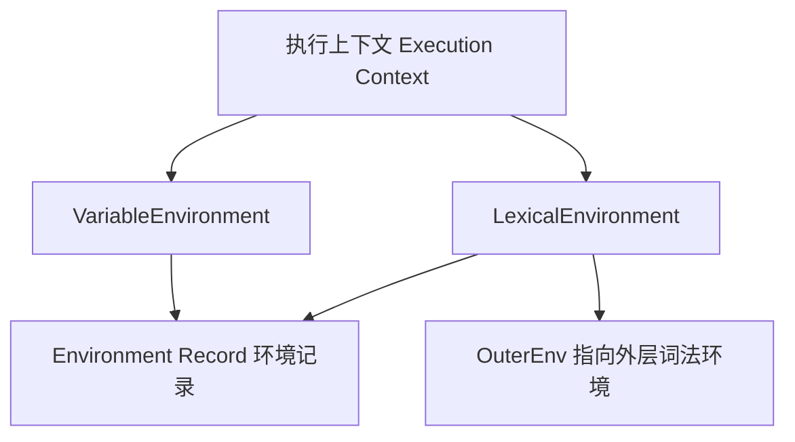

# let/const、TDZ 与作用域底层

!!! abstract "核心结论"
    - 作用域的本质是「环境记录 Environment Record + [[OuterEnv]] 外引用」串成的链，不是一张扁平的变量表。
    - var 在作用域实例化时即创建并初始化为 undefined；let/const 只创建、不初始化，读取未初始化绑定抛 ReferenceError，这就是 TDZ。
    - TDZ 会命中 typeof、块内遮蔽、`let x = x` 等场景；typeof 只对「完全未声明」的标识符安全。
    - `for (let i = ...)` 每轮迭代新建绑定，是闭包拿到 0/1/2 而非 3/3/3 的根因。
    - 闭包保存的是函数创建时对词法环境的引用：函数存活，整条环境记录链就存活，带来内存影响。

## 1. 执行上下文、词法环境与环境记录

### 1.1 执行上下文与作用域的映射

ECMA-262 用执行上下文（Execution Context）描述运行中代码的状态。全局代码、函数代码、eval 代码（以及模块代码）在执行时都有各自的执行上下文。函数上下文至少携带两个与作用域直接相关的字段：

- LexicalEnvironment：解析 let、const、class 以及普通标识符引用的环境。
- VariableEnvironment：解析 var 绑定的环境。

在绝大多数情况下两者指向同一个环境；只有在 `with`、`switch` 等特殊结构中两者才会分离。作用域链的正式结构是：词法环境（Lexical Environment）= 环境记录 + `[[OuterEnv]]` 外引用。标识符解析走 GetIdentifierReference 算法：从当前执行上下文的 LexicalEnvironment 开始执行 HasBinding 判断，若没有该名字，就沿 `[[OuterEnv]]` 向上走；走到 null 仍未命中，得到的是 Unresolvable Reference（未解析引用）。



### 1.2 环境记录的四种形态

环境记录是 ECMA-262 的抽象数据类型，规范上可理解为键值映射。主流引擎（V8、JavaScriptCore 等）内部用哈希表、上下文槽位等实现，但语义边界与下表一致：

| 环境记录类型 | 绑定来源 | 关键行为 |
| --- | --- | --- |
| 声明式环境记录 Declarative ER | 词法声明直接写入记录 | 有确定性绑定判定、可变性、初始化状态 |
| 函数环境记录 Function ER（声明式子类） | 参数、var、函数声明、let/const | 额外提供 this、arguments、super、new.target |
| 对象式环境记录 Object ER | 由某个绑定对象（binding object）动态提供 | 为 `with` 语句服务，属性变化即时反映为绑定 |
| 全局环境记录 Global ER | var / 函数声明走对象记录，let / const 走声明记录 | 浏览器下 var 会成为 window 属性，let 不会 |

全局环境记录是理解 `var` 与 `let` 全局差异的关键：它内部分为 `[[ObjectRecord]]` 与 `[[DeclarativeRecord]]` 两部分。全局 `var x = 1` 写入 ObjectRecord，在浏览器下等价于在 window 上创建属性（non-configurable，可用 `delete` 验证删不掉）；全局 `let y = 2` 写入 DeclarativeRecord，不会挂到 window 上。

### 1.3 LexicalEnvironment 与 VariableEnvironment 的分工

var 声明的创建与赋值始终面向 VariableEnvironment，let/const 面向 LexicalEnvironment。普通函数体中两者相同，所以差异不显眼；一旦出现 `with`，会在链顶插入一个对象式 LexicalEnvironment，而 VariableEnvironment 保持不动，于是 `with` 内部写的 `var` 仍然提升到函数级。`switch` 的情景同理：整个 switch 体共享一个块级词法环境，所有 case 里的 `let` 声明互相可见，这也是 `switch` 中多个 case 重复声明同名 let 会直接 SyntaxError 的原因。

## 2. var 与 let/const：创建、初始化、赋值

### 2.1 绑定生命周期三阶段

规范层面，一个变量从「不存在」到「可用」经过三个动作：创建（Create）、初始化（Initialize）、赋值（Assign）。读取「已创建、未初始化」的绑定会抛 ReferenceError。var 的创建与初始化（值 undefined）在同一时刻完成，即作用域实例化时；let/const 的创建也在实例化时完成，但初始化被推迟到声明语句真正求值。所谓「提升」的全部差异就来自这一步。

| 对比项 | var | let | const |
| --- | --- | --- | --- |
| 作用域 | 函数级 | 块级 | 块级 |
| 实例化时状态 | 已初始化为 undefined | 未初始化（TDZ） | 未初始化（TDZ） |
| 重复声明 | 允许 | 同块内抛 SyntaxError | 同块内抛 SyntaxError |
| 重新赋值 | 允许 | 允许 | 抛 TypeError |
| 浏览器全局副作用 | 成为 window 属性 | 不成为 window 属性 | 不成为 window 属性 |
| 声明时必须给初值 | 否 | 否 | 是 |

### 2.2 var 的函数级提升

var 的「读取先于声明得到 undefined」不是把声明行搬上去执行，而是实例化阶段就把绑定写进函数环境记录并初始化为 undefined。

```typescript
// 运行环境：Node.js 18+（ESM，.mjs）
import assert from "node:assert/strict";

function demo() {
  // 此时 x 已在函数环境记录中，值为 undefined
  return x;
  var x = 1; // 初始化语句在返回之后才执行
}

assert.strictEqual(demo(), undefined); // var 提升为 undefined
```

### 2.3 TDZ 的精确定义

暂时性死区（Temporal Dead Zone，TDZ）是社区对规范现象的称呼：绑定已在环境记录中创建、但尚未初始化的时间窗口。规范本身用「绑定未初始化」描述，GetBindingValue 对未初始化绑定抛 ReferenceError，SetMutableBinding 对未初始化绑定同样抛 ReferenceError。经典案例是块内遮蔽：块一旦存在 `let x`，从块入口开始，`x` 就解析到块内那个未初始化绑定，而不是外层绑定。

```typescript
// 运行环境：Node.js 18+（ESM）
import assert from "node:assert/strict";

// let x = x：右侧 x 已解析到 TDZ 中的绑定
assert.throws(() => {
  let x = x; // ReferenceError：Cannot access 'x' before initialization
  void x;
}, ReferenceError);

// 块内遮蔽：外层 x 被块内 let 遮蔽，块入口即进入 TDZ
assert.throws(() => {
  let x = "outer";
  {
    x; // 命中块内未初始化的 x，而不是外层 "outer"
    let x = "inner";
  }
}, /before initialization|Cannot access/);
```

### 2.4 typeof 陷阱

`typeof` 是少有的「对未解析引用也不抛错」的操作：`typeof 未声明标识符` 返回 `"undefined"`。但 `typeof` 无法救 TDZ，因为 TDZ 中的标识符是「可解析但未初始化」，标识符解析成功后再读取值时直接抛 ReferenceError。class 声明与 let/const 共享同一套未初始化机制，所以 class 也有 TDZ。

```typescript
// 运行环境：Node.js 18+（ESM）
import assert from "node:assert/strict";

assert.strictEqual(typeof ghostVar, "undefined"); // 完全未声明：安全

{
  assert.throws(
    () => typeof zoneVar, // 块内 let 已提升但未初始化
    /before initialization|Cannot access/,
  );
  let zoneVar = 1;
}
```

说明：本节结论以经典脚本（非模块）为准；ES 模块中未声明标识符的 typeof 行为需核对 ECMA-262 与目标运行环境文档。

## 3. 块级作用域与循环的每迭代绑定

### 3.1 块如何产生新的声明式环境记录

带有词法声明的块在执行时，创建一个新的声明式环境记录，`[[OuterEnv]]` 指向外层环境，并在实例化时把块内所有 let/const/class/函数声明先创建出来（let/const 置为未初始化）。因此块内声明的名字会从块入口就「占位」，这是遮蔽与 TDZ 的底层来源。没有词法声明的块，引擎可以跳过新环境创建，但语义上等价。

### 3.2 for (let i ...) 每轮迭代新建绑定

ECMA-262 在 for 语句求值中使用 CreatePerIterationEnvironment 算法：每一轮迭代都为循环变量创建一份新绑定（ForBodyEvaluation 语义）。因此闭包捕获的是「当轮迭代的绑定」，而不是共享的一只变量。这与 `var` 形成鲜明对照：var 的绑定在函数环境记录中只有一份。

```typescript
// 运行环境：Node.js 18+（ESM）
import assert from "node:assert/strict";

const captured = [];
for (let i = 0; i < 3; i += 1) {
  captured.push(() => i); // 每轮 i 是独立绑定
}
assert.deepStrictEqual(captured.map((f) => f()), [0, 1, 2]);

const shared = [];
for (var j = 0; j < 3; j += 1) {
  shared.push(() => j); // 同一个函数级绑定
}
assert.deepStrictEqual(shared.map((f) => f()), [3, 3, 3]);
```

### 3.3 for-in 与 for-of 配合 const

`for (const item of iterable)` 合法，因为 const 限制的是「同一绑定不可重新赋值」，而每轮迭代都会新建绑定，这轮拿到的是一个全新的 const 绑定。若在循环体内给该 const 变量赋值，仍然抛 TypeError。

```typescript
// 运行环境：Node.js 18+（ESM）
import assert from "node:assert/strict";

const hold = [];
for (const item of ["a", "b"]) {
  hold.push(() => item); // 每轮新绑定，item 是 const
}
assert.deepStrictEqual(hold.map((f) => f()), ["a", "b"]);

assert.throws(() => {
  for (const item of ["a", "b"]) {
    item = "c"; // TypeError：Assignment to constant variable
  }
}, TypeError);
```

## 4. 函数声明提升与块内函数（Annex B）

### 4.1 普通函数声明：整体提升

函数声明在作用域实例化时即完成创建与初始化：函数对象在声明语句执行前就存在，因此在声明之前调用是合法的。这与 `let fn = () => {}`（let 绑定进入 TDZ）完全不同。

```typescript
// 运行环境：Node.js 18+（ESM）
import assert from "node:assert/strict";

assert.strictEqual(early(), 1); // 函数声明整体提升
function early() {
  return 1;
}

assert.throws(() => {
  late(); // ReferenceError：Cannot access 'late' before initialization
  const late = () => 1;
}, ReferenceError);
```

### 4.2 块内函数的两套语义

ES2015 起，块内函数声明的标准语义是块级作用域：绑定在块环境记录中，块外不可见。但 Web 浏览器为了兼容历史页面，在 Annex B（附加 Web 兼容特性，相关条款如 B.3.3）中规定了「Web Legacy Compatibility Semantics」：在非严格模式下，块内函数声明还会在包围它的函数/全局作用域里创建或同步一个 var 风格绑定，块执行后外层能访问到该函数。严格模式与模块代码不应用 Annex B 这套回退语义。Node 对非严格脚本也在相当程度上实现了 Annex B，但跨引擎细节存在差异，结论需在目标运行环境验证。

| 行为点 | 严格模式 / ES 模块 | 非严格模式（Web Annex B） |
| --- | --- | --- |
| 块外能否访问块内函数 | 否（块级绑定） | 能（外层有 var 风格绑定） |
| 块执行前外层绑定值 | 不存在 | undefined（var 提升） |
| 块执行后外层绑定值 | 仍不存在 | 被同步为函数对象 |
| 内层块内独立绑定 | 有 | 有（且会同步到外层） |
| 依据 | ECMA-262 标准词法作用域 | Annex B Web Legacy 兼容语义 |

## 5. 闭包：对环境记录的引用与内存影响

### 5.1 闭包的引擎级模型

函数对象在创建时保存一个 `[[Environment]]` 内部槽，指向「创建该函数时」所在的词法环境，而不是调用位置，也不是值的快照。调用函数时，新建的函数环境记录以该 `[[Environment]]` 作为 `[[OuterEnv]]`。这就是「闭包在定义处找变量、而非调用处找变量」的精确机制。

```typescript
// 运行环境：Node.js 18+（ESM）
import assert from "node:assert/strict";

let base = 10;
const add = (n) => n + base; // [[Environment]] 指向全局环境
base = 32; // 修改环境记录中的绑定
assert.strictEqual(add(10), 42); // 闭包读的是绑定本身，不是快照
```

### 5.2 内存影响

规范模型下，闭包持有的是整条环境记录链的引用：只要函数存活，其创建环境中所有仍被引用的绑定都不可回收，即便函数体只用了其中一个变量。引擎（如 V8）会做逃逸分析，把被闭包捕获的变量做语境分配（context-allocated），未被捕获的变量可能留在栈上或及时释放，但这是优化，不能作为语言语义依赖。

```javascript
// 运行环境：浏览器或 Node（仅观察，不依赖 GC 具体时机）
function makeScope() {
  const big = new Uint8Array(2 ** 20); // 约 1 MiB
  return function readFirst() {
    return big[0];
  };
}
const read = makeScope();
// 规范模型：read 持有 [[Environment]]，该环境持有 big 所在的绑定。
// big 在 read 存活期间不可回收；引擎优化可能只保留被捕获的 big 引用，但语义上不应依赖。
```

典型泄漏模式是「长生命周期集合持有闭包，闭包又持有大对象」：事件监听器、定时器、全局回调数组是重灾区。修复方式是在不需要时移除监听器、清空数组或将引用置为 null。

## 6. 手写迷你词法环境解释器（Map 链、TDZ、闭包）

### 6.1 设计说明

该解释器用 `Map` 作为环境记录，用 `outer` 字段模拟 `[[OuterEnv]]`，用 `UNINITIALIZED` 符号模拟未初始化绑定状态。它实现了 var 的函数级提升、let/const 的块级 TDZ、const 赋值保护、函数闭包、typeof 陷阱，以及可注入的 native 函数。为保持语义可控，赋值按严格模式处理：给未声明变量赋值抛 ReferenceError，而非隐式创建全局。

### 6.2 完整实现

```typescript
// 运行环境：Node.js 18+；推荐用 npx tsx env-interpreter.ts 运行，
// 或删除类型标注后以 .mjs 保存直接运行。
import assert from "node:assert/strict";

const UNINITIALIZED = Symbol("UNINITIALIZED");

type BindingKind = "var" | "let" | "const";
interface Binding {
  kind: BindingKind;
  value: unknown;
}

type EnvKind = "global" | "function" | "block";

// 词法环境 = Map 环境记录 + outer 外引用
class Environment {
  readonly kind: EnvKind;
  readonly outer: Environment | null;
  private readonly map = new Map<string, Binding>();

  constructor(outer: Environment | null, kind: EnvKind) {
    this.outer = outer;
    this.kind = kind;
  }

  hasOwn(name: string): boolean {
    return this.map.has(name);
  }

  getOwn(name: string): Binding | undefined {
    return this.map.get(name);
  }

  // 当前环境创建 let/const 绑定；重复声明抛 SyntaxError
  declareHere(name: string, kind: BindingKind, value: unknown): void {
    if (this.map.has(name)) {
      throw new SyntaxError(`Identifier '${name}' has already been declared`);
    }
    this.map.set(name, { kind, value });
  }

  // var 声明：沿 outer 链找到最近的 function/global 环境
  declareVar(name: string, value: unknown): void {
    let target: Environment = this;
    while (target.kind === "block" && target.outer !== null) {
      target = target.outer;
    }
    const existing = target.map.get(name);
    if (existing !== undefined) {
      if (existing.kind !== "var") {
        throw new SyntaxError(`Identifier '${name}' has already been declared`);
      }
      return; // 重复 var 合法
    }
    target.map.set(name, { kind: "var", value });
  }

  // 函数声明：创建或覆盖为函数值（同名 var 被函数覆盖的简化实现）
  declareFunction(name: string, closure: unknown): void {
    const binding = this.map.get(name);
    if (binding !== undefined) {
      binding.value = closure;
      return;
    }
    this.map.set(name, { kind: "let", value: closure });
  }

  // 标识符解析：沿 [[OuterEnv]] 链查找
  resolve(name: string): { env: Environment; binding: Binding } | null {
    let current: Environment | null = this;
    while (current !== null) {
      const binding = current.map.get(name);
      if (binding !== undefined) {
        return { env: current, binding };
      }
      current = current.outer;
    }
    return null;
  }

  // 读取变量：TDZ 检查
  get(name: string): unknown {
    const resolved = this.resolve(name);
    if (resolved === null) {
      throw new ReferenceError(`${name} is not defined`);
    }
    if (resolved.binding.value === UNINITIALIZED) {
      throw new ReferenceError(`Cannot access '${name}' before initialization`);
    }
    return resolved.binding.value;
  }

  // 写入变量：TDZ 检查 + const 保护
  set(name: string, value: unknown): unknown {
    const resolved = this.resolve(name);
    if (resolved === null) {
      throw new ReferenceError(`${name} is not defined`);
    }
    if (resolved.binding.value === UNINITIALIZED) {
      throw new ReferenceError(`Cannot access '${name}' before initialization`);
    }
    if (resolved.binding.kind === "const") {
      throw new TypeError(`Assignment to constant variable '${name}'`);
    }
    resolved.binding.value = value;
    return value;
  }

  // 初始化 let/const：仅允许 UNINITIALIZED -> value 一次
  initialize(name: string, value: unknown): void {
    const binding = this.map.get(name);
    if (binding === undefined) {
      throw new ReferenceError(`${name} is not declared`);
    }
    if (binding.value !== UNINITIALIZED) {
      throw new SyntaxError(`Identifier '${name}' has already been declared`);
    }
    binding.value = value;
  }
}

// 简化 AST
type Expr =
  | { kind: "num"; value: number }
  | { kind: "str"; value: string }
  | { kind: "ident"; name: string }
  | { kind: "bin"; op: "+" | "-" | "*" | "<" | ">" | "<=" | ">=" | "===" | "!=="; left: Expr; right: Expr }
  | { kind: "call"; callee: Expr; args: Expr[] }
  | { kind: "fn_expr"; name: string | null; params: string[]; body: Stmt[] }
  | { kind: "typeof"; expr: Expr };

type Stmt =
  | { kind: "var"; name: string; init: Expr }
  | { kind: "let"; name: string; init: Expr | null }
  | { kind: "const"; name: string; init: Expr }
  | { kind: "assign"; name: string; value: Expr }
  | { kind: "block"; body: Stmt[] }
  | { kind: "function"; name: string; params: string[]; body: Stmt[] }
  | { kind: "return"; value: Expr | null }
  | { kind: "expr_stmt"; expr: Expr };

type Callable =
  | { kind: "closure"; name: string; params: string[]; body: Stmt[]; env: Environment }
  | { kind: "native"; fn: (args: unknown[]) => unknown };

function createClosure(env: Environment, name: string, params: string[], body: Stmt[]): Callable {
  return { kind: "closure", name, params, body, env };
}

function createNative(fn: (args: unknown[]) => unknown): Callable {
  return { kind: "native", fn };
}

class ReturnSignal {
  constructor(public readonly value: unknown) {}
}

// var 提升：递归进入块，但不进入嵌套函数体
function hoistVarDeclarations(env: Environment, statements: Stmt[]): void {
  for (const stmt of statements) {
    if (stmt.kind === "var") {
      env.declareVar(stmt.name, undefined);
    } else if (stmt.kind === "block") {
      hoistVarDeclarations(env, stmt.body);
    }
    // stmt.kind === "function"：函数体是独立作用域，此处不深入
  }
}

// let/const/函数声明：只处理当前层；函数直接初始化，let/const 进入 TDZ
function hoistLexicalAndFunction(env: Environment, statements: Stmt[]): void {
  for (const stmt of statements) {
    if (stmt.kind === "function") {
      const closure = createClosure(env, stmt.name, stmt.params, stmt.body);
      env.declareFunction(stmt.name, closure);
    } else if (stmt.kind === "let" || stmt.kind === "const") {
      env.declareHere(stmt.name, stmt.kind, UNINITIALIZED);
    }
  }
}

function callFunction(callee: unknown, args: unknown[]): unknown {
  if (callee === null || typeof callee !== "object") {
    throw new TypeError("Value is not callable");
  }
  const candidate = callee as { kind?: unknown };
  if (candidate.kind !== "closure" && candidate.kind !== "native") {
    throw new TypeError("Value is not callable");
  }
  const fn = callee as Callable;
  if (fn.kind === "native") {
    return fn.fn(args);
  }
  // 函数调用：新建函数环境，[[OuterEnv]] 指向创建时环境
  const fnEnv = new Environment(fn.env, "function");
  fn.params.forEach((param, index) => {
    fnEnv.declareHere(param, "let", args[index] === undefined ? undefined : args[index]);
  });
  hoistVarDeclarations(fnEnv, fn.body);
  hoistLexicalAndFunction(fnEnv, fn.body);
  try {
    executeStatements(fn.body, fnEnv);
  } catch (signal) {
    if (signal instanceof ReturnSignal) {
      return signal.value;
    }
    throw signal;
  }
  return undefined;
}

function evalExpr(expr: Expr, env: Environment): unknown {
  switch (expr.kind) {
    case "num":
    case "str":
      return expr.value;
    case "ident":
      return env.get(expr.name);
    case "bin": {
      const left = evalExpr(expr.left, env);
      const right = evalExpr(expr.right, env);
      switch (expr.op) {
        case "+":
          return (left as number) + (right as number);
        case "-":
          return (left as number) - (right as number);
        case "*":
          return (left as number) * (right as number);
        case "<":
          return (left as number) < (right as number);
        case ">":
          return (left as number) > (right as number);
        case "<=":
          return (left as number) <= (right as number);
        case ">=":
          return (left as number) >= (right as number);
        case "===":
          return left === right;
        case "!==":
          return left !== right;
        default:
          throw new SyntaxError(`Unknown operator ${expr.op}`);
      }
    }
    case "call": {
      const callee = evalExpr(expr.callee, env);
      const args = expr.args.map((arg) => evalExpr(arg, env));
      return callFunction(callee, args);
    }
    case "fn_expr": {
      return createClosure(env, expr.name ?? "anonymous", expr.params, expr.body);
    }
    case "typeof": {
      // 与规范一致：未声明标识符返回 "undefined"，TDZ 中标识符抛 ReferenceError
      if (expr.expr.kind === "ident") {
        const resolved = env.resolve(expr.expr.name);
        if (resolved === null) {
          return "undefined";
        }
        if (resolved.binding.value === UNINITIALIZED) {
          throw new ReferenceError(`Cannot access '${expr.expr.name}' before initialization`);
        }
        return typeof resolved.binding.value;
      }
      return typeof evalExpr(expr.expr, env);
    }
  }
}

function executeStatements(statements: Stmt[], env: Environment): void {
  for (const stmt of statements) {
    switch (stmt.kind) {
      case "var": {
        // 声明已完成提升，此处是赋值语义
        env.set(stmt.name, evalExpr(stmt.init, env));
        break;
      }
      case "let": {
        const value = stmt.init === null ? undefined : evalExpr(stmt.init, env);
        env.initialize(stmt.name, value);
        break;
      }
      case "const": {
        const value = evalExpr(stmt.init, env);
        env.initialize(stmt.name, value);
        break;
      }
      case "assign": {
        env.set(stmt.name, evalExpr(stmt.value, env));
        break;
      }
      case "block": {
        const blockEnv = new Environment(env, "block");
        hoistLexicalAndFunction(blockEnv, stmt.body);
        executeStatements(stmt.body, blockEnv);
        break;
      }
      case "function": {
        // 已在提升阶段完成声明，运行时无事可做
        break;
      }
      case "return": {
        throw new ReturnSignal(stmt.value === null ? undefined : evalExpr(stmt.value, env));
      }
      case "expr_stmt": {
        evalExpr(stmt.expr, env);
        break;
      }
    }
  }
}

function runProgram(
  statements: Stmt[],
  builtins: Record<string, (args: unknown[]) => unknown> = {},
): unknown {
  const globalEnv = new Environment(null, "global");
  for (const [name, fn] of Object.entries(builtins)) {
    globalEnv.declareFunction(name, createNative(fn));
  }
  hoistVarDeclarations(globalEnv, statements);
  hoistLexicalAndFunction(globalEnv, statements);
  try {
    executeStatements(statements, globalEnv);
  } catch (signal) {
    if (signal instanceof ReturnSignal) {
      return signal.value;
    }
    throw signal;
  }
  return undefined;
}
```

### 6.3 验证标准

以下测试接在 6.2 代码之后，同一文件内运行。全部用例预期输出均通过断言表达，不产生任何打印。

```typescript
// —— 6.3 验证标准（接 6.2 代码继续运行）——
const num = (value: number): Expr => ({ kind: "num", value });
const str = (value: string): Expr => ({ kind: "str", value });
const id = (name: string): Expr => ({ kind: "ident", name });
const bin = (op: "+" | "-" | "*" | "<" | ">" | "<=" | ">=" | "===" | "!==", left: Expr, right: Expr): Expr => ({
  kind: "bin",
  op,
  left,
  right,
});
const call = (callee: Expr, args: Expr[]): Expr => ({ kind: "call", callee, args });
const fnExpr = (params: string[], body: Stmt[]): Expr => ({ kind: "fn_expr", name: null, params, body });
const typeofExpr = (expr: Expr): Expr => ({ kind: "typeof", expr });

const varStmt = (name: string, init: Expr): Stmt => ({ kind: "var", name, init });
const letStmt = (name: string, init: Expr | null): Stmt => ({ kind: "let", name, init });
const constStmt = (name: string, init: Expr): Stmt => ({ kind: "const", name, init });
const assignStmt = (name: string, value: Expr): Stmt => ({ kind: "assign", name, value });
const blockStmt = (body: Stmt[]): Stmt => ({ kind: "block", body });
const funcStmt = (name: string, params: string[], body: Stmt[]): Stmt => ({
  kind: "function",
  name,
  params,
  body,
});
const returnStmt = (value: Expr | null): Stmt => ({ kind: "return", value });
const exprStmt = (expr: Expr): Stmt => ({ kind: "expr_stmt", expr });

// 1. var 提升：读取声明前的 var 得到 undefined
assert.strictEqual(
  runProgram([
    funcStmt("probe", [], [returnStmt(typeofExpr(id("x"))), varStmt("x", num(1))]),
    returnStmt(call(id("probe"), [])),
  ]),
  "undefined",
  "var 在函数环境实例化时应已初始化为 undefined",
);

// 2. 块内 let 进入 TDZ：读取未初始化绑定抛 ReferenceError
assert.throws(
  () =>
    runProgram([
      blockStmt([exprStmt(id("before")), letStmt("before", str("later"))]),
    ]),
  /before initialization/,
  "TDZ 中读取绑定必须抛 ReferenceError",
);

// 3. 块内遮蔽：内层 let 从块入口就遮蔽外层绑定
assert.throws(
  () =>
    runProgram([
      letStmt("x", str("outer")),
      blockStmt([exprStmt(id("x")), letStmt("x", str("inner"))]),
    ]),
  /before initialization/,
  "块内 let 应在块实例化时立即遮蔽外层并进入 TDZ",
);

// 4. const 赋值保护
assert.throws(
  () => runProgram([constStmt("K", num(1)), assignStmt("K", num(2))]),
  TypeError,
  "给 const 绑定赋值必须抛 TypeError",
);

// 5. 闭包引用环境记录中的绑定，而非值的快照
assert.strictEqual(
  runProgram([
    letStmt("base", num(10)),
    funcStmt("add", ["n"], [returnStmt(bin("+", id("n"), id("base")))]),
    assignStmt("base", num(32)),
    returnStmt(call(id("add"), [num(10)])),
  ]),
  42,
  "闭包应读取定义处环境的当前绑定值",
);

// 6. 闭包延长块环境生命周期
assert.strictEqual(
  runProgram([
    varStmt("f", num(0)),
    blockStmt([
      letStmt("secret", num(99)),
      assignStmt("f", fnExpr([], [returnStmt(id("secret"))])),
    ]),
    returnStmt(call(id("f"), [])),
  ]),
  99,
  "块结束后闭包仍应能访问块内的 let 绑定",
);

// 7. typeof 陷阱：未声明安全，TDZ 抛错
const typeofLog: unknown[] = [];
runProgram(
  [exprStmt(call(id("record"), [typeofExpr(id("ghost"))]))],
  {
    record: (args) => {
      typeofLog.push(args[0]);
      return undefined;
    },
  },
);
assert.deepStrictEqual(typeofLog, ["undefined"], "typeof 未声明标识符应返回 'undefined'");

assert.throws(
  () =>
    runProgram([
      exprStmt(typeofExpr(id("later"))),
      letStmt("later", num(1)),
    ]),
  /before initialization/,
  "typeof TDZ 中的绑定必须抛 ReferenceError",
);

console.log("all assertions passed");
```

若运行 `npx tsx env-interpreter.ts`，预期输出为 `all assertions passed`；任一断言失败会按 Node 默认行为抛出 AssertionError 并显示差异。

## 7. 常见陷阱

1. `let x = x` 抛 ReferenceError：右侧 `x` 先解析到 TDZ 中未初始化的绑定，不会落到外层。
2. `typeof` 能探测未声明变量，但会在 TDZ 上翻车；不要用 `typeof` 判断「变量是否即将声明」。
3. 块内 `let` 会从块入口遮蔽外层同名变量，遮蔽发生得比直觉更早。
4. 循环中用 `var` 创建闭包，得到的是同一个函数级绑定；修复方式是用 `let` 或给闭包工厂传参。
5. `const` 保护的是绑定身份，不冻结对象内容：`const o = {}; o.x = 1` 合法。
6. `switch` 的所有 case 共享一个块级环境，多个 case 声明同名 let 会 SyntaxError。
7. 非严格模式下块内函数存在 Annex B 兼容语义，依赖它跨引擎/模块会引入不可移植行为。
8. 浏览器全局 `var` 会成为 window 属性且不可用 `delete` 删除；全局 `let` 不会成为 window 属性。
9. class 声明与 let/const 同样是块级且带 TDZ，子类 `extends` 表达式先于 class 初始化求值，若引用自身会抛错。
10. 闭包持有整条环境记录链；事件监听器、定时器、全局数组是典型泄漏来源，移除引用是唯一可靠修复。

## 8. 面试题与答题要点

1. 题：`console.log(typeof x); let x = 1;` 输出什么？
   要点：不是 `"undefined"` 而是抛 ReferenceError。`typeof` 只救「未解析引用」，TDZ 中绑定是「可解析但未初始化」，读取即抛错；let 在块实例化时已创建绑定。

2. 题：解释 var 与 let 的「提升」差异。
   要点：两者都在作用域实例化时创建绑定；var 同时初始化为 undefined，let 不初始化。提升不是移动代码，而是绑定创建与初始化两个动作的分离；未初始化读取触发 TDZ 抛错。

3. 题：循环里用 var 包一层闭包为什么全是最后一个值？
   要点：var 是函数级单绑定，所有闭包捕获同一个函数环境记录中的绑定，循环结束后值是终值；let 每轮迭代新建绑定，闭包各持一份，规范机制是 CreatePerIterationEnvironment。

4. 题：`let x = x` 为何报错？如果外层已有 x 呢？
   要点：右侧 `x` 解析到当前块内刚创建未初始化的绑定，遮蔽了外层 x，读取即抛 ReferenceError；TDZ 在声明求值前已生效，不因外层同名变量而兜底。

5. 题：块内函数声明的嵌套作用域是怎样的？
   要点：标准语义是块级作用域；非严格模式 Web 脚本还有 Annex B 回退语义，会在外层同步一个 var 风格绑定，块执行后外层可见。严格模式和 ES 模块无回退语义，跨引擎细节需谨慎。

6. 题：闭包与垃圾回收的关系是什么？如何定位闭包泄漏？
   要点：闭包持有创建时的 `[[Environment]]`，该环境持有外层绑定，引用可达则不可回收；典型泄漏是全局回调集合/监听器持有闭包，间接持有大对象；用 DevTools Memory 的堆快照和 retainers 链定位，修复是解除引用或移除监听器。

7. 题：`for (const item of ["a", "b"])` 为什么 const 合法？
   要点：const 禁止同一绑定被重新赋值，但每轮迭代都新建绑定，上一轮绑定与下一轮绑定不是同一个；循环体内对 item 赋值仍抛 TypeError。

8. 题：浏览器全局 `var x` 与 `let x` 在 window 上的表现有何不同？
   要点：var 走全局环境记录的对象记录部分，会在 window 上创建不可删除的属性；let 走声明记录部分，不挂 window。因此 `window.x` 与 `"x" in window` 在两种声明下结果不同。

## 深入阅读与参考

!!! tip "怎么用这些资料"
    先读「官方文档与规范」建立准确的概念，再读「源码与示例」核对细节，最后用「教程、书籍与视频」换一种讲法加深理解。每条都写明了读哪一节、带着什么问题读。

### 官方文档与规范

| 资源 | 为什么读 | 怎么读 |
|---|---|---|
| [let](https://developer.mozilla.org/en-US/docs/Web/JavaScript/Reference/Statements/let) | TDZ 与每迭代绑定的权威说明，本页核心概念一手来源。 | 读“暂时性死区”与循环示例两节，手写 for 循环验证逐迭代绑定。 |
| [const](https://developer.mozilla.org/en-US/docs/Web/JavaScript/Reference/Statements/const) | 说清 const 只固定绑定、不冻结对象，避免常见误解。 | 读描述与 TDZ 段落，做声明前访问与重新赋值的报错实验。 |
| [var](https://developer.mozilla.org/en-US/docs/Web/JavaScript/Reference/Statements/var) | 明确 var 的创建、初始化与提升时机，作 TDZ 对照基准。 | 读“提升”与描述两节，列表对照 var 与 let 的初始化时机差异。 |
| [Map](https://developer.mozilla.org/en-US/docs/Web/JavaScript/Reference/Global_Objects/Map) | Map 是迷你词法环境解释器里表示一层环境记录的核心结构。 | 读构造函数与方法概览，思考如何用 Map 承载一层作用域绑定。 |
| [Map() constructor](https://developer.mozilla.org/en-US/docs/Web/JavaScript/Reference/Global_Objects/Map/Map) | 掌握 new Map() 初始化方式，便于快速搭建环境记录。 | 读语法与示例，练习由数组或对象批量初始化一层作用域绑定。 |
| [Map.prototype.get()](https://developer.mozilla.org/en-US/docs/Web/JavaScript/Reference/Global_Objects/Map/get) | 取值语义决定标识符解析结果与 undefined 歧义的处理方式。 | 读返回值说明，写 has+get 组合的查找函数并覆盖值恰为 undefined 的情况。 |
| [Map.prototype.has()](https://developer.mozilla.org/en-US/docs/Web/JavaScript/Reference/Global_Objects/Map/has) | 区分“绑定存在但值为 undefined”与“未声明”的关键。 | 读示例，与 get 配合实现标识符解析，并分出 TDZ 抛错分支。 |
| [Map.prototype.delete()](https://developer.mozilla.org/en-US/docs/Web/JavaScript/Reference/Global_Objects/Map/delete) | 块级作用域退出即销毁绑定，用它模拟环境出栈。 | 读返回值说明，写进入/退出块时增删绑定的迷你示例。 |
| [Map.prototype.keys()](https://developer.mozilla.org/en-US/docs/Web/JavaScript/Reference/Global_Objects/Map/keys) | 遍历当前作用域已有绑定，便于调试标识符解析链路。 | 读迭代器返回值段落，写一个打印整条作用域链所有绑定名的函数。 |

### 教程、书籍与视频

| 资源 | 为什么读 | 怎么读 |
|---|---|---|
| [MDN 闭包](https://developer.mozilla.org/en-US/docs/Web/JavaScript/Closures) | 用最小示例讲透闭包与循环变量绑定，上手快。 | 读“实用闭包”与“循环中的闭包”两节，复现 var 陷阱后改写成 let。 |
| [YDKJS：Scope & Closures](https://github.com/getify/You-Dont-Know-JS/tree/2nd-ed/scope-closures) | 系统覆盖词法作用域、提升与闭包，比零散文章完整。 | 精读作用域与闭包两章，合书手写词法环境与闭包解释并各举三例。 |

## 应用与行业实践

### 应用场景地图

| 场景 | 用到本页哪个知识点 | 典型技术选型 | 注意事项 |
| --- | --- | --- | --- |
| 后台管理的万行表格，每行绑定点击回调 | `for (let i)` 每迭代新建绑定 | React 函数组件 + 虚拟滚动 | 循环里写 `var` 会让所有回调拿到末轮索引 |
| 低端安卓机的首屏加载 | 顶层 `let` 的 TDZ 与模块求值顺序 | Rollup / Vite 打包 + 路由懒加载 | 跨模块循环依赖会命中未初始化绑定 |
| 多人协作白板的撤销栈 | 闭包持有整条环境记录链 | Yjs / 自研 OT + WebSocket | 每笔操作的回调捕获整份文档对象会拖住内存 |
| Node 服务端常驻进程的请求上下文 | 闭包让环境记录随函数存活 | Express / Koa 中间件 | 请求级闭包写进全局缓存会按请求数累积 |
| 前端埋点 SDK 判定全局变量是否存在 | `typeof` 只对完全未声明安全 | 自研 SDK + `window` 命名空间 | 对 TDZ 中的绑定用 `typeof` 会直接抛错 |
| 低代码平台生成的条件分支代码 | 块内函数声明与 Annex B | Acorn / Babel 解析 + 自研代码生成 | 生成 `if` 块里的函数在引擎间有行为差异 |
| 单元测试里的假数据工厂 | `let x = x` 自我引用 | Jest / Vitest + 工厂函数 | 默认值引用同名参数会直接抛 ReferenceError |
| 脚手架默认 ESLint 配置 | 声明提升与 TDZ 静态检查 | ESLint + typescript-eslint | 打开规则后存量代码会暴露一批报错 |
| Web Worker 里的循环任务注册 | `for (let)` 捕获各自绑定 | Worker + `postMessage` | 取消任务要按引用清空回调数组 |

### 三个场景拆解

#### 场景 1：后台管理的万行表格，行内按钮回调

**业务背景**

表格每行有一个「编辑」按钮，点击后要把该行索引传给弹窗。行数在万级时用虚拟滚动只渲染可视区，但回调注册逻辑仍按数据下标走。

**怎么用本页知识解决**

思路是让每一轮迭代拥有独立绑定，回调捕获的是本轮记录，而不是循环外那一个变量。

```js
// 反例：var 只有一份绑定，所有回调读到的都是循环结束后的值
for (var i = 0; i < rows.length; i++) {
  render(rows[i], () => select(i)); // 点任意一行都拿到 rows.length
}

// 正例：let 每轮迭代新建绑定，回调各自捕获本轮的环境记录
for (let i = 0; i < rows.length; i++) {
  render(rows[i], () => select(i)); // 每个回调读到自己的 i
}

// 只关心数据本身时，直接捕获元素，绕开索引
for (const row of rows) {
  render(row, () => select(row)); // 捕获本轮 row，与下标解耦
}
```

- `var i` 在函数作用域实例化时创建并初始化为 `undefined`，整个循环共用一份。
- `let i` 在每轮迭代复制前一轮的值到新建绑定，回调的 `[[OuterEnv]]` 各指一份记录。
- 用 `for...of` 加 `const` 时，每轮绑定保存当轮元素，列表过滤后索引失效也不影响。
- 给按钮挂 `data-index` 并用容器上的事件委托，是另一条可选路径，回调数量从 N 降到 1。

**怎么度量收益**

在 Chrome DevTools Performance 面板录制一次「滚动 + 点击首行」的交互，看长任务时长与主线程空闲段。React 应用里再用 React DevTools Profiler 看一次 commit 的耗时。指标名用 Total Blocking Time 与单次 commit duration。

**什么时候不该用**

- 表格数据量在百行以内且不滚动复用，事件委托一个监听就够，不必每行一个闭包。
- 服务端渲染的静态报表没有交互，注册回调只是浪费，别为了统一写法硬加。
- 行数据本身很大时，为每行闭包捕获整个对象会放大内存，此时应捕获行 id。

#### 场景 2：低端安卓首屏，跨模块顶层 `let` 的求值顺序

**业务背景**

首屏依赖几十个模块，打包后入口按 `import` 顺序求值。痛点是一旦模块图成环，某个模块的顶层代码会读到尚未初始化的 `let`，页面直接白屏。

**怎么用本页知识解决**

先弄清哪些导出是「绑定」而不是「值的快照」，再把跨模块读取推迟到函数调用时。

```js
// a.js —— 先 import b，b 的模块体会在 a 的 let 初始化之前执行
import { logState } from './b.js';
logState();                      // 此时 a.js 的 state 还在 TDZ 内
export let state = { count: 0 }; // 这一行执行后绑定才被初始化

// b.js
import { state } from './a.js';
export function logState() {
  console.log(state);            // 读取的是 a.js 的实时绑定，不是快照
}
```

- 模块顶层 `let` 进入 TDZ 的窗口是「模块开始求值」到「该行执行」之间。
- `export let` 导出的是绑定，导入方在函数体里读，读到的永远是当前值。
- 把顶层 `logState()` 这类立即调用挪进函数或事件回调，就避开了 TDZ 窗口。
- 换成 `var` 或函数声明不会报错，但会把 ReferenceError 变成读到 `undefined` 的静默错误。

**怎么度量收益**

看打包器的循环依赖告警条数，Rollup 在构建时会输出相关提示。生产侧用 `window.addEventListener('error')` 上报，把 `name` 为 `ReferenceError` 的条数单独统计。首屏体验指标用 Lighthouse 在 4x CPU 降速下的 LCP 与 TBT。

**什么时候不该用**

- 依赖图本身无环时，不要为了「防御 TDZ」把 `export let` 改成 `export var`，那是把错误推给运行时。
- 模块只导出函数、且函数体在调用时读绑定的，环本身安全，不必为此拆包或改结构。
- 已经在顶层立即执行的初始化逻辑，改成惰性求值会改变时序，要先确认没有依赖它的副作用。

#### 场景 3：多人协作白板的撤销栈与闭包内存

**业务背景**

白板把每笔操作压进撤销栈，栈长度随会话时长单调增长。痛点是长时间会话后内存不回落，页面逐渐卡顿，用堆快照能稳定复现。

**怎么用本页知识解决**

闭包保存的是函数创建时那条环境记录链的引用，函数存活整条链就存活。所以要切断链上不需要的对象。

```js
// 反例：返回的闭包挂在外层记录上，记录里的 doc 跟着一起存活
function makeOp(doc, id) {
  return () => apply(doc, id);   // 闭包引用了外层记录，doc 无法回收
}

// 正例：把需要的标量取到独立函数作用域，闭包不再指向持有 doc 的记录
function makeOp(id) {
  return () => applyById(id);    // 闭包只挂在这一层记录上
}
// 调用方：makeOp(op.id)，撤销时再按 id 回查文档
```

- 闭包的 `[[OuterEnv]]` 指向创建位置的词法环境，链上每一环都参与可达性。
- 撤销栈是个长生命周期数组，它持有的每个回调都会拉活对应的环境记录。
- 传标量 id 而不是整份文档，可以让文档对象在无其它引用时被回收。
- 引擎会做上下文分配分析，内层函数没引用的变量可能不放进上下文对象，改前先用快照确认。

**怎么度量收益**

在 Chrome DevTools Memory 面板做两次堆快照：压入万笔操作前后各一次，对比快照差里的 `(closure)` 与数组保留大小。再看 Performance 面板里强制 GC 后 JS 堆曲线是否回落到基线附近。

**什么时候不该用**

- 单次会话操作数在几百笔以内，裁剪捕获带来的收益低于改动风险，先不动。
- 若内层函数本来就引用了 `doc`，把参数换成 id 没用，要先从快照的 retainers 路径确认谁在持有。
- 需要按操作重放整份文档状态的产品，回调本来就得拿到文档，改成 id 回查会增加查找开销。

### 行业先进实践

`no-var`（出处：ESLint 官方文档）

该规则禁止 `var`，把作用域提升与重复声明问题挡在静态检查阶段。项目里先对 `src` 目录以 `error` 级别开启，存量文件用目录级覆盖逐步收敛。

`prefer-const`（出处：ESLint 官方文档）

该规则要求不再重新赋值的绑定使用 `const`，让「创建后不初始化」与「初始化后不变」两类语义在代码里可读。开启后配合 `no-var`，能减少块级作用域被写错的机会。

`@babel/plugin-transform-block-scoping`（出处：Babel 官方文档）

该插件把 `let/const` 降级为 `var` 时会重命名冲突变量，并提供 `tdz` 选项在降级产物里补 TDZ 检查。若项目仍需产出 ES5，先打开 `tdz` 观察报错，再评估体积增量。

V8 字节码中的 TDZ 路径（出处：V8 官方博客文章 Understanding V8's bytecode）

该文用字节码展示 `let` 未初始化时抛 ReferenceError 的执行路径，说明 TDZ 是运行时检查而非语法约定。向团队讲原理时可直接引用这段字节码对照。

Chrome DevTools 内存面板的 Retainers 视图（出处：Chrome DevTools 官方文档）

堆快照的 retainers 路径能显示闭包链上谁在持有对象，用于定位白板类应用的内存增长。需核对官方文档：当前版本 Memory 面板里快照对比与 Retainers 区的具体入口名称与筛选语法。

### 从学到用：落地路线

1. 试点：先在一个目录（如 `src/table`）打开 `no-var`、`prefer-const`、`no-use-before-define`。验收标准：该目录 CI 通过，且没有新增规则豁免注释。
2. 验证：用打包器的循环依赖告警与单测，检查跨模块顶层 `let` 的求值顺序。验收标准：告警数为 0，或每个保留的环都有注释说明为何安全。
3. 推广：把这三条规则提升到仓库级 `eslint.config.js`，并在 PR 模板加一条 TDZ 自查项。验收标准：全仓库 lint 无新增 `no-var` 与 `prefer-const` 报错。
4. 防回退：CI 执行 `eslint --max-warnings 0`，前端错误上报给 `ReferenceError` 单独打标签。验收标准：TDZ 类 ReferenceError 的周计数保持为 0。

### 动手作业

**目标**

用 Map 链实现一个迷你词法环境，复现 TDZ 与循环闭包行为，并用测试与堆快照验证结论。

**步骤**

1. 实现 `EnvironmentRecord`：用 Map 存绑定，未初始化的值放一个哨兵常量。
2. 实现 `declare`、`initialize`、`get`、`set` 四个方法，`get` 命中哨兵时抛 `ReferenceError`。
3. 实现 `loop(n, body)`，每轮迭代 `declare` 一个全新绑定，把 `body` 返回的闭包收集起来。
4. 写测试覆盖四类调用：读未初始化绑定、`typeof` 未初始化绑定、`typeof` 完全未声明的标识符、`let x = x` 形态。
5. 在最小页面里对比 `var` 与 `let` 的循环闭包输出，记录三次打印结果。
6. 构造两版操作栈：一版捕获整份文档对象，一版只捕获 id，各压入一万笔。
7. 打开 DevTools Memory 面板做前后两次堆快照，对比 `(closure)` 的保留大小。

**验收标准**

- 四类测试全部通过，且 `let x = x` 的用例抛出 `ReferenceError`。
- `for (let i ...)` 收集到的三个回调分别打印 0、1、2；换成 `var` 后打印 3、3、3。
- `typeof undeclaredName` 返回 `"undefined"`，`typeof` 处于 TDZ 的绑定抛 `ReferenceError`。
- 两次堆快照对比中，捕获 id 版本的 `(closure)` 保留大小小于捕获整份文档的版本。

