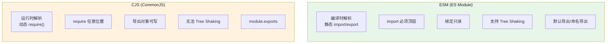
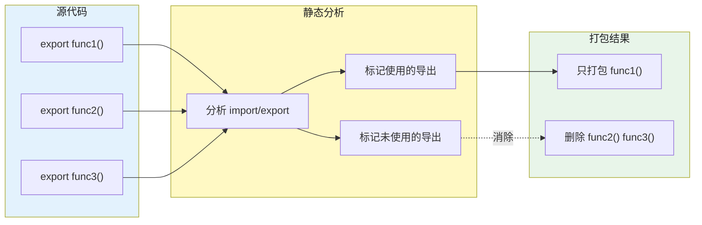

# ESModule 与 CommonJS

## 1. 核心区别与对比




## 2. 编译时 vs 运行时

```javascript
// ESM：编译时解析（静态分析）
// 优点：打包工具可以在不执行模块的情况下分析依赖关系
// import 必须出现在模块顶层（不能放在 if/function 中）
import { a } from './a.js';     // (可) 静态
import defaultExport from 'lib'; // (可) 静态

// CJS：运行时解析
// require 可以是动态的
const path = process.env.NODE_ENV === 'production' ? './prod.js' : './dev.js';
const module = require(path);    // (可) 动态

// 动态 import（返回 Promise，支持代码分割）
const module = await import('./module.js'); // ESM 语法，但动态
```

## 3. 循环引用机制

```
ESM 循环引用：暂时性死区（TDZ）

// a.mjs
import { b } from './b.mjs';   // 先执行：执行到这里时暂停，先去加载 b.mjs
export const a = 'a';
console.log(b);                // 此时 b 是 undefined（b.mjs 还未完成初始化）

// b.mjs
import { a } from './a.mjs';   // b.mjs 执行到此处，a 仍是 TDZ 中的 undefined
export const b = 'b';
console.log(a);                // undefined

Node.js ESM 规则：遇到 import 时，被导入模块开始执行直到所有 import 完成，
                        第一个模块在 import 语句处暂停，等被导入模块完成后再继续
```

```javascript
// CommonJS 循环引用：基于缓存
// 缓存机制：require 时立即执行，结果缓存到 require.cache
// a.js
console.log('a 开始');
exports.done = false;
const b = require('./b.js');
console.log('a: b.done =', b.done);
exports.done = true;
console.log('a 结束');

// b.js
console.log('b 开始');
exports.done = false;
const a = require('./a.js');
console.log('b: a.done =', a.done);
exports.done = true;
console.log('b 结束');

// main.js
const a = require('./a.js');
console.log('main: a.done =', a.done);

// 关键点：
// 1. require('a') 开始执行 a.js
// 2. a.js 执行到 require('b')，开始执行 b.js
// 3. b.js 执行到 require('a')，require('a') 返回缓存中的 a（exports.done = false）
// 4. b.js 继续完成
// 5. a.js 继续（exports.done = true）
// 6. main.js 拿到 a.done = true
```

## 4. import 绑定的只读性

```javascript
// lib.mjs
export let count = 0;
export function increment() { count++; }

// main.mjs
import { count, increment } from './lib.mjs';

count = 5;       // TypeError: Cannot assign to 'count'（只读绑定）
increment();     // OK，lib.mjs 内部可以修改自己的变量
console.log(count); // 1（因为 increment 修改了）
```

## 5. Tree Shaking 原理

Tree Shaking 是打包工具（Rollup、Webpack 4+）通过静态分析 ESM 依赖图，消除未使用的导出代码（dead code elimination）。



## 6. Tree Shaking 条件

### 6.1 Tree Shaking 条件

```javascript
// 1. 必须是 ESM 模块（静态 import/export）
// CJS 的 require() 是运行时求值，无法静态分析

// 2. 导出函数必须是"纯函数"（无副作用）
// 有副作用的代码不会被 shaking
import { unused } from 'side-effect-lib'; // 可能不会被 shaking（side-effect 风险）

// package.json sideEffects 字段
{
  "sideEffects": [
    "./src/polyfill.js",  // 有副作用的文件
    "*.css"                // CSS 文件有副作用
  ]
}
// sideEffects: false → 所有导出都没副作用，可以大胆 shaking
// sideEffects: ["file"] → 只有这些文件有副作用，其他可安全 shaking
}

// 3. 不能有动态 import
// import('./module.js').then(m => m.used) ← 打包工具无法静态分析

// 实际案例：lodash-es vs lodash
import { debounce } from 'lodash-es';   // (可) 可以 tree shaking，只打包 debounce
import debounce from 'lodash';           // (不可) 整个 lodash 被打包
import debounce from 'lodash/debounce'; // (可) 单独导入，可以 shaking（部分模块支持）
```

## 7. 动态 import 与 top-level await

```javascript
// 动态 import：返回 Promise，用于代码分割（路由懒加载）
const { showModal } = await import('./modal.js'); // 等价于 .then()

// React Router v6 路由懒加载
const Home = lazy(() => import('./Home'));
const About = lazy(() => import('./About'));

// top-level await（ES2022）：模块顶层直接 await
// 相当于模块内自动包裹了 async 函数
const config = await fetch('/api/config').then(r => r.json());
export { config };

// top-level await 限制：
// 1. 只能在 ESM 模块顶层
// 2. 阻塞模块执行（可以用作模块级初始化）
// 3. 在 Node.js 中，顶层 await 使当前模块成为一个异步模块

// 应用：ESM 模块初始化（替代 IIFE）
const db = await createDatabaseConnection(); // 模块初始化
export { db };

// 与动态 import 的关系：import() 本身返回 Promise，所以可以 await
const module = await import('./feature.js');
```

## 8. 常见陷阱与最佳实践

| 陷阱 | 说明 | 解决方案 |
|------|------|---------|
| 混淆 ESM 导出方式 | 同时用 `export default` 和 `export const` 造成混乱 | 统一风格（推荐：默认导出 + 按名导出混用） |
| 循环依赖导致 undefined | ESM 循环引用中导出的值在导入时可能是 undefined | 避免循环依赖，或在循环引用中使用函数调用而非直接读取值 |
| `require` vs `import` 混用 | 在同一个项目中混用 CJS 和 ESM 导致互操作问题 | Node.js 中通过 `.mjs` / `package.json` `type` 字段区分 |
| 在循环中 require | 每次循环都 require 造成性能问题 | 移到循环外一次 require |
| Side effect 文件被 shaking | 有副作用的 polyfill 文件被误删除 | 在 `package.json` 的 `sideEffects` 中声明 |

## 9. 面试追问

**Q1: CJS 和 ESM 可以在同一个文件中混用吗？**
在 Node.js 中，`import` 语句可以引用 CJS 模块（`require()` 的结果被当作默认导出），但 `require()` 不能引用 ESM 模块（因为 ESM 是编译时加载）。ESM 可以用 `import()` 动态引用 CJS。

**Q2: Tree Shaking 为什么只能用于 ESM？**
ESM 的 `import`/`export` 是编译时静态分析，依赖关系在打包阶段就能确定。打包工具在构建时就能判断哪些导出没有被任何地方引用。CJS 的 `require()` 是运行时求值，参数可以是变量/函数返回值，打包工具无法在不执行代码的情况下判断模块间的依赖关系。

**Q3: `import * as` 和 `import { a, b }` 有什么区别？**
`import { a } from './mod'` 直接解构获取命名导出，是导入绑定（live binding），值与原模块实时同步（通过 `get` 拦截）。`import * as mod` 导入整个模块命名空间对象，两者都能被 Tree Shaking，但按名导入更容易分析具体使用了哪些导出。

## 10. 精简回顾：ESM 与 CJS 速记版

### 10.1 核心区别

```javascript
// CommonJS（Node.js）：
// module.exports = { }
// exports.xxx =
// require()

// ESModule（浏览器/Node ESM）：
// export default / export
// import
```


### 10.2 补充：静态分析、循环引用与只读绑定

```javascript
// 1. 可以在编译时确定导出依赖关系（静态分析）
// 2. 打包工具（如rollup/webpack）可以实现tree shaking
// 3. 可以在不执行模块的情况下分析依赖关系
// 4. 可以实现循环引用的提前检测

// 循环引用例子：
// a.js:
// import { b } from './b.js';
// export const a = 'a';
// b(); // 这里b可能还未定义！

// b.js:
// import { a } from './a.js';
// export const b = () => console.log(a);

// Node处理：a.js执行到import时暂停，先执行b.js，b.js执行完后a.js继续
// 结果：a = 'a'，b() 打印 'a'

// ESM的import绑定是只读的：
// lib.js:
// export let count = 0;
// export function inc() { count++; }

// main.js:
// import { count, inc } from './lib.js';
// count = 5; // TypeError：绑定是const-like，只读
// inc(); // 可以，因为lib.js内可以修改自己的变量
```

### 10.3 Tree Shaking 原理

```javascript
// Tree Shaking：消除未使用的导出代码（dead code elimination）
// 前提：ESM + 静态分析 + 打包工具（rollup/webpack/esbuild）

// 原理：
// 1. 打包时静态分析所有import/export关系
// 2. 标记哪些导出被使用，哪些未被使用
// 3. 删除未使用的代码

// 条件：
// 1. 必须是ESM（CJS无法静态分析，rollup可以解析但效果差）
// 2. 导出函数必须是"纯函数"（无副作用）
// 3. 不能有动态import（无法静态分析）

// sideEffects：
// package.json中的sideEffects用于告诉打包工具哪些文件有副作用
{
  "sideEffects": [
    "./src/polyfill.js",
    "*.css"
  ]
}
// sideEffects: false → 所有导出都可安全删除
// sideEffects: ["file"] → 只有这些文件有副作用，其他可shaking

// 被tree shaking的代码（即使import了也不会被打包）：
import { unused } from 'lodash'; // 如果lodash没用到的功能，整行可删

// 副作用示例（有副作用，不能shaking）：
// 全局变量修改
window.globalVar = 1;
// 读写this
function init() { this._internal = true; }
// 模块执行时有额外行为
import './init-side-effect.js'; // 这行不能删
```

### 10.4 动态 import 与 top-level await

```javascript
// 动态import：返回Promise，用于代码分割
import('./module.js')
  .then(m => m.exportFunc())
  .catch(err => console.error(err));

// 等价写法：
const m = await import('./module.js');

// 应用：按需加载
button.addEventListener('click', async () => {
  const { showModal } = await import('./modal.js');
  showModal();
});

// top-level await：模块顶层可直接使用await（ES2022）
// 相当于模块内自动包了async函数
const data = await fetch('/api/user').then(r => r.json());
export { data };

// top-level await限制：
// 1. 顶级可用，子函数内不可用（除非在async函数内）
// 2. 阻塞模块执行（可以用于模块初始化）
// 3. 可用在ESM的任意位置

// 模块循环引用处理：
// lib.mjs:
export { helper } from './helper.mjs'; // re-export，不执行helper.mjs全部代码
import { value } from './main.mjs';    // main.mjs如果正在执行，value可能是undefined
export const libValue = value || 'default';
```

## 深入阅读与参考

!!! tip "怎么用这些资料"
    先读「官方文档与规范」建立准确的概念，再读「源码与示例」核对细节，最后用「教程、书籍与视频」换一种讲法加深理解。每条都写明了读哪一节、带着什么问题读。

### 官方文档与规范

| 资源 | 为什么读 | 怎么读 |
|---|---|---|
| [Node.js 包规范](https://nodejs.org/api/packages.html) | 官方定义 exports 条件导出，是双包陷阱的权威来源。 | 读 Conditional exports 与 dual package hazard 两节，为示例包补上 import/require 双入口配置。 |
| [Node.js ES 模块](https://nodejs.org/api/esm.html) | Node 官方讲清 ESM 与 CJS 互操作规则，对应 ERR_REQUIRE_ESM。 | 读 Interoperability 一节，带着 require 加载 ESM 报错的问题读，再跑一遍官方示例。 |
| [MDN JavaScript 模块](https://developer.mozilla.org/en-US/docs/Web/JavaScript/Guide/Modules) | 浏览器端模块行为的基础参考，可对照 ESM 与 CJS 的差异。 | 看导入导出与静态分析部分，写一个 type=module 例子验证顶层作用域与延迟执行。 |
| [import](https://developer.mozilla.org/en-US/docs/Web/JavaScript/Reference/Statements/import) | import 声明的提升与只读绑定，在规范层面讲得最清楚。 | 读语法与 Imported bindings are read-only 部分，亲手给导入名赋值看报错类型。 |
| [import()](https://developer.mozilla.org/en-US/docs/Web/JavaScript/Reference/Operators/import) | 动态 import() 的语义与返回值，对应代码分割章节。 | 读返回值与错误处理两节，在浏览器写按钮触发的按需加载，观察网络请求时机。 |
| [SyntaxError: import declarations may only appear at top level of a module](https://developer.mozilla.org/en-US/docs/Web/JavaScript/Reference/Errors/import_decl_module_top_level) | 解释 import 只能在模块顶层的报错，属于典型陷阱。 | 读报错原因与示例，把 import 放进 if 和函数里复现，再总结静态 import 的限制。 |
| [SyntaxError: await is only valid in async functions, async generators and modules](https://developer.mozilla.org/en-US/docs/Web/JavaScript/Reference/Errors/Bad_await) | 划定顶层 await 与 async 函数的边界，便于排查编译产物报错。 | 读模块中顶层 await 的示例，把同一段代码分别放进 .mjs 与 .cjs 运行对比。 |
| [Bundling CJS](https://rolldown.rs/in-depth/bundling-cjs) | 讲绑定工具如何处理 CJS 转 ESM，理解互操作的编译时环节。 | 读 CJS 与 ESM 互操作一节，拿一个小 CJS 包打包，检查产物默认导出的生成方式。 |
| [Top Level Await(TLA) in Rolldown](https://rolldown.rs/in-depth/tla-in-rolldown) | 解释 TLA 在打包器中的处理，串起编译时与运行时差异。 | 读 TLA 为何需要 async chunk 一节，对照自己产物的 chunk 结构理解运行时行为。 |

### 源码与示例

| 资源 | 为什么读 | 怎么读 |
|---|---|---|
| [Rollup 简介（中文）](https://cn.rollupjs.org/introduction/) | 中文入门教程，可动手产出一个 ESM 与 CJS 双格式库。 | 按教程配置多格式输出，打包后对比两个产物对 import 与 require 的处理差异。 |
| [代码拆分减小 JS 体积](https://web.dev/articles/reduce-javascript-payloads-with-code-splitting) | 用真实产物展示动态 import 如何减小首屏体积。 | 照文章用动态 import 拆一个路由，读构建产物与网络面板确认按需加载生效。 |

### 教程、书籍与视频

| 资源 | 为什么读 | 怎么读 |
|---|---|---|
| [Rollup 文档](https://cn.rollupjs.org/) | Tree Shaking 与基于 ESM 打包机制的主要参考文档。 | 读 Tree-shaking 与 output.format 章节，用同一段代码分别打包 esm 与 cjs 对比产物。 |
| [Vite：为什么选 Vite（中文）](https://cn.vitejs.dev/guide/why.html) | 讲清原生 ESM 开发服务器与预构建为何仍需要处理 CJS 依赖。 | 读为什么需要预构建一节，回答浏览器为何不能直接使用 CJS 依赖这个问题。 |

## 应用与行业实践

### 应用场景地图

| 场景 | 用到本页哪个知识点 | 典型技术选型 | 注意事项 |
|---|---|---|---|
|-|-|-|-|
| 后台管理的万行表格，导出与列配置按需打开 | 动态 import、代码切分 | React.lazy 加打包器的 import() | 每个 import() 生成独立 chunk，首屏请求数上升，要确认拆出的块不反向引用主模块 |
| 低端安卓机上的活动页首屏 | Tree Shaking 条件、sideEffects 字段 | Rollup 或 webpack 生产构建加 ESM 输出 | 包作者漏标 sideEffects 会挡住摇树；误标为 false 会删掉 CSS 与 polyfill |
| 多人协作白板的时间线回放 | 循环引用机制、import 绑定实时性 | 原生 ESM 加 Vite 开发服务 | 顶层 const 在环中可能尚未初始化，读取会抛 TDZ 错误，把读取放进函数体 |
| 组件库对外发布，同时供 ESM 与 CJS 用户 | 编译时静态结构、条件导出 | package.json 的 exports 加 Rollup 双输出 | exports 条件从上往下匹配，import 写在 require 前，types 单独给一个条件 |
| 老 Node 服务调用新写的内部 SDK | ESM 与 CJS 互操作 | Node 官方文档 Modules 章节加打包器 | 需核对官方文档：require() 加载 ESM 的版本条件，以及顶层 await 的限制 |
| SSR 应用的服务端入口 | 动态 import、top-level await | Next.js 或 Nuxt 的服务端渲染加打包器 | top-level await 会拖长模块图求值，先确认运行时与打包器是否支持 |
| 微前端的子应用按路由加载 | 动态 import、ESM 输出、externals | Module Federation 或 import maps | 共享依赖走 externals，否则同一份库被打进每个子应用 |
| 提交前的循环依赖检查 | 编译时与运行时的差别、静态分析 | eslint-plugin-import 的 no-cycle、madge | CJS 的 require 可写在条件分支里，静态工具会漏检这类环 |

### 三个场景拆解

#### 场景 1：后台管理的万行表格

**业务背景**：运营后台的订单表一次渲染上万行，导出 Excel 与列配置面板的代码随首屏一起加载。用打包分析器打开产物，能看到首屏 chunk 里混着这两个功能的实现。

**怎么用本页知识解决**：按用户交互路径切分，用动态 import 把这两个功能推迟到点击时下载。

```js
// 导出按钮的处理器，模块在点击时才发起请求
exportBtn.addEventListener('click', async () => {
  // import() 返回 Promise，打包器据此把该模块切成独立 chunk
  const { exportToXlsx } = await import('./export-xlsx.js');
  // 只传选中行，避免导出模块反向引用表格主模块
  exportToXlsx(selectedRows);
});

// 列配置面板同理，首屏只保留触发按钮
const openConfig = async () => {
  // 块名注释让构建产物可读，便于排查体积变化
  const mod = await import(/* webpackChunkName: "column-config" */ './column-config.js');
  mod.open(currentColumns);
};
```

- 动态 import 返回 Promise，该模块在图里成为切点，静态导入不会产生切点。
- 打包器为每个 import() 生成一个 chunk，首屏只保留主包与必要的共享模块。
- 拆出的模块不要静态导入表格主模块，否则依赖图又被连回首屏。
- 可以在浏览器空闲时用 link 预取对应 chunk，点击时直接命中缓存。
- 用 React.lazy 包装组件时，模块必须提供 default 导出，命名导出需要包一层。

**怎么度量收益**：构建侧看 rollup-plugin-visualizer 或 webpack-bundle-analyzer 输出的首屏 chunk 体积与模块清单。运行侧看 Chrome DevTools Network 面板的首屏 JS 传输字节，以及 Performance 面板里的 First Contentful Paint 与 Total Blocking Time。

**什么时候不该用**：导出功能在表格打开后立即自动执行，拆包只增加一次往返请求。目标运行环境是单文件离线 HTML，无法按需拉取额外 chunk。拆出的模块只有几 KB，切分带来的请求开销超过收益。

#### 场景 2：低端安卓机的活动页首屏

**业务背景**：面向中低端安卓机的活动页要在弱网下打开，首屏 JS 里混着只用于结果弹窗的图表库。在 DevTools 里设 4x CPU 节流与 Slow 4G，能看到脚本求值占据首屏的主要时间。

**怎么用本页知识解决**：让打包器能在编译阶段判定未使用的导出，并在包声明里告知副作用范围。

```js
// 只做命名导入，打包器能确定用到了哪个导出
import { formatDate } from 'ui-kit';

// 不要用命名空间加动态属性访问，那会让打包器保留全部导出
// 反面写法：import * as uiKit from 'ui-kit'; uiKit[type](value);

// 入口只调用用到的函数，其余导出在编译阶段被判为未引用
export function renderDate(el, ts) {
  el.textContent = formatDate(ts, 'YYYY-MM-DD');
}
```

- ESM 的 import 与 export 是静态结构，打包器在编译阶段就能建好依赖图。
- CJS 的 require 可写在条件分支里，导出对象还能被改写，工具无法判定未使用。
- 包作者在 package.json 写 `"sideEffects": ["*.css", "./src/polyfill.js"]`，未列出的模块求值可被跳过。
- 把 sideEffects 直接写成 false，会连样式导入与补丁文件一起删掉，构建产物会缺样式。
- 库产出的格式要标明，`.mjs` 或 `"type": "module"` 会影响工具按 ESM 解析。

**怎么度量收益**：用 rollup-plugin-visualizer 对比改动前后的 chunk 体积与模块数量。用 Chrome DevTools Performance 面板在 4x CPU 节流下记录 Scripting 时长与 First Contentful Paint，再用 Lighthouse 的“减少未使用的 JavaScript”审计项复核。

**什么时候不该用**：库在导入时就要注册全局对象或打补丁，标 sideEffects 为 false 会删掉必需代码。应用入口是依赖图的叶子，对入口文件本身摇树收益有限。库要对外暴露全部 API，调用方在运行时按字符串选择导出，摇树后会出现找不到导出的报错。

#### 场景 3：多人协作白板的时间线回放

**业务背景**：白板的画布模块与操作历史模块互相调用，历史回放要调画布，画布初始化要读历史里的初始状态。模块数量增长后，这两个模块的加载顺序会影响启动是否报错。

**怎么用本页知识解决**：保留单向引用，把跨模块的取值推迟到函数调用时，避开环中的顶层初始化顺序问题。

```js
// history.js
import { applyOps } from './canvas.js'; // 只引用函数，不在顶层取值

export function replay(ops) {
  applyOps(ops); // 调用发生在两个模块都求值完成之后
}

// canvas.js
import { replay } from './history.js'; // 环在这里形成

export const canvas = createCanvas(); // 顶层求值，对方此刻可能尚未跑完

export function init(ops) {
  replay(ops); // 放进函数体，避开顶层 TDZ
}
```

- ESM 的循环引用靠实时绑定，函数体内读取时绑定已经完成初始化。
- 顶层读取对方模块的 const 可能命中 TDZ，抛 ReferenceError 而不是返回 undefined。
- import 绑定只读，本模块不能给它重新赋值，改动要通过对方模块导出的函数完成。
- CJS 的循环引用拿到的是 exports 的当前值，常见结果是拿到空对象上的属性。
- 用 madge --circular 或 eslint-plugin-import 的 no-cycle 把环显式列出来，再决定拆哪条边。

**怎么度量收益**：跑 madge --circular 统计环的数量与涉及文件。跑 eslint 统计 import/no-cycle 的报错条数。在错误监控里看 “Cannot access before initialization” 这类 ReferenceError 的上报次数变化。

**什么时候不该用**：两个模块本属同一职责，硬拆成事件回调会让调用链难以追踪。只是类型层面的互相引用，改用 import type 即可，不必动运行时结构。一次性脚本或模块数量固定的内部工具，消环改造的维护成本高于收益。

### 行业先进实践

依赖预构建（出处：Vite 官方文档 Dependency Pre-Bundling）
Vite 在开发阶段用 esbuild 把依赖从 CommonJS 或 UMD 转成 ESM，并把一个包内部的多个模块合并成单文件。浏览器发起的模块请求数因此下降，也不会因 CJS 逐层 require 产生请求瀑布。你的项目可以把 dev 与 build 分开治理：dev 看请求数与冷启动，build 看产物体积。

sideEffects 字段（出处：webpack 官方文档 Tree Shaking）
文档说明生产模式下 usedExports 与 sideEffects 共同决定哪些模块的求值可以跳过。包作者在 package.json 标 sideEffects: false，打包器就能跳过未被导入的模块；标了却漏掉 CSS 与 polyfill，这些文件会被删除。借鉴方式：先给内部包补字段，再用构建产物比对确认样式仍在。

ESM 优先的输出（出处：Rollup 官方文档）
Rollup 以 ESM 为输入做静态分析，未被引用的导出不会进入输出。它常被用来给库产出 ESM 与 CJS 两份产物，再配合 exports 分发。你的库可以先只出 ESM，遇到必须用 require 消费的服务再补 CJS 入口。

条件导出（出处：Node.js 官方文档 Packages）
exports 字段按 import 与 require 条件分发不同入口文件，条件从上往下匹配，命中即停止。把 import 条件写在 require 之前，再给 types 单独条件，类型解析与运行时入口才能对齐。迁移前先核对官方文档中目标 Node 版本对条件导出的支持范围。

组件级按需加载（出处：React 官方文档 React.lazy）
React.lazy 接收一个返回 Promise 的函数，该 Promise 解析出含 default 导出的模块，常见写法是 () => import('./Detail.js')。它与 Suspense 配合，把首次渲染该组件时才需要下载的代码从首屏剥离。借鉴方式是把路由级与弹窗级组件改成这种写法，并给每块起可读名字。

### 从学到用：落地路线

第 1 步：选一个非核心、可独立发布的内部包，改成 ESM 输出并补齐 exports 与 sideEffects 字段。
验收标准：包内 package.json 含 exports 字段，import 与 require 两条路径各有一个可运行 demo 跑通。

第 2 步：在同一条构建命令下采集改动前后的数据，用打包分析器记录首屏 chunk 体积，用 madge 记录环数量。
验收标准：拿到两份可复现的报告，同一份代码重复构建得到相同结论。

第 3 步：把试点结论写成团队约定，覆盖条件导出顺序、sideEffects 写法、动态 import 的块命名，再推到其余包与页面。
验收标准：约定文档落地，对应的 lint 规则在仓库中已生效。

第 4 步：把体积阈值与环数量阈值写进 CI，PR 中可见产物变化，超限即失败。
验收标准：构造一次超阈值提交，CI 按预期拦截。

### 动手作业

**目标**：给一个含表格页与详情页的前端项目做按需加载与摇树改造，并在 Node 侧验证内部包的双格式导出。

**步骤**：

1. 用打包分析器记录改造前的首屏 JS 体积与完整 chunk 列表。
2. 把详情页组件与导出功能改成 import() 动态加载，给每块写可读的 chunk 名。
3. 给内部 UI 包补 exports 与 sideEffects 字段，分别为 import 与 require 各写一个消费 demo。
4. 检查导入语句，去掉命名空间加动态属性访问的写法，改为命名导入。
5. 跑 madge --circular 与 eslint 的 import/no-cycle，列出环并至少改掉一个。
6. 在同一设备上用 DevTools 的 4x CPU 节流与 Slow 4G 重测首屏，记录 Scripting 时长与 First Contentful Paint。
7. 把首屏体积阈值与环数量阈值写进 CI 脚本。

**验收标准**：

- 同一构建命令下，首屏 JS 字节数低于改造前，两份分析报告可复现。
- 点击详情页入口与导出按钮时，Network 面板出现对应的独立 chunk 请求。
- exports 字段的 import 与 require 两条路径各有一个 demo 能正常执行。
- madge --circular 的环数量减少至少 1，且 eslint 无新增 import/no-cycle 报错。
- 修改代码使体积或环数超出阈值时，CI 按预期失败。

