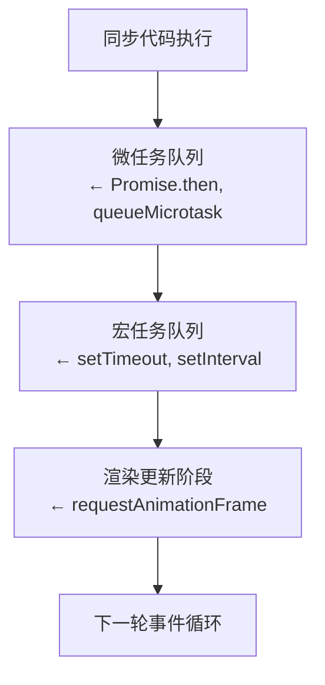
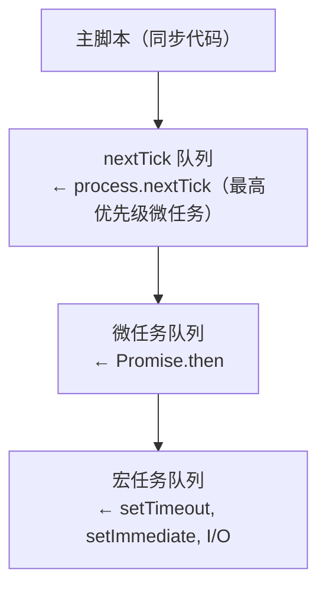
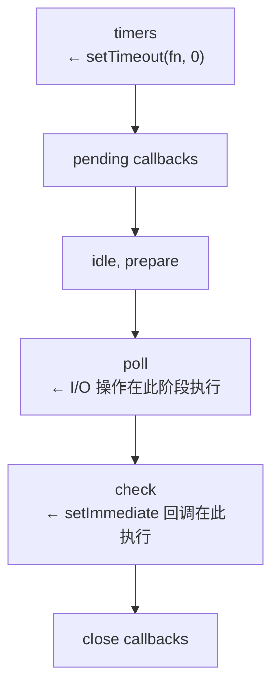

# 事件循环经典面试题

## 1. 核心概念速查表

| 类型 | 来源 | 示例 |
|------|------|------|
| **宏任务 (Macrotask)** | setTimeout, setInterval, setImmediate, I/O, UI rendering | `setTimeout(() => {}, 0)` |
| **微任务 (Microtask)** | Promise.then/catch/finally, queueMicrotask, MutationObserver | `Promise.resolve().then()` |
| **Node.js 特有** | process.nextTick (最高优先级微任务) | `process.nextTick(() => {})` |

### 1.1 事件循环执行顺序

```
同步代码 → 微任务队列 → 宏任务队列 → 渲染更新
              ↑            ↑
         Promise回调    setTimeout/setImmediate
         queueMicrotask
```

---

## 2. 基础顺序题

```javascript
// 题目：下面代码的输出顺序是什么？

console.log('1');

setTimeout(() => {
  console.log('2');
}, 0);

Promise.resolve().then(() => {
  console.log('3');
});

console.log('4');
```

**输出：**
```
1
4
3
2
```

**解析：**

| 阶段 | 执行内容 | 说明 |
|------|----------|------|
| 同步执行 | `1` → `4` | 主脚本同步代码立即执行 |
| 微任务检查 | `3` | Promise.then 回调进入微任务队列，在当前宏任务结束后执行 |
| 宏任务执行 | `2` | setTimeout 回调进入宏任务队列，等待下一轮事件循环 |

**队列状态变化：**

- 宏任务队列：`[setTimeout回调]`
- 微任务队列：`[Promise.then回调]`

---

## 3. queueMicrotask 与 Promise.then 对比

```javascript
// 题目：queueMicrotask 和 Promise.then 谁先执行？

queueMicrotask(() => {
  console.log('queueMicrotask');
});

Promise.resolve().then(() => {
  console.log('Promise.then');
});
```

**输出：**
```
queueMicrotask
Promise.then
```

**解析：**

两者都属于微任务，**queueMicrotask 先于 Promise.then 执行**。

微任务队列内部顺序：

1. 先入先出 (FIFO)
2. queueMicrotask 回调先被加入队列
3. Promise.then 回调后加入

**队列状态：**

- 微任务队列：`[queueMicrotask回调, Promise.then回调]`

---

## 4. 嵌套 Promise 链式调用

```javascript
// 题目：分析输出顺序
// 预期输出顺序：start → end → p1 → p2 → setTimeout
// 排序依据：同步代码最先跑；微任务（Promise.then 回调）在当前这一轮结束时被一次性清空；
// setTimeout 属于宏任务，只能等所有微任务清空后、事件循环进入 timers 阶段才执行。

// 第 1 段：同步起点（这一段的输出一定排在最前）
// console.log 是最普通的同步语句，V8 执行到该行就立即写出结果，
// 不经过任何任务队列，所以它是全局最先确定的输出，也是后续对比的基准。
console.log('start');

// 第 2 段：搭建 Promise 微任务链（决定 p1/p2 的相对位置）
// Promise.resolve() 立刻返回一个已 fulfilled 的 promise，因此后面的 .then
// 不会被同步调用，而是把回调包装成微任务压入微任务队列，等同步代码跑完再消费。
Promise.resolve()
  .then(() => {
    console.log('p1');
    // 返回一个新 promise 时，外层 then 必须等这个 promise 敲定才能继续；
    // 规范为此会额外插入 PromiseResolveThenableJob 之类的微任务，
    // 相当于让链子“多走几个 tick”，于是 p2 被推迟——但仍留在同一轮
    // 微任务清空中执行，绝不会把执行权让给 setTimeout。
    return Promise.resolve();
  })
  .then(() => {
    // 这一环的回调要等上一个 then 的返回值（一个 promise）解析完成后才入队，
    // 因此它排在 p1 之后、所有宏任务之前，是与 p1 在同一清空轮次内的后继。
    console.log('p2');
  });

// 第 3 段：注册宏任务定时器（这一段的输出被压到最后）
// setTimeout(..., 0) 并不表示“立即执行”，0ms 只是最快到期时间；
// 回调属于宏任务，必须在当前同步片段结束且微任务队列彻底清空之后，
// 由事件循环在 timers 阶段取出，因此它排在 p2 之后。
setTimeout(() => {
  console.log('setTimeout');
}, 0);

// 第 4 段：同步收尾（决定执行栈何时让出）
// 这一行与第 1 段同属一个同步执行片段，所以仍在所有异步回调之前打印；
// 它执行完毕意味着调用栈清空，事件循环这才开始消费微任务队列。
// 易错点：不要按“注册先后”推断触发顺序，真正的依据是任务类型——
// 微任务优先于宏任务，注册位置只决定同一类型队列内部的先后。
console.log('end');
```

**输出：**
```
start
end
p1
p2
setTimeout
```

**解析：**

关键点：`return Promise.resolve()` 会创建一个新的 Promise，这个操作本身是同步的，但其 `.then` 回调会作为下一个微任务处理。

**执行流程：**

```
阶段1: 同步执行
  └─ console.log('start')    → 输出 "start"
  └─ Promise.resolve()        → 创建 Promise
  └─ .then()                  → 回调1加入微任务队列
  └─ setTimeout()            → 回调加入宏任务队列
  └─ console.log('end')      → 输出 "end"

阶段2: 微任务执行
  └─ 回调1执行
      └─ console.log('p1')   → 输出 "p1"
      └─ return Promise.resolve()
          └─ 微任务队列已清空
  └─ 回调2执行
      └─ console.log('p2')   → 输出 "p2"

阶段3: 宏任务执行
  └─ setTimeout 回调
      └─ console.log('setTimeout') → 输出 "setTimeout"
```

---

## 5. async/await 底层原理

```javascript
// 题目：async/await 实际上是怎么执行的？

async function asyncFn() {
  console.log('async start');
  await console.log('await value');
  console.log('async end');
}

console.log('1');
asyncFn();
console.log('2');
```

**输出：**
```
1
async start
await value
2
async end
```

**解析：**

`async` 函数执行过程：

1. `asyncFn()` 调用是同步的，函数体立即执行
2. `await` 关键字后的表达式**同步执行**
3. `await` 下面的代码作为微任务执行

**等价转换 (伪代码)：**

```javascript
// 上面代码等价于：
console.log('1');

(function() {
  console.log('async start');
  Promise.resolve()
    .then(() => {
      console.log('await value');  // 实际上 await 表达式本身的结果
      console.log('async end');
    });
})();

console.log('2');
```

---

## 6. 多个 setTimeout 的执行顺序

```javascript
// 题目：多个 setTimeout 的输出顺序

console.log('A');

setTimeout(() => console.log('B'), 0);

setTimeout(() => {
  console.log('C');
  Promise.resolve().then(() => console.log('D'));
}, 0);

setTimeout(() => console.log('E'), 0);

Promise.resolve().then(() => console.log('F'));
```

**输出：**
```
A
F
B
C
D
E
```

**解析：**

**执行时间线：**

```
t=0: 主脚本执行
  └─ A (同步)
  └─ 3个 setTimeout 加入宏任务队列
  └─ Promise.then 加入微任务队列
  └─ "F" 输出

t=下一个事件循环:
  └─ 微任务队列清空
  └─ 宏任务队列: [B回调, C回调, E回调]
  └─ 执行 B回调 → "B" 输出

t=再下一个事件循环:
  └─ 宏任务队列: [C回调, E回调]
  └─ 执行 C回调 → "C" 输出
  └─ Promise.then 加入微任务队列

t=微任务执行:
  └─ "D" 输出
  └─ 微任务队列清空

t=再下一个事件循环:
  └─ 宏任务队列: [E回调]
  └─ 执行 E回调 → "E" 输出
```

---

## 7. setTimeout(fn, 0) 并不保证立即执行

```javascript
// 题目：这段代码会输出什么？

console.log('1');

setTimeout(() => console.log('2'), 0);

Promise.resolve().then(() => {
  console.log('3');
  Promise.resolve().then(() => console.log('4'));
});

console.log('5');

Promise.resolve().then(() => console.log('6'));
```

**输出：**
```
1
5
3
6
4
2
```

**解析：**

**关键点：** 微任务队列在同一个宏任务内会**全部清空**后才开始下一个宏任务。

**执行流程：**

```
阶段1: 同步执行
  └─ "1", "5" 输出

阶段2: 第一轮微任务
  └─ 微任务队列: [then3, then6]
  └─ 执行 then3
      └─ "3" 输出
      └─ then4 加入微任务队列
  └─ 执行 then6
      └─ "6" 输出
  └─ 微任务队列: [then4]
  └─ 执行 then4
      └─ "4" 输出

阶段3: 宏任务执行
  └─ setTimeout 回调
      └─ "2" 输出
```

---

## 8. requestAnimationFrame 执行时机

```javascript
// 题目：requestAnimationFrame 在事件循环中的位置

console.log('start');

setTimeout(() => console.log('setTimeout'), 0);

requestAnimationFrame(() => {
  console.log('requestAnimationFrame');
});

Promise.resolve().then(() => console.log('Promise'));

console.log('end');
```

**输出（浏览器）：**
```
start
end
Promise
requestAnimationFrame
setTimeout
```

**解析：**

**事件循环中的位置（简化版）：**



**注意：** requestAnimationFrame 回调只在需要渲染时才会执行，在没有视觉更新的环境中（如 Node.js）行为可能不同。

---

## 9. Node.js 特殊队列顺序

> **环境：Node.js**

```javascript
// 题目：在 Node.js 环境中运行，以下输出顺序是什么？
//
// 这段代码是理解 Node.js 事件循环（event loop）与任务队列优先级的经典样本：
// 同一份同步代码里同时注册了 nextTick、Promise 微任务和 setImmediate 宏任务，
// 它们何时执行，取决于主调用栈清空后事件循环的推进顺序。

// 第 1 段：准备运行环境（引入依赖）
// require('fs') 是同步加载，只会占用一点初始化时间，不会把任何回调压入队列，
// 因此它对输出顺序毫无影响；这里也说明本文件按 CommonJS 规则被包裹进函数中执行，
// 顶层这些语句就构成了"主调用栈"。
const fs = require('fs');

// 第 2 段：主调用栈开始执行（第一处同步输出）
// 同步代码拥有最高优先级，只要它还在跑，任何回调都无法插队，
// 所以这里必然是整个程序第一个打印出来的内容。
console.log('1'); // 输出：1（第 1 位）

// 第 3 段：注册 process.nextTick 回调（nextTick 队列，微任务中的最高优先级）
// nextTick 队列不属于事件循环的任何阶段，而是在"每次调用栈清空后、进入下一阶段前"被优先清空；
// 它的优先级高于 Promise 微任务，但依然排在当前同步代码后面，不会立即执行。
process.nextTick(() => {
  console.log('nextTick'); // 输出：nextTick（第 3 位）
});

// 第 4 段：注册 Promise.then 回调（Promise 微任务队列）
// Promise.resolve() 已处于 fulfilled 状态，then 的回调被压入微任务队列；
// 按 Node 11+ 的行为，微任务队列排在 nextTick 队列之后、所有宏任务之前。
Promise.resolve().then(() => {
  console.log('Promise.then'); // 输出：Promise.then（第 4 位）
});

// 第 5 段：注册 setImmediate 回调（事件循环 check 阶段，属于宏任务）
// setImmediate 不与当前调用栈同步执行，要等事件循环走到 check 阶段才被取出；
// 在主模块（同步代码）场景下，它总是排在本轮所有微任务之后，别被 "immediate" 这个名字误导。
setImmediate(() => {
  console.log('setImmediate'); // 输出：setImmediate（第 5 位）
});

// 第 6 段：主调用栈收尾，并推演最终顺序
// 同步语句按书写顺序执行到此处，所以 2 紧跟着 1 打印；
// 随后调用栈清空，依次清空 nextTick 队列 → Promise 微任务队列 → 事件循环进入 check 阶段执行 setImmediate。
// 边界条件：只有当代码位于 I/O 回调内部时，setImmediate 与 setTimeout(0) 的先后才可能翻转。
console.log('2'); // 输出：2（第 2 位）
```

**输出（Node.js）：**
```
1
2
nextTick
Promise.then
setImmediate
```

**解析：**

**Node.js 事件循环的微任务优先级：**

```
微任务队列优先级（从高到低）：
1. process.nextTick()     ← 最高优先级
2. Promise.then()        ← 普通微任务
3. queueMicrotask()      ← 与 Promise.then 同级
```

**Node.js 事件循环简化架构：**



**关键区别：**

- `process.nextTick()` 的回调会在**当前操作完成后、下一个微任务之前**立即执行
- `setImmediate()` 在 I/O 回调之后执行，与 `setTimeout(fn, 0)` 不同

---

## 10. setTimeout vs setImmediate（Node.js I/O 场景）

> **环境：Node.js**

```javascript
// 题目：在 I/O 操作后，setTimeout 和 setImmediate 谁先执行？

// 第 1 段：引入 fs —— 本实验的"舞台搭建"
// 之所以挑 readFile，是因为它属于真正走 libuv 线程池的异步 I/O，
// 其回调会被投递到事件循环的 poll 阶段执行，这正是让后面两者顺序变得"可预测"的前提。
const fs = require('fs');

// 第 2 段：发起一次异步读文件，把实验代码搬进 poll 阶段的回调里
// 读 package.json 只是随便找个必然存在的文件，内容与结果都无关紧要；
// 唯一目的是拿到"一段运行在 poll 阶段内"的代码执行窗口。
fs.readFile('./package.json', () => {
  // 第 3 段：I/O 回调内部 —— 对比实验的现场
  // 关键机制：当前正处在 poll 阶段，setImmediate 的回调属于紧随其后的 check 阶段，
  // 而 setTimeout(0) 会被 Node 向下钳制为 1ms，且只在下一轮 timers 阶段才被检查到期。
  // 因此本轮 poll 结束后直接进入 check，setTimeout 还没到期 —— setImmediate 先打印。
  console.log('I/O 回调');

  // 注册到 timers 阶段：0 秒不会真的"立即"，最小粒度是 1ms，且要等下一轮 timers 阶段才轮到它。
  setTimeout(() => {
    console.log('setTimeout 在 I/O 后');
  }, 0);

  // 注册到 check 阶段：就在当前 poll 阶段之后，属于"本轮循环内"就能兑现的任务。
  setImmediate(() => {
    console.log('setImmediate 在 I/O 后');
  });
  // 易错点/边界：这种"setImmediate 必先"的确定性仅在 poll 阶段（即 I/O 回调）内部成立；
  // 若把同样的两行写在模块顶层，顺序会随进程启动耗时漂移，二者谁先谁后并不保证。
  // 另外本例省略了 readFile 的 error 参数，真实项目里文件缺失会导致回调抛出未捕获异常。
});
```

**输出（可能）：**
```
I/O 回调
setImmediate 在 I/O 后
setTimeout 在 I/O 后
```

**或者（有时）：**
```
I/O 回调
setTimeout 在 I/O 后
setImmediate 在 I/O 后
```

**解析：**

**为什么结果不固定？**

在 I/O 回调完成后，`setTimeout` 和 `setImmediate` 的执行顺序取决于**事件循环的当前阶段**：



**结论：**

- 在**文件 I/O 回调后**，通常 `setImmediate` **先于** `setTimeout` 执行
- 因为 I/O 完成后进入 `check` 阶段，而 `setTimeout` 在下一轮的 `timers` 阶段
- 但如果事件循环已经进入 `timers` 阶段，则 `setTimeout` 先执行

---

## 11. 综合复杂题

```javascript
// 题目：终极复杂题，分析执行顺序

// 第 1 段：定义两个 async 函数——演示 await 的"挂起/恢复"语义
async function async1() {
  console.log('async1 start');
  await async2(); // 关键行：await 会把 async1 的后续代码（'async1 end'）包装成一个微任务，先让出执行权
  console.log('async1 end');
}

async function async2() {
  console.log('async2'); // async2 内部没有 await，所以整体同步跑完；但它仍是 async 函数，返回一个已 resolve 的 Promise
}

console.log('script start'); // 第 1 个同步输出，标记同步代码正式开跑

// 第 2 段：注册宏任务（Timer）——这是最先被登记、但最晚才执行的代码
setTimeout(() => {
  console.log('setTimeout1'); // 宏任务：要等所有同步代码 + 所有微任务清空后才轮到它
  Promise.resolve().then(() => console.log('Promise in setTimeout')); // 在宏任务内部再塞一个微任务，证明"每个宏任务结束后都会清空一次微任务队列"
}, 0);

// 第 3 段：Promise 链（含嵌套定时器）——展示 then 的"串联"与返回值决定下一环时机
new Promise((resolve) => {
  console.log('Promise executor'); // 易错点：executor 是同步立即执行的，所以它排在 'script end' 之前
  resolve(); // 同步 resolve，使得下面 .then 的回调被立刻排入微任务队列
}).then(() => {
  console.log('Promise.then1');
  return new Promise((resolve) => { // 关键数据流：返回一个 pending Promise，会把后续 .then2 一直"挂住"
    setTimeout(() => {
      console.log('setTimeout in Promise.then'); // 这是第 2 个宏任务，注册时间晚于 setTimeout1，所以排在它后面
      resolve(); // 这里才把 then1 返回的 Promise 兑现，then2 此刻才被排入微任务队列
    }, 0);
  });
}).then(() => {
  console.log('Promise.then2'); // 依赖上面的 resolve，是最晚出现的微任务之一
});

// 第 4 段：调用 async1——触发 await 的挂起，为微任务队列再添一项
async1(); // 同步部分：打印 'async1 start' → 调用 async2 打印 'async2' → 在 await 处挂起并返回

console.log('script end'); // 同步代码的最后一行；此后进入事件循环：先清空微任务，再取宏任务

// 第 5 段：执行顺序总结（便于对照，非原代码）
// 同步：script start → Promise executor → async1 start → async2 → script end
// 微任务第 1 轮：Promise.then1 → async1 end（then1 先入队，因为它在同步阶段就被 resolve 排队；async1 的恢复在 async2 调用之后才入队）
// 复杂度：每个宏任务结束都会 drain 一次微任务队列，故顺序呈"同步 → 微任务 → 宏任务 → 微任务……"的交替结构
// 边界：若把它跑到支持 await 优化的引擎（Node 12+ / 现代浏览器），await 只花 1 个微任务 tick，'async1 end' 才排在 then1 之后；
//       老引擎里 await 会拆成多个 tick，顺序会变，这正是本题最容易踩的版本坑。
```

**输出：**
```
script start
Promise executor
async1 start
async2
script end
async1 end
Promise.then1
setTimeout1
Promise in setTimeout
setTimeout in Promise.then
Promise.then2
```

**解析：**

**执行时间线：**

```
t=0: 主脚本同步执行
  ├─ "script start"
  ├─ setTimeout1 加入宏任务队列
  ├─ Promise executor 同步执行 → "Promise executor"
  │   then1 加入微任务队列
  ├─ async1() 调用（同步）
  │   ├─ "async1 start"（同步）
  │   ├─ async2() 调用
  │   │   └─ "async2"（同步）
  │   ├─ await 后面的代码加入微任务队列
  ├─ "script end"

t=微任务执行（第一轮）
  ├─ async1 await 后代码
  │   └─ "async1 end"
  ├─ Promise.then1
  │   └─ "Promise.then1"
  │   └─ setTimeout in Promise.then 加入宏任务队列

t=宏任务执行（第一轮）
  ├─ setTimeout1
  │   └─ "setTimeout1"
  │   └─ Promise in setTimeout 加入微任务队列

t=微任务执行（第二轮）
  └─ Promise in setTimeout
      └─ "Promise in setTimeout"

t=宏任务执行（第二轮）
  ├─ setTimeout in Promise.then
  │   └─ "setTimeout in Promise.then"
  │   └─ resolve() → 触发下一个 then

t=微任务执行（第三轮）
  └─ Promise.then2
      └─ "Promise.then2"
```

---

## 12. 总结：事件循环核心规则

### 12.1 浏览器环境

| 优先级 | 类型 | 示例 |
|--------|------|------|
| 1 | 同步代码 | `console.log()` |
| 2 | 微任务 | `Promise.then()`, `queueMicrotask()`, `await` |
| 3 | 宏任务 | `setTimeout()`, `setInterval()`, `requestAnimationFrame()` |
| 4 | 渲染 | 更新 DOM（requestAnimationFrame 之后） |

### 12.2 Node.js 环境

| 优先级 | 类型 | 示例 |
|--------|------|------|
| 1 | 同步代码 | `console.log()` |
| 2 | nextTick | `process.nextTick()` |
| 3 | 微任务 | `Promise.then()`, `queueMicrotask()` |
| 4 | 宏任务 | `setTimeout()`, `setInterval()` |
| 5 | check 阶段 | `setImmediate()` |
| 6 | I/O 轮询 | `fs.readFile()` |

### 12.3 面试高频考点

1. **微任务先于宏任务执行**
2. **微任务队列在同一宏任务内全部清空**
3. **async/await 底层基于 Promise**
4. **process.nextTick 优先级高于 Promise.then (Node.js)**
5. **setTimeout(fn, 0) 不保证立即执行**
6. **requestAnimationFrame 在渲染阶段执行**
7. **Node.js 中 setImmediate vs setTimeout 在 I/O 后的顺序不固定**

## 深入阅读与参考

!!! tip "怎么用这些资料"
    先读「官方文档与规范」建立准确的概念，再读「源码与示例」核对细节，最后用「教程、书籍与视频」换一种讲法加深理解。每条都写明了读哪一节、带着什么问题读。

### 官方文档与规范

| 资源 | 为什么读 | 怎么读 |
|---|---|---|
| [Node.js 事件循环](https://nodejs.org/en/learn/asynchronous-work/event-loop-timers-and-nexttick) | Node 官方详解各阶段与 nextTick、微任务队列，是 Node 顺序题权威依据。 | 重点读 timers、poll、check 与 nextTick 小节，手写打印顺序题验证。 |
| [MDN 事件循环](https://developer.mozilla.org/en-US/docs/Web/JavaScript/Event_loop) | 浏览器端事件循环权威说明，讲清任务与微任务，适合速查与总结。 | 读“运行时概念”下任务与微任务两节，画出点击后 Promise 与定时器时序。 |
| [Promises/A+ 规范](https://promisesaplus.com/) | Promise.then 的微任务时序由规范定义，读它理解 then 回调为何异步。 | 读 2.2 节 then 调用时机，对照代码解释 queueMicrotask 与 then 差异。 |
| [await](https://developer.mozilla.org/en-US/docs/Web/JavaScript/Reference/Operators/await) | 说明 await 暂停与恢复的微任务语义，是 async/await 底层题官方参考。 | 读描述与示例，重点看 await 之后的代码如何进入微任务队列。 |
| [async function](https://developer.mozilla.org/en-US/docs/Web/JavaScript/Reference/Statements/async_function) | 官方定义 async 函数返回 Promise 与 await 暂停机制，底层原理必读。 | 读描述和示例，确认 async 函数调用后同步执行到首个 await 的行为。 |
| [Promise](https://developer.mozilla.org/en-US/docs/Web/JavaScript/Reference/Global_Objects/Promise) | Promise 状态与链式调用基础，嵌套 Promise 链式题需要它打底。 | 读链式调用与时序两节，自己写链式 then 并预测打印顺序。 |
| [Promise.prototype.then()](https://developer.mozilla.org/en-US/docs/Web/JavaScript/Reference/Global_Objects/Promise/then) | then 的异步回调时机是微任务对比题核心，官方说明最准确。 | 读返回值和执行时机说明，用 queueMicrotask 写对照实验验证顺序。 |

### 源码与示例

| 资源 | 为什么读 | 怎么读 |
|---|---|---|
| [Loupe 事件循环可视化工具](https://latentflip.com/loupe/) | 把调用栈、任务与微任务队列可视化，直观理解基础顺序题。 | 粘贴 setTimeout 与 Promise 示例，逐步观察队列变化并记录顺序。 |
| [JS Visualizer 9000](https://www.jsv9000.app/) | 在线可视化 Promise 与定时器执行顺序，适合验证微任务优先。 | 输入基础顺序题代码，单步执行，确认微任务在下一宏任务前清空。 |
| [BigFrontEnd.dev 题目列表](https://bigfrontend.dev/problem) | 提供大量 Promise 与事件循环面试题，适合综合复杂题自测。 | 按 Promise 标签做 5 题，先写答案再对照讨论区解析。 |

### 教程、书籍与视频

| 资源 | 为什么读 | 怎么读 |
|---|---|---|
| [MDN 使用 Promise](https://developer.mozilla.org/en-US/docs/Web/JavaScript/Guide/Using_promises) | 教程式讲链式调用与错误处理，帮助把回调改写为 Promise 链。 | 读链式与错误处理两节，把回调地狱示例改写成 async/await。 |
| [现代 JavaScript 教程：异步](https://zh.javascript.info/async) | 从回调到 Promise、async/await 循序渐进，适合打牢异步基础。 | 按目录读 Promise 链与 async/await 章节，完成对应练习。 |
| [长任务优化](https://web.dev/articles/optimize-long-tasks) | 用 setTimeout 拆分长任务并测 INP，理解 setTimeout(fn,0) 实际延迟。 | 读 scheduler.yield 与 setTimeout 拆分部分，复测一个长任务 INP。 |
| [现代 JavaScript 教程：动画](https://zh.javascript.info/animation) | 讲 requestAnimationFrame 执行时机与用法，对应动画帧章节。 | 读 requestAnimationFrame 一节，写一个匀速移动元素观察帧回调。 |

## 应用与行业实践

### 应用场景地图

| 场景 | 用到本页哪个知识点 | 典型技术选型 | 注意事项 |
| --- | --- | --- | --- |
| 后台管理的万行表格首屏渲染 | 同步代码 → 微任务 → 宏任务 → 渲染 的顺序 | 分片渲染 + requestAnimationFrame | 分片内只建 DOM，读布局属性会触发同步重排 |
| 低端安卓的首屏加载 | 微任务队列清空后才轮到渲染 | 动态 import + MessageChannel 让出 | 连续 await 已 resolve 的 Promise 不会让出主线程 |
| 多人协作白板的光标与笔迹同步 | queueMicrotask 与 Promise.then 的时序 | WebSocket + Canvas + requestAnimationFrame | 微任务只合并同一任务内的操作，跨任务要靠按帧合并 |
| 直播弹幕列表自动滚动 | 渲染更新排在宏任务之后 | rAF + transform 位移 | 每条消息都改样式会让同一帧多次布局 |
| 页面卸载前的埋点上报 | 微任务先于宏任务执行 | navigator.sendBeacon / fetch keepalive | 不要依赖 setTimeout 上报，页面可能已经卸载 |
| 搜索框输入联想 | 嵌套 Promise 链式调用、async/await 底层原理 | 防抖 + AbortController | 每次响应都要判断是否已被取消，否则旧结果覆盖新结果 |
| 数据大屏的 WebSocket 高频推送 | requestAnimationFrame 执行时机 | rAF 批量绘制 | 一批推送改多次状态，只允许画一帧 |
| Node.js BFF 的定时清理与 I/O 回调 | Node.js 特殊队列顺序、setTimeout vs setImmediate | setImmediate / process.nextTick | 递归 nextTick 会饿死 I/O 回调 |

### 三个场景拆解

#### 场景 N：后台管理万行表格的首屏渲染

**业务背景**：运营后台一次要展示全量订单，数据量在万行以上，一次性插入 DOM 后页面卡住数秒，用户点击筛选没有任何反馈。测量方法是打开 Chrome DevTools 的 Performance 面板录一次加载，看长任务的数量和时长。

**怎么用本页知识解决**：思路是把一次长同步任务切成多个短任务，片与片之间用 rAF 让出，让渲染有机会插入。

```js
const CHUNK = 500; // 每片的行数，按实测长任务时长调整
let cursor = 0;

function renderChunk() {
  const end = Math.min(cursor + CHUNK, rows.length);
  const frag = document.createDocumentFragment(); // 片内先离屏组装
  for (; cursor < end; cursor++) {
    const tr = document.createElement('tr');
    tr.textContent = rows[cursor].id; // 只写文本，不读布局
    frag.appendChild(tr);
  }
  tbody.appendChild(frag); // 一次插入，减少重排次数
  if (cursor < rows.length) {
    requestAnimationFrame(renderChunk); // 让出主线程，渲染可插入
  }
}
requestAnimationFrame(renderChunk);
```

- 每片处理 500 行，片内是同步代码，执行完才轮到渲染，所以片长必须短于 50 毫秒。
- rAF 回调属于渲染前的回调，下一片会等这一帧的渲染安排完再跑。
- 用 DocumentFragment 组装，插入只触发一次 DOM 变更。
- 片内不读 offsetHeight 这类属性，避免强制同步布局把时间堆回来。

**怎么度量收益**：看 Performance 面板里的 Long Tasks 轨道数量与总时长，配合 PerformanceObserver 监听 longtask，再记录首屏可交互的时间点。

**什么时候不该用**：数据量在几百行、一次同步插入就能完成的列表，分片只会增加帧调度开销。需要打印或导出时要求 DOM 已全部就绪，分片未完成就触发的操作会拿到半截数据。

#### 场景 N：多人协作白板的笔迹与光标同步

**业务背景**：一块白板同时有几十个协作者，每人每秒产生数十个笔迹点，服务端按批推送。早期写法在 WebSocket 回调里直接改状态并重绘，画布每秒重绘上百次，低端设备出现明显撕裂。

**怎么用本页知识解决**：消息回调里只入队，用微任务把同一条消息内的多个操作合并成一次状态更新，用 rAF 把跨消息的绘制收敛到一帧一次。

```js
const pending = [];
let rafId = 0;

function onMessage(evt) {
  const ops = JSON.parse(evt.data); // 一条消息通常含多个笔迹点
  pending.push(...ops); // 回调里只入队，不做状态变更
  queueMicrotask(flushState); // 同一任务内合并成一次更新
  if (!rafId) rafId = requestAnimationFrame(draw); // 跨消息合并到一帧
}

function flushState() {
  const batch = pending.splice(0, pending.length);
  applyOps(batch); // 状态层一次落地，避免中间态
}

function draw() {
  rafId = 0;
  redrawCanvas();
}
```

- queueMicrotask 在当前任务结束后立即执行，同一条消息里的多个点不会产生中间渲染。
- 跨消息的合并靠 rafId 去重，一帧内只安排一次绘制。
- 状态更新与绘制分离，回放或撤销时只重跑 flushState。
- 如果直接在回调里 draw，第 N 条消息会给第 N 次绘制排队，帧率随消息量下降。

**怎么度量收益**：用 Performance 面板看 Frames 轨道，记录每帧的绘制次数；用 web-vitals 的 INP 观察拖拽笔迹时的交互延迟。

**什么时候不该用**：纯本地的单人绘图，没有网络批量推送，引入队列只增加一层间接。笔迹必须逐点带时间戳回放的教学录屏，合并会丢掉点与点的间隔，要在合并前保留原始序列。

#### 场景 N：低端安卓的首屏加载

**业务背景**：中低端安卓机上首屏骨架出现后白屏时间偏长，机型越老越明显。测量方法是在 DevTools 里开启 6 倍 CPU 降速，录一次加载并看首次内容绘制的时间点。

**怎么用本页知识解决**：初始化链里连续 await 已经 resolve 的 Promise，微任务队列会被一次清空，渲染插不进来。把非关键初始化拆到宏任务或 rAF 之后执行，就能给渲染让路。

```js
async function boot() {
  renderShell(); // 关键路径：先把骨架屏上屏
  await nextFrame(); // 让出到渲染之后，再继续
  initAnalytics(); // 非关键初始化
  await nextFrame();
  initEditor();
}

function nextFrame() {
  return new Promise((resolve) => {
    requestAnimationFrame(() => setTimeout(resolve, 0)); // 宏任务排在渲染之后
  });
}
```

- 关键路径只做骨架渲染，其余初始化全部排在首次绘制之后。
- await 一个已经 resolve 的值不会让出，必须等到下一个宏任务或下一帧。
- 用 rAF 加 setTimeout 的组合，是为了让过当前帧的渲染，而不只是排到队列尾。
- 每段初始化之间都插入让出点，单段的耗时仍需控制在 50 毫秒以内。

**怎么度量收益**：看 Lighthouse 的 Largest Contentful Paint 与 Total Blocking Time，配合 web-vitals 的 onLCP 在真实设备上采样，并在 DevTools 里用 6 倍降速复现。

**什么时候不该用**：鉴权、埋点 SDK 的初始化必须在首屏请求发出前完成，延后会导致请求缺少头部。首屏依赖的数据解析本身只有几毫秒，拆成多帧只会把总时长拉长。

### 行业先进实践

**用 MessageChannel 做时间切片调度（出处：React 官方文档与 facebook/react 仓库的 scheduler 包）**
React 的调度器用 MessageChannel 的 postMessage 回调作为让出点，setTimeout 作为降级方案。MessageChannel 回调属于宏任务，浏览器可以在两个宏任务之间插入渲染，所以长列表切片不会一直占着主线程。借鉴做法是让出函数优先选 MessageChannel，用 setTimeout 兜底。
需核对官方文档：不同版本 scheduler 的降级顺序会调整，接入前核对仓库里 scheduler 包的实现文件。

**nextTick 采用微任务优先的降级链（出处：Vue 官方文档《异步更新队列》与 vuejs/core 仓库）**
Vue 在批量更新之后用 nextTick 通知回调，实现里优先使用 Promise.then，再按运行环境降级。微任务在同一次任务的末尾清空，所以一次同步改动多个响应式数据只触发一次 DOM 更新。借鉴做法是在自研状态管理里也留一个批量提交入口。

**不要在 process.nextTick 里做递归调度（出处：Node.js 官方文档《The Node.js Event Loop, Timers, and process.nextTick()》）**
Node 官方文档写明 nextTick 的回调队列会在事件循环继续之前被清空，递归调用会挡住 I/O 回调。需要"尽快但可被打断"时用 setImmediate。借鉴做法是 Node 侧的分片任务统一用 setImmediate 排下一片。

**用 INP 与 longtask 观察主线程阻塞（出处：web.dev 的 INP 文档、web-vitals 库、Chrome 的 PerformanceObserver）**
INP 记录用户交互到下一次绘制完成的时间，longtask 观察者记录超过 50 毫秒的任务。两者放在一起，可以看出微任务饥饿或长同步块造成的交互延迟。借鉴做法是把 longtask 计数接入前端监控，按页面路径聚合后再定位代码。

**用 requestAnimationFrame 收敛视觉更新（出处：MDN 的 Window.requestAnimationFrame 文档与 W3C 的 Timing control for script-based animations）**
同一帧内注册的 rAF 回调会在渲染之前一起执行，把样式变更集中到回调里可以避免同一帧多次布局。借鉴做法是滚动、拖拽、动画的绘制入口统一交给一个 rAF 调度器，业务代码只提交变更。

### 从学到用：落地路线

第 1 步，选一个后台管理里的长列表页做试点，接入分片渲染与 longtask 采集。验收标准是 Performance 面板录制的加载过程里长任务数量为 0。

第 2 步，在 4 倍与 6 倍 CPU 降速下各录三次，记录长任务数量与 INP。验收标准是三次测量结果可复现，且没有单次超过 50 毫秒的任务。

第 3 步，把让出函数抽成公共模块，在三个列表页和一个实时推送页接入。验收标准是公共模块有单元测试，接入页面用同一份测量脚本产出报告。

第 4 步，把 longtask 计数与帧率门槛写进 CI 的性能脚本。验收标准是构造一个故意插入长同步块的提交，流水线能把它拦下来。

### 动手作业

**目标**：做一个包含 5000 行表格与高频推送的页面，让它在 6 倍 CPU 降速下仍然可以点击和滚动。

**步骤**：

1. 生成 5000 行数据，用一次同步插入完成渲染，用 Performance 面板录一次基线，记下长任务数量与最长任务时长。
2. 改成分片渲染，每片 300 行，片间用 requestAnimationFrame 让出，再录一次并对比。
3. 加一个 setInterval 每 16 毫秒推送一批数据的模拟通道，先在回调里直接改 DOM，观察每帧的绘制次数。
4. 改成入队加 queueMicrotask 合并同一批，再用 requestAnimationFrame 统一绘制，加计数器统计每帧绘制次数。
5. 在 DevTools 里开启 6 倍 CPU 降速，重复步骤 2 与步骤 4 的测量，点击按钮验证交互是否掉帧。
6. 写一份对照记录，列出两种写法在长任务数量、最长任务时长、每帧绘制次数三项上的差别。

**验收标准**：

- 加载过程中超过 50 毫秒的任务数量为 0，可用 PerformanceObserver 的 longtask 或 Performance 面板复现。
- 高频推送下每帧只调用一次绘制函数，计数器打印结果可以验证。
- 6 倍 CPU 降速下点击按钮能在下一帧内看到反馈。
- 代码里不存在分片内读取 offsetHeight 或 getBoundingClientRect 的写法，用文本检索可确认。
- 留下两份 Performance 录制文件，前后对比的长任务数据与记录表一致。

