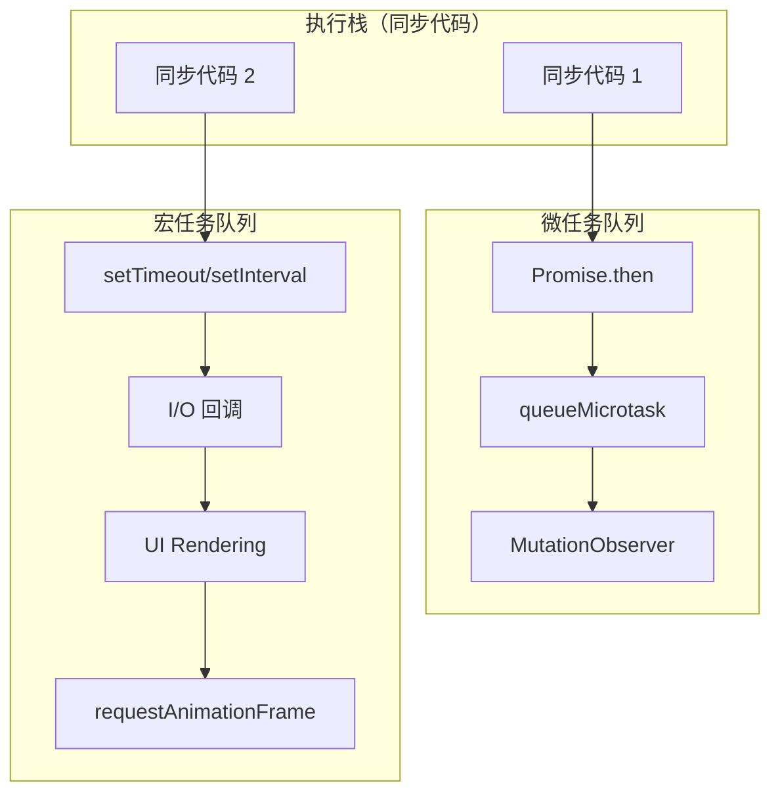
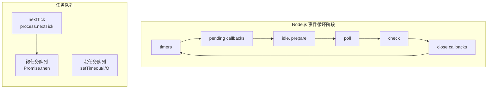

# 事件循环与定时器

## 1. 宏任务 vs 微任务

JavaScript 是单线程语言，所有同步任务在主线程（调用栈）中执行，形成执行栈。任务队列分为**宏任务队列（macrotask）**和**微任务队列（microtask）**。

### 1.1 微任务 vs 宏任务 完整对比



### 1.2 微任务 vs 宏任务 完整对比

| 分类 | 来源 | 说明 |
|------|------|------|
| 微任务 | `Promise.then/catch/finally` | resolve/reject 后入队 |
| 微任务 | `queueMicrotask()` | 手动入队微任务 |
| 微任务 | `MutationObserver` | DOM 变化微任务 |
| 微任务 | `process.nextTick` (Node) | 比 Promise 微任务优先级更高 |
| 宏任务 | `setTimeout / setInterval` | 定时器宏任务 |
| 宏任务 | `I/O` | 文件读写、网络请求回调 |
| 宏任务 | `UI rendering` | 浏览器每帧渲染 |
| 宏任务 | `requestAnimationFrame` | 每帧动画回调 |
| 宏任务 | `requestIdleCallback` | 空闲时低优先级任务 |
| 宏任务 | `setImmediate` (Node) | I/O 回调后执行 |
| 宏任务 | 事件回调 | click, keydown 等 |

## 2. 经典输出顺序题

```javascript
console.log('1');
setTimeout(() => console.log('2'), 0);
Promise.resolve().then(() => console.log('3'));
Promise.resolve().then(() => console.log('4'));
console.log('5');
// 输出：1, 5, 3, 4, 2
// 同步：1, 5 → 微任务：3, 4 → 宏任务：2
```

```javascript
// 复杂题：多个微任务链式
Promise.resolve().then(() => console.log('3'));
Promise.resolve().then(() => {
  console.log('4');
  Promise.resolve().then(() => console.log('5'));
});
Promise.resolve().then(() => console.log('6'));
// 输出：3, 4, 6, 5
// 微任务队列按顺序执行，4中产生了新的微任务5，放到队列末尾继续执行
```

## 3. async/await 与微任务

```javascript
// await Promise.resolve() 的执行流程
async function test() {
  console.log('A');              // 同步
  await Promise.resolve();       // 微任务入队，暂停函数执行
  console.log('B');               // 微任务执行时打印
}

console.log('C');                 // 同步
test();                          // 同步（开始执行 async 函数）
console.log('D');                 // 同步
// 输出：C, A, D, B
```

## 4. 浏览器 vs Node.js 事件循环

Node.js 使用 libuv 实现事件循环，包含多个阶段：



**关键区别：**

| 特性 | 浏览器 | Node.js |
|------|--------|--------|
| 微任务 | `Promise.then` | `Promise.then` + `process.nextTick`（优先级更高） |
| `setTimeout` vs `setImmediate` | 只有 setTimeout | 在 I/O 回调中：immediate 先于 timeout |
| 渲染 | 每帧渲染 | 无 UI 渲染（Node 服务端） |

```javascript
// Node 中 nextTick 优先级高于 Promise 微任务
process.nextTick(() => console.log('nextTick'));
Promise.resolve().then(() => console.log('microtask'));
// 输出：nextTick, microtask

// setTimeout vs setImmediate 在 I/O 回调中
const fs = require('fs');
fs.readFile(__filename, () => {
  setTimeout(() => console.log('timeout'), 0);
  setImmediate(() => console.log('immediate'));
  // 几乎总是 immediate 先输出（check 阶段在 poll 阶段后）
});
```

## 5. setTimeout(fn, 0) 不精确的原因

```javascript
// setTimeout(fn, 0) 不保证立即执行，因为：
// 1. 要等当前同步代码和微任务队列清空
// 2. 要等浏览器渲染（如果需要）
// 3. 后台标签页（Chrome）最低精度降到 1 秒

// 为什么 requestAnimationFrame 比 setTimeout 更适合动画？
// - rAF：每帧渲染前执行，浏览器统一调度，不掉帧
// - setTimeout(..., 16.7)：不管渲染时机，可能在渲染期间执行，导致重复渲染

// 更精确的定时：Web Worker 中没有渲染，精度更高
// 或者使用 MessageChannel
const channel = new MessageChannel();
channel.port1.postMessage(null); // 产生一个宏任务（不涉及渲染）
```

## 6. requestAnimationFrame

```javascript
// rAF 在浏览器渲染前执行（每帧一次），约 16.67ms（60fps）
// 与 setTimeout(fn, 16.7) 的本质区别：
// rAF：保证在渲染前执行，浏览器统一调度，不掉帧
// setTimeout：到时间就执行，可能在渲染期间执行，造成重复渲染

// 使用 rAF 实现流畅动画
function animate(element, targetOpacity) {
  let current = parseFloat(getComputedStyle(element).opacity);

  function step() {
    const delta = targetOpacity - current;
    if (Math.abs(delta) < 0.01) {
      element.style.opacity = targetOpacity;
      return;
    }
    current += delta * 0.1; // 缓动
    element.style.opacity = current;
    requestAnimationFrame(step);
  }

  requestAnimationFrame(step);
}

// rAF 节流（配合滚动事件）
let pending = false;
function onScroll() {
  if (pending) return;
  pending = true;
  requestAnimationFrame(() => {
    handleScroll();           // 同步到渲染时机
    pending = false;
  });
}
```

## 7. 常见陷阱与最佳实践

| 陷阱 | 说明 | 解决方案 |
|------|------|---------|
| 在微任务中创建大量微任务 | 可能在微任务处理中又添加微任务，导致队列不断增长 | 避免在 `.then()` 中直接创建大量同步 Promise |
| `setTimeout(0)` 滥用 | 不精确，会阻塞渲染 | 需要精确时用 `requestAnimationFrame` |
| 混淆微任务和宏任务优先级 | `await` 后面跟着的代码优先级低于其他同步代码 | 理解 `await` 等价于 `.then()` 的微任务性质 |
| 动画用 setTimeout 而非 rAF | 可能掉帧或重复渲染 | 动画统一使用 `requestAnimationFrame` |
| 后台页面 setTimeout 精度丢失 | Chrome 后台化标签页降低定时器精度到 1 秒 | 使用 `visibilitychange` 暂停不必要的定时器 |

## 8. 面试追问

**Q1: 下面代码的输出顺序是什么？**

```javascript
async function async1() {
  console.log('1');
  await async2();
  console.log('2');
}
async function async2() {
  console.log('3');
}
console.log('4');
setTimeout(() => console.log('5'), 0);
async1();
console.log('6');

// 答案：4, 1, 3, 6, 2, 5
// 同步：4, 1, 3（async函数同步部分执行）, 6
// 微任务：2（await async2() 后，async2() 已完成，直接执行后续的微任务）
// 宏任务：5
```

**Q2: 如何用微任务实现一个简单的 `nextTick`？**

```javascript
function nextTick(fn) {
  // 浏览器环境
  if (typeof queueMicrotask !== 'undefined') {
    queueMicrotask(fn);
  } else {
    Promise.resolve().then(fn);
  }
}
```

**Q3: Node.js 和浏览器事件循环的主要区别是什么？**
Node.js 有多个阶段（timers → poll → check），且 `process.nextTick` 优先级高于 Promise 微任务。浏览器只有单一宏任务队列和微任务队列，且有渲染阶段。

## 9. 定时器与调度

### 9.1 setTimeout 为什么不准

```javascript
// setTimeout(callback, 0) 不保证立即执行
// 因为事件循环中要等当前任务和微任务队列清空
// 再加上渲染（如果需要），才有空执行宏任务

setTimeout(() => console.log('timeout'), 0);
console.log('sync');
// 输出：sync, timeout（即使delay=0也要等同步代码完成）

// setTimeout实现机制：
// 浏览器：主线程执行 → 等微任务清空 → 渲染 → 执行宏任务
// setTimeout只是把回调注册到宏任务队列，并不是精确延时

// 原因1：事件循环非空闲时，要等待
// 原因2：渲染优先级：微任务 → 渲染 → setTimeout
// 原因3：后台页面（浏览器tab不可见）会降低精度（Chrome最低1s）

// 精确延迟实现（不完美但比setTimeout好）：
// Web Worker中没有UI渲染，可以更精确
// 或者使用 MessageChannel + performance.now() 测量

// setInterval问题：
// 如果回调执行时间超过delay，下一个回调会跳过（不排队）
const start = Date.now();
setInterval(() => {
  // 模拟耗时操作（超过1000ms）
  const now = Date.now();
  console.log(`上次执行：${now - start}ms ago`);
}, 1000);
// 实际间隔大于1000ms（会累积延迟）
```

### 9.2 requestAnimationFrame 原理

```javascript
// requestAnimationFrame：在下次屏幕刷新前调用
// 每秒约60次（约16.67ms），与屏幕刷新率同步

// 与setTimeout(..., 16.7) 的区别：
// setTimeout：不管浏览器是否在渲染，到时间就执行
// rAF：一定在渲染前，浏览器统一调度，避免掉帧

// rAF使用场景：
// 1. 动画（CSS动画用transform/opacity，无需rAF）
// 2. 游戏循环
// 3. 滚动相关计算（用rAF同步到渲染）

// rAF调用时机（在事件循环中）：
// 每次event loop，浏览器检查是否有rAF回调
// 有的话，在渲染（paint）之前执行（按注册的顺序）
// 然后渲染，更新屏幕

// 节流动画的rAF写法：
let pending = false;
function onScroll() {
  if (pending) return;
  pending = true;
  requestAnimationFrame(() => {
    // 执行滚动处理逻辑
    handleScroll();
    pending = false;
  });
}
```

### 9.3 requestIdleCallback 原理

```javascript
// requestIdleCallback：在浏览器空闲时执行低优先级任务
// 不影响用户交互/渲染

// 兼容性差，可用 polyfill：
window.requestIdleCallback = window.requestIdleCallback || function(cb) {
  const start = Date.now();
  return setTimeout(() => {
    cb({
      didTimeout: false,
      timeRemaining: () => Math.max(0, 50 - (Date.now() - start))
    });
  }, 1);
};

// 使用示例：
requestIdleCallback((deadline) => {
  // deadline.timeRemaining() 返回剩余空闲时间（毫秒）
  // deadline.didTimeout 是否超时
  while (deadline.timeRemaining() > 0 && tasks.length > 0) {
    const task = tasks.shift();
    task();
  }
  if (tasks.length > 0) {
    requestIdleCallback(deadline.__ref);
  }
});

// React fiber就用这个调度任务（虽然后来自己实现了scheduler）
```

## 10. 精简回顾：事件循环速记版

### 10.1 宏任务 vs 微任务

```javascript
// 事件循环顺序：
// 1. 执行同步代码（宏任务）
// 2. 执行所有微任务（Promise.then, MutationObserver, queueMicrotask）
// 3. 执行一个宏任务（setTimeout, setInterval, I/O, UI rendering）
// 4. 循环微任务
// 5. 执行下一个宏任务
// ...

console.log('1');
setTimeout(() => console.log('2'), 0);
Promise.resolve().then(() => console.log('3'));
Promise.resolve().then(() => console.log('4'));
console.log('5');
// 输出：1, 5, 3, 4, 2

// 微任务列表：
// - Promise.then/.catch/.finally
// - queueMicrotask()
// - MutationObserver（DOM变化观察）
// - IntersectionObserver（进入视口）
// - ResizeObserver
// - PerformanceObserver

// 宏任务列表：
// - setTimeout / setInterval
// - I/O操作（文件读写、网络请求）
// - UI渲染
// - requestAnimationFrame
// - requestIdleCallback
// - setImmediate（Node.js）
// - 事件回调

// 为什么Promise是微任务？
// Promise设计者选择了微任务队列（microtask queue）而非宏任务队列
// 这样Promise的then回调能在当前同步代码完成后尽快执行
// 而setTimeout会等下一个宏任务，有额外延迟
```

### 10.2 浏览器 Event Loop 流程

```javascript
// 浏览器Event Loop完整流程：
// 1. 执行同步代码（call stack）
// 2. 清空微任务队列（microtask queue）
// 3. 执行一个宏任务（macrotask queue）
// 4. 重复2-3

console.log('A');
setTimeout(() => console.log('B'), 0);
new Promise(resolve => {
  console.log('C');
  resolve();
}).then(() => console.log('D'));
queueMicrotask(() => console.log('E'));
console.log('F');
// 输出：A, C, F, D, E, B
// 分析：
// 同步：A,C,F
// 微任务：D,E
// 宏任务：B

// async/await 中的微任务：
async function test() {
  console.log('A');
  await Promise.resolve();
  console.log('B');
}
console.log('C');
test();
console.log('D');
// 输出：C, A, D, B
// 分析：
// 同步：C, A（async函数体同步部分执行到await）
// await Promise.resolve() 产生微任务
// D（同步）
// 微任务：打印B
```

### 10.3 浏览器 vs Node Event Loop

```javascript
// Node.js Event Loop（libuv）：
// - timers（setTimeout/interval）
// - pending callbacks
// - idle, prepare
// - poll（获取新I/O事件）
// - check（setImmediate）
// - close callbacks
//
// Node特点：
// 1. setImmediate 在 I/O 回调之后、check阶段执行
// 2. process.nextTick 在当前阶段结束后、下个阶段前执行（优先级高于微任务）
// 3. 微任务：Promise.then + process.nextTick

// setTimeout vs setImmediate：
setTimeout(() => console.log('timeout'));
setImmediate(() => console.log('immediate'));
// 在主脚本中：顺序不确定（取决于性能）
// 在I/O回调中：immediate 先于 timeout

// process.nextTick 优先级高于微任务：
process.nextTick(() => console.log('nextTick'));
Promise.resolve().then(() => console.log('microtask'));
// 输出：nextTick, microtask

// 微任务队列对比：
// 浏览器：Promise.then（微任务）
// Node：  Promise.then + process.nextTick（nextTick更快）

// Node中多个阶段的微任务：
// 每个阶段之间都会执行微任务队列（类似浏览器每轮宏任务后清微任务）
```

### 10.4 MutationObserver 为什么是微任务

```javascript
// MutationObserver 回调是微任务，在当前同步代码结束后立即执行
// 这样可以批量处理多个DOM变化，避免每次变化都触发回调

// 例子：
const observer = new MutationObserver(mutations => {
  console.log(mutations.length);
});
observer.observe(document.body, { childList: true });

// DOM变化产生微任务，回调在同步代码完成后执行
document.body.appendChild(document.createElement('div'));
document.body.appendChild(document.createElement('span'));
// 如果是宏任务，会有延迟；作为微任务，立即响应

// requestAnimationFrame：在渲染前（每帧）执行，属于宏任务
// requestIdleCallback：在浏览器空闲时执行，属于宏任务
// 可以使用MessageChannel创建宏任务：
const channel = new MessageChannel();
channel.port1.postMessage(null); // 产生宏任务
```

## 深入阅读与参考

!!! tip "怎么用这些资料"
    先读「官方文档与规范」建立准确的概念，再读「源码与示例」核对细节，最后用「教程、书籍与视频」换一种讲法加深理解。每条都写明了读哪一节、带着什么问题读。

### 官方文档与规范

| 资源 | 为什么读 | 怎么读 |
|---|---|---|
| [MDN 事件循环](https://developer.mozilla.org/en-US/docs/Web/JavaScript/Event_loop) | 权威定义事件循环、任务队列与渲染时机，术语基准。 | 读“运行时概念”一节，读后手画一次点击到 Promise 回调的时序图。 |
| [MDN 使用 Promise](https://developer.mozilla.org/en-US/docs/Web/JavaScript/Guide/Using_promises) | 讲清 then 回调进微任务队列，是判断输出顺序的前提。 | 读链式调用与错误处理两节，把一段回调嵌套代码改写成 async/await。 |
| [await](https://developer.mozilla.org/en-US/docs/Web/JavaScript/Reference/Operators/await) | 明确 await 之后代码进微任务，解答 async 函数何时挂起。 | 读描述与示例，重点理解 await 后代码等价于 then 回调再验证。 |
| [async function](https://developer.mozilla.org/en-US/docs/Web/JavaScript/Reference/Statements/async_function) | 说明 async 函数返回值与暂停点，面试常被追问。 | 读返回值与示例小节，写一段 async 函数验证其返回 Promise。 |
| [Node.js 事件循环](https://nodejs.org/en/learn/asynchronous-work/event-loop-timers-and-nexttick) | 官方讲各阶段、nextTick 与 Promise 队列差异，可与浏览器对比。 | 对照各阶段说明，自己写打印顺序题验证 nextTick、微任务、setImmediate。 |

### 源码与示例

| 资源 | 为什么读 | 怎么读 |
|---|---|---|
| [Loupe 事件循环可视化工具](https://latentflip.com/loupe/) | 可视化调用栈与任务、微任务队列，执行顺序一目了然。 | 把自己的 setTimeout/Promise 例子粘进去，逐帧观察队列变化。 |
| [JS Visualizer 9000](https://www.jsv9000.app/) | 逐行演示微任务与定时器执行顺序，可用来验证预测。 | 用经典输出顺序题跑一遍，观察 Promise 回调何时进入队列。 |

### 教程、书籍与视频

| 资源 | 为什么读 | 怎么读 |
|---|---|---|
| [Jake Archibald：任务、微任务、队列与调度](https://jakearchibald.com/2015/tasks-microtasks-queues-and-schedules/) | 用浏览器真实示例讲清渲染与队列，微任务优先级讲得最透。 | 精读“微任务”与“浏览器”两节，逐例先预测输出再运行验证。 |
| [现代 JavaScript 教程：事件循环](https://zh.javascript.info/event-loop) | 微任务与宏任务分层讲解配练习，适合先建立直觉。 | 先预测每个例子的输出再运行比对，把错题原因记下来。 |
| [现代 JavaScript 教程：动画](https://zh.javascript.info/animation) | requestAnimationFrame 一节说明它与定时器、渲染帧的关系。 | 读 rAF 一节后写匀速移动元素，对比它与 setInterval 的流畅度。 |
| [现代 JavaScript 教程：异步](https://zh.javascript.info/async) | 从回调到 async/await 的完整脉络，补齐前置概念。 | 通读回调与 Promise 章，做完练习再回看微任务输出题。 |
| [长任务优化](https://web.dev/articles/optimize-long-tasks) | 解释长任务如何阻塞事件循环，并给出拆分与调度方案。 | 按文中方法用 setTimeout 或 scheduler.yield 拆分长任务并复测 INP。 |

## 应用与行业实践

前面几节讲的是执行顺序的规则。这一节把规则落到具体页面、具体指标上：同样的宏任务与微任务知识，用在表格渲染、首屏加载、协同编辑里，做法并不一样。

### 应用场景地图

| 场景 | 用到本页哪个知识点 | 典型技术选型 | 注意事项 |
| --- | --- | --- | --- |
| 后台管理的万行表格首屏渲染 | 宏任务切分、长任务阻塞渲染 | setTimeout 分片、requestIdleCallback | 分片大小按单帧脚本预算定，数据量小于两屏时不要切 |
| 低端安卓机的首屏可交互 | 微任务饥饿、渲染时机 | requestAnimationFrame 加时间预算 | 每帧留出渲染时间，不要用微任务链串完所有预处理 |
| 多人协作白板的光标同步 | 微任务批量合并、帧对齐绘制 | queueMicrotask 加 requestAnimationFrame | 只在中间态可丢时合并，坐标落位要求逐条时不能合并 |
| 搜索框输入联想 | 定时器排队、请求取消 | setTimeout 防抖、AbortController | 防抖延迟要短于用户下一次输入间隔，否则请求堆积 |
| 直播弹幕批量上屏 | 微任务收集、宏任务渲染 | 微任务收集加 requestAnimationFrame | 先定丢弃策略，队列长度要有上限 |
| 页面卸载前的埋点上报 | 卸载后宏任务不再执行 | navigator.sendBeacon、visibilitychange | 不要依赖 setTimeout 里的同步请求，卸载后它不保证执行 |
| 长列表图片懒加载 | 回调时机、任务优先级 | IntersectionObserver 加 requestIdleCallback | 预加载任务要能取消，滚动离开视口时中止 |
| 秒杀倒计时与进度动画 | 定时器不精确、帧对齐 | requestAnimationFrame 加时间戳差值 | 倒计时用目标时间减当前时间，不要累加 setInterval 调用次数 |
| 在线代码编辑器的实时校验 | 空闲调度、主线程让出 | Web Worker 加 requestIdleCallback | 校验放 Worker，主线程只做结果合并与渲染 |

### 三个场景拆解

#### 场景 1：后台管理的万行表格首屏渲染

**业务背景**：接口一次返回两万行记录，页面直接循环插入 DOM，主线程被占住，滚动和点击在这段时间里没有响应。用 DevTools Performance 面板录一次首屏，看最长任务条的长度，就能复现这个阻塞。

**怎么用本页知识解决**：把一次插入拆成多个宏任务，每个宏任务插固定条数，任务之间浏览器有机会渲染和响应输入。

```js
const tbody = document.querySelector('#tbody');

function renderChunk(rows, start, size, done) {
  const end = Math.min(start + size, rows.length);
  for (let i = start; i < end; i++) {
    const tr = document.createElement('tr');   // 每行独立创建，便于分片
    tr.textContent = rows[i].name;             // 换成实际列字段
    tbody.appendChild(tr);
  }
  if (end < rows.length) {
    setTimeout(() => renderChunk(rows, end, size, done), 0); // 交回宏任务队列，中间插入渲染
  } else {
    done();
  }
}

renderChunk(allRows, 0, 200, () => console.log('render done'));
```

- 每次循环只处理 200 行，单次任务时长可控，不会长时间占住调用栈。
- 用 setTimeout 而不是 Promise，是因为要让出渲染机会；微任务会在当前任务后连续清空，插不进渲染。
- done 回调在全部插完后触发，可以把"表格可交互"的标记放在这里。
- size 需要实测调整：在目标机型上用 Performance 面板看单次任务时长，控制在 50 毫秒以内。

**怎么度量收益**：在 DevTools Performance 面板录制首屏，看最长任务时长与主线程繁忙时间。用 PerformanceObserver 观察 longtask 条目，统计超过 50 毫秒的任务个数。用户侧看 web-vitals 库采集的 INP。

**什么时候不该用**：数据量小于两屏时不值得分片，额外的宏任务调度只会拖长总时间。需要在同一帧内完成全量插入再统一测量的场景（如导出时读取整体高度）不能分片。

#### 场景 2：低端安卓机上的首屏可交互

**业务背景**：首屏拿到大块 JSON 后要遍历、排序、建索引，中端机耗时短，低端机上按钮点下去几百毫秒没有反馈。用 DevTools 的 CPU 6x 节流就能在开发机上复现这种机器上的表现。

**怎么用本页知识解决**：把预处理拆成小任务，用 requestAnimationFrame 按帧推进，每帧只花固定预算，剩余工作留给下一帧。

```js
const queue = buildTasks(rawData);          // 把预处理拆成一串小函数

function drain(budgetMs) {
  const deadline = performance.now() + budgetMs; // 本帧给脚本的预算
  while (queue.length && performance.now() < deadline) {
    queue.shift()();                        // 一次只执行一个小任务
  }
  if (queue.length) {
    requestAnimationFrame(() => drain(budgetMs)); // 排到下一帧，渲染有机会插入
  } else {
    document.body.dataset.ready = '1';      // 全部完成再标记可交互
  }
}

requestAnimationFrame(() => drain(8));
```

- 时间预算按帧决定：60 帧每秒时一帧 16.7 毫秒，脚本占 8 毫秒，剩下留给样式与布局。
- 用 requestAnimationFrame 而不是 setTimeout，是因为回调排在渲染之前，节奏和屏幕刷新对齐。
- 用 performance.now() 判断截止时间，比数循环次数更能适应不同机器。
- 不要用 Promise 链串完全部任务，微任务队列会在一次清空里跑完，渲染同样被推迟。

**怎么度量收益**：Lighthouse 移动端配置下看 TBT（Total Blocking Time）与 LCP。真实用户侧用 web-vitals 采集 INP 与 LCP，按设备分档看分布。对比实验用 CPU 6x 节流录 Performance 面板，比较改动前后的长任务条数量。

**什么时候不该用**：预处理总耗时低于一帧预算时，分帧只会推迟可交互时间。必须先完成全部计算才能确定首屏布局的场景，分帧会导致布局抖动，应先算后画。

#### 场景 3：多人协作白板的光标同步

**业务背景**：十人以上同时在线时，远端光标消息每秒到达几十条，每条都直接改 DOM，掉帧和输入延迟同时出现。用本地模拟每秒 60 条消息推入渲染函数，就能复现这个压力。

**怎么用本页知识解决**：消息到达时只入队，用微任务在当前任务结束后合并成一批，再用 requestAnimationFrame 对齐到下一帧统一绘制。

```js
let buffer = [];
let scheduled = false;

function onRemoteMessage(msg) {
  buffer.push(msg);          // 先入缓冲，回调里不碰 DOM
  if (scheduled) return;     // 同一批只排一次
  scheduled = true;
  queueMicrotask(() => {     // 当前任务结束立刻合并，快于下一次宏任务
    scheduled = false;
    const batch = buffer;
    buffer = [];             // 取出并清空，避免重复绘制
    requestAnimationFrame(() => draw(batch)); // 绘制对齐到下一帧
  });
}
```

- 微任务在同步代码之后立即执行，把同一轮到达的消息合并成一次处理。
- requestAnimationFrame 负责绘制，把多次状态变更收敛成一帧一次的重绘。
- buffer 清空后交给 draw，draw 内部按最后一条坐标绘制，中间态被丢弃。
- 如果业务要求记录每条消息用于回放，把原始消息另存一份日志，绘制仍然合并。

**怎么度量收益**：DevTools Performance 面板看 FPS 曲线与每帧的脚本耗时。PerformanceObserver 观察 longtask 条目个数。用户侧看 web-vitals 的 INP，按同时在线人数分档对比。

**什么时候不该用**：需要逐条落位、不接受中间态丢失的操作（如撤销重做栈里的每一步绘制）不能合并。消息频率低到每条都能在下一帧前单独处理时，合并层只是增加延迟。

### 行业先进实践

React 调度器使用 MessageChannel（出处：facebook/react 仓库的 packages/scheduler）。它把待执行的更新任务通过 MessageChannel 的 postMessage 回调排入宏任务，而不是嵌套 setTimeout，从而避开嵌套定时器的延迟钳制。你的项目在实现分片调度器时可以照这个思路选消息通道，并在不支持 MessageChannel 的环境降级到 setTimeout。

Vue 的异步更新队列走微任务（出处：Vue 官方文档"异步更新队列"与 vuejs/core 源码）。同一轮里多次修改响应式数据，DOM 只在微任务刷新阶段更新一次。借鉴方式是把"状态变更"和"渲染提交"分开，前者同步累加，后者在微任务里收敛。

Node.js 区分 nextTick 与 setImmediate（出处：Node.js 官方文档 "The Node.js Event Loop, Timers, and process.nextTick()"）。文档说明 process.nextTick 回调在当前操作完成后立刻清空，setImmediate 排在事件循环的下一轮，并提醒递归 nextTick 会让事件循环无法推进。服务端写批处理逻辑时，按这两种语义选择：要立刻续做用 nextTick，要让出给 I/O 用 setImmediate。

Long Tasks 观测（出处：W3C Long Tasks 规范与 MDN 的 PerformanceLongTaskTiming）。用 PerformanceObserver 订阅 longtask，可以拿到超过 50 毫秒的任务条目与起止时间。把条目连同当前页面状态打到日志，就能定位是哪段脚本造成了卡顿。

INP 采集（出处：GoogleChrome/web-vitals 开源项目）。该库基于 PerformanceObserver 采集交互相关的性能条目并计算 INP。你的监控接入它之后，分片与帧对齐这类改动的收益就能从实验室数据扩展到真实用户数据。需核对官方文档：核对当前版本导出的 API 名称与初始化参数。

### 从学到用：落地路线

第 1 步：选一个页面试点，先用 Performance 面板录一次基线，记录最长任务时长与 TBT。
验收标准：基线数据落盘存档，包含设备档位与录制时间。

第 2 步：只改一处调度逻辑（分片或用 rAF 推进），用同样的录制流程复测。
验收标准：两次录制的输入数据、机型档位、节流倍数一致，指标差值可复现。

第 3 步：把测量脚本化，接入 PerformanceObserver 观察 longtask，纳入日常构建产物。
验收标准：CI 或本地脚本能输出长任务个数，且阈值超标时给出提示。

第 4 步：把调度规则写进代码评审清单，新增列表渲染与批处理代码时按清单检查。
验收标准：清单条目可勾选，评审记录里能看到对应的指标对比。

### 动手作业

目标：做一个两万行表格的分片渲染页面，并用可复现的方式量化分片前后的差异。

步骤：
1. 写一个函数生成两万行假数据，字段包含名称与状态。
2. 实现一次性插入版本，作为对照基线，记录代码提交。
3. 用 Performance 面板在无节流与 CPU 6x 节流下各录一次，记录最长任务时长。
4. 实现分片版本，分片大小做成可配置参数，默认 200 行。
5. 在分片版本里加入 PerformanceObserver 观察 longtask，把条目打到控制台。
6. 调整分片大小到三档（50、200、1000），在 6x 节流下各录一次，记录指标。
7. 把两次版本与三档配置的数据整理成一张对照表。

验收标准：
1. 两个版本的渲染结果一致，总行数都是一万？不，按上面给的两万行，表格行数可核对。
2. 在 CPU 6x 节流下，分片版本记录到的最长任务时长小于一次性插入版本的对应值。
3. longtask 观测能在控制台输出条目，条目里包含起止时间。
4. 对照表里三档分片大小都有数据，且能指出你选择的那一档及理由。
5. 代码里分片大小是变量而不是硬编码常量。

