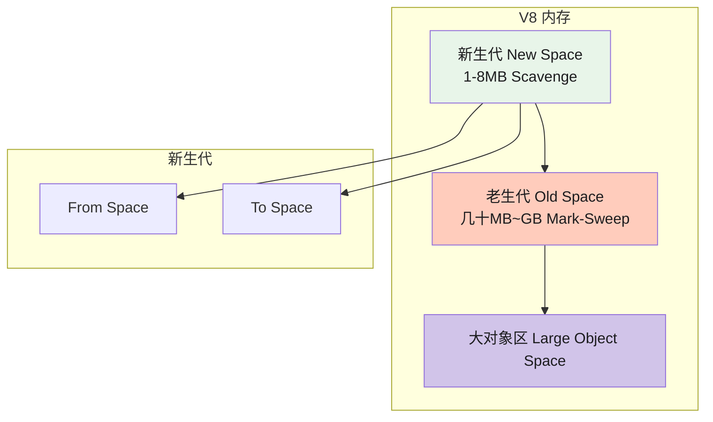
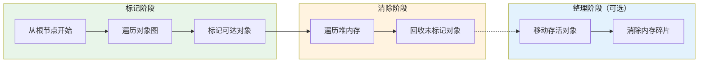

# 垃圾回收与内存管理

## 1. V8 内存架构与 GC 分代




## 2. GC 算法详解

### 2.1 标记-清除（Mark-Sweep）




### 2.2 标记-整理（Mark-Compact）

```javascript
// Mark-Compact 在 Mark-Sweep 基础上增加"整理"步骤
// 将存活对象向一端移动，消除内存碎片
// 代价：需要额外的移动和更新指针操作，时间更长
```

### 2.3 增量标记 + 懒清理

```javascript
// V8 策略：增量标记（Incremental Marking）+ 懒清理（Lazy Sweeping）
// 原理：全量 GC 会导致长停顿（Stop-The-World），影响用户体验
// 增量标记：将标记过程分成多个小步骤，穿插在 JS 执行中间
// 每执行一小段 JS，就执行一点 GC 标记，逐步完成整个堆的标记
// 减少单次 GC 停顿时间，改善页面响应
```

### 2.4 引用计数（历史方案）

```javascript
// 引用计数：每个对象记录被引用次数
// 为0时立即回收
// 缺点：无法处理循环引用
let a = { name: 'A' };
let b = { name: 'B' };
a.ref = b; // b引用+1
b.ref = a; // a引用+1
// a 和 b 互相引用，但外部没有引用了，应该被回收
// 引用计数看不到这个"外部引用缺失"，永远无法回收 → 内存泄漏
// V8 选择 Mark-Sweep 解决这个问题
```

## 3. WeakRef 与 FinalizationRegistry（ES2021+）

```javascript
// WeakRef：持有对象的弱引用，不阻止 GC
const ref = new WeakRef({ name: 'target' });
console.log(ref.deref()?.name); // 'target'（如果对象还在）

// 使用场景：缓存大对象（不被 WeakRef 阻止 GC）
function createCache() {
  const cache = new Map();
  const weakCache = new WeakMap();

  return {
    set(key, value) {
      cache.set(key, value);
      weakCache.set(value, key);
    },
    get(key) {
      return cache.get(key);
    },
    // GC 后自动清理 cache 中对应的键（需配合 FinalizationRegistry）
  };
}

// FinalizationRegistry：对象被 GC 后执行回调
const registry = new FinalizationRegistry((heldValue) => {
  console.log(`对象 ${heldValue} 已被垃圾回收`);
});

let obj = { name: 'data' };
registry.register(obj, obj.name);
obj = null; // 失去引用，迟早被 GC，届时触发回调
// 警告：FinalizationRegistry 回调时机不确定（由 GC 决定）
// 不要在回调中执行重要逻辑，只能用于辅助清理
```

## 4. 内存泄漏场景

| 场景 | 说明 | 解决方案 |
|------|------|---------|
| 意外全局变量 | `function f() { big = new Array(100000); }` 变成 `window.big` | 用 `use strict` + lint 规则 |
| 定时器未清理 | `setInterval` / `setTimeout` 引用大对象 | `clearInterval` / `clearTimeout` |
| 闭包引用大对象 | 闭包持有外部作用域的引用 | 闭包用完置 null，或拆分函数 |
| DOM 引用 | DOM 从页面移除后 JS 仍持有引用 | `elements.body = null` 手动清引用 |
| 事件监听未移除 | `addEventListener` 后未 `removeEventListener` | 组件销毁时移除监听，或用 `{ once: true }` |
| Map/Set 缓存无限增长 | 缓存不清理导致内存暴涨 | 用 `WeakMap` / `WeakSet` 作为缓存，或手动清理 |
| console.log 调试 | 生产环境保留大量 console.log | 上线前移除或用工具过滤 |

```javascript
// Vue / React 组件内存泄漏示例
class Chart extends React.Component {
  componentDidMount() {
    // 全局事件监听（不清理会泄漏）
    window.addEventListener('resize', this.handleResize);

    // 定时器（不清理会泄漏）
    this.timer = setInterval(() => this.fetchData(), 5000);

    // 大数据缓存
    this.cache = new Map(); // 不清理会持续增长
  }

  componentWillUnmount() {
    // 清理所有副作用
    window.removeEventListener('resize', this.handleResize);
    clearInterval(this.timer);
    this.cache.clear(); // 手动清缓存
    this.cache = null;
  }
}
```

## 5. 常见陷阱与最佳实践

| 陷阱 | 说明 | 解决方案 |
|------|------|---------|
| `delete obj.prop` vs `obj.prop = null` | `delete` 会改变对象结构（导致 V8 优化失效），性能差 | 用 `obj.prop = null` 而非 `delete` |
| 大量字符串拼接 | `str += 'a'` 在 V8 中每步创建新字符串 | 用数组 `+ .join('')` 或模板字符串 |
| 意外创建大数组 | `Array(1000000).fill(0)` 直接分配大内存 | 分批处理或用 TypedArray |
| WeakRef 误用 | 以为 WeakRef 能立即回收 | WeakRef 不保证何时回收，FinalizationRegistry 回调时机也不确定 |
| 全局变量污染 | 大量全局变量增加 GC 扫描范围 | 最小化全局变量，用 IIFE / 模块封装 |

## 6. 面试追问

**Q1: V8 为什么用分代回收？**
大多数对象都是"朝生夕死"（生命周期很短），只有少数对象存活很久。分代回收利用这个规律：新生代用 Scavenge（快但费空间，50%空间换速度），老生代用 Mark-Sweep+Compact（慢但省空间）。这样大多数对象的回收在新生代快速完成，只有存活久的对象才进入老生代，减少了 GC 开销。

**Q2: 如何排查 JavaScript 内存泄漏？**
Chrome DevTools → Memory 面板：1. 使用 **Allocation Timeline** 记录一段时间的内存分配，找出持续增长的对象。2. 使用 **Heap Snapshot** 拍快照，对比两个时间点的差异，找出"保留树"中没有被回收的大对象。3. 用 **Performance Monitor** 观察 JS Heap 大小曲线，线性上升即为泄漏。4. 检查 `FinalizationRegistry` 回调确认对象被回收。

**Q3: `WeakRef` 和 `WeakMap` 有什么本质区别？**
`WeakMap` 的弱引用针对**键**（必须是对象），值是强引用。无键时整个条目消失。`WeakRef` 的弱引用针对**整个对象**（目标），提供 `.deref()` 方法获取对象（强引用）或 null（已被 GC）。`WeakRef` 更灵活但更底层，`WeakMap` 更适合做对象到值的映射缓存。

## 7. 精简回顾：垃圾回收速记版

```javascript
// V8 GC架构：
// 新生代（New Space）：
//   - 1-8MB
//   - Scavenge算法，复制-替换
//   - 存活短的对象
// 老生代（Old Space）：
//   - 几十MB~GB
//   - Mark-Sweep + Mark-Compact
//   - 存活长的对象

// 新生代：分成from space和to space
// 1. From space存对象
// 2. 触发GC时，检查存活对象，复制到To space
// 3. To space和From space互换
// 优点：速度快（牺牲50%空间换速度）
// 缺点：内存浪费，不适合大对象（大对象直接进老生代）

// 老生代：Mark-Sweep-Compact
// 1. Mark：从根节点（全局变量、栈变量）开始标记可达对象
// 2. Sweep：回收未标记的内存（留下碎片）
// 3. Compact：整理存活对象到一端，减少碎片

// 引用计数（其他引擎使用）：
// 每个对象记录被引用次数，为0时立即回收
// 优点：及时回收
// 缺点：循环引用无法回收
var a = { prop: null };
var b = { prop: null };
a.prop = b; // b引用+1
b.prop = a; // a引用+1
// a和b互相引用，但外部没有引用，所以应该回收
// 引用计数看不到这个"外部引用"，所以无法回收！

// V8用标记-清除解决这个问题：即使互相引用，只要从根不可达，就回收

// 内存泄漏场景：
// 1. 全局变量（意外创建）
// function leak() { bigData = new Array(1000000); } // window.bigData

// 2. 定时器未清除
// setInterval(() => { /* 引用了obj */ }, 1000);
// clearInterval(id);

// 3. 闭包（持有大对象引用）
// function outer() {
//   const large = new Array(1000000);
//   return function() { return large.length; };
// }

// 4. DOM引用（DOM被移除但JS还引用着）
// const els = { body: document.body };
// els.body.remove();
// // document.body还在els中，DOM树无法GC

// 5. 事件监听未移除
// el.addEventListener('click', handler);
// el.removeEventListener('click', handler);

// 手动触发GC（调试用）：
// % gc() // 在Node启动时加--expose-gc，或浏览器debug时用
```

## 深入阅读与参考

!!! tip "怎么用这些资料"
    先读「官方文档与规范」建立准确的概念，再读「源码与示例」核对细节，最后用「教程、书籍与视频」换一种讲法加深理解。每条都写明了读哪一节、带着什么问题读。

### 官方文档与规范

| 资源 | 为什么读 | 怎么读 |
|---|---|---|
| [WeakRef](https://developer.mozilla.org/en-US/docs/Web/JavaScript/Reference/Global_Objects/WeakRef) | WeakRef 概念总览，含使用限制与 GC 不确定性说明。 | 先读描述与『避免使用』警告，再跑示例观察 deref 返回 undefined 的时机。 |
| [WeakRef() constructor](https://developer.mozilla.org/en-US/docs/Web/JavaScript/Reference/Global_Objects/WeakRef/WeakRef) | 说明 new WeakRef(target) 的参数与返回值语义。 | 对照 deref 页面一起读，确认 target 必须为对象及 TypeError 触发条件。 |
| [WeakRef.prototype.deref()](https://developer.mozilla.org/en-US/docs/Web/JavaScript/Reference/Global_Objects/WeakRef/deref) | deref 是读取弱引用目标的唯一方法，语义关键。 | 读返回值说明，写 demo 强制 GC 后观察 undefined 行为并记录结果。 |
| [FinalizationRegistry](https://developer.mozilla.org/en-US/docs/Web/JavaScript/Reference/Global_Objects/FinalizationRegistry) | 整体介绍清理回调的注册方式与调用时机的不确定性。 | 读『Notes』一节，理解回调不保证执行，再写注册示例验证。 |
| [FinalizationRegistry.prototype.unregister()](https://developer.mozilla.org/en-US/docs/Web/JavaScript/Reference/Global_Objects/FinalizationRegistry/unregister) | 理解如何取消注册，避免重复回调或对象滞留。 | 读参数 token 含义，配合 register 的 unregisterToken 练习配对使用。 |
| [FinalizationRegistry.prototype.register()](https://developer.mozilla.org/en-US/docs/Web/JavaScript/Reference/Global_Objects/FinalizationRegistry/register) | 掌握注册语法、holding value 与 unregisterToken 用法。 | 读参数表，写 register/unregister 配对示例并观察回调是否触发。 |
| [FinalizationRegistry() constructor](https://developer.mozilla.org/en-US/docs/Web/JavaScript/Reference/Global_Objects/FinalizationRegistry/FinalizationRegistry) | 确认构造回调函数的签名与调用上下文。 | 读参数与异常说明，结合 register 拼出完整最小可运行示例。 |

## 应用与行业实践

### 应用场景地图

| 场景 | 用到本页哪个知识点 | 典型技术选型 | 注意事项 |
| --- | --- | --- | --- |
| 后台管理的万行表格 | 可达性判断、DOM 节点持有内存 | 窗口化渲染、`replaceChildren`、事件委托 | 旧节点不断引用会进 Detached DOM 列表 |
| 低端安卓机型的首屏加载 | 新生代分配速率、Scavenger 停顿 | 分片渲染、空闲调度、弱引用缓存 | 首屏不要预解析全部字段 |
| 多人协作白板 | 老生代增长、Major GC 停顿 | 命令模式撤销栈、数组复用 | 撤销栈要限深度，不能无界增长 |
| 单页应用路由切换 | 内存泄漏场景：未清理的监听器与定时器 | 卸载钩子统一清理、`AbortController` | 订阅与定时器要在卸载时取消 |
| 实时数据大屏 | 闭包持有大数组 | 定时器内只保留聚合值 | 回调不要捕获原始数据集合 |
| Node.js 图片处理服务 | 堆外内存与堆上限的关系 | `Buffer`、`--max-old-space-size` | 容器内存限制要给堆外留余量 |
| 在线文档编辑器 | 大对象生命周期、弱引用 | 增量 diff、`FinalizationRegistry` 观测 | 该回调时机不确定，不能当关键清理 |
| 地图与图表第三方库 | `WeakRef`、`FinalizationRegistry` | 显式 `destroy()` 调用 | 实例要手动销毁，不能等 GC |

### 三个场景拆解

#### 场景 1：后台管理的万行表格

**业务背景**：列表接口一次返回上万行，页面要支持排序、筛选和滚动。在内存有限的办公笔记本上，长时间滚动后堆占用持续上升，滚动出现掉帧。

**怎么用本页知识解决**：直白说，就是同一时刻只让屏幕里那几十行活在 DOM 里。术语上叫窗口化渲染，配合断掉旧节点的引用，让上一批行变成不可达对象。

```js
// 只渲染可视区行，减少同时存活的 DOM 节点
function renderWindow(rows, start, end) {
  const frag = document.createDocumentFragment();
  for (let i = start; i < end; i++) {
    const row = rows[i];
    const tr = document.createElement('tr');
    tr.dataset.rowId = String(row.id); // 只存 id，详情等点击时按 id 取
    tr.textContent = row.title;
    frag.appendChild(tr);
  }
  tbody.replaceChildren(frag); // 替换旧节点，断开对上一批行的引用
}
// 行上附加的数据放进 WeakMap，节点被移除后条目可被回收
const rowMeta = new WeakMap();
function attachMeta(tr, meta) {
  rowMeta.set(tr, meta); // 不阻止 tr 被回收
}
```

- `replaceChildren` 一次性换掉子节点，旧的 `tr` 不再被 `tbody` 引用，下一次 GC 就能回收它们。
- `dataset` 里只写 id。把整行对象塞进 DOM 属性，等于让 DOM 节点一直拖着数据。
- `WeakMap` 的键是元素本身，键不可达时条目不会阻止回收，适合放行级别的附加信息。
- 点击事件绑在 `tbody` 上做委托，回调里用 `dataset.rowId` 反查，闭包就不会捕获行对象。
- 十万级行数时，再把数据切分和窗口化配合，避免一次性排序产生大数组常驻。

**怎么度量收益**：DevTools 的 Memory 面板取 Heap snapshot，看 `Detached` 节点计数与 `JS heap size`；Performance 面板录制 30 秒滚动，看 GC 触发次数和最长任务时长；`performance.memory.usedJSHeapSize` 只在 Chrome 可用，属于非标准接口。

**什么时候不该用**：
- 总行数在 300 以内时，窗口化会让浏览器原生查找（Ctrl+F）定位不到未渲染的行，收益抵不上实现成本。
- 需要整表打印、导出 DOM 快照或依赖真实节点做整页截图时，未渲染行会直接缺失。

#### 场景 2：低端安卓的首屏加载

**业务背景**：首屏接口一次返回列表数据和配置，页面在低端安卓机上内存紧张。用户切到后台再回来，页面常被系统回收重载，首屏时间与内存峰值都要压住。

**怎么用本页知识解决**：思路是减少首屏创建的长寿命对象。短命的临时对象留在新生代，让 Scavenger 快速清掉；只有真正要跨页面存活的数据才放进长期结构。

```js
// 首屏只把可视区与下一屏写入 DOM，其余交给滚动触发
const metaCache = new WeakMap();
function mountCard(el, raw) {
  const meta = { id: raw.id, title: raw.title }; // 只解出首屏要用的字段
  metaCache.set(el, meta); // 弱引用缓存，el 移除后条目可回收
  el.textContent = meta.title;
  el.addEventListener('click', () => {
    const cur = metaCache.get(el); // 用 el 反查，闭包不持有整行数据
    if (cur) openDetail(cur.id);
  });
}
// 非关键字段的解析放到空闲时段分片执行
// requestIdleCallback 的支持范围需核对目标浏览器，不支持时用 setTimeout 分片
requestIdleCallback(() => parseRemainingInChunks(rawList));
```

- 只解出首屏字段，避免一次性把整份响应展开成大批对象，直接降低新生代分配速率。
- 弱引用缓存让卡片元素被移除后，附加数据跟着可回收，不会随滚动越积越多。
- 解析推迟到空闲时段分片，长任务被切开，主线程有时间跑 Minor GC。
- 点击回调通过元素反查数据，闭包只捕获 `el`，不再拖住整行原始数据。
- 降级路径要显式写出来，不同内核对空闲调度 API 的支持不一致。

**怎么度量收益**：真机用 `chrome://inspect` 远程调试，在 Memory 面板看 `JS heap size` 峰值与 DOM 节点数；Performance 面板看首屏期间的 Minor GC 次数与长任务；Lighthouse 看 `First Contentful Paint` 与 `Total Blocking Time`。

**什么时候不该用**：
- 需要跨页面或跨路由保留的配置数据不要放 `WeakMap`，键被回收后数据就取不到了，语义上也不该用弱引用。
- 首屏本来只渲染几十张卡片时，加窗口化和弱缓存只会增加分支路径，维护成本上升。

#### 场景 3：多人协作白板

**业务背景**：白板上的图元随会议时长增加，拖动与缩放时每帧要重算可见集合。旧实现把每次操作前后的整份文档存进撤销栈，长会议后堆占用一直攀升。

**怎么用本页知识解决**：撤销栈存命令，不存整份文档快照，这样老生代里只驻留一组小对象。渲染循环复用同一批数组，把每帧的临时分配压到最低。

```js
// 撤销栈存命令，不存整份文档快照
const undoStack = [];
const MAX_UNDO = 200;
function addShape(doc, shape) {
  doc.shapes.push(shape);
  undoStack.push({ type: 'add', id: shape.id }); // 只记 id 与类型
  if (undoStack.length > MAX_UNDO) undoStack.shift(); // 限深，防止无界增长
}
function undo(doc) {
  const cmd = undoStack.pop();
  if (cmd?.type === 'add') {
    doc.shapes = doc.shapes.filter((s) => s.id !== cmd.id); // 让被删图元不可达
  }
}
// 一帧内的中间结果写进预分配数组，避免每帧新建数组
const drawList = [];
function frame(shapes) {
  drawList.length = 0; // 复用同一个数组
  for (const s of shapes) if (inView(s)) drawList.push(s);
  draw(drawList);
}
```

- 命令只带 id 与类型，撤销栈里不再持有整份文档，老生代存活对象数量下降。
- 限深是为了防止撤销栈本身变成无界增长的结构，这是泄漏排查里常见的一类。
- `filter` 生成新数组，被删图元失去引用后可以被回收，代价是每次撤销分配一个新数组。
- 渲染循环复用 `drawList`，每帧不产生新数组，减少 Minor GC 的触发频率。
- 图元规模再上一层时，把可见集合计算也做成增量更新，避免每帧全量遍历。

**怎么度量收益**：Performance 面板录制 30 秒连续拖动，看 Minor GC 触发次数与最长任务；Memory 面板在 200 次绘制操作后对比 `JS heap size` 与 `undoStack.length`；`performance.measureUserAgentSpecificMemory()` 需要跨源隔离上下文，可用性要按目标浏览器核对。

**什么时候不该用**：
- 图元总数在几百且操作低频时，整份快照实现直接、回放简单，改命令模式反而增加出错面。
- 需要与 CRDT 或 OT 协同层对齐，或者要支持任意时间点回放时，撤销结构必须和协同方案一起设计。

### 行业先进实践

- **Orinoco 并发标记与并行 Scavenger（出处：V8 官方博客的 Orinoco 系列文章）**：V8 把标记工作拆到辅助线程和主线程的空闲片段里执行，停顿被切成小段。你的项目可以借鉴这个节奏，把大对象的构建与丢弃放到空闲时段分片跑，避开动画帧。
- **Detached Elements 面板（出处：Chrome DevTools 官方文档 "Fix memory problems"）**：该面板直接列出被 JS 引用但已从文档移除的 DOM 节点。把这项检查写进发布前的手工用例，比只读 Heap snapshot 更容易定位到具体组件。
- **WeakMap 关联 DOM 与业务数据（出处：MDN WeakMap 文档）**：键为对象时，键不可达则条目可回收。把行和卡片的附加数据从 `dataset`、闭包迁到 `WeakMap`，可以切断 DOM 与数据之间的长期引用。
- **Node.js 堆上限与容器限制（出处：Node.js 官方文档 CLI 选项 `--max-old-space-size`）**：按容器内存上限设置老生代容量，给 Buffer、wasm 内存和线程栈留出余量。上线前同时监控 RSS，只看堆统计会漏掉堆外占用。
- **FinalizationRegistry 的回收时机不确定（出处：MDN FinalizationRegistry 文档）**：回调何时执行由引擎决定，页面关闭前不保证触发。只用它做观测与日志，连接、文件句柄、渲染循环这类资源一律显式释放。Vue 3 响应式缓存是否使用 `WeakMap` 需核对官方文档：核对 `packages/reactivity` 源码中 `targetMap` 的当前实现。

### 从学到用：落地路线

1. **试点**：选一个指标可测的页面（例如万行表格页），先建立内存基线，不动业务代码。验收标准：产出一份含 `JS heap size`、DOM 节点数、GC 次数的基线记录。
2. **验证**：在同一页面做窗口化与弱引用改造，用同一套测量步骤重跑。验收标准：三次测量的堆峰值中位数低于基线，Detached 节点计数为 0。
3. **推广**：把测量步骤和清理检查项写进组件模板与代码评审清单。验收标准：新建列表类组件默认走窗口化封装，评审清单含事件与定时器清理检查项。
4. **防止回退**：把内存检查纳入合入前的固定动作，超阈值就拦住。验收标准：连续三个版本合入后指标不高于基线，超阈值时有明确的处置人和回退流程。

### 动手作业

**目标**：给一个万行表格页建立内存基线，完成一次窗口化改造，产出前后对比报告。

**步骤**：
1. 用固定随机种子生成 50000 行数据，字段为 `id`、`title`、`status`、`updatedAt`，页面初始一次性渲染 200 行。
2. 打开 DevTools 的 Memory 面板取 Heap snapshot，记录 `JS heap size` 与 DOM 节点数；在 Performance monitor 打开 `JS heap size` 与 `DOM Nodes` 两项。
3. 用 Performance 面板录制 30 秒持续滚动，记录 Minor GC 与 Major GC 触发次数、最长任务时长。
4. 改成窗口化渲染：只渲染可视区上下各一屏，替换旧节点使用 `replaceChildren`。
5. 把行附加数据从 `dataset` 与闭包迁到 `WeakMap`，键为 `tr` 元素；点击改为 `tbody` 上的事件委托。
6. 反复进入和离开该页面，检查 Memory 面板里的 Detached 元素计数。
7. 重跑步骤 2 与步骤 3，把前后数据写进一份 Markdown 报告，注明设备、浏览器版本与供电状态。

**验收标准**：
- 滚动 30 秒后 Detached DOM 节点计数为 0。
- 三次 Heap snapshot 的 `JS heap size` 中位数低于改造前，原始数据在报告中可复现。
- 持续滚动期间不出现超过 50 ms 的长任务，或长任务数量低于改造前。
- 报告含测量步骤、设备与浏览器版本、结果截图占位。
- 代码中检索 `dataset` 与 `addEventListener`，不存在把整行对象写进 DOM 属性或事件闭包的写法。

