> JavaScript 是前端工程师的核心技能，本章覆盖高频面试题，从数据类型到异步编程全面覆盖。

---

### 1. 数据类型

#### 1.1 七种基本类型 vs 引用类型

JavaScript 共9种数据类型，分为两大类：

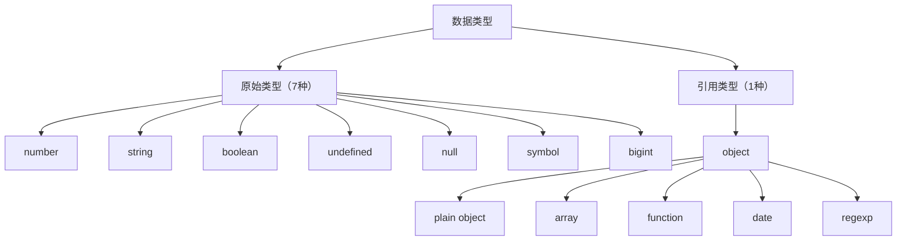

**typeof 判断方法：**

```mermaid
flowchart LR
    subgraph table["typeof 判断结果"]
        direction TB
        A1["typeof 123"] --> B1["\"number\""]
        A2["typeof \"str\""] --> B2["\"string\""]
        A3["typeof true"] --> B3["\"boolean\""]
        A4["typeof undefined"] --> B4["\"undefined\""]
        A5["typeof null"] --> B5["\"object\" ⚠️"]
        A6["typeof Symbol()"] --> B6["\"symbol\""]
        A7["typeof BigInt(1)"] --> B7["\"bigint\""]
        A8["typeof {}"] --> B8["\"object\""]
        A9["typeof []"] --> B9["\"object\""]
        A10["typeof function"] --> B10["\"function\""]
    end
```

存储方式区别：

```javascript
// 基本类型：栈Stack，存值
let a = 1;
let b = a;    // b是副本
b = 2;
console.log(a); // 1，原值不变

// 引用类型：栈存指针，堆Heap存值
let obj1 = { name: "张三" };
let obj2 = obj1;    // obj2和obj1指向同一堆地址
obj2.name = "李四";
console.log(obj1.name); // "李四"，原对象被修改
```

```mermaid
flowchart TB
    subgraph stack["栈（Stack）"]
        a["a: 1"]
        obj1["obj1"] 
        obj2["obj2"]
    end
    
    subgraph heap["堆（Heap）"]
        objRef["{name: \"李四\"}"]
    end
    
    obj1 & obj2 -->|指向| objRef
    style objRef fill:#e1f5fe
```

#### 1.2 null vs undefined

```javascript
// undefined：已声明但未赋值
let a;
console.log(a); // undefined

// null：主动赋值为"无"
let b = null;
console.log(b); // null

// 场景区别：
// 1. 函数参数未传
function fn(x) { console.log(x); }
fn();          // undefined

// 2. 对象属性不存在
let obj = {};
console.log(obj.name); // undefined

// 3. 函数没有返回值
function noReturn() {}
console.log(noReturn()); // undefined

// 4. 显式空值（通常用null）
let empty = null;  // 明确表示"这里没有值"
```

#### 1.3 typeof null 为什么是 "object"

这是 JavaScript 历史悠久的 bug，源于 JS 早期的类型系统：

```javascript
// 0在机器码中代表"全为零"，null的32位全0被错误地判断为对象
// 内部实现（简化）：
// if (value is 0x00000000) return "object";  // bug

// 正确判断null的方法：
console.log(null === null); // true
console.log(Object.prototype.toString.call(null)); // "[object Null]"
console.log(Array.isArray(null)); // false
```

---

### 2. 运算符与比较

#### 2.1 == vs ===

```javascript
// ==：宽松相等，隐式类型转换
console.log(1 == "1");      // true，字符串转数字
console.log(true == 1);     // true，boolean转数字
console.log(null == undefined); // true
console.log(0 == false);    // true

// ===：严格相等，不转换类型
console.log(1 === "1");     // false，类型不同
console.log(true === 1);    // false

// 实际建议：始终使用 ===
```

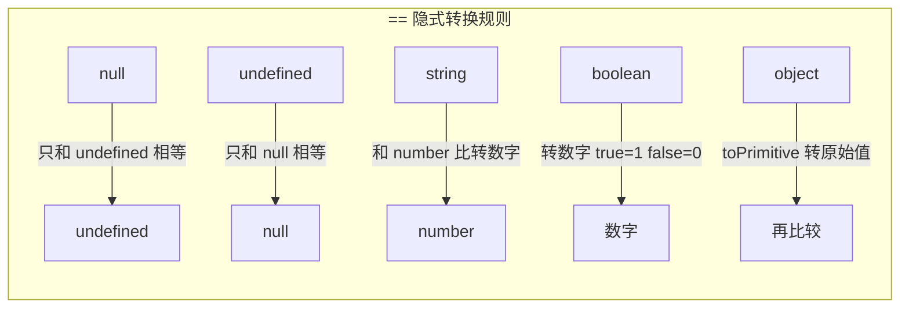

#### 2.2 Object.is vs ===

```javascript
// Object.is 判断更精确
console.log(Object.is(NaN, NaN));       // true（=== 为 false）
console.log(Object.is(+0, -0));        // false（=== 为 true）
console.log(Object.is({}, {}));        // false（引用不同）)

// Object.is 内部实现：
function is(x, y) {
  if (x === y) {
    // 区分 +0 和 -0
    return x !== 0 || 1 / x === 1 / y;
  }
  // 区分 NaN 和 非NaN
  return x !== x && y !== y; // 只有 NaN 满足 x !== x
}
```

---

### 3. 数据类型转换

#### 3.1 ToPrimitive 规则

ToPrimitive 是 JS 内部用于将对象转为原始值的算法：

```javascript
// ToPrimitive(obj, preferredType)
// 1. 如果是原始类型，直接返回
// 2. 调用 valueOf()，如果返回原始类型就返回
// 3. 调用 toString()，如果返回原始类型就返回
// 4. 抛出 TypeError

const obj = {
  valueOf() { return 42; },
  toString() { return "hello"; }
};
console.log(obj + 1); // 43，优先调用 valueOf

// [] + [] = ""：两边都转成字符串再拼接
// [] + {} = "[object Object]"：数组先转字符串
// {} + [] = 0：{}被当成语句，+[]转为0
```

#### 3.2 隐式转换规则

```javascript
// 加法：有一边是字符串就拼接，否则转数字
console.log(1 + "2");   // "12"
console.log(1 + 2);    // 3
console.log(true + 1); // 2

// 减/乘/除：转数字
console.log("5" - 2);  // 3
console.log("5" * 2);  // 10

// 比较：转数字或字符串
console.log("10" > 9); // true

// 逻辑运算：转boolean
console.log(!0);       // true
console.log(!"");      // true
console.log(!!null);   // false
```

---

### 4. Symbol 与 BigInt

#### 4.1 Symbol 作用

```javascript
// Symbol：创建唯一值
const s1 = Symbol("desc");
const s2 = Symbol("desc");
console.log(s1 === s2); // false

// 应用场景1：对象属性名（避免冲突）
const obj = {
  [Symbol.iterator]: function* () {},
  [Symbol.toStringTag]: "MyObj"
};

// 应用场景2：模拟私有属性（约定，非真正私有）
const _private = Symbol("private");
const user = {
  name: "张三",
  [_private]: "内部数据"  // 外部无法直接访问
};

// 应用场景3：消除魔法字符串
const STATUS = {
  PENDING: Symbol("pending"),
  FULFILLED: Symbol("fulfilled")
};

// 应用场景4：全局Symbol注册
const globalSym = Symbol.for("app.key"); // 全局唯一
const same = Symbol.for("app.key");
console.log(globalSym === same); // true

// 获取Symbol描述
console.log(s1.description); // "desc"
```

#### 4.2 BigInt

```javascript
// BigInt：处理大整数（number最大安全整数 2^53-1）
const big = 9007199254740993n;
console.log(big + 1n); // 9007199254740994n

// 不能和number混用运算
// big + 1; // 报错
big + BigInt(1); // OK

// 使用场景：时间戳（毫秒级）、ID计算、加密
const timestamp = 1715000000000n; // 超过Number.MAX_SAFE_INTEGER
```

#### 4.3 0.1 + 0.2 !== 0.3

```javascript
// 浮点数精度问题：IEEE 754二进制浮点
console.log(0.1 + 0.2); // 0.30000000000000004

// 原因：
// 0.1 → 0.000110011001100110...（二进制无限循环）
// 0.2 → 0.001100110011001100...（二进制无限循环）
// IEEE 754截断后产生微小误差

// 解决方案：
// 1. toFixed（注意返回字符串）
console.log((0.1 + 0.2).toFixed(2)); // "0.30"

// 2. 转为整数运算（推荐）
function add(a, b, precision = 2) {
  const p = Math.pow(10, precision);
  return (a * p + b * p) / p;
}
console.log(add(0.1, 0.2)); // 0.3

// 3. ES2021 BigDecimal 或 decimal.js 库
// import Decimal from 'decimal.js';
// new Decimal(0.1).plus(0.2).toNumber(); // 0.3

// 4. 使用epsilon比较
function isEqual(a, b, epsilon = 1e-10) {
  return Math.abs(a - b) < epsilon;
}
console.log(isEqual(0.1 + 0.2, 0.3)); // true
```

---

### 5. 闭包

#### 5.1 什么是闭包

```javascript
// 闭包：函数记住并访问其词法作用域之外的变量
function outer() {
  const x = 10;
  function inner() {
    console.log(x); // 访问outer的变量
  }
  return inner;
}
const fn = outer();
fn(); // 10
```

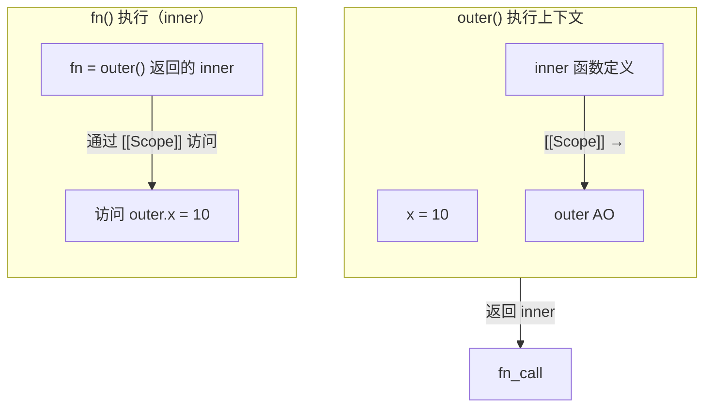

#### 5.2 为什么能访问外层变量

```javascript
// 每个函数在创建时记录其创建位置的词法作用域（[[Scope]]）
// 无论函数在哪里执行，都能通过[[Scope]]链访问外层变量

function makeAdder(x) {
  return function(y) { return x + y; };
}
const add5 = makeAdder(5);
const add10 = makeAdder(10);
console.log(add5(2));  // 7（访问x=5）
console.log(add10(2)); // 12（访问x=10）

// 即使makeAdder已返回，其执行上下文已出栈
// add5/add10的[[Scope]]仍持有对x的引用
```

#### 5.3 内存泄漏与闭包

```javascript
// 闭包导致内存泄漏的场景：
// 持有对大型对象或DOM节点的引用，但已不再需要

function leak() {
  const bigArray = new Array(1000000).fill("x");
  const handler = function() { return bigArray.length; };
  document.getElementById("btn").onclick = handler; // DOM引用
  // bigArray 无法被回收，因为 handler 引用它
}

// 解决：手动置空
function noLeak() {
  const bigArray = new Array(1000000).fill("x");
  const handler = function() { return bigArray.length; };
  document.getElementById("btn").onclick = handler;
  return function() { bigArray = null; }; // 解绑
}
```

#### 5.4 应用场景

```javascript
// 1. 数据私有/模块化
const counter = (function() {
  let count = 0;
  return {
    inc: () => ++count,
    dec: () => --count,
    get: () => count
  };
})();
counter.inc();
counter.inc();
console.log(counter.get()); // 2

// 2. 函数柯里化
function currying(fn) {
  return function curried(...args) {
    if (args.length >= fn.length) {
      return fn.apply(this, args);
    }
    return function(...args2) {
      return curried.apply(this, args.concat(args2));
    };
  };
}

// 3. 防抖节流
function debounce(fn, delay) {
  let timer;
  return function(...args) {
    clearTimeout(timer);
    timer = setTimeout(() => fn.apply(this, args), delay);
  };
}

// 4. 缓存（记忆化）
function memo(fn) {
  const cache = {};
  return function(...args) {
    const key = JSON.stringify(args);
    if (cache[key] !== undefined) return cache[key];
    return cache[key] = fn.apply(this, args);
  };
}
```

---

### 6. 作用域与作用域链

```javascript
// 作用域链：
// 函数创建时形成 [[Scope]] 链，运行时顺着这条链查找变量

var a = 1;
function f1() {
  var b = 2;
  function f2() {
    var c = 3;
    console.log(a, b, c); // 1, 2, 3
    // 查找路径：f2 → f1 → global（scope chain）
  }
  f2();
}
f1();
```

```mermaid
flowchart TB
    subgraph global["Global Scope"]
        direction TB
        a["a = 1"]
        f1["f1 = function"]
        f1 -->|"f1[[Scope]] = [global]"| global_ref[""]
    end
    
    global -->|"parent"| f1_scope
    
    subgraph f1_scope["f1() Scope"]
        direction TB
        b["b = 2"]
        f2["f2 = function"]
        f2 -->|"f2[[Scope]] = [f1, global]"| f1_ref[""]
    end
    
    f1_scope -->|"parent"| f2_scope
    
    subgraph f2_scope["f2() Scope（当前）"]
        direction TB
        c["c = 3"]
        lookup["查找：本地 → f1 → global"]
    end
```

```javascript
// var vs let/const 作用域：
// var：函数作用域，let/const：块级作用域
function test() {
  if (true) {
    var x = 10;    // 函数作用域
    let y = 20;    // 块级作用域
  }
  console.log(x); // 10（可见）
  console.log(y); // ReferenceError（块外不可见）
}
```

---

### 7. var / let / const

```javascript
// var特性：
// 1. 函数作用域（非块级）
// 2. 声明提升（值为undefined）
// 3. 可重复声明

// let特性：
// 1. 块级作用域
// 2. 暂时性死区（TDZ）
// 3. 不可重复声明

// const特性：
// 1. 块级作用域
// 2. 暂时性死区
// 3. 声明时必须初始化
// 4. 不能重新赋值（但引用类型内部可修改）

// 暂时性死区：
console.log(a); // undefined（var提升）
// console.log(b); // ReferenceError（TDZ）
let b = 1;

// var提升：
console.log(x); // undefined，var x在后但提升了
var x = 10;
// 等价于：
// var x; // 提升
// console.log(x);
// x = 10;

// 循环中的闭包问题：
for (var i = 0; i < 3; i++) {
  setTimeout(() => console.log(i), 100); // 3,3,3
}
// 原因：var是函数作用域，i是共享的
// 解决1：let（每次迭代有独立副本）
for (let j = 0; j < 3; j++) {
  setTimeout(() => console.log(j), 100); // 0,1,2
}
// 解决2：IIFE
for (var k = 0; k < 3; k++) {
  (function(k) {
    setTimeout(() => console.log(k), 100);
  })(k);
}

// const对象内部可改：
const obj = { name: "张三" };
obj.name = "李四"; // OK
// obj = {}; // TypeError：不能重新赋值
```

---

### 8. this 指向

#### 8.1 this 指向规则

```javascript
// 规则1：普通函数调用（默认绑定）
function fn() { console.log(this); }
fn(); // 全局对象（严格模式下undefined）

// 规则2：对象方法调用（隐式绑定）
const obj = {
  name: "obj",
  say() { console.log(this.name); }
};
obj.say(); // "obj"（this指向obj）

// 规则3：call/apply/bind（显式绑定）
function greet(place) { console.log(`${this.name}来自${place}`); }
const p = { name: "张三" };
greet.call(p, "北京"); // this指向p

// 规则4：new调用（构造器绑定）
function Person(name) { this.name = name; }
const p2 = new Person("李四");
console.log(p2.name); // "李四"，this指向新对象

// 规则5：箭头函数（词法绑定，继承外层this）
const arrow = () => console.log(this);
const obj2 = {
  name: "obj2",
  say() {
    const inner = () => console.log(this.name);
    inner(); // this继承say的this，即obj2
  }
};
obj2.say(); // "obj2"

// this优先级：new > bind > call/apply > 对象调用 > 默认
```

#### 8.2 箭头函数为什么没有 this

```javascript
// 箭头函数没有自己的this，也没有arguments、super等
// 它在创建时就绑定了外层作用域的this，之后不可改变

function Timer() {
  this.time = 0;
  setInterval(() => {
    this.time++; // this继承Timer构造的实例
    console.log(this.time);
  }, 1000);
}
new Timer();

// 对比普通函数：
function Timer2() {
  this.time = 0;
  setInterval(function() {
    // 这里的this指向window（或undefined）
    // this.time++; // 报错
  }, 1000);
}
```

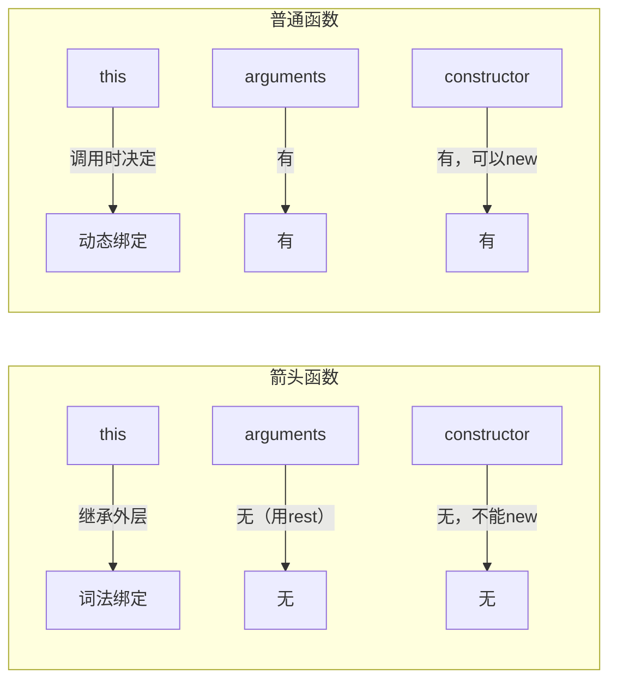

---

### 9. new 操作符原理

```javascript
// new Person("张三", 18) 做了什么：
// 1. 创建新对象 {}
// 2. 原型绑定：__proto__ = Person.prototype
// 3. this绑定：执行构造函数，this指向新对象
// 4. 返回值：如果构造函数返回对象则用返回值，否则返回新对象

function _new(Constructor, ...args) {
  // 1. 创建新对象，绑定原型
  const obj = Object.create(Constructor.prototype);
  // 2. 调用构造函数，绑定this
  const result = Constructor.apply(obj, args);
  // 3. 返回：如果返回值是对象/函数就返回它，否则返回新对象
  return result instanceof Object ? result : obj;
}

// 验证：
function Person(name, age) {
  this.name = name;
  this.age = age;
}
Person.prototype.greet = function() {
  return `我是${this.name}，${this.age}岁`;
};

const p = _new(Person, "张三", 18);
console.log(p.name);  // 张三
console.log(p.greet()); // 我是张三，18岁
console.log(p instanceof Person); // true

// 手动实现new：
function myNew(Ctor, ...args) {
  if (typeof Ctor !== 'function') throw new TypeError('not a function');
  const target = Object.create(Ctor.prototype);
  const result = Ctor.apply(target, args);
  return result !== null && typeof result === 'object' ? result : target;
}
```

---

### 10. call / apply / bind

```javascript
// call：调用函数，this指向第一个参数，其余参数逐个传递
function say(greeting, punct) {
  console.log(`${greeting}, I'm ${this.name}${punct}`);
}
say.call({ name: "张三" }, "你好", "！"); // 你好, I'm 张三！

// apply：调用函数，this指向第一个参数，其余参数用数组
say.apply({ name: "李四" }, ["您好", "。"]); // 您好, I'm 李四。

// bind：返回新函数，this永久绑定到第一个参数
const bound = say.bind({ name: "王五" });
bound("hello", "?"); // hello, I'm 王五?
// 后续call/apply无法覆盖bind绑定的this
bound.call({ name: "无效" }, "hi", "!"); // hello, I'm 王五!

// 手写call：
Function.prototype.myCall = function(context = window, ...args) {
  if (context === null || context === undefined) context = window;
  // 避免key冲突，用Symbol
  const fn = Symbol('fn');
  // 把当前函数（this）挂到context上
  context[fn] = this;
  // 调用它
  const result = context[fn](...args);
  // 清理
  delete context[fn];
  return result;
};

// 手写apply（类似call，只是参数格式不同）：
Function.prototype.myApply = function(context = window, args = []) {
  if (context === null || context === undefined) context = window;
  const fn = Symbol('fn');
  context[fn] = this;
  const result = context[fn](...args);
  delete context[fn];
  return result;
};

// 手写bind（返回新函数）：
Function.prototype.myBind = function(context = window, ...bindArgs) {
  const originalFn = this;
  function boundFn(...callArgs) {
    // new调用时，this指向实例，忽略context
    const isNew = this instanceof originalFn;
    const finalThis = isNew ? this : (context || window);
    return originalFn.apply(finalThis, [...bindArgs, ...callArgs]);
  }
  // 继承原型属性
  function Empty() {}
  Empty.prototype = originalFn.prototype;
  boundFn.prototype = new Empty();
  return boundFn;
};
```

---

### 11. 原型与原型链

#### 11.1 prototype vs __proto__

```javascript
// prototype：函数独有的属性，指向原型对象（用于new时继承）
// __proto__：对象都有，指向其构造函数的prototype

function Person(name) { this.name = name; }
Person.prototype.sayHi = function() { return `你好，我是${this.name}`; };

const p = new Person("张三");
console.log(p.__proto__ === Person.prototype); // true
console.log(Person.prototype.constructor === Person); // true
```

```mermaid
flowchart LR
    subgraph prototype["Person.prototype（原型对象）"]
        direction TB
        constructor["constructor → Person（回指）"]
        sayHi["sayHi → function"]
        proto1["__proto__ → Object.prototype"]
    end
    
    prototype -->|"__proto__"| instance
    
    subgraph instance["p（实例）"]
        direction TB
        name["name = \"张三\""]
        proto2["__proto__ → Person.prototype"]
    end
```

#### 11.2 原型链

```javascript
// 原型链：实例 → 构造函数.prototype → Object.prototype → null
// 查找属性时，顺着原型链向上找，直到null

const obj = { name: "obj" };
// obj → Object.prototype → null

function Parent() { this.parent = "parent"; }
function Child() { this.child = "child"; }
Child.prototype = new Parent(); // 原型链继承
Child.prototype.constructor = Child;

const c = new Child();
console.log(c.child);   // "child"
console.log(c.parent);  // "parent"（沿原型链找到）

// 顺原型链查找属性：
console.log(c.hasOwnProperty('child'));   // true
console.log(c.hasOwnProperty('parent'));  // false（在原型上）
console.log('parent' in c);               // true（in会查找整条链）
```

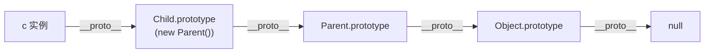

---

### 12. JS 继承实现

#### 12.1 原型链继承

```javascript
// 原型链继承：子类的原型指向父类实例
function Parent() { this.colors = ["红", "蓝"]; }
Parent.prototype.say = function() { console.log("Parent.say"); };

function Child() {}
Child.prototype = new Parent();
Child.prototype.constructor = Child;

const c1 = new Child();
c1.colors.push("绿");
console.log(c1.colors); // ["红","蓝","绿"]
const c2 = new Child();
console.log(c2.colors); // ["红","蓝","绿"]（引用共享，问题！）

// 优点：简单，方法可复用
// 缺点：引用类型被共享，无法向父类传参
```

#### 12.2 构造函数继承（借用构造函数）

```javascript
// 借用构造函数：在子类中调用父类构造函数
function Parent(name) { this.name = name; this.colors = ["红"]; }
function Child(name, age) {
  Parent.call(this, name); // 复制父类属性到子类实例
  this.age = age;
}

const c1 = new Child("张三", 18);
c1.colors.push("蓝");
console.log(c1.colors); // ["红","蓝"]
const c2 = new Child("李四", 20);
console.log(c2.colors); // ["红"]（独立，不共享！）

// 优点：引用类型独立，可传参
// 缺点：方法不能复用（每个实例都有方法副本），需要调用两次构造函数
```

#### 12.3 组合继承

```javascript
// 组合继承：原型链 + 构造函数
function Parent(name) { this.name = name; this.colors = ["红"]; }
Parent.prototype.say = function() { console.log(this.name); };

function Child(name, age) {
  Parent.call(this, name); // 借用构造函数：继承实例属性
  this.age = age;
}
Child.prototype = new Parent(); // 原型链：继承方法
Child.prototype.constructor = Child;
Child.prototype.study = function() { console.log("学习"); };

// 测试
const c = new Child("张三", 18);
c.colors.push("蓝");
console.log(c.colors); // ["红","蓝"]
c.say(); // 张三
c.study(); // 学习

// 优点：弥补了原型链和构造函数继承的缺点
// 缺点：调用了两次父类构造函数（call + new）
```

#### 12.4 寄生继承

```javascript
// 寄生继承：组合继承的优化，避免调用两次构造函数
function Parent(name) { this.name = name; }
Parent.prototype.say = function() { console.log(this.name); };

function Child(name, age) {
  Parent.call(this, name); // 借用构造函数
  this.age = age;
}

// 用Object.create代替new Parent()，只继承方法，不继承实例属性
Child.prototype = Object.create(Parent.prototype);
Child.prototype.constructor = Child;

// Object.create内部：
// {}.__proto__ = Parent.prototype（只复制了方法，没有实例属性）

// 优化：只需继承prototype上的方法，Parent的实例属性已经在call中复制了
```

#### 12.5 ES6 class 继承

```javascript
class Animal {
  constructor(name) { this.name = name; }
  speak() { console.log(`${this.name}叫`); }
  static info() { return "动物类"; }
}

class Dog extends Animal {
  constructor(name, breed) {
    super(name); // 必须在this之前调用
    this.breed = breed;
  }
  speak() { console.log(`${this.name}汪汪`); }
  run() { console.log(`${this.name}奔跑`); }
}

const d = new Dog("旺财", "金毛");
d.speak(); // 旺财汪汪（子类覆盖）
d.run();   // 旺财奔跑
console.log(d instanceof Dog);   // true
console.log(d instanceof Animal); // true（顺着原型链）

// class本质：
// class = 构造函数 + 原型方法 的语法糖
// class Dog {} 等价于 function Dog() {}
// Dog.prototype = Object.create(Animal.prototype)
// Dog.prototype.constructor = Dog

// super原理：
// super() = Animal.call(this, name)
// 调用父类构造函数，将子类实例作为this
// super.method() = Animal.prototype.method.call(this)
// 调用父类方法，绑定子类的this

// 静态方法继承：
class Cat extends Animal {}
console.log(Cat.info()); // 动物类（静态方法也被继承了）
```

---

### 13. Promise

#### 13.1 Promise 原理

```javascript
// Promise三种状态：
// pending（进行中）→ fulfilled（已成功）或 rejected（已失败）
// 状态一旦改变就不可逆

// 简化实现：
class MyPromise {
  constructor(executor) {
    this.state = 'pending';
    this.value = undefined;
    this.callbacks = [];

    const resolve = (value) => {
      if (this.state !== 'pending') return;
      this.state = 'fulfilled';
      this.value = value;
      // 处理异步onFulfilled
      this.callbacks.forEach(cb => cb.onFulfilled(value));
    };

    const reject = (reason) => {
      if (this.state !== 'pending') return;
      this.state = 'rejected';
      this.value = reason;
      this.callbacks.forEach(cb => cb.onRejected(reason));
    };

    try { executor(resolve, reject); }
    catch (e) { reject(e); }
  }

  then(onFulfilled, onRejected) {
    // 返回新的Promise以支持链式调用
    return new MyPromise((resolve, reject) => {
      const handle = (callback, fallback) => {
        try {
          const fn = typeof callback === 'function' ? callback : fallback;
          // 使用 queueMicrotask 确保微任务
          queueMicrotask(() => {
            if (this.state === 'fulfilled') {
              try { resolve(fn(this.value)); }
              catch (e) { reject(e); }
            } else if (this.state === 'rejected') {
              try { reject(fn(this.value)); }
              catch (e) { reject(e); }
            } else {
              // pending：注册回调
              this.callbacks.push({
                onFulfilled: (v) => handle(onFulfilled, v => v),
                onRejected: (v) => handle(onRejected, e => { throw e; })
              });
            }
          });
        } catch (e) { reject(e); }
      };
      handle(onFulfilled, v => v);
    });
  }

  catch(onRejected) { return this.then(null, onRejected); }
  finally(fn) { return this.then(fn, fn); }
}

// Promise.then 返回值规则：
// 普通值 → resolved(该值)
// Promise → 采用该Promise的最终状态
// throw错误 → rejected(错误)
// thenable对象 → resolved(thenable.then)

// Promise链式调用原理：
new Promise(r => r(1))
  .then(x => x + 1)     // p1 resolved为2
  .then(x => x * 2)     // p2 resolved为4
  .then(console.log)    // 打印4

// thenable：拥有then方法的对象，会被Promise采用
const thenable = {
  then(resolve, reject) { resolve(42); }
};
Promise.resolve(thenable).then(x => console.log(x)); // 42

// Promise.resolve做了什么：
// 1. 已经是Promise，直接返回
// 2. 有then方法的对象（thenable），包装后返回
// 3. 其他值：resolved Promise
// Promise.reject：永远是rejected
```

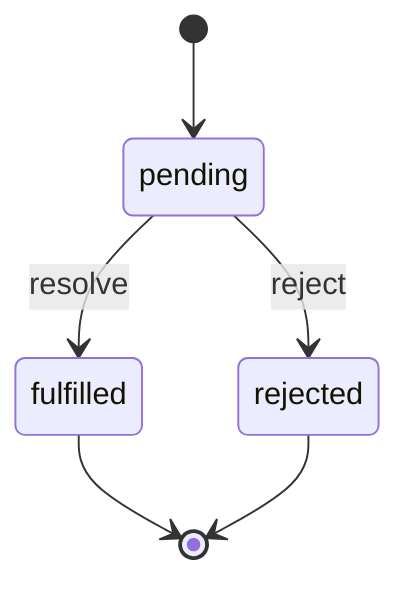

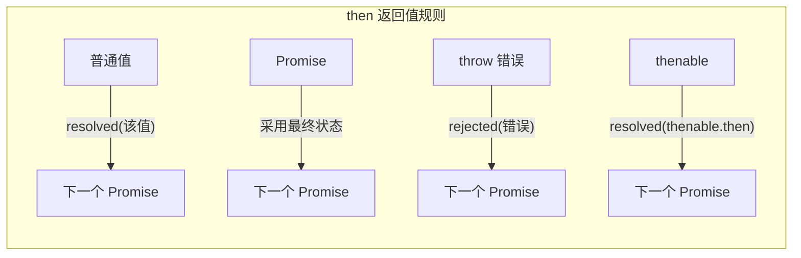

#### 13.2 async / await 原理

```javascript
// async函数返回Promise
async function fn() { return 1; }
// 等价于：
function fn() { return Promise.resolve(1); }

// await：等待Promise resolve，暂停async函数执行
async function main() {
  const r1 = await fetchData(); // 等待Promise完成
  const r2 = await process(r1); // 等上一个完成再执行
  return r2;
}

// async是generator的语法糖：
// async function* gen() {} = generator + auto runner

// 手写async实现：
function asyncToGenerator(generatorFn) {
  return function(...args) {
    const gen = generatorFn.apply(this, args);
    return new Promise((resolve, reject) => {
      function step(key, value) {
        let result;
        try {
          result = gen[key](value); // gen.next() 或 gen.throw()
        } catch (e) { return reject(e); }
        const { value: val, done } = result;
        if (done) {
          resolve(val); // generator完成
        } else {
          // Promise化：如果value是Promise，继续then；否则直接next
          Promise.resolve(val).then(
            v => step('next', v),
            e => step('throw', e)
          );
        }
      }
      step('next');
    });
  };
}

// 示例：
function* gen() {
  const a = yield Promise.resolve(1);
  const b = yield Promise.resolve(a + 2);
  return b;
}
// 手动执行：
const g = gen();
g.next().value.then(v => g.next(v).value.then(w => g.next(w)));
// 自动执行（co函数）：
function co(gen) {
  return new Promise((resolve, reject) => {
    if (typeof gen === 'function') gen = gen();
    if (!gen || typeof gen.next !== 'function') return resolve(gen);
    onFulfilled();
    function onFulfilled(val) {
      let result;
      try { result = gen.next(val); }
      catch (e) { return reject(e); }
      if (result.done) return resolve(result.value);
      Promise.resolve(result.value).then(onFulfilled, onThrow);
    }
    function onThrow(err) {
      let result;
      try { result = gen.throw(err); }
      catch (e) { return reject(e); }
      if (result.done) return resolve(result.value);
      Promise.resolve(result.value).then(onFulfilled, onThrow);
    }
  });
}
co(gen).then(v => console.log(v)); // 3

// Generator原理：
// Generator函数调用时不执行，返回一个迭代器
// 每次调用iterator.next()执行到下一个yield，暂停
// next(val)可向yield传值（替换yield表达式的值）
// throw()向当前yield位置抛异常
// return()提前结束generator

function* counter() {
  let n = 0;
  while (true) {
    const input = yield ++n; // yield暂停，返回n+1，下次next(input)给input
    if (input === 'reset') n = 0;
  }
}
const it = counter();
console.log(it.next().value);     // 1
console.log(it.next().value);     // 2
console.log(it.next('reset').value); // 1（reset后n被设为0，yield返回++n=1）
```

#### 13.3 Promise.all / race / allSettled / any

```javascript
// Promise.all：全部成功才成功，一个失败就reject
// 返回值顺序由输入顺序决定（即使完成顺序不同）
const p1 = Promise.resolve(1);
const p2 = new Promise(r => setTimeout(() => r(2), 100));
const p3 = Promise.resolve(3);
Promise.all([p1, p2, p3]).then(console.log); // [1, 2, 3]

// Promise.all 实现：
function promiseAll(promises) {
  return new Promise((resolve, reject) => {
    const results = new Array(promises.length);
    let settled = 0;
    promises.forEach((p, i) => {
      Promise.resolve(p).then(
        v => { results[i] = v; if (++settled === promises.length) resolve(results); },
        e => reject(e) // 有一个失败就reject
      );
    });
    if (promises.length === 0) resolve([]);
  });
}

// Promise.race：返回最先settle（成功或失败）的Promise
Promise.race([
  new Promise(r => setTimeout(() => r(1), 300)),
  new Promise((_, r) => setTimeout(() => r(2), 100)),
  new Promise(r => setTimeout(() => r(3), 200))
]).then(console.log, console.error); // 2（第二个先失败）

// Promise.allSettled：等待所有Promise settled，返回每个的结果
// ES2020，不会因为失败而reject
Promise.allSettled([
  Promise.resolve(1),
  Promise.reject("error"),
  Promise.resolve(3)
]).then(results => results.forEach(r => {
  if (r.status === 'fulfilled') console.log(r.value);
  else console.error(r.reason);
}));
// [{status:'fulfilled',value:1},{status:'rejected',reason:'error'},...]

// Promise.any：返回第一个fulfilled的Promise，全部失败才reject（AggregateError）
Promise.any([
  Promise.reject("err1"),
  Promise.reject("err2"),
  Promise.resolve(1)
]).then(console.log); // 1
```

---

### 14. 事件循环（Event Loop）

#### 14.1 宏任务 vs 微任务

```javascript
// 事件循环顺序：
// 1. 执行同步代码（宏任务）
// 2. 执行所有微任务（Promise.then, MutationObserver, queueMicrotask）
// 3. 执行一个宏任务（setTimeout, setInterval, I/O, UI rendering）
// 4. 循环微任务
// 5. 执行下一个宏任务
// ...

console.log('1');
setTimeout(() => console.log('2'), 0);
Promise.resolve().then(() => console.log('3'));
Promise.resolve().then(() => console.log('4'));
console.log('5');
// 输出：1, 5, 3, 4, 2

// 微任务列表：
// - Promise.then/.catch/.finally
// - queueMicrotask()
// - MutationObserver（DOM变化观察）
// - IntersectionObserver（进入视口）
// - ResizeObserver
// - PerformanceObserver

// 宏任务列表：
// - setTimeout / setInterval
// - I/O操作（文件读写、网络请求）
// - UI渲染
// - requestAnimationFrame
// - requestIdleCallback
// - setImmediate（Node.js）
// - 事件回调

// 为什么Promise是微任务？
// Promise设计者选择了微任务队列（microtask queue）而非宏任务队列
// 这样Promise的then回调能在当前同步代码完成后尽快执行
// 而setTimeout会等下一个宏任务，有额外延迟
```

#### 14.2 浏览器 Event Loop 流程

```javascript
// 浏览器Event Loop完整流程：
// 1. 执行同步代码（call stack）
// 2. 清空微任务队列（microtask queue）
// 3. 执行一个宏任务（macrotask queue）
// 4. 重复2-3

console.log('A');
setTimeout(() => console.log('B'), 0);
new Promise(resolve => {
  console.log('C');
  resolve();
}).then(() => console.log('D'));
queueMicrotask(() => console.log('E'));
console.log('F');
// 输出：A, C, F, D, E, B
// 分析：
// 同步：A,C,F
// 微任务：D,E
// 宏任务：B

// async/await 中的微任务：
async function test() {
  console.log('A');
  await Promise.resolve();
  console.log('B');
}
console.log('C');
test();
console.log('D');
// 输出：C, A, D, B
// 分析：
// 同步：C, A（async函数体同步部分执行到await）
// await Promise.resolve() 产生微任务
// D（同步）
// 微任务：打印B
```

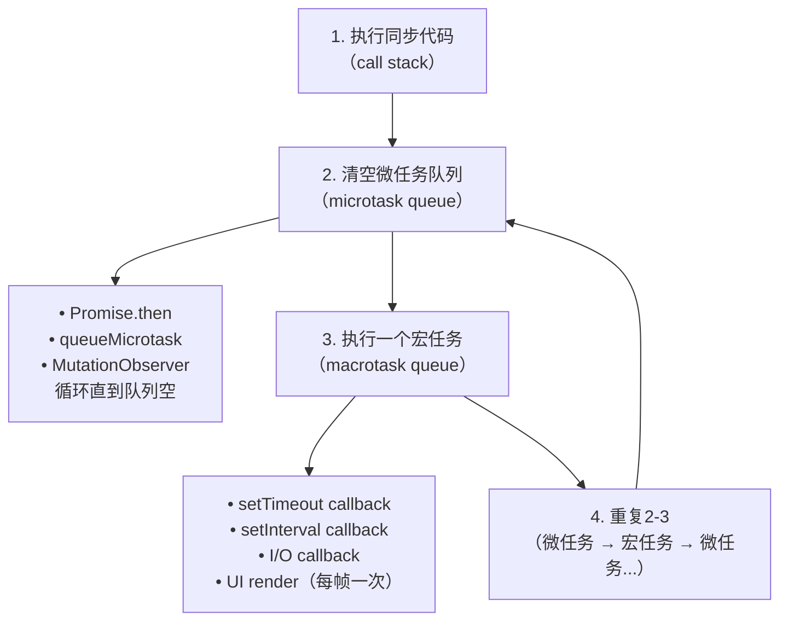

#### 14.3 浏览器 vs Node Event Loop

```javascript
// Node.js Event Loop（libuv）：
// - timers（setTimeout/interval）
// - pending callbacks
// - idle, prepare
// - poll（获取新I/O事件）
// - check（setImmediate）
// - close callbacks
//
// Node特点：
// 1. setImmediate 在 I/O 回调之后、check阶段执行
// 2. process.nextTick 在当前阶段结束后、下个阶段前执行（优先级高于微任务）
// 3. 微任务：Promise.then + process.nextTick

// setTimeout vs setImmediate：
setTimeout(() => console.log('timeout'));
setImmediate(() => console.log('immediate'));
// 在主脚本中：顺序不确定（取决于性能）
// 在I/O回调中：immediate 先于 timeout

// process.nextTick 优先级高于微任务：
process.nextTick(() => console.log('nextTick'));
Promise.resolve().then(() => console.log('microtask'));
// 输出：nextTick, microtask

// 微任务队列对比：
// 浏览器：Promise.then（微任务）
// Node：  Promise.then + process.nextTick（nextTick更快）

// Node中多个阶段的微任务：
// 每个阶段之间都会执行微任务队列（类似浏览器每轮宏任务后清微任务）
```

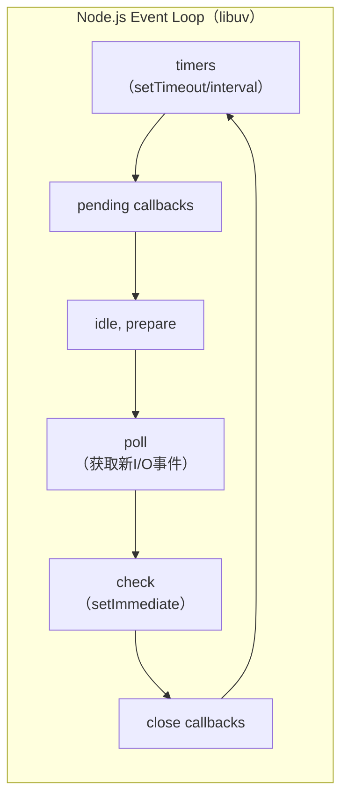

#### 14.4 MutationObserver 为什么是微任务

```javascript
// MutationObserver 回调是微任务，在当前同步代码结束后立即执行
// 这样可以批量处理多个DOM变化，避免每次变化都触发回调

// 例子：
const observer = new MutationObserver(mutations => {
  console.log(mutations.length);
});
observer.observe(document.body, { childList: true });

// DOM变化产生微任务，回调在同步代码完成后执行
document.body.appendChild(document.createElement('div'));
document.body.appendChild(document.createElement('span'));
// 如果是宏任务，会有延迟；作为微任务，立即响应

// requestAnimationFrame：在渲染前（每帧）执行，属于宏任务
// requestIdleCallback：在浏览器空闲时执行，属于宏任务
// 可以使用MessageChannel创建宏任务：
const channel = new MessageChannel();
channel.port1.postMessage(null); // 产生宏任务
```

---

### 15. 定时器与调度

#### 15.1 setTimeout 为什么不准

```javascript
// setTimeout(callback, 0) 不保证立即执行
// 因为事件循环中要等当前任务和微任务队列清空
// 再加上渲染（如果需要），才有空执行宏任务

setTimeout(() => console.log('timeout'), 0);
console.log('sync');
// 输出：sync, timeout（即使delay=0也要等同步代码完成）

// setTimeout实现机制：
// 浏览器：主线程执行 → 等微任务清空 → 渲染 → 执行宏任务
// setTimeout只是把回调注册到宏任务队列，并不是精确延时

// 原因1：事件循环非空闲时，要等待
// 原因2：渲染优先级：微任务 → 渲染 → setTimeout
// 原因3：后台页面（浏览器tab不可见）会降低精度（Chrome最低1s）

// 精确延迟实现（不完美但比setTimeout好）：
// Web Worker中没有UI渲染，可以更精确
// 或者使用 MessageChannel + performance.now() 测量

// setInterval问题：
// 如果回调执行时间超过delay，下一个回调会跳过（不排队）
const start = Date.now();
setInterval(() => {
  // 模拟耗时操作（超过1000ms）
  const now = Date.now();
  console.log(`上次执行：${now - start}ms ago`);
}, 1000);
// 实际间隔大于1000ms（会累积延迟）
```

#### 15.2 requestAnimationFrame 原理

```javascript
// requestAnimationFrame：在下次屏幕刷新前调用
// 每秒约60次（约16.67ms），与屏幕刷新率同步

// 与setTimeout(..., 16.7) 的区别：
// setTimeout：不管浏览器是否在渲染，到时间就执行
// rAF：一定在渲染前，浏览器统一调度，避免掉帧

// rAF使用场景：
// 1. 动画（CSS动画用transform/opacity，无需rAF）
// 2. 游戏循环
// 3. 滚动相关计算（用rAF同步到渲染）

// rAF调用时机（在事件循环中）：
// 每次event loop，浏览器检查是否有rAF回调
// 有的话，在渲染（paint）之前执行（按注册的顺序）
// 然后渲染，更新屏幕

// 节流动画的rAF写法：
let pending = false;
function onScroll() {
  if (pending) return;
  pending = true;
  requestAnimationFrame(() => {
    // 执行滚动处理逻辑
    handleScroll();
    pending = false;
  });
}
```

#### 15.3 requestIdleCallback 原理

```javascript
// requestIdleCallback：在浏览器空闲时执行低优先级任务
// 不影响用户交互/渲染

// 兼容性差，可用 polyfill：
window.requestIdleCallback = window.requestIdleCallback || function(cb) {
  const start = Date.now();
  return setTimeout(() => {
    cb({
      didTimeout: false,
      timeRemaining: () => Math.max(0, 50 - (Date.now() - start))
    });
  }, 1);
};

// 使用示例：
requestIdleCallback((deadline) => {
  // deadline.timeRemaining() 返回剩余空闲时间（毫秒）
  // deadline.didTimeout 是否超时
  while (deadline.timeRemaining() > 0 && tasks.length > 0) {
    const task = tasks.shift();
    task();
  }
  if (tasks.length > 0) {
    requestIdleCallback(deadline.__ref);
  }
});

// React fiber就用这个调度任务（虽然后来自己实现了scheduler）
```

---

### 16. 深拷贝与浅拷贝

```javascript
// 浅拷贝：只拷贝一层，引用类型共享
const a = { obj: { x: 1 } };
const b = Object.assign({}, a);
b.obj.x = 2;
console.log(a.obj.x); // 2（共享！）

// 深拷贝：递归拷贝所有层级
const c = { obj: { x: 1 } };
const d = JSON.parse(JSON.stringify(c));
d.obj.x = 2;
console.log(c.obj.x); // 1（独立）

// JSON深拷贝缺点：
// 1. 不能拷贝函数、undefined、Symbol
// 2. 不能拷贝循环引用（报错）
// 3. 不能拷贝 Date（变成字符串）、RegExp（变成空对象）、Error（丢失）
// 4. BigInt报错
// 5. 对象属性顺序可能改变（特别是稀疏数组）
const bad = {
  date: new Date(),
  regex: /test/,
  err: new Error("错误"),
  fn: function() {},
  big: BigInt(123),
  sym: Symbol("desc"),
  undefinedProp: undefined,
  nested: { fn: () => {} }
};
JSON.parse(JSON.stringify(bad));
// 结果：{date:"2024-01-01T...", regex:{}, err:{}, nested:{}}
// 函数、undefined、BigInt、Symbol全丢失！

// structuredClone（浏览器原生深拷贝，Node 17+）：
// 支持：循环引用、BigInt、Date、RegExp、Error、TypedArray等
const original = { date: new Date(), sym: Symbol("test"), big: 123n };
const cloned = structuredClone(original);
cloned.big === 123n; // true
original.date instanceof Date; // true（克隆后仍是Date）

// 手写深拷贝（完整版）：
function deepClone(target, map = new WeakMap()) {
  // 处理原始类型
  if (target === null || typeof target !== 'object') return target;

  // 处理循环引用
  if (map.has(target)) return map.get(target);

  // 处理Date
  if (target instanceof Date) return new Date(target);

  // 处理RegExp
  if (target instanceof RegExp) return new RegExp(target.source, target.flags);

  // 处理Error
  if (target instanceof Error) {
    const err = new Error(target.message);
    err.name = target.name;
    err.stack = target.stack;
    return err;
  }

  // 处理函数（普通函数和箭头函数分开）
  if (typeof target === 'function') {
    // 箭头函数没有自己的this，直接返回
    if (!target.prototype) return target;
    // 普通函数返回一个包装函数
    return function(...args) { return target.apply(this, args); };
  }

  // 处理Map
  if (target instanceof Map) {
    const cloneMap = new Map();
    map.set(target, cloneMap);
    target.forEach((v, k) => cloneMap.set(deepClone(k, map), deepClone(v, map)));
    return cloneMap;
  }

  // 处理Set
  if (target instanceof Set) {
    const cloneSet = new Set();
    map.set(target, cloneSet);
    target.forEach(v => cloneSet.add(deepClone(v, map)));
    return cloneSet;
  }

  // 处理Array和Object
  const clone = Array.isArray(target) ? [] : {};
  map.set(target, clone);
  for (const key of Reflect.ownKeys(target)) {
    clone[key] = deepClone(target[key], map);
  }
  return clone;
}
```

---

### 17. Map / Set / WeakMap / WeakSet

```javascript
// Map vs Object：
const map = new Map();
map.set({}, 1);  // 对象作为键，===比较，{} !== {}
map.set(NaN, 2);
console.log(map.get(NaN)); // 2
console.log(map.size); // 2

// Set vs Array：
const set = new Set([1, 2, 2, 3]);
console.log([...set]); // [1, 2, 3]

// WeakMap vs Map（关键区别：弱引用）：
// WeakMap：键只能是对象，值可以是任意类型
// 当键对象（弱引用）没有被其他引用时，可以被GC回收

// WeakMap应用场景：
// 1. 私有属性（不阻止对象被GC）
class Person {
  #data = new WeakMap();
  constructor(name) { this.#data.set(this, { name }); }
  getName() { return this.#data.get(this).name; }
}
// 对象被回收后，WeakMap中的条目也消失

// 2. 缓存计算结果（缓存key为对象）
const cache = new WeakMap();
function process(obj) {
  if (cache.has(obj)) return cache.get(obj);
  const result = heavyComputation(obj);
  cache.set(obj, result);
  return result;
}

// 3. DOM节点关联数据（不阻止DOM被GC）
const domData = new WeakMap();
domData.set(document.body, { mark: "special" });

// WeakSet：只能存对象，存的值弱引用，不阻止GC
// 应用：标记对象（"已访问过"标记）
const visited = new WeakSet();
function dfs(node) {
  if (visited.has(node)) return;
  visited.add(node);
  // 访问node...
}
```

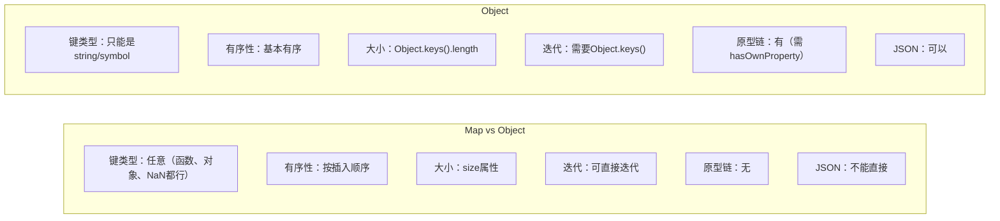

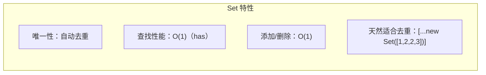

---

### 18. 迭代器与生成器

#### 18.1 for...in vs for...of

```javascript
// for...in：遍历键（可枚举属性，包括原型链）
// for...of：遍历值（需要迭代器）

const arr = [10, 20, 30];
arr.custom = "hi"; // 数组也有自定义属性

for (let i in arr) { console.log(i); }  // 0,1,2,custom（索引+自定义属性）
for (let v of arr) { console.log(v); }  // 10,20,30（值）

// for...of原理：调用[Symbol.iterator]()
const iterator = arr[Symbol.iterator]();
console.log(iterator.next()); // {value:10, done:false}
console.log(iterator.next()); // {value:20, done:false}
console.log(iterator.next()); // {value:30, done:false}
console.log(iterator.next()); // {value:undefined, done:true}

// 可迭代对象（Iterable）：实现了Symbol.iterator
// 内置：Array, String, NodeList, Map, Set, TypedArray, arguments, DOM DOMTokenList
// 普通Object默认不可迭代，但可用for...in

// 给Object添加迭代器（使其可for...of）：
const obj = { a: 1, b: 2, c: 3 };
obj[Symbol.iterator] = function* () {
  for (const key of Object.keys(this)) {
    yield [key, this[key]];
  }
};
for (const [k, v] of obj) { console.log(k, v); }

// for...of可以用break/continue/return/throw
// 生成器实现迭代器：
function* createRange(start, end) {
  for (let i = start; i <= end; i++) {
    yield i;
  }
}
for (const n of createRange(1, 5)) { console.log(n); } // 1,2,3,4,5

// yield*：委托另一个迭代器
function* gen1() { yield 1; yield 2; }
function* gen2() { yield* gen1(); yield 3; }
// 等价于：yield 1; yield 2; yield 3;
```

---

### 19. Proxy 与 Reflect

#### 19.1 Proxy 原理

```javascript
// Proxy：拦截对象操作（get, set, deleteProperty, has, apply...）
// Proxy(target, handler)

const target = { name: "张三", age: 18 };
const handler = {
  get(target, prop, receiver) {
    console.log(`读取${prop}`);
    return Reflect.get(target, prop, receiver);
  },
  set(target, prop, value, receiver) {
    console.log(`设置${prop}=${value}`);
    return Reflect.set(target, prop, value, receiver);
  },
  deleteProperty(target, prop) {
    console.log(`删除${prop}`);
    return delete target[prop];
  },
  has(target, prop) {
    console.log(`检查${prop}`);
    return prop in target;
  }
};

const proxy = new Proxy(target, handler);
proxy.name;       // 触发get，输出"读取name"
proxy.age = 20;   // 触发set，输出"设置age=20"
delete proxy.name; // 触发deleteProperty
console.log("name" in proxy); // 触发has

// Proxy支持的拦截操作：
// get, set, deleteProperty, has, apply, construct,
// getPrototypeOf, setPrototypeOf, isExtensible,
// preventExtensions, getOwnPropertyDescriptor,
// defineProperty, ownKeys, enumerate（已废弃）

// 应用：响应式系统（Vue3）
// Vue3用Proxy实现数据响应式（取代了Vue2的Object.defineProperty）
function reactive(obj) {
  return new Proxy(obj, {
    get(target, key) {
      track(target, key); // 收集依赖
      return typeof target[key] === 'object'
        ? reactive(target[key]) // 深层响应式
        : target[key];
    },
    set(target, key, value) {
      target[key] = value;
      trigger(target, key); // 触发更新
      return true;
    }
  });
}
```

#### 19.2 Proxy vs defineProperty

```javascript
// Object.defineProperty：只能监听特定属性，Vue2用这个
// Proxy：拦截所有操作，Vue3用这个

// defineProperty缺点：
// 1. 无法监听新增属性（需要Vue.set）
const obj = {};
Object.defineProperty(obj, 'name', {
  get() { return this._name; },
  set(v) { this._name = v; }
});
obj.name = '张三'; // OK
obj.age = 18;      // 不触发（需要重新defineProperty）

// Proxy优点：
// 1. 监听所有属性（包括新增）
// 2. 监听数组变化（push, pop等操作）
// 3. 支持 Map/Set/WeakMap/WeakSet
// 4. 可以监听delete和in操作
// 5. 支持函数调用拦截（apply）

// Proxy缺点：
// 1. 浏览器兼容性（IE不支持）
// 2. 不能polyfill
// 3. 无法监视对象原型（getPrototypeOf另算）
```

#### 19.3 Reflect 作用

```javascript
// Reflect：Object操作的方法集合（替代Object上的老方法）
// ES6新增，和Proxy配套使用

// Proxy handler中调用默认行为
const target = { name: "张三" };
const proxy = new Proxy(target, {
  get(target, prop) {
    // 自定义行为 + Reflect获取默认行为
    const value = Reflect.get(target, prop);
    console.log(`拦截${prop}=${value}`);
    return value;
  }
});

// Reflect vs Object 对比：
// Object.defineProperty → Reflect.defineProperty
// Object.getPrototypeOf → Reflect.getPrototypeOf
// Object.setPrototypeOf → Reflect.setPrototypeOf
// Object.isExtensible → Reflect.isExtensible
// Object.preventExtensions → Reflect.preventExtensions
// Object.getOwnPropertyDescriptor → Reflect.getOwnPropertyDescriptor

// 为什么需要Reflect？
// 1. 更语义化（操作行为对应一个单独的对象）
// 2. Proxy handler中的默认行为
// 3. 更好用：Reflect.apply(fn, thisArg, args) 而非 fn.apply()
// 4. 返回值更一致（失败返回false而非抛错）

// Reflect.apply 替代老写法：
// 老：Function.prototype.apply.call(fn, thisArg, args)
// 好：Reflect.apply(fn, thisArg, args)

// Reflect配合Proxy实现"可撤销代理"：
const { proxy, revoke } = Proxy.revocable(target, handler);
// revoke()后，所有代理访问都报错（TypeError）
```

---

### 20. ESModule vs CommonJS

#### 20.1 核心区别

```javascript
// CommonJS（Node.js）：
// module.exports = { }
// exports.xxx =
// require()

// ESModule（浏览器/Node ESM）：
// export default / export
// import
```

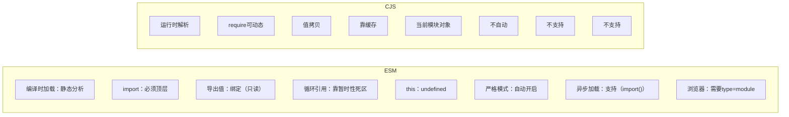

```javascript
// ESM的import为什么必须顶层（静态性）：
// 1. 可以在编译时确定导出依赖关系（静态分析）
// 2. 打包工具（如rollup/webpack）可以实现tree shaking
// 3. 可以在不执行模块的情况下分析依赖关系
// 4. 可以实现循环引用的提前检测

// 循环引用例子：
// a.js:
// import { b } from './b.js';
// export const a = 'a';
// b(); // 这里b可能还未定义！

// b.js:
// import { a } from './a.js';
// export const b = () => console.log(a);

// Node处理：a.js执行到import时暂停，先执行b.js，b.js执行完后a.js继续
// 结果：a = 'a'，b() 打印 'a'

// ESM的import绑定是只读的：
// lib.js:
// export let count = 0;
// export function inc() { count++; }

// main.js:
// import { count, inc } from './lib.js';
// count = 5; // TypeError：绑定是const-like，只读
// inc(); // 可以，因为lib.js内可以修改自己的变量
```

#### 20.2 Tree Shaking 原理

```javascript
// Tree Shaking：消除未使用的导出代码（dead code elimination）
// 前提：ESM + 静态分析 + 打包工具（rollup/webpack/esbuild）

// 原理：
// 1. 打包时静态分析所有import/export关系
// 2. 标记哪些导出被使用，哪些未被使用
// 3. 删除未使用的代码

// 条件：
// 1. 必须是ESM（CJS无法静态分析，rollup可以解析但效果差）
// 2. 导出函数必须是"纯函数"（无副作用）
// 3. 不能有动态import（无法静态分析）

// sideEffects：
// package.json中的sideEffects用于告诉打包工具哪些文件有副作用
{
  "sideEffects": [
    "./src/polyfill.js",
    "*.css"
  ]
}
// sideEffects: false → 所有导出都可安全删除
// sideEffects: ["file"] → 只有这些文件有副作用，其他可shaking

// 被tree shaking的代码（即使import了也不会被打包）：
import { unused } from 'lodash'; // 如果lodash没用到的功能，整行可删

// 副作用示例（有副作用，不能shaking）：
// 全局变量修改
window.globalVar = 1;
// 读写this
function init() { this._internal = true; }
// 模块执行时有额外行为
import './init-side-effect.js'; // 这行不能删
```

#### 20.3 动态 import 与 top-level await

```javascript
// 动态import：返回Promise，用于代码分割
import('./module.js')
  .then(m => m.exportFunc())
  .catch(err => console.error(err));

// 等价写法：
const m = await import('./module.js');

// 应用：按需加载
button.addEventListener('click', async () => {
  const { showModal } = await import('./modal.js');
  showModal();
});

// top-level await：模块顶层可直接使用await（ES2022）
// 相当于模块内自动包了async函数
const data = await fetch('/api/user').then(r => r.json());
export { data };

// top-level await限制：
// 1. 顶级可用，子函数内不可用（除非在async函数内）
// 2. 阻塞模块执行（可以用于模块初始化）
// 3. 可用在ESM的任意位置

// 模块循环引用处理：
// lib.mjs:
export { helper } from './helper.mjs'; // re-export，不执行helper.mjs全部代码
import { value } from './main.mjs';    // main.mjs如果正在执行，value可能是undefined
export const libValue = value || 'default';
```

---

### 21. 垃圾回收（GC）

```javascript
// V8 GC架构：
// 新生代（New Space）：
//   - 1-8MB
//   - Scavenge算法，复制-替换
//   - 存活短的对象
// 老生代（Old Space）：
//   - 几十MB~GB
//   - Mark-Sweep + Mark-Compact
//   - 存活长的对象

// 新生代：分成from space和to space
// 1. From space存对象
// 2. 触发GC时，检查存活对象，复制到To space
// 3. To space和From space互换
// 优点：速度快（牺牲50%空间换速度）
// 缺点：内存浪费，不适合大对象（大对象直接进老生代）

// 老生代：Mark-Sweep-Compact
// 1. Mark：从根节点（全局变量、栈变量）开始标记可达对象
// 2. Sweep：回收未标记的内存（留下碎片）
// 3. Compact：整理存活对象到一端，减少碎片

// 引用计数（其他引擎使用）：
// 每个对象记录被引用次数，为0时立即回收
// 优点：及时回收
// 缺点：循环引用无法回收
var a = { prop: null };
var b = { prop: null };
a.prop = b; // b引用+1
b.prop = a; // a引用+1
// a和b互相引用，但外部没有引用，所以应该回收
// 引用计数看不到这个"外部引用"，所以无法回收！

// V8用标记-清除解决这个问题：即使互相引用，只要从根不可达，就回收

// 内存泄漏场景：
// 1. 全局变量（意外创建）
// function leak() { bigData = new Array(1000000); } // window.bigData

// 2. 定时器未清除
// setInterval(() => { /* 引用了obj */ }, 1000);
// clearInterval(id);

// 3. 闭包（持有大对象引用）
// function outer() {
//   const large = new Array(1000000);
//   return function() { return large.length; };
// }

// 4. DOM引用（DOM被移除但JS还引用着）
// const els = { body: document.body };
// els.body.remove();
// // document.body还在els中，DOM树无法GC

// 5. 事件监听未移除
// el.addEventListener('click', handler);
// el.removeEventListener('click', handler);

// 手动触发GC（调试用）：
// % gc() // 在Node启动时加--expose-gc，或浏览器debug时用
```

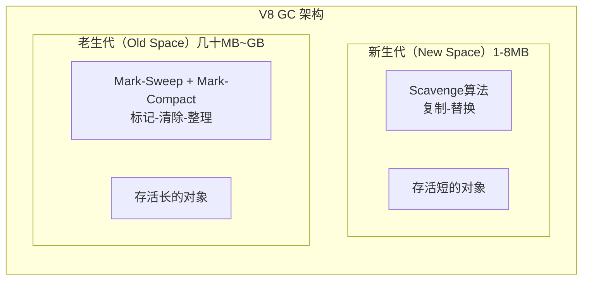

---

### 22. JS 单线程与 Web Worker

```javascript
// 为什么JS是单线程？
// 历史原因：DOM是单线程的，JS和DOM共享同一线程
// 设计决定：避免多线程访问DOM的同步问题（锁、死锁）
// 示例：如果多线程同时修改同一DOM，结果不可预测

// Web Worker：
// 独立的JS线程，无法操作DOM，可以做耗时计算

// 创建Worker：
const worker = new Worker('worker.js');
worker.postMessage({ type: 'calc', data: [1, 2, 3] });
worker.onmessage = (e) => console.log('结果:', e.data);

// worker.js:
// self.onmessage = (e) => {
//   const result = heavyComputation(e.data.data);
//   self.postMessage(result);
// };

// Worker的限制：
// 1. 不能操作DOM
// 2. 不能直接访问parent（通过postMessage通信）
// 3. 不能访问某些全局对象（window, document）
// 4. 内存不共享（通过消息传递）

// SharedArrayBuffer：跨线程共享内存（需要配合Atomics）
// 用途：高性能计算，如大数据处理
// 注意：需要Cross-Origin-Embedder-Policy头，否则浏览器禁用

// worker.js:
const sharedBuffer = new SharedArrayBuffer(100);
const view = new Int32Array(sharedBuffer);

// 主线程 + Worker 共享同一个buffer，可同时读写
// Atomics.add(view, 0, 1); // 原子操作，避免竞争

// Atomics：原子操作
// Atomics.load(arr, index)
// Atomics.store(arr, index, value)
// Atomics.add, Atomics.sub, Atomics.and, Atomics.or
// Atomics.wait / Atomics.notify（条件变量）
// Atomics.compareExchange(arr, index, expected, newValue)

// Worker通信方式：
// 1. postMessage（克隆，结构化克隆算法）
// 2. Transferable对象（转移所有权，如ArrayBuffer）
// 3. SharedArrayBuffer（共享内存）

// 可转移 vs 克隆：
buffer = new ArrayBuffer(8);
worker.postMessage(buffer, [buffer]); // buffer在主线程变为0长度，转移到Worker
// 克隆：不改变原对象，Worker有副本
// 转移：原对象被"掏空"，Worker获得所有权
```

---

### 23. 函数式编程

#### 23.1 概念

```javascript
// 纯函数：给定相同输入，总是返回相同输出，无副作用
// 副作用：修改外部状态（修改参数、I/O、网络请求、DOM操作、console）

// 副作用示例：
let total = 0;
function add(n) { total += n; return total; } // 修改外部变量， impure
function addPure(n) { return total + n; }    // 不修改外部，pure
// 建议：纯函数更容易测试和推理

// Immutable：永远不修改原数据
const arr = [1, 2, 3];
const newArr = [...arr, 4]; // 不修改arr，返回新数组
// Immutable.js：结构共享的持久数据结构
import { List, Map } from 'immutable';
const list = List([1, 2, 3]);
const newList = list.push(4); // 原list不变，newList是新引用
// 原理：只记录变化路径，不复制整个结构（结构共享）
```

#### 23.2 柯里化

```javascript
// 柯里化：把多参数函数转为一系列单参数函数
function add(a, b, c) { return a + b + c; }
function currying(fn) {
  return function curried(...args) {
    if (args.length >= fn.length) {
      return fn.apply(this, args);
    }
    return function(...args2) {
      return curried.apply(this, args.concat(args2));
    };
  };
}
const curriedAdd = currying(add);
console.log(curriedAdd(1)(2)(3));   // 6
console.log(curriedAdd(1, 2)(3));   // 6
console.log(curriedAdd(1, 2, 3));   // 6

// 实际应用：参数复用 + 延迟执行
const log = currying((level, message) => console.log(`[${level}] ${message}`));
const infoLog = log('INFO');
infoLog('系统启动');   // [INFO] 系统启动
infoLog('用户登录');   // [INFO] 用户登录
```

#### 23.3 高阶函数与 compose

```javascript
// 高阶函数：接受函数或返回函数的函数
// 常见：map, filter, reduce, forEach, sort, some, every, find

// compose：组合多个函数，从右到左执行
// f(g(h(x))) = compose(f, g, h)(x)
function compose(...fns) {
  if (fns.length === 0) return x => x;
  if (fns.length === 1) return fns[0];
  return fns.reduceRight((f, g) => (...args) => f(g(...args)));
}

// pipe：compose的变种，从左到右执行
function pipe(...fns) {
  if (fns.length === 0) return x => x;
  if (fns.length === 1) return fns[0];
  return fns.reduce((f, g) => (...args) => g(f(...args)));
}

// 示例：数据处理管道
const processUser = pipe(
  validateInput,           // 1. 验证输入
  normalizeData,           // 2. 规范化数据
  removeDuplicates,       // 3. 去重
  enrichWithMeta,          // 4. 补充元信息
  formatOutput             // 5. 格式化输出
);

// trace：调试compose中间结果
const trace = label => x => { console.log(`${label}:`, x); return x; };
const debug = pipe(
  trace('输入'),
  double,
  trace('翻倍后'),
  addOne,
  trace('加一后')
);

// reduce实现map：
const myMap = (fn, arr) => arr.reduce((acc, x) => [...acc, fn(x)], []);
// filter基于reduce：
const myFilter = (pred, arr) => arr.reduce((acc, x) => pred(x) ? [...acc, x] : acc, []);
```

#### 23.4 RxJS 简介

```javascript
// RxJS：响应式编程库，基于Observable + 操作符
// 核心：把异步事件流当成值来处理

// 常用创建操作符：
import { of, from, interval, fromEvent } from 'rxjs';

// Observable：可观察对象（生产者）
// Observer：观察者（消费者）
// Subscription：订阅关系

// 操作符：
// map, filter, debounceTime, switchMap, mergeMap, take, takeUntil, distinctUntilChanged, scan, reduce

// 示例：搜索防抖
fromEvent(searchInput, 'input').pipe(
  debounceTime(300),
  map(e => e.target.value),
  distinctUntilChanged(),
  switchMap(query => ajax(`/search?q=${query}`)) // 取消之前的请求
).subscribe(results => render(results));

// 为什么switchMap能取消前一个？
// switchMap内部会unsubscribe前一个Observable，再subscribe新的
// 实现：每次新值来时，调用innerObservable.subscribe()
// 管理innerSubscription，如果新值来就unsubscribe旧的
```

---

### 24. 防抖与节流

```javascript
// 防抖（debounce）：事件触发n秒后才执行，n秒内再次触发则重新计时
function debounce(fn, delay, immediate = false) {
  let timer;
  return function(...args) {
    const context = this;
    // 立即执行模式
    if (immediate && !timer) fn.apply(context, args);
    clearTimeout(timer);
    timer = setTimeout(() => {
      if (!immediate) fn.apply(context, args);
      timer = null;
    }, delay);
  };
}

// 场景：搜索框输入（等待用户停止输入后才搜索）、窗口调整大小（调整完成后执行一次）

// 节流（throttle）：n秒内只执行一次（固定频率）
function throttle(fn, delay) {
  let lastTime = 0;
  return function(...args) {
    const now = Date.now();
    if (now - lastTime >= delay) {
      fn.apply(this, args);
      lastTime = now;
    }
  };
}

// 场景：滚动事件（滚动时每隔一段时间处理）、按钮防重复点击、拖拽

// requestAnimationFrame节流（更精确）：
function throttleRAF(fn) {
  let pending = false;
  return function(...args) {
    if (!pending) {
      pending = true;
      requestAnimationFrame(() => {
        fn.apply(this, args);
        pending = false;
      });
    }
  };
}

// leading + trailing 组合：
function throttleFull(fn, delay, options = {}) {
  let timer, lastArgs;
  const { leading = true, trailing = true } = options;
  return function(...args) {
    if (!timer && leading) fn.apply(this, args);
    lastArgs = args;
    clearTimeout(timer);
    timer = setTimeout(() => {
      if (trailing && lastArgs) fn.apply(this, lastArgs);
      timer = null;
    }, delay);
  };
}

// 应用区别：
// 搜索框输入：debounce（停笔后才搜）
// 滚动加载：throttle（滚动时持续加载）
// 窗口resize：debounce（停止调整后才处理）
```