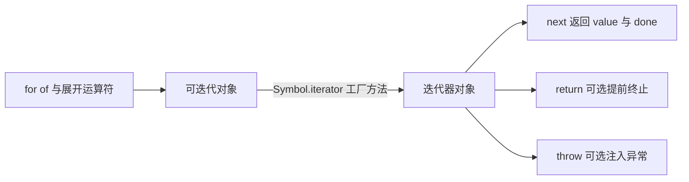
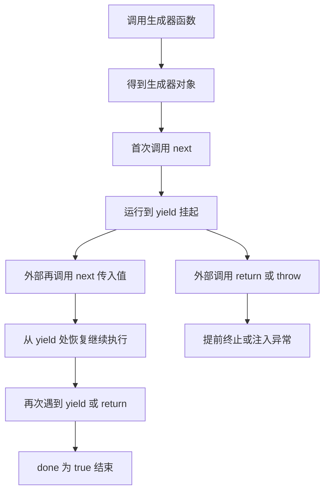
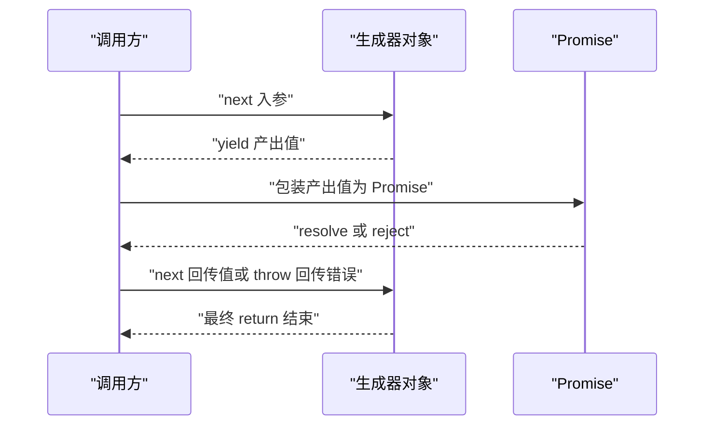

# 迭代器、生成器与协程：手写 co 与 async/await

!!! abstract "核心结论"
    - 迭代器协议与可迭代协议分离了"遍历状态"与"数据源"，是 for-of、展开运算符、解构的共同底层。
    - 生成器在转译层和引擎层都被实现为可暂停的 switch 状态机，yield 既是暂停点，也是外部注入值的双向通信通道。
    - co 与 asyncToGenerator 的骨架完全一致：生成器 + 递归 next + Promise 包装，错误沿 gen.throw 路径传播。
    - async/await 在 ECMAScript 规范层不是 generator 语法糖，但 Babel 与低 target 的 TypeScript 正是用生成器加 runner 模拟它。
    - 异步迭代与背压把数据流改成消费者拉取驱动，是实现有界内存流式处理的关键。

## 1. 迭代协议：Iterator 与 Iterable

### 1.1 为什么要有两个协议

迭代器协议（Iterator Protocol）规定一个对象只要提供 `next()` 方法，且 `next()` 返回 `{ value, done }` 结构，它就是一个迭代器。迭代器是有状态的、一次性的游标：它记住遍历到哪了，耗尽后无法回到起点。

可迭代协议（Iterable Protocol）规定一个对象只要提供 `[Symbol.iterator]()` 方法，且该方法返回一个迭代器，它就是可迭代对象。这个方法是工厂函数：每次调用都返回一个全新的迭代器，因此同一个数组可以被完整遍历无数次。

`for-of`、数组展开 `...`、解构赋值、`Array.from`、`new Map(iterable)`、`Promise.all(iterable)` 等 API，在底层做的都是同一件事：先取 `obj[Symbol.iterator]()` 得到迭代器，然后反复调用 `next()`，读到 `done: true` 为止。引擎并不区分"数组"和"自定义集合"，只认这两个协议。



内置的 Array、String、Map、Set、TypedArray、arguments、NodeList 都实现了可迭代协议。数组的迭代器和生成器对象还额外实现 `[Symbol.iterator]() { return this; }`，所以它们"既是迭代器，也是可迭代对象"，可以被展开，也能手动 next。

### 1.2 手写一个可迭代对象

```js
// 01-range.js -- 运行环境: Node.js 18+（CommonJS，直接 node 运行）
class Range {
  constructor(start, end, step = 1) {
    this.start = start;
    this.end = end;
    this.step = step;
  }

  // 可迭代协议：Symbol.iterator 是工厂方法，每次返回全新迭代器
  [Symbol.iterator]() {
    let current = this.start;
    const { end, step } = this;
    // 迭代器协议：暴露 next()，可选暴露 return()
    return {
      next() {
        if (current < end) {
          const value = current;
          current += step;
          return { value, done: false };
        }
        return { value: undefined, done: true };
      },
      return() {
        // for-of 遇到 break / return / 异常时会尝试调用 return()
        console.log('Range 迭代器被提前终止');
        return { value: undefined, done: true };
      }
    };
  }
}

const r = new Range(0, 10, 2);
console.log([...r]); // 期望输出: [0, 2, 4, 6, 8]

const it = r[Symbol.iterator]();
console.log(it.next()); // 期望输出: { value: 0, done: false }
console.log(it.next()); // 期望输出: { value: 2, done: false }
```

**验证标准**：`node 01-range.test.js`

```js
const assert = require('node:assert/strict');

class Range {
  constructor(start, end, step = 1) {
    this.start = start;
    this.end = end;
    this.step = step;
  }
  [Symbol.iterator]() {
    let current = this.start;
    const { end, step } = this;
    return {
      next() {
        if (current < end) {
          const value = current;
          current += step;
          return { value, done: false };
        }
        return { value: undefined, done: true };
      },
      return() {
        return { value: undefined, done: true };
      }
    };
  }
}

(() => {
  const r = new Range(0, 5);
  const it = r[Symbol.iterator]();

  assert.deepStrictEqual(it.next(), { value: 0, done: false });
  assert.deepStrictEqual(it.next(), { value: 1, done: false });

  // 展开得到的是全新迭代器，不受上面 it 已消费两个值的影响
  assert.deepStrictEqual([...r], [0, 1, 2, 3, 4]);

  // 每次 [Symbol.iterator]() 都互不影响
  const it2 = r[Symbol.iterator]();
  assert.deepStrictEqual(it2.next(), { value: 0, done: false });
  assert.deepStrictEqual(it.next(), { value: 2, done: false });

  // 耗尽后 done 恒为 true
  const r2 = new Range(0, 1);
  const it3 = r2[Symbol.iterator]();
  it3.next();
  assert.deepStrictEqual(it3.next(), { value: undefined, done: true });
  assert.ok(it3.next().done);

  console.log('PASS: Range 迭代与可迭代协议');
})();
```

### 1.3 return 与 throw：提前终止与异常注入

生成器对象同时具备 `next()`、`return()`、`throw()` 三个方法。`return(v)` 让生成器在当前位置提前结束，返回 `{ value: v, done: true }`；如果生成器内有 `finally`，会先执行清理逻辑。`throw(e)` 则把异常"注入"到当前挂起的 yield 表达式处，好似 yield 那一行自己抛出了异常。

```js
// 02-return-throw.js -- 运行环境: Node.js 18+
function* withFinally() {
  try {
    yield 1;
    yield 2;
    yield 3;
  } finally {
    console.log('finally 清理');
  }
}

const a = withFinally();
console.log(a.next());                 // { value: 1, done: false }
console.log(a.return('提前结束'));     // 先打印 finally 清理，再输出 { value: '提前结束', done: true }
console.log(a.next());                 // { value: undefined, done: true }

function* withCatch() {
  try {
    yield 1;
  } catch (e) {
    console.log('捕获到:', e.message);
    yield 2;
  }
}

const b = withCatch();
console.log(b.next());                      // { value: 1, done: false }
console.log(b.throw(new Error('注入异常'))); // 先打印 捕获到: 注入异常，再输出 { value: 2, done: false }
```

**验证标准**：`node 02-return-throw.test.js`

```js
const assert = require('node:assert/strict');

function* withFinally() {
  try {
    yield 1;
    yield 2;
  } finally {
    // 这行仅记录，不做断言，验证 return() 会走 finally
  }
}

function* withCatch() {
  try {
    yield 1;
  } catch (e) {
    return `captured:${e.message}`;
  }
}

(() => {
  const a = withFinally();
  a.next();
  assert.deepStrictEqual(a.return('提前结束'), { value: '提前结束', done: true });
  assert.deepStrictEqual(a.next(), { value: undefined, done: true });

  const b = withCatch();
  b.next();
  assert.deepStrictEqual(b.throw(new Error('boom')), { value: 'captured:boom', done: true });
  assert.deepStrictEqual(b.next(), { value: undefined, done: true });

  // 无 catch 的生成器：throw 直接向外抛出
  function* noCatch() {
    yield 1;
    yield 2;
  }
  const c = noCatch();
  c.next();
  assert.throws(() => c.throw(new Error('out')), /out/);

  console.log('PASS: return 与 throw 语义');
})();
```

三种协议对比：

| 协议 | 归属对象 | 必需成员 | 返回结构 | 消费方 |
| --- | --- | --- | --- | --- |
| Iterator | 迭代器对象 | `next()` | `{ value, done }` | 手动调用、for-of |
| Iterable | 集合或自定义对象 | `[Symbol.iterator]()` | 迭代器对象 | for-of、展开、解构 |
| AsyncIterator | 异步迭代器对象 | `next()` | `Promise<{ value, done }>` | for await |
| AsyncIterable | 异步序列对象 | `[Symbol.asyncIterator]()` | 异步迭代器对象 | for await |

## 2. 生成器：可暂停函数与状态机

### 2.1 生成器对象的状态与双向通信

调用生成器函数不会执行函数体，而是立即返回一个生成器对象。它的内部状态机在规范中对应 `[[GeneratorState]]` 字段，取值依次为 `suspendedStart`、`executing`、`suspendedYield`、`completed`：第一次 `next()` 从 `suspendedStart` 进入 `executing`，执行到 yield 后回到 `suspendedYield`，遇到 return 或函数末尾进入 `completed`。

yield 是双向通道：它向外产出值，同时 `next(arg)` 的参数会成为该 yield 表达式的返回值。第一段代码最容易体会这一点：

```js
// 03-chat.js -- 运行环境: Node.js 18+
function* ask() {
  const name = yield '你的名字?';
  const age = Number(yield `你好 ${name}，年龄?`);
  return `${name} 明年 ${age + 1} 岁`;
}

const c = ask();
console.log(c.next());      // { value: '你的名字?', done: false }
console.log(c.next('Ada')); // { value: '你好 Ada，年龄?', done: false }
console.log(c.next('30'));  // { value: 'Ada 明年 31 岁', done: true }
```

为什么能做到暂停？因为生成器函数体内的局部变量、执行位置、返回地址等信息并不存在普通调用栈的栈帧里，而是保存在生成器对象的 `[[GeneratorContext]]` 中。挂在 yield 点后，调用栈完全释放，外部世界可以继续运行；下一次 next 重新建立上下文并从 yield 之后恢复。转译器（如 regenerator）则用"保存局部变量 + 记录状态编号 + switch 跳转"在纯 JS 中复刻同一行为。



### 2.2 手写 regenerator 风格的 switch 状态机

下面把一段会"回退并继续循环"的生成器，手工转译成状态机。核心技巧是：每个变量提升到闭包 context 里，每个 yield 分配一个状态编号，把 `case` 标签直接嵌在 `while` 循环体内部（Duff's Device 风格），从而在恢复时从 yield 之后继续，而不是从函数开头重来。

```js
// 04-state-machine.js -- 原始生成器
function* counterUntil(n) {
  let i = 0;
  while (i < n) {
    const reset = yield i; // 挂起点：对外产出 i，恢复时接收 reset
    if (reset) {
      i = 0;
    } else {
      i++;
    }
  }
  return '完成';
}

// 手工转译的状态机
function counterUntilMachine(n) {
  let state = 0;    // 0: 入口；1: 挂起点；-1: 结束
  let i = 0;        // 原函数局部变量提升到 context
  let reset;        // 保存 yield 表达式的结果

  return {
    next(input) {
      switch (state) {
        case 0:
          i = 0;
          // while (i < n) {
          while (i < n) {
            state = 1; // 先标记恢复点，再挂起
            return { value: i, done: false };
          case 1:
            // 从 yield i 处恢复，input 就是 yield 表达式的值
            reset = input;
            if (reset) {
              i = 0;
            } else {
              i++;
            }
            // } 回到 while 条件判断
          }
          // } 循环退出
          state = -1;
          return { value: '完成', done: true };
        default:
          state = -1;
          return { value: undefined, done: true };
      }
    },
    return(value) {
      state = -1;
      return { value, done: true };
    },
    throw(error) {
      state = -1;
      throw error;
    }
  };
}

const g = counterUntilMachine(3);
console.log(g.next());     // { value: 0, done: false }
console.log(g.next());     // { value: 1, done: false }
console.log(g.next(true)); // 注入 true 使 i 归零，{ value: 0, done: false }
console.log(g.next());     // { value: 1, done: false }
console.log(g.next());     // { value: 2, done: false }
console.log(g.next());     // { value: '完成', done: true }
```

**验证标准**：`node 04-state-machine.test.js`

```js
const assert = require('node:assert/strict');

function* counterUntil(n) {
  let i = 0;
  while (i < n) {
    const reset = yield i;
    if (reset) {
      i = 0;
    } else {
      i++;
    }
  }
  return '完成';
}

function counterUntilMachine(n) {
  let state = 0;
  let i = 0;
  let reset;
  return {
    next(input) {
      switch (state) {
        case 0:
          i = 0;
          while (i < n) {
            state = 1;
            return { value: i, done: false };
            case 1:
            reset = input;
            if (reset) {
              i = 0;
            } else {
              i++;
            }
          }
          state = -1;
          return { value: '完成', done: true };
        default:
          state = -1;
          return { value: undefined, done: true };
      }
    },
    return(value) {
      state = -1;
      return { value, done: true };
    },
    throw(error) {
      state = -1;
      throw error;
    }
  };
}

function collect(iterator, inputs) {
  const out = [];
  for (const input of inputs) {
    const step = iterator.next(input);
    out.push({ value: step.value, done: step.done });
  }
  return out;
}

const inputs = [undefined, undefined, true, undefined, undefined, undefined];
const expected = [
  { value: 0, done: false },
  { value: 1, done: false },
  { value: 0, done: false },
  { value: 1, done: false },
  { value: 2, done: false },
  { value: '完成', done: true },
];

assert.deepStrictEqual(collect(counterUntil(3), inputs), expected);
assert.deepStrictEqual(collect(counterUntilMachine(3), inputs), expected);

const zero = counterUntilMachine(0);
assert.deepStrictEqual(zero.next(), { value: '完成', done: true });
assert.deepStrictEqual(zero.next(), { value: undefined, done: true });

console.log('PASS: 状态机与原生生成器行为一致');
```

这里的 return/throw 只做了最简处理。真实 regenerator 会把 try/finally 压入一个 try 栈，在状态跳转时逐层执行 finally 与 catch，细节需核对 regenerator 源码或官方文档。

### 2.3 yield* 委托

`yield*` 把产出权委托给另一个可迭代对象：外层生成器依次转发内层所有 value，内层 return 的最终值会成为 `yield*` 表达式的值。它的另一个重要特性是转发：外部调用外层 `next/throw/return` 时，会继续转发给被委托的迭代器。

```js
// 05-yield-star.js -- 运行环境: Node.js 18+
function* inner() {
  yield 'a';
  yield 'b';
  return 'inner-done';
}

function* outer() {
  yield 1;
  const innerResult = yield* inner();
  yield innerResult;
  yield 2;
  return 'outer-done';
}

const it = outer();
console.log(it.next()); // { value: 1, done: false }
console.log(it.next()); // { value: 'a', done: false }
console.log(it.next()); // { value: 'b', done: false }
console.log(it.next()); // { value: 'inner-done', done: false }
console.log(it.next()); // { value: 2, done: false }
console.log(it.next()); // { value: 'outer-done', done: true }

// 简化手写版：仅转发 next 输入；完整语义还需转发 return 与 throw
function* outerManual() {
  yield 1;
  const innerIt = inner();
  let step = innerIt.next();
  while (!step.done) {
    const input = yield step.value;
    step = innerIt.next(input);
  }
  const innerResult = step.value;
  yield innerResult;
  yield 2;
  return 'outer-done';
}

// yield* 接受任意可迭代对象，不限于生成器
function* concat() {
  yield* [1, 2];
  yield* 'xy';
}
console.log([...concat()]); // [1, 2, 'x', 'y']
```

**验证标准**：`node 05-yield-star.test.js`

```js
const assert = require('node:assert/strict');

function* inner() {
  yield 'a';
  yield 'b';
  return 'inner-done';
}

function* outer() {
  yield 1;
  const innerResult = yield* inner();
  yield innerResult;
  yield 2;
  return 'outer-done';
}

function* outerManual() {
  yield 1;
  const innerIt = inner();
  let step = innerIt.next();
  while (!step.done) {
    const input = yield step.value;
    step = innerIt.next(input);
  }
  const innerResult = step.value;
  yield innerResult;
  yield 2;
  return 'outer-done';
}

function* concat() {
  yield* [1, 2];
  yield* 'xy';
}

function drain(iterator) {
  const values = [];
  let step = iterator.next();
  while (!step.done) {
    values.push(step.value);
    step = iterator.next();
  }
  return { values, returnValue: step.value };
}

assert.deepStrictEqual(drain(outer()), {
  values: [1, 'a', 'b', 'inner-done', 2],
  returnValue: 'outer-done',
});
assert.deepStrictEqual(drain(outerManual()), drain(outer()));
assert.deepStrictEqual([...concat()], [1, 2, 'x', 'y']);

console.log('PASS: yield* 委托与简化手写版一致');
```

## 3. 手写 co：生成器驱动 Promise

### 3.1 编排模型

Generator 能暂停，Promise 能表达"未来完成"，把两者组合起来就得到协作式协程：生成器执行到 `yield promise` 时把控制权交出去；promise resolve 后用 `gen.next(value)` 把结果灌回 yield 表达式；promise reject 则用 `gen.throw(error)` 把错误抛回生成器内部，让调用方的 try/catch 能捕获。这正是 co 库做异步编排的骨架。



### 3.2 实现 toPromise 与 co

```js
// 06-co.js -- 运行环境: Node.js 18+
// 将 yieldable 值统一转成 Promise
function toPromise(value) {
  // 1. Promise / thenable
  if (value && typeof value.then === 'function') {
    return Promise.resolve(value);
  }
  // 2. thunk: 一个接收回调的函数，回调签名 (err, data)
  if (typeof value === 'function') {
    return new Promise((resolve, reject) => {
      value((err, data) => {
        if (err) reject(err);
        else resolve(data);
      });
    });
  }
  // 3. 数组: 并行执行
  if (Array.isArray(value)) {
    return Promise.all(value.map(toPromise));
  }
  // 4. 普通对象: 并发执行所有值，再按原键组装
  if (value && typeof value === 'object') {
    const keys = Object.keys(value);
    return Promise.all(keys.map((k) => toPromise(value[k]))).then((results) => {
      const obj = {};
      keys.forEach((k, idx) => {
        obj[k] = results[idx];
      });
      return obj;
    });
  }
  // 5. 普通值直接包装
  return Promise.resolve(value);
}

function co(genFn, ...args) {
  return new Promise((resolve, reject) => {
    const gen = genFn.apply(this, args);

    function step(method, arg) {
      let result;
      try {
        result = gen[method](arg);
      } catch (err) {
        return reject(err);
      }

      const { value, done } = result;
      if (done) {
        return resolve(value);
      }

      // 关键点：用 .then 驱动递归，下一轮永远在微任务中执行，
      // 防止同步递归把调用栈压爆（next -> yield -> next -> ...）
      toPromise(value).then(
        (resolved) => step('next', resolved),
        (error) => step('throw', error)
      );
    }

    step('next');
  });
}

// 演示：顺序 yield + 数组并行 + 对象并发
function* loadUser(id) {
  const user = yield Promise.resolve({ id, name: 'Ada' });
  const [a, b] = yield [Promise.resolve('并行 A'), Promise.resolve('并行 B')];
  const meta = yield { score: 100, createdAt: Promise.resolve(Date.now()) };
  return { user, parallel: [a, b], score: meta.score };
}

co(loadUser, 1).then((res) => console.log(res));
// 期望输出: { user: { id: 1, name: 'Ada' }, parallel: ['并行 A', '并行 B'], score: 100 }
```

**验证标准**：`node 06-co.test.js`

```js
const assert = require('node:assert/strict');

function toPromise(value) {
  if (value && typeof value.then === 'function') {
    return Promise.resolve(value);
  }
  if (typeof value === 'function') {
    return new Promise((resolve, reject) => {
      value((err, data) => {
        if (err) reject(err);
        else resolve(data);
      });
    });
  }
  if (Array.isArray(value)) {
    return Promise.all(value.map(toPromise));
  }
  if (value && typeof value === 'object') {
    const keys = Object.keys(value);
    return Promise.all(keys.map((k) => toPromise(value[k]))).then((results) => {
      const obj = {};
      keys.forEach((k, idx) => {
        obj[k] = results[idx];
      });
      return obj;
    });
  }
  return Promise.resolve(value);
}

function co(genFn, ...args) {
  return new Promise((resolve, reject) => {
    const gen = genFn.apply(this, args);
    function step(method, arg) {
      let result;
      try {
        result = gen[method](arg);
      } catch (err) {
        return reject(err);
      }
      const { value, done } = result;
      if (done) return resolve(value);
      toPromise(value).then(
        (resolved) => step('next', resolved),
        (error) => step('throw', error)
      );
    }
    step('next');
  });
}

(async () => {
  function* loadUser(id) {
    const user = yield Promise.resolve({ id, name: 'Ada' });
    const [a, b] = yield [Promise.resolve('并行 A'), Promise.resolve('并行 B')];
    const meta = yield { score: 100, createdAt: Promise.resolve(1) };
    return { user, parallel: [a, b], score: meta.score };
  }
  assert.deepStrictEqual(await co(loadUser, 1), {
    user: { id: 1, name: 'Ada' },
    parallel: ['并行 A', '并行 B'],
    score: 100,
  });

  // 顺序验证：必须等前一个 yield 完成后才继续
  const order = [];
  function* seq() {
    order.push('start');
    yield Promise.resolve('a');
    order.push('after-a');
    yield Promise.resolve('b');
    order.push('after-b');
    return 'end';
  }
  assert.strictEqual(await co(seq), 'end');
  assert.deepStrictEqual(order, ['start', 'after-a', 'after-b']);

  // 错误传播：yield 的 Promise reject 会让 gen.throw 在挂起点抛出
  function* failing() {
    try {
      yield Promise.reject(new Error('boom'));
    } catch (e) {
      return `捕获: ${e.message}`;
    }
  }
  assert.strictEqual(await co(failing), '捕获: boom');

  // 未被捕获的错误会 reject co 返回的 Promise
  function* uncaught() {
    yield Promise.reject(new Error('漏网'));
  }
  await assert.rejects(co(uncaught), /漏网/);

  // thunk 支持
  const readFile = (name) => (cb) => setTimeout(() => cb(null, `content-of-${name}`), 5);
  function* thunkGen() {
    const content = yield readFile('a.txt');
    return content;
  }
  assert.strictEqual(await co(thunkGen), 'content-of-a.txt');

  // 微任务递归不会栈溢出
  function* thousands() {
    for (let i = 0; i < 10000; i++) {
      yield Promise.resolve(i);
    }
    return 'done';
  }
  assert.strictEqual(await co(thousands), 'done');

  console.log('PASS: co 顺序、并行、错误传播、thunk 与栈安全');
})();
```

## 4. async/await 的底层转换

### 4.1 手写 asyncToGenerator

async/await 与 co 的差异只在"收口"上：asyncToGenerator 是一个转换器，输入生成器函数，输出普通函数；该函数内部生成 generator，并用与 co 完全相同的 step 逻辑驱动。原 async 函数里的每个 `await` 对应转译后生成器里的一个 `yield`。

```js
// 07-async-to-generator.js -- 运行环境: Node.js 18+
function asyncToGenerator(genFn) {
  return function (...args) {
    const self = this;
    const gen = genFn.apply(self, args);
    return new Promise((resolve, reject) => {
      function step(key, arg) {
        let result;
        try {
          result = gen[key](arg);
        } catch (err) {
          return reject(err);
        }
        const { value, done } = result;
        if (done) {
          return resolve(value);
        }
        // await 的值只按 Promise 处理，不支持 co 的数组/对象/thunk
        Promise.resolve(value).then(
          (val) => step('next', val),
          (err) => step('throw', err)
        );
      }
      step('next');
    });
  };
}

// 原生 async 版本
async function nativeGetUser(id) {
  const user = await Promise.resolve({ id, name: 'Ada' });
  const posts = await Promise.resolve([{ title: `posts of ${user.id}` }]);
  return { user, posts };
}

// 手写转换目标：生成器 + yield 模拟 await
function* getUserGen(id) {
  const user = yield Promise.resolve({ id, name: 'Ada' });
  const posts = yield Promise.resolve([{ title: `posts of ${user.id}` }]);
  return { user, posts };
}

const transformedGetUser = asyncToGenerator(getUserGen);

Promise.all([nativeGetUser(7), transformedGetUser(7)]).then(([a, b]) => {
  console.log(JSON.stringify(a) === JSON.stringify(b)); // true
});
```

**验证标准**：`node 07-async-to-generator.test.js`

```js
const assert = require('node:assert/strict');

function asyncToGenerator(genFn) {
  return function (...args) {
    const self = this;
    const gen = genFn.apply(self, args);
    return new Promise((resolve, reject) => {
      function step(key, arg) {
        let result;
        try {
          result = gen[key](arg);
        } catch (err) {
          return reject(err);
        }
        const { value, done } = result;
        if (done) return resolve(value);
        Promise.resolve(value).then(
          (val) => step('next', val),
          (err) => step('throw', err)
        );
      }
      step('next');
    });
  };
}

(async () => {
  const fetchUser = (id) => Promise.resolve({ id, name: 'Ada' });
  const fetchPosts = (uid) => Promise.resolve([{ title: `posts of ${uid}` }]);

  async function nativeGetUser(id) {
    const user = await fetchUser(id);
    const posts = await fetchPosts(user.id);
    return { user, posts };
  }

  function* getUserGen(id) {
    const user = yield fetchUser(id);
    const posts = yield fetchPosts(user.id);
    return { user, posts };
  }

  const transformedGetUser = asyncToGenerator(getUserGen);
  const [a, b] = await Promise.all([nativeGetUser(7), transformedGetUser(7)]);
  assert.deepStrictEqual(a, b);

  // await 普通值
  async function nativePlain() {
    return (await 42) + 1;
  }
  function* plainGen() {
    return (yield 42) + 1;
  }
  assert.strictEqual(await nativePlain(), 43);
  assert.strictEqual(await asyncToGenerator(plainGen)(), 43);

  // 同步抛出与贯穿 yield 的异常
  async function nativeFail() {
    throw new Error('native-fail');
  }
  function* failGen() {
    throw new Error('gen-fail');
  }
  await assert.rejects(nativeFail(), /native-fail/);
  await assert.rejects(asyncToGenerator(failGen)(), /gen-fail/);

  function* catchGen() {
    try {
      yield Promise.reject(new Error('caught'));
    } catch (e) {
      return e.message;
    }
  }
  assert.strictEqual(await asyncToGenerator(catchGen)(), 'caught');

  // async 函数的返回 Promise 会展开 thenable，asyncToGenerator 同样展开
  async function nativeThenable() {
    return Promise.resolve('adopted');
  }
  function* thenableGen() {
    return Promise.resolve('adopted');
  }
  assert.strictEqual(await nativeThenable(), 'adopted');
  assert.strictEqual(await asyncToGenerator(thenableGen)(), 'adopted');

  console.log('PASS: asyncToGenerator 与原生 async 行为一致');
})();
```

### 4.2 规范层与引擎层定位

严格说，async/await 在 ECMAScript 规范中不是 generator 的语法糖。`await` 表达式由抽象操作 `Await` 处理，它把值 `Promise.resolve` 化后注册 fulfilled/rejected reaction，reaction 在微任务中恢复 async 函数的执行上下文。引擎（如 V8）对 async 函数有专门实现，不经过 JS 层的生成器转译（字节码与 continuation 细节需核对 V8 源码）。

但在工具链里，转译路径确实走生成器：TypeScript 在 target 低于 ES2017 时把 async 函数转成 `__awaiter` + `yield`；Babel 常用 `_asyncToGenerator` helper 配合 regenerator（具体 helper 名称随版本与 preset 改变，需核对官方文档）。因此手写 asyncToGenerator 复刻的是转译器行为，而非引擎内部实现。

| 能力 | co | asyncToGenerator | 原生 async |
| --- | --- | --- | --- |
| yield/await 的值 | Promise、thunk、数组、对象、普通值 | 仅 thenable 与普通值 | 仅 thenable 与普通值 |
| 返回值 | Promise | Promise | Promise |
| 错误进入生成器 | gen.throw | gen.throw | await 内部拒绝 |
| this 绑定 | 通过 apply 传入 | 传递 this | 词法 this |
| 实现依赖 | 生成器协议 | 生成器协议 | 引擎 async 机制 |

## 5. 异步迭代与背压

### 5.1 async iterator 与 for await

异步迭代的三板斧：`Symbol.asyncIterator` 返回异步迭代器；异步迭代器的 `next()` 返回 Promise；`for await...of` 逐个等待。它的手写降级就是一个 `while(true)` 加 `await iterator.next()`，没有任何魔法。

```js
// 08-async-iterable.js -- 运行环境: Node.js 18+
const asyncNumberSource = {
  // 异步可迭代协议
  [Symbol.asyncIterator]() {
    let i = 0;
    const max = 3;
    return {
      // 异步迭代器协议：next 返回 Promise
      async next() {
        if (i < max) {
          await new Promise((resolve) => setTimeout(resolve, 10));
          return { value: i++, done: false };
        }
        return { value: undefined, done: true };
      }
    };
  }
};

async function collectAll(iterable) {
  const out = [];
  for await (const item of iterable) {
    out.push(item);
  }
  return out;
}

// 手写 for await 降级
async function collectAllManual(iterable) {
  const out = [];
  const iterator = iterable[Symbol.asyncIterator]();
  while (true) {
    let step;
    try {
      step = await iterator.next();
    } catch (err) {
      // 规范的 for-await 在主体抛错时会调用 iterator.return 再重抛
      if (typeof iterator.return === 'function') {
        await iterator.return();
      }
      throw err;
    }
    if (step.done) break;
    out.push(step.value);
  }
  return out;
}

(async () => {
  console.log(await collectAll(asyncNumberSource));       // [0, 1, 2]
  console.log(await collectAllManual(asyncNumberSource)); // [0, 1, 2]
})();
```

**验证标准**：`node 08-async-iterable.test.js`

```js
const assert = require('node:assert/strict');

const asyncNumberSource = {
  [Symbol.asyncIterator]() {
    let i = 0;
    const max = 3;
    return {
      async next() {
        if (i < max) {
          await new Promise((resolve) => setTimeout(resolve, 5));
          return { value: i++, done: false };
        }
        return { value: undefined, done: true };
      }
    };
  }
};

async function collectAll(iterable) {
  const out = [];
  for await (const item of iterable) {
    out.push(item);
  }
  return out;
}

async function collectAllManual(iterable) {
  const out = [];
  const iterator = iterable[Symbol.asyncIterator]();
  while (true) {
    const step = await iterator.next();
    if (step.done) break;
    out.push(step.value);
  }
  return out;
}

(async () => {
  assert.deepStrictEqual(await collectAll(asyncNumberSource), [0, 1, 2]);
  assert.deepStrictEqual(await collectAllManual(asyncNumberSource), [0, 1, 2]);

  // 异步生成器：next/return/throw 都返回 Promise，支持 yield*
  async function* ag() {
    yield await Promise.resolve(1);
    yield 2;
    yield* [3, 4];
  }
  const out = [];
  for await (const v of ag()) out.push(v);
  assert.deepStrictEqual(out, [1, 2, 3, 4]);

  // for await 也能消费同步可迭代对象，并把每个值 await 化
  const syncOut = [];
  for await (const v of [Promise.resolve('p1'), Promise.resolve('p2')]) {
    syncOut.push(v);
  }
  assert.deepStrictEqual(syncOut, ['p1', 'p2']);

  console.log('PASS: for await 与异步迭代');
})();
```

### 5.2 背压：手写一个有界异步队列

背压（backpressure）的要义是"消费者拉取，生产者等待"：缓冲区满时生产者挂起，缓冲区空时消费者挂起。下面这个 AsyncQueue 用两个等待队列实现有界缓冲，生产者推满后必须等消费者腾出位置。

```js
// 09-async-queue.js -- 运行环境: Node.js 18+
class AsyncQueue {
  constructor(capacity = 2) {
    this.capacity = capacity;
    this.queue = [];
    this.waitingConsumers = []; // 空队列时等待的消费者
    this.waitingProducers = []; // 满队列时等待的生产者
  }

  async push(item) {
    if (this.queue.length < this.capacity) {
      this.queue.push(item);
      this._dispatch();
      return;
    }
    // 缓冲区满：挂起生产者，等待消费者腾出位置
    return new Promise((resolve) => {
      this.waitingProducers.push(() => {
        this.queue.push(item);
        resolve();
        this._dispatch();
      });
    });
  }

  async pop() {
    if (this.queue.length > 0) {
      const item = this.queue.shift();
      this._dispatch();
      return item;
    }
    // 缓冲区空：挂起消费者，等待生产者入队
    return new Promise((resolve) => {
      this.waitingConsumers.push(resolve);
    });
  }

  _dispatch() {
    // 有货就先唤醒最早等待的消费者
    while (this.queue.length > 0 && this.waitingConsumers.length > 0) {
      const consume = this.waitingConsumers.shift();
      const item = this.queue.shift();
      consume(item);
    }
    // 有空位就唤醒最早等待的生产者
    while (this.queue.length < this.capacity && this.waitingProducers.length > 0) {
      const produce = this.waitingProducers.shift();
      produce();
    }
  }
}

module.exports = { AsyncQueue };
```

**验证标准**：`node 09-async-queue.test.js`

```js
const assert = require('node:assert/strict');

class AsyncQueue {
  constructor(capacity = 2) {
    this.capacity = capacity;
    this.queue = [];
    this.waitingConsumers = [];
    this.waitingProducers = [];
  }
  async push(item) {
    if (this.queue.length < this.capacity) {
      this.queue.push(item);
      this._dispatch();
      return;
    }
    return new Promise((resolve) => {
      this.waitingProducers.push(() => {
        this.queue.push(item);
        resolve();
        this._dispatch();
      });
    });
  }
  async pop() {
    if (this.queue.length > 0) {
      const item = this.queue.shift();
      this._dispatch();
      return item;
    }
    return new Promise((resolve) => {
      this.waitingConsumers.push(resolve);
    });
  }
  _dispatch() {
    while (this.queue.length > 0 && this.waitingConsumers.length > 0) {
      const consume = this.waitingConsumers.shift();
      const item = this.queue.shift();
      consume(item);
    }
    while (this.queue.length < this.capacity && this.waitingProducers.length > 0) {
      const produce = this.waitingProducers.shift();
      produce();
    }
  }
}

(async () => {
  const q = new AsyncQueue(1);
  const events = [];

  await q.push('a');
  events.push('已入队 a');

  let bResolved = false;
  const pushB = q.push('b').then(() => {
    bResolved = true;
  });

  // 容量 1，缓冲区满，push b 被背压挂起
  await new Promise((r) => setTimeout(r, 10));
  assert.strictEqual(bResolved, false);
  assert.strictEqual(q.queue.length, 1);

  const first = await q.pop();
  assert.strictEqual(first, 'a');
  events.push('消费 a');

  await pushB;
  assert.strictEqual(bResolved, true);
  events.push('已入队 b');

  const second = await q.pop();
  assert.strictEqual(second, 'b');
  events.push('消费 b');

  assert.deepStrictEqual(events, ['已入队 a', '消费 a', '已入队 b', '消费 b']);
  assert.strictEqual(q.queue.length, 0);

  // 空队列时消费者也会挂起，直到生产者入队
  const q2 = new AsyncQueue(2);
  let got = null;
  const waiting = q2.pop().then((v) => {
    got = v;
  });
  await new Promise((r) => setTimeout(r, 5));
  assert.strictEqual(got, null);
  await q2.push('x');
  await waiting;
  assert.strictEqual(got, 'x');

  console.log('PASS: AsyncQueue 背压语义');
})();
```

异步生成器天然就是拉取式的：`for await` 消费完当前值、处理完成之前，不会调用下一次 `next()`，因此生产者不会跑得比消费者快。AsyncQueue 则是把同样的背压能力做成显式的缓冲区。

## 6. 常见陷阱

### 6.1 迭代器是一次性状态机

数组迭代器和生成器对象都是"可迭代的迭代器"，其 `[Symbol.iterator]()` 返回自身。同一个迭代器展开第二次只会得到空数组。

```js
const arr = [1, 2, 3];
const it = arr[Symbol.iterator]();
console.log([...it]); // [1, 2, 3]
console.log([...it]); // [] -- 迭代器已耗尽
```

需要多次遍历时，始终从可迭代对象重新取迭代器，而不是缓存迭代器本身。

### 6.2 调用生成器函数不等于执行函数体

```js
function* lazy() {
  console.log('执行了');
  yield 1;
}
const g = lazy(); // 什么都不打印
g.next();         // 才打印 执行了
```

生成器只是创建了协程上下文，真正的执行由第一次 next 触发。

### 6.3 yield 产出值与 next 注入值方向相反

```js
function* dir() {
  const a = yield '向外产出';
  console.log(a); // 打印的是 next 注入的值
  return a;
}
const g = dir();
g.next();          // { value: '向外产出', done: false }
g.next('向内注入'); // 打印 向内注入，返回 { value: '向内注入', done: true }
```

yield 后面的表达式对外产出；`next(arg)` 的 arg 成为该 yield 表达式在生成器内部的值。

### 6.4 for-of 不会等待 Promise

```js
const vals = [1, 2, 3].map(async (x) => x * 2);
for (const v of vals) {
  // v 是 Promise 对象，不是数字；结果是未完成的 Promise 数组
  console.log(typeof v.then); // 'function'
}
```

要顺序等待用 `for await`，要并行等待用 `Promise.all`。

### 6.5 异步生成器会自动 await 被 yield 的 Promise

```js
async function* ag() {
  yield Promise.resolve(1); // 消费者拿到的是 1，不是 Promise
}
(async () => {
  const step = await ag().next();
  console.log(step); // { value: 1, done: false }
})();
```

在异步生成器里写 `yield await p` 是冗余的，规范在 AsyncGeneratorYield 中已对产出值做 await 化。

### 6.6 co 未处理的 rejection 会变成 unhandledRejection

```js
function* bad() {
  yield Promise.reject(new Error('x'));
}
co(bad); // 返回的 Promise 会 reject；若不加 catch，进程触发 unhandledRejection 警告
```

任何基于生成器的 runner 都必须由调用方处理最终 Promise 的错误，否则错误不会自动消失。

### 6.7 for await 只能在 async 函数中直接使用

普通函数里写 `for await` 是语法错误；模块顶层可以用，因为 ES 模块顶层天然支持异步。若在普通上下文中需要迭代，手动 while + await next 是等价替代。

## 7. 面试题与答题要点

### 7.1 什么是迭代器协议和可迭代协议？为什么需要两个？

要点：迭代器是有状态游标，只暴露 next，负责"怎么走"；可迭代对象是工厂，暴露 Symbol.iterator，负责"从头再来"。分离的原因：同一个集合要能被多次独立遍历，必须把遍历状态从数据源中剥离。所有消费 API 只依赖这两个协议，不感知具体数据结构。

### 7.2 生成器为什么能暂停？其底层如何实现？

要点：调用生成器函数不执行体，只创建生成器对象；局部变量和执行位置保存在 `[[GeneratorContext]]` 中，`[[GeneratorState]]` 记录 suspendedStart/executing/suspendedYield/completed。转译层实现是 switch 状态机加上下文对象，yield 分配状态编号，恢复时直接跳转到对应 case（Duff's Device 风格）；引擎层实现栈帧与 continuation 的细节需核对 V8 源码。

### 7.3 手写一个 co，并解释每一步

要点：骨架是"新 Promise 包住 generator 对象，step 递归驱动"。next 得到 yield 值后转 Promise；resolve 时 gen.next(value) 把结果注入回 yield；reject 时 gen.throw(err) 把错误抛回生成器；done 为 true 时 resolve 最终值。关键细节：用 .then 而非同步递归，防栈溢出；co 额外支持 thunk、数组、对象并发。

### 7.4 async/await 是 generator 的语法糖吗？

要点：规范层不是。await 由抽象操作 Await 处理，通过 Promise.resolve 加 reaction 微任务恢复执行；async 函数有独立的 AsyncFunctionStart 语义。工程层是：Babel 和低 target 的 TypeScript 确实把 async 转成生成器加 runner，手写 asyncToGenerator 能复刻绝大多数行为。两者共享"暂停-恢复"的协程思想，但规范定义与转译实现要分开说。

### 7.5 yield* 与 for await 有什么区别？

要点：yield* 是生成器内部的同步委托，委托任意可迭代对象，且转发 next/return/throw，内层 return 值成为 yield* 表达式的值；for await 是消费端语法，逐个 await 异步迭代器的 next 结果，也可消费同步可迭代对象并自动 await 每个值。一个是产出端，一个是消费端。

### 7.6 什么是异步迭代和背压？如何实现一个带背压的队列？

要点：异步迭代把 next 的返回值变成 Promise，消费者每次只请求下一个，天然形成拉取模型。背压是缓冲区满时阻塞生产者、空时阻塞消费者。手写实现用有界队列加两个等待队列，push 满挂起生产者，pop 空挂起消费者，腾位后按 FIFO 唤醒。

### 7.7 生成器的 return() 和 throw() 有什么实际用途？

要点：return 用于提前终止与资源清理，会执行 finally；for-of 遇到 break/return/异常时会调用迭代器的 return。throw 用于从外部向挂起点注入异常，让调用方用 try/catch 包裹 yield 表达式的异步错误；也是 runner 把 Promise reject 转成生成器内异常的唯一通道。异步任务取消常靠 return 或 throw 加 finally 协作。

### 7.8 co 和 asyncToGenerator 的关键差异？

要点：co 面向通用编排，yieldable 类型更宽（thunk、数组、对象并发）；asyncToGenerator 只处理 thenable 和普通值，严格模拟 await 语义。此外 co 是库调用，asyncToGenerator 是函数转换器，后者要额外处理 this 传递。两者错误传播路径相同：Promise reject 映射到 gen.throw。

## 8. 小结

把所有线索串起来：迭代协议定义了"怎么遍历"，生成器把遍历变成"可暂停的状态机"，yield 让状态机拥有了双向通信，co/asyncToGenerator 用 Promise 驱动这个状态机完成异步编排，async iterator 与背压则把同一条思路延伸到了流式数据。面试中能当场手写 Range、switch 状态机、co、asyncToGenerator 和 AsyncQueue 这五段代码，并说明每一步的协议依据与错误传播路径，就足以覆盖这一专题的绝大多数深度追问。

## 深入阅读与参考

!!! tip "怎么用这些资料"
    先读「官方文档与规范」建立准确的概念，再读「源码与示例」核对细节，最后用「教程、书籍与视频」换一种讲法加深理解。每条都写明了读哪一节、带着什么问题读。

### 官方文档与规范

| 资源 | 为什么读 | 怎么读 |
|---|---|---|
| [MDN 迭代器与生成器](https://developer.mozilla.org/en-US/docs/Web/JavaScript/Guide/Iterators_and_generators) | 迭代协议与生成器的权威入门，涵盖 for...of 与 yield* 的语义 | 精读「迭代器协议」与「生成器」两节，跟着示例手写一个可暂停的惰性遍历函数 |
| [Symbol.iterator](https://developer.mozilla.org/en-US/docs/Web/JavaScript/Reference/Global_Objects/Symbol/iterator) | 迭代协议的核心钩子，决定对象能否被 for...of 与解构消费 | 读「自定义可迭代对象」示例，给自己写的链表加上 Symbol.iterator 并跑通 |
| [Iterator](https://developer.mozilla.org/en-US/docs/Web/JavaScript/Reference/Global_Objects/Iterator) | 新版迭代器辅助方法的统一入口，补齐迭代协议的现代用法 | 读概述与方法列表，用 Iterator.from 把现有可迭代对象接入辅助方法链 |
| [MDN 使用 Promise](https://developer.mozilla.org/en-US/docs/Web/JavaScript/Guide/Using_promises) | Promise 链与错误处理的官方说明，是手写 co 的语义基础 | 读链式调用与错误处理两节，把一段回调代码改写成可被 co 驱动的形式 |
| [Promises/A+ 规范](https://promisesaplus.com/) | Promise 行为的事实标准，明确 then 的异步与递归解析规则 | 读 2.3 节 then 的执行时序，对照自己实现的 Promise 找偏差 |
| [await](https://developer.mozilla.org/en-US/docs/Web/JavaScript/Reference/Operators/await) | await 运算符的精确语义：暂停点、微任务与错误传播 | 读描述与示例，搞清 await 在循环中为何串行、怎样改写为并发 |
| [async function](https://developer.mozilla.org/en-US/docs/Web/JavaScript/Reference/Statements/async_function) | async 函数的官方定义，理解它如何把返回值包装成 Promise | 读返回值与描述部分，思考含 if 与循环的 await 转译后长什么样 |
| [async function*](https://developer.mozilla.org/en-US/docs/Web/JavaScript/Reference/Statements/async_function*) | 异步生成器的语义，是异步迭代与背压章节的直接依据 | 读描述与示例，写一个异步生成器并用 for await...of 消费它 |
| [MDN 事件循环](https://developer.mozilla.org/en-US/docs/Web/JavaScript/Event_loop) | 事件循环与微任务规范，解释 await 恢复执行的准确时机 | 读微任务队列一节，画出 async 函数与 setTimeout 混用的执行顺序 |

### 源码与示例

| 资源 | 为什么读 | 怎么读 |
|---|---|---|
| [idb 库](https://github.com/jakearchibald/idb) | 小型库的 Promise 封装源码，可对照手写驱动器的实现思路 | 读它的导出结构与调用链，思考哪部分能用手写 co 或生成器简化 |

### 教程、书籍与视频

| 资源 | 为什么读 | 怎么读 |
|---|---|---|
| [现代 JavaScript 教程：异步](https://zh.javascript.info/async) | 循序渐进的异步教程，讲清从回调到 async/await 的演进动机 | 读完回调、Promise、async/await 三章并做练习，梳理演进脉络 |
| [JS Visualizer 9000](https://www.jsv9000.app/) | 可视化微任务与定时器顺序，验证你对 await 时机的判断 | 粘一段含 await、then 与 setTimeout 的代码，逐步观察执行顺序 |
| [BigFrontEnd.dev 题目列表](https://bigfrontend.dev/problem) | 面试题库，含大量手写 Promise 与异步时序类题目 | 按 Promise 与异步标签各做几题，限时手写后再看讨论区思路 |

## 应用与行业实践

### 应用场景地图

| 场景 | 用到本页哪个知识点 | 典型技术选型 | 注意事项 |
|---|---|---|---|
| 后台管理万行表格滚动渲染 | 生成器分批产出、迭代器保持遍历状态 | 自定义 `chunkIterable` 与 `requestAnimationFrame` | 每批固定插入 50 行，不一次插 10000 行 |
| 低端安卓首屏多接口请求 | async/await 转译与生成器状态机 | Babel `@babel/plugin-transform-regenerator` 或 TypeScript 低 target | 首屏关键路径不要排一串串行 await，先分组并行再串行 |
| 多人协作白板命令回放 | 生成器 yield 暂停点、`next(value)` 双向注入 | 命令序列生成器与外部播放器控制步进 | 用户中途插入命令要用 `next` 注入，不要直接改生成器内部状态 |
| 日志平台 10 万条导出 | 异步迭代与背压、消费者拉取驱动 | 服务端 cursor 分页加 `async function*` | 每次只保留当前页与已写块，不缓存全量数组 |
| 前端脚手架批量生成静态页 | 手写 co、生成器驱动 Promise | 生成器 yield 写文件 Promise 与递归 `next` runner | 错误必须走 `gen.throw`，生成器内 `try/catch` 才能接住 |
| 搜索补全竞态与取消 | 异步生成器接收取消信号、`for await` 提前退出 | 异步生成器封装 fetch、外层用 `AbortController` | 在 `finally` 中调用 `controller.abort()` 清理旧请求 |
| ETL 清洗管线 | 可迭代协议分离数据源与遍历状态 | 自定义 Iterable 做惰性 map/filter 链 | 每个算子返回新 Iterable，不提前构建中间数组 |
| SDK 接口重试与退避 | co 的递归 `next` 与错误传播 | 生成器 yield 请求 Promise，runner 内做重试退避 | 重试次数和退避延迟作为 runner 参数显式传入，不写死在生成器里 |

### 三个场景拆解

#### 场景 1：后台管理万行表格分批渲染

**业务背景**：一个后台表格接口一次返回 10000 行，直接循环插 DOM 会制造秒级长任务。目标是首屏可见 50 行，其余数据按帧分批出现。

**怎么用本页知识解决**：生成器把 10000 行切为 50 行一块，消费循环用 `requestAnimationFrame` 拉取下一块。每帧只插入一个块，主线程任务长度由 50 行决定。

```js
function* chunkRows(rows, size = 50) {
  for (let i = 0; i < rows.length; i += size) {
    yield rows.slice(i, i + size); // 每次暂停，产出固定大小块
  }
}

function renderChunks(rows) {
  const iterator = chunkRows(rows);
  function next() {
    const { value, done } = iterator.next(); // 获取下一块并继续状态
    if (done) return;
    appendRows(value); // 单块 DOM 插入
    requestAnimationFrame(next); // 下一帧再拉取
  }
  requestAnimationFrame(next);
}
```

- `chunkRows` 返回迭代器，遍历状态只存在 `i` 上，不复制全量数据。
- `yield` 把控制权还给 `requestAnimationFrame`，两次插入之间浏览器可以执行样式计算与绘制。
- 每个块固定 50 行，主线程单次执行长度由块大小控制，不由总行数控制。
- 用户切换筛选条件时，换一个新的 `rows` 参数并丢弃旧迭代器，不需要清理全局状态。

**怎么度量收益**：使用 Chrome Performance 面板过滤 Long Task，看主线程单次 Task 时长；用 Rendering 面板看 FPS；用 `performance.measure` 标记首屏到可交互时间。验收看渲染 10000 行时每个 Task 不超过 50ms，首屏 50 行在一帧内出现。

**什么时候不该用**：

- 行数少于 200，直接渲染没有可观测的 Long Task，引入分帧增加复杂度。
- 单元格内存在大量富文本编辑组件，DOM 插入后还需要同步初始化，只分帧不解决总初始化时长。

#### 场景 2：日志平台 10 万条导出

**业务背景**：运营人员导出 10 万条日志时，前端一次接收完整 JSON 数组会让堆内存随条数线性增加。移动端页面因此被系统回收，PC 端长时间无响应。

**怎么用本页知识解决**：异步生成器每次只拉 500 行，写完一块再拉下一块。服务端用 cursor 标记位置，消费端的数据量上限就是页大小。

```js
async function* fetchLogs(cursor = '') {
  while (cursor !== null) { // 服务端用 null 表示结束
    const res = await fetch(`/api/logs?cursor=${cursor}&size=500`);
    const page = await res.json();
    cursor = page.nextCursor; // 每一页都暂停，等消费者要下一块
    yield page.rows;
  }
}

async function downloadLogs() {
  for await (const rows of fetchLogs()) { // 消费者每拉一次，才发下一次请求
    const chunk = new Blob([JSON.stringify(rows)]);
    await appendChunk(chunk); // 写出一块，函数返回后当前页可回收
  }
}
```

- 服务端是否继续只由 `page.nextCursor` 决定，生成器不需要先创建完所有分页请求。
- `for await...of` 每拉一块才继续 `while` 循环，这就是消费者拉取驱动。
- 写出一块就可以让当前数组离开引用，内存上限由页大小决定，不由总行数决定。
- 网络中断会从生成器内部抛出，外层用 `try/catch` 可记住最后一个 cursor，做续传。

**怎么度量收益**：用 Chrome DevTools Memory 面板记录堆内存快照，量测导出开始到结束的最大堆内存；用 Network 面板确认分页请求数量等于总行数除以 500；用 `performance.measure` 记录首字节到第一个分页写完的时长。验收关注最大堆内存不随总行数线性增加。

**什么时候不该用**：

- 导出结果需要先生成完整性签名或全量压缩包，流式写入与签名顺序冲突。
- 后端接口不支持 cursor 或不允许多次请求，流式导出无法获得可恢复的游标。

#### 场景 3：脚手架批量生成 200 个静态页

**业务背景**：发布前需要按模板生成 200 个页面，每个页面包含读模板、替换变量、写文件三个异步步骤。全并行会占满文件句柄，全串行同步读写在 Node 中会阻塞事件循环。

**怎么用本页知识解决**：用一个 runner 递归调用生成器 `next`，每次 yield 出去 Promise，完成后继续。错误走 `gen.throw` 路径，让生成器里的 `try/catch` 能接住。

```js
function run(gen) { // co 骨架
  const g = gen();
  function next(v) {
    const { value, done } = g.next(v);
    if (done) return Promise.resolve(value);
    return Promise.resolve(value).then(next, err => g.throw(err)); // 错误走 gen.throw
  }
  return next();
}

function* buildPage(name) {
  const tpl = yield readFile(`tpl/${name}.html`); // 暂停，等读取完成
  const html = replaceVars(tpl, { name });
  yield writeFile(`dist/${name}.html`, html); // 暂停，等写入完成
}

const names = ['home', 'about', 'pricing']; // 仅示例，实际 200 个
run(function* main() {
  for (const name of names) {
    yield* buildPage(name); // 一个页面完成后再跑下一个
  }
});
```

- `run` 返回值是 Promise，`then(next, err => g.throw(err))` 把失败传给生成器，让 `yield` 处抛错。
- `yield*` 把页面子流程插入主生成器，200 页只循环，不产生并行 Promise。
- 文件句柄占用数量由 `buildPage` 中的读写并发决定，当前为 1。
- 如果需要限制并发为 5，可以在 runner 里维护活跃计数，不修改 `buildPage`。

**怎么度量收益**：在 Node 中用 `process.memoryUsage` 和 `process.hrtime.bigint` 记录批量任务；用 `lsof` 或系统文件句柄监控看打开文件数；用结构化日志记录每个页面开始和完成事件。验收看最大文件句柄数为 1，200 个页面总时长与串行 I/O 耗时一致。

**什么时候不该用**：

- 页面之间完全独立且机器允许并发 20 个时，串行吞吐不足，应改用队列并发。
- 已有任务队列工具或 CI 构建机时，不应在本地 runner 里重复实现进度和重试。

### 行业先进实践

1. Node.js 流实现异步迭代器（出处：Node.js 官方文档 Stream 章节）。Node.js 的 `Readable` 流实现 `Symbol.asyncIterator`，可用 `for await...of` 按块读取。消费者每拉一块，流内部处理背压。封装 HTTP 响应或文件读取时返回这类实现，不要先 `readFile` 到全量 Buffer。

2. Babel 的生成器转换（出处：Babel 官方文档 @babel/plugin-transform-regenerator）。该插件把 `function*` 转成带 switch case 的状态机，每个 yield 是状态跳转边界。低 target 构建时可查看转换产物中的状态编号和 `_context.next`，确认 async/await 转译路径。

3. TC39 Iterator Helpers 提案（出处：TC39 proposal-iterator-helpers GitHub 仓库）。提案给迭代器增加 `map`、`filter`、`take`、`drop`、`toArray` 方法，让管道不必先转成数组。你的项目可以先封符合 Iterable 协议的数据源，等提案落地后直接替换。

4. co 的 runner 骨架（出处：npm 上的 co 包文档）。`co` README 给出生成器包装 Promise 的 runner，并展示错误通过 `gen.throw` 传播。照此骨架做 30 行内 runner，生产环境补上超时和取消。

5. TypeScript 低 target 转译（出处：TypeScript 官方文档 Compiler Options 与发布说明）。低 target TypeScript 会把 async/await 转成 `__awaiter` 加生成器，而不是保留原生 await。查看 `.js` 产物可确认 Promise 链和状态机，用于旧安卓体积与错误栈检查。

### 从学到用：落地路线

1. 在日志导出模块试点异步迭代。验收：10 万行导出时，DevTools Memory 堆峰值不随总行数线性增长。
2. 在后台表格页试点生成器分帧。验收：Performance 面板中渲染阶段没有超过 50ms 的 Long Task。
3. 把 `run(gen)` 与 `chunkRows` 抽成内部工具函数。验收：3 个以上模块复用，错误栈能定位到 yield 步骤。
4. 在 CI 中检查低 target 转译产物并跑基准。验收：产物包含生成器状态机，基准不退化超过 5%。

### 动手作业

**目标**：实现一个分页拉取异步生成器和一个最小 co runner，用背压消费 10 万行数据。

**步骤**：

1. 写一个伪 API `fetchPage(cursor)`，每次返回 500 行和 `nextCursor`。
2. 用 `async function* paginatedRows(startCursor)` 循环拉取，每页 `yield rows`。
3. 用 `for await...of` 消费，每块写入 `WritableStream` 默认 writer。
4. 写 `run(gen)`，递归 `next`，Promise 用 `then(next, err => g.throw(err))`。
5. 写生成器 `function* main()` 读取两个文件，中间用 `yield` 暂停。
6. 在 `main` 中加 `try/catch`，人为让一个 Promise reject，验证错误路径。
7. 用 `performance.measure` 和 memory 快照记录分页导出前后数据。

**验收标准**：

- 伪 API 的 mock 计数器等于 100000 除以 500 次请求。
- 消费循环中任一时刻堆里只保留当前 500 行引用。
- `run` 错误能从 `gen.throw` 抛到 `try/catch`。
- 代码中不允许缓存全量数组。
- 提交一份记录：请求总数、堆内存峰值、总耗时。

