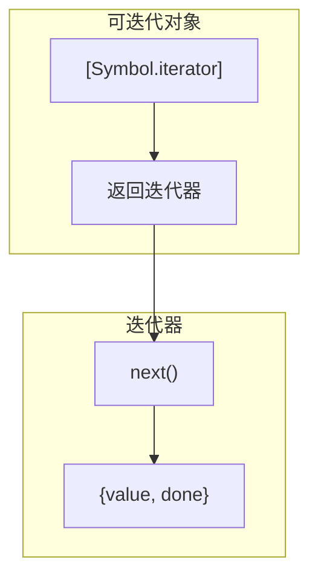

# 迭代器与生成器

## 1. 迭代器协议与可迭代协议



### 1.1 for...of vs for...in

```javascript
const arr = [10, 20, 30];
arr.custom = 'hi';

for (let i in arr) { console.log(i); }  // 0, 1, 2, custom（索引+自定义属性）
for (let v of arr) { console.log(v); }  // 10, 20, 30（值）

// for...of 原理：调用 [Symbol.iterator]()
const iterator = arr[Symbol.iterator]();
console.log(iterator.next()); // {value: 10, done: false}
console.log(iterator.next()); // {value: 20, done: false}
console.log(iterator.next()); // {value: 30, done: false}
console.log(iterator.next()); // {value: undefined, done: true}
```

## 2. 给 Object 添加迭代器

```javascript
// 普通 Object 默认不可迭代（for...of 报错）
const obj = { a: 1, b: 2, c: 3 };

// 方法1：Generator 函数
obj[Symbol.iterator] = function* () {
  for (const key of Object.keys(this)) {
    yield [key, this[key]];
  }
};
for (const [k, v] of obj) { console.log(k, v); } // a 1, b 2, c 3

// 方法2：类上定义（用于 class）
class OrderedMap {
  constructor() { this.items = {}; this.keys = []; }
  set(k, v) {
    if (!this.items[k]) this.keys.push(k);
    this.items[k] = v;
  }
  *[Symbol.iterator]() {
    for (const key of this.keys) {
      yield [key, this.items[key]];
    }
  }
}
```

## 3. 生成器函数（Generator）

```javascript
// Generator：function*，调用不执行，返回迭代器
// 每次 .next() 执行到下一个 yield，暂停

function* createRange(start, end) {
  for (let i = start; i <= end; i++) {
    yield i;
  }
}

const range = createRange(1, 5);
console.log(range.next());   // {value: 1, done: false}
console.log(range.next());   // {value: 2, done: false}
console.log(range.next());   // {value: 3, done: false}
console.log(range.next());   // {value: 4, done: false}
console.log(range.next());   // {value: 5, done: false}
console.log(range.next());   // {value: undefined, done: true}

// 生成器实现斐波那契数列（惰性求值，内存高效）
function* fibonacci() {
  let [a, b] = [0, 1];
  while (true) {
    yield a;
    [a, b] = [b, a + b];
  }
}

// 取前10个斐波那契数，不需要生成整个数组
const fib = fibonacci();
for (let i = 0; i < 10; i++) {
  console.log(fib.next().value); // 0, 1, 1, 2, 3, 5, 8, 13, 21, 34
}

// yield* 委托另一个迭代器
function* gen1() { yield 1; yield 2; }
function* gen2() { yield* gen1(); yield 3; }
// 等价于：yield 1; yield 2; yield 3;

// next(val) 向 yield 传值
function* counter() {
  let n = 0;
  while (true) {
    const input = yield ++n; // yield 暂停，返回 n+1，下次 next(input) 给 input
    if (input === 'reset') n = 0;
  }
}
const it = counter();
console.log(it.next().value);         // 1
console.log(it.next().value);         // 2
console.log(it.next('reset').value);  // 1（reset 后 n=0，yield 返回 ++n=1）
```

## 4. 异步迭代器（Async Iterator）

```javascript
// 同步迭代器：next() 返回 { value, done }
// 异步迭代器：next() 返回 Promise<{ value, done }>

// 手写异步迭代器（模拟分页 API）
const createAsyncIterator = (urls) => ({
  urls,
  index: 0,
  [Symbol.asyncIterator]() {
    return {
      next: () => {
        if (this.index >= this.urls.length) {
          return Promise.resolve({ value: undefined, done: true });
        }
        return fetch(this.urls[this.index++])
          .then(r => r.json())
          .then(data => ({ value: data, done: false }));
      }
    };
  }
});

// 使用 for await...of 遍历
async function fetchAllPages() {
  const iterator = createAsyncIterator([
    '/api/users?page=1',
    '/api/users?page=2',
    '/api/users?page=3',
  ]);

  for await (const user of iterator) {
    console.log(user);
  }
}

// 异步生成器（ES2018）：async function*，更简洁
async function* fetchUsers() {
  let page = 1;
  while (page <= 10) {
    const res = yield fetch(`/api/users?page=${page}`).then(r => r.json());
    const data = await res;
    if (data.isLastPage) break;
    page++;
  }
}

// 或者：
async function* asyncGen() {
  yield await fetch('/api/1').then(r => r.json());
  yield await fetch('/api/2').then(r => r.json());
}

async function main() {
  for await (const item of asyncGen()) {
    console.log(item);
  }
}
```

## 5. 实用场景

```javascript
// 场景1：实现无限序列（惰性求值）
function* infiniteSequence(start = 0) {
  let i = start;
  while (true) yield i++;
}

// 场景2：分页数据流
async function* paginatedFetch(fetchPage) {
  let page = 1;
  while (true) {
    const data = await fetchPage(page);
    if (!data.items.length) break;
    yield data.items;
    page++;
  }
}

// 场景3：流式处理管道
function* pipeline(source) {
  for (const item of source) {
    const processed = item.filter(x => x > 0).map(x => x * 2);
    yield* processed;
  }
}
```

## 6. 常见陷阱与最佳实践

| 陷阱 | 说明 | 解决方案 |
|------|------|---------|
| 生成器未调用 `.next()` | 生成器惰性，`.next()` 之前不执行任何代码 | 确认何时开始消费值 |
| `for...of` 遍历无限生成器 | 导致无限循环 | 用 `.take()` 或限制次数 |
| 在普通函数中用 `yield` | SyntaxError: yield 只能在 Generator 中使用 | 确认函数用 `function*` 声明 |
| 异步生成器与 `Promise.all` | 异步生成器每次 yield 一个 Promise | 用 `Promise.all([...])` 收集多批次结果 |
| Generator 和 Observable 混淆 | Generator 是同步拉取，Observable 是异步推送 | 根据场景选择：Generator 适合同步/确定数据流，Observable 适合异步/事件流 |

## 7. 面试追问

**Q1: `for await...of` 的原理是什么？**
`for await...of` 调用对象的 `[Symbol.asyncIterator]()` 获取异步迭代器，然后反复调用 `.next()`（返回 Promise），等待 Promise resolve 后取出 `{ value, done }`，在 done 为 true 时停止。

**Q2: Generator 的 `return()` 和 `throw()` 有什么用？**

```javascript
function* gen() {
  yield 1;
  yield 2;
  yield 3;
}

const g = gen();
g.next();        // {value: 1, done: false}
g.return('stopped'); // {value: 'stopped', done: true}（提前结束）
g.next();        // {value: undefined, done: true}

function* gen2() {
  try { yield 1; }
  catch (e) { console.log('caught:', e.message); }
  yield 2;
}
const g2 = gen2();
g2.next();               // {value: 1}
g2.throw(new Error('oops')); // 向当前 yield 位置抛异常，caught: oops
```

**Q3: 如何用生成器实现一个 `take` 函数（从迭代器取前 n 个）？**

```javascript
function take(iterable, n) {
  return {
    [Symbol.iterator]() {
      const iterator = iterable[Symbol.iterator]();
      let i = 0;
      return {
        next() {
          if (i++ < n) {
            const { value, done } = iterator.next();
            return { value, done };
          }
          return { value: undefined, done: true };
        }
      };
    }
  };
}

// 使用
const nums = take(infiniteSequence(1), 5);
[...nums]; // [1, 2, 3, 4, 5]
```

## 8. 精简回顾：迭代器与生成器速记版

### 8.1 for...in vs for...of

```javascript
// for...in：遍历键（可枚举属性，包括原型链）
// for...of：遍历值（需要迭代器）

const arr = [10, 20, 30];
arr.custom = "hi"; // 数组也有自定义属性

for (let i in arr) { console.log(i); }  // 0,1,2,custom（索引+自定义属性）
for (let v of arr) { console.log(v); }  // 10,20,30（值）

// for...of原理：调用[Symbol.iterator]()
const iterator = arr[Symbol.iterator]();
console.log(iterator.next()); // {value:10, done:false}
console.log(iterator.next()); // {value:20, done:false}
console.log(iterator.next()); // {value:30, done:false}
console.log(iterator.next()); // {value:undefined, done:true}

// 可迭代对象（Iterable）：实现了Symbol.iterator
// 内置：Array, String, NodeList, Map, Set, TypedArray, arguments, DOM DOMTokenList
// 普通Object默认不可迭代，但可用for...in

// 给Object添加迭代器（使其可for...of）：
const obj = { a: 1, b: 2, c: 3 };
obj[Symbol.iterator] = function* () {
  for (const key of Object.keys(this)) {
    yield [key, this[key]];
  }
};
for (const [k, v] of obj) { console.log(k, v); }

// for...of可以用break/continue/return/throw
// 生成器实现迭代器：
function* createRange(start, end) {
  for (let i = start; i <= end; i++) {
    yield i;
  }
}
for (const n of createRange(1, 5)) { console.log(n); } // 1,2,3,4,5

// yield*：委托另一个迭代器
function* gen1() { yield 1; yield 2; }
function* gen2() { yield* gen1(); yield 3; }
// 等价于：yield 1; yield 2; yield 3;
```

## 深入阅读与参考

!!! tip "怎么用这些资料"
    先读「官方文档与规范」建立准确的概念，再读「源码与示例」核对细节，最后用「教程、书籍与视频」换一种讲法加深理解。每条都写明了读哪一节、带着什么问题读。

### 官方文档与规范

| 资源 | 为什么读 | 怎么读 |
|---|---|---|
| [Symbol.iterator](https://developer.mozilla.org/en-US/docs/Web/JavaScript/Reference/Global_Objects/Symbol/iterator) | 可迭代协议的唯一入口，讲清 Symbol.iterator 返回迭代器的约定。 | 读描述与示例，确认返回值必须带 next；给自己的类实现 [Symbol.iterator]。 |
| [Iterator](https://developer.mozilla.org/en-US/docs/Web/JavaScript/Reference/Global_Objects/Iterator) | 迭代器协议权威说明，含 next 返回结构与迭代器辅助方法入口。 | 对照协议检查自定义迭代器；略读辅助方法列表，记下常用的 toArray、forEach。 |
| [Generator](https://developer.mozilla.org/en-US/docs/Web/JavaScript/Reference/Global_Objects/Generator) | 生成器对象全貌：next/return/throw 与可迭代性一页说清。 | 读实例方法与示例，动手验证生成器对象同时是迭代器与可迭代对象。 |
| [Generator.prototype.next()](https://developer.mozilla.org/en-US/docs/Web/JavaScript/Reference/Global_Objects/Generator/next) | next() 是迭代协议核心，讲透 {value, done} 与传参语义。 | 重点读参数如何成为 yield 的返回值，写一个带 next(值) 的计数器验证。 |
| [Generator.prototype.return()](https://developer.mozilla.org/en-US/docs/Web/JavaScript/Reference/Global_Objects/Generator/return) | return() 关系到提前退出与资源清理，是常见陷阱高频点。 | 读示例中的 finally 行为，用 for...of 中 break 验证生成器清理是否执行。 |
| [Generator.prototype.throw()](https://developer.mozilla.org/en-US/docs/Web/JavaScript/Reference/Global_Objects/Generator/throw) | throw() 说明错误如何注入生成器，与 try/catch 配合理解。 | 读示例后手写生成器内 try/catch 包住 yield，观察 throw() 后的 done 与 value。 |
| [async function*](https://developer.mozilla.org/en-US/docs/Web/JavaScript/Reference/Statements/async_function*) | 异步生成器的规范写法，async function* 与 for await 的对应关系。 | 读语法与示例，把普通生成器改造成 async function* 并配 for await 消费。 |
| [async function](https://developer.mozilla.org/en-US/docs/Web/JavaScript/Reference/Statements/async_function) | 异步迭代常与 async 函数配合，先弄清 async 返回值与错误传播。 | 读描述与返回值一节，明确 async 函数总返回 Promise 后再看 async function*。 |
| [Iterator.prototype.toArray()](https://developer.mozilla.org/en-US/docs/Web/JavaScript/Reference/Global_Objects/Iterator/toArray) | toArray 是迭代器辅助方法里最实用者，展示惰性转数组的写法。 | 读示例，用 Iterator.from 包一个可迭代对象后调 toArray 验证。 |
| [Iterator.prototype.forEach()](https://developer.mozilla.org/en-US/docs/Web/JavaScript/Reference/Global_Objects/Iterator/forEach) | forEach 演示辅助方法如何复用迭代协议，可与数组方法对照。 | 读示例并与 Array.prototype.forEach 对比，注意其惰性求值特性。 |
| [Iterator.prototype[Symbol.dispose]()](https://developer.mozilla.org/en-US/docs/Web/JavaScript/Reference/Global_Objects/Iterator/Symbol.dispose) | Symbol.dispose 说明迭代器如何配合 using 做确定性清理。 | 读描述与示例，思考生成器提前 return 时资源释放的等价写法。 |

### 教程、书籍与视频

| 资源 | 为什么读 | 怎么读 |
|---|---|---|
| [MDN 迭代器与生成器](https://developer.mozilla.org/en-US/docs/Web/JavaScript/Guide/Iterators_and_generators) | 一页串起迭代协议、生成器与 for...of，示例可运行，最适合入门。 | 先读迭代协议与生成器两节，再用生成器写惰性分页读取器并 for await 消费。 |
| [现代 JavaScript 教程：异步](https://zh.javascript.info/async) | 异步迭代的前置知识：Promise 与 async/await 讲得循序渐进。 | 学异步迭代器前，先做完 Promise 与 async/await 两节的练习。 |

## 应用与行业实践

### 应用场景地图

| 场景 | 用到本页哪个知识点 | 典型技术选型 | 注意事项 |
|:--|:--|:--|:--|
| 后台管理的万行表格（订单列表） | 异步迭代器 + 生成器函数 | `fetch` + 游标分页 + `for await...of` | 排序筛选放服务端，否则要等全量 |
| 低端安卓的首屏加载（信息流） | 异步迭代器消费 `ReadableStream` | Web Streams + 异步生成器 | 分块边界不等于记录边界，要缓冲拼行 |
| 多人协作白板的操作回放 | 生成器函数 + `next(value)` 注入 | 自写回放器或 redux-saga | 生成器只能顺序前进，随机跳转要另存快照 |
| 几个 GB 的 Nginx 日志按行统计 | 异步迭代器 + 生成器管道 | Node.js `readline` + `createReadStream` | 不要 `readFileSync`，会一次性占满内存 |
| 拉取第三方 API 的所有分页数据 | 异步生成器封装分页 | `async function*` + 退避重试 | 速率限制要处理，命中后按 Header 等待 |
| ETL 的逐条转换链 | 生成器管道（每级一个生成器） | 自写 `pipe` 或 Node.js `pipeline` | 每级只做一件事，错误向上冒泡 |
| 表单校验的短路执行 | 迭代器协议 + `return()` | 校验器数组 + `for...of` | 第一个失败就退出，后面的校验器不再跑 |
| 树形权限菜单的深度优先遍历 | 生成器递归 + `yield*` 委托 | 前端组件树或后端权限树 | 递归生成器要处理环，避免死循环 |
| 无限滚动列表的 ID 生成 | 生成器函数产出序列 | 自写 `idGenerator()` | 需要可复现时固定种子，不要用随机 |

### 三个场景拆解

#### 场景 1：后台管理的万行表格

**业务背景**：运营后台的订单列表一屏要展示几万行，接口一次性返回全部数据时，浏览器在收到完整响应前不渲染任何一行。数据量直接读接口返回数组的 `length`，把行数翻倍再观察页面挂起时间的走向。

**怎么用本页知识解决**：把「取数」写成一个异步生成器，每次 `yield` 交付一页；调用方拿到一页就追加渲染，离开页面时用 `return()` 停掉后续请求。

```js
async function* fetchRows(url, pageSize = 200) {
  let cursor = 0;
  while (true) {
    const res = await fetch(`${url}?cursor=${cursor}&size=${pageSize}`);
    const { rows, next } = await res.json();
    if (rows.length === 0) return;      // 空页说明到底了，结束迭代
    yield rows;                         // 交付一页，调用方立即渲染
    if (!next) return;                  // 服务端没有下一页，主动收尾
    cursor = next;                      // 更新游标，准备下一轮
  }
}

const it = fetchRows('/api/orders');
for await (const rows of it) {
  appendToTable(rows);                  // 每页到达就追加，首屏不等全量
  if (userScrolledAway()) { await it.return(); break; } // 离开就停
}
```

- `async function*` 让一次 `yield` 对应一次网络往返，调用方拿到一页就能画一页。
- `return` 出现在空页和没有下一页两处，避免多发一次无意义的请求。
- `for await...of` 串行等待每一页，形成背压，不会同时打出多页请求。
- `it.return()` 让生成器在挂起点退出，写在 `finally` 里的清理逻辑会执行。
- 生成器只管取数，排序和筛选交给服务端，否则还得等全量到齐。

**怎么度量收益**：看首屏首行绘制时间（在渲染前后各打一次 `performance.now()`）、`PerformanceObserver` 的 `largest-contentful-paint`、Performance 面板录制的长任务时长、Memory 面板的堆快照大小。测量方法：同一份数据集分别用「一次性加载」和「分页迭代」录制两次，对比同一指标。

**什么时候不该用**：
- 数据总量小于一屏（例如二十行以内），一次请求的往返成本低于分批。
- 页面需要在客户端做全量排序或统计，任何一页的数据都不够算出全局结果。
- 服务端接口没有游标或分页参数，只能整体返回。

#### 场景 2：低端安卓的首屏加载

**业务背景**：信息流页面在千元安卓机上打开，HTML 和接口数据都到齐后才开始渲染，用户先看到白屏。数据量按首屏卡片数和响应体字节数衡量，用 DevTools 的网络节流复现。

**怎么用本页知识解决**：服务端按块下发，前端用异步生成器读取 `ReadableStream`，每拿到一个完整的块就渲染一批卡片。

```js
async function* readChunks(resp) {
  const reader = resp.body.getReader();
  const dec = new TextDecoder();
  try {
    while (true) {
      const { done, value } = await reader.read();
      if (done) return;                        // 流结束，生成器收尾
      yield dec.decode(value, { stream: true }); // 保留被切断的多字节字符
    }
  } finally {
    reader.releaseLock();                      // break 或正常结束都要解锁
  }
}

for await (const text of readChunks(await fetch('/feed'))) {
  renderPartial(text);                         // 每块到达就渲染一批卡片
}
```

- `resp.body.getReader()` 拿到底层读取器，`read()` 每次只返回一块，不在内存里缓存整个响应。
- `TextDecoder` 的 `{ stream: true }` 负责跨块拼接，避免中文被切断后变乱码。
- `try/finally` 保证调用方 `break` 时 `releaseLock()` 一定执行，连接被释放。
- 分块边界和记录边界不一致，拼行要在调用方用缓冲做。
- 消费端代码形态和同步遍历一致，改动集中在渲染入口。

**怎么度量收益**：看首次内容绘制（`PerformanceObserver` 订阅 `paint`）、首字节时间（`PerformanceResourceTiming.responseStart`）、长任务数量（`PerformanceObserver` 订阅 `longtask`）。测量方法：网络面板选 Slow 4G，Performance 面板把 CPU 降速 4 倍，分别录制「等全量」和「分块渲染」两次。

**什么时候不该用**：
- 响应体必须完整解析才能用，半截 JSON 无法交给 `JSON.parse`。
- 中间网关或 CDN 会把响应缓冲完再下发，块到达前端时已经没有时间差。
- 首屏依赖同一张大图下载完成，文本块先到也改变不了首次布局的时间点。

#### 场景 3：多人协作白板的操作回放

**业务背景**：白板保存了完整操作历史，需要支持暂停、单步、跳过，还要能从头回看整个过程。历史条数从会话记录的数组长度直接读出，量级随会议时长线性增长。

**怎么用本页知识解决**：把回放写成生成器，`yield` 交出当前状态，调用方用 `next(value)` 把控制指令送回生成器内部。

```js
function* replay(ops) {
  let state = initBoard();
  try {
    for (const op of ops) {
      state = apply(state, op);
      const cmd = yield state;      // 交出状态，等待外部指令
      if (cmd === 'skip') continue; // 外部要求跳过，直接进下一轮
      if (cmd === 'stop') return state;
    }
  } finally {
    clearTimers();                  // 提前退出也要清理
  }
  return state;
}

const it = replay(history);
it.next();          // 回放第一步，拿到状态去绘制
it.next('skip');    // 注入指令，跳过下一条操作
it.return();        // 停止回放并触发 finally
```

- 生成器在 `yield state` 处挂起，调用方拿到状态用来绘制画面。
- `it.next('skip')` 把指令送进生成器，成为 `yield` 表达式的返回值。
- 暂停不需要额外的状态机：不调用 `next` 就是暂停。
- `it.return()` 从当前挂起点结束生成器，`finally` 里的计时器清理会执行。
- 顺序前进是生成器的固有性质，随机跳转要靠另存的状态快照配合。

**怎么度量收益**：看单步回放耗时（`next` 调用前后的 `performance.now()` 差值）、回放期间的长任务数量（`PerformanceObserver` 订阅 `longtask`）、内存占用（Memory 面板堆快照）。测量方法：对同一份操作记录跑一次完整回放，记录每次 `next` 的耗时分布。

**什么时候不该用**：
- 需要随机访问任意时间点，生成器只能顺序推进，得按固定间隔存状态快照。
- 操作需要在多个 Worker 里并行执行，生成器是单线程顺序模型。
- 回放要长期驻留并反复回退，把历史压成不可变的 reducer 状态更合适。

### 行业先进实践

**可读流的异步迭代（出处：Node.js 官方文档 Stream 章节）**。`stream.Readable` 实现了 `Symbol.asyncIterator`，可以直接用 `for await...of` 消费；`readline` 模块创建的接口同样是异步可迭代对象。这样做把背压交给流的内部缓冲，不用手写 `data`/`pause`/`resume` 状态机。你的项目在读取大文件或上游 HTTP 响应时，用 `for await` 替代事件监听。

**迭代器协议里的 `return()` 清理（出处：MDN Web Docs《Iteration protocols》）**。该文档写明：`for...of` 因 `break`、`throw` 或 `return` 提前退出时，会调用迭代器的 `return()` 方法。据此可以把连接释放、锁释放、计时器清理放进 `finally`。给自定义集合写 `[Symbol.iterator]()` 时，把 `return()` 一起实现。

**增强生成器充当协程（出处：Python PEP 342《Coroutines via Enhanced Generators》）**。PEP 342 让 `yield` 从单向产出变成双向通道，`send()` 可以把值送回生成器内部，后来的异步框架建立在这个机制之上。写回放器或流程控制时，用「`yield` 交状态、调用方回传指令」的模式，比手写状态枚举少一层分支。

**用生成器描述副作用流程（出处：redux-saga 官方文档）**。redux-saga 用生成器函数编写异步流程，每个 `yield` 交给 middleware 执行，因此流程可以在测试里逐步 `next()` 断言，不用发真实网络请求。借鉴点是把「流程描述」和「流程执行」分开，测试只测描述部分。

**编译目标与迭代语法（出处：TypeScript 官方文档 tsconfig 参考的 `downlevelIteration` 选项）**。当 `target` 编译到 ES5 时，`for...of`、展开运算符、`yield*` 需要开启 `downlevelIteration` 才会按迭代协议转换，否则数组遍历会被改写成索引循环。发布库之前，把不同的 `target` 与 `downlevelIteration` 组合各跑一遍测试。

### 从学到用：落地路线

1. **试点**：挑一个只读、数据量可控的功能（后台列表页或日志查看器），把取数改成异步生成器。验收标准：新代码路径有单元测试，测试里用假数据手动 `next()` 断言每一页。
2. **验证**：在同一台设备、同一份数据上做改造前和改造后两次录制。验收标准：Performance 面板的录制文件与指标对比表写进 PR 描述。
3. **推广**：把取数逻辑抽成共享的异步生成器工具函数。验收标准：仓库内不再出现手写的分页 `while` 加数组拼接，工具函数被两个以上调用方复用。
4. **防回退**：加 ESLint 规则或 CI 检查，拦住渲染路径里的全量接口等待。验收标准：故意引入一次回归时 CI 能拦住，并附有对应测试用例。

### 动手作业

**目标**：写一个异步分页迭代器，并用它驱动一个列表的分块渲染。

**步骤**：
1. 用本地 Node 脚本模拟分页接口 `/items?cursor=&size=`，返回 `{ items, next }`。
2. 写 `async function* paginate(url, size)`，按游标翻页，空数组或 `next` 为 `null` 时结束。
3. 在生成器里加 `try/finally`，`finally` 中打印一行日志，用来观察退出时机。
4. 写消费端：`for await` 逐页取数，每页追加到数组并渲染。
5. 手动调用 `it.return()` 中断消费，确认日志打印，且没有后续请求。
6. 统计请求次数与耗时，分别跑「一次拿全量」和「分页迭代」两次。
7. 用假 `fetch` 返回固定页数据，逐步 `next()` 断言每页内容与结束条件。

**验收标准**：
- 消费到最后一页时生成器返回 `{ done: true }`，请求次数等于页数。
- 中途 `return()` 之后没有新的网络请求，用假 `fetch` 的调用次数断言。
- `finally` 里的清理日志在正常结束和提前退出两种情况下都出现。
- 整套测试在不联网的环境下通过。
- README 里记录两次测量的工具、步骤和指标数值。

