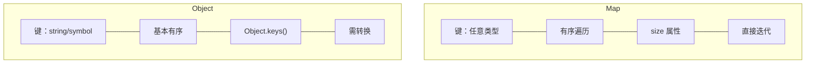
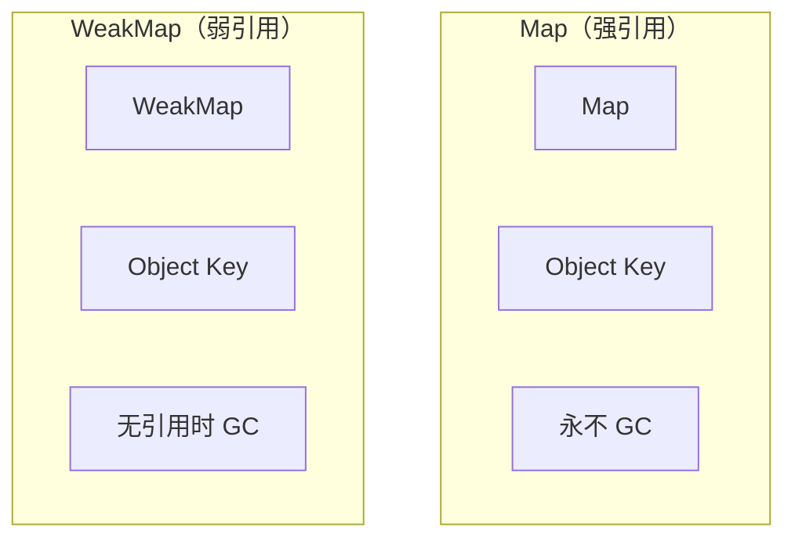
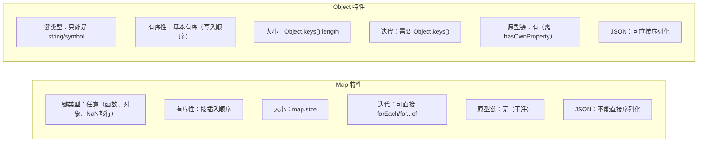

# Map、Set 与 WeakMap、WeakSet

## 1. 概念与内存模型



## 2. Map vs Object

| 特性 | Map | Object |
|------|-----|--------|
| 键类型 | 任意（对象、函数、NaN 等） | 只能是 string 或 symbol |
| 有序性 | 按插入顺序严格遍历 | 基本有序（非确定性） |
| 大小 | `map.size` | `Object.keys(obj).length` |
| 迭代 | 直接 `for...of` / `.forEach()` | 需要 `Object.keys()` |
| 性能 | 插入/删除 O(1)，键为对象时更快 | 插入/删除 O(1)（但有额外开销） |
| 原型链 | 无默认原型（可选 Map[Symbol.hasInstance]） | 有（需 `hasOwnProperty`） |
| JSON | 不能直接序列化 | 可以 `JSON.stringify()` |
| 使用场景 | 键值对集合、字典、图结构 | 配置对象、DTO、建模实体 |

```javascript
// Map 键可以是任意类型
const cache = new Map();
const keyObj = { id: 1 };
cache.set(keyObj, 'user data');
console.log(cache.get(keyObj)); // 'user data'

// NaN 可以作为键（Map 用 SameValueZero 比较）
const m = new Map();
m.set(NaN, 'not a number');
m.get(NaN);               // 'not a number'
m.get(Number.NaN);         // 'not a number'（SameValueZero）

// Map 可直接迭代
const m = new Map([['a', 1], ['b', 2]]);
for (const [k, v] of m) { console.log(k, v); }       // a 1, b 2
m.forEach((v, k) => console.log(k, v));              // a 1, b 2
[...m.entries()];   // [['a',1],['b',2]]
[...m.keys()];      // ['a', 'b']
[...m.values()];    // [1, 2]
```

## 3. Set vs Array

| 特性 | Set | Array |
|------|-----|--------|
| 唯一性 | 自动去重 | 可能有重复 |
| 查找性能 | `O(1)`（`.has()`） | `O(n)`（`.includes()`） |
| 添加/删除 | `O(1)` | `O(n)`（中间位置） |
| 天然适合去重 | `[...new Set(arr)]` | `[...new Set(arr)]` |
| 有序性 | 按插入顺序 | 按索引顺序 |

```javascript
// 数组去重（Set 的经典用法）
const arr = [1, 2, 2, 3, 3, 3, NaN, NaN, {}, {}];
[...new Set(arr)];                    // [1, 2, 3, NaN, {}, {}]（NaN 可去重，{} 不行因为引用不同）
[...new Set(arr)].length === 5;       // true

// Set 的 .has 比 Array 的 .includes 快（大数据集时差距明显）
// 大数组查找：Set O(1) vs Array O(n)
const largeArr = Array.from({ length: 100000 }, (_, i) => i);
const largeSet = new Set(largeArr);
largeSet.has(99999);   // O(1)，快
largeArr.includes(99999); // O(n)，慢
```

## 4. WeakMap / WeakSet 与垃圾回收

这是 Map/Set 最重要的区别：**弱引用**。当唯一剩余的引用是 WeakMap/WeakSet 对键的弱引用时，键对象可以被垃圾回收。



### 4.1 WeakMap vs Map

| 特性 | WeakMap | Map |
|------|---------|-----|
| 键类型 | **只能是对象**（非 null） | 任意类型 |
| 弱引用 | 键是弱引用（可 GC） | 强引用（不可 GC） |
| 迭代 | **不可迭代**（`.size`/`.forEach()` 等不可用） | 可迭代 |
| 内存 | 键对象无其他引用时自动被回收 | 需手动 `.delete()` 才能释放 |
| 使用场景 | 私有属性、DOM 数据关联、缓存 |

```javascript
// WeakMap 三大经典应用场景：

// 场景1: 私有属性（不污染对象，不阻止 GC）
const privateData = new WeakMap();

class User {
  constructor(name, age) {
    privateData.set(this, { name, age }); // this 作为键
  }
  getName() { return privateData.get(this).name; }
  getAge() { return privateData.get(this).age; }
}
// User 实例无其他引用时，privateData 中的条目自动消失

// 场景2: 缓存计算结果（key 为对象，内存自动回收）
const computeCache = new WeakMap();
function processData(dataObj) {
  if (computeCache.has(dataObj)) {
    return computeCache.get(dataObj); // 命中缓存
  }
  const result = heavyComputation(dataObj);
  computeCache.set(dataObj, result);
  return result;
}
// dataObj 无外部引用时，被 GC 回收，缓存条目自动消失

// 场景3: DOM 节点关联元数据（不阻止 DOM GC）
const elementMetadata = new WeakMap();
function tagElement(el, meta) { elementMetadata.set(el, meta); }
function getMeta(el) { return elementMetadata.get(el); }
// DOM 元素从页面移除后，elementMetadata 中对应的条目自动消失
```

### 4.2 WeakSet vs Set

| 特性 | WeakSet | Set |
|------|---------|-----|
| 存储内容 | **只能是对象** | 任意类型 |
| 弱引用 | 成员是弱引用（可 GC） | 强引用（不可 GC） |
| 迭代 | 不可迭代 | 可迭代 |

```javascript
// WeakSet 场景：标记对象（"已访问"标记）
const visited = new WeakSet();

function dfs(node) {
  if (visited.has(node)) return; // 已访问过，跳过
  visited.add(node);              // 标记
  // 访问 node...
  node.children.forEach(child => dfs(child));
}
// 无需担心内存泄漏：访问过的节点无其他引用时被 GC，WeakSet 条目自动消失

// 对比：用普通 Set 标记的话，节点被访问后 Set 仍持有引用
// const visited = new Set();
// visited.add(node); // 节点永远在 Set 中，无法 GC
```

## 5. 常见陷阱与最佳实践

| 陷阱 | 说明 | 解决方案 |
|------|------|---------|
| Map 键比较用 SameValueZero | `NaN === NaN` 为 false，但 Map 中 `m.set(NaN, v)` 后 `m.get(NaN)` 能获取到 | 了解 SameValueZero 语义 |
| 用 Object 模拟字典 | 对象作为键需要 `{} !== {}`，需用额外的 Map | 始终用 Map 作为字典数据结构 |
| WeakMap 不能迭代 | 无法用 `.forEach()` 或 `for...of` | 如果需要迭代，不要用 WeakMap |
| Set 去重对象引用 | `{a:1}` 和 `{a:1}` 是不同引用，Set 都会保留 | 需要自定义去重逻辑（比较字段） |
| Map 的 JSON 序列化 | Map 不能直接 `JSON.stringify()` | 用 `Object.fromEntries(map)` 或手动序列化 |

## 6. 面试追问

**Q1: WeakMap 为什么键只能是对象，不能是基本类型？**
GC 需要追踪"对象的引用"，而基本类型（如字符串、数字）不存在于堆中，不涉及引用计数。如果允许基本类型作为键，GC 无法判断何时回收。设计为对象键确保只要对象在其他地方还有强引用，WeakMap 中的条目就保留；对象失去外部引用后，条目自动消失。

**Q2: WeakMap/WeakSet 的迭代器为什么设计为不可用？**
因为迭代过程中，如果遍历到的对象刚好没有其他强引用，GC 可能回收它，导致集合大小在迭代中变化，产生不确定行为。这是设计上的有意取舍：用弱引用特性换迭代能力。

**Q3: Map 和 Object 的性能差异在哪里？**
V8 中，对象属性的读写经过 Hidden Class + 内联缓存优化，理论上 O(1)。Map 在键为对象时更快（不需要将对象序列化为字符串），且 `.has()`/`.delete()` 比 `hasOwnProperty` + `delete obj[key]` 更直接。实际使用中，Map 在需要频繁增删键值对的场景（如实现 LRU 缓存）性能更稳定。

## 7. 精简回顾：Map 与 Set 速记版

```javascript
// Map vs Object：
const map = new Map();
map.set({}, 1);  // 对象作为键，===比较，{} !== {}
map.set(NaN, 2);
console.log(map.get(NaN)); // 2
console.log(map.size); // 2

// Set vs Array：
const set = new Set([1, 2, 2, 3]);
console.log([...set]); // [1, 2, 3]

// WeakMap vs Map（关键区别：弱引用）：
// WeakMap：键只能是对象，值可以是任意类型
// 当键对象（弱引用）没有被其他引用时，可以被GC回收

// WeakMap应用场景：
// 1. 私有属性（不阻止对象被GC）
class Person {
  #data = new WeakMap();
  constructor(name) { this.#data.set(this, { name }); }
  getName() { return this.#data.get(this).name; }
}
// 对象被回收后，WeakMap中的条目也消失

// 2. 缓存计算结果（缓存key为对象）
const cache = new WeakMap();
function process(obj) {
  if (cache.has(obj)) return cache.get(obj);
  const result = heavyComputation(obj);
  cache.set(obj, result);
  return result;
}

// 3. DOM节点关联数据（不阻止DOM被GC）
const domData = new WeakMap();
domData.set(document.body, { mark: "special" });

// WeakSet：只能存对象，存的值弱引用，不阻止GC
// 应用：标记对象（"已访问过"标记）
const visited = new WeakSet();
function dfs(node) {
  if (visited.has(node)) return;
  visited.add(node);
  // 访问node...
}
```



## 深入阅读与参考

!!! tip "怎么用这些资料"
    先读「官方文档与规范」建立准确的概念，再读「源码与示例」核对细节，最后用「教程、书籍与视频」换一种讲法加深理解。每条都写明了读哪一节、带着什么问题读。

### 官方文档与规范

| 资源 | 为什么读 | 怎么读 |
|---|---|---|
| [WeakMap](https://developer.mozilla.org/en-US/docs/Web/JavaScript/Reference/Global_Objects/WeakMap) | WeakMap 概念总览，弱引用语义与不可枚举设计的权威出处 | 读 Description 与「Why WeakMap」示例，确认键必须是对象；读完用 WeakMap 缓存 DOM 节点并验证回收。 |
| [WeakMap.prototype.set()](https://developer.mozilla.org/en-US/docs/Web/JavaScript/Reference/Global_Objects/WeakMap/set) | 明确 set 只接受对象键、且返回 this 支持链式调用 | 读 Parameters 与 Exceptions 两节；读完写 try/catch 验证传入字符串键时的报错。 |
| [WeakMap.prototype.get()](https://developer.mozilla.org/en-US/docs/Web/JavaScript/Reference/Global_Objects/WeakMap/get) | get 对已回收或不存在键返回 undefined，是弱引用的直接体现 | 与 has 对照读 Examples；读完实现一个按对象查缓存的取值函数。 |
| [WeakMap.prototype.has()](https://developer.mozilla.org/en-US/docs/Web/JavaScript/Reference/Global_Objects/WeakMap/has) | 确认键是否仍存活，理解 WeakMap 为何不提供 size 与遍历 | 读 Description 中关于不可枚举的说明；读完写出先 has 再更新的缓存逻辑。 |
| [WeakMap.prototype.delete()](https://developer.mozilla.org/en-US/docs/Web/JavaScript/Reference/Global_Objects/WeakMap/delete) | 手动清除弱引用条目的唯一手段，配合 GC 语义理解其定位 | 读 Return value 与示例；读完对比 delete 前后 has 与 get 的返回差异。 |
| [TypeError: WeakSet key/WeakMap value 'x' must be an object or an unregistered symbol](https://developer.mozilla.org/en-US/docs/Web/JavaScript/Reference/Errors/Key_not_weakly_held) | 把「键必须是对象或未注册 Symbol」这条规则落到具体报错上 | 看报错信息与触发示例；读完整理出 WeakMap/WeakSet 的合法键类型清单。 |
| [Map.prototype.set()](https://developer.mozilla.org/en-US/docs/Web/JavaScript/Reference/Global_Objects/Map/set) | Map 键可为任意类型且保留插入顺序，是 Map vs Object 的起点 | 重点读键相等性 SameValueZero 的说明；读完测试 NaN、对象、字符串数字键的行为差别。 |
| [Object initializer](https://developer.mozilla.org/en-US/docs/Web/JavaScript/Reference/Operators/Object_initializer) | 对象字面量的键规则与原型链风险，作为 Map 的对照面 | 读 Computed property names 与 __proto__ 相关小节；读完列出必须改用 Map 的场景。 |
| [Array.prototype.map()](https://developer.mozilla.org/en-US/docs/Web/JavaScript/Reference/Global_Objects/Array/map) | 同名不同义的最大混淆源：它是数组方法，与 Map 类型无关 | 只读开头定义与回调参数；读完在搜索时主动加上 Map 或 Array 限定词。 |
| [`<map>` HTML image map element](https://developer.mozilla.org/en-US/docs/Web/HTML/Reference/Elements/map) | 搜索 map 时的另一歧义：HTML 图像映射元素而非 JS 集合 | 扫一眼定义与示例；读完能区分文档路径 Elements/map 与 Global_Objects/Map。 |
| [Array](https://developer.mozilla.org/en-US/docs/Web/JavaScript/Reference/Global_Objects/Array) | Set vs Array 对比的基准：数组有序、可索引但查找成本更高 | 读 Description 与索引、length 说明；读完把一段去重代码从数组改写为 Set 并对比。 |

## 应用与行业实践

### 应用场景地图

| 场景 | 用到本页哪个知识点 | 典型技术选型 | 注意事项 |
| --- | --- | --- | --- |
| 后台管理的万行表格：勾选行、批量删除、翻页保留勾选 | Set 存选中 id、Map 存 id 到行数据 | Set、Map、虚拟滚动库 | 键用字符串 id，不要用行对象，行对象重建后引用就变了 |
| 低端安卓首屏：多个组件同时请求同一份配置 | Map 存 key 与进行中 Promise、WeakMap 挂实例派生数据 | Map、WeakMap、fetch | 请求失败必须从 Map 删除，否则拒绝态被后续调用复用 |
| 多人协作白板：远端增量增删图元、本地维护选区 | Map 插入序稳定、Set 判断选中 | Map、Set、增量补丁协议 | 图元被远端删除时要同步从选中 Set 删除 |
| 表单联动校验：字段值变化触发其他字段重算 | Map 存字段路径到校验结果 | Map、防抖 | 键用字段路径字符串，不要挂 DOM 节点 |
| 编辑器插件：给 DOM 节点附加运行时状态 | WeakMap 以节点为键 | WeakMap、MutationObserver | WeakMap 不能遍历，要统计数量需另加计数器 |
| 列表渲染：滚动后保持组件局部状态不错位 | Map 存业务 id 到状态 | Map、框架 key 机制 | 用数组下标做 key，插入数据后状态会串到别的行 |
| 日志与埋点：同一错误短时间内重复上报 | Set 存指纹、定时清理 | Set、定时器 | Set 是强引用，不清空会一直增长 |
| 图片与解码结果缓存：卸载组件后自动释放 | WeakMap 以实例或节点为键 | WeakMap、createImageBitmap | 键对象被回收后条目消失，命中率需要用计数器观察 |

### 三个场景拆解

#### 场景 1：后台管理的万行表格

**业务背景**：表格一次展示上万行，用户勾选若干行后翻页、筛选，勾选状态要保留。痛点在每次点击都要判断"这一行选没选"，用数组 `includes` 时耗时随选中数量增长。

**怎么用本页知识解决**：用 Set 存选中 id，用 Map 存 id 到行数据，判断和删除都由哈希完成。批量操作时按 id 从 Map 取回完整行对象。

```js
const selected = new Set();   // 选中集合，只存 id
const rowById = new Map();    // id → 行数据，供批量操作取值

function toggle(id) {
  if (selected.has(id)) selected.delete(id); // 判断与删除都是常数时间
  else selected.add(id);
  renderRowState(id, selected.has(id));      // 只改这一行的勾选样式
}

function bulkDelete() {
  const rows = [...selected].map(id => rowById.get(id)); // 按 id 取回整行
  selected.clear();                                      // 操作完清空选中
  return requestDelete(rows);
}
```

- `selected` 只存 id 这样的原始值，翻页重建行对象时勾选状态不会丢。
- `rowById` 用 Map 而不是普通对象，id 是数字或长字符串都不需要额外转换。
- `toggle` 不做整表重渲染，只更新受影响的一行，渲染开销与选中数量无关。
- 批量删除前先展开成数组再发请求，避免把 Set 直接交给只接受数组的接口。

**怎么度量收益**：用 Chrome DevTools 的 Performance 面板录制"连续勾选 100 行"的过程，看总耗时、长任务个数与脚本时间。在代码里用 `performance.mark` 和 `performance.measure` 包住 `toggle`，读 `performance.getEntriesByName` 的时长分布（中位数与第 95 百分位）。

**什么时候不该用**：

- 选中数量固定在几十以内、且需要按"最后勾选的排最前"输出时，Set 只保留插入序，还要额外维护数组，不如直接用数组。
- 需要把选中状态写入 localStorage 或发给后端时，Set 不能直接 `JSON.stringify`，转数组这一步必须显式写出来。
- 表格需要按行内字段对选中集合排序展示时，排序前仍要转成数组，Set 不提供排序能力。

#### 场景 2：低端安卓的首屏加载

**业务背景**：首屏有多个模块同时请求同一份配置，弱网下重复请求会拉长首屏时间。模块实例可能在请求返回前就被销毁。

**怎么用本页知识解决**：用 Map 存 key 到进行中 Promise，把重复请求合并成一次；用 WeakMap 把派生数据挂在实例上，实例回收后数据一起消失。

```js
const inflight = new Map();   // key → 进行中的请求 Promise

function requestConfig(key) {
  if (inflight.has(key)) return inflight.get(key); // 复用同一个 Promise
  const p = fetch(`/api/config/${key}`)
    .then(r => r.json())
    .finally(() => inflight.delete(key));          // 成功失败都要清理
  inflight.set(key, p);
  return p;
}

const cache = new WeakMap();  // 模块实例 → 派生数据
function derive(instance) {
  if (!cache.has(instance)) cache.set(instance, heavyCompute(instance));
  return cache.get(instance); // 实例被回收后该条目自动消失
}
```

- 去重的关键是 Map 里存 Promise 本身，后到的调用拿到同一个 Promise，只走一次网络。
- `finally` 里删除条目，否则失败结果会被后续调用一直复用。
- WeakMap 的键是实例对象，实例不再被引用时条目会被回收，不需要手写清理逻辑。
- WeakMap 不能遍历，想知道缓存条目数或命中率，要另外维护一个计数器变量。

**怎么度量收益**：用 Chrome DevTools 的 Network 面板统计同一 URL 的请求条数，确认合并生效。用 Performance 面板看 FCP、LCP 与长任务；用 Memory 面板在跳转前后各拍一次堆快照，比较模块实例的保留数量。

**什么时候不该用**：

- 请求需要带上用户身份或一次性令牌时，复用别人的 Promise 会返回不属于当前用户的数据。
- 结果需要跨实例共享并设置过期时间时，WeakMap 以实例为键做不到共享，应该用 Map 加上时间戳。
- 需要给缓存做过期淘汰、容量上限或命中率上报时，WeakMap 不可枚举，这些指标无法从中读出。

#### 场景 3：多人协作白板的图元与选区

**业务背景**：白板里有上千个图元，远端通过增量消息增删改，本地要维护选区。每次增量都整表重建时，拖拽过程会掉帧。

**怎么用本页知识解决**：用 Map 存图元 id 到图元，插入序稳定；用 Set 存选中的 id。增量消息只改动受影响的那一条，渲染在一帧内合并。

```js
const shapes = new Map();    // id → 图元，插入序稳定
const selected = new Set();  // 选中的图元 id

function applyPatch(patch) {
  if (patch.type === 'add') shapes.set(patch.id, patch.shape);
  if (patch.type === 'remove') {
    shapes.delete(patch.id);
    selected.delete(patch.id);                                    // 同步清选区
  }
  if (patch.type === 'update') {
    const prev = shapes.get(patch.id);
    shapes.set(patch.id, { ...prev, ...patch.shape });             // 局部合并
  }
  scheduleRender();  // 一帧内合并多次改动，只渲染一次
}

function selectionBounds() {
  return [...selected].map(id => shapes.get(id)).filter(Boolean);  // 可能已被远端删
}
```

- 用 Map 按 id 定位图元，增量更新不需要遍历整个图元列表。
- 删除图元时必须同步从选中集合里删掉，否则选区里会留下取不到数据的 id。
- `filter(Boolean)` 兜住"本地还选着、远端已删除"的中间状态。
- `scheduleRender` 把一帧内的多次改动合成一次渲染，避免每条消息触发一次重绘。
- 需要把画布状态传给 Worker 时，结构化克隆支持 Map 与 Set；目标环境是否支持要按官方文档核对。

**怎么度量收益**：用 Chrome DevTools 的 Performance 面板录制 10 秒连续拖拽，看每帧耗时与掉帧情况。在 `applyPatch` 与 `scheduleRender` 里各加一个计数，观察调用次数之比，确认合并生效。

**什么时候不该用**：

- 需要按 z 轴频繁重排图层时，Map 的插入序帮不上忙，要另外维护一个顺序数组。
- 需要把状态持久化到 localStorage 或发给只接受 JSON 的接口时，Map 与 Set 都要手动转成数组或对象。
- 图元数量只有几十个、且每帧本来就要全量重绘时，增量更新的复杂度换不来收益。

### 行业先进实践

**响应式依赖用 WeakMap 建映射（出处：Vue 3 开源项目 vuejs/core 的 reactivity 包）**：全局用 WeakMap 存"响应式对象到依赖集合"的映射，对象不被引用后整棵依赖记录可以被回收。这样避免了长期运行的应用里依赖表无限增长。你的项目如果自建状态层，可以把"目标对象到订阅者集合"改成同样的结构，前提是订阅者本身能被正确解绑。

**用 Map 作为记忆化缓存的容器（出处：Lodash 开源项目 `memoize`）**：`memoize` 默认用 MapCache 保存参数到结果的映射，在支持 Map 的环境下走 Map 分支。键可以是字符串以外的类型，命中判断也不需要拼字符串。你的项目做接口结果或计算结果的记忆化时，可以沿用这个结构，但要自己补上容量上限或过期策略。

**给 DOM 节点附加数据用 WeakMap（出处：MDN 官方文档 WeakMap 页面）**：MDN 的示例演示了把数据与对象关联、并在对象不再可达后自动清理的用法。适合的场景是节点由框架或第三方库创建和销毁，你无法准确知道销毁时机。你的项目可以据此替代在节点上挂自定义属性的做法。需核对官方文档：确认 MDN WeakMap 页面当前示例的具体写法与措辞，再决定是否在注释里引用。

**列表渲染用业务 id 而不是下标做键（出处：React 官方文档 Rendering Lists 页面）**：文档明确指出用下标做 key 会在插入、删除、排序后导致状态错配。业务 id 让 React 能把旧元素的状态映射到正确的新位置。你的项目可以把 id 的生成放在数据层，组件只消费，避免在渲染时临时拼 key。

**有序集合语义在标准里的落地（出处：WHATWG DOM Standard 中 DOMTokenList）**：标准把 `classList` 描述为有序的 token 集合，提供增删与包含判断。这解释了为什么 `classList.contains` 的用法比字符串拼接空格更稳。你的项目在维护"标签集合""权限集合"时，可以对照这套语义决定用 Set 还是数组。需核对官方文档：确认标准中 DOMTokenList 的集合语义表述。

### 从学到用：落地路线

1. **试点**：挑一个正在维护的列表页，把行选中状态从数组改成 Set，从 id 到数据的查找改成 Map。验收标准：该页面的勾选与批量操作功能测试全部通过，代码评审确认没有残留的数组 `includes` 判断。
2. **验证**：用 Chrome DevTools 的 Performance 面板录制同一段操作，对比改动前后的脚本耗时与长任务个数，并记录 `performance.measure` 的分位数。验收标准：形成一份前后对比记录，包含工具名、操作步骤与读数，改动没有让任何指标变差。
3. **推广**：把试点中用到的改写规则整理成团队内的短文档，注明键的选型要求与清理要求，在其他列表页、请求层、编辑器插件里推开。验收标准：至少三个模块完成改写，文档里每条规则都能指向试点中的具体代码位置。
4. **防止回退**：在代码规范或评审清单里加入"键的选型"和"缓存清理时机"两条检查项，并在测试里补上状态保持与内存释放的用例。验收标准：评审清单落地，新增用例在 CI 中运行，连续两个迭代没有出现把 Set 换回数组的改动。

### 动手作业

**目标**：做一个"可搜索、可勾选、可批量导出"的本地数据面板，用 Set 管选中、Map 管数据、WeakMap 管实例级缓存，并用 DevTools 给出前后对比。

**步骤**：

1. 生成 5000 条本地数据，每条带唯一字符串 id，渲染成列表，先不做虚拟滚动。
2. 用数组实现勾选与"全选/反选/清空"，用 `performance.mark` 与 `performance.measure` 记录连续勾选 200 次的总耗时。
3. 改成 Set 存选中 id、Map 存 id 到数据，重复同一段测量，把两组读数写进 README。
4. 加一个搜索框，输入时从 Map 取值过滤，并在搜索过程中保持勾选状态不丢。
5. 加一个实例级缓存：每个列表行对应一个小对象，用 WeakMap 挂它的派生结果，在行被移出列表后确认该条目不再被引用。
6. 加失败路径：模拟批量导出接口报错，确认错误能被捕获，且选中集合与缓存状态没有残留脏数据。
7. 用 Chrome DevTools 的 Performance 面板录制全选加搜索的过程，记录长任务个数。

**验收标准**：

- README 里有两组可复现的耗时读数，写明测量方法、操作步骤与运行环境。
- 搜索、翻页、全选之后，勾选集合里的每个 id 都能在 Map 里取到对应数据。
- 移出一批行后拍堆快照，确认这些行对应的派生对象没有被保留。
- 批量导出失败时，页面给出提示，选中集合与缓存能回到一致状态。
- 代码中没有用数组下标作为 Map 或 Set 的键，评审清单里的两条检查项都通过。

