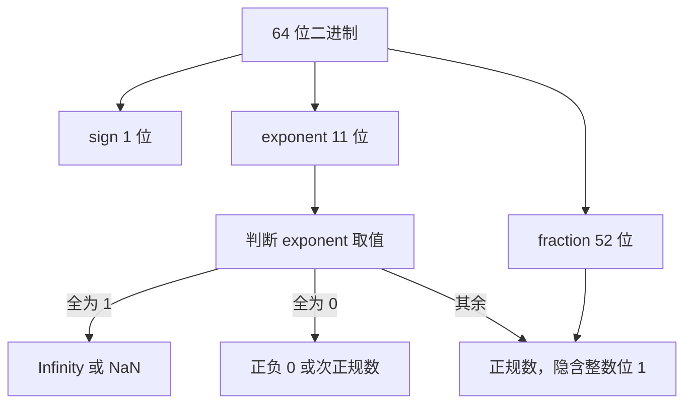

# Number、BigInt 与浮点精度

!!! abstract "核心结论"

- JavaScript 只有一种数值类型 `Number`，它是 IEEE 754 binary64（双精度）：1 位符号 + 11 位偏置指数 + 52 位尾数，隐含一位整数位，共 53 位有效二进制精度。
- `0.1 + 0.2 !== 0.3` 不是引擎 bug：0.1 与 0.2 本身不能精确表示，其和的精确值落在两个相邻 double 之间，按 round-to-nearest-ties-to-even 舍入后得到 `0.3000000000000000444089209850062616169452667236328125`。
- 安全整数范围是 `[-2^53 + 1, 2^53 - 1]`；`2^53 + 1 === 2^53`。超过该范围只能用 `BigInt`、字符串或定点表示，不能靠 `toFixed` 补救。
- `BigInt` 是任意精度整数，与 `Number` 不能混合算术（抛 `TypeError`），`/` 向零截断，`Math` 方法不可用，`JSON.stringify` 需自定义转换。
- 金额与十进制业务必须走整数最小单位（分）、字符串十进制或 `BigInt` 定点；浮点只用于展示与科学计算，并明确容差策略。

## 1. IEEE 754 双精度：三个字段与位级解码

### 1.1 字段布局与偏置指数

binary64 的 64 位从高位到低位依次是：

- `sign`：1 位，0 正 1 负。注意符号与数值分离，因此存在 `-0`。
- `exponent`：11 位无符号整数 `e`，偏置 `bias = 1023`。`e === 0x7ff` 保留给 `Infinity`/`NaN`；`e === 0` 表示零与次正规数（subnormal）；其余为正规数（normal）。
- `fraction`：52 位尾数字段 `m`。正规数的有效数（significand）是 `1.m` 的二进制展开，即 `2^52 + m`，共 53 位精度；次正规数隐含位为 0，有效数就是 `m`，用于在零附近平滑下溢。

三类数值的取值规则：

| 类别 | exponent 位 | fraction 位 | 数值 |
| --- | --- | --- | --- |
| 正规数 | 1..2046 | 任意 | (-1)^s × (2^52 + m) × 2^(e - 1023 - 52) |
| 次正规数 | 0 | 非 0 | (-1)^s × m × 2^(-1074) |
| 零 | 0 | 0 | (-1)^s × 0 |
| 无穷 | 2047 | 0 | (-1)^s × Infinity |
| NaN | 2047 | 非 0 | NaN（具体位模式由实现决定） |



### 1.2 手写 decodeFloat64：从 64 位到精确十进制

```js
// 运行环境：Node.js 18+，保存为 ieee754-decode.mjs 运行
import assert from "node:assert/strict";

const EXP_BIAS = 1023;
const MANT_BITS = 52;
const TWO63 = 1n << 63n;
const TWO64 = 1n << 64n;

// 把 double 的 64 位原样取出，大端序，便于观察位模式
function bitsOf(x) {
  const dv = new DataView(new ArrayBuffer(8));
  dv.setFloat64(0, x, false); // false = 大端序
  return dv.getBigUint64(0, false);
}

function bitsHex(x) {
  return "0x" + bitsOf(x).toString(16).padStart(16, "0").toUpperCase();
}

// 解码：返回符号、无偏指数、有效数（BigInt）、有效数对应的二进制指数 e2
// 约定 value = (-1)^sign * significand * 2^e2
function decodeFloat64(x) {
  const bits = bitsOf(x);
  const hi = Number((bits >> 32n) & 0xffffffffn);
  const lo = Number(bits & 0xffffffffn);

  const sign = hi >>> 31;
  const exponentBits = (hi >>> 20) & 0x7ff;
  const mantHi = hi & 0xfffff; // 低 20 位尾数在高 32 位里
  const mantissa = (BigInt(mantHi) << 32n) | BigInt(lo); // 52 位尾数

  const base = {
    bits,
    sign,
    signHex: bitsHex(x),
    exponentBits,
    mantissa,
    significand: mantissa,
    exponent: 0,
    e2: 0,
    kind: "normal",
    value: x,
  };

  if (exponentBits === 0x7ff) {
    return {
      ...base,
      kind: mantissa === 0n ? "infinity" : "nan",
      exponent: 0,
      e2: 0,
    };
  }

  if (exponentBits === 0) {
    if (mantissa === 0n) {
      return { ...base, kind: "zero", significand: 0n, exponent: 0, e2: 0 };
    }
    // 次正规数：没有隐含整数位，最小指数固定为 -1022
    return { ...base, kind: "subnormal", exponent: -1022, e2: -1074 };
  }

  const exponent = exponentBits - EXP_BIAS;
  return {
    ...base,
    kind: "normal",
    exponent,
    e2: exponent - MANT_BITS,
    significand: (1n << 52n) | mantissa, // 补回隐含位
  };
}

// 把 num / 10^scale 打印成十进制字符串（去掉小数尾部多余的 0）
function formatScaled(num, scale) {
  const neg = num < 0n;
  const abs = neg ? -num : num;
  let s = abs.toString();
  if (scale === 0) return (neg ? "-" : "") + s;
  s = s.padStart(scale + 1, "0");
  const intPart = s.slice(0, s.length - scale);
  const fracPart = s.slice(s.length - scale).replace(/0+$/, "");
  return (neg ? "-" : "") + intPart + (fracPart ? "." + fracPart : "");
}

// 精确十进制展开：value = significand * 2^e2
// e2 >= 0 时是整数；e2 < 0 时乘以 5^(-e2) 再除以 10^(-e2)，仍然精确
function exactDecimalString(x) {
  const d = decodeFloat64(x);
  if (d.kind === "nan") return "NaN";
  if (d.kind === "infinity") return d.sign === 1 ? "-Infinity" : "Infinity";
  if (d.kind === "zero") return d.sign === 1 ? "-0" : "0";

  let num = d.significand;
  let scale = 0;
  if (d.e2 >= 0) {
    num <<= BigInt(d.e2);
  } else {
    scale = -d.e2;
    num *= 5n ** BigInt(scale);
  }
  if (d.sign === 1) num = -num;
  return formatScaled(num, scale);
}

// ULP 距离：把 double 位模式映射成单调递增的无符号整数再作差
function orderKey(x) {
  const bits = bitsOf(x);
  return (bits & TWO63) !== 0n ? TWO64 - bits : TWO63 + bits;
}

function ulpDistance(a, b) {
  const d = orderKey(a) - orderKey(b);
  return d < 0n ? -d : d;
}
```

### 1.3 验证标准

```js
// 运行环境：Node.js 18+，接在 1.2 的代码之后，保存为 ieee754-decode-test.mjs
import assert from "node:assert/strict";

// 位模式：0.1 与 0.2 的尾数完全相同，只差指数，因为 0.2 = 2 * 0.1
assert.strictEqual(bitsHex(0.1), "0x3FB999999999999A");
assert.strictEqual(bitsHex(0.2), "0x3FC999999999999A");
assert.strictEqual(bitsHex(0.3), "0x3FD3333333333333");
assert.strictEqual(bitsHex(0.1 + 0.2), "0x3FD3333333333334");
assert.strictEqual(bitsHex(1), "0x3FF0000000000000");
assert.strictEqual(bitsHex(-0), "0x8000000000000000");

// 0.1 = 7205759403792794 * 2^-56，指数域 1019 - 1023 = -4
const d01 = decodeFloat64(0.1);
assert.strictEqual(d01.sign, 0);
assert.strictEqual(d01.kind, "normal");
assert.strictEqual(d01.exponentBits, 1019);
assert.strictEqual(d01.exponent, -4);
assert.strictEqual(d01.e2, -56);
assert.strictEqual(d01.significand, 7205759403792794n);

// 0.2 与 0.1 有效数相同，指数高一位
assert.strictEqual(decodeFloat64(0.2).exponent, -3);
assert.strictEqual(decodeFloat64(0.2).significand, 7205759403792794n);

// 次正规数：Number.MIN_VALUE 的 52 位尾数是 1
const dMin = decodeFloat64(Number.MIN_VALUE);
assert.strictEqual(dMin.kind, "subnormal");
assert.strictEqual(dMin.mantissa, 1n);
assert.strictEqual(dMin.e2, -1074);

// -0、NaN、Infinity 的分类
assert.strictEqual(decodeFloat64(-0).kind, "zero");
assert.strictEqual(decodeFloat64(-0).sign, 1);
assert.strictEqual(decodeFloat64(NaN).kind, "nan");
assert.strictEqual(decodeFloat64(Infinity).kind, "infinity");
assert.strictEqual(decodeFloat64(-Infinity).sign, 1);

// 精确十进制展开：长度与内容都和理论一致
assert.strictEqual(exactDecimalString(0.5), "0.5");
assert.strictEqual(exactDecimalString(-2.5), "-2.5");
assert.strictEqual(exactDecimalString(1), "1");
assert.strictEqual(exactDecimalString(-0), "-0");
assert.strictEqual(exactDecimalString(2 ** 53), "9007199254740992");
assert.strictEqual(
  exactDecimalString(0.1),
  // 55 位小数：1 后跟 16 个 0，再跟 38 位
  "0.1000000000000000055511151231257827021181583404541015625",
);
assert.strictEqual(
  exactDecimalString(0.2),
  // 54 位小数：正好是 0.1 精确值的两倍去掉末尾的 0
  "0.200000000000000011102230246251565404236316680908203125",
);
assert.strictEqual(
  exactDecimalString(0.3),
  "0.299999999999999988897769753748434595763683319091796875",
);
assert.strictEqual(
  exactDecimalString(0.1 + 0.2),
  "0.3000000000000000444089209850062616169452667236328125",
);

// 任意 double 的精确展开再解析回来必须等于原值
for (const x of [0.1, 0.2, 0.3, 0.1 + 0.2, 1 / 3, 1e-7, 2 ** 53, Number.MAX_VALUE, Number.MIN_VALUE, -0.1]) {
  assert.strictEqual(Number(exactDecimalString(x)), x);
}

// ULP 距离：0.1 + 0.2 与 0.3 只差 1 个 ULP
assert.strictEqual(ulpDistance(0.1 + 0.2, 0.3), 1n);
assert.strictEqual(ulpDistance(1, 2), 2n ** 52n);
assert.strictEqual(ulpDistance(-0, 0), 0n);
assert.strictEqual(ulpDistance(1, 1), 0n);

console.log("PASS: IEEE 754 解码与精确十进制展开");
```

预期输出：

```text
PASS: IEEE 754 解码与精确十进制展开
```

## 2. 0.1 + 0.2：一次可解释的舍入事故

### 2.1 精确求和：用 BigInt 对齐指数

加法在硬件层面分三步：对齐指数（小指数操作数右移，低位丢弃）、尾数相加、结果规格化并舍入到 53 位。第三步决定了一切。下面用 BigInt 精确算出两个 double 的实数之和，再交给 `Number()` 做一次正确的舍入，从而分离“精确值”和“舍入结果”。

```js
// 运行环境：Node.js 18+，接在 1.2 的代码之后
// 只处理有限数：返回 a + b 的精确十进制字符串（不做 double 舍入）
function exactSum(a, b) {
  const da = decodeFloat64(a);
  const db = decodeFloat64(b);
  if (da.kind === "nan" || db.kind === "nan") return "NaN";

  const ea = da.kind === "zero" ? 0 : da.e2;
  const eb = db.kind === "zero" ? 0 : db.e2;
  const emin = Math.min(ea, eb);

  const sa = (da.kind === "zero" ? 0n : da.significand) << BigInt(ea - emin);
  const sb = (db.kind === "zero" ? 0n : db.significand) << BigInt(eb - emin);
  const na = da.sign === 1 ? -sa : sa;
  const nb = db.sign === 1 ? -sb : sb;

  const sum = na + nb;
  if (sum === 0n) return "0";

  const neg = sum < 0n;
  const abs = neg ? -sum : sum;
  // value = abs * 2^emin
  if (emin >= 0) {
    return (neg ? "-" : "") + formatScaled(abs << BigInt(emin), 0);
  }
  const scale = -emin;
  return (neg ? "-" : "") + formatScaled(abs * 5n ** BigInt(scale), scale);
}
```

### 2.2 ULP、Number.EPSILON 与近似比较

`Number.EPSILON` 是 `2^-52`，即区间 `[1, 2)` 内相邻 double 的间距（1 个 ULP）。它只在 1 附近等于绝对误差尺度；数值越大 ULP 越大，所以容差要按相对误差给。

```js
// 运行环境：Node.js 18+
// 相对误差 + 绝对误差双门槛；NaN 一律返回 false
function nearlyEqual(a, b, relTol = 1e-12, absTol = 1e-12) {
  if (a === b) return true;
  if (!Number.isFinite(a) || !Number.isFinite(b)) return false;
  const diff = Math.abs(a - b);
  const scale = Math.max(Math.abs(a), Math.abs(b));
  return diff <= Math.max(relTol * scale, absTol);
}

// 严格按 ULP 距离比较，需要 1.2 中的 ulpDistance
function withinUlps(a, b, maxUlps) {
  if (Number.isNaN(a) || Number.isNaN(b)) return false;
  return ulpDistance(a, b) <= BigInt(maxUlps);
}
```

### 2.3 验证标准

```js
// 运行环境：Node.js 18+，接在 2.1 / 2.2 的代码之后
import assert from "node:assert/strict";

// 精确和与“最近的 double”是两回事
assert.strictEqual(exactSum(1, 2), "3");
assert.strictEqual(exactSum(0.5, 0.25), "0.75");
assert.notStrictEqual(exactSum(0.1, 0.2), exactDecimalString(0.3));
assert.strictEqual(Number(exactSum(0.1, 0.2)), 0.1 + 0.2);
assert.strictEqual(Number(exactSum(0.1, 0.2)), 0.30000000000000004);

// 0.1 + 0.2 的精确和确实不等于 0.3 这个 double，但只差 1 个 ULP
assert.notStrictEqual(0.1 + 0.2, 0.3);
assert.strictEqual(ulpDistance(0.1 + 0.2, 0.3), 1n);
assert.ok(withinUlps(0.1 + 0.2, 0.3, 1));

// EPSILON 是 [1, 2) 区间的 ULP
assert.strictEqual(Number.EPSILON, 2 ** -52);
assert.notStrictEqual(1 + Number.EPSILON, 1);
assert.strictEqual(1 + Number.EPSILON / 2, 1); // 正好半个 ULP，ties to even 回到 1

// 近似比较
assert.strictEqual(nearlyEqual(0.1 + 0.2, 0.3), true);
assert.strictEqual(nearlyEqual(0.1 + 0.2, 0.3, 0, 0), false);
assert.strictEqual(nearlyEqual(NaN, NaN), false);
assert.strictEqual(nearlyEqual(Infinity, Infinity), true); // a === b 命中
assert.strictEqual(nearlyEqual(1e20, 1e20 + 1e4), true);

console.log("PASS: 精确求和、ULP 与近似比较");
```

预期输出：

```text
PASS: 精确求和、ULP 与近似比较
```

## 3. 安全整数、-0 与 Object.is

### 3.1 2^53 - 1 的来历

正规数的有效数是 53 位二进制整数 `significand ∈ [2^52, 2^53)`。当指数为 0（即数值落在 `[2^52, 2^53)`）时相邻 double 间距为 1，所以 `[-(2^53 - 1), 2^53 - 1]` 内的每个整数都能一对一表示；超过上界后间距变成 2、4、8……，`2^53 + 1` 无法表示，按 ties-to-even 落到 `2^53`。

```js
function isSafeIntegerManual(x) {
  return (
    typeof x === "number" &&
    Number.isFinite(x) &&
    Math.floor(x) === x && // 整数（含 -0）
    Math.abs(x) <= 9007199254740991 // 2^53 - 1
  );
}
```

### 3.2 -0、三种相等语义

- 产生 `-0` 的典型途径：`-0` 字面量、`-1 * 0`、`-0 + -0`、`Math.round(-0.4)`、`Object.is` 之外的某些舍入边界。
- `-0 === 0` 为 `true`，`Object.is(-0, 0)` 为 `false`；`String(-0)` 与 `JSON.stringify(-0)` 都得到 `"0"`，符号被抹掉。
- 三种相等语义：`===`（IsStrictlyEqual，`NaN !== NaN`，`0 === -0`）、`Object.is`（SameValue，`NaN` 等于自身，`0` 不等于 `-0`）、`SameValueZero`（`Map`/`Set`/`includes` 使用，`NaN` 等于自身且 `0` 等于 `-0`）。

| 表达式 | `==` | `===` | `Object.is` | SameValueZero |
| --- | --- | --- | --- | --- |
| `NaN, NaN` | false | false | true | true |
| `0, -0` | true | true | false | true |
| `1, "1"` | true | false | false | false |
| 使用场景 | 历史宽松比较 | 日常判断 | 信号量/缓存键区分 -0 与 NaN | `Set`/`Map`/`Array.prototype.includes` |

### 3.3 验证标准

```js
// 运行环境：Node.js 18+
import assert from "node:assert/strict";

assert.strictEqual(Number.MAX_SAFE_INTEGER, 2 ** 53 - 1);
assert.strictEqual(Number.MIN_SAFE_INTEGER, -(2 ** 53 - 1));

// 安全整数的手写实现与内置实现一致
const samples = [
  0, -0, 1, -1, 2 ** 53 - 1, -(2 ** 53 - 1), 2 ** 53, 2 ** 53 + 1,
  -2 ** 53, 1.5, NaN, Infinity, -Infinity, Number.MAX_VALUE,
];
for (const x of samples) {
  assert.strictEqual(isSafeIntegerManual(x), Number.isSafeInteger(x));
}

// 超出安全范围：加法不可逆
assert.strictEqual(2 ** 53 + 1, 2 ** 53);
assert.strictEqual(2 ** 53 + 1 === 2 ** 53, true);
assert.strictEqual(Number.MAX_SAFE_INTEGER + 1, 9007199254740992);
assert.strictEqual(Number.MAX_SAFE_INTEGER + 2, 9007199254740992);
assert.strictEqual(Number.MAX_SAFE_INTEGER + 3, 9007199254740994);
// 2^53 + 3 精确值是 9007199254740995，正好落在两个 double 中点，ties-to-even 取偶数尾数
assert.strictEqual(2 ** 53 + 3, 9007199254740996);

// -0 的判定
assert.strictEqual(-0 === 0, true);
assert.strictEqual(Object.is(-0, 0), false);
assert.strictEqual(1 / -0, -Infinity);
assert.strictEqual(1 / 0, Infinity);
assert.strictEqual(String(-0), "0");
assert.strictEqual(JSON.stringify(-0), "0");
assert.strictEqual(Object.is(-1 * 0, -0), true);
assert.strictEqual(Object.is(-0 + -0, -0), true);
assert.strictEqual(Object.is(0 + -0, 0), true);
assert.strictEqual(Object.is(Math.round(-0.4), -0), true);

// 集合语义
assert.strictEqual(new Set([-0, 0]).size, 1);
assert.strictEqual(new Map([[NaN, "n"]]).get(NaN), "n");
assert.strictEqual([-0].includes(0), true);
assert.strictEqual([NaN].includes(NaN), true);
assert.strictEqual([NaN].indexOf(NaN), -1);

console.log("PASS: 安全整数、-0 与相等语义");
```

预期输出：

```text
PASS: 安全整数、-0 与相等语义
```

## 4. 位运算、32 位截断与 Math 的整数工具

### 4.1 ToInt32 与 ToUint32

`& | ^ ~ << >> >>>` 的每个操作数都要先经过 `ToInt32`（无符号右移是 `ToUint32`）：先 `ToNumber`，再 `ToIntegerOrInfinity`（NaN 与无穷变成 0，其余向零截断），最后对 `2^32` 取模并按需映射到有符号区间。这正是 `Date.now() | 0` 会出错的原因。

```js
const TWO_32 = 4294967296; // 2^32
const TWO_31 = 2147483648; // 2^31

function toUint32(x) {
  const n = Number(x);
  if (!Number.isFinite(n)) return 0; // NaN、±Infinity -> +0
  const t = Math.trunc(n); // 向零截断，-0 保持 -0
  return ((t % TWO_32) + TWO_32) % TWO_32; // 规范到 [0, 2^32)
}

function toInt32(x) {
  const u = toUint32(x);
  return u >= TWO_31 ? u - TWO_32 : u;
}
```

### 4.2 手写 clz32、imul、fround

```js
// 运行环境：Node.js 18+，接在 4.1 的代码之后
function clz32(x) {
  const n = toUint32(x);
  if (n === 0) return 32;
  let count = 0;
  for (let i = 31; i >= 0; i--) {
    if ((n >>> i) & 1) break;
    count++;
  }
  return count;
}

// 32 位有符号乘法：先用 BigInt 精确相乘，再截断到 32 位
function imul(a, b) {
  const p = BigInt(toInt32(a)) * BigInt(toInt32(b));
  const mod = 1n << 32n;
  const u = ((p % mod) + mod) % mod;
  return u >= 1n << 31n ? Number(u - mod) : Number(u);
}

// 四舍五入到最近的单精度浮点：DataView 的 setFloat32 保证 round-to-nearest-even
function fround(x) {
  const dv = new DataView(new ArrayBuffer(4));
  dv.setFloat32(0, x, false);
  return dv.getFloat32(0, false);
}
```

### 4.3 验证标准

```js
// 运行环境：Node.js 18+
import assert from "node:assert/strict";

// 与内置位运算逐例对齐
const cases = [
  0, -0, 1, -1, 1.9, -1.9, 2147483647, 2147483648, -2147483648,
  4294967295, 4294967296, 1e9, 3e9, -3e9, 2 ** 40 + 12345, 2 ** 53,
  NaN, Infinity, -Infinity, 4294967295.9,
];
for (const v of cases) {
  assert.strictEqual(toInt32(v), v | 0, `toInt32(${v})`);
  assert.strictEqual(toUint32(v), v >>> 0, `toUint32(${v})`);
}

assert.strictEqual(toInt32(3e9), -1294967296);
assert.strictEqual(toUint32(-1), 4294967295);
assert.strictEqual(toUint32(2 ** 32), 0);
assert.strictEqual(toInt32(2 ** 53), 0); // 2^53 mod 2^32 = 0
assert.strictEqual(2147483647 + 1 | 0, -2147483648);
assert.strictEqual(0xffffffff | 0, -1);

// 移位计数按 32 取模
assert.strictEqual(1 << 32, 1);
assert.strictEqual(1 << 31, -2147483648);

// 手写工具与内置一致
assert.strictEqual(clz32(1), Math.clz32(1));
assert.strictEqual(clz32(0), Math.clz32(0));
assert.strictEqual(clz32(0x80000000), 0);
assert.strictEqual(clz32(0x0000ffff), 16);
assert.strictEqual(imul(2, 4), Math.imul(2, 4));
assert.strictEqual(imul(0xffffffff, 5), Math.imul(0xffffffff, 5));
assert.strictEqual(Math.imul(0xffffffff, 5), -5);
assert.strictEqual(fround(0.1), Math.fround(0.1));
assert.strictEqual(Math.fround(0.1), 0.10000000149011612);

// Math 的常用工具方法
assert.strictEqual(Object.is(Math.trunc(-0.5), -0), true);
assert.strictEqual(Object.is(Math.sign(-0), -0), true);
assert.strictEqual(Math.hypot(3, 4), 5);
assert.strictEqual(Math.log(1 + 1e-16), 0); // 1e-16 远小于半个 ULP，被吞掉
assert.ok(Math.abs(Math.log1p(1e-16) - 1e-16) < 1e-20); // log1p 保留了小量精度
assert.ok(Math.abs(Math.cbrt(27) - 3) < 1e-15);

console.log("PASS: 32 位截断与 Math 工具方法");
```

预期输出：

```text
PASS: 32 位截断与 Math 工具方法
```

`Math` 中与整数/精度相关的常用方法：

| 方法 | 语义 | 典型用途 |
| --- | --- | --- |
| `Math.trunc` | 向零取整 | 替代 `x < 0 ? Math.ceil(x) : Math.floor(x)` |
| `Math.sign` | 返回 `-1` / `-0` / `0` / `1` / `NaN` | 方向判断，注意 `-0` 会被保留 |
| `Math.cbrt` | 立方根 | 数值计算 |
| `Math.hypot` | 平方和的平方根，内部做缩放防中间溢出 | 向量长度 |
| `Math.log1p` / `Math.expm1` | `ln(1+x)` / `e^x - 1`，小量时精度更高 | 连续复利、对数收益 |
| `Math.log2` / `Math.log10` | 二/十进制对数 | 位宽估算 |
| `Math.clz32` | 32 位前导零个数 | 位图、哈希桶定位 |
| `Math.imul` | 32 位有符号乘法 | 哈希函数（如 murmur 类） |
| `Math.fround` | 最接近的单精度值 | `Float32Array`、图形计算 |

## 5. BigInt 语义与手写大数算法

### 5.1 语义与限制

`BigInt` 是任意精度整数类型，字面量后缀 `n` 或 `BigInt()` 转换得到，只能是整数，没有 `-0`，没有 `NaN`/`Infinity`。

| 维度 | `Number` | `BigInt` |
| --- | --- | --- |
| 表示 | binary64 双精度浮点 | 任意精度有符号整数 |
| 字面量 | `1`、`1.5`、`1e3` | `1n`（不允许小数点与指数） |
| 精度 | 53 位有效二进制位 | 精确 |
| 除法 | 浮点除法 | 向零截断：`7n / 2n === 3n` |
| 取模符号 | 与浮点一致 | 与被除数同号：`-7n % 3n === -1n` |
| 位运算 | 32 位截断 | 任意位宽 |
| 与 `Number` 混算 | — | 抛 `TypeError` |
| `Math` 方法 | 可用 | 抛 `TypeError` |
| `JSON.stringify` | 正常序列化 | 抛 `TypeError` |
| `typeof` | `"number"` | `"bigint"` |
| 比较 | — | `1n == 1` 为 true，`1n === 1` 为 false |

转换规则要点：`BigInt(1.5)` 抛 `RangeError`，`BigInt(1.0)` 得到 `1n`，`BigInt("0x1f")` 得到 `31n`，`BigInt("1.5")` 抛 `SyntaxError`。`BigInt.asIntN` / `BigInt.asUintN` 用于按位宽环绕。

### 5.2 手写阶乘、快速幂、模幂

```js
// 运行环境：Node.js 18+
function factorialBigInt(n) {
  if (!Number.isInteger(n) || n < 0) {
    throw new RangeError("n 必须是非负整数");
  }
  let result = 1n;
  for (let i = 2n; i <= BigInt(n); i++) result *= i;
  return result;
}

// 快速幂：二进制分解指数，O(log exp)
function powBigInt(base, exp) {
  if (exp < 0n) throw new RangeError("exp 必须非负");
  let result = 1n;
  let b = base;
  let e = exp;
  while (e > 0n) {
    if ((e & 1n) === 1n) result *= b;
    b *= b;
    e >>= 1n;
  }
  return result;
}

// 模幂：每步取模，避免中间结果爆炸，负底数先规范化
function modPow(base, exp, mod) {
  if (exp < 0n) throw new RangeError("exp 必须非负");
  if (mod <= 0n) throw new RangeError("mod 必须为正");
  let result = 1n % mod;
  let b = ((base % mod) + mod) % mod;
  let e = exp;
  while (e > 0n) {
    if ((e & 1n) === 1n) result = (result * b) % mod;
    b = (b * b) % mod;
    e >>= 1n;
  }
  return result;
}
```

### 5.3 验证标准

```js
// 运行环境：Node.js 18+
import assert from "node:assert/strict";

// 类型与基本语义
assert.strictEqual(typeof 1n, "bigint");
assert.strictEqual(1n == 1, true);
assert.strictEqual(1n === 1, false);
assert.strictEqual(1n < 2, true);
assert.strictEqual(7n / 2n, 3n);
assert.strictEqual(-7n / 2n, -3n);
assert.strictEqual(-7n % 3n, -1n);
assert.strictEqual(1n << 64n, 18446744073709551616n);
assert.strictEqual(BigInt.asUintN(64, -1n), 18446744073709551615n);
assert.strictEqual(BigInt.asIntN(8, 255n), -1n);
assert.throws(() => 1n + 1, TypeError);
assert.throws(() => Math.max(1n, 2n), TypeError);
assert.throws(() => JSON.stringify(1n), TypeError);
assert.throws(() => BigInt(1.5), RangeError);

// 不要指望用 BigInt 找回已丢失的精度
assert.strictEqual(BigInt(2 ** 53), 9007199254740992n);
assert.strictEqual(BigInt(2 ** 53) + 1n, 9007199254740993n);
assert.strictEqual(BigInt(2 ** 53 + 1), 9007199254740992n); // 输入已经是 2^53

// 阶乘
assert.strictEqual(factorialBigInt(0), 1n);
assert.strictEqual(factorialBigInt(5), 120n);
assert.strictEqual(factorialBigInt(18), 6402373705728000n);
assert.strictEqual(Number(factorialBigInt(18)), 6402373705728000); // 18! < 2^53
assert.strictEqual(factorialBigInt(20), 2432902008176640000n);
assert.strictEqual(factorialBigInt(25), 15511210043330985984000000n);
assert.ok(factorialBigInt(25) > BigInt(Number.MAX_SAFE_INTEGER));
assert.throws(() => factorialBigInt(-1), RangeError);
assert.throws(() => factorialBigInt(3.5), RangeError);

// 快速幂：7^20 在 double 下会被舍入，BigInt 精确
assert.strictEqual(powBigInt(2n, 10n), 1024n);
assert.strictEqual(powBigInt(3n, 0n), 1n);
assert.strictEqual(powBigInt(7n, 20n), 79792266297612001n);
assert.strictEqual(7 ** 20, 79792266297612000); // double 只能到这
assert.notStrictEqual(BigInt(7 ** 20), powBigInt(7n, 20n));
assert.strictEqual(Number(powBigInt(7n, 20n)), 7 ** 20); // 但舍入结果一致

// 模幂
assert.strictEqual(modPow(2n, 10n, 1000n), 24n);
assert.strictEqual(modPow(3n, 100n, 7n), 4n);
assert.strictEqual(modPow(7n, 128n, 13n), 3n);
assert.strictEqual(modPow(-2n, 3n, 5n), 2n); // (-8) mod 5 = 2
assert.strictEqual(modPow(5n, 0n, 7n), 1n);
assert.throws(() => modPow(2n, 3n, 0n), RangeError);

console.log("PASS: BigInt 语义与手写大数算法");
```

预期输出：

```text
PASS: BigInt 语义与手写大数算法
```

## 6. 手写十进制高精度加减乘除（字符串）

字符串方案的思路：把十进制数拆成“符号 + 无符号整数字符串 + 标度（小数位数）”，在无符号整数上实现四则运算，再统一处理符号与小数点。这一节完全不依赖 `BigInt`，可以直接映射到任何语言的 `char[]` 实现。

### 6.1 无符号整数核心

```js
// 运行环境：Node.js 18+
function trimLeadingZeros(s) {
  const t = s.replace(/^0+/, "");
  return t === "" ? "0" : t;
}

// 比较无符号十进制字符串：-1 / 0 / 1
function cmpAbs(a, b) {
  const x = trimLeadingZeros(a);
  const y = trimLeadingZeros(b);
  if (x.length !== y.length) return x.length > y.length ? 1 : -1;
  if (x === y) return 0;
  return x > y ? 1 : -1;
}

function addAbs(a, b) {
  let i = a.length - 1;
  let j = b.length - 1;
  let carry = 0;
  let out = "";
  while (i >= 0 || j >= 0 || carry > 0) {
    const x = i >= 0 ? a.charCodeAt(i) - 48 : 0;
    const y = j >= 0 ? b.charCodeAt(j) - 48 : 0;
    const t = x + y + carry;
    out = String(t % 10) + out;
    carry = t >= 10 ? 1 : 0;
    i--;
    j--;
  }
  return trimLeadingZeros(out);
}

// 要求 a >= b
function subAbs(a, b) {
  let i = a.length - 1;
  let j = b.length - 1;
  let borrow = 0;
  let out = "";
  while (i >= 0) {
    let x = a.charCodeAt(i) - 48 - borrow;
    const y = j >= 0 ? b.charCodeAt(j) - 48 : 0;
    if (x < y) {
      x += 10;
      borrow = 1;
    } else {
      borrow = 0;
    }
    out = String(x - y) + out;
    i--;
    j--;
  }
  return trimLeadingZeros(out);
}

// 竖式乘法：res[i + j + 1] 存低位，进位向上累加
function mulAbs(a, b) {
  const x = trimLeadingZeros(a);
  const y = trimLeadingZeros(b);
  if (x === "0" || y === "0") return "0";
  const res = new Array(x.length + y.length).fill(0);
  for (let i = x.length - 1; i >= 0; i--) {
    for (let j = y.length - 1; j >= 0; j--) {
      const t = (x.charCodeAt(i) - 48) * (y.charCodeAt(j) - 48) + res[i + j + 1];
      res[i + j + 1] = t % 10;
      res[i + j] += Math.floor(t / 10);
    }
  }
  return trimLeadingZeros(res.join(""));
}

// 逐位长除法，商位最多尝试 9 次
function divmodAbs(a, b) {
  const divisor = trimLeadingZeros(b);
  if (divisor === "0") throw new RangeError("除数不能为 0");
  const dividend = trimLeadingZeros(a);
  if (cmpAbs(dividend, divisor) < 0) return { q: "0", r: dividend };

  let q = "";
  let rem = "0";
  for (const ch of dividend) {
    rem = trimLeadingZeros(rem + ch);
    let d = 0;
    while (cmpAbs(rem, divisor) >= 0) {
      rem = subAbs(rem, divisor);
      d++;
    }
    q += String(d);
  }
  return { q: trimLeadingZeros(q), r: rem };
}

function padRight(s, n) {
  return n > 0 ? s + "0".repeat(n) : s;
}

// 四舍五入（away from zero）的除法
function divRoundHalfUpAbs(a, b) {
  const { q, r } = divmodAbs(a, b);
  const twice = addAbs(r, r);
  return cmpAbs(twice, b) >= 0 ? addAbs(q, "1") : q;
}
```

### 6.2 十进制标度封装

```js
// 解析为 { neg, digits, scale }，digits 是无符号整数字符串
function parseDec(str) {
  const s = String(str).trim();
  const m = /^([+-]?)(\d*)(?:\.(\d*))?$/.exec(s);
  if (!m || (m[2] === "" && !m[3])) throw new SyntaxError("非法十进制: " + s);
  const intPart = m[2] || "0";
  const fracPart = m[3] || "";
  const digits = trimLeadingZeros(intPart + fracPart);
  return { neg: m[1] === "-" && digits !== "0", digits, scale: fracPart.length };
}

function formatDec(neg, digits, scale) {
  const d = trimLeadingZeros(digits);
  if (d === "0") neg = false;
  if (scale === 0) return (neg ? "-" : "") + d;
  const padded = d.padStart(scale + 1, "0");
  const intPart = padded.slice(0, padded.length - scale);
  const fracPart = padded.slice(padded.length - scale);
  return (neg ? "-" : "") + intPart + "." + fracPart;
}

function decAlign(a, b) {
  const scale = Math.max(a.scale, b.scale);
  return {
    a: { neg: a.neg, digits: padRight(a.digits, scale - a.scale) },
    b: { neg: b.neg, digits: padRight(b.digits, scale - b.scale) },
    scale,
  };
}

function decAddOrSub(x, y, flip) {
  const ra = parseDec(x);
  const rb0 = parseDec(y);
  const rb = { neg: flip ? !rb0.neg : rb0.neg, digits: rb0.digits, scale: rb0.scale };
  const { a, b, scale } = decAlign(ra, rb);

  if (a.neg === b.neg) {
    return formatDec(a.neg, addAbs(a.digits, b.digits), scale);
  }
  const c = cmpAbs(a.digits, b.digits);
  if (c === 0) return formatDec(false, "0", scale);
  if (c > 0) return formatDec(a.neg, subAbs(a.digits, b.digits), scale);
  return formatDec(b.neg, subAbs(b.digits, a.digits), scale);
}

const decAdd = (x, y) => decAddOrSub(x, y, false);
const decSub = (x, y) => decAddOrSub(x, y, true);

function decMul(x, y) {
  const a = parseDec(x);
  const b = parseDec(y);
  const digits = mulAbs(a.digits, b.digits);
  const scale = a.scale + b.scale;
  const neg = a.neg !== b.neg && digits !== "0";
  return formatDec(neg, digits, scale);
}

// 结果保留 outScale 位小数，最后一位四舍五入
function decDiv(x, y, outScale = 10) {
  const a = parseDec(x);
  const b = parseDec(y);
  if (b.digits === "0") throw new RangeError("除数不能为 0");
  // a.digits/10^as ÷ b.digits/10^bs = (a.digits * 10^bs) / (b.digits * 10^as)
  // 再乘 10^outScale 保留目标位数
  const numerator = padRight(a.digits, b.scale + outScale);
  const denominator = padRight(b.digits, a.scale);
  const digits = divRoundHalfUpAbs(numerator, denominator);
  const neg = a.neg !== b.neg && digits !== "0";
  return formatDec(neg, digits, outScale);
}
```

### 6.3 验证标准

```js
// 运行环境：Node.js 18+
import assert from "node:assert/strict";

// 整数核心
assert.strictEqual(addAbs("99999999999999999999", "1"), "100000000000000000000");
assert.strictEqual(subAbs("100000000000000000000", "1"), "99999999999999999999");
assert.strictEqual(mulAbs("123456789", "987654321"), "121932631112635269");
assert.deepStrictEqual(divmodAbs("1000", "7"), { q: "142", r: "6" });
assert.deepStrictEqual(divmodAbs("3", "7"), { q: "0", r: "3" });
assert.strictEqual(cmpAbs("007", "7"), 0);

// 十进制四则：与浮点结果对照
assert.strictEqual(decAdd("0.1", "0.2"), "0.3");
assert.notStrictEqual(decAdd("0.1", "0.2"), String(0.1 + 0.2));
assert.strictEqual(decAdd("1.05", "2.95"), "4.00"); // 标度保留
assert.strictEqual(decAdd("99999999999999999999", "1"), "100000000000000000000");
assert.strictEqual(decSub("1", "0.999"), "0.001");
assert.strictEqual(decSub("0.3", "0.1"), "0.2");
assert.strictEqual(decSub("1", "1"), "0");
assert.strictEqual(decMul("0.1", "0.2"), "0.02");
assert.strictEqual(decMul("1.5", "2.5"), "3.75");
assert.strictEqual(decMul("-1.5", "4"), "-6.0");
assert.strictEqual(decMul("12345678901234567890", "2"), "24691357802469135780");
assert.strictEqual(decDiv("1", "3", 5), "0.33333");
assert.strictEqual(decDiv("2", "3", 5), "0.66667");
assert.strictEqual(decDiv("10", "4", 2), "2.50");
assert.strictEqual(decDiv("0.1", "0.2", 2), "0.50");
assert.strictEqual(decDiv("-7", "2", 3), "-3.500");
assert.throws(() => decDiv("1", "0"), RangeError);

console.log("PASS: 字符串十进制高精度四则运算");
```

预期输出：

```text
PASS: 字符串十进制高精度四则运算
```

## 7. 定点 Decimal 类与金额计算方案

### 7.1 基于 BigInt 的 Decimal

保持“整数部分 + 标度”的定点模型，把无符号字符串换成 `BigInt`，代码量骤减且天然精确。舍入采用 round half away from zero（业务上最常被接受的“四舍五入”）。

```js
// 运行环境：Node.js 18+
function divRoundHalfUp(num, den) {
  if (den === 0n) throw new RangeError("除数不能为 0");
  const neg = (num < 0n) !== (den < 0n);
  const n = num < 0n ? -num : num;
  const d = den < 0n ? -den : den;
  const q = n / d;
  const r = n % d;
  const rounded = r * 2n >= d ? q + 1n : q;
  return neg ? -rounded : rounded;
}

class Decimal {
  constructor(unscaled, scale) {
    this.unscaled = BigInt(unscaled);
    this.scale = scale;
  }

  static from(value) {
    if (value instanceof Decimal) return new Decimal(value.unscaled, value.scale);
    const s = String(value).trim();
    const m = /^([+-]?)(\d*)(?:\.(\d*))?$/.exec(s);
    if (!m || (m[2] === "" && !m[3])) throw new SyntaxError("无法解析为 Decimal: " + s);
    const sign = m[1] === "-" ? -1n : 1n;
    const intPart = m[2] || "0";
    const fracPart = m[3] || "";
    const digits = (intPart + fracPart).replace(/^0+/, "") || "0";
    return new Decimal(sign * BigInt(digits), fracPart.length);
  }

  add(other) {
    const o = Decimal.from(other);
    const s = Math.max(this.scale, o.scale);
    const a = this.unscaled * 10n ** BigInt(s - this.scale);
    const b = o.unscaled * 10n ** BigInt(s - o.scale);
    return new Decimal(a + b, s);
  }

  sub(other) {
    const o = Decimal.from(other);
    const s = Math.max(this.scale, o.scale);
    const a = this.unscaled * 10n ** BigInt(s - this.scale);
    const b = o.unscaled * 10n ** BigInt(s - o.scale);
    return new Decimal(a - b, s);
  }

  mul(other) {
    const o = Decimal.from(other);
    return new Decimal(this.unscaled * o.unscaled, this.scale + o.scale);
  }

  div(other, outScale = 10) {
    const o = Decimal.from(other);
    if (o.unscaled === 0n) throw new RangeError("除数不能为 0");
    const num = this.unscaled * 10n ** BigInt(o.scale + outScale);
    const den = o.unscaled * 10n ** BigInt(this.scale);
    return new Decimal(divRoundHalfUp(num, den), outScale);
  }

  round(dp) {
    if (dp >= this.scale) {
      return new Decimal(this.unscaled * 10n ** BigInt(dp - this.scale), dp);
    }
    const factor = 10n ** BigInt(this.scale - dp);
    return new Decimal(divRoundHalfUp(this.unscaled, factor), dp);
  }

  compare(other) {
    const o = Decimal.from(other);
    const s = Math.max(this.scale, o.scale);
    const a = this.unscaled * 10n ** BigInt(s - this.scale);
    const b = o.unscaled * 10n ** BigInt(s - o.scale);
    return a === b ? 0 : a > b ? 1 : -1;
  }

  equals(other) {
    return this.compare(other) === 0;
  }

  isZero() {
    return this.unscaled === 0n;
  }

  toString() {
    const neg = this.unscaled < 0n;
    const abs = neg ? -this.unscaled : this.unscaled;
    let s = abs.toString();
    if (this.scale === 0) return (neg && abs !== 0n ? "-" : "") + s;
    s = s.padStart(this.scale + 1, "0");
    const intPart = s.slice(0, s.length - this.scale);
    const fracPart = s.slice(s.length - this.scale);
    return (neg && abs !== 0n ? "-" : "") + intPart + "." + fracPart;
  }

  toNumber() {
    return Number(this.toString());
  }

  toFixed(dp) {
    const rounded = this.round(dp);
    let s = rounded.toString();
    if (dp === 0) return s;
    const dot = s.indexOf(".");
    if (dot < 0) return s + "." + "0".repeat(dp);
    const fracLen = s.length - dot - 1;
    return fracLen < dp ? s + "0".repeat(dp - fracLen) : s;
  }
}
```

### 7.2 金额：整数分 + BigInt

账务的黄金规则是“先把金额变成整数最小单位再算”。人民币用分，`BigInt` 存储，只在展示时格式化；需要四舍五入时显式指定舍入点。

```js
// 运行环境：Node.js 18+
// 字符串 -> 分（四舍五入到分），避免先经过 double
function yuanToCents(input) {
  const s = String(input).trim();
  const neg = s.startsWith("-");
  const body = neg ? s.slice(1) : s;
  const parts = body.split(".");
  const intPart = parts[0] === undefined || parts[0] === "" ? "0" : parts[0];
  const fracPart = parts[1] === undefined ? "" : parts[1];
  if (!/^\d+$/.test(intPart) || !/^\d*$/.test(fracPart)) {
    throw new SyntaxError("非法金额: " + s);
  }
  const frac3 = (fracPart + "000").slice(0, 3); // 取三位用于判断进位
  let cents = BigInt(intPart) * 100n + BigInt(frac3.slice(0, 2));
  if (BigInt(frac3[2]) >= 5n) cents += 1n;
  return neg ? -cents : cents;
}

function formatCents(cents, symbol = "¥") {
  const neg = cents < 0n;
  const abs = neg ? -cents : cents;
  const yuan = abs / 100n;
  const fen = abs % 100n;
  return (neg ? "-" : "") + symbol + yuan.toString() + "." + fen.toString().padStart(2, "0");
}

// 按比例取值并四舍五入到分：rateNum / rateDen
function applyRateHalfUp(cents, rateNum, rateDen) {
  if (rateDen === 0n) throw new RangeError("分母不能为 0");
  const num = cents * rateNum;
  const q = num / rateDen;
  const r = num % rateDen;
  const absR2 = (r < 0n ? -r : r) * 2n;
  const denAbs = rateDen < 0n ? -rateDen : rateDen;
  if (absR2 >= denAbs) return num < 0n ? q - 1n : q + 1n;
  return q;
}

// 把 total 均分成 parts 份，余数从前往后分配，保证和不变
function splitMoney(total, parts) {
  if (parts <= 0n) throw new RangeError("parts 必须为正");
  const base = total / parts;
  const rem = total - base * parts;
  return Array.from({ length: Number(parts) }, (_, i) =>
    BigInt(i) < (rem < 0n ? -rem : rem) ? base + (rem < 0n ? -1n : 1n) : base,
  );
}
```

### 7.3 验证标准

```js
// 运行环境：Node.js 18+
import assert from "node:assert/strict";

// Decimal：十进制语义而不是二进制语义
assert.strictEqual(Decimal.from("0.1").add("0.2").toString(), "0.3");
assert.strictEqual(Decimal.from("0.1").add("0.2").toNumber(), 0.3);
assert.notStrictEqual(0.1 + 0.2, 0.3);
assert.strictEqual(Decimal.from("1.005").toFixed(2), "1.01");
assert.strictEqual((1.005).toFixed(2), "1.00"); // 同一语义，浮点给出相反答案
assert.strictEqual(Decimal.from("0.1").add("0.2").equals("0.3"), true);
assert.strictEqual(Decimal.from("0.30").compare("0.3"), 0);
assert.strictEqual(Decimal.from("1").div("3", 4).toString(), "0.3333");
assert.strictEqual(Decimal.from("1").div("3", 4).mul("3").toString(), "0.9999");
assert.strictEqual(Decimal.from("2").div("3", 3).toNumber(), 0.667);
assert.strictEqual(Decimal.from("19.99").mul("3").toString(), "59.97");
assert.strictEqual(Decimal.from("-1").mul("0").isZero(), true);
assert.strictEqual(Decimal.from("1.7").round(0).toString(), "2");
assert.throws(() => Decimal.from("1").div("0"), RangeError);
assert.throws(() => Decimal.from("1.2.3"), SyntaxError);

// 金额
assert.strictEqual(yuanToCents("19.99"), 1999n);
assert.strictEqual(yuanToCents("19.995"), 2000n);
assert.strictEqual(yuanToCents("0.005"), 1n);
assert.strictEqual(yuanToCents("-0.005"), -1n);
assert.strictEqual(formatCents(1999n), "¥19.99");
assert.strictEqual(formatCents(-1n), "-¥0.01");
assert.strictEqual(applyRateHalfUp(1999n, 13n, 100n), 260n); // 1999 * 13% = 259.87
assert.strictEqual(applyRateHalfUp(1000n, 3n, 100n), 30n);
assert.strictEqual(applyRateHalfUp(1050n, 1n, 100n), 11n); // 10.5 分向上
assert.strictEqual(applyRateHalfUp(-1050n, 1n, 100n), -11n);

const parts = splitMoney(100n, 3n);
assert.deepStrictEqual(parts, [34n, 33n, 33n]);
assert.strictEqual(parts.reduce((s, v) => s + v, 0n), 100n);

console.log("PASS: Decimal 定点类与金额计算");
```

预期输出：

```text
PASS: Decimal 定点类与金额计算
```

### 7.4 方案对比

| 方案 | 精度 | 适用范围 | 性能 | 主要风险 |
| --- | --- | --- | --- | --- |
| 直接用 `Number` 计算 | 二进制浮点，有舍入误差 | 科学计算、展示 | 最快 | 累加漂移、比较失败 |
| 整数最小单位（`Number`） | 精确到最小单位 | 总额小于 `2^53` 分 | 快 | 越界后静默丢精度 |
| 整数最小单位（`BigInt`） | 精确 | 任意规模 | 中等 | 不能与 `Number` 混算、`JSON` 需转换 |
| 字符串 / `Decimal` 库 | 精确十进制 | 通用十进制业务 | 较慢 | 需明确舍入模式与标度约定 |
| 浮点 + 四舍五入 | 近似 | 报表估算 | 快 | “1.005”类边界结论不稳定 |

展示层可以用 `Intl.NumberFormat` 做本地化格式（符号、分组、币种代码取决于运行环境的 ICU 数据，具体输出需核对官方文档与目标环境）。

## 8. 常见陷阱

1. 用 `===` 比较浮点结果。`0.1 + 0.2 === 0.3` 为 false，应使用 ULP 距离或相对+绝对容差；账务场景应直接改用整数分。
2. 以为 `toFixed` 在“十进制上”四舍五入。它基于 double 的精确值：`(1.005).toFixed(2) === "1.00"`，因为 1.005 的二进制值是 1.00499999999999989…。需要十进制语义时用第 7 节的 `Decimal`。
3. 把 `Number.EPSILON` 当通用绝对容差。它只等于 `[1, 2)` 内 1 个 ULP；在 `1e15` 量级上一个 ULP 已经是 0.125，`Math.abs(a-b) < Number.EPSILON` 会几乎永远失败。
4. 用 `BigInt(x)` 挽回精度。`BigInt(2 ** 53 + 1)` 得到 `9007199254740992n`，因为参数在进入函数前已经丢失精度。必须在字符串或原始整数阶段就使用 `BigInt`。
5. 位运算的 32 位截断。`Date.now() | 0` 会按 `2^32` 回绕，得到负数或错值；大整数 ID、哈希取值前要明确是否要做 `ToInt32`。
6. 移位计数按 32 取模：`1 << 32 === 1`，`1 << 33 === 2`。想真正做 64 位位移必须用 `BigInt`。
7. `-0` 在字符串化与 JSON 中被抹平：`String(-0) === "0"`、`JSON.stringify(-0) === "0"`，只有 `Object.is`、`1 / x`、位模式才能区分。
8. `BigInt` 与 `Number` 混算抛 `TypeError`：`1n + 1`、`Math.max(1n, 2n)`、`JSON.stringify(1n)` 都会抛异常；序列化需要 `replacer` 或先转字符串。
9. `parseInt` 与 `Number` 的差异：`parseInt("12px") === 12` 而 `Number("12px") === NaN`；`Number("") === 0` 而 `parseInt("")` 是 `NaN`；`Number(null) === 0` 而 `Number(undefined) === NaN`。
10. 溢出与 `NaN` 传播：`Number.MAX_VALUE * 2 === Infinity`，`Infinity - Infinity === NaN`，`0 / 0 === NaN`；`NaN` 与任何值比较都是 false，必须用 `Number.isNaN`（全局 `isNaN` 会先做 `ToNumber`，`isNaN("abc") === true`）。
11. 累加误差：一百万次 `+= 0.1` 会明显偏离；大规模求和考虑 Kahan 补偿求和，或直接在整数域累加。
12. 认为十进制库是免费的：`Decimal` 每次运算都建对象、分配 `BigInt`，在热点循环中可能成为瓶颈，且必须统一约定标度与舍入模式（银行家舍入 vs 四舍五入）并写进接口契约。

## 9. 面试题与答题要点

1. 为什么 `0.1 + 0.2 !== 0.3`？
   要点：说明 IEEE 754 binary64 布局；0.1 与 0.2 的十进制是无限循环二进制，需舍入到 53 位有效数；给出位模式 `0x3FB999999999999A`、`0x3FC999999999999A`、`0x3FD3333333333334`；讲清加法的对齐指数、尾数相加、规格化与 round-to-nearest-ties-to-even；指出结果与 0.3 只差 1 个 ULP，并给出容差比较或整数分方案。

2. `Number.MAX_SAFE_INTEGER` 为什么是 `2^53 - 1`？
   要点：有效数 53 位，指数为 0 时 ULP 为 1；`[-(2^53-1), 2^53-1]` 一一映射；超过后 ULP ≥ 2；`2^53 + 1 === 2^53`；`Number.isSafeInteger` 的四个条件（number、有限、整数、绝对值不超界）；`Number.isInteger(2 ** 53)` 为 true 但并不安全。

3. 位运算为什么把操作数变成 32 位？`>>> 0` 有什么用？
   要点：`ToInt32`/`ToUint32` 的完整步骤（ToNumber → 截断 → 模 2^32 → 有符号映射）；`x | 0` 是快速取整（但对超过 32 位与 NaN 不可靠）；`x >>> 0` 得到 `[0, 2^32)` 的无符号视图；移位计数按 32 取模；需要 64 位时用 `BigInt`。

4. `Object.is`、`===`、`SameValueZero` 的区别？`-0` 有什么坑？
   要点：列表对比 `NaN` 与 `-0`；`===` 用 IsStrictlyEqual；`Object.is` 用 SameValue；`Map`/`Set`/`Array.prototype.includes` 用 SameValueZero；`indexOf` 用严格相等所以找不到 `NaN`；`-0` 的生成路径、字符串化与 JSON 丢失、`1 / -0 === -Infinity`。

5. `BigInt` 有哪些语义限制？工程上怎么落地？
   要点：任意精度整数、只能整数、无 `-0`/`NaN`；不能与 `Number` 混算、不能用 `Math`、`JSON.stringify` 抛错、`/` 与 `%` 向零截断；`typeof` 是 `"bigint"`；`==` 与 `Number` 宽松相等但 `===` 不等；`BigInt.asIntN`/`asUintN` 做定宽环绕；落地时的序列化约定（字符串传输，边界处显式转换）。

6. 金额和税率计算你会怎么做？
   要点：先选最小单位（分），全链路只用整数；用 `BigInt` 或确认范围内的 `Number`；输入从字符串解析避免经过 double；每次乘除后明确舍入点与舍入模式，并集中在一个函数（如 `applyRateHalfUp`）；分摊余数时用“先到先得”保证总和守恒；展示层格式化与业务计算分离；说明为什么不能用浮点累加。

7. `Number.EPSILON` 能不能直接用来比较浮点数？
   要点：它是 `2^-52`，等于 `[1,2)` 区间的 ULP；差值的可接受范围随量级增长，所以要用相对误差；给出“相对容差 + 绝对容差”的组合写法；更严格可用 ULP 距离（位模式映射为单调整数后作差）；说明近似比较也会把真正不同的数判为相等，业务上要有意识地选择容差。

8. 手写大数运算的思路、复杂度与验证方法？
   要点：字符串或 limb 数组按 10 进制（或 2^32 进制）存储；加法/减法 O(n)；竖式乘法 O(n·m)；长除法逐位试商（每步最多 9 次减法）；十进制小数用“标度 + 整数”表示，加减先对齐标度，乘法标度相加，除法按目标标度扩展分子再舍入；验证用边界（进位链、借位链、正好半值、除不尽）与随机对拍（`BigInt` 作为参考实现）。

## 深入阅读与参考

!!! tip "怎么用这些资料"
    先读「官方文档与规范」建立准确的概念，再读「源码与示例」核对细节，最后用「教程、书籍与视频」换一种讲法加深理解。每条都写明了读哪一节、带着什么问题读。

### 官方文档与规范

| 资源 | 为什么读 | 怎么读 |
|---|---|---|
| [TypeError: can't convert BigInt to number](https://developer.mozilla.org/en-US/docs/Web/JavaScript/Reference/Errors/Cant_convert_BigInt_to_number) | 直击 BigInt 与 Number 混用的报错，是常见陷阱的权威说明。 | 读触发条件与修正示例，读完自查代码中混合运算并加显式转换。 |
| [BigInt](https://developer.mozilla.org/en-US/docs/Web/JavaScript/Reference/Global_Objects/BigInt) | BigInt 语义总纲，覆盖运算、比较、类型转换与限制。 | 重点读运算与 Number 互转两节，读完列出不可用运算符清单。 |
| [BigInt.asUintN()](https://developer.mozilla.org/en-US/docs/Web/JavaScript/Reference/Global_Objects/BigInt/asUintN) | 无符号模 2^N 截断，直接解释位运算的 32 位语义。 | 读参数说明与示例，模仿 asUintN(32,x) 与 x>>>0 做对比验证。 |
| [BigInt.asIntN()](https://developer.mozilla.org/en-US/docs/Web/JavaScript/Reference/Global_Objects/BigInt/asIntN) | 有符号补码截断，对应位运算返回的有符号 32 位结果。 | 对比 asIntN 与 asUintN 示例，理解 -1 与 0xFFFFFFFF 的映射。 |
| [BigInt() constructor](https://developer.mozilla.org/en-US/docs/Web/JavaScript/Reference/Global_Objects/BigInt/BigInt) | 构造与转换入口，说明哪些值可转、哪些会直接抛错。 | 读转换规则与异常条件，读完写字符串/数字转 BigInt 的安全函数。 |
| [BigInt.prototype.toString()](https://developer.mozilla.org/en-US/docs/Web/JavaScript/Reference/Global_Objects/BigInt/toString) | 任意进制输出，手写大数打印与进制转换的现成参照。 | 读 radix 参数与示例，读完用 2/10/16 进制校验自写大数输出。 |
| [BigInt.prototype.toLocaleString()](https://developer.mozilla.org/en-US/docs/Web/JavaScript/Reference/Global_Objects/BigInt/toLocaleString) | 大整数本地化格式化，金额展示方案的官方依据。 | 读 options 与分组示例，读完对比自己定点金额类的格式化结果。 |
| [Math](https://developer.mozilla.org/en-US/docs/Web/JavaScript/Reference/Global_Objects/Math) | 整数与取整工具的总入口，便于按需求查具体方法。 | 扫方法列表定位 trunc/round/sign/ceil，读完按场景挑选取整函数。 |
| [Math.f16round()](https://developer.mozilla.org/en-US/docs/Web/JavaScript/Reference/Global_Objects/Math/f16round) | 二进制半精度舍入实例，直观展示位宽与舍入误差。 | 读舍入规则与示例，读完对比同一数值在双精度下的表示差异。 |
| [Math.ceil()](https://developer.mozilla.org/en-US/docs/Web/JavaScript/Reference/Global_Objects/Math/ceil) | 向上取整语义，金额与分单位换算中经常用到。 | 读负数与 -0 等边界示例，读后写分值取整并跑边界用例。 |
| [Math.pow()](https://developer.mozilla.org/en-US/docs/Web/JavaScript/Reference/Global_Objects/Math/pow) | 幂运算入口，用于验证 2^53 等安全整数边界。 | 读返回值精度说明，读完计算 Math.pow(2,53)+1 观察失效。 |
| [Math.log2()](https://developer.mozilla.org/en-US/docs/Web/JavaScript/Reference/Global_Objects/Math/log2) | 对数可估算位长，手写大数进制转换时用来预分配。 | 读返回值与示例，读完用 log2 估算大数的二进制位长。 |

## 应用与行业实践

### 应用场景地图

| 场景 | 用到本页哪个知识点 | 典型技术选型 | 注意事项 |
| --- | --- | --- | --- |
| 后台管理的万行表格 | `2^53 + 1 === 2^53` | ID 传字符串，金额传整数分 | 排序不能走 `Number` 转换 |
| 电商下单页的优惠分摊 | BigInt 整除向零截断 | BigInt 算分，余数逐行补 | 分摊和必须等于优惠额 |
| 多人协作白板的命中测试 | 浮点相等判断 | 坐标定点为整数千分位 | 缩放存累计值，不逐帧累乘 |
| 计费系统的小时数汇总 | `0.1 + 0.2` 的舍入 | 秒级整数累计，展示再除 | 禁止逐次累加小时数 |
| 供应商 CSV 对账导入 | 手写字符串十进制 | 按字符串解析为分，BigInt 求和 | 千分位与括号负数单独解析 |
| 图表 Y 轴刻度与提示 | `toFixed` 只用于展示 | 刻度用整数缩放，提示用 `Intl.NumberFormat` | 计算层与展示层分开 |
| 埋点耗时统计 | BigInt 与 Number 不能混算 | `process.hrtime.bigint` | BigInt 不能直接进 `JSON.stringify` |
| 低端安卓首屏的价格渲染 | 浮点只用于展示 | 首屏传整数字符串，客户端不做小数运算 | 首屏代码里不出现小数算术 |

### 三个场景拆解

#### 场景 1：后台管理的万行表格

**业务背景**：后台订单列表要一次渲染上万行，每行带订单 ID、已付金额、退款金额。ID 由服务端生成，十进制长度超过 16 位；金额需要按分对齐后与财务系统对账。

**怎么用本页知识解决**：先把两类字段的类型固定下来，ID 保持字符串，金额保持整数分，再让排序与合计只走大整数路径。

```js
// 排序：字符串 ID 转 BigInt 比较，不经过 Number
function byOrderId(a, b) {
  const x = BigInt(a.orderId);   // 解析为大整数
  const y = BigInt(b.orderId);
  return x < y ? -1 : x > y ? 1 : 0; // 结果交给排序器
}

// 合计：BigInt 相加，避免 1e15 量级的浮点舍入
function totalPaid(rows) {
  return rows.reduce((sum, r) => sum + r.paidCents, 0n); // 初值必须是 0n
}

// 渲染：分转元，只在展示层做除法
function formatCents(cents) {
  const neg = cents < 0n;            // 负数单独处理符号
  const abs = neg ? -cents : cents;  // 取绝对值再拆分
  return (neg ? "-" : "") + abs / 100n + "." + String(abs % 100n).padStart(2, "0");
}
```

- `BigInt("12.5")` 抛 `SyntaxError`，所以接口里的 ID 与金额必须是整数字符串。
- 排序函数返回 -1、0、1，避开 `a.orderId - b.orderId` 把字符串转成 Number 的写法。
- 合计的初值写 `0n`；写成 `0` 会在第一次相加时抛 `TypeError`。
- `abs / 100n` 是向零截断的整除，余数补前导零后拼成两位小数。
- 跨页排序放到服务端 SQL 的 `ORDER BY`，列类型用 `NUMERIC` 或字符串。

**怎么度量收益**：
- 指标：前端合计与服务端 `SUM(paid_cents)` 的差值。
- 测量方法：同一批数据分别跑前端函数与 SQL，用 Node 脚本打印两个结果比对。
- 指标：页面表格里的 ID 与接口响应原文的字符级一致率。
- 测量方法：导出表格数据后逐行 diff 接口原始 JSON。

**什么时候不该用**：
- 订单 ID 由数据库自增且当前最大值远小于 `2^53` 时，DTO 全链路用 Number 即可。
- 需要对 ID 做分片哈希时，BigInt 取模与 32 位位运算结果不同，不能混用成同一分片键。
- 把 ID 画进图表数值轴时 BigInt 不能直接传入，得先决定用序号代替 ID。

#### 场景 2：多人协作白板

**业务背景**：白板支持多人同时拖动图元，`pointermove` 期间每帧跑命中测试。画布缩放范围从 10% 到 800%，图元坐标要经过缩放与平移的复合变换。

**怎么用本页知识解决**：把画布坐标存成整数千分位定点数，命中测试只做整数比较，缩放比例只保留一个累计值。

```js
const S = 1000; // 定点精度：1 单位 = 0.001 px

// 屏幕坐标转画布定点坐标，只做一次乘除
function toBoard(px, py, view) {
  return {
    x: Math.round((px - view.tx) / view.scale * S), // 四舍五入到定点整数
    y: Math.round((py - view.ty) / view.scale * S),
  };
}

// 矩形命中测试：全程整数比较
function hit(rect, pt) {
  return pt.x >= rect.x && pt.x <= rect.x + rect.w  // 边界包含在内
      && pt.y >= rect.y && pt.y <= rect.y + rect.h;
}

// 拖动结束吸附网格：grid 也是定点整数
function snap(v, grid) {
  return Math.round(v / grid) * grid; // 落在同一个格点得到同一个值
}
```

- 定点整数把相等判断变成整数比较，`0.1 + 0.2 !== 0.3` 这类问题在命中测试里不再出现。
- 屏幕坐标到画布坐标只换算一次，不逐帧累乘缩放，误差不会随帧数增长。
- `view.scale` 存累计缩放值，不用 `scale *= 1.1` 反复乘。
- 吸附把值落到格点，两次拖到同一位置得到同一个定点值。
- 与服务端同步时传定点整数，接收端 `v / S` 还原后渲染。

**怎么度量收益**：
- 指标：同一段 `pointermove` 事件序列回放两次后定点坐标的差异条数。
- 测量方法：把事件序列写进 JSON，回放脚本断言两次输出逐字段相同。
- 指标：拖动过程中 `pointermove` 处理函数的单帧耗时。
- 测量方法：Chrome DevTools 的 Performance 面板录制拖动，看 Scripting 区间。

**什么时候不该用**：
- 只读展示的画布，坐标不参与相等判断时，直接用 Number 对接 Canvas API。
- 坐标最终要写进 WebGL 的 Float32 缓冲区时，定点化的收益止于那次转换。
- 与只接受 Number 的第三方标注 SDK 交换坐标时，边界仍要转回 Number。

#### 场景 3：优惠券按行分摊

**业务背景**：一张订单含多行商品，优惠券按各行小计比例分摊到行，退款按行退。金额以分存储，财务要求每行分摊之和等于优惠总额。

**怎么用本页知识解决**：先按比例整除得到每行的整数分摊，再把除不尽的余数逐行补 1 分，保证求和恒等。

```js
// 把 discount（分）按各行小计比例分摊
function allocate(discount, subtotals) {
  const total = subtotals.reduce((a, b) => a + b, 0n); // 分母：小计总和
  const shares = subtotals.map((s) => (discount * s) / total); // 整除向零截断
  const used = shares.reduce((a, b) => a + b, 0n);     // 已分摊的整数分
  let rest = discount - used;                          // 尚待补的分
  for (let i = 0; rest > 0n; i = (i + 1) % shares.length) {
    shares[i] += 1n;                                   // 逐行补 1 分
    rest -= 1n;
  }
  return shares;                                       // 求和等于 discount
}
```

- `discount * s` 先乘后除，中间结果是 BigInt，既不溢出也不被舍入。
- `/` 向零截断，每行拿到的是精确值的下取整，差额集中到余数里。
- 余数按行顺序逐行补 1 分，补完后求和恒等于优惠总额，对账能对上。
- 优惠为负（退货）时先取符号再分摊，否则余数为负、补分循环不执行。
- 只有分摊是纯整数运算；一旦引入税率或利息的小数位，改用十进制库。

**怎么度量收益**：
- 指标：分摊之和与优惠总额的差，目标为 0。
- 测量方法：对生产样本跑批处理，用 SQL `SUM` 与优惠总额字段比对。
- 指标：退款重算与首次分摊的差异行数。
- 测量方法：对已退款订单重跑分摊，逐行比对分摊值。
- 指标：边界用例通过率，用属性测试工具（如 fast-check）随机生成小计与优惠。

**什么时候不该用**：
- 预算页的估算展示只需要数量级，不必精确到分。
- 图表库数值轴不接受 BigInt，绘制前必须显式转 Number。
- 涉及复利、开方这类非整数运算时，整数分摊方案不够用，应换十进制库。

### 行业先进实践

**金额以最小货币单位整数传输（出处：Stripe API 官方文档）**
Stripe 要求 `amount` 用货币最小单位传入，日元这类无小数位的货币直接传整数。这样做的收益是把小数位差异收敛到货币元数据，业务代码只处理整数加减。借鉴方式是在接口契约里固定字段后缀（`Cents`）与单位，并核对 SDK 类型定义中金额字段的 JS 类型是否仍在安全整数内。

**货币与高精度小数用 Decimal128（出处：MongoDB 官方文档）**
MongoDB 提供 Decimal128 这一 BSON 类型，用于存储货币等高精度十进制数据。它按十进制位保存而不是二进制近似，聚合时不会出现 0.1 的尾差。借鉴方式是数据库列用 decimal 或 numeric 类型，应用层读出后不要经 binary64 中转。

**BigDecimal 做货币计算，构造时传字符串（出处：Java SE 官方文档）**
Java 的 `BigDecimal` 支持任意精度十进制，官方文档指出用 `double` 构造会带进二进制近似值，建议用字符串构造。收益是精度损失点被压缩到字符串解析这一处。借鉴方式是跨语言边界只传字符串或整数，不在 `double` 与十进制类型之间做隐式转换。

**纳秒耗时用 BigInt 承载（出处：Node.js 官方文档的 `process.hrtime.bigint`）**
该 API 返回纳秒级 BigInt，两次取值相减得到精确差值。纳秒计数会超过 `2^53`，用 Number 承载会丢低位。借鉴方式是压测脚本里用 BigInt 记录单次耗时，只在换算时除到毫秒。

**大整数 ID 以字符串序列化（出处：X/Twitter API 官方文档的 `id_str` 字段；需核对官方文档：当前 API 版本是否仍同时返回 `id` 与 `id_str`）**
雪花 ID 超过 `2^53`，`JSON.parse` 会改掉低位，所以响应里额外给出字符串形式。收益是把精度责任放在生产数据的一侧。借鉴方式是接口定义里 ID 就是字符串，前端不为排序做 Number 转换。

### 从学到用：落地路线

1. **试点**：选一个出现过大整数 ID 截断或分摊对不上的模块，把金额字段改为整数分、ID 字段改为字符串。验收标准：该模块的类型定义里不再出现 `id: number` 与小数金额字段。
2. **验证**：为试点模块补边界用例与一次端到端对账。验收标准：`2^53 + 1 === 2^53` 的用例能暴露旧问题；分摊之和与优惠总额的差为 0；接口日志里的 ID 与库中原始值逐字符相同。
3. **推广**：把字段命名与序列化规则写进接口规范，模板与代码生成器同步更新。验收标准：新接口评审清单包含金额单位与 ID 类型两项，生成的 DTO 用字符串或 BigInt。
4. **防回退**：用类型系统与 CI 拦住回归写法。验收标准：TypeScript 严格模式下 ID 为 `string`、金额为带 `Cents` 后缀的 `bigint`；CI 中混用 BigInt 与 Number 的加法用例报错。

### 动手作业

**目标**：写一个 Node 脚本，把一张订单的优惠按各行小计分摊到行，输出每行应付，并校验求和无差。

**步骤**：
1. 手写一份输入 JSON，含 4 行商品，小计用「分」的整数字符串，优惠总额也是分。
2. 把输入解析为 BigInt，金额路径上不出现 `Number(` 转换。
3. 按 `discount * s / total` 算出每行分摊，同时累计已分摊的整数分。
4. 计算余数，按行顺序逐行补 1 分，直到余数归零。
5. 输出每行分摊与应付，并断言分摊之和等于优惠总额。
6. 补三组边界数据：优惠等于总额、优惠为 1 分、某行小计为 0。
7. 再加一组负数优惠（整单退货），给出明确结果或抛出可读错误。
8. 用测试框架跑全部用例，打印每组的对账结果。

**验收标准**：
- 每个用例中每行分摊之和等于优惠总额，差为 0。
- 优惠为 1 分时，恰好一行分摊为 1 分，其余为 0。
- 某行小计为 0 时该行分摊为 0。
- 金额路径上 grep 不到 `Number(` 调用。
- 负数优惠用例要么给出分摊结果并满足求和恒等，要么抛出带说明的错误。

