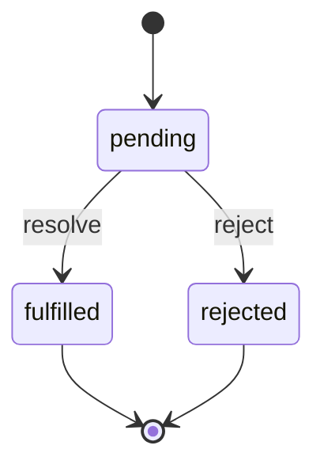

# Promise 与 async/await

## 1. Promise 原理与三种状态

Promise 是 ES6 引入的异步编程解决方案，是一个对象，用于获取异步操作的消息。从本意上讲，它是一个"容器"，里面存放着某个未来才会结束的事件（通常是一个异步操作）的结果。

### 1.1 三种状态

### 1.2 三种状态



| 状态 | 说明 | 能否继续改变 |
|------|------|------------|
| pending | 初始状态，等待中 | 可以变成 fulfilled 或 rejected |
| fulfilled | 操作成功完成 | 不能再改变 |
| rejected | 操作失败 | 不能再改变 |

### 1.3 手写 Promise 完整版

```javascript
class MyPromise {
  // 第 1 段：三个状态常量（终态唯一、不可逆）
  // 用 static 类字段挂成 "枚举"，避免字符串字面量散落各处写错（'fulfill' vs 'fulfilled'）。
  // 状态机只有两条边：pending→fulfilled、pending→rejected；一旦落定，后续 resolve/reject 必须被忽略。
  static PENDING = 'pending';
  static FULFILLED = 'fulfilled';
  static REJECTED = 'rejected';

  constructor(executor) {
    // 第 2 段：实例内部状态 + 订阅者队列的初始化
    // value 同时承载"成功值"和"失败原因"，由 state 区分语义，省去两个字段；
    // callbacks 用来缓存 pending 期间注册的 then 回调，等落定时统一触发（发布-订阅模式）。
    this.state = MyPromise.PENDING;
    this.value = undefined;
    this.callbacks = [];

    const resolve = (value) => {
      // 第 3 段：resolve 的幂等保护与 Promise 值解析（resolution）
      // 第一行的守卫是整个状态机的核心：终态不可被再次改写，保证 then 只会跑一次。
      if (this.state !== MyPromise.PENDING) return;
      if (value instanceof MyPromise) {
        // Promise套Promise：递归解析
        // 不直接把它当成功值，而是把自身的落定权"转交"给它；这样 new Promise(r=>r(p)) 最终值与 p 一致。
        value.then(resolve, reject);
        return;
      }
      // 先改 state 再触发回调：回调里若再次 resolve/reject，会被上面的守卫直接挡掉。
      this.state = MyPromise.FULFILLED;
      this.value = value;
      this.callbacks.forEach(cb => cb.onFulfilled(value));
    };

    const reject = (reason) => {
      // 第 4 段：reject 与 resolve 对称，但不做值解析
      // 失败原因始终原样透传，透传的拒绝态不会与"值穿透"混在一起（这正是 Promise 与 resolve 的非对称性）。
      if (this.state !== MyPromise.PENDING) return;
      this.state = MyPromise.REJECTED;
      this.value = reason;
      this.callbacks.forEach(cb => cb.onRejected(reason));
    };

    try { executor(resolve, reject); }
    catch (e) { reject(e); }
    // 第 5 段：executor 同步抛错的兜底
    // 用户回调体的异常必须转成拒绝态，否则会以同步异常形式冒出构造函数，破坏 Promise 的"永不 throw"契约；
    // 注意 try/catch 只覆盖同步执行部分，异步抛错要靠 then 里的 try/catch 接住。
  }

  then(onFulfilled, onRejected) {
    // 第 6 段：then 必须返回一个全新 Promise，从而是可链式的
    // 新 Promise 的 executor 里包住"回调调度 + 结果落定"，把上一个 Promise 的值转换成下一个 Promise 的状态。
    return new MyPromise((resolve, reject) => {
      const handle = (callback, fallback) => {
        // 第 7 段：回调统一走微任务 + 引用保存
        // queueMicrotask 模拟规范里的异步保证：即使当前已是终态，回调也不会同步执行，
        // 且 this.value 在入队时被闭包捕获，等到真正执行时仍读取的是落定后的值。
        queueMicrotask(() => {
          try {
            const fn = typeof callback === 'function' ? callback : fallback;
            const result = fn(this.value);
            // then回调的返回值决定下一个Promise的状态
            // 返回 thenable/Promise 时再次"转交落定权"（链式展开）；否则直接 resolve 普通值；
            // 回调内抛错则走 catch 分支 reject，这正是链式调用能"穿透"错误的基础。
            result instanceof MyPromise
              ? result.then(resolve, reject)
              : resolve(result);
          } catch (e) { reject(e); }
        });
      };

      // 第 8 段：按当前状态分派
      // 已终态：立即调度；pending：先存进 callbacks，等 resolve/reject 时再被遍历触发。
      // 易错点：pending 分支里包了一层函数，真正执行时会再进一次 handle → 又多一次微任务，比原生实现多一个 tick；
      // 复杂度上，每注册一个回调 O(1)，落定时统一触发 O(n)。
      if (this.state === MyPromise.FULFILLED) {
        handle(onFulfilled, v => v);
        // 成功态且没传 onFulfilled 时用恒等函数-value 直接向后透传
      } else if (this.state === MyPromise.REJECTED) {
        handle(onRejected, e => { throw e; });
        // 失败态且没传 onRejected 时抛出原因，让拒绝态沿着链继续向下传
      } else {
        this.callbacks.push({
          onFulfilled: () => handle(onFulfilled, v => v),
          onRejected: () => handle(onRejected, e => { throw e; })
        });
      }
    });
  }

  // 第 9 段：catch / finally 都是由 then 组合出的语法糖
  // catch 等价于 then(null, onRejected)，用来在同一层级收尾；
  // finally 这里只是把 fn 两侧都注册，属于极简实现：它既不透传原值/原因，也不等待 fn 返回的 Promise，
  // 因此本行行为与规范里的 finally 有差异，教学时应点明。
  catch(onRejected) { return this.then(null, onRejected); }
  finally(fn) { return this.then(fn, fn); }

  static resolve(value) {
    // 第 10 段：静态 resolve/reject 的快速通道
    // 传入值已经是 MyPromise 时直接返回同一个引用（不额外包装），保证 Promise.resolve(p) === p，
    // 这是链式转发时减少一层无谓嵌套的关键优化；否则用同步 executor 立刻落定。
    if (value instanceof MyPromise) return value;
    return new MyPromise(r => r(value));
  }

  static reject(reason) {
    return new MyPromise((_, r) => r(reason));
    // 失败值不会被解析展开（即使 reason 是 Promise 也原样拒绝），与静态 resolve 的行为不对称
  }
}
```

### 1.4 Promise.then 返回值规则

| then 回调返回值 | 下一个 Promise 的状态 |
|----------------|---------------------|
| 普通值         | resolved（该值）     |
| Promise        | 采用该 Promise 的最终状态 |
| throw 错误     | rejected（错误）      |
| thenable 对象  | resolved（调用 thenable.then） |

**thenable 例子**：拥有 `.then()` 方法的对象，会被 Promise.resolve 采用。

```javascript
const thenable = { then(resolve) { resolve(42); } };
Promise.resolve(thenable).then(x => console.log(x)); // 42
```

### 1.5 Promise 链式调用原理

```javascript
new Promise(r => r(1))
  .then(x => x + 1)      // p1 resolved 为 2
  .then(x => x * 2)      // p2 resolved 为 4
  .then(console.log);    // 打印 4
```

## 2. async / await 原理

`async` 函数返回 Promise，`await` 等待 Promise resolve 时会暂停 async 函数执行。

```javascript
// async 函数本质上返回 Promise
async function fn() { return 1; }
// 等价于：
function fn() { return Promise.resolve(1); }

// await 的执行顺序
async function main() {
  console.log('A');           // 同步执行
  await Promise.resolve();    // 暂停，产生微任务
  console.log('B');           // 微任务执行时打印
}
console.log('C');             // 同步
main();                       // 同步
console.log('D');             // 同步
// 输出：C, A, D, B
```

### 2.1 async/await 是 Generator 的语法糖

```javascript
// 手写 async 实现：asyncToGenerator
function asyncToGenerator(generatorFn) {
  return function(...args) {
    const gen = generatorFn.apply(this, args);
    return new Promise((resolve, reject) => {
      function step(key, value) {
        let result;
        try { result = gen[key](value); }  // gen.next() 或 gen.throw()
        catch (e) { return reject(e); }
        const { value: val, done } = result;
        if (done) { resolve(val); }
        else { Promise.resolve(val).then(v => step('next', v), e => step('throw', e)); }
      }
      step('next');
    });
  };
}

// co 函数：自动执行 Generator
function co(gen) {
  return new Promise((resolve, reject) => {
    if (typeof gen === 'function') gen = gen();
    function onFulfilled(val) {
      let result;
      try { result = gen.next(val); }
      catch (e) { return reject(e); }
      if (result.done) return resolve(result.value);
      Promise.resolve(result.value).then(onFulfilled, onThrow);
    }
    function onThrow(err) {
      let result;
      try { result = gen.throw(err); }
      catch (e) { return reject(e); }
      if (result.done) return resolve(result.value);
      Promise.resolve(result.value).then(onFulfilled, onThrow);
    }
    onFulfilled();
  });
}
```

## 3. Promise.all / race / allSettled / any

```javascript
// Promise.all：全部成功才成功，一个失败整体 reject
// 返回值顺序由输入顺序决定（即使完成顺序不同）
const p1 = Promise.resolve(1);
const p2 = new Promise(r => setTimeout(() => r(2), 100));
const p3 = Promise.resolve(3);
Promise.all([p1, p2, p3]).then(console.log); // [1, 2, 3] 按输入顺序

// Promise.all 实现
function promiseAll(promises) {
  return new Promise((resolve, reject) => {
    const results = new Array(promises.length);
    let settled = 0;
    promises.forEach((p, i) => {
      Promise.resolve(p).then(
        v => { results[i] = v; if (++settled === promises.length) resolve(results); },
        e => reject(e)
      );
    });
    if (promises.length === 0) resolve([]);
  });
}

// Promise.race：返回最先 settle 的 Promise（无论成功或失败）
Promise.race([
  new Promise(r => setTimeout(() => r(1), 300)),
  new Promise((_, r) => setTimeout(() => r(2), 100)),
  new Promise(r => setTimeout(() => r(3), 200))
]).then(console.log, console.error); // 2（第二个先失败）

// Promise.allSettled：等待所有 Promise settled（ES2020），不会因失败而 reject
Promise.allSettled([
  Promise.resolve(1),
  Promise.reject('error'),
  Promise.resolve(3)
]).then(results => results.forEach(r => {
  if (r.status === 'fulfilled') console.log(r.value);
  else console.error(r.reason);
}));
// [{status:'fulfilled',value:1}, {status:'rejected',reason:'error'}, {status:'fulfilled',value:3}]

// Promise.any：返回第一个 fulfilled 的 Promise，全部失败才 reject（AggregateError）
Promise.any([
  Promise.reject('err1'),
  Promise.reject('err2'),
  Promise.resolve(1)
]).then(console.log); // 1
```

### 3.1 对比表格

| 方法 | 成功条件 | 失败条件 | 返回值 |
|------|---------|---------|--------|
| `Promise.all` | 全部 fulfilled | 一个 rejected | 所有结果的数组 |
| `Promise.race` | 一个 settled | 一个 settled | 那个 Promise 的结果 |
| `Promise.allSettled` | 全部 settled | 从不 reject | 每个结果的对象 |
| `Promise.any` | 一个 fulfilled | 全部 rejected | 那个 fulfilled 的结果 |

## 4. 错误处理与 try/catch

```javascript
// Promise 错误处理优先级
async function handleError() {
  try {
    const res = await fetch('/api/data');
    if (!res.ok) throw new Error(`HTTP ${res.status}`);
    return await res.json();
  } catch (err) {
    console.error('请求失败:', err);
    return fallbackData;
  }
}

// try/catch 配合 Promise.allSettled
const results = await Promise.allSettled([
  fetch('/api/users').then(r => r.json()),
  fetch('/api/posts').then(r => r.json()),
]);

const { fulfilled, rejected } = results.reduce((acc, r, i) => {
  r.status === 'fulfilled' ? acc.fulfilled.push(r.value) : acc.rejected.push({ index: i, reason: r.reason });
  return acc;
}, { fulfilled: [], rejected: [] });
```

## 5. 微任务队列与 Promise

Promise 的 `.then()`/`.catch()`/`.finally()` 回调都是微任务，在当前同步代码执行完后尽快执行。

## 6. 常见陷阱与最佳实践

| 陷阱 | 说明 | 解决方案 |
|------|------|---------|
| Promise 嵌套 | 在 `.then()` 中 return new Promise() 而忘记 await | 统一在 async 函数中用 await |
| 忘记 return | `.then()` 中不 return，下一个 `.then()` 拿不到值 | 箭头函数简写 `() => value` 自动 return |
| catch 吞噬错误 | 空 catch 块导致错误静默消失 | 至少记录日志，或 re-throw |
| 并行请求取消 | 多个请求中某个失败导致整体失败 | 用 `Promise.allSettled()` 或 `Promise.any()` |
| 构造函数中同步抛错 | executor 中同步 throw 等同于 reject | 用 try/catch 包裹 executor |
| async 函数隐式 Promise | async 函数即使没有 return 也返回 Promise | 理解 async 函数是 Promise 包装器 |

## 7. 面试追问

**Q1: Promise.then().then().catch() 中，catch 之后还能继续链式调用吗？**
可以。`.catch()` 本身也返回 Promise，所以可以继续 `.then()`。

```javascript
Promise.reject('err')
  .catch(e => { console.error(e); return 'recovered'; })
  .then(v => console.log('继续:', v)); // 继续: recovered
```

**Q2: 如何实现 Promise.retry（自动重试）？**

```javascript
async function promiseRetry(fn, retries = 3, delay = 1000) {
  try { return await fn(); }
  catch (e) {
    if (retries <= 0) throw e;
    await new Promise(r => setTimeout(r, delay));
    return promiseRetry(fn, retries - 1, delay * 2); // 指数退避
  }
}

await promiseRetry(() => fetch('/api/data'), 3, 1000);
```

**Q3: `await Promise.all()` 和 `Promise.all(await ...)` 有何区别？**
前者是等待数组中的 Promise 并行执行，后者是逐个等待（串行），性能差异巨大。

```javascript
// 并行（好）：三个请求同时发出
const [users, posts, comments] = await Promise.all([
  fetch('/api/users').then(r => r.json()),
  fetch('/api/posts').then(r => r.json()),
  fetch('/api/comments').then(r => r.json()),
]);

// 串行（差）：一个接一个发出
const users = await fetch('/api/users').then(r => r.json());
const posts = await fetch('/api/posts').then(r => r.json());
const comments = await fetch('/api/comments').then(r => r.json());
```

## 8. 精简回顾：Promise 速记版

### 8.1 Promise 原理

```javascript
// Promise三种状态：
// pending（进行中）→ fulfilled（已成功）或 rejected（已失败）
// 状态一旦改变就不可逆

// 简化实现：
class MyPromise {
  constructor(executor) {
    this.state = 'pending';
    this.value = undefined;
    this.callbacks = [];

    const resolve = (value) => {
      if (this.state !== 'pending') return;
      this.state = 'fulfilled';
      this.value = value;
      // 处理异步onFulfilled
      this.callbacks.forEach(cb => cb.onFulfilled(value));
    };

    const reject = (reason) => {
      if (this.state !== 'pending') return;
      this.state = 'rejected';
      this.value = reason;
      this.callbacks.forEach(cb => cb.onRejected(reason));
    };

    try { executor(resolve, reject); }
    catch (e) { reject(e); }
  }

  then(onFulfilled, onRejected) {
    // 返回新的Promise以支持链式调用
    return new MyPromise((resolve, reject) => {
      const handle = (callback, fallback) => {
        try {
          const fn = typeof callback === 'function' ? callback : fallback;
          // 使用 queueMicrotask 确保微任务
          queueMicrotask(() => {
            if (this.state === 'fulfilled') {
              try { resolve(fn(this.value)); }
              catch (e) { reject(e); }
            } else if (this.state === 'rejected') {
              try { reject(fn(this.value)); }
              catch (e) { reject(e); }
            } else {
              // pending：注册回调
              this.callbacks.push({
                onFulfilled: (v) => handle(onFulfilled, v => v),
                onRejected: (v) => handle(onRejected, e => { throw e; })
              });
            }
          });
        } catch (e) { reject(e); }
      };
      handle(onFulfilled, v => v);
    });
  }

  catch(onRejected) { return this.then(null, onRejected); }
  finally(fn) { return this.then(fn, fn); }
}

// Promise.then 返回值规则：
// 普通值 → resolved(该值)
// Promise → 采用该Promise的最终状态
// throw错误 → rejected(错误)
// thenable对象 → resolved(thenable.then)

// Promise链式调用原理：
new Promise(r => r(1))
  .then(x => x + 1)     // p1 resolved为2
  .then(x => x * 2)     // p2 resolved为4
  .then(console.log)    // 打印4

// thenable：拥有then方法的对象，会被Promise采用
const thenable = {
  then(resolve, reject) { resolve(42); }
};
Promise.resolve(thenable).then(x => console.log(x)); // 42

// Promise.resolve做了什么：
// 1. 已经是Promise，直接返回
// 2. 有then方法的对象（thenable），包装后返回
// 3. 其他值：resolved Promise
// Promise.reject：永远是rejected
```


### 8.2 async / await 原理

```javascript
// async函数返回Promise
async function fn() { return 1; }
// 等价于：
function fn() { return Promise.resolve(1); }

// await：等待Promise resolve，暂停async函数执行
async function main() {
  const r1 = await fetchData(); // 等待Promise完成
  const r2 = await process(r1); // 等上一个完成再执行
  return r2;
}

// async是generator的语法糖：
// async function* gen() {} = generator + auto runner

// 手写async实现：
function asyncToGenerator(generatorFn) {
  return function(...args) {
    const gen = generatorFn.apply(this, args);
    return new Promise((resolve, reject) => {
      function step(key, value) {
        let result;
        try {
          result = gen[key](value); // gen.next() 或 gen.throw()
        } catch (e) { return reject(e); }
        const { value: val, done } = result;
        if (done) {
          resolve(val); // generator完成
        } else {
          // Promise化：如果value是Promise，继续then；否则直接next
          Promise.resolve(val).then(
            v => step('next', v),
            e => step('throw', e)
          );
        }
      }
      step('next');
    });
  };
}

// 示例：
function* gen() {
  const a = yield Promise.resolve(1);
  const b = yield Promise.resolve(a + 2);
  return b;
}
// 手动执行：
const g = gen();
g.next().value.then(v => g.next(v).value.then(w => g.next(w)));
// 自动执行（co函数）：
function co(gen) {
  return new Promise((resolve, reject) => {
    if (typeof gen === 'function') gen = gen();
    if (!gen || typeof gen.next !== 'function') return resolve(gen);
    onFulfilled();
    function onFulfilled(val) {
      let result;
      try { result = gen.next(val); }
      catch (e) { return reject(e); }
      if (result.done) return resolve(result.value);
      Promise.resolve(result.value).then(onFulfilled, onThrow);
    }
    function onThrow(err) {
      let result;
      try { result = gen.throw(err); }
      catch (e) { return reject(e); }
      if (result.done) return resolve(result.value);
      Promise.resolve(result.value).then(onFulfilled, onThrow);
    }
  });
}
co(gen).then(v => console.log(v)); // 3

// Generator原理：
// Generator函数调用时不执行，返回一个迭代器
// 每次调用iterator.next()执行到下一个yield，暂停
// next(val)可向yield传值（替换yield表达式的值）
// throw()向当前yield位置抛异常
// return()提前结束generator

function* counter() {
  let n = 0;
  while (true) {
    const input = yield ++n; // yield暂停，返回n+1，下次next(input)给input
    if (input === 'reset') n = 0;
  }
}
const it = counter();
console.log(it.next().value);     // 1
console.log(it.next().value);     // 2
console.log(it.next('reset').value); // 1（reset后n被设为0，yield返回++n=1）
```

### 8.3 Promise.all / race / allSettled / any

```javascript
// Promise.all：全部成功才成功，一个失败就reject
// 返回值顺序由输入顺序决定（即使完成顺序不同）
const p1 = Promise.resolve(1);
const p2 = new Promise(r => setTimeout(() => r(2), 100));
const p3 = Promise.resolve(3);
Promise.all([p1, p2, p3]).then(console.log); // [1, 2, 3]

// Promise.all 实现：
function promiseAll(promises) {
  return new Promise((resolve, reject) => {
    const results = new Array(promises.length);
    let settled = 0;
    promises.forEach((p, i) => {
      Promise.resolve(p).then(
        v => { results[i] = v; if (++settled === promises.length) resolve(results); },
        e => reject(e) // 有一个失败就reject
      );
    });
    if (promises.length === 0) resolve([]);
  });
}

// Promise.race：返回最先settle（成功或失败）的Promise
Promise.race([
  new Promise(r => setTimeout(() => r(1), 300)),
  new Promise((_, r) => setTimeout(() => r(2), 100)),
  new Promise(r => setTimeout(() => r(3), 200))
]).then(console.log, console.error); // 2（第二个先失败）

// Promise.allSettled：等待所有Promise settled，返回每个的结果
// ES2020，不会因为失败而reject
Promise.allSettled([
  Promise.resolve(1),
  Promise.reject("error"),
  Promise.resolve(3)
]).then(results => results.forEach(r => {
  if (r.status === 'fulfilled') console.log(r.value);
  else console.error(r.reason);
}));
// [{status:'fulfilled',value:1},{status:'rejected',reason:'error'},...]

// Promise.any：返回第一个fulfilled的Promise，全部失败才reject（AggregateError）
Promise.any([
  Promise.reject("err1"),
  Promise.reject("err2"),
  Promise.resolve(1)
]).then(console.log); // 1
```

## 深入阅读与参考

!!! tip "怎么用这些资料"
    先读「官方文档与规范」建立准确的概念，再读「源码与示例」核对细节，最后用「教程、书籍与视频」换一种讲法加深理解。每条都写明了读哪一节、带着什么问题读。

### 官方文档与规范

| 资源 | 为什么读 | 怎么读 |
|---|---|---|
| [Promise](https://developer.mozilla.org/en-US/docs/Web/JavaScript/Reference/Global_Objects/Promise) | 权威定义三种状态与 thenable 解析，是理解一切 Promise 行为的基准。 | 读描述、状态与构造器小节，抓住状态不可逆与 then 异步调用；读后手写一个状态机。 |
| [Promise.prototype.then()](https://developer.mozilla.org/en-US/docs/Web/JavaScript/Reference/Global_Objects/Promise/then) | 讲清 then 返回新 Promise、链式传递与回调入队时机，是 async/await 的底层。 | 读返回值与链式示例，追问「回调何时入队」；读后用 then 手动模拟 await 顺序。 |
| [Promise.prototype.catch()](https://developer.mozilla.org/en-US/docs/Web/JavaScript/Reference/Global_Objects/Promise/catch) | 错误处理核心：catch 等价于 then(undefined, fn)，并说明其返回与冒泡规则。 | 读语法与「catch 并非 try/catch」提示，对照链中抛错示例；读后写捕获后恢复的链。 |
| [Promise.all()](https://developer.mozilla.org/en-US/docs/Web/JavaScript/Reference/Global_Objects/Promise/all) | 汇总所有结果或首个拒绝，并说明输入顺序与输出顺序的对应关系。 | 读返回值与拒绝行为小节，思考一个失败是否取消其他；读后写并发请求只取成功结果。 |
| [Promise.race()](https://developer.mozilla.org/en-US/docs/Web/JavaScript/Reference/Global_Objects/Promise/race) | 理解竞速语义与超时封装，澄清 race 不会取消未完成的慢任务。 | 读描述与示例，注意落败 Promise 仍在执行；读后实现一个超时装饰器。 |
| [Promise.allSettled()](https://developer.mozilla.org/en-US/docs/Web/JavaScript/Reference/Global_Objects/Promise/allSettled) | 想拿到每项任务的成败又不中断流程时的标准答案，附状态对象结构。 | 读 status、value、reason 字段，对比 all 的失败策略；读后改造批量任务脚本。 |
| [Promise.any()](https://developer.mozilla.org/en-US/docs/Web/JavaScript/Reference/Global_Objects/Promise/any) | 首个成功即返回，全部失败才抛 AggregateError，是与 race 区别的关键。 | 读与 race 的对比及 AggregateError 一节，判断何时该用 any；读后做多镜像请求。 |
| [async function](https://developer.mozilla.org/en-US/docs/Web/JavaScript/Reference/Statements/async_function) | 规范说明 async 函数始终返回 Promise 及其内部 await 的执行语义。 | 读描述与返回值小节，追问 return 值如何被包装；读后把旧 Promise 链改写。 |
| [await](https://developer.mozilla.org/en-US/docs/Web/JavaScript/Reference/Operators/await) | 解释 await 的操作数、非 Promise 值处理与让出执行权的时机。 | 读语法与示例，注意 await 并不阻塞线程；读后用微任务日志验证执行顺序。 |
| [Promises/A+ 规范](https://promisesaplus.com/) | 最权威的实现标准，逐条要求能澄清状态、then 与解析过程的细节。 | 读术语与 then 方法要求，对照实现后跑官方测试套件定位差异。 |
| [MDN 事件循环](https://developer.mozilla.org/en-US/docs/Web/JavaScript/Event_loop) | 官方视角解释任务与微任务队列，是 Promise 回调时机的权威依据。 | 读微任务小节，带着「then 与 setTimeout 谁先」去读；读后画一次完整时序图。 |

### 源码与示例

| 资源 | 为什么读 | 怎么读 |
|---|---|---|
| [JS Visualizer 9000](https://www.jsv9000.app/) | 把 Promise 回调与定时器放在同一时间轴上可视化，直观核验微任务顺序。 | 先预测输出再单步播放，对照事件循环图；读后自编三道排序题自测。 |

### 教程、书籍与视频

| 资源 | 为什么读 | 怎么读 |
|---|---|---|
| [现代 JavaScript 教程：异步](https://zh.javascript.info/async) | 分章递进且练习密集，把回调、Promise、async/await 串成一条学习线。 | 按序做 Promise 链与 async/await 课后题，错题回到对应小节重读。 |
| [MDN 使用 Promise](https://developer.mozilla.org/en-US/docs/Web/JavaScript/Guide/Using_promises) | 从回调地狱出发的实操教程，覆盖链式调用与错误处理两条主线。 | 读链式与错误处理两节，带着「如何消掉嵌套」去读；读后改写一段回调代码。 |

## 应用与行业实践

前面几节讲了 Promise 的状态流转、组合方法与微任务队列。这一节把这些知识放回到具体页面和具体接口里，说明用到哪里、怎么验证、什么时候别用。

### 应用场景地图

| 场景 | 用到本页哪个知识点 | 典型技术选型 | 注意事项 |
|---|---|---|---|
| 后台管理的万行表格首屏 | Promise.all 并发、allSettled 降级 | fetch + 分页接口 + 虚拟滚动 | 主数据失败必须报错，筛选项失败可降级 |
| 低端安卓的首屏配置加载 | race 超时、any 多源回退 | fetch + 多 CDN 域名 + 本地兜底 | 写请求不能靠超时重试，需要幂等键 |
| 多人协作白板的增量同步 | 微任务队列、串行 Promise 链 | WebSocket + 操作队列 | 队列要设长度上限，离线后改整体重同步 |
| 下单页的库存/优惠/运费聚合 | Promise.all、try/catch 分类 | BFF 聚合接口 | 区分"必须阻断"与"可降级"两类失败 |
| 文件分片上传 | all 并发、allSettled 收集结果 | 分片上传 + 断点续传 | 并发数要限流，失败分片单独重传 |
| 支付结果轮询 | async/await 循环、race 超时 | 轮询接口 + 退避间隔 | 总时长要封顶，间隔要递增 |
| 前端埋点上报 | 错误处理、allSettled | sendBeacon + fetch keepalive | 埋点失败不能影响业务 Promise 链 |
| Node.js BFF 聚合下游 | all / allSettled、单请求超时 | Node.js + 下游 HTTP 调用 | 每个下游单独设超时，避免整链等待 |
| 图片懒加载与预加载 | 微任务队列、race 超时 | IntersectionObserver + decode() | 预加载限并发，离开视口要能取消 |

### 三个场景拆解

#### 场景 1：后台管理的万行表格首屏

**业务背景**：表格一屏展示 50 行，另外还要总条数、筛选项、列配置三份数据。运营反馈"点进页面先看到空白"，用 DevTools 瀑布图可以复现这个等待区间。

**怎么用本页知识解决**：先把请求分成两类。缺了就不能渲染的放进 Promise.all，缺了只影响体验的放进 Promise.allSettled。

```js
async function loadFirstScreen() {
  // 主数据：任一份失败就抛出，交给上层错误处理
  const [rows, total] = await Promise.all([
    fetchRows({ page: 1, size: 50 }),
    fetchTotal(),
  ]);
  // 辅助数据：失败也给个默认值，不挡渲染
  const [filters, columns] = await Promise.allSettled([
    fetchFilterOptions(),
    fetchColumnConfig(),
  ]);
  return {
    rows,
    total,
    // allSettled 返回 {status, value|reason}，取值前判 status
    filters: filters.status === 'fulfilled' ? filters.value : [],
    columns: columns.status === 'fulfilled' ? columns.value : defaultColumns,
  };
}
```

- Promise.all 让两个必成功请求同时发出，等待时间接近两者中较慢的那个。
- 顺序 await 两批请求会串行等待，瀑布图里能看到两段不重叠的空白。
- allSettled 的结果是 `{status, value}` 或 `{status, reason}`，取值前必须判断 status。
- 总条数留在 all 里：它失败时页码会算错，整页报错比静默降级更保险。
- 用到 allSettled 前，先查 MDN 兼容性表，确认目标浏览器与 Node.js 版本支持。

**怎么度量收益**：用 Chrome DevTools 的 Performance 面板录一次首屏，看两个必成功请求的时间区间是否重叠。再看 Lighthouse 的 LCP 与 TBT。线上用 RUM 采集首屏完成耗时，按网络类型和机型档位分桶看 p50 与 p95。

**什么时候不该用**：报表导出要求条数与列表严格一致，任一字段缺失都不能出文件，此时不该降级。后端只提供一次性全量接口时，Promise.all 并行取数没有收益，要先改接口分页。

#### 场景 2：低端安卓的首屏加载

**业务背景**：首屏配置走 CDN，弱网下请求可能挂住十几秒，用户一直看到白屏。机型档位越低，解析 JSON 和渲染占用的主线程时间越长，超时越容易出现。

**怎么用本页知识解决**：给每个请求加超时上限，配置这类只读数据用多来源竞争。

```js
function withTimeout(promise, ms) {
  // 超时分支 reject，与原 promise 竞争
  const timeout = new Promise((_, reject) =>
    setTimeout(() => reject(new Error('timeout')), ms));
  return Promise.race([promise, timeout]);
}

// 主备两个源拿同一份配置，先成功的那个胜出
const config = await Promise.any([
  withTimeout(fetchConfig(mainCdn), 1500),   // 主源 1.5 秒
  withTimeout(fetchConfig(backupCdn), 2500), // 备源放宽阈值
]).catch(() => localDefaultConfig);          // 全部失败用本地兜底
```

- Promise.race 只决定谁先落定，不会取消慢请求；要真取消得把 AbortSignal 传给 fetch。
- Promise.any 在所有来源都失败时抛 AggregateError，catch 里能读到每个失败原因。
- 备源阈值放宽，是因为它启动更晚，用同一阈值会让它先被淘汰。
- 兜底配置必须内置在包里，断网时才有数据可用。
- 超时阈值要在低端机实测后填写，不能照搬桌面浏览器的数值。
- 配置接口通常带缓存，多源回退要与 Cache-Control 配合，避免拿到跨版本的配置。

**怎么度量收益**：看 web.dev 定义的 LCP 与 INP，用 DevTools Performance 或真实用户监控采集。埋点上报超时触发次数与兜底配置命中率，再与后端日志对账。第三个指标是慢请求占比，即请求耗时 p95 落到超时阈值以上的比例。

**什么时候不该用**：支付、下单这类写请求，超时后自动重试可能造成重复提交，需要幂等键配合。余额、库存扣减这类要求强一致的接口不要多源回退，不同源的数据版本可能不同。

#### 场景 3：多人协作白板的增量同步

**业务背景**：多人同时拖动图形，每个操作都要按产生顺序发到服务端。乱序会让本地画面与服务端状态对不上，协作者越多，客户端排队压力越大。

**怎么用本页知识解决**：用一条共享的 Promise 链把所有写操作串起来，链尾就是队尾。

```js
let chain = Promise.resolve(); // 串行队列的队尾

function enqueue(op) {
  // 挂到队尾，发送顺序等于操作产生顺序
  chain = chain
    .then(() => sendOp(op))
    .catch((err) => { reportError(err); }); // 单条失败不打断队列
  return chain;
}

renderLocal(op);                                  // 先本地乐观渲染
enqueue(op).then(() => confirm(op)).catch(() => rollback(op));
```

- then 的回调进入微任务队列，链式调用保证前一个执行完才排下一个。
- 队列必须共享同一个变量，每次都新建 Promise.all 就无法保证顺序。
- 单条失败要在 catch 里吞掉并上报；否则链变成 rejected 状态，后续操作会被跳过。
- 本地先渲染属于乐观更新，服务端确认后要用返回的版本号校正。
- 队列要设长度上限，离线过久时改为整体重同步，而不是补发全部操作。

**怎么度量收益**：端到端同步延迟，即本地操作时间戳到收到服务端确认时间戳的差值，取 p50 与 p95。乱序率，统计服务端收到序号与客户端产生序号不一致的次数。再加一个队列积压长度，由前端定时上报。

**什么时候不该用**：高频自由绘制（画笔轨迹）不要逐点串行发送，应合并成批或降低采样率。协作光标位置这类可丢包的数据走串行队列会引入排队延迟，应改走不可靠通道。

### 行业先进实践

`AbortSignal.timeout()` 与 `AbortController`（出处：MDN Web Docs 的 AbortController、AbortSignal 页面）

fetch 支持 signal 参数，超时或组件卸载时能主动取消请求，不让连接被挂住的请求占着。

借鉴做法是把请求的 signal 与组件生命周期绑定。使用 `AbortSignal.timeout()` 前需核对官方文档：目标浏览器与 Node.js 版本是否提供该静态方法；没有就用 setTimeout 加 controller.abort() 手写。

`no-floating-promises` 规则（出处：typescript-eslint 官方文档的规则列表）

该规则要求对返回 Promise 的调用做 await、return 或显式 void 标注，让漏掉的异步调用在评审阶段暴露。

借鉴做法是在 CI 的 lint 阶段开启该规则并设为 error，新代码合入前必须通过。

`Promise.allSettled` 用于非关键依赖聚合（出处：MDN Web Docs 的 Promise.allSettled 页面）

它等所有输入落定后统一返回状态，一个失败不会丢弃其它结果。

借鉴做法是把埋点、筛选项、列配置这类非关键请求集中到 allSettled，关键路径仍用 Promise.all。

Node.js 的未处理拒绝策略（出处：Node.js 官方文档的 process 事件章节与 CLI 文档）

Node.js 提供 unhandledRejection 事件与 --unhandled-rejections 命令行选项，可把未处理的拒绝按严格模式终止进程。

借鉴做法是在服务端启动脚本里显式选定策略，并把拒绝写入日志与告警。需核对官方文档：目标 Node.js 版本对该选项的默认取值。

INP 指标与长任务（出处：web.dev 的 INP、Long Tasks 相关文章）

主线程长任务会推迟微任务回调的执行，交互响应因此变慢。

借鉴做法是把大数组的同步处理切成多个任务，用 Performance 面板确认长任务数量与 INP 的变化。

### 从学到用：落地路线

第 1 步试点：选一个页面的首屏加载，把串行 await 改成 Promise.all，其余逻辑不动。验收标准：瀑布图里两个必成功请求的时间区间出现重叠，评审确认降级分支只覆盖非关键数据。

第 2 步验证：用 Performance 面板与 RUM 各采一份数据，对比改动前后的首屏完成耗时 p50 与 p95。验收标准：同一网络档位重复 10 次，p95 首屏完成耗时下降；断网与单接口 500 两种故障下手动测试走到预期分支。

第 3 步推广：把超时封装、错误分类、串行队列抽成公共模块，其它页面按同一套接口接入。验收标准：公共模块的单元测试覆盖全部成功、部分失败、全部失败三种输入；接入页面不再各自手写 setTimeout。

第 4 步防回退：把 no-floating-promises 与未处理拒绝上报接入 CI 和线上告警。验收标准：CI 中该规则为 error，线上出现未处理拒绝时能定位到页面与接口。

### 动手作业

**目标**：写一个首屏聚合加载器，并发取三份数据，其中一份可降级、一份带超时、一份多源回退。

**步骤**：

1. 写三个返回 Promise 的 mock 请求函数，分别设定不同的延迟与失败概率。
2. 用 Promise.all 取两份必须成功的数据，任一份失败就让整个加载失败。
3. 用 Promise.allSettled 取第三份可降级数据，失败时返回默认值。
4. 用 Promise.race 给可降级请求加超时，超时后走默认值并记录一次超时事件。
5. 给其中一份数据写两个来源，用 Promise.any 取先成功的结果，全失败时抛自定义错误。
6. 用 performance.mark 与 performance.measure 打印每个请求的开始与结束时刻。
7. 写四种输入的测试：全部成功、可降级项失败、可降级项超时、多源全部失败。

**验收标准**：

- 四种输入下手动运行结果符合预期，控制台没有未处理拒绝的警告。
- 时间线打印显示两份必成功请求的时间区间重叠。
- 超时分支触发时，慢请求的结束时刻晚于降级结果的返回时刻，说明主流程没有等它。
- 多源全部失败时抛出的错误里能读到每个来源的失败原因。
- 可降级项失败时返回对象的字段结构与全部成功时相同，同名字段都在。

