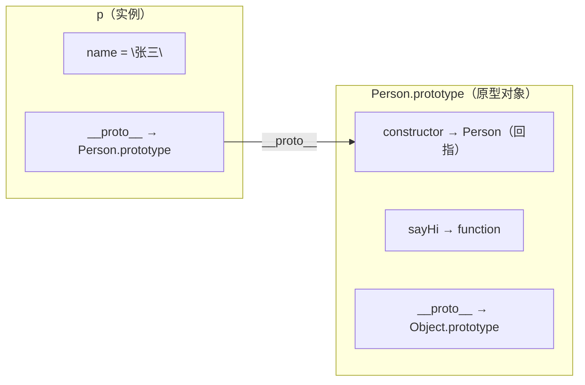
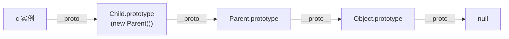

# 原型链与继承

## 1. 原型与原型链

### 1.1 prototype vs __proto__

```javascript
// prototype：函数独有的属性，指向原型对象（用于new时继承）
// __proto__：对象都有，指向其构造函数的prototype

function Person(name) { this.name = name; }
Person.prototype.sayHi = function() { return `你好，我是${this.name}`; };

const p = new Person("张三");
console.log(p.__proto__ === Person.prototype); // true
console.log(Person.prototype.constructor === Person); // true
```



### 1.2 原型链

```javascript
// 原型链：实例 → 构造函数.prototype → Object.prototype → null
// 查找属性时，顺着原型链向上找，直到null

const obj = { name: "obj" };
// obj → Object.prototype → null

function Parent() { this.parent = "parent"; }
function Child() { this.child = "child"; }
Child.prototype = new Parent(); // 原型链继承
Child.prototype.constructor = Child;

const c = new Child();
console.log(c.child);   // "child"
console.log(c.parent);  // "parent"（沿原型链找到）

// 顺原型链查找属性：
console.log(c.hasOwnProperty('child'));   // true
console.log(c.hasOwnProperty('parent'));  // false（在原型上）
console.log('parent' in c);               // true（in会查找整条链）
```



## 2. JS 继承实现

### 2.1 原型链继承

```javascript
// 原型链继承：子类的原型指向父类实例
function Parent() { this.colors = ["红", "蓝"]; }
Parent.prototype.say = function() { console.log("Parent.say"); };

function Child() {}
Child.prototype = new Parent();
Child.prototype.constructor = Child;

const c1 = new Child();
c1.colors.push("绿");
console.log(c1.colors); // ["红","蓝","绿"]
const c2 = new Child();
console.log(c2.colors); // ["红","蓝","绿"]（引用共享，问题！）

// 优点：简单，方法可复用
// 缺点：引用类型被共享，无法向父类传参
```

### 2.2 构造函数继承（借用构造函数）

```javascript
// 借用构造函数：在子类中调用父类构造函数
function Parent(name) { this.name = name; this.colors = ["红"]; }
function Child(name, age) {
  Parent.call(this, name); // 复制父类属性到子类实例
  this.age = age;
}

const c1 = new Child("张三", 18);
c1.colors.push("蓝");
console.log(c1.colors); // ["红","蓝"]
const c2 = new Child("李四", 20);
console.log(c2.colors); // ["红"]（独立，不共享！）

// 优点：引用类型独立，可传参
// 缺点：方法不能复用（每个实例都有方法副本），需要调用两次构造函数
```

### 2.3 组合继承

```javascript
// 组合继承：原型链 + 构造函数
function Parent(name) { this.name = name; this.colors = ["红"]; }
Parent.prototype.say = function() { console.log(this.name); };

function Child(name, age) {
  Parent.call(this, name); // 借用构造函数：继承实例属性
  this.age = age;
}
Child.prototype = new Parent(); // 原型链：继承方法
Child.prototype.constructor = Child;
Child.prototype.study = function() { console.log("学习"); };

// 测试
const c = new Child("张三", 18);
c.colors.push("蓝");
console.log(c.colors); // ["红","蓝"]
c.say(); // 张三
c.study(); // 学习

// 优点：弥补了原型链和构造函数继承的缺点
// 缺点：调用了两次父类构造函数（call + new）
```

### 2.4 寄生继承

```javascript
// 寄生继承：组合继承的优化，避免调用两次构造函数
function Parent(name) { this.name = name; }
Parent.prototype.say = function() { console.log(this.name); };

function Child(name, age) {
  Parent.call(this, name); // 借用构造函数
  this.age = age;
}

// 用Object.create代替new Parent()，只继承方法，不继承实例属性
Child.prototype = Object.create(Parent.prototype);
Child.prototype.constructor = Child;

// Object.create内部：
// {}.__proto__ = Parent.prototype（只复制了方法，没有实例属性）

// 优化：只需继承prototype上的方法，Parent的实例属性已经在call中复制了
```

### 2.5 ES6 class 继承

```javascript
class Animal {
  constructor(name) { this.name = name; }
  speak() { console.log(`${this.name}叫`); }
  static info() { return "动物类"; }
}

class Dog extends Animal {
  constructor(name, breed) {
    super(name); // 必须在this之前调用
    this.breed = breed;
  }
  speak() { console.log(`${this.name}汪汪`); }
  run() { console.log(`${this.name}奔跑`); }
}

const d = new Dog("旺财", "金毛");
d.speak(); // 旺财汪汪（子类覆盖）
d.run();   // 旺财奔跑
console.log(d instanceof Dog);   // true
console.log(d instanceof Animal); // true（顺着原型链）

// class本质：
// class = 构造函数 + 原型方法 的语法糖
// class Dog {} 等价于 function Dog() {}
// Dog.prototype = Object.create(Animal.prototype)
// Dog.prototype.constructor = Dog

// super原理：
// super() = Animal.call(this, name)
// 调用父类构造函数，将子类实例作为this
// super.method() = Animal.prototype.method.call(this)
// 调用父类方法，绑定子类的this

// 静态方法继承：
class Cat extends Animal {}
console.log(Cat.info()); // 动物类（静态方法也被继承了）
```

## 应用与行业实践

### 应用场景地图

| 场景 | 用到本页哪个知识点 | 典型技术选型 | 注意事项 |
|---|---|---|---|
| 后台管理的万行表格 | prototype 共享排序、格式化方法 | 原生 class + 虚拟滚动 | 原型方法不随 JSON 序列化，序列化要另写 |
| 低端安卓的首屏加载 | Object.create 扁平原型替代深层继承 | ES5 工厂函数 + 轻组件 | 实例数少于百级时不要优先改这里 |
| 多人协作白板 | class extends 建立图形类型层级 | TypeScript class + 组合接口 | postMessage 结构化克隆会丢弃原型 |
| 插件系统 | 基类 Plugin 定义生命周期钩子 | class 基类 + 注册表 | 多能力插件用组合，避免深类树 |
| 前端监控 SDK 埋点 | 自定义 Error 子类区分异常 | class extends Error | 必须设置 `name`，否则日志分类混乱 |
| 表单引擎校验器 | 原型链组合校验规则 | Object.create + 校验器组合 | 动态规则不要写死在原型链 |
| 微前端沙箱 | Object.create(null) 做隔离字典 | Proxy + null prototype 对象 | 要同时处理全局对象原型的污染 |
| 游戏实体组件 | 实体类继承与行为 mixin | class + mixin | 行为多变时组件化优于深类树 |

### 三个场景拆解

#### 场景 1：后台管理万行表格

**业务背景**：后台表格单页展示 5 万行以上，用户要求排序、筛选、格式化不卡顿。可复现测试：在 Chrome DevTools 中生成 1 万个行对象并执行排序。

**怎么用本页知识解决**：思路是把行操作方法移到 `RowModel.prototype`，避免每个行对象复制函数。代码：

```js
function RowModel(id, cells) {
  this.id = id;
  this.cells = cells;
}
// 共享方法只存一份，不在构造器里复制
RowModel.prototype.formatCell = function (key) {
  const cell = this.cells[key];
  return cell == null ? '' : String(cell);
};
RowModel.prototype.compareBy = function (other, key) {
  return this.formatCell(key).localeCompare(other.formatCell(key));
};
```

- `formatCell` 挂在 `RowModel.prototype`，所有行对象访问同一函数。
- `compareBy` 通过 `this.formatCell` 查找原型方法，不在实例上存闭包。
- 新增派生列时继续在原型上扩展，旧实例不需要重建。
- 用 `hasOwnProperty` 可验证方法不在实例自身。

**怎么度量收益**：用 Chrome DevTools Memory 面板记录 heap snapshot，比较改动前后 `RowModel` 实例的保留内存。用 Performance 面板录制 1 万行排序，看 Scripting 耗时和 long task 数量。

**什么时候不该用**：单元格格式化需要缓存每行结果时，实例字段比原型方法更适合。后端需要完整计算后的表格 JSON 时，原型方法不会出现在 `JSON.stringify` 结果中。

#### 场景 2：低端安卓首屏加载

**业务背景**：低端 Android WebView 首屏有 500 个可交互组件，构造器复制方法让脚本执行时间变长。可复现方法：用 Puppeteer 设置 CPU 4x slowdown 录制首屏 trace。

**怎么用本页知识解决**：思路是使用一层扁平原型，让组件实例共享 `mount`、`show` 函数。代码：

```js
const ViewProto = {
  mount() { this.el = document.createElement(this.tag); return this.el; },
  show() { if (this.el) this.el.classList.add('is-visible'); }
};
// 通过扁平原型创建组件，避免每个实例复制函数
function createView(options) {
  const view = Object.create(ViewProto);
  view.tag = options.tag;
  view.text = options.text || '';
  return view;
}
```

- `ViewProto` 是扁平对象，`mount` 和 `show` 只保存一份。
- `Object.create(ViewProto)` 形成的原型链只有一层，属性查找比多层类继承更短。
- `createView` 用实例字段保存 `tag`、`text`，状态与方法分离。
- 若需要多个能力，优先把能力对象 `Object.assign` 到 ViewProto，不要构造多层子类。

**怎么度量收益**：用 Lighthouse 移动端模拟记录 FCP 和 TTI。用 Puppeteer 的 `CPUThrottling: 4` 和低端设备参数录制 trace，看 `EvaluateScript`、`RunMicrotasks` 耗时。重复 5 次取中位数。

**什么时候不该用**：组件实例不到 100 个，复制方法的绝对内存小于 1 KB，不该重写。项目已由 Vue/React 等框架编译模板，方法共享已由框架处理，手工 Object.create 会打断渲染生命周期。

#### 场景 3：多人协作白板

**业务背景**：白板画布可同时存在 5000 个矩形、圆、文本，框选时要做命中检测。可复现测试：构造 5000 个 `Rect` 并循环调用 `hitTest`，记录主线程耗时。

**怎么用本页知识解决**：思路是用 `Shape` 基类共享通用字段和序列化，子类只覆写命中判断。代码：

```js
class Shape {
  constructor(id, x, y) {
    this.id = id;
    this.x = x;
    this.y = y;
  }
  hitTest(px, py) { return false; }
  toJSON() { return { id: this.id, type: this.type, x: this.x, y: this.y }; }
}
class Rect extends Shape {
  constructor(id, x, y, w, h) {
    super(id, x, y);
    this.w = w;
    this.h = h;
    this.type = 'rect';
  }
  hitTest(px, py) {
    return px >= this.x && px <= this.x + this.w && py >= this.y && py <= this.y + this.h;
  }
}
```

- `Rect` 通过 `super` 复用父类构造器。
- `hitTest` 按矩形边界判断，圆和文本分别覆写自己的判断。
- `type` 在实例上，JSON 序列化时保留，反序列化可用来重建原型。
- `toJSON` 是 `JSON.stringify` 会识别的原型方法。

**怎么度量收益**：用 `performance.now()` 包裹 5000 个 `Rect` 的创建和全量 `hitTest`。用 Chrome DevTools Memory 面板记录 Shape/Rect 的保留内存。也可用 Node 的 `--expose-gc` 和 `heapUsed` 测试。

**什么时候不该用**：图形需要跨 Worker 或服务器同步，结构化克隆会移除原型方法，必须另建还原流程。图形类型少且行为稳定时，一个带 `type` 的普通对象加 switch 更直接。

### 行业先进实践

1. **组合优先于继承（出处：React 官方文档 Composition vs Inheritance）**。组件间用 `props.children` 或专用组合，不建组件类继承。这样数据流和生命周期清楚，避免原型链上不可见方法传递。你的项目可以把继承限制在纯数据模型和错误类型。

2. **自定义错误类型（出处：MDN Error 文档）**。用 `class RequestError extends Error` 并设置 `name`。监控平台按 `name` 和 `instanceof` 分类错误，堆栈保留。你的 SDK 可为网络错误、解析错误建 2-3 个子类。

3. **ESLint `no-prototype-builtins`（出处：ESLint 官方规则文档）**。禁止直接 `obj.hasOwnProperty`，要求 `Object.prototype.hasOwnProperty.call` 或 `Object.hasOwn`。防止 `Object.create(null)` 对象和被篡改原型的方法调用失败。你的项目可在共享工具层启用。

4. **`Object.create(null)` 作为字典（出处：MDN Object.create 文档）**。创建无原型对象存映射，避免键名 `toString` 等冲突。适合处理用户输入的 key。你的项目可用在缓存和黑白名单。

### 从学到用：落地路线

1. 先在后台表格模块试点，把行对象方法移到 `RowModel.prototype`。验收：`new RowModel(...).hasOwnProperty('formatCell')` 为 false，排序单测通过。
2. 在低端设备模拟环境回放首屏脚本，验证脚本耗时。验收：5 次 trace 的 Scripting 中位数低于改动前基线。
3. 把验证过的写法固化为 ESLint 规则和示例代码。验收：CI 拦截 `obj.hasOwnProperty` 直接调用，代码评审检查表出现原型检查项。
4. 在白板图形同步与恢复链路加原型链校验，防止回归。验收：同步后对象能从 JSON 恢复为 `Rect` 实例并调用 `hitTest`。

### 动手作业

目标：实现一个图形对象类型系统，包含矩形、圆、文本，能序列化与命中检测。

步骤：

1. 建 `Shape` 基类，构造器接收 `id/x/y`，原型方法 `toJSON` 返回 `{id,type,x,y}`。
2. 建 `Rect` 子类，继承 `Shape`，增加 `w/h`，覆写 `hitTest`。
3. 建 `Circle` 子类，继承 `Shape`，增加 `r`，用半径公式覆写 `hitTest`。
4. 建 `Text` 子类，继承 `Shape`，增加 `content`，覆写 `toJSON` 保留文本。
5. 写 3 组断言：原型链指向、`hasOwnProperty` 结果、`Object.keys` 实例字段。
6. 用 `performance.now()` 记录创建 10000 个 `Rect` 的耗时，并用 Memory 面板截图。
7. 实现 `cloneFromJSON(data)`，按 `data.type` 重建实例，恢复原型方法。

验收标准：

- `rect instanceof Shape` 与 `rect instanceof Rect` 均为 true。
- `rect.hasOwnProperty('hitTest')` 为 false，`Object.getPrototypeOf(rect) === Rect.prototype` 为 true。
- 两个 Rect 实例的 `hitTest` 严格相等，证明方法共享。
- `JSON.parse(JSON.stringify(rect)).hitTest` 为 undefined，`cloneFromJSON` 恢复后调用 `hitTest(0,0)` 返回 true 或 false。
- 已记录 10000 个 Rect 创建耗时与 heap snapshot 文件路径。

