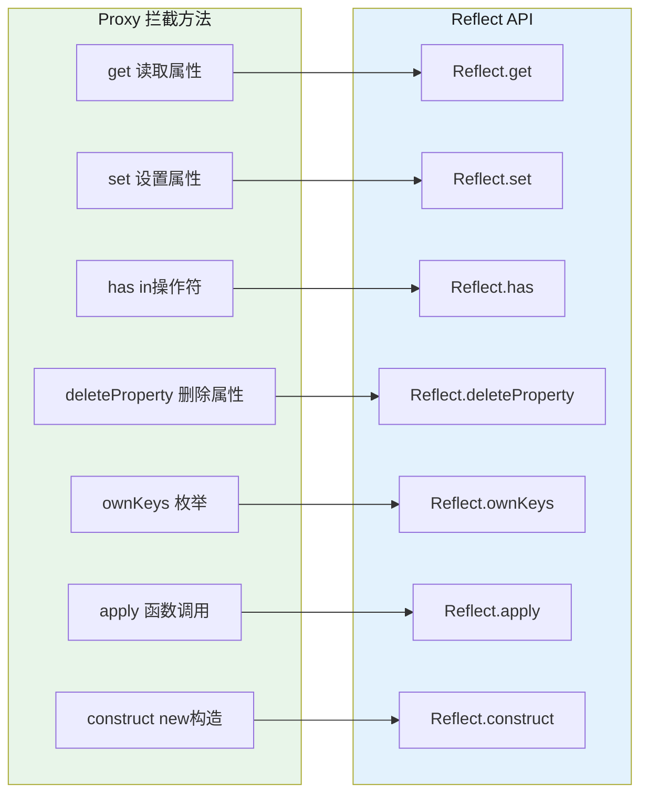

# Proxy 与 Reflect

## 1. Proxy 原理与 Trap 体系

`Proxy` 是 ES6 引入的元编程能力，用于拦截和自定义对象的基本操作（get、set、delete 等）。每个拦截行为称为一个 **trap**（陷阱），与 `Reflect` API 一一对应。




### 1.1 完整 Proxy Handler 示例

```javascript
const target = { name: 'Alice', age: 18, _secret: 42 };
const handler = {
  // 属性读取拦截
  get(target, prop, receiver) {
    if (prop.startsWith('_')) {
      throw new Error('私有属性不可访问');
    }
    const value = Reflect.get(target, prop, receiver);
    console.log(`读取 ${prop}: ${value}`);
    return value;
  },

  // 属性设置拦截
  set(target, prop, value, receiver) {
    if (prop === 'age' && (value < 0 || value > 150)) {
      throw new Error('年龄不合理');
    }
    console.log(`设置 ${prop} = ${value}`);
    return Reflect.set(target, prop, value, receiver);
  },

  // in 操作符拦截（'name' in proxy）
  has(target, prop) {
    if (prop.startsWith('_')) return false; // 私有属性不在 in 中出现
    return Reflect.has(target, prop);
  },

  // delete 操作拦截
  deleteProperty(target, prop) {
    if (prop.startsWith('_')) {
      throw new Error('不能删除私有属性');
    }
    console.log(`删除 ${prop}`);
    return Reflect.deleteProperty(target, prop);
  },

  // Object.keys / Object.entries 等枚举操作
  ownKeys(target) {
    return Reflect.ownKeys(target).filter(k => !k.toString().startsWith('_'));
  },

  // Object.getOwnPropertyDescriptor
  getOwnPropertyDescriptor(target, prop) {
    return Reflect.getOwnPropertyDescriptor(target, prop);
  },

  // Object.defineProperty
  defineProperty(target, prop, descriptor) {
    console.log(`定义属性 ${prop}`);
    return Reflect.defineProperty(target, prop, descriptor);
  },

  // Object.preventExtensions
  preventExtensions(target) {
    console.log('阻止扩展');
    return Reflect.preventExtensions(target);
  },

  // getPrototypeOf
  getPrototypeOf(target) {
    return Reflect.getPrototypeOf(target);
  },

  // setPrototypeOf
  setPrototypeOf(target, proto) {
    console.log('设置原型');
    return Reflect.setPrototypeOf(target, proto);
  },

  // isExtensible
  isExtensible(target) {
    return Reflect.isExtensible(target);
  },

  // apply（拦截函数调用）
  apply(target, thisArg, args) {
    console.log(`调用函数，参数: ${args}`);
    return Reflect.apply(target, thisArg, args);
  },

  // construct（拦截 new 操作）
  construct(target, args) {
    console.log('使用 new 构造');
    return Reflect.construct(target, args);
  }
};

const proxy = new Proxy(target, handler);
console.log(proxy.name);        // 读取 name: Alice
proxy.age = 25;                 // 设置 age = 25
console.log('name' in proxy);  // true
console.log('_secret' in proxy); // false（has trap 拦截）
```

## 2. Vue3 响应式原理（Proxy + Reflect）

Vue3 使用 Proxy 完全重写了响应式系统，相比 Vue2 的 `Object.defineProperty` 有质的飞跃。

```javascript
// Vue3 reactive 简化实现
function reactive(obj) {
  return new Proxy(obj, {
    get(target, key, receiver) {
      // track：依赖收集，记录谁在读取这个属性
      track(target, key);
      const value = Reflect.get(target, key, receiver);
      // 如果属性仍是对象，递归包装为响应式（Vue3 的深度响应式）
      if (value !== null && typeof value === 'object') {
        return reactive(value); // 返回新代理（lazy 深度响应式）
      }
      return value;
    },

    set(target, key, value, receiver) {
      const oldValue = target[key];
      const result = Reflect.set(target, key, value, receiver);
      // trigger：触发更新，通知所有依赖这个属性的 effect
      if (result && oldValue !== value) {
        trigger(target, key, value, oldValue);
      }
      return result;
    },

    deleteProperty(target, key) {
      const hadKey = Object.prototype.hasOwnProperty.call(target, key);
      const result = Reflect.deleteProperty(target, key);
      if (result && hadKey) {
        trigger(target, key);
      }
      return result;
    },

    has(target, key) {
      const result = Reflect.has(target, key);
      track(target, key);
      return result;
    },

    // 支持 Map / Set 操作
    get(target, key, receiver) {
      if (key === 'size') {
        track(target, ITERATOR_KEY);
        return Reflect.get(target, key, receiver);
      }
      // ... Map.set / Map.get / Map.has 等
      return reactive(target[key]);
    }
  });
}

// shallowReactive：只代理第一层（性能优化）
function shallowReactive(obj) {
  return new Proxy(obj, {
    get(target, key, receiver) {
      track(target, key);
      return Reflect.get(target, key, receiver); // 不递归包装
    },
    set(target, key, value, receiver) {
      Reflect.set(target, key, value, receiver);
      trigger(target, key);
      return true;
    }
  });
}

// computed 的简化实现
function computed(getter) {
  let value;
  let dirty = true;

  const effect = () => { dirty = true; /* 重新计算 */ };

  return {
    get value() {
      if (dirty) {
        value = getter();
        dirty = false;
      }
      return value;
    }
  };
}

// watchEffect 的简化实现
function watchEffect(effect) {
  effect(); // 首次执行，触发 track
  // 当 reactive 对象变化时，trigger 调用此 effect
}
```

### 2.1 Proxy vs Object.defineProperty 对比

| 维度 | `Object.defineProperty`（Vue2） | `Proxy`（Vue3） |
|------|-------------------------------|----------------|
| 检测粒度 | 属性级（需遍历所有 key） | 对象级（拦截所有操作） |
| 新增属性 | 需 `Vue.set` | 自动拦截，无需特殊处理 |
| 删除属性 | 需 `Vue.delete` | 自动拦截 |
| 数组下标 | 需重写 7 个方法（`push`/`pop` 等） | 原生支持，数组操作自动拦截 |
| Map/Set/WeakMap/WeakSet | 不支持 | 完全支持 |
| 嵌套对象 | 需 `deep` 选项 + 递归 | 自动递归代理（lazy） |
| 性能 | 初始化时开销大 | 按需代理，运行时开销更小 |
| 浏览器兼容 | IE9+ | IE 不支持（无 polyfill） |

## 3. Reflect 详解

`Reflect` 是 ES6 提供的内置对象，将 `Object` 上的操作以函数形式统一封装，返回值语义更一致（失败返回 `false` 而非抛错）。

```javascript
// Reflect vs Object 核心方法对应
Reflect.get(target, prop, receiver)       // 替代 obj[prop]
Reflect.set(target, prop, value)          // 替代 obj[prop] = value
Reflect.has(target, prop)                 // 替代 prop in obj
Reflect.deleteProperty(target, prop)      // 替代 delete obj[prop]
Reflect.ownKeys(target)                   // 替代 Object.keys() + Symbol
Reflect.getPrototypeOf(target)            // 替代 Object.getPrototypeOf()
Reflect.setPrototypeOf(target, proto)     // 替代 Object.setPrototypeOf()
Reflect.isExtensible(target)             // 替代 Object.isExtensible()
Reflect.preventExtensions(target)         // 替代 Object.preventExtensions()
Reflect.getOwnPropertyDescriptor()        // 替代 Object.getOwnPropertyDescriptor()
Reflect.defineProperty(target, prop, desc) // 替代 Object.defineProperty()
Reflect.apply(fn, thisArg, args)          // 替代 Function.prototype.apply.call()

// 为什么 Proxy handler 中用 Reflect？
// Proxy handler 的核心职责：自定义行为 + 调用默认行为
// Reflect 提供的正是这个"默认行为"的实现

const target = { name: 'Alice' };
const proxy = new Proxy(target, {
  get(target, prop, receiver) {
    // 自定义行为：日志
    console.log(`log: ${prop}`);
    // 调用默认行为：返回属性值
    // 注意 receiver：如果 proxy 被继承，receiver 是 proxy 本身
    // 不使用 Reflect.get 的话，直接 return target[prop] 在继承场景下会出错
    return Reflect.get(target, prop, receiver);
  }
});

// Reflect.apply 替代老写法
// 老：Function.prototype.apply.call(fn, thisArg, args)
// 好：
Reflect.apply(Math.floor, undefined, [1.6]);   // 1
Reflect.apply(String.prototype.toUpperCase, 'abc', []); // 'ABC'

// Reflect.construct：替代 new 操作符（用于 Proxy construct trap）
function Person(name) { this.name = name; }
const p = Reflect.construct(Person, ['Alice'], Person);
// 等价于 new Person('Alice')，但可用于在 Proxy 中拦截 new
```

## 4. Mongoose / 表单验证模式

Proxy 可用于实现类似 Mongoose 的 Schema 验证模式：

```javascript
// 基于 Proxy 的数据验证（模拟 Mongoose Schema）
function createSchema(schema) {
  const validators = {};

  // 收集所有字段的验证规则
  for (const [field, rules] of Object.entries(schema)) {
    validators[field] = {
      type: rules.type,
      required: rules.required,
      min: rules.min,
      max: rules.max,
      pattern: rules.pattern,
      enum: rules.enum,
    };
  }

  return function createModel(initialData = {}) {
    const data = { ...initialData };

    return new Proxy(data, {
      get(target, prop) {
        if (prop === 'toJSON') return () => ({ ...target });
        if (prop === 'validate') return () => validateAll(target);
        return target[prop];
      },

      set(target, prop, value) {
        const rules = validators[prop];
        if (!rules) {
          // 动态添加字段（Schema-less）
          target[prop] = value;
          return true;
        }

        // 类型检查
        if (rules.type && typeof value !== rules.type) {
          throw new TypeError(`${prop} 期望类型 ${rules.type}，实际 ${typeof value}`);
        }
        // required 检查
        if (rules.required && (value === null || value === undefined || value === '')) {
          throw new Error(`${prop} 是必填字段`);
        }
        // 枚举检查
        if (rules.enum && !rules.enum.includes(value)) {
          throw new Error(`${prop} 必须是 ${rules.enum.join('|')} 之一`);
        }
        // 范围检查
        if (rules.min !== undefined && value < rules.min) {
          throw new Error(`${prop} 不能小于 ${rules.min}`);
        }
        if (rules.max !== undefined && value > rules.max) {
          throw new Error(`${prop} 不能大于 ${rules.max}`);
        }

        target[prop] = value;
        return true;
      }
    });
  };
}

// 使用示例
const UserSchema = createSchema({
  name: { type: 'string', required: true },
  age: { type: 'number', min: 0, max: 150 },
  role: { type: 'string', enum: ['admin', 'user', 'guest'] },
});

const user = new UserSchema({ name: 'Alice', age: 18, role: 'user' });
user.name = 'Bob';           // OK
user.age = -5;               // Error: age 不能小于 0
user.role = 'superadmin';   // Error: role 必须是 admin|user|guest 之一

function validateAll(data) {
  // 验证所有字段的 required
  return Object.entries(data).filter(([k, v]) => v === undefined || v === '');
}
```

## 5. 常见陷阱与最佳实践

| 陷阱 | 说明 | 解决方案 |
|------|------|---------|
| `receiver` 参数忽视 | 继承场景中 `receiver` 是代理对象本身，直接用 `target[prop]` 会导致 this 绑定错误 | 始终在 Proxy 的 get/set 中使用 `Reflect.get/set(..., receiver)` |
| Proxy 嵌套自身 | 在 `get` trap 中对同一对象调用 `reactive(target[key])` 可能陷入死循环 | 做好类型判断：`if (isObject(val)) return reactive(val)` |
| Proxy 无法被 polyfill | IE 等旧浏览器没有 Proxy | 需要兼容旧浏览器时降级到 `Object.defineProperty` |
| Proxy 拦截 `in` 操作 | `'key' in proxy` 会触发 `has` trap，但 `for...in` 触发 `ownKeys` | 两者分开处理 |
| Proxy 的 `this` 绑定 | 在 Proxy 内部方法中 `this` 指向 Handler 还是 Target | 始终通过 `target` 操作真实对象 |

## 6. 面试追问

**Q1: `Reflect.get` 中的第三个参数 `receiver` 有什么用？**
当 Proxy 被作为另一个对象的原型或被继承时，`receiver` 指向调用链中的对象（通常是 Proxy 本身）。如果直接 `return target[prop]`，在 getter/setter 场景中，`this` 绑定会指向 `target` 而非 `proxy`，导致继承链断裂。`Reflect.get(target, prop, receiver)` 确保属性访问的 `this` 绑定正确。

**Q2: Vue3 为什么选择 Proxy 而不是 `Object.defineProperty`？**
`defineProperty` 只能监听已有属性，新增属性需要 `Vue.set`；无法监听数组下标直接赋值（Vue2 重写了 7 个数组方法）；无法监听 `delete`；无法处理 `Map/Set`。Proxy 原生拦截所有操作，新增/删除属性自动响应，数组操作天然支持，且性能更好（按需代理 vs 初始化时全量遍历）。

**Q3: 如何实现一个可撤销的 Proxy？**
```javascript
const { proxy, revoke } = Proxy.revocable(target, handler);
// 使用 proxy...
revoke(); // 一旦调用，proxy 的所有操作都抛出 TypeError
```

## 7. 精简回顾：Proxy 与 Reflect 速记版

### 7.1 Proxy 原理

```javascript
// Proxy：拦截对象操作（get, set, deleteProperty, has, apply...）
// Proxy(target, handler)

const target = { name: "张三", age: 18 };
const handler = {
  get(target, prop, receiver) {
    console.log(`读取${prop}`);
    return Reflect.get(target, prop, receiver);
  },
  set(target, prop, value, receiver) {
    console.log(`设置${prop}=${value}`);
    return Reflect.set(target, prop, value, receiver);
  },
  deleteProperty(target, prop) {
    console.log(`删除${prop}`);
    return delete target[prop];
  },
  has(target, prop) {
    console.log(`检查${prop}`);
    return prop in target;
  }
};

const proxy = new Proxy(target, handler);
proxy.name;       // 触发get，输出"读取name"
proxy.age = 20;   // 触发set，输出"设置age=20"
delete proxy.name; // 触发deleteProperty
console.log("name" in proxy); // 触发has

// Proxy支持的拦截操作：
// get, set, deleteProperty, has, apply, construct,
// getPrototypeOf, setPrototypeOf, isExtensible,
// preventExtensions, getOwnPropertyDescriptor,
// defineProperty, ownKeys, enumerate（已废弃）

// 应用：响应式系统（Vue3）
// Vue3用Proxy实现数据响应式（取代了Vue2的Object.defineProperty）
function reactive(obj) {
  return new Proxy(obj, {
    get(target, key) {
      track(target, key); // 收集依赖
      return typeof target[key] === 'object'
        ? reactive(target[key]) // 深层响应式
        : target[key];
    },
    set(target, key, value) {
      target[key] = value;
      trigger(target, key); // 触发更新
      return true;
    }
  });
}
```

### 7.2 Proxy vs defineProperty

```javascript
// Object.defineProperty：只能监听特定属性，Vue2用这个
// Proxy：拦截所有操作，Vue3用这个

// defineProperty缺点：
// 1. 无法监听新增属性（需要Vue.set）
const obj = {};
Object.defineProperty(obj, 'name', {
  get() { return this._name; },
  set(v) { this._name = v; }
});
obj.name = '张三'; // OK
obj.age = 18;      // 不触发（需要重新defineProperty）

// Proxy优点：
// 1. 监听所有属性（包括新增）
// 2. 监听数组变化（push, pop等操作）
// 3. 支持 Map/Set/WeakMap/WeakSet
// 4. 可以监听delete和in操作
// 5. 支持函数调用拦截（apply）

// Proxy缺点：
// 1. 浏览器兼容性（IE不支持）
// 2. 不能polyfill
// 3. 无法监视对象原型（getPrototypeOf另算）
```

### 7.3 Reflect 作用

```javascript
// Reflect：Object操作的方法集合（替代Object上的老方法）
// ES6新增，和Proxy配套使用

// Proxy handler中调用默认行为
const target = { name: "张三" };
const proxy = new Proxy(target, {
  get(target, prop) {
    // 自定义行为 + Reflect获取默认行为
    const value = Reflect.get(target, prop);
    console.log(`拦截${prop}=${value}`);
    return value;
  }
});

// Reflect vs Object 对比：
// Object.defineProperty → Reflect.defineProperty
// Object.getPrototypeOf → Reflect.getPrototypeOf
// Object.setPrototypeOf → Reflect.setPrototypeOf
// Object.isExtensible → Reflect.isExtensible
// Object.preventExtensions → Reflect.preventExtensions
// Object.getOwnPropertyDescriptor → Reflect.getOwnPropertyDescriptor

// 为什么需要Reflect？
// 1. 更语义化（操作行为对应一个单独的对象）
// 2. Proxy handler中的默认行为
// 3. 更好用：Reflect.apply(fn, thisArg, args) 而非 fn.apply()
// 4. 返回值更一致（失败返回false而非抛错）

// Reflect.apply 替代老写法：
// 老：Function.prototype.apply.call(fn, thisArg, args)
// 好：Reflect.apply(fn, thisArg, args)

// Reflect配合Proxy实现"可撤销代理"：
const { proxy, revoke } = Proxy.revocable(target, handler);
// revoke()后，所有代理访问都报错（TypeError）
```

## 深入阅读与参考

!!! tip "怎么用这些资料"
    先读「官方文档与规范」建立准确的概念，再读「源码与示例」核对细节，最后用「教程、书籍与视频」换一种讲法加深理解。每条都写明了读哪一节、带着什么问题读。

### 官方文档与规范

| 资源 | 为什么读 | 怎么读 |
|---|---|---|
| [Proxy](https://developer.mozilla.org/en-US/docs/Web/JavaScript/Reference/Global_Objects/Proxy) | Proxy 总览，讲清 trap 表、不变式与代理语义。 | 先读 Trap 一览表与 Invariants，带着“哪些操作触发哪个 trap”阅读。 |
| [Reflect](https://developer.mozilla.org/en-US/docs/Web/JavaScript/Reference/Global_Objects/Reflect) | Reflect 总览，与 Proxy trap 一一对应，是默认行为的标准写法。 | 对照 Proxy trap 表读各静态方法，重点看 receiver 与返回布尔值。 |
| [handler.get()](https://developer.mozilla.org/en-US/docs/Web/JavaScript/Reference/Global_Objects/Proxy/Proxy/get) | 最常用 trap，Vue3 依赖收集入口，需掌握 receiver。 | 读 receiver 说明与不变式，用 Reflect.get 写一个收集依赖的 get。 |
| [handler.set()](https://developer.mozilla.org/en-US/docs/Web/JavaScript/Reference/Global_Objects/Proxy/Proxy/set) | 触发更新与校验的关键 trap，必须处理 receiver 与返回值。 | 读不变式，写一个只允许写数字的 set，用 Reflect.set 保证默认行为。 |
| [handler.has()](https://developer.mozilla.org/en-US/docs/Web/JavaScript/Reference/Global_Objects/Proxy/Proxy/has) | 拦截 in 操作符，Vue3 与权限校验中常被忽略。 | 读示例后，为隐藏字段对象实现 has，验证 in 与 hasOwnProperty。 |
| [handler.ownKeys()](https://developer.mozilla.org/en-US/docs/Web/JavaScript/Reference/Global_Objects/Proxy/Proxy/ownKeys) | 拦 Object.keys / for...in，遍历与序列化陷阱的根源。 | 读返回值约束，实现隐藏下划线属性的 ownKeys，验证 Object.keys 结果。 |
| [handler.construct()](https://developer.mozilla.org/en-US/docs/Web/JavaScript/Reference/Global_Objects/Proxy/Proxy/construct) | 代理类与构造函数，面试常问 new 的拦截与 target 校验。 | 读参数与返回值，用 Reflect.construct 写一个参数校验的类代理。 |
| [handler.apply()](https://developer.mozilla.org/en-US/docs/Web/JavaScript/Reference/Global_Objects/Proxy/Proxy/apply) | 函数代理的核心 trap，理解 Proxy 如何拦截调用。 | 读参数列表与返回值，写一个记录调用次数的函数代理。 |
| [handler.defineProperty()](https://developer.mozilla.org/en-US/docs/Web/JavaScript/Reference/Global_Objects/Proxy/Proxy/defineProperty) | 拦截 Object.defineProperty，表单校验与 schema 思路相关。 | 读示例，为对象实现只读属性定义，观察违反不变式时的 TypeError。 |
| [handler.deleteProperty()](https://developer.mozilla.org/en-US/docs/Web/JavaScript/Reference/Global_Objects/Proxy/Proxy/deleteProperty) | Vue3 删除响应式属性依赖此 trap，也涉及不变式约束。 | 读示例与不变式，测试 delete 触发 trap 及返回 false 的行为。 |
| [Proxy.revocable()](https://developer.mozilla.org/en-US/docs/Web/JavaScript/Reference/Global_Objects/Proxy/revocable) | 撤销代理是常见陷阱，能避免内存泄漏与访问已销毁对象。 | 读示例后，为临时权限对象写撤销逻辑，验证撤销后抛 TypeError。 |

### 源码与示例

| 资源 | 为什么读 | 怎么读 |
|---|---|---|
| [Vue 响应式深入](https://cn.vuejs.org/guide/extras/reactivity-in-depth.html) | 手写 reactive/effect/computed，面试响应式原理的高频素材。 | 按文章顺序实现三个函数，再对照 Vue3 源码验证依赖收集。 |
| [Vue 2 响应式源码目录](https://github.com/vuejs/vue/tree/main/src/core/observer) | 看清 Object.defineProperty 的局限，反衬 Proxy 优势。 | 读 Vue2 的 defineReactive，找出数组与新增属性监听不到的代码。 |

### 教程、书籍与视频

| 资源 | 为什么读 | 怎么读 |
|---|---|---|
| [MDN 元编程](https://developer.mozilla.org/en-US/docs/Web/JavaScript/Guide/Meta_programming) | 用 Proxy+Reflect 实现校验对象并串起 Vue3 原理，适合作为导览。 | 先读校验示例，再对照本文写一遍 reactive，完成一个小 demo。 |

## 应用与行业实践

### 应用场景地图

| 场景 | 用到本页哪个知识点 | 典型技术选型 | 注意事项 |
| --- | --- | --- | --- |
| 后台管理的万行表格，用户滚动并就地编辑单元格 | shallowRef 与 markRaw 绕开递归代理 | Vue 3 shallowRef + 虚拟滚动组件 | 行对象要换引用而不是改属性，只改属性浅层代理不派发更新 |
| 低端安卓机的首屏列表渲染 | reactive 的递归代理开销，Reflect.get 的 receiver 语义 | Vue 3 + 手动 triggerRef | 首屏数据不要默认塞进 reactive，先量一遍 Scripting 时间再决定 |
| 多人协作白板的图形拖拽与撤销 | set trap 记录改动前后值，Reflect.set 完成真实写入 | Proxy + WebSocket 或 CRDT 库 | trap 返回 false 会让严格模式下的赋值抛 TypeError |
| 前端表单的联动校验与默认值填充 | get trap 做归一化，has trap 配合 in 运算符 | Proxy + JSON Schema 或 zod | 报错堆栈会指向 Proxy 内部，字段名要显式带进错误信息 |
| Node BFF 层的入参清洗 | get/set trap 做类型转换与范围校验 | Proxy + Koa 或 Express 中间件 | trap 里抛错必须带字段名，否则前端拿到的是无定位信息 |
| 组件库 props 的只读保护 | set trap 返回 false 或抛错 | Vue 3 readonly / 自研 Proxy | 开发环境与生产环境行为要一致，不要只在 dev 抛错 |
| 单测里 mock 一个庞大的第三方客户端 | get trap 按需返回桩函数 | Proxy + Vitest 或 Jest | 桩函数要显式声明，否则测试会掩盖真实调用路径的错误 |
| 配置中心下发的对象热更新 | 整体替换引用 + 浅层代理 | Proxy + SSE 或定时拉取 | 局部改字段不会触发依赖该配置的 computed |

### 三个场景拆解

#### 场景 1：后台管理的万行表格

**业务背景**：表格有 1 万行、每行 20 个字段，用户要滚动浏览并就地编辑金额。把整个数组交给 reactive 包裹时，首屏主线程占用会随数据量线性上升，低配笔记本上滚动会卡顿。

**怎么用本页知识解决**：外层只做浅层代理，行的改动通过替换对象引用来表达。这样 Proxy 只需拦截数组本身，不用为每行每个字段各建一个代理。

```js
import { shallowRef } from 'vue'

// 只代理数组这一层，1 万行数据不会逐行递归建 Proxy
const rows = shallowRef([])

// 整体替换引用，触发一次更新
async function load() {
  rows.value = await fetchRows()
}

// 就地编辑：先复制数组，再替换目标行的引用
function updateCell(index, key, value) {
  const next = rows.value.slice()
  next[index] = { ...next[index], [key]: value } // 换对象，不原地改属性
  rows.value = next // 赋值给 shallowRef 才会派发更新
}
```

- 浅层代理的递归深度是 1，建代理的次数与行数无关。
- `slice()` 复制的是引用，1 万行的开销是一次指针数组拷贝，不复制行内容。
- 替换行引用后，依赖该行的 computed 会重新求值；依赖单个字段的 watch 需要改成 watch 整个行对象。
- 如果必须原地改属性，用 `triggerRef(rows)` 手动通知，但这样就失去了依赖追踪的精度。

**怎么度量收益**：在 Chrome DevTools 的 Performance 面板录制首屏，读 Scripting 与 Rendering 的时间条；用 PerformanceObserver 订阅 `longtask` 条目统计长任务条数；看 Lighthouse 的 Total Blocking Time。两次录制要固定同一台机器与同一份数据。

**什么时候不该用**：行数在 50 行以内时，手动维护引用替换的代码量超过了响应式带来的便利；当同一个字段被多个 computed 深层依赖时，浅层代理不会在字段级触发更新，需要改回深层代理。

#### 场景 2：多人协作白板的图形拖拽

**业务背景**：白板上有上千个图形对象，用户拖拽一个矩形时要把这次改动广播给同房间的其他端，同时本地要能撤销。痛点在于每个操作点都手写 diff，字段一多就漏记。

**怎么用本页知识解决**：用 Proxy 包住图形对象，set trap 里记录改动路径与前后值，真实写入交给 Reflect.set 完成。get trap 在读到子对象时继续往下包一层。

```js
function createTracked(target, path, sink) {
  return new Proxy(target, {
    set(obj, key, value, receiver) {
      const before = obj[key] // 改动前快照，撤销时要用
      const ok = Reflect.set(obj, key, value, receiver) // 先真正写入
      if (ok && before !== value) {
        sink.push({ path: [...path, key], before, after: value }) // 交给协作层广播
      }
      return ok // 返回布尔值，false 会触发 TypeError
    },
    get(obj, key, receiver) {
      const v = Reflect.get(obj, key, receiver) // receiver 保持指向代理
      return v && typeof v === 'object' ? createTracked(v, [...path, key], sink) : v
    },
  })
}
```

- `Reflect.set` 的第四个参数传 `receiver`，访问器属性上的 `this` 才指向代理而不是原始对象。
- `before` 在写入前取，撤销时按相反顺序回放这些值即可。
- `sink` 作为改动日志，协作层按 path 生成增量消息，取消时直接丢弃最后一条。
- get trap 每次读子对象都会新建代理，读操作频繁时要在闭包里加一层缓存，避免同一对象被反复包装。
- 路径用数组表达，回放时按段遍历，嵌套层数变化也不会错位。

**怎么度量收益**：在 WebSocket 的 send 处打点，统计每帧消息条数与平均 payload 字节；用 `performance.mark` 与 `performance.measure` 标注应用远端改动和回放撤销的耗时；记录撤销栈深度。

**什么时候不该用**：白板对象只有几十个且不嵌套时，在每个操作点手写 diff 的代码可以完整看一遍，出错点更容易定位；当图形库自带场景图变更事件时，再包一层 Proxy 会造成同一次改动被记录两遍。

#### 场景 3：BFF 接口的入参清洗

**业务背景**：BFF 层接收前端表单提交的 JSON，字段命名混用驼峰与下划线，缺失字段要补默认值，分页参数要限范围。每个接口手写清洗逻辑，字段一改就漏改一处。

**怎么用本页知识解决**：把校验规则集中成一张表，用 Proxy 包住原始 body。读字段时按规则做类型转换与范围检查，写入时做类型约束。

```js
const rules = {
  pageSize: { def: 20, cast: Number, min: 1, max: 100 },
  keyword: { def: '', cast: (v) => String(v).trim() },
}

function normalize(raw) {
  return new Proxy(raw, {
    get(target, key) {
      if (!Object.hasOwn(rules, key)) return Reflect.get(target, key) // 未声明字段原样返回
      const rule = rules[key]
      const value = target[key] ?? rule.def // 缺省时补默认值
      const casted = rule.cast(value) // 统一成目标类型
      if (rule.min !== undefined && casted < rule.min) throw new RangeError(String(key))
      return casted
    },
    has(target, key) {
      return Object.hasOwn(rules, key) || Reflect.has(target, key) // in 要能看到默认值字段
    },
  })
}
```

- 规则表是唯一事实来源，新增字段只改 `rules`，不用动接口代码。
- `??` 只在 null 与 undefined 时补默认值，空字符串不会被误替换成默认值。
- `has` trap 让 `'pageSize' in body` 返回 true，即使原始 JSON 里没这个字段。
- 抛错时把字段名放进 message，前端能直接定位到具体表单项。
- 规则表可以单独导出做单元测试，不用启动 HTTP 服务。

**怎么度量收益**：看网关日志里按路由聚合的 4xx 响应占比；看 APM 里该路由的 P95 延迟有没有因为 trap 多一层而上升；统计各接口清洗代码的总行数。

**什么时候不该用**：团队已经用 JSON Schema 或 zod 做校验时，再叠一层 Proxy 会让错误堆栈指向 Proxy 内部，不好排查；字段数量少于 5 个且长期不变时，直接写 if 判断读起来一目了然。

### 行业先进实践

**Vue 3 的 reactive 基于 Proxy 与 Reflect（出处：Vue 3 官方文档《Reactivity in Depth》）**

Vue 3 用 Proxy 拦截属性读写，在 get 中收集依赖、在 set 中触发更新，并用 `Reflect.get/set` 保证 receiver 指向代理。这样新增属性和删除属性都能被追踪，而 Vue 2 的 `Object.defineProperty` 做不到。借鉴方式：读本页的 trap 表时对照 Vue 源码里的 `baseHandlers.ts`，理解 `track` 与 `trigger` 放在哪个 trap 里。

**shallowRef、markRaw、readonly 三件套用于控制代理深度（出处：Vue 3 官方文档《Reactivity API: Advanced》）**

官方文档明确说明 `shallowRef` 只追踪 `.value` 的替换，`markRaw` 让对象永不被代理，`readonly` 用 set trap 拦截写入。三者的组合可以把代理范围压到实际需要追踪的那一层。借鉴方式：把大数组、第三方类实例、图表配置对象过一遍，判断哪些可以 `markRaw`。

**Immer 用 Proxy 生成草稿并产出不可变副本（出处：Immer 官方文档《How Immer Works》）**

Immer 的 `produce` 把基础状态包成 Proxy 草稿，只有被写过的路径才会被复制，其余节点复用原引用。Redux Toolkit 的 `createReducer` 与 `createSlice` 在其官方文档中说明内部使用 Immer。借鉴方式：当项目里写撤销、快照、diff 时，先看 Immer 的草稿模型能不能直接解决，避免自己从零写 set trap。

**MobX 6 起改用 Proxy 实现可观察对象（出处：MobX 官方文档与 MobX 6 发布说明）**

MobX 6 用 Proxy 替换了早期基于 `Object.defineProperty` 的实现，新增与删除的 observable 属性都能被追踪，也不再需要显式声明字段。借鉴方式：如果项目里同时有 MobX 与手写 Proxy 拦截，注意两套依赖追踪不要重复收集同一个字段。

**SolidJS 的 Store 用 Proxy 做细粒度更新（出处：SolidJS 官方文档《Stores》）**

Solid 的 `createStore` 返回 Proxy，读取哪个字段就在哪个字段上建立订阅，因而更新粒度到属性级，不依赖虚拟 DOM 的 diff。借鉴方式：需要属性级更新且不想引入框架时，可以参考它的思路，在 get trap 里按 path 注册回调。

### 从学到用：落地路线

**第 1 步：在最重的那个模块试点。** 挑一个数据量最大、改动最频繁的页面，把深层响应式换成浅层代理加引用替换。验收标准：该页面能用，功能测试全绿，且你能说出每一处手动触发更新写在哪里。

**第 2 步：用可复现的方式量一遍。** 固定同一台机器、同一份数据、同一组操作脚本，用 DevTools Performance 与 PerformanceObserver 各录三次。验收标准：基线与改造后两组数据都存进仓库，指标定义写清楚，换个人能照着跑出同样的录制。

**第 3 步：把结论固化成规范。** 在代码评审清单里加条目：新增的大数组默认用 shallowRef，需要深层追踪时在 PR 描述里写明理由。验收标准：抽查最近若干个 PR，能看到条目被实际引用过，而不是只躺在文档里。

**第 4 步：在 CI 里拦回退。** 加一条自定义 lint 规则或在构建脚本里检查大数组上的 reactive 用法，命中就失败。验收标准：构造一个故意违规的 PR，CI 能拦住并给出指向该规则的提示。

### 动手作业

**目标**：给一个 500 行的订单列表做一层"改动可追溯"的响应式实现，能撤销，能对比两种代理策略的开销。

**步骤**：

1. 准备一份本地 JSON，含 500 条订单，字段为 `id`、`status`、`amount`。
2. 第一版用 `reactive` 直接包整个数组，渲染成表格，用 DevTools Performance 录制首屏，记录 Scripting 时间与 longtask 条数。
3. 第二版改成 `shallowRef` 存数组、`markRaw` 存行数据，编辑时替换行对象引用，同样录一次。
4. 在第二版上加一层 Proxy，set trap 里把 `{ path, before, after }` 追加到 `changeLog`。
5. 实现 `undo()`，按 `changeLog` 相反顺序回放 `before` 值，回放后清空对应记录。
6. 用 `performance.mark` 与 `performance.measure` 标注 `apply-undo` 的耗时，把结果打到页面上。
7. 写 README，列出两次录制的指标、机器信息与操作脚本。

**验收标准**：

- 两次录制都有数据，README 里的表格与录制结果一一对应，换一台机器按同样步骤能复现趋势。
- 连续调用 `undo()` 直到 `changeLog` 清空，页面数据与初始 JSON 深比较一致。
- `changeLog` 里每条记录的 `after` 值都能在当时的页面数据中找到，路径与实际嵌套层级对应。
- set trap 的返回值始终是布尔值，在严格模式下赋值不抛 TypeError。
- 项目通过 lint，没有未使用的 import 与变量。

