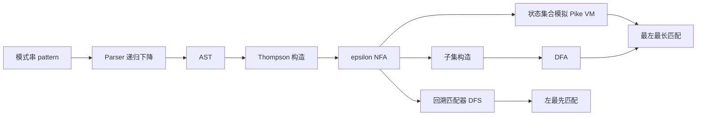
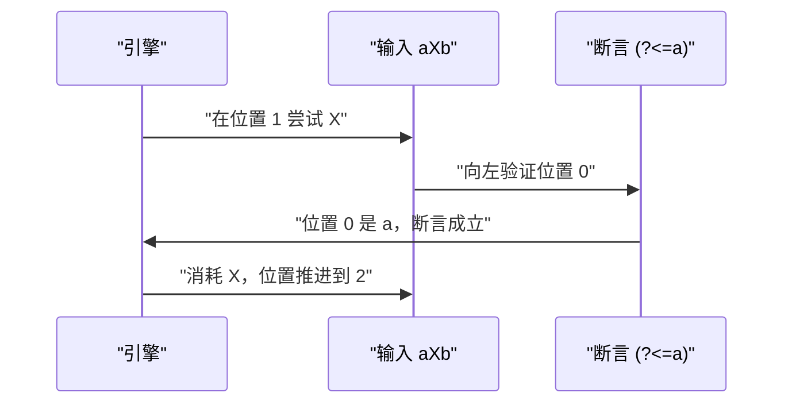

# 正则表达式：语法进阶与回溯引擎手写

!!! abstract "核心结论"
    - JavaScript 的 `RegExp` 是 Perl 风格的回溯引擎（Backtracking Engine）：按优先级深度优先尝试，失败就退栈重试，因此最坏时间复杂度是指数级，这就是 ReDoS 的根源。
    - 回溯引擎给出"左最先匹配"（leftmost-first）：`a|ab` 在 `"ab"` 上只匹配 `"a"`。POSIX/DFA 引擎给出"最左最长"（leftmost-longest），同一输入匹配 `"ab"`。二者不可混淆。
    - 贪婪与懒惰只改变"分支尝试顺序"，不改变回溯的本质；JS 没有占有量词（possessive quantifier）与原子组（atomic group），只能用 `(?=(...))\1` 近似模拟。
    - `u`/`v` 决定 Unicode 语义，`y` 把匹配锚定在 `lastIndex`，`d` 暴露 `indices`，`s` 让 `.` 吃掉行终止符。这些标志只改变语义与结果形状，不改变回溯复杂度。
    - 线性时间匹配的标准路线是 Thompson 构造得到 epsilon-NFA，再做子集构造得 DFA（或按位置维护状态集合的 Pike VM）；代价是必须放弃反向引用与前后行断言这类非正则特性。

## 1. 引擎剖面：模式串到底变成了什么

### 1.1 两条技术路线

正则表达式的匹配集合是正则语言，而正则语言等价于有限自动机（Kleene 定理）。工程上把它变成可执行代码有两条路线。

第一条路线是**自动机引擎（Thompson 路线）**：

1. 把语法树每个节点翻译成一小段带 epsilon 转移的 NFA 片段，片段有唯一入口与唯一出口。串接、并联、闭包三种组合方式即可覆盖 `concat / alt / star`。
2. Thompson 构造的状态数是 O(|r|)，构造时间也是 O(|r|)，因为每个字符节点只新增常数个状态。
3. 用"子集构造"（subset construction）把 NFA 确定化为 DFA：一个 DFA 状态就是 NFA 状态的一个集合，最坏状态数 2^|NFA|，实践中通常远小于上界。
4. 或者不预先确定化，直接在输入上按位置维护"当前 NFA 状态集合"，每读一个字符就计算一次 epsilon 闭包并推进集合。这就是 Pike VM 的思路，复杂度 O(n · m)，n 是输入长度，m 是 NFA 状态数，并且可以给每个"线程"挂捕获槽来实现子匹配。

第二条路线是**回溯引擎**：

1. 把模式编译成字节码或直接遍历语法树，配一个回溯栈。
2. 遇到 `x*` 就先假设"再来一次"，遇到 `|` 就先假设"选第一条分支"。一旦后续失败，退回到最近的选择点换一种可能。
3. 它能天然支持反向引用、前后行断言、条件分支等**超出正则语言**的特性，代价是最坏情况下要枚举指数条路径。

JavaScript 属于第二条。V8 里的实现叫 Irregexp，语义上是回溯的；它内部有针对性的优化（锚定后的字符串搜索、部分前瞻的展开等），但具体编译细节与优化清单需核对官方源码与文档。



### 1.2 标志位对照表

| 标志 | 引入版本 | 语义 | 关键 API 与属性 |
| --- | --- | --- | --- |
| `g` | ES3 | 全局搜索，`exec`/`test` 会推进 `lastIndex` | `lastIndex`、`global` |
| `i` | ES3 | 忽略大小写（Unicode 简单大小写折叠） | `ignoreCase` |
| `m` | ES3 | 多行模式，`^` `$` 匹配行首行尾 | `multiline` |
| `u` | ES2015 | 码点语义，启用 `\p{...}`、`\u{...}` | `unicode` |
| `y` | ES2015 | sticky，只从 `lastIndex` 处开始尝试，不向后搜索 | `sticky`、`lastIndex` |
| `s` | ES2018 | dotAll，`.` 匹配行终止符 | `dotAll` |
| `d` | ES2022 | 暴露匹配下标 | `hasIndices`、`match.indices` |
| `v` | ES2024 | unicodeSets，`u` 的超集：集合并/交/差与字符串集合属性 | `unicodeSets` |

`u` 与 `v` 互斥，同时指定会抛 `SyntaxError`。`\p{...}` 必须搭配 `u` 或 `v`。

## 2. 语法进阶

### 2.1 字符类与量词

字符类 `[...]` 内部只允许三种元素：单字符字面量、范围 `a-z`、转义序列。`^` 只有在**紧跟 `[`** 时才表示取反；`-` 只有在两侧都有元素时才构成范围。

需要注意 JS 特有的边界行为：`[]` 是合法的空字符类，它匹配**任何字符都失败**；`[^]` 是取反空类，它匹配**任意一个字符（包含换行）**。这是 JS 与 Perl 的一个显著差异。

类简写的精确含义：`\d` 恒等于 `[0-9]`（即使加了 `u` 也不会变成 Unicode 数字），`\w` 恒等于 `[A-Za-z0-9_]`，`\s` 则包含 Unicode 空白类字符。

| 写法 | 含义 | 匹配倾向 | JS 支持 |
| --- | --- | --- | --- |
| `x*` / `x+` / `x?` / `x{n,m}` | 贪婪量词 | 先尽量多匹配，失败再退 | 是 |
| `x*?` / `x+?` / `x??` / `x{n,m}?` | 懒惰量词 | 先尽量少匹配，失败再吃 | 是 |
| `x*+` / `x++` / `x?+` | 占有量词 | 一旦匹配成功不再让出 | 否，在 V8 中抛 SyntaxError（`Nothing to repeat`），具体报错文案需核对目标引擎 |
| `(?=(x*))\1` | 前瞻 + 反向引用 | 用前瞻把重复"原子化" | 是 |

占有量词的思想是"匹配后销毁回溯点"。JS 没有这个语法，但 `(?=(a+))\1` 能达到类似效果：前瞻内部的 `(a+)` 一旦贪婪匹配成功就被固定，`\1` 只负责消耗那段确定的文本，外层没有机会让前瞻重新分配。这不是通用解法，是否真正消除回溯需自行压测验证。

### 2.2 命名捕获与后行断言

命名捕获组写作 `(?<name>...)`，通过 `match.groups.name` 读取，在 `replace` 的替换串里用 `$<name>` 引用，也可以用 `\k<name>` 做反向引用。

后行断言有两种：`(?<=...)` 要求左侧能匹配，`(?<!...)` 要求左侧不能匹配。前瞻 `(?=...)`/`(?!...)` 向右看，后行向左看，四者都是零宽断言，不消耗输入字符。



JS 支持**变长后行断言**（`/(?<=a+)b/` 合法），这一点与部分老引擎不同。其代价是引擎必须在当前位置向左回溯验证，如果断言内部含有多分支或嵌套量词，同样可能触发组合爆炸。具体实现方式需核对引擎文档。

### 2.3 标志位细节

`y` 与 `g` 的核心差别：`g` 会从 `lastIndex` 开始**向后搜索**直到找到匹配；`y` 则要求匹配必须**恰好从 `lastIndex` 开始**，否则直接失败。两者在失败时都会把 `lastIndex` 重置为 0。

`d` 标志让 `exec`/`match` 结果多出 `indices` 字段：`indices[0]` 是整体匹配的 `[start, end]`，`indices[i]` 是第 i 个捕获组的下标，`indices.groups` 按名字给出下标。配合 `hasIndices` 可以判断标志是否开启。

`v` 标志是 `u` 的超集，它把字符类变成"字符集合表达式"，支持交集 `&&`、差集 `--`，并允许 `\p{...}` 指向**字符串集合属性**（例如 Emoji 序列类属性）。同时 `v` 收紧了字符类内部的转义要求，一些在 `u` 模式下合法的写法在 `v` 模式下会报错。具体语法与版本支持情况需核对 TC39 提案仓库与 MDN 兼容性表。

### 2.4 matchAll 与 replace 回调

`String.prototype.matchAll(regexp)` 要求 `regexp` 带 `g` 标志，否则抛 `TypeError`。它返回迭代器，内部会克隆正则对象，因此不会干扰原对象的 `lastIndex`；遇到空匹配时它按规范推进索引，不会死循环。

`replace` 的回调参数顺序是 `(match, p1, p2, ..., offset, string, groups)`。当正则含有**命名捕获组**时，回调末尾会多出 `groups` 对象，这是规范明确的行为；不含命名捕获组时回调的确切参数个数请核对规范文本与目标运行时，不要凭记忆写依赖参数个数的兼容代码。

### 2.5 验证标准

下面这段测试只使用标准内置能力，运行环境为 Node.js 18+（`u`/`s`/`d`/命名组/后行断言均已覆盖；`v` 标志需要更高版本，见下）。

```js
// 文件：test-flags.mjs
import assert from 'node:assert/strict';

// 命名捕获组
const g = /(?<y>\d{4})-(?<m>\d{2})-(?<d>\d{2})/.exec('2024-06-01').groups;
assert.equal(g.y, '2024');
assert.equal(g.m, '06');
assert.equal(g.d, '01');

// 命名反向引用
assert.equal(/(?<w>\w+)-\k<w>/.test('ab-ab'), true);
assert.equal(/(?<w>\w+)-\k<w>/.test('ab-cd'), false);

// 后行断言：JS 支持变长后行断言
assert.equal('$100 元'.replace(/(?<=\$)\d+/, 'X'), '$X 元');
assert.equal(/(?<!--a-->b)/.test('cb'), true);
assert.equal(/(?<!a)b/.test('ab'), false);

// d 标志：下标
const m = /(?<a>\d)(?<b>\d)/d.exec('x12');
assert.deepEqual(m.indices[0], [1, 3]);
assert.deepEqual(m.indices.groups.a, [1, 2]);
assert.equal(m.indices.groups.b[0], 2);

// s 标志：dotAll
assert.equal(/a.b/s.test('a\nb'), true);
assert.equal(/a.b/.test('a\nb'), false);

// y 标志：sticky + lastIndex
const sticky = /\d+/y;
sticky.lastIndex = 1;
assert.equal(sticky.exec('a12b3')[0], '12');
assert.equal(sticky.lastIndex, 3);
assert.equal(sticky.exec('a12b3'), null);

// matchAll 与 replace 回调
assert.deepEqual(
  [...'a1 b22 c333'.matchAll(/(?<letter>[a-z])(?<num>\d+)/g)].map((x) => x.groups.num),
  ['1', '22', '333']
);
assert.equal(
  'a1 b22'.replace(
    /(?<letter>[a-z])(?<num>\d+)/g,
    (match, letter, num, offset, string, groups) => groups.num + groups.letter
  ),
  '1a 22b'
);

// Unicode 属性必须搭配 u 或 v
assert.equal(/\p{Script=Greek}+/u.exec('abc αβγ def')[0], 'αβγ');
assert.equal(/\p{L}+/u.test('中'), true);
assert.equal(/\p{L}/.test('中'), false);   // 缺少 u 标志时 \p 不是属性转义

// 标志可用性探测
function supportsFlag(flag) {
  try { new RegExp('.', flag); return true; } catch (err) { return false; }
}
assert.equal(supportsFlag('u'), true);
assert.equal(supportsFlag('y'), true);
assert.equal(supportsFlag('s'), true);
assert.equal(supportsFlag('d'), true);
console.log('v flag supported:', supportsFlag('v'));

if (supportsFlag('v')) {
  try {
    // 集合差集/交集语法以官方文档为准，这里只做一次受保护的演示
    const consonants = new RegExp('[a-z&&[^aeiou]]+', 'v');
    assert.equal(consonants.exec('aeiou bcdfg')[0], 'bcdfg');
    console.log('v set operations ok');
  } catch (err) {
    console.log('v set operations not verified:', err.message);
  }
}

// RegExp.escape（ES2025）：只断言语义保证，不断言具体转义输出
if (typeof RegExp.escape === 'function') {
  for (const s of ['a.b', 'a*b', '[x]', 'foo-bar', '你好.世界', '1+1=2']) {
    assert.equal(new RegExp('^' + RegExp.escape(s) + '$').test(s), true);
  }
  console.log('RegExp.escape ok');
} else {
  console.log('RegExp.escape not available in this runtime; 需核对运行时对 ES2025 的支持');
}

console.log('flags ok');
```

预期输出：最后必然打印 `flags ok`；若运行时支持 `v` 标志会额外打印 `v set operations ok`，支持 `RegExp.escape` 会额外打印 `RegExp.escape ok`，否则打印对应的降级提示行。

## 3. 手写实现一：Parser 到 AST

### 3.1 完整代码

实现的是语法子集：字面量字符、`. * + ? | ( ) [ ] ^ $` 与字符类内的 `-`、`^`。不支持命名捕获、前后行断言、`\d` 这类类简写、`{n,m}`、`u`/`v` 语义。整个引擎按 `3.1 → 4.1 → 5.1 → 6.1` 的顺序写入同一个文件 `regex-engine.mjs`。

```js
// ============================================================
// 文件：regex-engine.mjs
// 运行环境：Node.js 18+（ESM）或现代浏览器
// 按 3.1、4.1、5.1、6.1 的顺序依次拼接到本文件
// ============================================================

// ---------- 3.1 Parser：模式串 -> AST ----------
// AST 节点类型：
//   Char{value}  Any{}  Class{negated,ranges}
//   Anchor{kind:'^'|'$'}  Group{node}
//   Concat{parts[]}  Alt{options[]}  Empty{}
//   Repeat{min,max,node}
export function parsePattern(pattern) {
  let i = 0;
  const n = pattern.length;
  const peek = () => (i < n ? pattern[i] : null);
  const nextChar = () => pattern[i++];
  const eof = () => i >= n;

  function charNode(ch) {
    if (ch === null || ch === undefined) throw new SyntaxError('unexpected end of pattern');
    return { type: 'Char', value: ch };
  }

  function readClassChar() {
    let c = nextChar();
    if (c === '\\') c = nextChar();
    if (c === null) throw new SyntaxError('unexpected end of character class');
    return c.codePointAt(0);
  }

  function parseClass() {
    let negated = false;
    if (peek() === '^') { nextChar(); negated = true; }
    const ranges = [];
    for (;;) {
      if (eof()) throw new SyntaxError('unterminated character class');
      if (peek() === ']') { nextChar(); break; }
      const lo = readClassChar();
      if (peek() === '-' && pattern[i + 1] !== undefined && pattern[i + 1] !== ']') {
        nextChar();
        const hi = readClassChar();
        ranges.push([Math.min(lo, hi), Math.max(lo, hi)]);
      } else {
        ranges.push([lo, lo]);
      }
    }
    return { type: 'Class', negated, ranges };
  }

  function parseAtom() {
    const c = nextChar();
    if (c === '(') {
      const node = parseAlternation();
      if (nextChar() !== ')') throw new SyntaxError('unmatched "("');
      return { type: 'Group', node };
    }
    if (c === '[') return parseClass();
    if (c === '.') return { type: 'Any' };
    if (c === '^' || c === '$') return { type: 'Anchor', kind: c };
    if (c === '\\') return charNode(nextChar());
    return charNode(c);
  }

  function parseRepeat() {
    const atom = parseAtom();
    const c = peek();
    if (c === '*' || c === '+' || c === '?') {
      nextChar();
      return { type: 'Repeat', min: c === '+' ? 1 : 0, max: c === '?' ? 1 : Infinity, node: atom };
    }
    return atom;
  }

  function parseConcat() {
    const parts = [];
    while (!eof() && peek() !== '|' && peek() !== ')') parts.push(parseRepeat());
    if (parts.length === 0) return { type: 'Empty' };
    if (parts.length === 1) return parts[0];
    return { type: 'Concat', parts };
  }

  function parseAlternation() {
    const options = [parseConcat()];
    while (peek() === '|') { nextChar(); options.push(parseConcat()); }
    return options.length === 1 ? options[0] : { type: 'Alt', options };
  }

  const ast = parseAlternation();
  if (!eof()) throw new SyntaxError('unexpected ")" at index ' + i);
  return ast;
}
```

### 3.2 验证标准

```js
// 文件：test-parser.mjs  运行：node test-parser.mjs
import assert from 'node:assert/strict';
import { parsePattern } from './regex-engine.mjs';

function astToString(node) {
  switch (node.type) {
    case 'Char': return node.value;
    case 'Any': return '.';
    case 'Anchor': return node.kind;
    case 'Empty': return '(empty)';
    case 'Group': return '(' + astToString(node.node) + ')';
    case 'Concat': return node.parts.map(astToString).join('');
    case 'Alt': return node.options.map(astToString).join('|');
    case 'Class': {
      const body = node.ranges.map(([lo, hi]) => (lo === hi
        ? String.fromCodePoint(lo)
        : String.fromCodePoint(lo) + '-' + String.fromCodePoint(hi))).join('');
      return '[' + (node.negated ? '^' : '') + body + ']';
    }
    case 'Repeat': {
      const q = node.min === 0 && node.max === Infinity ? '*'
        : node.min === 1 && node.max === Infinity ? '+' : '?';
      return astToString(node.node) + q;
    }
    default: throw new Error('unknown node type: ' + node.type);
  }
}

assert.equal(astToString(parsePattern('a')), 'a');
assert.equal(astToString(parsePattern('a*b+?.')), 'a*b+?.');
assert.equal(astToString(parsePattern('ab|cd')), 'ab|cd');
assert.equal(astToString(parsePattern('(a|b)*c')), '(a|b)*c');
assert.equal(astToString(parsePattern('[a-z0-9_]')), '[a-z0-9_]');
assert.equal(astToString(parsePattern('[^0-9]')), '[^0-9]');
assert.equal(astToString(parsePattern('^ab$')), '^ab$');
assert.equal(astToString(parsePattern('[a-]')), '[a-]');
assert.equal(astToString(parsePattern('[]')), '[]');

// 转义后的 '*' 是字面量，和量词不是同一棵子树
assert.deepEqual(parsePattern('a\\*'), {
  type: 'Concat',
  parts: [{ type: 'Char', value: 'a' }, { type: 'Char', value: '*' }],
});

assert.throws(() => parsePattern('(a'), SyntaxError);
assert.throws(() => parsePattern('[abc'), SyntaxError);

console.log('parser ok');
```

预期输出：`parser ok`

## 4. 手写实现二：AST 到 Thompson NFA

### 4.1 完整代码

NFA 的表示：状态是 `{ id, trans[] }`，转移有三种 —— `{type:'eps',to}`、`{type:'char',test,to}`（`test` 是接收单个字符的谓词）、`{type:'anchor',kind,to}`。转移数组的**顺序即优先级**，越靠前越先尝试，贪婪语义靠这个顺序实现。

```js
// ---------- 4.1 AST -> Thompson NFA ----------
export function classMatches(node, ch) {
  const code = ch.codePointAt(0);
  let inside = false;
  for (let k = 0; k < node.ranges.length; k += 1) {
    const lo = node.ranges[k][0];
    const hi = node.ranges[k][1];
    if (code >= lo && code <= hi) { inside = true; break; }
  }
  return node.negated ? !inside : inside;
}

export function compileNFA(ast) {
  const states = [];
  const newState = () => {
    const s = { id: states.length, trans: [] };
    states.push(s);
    return s;
  };
  const addEps = (from, to) => from.trans.push({ type: 'eps', to: to.id });
  const addChar = (from, test, to) => from.trans.push({ type: 'char', test, to: to.id });
  const addAnchor = (from, kind, to) => from.trans.push({ type: 'anchor', kind, to: to.id });

  function build(node, from, to) {
    switch (node.type) {
      case 'Empty':
        addEps(from, to); return;
      case 'Char':
        addChar(from, (ch) => ch === node.value, to); return;
      case 'Any':
        addChar(from, (ch) => ch !== '\n', to); return;
      case 'Class':
        addChar(from, (ch) => classMatches(node, ch), to); return;
      case 'Anchor':
        addAnchor(from, node.kind, to); return;
      case 'Group':
        build(node.node, from, to); return;
      case 'Concat': {
        let cur = from;
        for (let k = 0; k < node.parts.length; k += 1) {
          const isLast = k === node.parts.length - 1;
          const nxt = isLast ? to : newState();
          build(node.parts[k], cur, nxt);
          cur = nxt;
        }
        return;
      }
      case 'Alt': {
        for (let k = 0; k < node.options.length; k += 1) {
          const branch = newState();
          addEps(from, branch);
          build(node.options[k], branch, to);
        }
        return;
      }
      case 'Repeat': {
        const min = node.min;
        const max = node.max;
        if (min === 0 && max === Infinity) {          // x*
          const bodyIn = newState();
          const bodyOut = newState();
          addEps(from, bodyIn);                        // 贪婪：先进循环体
          build(node.node, bodyIn, bodyOut);
          addEps(bodyOut, from);                       // 循环
          addEps(bodyOut, to);                         // 循环后退出
          addEps(from, to);                            // 零次兜底，优先级最低
          return;
        }
        if (min === 1 && max === Infinity) {          // x+
          const bodyOut = newState();
          build(node.node, from, bodyOut);
          addEps(bodyOut, from);                       // 贪婪：先再来一次
          addEps(bodyOut, to);
          return;
        }
        if (min === 0 && max === 1) {                 // x?
          const bodyIn = newState();
          addEps(from, bodyIn);                        // 贪婪：先匹配
          build(node.node, bodyIn, to);
          addEps(from, to);
          return;
        }
        throw new SyntaxError('unsupported quantifier');
      }
      default:
        throw new SyntaxError('unknown node type: ' + node.type);
    }
  }

  const start = newState();
  const accept = newState();
  build(ast, start, accept);
  return { states, start: start.id, accept: accept.id };
}
```

### 4.2 验证标准

```js
// 文件：test-nfa.mjs  运行：node test-nfa.mjs
import assert from 'node:assert/strict';
import { parsePattern, compileNFA } from './regex-engine.mjs';

const nfaAB = compileNFA(parsePattern('ab'));
assert.equal(nfaAB.states.length, 3);                        // start / 中间态 / accept
assert.equal(nfaAB.states[nfaAB.start].trans.length, 1);
assert.equal(nfaAB.states[nfaAB.start].trans[0].type, 'char');
assert.equal(nfaAB.states[nfaAB.accept].trans.length, 0);    // 接受态没有出边

const nfaAlt = compileNFA(parsePattern('a|b'));
assert.equal(nfaAlt.states.length, 4);                       // start / accept / 两个分支入口
assert.equal(nfaAlt.states[nfaAlt.start].trans.length, 2);
assert.equal(nfaAlt.states[nfaAlt.start].trans[0].type, 'eps');

const nfaStar = compileNFA(parsePattern('a*'));
assert.equal(nfaStar.states.length, 4);
const fromStar = nfaStar.states[nfaStar.start].trans;
assert.equal(fromStar[0].type, 'eps');
assert.equal(fromStar[0].to, 2);                             // 贪婪：先进入循环体
assert.equal(fromStar[1].to, nfaStar.accept);                // 兜底：跳过

console.log('nfa ok');
```

预期输出：`nfa ok`

## 5. 手写实现三：NFA 回溯匹配器

### 5.1 完整代码

这是对回溯引擎的忠实复刻：深度优先遍历 NFA，按转移数组顺序尝试，第一条走通的路径就是结果。为了避免 `(a*)*` 这类会产生 epsilon 环的模式死循环，用一个集合记录"当前路径上出现过的 `状态@位置`"，退栈时删除。注意这个记录**只作用于当前路径**，不做全局记忆化 —— 一旦记忆化，算法就退化成了线性时间的状态集合模拟，灾难性回溯也就消失了。

`stats.steps` 记录 DFS 调用次数，用来在下一节定量复现 ReDoS。

```js
// ---------- 5.1 NFA 回溯匹配器：忠实复刻 DFS 回溯 ----------
export function makeBacktracker(nfa) {
  const states = nfa.states;
  const accept = nfa.accept;
  const stats = { steps: 0 };

  function dfs(stateId, pos, input, onPath) {
    stats.steps += 1;
    if (stateId === accept) return pos;
    const key = stateId + ':' + pos;
    if (onPath.has(key)) return -1;              // 同一路径上同一位置重复访问 = epsilon 环
    onPath.add(key);
    const trans = states[stateId].trans;
    for (let k = 0; k < trans.length; k += 1) {
      const t = trans[k];
      if (t.type === 'eps') {
        const r = dfs(t.to, pos, input, onPath);
        if (r >= 0) { onPath.delete(key); return r; }
      } else if (t.type === 'anchor') {
        const ok = t.kind === '^' ? pos === 0 : pos === input.length;
        if (ok) {
          const r = dfs(t.to, pos, input, onPath);
          if (r >= 0) { onPath.delete(key); return r; }
        }
      } else if (pos < input.length && t.test(input[pos])) {
        const r = dfs(t.to, pos + 1, input, onPath);
        if (r >= 0) { onPath.delete(key); return r; }
      }
    }
    onPath.delete(key);
    return -1;
  }

  return {
    stats,
    matchFrom(input, startPos) {
      return dfs(nfa.start, startPos, input, new Set());
    },
    // 左最先匹配：从最小的起点开始试，第一个成功的路径即为结果
    search(input) {
      for (let s = 0; s <= input.length; s += 1) {
        const end = dfs(nfa.start, s, input, new Set());
        if (end >= 0) return [s, end];
      }
      return null;
    },
  };
}
```

### 5.2 验证标准

```js
// 文件：test-backtracker.mjs  运行：node test-backtracker.mjs
import assert from 'node:assert/strict';
import { parsePattern, compileNFA, makeBacktracker } from './regex-engine.mjs';

const engine = (p) => makeBacktracker(compileNFA(parsePattern(p)));

assert.deepEqual(engine('a*').search('aaab'), [0, 3]);
assert.deepEqual(engine('a*').search('bb'), [0, 0]);       // 空匹配
assert.equal(engine('a+').search('bb'), null);             // a+ 不能匹配空
assert.deepEqual(engine('ab').search('xxabyy'), [2, 4]);
assert.equal(engine('ab').search('xxayy'), null);
assert.deepEqual(engine('^ab$').search('ab'), [0, 2]);
assert.equal(engine('^ab$').search('xab'), null);
assert.deepEqual(engine('(a|b)*c').search('abac'), [0, 4]);
assert.deepEqual(engine('[a-c]+').search('xxabcxx'), [2, 5]);
assert.deepEqual(engine('.+').search('a\nb'), [0, 1]);     // . 默认不吃换行
assert.deepEqual(engine('a|ab').search('ab'), [0, 1]);     // 左最先，不是最长

console.log('backtracker ok');
```

预期输出：`backtracker ok`

## 6. 手写实现四：NFA 模拟与 DFA 子集构造

### 6.1 完整代码

`makeSimulator` 是 Pike VM 的骨架：给定起始位置，维护"当前 NFA 状态集合"，每读一个字符就换一批种子状态并重算闭包。它不做任何回溯，返回从该起点出发的**最长**匹配结束位置，因此整体是"最左最长"语义。

`makeDFA` 走子集构造：一个 DFA 状态就是一组 NFA 状态，转移按输入的字符做惰性缓存（等价于在真实字母表上按需建表）。为了保持"同一集合在不同位置可复用"这一前提，这里显式拒绝 `^` 与 `$`，因为锚点断言依赖位置，会破坏集合的上下文无关性。

```js
// ---------- 6.1 NFA 状态集合模拟（Pike VM 骨架） ----------
export function makeSimulator(nfa) {
  const states = nfa.states;
  const accept = nfa.accept;
  const stats = { steps: 0 };

  function closure(seed, pos, input) {
    const out = new Set();
    const stack = seed.slice();
    while (stack.length > 0) {
      const id = stack.pop();
      stats.steps += 1;
      if (out.has(id)) continue;
      out.add(id);
      const trans = states[id].trans;
      for (let k = 0; k < trans.length; k += 1) {
        const t = trans[k];
        if (t.type === 'eps') stack.push(t.to);
        else if (t.type === 'anchor') {
          const ok = t.kind === '^' ? pos === 0 : pos === input.length;
          if (ok) stack.push(t.to);
        }
      }
    }
    return out;
  }

  function longestEndFrom(input, start) {
    let current = closure([nfa.start], start, input);
    let best = current.has(accept) ? start : -1;
    for (let pos = start; pos < input.length; pos += 1) {
      const seed = [];
      for (const id of current) {
        stats.steps += 1;
        const trans = states[id].trans;
        for (let k = 0; k < trans.length; k += 1) {
          const t = trans[k];
          if (t.type === 'char' && t.test(input[pos])) seed.push(t.to);
        }
      }
      if (seed.length === 0) break;
      current = closure(seed, pos + 1, input);
      if (current.has(accept)) best = pos + 1;
    }
    return best;
  }

  return {
    stats,
    longestEndFrom,
    search(input) {
      for (let s = 0; s <= input.length; s += 1) {
        const end = longestEndFrom(input, s);
        if (end >= 0) return [s, end];
      }
      return null;
    },
  };
}

// ---------- 6.1 DFA 子集构造（惰性建表） ----------
export function makeDFA(nfa) {
  const states = nfa.states;
  const accept = nfa.accept;
  for (const s of states) {
    for (const t of s.trans) {
      if (t.type === 'anchor') throw new Error('makeDFA: ^ and $ are not supported in this demo');
    }
  }
  const setByKey = new Map();
  const table = new Map();
  const stats = { states: 0 };
  const keyOf = (set) => Array.from(set).sort((a, b) => a - b).join(',');

  function closure(seed) {
    const out = new Set();
    const stack = seed.slice();
    while (stack.length > 0) {
      const id = stack.pop();
      if (out.has(id)) continue;
      out.add(id);
      for (const t of states[id].trans) if (t.type === 'eps') stack.push(t.to);
    }
    return out;
  }

  function intern(set) {
    const key = keyOf(set);
    if (!setByKey.has(key)) { setByKey.set(key, set); stats.states += 1; }
    return key;
  }

  function step(key, ch) {
    let row = table.get(key);
    if (row === undefined) { row = new Map(); table.set(key, row); }
    if (row.has(ch)) return row.get(ch);
    const seed = [];
    for (const id of setByKey.get(key)) {
      for (const t of states[id].trans) {
        if (t.type === 'char' && t.test(ch)) seed.push(t.to);
      }
    }
    let nextKey;
    if (seed.length === 0) {
      nextKey = '';
      if (!setByKey.has('')) { setByKey.set('', new Set()); stats.states += 1; }
    } else {
      nextKey = intern(closure(seed));
    }
    row.set(ch, nextKey);
    return nextKey;
  }

  function longestEndFrom(input, start) {
    let key = intern(closure([nfa.start]));
    let best = setByKey.get(key).has(accept) ? start : -1;
    for (let pos = start; pos < input.length; pos += 1) {
      key = step(key, input[pos]);
      if (key === '') break;
      if (setByKey.get(key).has(accept)) best = pos + 1;
    }
    return best;
  }

  return {
    stats,
    longestEndFrom,
    search(input) {
      for (let s = 0; s <= input.length; s += 1) {
        const end = longestEndFrom(input, s);
        if (end >= 0) return [s, end];
      }
      return null;
    },
  };
}

// 本文件导出：parsePattern / classMatches / compileNFA
//             makeBacktracker / makeSimulator / makeDFA
```

### 6.2 验证标准

```js
// 文件：test-automata.mjs  运行：node test-automata.mjs
import assert from 'node:assert/strict';
import { parsePattern, compileNFA, makeBacktracker, makeSimulator, makeDFA } from './regex-engine.mjs';

const compile = (p) => compileNFA(parsePattern(p));

const sim = makeSimulator(compile('a|ab'));
const dfa = makeDFA(compile('a|ab'));
assert.deepEqual(sim.search('ab'), [0, 2]);   // 最左最长
assert.deepEqual(dfa.search('ab'), [0, 2]);

const simAbb = makeSimulator(compile('(a|b)*abb'));
const dfaAbb = makeDFA(compile('(a|b)*abb'));
assert.deepEqual(simAbb.search('aababb'), [0, 6]);
assert.deepEqual(dfaAbb.search('aababb'), [0, 6]);
assert.equal(simAbb.search('aaba'), null);
assert.ok(dfaAbb.stats.states >= 4, 'DFA 状态数 = ' + dfaAbb.stats.states);

// 回溯引擎与自动机引擎在"无顺序分支歧义"时结果一致
for (const [p, s] of [['a*', 'aaab'], ['a+b', 'aab'], ['[a-c]+', 'zzabc'], ['(a|b)*abb', 'aababb']]) {
  const a = makeBacktracker(compile(p)).search(s);
  const b = makeDFA(compile(p)).search(s);
  assert.deepEqual(a, b, p + ' on ' + s);
}

// 顺序分支是两者语义分叉点：ab|abc 在 abc 上
assert.deepEqual(makeBacktracker(compile('ab|abc')).search('abc'), [0, 2]); // 左最先
assert.deepEqual(makeDFA(compile('ab|abc')).search('abc'), [0, 3]);         // 最左最长

assert.throws(() => makeDFA(compile('^a$')), Error);

console.log('simulator/dfa ok');
```

预期输出：`simulator/dfa ok`

### 6.3 三引擎横向对比

| 维度 | 回溯匹配器（第 5 节） | NFA 状态集合模拟（Pike VM） | DFA 子集构造（第 6 节） |
| --- | --- | --- | --- |
| 匹配语义 | 左最先匹配（leftmost-first） | 最左最长（leftmost-longest） | 最左最长 |
| 时间 | 最坏 O(2^n)，n 为输入长度 | O(n · m)，m 为 NFA 状态数 | 建表最坏 O(2^m)，之后每字符 O(1)，整体 O(n) |
| 空间 | O(n) 递归栈 + 路径集合 | O(m) 状态集合 | O(状态数)，最坏 2^m |
| 贪婪/懒惰 | 编译期决定分支优先级 | 需要额外标记不同优先级的接受态才能保留顺序语义 | 顺序语义被集合语义吞掉 |
| 反向引用/前后行断言 | 容易支持 | 反向引用破坏不动点，难以高效支持 | 不支持（已超出正则语言） |
| 代表实现 | V8 Irregexp、PCRE、Java `java.util.regex` 等回溯系 | RE2 的 NFA 模式、Go `regexp` 的模拟路径 | RE2 的 DFA 模式、Rust `regex` 等 |

## 7. ReDoS：复现与防御

### 7.1 用第 5、6 节的代码定量复现

`(a+)+$` 的匹配集合等价于 `a+$`，但 NFA 里存在两层循环，导致同一串 `a` 可以被划分成任意多个"每组至少一个 a"的段。长度为 n 的全 `a` 串划分方式有 2^(n-1) 种，末尾一旦出现非 `a` 字符，所有划分都要被回溯枚举一遍。

```js
// 文件：test-redos.mjs  运行：node test-redos.mjs
import assert from 'node:assert/strict';
import { parsePattern, compileNFA, makeBacktracker, makeSimulator } from './regex-engine.mjs';

const pattern = '(a+)+$';
const evil = 'a'.repeat(20) + 'X';

const bt = makeBacktracker(compileNFA(parsePattern(pattern)));
assert.equal(bt.search(evil), null);                                  // 确实不匹配
assert.ok(bt.stats.steps > 100000, '回溯步数应达十万量级以上：' + bt.stats.steps);

const sim = makeSimulator(compileNFA(parsePattern(pattern)));
assert.equal(sim.search(evil), null);
assert.ok(sim.stats.steps < 100000, 'Thompson 模拟步数应为线性量级：' + sim.stats.steps);

console.log('redos ok:', bt.stats.steps > 100000 && sim.stats.steps < 100000);
```

预期输出：`redos ok: true`。断言里的具体步数由代码决定，本页不写死数值，失败时断言消息会打印真实值。把 `20` 提高到 `30` 会让回溯版本的步数增长到约 2^29 量级，而线性版本基本不变，可自行修改验证。

### 7.2 防御清单

| 手段 | 做法 | 局限 |
| --- | --- | --- |
| 改写正则 | 消除嵌套量词与重叠候选，`(a+)+$` 直接写 `a+$` | 只能逐个人工审查，容易漏 |
| 原子化 | 用 `(?=(...))\1` 提前固定贪婪部分 | 不是通用解法，仍需压测 |
| 隔离执行 | 把匹配放进 Worker 或子进程，超时后 terminate | JS 没有标准化的正则超时 API，主线程上运行的正则无法中断 |
| 限制输入 | 对用户可控输入设长度上限、字符白名单 | 降低而非消除风险 |
| 换引擎 | 使用 RE2/Go `regexp`/Rust `regex` 等线性引擎 | 失去反向引用与前后行断言 |
| 校验模式 | 用户可提交正则时做语法白名单 | 需要维护规则库 |

## 8. 常见陷阱

```js
// 文件：test-pitfalls.mjs  运行：node test-pitfalls.mjs
import assert from 'node:assert/strict';

// 陷阱 1：带 g / y 的正则对象是有状态的，复用会互相影响
const g = /a/g;
assert.equal(g.test('a'), true);
assert.equal(g.lastIndex, 1);
assert.equal(g.test('a'), false);      // 从索引 1 开始搜不到，lastIndex 归零
assert.equal(g.lastIndex, 0);

// 陷阱 2：空匹配让 exec 循环死循环
const m0 = /a*/.exec('b');
assert.equal(m0[0], '');
assert.equal(m0.index, 0);             // 手动循环时必须自己推进 lastIndex

// 陷阱 3：matchAll 要求 g 标志
assert.throws(() => 'abc'.matchAll(/a/), TypeError);
assert.equal([...'abc'.matchAll(/a*/g)].length, 4);   // 'a'、''、''、''

// 陷阱 4：. 默认不吃换行；^ $ 默认不是行边界
assert.equal(/a.b/.test('a\nb'), false);
assert.equal(/a.b/s.test('a\nb'), true);
assert.equal(/^a$/.test('x\na'), false);
assert.equal(/^a$/m.test('x\na'), true);

// 陷阱 5：new RegExp 的双重转义
assert.equal(new RegExp('\\d').test('1'), true);      // 模式串是 \d
assert.equal(new RegExp('\d').source, 'd');           // '\d' 在 JS 字符串里就是 'd'

// 陷阱 6：JS 特有的空字符类语义
assert.equal(/[]/.test('a'), false);                  // 空类：永不匹配
assert.equal(/[^]/.test('\n'), true);                 // 取反空类：匹配任意字符

// 陷阱 7：\d 只是 [0-9]，Unicode 数字需要属性转义
assert.equal(/\d/u.test('٣'), false);
assert.equal(/\p{Nd}/u.test('٣'), true);

// 陷阱 8：split 的分隔符捕获组会被插入结果
assert.deepEqual('a1b2c'.split(/(\d)/), ['a', '1', 'b', '2', 'c']);

console.log('pitfalls ok');
```

预期输出：`pitfalls ok`。另外，本文手写引擎与真实引擎还有几处刻意的简化，遇到时不要误当成规范行为：`a**` 这类连续量词在本文实现里会被当成"量词 + 字面量"，真实引擎抛 `SyntaxError`；字符类里没有展开 `\d`、`\w`、`\s`；不支持 `{n,m}`、`u`/`v` 的码点语义与代理对配对。

## 9. 面试题与答题要点

**1. JS 的正则引擎是 DFA 还是 NFA？为什么 `(a+)+b` 会卡死？**
要点：JS 是 Perl 风格回溯引擎，语法树加回溯栈做深度优先搜索。`(a+)+` 对长度为 n 的 `a` 串存在约 2^(n-1) 种分组划分，末尾匹配失败时所有划分都会被枚举，时间指数级。答出"划分计数"是加分项，能同时给出 Thompson NFA + 子集构造的 O(n·m) 对照更完整。

**2. 贪婪、懒惰、占有量词在实现层面的差别是什么？**
要点：三者共用同一套回溯机制，差别只在编译期决定的"分支尝试顺序"。贪婪先尝试更长分支，懒惰先尝试更短分支，占有在匹配成功后丢弃回溯点。JS 没有占有量词与原子组，`(?=(a+))\1` 是常用的近似手段。

**3. `y` 与 `g` 的区别？`lastIndex` 的语义是什么？**
要点：`g` 是"从 `lastIndex` 起向后搜索"，`y` 是"必须从 `lastIndex` 起精确匹配"。两者在匹配失败时都把 `lastIndex` 重置为 0；`exec`、`test`、`replace`、`matchAll` 都会读写它；`matchAll` 内部克隆正则所以不受外部 `lastIndex` 影响。

**4. 后行断言 `(?<=...)` 的原理是什么？为什么有些引擎不支持变长后行断言？**
要点：零宽断言不消耗输入，引擎在当前位置向左验证。定长后行断言可以退化成状态机上的特殊转移；变长后行断言需要反向匹配或者枚举所有可能前缀，代价高。JS 支持变长后行断言（ES2018），但要警惕断言内部本身触发回溯爆炸。

**5. `\p{...}` 必须搭配哪个标志？`u` 与 `v` 是什么关系？**
要点：必须搭配 `u` 或 `v`，二者互斥。`u` 是 ES2015 的码点语义；`v` 是 ES2024 的 unicodeSets，在 `u` 基础上加了字符类集合运算与字符串集合属性，并收紧了转义规则。`General_Category` 的属性名可以省略，所以 `\p{L}` 与 `\p{General_Category=Letter}` 等价；`Script` 系列必须写明属性名，如 `\p{Script=Greek}`。

**6. 如何安全地把用户输入拼进正则？**
要点：不要手写转义表，因为字符类内外是两套规则，`v` 模式又更严格。优先使用 `RegExp.escape`（ES2025，运行时可用性需检测，且它对"整段作为模式"的语义保证才是可依赖的部分）；不可用时退回白名单校验或 `split` 后逐段处理，并特别注意 `^`、`$` 以及把用户输入拼进字符类这两个额外风险点。

**7. 如何做到线性时间匹配？三块拼图分别是什么？**
要点：Thompson 构造把语法树变成 O(|r|) 状态的 epsilon-NFA；子集构造把 NFA 确定化为 DFA（最坏 2^m 状态，实际稀疏）；Pike VM 不预先确定化，按输入位置维护状态集合并给每个线程挂捕获槽，实现 O(n·m) 的子匹配。代价是失去反向引用与后行断言。

**8. `matchAll` 和 `exec` 循环有什么区别？**
要点：`matchAll` 要求 `g` 标志否则抛 `TypeError`，返回迭代器而非数组，内部克隆正则从而不改变原对象 `lastIndex`，并在空匹配时按规范推进索引；`exec` 循环需要自己维护 `lastIndex`，空匹配时若不手动 `lastIndex++` 会死循环。

**9. `replace` 回调的参数顺序是什么？`groups` 什么时候出现？**
要点：顺序是 `(match, p1, p2, ..., offset, string, groups)`。含有命名捕获组时末尾会多出 `groups` 对象；不含命名捕获组时回调的确切参数个数需核对规范文本。替换串里 `$&` 是整体匹配，`$1` 是第一个捕获组，`$<name>` 是命名捕获组，`$$` 是字面量 `$`。

**10. ReDoS 有哪些防御手段？**
要点：改写正则去掉嵌套量词与重叠候选；用前瞻加反向引用做原子化；把匹配放到 Worker 或子进程并用超时 terminate，因为 JS 没有标准化的正则超时 API，主线程上正在执行的正则无法被中断；对输入做长度与字符集限制；必要时换 RE2/Go `regexp`/Rust `regex` 这类线性引擎，代价是放弃反向引用与前后行断言。要能说清每种手段的边界，而不是罗列名词。

## 应用与行业实践

### 应用场景地图

| 场景 | 用到本页哪个知识点 | 典型技术选型 | 注意事项 |
| --- | --- | --- | --- |
| 后台管理万行表格的即时过滤 | 回溯最坏复杂度、懒惰量词只改尝试顺序 | 字面量 `includes` 预筛 + 正则做高亮 | 用户输入先转义再进 `RegExp` |
| 日志检索框的关键字高亮 | leftmost-first、`lastIndex` 与 `g` 标志 | `matchAll` 配 `d` 标志取 `indices` | 高亮区间会重叠，需自己合并 |
| 低端安卓首屏的路由与 UA 判定 | 每次 `new RegExp` 都要重新编译 | 启动时预编译模式串 | 别把它放进渲染循环 |
| 多人协作白板的 @提及与链接解析 | `y` 粘性匹配、`u` 的码点语义 | 用 `y` 顺序推进的 tokenizer | 步进要按码点，别拆代理对 |
| 表单校验里的手机号与邮箱规则 | 嵌套量词引发 ReDoS | 拆成多步校验，不写 `(\w+)*` | 拒绝嵌套量词与重叠分支 |
| Node 网关的路径路由匹配 | 回溯引擎与 DFA 引擎的结果差异 | 按段比较的路由表或线性引擎 | 用户可控路径别喂给回溯引擎 |
| 代码编辑器的搜索替换 | 反向引用让自动机路线失效 | 搜索用回溯引擎，替换先 dry-run | 有反向引用就不能换线性引擎 |
| 风控平台的外部自定义规则 | ReDoS 复现与防御 | 入库静态检查 + worker 超时熔断 | 静态检查是启发式，会漏报 |

### 三个场景拆解

#### 场景 1：后台管理表格的即时过滤

**业务背景**：运维后台的单页表格一次渲染上万行，用户在搜索框里边输边过滤。输入还没打完就触发一次全表匹配，掉帧直接反映在键盘回显上。

**怎么用本页知识解决**：先把用户输入当纯文本处理，术语叫"转义"；正则只留给高亮这一步。

```js
// 把用户输入转义成字面量，禁止它变成元字符
const escapeRe = (s) => s.replace(/[.*+?^${}()|[\]\\]/g, '\\$&');

function filterRows(rows, keyword) {
  if (keyword === '') return rows;                 // 空输入直接返回，不做匹配
  const lower = keyword.toLowerCase();
  const candidates = rows.filter(                  // 第一层：字面量预筛，线性扫描
    (r) => r.text.toLowerCase().includes(lower)
  );
  const re = new RegExp(escapeRe(keyword), 'giu'); // 只有高亮这一步才用正则
  return candidates.map((r) => ({ ...r, hits: [...r.text.matchAll(re)] }));
}
```

- 预筛走 `includes`，代价只跟行数和文本长度成正比。
- `escapeRe` 让输入永远只是字面量，嵌套量词无从而来。
- 正则只跑在候选行上，输入越长，候选行越少。
- `giu` 里 `g` 让 `matchAll` 能连续取，`u` 让代理对不被拆开。

**怎么度量收益**：
- Chrome DevTools 的 Performance 面板：录制"连续输入 10 个字符"，看 Long Task 数量与最长任务时长。
- `PerformanceObserver` 订阅 `longtask`：统计超过 50ms 的条目数。
- `performance.now()` 包住 `filterRows` 调 200 次，取 p95 与最大值。

**什么时候不该用**：
- 业务要求模糊匹配，用户就是想写 `^ab.*cd$`，转义这一层不成立。
- 表格只有几百行且文本很短，预筛多出一次遍历和一次数组分配。
- 需要跨行匹配时，逐行处理会漏掉跨行的模式。

#### 场景 2：白板文本的 @提及与链接解析

**业务背景**：白板文档块支持 @提及和链接识别，用户一次粘贴几百行文本。解析在输入过程中反复触发，粘贴大段内容时输入延迟可被感知。

**怎么用本页知识解决**：拿游标从当前位置顺序推进，每步要么吃掉一个 token，要么前进一步。术语上叫粘性匹配。

```js
const TOKEN = /@([\p{L}\p{N}_]{1,32})|(https?:\/\/[^\s]+)/uy;
// u 让 \p{L} 按码点判定，y 让匹配必须从 lastIndex 处开始
function tokenize(text) {
  const out = [];
  let i = 0;
  while (i < text.length) {
    TOKEN.lastIndex = i;                           // 把游标交给引擎
    const m = TOKEN.exec(text);
    if (m) {
      out.push({ at: m.index, text: m[0], kind: m[1] ? 'mention' : 'link' });
      i = TOKEN.lastIndex;                         // 命中后整段跳过，不再回头
    } else {
      i += text.codePointAt(i) > 0xffff ? 2 : 1;   // 按码点前进，别拆代理对
    }
  }
  return out;
}
```

- `y` 要求匹配从 `lastIndex` 开始，引擎不扫描别的位置，也就没有退栈重试。
- 分支顺序把 @提及放前面，命中后直接跳到新的 `lastIndex`。
- `u` 让 `\p{L}` 按码点判定，中文名和 emoji 不会被从中间切断。
- 花费与文本长度成正比，粘贴多长都不会出现指数退化。

**怎么度量收益**：
- Chrome DevTools 的 Performance 面板：录制粘贴 500 行的过程，比较最大任务时长。
- `PerformanceObserver` 订阅 `longtask`，看条目数是否随文本量增长。
- 对 `tokenize` 调 100 次取 `performance.now()` 中位数，画出随长度变化的曲线。

**什么时候不该用**：
- 要识别成对结构（链接里再嵌括号）时，逐 token 扫描处理不了配对，得写栈式解析。
- 判定依赖其他文档块的内容时，单块 tokenize 拿不到跨块信息。
- 允许业务方填任意自定义正则做高亮时，游标推进这条路走不通。

#### 场景 3：风控规则引擎的外部正则

**业务背景**：风控平台让业务方在页面上填正则来标记可疑订单号，规则逐条跑在实时流上。一条回溯爆炸的规则会把消费线程占住，后面积压的订单全部延迟。

**怎么用本页知识解决**：模式串和输入分开治理。模式串入库前做静态检查，运行期留时间预算，必要时放到 worker 里硬中断。

```js
// 静态检查：命中嵌套量词或相邻重叠量词就拒绝上线
const RISKY = /(\([^)]*[+*][^)]*\)[+*?])|(\[[^\]]*\][+*]\s*\[[^\]]*\][+*])/;
function audit(pattern) {
  try { new RegExp(pattern); } catch { return { ok: false, why: '语法错误' }; }
  if (RISKY.test(pattern)) return { ok: false, why: '疑似指数回溯' }; // 收紧后再上线
  return { ok: true };
}
// 运行时预算：单条规则超预算就熔断并告警
function matchWithBudget(re, input, budgetMs) {
  const t0 = performance.now();
  const r = re.test(input);                        // 回溯就发生在这里
  const cost = performance.now() - t0;
  return { r, cost, over: cost > budgetMs };
}
```

- `audit` 在入库时执行，语法错误和疑似指数回溯都直接拒绝。
- `RISKY` 只覆盖两种形态，是启发式，漏报依然存在。
- `matchWithBudget` 事后统计耗时，能观测但不能中断已经在跑的回溯。
- 需要硬中断就把匹配放进 `worker_threads`，主线程超时后调 `terminate()`。
- 业务确实需要反向引用或前后行断言时，保留预算与限流，别急着换引擎。

**怎么度量收益**：
- 用 `perf_hooks` 的 `performance.now()` 统计单条规则的 p50/p99。
- 用 Node 的 `--cpu-prof` 采集一段真实流量，定位回溯热点。
- 看库表里的熔断次数与告警率，按周对比。

**什么时候不该用**：
- 规则必须用反向引用（比如匹配成对引号）时，线性引擎给不出结果。
- 输入本身已被截断成固定长度（订单号 32 位）时，上 worker 的复杂度超过收益。
- 业务方能接受人工评审时，自动静态检查的误报会挡掉合法规则，应以评审为主。

### 行业先进实践

**自动机路线引擎 RE2（出处：Google RE2 开源项目）**
RE2 把模式编译成自动机，对任意输入都在线性时间内出结果。代价是它不支持反向引用与前后行断言。借鉴方式是把外部提交的规则先跑 RE2，把自己的模式限制在不含反向引用的子集里。

**星号高度静态检查 safe-regex（出处：npm 开源包 safe-regex）**
它把模式解析成语法树，统计量词嵌套层数，超过阈值就报警。嵌套量词是 ReDoS 最常见的形态，这一项能低成本拦下它。借鉴方式是接进规则入库或 CI，当第一道闸。

**ReDoS 检查清单（出处：OWASP 官方文档中的 Regular Expression Denial of Service 页面）**
该页面列出容易出事的模式形态与验证思路，并给出用构造输入做压测的做法。它把"怎么写会出事"变成可逐条核对的清单。借鉴方式是转成代码评审检查项，配本页的构造输入实验一起用。

**有限自动机实现的 regex 库（出处：Rust regex 开源项目）**
该库文档说明它不实现反向引用与前后行断言，换来对所有输入的线性时间保证。ripgrep 建在同一套引擎上，搜索不会因为模式串卡住。借鉴方式是在批处理和 CLI 里优先选这类引擎，回溯引擎留给必须用反向引用的场合。

**V8 的非回溯 RegExp 引擎（出处：V8 官方博客）**
该文章介绍 V8 在 Irregexp 之外加入实验性的非回溯引擎，用于不含反向引用与前后行断言的部分模式。需核对官方文档：该引擎的启用标志、适用条件与版本范围。借鉴方式是先确认本地 Node 是否走到该路径，再决定是否为热点正则单独构造。

### 从学到用：落地路线

1. **试点**：挑一个"输入来自用户、又跑正则"的入口，只在它上面接入转义与静态检查。
   验收标准：该入口的每条模式串都能在代码里指出转义或审计的位置。
2. **验证**：给这个入口构造嵌套量词与重叠分支的用例，量长任务数量和 p99 耗时。
   验收标准：构造用例不再产生超过预算的长任务，p99 落在团队设定的阈值内。
3. **推广**：把审计与转义抽成共享工具包发布到内部源，在 CI 里对新增模式串做门禁。
   验收标准：新增模式串的检查记录能在 CI 日志里逐条查到。
4. **防回退**：把审计结果与运行期熔断次数做成看板，纳入迭代回顾。
   验收标准：连续两个迭代周期熔断次数不上升，一旦上升就有对应的跟进项。

### 动手作业

**目标**：写一个命令行小工具，对一组模式串做静态审计与计时，生成一份 Markdown 报告。

**步骤**：
1. 准备 20 条模式串，一半是字面量与简单字符类，一半是嵌套量词、重叠分支，另加 1 条带反向引用的。
2. 逐条 `new RegExp` 编译，把语法错误记进结果表。
3. 实现 `RISKY` 静态检查，覆盖嵌套量词和相邻重叠量词两类形态，输出命中项。
4. 为每条模式构造输入：长度从 16 递增到 64 的 `a` 串，末尾接一个不匹配的字符，逼出完整回溯。
5. 用 `performance.now()` 测每条模式的耗时，超过预算的标上超时标记。
6. 把同一组模式丢给线性引擎跑对照，记录不支持的模式。
7. 生成 Markdown 表格，包含模式、静态检查结论、各长度耗时、线性引擎结论。

**验收标准**：
- 20 条模式全部有编译结果与耗时数据，表格无空缺。
- 命中静态检查的模式，耗时随输入长度出现跃升，报告里写明跃升点。
- 未命中检查但实际超时的模式被单独列出，说明启发式的漏报。
- 对照组耗时随长度平稳，且对带反向引用的模式给出"不支持"。
- 每条结论都能指到报告里的某一行数据或代码里的某一行。

## 深入阅读与参考

!!! tip "怎么用这些资料"
    先读「官方文档与规范」建立准确的概念，再读「源码与示例」核对细节，最后用「教程、书籍与视频」换一种讲法加深理解。每条都写明了读哪一节、带着什么问题读。

### 官方文档与规范

| 资源 | 为什么读 | 怎么读 |
|---|---|---|
| [ESTree 规范](https://github.com/estree/estree) | JavaScript AST 节点定义的权威字典，写解析与遍历代码的必备参照。 | 查 RegExpLiteral、Program 等节点字段定义，对照解析器输出确认节点名与结构，再回来设计自己的 AST 节点。 |
| [PostCSS 文档](https://postcss.org/docs/) | 官方文档，完整演示如何把语法文本解析成可遍历的 AST。 | 读 Writing a plugin 与 AST 相关章节，问节点如何表示各类语法结构，再写一个最小插件验证遍历顺序。 |

### 源码与示例

| 资源 | 为什么读 | 怎么读 |
|---|---|---|
| [path-to-regexp](https://github.com/pillarjs/path-to-regexp) | 小而完整的源码，示范把模式串解析成 token 并生成匹配结构。 | 从 src/index.ts 读 tokenize 与 parse 部分，问模式如何切成 token，仿写一个迷你版解析函数。 |
| [AST Explorer](https://astexplorer.net/) | 在线对比多个解析器的 AST 输出，最直观的语法树观察入口。 | 粘贴含正则的代码，切换 parser 观察节点嵌套，记录与手写 AST 的差异并修正节点设计。 |
| [TypeScript AST Viewer](https://ts-ast-viewer.com/) | 可视化 TypeScript 编译器 AST，便于理解节点类型与父子层次。 | 输入含泛型与正则的代码，展开 SyntaxKind 节点，对照自建 AST 决定需要哪些节点种类。 |

### 教程、书籍与视频

| 资源 | 为什么读 | 怎么读 |
|---|---|---|
| [Babel Handbook](https://github.com/jamiebuilds/babel-handbook) | 讲透访问者模式如何遍历 AST，是写遍历器最合适的教程。 | 通读 Plugin Handbook，问访问者如何递归遍历，练习写一个删除 console.log 的插件。 |

