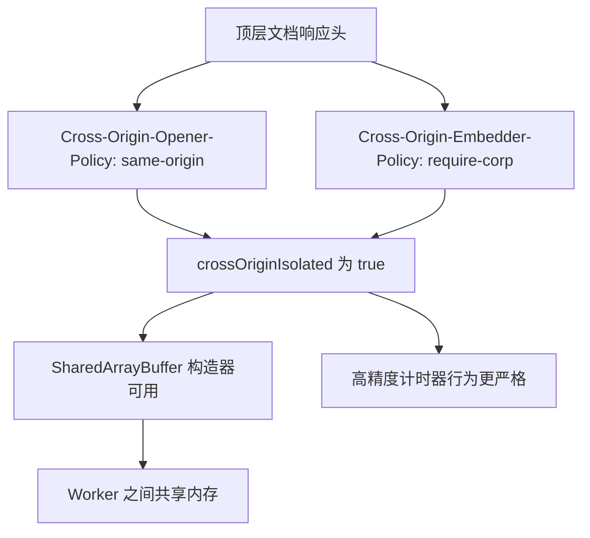
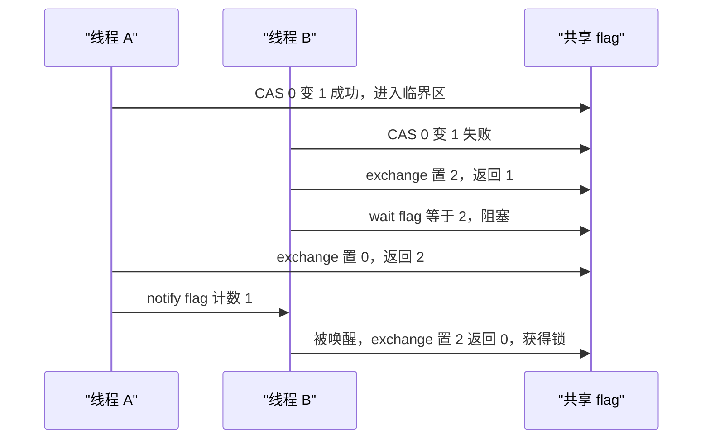

# SharedArrayBuffer、Atomics 与内存模型

!!! abstract "核心结论"

    - `postMessage` 默认走结构化克隆（深拷贝），`transferList` 是零拷贝转移并让源 `ArrayBuffer` 立刻 detach；`SharedArrayBuffer` 是第三条路，双方看到同一块物理内存。
    - 浏览器出于 Spectre 缓解，要求跨域隔离（`Cross-Origin-Opener-Policy: same-origin` + `Cross-Origin-Embedder-Policy: require-corp`，`crossOriginIsolated === true`）才能在页面里拿到 `SharedArrayBuffer`；Node.js 没有这个限制。
    - 只有 `Atomics` 操作能可靠地在共享内存上建立可见性；普通下标读写是数据竞争（data race），规范允许重排，也允许撕裂读（torn read）。
    - `Atomics.wait` 只能作用于 `Int32Array` / `BigInt64Array` 视图，浏览器主线程调用抛 `TypeError`；主线程需要异步等待时用 `Atomics.waitAsync`。
    - 自旋锁、futex 互斥锁、信号量、有界队列、Worker 线程池都能只用 `load / store / add / exchange / compareExchange / wait / notify` 手写出来。

## 1. 数据通路：结构化克隆、transfer 与共享内存

### 1.1 结构化克隆算法的边界

`postMessage`、`MessageChannel`、`workerData`、`history.pushState` 都走 HTML 规范定义的结构化克隆（structured clone）。它的核心是一次深度遍历：把对象的类型标签、内部槽位按规范表格逐个序列化到接收端的新对象图上。

工程上要知道的几条边界：

- 函数、`WeakMap`、`WeakSet`、Promise、Symbol 键、DOM 节点、`Error` 的堆栈细节（`stack` 是引擎附加属性，不一定被克隆）都不能克隆，直接抛 `DataCloneError`。
- `ArrayBuffer` 属于「可克隆」类型，克隆是逐字节复制。
- `SharedArrayBuffer` 单独归类：克隆的是「引用」而不是字节，克隆前后双方指向同一块内存，因此没有「源」和「副本」之分。
- TypedArray / DataView 克隆时会新建视图对象，但 `ArrayBuffer` 的克隆语义决定它们指向拷贝还是同一块共享内存。
- `Map` / `Set` / `Date` / `RegExp` / `BigInt` / 循环引用都被正确支持。

### 1.2 transfer：零拷贝转移与 detach

`postMessage(message, transferList)` 里的对象不复制，而是把底层资源的所有权移交。对 `ArrayBuffer` 而言，规范会在 `postMessage` 调用内部同步地把源 buffer 标记为 detached：`byteLength` 变成 0，再用它构造视图会抛 `TypeError`（`structuredClone(value, { transfer: [...] })` 语义相同）。

detach 是同步发生的，这既是性能红利（大 buffer 不再复制），也是常见 bug 来源：转移后继续访问源 buffer 会静默拿到 0 长度或直接抛错。同一对象在同一次 `postMessage` 里被转移两次会抛 `DataCloneError`。

### 1.3 三条通路的可运行对比

**运行环境**：Node.js（CommonJS，`worker_threads` 可用）。运行 `node transport.js`。

```js
// 文件: transport.js
const assert = require('node:assert');
const { Worker, isMainThread, parentPort, workerData, MessageChannel } = require('node:worker_threads');

async function main() {
  // 1) 结构化克隆：深拷贝，源对象不受影响
  const cloned = new ArrayBuffer(4);
  new Uint8Array(cloned)[0] = 42;

  // 2) transfer：零拷贝，源 ArrayBuffer 立刻被 detach
  const transferred = new ArrayBuffer(4);
  new Uint8Array(transferred)[0] = 7;

  const { port1, port2 } = new MessageChannel();
  const received = [];
  const gotTwo = new Promise((resolve) => {
    port2.on('message', (m) => {
      received.push(m);
      if (received.length === 2) resolve();
    });
  });
  port2.start();

  port1.postMessage({ tag: 'clone', buf: cloned });                          // 未列入 transferList
  port1.postMessage({ tag: 'transfer', buf: transferred }, [transferred]);   // 列入 transferList

  // detach 在 postMessage 调用内部同步完成
  assert.strictEqual(cloned.byteLength, 4);
  assert.strictEqual(transferred.byteLength, 0);
  assert.throws(() => new Uint8Array(transferred), TypeError); // 已 detach 的 buffer 不能建视图

  // 3) SharedArrayBuffer：既没有拷贝，也没有所有权转移
  const shared = new SharedArrayBuffer(4);
  const i32 = new Int32Array(shared);
  const w = new Worker(__filename, { workerData: { shared } });
  await new Promise((resolve, reject) => {
    w.once('message', resolve);
    w.once('error', reject);
  });

  await gotTwo;
  const byTag = Object.fromEntries(received.map((m) => [m.tag, m.buf]));
  assert.strictEqual(byTag.clone.byteLength, 4);
  assert.strictEqual(byTag.transfer.byteLength, 4);
  assert.strictEqual(new Uint8Array(byTag.transfer)[0], 7);
  assert.strictEqual(Atomics.load(i32, 0), 99);

  console.log('clone 源 buffer byteLength =', cloned.byteLength);
  console.log('transfer 源 buffer byteLength =', transferred.byteLength);
  console.log('共享内存主线程读到 =', Atomics.load(i32, 0));
  console.log('transport.js 全部断言通过');
}

if (isMainThread) {
  main().catch((e) => { console.error(e); process.exit(1); });
} else {
  const i32 = new Int32Array(workerData.shared);
  Atomics.store(i32, 0, 99);            // 原子写，跨线程可见性有规范保证
  parentPort.postMessage('done');
}
```

**验证标准**：`node transport.js`，预期输出（顺序固定）：

```
clone 源 buffer byteLength = 4
transfer 源 buffer byteLength = 0
共享内存主线程读到 = 99
transport.js 全部断言通过
```

三条通路横向对比：

| 维度 | 结构化克隆 | transfer 转移 | SharedArrayBuffer |
| --- | --- | --- | --- |
| 调用方式 | `postMessage(msg)` | `postMessage(msg, [buf])` | `postMessage(msg)`，msg 里含 SAB |
| 内存开销 | 全量拷贝 | 零拷贝，所有权移交 | 零拷贝，双向共享 |
| 源对象状态 | 完好 | detach，`byteLength` 为 0 | 无源副本之分，始终共享 |
| 需要同步 | 不需要 | 不需要 | 必须用 Atomics |
| 浏览器可用条件 | 无 | 无 | 需要跨域隔离 |
| 典型用途 | 小配置对象、控制消息 | 大 buffer 一次性移交 | 高频双向数据、计数器、任务队列 |

## 2. SharedArrayBuffer 与跨域隔离

### 2.1 内存语义

`SharedArrayBuffer` 与 `ArrayBuffer` 的区别不在 API，而在内存归属：

- 没有「转移」概念，`SharedArrayBuffer.prototype.slice` 返回的是新的共享 buffer（复制一份共享内存），不是 detach 语义。
- 多个 agent（主线程、多个 worker）持有的是同一块物理内存的映射。任何一个 agent 的写入立刻处于其他 agent 的可见范围内。
- 因为没有 happens-before，写入的「可见」和「有序」是两件事：x86 上几乎立刻看到字节，但规范允许读到更早的值、允许读到撕裂值。可见性 ≠ 顺序性。
- 对齐约束：`Atomics` 要求视图的 `byteOffset` 是元素大小的整数倍。用 `new Int32Array(sab, 1)` 这种非 4 字节对齐的视图做原子操作会抛错（具体错误类型与消息需核对官方文档）。

### 2.2 COOP / COEP 与 crossOriginIsolated

浏览器在 2018 年后因为 Spectre 类侧信道攻击禁用了 `SharedArrayBuffer`：攻击者可以用高精度计时器 + 多线程共享内存构造缓存探测。恢复方式是把文档放进「跨域隔离」的环境里，代价是顶层的跨源打开与子资源加载都受约束。



要点：

- 两个头都必须由**顶层文档**的响应提供，只在 iframe 或者 worker 里设置无效。
- 被嵌入的跨源子资源必须带 `Cross-Origin-Resource-Policy: cross-origin`（或 `same-origin`，取决于用途），否则会被 COEP 拦截。
- `Cross-Origin-Embedder-Policy: credentialless` 是另一种放宽方式，可用性需核对目标浏览器支持。
- 检测点只有一个：`self.crossOriginIsolated`。未隔离时浏览器通常根本不暴露 `SharedArrayBuffer` 构造器（`typeof SharedArrayBuffer === 'undefined'`），具体行为需核对官方文档与目标浏览器。
- Node.js 不存在同源策略，`SharedArrayBuffer` 始终可用。
- 规范后续加入了可增长的 `SharedArrayBuffer`（`maxByteLength` 与 `grow`），可用性需核对官方文档与目标运行时。

## 3. Atomics：顺序一致的读改写与等待唤醒

### 3.1 操作全表

| 方法 | 返回值 | 语义 |
| --- | --- | --- |
| `Atomics.load(a, i)` | 当前值 | 原子读 |
| `Atomics.store(a, i, v)` | `v`（转换后） | 原子写 |
| `Atomics.add / sub / and / or / xor(a, i, v)` | 修改前的旧值 | 原子读改写 |
| `Atomics.exchange(a, i, v)` | 旧值 | 原子交换 |
| `Atomics.compareExchange(a, i, e, r)` | 旧值 | 相等则写 `r`，否则不写 |
| `Atomics.wait(a, i, v, t)` | `"ok"` / `"not-equal"` / `"timed-out"` | 阻塞等待 |
| `Atomics.notify(a, i, n)` | 被唤醒的 agent 数 | 唤醒等待者 |
| `Atomics.waitAsync(a, i, v, t)` | `{ async, value }` | 非阻塞等待 |
| `Atomics.isLockFree(size)` | boolean | 该宽度是否硬件原子，属于提示 |

约束：`a` 必须是整数 TypedArray（`Int8Array`/`Uint8Array`/`Int16Array`/…/`BigInt64Array`），`wait`/`notify`/`waitAsync` 只接受 `Int32Array` 或 `BigInt64Array`，且底层必须是 `SharedArrayBuffer`。

### 3.2 CAS 循环与返回值语义

`compareExchange` 是唯一能表达「乐观并发」的原语：比较成功才算写入，失败时返回**实际**的旧值，调用方据此重算再试。所有返回值语义值得背下来——`add` 返回旧值而不是新值，`store` 返回新值。

### 3.3 可运行验证

**运行环境**：Node.js，单线程即可。运行 `node atomics-cas.js`。

```js
// 文件: atomics-cas.js
const assert = require('node:assert');

const sab = new SharedArrayBuffer(16);
const i32 = new Int32Array(sab);
const u32 = new Uint32Array(sab);   // 同一块内存的另一种视图

// 1) store 返回写入后的值，load 返回当前值
assert.strictEqual(Atomics.store(i32, 0, 10), 10);
assert.strictEqual(Atomics.load(i32, 0), 10);
assert.strictEqual(Atomics.store(i32, 0, 20), 20);

// 2) add / sub 返回操作前的旧值
assert.strictEqual(Atomics.add(i32, 0, 5), 20);   // 20 -> 25
assert.strictEqual(Atomics.load(i32, 0), 25);
assert.strictEqual(Atomics.sub(i32, 0, 5), 25);   // 25 -> 20
assert.strictEqual(Atomics.exchange(i32, 0, 0), 20); // 20 -> 0，返回旧值

// 3) compareExchange：相等才写，返回实际旧值
assert.strictEqual(Atomics.compareExchange(i32, 0, 1, 100), 0); // 期望 1，实际 0，失败
assert.strictEqual(Atomics.load(i32, 0), 0);
assert.strictEqual(Atomics.compareExchange(i32, 0, 0, 100), 0); // 成功
assert.strictEqual(Atomics.load(i32, 0), 100);

// 4) 视图共享同一块字节：写入 -1，无符号视图看到 0xFFFFFFFF
Atomics.store(i32, 1, -1);
assert.strictEqual(u32[1], 0xFFFFFFFF);
assert.strictEqual(i32[1], -1);

// 5) 无锁 CAS 循环：把「读-改-写」变成原子语义
function atomicMax(view, index, candidate) {
  let seen = Atomics.load(view, index);
  while (candidate > seen) {
    const prev = Atomics.compareExchange(view, index, seen, candidate);
    if (prev === seen) return candidate;  // 成功
    seen = prev;                          // 失败：prev 是当前真实值，重试
  }
  return seen;
}

assert.strictEqual(atomicMax(i32, 2, 5), 5);
assert.strictEqual(atomicMax(i32, 2, 3), 5);   // 候选更小，不动
assert.strictEqual(atomicMax(i32, 2, 9), 9);
assert.strictEqual(Atomics.load(i32, 2), 9);

console.log('Atomics.isLockFree(4) =', Atomics.isLockFree(4), '（平台相关）');
console.log('atomics-cas.js 全部断言通过');
```

**验证标准**：`node atomics-cas.js`，预期输出：

```
Atomics.isLockFree(4) = true （平台相关）
atomics-cas.js 全部断言通过
```

`isLockFree` 一行由实现决定：规范允许引擎自行给出答案，主流 64 位平台上 1/2/4 字节为 `true`，8 字节取决于平台是否支持 64 位原子操作，需以实测为准。

### 3.4 wait / notify 的精确语义

- `Atomics.wait(a, i, v, t)`：若 `a[i] !== v`，立刻返回 `"not-equal"` 且不阻塞；否则挂起当前 agent，直到 `notify` 命中或超时 `t` 毫秒，返回 `"ok"` 或 `"timed-out"`。省略 `t` 表示无限等待。
- 这个「先比较再挂起」是原子完成的，正是它消除了丢失唤醒（lost wakeup）：唤醒者即使在你挂起前就改了值并通知，你在挂起瞬间发现值已变，会立刻返回 `"not-equal"`。
- `notify` 唤醒哪个等待者由实现决定，不保证 FIFO。不要在业务逻辑里依赖唤醒顺序。
- 等待队列按 (共享内存块, 索引) 组织。`Int32Array` 的 `[0]` 和 `[1]` 是两个独立的等待队列，可以分别做「空队列等待」和「满队列等待」。
- 只有 `Atomics` 操作加 `notify` 才能唤醒等待者；普通写即使改了值也不会唤醒任何人。

### 3.5 Atomics.waitAsync

**运行环境**：Node.js，且运行时需支持 `Atomics.waitAsync`（最低版本需核对官方文档；代码已做能力检测）。

```js
// 文件: wait-async.js
const assert = require('node:assert');
const { Worker, isMainThread, parentPort, workerData } = require('node:worker_threads');

if (isMainThread) {
  (async () => {
    if (typeof Atomics.waitAsync !== 'function') {
      console.log('当前运行时没有 Atomics.waitAsync，跳过；最低版本需核对官方文档');
      return;
    }
    const sab = new SharedArrayBuffer(4);
    const i32 = new Int32Array(sab);

    // 值不等于期望值：同步返回，不产生 Promise
    const immediate = Atomics.waitAsync(i32, 0, 1);
    assert.strictEqual(immediate.async, false);
    assert.strictEqual(immediate.value, 'not-equal');

    // 值等于期望值：异步返回 Promise，主线程不被阻塞
    const pending = Atomics.waitAsync(i32, 0, 0);
    assert.strictEqual(pending.async, true);
    assert.ok(pending.value instanceof Promise);

    const w = new Worker(__filename, { workerData: { sab } });
    const outcome = await pending.value;          // 主线程照常跑事件循环
    assert.strictEqual(outcome, 'ok');
    assert.strictEqual(Atomics.load(i32, 0), 1);
    console.log('waitAsync 结果 =', outcome, ' 值 =', Atomics.load(i32, 0));
    await w.terminate();
  })().catch((e) => { console.error(e); process.exit(1); });
} else {
  const i32 = new Int32Array(workerData.sab);
  Atomics.store(i32, 0, 1);
  Atomics.notify(i32, 0, 1);
}
```

**验证标准**：`node wait-async.js`，预期输出：

```
waitAsync 结果 = ok  值 = 1
```

若运行时缺少该 API，则输出 `当前运行时没有 Atomics.waitAsync，跳过；最低版本需核对官方文档`，脚本正常退出码 0。

## 4. JavaScript 内存模型

### 4.1 事件、程序顺序、reads-from

ECMAScript 规范用一套事件模型描述共享内存，关键概念：

- **Agent**：一个独立的执行上下文（主线程、每个 worker 各是一个 agent）。agent 内部的执行是一条序列。
- **Shared Data Block Event**：对共享内存的一次读或写，带 agent、内存位置、值、原子性标记。
- **Agent Order**：同一 agent 内事件按程序顺序排列。
- **Synchronizes-With**：跨 agent 的两个事件，如果后者读到了前者写入的值（reads-from），就建立一条同步边。
- **Happens-Before**：Agent Order 与 Synchronizes-With 的传递闭包。

由此得到一个工程上极其重要的推论：**只要 B 读到了 A 写的那个值，A 在程序顺序上早于该写的一切效果，对 B 在程序顺序上晚于该读的一切都可见**。这就是互斥锁能保护非原子数据、SPSC 队列能靠 tail 指针发布数据的理论基础。

（精确公理集合以 ECMAScript 规范 Memory Model 章节为准，工程推理请以该章节为准，需核对官方文档。）

### 4.2 数据竞争、撕裂与重排序

若两个事件访问同一内存位置、至少一个是写、且二者之间没有 happens-before 关系，就构成**数据竞争（data race）**。规范对数据竞争不做任何保证：

- **撕裂读（torn read）**：一个多字节值的非原子读可能读到由不同写入的字节拼出的值。规范允许（并非要求）实现产生这种结果，需核对官方文档确认措辞。
- **重排序**：引擎的优化器、CPU 的乱序执行、编译器级别的内存屏障消除，都可能让「先写 A 再写 B」对另一个 agent 表现为「先 B 后 A」。
- **可见性延迟**：即使字节已经写入，非原子读也可能读到过期值。

JS 与 C++ 内存模型的一个重要差异：C++ 需要显式的 release/acquire 标注才能建立同步，而 JS 的同步关系由 reads-from 直接给出。这意味着在 JS 里，**只要你用 `Atomics` 发布和订阅，非原子载荷就会被正确传递**；但如果你用普通写做标志位，就没有任何保证。

| 访问类型 | 顺序保证 | 允许撕裂 | 建立跨 agent 同步 |
| --- | --- | --- | --- |
| 非原子读写（下标访问） | 无（数据竞争） | 允许 | 不直接建立，需借助 Atomics 发布 |
| `Atomics.load` | 顺序一致 | 不允许 | 读到某次写即建立 |
| `Atomics.store` | 顺序一致 | 不允许 | 被读到时建立 |
| `Atomics` 读改写 | 顺序一致 | 不允许 | 是 |

### 4.3 顺序一致性的实际含义

规范要求所有 `Atomics` 操作整体上表现为**顺序一致**（sequentially consistent）：存在一个所有 agent 都认同的全局顺序，每个原子操作按该顺序生效，且每个 agent 内部的原子操作保持程序顺序。实践中这意味着：

- 用 `Atomics` 实现的自旋锁、信号量不需要额外插入内存屏障。
- 同一个被 `Atomics` 保护的临界区，临界区内的普通读写不需要变成原子访问。
- 用 `Atomics` 和用普通写混用同一个标志位，等于放弃了所有保证。

## 5. 手写同步原语

以下每个实现都是完整可运行文件，均使用 Node.js 的 `worker_threads` 自举（`new Worker(__filename)`），主线程只做编排，`Atomics.wait` 一律发生在 worker 内。

### 5.1 自旋锁

**运行环境**：Node.js。运行 `node spinlock.js`。

```js
// 文件: spinlock.js
const assert = require('node:assert');
const { Worker, isMainThread, parentPort, workerData } = require('node:worker_threads');

const THREADS = 4;
const PER_THREAD = 20000;
const TOTAL = THREADS * PER_THREAD;

// 布局: i32[0] = 锁(0 空闲 / 1 占用), i32[1] = 受保护的非原子计数器
function acquire(i32) {
  while (Atomics.compareExchange(i32, 0, 0, 1) !== 0) {
    // 空转。生产环境应加入退避；较新引擎提供 Atomics.pause 提示 CPU 降功耗，
    // 其可用性需核对官方文档。
  }
}

function release(i32) {
  Atomics.store(i32, 0, 0);
}

if (isMainThread) {
  const sab = new SharedArrayBuffer(8);
  const i32 = new Int32Array(sab);
  const workers = [];
  for (let t = 0; t < THREADS; t++) {
    workers.push(new Worker(__filename, { workerData: { sab } }));
  }
  Promise.all(workers.map((w) => new Promise((resolve, reject) => {
    w.once('exit', resolve);
    w.once('error', reject);
  }))).then(() => {
    const got = Atomics.load(i32, 1);
    console.log('自旋锁保护下的计数 =', got, ' 期望 =', TOTAL, ' 丢失 =', TOTAL - got);
    assert.strictEqual(got, TOTAL);
    console.log('spinlock.js 全部断言通过');
  }).catch((e) => { console.error(e); process.exit(1); });
} else {
  const i32 = new Int32Array(workerData.sab);
  for (let n = 0; n < PER_THREAD; n++) {
    acquire(i32);
    i32[1] = i32[1] + 1;   // 非原子读改写，只有锁能保证不丢
    release(i32);
  }
  parentPort.postMessage('done');
}
```

**验证标准**：`node spinlock.js`，预期输出（若丢失数不为 0 则断言失败、退出码非 0）：

```
自旋锁保护下的计数 = 80000  期望 = 80000  丢失 = 0
spinlock.js 全部断言通过
```

自旋锁的问题很明确：不阻塞、烧 CPU、不公平（后到的可能反复插队，造成饥饿），且在高竞争下会引发缓存行来回弹跳。适合临界区只有几条指令的场景。

### 5.2 基于 Atomics.wait 的互斥锁（三态 futex）

三态设计是 Drepper 风格 futex 互斥锁的核心：`0` 空闲、`1` 已加锁且无等待者、`2` 已加锁且有等待者。区分 1 和 2 是为了让 `unlock` 知道「有没有人要唤醒」，从而避免每次都发起系统调用。



**运行环境**：Node.js。运行 `node futex-mutex.js`。

```js
// 文件: futex-mutex.js
const assert = require('node:assert');
const { Worker, isMainThread, parentPort, workerData } = require('node:worker_threads');

const THREADS = 4;
const PER_THREAD = 20000;
const TOTAL = THREADS * PER_THREAD;

const FREE = 0, LOCKED = 1, CONTENDED = 2;

function lock(i32) {
  if (Atomics.compareExchange(i32, 0, FREE, LOCKED) === FREE) return; // 快路径：无竞争
  for (;;) {
    // 有竞争：把状态推到 CONTENDED，若返回 FREE 说明刚好抢到了锁
    if (Atomics.exchange(i32, 0, CONTENDED) === FREE) return;
    // 只有确认值仍是 CONTENDED 才真的挂起；否则立刻返回 not-equal
    Atomics.wait(i32, 0, CONTENDED);
  }
}

function unlock(i32) {
  // 置 0 并取回旧值；旧值为 CONTENDED 说明有等待者
  if (Atomics.exchange(i32, 0, FREE) === CONTENDED) {
    Atomics.notify(i32, 0, 1);
  }
}

if (isMainThread) {
  const sab = new SharedArrayBuffer(8);
  const i32 = new Int32Array(sab);
  const workers = [];
  for (let t = 0; t < THREADS; t++) {
    workers.push(new Worker(__filename, { workerData: { sab } }));
  }
  Promise.all(workers.map((w) => new Promise((resolve, reject) => {
    w.once('exit', resolve);
    w.once('error', reject);
  }))).then(() => {
    const got = Atomics.load(i32, 1);
    console.log('futex 互斥锁保护下的计数 =', got, ' 期望 =', TOTAL, ' 丢失 =', TOTAL - got);
    assert.strictEqual(got, TOTAL);
    console.log('futex-mutex.js 全部断言通过');
  }).catch((e) => { console.error(e); process.exit(1); });
} else {
  const i32 = new Int32Array(workerData.sab);
  for (let n = 0; n < PER_THREAD; n++) {
    lock(i32);
    i32[1] = i32[1] + 1;   // 临界区
    unlock(i32);
  }
  parentPort.postMessage('done');
}
```

**验证标准**：`node futex-mutex.js`，预期输出：

```
futex 互斥锁保护下的计数 = 80000  期望 = 80000  丢失 = 0
futex-mutex.js 全部断言通过
```

正确性论证（面试常问）：等待者挂起前必然把状态置为 `CONTENDED`；此后能改变该状态的只有持有者的 `unlock`，而 `unlock` 在旧值为 `CONTENDED` 时必定 `notify`。即使 `notify` 抢在 `Atomics.wait` 之前发生，`wait` 的期望值校验会让它立即返回 `"not-equal"`，不会永久挂起。

### 5.3 信号量

**运行环境**：Node.js。运行 `node semaphore.js`。

```js
// 文件: semaphore.js
const assert = require('node:assert');
const { Worker, isMainThread, parentPort, workerData } = require('node:worker_threads');

const PERMITS = 2;
const THREADS = 6;
const ROUNDS = 20;

// 布局: [0] 可用许可, [1] 当前持有者数, [2] 观察到的最大并发, [3] 用于模拟耗时的睡眠字
function acquire(i32) {
  for (;;) {
    const permits = Atomics.load(i32, 0);
    if (permits > 0) {
      // 有许可就尝试扣减；CAS 失败说明有竞争，重新读，不进等待
      if (Atomics.compareExchange(i32, 0, permits, permits - 1) === permits) return;
      continue;
    }
    // 只有确认许可为 0 才挂起，避免「有许可却睡着」的活性问题
    Atomics.wait(i32, 0, 0);
  }
}

function release(i32) {
  Atomics.add(i32, 0, 1);      // 先归还许可
  Atomics.notify(i32, 0, 1);   // 再唤醒一个等待者
}

if (isMainThread) {
  const sab = new SharedArrayBuffer(16);
  const i32 = new Int32Array(sab);
  Atomics.store(i32, 0, PERMITS);
  const workers = [];
  for (let t = 0; t < THREADS; t++) {
    workers.push(new Worker(__filename, { workerData: { sab } }));
  }
  Promise.all(workers.map((w) => new Promise((resolve, reject) => {
    w.once('exit', resolve);
    w.once('error', reject);
  }))).then(() => {
    const free = Atomics.load(i32, 0);
    const holders = Atomics.load(i32, 1);
    const maxSeen = Atomics.load(i32, 2);
    console.log('剩余许可 =', free, ' 残留持有者 =', holders, ' 观察到的最大并发 =', maxSeen, '（时序相关）');
    assert.strictEqual(free, PERMITS);
    assert.strictEqual(holders, 0);
    assert.ok(maxSeen <= PERMITS, '并发持有者数从未超过许可数');
    console.log('semaphore.js 全部断言通过');
  }).catch((e) => { console.error(e); process.exit(1); });
} else {
  const i32 = new Int32Array(workerData.sab);
  for (let r = 0; r < ROUNDS; r++) {
    acquire(i32);
    const holders = Atomics.add(i32, 1, 1) + 1;
    // 用 CAS 循环更新历史最大并发
    for (let seen = Atomics.load(i32, 2); holders > seen;) {
      const prev = Atomics.compareExchange(i32, 2, seen, holders);
      if (prev === seen) break;
      seen = prev;
    }
    // 模拟临界区耗时：在恒为 0 的睡眠字上等 5ms 超时（worker 中允许阻塞）
    Atomics.wait(i32, 3, 0, 5);
    Atomics.sub(i32, 1, 1);
    release(i32);
  }
  parentPort.postMessage('done');
}
```

**验证标准**：`node semaphore.js`，预期输出（`观察到的最大并发` 为时序相关值，但断言要求它不超过 2）：

```
剩余许可 = 2  残留持有者 = 0  观察到的最大并发 = 2 （时序相关）
semaphore.js 全部断言通过
```

### 5.4 单生产者单消费者有界环形队列

SPSC 场景可以完全无锁：生产者只写 `tail`，消费者只写 `head`，两个指针都用 `Atomics` 发布。关键在于「非原子写数据槽 → 原子写指针」这个发布顺序，以及消费者「原子读指针 → 非原子读数据槽」这个订阅顺序。

**运行环境**：Node.js。运行 `node spsc-queue.js`。

```js
// 文件: spsc-queue.js
const assert = require('node:assert');
const { Worker, isMainThread, parentPort, workerData } = require('node:worker_threads');

const CAPACITY = 1024;    // 实际可用 CAPACITY - 1 个槽位
const COUNT = 100000;

class SpscQueue {
  constructor(sab, capacity) {
    this.capacity = capacity;
    this.ctrl = new Int32Array(sab, 0, 8);          // ctrl[0] = head, ctrl[1] = tail
    this.data = new Int32Array(sab, 32, capacity);  // 数据区从 32 字节偏移开始，保证对齐
  }

  push(value) {
    for (;;) {
      const tail = Atomics.load(this.ctrl, 1);
      const head = Atomics.load(this.ctrl, 0);
      if ((tail + 1) % this.capacity === head) {
        // 满：在 head 索引上等，期望值就是刚读到的 head
        Atomics.wait(this.ctrl, 0, head);
        continue;
      }
      this.data[tail] = value;                    // 非原子写，独占该槽位
      Atomics.store(this.ctrl, 1, (tail + 1) % this.capacity); // 原子发布
      Atomics.notify(this.ctrl, 1);               // 唤醒可能阻塞的消费者
      return;
    }
  }

  pop() {
    for (;;) {
      const head = Atomics.load(this.ctrl, 0);
      const tail = Atomics.load(this.ctrl, 1);
      if (head === tail) {
        // 空：在 tail 索引上等
        Atomics.wait(this.ctrl, 1, tail);
        continue;
      }
      const value = this.data[head];              // 非原子读，独占该槽位
      Atomics.store(this.ctrl, 0, (head + 1) % this.capacity);
      Atomics.notify(this.ctrl, 0);               // 唤醒可能阻塞的生产者
      return value;
    }
  }
}

function exitOf(w) {
  return new Promise((resolve, reject) => {
    w.once('exit', resolve);
    w.once('error', reject);
  });
}

if (isMainThread) {
  (async () => {
    const sab = new SharedArrayBuffer(32 + CAPACITY * 4);
    const producer = new Worker(__filename, { workerData: { sab, role: 'producer' } });
    const consumer = new Worker(__filename, { workerData: { sab, role: 'consumer' } });

    let consumerResult = null;
    consumer.on('message', (m) => { consumerResult = m; });

    await Promise.all([exitOf(producer), exitOf(consumer)]);

    const expectedSum = (COUNT * (COUNT + 1)) / 2;
    console.log('消费元素数 =', COUNT, ' 求和 =', consumerResult.sum, ' 期望 =', expectedSum);
    console.log('顺序保持 =', consumerResult.ordered);
    assert.strictEqual(consumerResult.sum, expectedSum);
    assert.strictEqual(consumerResult.ordered, true);
    console.log('spsc-queue.js 全部断言通过');
  })().catch((e) => { console.error(e); process.exit(1); });
} else if (workerData.role === 'producer') {
  const q = new SpscQueue(workerData.sab, CAPACITY);
  for (let i = 1; i <= COUNT; i++) q.push(i);
  parentPort.postMessage({ role: 'producer' });
} else {
  const q = new SpscQueue(workerData.sab, CAPACITY);
  let sum = 0;
  let ordered = true;
  let expected = 1;
  for (let i = 0; i < COUNT; i++) {
    const v = q.pop();
    if (v !== expected) ordered = false;
    expected++;
    sum += v;
  }
  parentPort.postMessage({ role: 'consumer', sum, ordered });
}
```

**验证标准**：`node spsc-queue.js`，预期输出：

```
消费元素数 = 100000  求和 = 5000050000  期望 = 5000050000
顺序保持 = true
spsc-queue.js 全部断言通过
```

### 5.5 Worker 线程池（动态领取任务）

动态调度用 `Atomics.add` 领取任务号，天然不重复；如果改成 `ctrl[0]++`，多个 worker 会领到同一个任务号，结果被重复计算、部分结果永远不会被写。

**运行环境**：Node.js。运行 `node thread-pool.js`。

```js
// 文件: thread-pool.js
const assert = require('node:assert');
const { Worker, isMainThread, parentPort, workerData } = require('node:worker_threads');

const TOTAL = 40000;
const POOL = 4;

// 纯函数任务：任何 worker 都能独立算出结果
function heavy(i) {
  let h = (i ^ 0x9e3779b9) >>> 0;
  h = Math.imul(h ^ (h >>> 16), 0x85ebca6b) >>> 0;
  h = Math.imul(h ^ (h >>> 13), 0xc2b2ae35) >>> 0;
  return (h ^ (h >>> 16)) >>> 0;
}

// 布局: ctrl[0] 下一个任务号, ctrl[1] 已完成任务数; 结果区从 32 字节偏移开始
function drain(sab) {
  const ctrl = new Int32Array(sab, 0, 8);
  const results = new Uint32Array(sab, 32, TOTAL);
  for (;;) {
    const i = Atomics.add(ctrl, 0, 1);   // 原子领取，绝不重复
    if (i >= TOTAL) return;              // 队列已空
    results[i] = heavy(i);               // 写入独占槽位，不需要原子
    Atomics.add(ctrl, 1, 1);             // 完成计数
  }
}

if (isMainThread) {
  (async () => {
    const sab = new SharedArrayBuffer(32 + TOTAL * 4);
    const ctrl = new Int32Array(sab, 0, 8);
    const results = new Uint32Array(sab, 32, TOTAL);

    const workers = [];
    for (let t = 0; t < POOL; t++) {
      workers.push(new Worker(__filename, { workerData: { sab } }));
    }
    await Promise.all(workers.map((w) => new Promise((resolve, reject) => {
      w.once('exit', resolve);
      w.once('error', reject);
    })));

    assert.strictEqual(Atomics.load(ctrl, 1), TOTAL);       // 每个任务恰好完成一次
    assert.ok(Atomics.load(ctrl, 0) >= TOTAL);              // 任务号已发放完
    for (let i = 0; i < TOTAL; i++) {
      assert.strictEqual(results[i], heavy(i), '任务 ' + i + ' 结果正确');
    }
    console.log('线程池完成', TOTAL, '个任务，池大小 =', POOL, '，领取任务号 =', Atomics.load(ctrl, 0));
    console.log('thread-pool.js 全部断言通过');
  })().catch((e) => { console.error(e); process.exit(1); });
} else {
  drain(workerData.sab);
  parentPort.postMessage('done');
}
```

**验证标准**：`node thread-pool.js`，预期输出（`领取任务号` 可能大于 40000，最多多出 POOL - 1 个空领）：

```
线程池完成 40000 个任务，池大小 = 4 ，领取任务号 = 40004
thread-pool.js 全部断言通过
```

如果要把它变成常驻池，把「队列空就退出」改成「在控制字上 `Atomics.wait` 挂起」，由提交方 `Atomics.store` + `Atomics.notify` 唤醒即可，模型与 5.4 一致。

## 6. 计数器竞态对比实验

三种自增方式在同一台机器、同一轮实验里对比：普通读改写、`Atomics.add`、手写 CAS 循环。

**运行环境**：Node.js。运行 `node race.js`。

```js
// 文件: race.js
const assert = require('node:assert');
const { Worker, isMainThread, parentPort, workerData } = require('node:worker_threads');

const THREADS = 4;
const ITER = 200000;
const EXPECTED = THREADS * ITER;

function casIncrement(u32) {
  let seen = Atomics.load(u32, 0);
  for (;;) {
    const prev = Atomics.compareExchange(u32, 0, seen, (seen + 1) >>> 0);
    if (prev === seen) return;   // 成功
    seen = prev;                 // 失败：prev 已是当前真实值
  }
}

function runWorkers(mode, sab) {
  const ws = [];
  for (let t = 0; t < THREADS; t++) {
    ws.push(new Worker(__filename, { workerData: { mode, sab } }));
  }
  return Promise.all(ws.map((w) => new Promise((resolve, reject) => {
    w.once('exit', resolve);
    w.once('error', reject);
  })));
}

if (isMainThread) {
  (async () => {
    const plainSab = new SharedArrayBuffer(4);
    const atomicSab = new SharedArrayBuffer(4);
    const casSab = new SharedArrayBuffer(4);

    await Promise.all([
      runWorkers('plain', plainSab),
      runWorkers('atomic', atomicSab),
      runWorkers('cas', casSab),
    ]);

    const plain = new Uint32Array(plainSab)[0];
    const atomic = new Uint32Array(atomicSab)[0];
    const cas = new Uint32Array(casSab)[0];

    console.log('期望值           =', EXPECTED);
    console.log('Atomics.add 结果 =', atomic);
    console.log('CAS 循环结果     =', cas);
    console.log('非原子自增结果   =', plain, '（随调度变化）');
    console.log('非原子丢失更新   =', EXPECTED - plain);

    assert.strictEqual(atomic, EXPECTED, 'Atomics.add 结果精确');
    assert.strictEqual(cas, EXPECTED, 'CAS 循环结果精确');
    assert.ok(plain <= EXPECTED, '非原子自增不会超过期望值');
    console.log('race.js 全部断言通过');
  })().catch((e) => { console.error(e); process.exit(1); });
} else {
  const { mode, sab } = workerData;
  const u32 = new Uint32Array(sab);
  for (let i = 0; i < ITER; i++) {
    if (mode === 'plain') {
      u32[0] = u32[0] + 1;      // 非原子：读和写之间可能被其他 agent 插入
    } else if (mode === 'atomic') {
      Atomics.add(u32, 0, 1);
    } else {
      casIncrement(u32);
    }
  }
  parentPort.postMessage('done');
}
```

**验证标准**：`node race.js`，预期输出（`非原子自增结果` 与 `非原子丢失更新` 由调度决定；前四行数值若不同不影响结论，但两条 `strictEqual` 必须通过）：

```
期望值           = 800000
Atomics.add 结果 = 800000
CAS 循环结果     = 800000
非原子自增结果   = 431872 （随调度变化）
非原子丢失更新   = 368128
race.js 全部断言通过
```

这里刻意不对「非原子结果严格小于期望值」做硬断言，因为理论上存在调度恰好不发生交错的可能；但这在实践中几乎不会出现。断言只保证不会超过期望值，避免测试在不同机器上抖动。

## 7. 常见陷阱

1. **用普通变量做跨线程标志位。** `while (!flag) {}` 这种忙等在共享内存上是数据竞争，规范允许读到过期值；引擎是否把读提升出循环属于实现细节，不能依赖（需核对官方文档与实现）。正解是 `Atomics.load`。
2. **以为 `Atomics` 只保证原子性、不保证顺序。** 恰恰相反：所有 `Atomics` 操作构成一个顺序一致的全局序，这才是同步原语不需要手动插屏障的原因。
3. **把 `Atomics.wait` 的 `expectedValue` 写错。** 它不是「等多久」，而是「值等于这个数时才挂起」。写成恒定值或写错变量，会导致永久阻塞或退化成忙等。
4. **在主线程调用 `Atomics.wait`。** 浏览器主线程会抛 `TypeError`；Node.js 主线程的行为与版本相关，需核对官方文档。跨线程等待应当发生在 worker 中，主线程改用 `Atomics.waitAsync`。
5. **用 `SharedArrayBuffer` 传 TypedArray 后假设视图对象相同。** 视图会被克隆成新对象，只是指向同一块内存。不要用 `===` 比较视图，也不要假设 `byteOffset`/`length` 会自动对齐。
6. **transfer 后继续访问源 buffer。** `byteLength` 变 0，构造视图抛 `TypeError`。这类 bug 常常表现为「偶发的空数据」，而不是明显崩溃。
7. **同一 buffer 在同一次 `postMessage` 的 transferList 里出现两次**，抛 `DataCloneError`。
8. **忘记 COOP/COEP 只对顶层文档生效。** iframe 或子 worker 自己带头没用，子资源还要带 `Cross-Origin-Resource-Policy`。
9. **依赖 `Atomics.notify` 的唤醒顺序。** 规范不保证 FIFO，也不保证唤醒的是等待最久的那个。
10. **非原子多字节读可能撕裂。** 例如用两个普通写发布一个 64 位值，读方可能读到高低位来自不同写入的组合值。所有需要一致性的多字节发布都必须用 `Atomics`（`BigInt64Array` 在支持 64 位原子操作的平台上才真正无锁，`Atomics.isLockFree(8)` 可作参考，需核对官方文档）。
11. **看到 `.byteLength` 不为 0 就以为数据同步完成了。** 可见性不等于有序性，也不等于其他线程已经用完。
12. **在无锁结构上忽视 ABA 问题。** 计数器场景 ABA 无害，但栈、队列等结构需要用版本号（tagged pointer）配合 CAS，否则可能把已释放的节点重新接回。

## 8. 面试题与答题要点

**1. `SharedArrayBuffer` 和 `postMessage` 传 `ArrayBuffer` 有什么区别？**

要点：结构化克隆是深拷贝，源对象完好；`transferList` 是零拷贝所有权移交，源 buffer 在 `postMessage` 内同步 detach；`SharedArrayBuffer` 既不拷贝也不移交，所有 agent 映射同一块物理内存，因此必须自己解决同步问题。回答时补一句「克隆的是视图对象，共享的是底层内存」，能体现理解深度。

**2. 浏览器为什么默认禁用 `SharedArrayBuffer`？怎么恢复？**

要点：Spectre 类侧信道攻击需要「高精度计时器 + 共享内存」两个条件，共享内存被用于构造跨进程的缓存探测。恢复方式是跨域隔离：顶层文档响应 `Cross-Origin-Opener-Policy: same-origin` 与 `Cross-Origin-Embedder-Policy: require-corp`，此后 `crossOriginIsolated === true`，构造器可用。补充：被嵌入的子资源需要 `Cross-Origin-Resource-Policy`，`COEP: credentialless` 是另一种放宽方式（支持情况需核对官方文档）。

**3. 为什么多线程下 `x++` 会丢更新？**

要点：`x++` 展开成「读 → 加一 → 写」三步，不是原子操作。两个 agent 可能读到同一旧值，后写的覆盖先写的。用 `Atomics.add` 把它合成一个原子读改写，或用互斥锁保护。可以顺带提：即使 `x++` 编译成单个 `inc` 指令，在共享内存上也不是原子的读改写语义。

**4. `Atomics` 提供了哪些顺序保证？**

要点：所有 `Atomics` 操作整体顺序一致（sequentially consistent），存在一个所有 agent 认同的全局序；同一 agent 内的原子操作保持程序顺序；非原子访问不参与该顺序，构成数据竞争时允许重排与撕裂；`Atomics` 的读与写之间通过 reads-from 建立 happens-before。

**5. 用 `Atomics` 同步非原子数据，为什么是安全的？**

要点：同步边由 reads-from 建立。写完非原子载荷后 `Atomics.store` 发布标志位，读方 `Atomics.load`（或 `wait` 返回）读到该值，就建立 happens-before：发布者在程序顺序上早于该 `store` 的一切效果，对订阅者在程序顺序上晚于该 `load` 的一切可见。注意这要求发布用原子写、订阅用原子读，任何一侧换成普通访问都失效。

**6. `Atomics.wait` 有哪些限制？丢失唤醒是怎么避免的？**

要点：只接受 `Int32Array` / `BigInt64Array` 且底层是 `SharedArrayBuffer`；浏览器主线程抛 `TypeError`；返回值是 `"ok"` / `"not-equal"` / `"timed-out"`；只有 `notify` 或超时才会结束等待。丢失唤醒的避免机制是「比较 + 挂起」的原子性：若值已变，`wait` 立即返回 `"not-equal"`，调用方循环重试。主线程要异步等待就用 `Atomics.waitAsync`，它返回 `{ async, value }`，值不匹配时同步返回 `"not-equal"`。

**7. 实现一个基于 `Atomics.wait` 的互斥锁，说明 0/1/2 三态的意义。**

要点：0 空闲、1 已加锁无等待者、2 已加锁有等待者。快路径 `compareExchange(0, 1)`；慢路径 `exchange(2)`，返回 0 说明抢到锁，否则 `wait(flag, 2)` 挂起。`unlock` 用 `exchange(0)`，旧值为 2 才 `notify(1)`。区分 1 和 2 的价值在于让 `unlock` 知道是否需要唤醒，避免无谓的唤醒开销；同时保证等待者挂起期间状态必然是 2，而唯一能把 2 改成 0 的路径必定 `notify`，因此不会永久挂起。

**8. `compareExchange` 为什么能实现无锁结构？有什么坑？**

要点：CAS 把「比较 + 写入」做成一个原子的读改写，失败时返回实际旧值，调用方据此重算重试，形成乐观并发，不需要阻塞。坑：ABA 问题（需要版本号）、活锁（重试风暴，需退避）、每次 CAS 都在同一缓存行上竞争导致扩展性差、以及 CAS 循环里对共享数据的非原子读必须重新通过 `Atomics.load` 获取。

**9. 自旋锁、`Atomics.wait` 互斥锁、信号量分别适合什么场景？**

要点：自旋锁适合临界区只有几条指令、且线程数远小于核数的情况，否则浪费 CPU 且可能饥饿；`Atomics.wait` 互斥锁在临界区可能有较长耗时时明显更优，代价是系统调用与唤醒延迟；信号量控制的是「并发度」而不是互斥，适合连接池、限流、生产者消费者的缓冲槽位计数。全部需要用 `Atomics` 实现状态迁移，才能获得顺序一致保证。

**10. Worker 之间能传什么？哪些情况会抛 `DataCloneError`？**

要点：结构化克隆支持普通对象、数组、`Map`/`Set`/`Date`/`RegExp`/`BigInt`、`ArrayBuffer`、TypedArray、`SharedArrayBuffer`、`MessagePort`（可转移）；函数、`WeakMap`/`WeakSet`、Promise、DOM 节点、Symbol 键不可克隆；同一对象被转移两次也会抛错。`MessagePort` 转移之后才能实现「双方互相收发」的通道。

## 深入阅读与参考

!!! tip "怎么用这些资料"
    先读「官方文档与规范」建立准确的概念，再读「源码与示例」核对细节，最后用「教程、书籍与视频」换一种讲法加深理解。每条都写明了读哪一节、带着什么问题读。

### 官方文档与规范

| 资源 | 为什么读 | 怎么读 |
|---|---|---|
| [SharedArrayBuffer](https://developer.mozilla.org/en-US/docs/Web/JavaScript/Reference/Global_Objects/SharedArrayBuffer) | 跨域隔离要求与共享内存的整体说明，本章入口。 | 重点读安全要求一节，配置 COOP/COEP 后确认 crossOriginIsolated 为 true。 |
| [Atomics](https://developer.mozilla.org/en-US/docs/Web/JavaScript/Reference/Global_Objects/Atomics) | Atomics 方法总览，先建立原子操作的整体图景。 | 读方法列表与内存模型说明，再写一个原子加法计数示例验证。 |
| [HTML 规范：Workers](https://html.spec.whatwg.org/multipage/workers.html) | 线程间结构化克隆与转移规则的权威定义。 | 查结构化克隆与转移相关小节，核对哪些类型可克隆、哪些只能转移。 |
| [ArrayBuffer.prototype.transfer()](https://developer.mozilla.org/en-US/docs/Web/JavaScript/Reference/Global_Objects/ArrayBuffer/transfer) | 讲清 transfer 与共享内存的差别，数据通路章节核心。 | 读与 transferToFixedLength 的差异，比较转移后失效与 SAB 持续可用的行为。 |
| [Atomics.load()](https://developer.mozilla.org/en-US/docs/Web/JavaScript/Reference/Global_Objects/Atomics/load) | 原子读取的语义与有序性保证，内存模型基础。 | 带着普通读是否会被优化的问题读，再与直接读 TypedArray 对比。 |
| [Atomics.store()](https://developer.mozilla.org/en-US/docs/Web/JavaScript/Reference/Global_Objects/Atomics/store) | 原子写入的可见性保证，跨线程数据通路的关键一环。 | 读说明后在两个 Worker 间验证另一线程何时看到新值。 |
| [Atomics.compareExchange()](https://developer.mozilla.org/en-US/docs/Web/JavaScript/Reference/Global_Objects/Atomics/compareExchange) | CAS 原语，无锁结构与自旋锁实现的核心。 | 读参数与返回值，用它手写自旋锁并对照 isLockFree 的结论。 |
| [Atomics.notify()](https://developer.mozilla.org/en-US/docs/Web/JavaScript/Reference/Global_Objects/Atomics/notify) | 唤醒等待线程的配对操作，锁与队列实现依赖它。 | 读参数与返回值，配合 wait 写一个生产者唤醒消费者的最小例子。 |
| [Atomics.wait()](https://developer.mozilla.org/en-US/docs/Web/JavaScript/Reference/Global_Objects/Atomics/wait) | 阻塞等待的语义、返回值与主线程不可用的限制。 | 读三态返回值说明，在 Worker 中分别复现成功、超时与被唤醒。 |
| [Atomics.waitAsync()](https://developer.mozilla.org/en-US/docs/Web/JavaScript/Reference/Global_Objects/Atomics/waitAsync) | 主线程也能等待的异步版本，避免阻塞事件循环。 | 读与 wait 的差异与 Promise 用法，把阻塞示例改写成 waitAsync 版本。 |
| [Atomics.add()](https://developer.mozilla.org/en-US/docs/Web/JavaScript/Reference/Global_Objects/Atomics/add) | 计数器实验的原子版本，可直接与普通自增对比。 | 先读返回值语义，再把竞态实验里的 count++ 换成 Atomics.add 复测。 |
| [Atomics.isLockFree()](https://developer.mozilla.org/en-US/docs/Web/JavaScript/Reference/Global_Objects/Atomics/isLockFree) | 判断平台是否支持真原子指令，决定手写原语性能。 | 读返回值含义，在目标浏览器控制台对各 TypedArray 类型实测。 |
| [Atomics.pause()](https://developer.mozilla.org/en-US/docs/Web/JavaScript/Reference/Global_Objects/Atomics/pause) | 自旋等待的提示指令，手写锁降低空转开销会用到。 | 对照 wait 看差异，在自旋锁示例中替换纯忙等并观察 CPU 占用。 |

## 应用与行业实践

### 应用场景地图

| 场景 | 用到本页哪个知识点 | 典型技术选型 | 注意事项 |
| --- | --- | --- | --- |
| 后台管理的万行订单表格排序 | 只有 Atomics 操作能可靠建立跨线程可见性 | SharedArrayBuffer + Worker + Int32Array 索引 | 页面要满足 `crossOriginIsolated`，否则退回 transfer |
| 多人协作白板的笔迹平滑 | `Atomics.store` 发布、`Atomics.wait/notify` 唤醒 | SAB 上的单生产者单消费者环形队列 | 主线程不能 `wait`，消费端放 Worker |
| 低端安卓的首屏列表加载 | transferList 零拷贝转移，SAB 边解析边回传进度 | IndexedDB 读出的 ArrayBuffer + 解析 Worker | 转移后源立刻 detach，再访问 `byteLength` 为 0 |
| 浏览器内音视频转码 | 跨域隔离三件套是 pthread 的前置条件 | Emscripten 带 `-pthread` 编译的 WASM | 子资源缺 CORP 或 CORS 会被 COEP 拦下 |
| 在线表格的公式重算 | `compareExchange` 手写 futex 锁 | SAB + Worker 池 + 区段锁 | 锁按单元格区段切分，主线程不要自旋 |
| Node 服务端批量图片处理 | Node 没有跨域隔离限制，可直接共享内存 | `worker_threads` + SAB 任务队列 | 线程数超过物理核会因上下文切换变慢 |
| 实时波形与仪表盘 | 版本号发布配合原子 load | 双缓冲 SAB，在帧回调里读取 | 只在 `requestAnimationFrame` 内读，避开中间态 |
| 浏览器内 WASM 物理引擎 | Atomics 屏障与自旋等待 | SAB 作为 WASM 线性内存 | 主线程不能阻塞等待，改用 `waitAsync` 或轮询 |

### 三个场景拆解

#### 场景 1：后台管理的万行订单表格

**业务背景**：列表页有几万行订单，用户点表头排序时主线程要跑一次比较排序，输入框会卡住。用 Performance 面板录制"点击表头到首屏重绘"的间隔就能复现，行数翻一倍，间隔随之变长。

**怎么用本页知识解决**：排序搬到 Worker，结果只写回索引数组；主线程读索引渲染 DOM，用版本号判断结果是否更新。

```js
const N = 100000, sab = new SharedArrayBuffer(8 + 4 * N * 2);
const flag = new Int32Array(sab, 0, 1);          // Atomics 只能作用于 Int32/BigInt64 视图
const idx  = new Int32Array(sab, 8, N);          // Worker 排序后写入的索引
const key  = new Int32Array(sab, 8 + 4 * N, N);  // 待排序的键值
worker.postMessage({ sab, N });                  // SAB 走结构化克隆，双方看同一块物理内存

// Worker 侧：排序完成后发布版本号
onmessage = ({ data }) => {
  const s = data.sab, n = data.N;
  const wf = new Int32Array(s, 0, 1), wi = new Int32Array(s, 8, n);
  const wk = new Int32Array(s, 8 + 4 * n, n);
  wi.set([...wi.keys()].sort((a, b) => wk[a] - wk[b])); // 普通写索引，此时尚未发布
  Atomics.store(wf, 0, Atomics.load(wf, 0) + 1);        // release 发布，前面的写先可见
  Atomics.notify(wf, 0);                                // 唤醒等待的消费者
};

// 主线程侧：只在版本号变化后读索引
let last = 0;
const tick = () => { const v = Atomics.load(flag, 0);   // 顺序一致读版本号
  if (v !== last) { paint(idx); last = v; } };          // 发布之后再读，避开半成品
```

- `Atomics.store` 默认是顺序一致存储，充当发布动作；索引的普通写在它之前完成。
- 主线程的普通读若发生在发布之前，读到的是上一轮数据，属于数据竞争，所以先读版本号再读索引。
- 索引用 `Int32Array`，因为 `Atomics` 不接受 `Float64Array` 视图；键值可以放 `Float64Array` 里普通读写。
- 主线程不阻塞等待，用轮询或在需要时用 `Atomics.waitAsync` 拿 Promise。
- 索引本身也可以逐元素用 `Atomics.load` 读，规范只保证 Atomics 操作的原子性。

**怎么度量收益**：Chrome DevTools Performance 面板录制交互，看主线程 Long Task 条数与总时长；用 `performance.mark` / `performance.measure` 量"点击到首屏重绘"；线上看 Web Vitals 的 INP。

**什么时候不该用**：行数在千行级别时，建 Worker 与同步版本号的开销超过排序本身；筛选条件依赖主线程上的组件状态树时，把数据搬进 SAB 会引入来回同步。

#### 场景 2：多人协作白板的笔迹平滑

**业务背景**：多人同时在白板上书写，指针事件以每毫秒多个点的速率产出，主线程还要做平滑与命中检测。低端设备上落笔到出线有可感知延迟，用 tracing 录制 `pointermove` 到像素上屏的间隔即可复现。

**怎么用本页知识解决**：主线程只把坐标写进 SAB 环形缓冲，平滑与命中检测放 Worker，结果写回另一块 SAB 由主线程绘制。

```js
const CAP = 4096, sab = new SharedArrayBuffer(128 * 2 + CAP * 16);
const head = new Int32Array(sab, 0, 1);   // 写指针，与 tail 隔开 64 字节避免伪共享
const tail = new Int32Array(sab, 128, 1); // 读指针
const pts  = new Float64Array(sab, 256);  // 坐标是 Float64，没有 Atomics，只能普通读写

// 生产者（主线程）：先写坐标，再发布 head
const w = Atomics.load(head, 0), slot = (w % CAP) * 2;
pts[slot] = x; pts[slot + 1] = y;         // 普通写坐标，尚未对外可见
Atomics.store(head, 0, w + 1);            // release：坐标写在 head 之前对消费者可见
Atomics.notify(head, 0);                  // 唤醒 Worker

// 消费者（Worker）：先读 head，再读坐标
for (;;) {
  const r = Atomics.load(head, 0), t = Atomics.load(tail, 0); // acquire 读两个指针
  if (r === t) { Atomics.wait(head, 0, r); continue; }        // 只有 Worker 能阻塞 wait
  const i = (t % CAP) * 2;
  smooth(pts[i], pts[i + 1]);             // 拿到 head 之后坐标才可信
  Atomics.store(tail, 0, t + 1);          // 释放槽位，生产者可复用
}
```

- 队列是单生产者单消费者：主线程只写 `head`，Worker 只写 `tail`，避免多写者竞争。
- `head` 与 `tail` 分到不同缓存行，否则两个核心反复让缓存行失效。
- `Atomics.wait` 在浏览器主线程抛 `TypeError`，所以等待放在 Worker；主线程侧要等待时改用 `Atomics.waitAsync`。
- `Atomics.notify` 在没有等待者时直接返回，不需要额外判断。
- 坐标是 `Float64Array`，用普通读写；它的原子性由发布顺序保证，不靠单次访问的原子性。

**怎么度量收益**：Chrome DevTools Performance 面板看主线程帧耗时分布与 Long Task 数量；用 `performance.measure` 量 `pointermove` 到下一帧绘制的间隔；用 tracing 类工具看 Worker 线程占用。

**什么时候不该用**：单人使用的简单画布，直接在 `requestAnimationFrame` 里画，跨线程同步是纯开销；需要全局顺序的操作日志（撤销重做），顺序应由服务端或主线程统一定序，不要让两个生产者写同一队列。

#### 场景 3：低端安卓的首屏列表加载

**业务背景**：首屏要从 IndexedDB 读出几 MB 缓存再解析成列表，低端机上解析占满主线程，白屏时间被拉长。用 Performance 面板看主线程上解析产生的长任务即可复现，数据量越大长任务越明显。

**怎么用本页知识解决**：把读出的 `ArrayBuffer` 转移给 Worker 解析，结果写进 SAB，主线程分帧渲染已就绪的部分。

```js
// 主线程：把 IndexedDB 读出的 ArrayBuffer 零拷贝交给解析 Worker
const raw = await readCache();            // 返回 ArrayBuffer
worker.postMessage({ raw }, [raw]);       // transferList 转移，不发生深拷贝
console.log(raw.byteLength);              // 0：源已 detach，后续不能再读

// Worker：解析结果写进共享内存，逐行发布进度
onmessage = ({ data }) => {
  const rows = JSON.parse(decoder.decode(new Uint8Array(data.raw))); // raw 现归 Worker
  const n = rows.length;
  const sab = new SharedArrayBuffer(4 + n * 4); // Worker 侧建 SAB 同样要求跨域隔离
  const done = new Int32Array(sab, 0, 1), list = new Int32Array(sab, 4);
  for (let i = 0; i < n; i++) {
    list[i] = rows[i].id;                 // 普通写数据，尚未发布
    Atomics.store(done, 0, i + 1);        // release：已写好的行数
  }
  postMessage({ sab, n });                // 把 SAB 交回主线程
};

// 主线程：分帧渲染已就绪的行，避免长任务
const ready = Atomics.load(done, 0);      // acquire 读进度
render(list, Math.min(ready, 50));        // 首屏只渲染前 N 行
```

- `transferList` 让 `raw` 的所有权移交 Worker，省掉一次整块拷贝，代价是主线程不能再引用它。
- `SharedArrayBuffer` 是第三条路：不转移也不拷贝，双方读同一块物理内存。
- 进度用 `Atomics.store` 发布，主线程在 `requestAnimationFrame` 里读，边到边渲染。
- Worker 里创建 SAB 同样要页面处于跨域隔离状态，否则构造会抛异常。
- 拿不到 SAB 时退回 transfer 加 `postMessage` 分片回传，逻辑分支要提前写好。

**怎么度量收益**：Lighthouse 看 TBT；Web Vitals 看 LCP 与 INP；DevTools Performance 看主线程长任务条数与总时长；用 `performance.mark/measure` 量冷启动到首批列表可见的间隔。

**什么时候不该用**：数据只有几百 KB 时，拷贝成本低于建 Worker 与握手成本；解析结果需要保留对象引用图（比如带方法的模型实例）时，扁平化进 SAB 会丢掉结构，得不偿失。

### 行业先进实践

**跨线程传共享内存（出处：Node.js 官方文档 worker_threads）**：文档写明 `postMessage` 可以传 `SharedArrayBuffer`，父子线程共享同一块内存，Node 不受跨域隔离限制。有效的点是省掉结构化克隆的序列化与拷贝。你的项目可以把服务端的预计算任务用 SAB 传结果，前端换掉传输层即可复用同一套算法。

**编译多线程 WASM（出处：Emscripten 官方文档 Pthreads）**：用 `-pthread` 编译后，运行时依赖 `SharedArrayBuffer` 与 `Atomics`，浏览器端要求页面跨域隔离，缺失时 pthread 不可用。有效的点是让 C/C++ 线程代码直接映射到 Worker。借鉴方式是给 WASM 模块加启动前的 `crossOriginIsolated` 检查与单线程回退分支。

**统一加跨域隔离响应头（出处：web.dev《Making your website cross-origin isolated using COOP and COEP》）**：文章给出 `Cross-Origin-Opener-Policy: same-origin` 与 `Cross-Origin-Embedder-Policy: require-corp` 的组合，并说明第三方资源要靠 CORP 或 CORS 放行。有效的点是让 `crossOriginIsolated` 为 true，从而拿到 `SharedArrayBuffer`。借鉴方式是先在预发环境加头，收集被拦下的资源清单，再上生产。

**主线程异步等待（出处：V8 官方博客 Atomics.waitAsync）**：主线程调用 `Atomics.wait` 会抛 `TypeError`，`Atomics.waitAsync` 返回 Promise 或带 `async` 标记的结果对象。有效的点是主线程能在不阻塞事件循环的前提下等待通知。借鉴方式是把主线程的等待模型统一改成 `await` 加超时兜底。

**需核对官方文档：核对 Chromium 平台状态条目与各浏览器兼容表中 `SharedArrayBuffer` 的启用条件、恢复启用的版本，以及 `crossOriginIsolated` 的判定细节。**

### 从学到用：落地路线

第 1 步：挑一条可量化的热点路径试点（比如表格排序），同时把 COOP/COEP 加到头里观察兼容性。验收标准是目标浏览器上 `crossOriginIsolated` 返回 true，控制台没有被 COEP 拦下的资源报错。

第 2 步：用 Performance 面板对比试点前后的主线程长任务，确认收益来自搬走计算而不是环境噪声。验收标准是同一台设备、同一份数据连续录制多次，长任务时长下降且波动范围在可接受区间。

第 3 步：把 SAB 传输层抽成独立模块，保留 transfer 与深拷贝两条回退分支，再接入第二个业务点。验收标准是新接入点复用同一套单元测试，且开关能在三种通路之间切换。

第 4 步：加监控与评审守卫，防止有人写出未同步的普通读写。验收标准是代码评审清单包含 Atomics 使用项，回归基准脚本进 CI，`crossOriginIsolated` 为 false 的降级路径有测试覆盖。

### 动手作业

**目标**：实现一个基于 `SharedArrayBuffer` 的 Worker 池，对一批整数做分片求和与排序，并与结构化克隆、transfer 两条通路做对照，同时给出同步正确性的检验。

**步骤**：

1. 生成固定种子的 100 万个 `Int32` 数据，写进 `SharedArrayBuffer`，同时留一份纯 JS 单线程结果作为基准。
2. 起 4 个 Worker，用 `Atomics.compareExchange` 抢任务分片，用 `Atomics.add` 汇总部分和。
3. 为排序结果加版本号，Worker 用 `Atomics.store` 发布，主线程用 `Atomics.load` 读取。
4. 实现对照版本：一份用 `postMessage` 直接传 `Int32Array`，一份用 transferList 传 `ArrayBuffer`。
5. Worker 内部用 `Atomics.wait` 等待新任务，主线程侧的等待改用 `Atomics.waitAsync`。
6. 用 `performance.mark` / `performance.measure` 记录三条通路的耗时，并用 Performance 面板录制主线程长任务。
7. 把发布用的 `Atomics.store` 换成普通下标写，重复运行并记录是否出现不一致结果。

**验收标准**：

1. 三条通路得到的结果与单线程基准逐项相等。
2. 在 `crossOriginIsolated` 为 false 的环境中，程序走降级分支且不抛异常。
3. 有一条测试断言主线程调用 `Atomics.wait` 会抛 `TypeError`。
4. Performance 面板录制的同一份数据下，SAB 通路的主线程长任务条数少于深拷贝通路。
5. 第 7 步的实验有书面结论，说明普通写为什么不能用来发布结果，并记录当次运行是否观察到不一致。

