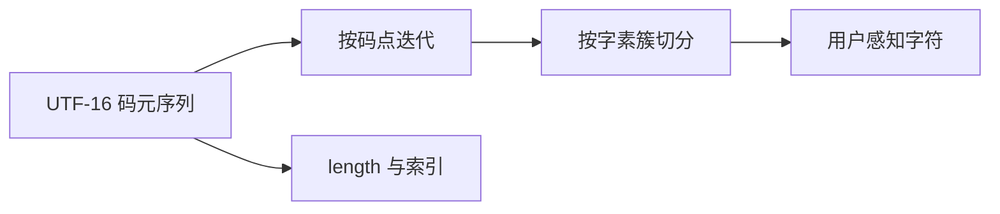

# 字符串、Unicode 与 Intl

!!! abstract "核心结论"

    - JavaScript 字符串是 **UTF-16 码元序列**：`length`、索引、`slice`、`padStart` 的计量单位都是码元，不是"字符"，也不是码点。
    - 三层粒度必须分清：码元（16 位无符号整数）→ 码点（Unicode 标量值，用 `for...of` / `Array.from` / `codePointAt`）→ 字素簇（用户感知的一个字符，用 `Intl.Segmenter` 按 UAX #29 切分）。
    - 比较、去重、索引用户输入前先 `normalize('NFC')`；`NFKC` 会做兼容性折叠（连字、上标、全角、圆圈数字），适合匹配与搜索，不适合存原文。
    - 默认排序与本地化排序是两套规则：`Array.prototype.sort()` 走码元序，本地化排序用 `Intl.Collator`（排序时复用实例，不要在比较函数里反复 `localeCompare` 或 `new`）。
    - 所有 `Intl` 输出都依赖 ICU/CLDR 版本与系统时区：单测不要断言精确的自然语言字符串，必须显式传 `locale` 与 `timeZone`。

## 1. 字符模型：码元、码点、字素簇

### 1.1 三个层次

Unicode 码点空间为 U+0000 到 U+10FFFF，其中 **U+D800..U+DFFF 是代理区**，不对应任何字符（不是 scalar value，`String.fromCodePoint(0xD800)` 会抛 `RangeError`）。

JavaScript 字符串按 UTF-16 编码，基本单位是 16 位**码元**（code unit）。BMP 之外的码点需要一对码元（代理对）表示：

```
high = 0xD800 + ((cp - 0x10000) >> 10)      // 0xD800..0xDBFF
low  = 0xDC00 + ((cp - 0x10000) & 0x3FF)    // 0xDC00..0xDFFF
cp   = 0x10000 + ((high - 0xD800) << 10) + (low - 0xDC00)
```

**字素簇**（grapheme cluster）是 UAX #29 定义的"用户感知字符"，可能由多个码点组成：基字符 + 组合记号、ZWJ 序列、区域指示符对（旗帜）、emoji 修饰符、韩文音节等。

### 1.2 手写：代理对编解码

```js
// 运行环境：任何符合 ES2015+ 的运行时（Node.js 6+ / 现代浏览器）
'use strict';

const HIGH_MIN = 0xd800, HIGH_MAX = 0xdbff;
const LOW_MIN = 0xdc00, LOW_MAX = 0xdfff;

/** 把一对 UTF-16 码元还原成码点；返回 null 表示不是合法代理对 */
function decodeSurrogatePair(high, low) {
  if (high < HIGH_MIN || high > HIGH_MAX) return null;
  if (low < LOW_MIN || low > LOW_MAX) return null;
  return 0x10000 + ((high - HIGH_MIN) << 10) + (low - LOW_MIN);
}

/** 把 BMP 之外的码点编码成 [high, low] */
function encodeSurrogatePair(cp) {
  if (cp < 0x10000 || cp > 0x10ffff) {
    throw new RangeError('只有 BMP 之外的码点才需要代理对');
  }
  const v = cp - 0x10000;
  return [HIGH_MIN + (v >> 10), LOW_MIN + (v & 0x3ff)];
}
```

验证标准：

```js
// 运行环境：Node.js 18+（node 该文件即可）
// 预期输出：1.2 OK
const assert = require('node:assert/strict');

assert.strictEqual(decodeSurrogatePair(0xd83d, 0xde00), 0x1f600);
assert.deepStrictEqual(encodeSurrogatePair(0x1f600), [0xd83d, 0xde00]);
assert.strictEqual(decodeSurrogatePair(0xd83d, 0x41), null);  // 低位不是代理项
assert.strictEqual(decodeSurrogatePair(0x41, 0xde00), null);  // 高位不是代理项
assert.throws(() => encodeSurrogatePair(0x4e2d), RangeError);

// 与运行时内置行为交叉验证
const s = String.fromCodePoint(0x1f600);
assert.strictEqual(s.length, 2);
assert.strictEqual(s.charCodeAt(0), 0xd83d);
assert.strictEqual(s.charCodeAt(1), 0xde00);
assert.strictEqual(s.codePointAt(0), 0x1f600);
assert.strictEqual(s.codePointAt(1), 0xde00); // 索引落在低位代理项上，返回的是码元值
console.log('1.2 OK');
```

### 1.3 遍历粒度

`for...of`、`Array.from(str)`、`[...str]` 都走 `String.prototype[Symbol.iterator]`，**按码点迭代**：遇到合法代理对时一次产出两个码元。

```js
// 运行环境：ES2015+
// 预期输出：1.3 OK
const assert = require('node:assert/strict');
const s = 'a\u{1F600}b';

assert.strictEqual(s.length, 4);              // 码元数
assert.strictEqual([...s].length, 3);         // 码点数
assert.strictEqual(s.split('').length, 4);    // split('') 按码元切，会拆散代理对
assert.deepStrictEqual([...s][1], '\u{1F600}');
assert.strictEqual([...s][1].length, 2);
console.log('1.3 OK');
```



### 1.4 引擎视角

V8 的字符串是不可变对象，内部有多个子类（实现细节随版本演进，需对照源码）：

| 子类 | 含义 | 工程影响 |
| --- | --- | --- |
| `SeqOneByteString` | Latin-1 码元（0x00..0xFF） | 每字符 1 字节，纯 ASCII 常见 |
| `SeqTwoByteString` | 一般 UTF-16 码元 | 每字符 2 字节 |
| `ConsString` | 拼接形成的 rope（left/right/length） | 拼接不立即拷贝；随机访问会触发扁平化 |
| `SlicedString` | `slice` / `substring` 产生的切片视图 | 持有父串引用，长生命周期的小切片会拖住大字符串 |
| `ThinString` | 指向已内化字符串的间接层 | 缩短内部对象链 |
| `InternalizedString` | 属性名等被内化的字符串 | 用于内联缓存查找 |

要点：`length` 是存储字段，O(1)。对 `ConsString` 做一次 `charCodeAt` 可能触发整串扁平化，所以"在循环里对大拼接结果做随机访问"是性能陷阱。另外，字面量字符串会被 internalize，用它做属性名通常能命中内联缓存；用运行时拼出的字符串做属性名则更可能落入哈希查找的慢路径。

（JSC / SpiderMonkey 有等价结构，如 rope 与 substring-sharing，具体命名需核对对应源码。）

### 1.5 粒度对比表

| 维度 | 码元 code unit | 码点 code point | 字素簇 grapheme cluster |
| --- | --- | --- | --- |
| 定义 | UTF-16 的 16 位单元 | Unicode 标量值 U+0000..U+10FFFF（不含代理区） | UAX #29 定义的"用户感知字符" |
| U+1F600 占 | 2 | 1 | 1 |
| `e` + U+0301 占 | 2 | 2 | 1 |
| 遍历方式 | `for (i = 0; i < s.length; i++)` | `for (const c of s)` / `Array.from(s)` | `new Intl.Segmenter(...).segment(s)` |
| 计数 | `s.length` | `[...s].length` | `[...seg.segment(s)].length` |
| 取第 n 个 | `s[n]` / `s.charAt(n)` | 索引 + `codePointAt` 再 `fromCodePoint` | 无索引，必须先切片 |
| 典型事故 | 拆散代理对 | 拆散字素簇 | 误以为一个 emoji 就是一个码点 |

## 2. 规范化 normalize

### 2.1 UAX #15 的四种形式

- **NFC**：规范分解 + 规范组合，通常最短，推荐用于存储与比较。
- **NFD**：只做规范分解（基字符 + 组合记号）。
- **NFKC / NFKD**：在分解阶段额外做兼容性分解（folding），会丢失格式信息，适合搜索匹配。
- 关键事实：**归一化不改变大小写，也不做 case folding**。

| 输入 | 码点 | NFC | NFD | NFKC | NFKD |
| --- | --- | --- | --- | --- | --- |
| é 预组合 | U+00E9 | U+00E9 | `e` U+0301 | U+00E9 | `e` U+0301 |
| `e` + U+0301 | U+0065 U+0301 | U+00E9 | `e` U+0301 | U+00E9 | `e` U+0301 |
| fi 连字 | U+FB01 | U+FB01 | U+FB01 | `fi` | `fi` |
| ① 圆圈数字 | U+2460 | U+2460 | U+2460 | `1` | `1` |
| ½ | U+00BD | U+00BD | U+00BD | `1` U+2044 `2` | `1` U+2044 `2` |
| Ａ 全角 | U+FF21 | U+FF21 | U+FF21 | `A` | `A` |

### 2.2 代码与验证

```js
// 运行环境：任何符合 ES2015+ 的运行时（String.prototype.normalize）
// 预期输出：2.2 OK
const assert = require('node:assert/strict');

const composed = '\u00e9';      // é 预组合
const decomposed = 'e\u0301';   // e + COMBINING ACUTE ACCENT

assert.notStrictEqual(composed, decomposed);            // 码元序列不同
assert.strictEqual(composed.length, 1);
assert.strictEqual(decomposed.length, 2);
assert.strictEqual(composed.normalize('NFC'), decomposed.normalize('NFC'));

assert.strictEqual('\uFB01'.normalize('NFKC'), 'fi');
assert.strictEqual('\u2460'.normalize('NFKC'), '1');
assert.strictEqual('\u00BD'.normalize('NFKC'), '1\u20442');
assert.strictEqual('\uFF21'.normalize('NFKC'), 'A');
assert.strictEqual('\uFF21'.normalize('NFC'), '\uFF21'); // NFC 不动兼容字符

// 归一化不做大小写折叠
assert.strictEqual('\u00DF'.normalize('NFKC'), '\u00DF'); // ß 保持原样
assert.strictEqual('\u00DF'.toUpperCase(), 'SS');         // 大小写映射会改变长度
console.log('2.2 OK');
```

### 2.3 归一化相等

```js
// 运行环境：ES2015+
function canonicallyEqual(a, b, form = 'NFC') {
  return a.normalize(form) === b.normalize(form);
}
```

验证标准：

```js
// 预期输出：2.3 OK
const assert = require('node:assert/strict');
assert.strictEqual(canonicallyEqual('\u00e9', 'e\u0301'), true);
assert.strictEqual(canonicallyEqual('\u00e9', 'E\u0301'), false);  // 不做大小写折叠
assert.strictEqual(canonicallyEqual('\u2460', '1', 'NFKC'), true); // 只在兼容形式下相等
assert.strictEqual(canonicallyEqual('\u2460', '1', 'NFC'), false);
console.log('2.3 OK');
```

配套工程建议：把 `normalize('NFC')` 放在**输入边界**（表单提交、粘贴、接口响应解析、文件名/URL 参数解析）统一做一次，而不是散落在各个比较点。

## 3. 字素簇切分与安全截断（手写实现 1）

### 3.1 UAX #29 的关键规则

扩展字素簇规则是作用在**码点序列**上的状态机（GB1..GB999），关键几条：

- GB9：任何字符 × Extend / ZWJ 不断开（组合记号粘在基字符上）。
- GB9a / GB9b：间距记号、Prepend 不在此处断开。
- GB11：`ExtPict Extend* ZWJ × ExtPict`（emoji ZWJ 序列不断开）。
- GB12 / GB13：`RI × RI` 成对（两个区域指示符组成一面旗帜）。
- GB999：其他位置断开。

因为规则作用在码点上，所以无法用码元正则可靠模拟，这正是 `Intl.Segmenter` 存在的意义。

### 3.2 实现

```js
// 运行环境：Node.js 16+ / 支持 Intl.Segmenter 的现代浏览器
// 注意：Intl.Segmenter 需要运行时提供完整 ICU 数据（small-icu 构建可能不可用），
//       请用实际环境验证；Firefox 的支持版本较晚，需核对目标版本。
'use strict';

const GRIN = '\u{1F600}';                                                 // U+1F600
const FAMILY = '\u{1F468}\u200D\u{1F469}\u200D\u{1F467}\u200D\u{1F466}';  // ZWJ 家族序列
const FLAG_CN = '\u{1F1E8}\u{1F1F3}';                                     // 区域指示符对
const E_ACUTE = 'e\u0301';                                                // 基字符 + 组合记号

const segmenterCache = new Map();

function getSegmenter(granularity, locale) {
  if (typeof Intl === 'undefined' || typeof Intl.Segmenter !== 'function') {
    return null; // 环境不支持，调用方走降级分支
  }
  const key = granularity + '|' + (locale || '');
  if (!segmenterCache.has(key)) {
    segmenterCache.set(key, new Intl.Segmenter(locale, { granularity }));
  }
  return segmenterCache.get(key);
}

/** 按字素簇切分，返回字符串数组 */
function graphemesOf(str, locale) {
  const seg = getSegmenter('grapheme', locale);
  if (seg) {
    const out = [];
    for (const part of seg.segment(str)) out.push(part.segment);
    return out;
  }
  // 降级：按码点切分。对组合记号、ZWJ 序列、旗帜都不正确
  return Array.from(str);
}

/** 按字素簇安全截断：最多保留 maxGraphemes 个字素簇，超限时在尾部追加 suffix */
function truncateGraphemes(str, maxGraphemes, suffix = '') {
  if (!Number.isInteger(maxGraphemes) || maxGraphemes < 0) {
    throw new RangeError('maxGraphemes 必须是非负整数');
  }
  const parts = graphemesOf(str);
  if (parts.length <= maxGraphemes) return str; // 未超限：不加后缀
  return parts.slice(0, maxGraphemes).join('') + suffix;
}

/** 流式版本：不物化整个数组，只保留前 maxGraphemes 个字素簇 */
function truncateGraphemesStreaming(str, maxGraphemes, suffix = '') {
  const seg = getSegmenter('grapheme');
  if (!seg) return truncateGraphemes(str, maxGraphemes, suffix);
  let count = 0;
  let end = 0;
  for (const part of seg.segment(str)) {
    if (count === maxGraphemes) {
      // part.index 与 segment.length 均以码元为单位
      return str.slice(0, end) + suffix;
    }
    end = part.index + part.segment.length;
    count += 1;
  }
  return str;
}
```

### 3.3 验证标准

```js
// 运行环境：Node.js 16+（含完整 ICU）
// 预期输出：3.3 OK
const assert = require('node:assert/strict');

// 基础事实
assert.strictEqual(GRIN.length, 2);
assert.strictEqual([...GRIN].length, 1);
assert.strictEqual(FAMILY.length, 11);
assert.strictEqual([...FAMILY].length, 7);
assert.strictEqual(FLAG_CN.length, 4);
assert.strictEqual([...FLAG_CN].length, 2);

// 一个字素簇
assert.strictEqual(graphemesOf(GRIN).length, 1);
assert.strictEqual(graphemesOf(FAMILY).length, 1);
assert.strictEqual(graphemesOf(E_ACUTE).length, 1);
assert.strictEqual(graphemesOf(FLAG_CN).length, 1); // 依赖 GB12 / GB13

// 截断
assert.strictEqual(truncateGraphemes(FAMILY + 'abc', 1, '\u2026'), FAMILY + '\u2026');
assert.strictEqual(truncateGraphemes('abc', 5), 'abc');
assert.strictEqual(truncateGraphemes(E_ACUTE + E_ACUTE, 1), E_ACUTE);
assert.strictEqual(truncateGraphemes(GRIN, 0, ''), '');
assert.strictEqual(truncateGraphemes('abc', 1, '\u2026'), 'a\u2026');

// 流式版本与数组版本行为一致
assert.strictEqual(truncateGraphemesStreaming(FAMILY + 'abc', 1, '\u2026'), FAMILY + '\u2026');
assert.strictEqual(truncateGraphemesStreaming('abc', 5), 'abc');
assert.strictEqual(truncateGraphemesStreaming('abc', 2, ''), 'ab');

// 对比：按码元截断会撕裂代理对
const naive = GRIN.slice(0, 1);
assert.strictEqual(naive.length, 1);
assert.strictEqual(naive.charCodeAt(0), 0xd83d); // 孤立高位代理项
console.log('3.3 OK');
```

### 3.4 word / sentence 粒度

```js
// 运行环境：Node.js 16+
// 预期输出：3.4 OK
const assert = require('node:assert/strict');

const wordSeg = new Intl.Segmenter('en', { granularity: 'word' });
const words = [...wordSeg.segment('Hello, world!')]
  .filter((p) => p.isWordLike)
  .map((p) => p.segment);
assert.deepStrictEqual(words, ['Hello', 'world']);

const sentenceSeg = new Intl.Segmenter('en', { granularity: 'sentence' });
const sentences = [...sentenceSeg.segment('One. Two!')].map((p) => p.segment);
assert.strictEqual(sentences.join(''), 'One. Two!'); // 切分是无损的
assert.ok(sentences.length >= 2);
assert.deepStrictEqual(sentences.map((s) => s.trim()).filter(Boolean), ['One.', 'Two!']);

// 中文分词由 ICU 的 dictionary-based break iterator 完成，
// 结果依赖 ICU 版本与词典，不保证与语言学分词一致，不要写进断言。
console.log('3.4 OK');
```

## 4. UTF-8 编解码（手写实现 2）

### 4.1 编码规则表

| 码点范围 | 字节数 | 首字节 | 后续字节 | 说明 |
| --- | --- | --- | --- | --- |
| U+0000..U+007F | 1 | `0xxxxxxx` | 无 | ASCII 兼容区 |
| U+0080..U+07FF | 2 | `110xxxxx` | `10xxxxxx` | 首字节最小 0xC2（0xC0/0xC1 必然过长） |
| U+0800..U+FFFF | 3 | `1110xxxx` | `10xxxxxx` ×2 | 不含代理区 U+D800..U+DFFF |
| U+10000..U+10FFFF | 4 | `11110xxx` | `10xxxxxx` ×3 | 首字节 0xF0..0xF4 |

### 4.2 编码器

```js
// 运行环境：任何 ES2015+ 运行时
'use strict';

function encodeUTF8(str) {
  const bytes = [];
  for (const ch of str) {        // 按码点迭代，自动合并合法代理对
    let cp = ch.codePointAt(0);
    if (cp >= 0xd800 && cp <= 0xdfff) {
      cp = 0xfffd;               // 孤立代理项：与 TextEncoder 行为一致，替换为 U+FFFD
    }
    if (cp <= 0x7f) {
      bytes.push(cp);
    } else if (cp <= 0x7ff) {
      bytes.push(0xc0 | (cp >> 6), 0x80 | (cp & 0x3f));
    } else if (cp <= 0xffff) {
      bytes.push(0xe0 | (cp >> 12), 0x80 | ((cp >> 6) & 0x3f), 0x80 | (cp & 0x3f));
    } else {
      bytes.push(
        0xf0 | (cp >> 18),
        0x80 | ((cp >> 12) & 0x3f),
        0x80 | ((cp >> 6) & 0x3f),
        0x80 | (cp & 0x3f)
      );
    }
  }
  return new Uint8Array(bytes);
}
```

### 4.3 解码器（maximal subpart 规则）

```js
// 运行环境：任何 ES2015+ 运行时
// 非法序列处理规则（Unicode 建议的 maximal subpart）：
//   1) 首字节非法：输出 1 个 U+FFFD，消费 1 字节
//   2) 遇到非续字节：输出 1 个 U+FFFD，只消费首字节，后续字节重新解析
//   3) 序列被截断（EOF）：输出 1 个 U+FFFD，消费已读入的字节
//   4) 过长编码 / 代理项 / 越界：由首字节确定的下界与上界在第一个续字节处拦下
// 说明：不同运行时对非法序列输出的替换字符个数可能不同，若需与目标运行时的
//       TextDecoder 完全一致，请用实际输出做回归基线。
function firstByteInfo(b0) {
  if (b0 <= 0x7f) return { need: 0, cp: b0, lo: 0, hi: 0 };
  if (b0 >= 0xc2 && b0 <= 0xdf) return { need: 1, cp: b0 & 0x1f, lo: 0x80, hi: 0xbf };
  if (b0 === 0xe0) return { need: 2, cp: b0 & 0x0f, lo: 0xa0, hi: 0xbf }; // 防过长
  if (b0 >= 0xe1 && b0 <= 0xec) return { need: 2, cp: b0 & 0x0f, lo: 0x80, hi: 0xbf };
  if (b0 === 0xed) return { need: 2, cp: b0 & 0x0f, lo: 0x80, hi: 0x9f }; // 排除代理项
  if (b0 >= 0xee && b0 <= 0xef) return { need: 2, cp: b0 & 0x0f, lo: 0x80, hi: 0xbf };
  if (b0 === 0xf0) return { need: 3, cp: b0 & 0x07, lo: 0x90, hi: 0xbf }; // 防过长
  if (b0 >= 0xf1 && b0 <= 0xf3) return { need: 3, cp: b0 & 0x07, lo: 0x80, hi: 0xbf };
  if (b0 === 0xf4) return { need: 3, cp: b0 & 0x07, lo: 0x80, hi: 0x8f }; // 防越界
  return null;
}

function decodeUTF8(bytes) {
  let out = '';
  let i = 0;
  while (i < bytes.length) {
    const info = firstByteInfo(bytes[i]);
    if (info === null) { out += '\uFFFD'; i += 1; continue; }
    if (info.need === 0) { out += String.fromCharCode(info.cp); i += 1; continue; }

    let cp = info.cp;
    let consumed = 1;      // 已消费的字节数
    let truncated = false; // 是否因 EOF 中断
    let valid = true;

    for (let k = 0; k < info.need; k++) {
      const b = bytes[i + 1 + k];
      const lo = k === 0 ? info.lo : 0x80;
      const hi = k === 0 ? info.hi : 0xbf;
      if (b === undefined) { truncated = true; valid = false; break; }
      if (b < lo || b > hi) { valid = false; break; }
      cp = (cp << 6) | (b & 0x3f);
      consumed += 1;
    }

    if (!valid) {
      out += '\uFFFD';
      i += truncated ? consumed : 1;
      continue;
    }
    out += String.fromCodePoint(cp);
    i += consumed;
  }
  return out;
}
```

### 4.4 验证标准

```js
// 运行环境：Node.js 12+（使用了 node:assert/strict 与 TextEncoder）
// 预期输出：4.4 OK
const assert = require('node:assert/strict');

const samples = ['', 'A', '\u00e9', 'e\u0301', '\u4e2d', '\u{1F600}', 'a\u{1F600}\u4e2d'];

// 与内置 TextEncoder 交叉验证（合法字符串应逐字节一致）
if (typeof TextEncoder === 'function') {
  const enc = new TextEncoder();
  for (const s of samples) {
    assert.deepStrictEqual(
      Array.from(encodeUTF8(s)),
      Array.from(enc.encode(s)),
      '编码不一致: ' + JSON.stringify(s)
    );
  }
}

// 具体字节
assert.deepStrictEqual(Array.from(encodeUTF8('A')), [0x41]);
assert.deepStrictEqual(Array.from(encodeUTF8('\u4e2d')), [0xe4, 0xb8, 0xad]);
assert.deepStrictEqual(Array.from(encodeUTF8('\u{1F600}')), [0xf0, 0x9f, 0x98, 0x80]);
assert.deepStrictEqual(Array.from(encodeUTF8('e\u0301')), [0x65, 0xcc, 0x81]);
assert.deepStrictEqual(Array.from(encodeUTF8('\uD83D')), [0xef, 0xbf, 0xbd]); // 孤立代理项

// 解码往返
for (const s of samples) {
  assert.strictEqual(decodeUTF8(encodeUTF8(s)), s, '往返失败: ' + JSON.stringify(s));
}

// 非法输入
assert.strictEqual(decodeUTF8(new Uint8Array([0x80])), '\uFFFD');                     // 非法首字节
assert.strictEqual(decodeUTF8(new Uint8Array([0xc0, 0xaf])), '\uFFFD\uFFFD');         // 过长编码
assert.strictEqual(decodeUTF8(new Uint8Array([0xe4, 0xb8])), '\uFFFD');               // 截断
assert.strictEqual(decodeUTF8(new Uint8Array([0xe4, 0x41])), '\uFFFDA');              // 非续字节
assert.strictEqual(decodeUTF8(new Uint8Array([0xe0, 0x80, 0x80])), '\uFFFD\uFFFD\uFFFD');
assert.strictEqual(decodeUTF8(new Uint8Array([0xed, 0xa0, 0x80])), '\uFFFD\uFFFD\uFFFD');
console.log('4.4 OK');
```

**不要**用 `String.fromCharCode(byte)` 逐字节拼装来"表示" UTF-8 字节：那得到的是把每个字节当成码点的 Latin-1 字符串，长度、`length`、后续再 `TextEncoder` 编码全部会错。字节序列请一律用 `Uint8Array`。

## 5. String 现代 API 逐个拆解

### 5.1 API 速查表

| API | 计量单位 | 规范阶段 | 关键注意 |
| --- | --- | --- | --- |
| `s.length` | 码元 | ES1 | 不是字符数 |
| `s.charAt(i)` / `s[i]` | 码元 | ES3 / ES5 | 可能返回孤立代理项 |
| `s.at(i)` | 码元 | ES2022 | 支持负数索引，**不是**码点感知 |
| `s.codePointAt(i)` | 从 i 起的码点 | ES2015 | 落在低位代理项上时返回码元值 |
| `String.fromCodePoint(cp)` | 码点 | ES2015 | 越界抛 `RangeError` |
| `[...s]` / `for...of` | 码点 | ES2015 | 迭代协议 |
| `s.normalize(form)` | 码点 | ES2015 | 返回新串，不改原串 |
| `s.replaceAll(p, r)` | — | ES2021 | 正则必须带 `g`，否则 `TypeError` |
| `s.padStart/padEnd` | 码元 | ES2017 | 按码元填充，可能撕裂代理对 |
| `s.isWellFormed()` | 码元 | 较新规范（需核对运行时） | 判断是否存在孤立代理项 |
| `s.toWellFormed()` | 码元 | 较新规范（需核对运行时） | 孤立代理项替换为 U+FFFD |
| `s.localeCompare(...)` | — | ES1（Intl 增强） | 每次调用有内部定位开销，排序时用 `Intl.Collator` |

### 5.2 at / codePointAt / fromCodePoint

```js
// 运行环境：Node.js 16+（String.prototype.at 属于 ES2022）
// 预期输出：5.2 OK
const assert = require('node:assert/strict');
const s = '\u{1F600}'; // 2 个码元、1 个码点

assert.strictEqual(s.at(0), '\uD83D');  // 拿到高位代理项
assert.strictEqual(s.at(-1), '\uDE00'); // 拿到低位代理项
assert.strictEqual(s.at(0).length, 1);
assert.strictEqual(s.codePointAt(0), 0x1f600);
assert.strictEqual(s.codePointAt(1), 0xde00); // 低位代理项上的码元值
assert.strictEqual(String.fromCodePoint(0x1f600), s);
assert.strictEqual(Array.from(s).length, 1);
console.log('5.2 OK');
```

`at` 只解决了负数索引，**没有**解决码点问题，这是最常见的误解。

### 5.3 replaceAll

```js
// 运行环境：Node.js 15+
// 预期输出：5.3 OK
const assert = require('node:assert/strict');

assert.strictEqual('a.b.c'.replaceAll('.', '-'), 'a-b-c');
assert.strictEqual('abc'.replaceAll('b', '[$&]'), 'a[b]c'); // 字符串替换仍支持 $& 等替换模式
assert.strictEqual('a'.replaceAll('', '-'), '-a-');
assert.strictEqual(''.replaceAll('', '-'), '-');
assert.strictEqual('aaa'.replaceAll('aa', 'b'), 'ba'); // 从左到右非重叠匹配

// 正则不带 g 会抛 TypeError
assert.throws(() => 'abc'.replaceAll(/b/, 'x'), TypeError);
// 对比：replace 用非全局正则只替换第一个
assert.strictEqual('abc'.replace(/b/, 'x'), 'axc');
assert.strictEqual('a.b.c'.replace(/\./g, '-'), 'a-b-c');
console.log('5.3 OK');
```

### 5.4 padStart / padEnd

```js
// 运行环境：Node.js 8+
// 预期输出：5.4 OK
const assert = require('node:assert/strict');

assert.strictEqual('5'.padStart(3, '0'), '005');
assert.strictEqual('abc'.padStart(2), 'abc');        // 已够长，原样返回
assert.strictEqual('abc'.padStart(6, 'ab'), 'abaabc'); // 填充串会被循环截断
assert.strictEqual('abc'.padEnd(5, '-'), 'abc--');
assert.strictEqual('5'.padStart(3), '  5');          // 默认填充空格

// 陷阱：按码元填充会撕裂代理对
const padded = 'x'.padStart(2, '\u{1F600}');
assert.strictEqual(padded.length, 2);
assert.strictEqual(padded.charCodeAt(0), 0xd83d); // 只剩下高位代理项
console.log('5.4 OK');
```

### 5.5 isWellFormed / toWellFormed

```js
// 运行环境：若运行时支持 isWellFormed/toWellFormed 则直接用，否则走兼容实现
'use strict';

// 无 /u 标志时正则按码元匹配：孤立的代理项无法被配对分支吞掉
const WELL_FORMED_RE = /^(?:[^\uD800-\uDFFF]|[\uD800-\uDBFF][\uDC00-\uDFFF])*$/;

function isWellFormedCompat(str) {
  if (typeof str.isWellFormed === 'function') return str.isWellFormed();
  return WELL_FORMED_RE.test(str);
}

function toWellFormedCompat(str) {
  if (typeof str.toWellFormed === 'function') return str.toWellFormed();
  let out = '';
  for (let i = 0; i < str.length; i++) {
    const c = str.charCodeAt(i);
    if (c >= 0xd800 && c <= 0xdbff) {
      const d = i + 1 < str.length ? str.charCodeAt(i + 1) : 0;
      if (d >= 0xdc00 && d <= 0xdfff) { // 合法代理对原样保留
        out += str[i] + str[i + 1];
        i += 1;
        continue;
      }
      out += '\uFFFD';
      continue;
    }
    if (c >= 0xdc00 && c <= 0xdfff) { out += '\uFFFD'; continue; }
    out += str[i];
  }
  return out;
}
```

验证标准：

```js
// 运行环境：Node.js 18+（上节兼容实现与内置实现行为一致）
// 预期输出：5.5 OK
const assert = require('node:assert/strict');

assert.strictEqual(isWellFormedCompat('abc'), true);
assert.strictEqual(isWellFormedCompat('\uD83D\uDE00'), true);
assert.strictEqual(isWellFormedCompat('\uD83D'), false);
assert.strictEqual(isWellFormedCompat('\uDE00'), false);
assert.strictEqual(isWellFormedCompat('a\uD83Db'), false);

assert.strictEqual(toWellFormedCompat('\uD83D\uDE00'), '\uD83D\uDE00');
assert.strictEqual(toWellFormedCompat('a\uD83Db'), 'a\uFFFDb');
assert.strictEqual(toWellFormedCompat('\uDE00'), '\uFFFD');
assert.strictEqual(isWellFormedCompat(toWellFormedCompat('a\uD83Db')), true);

// 孤立代理项的常见来源与后果
assert.throws(() => encodeURIComponent('\uD83D'), URIError);       // URI 编码直接抛错
assert.strictEqual(JSON.stringify('\uD83D'), '"\\ud83d"');         // ES2019 起转义为合法 JSON
assert.strictEqual(JSON.parse('"\\ud83d"').length, 1);             // 解析回来仍是孤立代理项
assert.strictEqual(isWellFormedCompat('\u{1F600}'.slice(0, 1)), false);
assert.strictEqual(isWellFormedCompat('x'.padStart(2, '\u{1F600}')), false);
console.log('5.5 OK');
```

孤立代理项的来源：按码元做 `slice` / `padStart` / `split('')`、按错误编码（如 Latin-1）解码 UTF-8 字节流、`String.fromCharCode(0xD800)`、`JSON.parse` 解析到 `\ud800`、网络或文件传输被截断。

### 5.6 localeCompare

```js
// 运行环境：Node.js 14+ with full-icu
// 预期输出：5.6 OK
const assert = require('node:assert/strict');

assert.ok('a'.localeCompare('b') < 0);
assert.strictEqual('a'.localeCompare('A', 'en', { sensitivity: 'base' }), 0);
assert.notStrictEqual('a'.localeCompare('A', 'en'), 0); // 默认区分大小写
assert.ok('10'.localeCompare('9', 'en', { numeric: true }) > 0);
assert.ok('10'.localeCompare('9', 'en') < 0);           // 不加 numeric 时是字符序

// 返回值只保证符号，不要拿具体数值（-1/1）当契约
const r = 'b'.localeCompare('a', 'en');
assert.ok(typeof r === 'number' && r > 0);
console.log('5.6 OK');
```

## 6. Intl 家族与手写 i18n 格式化器（手写实现 3）

### 6.1 构造器一览

| 构造器 | 作用 | 备注 |
| --- | --- | --- |
| `Intl.Collator` | 本地化比较与排序 | 排序场景务必复用实例 |
| `Intl.NumberFormat` | 数字 / 货币 / 百分比 / 单位 / 紧凑记法 | 只格式化，不解析 |
| `Intl.DateTimeFormat` | 日期时间格式化 | 必须显式 `timeZone` |
| `Intl.PluralRules` | 复数类别（cardinal / ordinal） | 只返回类别，不做文案选择 |
| `Intl.RelativeTimeFormat` | "3 天前" | `numeric: 'auto'` 才可能出现 yesterday |
| `Intl.ListFormat` | 列表连接词 | 中文使用顿号与"和" |
| `Intl.Segmenter` | 字素 / 词 / 句切分 | 需要 full-icu |
| `Intl.DisplayNames` | 语言 / 地区 / 货币名称 | 依赖 ICU 数据 |
| `Intl.DurationFormat` | 时长格式化 | 支持情况与版本需核对官方文档 |

下文只断言本机 Node.js LTS + full-icu 下稳定的行为；其余场景请以目标运行时为准。

### 6.2 NumberFormat

```js
// 运行环境：Node.js 14+，预期输出：6.2 OK
const assert = require('node:assert/strict');

assert.strictEqual(new Intl.NumberFormat('de-DE').format(1234.5), '1.234,5');
assert.strictEqual(
  new Intl.NumberFormat('en-US', { style: 'currency', currency: 'USD' }).format(1234.5),
  '$1,234.50'
);
assert.strictEqual(
  new Intl.NumberFormat('en-US', { style: 'percent', maximumFractionDigits: 0 }).format(0.256),
  '26%'
);
assert.strictEqual(new Intl.NumberFormat('en-US', { notation: 'compact' }).format(12345), '12K');
assert.strictEqual(
  new Intl.NumberFormat('en-US', { style: 'unit', unit: 'kilometer', unitDisplay: 'short' }).format(5),
  '5 km'
);
assert.strictEqual(new Intl.NumberFormat('ja-JP').format(1234567), '1,234,567');

// 分组符号随 CLDR 版本变化（fr-FR 历史上用过 NBSP，后来改为 NNBSP），断言前要归一化
const fr = new Intl.NumberFormat('fr-FR').format(1234.5);
assert.strictEqual(fr.replace(/[\u202f\u00a0]/g, ' '), '1 234,5');
assert.strictEqual(parseFloat('1.234,5'), 1.234); // Intl 不负责解析
console.log('6.2 OK');
```

### 6.3 DateTimeFormat

```js
// 运行环境：Node.js 14+，预期输出：6.3 OK
const assert = require('node:assert/strict');

const d = new Date(Date.UTC(2024, 0, 2, 15, 30, 0));
const fmt = new Intl.DateTimeFormat('en-US', {
  timeZone: 'UTC', year: 'numeric', month: '2-digit', day: '2-digit',
});
assert.strictEqual(fmt.format(d), '01/02/2024');

const parts = fmt.formatToParts(d);
assert.deepStrictEqual(
  parts.map((p) => p.type),
  ['month', 'literal', 'day', 'literal', 'year']
);

// 时区决定"哪一天"：同一时刻在不同时区可能属于不同日期
function dayIn(date, timeZone) {
  const p = new Intl.DateTimeFormat('en-US', { timeZone, day: '2-digit' }).formatToParts(date);
  return p.find((x) => x.type === 'day').value;
}
const nearMidnight = new Date(Date.UTC(2024, 0, 1, 23, 30));
assert.strictEqual(dayIn(nearMidnight, 'UTC'), '01');
assert.strictEqual(dayIn(nearMidnight, 'Asia/Tokyo'), '02');
console.log('6.3 OK');
```

### 6.4 PluralRules / RelativeTimeFormat / ListFormat / Collator

```js
// 运行环境：Node.js 14+，预期输出：6.4 OK
const assert = require('node:assert/strict');

// PluralRules：只断言 CLDR 类别，不断言译文
assert.deepStrictEqual(
  [1, 2, 5, 21, 1.5].map((n) => new Intl.PluralRules('ru').select(n)),
  ['one', 'few', 'many', 'one', 'other']
);
assert.deepStrictEqual(
  ['zh', 'ja', 'ko'].map((l) => new Intl.PluralRules(l).select(1)),
  ['other', 'other', 'other']
);
assert.strictEqual(new Intl.PluralRules('en', { type: 'ordinal' }).select(22), 'two');
assert.strictEqual(new Intl.PluralRules('en', { type: 'ordinal' }).select(11), 'other');

// RelativeTimeFormat
assert.strictEqual(new Intl.RelativeTimeFormat('en', { numeric: 'auto' }).format(-1, 'day'), 'yesterday');
assert.strictEqual(new Intl.RelativeTimeFormat('en', { numeric: 'auto' }).format(3, 'day'), 'in 3 days');
assert.strictEqual(new Intl.RelativeTimeFormat('en', { numeric: 'always' }).format(-1, 'day'), '1 day ago');

// ListFormat
const lf = new Intl.ListFormat('en', { style: 'long', type: 'conjunction' });
assert.strictEqual(lf.format(['Alice', 'Bob', 'Carol']), 'Alice, Bob, and Carol');
assert.deepStrictEqual(
  lf.formatToParts(['Alice', 'Bob', 'Carol']).filter((p) => p.type === 'element').map((p) => p.value),
  ['Alice', 'Bob', 'Carol']
);

// Collator：sensitivity 语义
const en = (sensitivity) => new Intl.Collator('en', { sensitivity });
assert.strictEqual(en('base').compare('a', 'A'), 0);
assert.strictEqual(en('base').compare('a', '\u00e1'), 0);   // á
assert.strictEqual(en('accent').compare('a', 'A'), 0);
assert.notStrictEqual(en('accent').compare('a', '\u00e1'), 0);
assert.notStrictEqual(en('case').compare('a', 'A'), 0);
assert.strictEqual(en('case').compare('a', '\u00e1'), 0);

// 语言相关：ä 在德语中靠近 a，在瑞典语中排在 z 之后
assert.ok(new Intl.Collator('de').compare('\u00e4', 'z') < 0);
assert.ok(new Intl.Collator('sv').compare('\u00e4', 'z') > 0);

// 数字感知
assert.deepStrictEqual(['item10', 'item2'].sort(), ['item10', 'item2']);
assert.deepStrictEqual(
  ['item10', 'item2'].sort(new Intl.Collator('en', { numeric: true }).compare),
  ['item2', 'item10']
);

// 中文：ICU 对 zh 的默认 collation 为拼音序（务必在目标 ICU 版本上回归）
const zh = new Intl.Collator('zh-Hans-CN');
assert.deepStrictEqual(['\u5f20', '\u674e', '\u738b'].sort(zh.compare), ['\u674e', '\u738b', '\u5f20']);
console.log('6.4 OK');
```

### 6.5 手写简易 i18n 格式化器

支持 `{name}` 插值与 `{count, plural, one {...} other {...}}`，分支内 `#` 表示当前数字。

```js
// 运行环境：Node.js 14+（依赖 Intl.PluralRules 与 Intl.NumberFormat）
// 与下面的验证代码放在同一个文件里运行
'use strict';

/** 把模板解析成节点树：text / arg / number / plural */
function parseMessage(source) {
  let pos = 0;

  function skipSpaces() {
    while (pos < source.length && /\s/.test(source[pos])) pos += 1;
  }

  function parseNodes(inPlural) {
    const nodes = [];
    let buffer = '';
    const flush = () => {
      if (buffer.length > 0) {
        nodes.push({ type: 'text', value: buffer });
        buffer = '';
      }
    };
    while (pos < source.length) {
      const ch = source[pos];
      if (ch === '}') break;            // 交给上层消费
      if (ch === '{') {
        flush();
        nodes.push(parsePlaceholder());
        continue;
      }
      if (ch === '#' && inPlural) {
        flush();
        nodes.push({ type: 'number' });
        pos += 1;
        continue;
      }
      buffer += ch;
      pos += 1;
    }
    flush();
    return nodes;
  }

  function parsePlaceholder() {
    pos += 1;                            // 跳过 '{'
    skipSpaces();
    let name = '';
    while (pos < source.length && /[A-Za-z0-9_$.-]/.test(source[pos])) {
      name += source[pos];
      pos += 1;
    }
    if (name.length === 0) throw new SyntaxError('占位符缺少参数名');
    skipSpaces();

    if (source[pos] === '}') {           // {name}
      pos += 1;
      return { type: 'arg', name };
    }
    if (source[pos] !== ',') throw new SyntaxError('占位符语法错误');
    pos += 1;
    skipSpaces();

    let fn = '';
    while (pos < source.length && /[a-z]/.test(source[pos])) {
      fn += source[pos];
      pos += 1;
    }
    skipSpaces();
    if (source[pos] !== ',') throw new SyntaxError('占位符缺少分支');
    pos += 1;
    if (fn !== 'plural') throw new SyntaxError('不支持的格式化函数: ' + fn);

    const branches = Object.create(null);
    for (;;) {
      skipSpaces();
      if (pos >= source.length) throw new SyntaxError('plural 未闭合');
      if (source[pos] === '}') { pos += 1; break; }   // plural 结束
      let selector = '';
      while (pos < source.length && source[pos] !== '{') {
        selector += source[pos];
        pos += 1;
      }
      selector = selector.trim();
      if (selector.length === 0) throw new SyntaxError('plural 分支缺少选择器');
      if (source[pos] !== '{') throw new SyntaxError('plural 分支缺少 {');
      pos += 1;
      branches[selector] = parseNodes(true);
      if (source[pos] !== '}') throw new SyntaxError('plural 分支缺少 }');
      pos += 1;
    }
    if (!('other' in branches)) throw new SyntaxError('plural 必须包含 other 分支');
    return { type: 'plural', name, branches };
  }

  const nodes = parseNodes(false);
  if (pos !== source.length) throw new SyntaxError('存在未匹配的 }');
  return nodes;
}

const intlCache = new Map();
function getIntl(Ctor, locale, options) {
  const key = Ctor.name + '\u0000' + locale + '\u0000' + JSON.stringify(options || {});
  let inst = intlCache.get(key);
  if (!inst) {
    inst = new Ctor(locale, options);
    intlCache.set(key, inst);
  }
  return inst;
}

function renderNodes(nodes, params, ctx) {
  let out = '';
  for (const node of nodes) {
    switch (node.type) {
      case 'text':
        out += node.value;
        break;
      case 'arg': {
        const v = params[node.name];
        out += v === undefined || v === null ? '' : String(v);
        break;
      }
      case 'number':
        out += ctx.count === null ? '' : ctx.numberFormat.format(ctx.count);
        break;
      case 'plural': {
        const count = Number(params[node.name]);
        if (!Number.isFinite(count)) {
          throw new TypeError('plural 参数必须是有限数字: ' + node.name);
        }
        const category = ctx.pluralRules.select(count);
        const branch = node.branches[category] || node.branches.other;
        out += renderNodes(branch, params, { ...ctx, count });
        break;
      }
      default:
        throw new Error('未知节点类型: ' + node.type);
    }
  }
  return out;
}

function formatMessage(source, params = {}, locale = 'en') {
  const nodes = typeof source === 'string' ? parseMessage(source) : source;
  return renderNodes(nodes, params, {
    locale,
    pluralRules: getIntl(Intl.PluralRules, locale),
    numberFormat: getIntl(Intl.NumberFormat, locale),
    count: null,
  });
}
```

已知简化（生产环境请用成熟的 ICU MessageFormat 实现）：不支持 `select`、`selectordinal`、嵌套 plural 的 `#` 作用域、`::` 骨架语法；`other` 分支是必填。

### 6.6 验证标准

```js
// 运行环境：Node.js 14+
// 预期输出：6.6 OK
const assert = require('node:assert/strict');

const EN_ITEMS = '{count, plural, one {# item} other {# items}} in {place}';
const ZH_ITEMS = '{count, plural, other {{count} 件商品}}';

assert.strictEqual(formatMessage(EN_ITEMS, { count: 1, place: 'cart' }, 'en'), '1 item in cart');
assert.strictEqual(formatMessage(EN_ITEMS, { count: 3, place: 'cart' }, 'en'), '3 items in cart');
assert.strictEqual(formatMessage(ZH_ITEMS, { count: 3 }, 'zh'), '3 件商品');
assert.strictEqual(
  formatMessage('{count, plural, one {# item} other {# items}}', { count: 1234 }, 'en'),
  '1,234 items'
);
assert.strictEqual(formatMessage('{a} + {b}', { a: 'x', b: 1 }, 'en'), 'x + 1');
assert.strictEqual(formatMessage('{missing}', {}, 'en'), '');

// 解析器错误
assert.throws(() => parseMessage('{n, plural, one {x}}'), SyntaxError);   // 缺 other
assert.throws(() => parseMessage('{n, plural, other {x}'), SyntaxError);  // 未闭合
assert.throws(() => parseMessage('a}'), SyntaxError);                     // 多余右括号
assert.throws(() => formatMessage('{n, plural, other {#}}', { n: 'abc' }, 'en'), TypeError);

// 解析结果结构
assert.deepStrictEqual(parseMessage('hi {name}'), [
  { type: 'text', value: 'hi ' },
  { type: 'arg', name: 'name' },
]);
console.log('6.6 OK');
```

## 7. 常见陷阱

1. **`length` 不是字符数**。`'\u{1F600}'.length === 2`，`'e\u0301'.length === 2`，`'\u{1F468}\u200D\u{1F469}...'.length === 11`。要"字符数"就先决定粒度：码点用 `[...s].length`，用户感知字符用 `Intl.Segmenter`。
2. **`at()` 不是码点感知**。`'\u{1F600}'.at(0)` 是一个孤立高位代理项。`at` 相对 `[]` 的唯一增强是负数索引。
3. **按码元切片会撕裂结构**。`slice`、`substring`、`split('')`、`padStart`、`substr` 全部按码元工作。截断展示文本请走字素簇。
4. **孤立代理项是真实存在的**。后果：`encodeURIComponent` 抛 `URIError`；`TextEncoder` 静默替换为 U+FFFD；写入文件时产生替换字符；`JSON.stringify` 从 ES2019 起转义为 `"\udXXX"` 以保证输出是合法 JSON。跨边界传输前用 `toWellFormed()` 收敛。
5. **忘了 normalize 就做比较与去重**。同一个"é"来自不同输入法/不同系统，可能是 U+00E9 也可能是 `e` + U+0301，直接 `===`、`Set`、对象键、缓存 key 全部失配。
6. **NFKC 用错位置**。`'①'.normalize('NFKC') === '1'`、`'fi'.normalize('NFKC') === 'fi'`、`'Ａ'.normalize('NFKC') === 'A'`。NFKC 会改变语义，用作存储主键会造成不可逆的信息丢失；它适合搜索与匹配。
7. **把 `localeCompare` 当成排序的默认答案**。默认 `sensitivity` 是 variant，区分大小写与重音，跟用户直觉不符；返回值只保证符号，不要比较 `=== -1`。
8. **排序时反复构造 collator**。`arr.sort((a, b) => a.localeCompare(b))` 在每次比较都做一次地区与选项定位；`arr.sort(new Intl.Collator(locale, opts).compare)` 只在排序前构造一次（`collator.compare` 是绑定函数，可直接传）。
9. **`Array.prototype.sort` 默认是码元序**。`['Z', 'a'].sort()` 得到 `['Z', 'a']`；中文默认排序接近码点序而不是拼音序。ES2019 起 `sort` 必须稳定，但稳定性不改变"默认按码元比较"这一点。
10. **Intl 输出随 ICU/CLDR 版本变化**。分组分隔符可能是 U+00A0 或 U+202F，货币符号位置、日期顺序、列表连接词都可能变化。单测要么归一化空白，要么断言 `formatToParts` 的结构而不是最终字符串。Node 的 small-icu 构建还会缺失部分 locale 数据（需核对构建参数）。
11. **时区**。`new Date('2024-01-02')` 按 UTC 解析，`new Date(2024, 0, 2)` 按本地时区解析；`Intl.DateTimeFormat` 不传 `timeZone` 时使用系统时区，CI 与开发机不一致就会出现"同一份快照今天过、明天挂"。
12. **`toLocaleString` 在热路径里**。`date.toLocaleString(locale, opts)` 每次调用都要解析 locale 与选项并构造格式化器；循环里应复用 `Intl.DateTimeFormat` / `Intl.NumberFormat` 实例。
13. **Intl 不做解析**。`Intl.NumberFormat` 只有 format 方向；把本地化数字串交给 `parseFloat` 会得到错误结果：`parseFloat('1.234,5') === 1.234`。
14. **`Intl.Segmenter` 的结果不是语言学真理**。中文/日文分词由 ICU 词典驱动，不同 ICU 版本结果可能不同，不应写进快照断言。

## 8. 面试题与答题要点

**Q1：`'\u{1F600}'.length` 为什么是 2？如何正确计数？**
要点：字符串是 UTF-16 码元序列，BMP 外码点用代理对（高 0xD800..0xDBFF + 低 0xDC00..0xDFFF）表示；`length` 返回码元数。正确计数取决于粒度：码点数用 `[...s].length` / `Array.from(s).length`；用户感知字符数用 `Intl.Segmenter` 的 grapheme 粒度。补充：`codePointAt(1)` 返回的是低位代理项的码元值而不是码点，需要用 `String.fromCodePoint` 反推。

**Q2：码元、码点、字素簇的区别，各自对应哪些 API？**
要点：码元是存储单位（`length`、`[]`、`slice`）；码点是 Unicode 标量值（`for...of`、`Array.from`、`codePointAt`、`fromCodePoint`、`normalize` 的输入输出单位）；字素簇是 UAX #29 的显示/交互单位（`Intl.Segmenter`）。举例：`e` + U+0301 是 2 码元 2 码点 1 字素簇；ZWJ 家族 emoji 是 11 码元 7 码点 1 字素簇。

**Q3：`normalize()` 有什么用？什么时候必须用？NFC 与 NFKC 怎么选？**
要点：Unicode 允许同一字符有多种码点序列（等价性），`===`、`Set`、对象键、缓存 key 都按码元比较，所以必须先把等价形式收敛。NFC/NFD 是规范等价（只重排/合并规范分解），NFKC/NFKD 额外做兼容性折叠（连字、上标、全角、圆圈数字、分数），会丢失格式信息。存储与主键用 NFC；搜索、匹配、宽松比较可用 NFKC。归一化不改变大小写，`ß` 不会被 NFKC 变成 `ss`，那是 full case folding，JS 没有直接暴露（需核对是否有新的 API）。

**Q4：如何安全截断长字符串？写出实现思路与复杂度。**
要点：先明确粒度。按字素簇截断：用 `Intl.Segmenter({ granularity: 'grapheme' })` 流式迭代，累计到上限时用 `part.index + part.segment.length`（码元偏移）做一次 `slice`，得到 O(k) 内存、O(n) 时间（n 为原串长度，实际可在到达上限时提前退出）。降级方案是 `Array.from` 按码点截断，明确接受组合记号与 ZWJ 序列会被拆开。对比反例：`s.slice(0, n)` 可能产生孤立代理项，`s.split('').slice(0, n).join('')` 同样。

**Q5：`localeCompare` 与 `Intl.Collator` 的区别？中文排序怎么做？**
要点：语义相同但使用方式不同。`localeCompare` 每次调用都要解析 locale 与 options；`Intl.Collator` 可复用实例，`collator.compare` 是绑定函数，可直接传给 `sort`。排序大量数据时用 `Collator`。中文排序要显式指定 locale（如 `zh-Hans-CN`），ICU 对 zh 默认使用拼音 collation；如需笔画序要传 `collation: 'stroke'`（可用性需核对目标 ICU）。默认 `Array.prototype.sort()` 是按 UTF-16 码元比较，对中文没有拼音含义。补充选项：`sensitivity`（base/accent/case/variant）、`numeric`、`ignorePunctuation`、`usage: 'search'`。

**Q6：什么是 well-formed string？`isWellFormed` / `toWellFormed` 解决什么问题？**
要点：well-formed 指字符串中不存在未配对的代理项（所有代理项都成对出现）。孤立代理项来自按码元切片、`padStart` 填充 emoji、按错误编码解码字节流、`String.fromCharCode` 等。孤立代理项是很多 API 的雷：`encodeURIComponent` 抛 `URIError`，`TextEncoder` 静默替换，写入文件或跨网络传输会损坏数据。`isWellFormed()` 用于检测（不构造新串），`toWellFormed()` 用于修复（把孤立代理项替换为 U+FFFD，长度会变化）。它们的支持版本需按目标运行时核对，可以先用正则与手工扫描兼容实现。

**Q7：`Intl.Segmenter` 的原理是什么，工程价值在哪？**
要点：字素粒度实现 UAX #29 的扩展字素簇规则（码点上的状态机，如 GB9 组合记号不断开、GB11 的 emoji ZWJ 序列、GB12/GB13 的区域指示符对）；词与句粒度由 ICU 的 break iterator 实现，中日文用词典分词，结果依赖 ICU 版本。工程价值：文本截断、光标移动、按"字符"计数、搜索高亮、输入法候选、可访问性朗读、关键词分词。`segment()` 返回可迭代对象，每项含 `segment` / `index` / `input`（词粒度还有 `isWordLike`），`containing(index)` 可反查。

**Q8：手写 UTF-8 编解码要注意哪些非法情况？为什么不用 `String.fromCharCode` 逐字节拼？**
要点：编码侧要处理孤立代理项（替换为 U+FFFD）；解码侧要处理 5 类错误：非法首字节（0x80..0xBF、0xC0/0xC1、0xF5..0xFF）、过长编码（E0 08..、F0 8..）、编码后的代理项（ED A0..）、越界（> U+10FFFF，F4 90..）、截断与非法续字节。替换策略建议按 Unicode 的 maximal subpart 规则，并与目标运行时的 `TextDecoder` 做回归对齐。字节请一律用 `Uint8Array`，`String.fromCharCode(byte)` 会把每个字节当作独立码点，产生一个看似字符串实则长度翻错的 Latin-1 串。

## 深入阅读与参考

!!! tip "怎么用这些资料"
    先读「官方文档与规范」建立准确的概念，再读「源码与示例」核对细节，最后用「教程、书籍与视频」换一种讲法加深理解。每条都写明了读哪一节、带着什么问题读。

### 官方文档与规范

| 资源 | 为什么读 | 怎么读 |
|---|---|---|
| [String.prototype.normalize()](https://developer.mozilla.org/en-US/docs/Web/JavaScript/Reference/Global_Objects/String/normalize) | 规范化唯一权威说明，讲清 NFC/NFD 与字符串何时不相等。 | 先读 Normalization forms 一节，在控制台比较 'é' 的两种写法，再写一个用户名去重函数。 |
| [`<string>` CSS type](https://developer.mozilla.org/en-US/docs/Web/CSS/Reference/Values/string) | CSS 字符串的转义与码点写法，与 JS 字面量转义可互相印证。 | 读语法与转义小节，问「CSS 如何写非 ASCII 字符」，与 JS 的 \u 转义对照。 |
| [Browser detection using the user agent string (UA sniffing)](https://developer.mozilla.org/en-US/docs/Web/HTTP/Guides/Browser_detection_using_the_user_agent) | 反例材料：把语义信息当字符串硬解析，正对应常见陷阱一节。 | 只读开头的警告部分，思考字符串匹配为何脆弱，再用能力检测改写一处判断。 |
| [Web APIs](https://developer.mozilla.org/en-US/docs/Web/API) | 总索引，用于定位 Intl、TextEncoder/TextDecoder 等本章相关页面。 | 检索 TextEncoder、Intl.Segmenter、Intl.Collator，各读一节并各写一个小实验。 |

### 教程、书籍与视频

| 资源 | 为什么读 | 怎么读 |
|---|---|---|
| [Using readable streams](https://developer.mozilla.org/en-US/docs/Web/API/Streams_API/Using_readable_streams) | 用 TextDecoderStream 处理分块文本，是 UTF-8 解码的实战延伸。 | 读 pipeThrough 与解码示例，问「多字节字符被切断怎么办」，据此改造手写解码器。 |
| [Using readable byte streams](https://developer.mozilla.org/en-US/docs/Web/API/Streams_API/Using_readable_byte_streams) | 字节流读取视角，说明编解码为何必须按字节而非码元处理。 | 看 BYOB reader 示例，思考如何在其上实现按码点边界切分的 UTF-8 解码。 |
| [Streams API concepts](https://developer.mozilla.org/en-US/docs/Web/API/Streams_API/Concepts) | 先建立流的概念模型，再读上面两篇实现细节会省力得多。 | 读概念总览，画出 chunk 与背压示意，再回到自己的编解码实现对照。 |

## 应用与行业实践

### 应用场景地图

| 场景 | 用到本页哪个知识点 | 典型技术选型 | 注意事项 |
| --- | --- | --- | --- |
| 后台管理系统的万行通讯录排序 | 码元序与本地化排序是两套规则 | `Intl.Collator` 实例复用 + 预计算排序键 | 比较函数内不要 `new`，实例提到模块作用域 |
| 移动端首屏的昵称截断与计数 | 字素簇切分与安全截断 | `Intl.Segmenter`（`grapheme`） | 构造有成本，放模块作用域；准备码点回退分支 |
| 多人协作白板的光标左右移动 | 码元 / 码点 / 字素簇三层粒度 | `Intl.Segmenter` + 协议约定偏移单位 | 两端偏移单位与规范化形式必须一致 |
| 跨境电商商品标题的搜索命中 | NFKC 兼容性折叠 | `normalize('NFKC')` | 折叠结果只用于匹配，原文按 NFC 存储 |
| 聊天消息的 @ 提及与字数计数 | 码点与字素簇的区别 | `for...of` / `Array.from` / Segmenter | 计数单位写进产品文档，emoji 序列算一个 |
| 表单用户名长度校验与去重 | 先规范化再比较 | `normalize('NFC')` + `Set` | 去重键用 NFC，展示保留用户原始输入 |
| 日志与 CSV 导出的字节对齐 | UTF-8 编解码（手写实现 2） | `TextEncoder` / `TextDecoder` | 字节偏移不能直接拿去切字符串 |
| 金额、日期、相对时间展示 | Intl 家族与手写 i18n 格式化器 | `Intl.NumberFormat` / `DateTimeFormat` / `RelativeTimeFormat` | 单测显式传 `locale` 与 `timeZone` |
| 密码与登录标识符的比对 | NFKC 会折叠形近字符 | 按协议约定 | 密码不要做 NFKC 折叠后再落库 |

### 三个场景拆解

#### 场景 1：后台管理系统的万行通讯录排序与搜索

**业务背景**：通讯录单页要渲染上万行员工记录，姓名列同时混有中文、英文和带数字的工号，点一次表头就要等主线程空出来。运营反馈同一个人的名字，用全角输入有时搜不到，用半角输入又能搜到。

**怎么用本页知识解决**：排序走 `Intl.Collator`，实例只建一次，比较函数里只调 `compare`；搜索把查询串和原文都做 NFKC 折叠，让全角与连字能互相命中。

```js
// 建一次 Collator，模块作用域复用；zh-Hans-CN 走 CLDR 的中文排序规则
const collator = new Intl.Collator('zh-Hans-CN', { numeric: true });

// 预计算归一化后的排序键，比较函数里只做一次字符串比较
const rows = rawRows.map(r => ({ ...r, sortKey: r.name.normalize('NFC') }));

rows.sort((a, b) => collator.compare(a.sortKey, b.sortKey)); // 比较函数内不 new

// 搜索折叠：查询串与原文都走 NFKC，全角与连字能互相命中
const fold = s => s.normalize('NFKC').toLowerCase();

const results = rows.filter(r => fold(r.name).includes(fold(query)));
```

- `Intl.Collator` 按 CLDR 的排序规则工作，`Array.prototype.sort` 默认走码元序，两者结果不同。
- 把 `new Intl.Collator` 从比较函数里挪出来，比较次数是 O(n log n)，构造次数降到 1。
- `sortKey` 存归一化后的字符串，排序过程不再重复调用 `normalize`。
- 搜索侧的 `fold` 只作用于比较，不写回数据，原文仍然是用户输入的样子。
- `numeric: true` 让工号里的数字按数值比较，而不是按码元逐位比较。

**怎么度量收益**：用 Chrome DevTools 的 Performance 面板录一次表头排序，读 Scripting 时长与 Long Tasks 条数；在排序前后用 `performance.now()` 打点，取 20 次的中位数记为 `sortMs`。搜索侧准备固定查询语料（全角、半角、连字各若干条），对照期望命中条数，看召回是否齐全。

**什么时候不该用**：

- 数据只有几百行时，预计算排序键和 Collator 缓存换来的时间低于维护成本，直接用 `localeCompare` 即可。
- 导出文件、算哈希、做二进制对比需要稳定的码元顺序时，不要用 Collator。
- NFKC 折叠结果不能回写数据库，员工姓名要保留原文一列，否则原文丢失无法恢复。

#### 场景 2：移动端首屏的昵称截断与字数计数

**业务背景**：首屏列表要渲染几百张用户卡片，昵称里混有 emoji 与组合音标，产品要求超过 N 个"字符"就截断加省略号。在中端安卓机上首屏可交互时间本来就紧，如果每张卡片都同步构造一次切分器，主线程会被占住。

**怎么用本页知识解决**：切分器构造一次复用，截断按字素簇走，运行时不支持时回退到码点级，保证不抛异常也不切断代理对。

```js
// Segmenter 构造有成本，放到模块作用域只建一次
const seg = new Intl.Segmenter('zh-Hans', { granularity: 'grapheme' });

function truncateGraphemes(text, max) {
  const s = text.normalize('NFC'); // 先统一形式，避免同一视觉字符占多个位置
  if (typeof Intl.Segmenter !== 'function') {
    return Array.from(s).slice(0, max).join(''); // 回退到码点级，不抛异常
  }
  let out = '';
  let n = 0;
  for (const { segment } of seg.segment(s)) {
    if (n === max) break;
    out += segment; // segment 是一个完整字素簇，含组合符与 ZWJ 序列
    n += 1;
  }
  return out;
}
```

- `granularity: 'grapheme'` 按 UAX #29 的边界切分，把组合符和 ZWJ 序列当作一个整体。
- 用 `length` 做截断会把代理对切成两半，输出里出现替换字符。
- `normalize('NFC')` 先做一次，同一个视觉字符只有一种码点序列，计数才稳定。
- 回退分支用 `Array.from` 按码点切，覆盖不支持 Segmenter 的运行环境。
- 截断函数只返回展示串，卡片组件不要再用 `slice` 二次切。

**怎么度量收益**：用 Lighthouse 的移动端模式读 LCP 与 TBT；用 DevTools Performance 录首屏，数超过 50ms 的长任务。再自己埋一个 `truncateTotalMs`，统计一屏全部卡片调用截断的合计耗时。正确性用固定语料断言，语料要覆盖 BMP 外字符、emoji ZWJ 序列、区域指示符、组合音标。

**什么时候不该用**：

- 金额、地址、法律条款这类不能丢信息的内容，不要做截断展示。
- 只用 CSS 的 `text-overflow: ellipsis` 或 `-webkit-line-clamp` 就能满足视觉要求时，不要再用 JS 截断，否则原文被丢弃。
- 服务端已经返回了截断后的展示字段时，前端不要再截一次，两次截断的边界规则可能不同。

#### 场景 3：多人协作白板的光标定位

**业务背景**：白板上的文本元素由多人同时编辑，光标左右移动要跳过完整的字素簇，远端的插入位置由 CRDT 同步。用户输入 emoji 或带组合符号的文字时，光标会停在代理对中间，屏幕上出现"半个字符"。

**怎么用本页知识解决**：同步协议层统一用 UTF-16 码元偏移，显示层用 `Intl.Segmenter` 算出字素簇边界，把光标吸附到边界上。

```js
const seg = new Intl.Segmenter('zh-Hans', { granularity: 'grapheme' });

// 返回每个字素簇的起始偏移，单位与 slice、length 一致：UTF-16 码元
function graphemeBounds(text) {
  const s = text.normalize('NFC'); // 两端规范化形式一致，索引才不漂移
  const bounds = [];
  for (const { index } of seg.segment(s)) bounds.push(index);
  bounds.push(s.length); // 末尾边界，方便处理光标在最右端的情况
  return bounds;
}

// 光标左移一格：跳到前一个字素簇的起始位置
function moveLeft(bounds, caret) {
  const i = bounds.findIndex(b => b >= caret);
  return bounds[Math.max(0, i - 1)];
}
```

- `index` 给的是码元偏移，和 `slice`、`length` 的计量单位一致，不需要换算。
- 末端补一个 `s.length`，光标在最右端时也有对应的边界。
- 光标移动只查边界数组，不走正则，也不做字符串拼接。
- 两端都要先 `normalize('NFC')`，否则同一个用户输入的码点序列不同，索引会错位。
- 边界数组按文本长度缓存，文本变更时才重算。

**怎么度量收益**：用 `performance.mark` 与 `performance.measure` 给光标移动打上 `caret-move` 标记，采集样本后看 P95 耗时。把边界数据接进单测，统计字素边界用例的通过条数。再埋点统计断连重连后文本 diff 长度为 0 的会话占比。

**什么时候不该用**：

- 远端协议已按码元偏移约定时，前端不能自行改按字素簇发送偏移，两端会错位。
- 纯 ASCII 的代码编辑器不需要字素簇切分，按码元处理即可。
- 编辑器库自身已有位置模型时，不要在外面再套一层 Segmenter 做换算。

### 行业先进实践

**本地化排序交给 Collator 并复用实例（出处：ECMA-402 官方文档 `Intl.Collator`）**
`Intl.Collator` 按 CLDR 的排序规则工作，`numeric`、`sensitivity` 决定数字、大小写与重音怎么参与比较，`Array.prototype.sort` 的默认行为与语言规则无关。工程做法是把 Collator 提到模块作用域，比较函数里只调 `compare`。你的项目可以把 Collator 收进共享工具模块，用 lint 规则禁止在比较函数里 `new`。

**按字素簇切分交给 `Intl.Segmenter`（出处：ECMA-402 官方文档 `Intl.Segmenter`，边界规则来自 Unicode UAX #29）**
`granularity` 取 `grapheme`、`word`、`sentence` 分别对应三种边界。手写正则处理 ZWJ 序列与区域指示符容易漏规则，升级 Unicode 版本时还要重写。你的项目做截断、计数、光标移动时，应把切分统一下沉到一个共享函数。

**原文存 NFC、匹配用 NFKC（出处：Unicode Standard Annex #15 官方文档）**
NFC 是组合式的稳定形式，适合当存储形式与去重键；NFKC 会做兼容性折叠，把连字、上标、全角、圆圈数字归到基本形式。搜索、去重这些比较场景用 NFKC，展示与落库用 NFC。你的项目里这两个函数要分开命名，不能让调用方随手挑一个。

**自然语言输出与 locale、timeZone 显式绑定（出处：MDN `Intl.DateTimeFormat` 文档；Unicode CLDR 官方文档）**
每次格式化都显式传 `locale` 与 `timeZone`，结果才不随运行环境变化；测试里断言精确文本会因 ICU 版本不同而失败。需核对官方文档：核对项目所用 Node 或浏览器内置的 ICU 数据版本，以及 `full-icu` 与 `small-icu` 构建的差异，再决定单测断言的写法。

**社交产品按加权长度计数（出处：twitter-text 开源项目）**
该项目提供按码点区段加权的长度解析能力，不同区段的字符权重不同，而不是一律按码元或码点计数。这个思路适合把产品规则写在一处，避免各端各算一套。需核对官方文档：核对当前版本的函数名与权重表，不要照抄旧版本文档。

### 从学到用：落地路线

**第 1 步：选一个入口试点。** 挑一个已经出现排序或搜索投诉的功能，只改这一处，不碰其他调用点。
验收标准：该入口有对应单测，覆盖全角、emoji、组合符号各至少一条。

**第 2 步：用固定语料验证。** 把语料写成 JSON 固件，配合 Performance 面板录制前后两组数据。
验收标准：语料断言全部通过，且两次录制的时间数据都归档到仓库。

**第 3 步：收敛到共享模块再推广。** 把 Collator 实例、归一化封装、字素截断函数收进一个模块，逐个替换其他调用点。
验收标准：全库 `new Intl.Collator` 只出现在共享模块内。

**第 4 步：加防回退的护栏。** 上 lint 规则、CI 测试与代码评审清单。
验收标准：CI 中存在会在乱码语料上失败的用例，评审清单包含"偏移单位与协议一致"这一项。

### 动手作业

**目标**：写一个昵称展示组件，输入任意 Unicode 文本，输出按字素簇截断的展示串、字素簇计数，以及 NFC 归一化后的去重键。

**步骤**：

1. 准备语料固件，至少 20 条字符串，覆盖 BMP 外字符、emoji ZWJ 序列、区域指示符、组合音标、全角字母。
2. 写 `graphemeLength` 与 `truncateGraphemes`，切分器实例放模块作用域，另写 `Array.from` 的码点回退分支。
3. 写 `dedupeKey`，先 `normalize('NFC')` 再统一大小写，只用于去重，不用于展示。
4. 排序复用同一个 `Intl.Collator('zh-Hans-CN', { numeric: true })` 实例，比较函数内不构造实例。
5. 用 `performance.now()` 打点，对同一批数据各跑 20 次，记录耗时中位数到文件。
6. 写测试，断言每条语料的字素簇数量与截断结果，断言去重键能把形近输入合并。
7. 用 DevTools Performance 录一次渲染，确认没有超过 50ms 的长任务。

**验收标准**：

- 20 条语料的字素簇计数与截断结果全部通过断言，代码里不出现用 `str.length` 当字符数。
- 把 `Intl.Segmenter` 置为 `undefined` 后重新跑测试，截断函数仍返回码点级结果且不抛异常。
- 去重键测试里，`file` 与 `file` 在 NFKC 下相同、在 NFC 下不同，两条断言都通过。
- 排序测试里，用计数包装验证 Collator 实例只构造一次。
- 仓库里存在一份耗时中位数记录，含有数据条数与运行环境说明。

