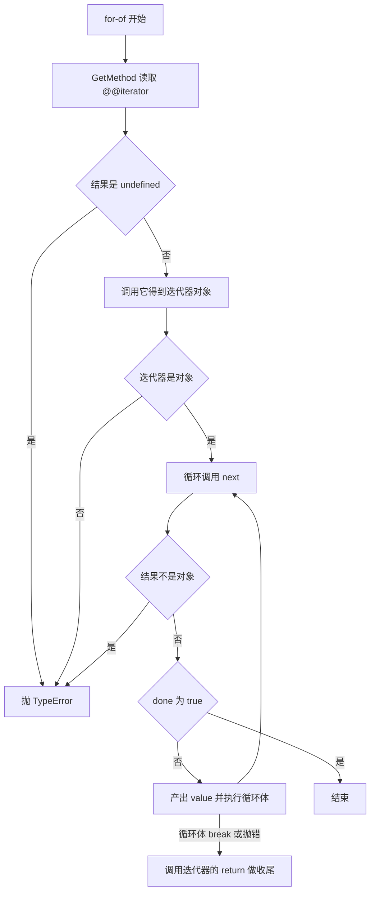

# Symbol 与内置 well-known Symbols

!!! abstract "核心结论"
    - Symbol 是 ECMAScript 的第 7 种语言类型（ES2015 引入，BigInt 是第 8 种）：它的相等性是**身份相等**，与 `description` 无关，两个 `Symbol('x')` 永远不相等。
    - `Symbol.for(key)` 走 Agent 级共享的 GlobalSymbolRegistry，同一 key 返回同一 symbol，**跨 realm 共享**；well-known symbols 不在这个注册表里，`Symbol.keyFor(Symbol.iterator)` 是 `undefined`。
    - Symbol 作为属性键能"隐藏"于 `Object.keys`/`for...in`/`JSON.stringify`，但**不是私有**：`Object.getOwnPropertySymbols` 与 `Reflect.ownKeys` 都能拿到，`{...o}` 和 `Object.assign` 也会复制可枚举的 symbol 键。
    - well-known symbols 是引擎与语言语法之间的约定钩子：`for...of` 只认引擎内部的 `@@iterator` 对象，`instanceof` 只走 `InstanceofOperator` 定义的 `@@hasInstance` 查找，所以纯 JS 无法为"原生语法"伪造这些钩子。
    - `Symbol.toPrimitive` 的 hint 只有 `number`/`string`/`default` 三值：`String()`/模板字面量是 `string`，`Number()`/关系比较是 `number`，`+`、`==`、`Date` 相关运算用 `default`。

## 1. Symbol 的底层模型：身份、描述与全局注册表

### 1.1 Symbol 在类型系统中的位置

`typeof` 的返回值集合对应语言类型：`undefined`、`boolean`、`number`、`string`、`symbol`、`bigint`、`function`、`object`。其中 `symbol` 是 ES2015 新增的第 7 种**原始类型**（primitive），BigInt 在 ES2020 成为第 8 种。

关键推论：

- Symbol 是原始值，所以 `symbol instanceof Object` 为 `false`，不能给它加属性（只有包装对象 `Object(sym)` 可以）。
- Symbol 没有字面量语法，唯一的生产方式是 `Symbol()` 工厂调用和 `Symbol.for()`。因此 `new Symbol()` 抛 `TypeError`（`Symbol` 不是构造器，它是普通函数 + 一个 `Symbol.prototype`）。
- 引擎内部（以 V8 为例，需核对具体版本源码）Symbol 是一个堆对象，带有独立的 symbol id 与 description 字段；两个 symbol 的比较落到底层是"是不是同一个堆对象/同一个 id"，而不是比较字符串。

```js
// 环境：Node.js 18+（CommonJS）
'use strict';
const assert = require('node:assert');

const s1 = Symbol('token');
const s2 = Symbol('token');

assert.strictEqual(typeof s1, 'symbol');
assert.notStrictEqual(s1, s2);                 // 描述相同，身份不同
assert.strictEqual(s1.description, 'token');   // ES2019 起：Symbol.prototype.description
assert.strictEqual(Symbol().description, undefined); // 不传描述
assert.strictEqual(Symbol('').description, '');      // 空字符串描述与 undefined 是两回事
assert.strictEqual(String(s1), 'Symbol(token)');     // String() 对 symbol 特判，不抛错
assert.throws(() => s1 + '', TypeError);             // 字符串拼接走 ToString(symbol) → 抛 TypeError
assert.throws(() => new Symbol(), TypeError);
assert.strictEqual(Object(s1).valueOf(), s1);        // 包装对象
assert.strictEqual(Object.prototype.toString.call(s1), '[object Symbol]');

console.log('symbol-basics.test.js 全部通过');
// 预期输出：symbol-basics.test.js 全部通过
```

### 1.2 唯一性来自身份，描述只是调试信息

`description` 的唯一作用是 `Symbol.prototype.toString` 与开发者工具展示。它**不参与相等性**，也不参与 `Symbol.keyFor` 查找。规范中 Symbol 记录只有一个可选字段 `[[Description]]`，相等性用 `SameValue`（对 Symbol 即身份比较）。

这也解释了一个常见现象：`JSON.stringify({[Symbol('a')]: 1})` 输出 `{}`，因为 `String(symbol)` 抛错，序列化必须跳过 symbol 值——引擎不会为了序列化去调用 `toString`。

### 1.3 GlobalSymbolRegistry：`Symbol.for` 与 `Symbol.keyFor`

规范把 GlobalSymbolRegistry 定义为一个 List，元素形如 `{ [[Key]], [[Symbol]] }`，并声明它"shared by all realms"。因此同一个 Agent 内的不同 realm（例如 iframe、Node 的 `vm` 上下文）里 `Symbol.for('x')` 得到的是同一个 symbol（跨 agent 隔离的细节需核对官方文档对应版本）。

`Symbol.for(key)` 的算法：

1. `stringKey = ToString(key)`：所以 `Symbol.for(1) === Symbol.for('1')`；传入 Symbol 参数会因 `ToString(Symbol)` 抛 `TypeError`。
2. 遍历注册表，命中 `[[Key]]` 则返回对应 symbol。
3. 否则新建 symbol，`[[Description]]` 就是 `stringKey`，写入注册表后返回。

`Symbol.keyFor(sym)` 的算法：

1. 参数不是 Symbol 类型 → 抛 `TypeError`。
2. 在注册表里按 `SameValue` 找 symbol，命中返回 `[[Key]]`。
3. 找不到返回 `undefined`（不是抛错）。

| 维度 | `Symbol(desc)` | `Symbol.for(key)` |
| --- | --- | --- |
| 每次调用结果 | 全新唯一 symbol | 同 key 返回同一个 symbol |
| 是否写入 GlobalSymbolRegistry | 否 | 是 |
| `description` | 传入的 `desc`，未传为 `undefined` | `ToString(key)` 的结果 |
| `Symbol.keyFor` | `undefined` | 返回 key |
| 跨 realm | 不共享 | 同一 Agent 内共享 |
| 典型用途 | 唯一属性键、库内部协议标记 | 跨模块/跨库约定的共享标记 |

```js
// 环境：Node.js 18+（CommonJS）
'use strict';
const assert = require('node:assert');

assert.strictEqual(Symbol.for('app.user'), Symbol.for('app.user'));
assert.strictEqual(Symbol.for(1), Symbol.for('1'));       // ToString(key)
assert.strictEqual(Symbol.for(1).description, '1');       // 描述就是字符串化后的 key
assert.strictEqual(Symbol.keyFor(Symbol.for('app.user')), 'app.user');
assert.strictEqual(Symbol.keyFor(Symbol('app.user')), undefined);

// well-known symbols 不在注册表里
assert.strictEqual(Symbol.keyFor(Symbol.iterator), undefined);
assert.strictEqual(Symbol.iterator.description, 'Symbol.iterator');
assert.notStrictEqual(Symbol.for('Symbol.iterator'), Symbol.iterator);

assert.throws(() => Symbol.keyFor('not a symbol'), TypeError);
assert.throws(() => Symbol.for(Symbol('x')), TypeError);   // ToString(symbol) 抛错

// well-known symbol 属性是 { writable: false, enumerable: false, configurable: false }
const d = Object.getOwnPropertyDescriptor(Symbol, 'iterator');
assert.deepStrictEqual(
  [d.writable, d.enumerable, d.configurable],
  [false, false, false],
);

console.log('symbol-registry.test.js 全部通过');
// 预期输出：symbol-registry.test.js 全部通过
```

### 1.4 手写实现：简化版 Symbol polyfill

真实环境里无法用 JS 造出 `typeof x === 'symbol'` 的值，所以任何 polyfill 都只能做到"看起来像"。下面这个教学模型用 `WeakMap` 保存元数据、用一个唯一字符串 key 冒充 symbol 身份，并**忠实实现注册表语义**。

```js
// symbol-polyfill.js
// 环境：Node.js 18+（CommonJS）；只需要 Map / WeakMap / Object.defineProperty
'use strict';

const SymbolPolyfill = (function createSymbolPolyfill() {
  let nextId = 1;

  const meta = new WeakMap();        // box -> { key, description }
  const registryByKey = new Map();   // stringKey -> box
  const registryByBox = new Map();   // box -> stringKey

  const KEY_PREFIX = '@@symbol:';

  function isSymbolLike(value) {
    return typeof value === 'object' && value !== null && meta.has(value);
  }

  // 模拟 Symbol 工厂：不能 new，每次返回全新身份
  function SymbolPolyfill(description) {
    if (new.target !== undefined) {
      throw new TypeError('Symbol is not a constructor');
    }
    const desc = description === undefined ? undefined : String(description);
    const box = Object.create(SymbolPolyfill.prototype);
    meta.set(box, { key: KEY_PREFIX + nextId, description: desc });
    nextId += 1;
    return box;
  }

  // ToPropertyKey 对对象会先做 ToPrimitive(hint = string)：
  // 先看 @@toPrimitive，这里没有，于是走 OrdinaryToPrimitive → toString()
  // 因此 toString 必须返回唯一 key，而不是 "Symbol(desc)"，否则同描述会撞键
  SymbolPolyfill.prototype.toString = function toString() {
    if (!isSymbolLike(this)) {
      throw new TypeError('Symbol.prototype.toString requires that this be a Symbol');
    }
    return meta.get(this).key;
  };

  Object.defineProperty(SymbolPolyfill.prototype, 'description', {
    get() {
      if (!isSymbolLike(this)) {
        throw new TypeError('Symbol.prototype.description requires that this be a Symbol');
      }
      return meta.get(this).description;
    },
    enumerable: false,
    configurable: true,
  });

  Object.defineProperty(SymbolPolyfill.prototype, 'constructor', {
    value: SymbolPolyfill,
    writable: true,
    configurable: true,
  });

  // 规范：key 先 ToString；命中注册表直接返回；否则新建并登记
  SymbolPolyfill.for = function forKey(key) {
    const stringKey = String(key);
    const hit = registryByKey.get(stringKey);
    if (hit !== undefined) return hit;
    const box = SymbolPolyfill(stringKey);
    registryByKey.set(stringKey, box);
    registryByBox.set(box, stringKey);
    return box;
  };

  // 规范：非 symbol 抛 TypeError；未注册返回 undefined
  SymbolPolyfill.keyFor = function keyFor(box) {
    if (!isSymbolLike(box)) {
      throw new TypeError('Symbol.keyFor: argument is not a symbol');
    }
    return registryByBox.get(box);
  };

  // well-known symbols：用 Symbol() 建，不进注册表，属性不可写/不可枚举/不可配置
  const WELL_KNOWN_NAMES = [
    'asyncIterator', 'hasInstance', 'isConcatSpreadable', 'iterator',
    'match', 'matchAll', 'replace', 'search', 'species', 'split',
    'toPrimitive', 'toStringTag', 'unscopables',
  ];

  for (const name of WELL_KNOWN_NAMES) {
    Object.defineProperty(SymbolPolyfill, name, {
      value: SymbolPolyfill('Symbol.' + name),
      writable: false,
      enumerable: false,
      configurable: false,
    });
  }

  return SymbolPolyfill;
})();

module.exports = SymbolPolyfill;
```

**验证标准**（保存为 `symbol-polyfill.test.js`，运行 `node symbol-polyfill.test.js`）

```js
'use strict';
const assert = require('node:assert');
const SymbolPolyfill = require('./symbol-polyfill.js');

// 唯一性与描述
const a = SymbolPolyfill('token');
const b = SymbolPolyfill('token');
assert.notStrictEqual(a, b);
assert.strictEqual(a.description, 'token');
assert.match(String(a), /^@@symbol:\d+$/);
assert.notStrictEqual(String(a), String(b));
assert.throws(() => new SymbolPolyfill(), TypeError);

// well-known symbol 的属性特征
const d = Object.getOwnPropertyDescriptor(SymbolPolyfill, 'iterator');
assert.deepStrictEqual(
  [d.writable, d.enumerable, d.configurable],
  [false, false, false],
);
assert.strictEqual(SymbolPolyfill.iterator.description, 'Symbol.iterator');

// 注册表语义
assert.strictEqual(SymbolPolyfill.for('k'), SymbolPolyfill.for('k'));
assert.strictEqual(SymbolPolyfill.for(1), SymbolPolyfill.for('1'));
assert.strictEqual(SymbolPolyfill.keyFor(SymbolPolyfill.for('k')), 'k');
assert.strictEqual(SymbolPolyfill.keyFor(SymbolPolyfill.iterator), undefined);
assert.strictEqual(SymbolPolyfill.keyFor(SymbolPolyfill('x')), undefined);
assert.notStrictEqual(SymbolPolyfill.for('Symbol.iterator'), SymbolPolyfill.iterator);
assert.throws(() => SymbolPolyfill.keyFor('nope'), TypeError);

// 作为属性键：靠 toString 的唯一 key 生效
const obj = {};
const k1 = SymbolPolyfill('k');
const k2 = SymbolPolyfill('k');
obj[k1] = 1;
obj[k2] = 2;
assert.strictEqual(obj[k1], 1);
assert.strictEqual(obj[k2], 2);

// 必然缺陷 1：key 是字符串，会被 Object.keys 枚举出来
assert.deepStrictEqual(Object.keys(obj), [String(k1), String(k2)]);

// 必然缺陷 2：key 会被 String() 泄漏，任何人都能伪造同名属性
assert.strictEqual(obj[String(k1)], 1);

console.log('symbol-polyfill.test.js 全部通过');
// 预期输出：symbol-polyfill.test.js 全部通过
```

局限清单（必须背下来，面试常被追问）：

1. `typeof polyfillSymbol === 'object'`，不是 `'symbol'`。
2. `String(sym)` 得到的是内部 key，不是 `Symbol(desc)`；真实 polyfill 必须改写 `String`。
3. 无法实现 `Object.getOwnPropertySymbols`，也无法让 key 逃过 `Object.keys`/`JSON.stringify`。
4. 无法为 `for...of`、`instanceof`、`for await` 这些**原生语法**提供钩子：语法只认引擎内部的 well-known symbol 对象，所以纯 JS 无法给缺失的语法补 `@@iterator`。

## 2. Symbol 作为属性键：不可枚举性与反射 API 差异

### 2.1 ToPropertyKey：对象键先转成原始值

属性访问 `obj[key]` 的第一步是 `ToPropertyKey`：

1. `key = ToPrimitive(argument, hint = string)`。
2. 如果结果是 Symbol，直接返回它（Symbol 是合法的 PropertyKey）。
3. 否则返回 `ToString(key)`。

PropertyKey 的取值集合是 **String ∪ Symbol**。这就是为什么 `obj[Symbol('x')]` 与 `obj['Symbol(x)']` 毫无关系：前者键是 symbol 身份，后者键是字符串。

```js
'use strict';
const assert = require('node:assert');

const s = Symbol('x');
const target = { [s]: 1, 'Symbol(x)': 2 };
assert.strictEqual(target[s], 1);
assert.strictEqual(target['Symbol(x)'], 2);
assert.strictEqual(Object.getOwnPropertyNames(target).includes('Symbol(x)'), true);
assert.strictEqual(Object.getOwnPropertySymbols(target).includes(s), true);

console.log('to-property-key.test.js 全部通过');
// 预期输出：to-property-key.test.js 全部通过
```

### 2.2 `[[OwnPropertyKeys]]` 的排序算法

`OrdinaryOwnPropertyKeys` 的顺序固定为三段：

1. **数组索引式键**（canonical numeric string 且落在 `[0, 2^32 - 1)` 内），按数值升序。
2. 其余字符串键，按插入顺序。
3. Symbol 键，按插入顺序。

`Reflect.ownKeys` 就是把这个顺序原样暴露出来，所以它是最"诚实"的反射 API。

```js
'use strict';
const assert = require('node:assert');

const o = {};
o.b = 1;
o[2] = 2;
o.a = 3;
o[1] = 4;
const s1 = Symbol('s1');
const s2 = Symbol('s2');
o[s2] = 5;
o[s1] = 6;

assert.deepStrictEqual(Reflect.ownKeys(o), ['1', '2', 'b', 'a', s2, s1]);
assert.deepStrictEqual(Object.keys(o), ['1', '2', 'b', 'a']);
assert.deepStrictEqual(Object.getOwnPropertyNames(o), ['1', '2', 'b', 'a']);
assert.deepStrictEqual(Object.getOwnPropertySymbols(o), [s2, s1]);

console.log('own-keys-order.test.js 全部通过');
// 预期输出：own-keys-order.test.js 全部通过
```

### 2.3 反射与枚举 API 差异对比

| API | 返回字符串键 | 返回 symbol 键 | 范围 | 是否过滤 enumerable |
| --- | --- | --- | --- | --- |
| `Object.keys` | 是 | 否 | 自有 | 只保留可枚举 |
| `Object.getOwnPropertyNames` | 是 | 否 | 自有 | 不过滤 |
| `Object.getOwnPropertySymbols` | 否 | 是 | 自有 | 不过滤 |
| `Reflect.ownKeys` | 是 | 是 | 自有 | 不过滤 |
| `for...in` | 是 | 否 | 自有 + 继承 | 只保留可枚举 |
| `Object.assign` | 是 | 是 | 源对象自有 | 只保留可枚举 |
| 对象展开 `{...o}` | 是 | 是 | 源对象自有 | 只保留可枚举 |
| `JSON.stringify` | 是 | 否 | 自有 | 只保留可枚举 |
| `Object.entries` / `Object.values` | 是 | 否 | 自有 | 只保留可枚举 |
| `Object.getOwnPropertyDescriptors` | 是 | 是（返回对象的键含 symbol） | 自有 | 不过滤 |

关键结论：**Symbol 键"看不见"只针对字符串键枚举通道，不是访问控制**。想真正隐藏必须用闭包、WeakMap 或 `#private` 字段。

```js
'use strict';
const assert = require('node:assert');

const secret = Symbol('secret');
const source = { plain: 1, [secret]: 2 };

assert.deepStrictEqual(Object.keys(source), ['plain']);
assert.strictEqual(JSON.stringify(source), '{"plain":1}');
assert.strictEqual(JSON.stringify([secret]), '[null]');       // 数组里的 symbol 值变成 null
assert.strictEqual(JSON.stringify(secret), undefined);        // 顶层 symbol 值直接返回 undefined

// 但 symbol 键不是私有：Object.assign / 展开都会带上
assert.deepStrictEqual(Object.getOwnPropertySymbols({ ...source }), [secret]);
assert.deepStrictEqual(Object.getOwnPropertySymbols(Object.assign({}, source)), [secret]);
assert.strictEqual({ ...source }[secret], 2);

// defineProperty 默认 non-enumerable，此时连 assign / 展开都不会带
const hidden = {};
Object.defineProperty(hidden, secret, { value: 3 });
assert.strictEqual(Object.prototype.propertyIsEnumerable.call(hidden, secret), false);
assert.deepStrictEqual(Object.getOwnPropertySymbols({ ...hidden }), []);

// 想连属性描述符一起复制，只能用 getOwnPropertyDescriptors
const clone = Object.defineProperties({}, Object.getOwnPropertyDescriptors(source));
assert.strictEqual(clone[secret], 2);
assert.strictEqual(clone.plain, 1);

console.log('symbol-reflection.test.js 全部通过');
// 预期输出：symbol-reflection.test.js 全部通过
```

## 3. well-known symbols：属性特征与触发时机

### 3.1 属性特征

每个 well-known symbol 都是 `Symbol` 构造器上的一个自有属性，描述符是 `{ writable: false, enumerable: false, configurable: false }`；它们是引擎启动时用 `Symbol("Symbol.xxx")` 创建的，因此**不进 GlobalSymbolRegistry**。运行时可以把它们当作稳定常量使用（例如 `Symbol.iterator` 在所有 realm 中是否是同一个对象，取决于 Agent 与 realm 的实现细节，需核对官方文档对应版本；实践中按"永不自建同类 symbol"来编码即可）。

### 3.2 触发时机总表

| well-known symbol | 谁读它 | 内置实现位置 | 引入版本 | 备注 |
| --- | --- | --- | --- | --- |
| `Symbol.iterator` | `for...of`、数组/对象展开、解构、`Array.from`、`Set`/`Map` 构造器、`yield*`、`Promise.all` 等（内部经 `GetIterator`） | `Array.prototype`、`String.prototype`、`Map`/`Set` 原型等 | ES2015 | 语法层直接依赖，纯 JS 无法为原生语法补钩子 |
| `Symbol.asyncIterator` | `for await...of`（先取它，取不到再退回同步迭代器包装） | `%AsyncGeneratorPrototype%` 等 | ES2018 | 返回的 `next()` 结果可被 await |
| `Symbol.hasInstance` | `instanceof`（`InstanceofOperator`） | `Function.prototype` | ES2015 | `{ writable: false }`，普通函数要改必须 `defineProperty` |
| `Symbol.toPrimitive` | `ToPrimitive(input, hint)` | `Symbol.prototype`、`Date.prototype` | ES2015 | 返回对象 → `TypeError` |
| `Symbol.toStringTag` | `Object.prototype.toString` | `Map`/`Set`/`Promise`/`JSON` 等 | ES2015 | 取值不是字符串时回退到内建 tag |
| `Symbol.species` | `ArraySpeciesCreate`、`SpeciesConstructor` | `Array`、`Promise`、`RegExp`、TypedArray 构造器 | ES2015 | 只影响"派生新实例"的方法 |
| `Symbol.isConcatSpreadable` | `Array.prototype.concat` 内部的 `IsConcatSpreadable` | 无默认值（数组靠 `IsArray` 判定） | ES2015 | 数组可显式设 `false` 阻止展开 |
| `Symbol.unscopables` | `with` 语句的标识符解析 | `Array.prototype` | ES2015 | 严格模式下 `with` 是语法错误 |
| `Symbol.match` | `String.prototype.match`、`IsRegExp`（被 `startsWith`/`includes`/`endsWith` 使用） | `RegExp.prototype` | ES2015 | `IsRegExp` 只看这个钩子，不看是不是真 RegExp |
| `Symbol.replace` | `String.prototype.replace` | `RegExp.prototype` | ES2015 | 先看钩子，再退回字符串路径 |
| `Symbol.search` | `String.prototype.search` | `RegExp.prototype` | ES2015 | 返回索引 |
| `Symbol.split` | `String.prototype.split` | `RegExp.prototype` | ES2015 | 第二个参数是 `limit` |
| `Symbol.matchAll` | `String.prototype.matchAll` | `RegExp.prototype` | ES2020 | 自定义 matcher 需要提供含 `g` 的 `flags` |
| `Symbol.dispose` / `Symbol.asyncDispose` | 显式资源管理（`using` / `await using`） | 无内建实现 | 需核对官方文档与运行时版本 | 老运行时上可能不存在 |

## 4. 手写实现与验证标准

### 4.1 可迭代类：`Symbol.iterator` / `Symbol.asyncIterator`

`for...of` 的算法骨架（`GetIterator` / `IteratorNext` / `IteratorClose`）：



```js
// iterable.js
// 环境：Node.js 18+（CommonJS）
'use strict';

class Range {
  constructor(start, end, step = 1) {
    if (step === 0) throw new RangeError('step 不能为 0');
    this.start = start;
    this.end = end;
    this.step = step;
  }

  // 每次调用都返回全新的迭代器对象：保证可重复消费
  [Symbol.iterator]() {
    let current = this.start;
    const { end, step } = this;
    return {
      next() {
        const inRange = step > 0 ? current < end : current > end;
        if (!inRange) return { value: undefined, done: true };
        const value = current;
        current += step;
        return { value, done: false };
      },
      // 让迭代器自身也可迭代：规范里迭代器协议与可迭代协议是两件事
      [Symbol.iterator]() { return this; },
      // 提前退出时由 IteratorClose 调用
      return() {
        current = end;
        return { value: undefined, done: true };
      },
    };
  }
}

class AsyncRange {
  constructor(start, end) {
    this.start = start;
    this.end = end;
  }

  [Symbol.asyncIterator]() {
    let current = this.start;
    const end = this.end;
    return {
      next() {
        if (current >= end) {
          return Promise.resolve({ value: undefined, done: true });
        }
        const value = current;
        current += 1;
        return Promise.resolve({ value, done: false });
      },
      [Symbol.asyncIterator]() { return this; },
    };
  }
}

module.exports = { Range, AsyncRange };
```

**验证标准**（保存为 `iterable.test.js`，运行 `node iterable.test.js`）

```js
'use strict';
const assert = require('node:assert');
const { Range, AsyncRange } = require('./iterable.js');

const r = new Range(0, 5);

assert.deepStrictEqual([...r], [0, 1, 2, 3, 4]);
assert.deepStrictEqual(Array.from(r), [0, 1, 2, 3, 4]);
assert.deepStrictEqual(Array.from(r, (x) => x * 2), [0, 2, 4, 6, 8]);
assert.deepStrictEqual([...new Range(0, 6, 2)], [0, 2, 4]);
assert.deepStrictEqual([...new Range(3, 0, -1)], [3, 2, 1]);

// 解构也走迭代协议
const [first, second] = new Range(10, 13);
assert.strictEqual(first, 10);
assert.strictEqual(second, 11);

// 可重复消费
assert.deepStrictEqual([...r], [...r]);

// 生成器委托
function* wrap() {
  yield 'start';
  yield* new Range(0, 2);
  yield 'end';
}
assert.deepStrictEqual([...wrap()], ['start', 0, 1, 'end']);

// 内置构造器走迭代协议
assert.deepStrictEqual([...new Set(new Range(0, 3))], [0, 1, 2]);
assert.deepStrictEqual([...new Map([[1, 'a']]).keys()], [1]);

// 循环体 break 会触发 IteratorClose → 调用迭代器的 return
{
  let closed = false;
  const tracked = {
    [Symbol.iterator]() {
      let i = 0;
      return {
        next() { i += 1; return { value: i, done: false }; },
        return() { closed = true; return { value: undefined, done: true }; },
      };
    },
  };
  for (const v of tracked) {
    if (v === 2) break;
  }
  assert.strictEqual(closed, true);
}

// next() 必须返回对象；@@iterator 必须返回对象
assert.throws(() => [...{ [Symbol.iterator]: () => ({ next: () => 1 }) }], TypeError);
assert.throws(() => [...{ [Symbol.iterator]: () => 1 }], TypeError);

(async () => {
  const out = [];
  for await (const v of new AsyncRange(1, 4)) out.push(v);
  assert.deepStrictEqual(out, [1, 2, 3]);

  // 同步可迭代对象也能被 for await 消费：内部包一层 AsyncFromSyncIterator
  const mixed = [];
  for await (const v of [Promise.resolve('a'), 'b']) mixed.push(v);
  assert.deepStrictEqual(mixed, ['a', 'b']);

  assert.strictEqual(typeof Array.prototype[Symbol.iterator], 'function');
  assert.strictEqual(typeof String.prototype[Symbol.iterator], 'function');

  console.log('iterable.test.js 全部通过');
})();
// 预期输出：iterable.test.js 全部通过
```

### 4.2 自定义 `instanceof`：`Symbol.hasInstance`

`InstanceofOperator(O, C)` 的算法：

1. `C` 不是对象 → 抛 `TypeError`。
2. `instOfHandler = GetMethod(C, Symbol.hasInstance)`。
3. 若 `instOfHandler` 不是 `undefined`，返回 `ToBoolean(Call(instOfHandler, C, [O]))`。
4. 若 `C` 不可调用 → 抛 `TypeError`。
5. 否则回退到 `OrdinaryHasInstance(C, O)`（沿 `O` 的原型链找 `C.prototype`）。

注意钩子挂在**右操作数**上，且 `this` 也是右操作数。

```js
// has-instance.js
// 环境：Node.js 18+（CommonJS）
'use strict';

// 类静态方法用 DefineMethod 定义，创建的是自有属性，可以覆盖继承来的钩子
class EvenNumber {
  static [Symbol.hasInstance](value) {
    return typeof value === 'number' && Number.isInteger(value) && value % 2 === 0;
  }
}

// Function.prototype[Symbol.hasInstance] 是 { writable: false, enumerable: false, configurable: false }
// 所以普通函数必须用 defineProperty 才能装钩子
function Point(x, y) {
  this.x = x;
  this.y = y;
}

Object.defineProperty(Point, Symbol.hasInstance, {
  value(instance) {
    return !!instance
      && typeof instance === 'object'
      && typeof instance.x === 'number'
      && typeof instance.y === 'number';
  },
  configurable: true,
});

module.exports = { EvenNumber, Point };
```

**验证标准**（保存为 `has-instance.test.js`，运行 `node has-instance.test.js`）

```js
'use strict';
const assert = require('node:assert');
const { EvenNumber, Point } = require('./has-instance.js');

assert.strictEqual(2 instanceof EvenNumber, true);
assert.strictEqual(3 instanceof EvenNumber, false);
assert.strictEqual('2' instanceof EvenNumber, false);
assert.strictEqual(EvenNumber[Symbol.hasInstance](4), true);

// Point 变成鸭子类型检查，原型链不等于判定标准
assert.strictEqual({ x: 1, y: 2 } instanceof Point, true);
assert.strictEqual(new Point(0, 0) instanceof Point, true);
assert.strictEqual({ x: 1 } instanceof Point, false);
assert.strictEqual(new Point(0, 0) instanceof Point, true);
assert.strictEqual(Point.prototype.isPrototypeOf({ x: 1, y: 2 }), false);

// 左侧是原始值不抛错；右侧不可调用才抛 TypeError
assert.strictEqual(1 instanceof Object, false);
assert.throws(() => 1 instanceof 2, TypeError);

// Function.prototype 上的钩子属性特征
const d = Object.getOwnPropertyDescriptor(Function.prototype, Symbol.hasInstance);
assert.deepStrictEqual([d.writable, d.enumerable, d.configurable], [false, false, false]);

// 严格模式下直接赋值给继承来的只读属性 → TypeError
// （非严格模式会静默失败，钩子不会生效，这是最经典的坑）
assert.throws(() => {
  function Legacy() {}
  Legacy[Symbol.hasInstance] = function () { return true; };
}, TypeError);

// 未装钩子的普通函数仍然走原型链
class Base {}
class Sub extends Base {}
assert.strictEqual(new Sub() instanceof Base, true);

console.log('has-instance.test.js 全部通过');
// 预期输出：has-instance.test.js 全部通过
```

### 4.3 自定义类型转换：`Symbol.toPrimitive`

`ToPrimitive(input, hint)` 的算法：

1. `hint` 不是 `"string"` 也不是 `"number"` → 设为 `"default"`。
2. `exoticToPrim = GetMethod(input, @@toPrimitive)`；若存在，`Call(exoticToPrim, input, [hint])`，结果不是对象则返回，否则抛 `TypeError`。
3. 否则走 `OrdinaryToPrimitive`：`hint === "string"` 时先 `toString` 再 `valueOf`，其余先 `valueOf` 再 `toString`；两者都返回对象则抛 `TypeError`。

`hint` 的来源是重点：

| 触发写法 | hint |
| --- | --- |
| `String(x)`、模板字面量 `${x}`、`String.prototype` 上的大多数方法 | `string` |
| `Number(x)`、一元 `+x`、`Math.*`、位运算、关系比较 `<` `>` | `number` |
| `x + y`、`x == y`、`Date` 的多数转换 | `default` |

```js
// to-primitive.js
// 环境：Node.js 18+（CommonJS）
'use strict';

class Duration {
  constructor(ms) {
    if (typeof ms !== 'number' || Number.isNaN(ms)) {
      throw new TypeError('ms 必须是合法数字');
    }
    this.ms = ms;
  }

  [Symbol.toPrimitive](hint) {
    if (hint === 'number') return this.ms;
    if (hint === 'string') return `${this.ms}ms`;
    return this.ms; // default：让 + 与 == 走数值语义
  }

  toString() { return `${this.ms}ms`; }
  valueOf() { return this.ms; }
}

// 没有 @@toPrimitive 时，回退到 OrdinaryToPrimitive
class Legacy {
  constructor(ms) { this.ms = ms; }
  valueOf() { return this.ms; }
  toString() { return `${this.ms}ms`; }
}

module.exports = { Duration, Legacy };
```

**验证标准**（保存为 `to-primitive.test.js`，运行 `node to-primitive.test.js`）

```js
'use strict';
/* eslint-disable eqeqeq */
const assert = require('node:assert');
const { Duration, Legacy } = require('./to-primitive.js');

const d = new Duration(1500);

// hint = number
assert.strictEqual(Number(d), 1500);
assert.strictEqual(+d, 1500);
assert.strictEqual(d * 2, 3000);
assert.strictEqual(Math.max(d, 1000), 1500);

// hint = string
assert.strictEqual(String(d), '1500ms');
assert.strictEqual(`${d}`, '1500ms');

// hint = default（+ 与 ==）
assert.strictEqual(d + 1, 1501);
assert.strictEqual(d == 1500, true);

// 关系比较用 hint = number
assert.strictEqual(d < 2000, true);

// 记录 hint 的真实时序
const hints = [];
const probe = { [Symbol.toPrimitive](hint) { hints.push(hint); return 1; } };
Number(probe);
String(probe);
probe + '';
probe == 1;
probe < 2;
assert.deepStrictEqual(hints, ['number', 'string', 'default', 'default', 'number']);

// 没有 @@toPrimitive 时的回退规则
const l = new Legacy(1500);
assert.strictEqual(Number(l), 1500);
assert.strictEqual(String(l), '1500ms');
assert.strictEqual(l + 1, 1501);
assert.strictEqual(l == 1500, true);

// 钩子返回对象 → TypeError
const bad = { [Symbol.toPrimitive]() { return {}; } };
assert.throws(() => Number(bad), TypeError);
assert.throws(() => `${bad}`, TypeError);

// 钩子返回 symbol：在需要字符串/数字的场景继续抛错
const symValue = { [Symbol.toPrimitive]() { return Symbol('s'); } };
assert.throws(() => Number(symValue), TypeError);
assert.throws(() => `${symValue}`, TypeError);

// 钩子为 null / undefined → 视为不存在，回退到 OrdinaryToPrimitive
const fallback = { [Symbol.toPrimitive]: undefined, valueOf: () => 7 };
assert.strictEqual(Number(fallback), 7);

// Date 的 @@toPrimitive 是内建实现：default 走字符串
const date = new Date(0);
assert.strictEqual(typeof Date.prototype[Symbol.toPrimitive], 'function');
assert.strictEqual(Date.prototype[Symbol.toPrimitive].call(date, 'default'), date.toString());
assert.strictEqual(Date.prototype[Symbol.toPrimitive].call(date, 'number'), 0);

console.log('to-primitive.test.js 全部通过');
// 预期输出：to-primitive.test.js 全部通过
```

### 4.4 `Symbol.species` 与数组子类化

`ArraySpeciesCreate(originalArray, length)` 的算法要点：

1. 不是数组 → 直接 `ArrayCreate(length)`。
2. `C = Get(originalArray, "constructor")`。
3. `C` 是构造器但跨 realm 且不等于对方 realm 的 `%Array%` → `C = undefined`。
4. `C` 是数组 → `C = undefined`。
5. `C` 为 `undefined` → 返回 `ArrayCreate(length)`。
6. `C` 不是对象 → 抛 `TypeError`。
7. `species = Get(C, @@species)`；为 `null`/`undefined` → `ArrayCreate(length)`。
8. `species` 不是构造器 → 抛 `TypeError`。
9. 返回 `Construct(species, [length])`。

因为 `Array[Symbol.species]` 是一个返回 `this` 的 getter，**默认情况下子类的 `map`/`filter`/`slice`/`splice`/`concat`/`flat`/`flatMap` 都返回子类实例**；覆盖成 `Array` 就能拿到普通数组。

```js
// species.js
// 环境：Node.js 18+（CommonJS）
'use strict';

// 默认行为：species 继承 Array 的 getter，返回 this（即子类）
class MyArray extends Array {}

// 显式切断：所有派生方法都产出普通数组
class PlainResultArray extends Array {
  static get [Symbol.species]() { return Array; }
}

// 显式声明：派生结果仍是子类，便于链式调用
class ChainableArray extends Array {
  static get [Symbol.species]() { return this; }
  double() { return this.map((x) => x * 2); }
}

module.exports = { MyArray, PlainResultArray, ChainableArray };
```

**验证标准**（保存为 `species.test.js`，运行 `node species.test.js`）

```js
'use strict';
const assert = require('node:assert');
const { MyArray, PlainResultArray, ChainableArray } = require('./species.js');

const m = new MyArray(1, 2, 3);
assert.deepStrictEqual([...m], [1, 2, 3]);
assert.strictEqual(m instanceof MyArray, true);
assert.strictEqual(Array.isArray(m), true);

// 默认 species 是子类本身
const mapped = m.map((x) => x * 2);
assert.strictEqual(mapped instanceof MyArray, true);
assert.deepStrictEqual([...mapped], [2, 4, 6]);

// 覆盖 species 后返回普通数组
const p = new PlainResultArray(1, 2, 3);
const pm = p.map((x) => x * 2);
assert.strictEqual(pm instanceof PlainResultArray, false);
assert.strictEqual(pm.constructor, Array);
assert.deepStrictEqual([...pm], [2, 4, 6]);

// filter / slice / concat 同样走 ArraySpeciesCreate
assert.strictEqual(p.filter(() => true) instanceof PlainResultArray, false);
assert.strictEqual(p.slice(0, 2) instanceof PlainResultArray, false);
assert.strictEqual([0].concat(p) instanceof PlainResultArray, false);

// 链式风格：species 保留子类
const c = new ChainableArray(1, 2, 3);
const c2 = c.double();
assert.strictEqual(c2 instanceof ChainableArray, true);
assert.deepStrictEqual([...c2], [2, 4, 6]);

// 展开语法与 Array.from 不读 species
assert.strictEqual([...p] instanceof PlainResultArray, false);
assert.strictEqual([...p].constructor, Array);
assert.strictEqual(Array.from(p).constructor, Array);

// constructor 不是对象 → map 抛 TypeError
const broken1 = [1, 2, 3];
broken1.constructor = 42;
assert.throws(() => broken1.map((x) => x), TypeError);

// species 不是构造器 → map 抛 TypeError
const broken2 = [1, 2, 3];
broken2.constructor = { [Symbol.species]: 42 };
assert.throws(() => broken2.map((x) => x), TypeError);

// species 为 null / undefined → 退回内置 Array
const broken3 = [1, 2, 3];
broken3.constructor = { [Symbol.species]: null };
assert.strictEqual(broken3.map((x) => x).constructor, Array);

// 同类机制也用在 Promise.then 与 TypedArray 的派生方法上
assert.strictEqual(typeof Promise[Symbol.species], 'function');
assert.strictEqual(typeof RegExp[Symbol.species], 'function');

console.log('species.test.js 全部通过');
// 预期输出：species.test.js 全部通过
```

### 4.5 协议型符号：`match` / `replace` / `search` / `split` / `matchAll`

`String.prototype.match` 的算法（其他四个同构）：

1. `O = RequireObjectCoercible(this)`。
2. 若 `regexp` 不是 `null`/`undefined`：`matcher = GetMethod(regexp, @@match)`；存在则 `Call(matcher, regexp, [O])` 并直接返回。
3. 否则 `ToString(O)` 后 `RegExpCreate(regexp, undefined)`，再 `Invoke(rx, @@match, [S])`。

`Symbol.match` 还被 `IsRegExp` 使用，而 `String.prototype.startsWith` / `endsWith` / `includes` 会对参数调用 `IsRegExp` 并在为真时抛 `TypeError`。另外 `String.prototype.matchAll` 会先 `IsRegExp`，为真时读取 `flags` 并要求包含 `g`。

```js
// regexp-protocol.js
// 环境：Node.js 18+（CommonJS）
'use strict';

class HashMatcher {
  constructor(tag) {
    this.tag = tag;
  }

  // String.prototype.matchAll 会先 IsRegExp 再读 flags 并要求含 g
  get flags() { return 'g'; }

  [Symbol.match](string) {
    const s = String(string);
    const index = s.indexOf(this.tag);
    return index === -1 ? null : [this.tag];
  }

  [Symbol.search](string) {
    return String(string).indexOf(this.tag);
  }

  [Symbol.replace](string, replacement) {
    if (typeof replacement === 'function') {
      throw new TypeError('本简化实现只支持字符串替换');
    }
    return String(string).split(this.tag).join(String(replacement));
  }

  [Symbol.split](string) {
    return String(string).split(this.tag);
  }

  [Symbol.matchAll](string) {
    const s = String(string);
    const results = [];
    let index = s.indexOf(this.tag);
    while (index !== -1) {
      results.push({ 0: this.tag, index, input: s });
      index = s.indexOf(this.tag, index + this.tag.length);
    }
    return results[Symbol.iterator]();
  }
}

module.exports = { HashMatcher };
```

**验证标准**（保存为 `regexp-protocol.test.js`，运行 `node regexp-protocol.test.js`）

```js
'use strict';
const assert = require('node:assert');
const { HashMatcher } = require('./regexp-protocol.js');

const m = new HashMatcher('#');

assert.deepStrictEqual('#a#b'.match(m), ['#']);
assert.strictEqual('#a#b'.search(m), 0);
assert.strictEqual('#a#b'.replace(m, '-'), '-a-b');
assert.deepStrictEqual('#a#b'.split(m), ['', 'a', 'b']);
assert.strictEqual('ab'.match(m), null);
assert.strictEqual('ab'.search(m), -1);

const all = [...'#a#b'.matchAll(m)];
assert.strictEqual(all.length, 2);
assert.deepStrictEqual(all.map((x) => x.index), [0, 2]);
assert.strictEqual(all[0][0], '#');

// 普通字符串参数仍然走内建路径
assert.deepStrictEqual('#a#b'.split('#'), ['', 'a', 'b']);

// 内建 RegExp 的五个钩子
assert.strictEqual(typeof RegExp.prototype[Symbol.match], 'function');
assert.strictEqual(typeof RegExp.prototype[Symbol.replace], 'function');
assert.strictEqual(typeof RegExp.prototype[Symbol.search], 'function');
assert.strictEqual(typeof RegExp.prototype[Symbol.split], 'function');
assert.strictEqual(typeof RegExp.prototype[Symbol.matchAll], 'function');

// IsRegExp 用 @@match 判断"正则式"：字符串方法会直接抛错
class FakeRegExp {
  get [Symbol.match]() { return () => null; }
}
assert.throws(() => 'abc'.includes(new FakeRegExp()), TypeError);
assert.throws(() => 'abc'.startsWith(new FakeRegExp()), TypeError);
assert.throws(() => 'abc'.includes(/a/), TypeError);

// matchAll 要求参数要么没有 @@match 且是普通字符串，要么 flags 含 g
assert.throws(() => 'aa'.matchAll(/a/), TypeError);   // 非全局正则
assert.strictEqual([...'aa'.matchAll(/a/g)].length, 2);

console.log('regexp-protocol.test.js 全部通过');
// 预期输出：regexp-protocol.test.js 全部通过
```

### 4.6 `Symbol.toStringTag`

`Object.prototype.toString` 的收尾步骤是：`tag = Get(O, @@toStringTag)`；若 `tag` 不是字符串就回退到内建 tag（数组由 `IsArray` 判定、可调用对象为 `"Function"`，其余为 `"Object"`）；最后返回 `"[object " + tag + "]"`。因为用的是 `Get`，getter 会被调用，这是"伪造 toString 标签"的官方途径。

```js
// to-string-tag.js
// 环境：Node.js 18+（CommonJS）
'use strict';

class Collection {
  constructor(items) {
    this.items = items;
    this.size = items.length;
  }
  get [Symbol.toStringTag]() { return 'Collection'; }
  [Symbol.iterator]() { return this.items[Symbol.iterator](); }
}

module.exports = { Collection };
```

**验证标准**（保存为 `to-string-tag.test.js`，运行 `node to-string-tag.test.js`）

```js
'use strict';
const assert = require('node:assert');
const { Collection } = require('./to-string-tag.js');

assert.strictEqual(Object.prototype.toString.call(new Collection([1, 2])), '[object Collection]');
assert.deepStrictEqual([...new Collection([1, 2])], [1, 2]);

// 内建对象
assert.strictEqual(Object.prototype.toString.call(new Map()), '[object Map]');
assert.strictEqual(Object.prototype.toString.call(new Set()), '[object Set]');
assert.strictEqual(Object.prototype.toString.call(Promise.resolve()), '[object Promise]');
assert.strictEqual(Object.prototype.toString.call(Symbol('x')), '[object Symbol]');
assert.strictEqual(Map.prototype[Symbol.toStringTag], 'Map');

// 数组走 IsArray 特判，不依赖 @@toStringTag
assert.strictEqual(Array.prototype[Symbol.toStringTag], undefined);
assert.strictEqual(Object.prototype.toString.call([]), '[object Array]');
assert.strictEqual(Object.prototype.toString.call(new Proxy([], {})), '[object Array]');

// tag 不是字符串 → 回退到内建 tag
assert.strictEqual(Object.prototype.toString.call({ [Symbol.toStringTag]: 42 }), '[object Object]');
assert.strictEqual(Object.prototype.toString.call({ [Symbol.toStringTag]: null }), '[object Object]');

// 是 getter，每次 toString 都会执行
let reads = 0;
const counted = { get [Symbol.toStringTag]() { reads += 1; return 'Counted'; } };
assert.strictEqual(Object.prototype.toString.call(counted), '[object Counted]');
assert.strictEqual(reads, 1);

console.log('to-string-tag.test.js 全部通过');
// 预期输出：to-string-tag.test.js 全部通过
```

### 4.7 `Symbol.isConcatSpreadable`

`Array.prototype.concat` 对每个元素执行 `IsConcatSpreadable(E)`：不是对象返回 `false`；`Get(E, @@isConcatSpreadable)` 有值就返回 `ToBoolean(值)`；否则返回 `IsArray(E)`。所以它有两个方向：给类数组对象"打开"展开能力，给数组"关闭"展开能力。

**验证标准**（保存为 `is-concat-spreadable.test.js`，运行 `node is-concat-spreadable.test.js`）

```js
'use strict';
const assert = require('node:assert');

// 方向一：类数组对象默认不展开，装钩子后展开
const arrayLike = { 0: 'a', 1: 'b', length: 2 };
assert.deepStrictEqual([1].concat(arrayLike), [1, arrayLike]);

const spreadable = { 0: 'a', 1: 'b', length: 2, [Symbol.isConcatSpreadable]: true };
assert.deepStrictEqual([1].concat(spreadable), [1, 'a', 'b']);

// 稀疏槽会变成 undefined
const sparse = { 1: 'b', length: 2, [Symbol.isConcatSpreadable]: true };
assert.deepStrictEqual([].concat(sparse), [undefined, 'b']);

// 方向二：数组显式关闭展开，整体作为一个元素进入结果
const arr = [1, 2, 3];
arr[Symbol.isConcatSpreadable] = false;
const merged = [0].concat(arr);
assert.strictEqual(merged.length, 2);
assert.strictEqual(merged[0], 0);
assert.strictEqual(merged[1], arr); // 注意是原对象本身，不是拷贝

// 其他路径不吃这个钩子
assert.deepStrictEqual([...arr], [1, 2, 3]);
assert.strictEqual(JSON.stringify(arr), '[1,2,3]');

console.log('is-concat-spreadable.test.js 全部通过');
// 预期输出：is-concat-spreadable.test.js 全部通过
```

### 4.8 `Symbol.unscopables`

`with (obj) { ... }` 做标识符解析时，对每个名字 `N` 会检查 `HasProperty(obj, N)`；命中后再看 `Get(obj, @@unscopables)` 得到的结果对象上 `Get(unscopables, N)` 是否为真值，为真则**跳过** obj，继续向外层作用域查找。它不改变普通属性访问，只影响 `with` 内的标识符解析。

注意：严格模式下 `with` 是语法错误，ESM、class 内部、`'use strict'` 文件全都不能用，所以这段代码必须作为**非严格模式脚本**运行。

```js
// unscopables.demo.js
// 环境：Node.js 18+（CommonJS），注意：本文件绝不能出现 'use strict'，也不能是 .mjs
const assert = require('node:assert');

var shadowed = 'outer';

const scope = {
  visible: 1,
  shadowed: 2,
  [Symbol.unscopables]: { shadowed: true },
};

with (scope) {
  assert.strictEqual(visible, 1);        // 正常命中 scope
  assert.strictEqual(shadowed, 'outer'); // 被 unscopables 屏蔽，落到外层
}

// 真实用途：Array.prototype[Symbol.unscopables] 屏蔽了一批新方法，
// 避免旧代码里的同名变量被数组方法劫持
assert.strictEqual(typeof Array.prototype[Symbol.unscopables], 'object');
assert.strictEqual(Array.prototype[Symbol.unscopables].values, true);
assert.strictEqual(Array.prototype[Symbol.unscopables].entries, true);
assert.strictEqual(Array.prototype[Symbol.unscopables].keys, true);

var values = 'my-variable';
with ([1, 2, 3]) {
  assert.strictEqual(values, 'my-variable');
}

console.log('unscopables.demo.js 全部通过');
// 预期输出：unscopables.demo.js 全部通过
```

## 5. 常见陷阱

1. **`new Symbol()` 抛错**：Symbol 是工厂函数不是构造器。同理 `Symbol` 上只有 `for`、`keyFor` 和 well-known symbol 属性，没有 `Symbol.prototype` 之外的实例 API。
2. **`sym + ''` 与 `String(sym)` 行为不同**：`String()` 对 Symbol 特判返回 `Symbol(desc)`；字符串拼接、模板字面量 `${sym}`、`JSON.stringify(sym)` 都会走 `ToString(Symbol)` 并抛 `TypeError`（模板字面量同样抛错，这一点很多人记错）。
3. **描述相同不等于相等**：`Symbol('a') !== Symbol('a')`。想共享必须 `Symbol.for('a')`，而 `Symbol.for` 的 key 会被 `ToString`，`Symbol.for(1) === Symbol.for('1')`。
4. **well-known symbols 不在注册表**：`Symbol.keyFor(Symbol.iterator) === undefined`；同时 `Symbol.for('Symbol.iterator') !== Symbol.iterator`，别想用 `Symbol.for` 拿到内建钩子。
5. **Symbol 键不是私有属性**：`Object.getOwnPropertySymbols`、`Reflect.ownKeys`、`Object.getOwnPropertyDescriptors` 都能看到；`{...o}` 与 `Object.assign` 还会复制**可枚举**的 symbol 键。
6. **`for...in` 永远不返回 Symbol 键**，即使 `enumerable: true`；`Object.keys` 同理。反过来 `Object.getOwnPropertySymbols` 也永远不会返回字符串键，两者不能互相替代。
7. **`instanceof` 的钩子装在右操作数上**，并且 `Function.prototype[Symbol.hasInstance]` 是只读的：`Fn[Symbol.hasInstance] = ...` 在严格模式抛 `TypeError`，非严格模式静默失败，必须用 `Object.defineProperty` 或 class 静态方法。
8. **`Symbol.hasInstance` 只影响 `instanceof`**，不影响 `isPrototypeOf`、`Array.isArray`、`Object.prototype.toString` 等任何其他判断。
9. **`Symbol.toPrimitive` 返回对象必抛错**，返回 Symbol 会在需要字符串/数字时继续抛错；把它设成 `null`/`undefined` 等于没装（`GetMethod` 语义），会回退到 `valueOf`/`toString`。
10. **`default` hint 的坑**：`d + 1`、`d == 1500` 用 `default`，如果 `default` 分支返回字符串，算术结果可能不符合直觉。`Date` 就是这么设计的（`default` 走字符串）。
11. **`Symbol.species` 不是万能的**：数组展开 `[...arr]`、`Array.from`、`Array.of`(当 `this` 是 Array 时)、`JSON` 都不读 species；`concat` 在 `@@isConcatSpreadable` 为 `false` 时也不会派生。
12. **`Symbol.species` 只读 `constructor` 链**：把 `arr.constructor` 改成非对象会抛 `TypeError`，改成 `{ [Symbol.species]: 42 }` 也抛错，这是"敌意对象"防注入的设计后果。
13. **`with` + `Symbol.unscopables` 在严格模式不可用**：ESM、class、`'use strict'` 下 `with` 直接是语法错误，这个钩子只服务历史遗留的宽松脚本。
14. **`String.prototype.includes(/a/)` 会抛错**：`IsRegExp` 通过 `@@match` 判定，只要参数有 `@@match` 就当正则式处理；自定义 matcher 因此也会被 `includes`/`startsWith`/`endsWith` 拒绝。
15. **`String.prototype.matchAll` 的自定义 matcher 必须提供 `flags`**：`IsRegExp` 为真时会 `Get(regexp, 'flags')` 并 `RequireObjectCoercible`，缺失 `flags` 直接抛 `TypeError`；有 `flags` 但不含 `g` 也抛错。
16. **polyfill 的天花板**：用字符串 key 模拟 Symbol 会泄漏键、被 `Object.keys` 枚举、无法被 `for...of` 识别；`Symbol.dispose`/`asyncDispose` 是否可依赖需核对当前运行时版本，不要盲目在生产代码里使用。

## 6. 面试题与答题要点

**Q1：Symbol 的唯一性是怎么实现的？`Symbol('a')` 和 `Symbol('a')` 为什么不相等？**

- Symbol 是 ES2015 新增的第 7 种原始类型，`description` 只是调试信息，不参与相等性。
- 相等性走 `SameValue`，对 Symbol 即身份比较；引擎侧落到 symbol 的内部 id / 堆对象身份。
- 因为 `Symbol` 不是构造器，只能通过工厂调用产生，每次调用都创建新身份，没有"缓存复用"路径。
- 想共享身份必须走 `Symbol.for` 的 GlobalSymbolRegistry。

**Q2：`Symbol.for` 与 `Symbol` 的区别？注册表在哪里？**

- `Symbol.for(key)` 把 key 做 `ToString` 后在 GlobalSymbolRegistry 查表，命中返回同一个 symbol，否则新建并登记；描述就是字符串化后的 key。
- `Symbol.keyFor` 反向查表，要求参数真是 Symbol（否则 `TypeError`），未注册返回 `undefined`。
- 规范里注册表是全局共享的 List，因此同一 Agent 内跨 realm 是同一份；well-known symbols 不进注册表。
- 引擎实现通常用哈希表而非线性 List；具体结构需核对对应版本的引擎源码。

**Q3：用 Symbol 做属性键能实现"私有属性"吗？**

- 不能。它只避开字符串键枚举通道（`Object.keys`、`JSON.stringify`、`for...in`、`Object.entries`）。
- `Object.getOwnPropertySymbols`、`Reflect.ownKeys`、`Object.getOwnPropertyDescriptors` 都能拿到；`Object.assign` 与对象展开还会复制可枚举的 symbol 键。
- 真正的私有要用 `#private` 字段、闭包或 WeakMap。
- 组件库里用 Symbol 做键的价值是"避免命名冲突"和"协议标记"，不是访问控制。

**Q4：`for...of` 的完整调用链是什么？提前 `break` 会发生什么？**

- `GetMethod(obj, Symbol.iterator)` → 调用得到迭代器对象（必须是对象，否则 `TypeError`）。
- 反复 `next()`，每次结果必须是对象（否则 `TypeError`）；`done` 为假时把 `value` 交给循环体。
- 循环体 `break` 或抛异常时执行 `IteratorClose`，调用迭代器的 `return()`（存在的话），并把 `return()` 的异常按规则传播。
- 解构、展开、`Array.from`、`yield*`、`new Set()` 等共用同一套协议；`asyncIterator` 版本由 `for await...of` 驱动，取不到时退回同步迭代器并逐值 await。

**Q5：`instanceof` 的执行流程？如何自定义？有什么限制？**

- `InstanceofOperator(O, C)`：`C` 不是对象抛 `TypeError`；`GetMethod(C, @@hasInstance)` 存在就用它，返回值 `ToBoolean` 后作为结果；否则要求 `C` 可调用后走 `OrdinaryHasInstance` 沿原型链查找。
- 钩子挂在右操作数上，`this` 也是右操作数。
- `Function.prototype[Symbol.hasInstance]` 是不可写的，普通函数只能 `Object.defineProperty` 添加自有属性，class 静态方法天然可以。
- 它只影响 `instanceof`，不影响 `isPrototypeOf`、`Array.isArray`。

**Q6：`Symbol.toPrimitive` 的 hint 有哪几种？分别什么时候出现？**

- 三种：`number`、`string`、`default`。
- `Number(x)`、`+x`、位运算、关系比较 `<`/`>` 用 `number`；`String(x)`、模板字面量、String 上的多数方法用 `string`；`+`、`==`、多数内建转换用 `default`。
- 存在 `@@toPrimitive` 时优先于 `valueOf`/`toString`；返回对象抛 `TypeError`；值为 `null`/`undefined` 视为不存在，回退到 `OrdinaryToPrimitive`。
- `Date` 把 `default` 设计成字符串，是"用 `+date` 得字符串、用 `<` 得数值"这个经典差异的来源。

**Q7：`Symbol.species` 解决了什么问题？怎么用？**

- 解决"继承内置类型后，派生方法产出的实例类型"问题：`map`/`filter`/`slice`/`concat`/`splice`/`flat`/`flatMap` 通过 `ArraySpeciesCreate`，`Promise.prototype.then`、RegExp、TypedArray 通过 `SpeciesConstructor` 决定新实例的构造器。
- `Array[Symbol.species]` 是返回 `this` 的 getter，所以不覆盖时子类的派生结果仍是子类；覆盖成 `Array` 就得到普通数组。
- 静态 getter 里返回 `this` 表示"保持子类语义"，这也是显式声明意图的常见写法。
- 注意 `constructor` 必须可用：`constructor` 不是对象、或 `species` 不是构造器都会抛 `TypeError`；`species` 为 `null`/`undefined` 则回退到内置构造器。

**Q8：`Symbol.match` 这类"协议符号"的作用是什么？举一个实际影响。**

- 它们是字符串方法的内建扩展点：`String.prototype.match/replace/search/split/matchAll` 会先取参数的对应 `@@xxx` 方法，存在就调用，不存在才退回字符串/内建 RegExp 路径。
- `IsRegExp` 也依赖 `@@match`，所以任何带 `@@match` 的对象都会被 `startsWith`/`includes`/`endsWith` 当成"正则式"并抛 `TypeError`。
- `String.prototype.matchAll` 还要求自定义 matcher 提供含 `g` 的 `flags`，否则抛 `TypeError`。
- 因此给对象装 `@@match` 等钩子可以做到"无需真的 RegExp 也能参与字符串方法"，但代价是会被 `IsRegExp` 关联检查命中。

**Q9：`Symbol.unscopables` 有什么用？为什么平时几乎见不到？**

- 它只影响 `with` 语句内的标识符解析：`@@unscopables` 对象上为真值的名字会被跳过，继续向外层查找。
- 存在的理由是历史包袱：ES2015 给 `Array.prototype` 加了 `keys`/`values`/`entries` 等方法后，旧代码里 `with (array)` 中的同名变量会被劫持，于是用 `Array.prototype[Symbol.unscopables]` 屏蔽。
- 严格模式下 `with` 是语法错误，ESM/class 都是严格模式，所以现代代码基本不会遇到它。

## 7. 收尾速查

- 记忆锚点一：Symbol 是**身份类型**，两个同心同德的描述也互不相等；跨模块共享只能靠 `Symbol.for`。
- 记忆锚点二：Symbol 键"看不见"只是枚举通道的过滤，不是权限；反射 API 能看到一切。
- 记忆锚点三：well-known symbols 是语言语法与内置算法预留的**协议插槽**，逐个记住"谁读它"比记住它叫什么更重要：`for...of` 读 `@@iterator`、`instanceof` 读 `@@hasInstance`、`ToPrimitive` 读 `@@toPrimitive`、`Object.prototype.toString` 读 `@@toStringTag`、派生构造读 `@@species`、`concat` 读 `@@isConcatSpreadable`、`with` 读 `@@unscopables`、五个字符串方法读 `@@match`/`@@replace`/`@@search`/`@@split`/`@@matchAll`。
- 记忆锚点四：polyfill 只能模拟"唯一键"的表象，`typeof`、原生语法识别、`getOwnPropertySymbols` 这三件事永远补不上。

文中涉及的 ES 年度版本（ES2015/ES2018/ES2019/ES2020）与引擎内部实现细节，若与你的运行环境不一致，请以 ECMA-262 当前版本与运行时实际行为为准；`Symbol.dispose`/`Symbol.asyncDispose` 的可用性需要核对官方文档与对应运行时版本后再使用。

## 深入阅读与参考

!!! tip "怎么用这些资料"
    先读「官方文档与规范」建立准确的概念，再读「源码与示例」核对细节，最后用「教程、书籍与视频」换一种讲法加深理解。每条都写明了读哪一节、带着什么问题读。

### 官方文档与规范

| 资源 | 为什么读 | 怎么读 |
|---|---|---|
| [The structured clone algorithm](https://developer.mozilla.org/en-US/docs/Web/API/Web_Workers_API/Structured_clone_algorithm) | 规范列出可克隆类型，说明 Symbol 值为何不能跨线程复制。 | 读支持类型表确认没有 Symbol，再用 postMessage 传 Symbol 观察报错。 |
| [Web APIs](https://developer.mozilla.org/en-US/docs/Web/API) | 总览宿主 API 如何实现 Symbol.iterator 等约定接口。 | 查 NodeList、FormData、Headers，记录各自实现的 well-known symbol 方法。 |
| [MDN Web API 参考](https://developer.mozilla.org/zh-CN/docs/Web/API) | 查证入口：确认某接口的符号方法来自哪里。 | 写 for...of 或展开前先查该接口页的 Symbol.iterator 小节。 |
| [`symbols()` CSS function](https://developer.mozilla.org/en-US/docs/Web/CSS/Reference/Values/symbols) | CSS 的 symbols() 与 JS Symbol 同名不同物，专治术语混淆。 | 只看语法与示例，写一段与 JS Symbol 的差异对照笔记。 |
| [`symbols` CSS at-rule descriptor](https://developer.mozilla.org/en-US/docs/Web/CSS/Reference/At-rules/@counter-style/symbols) | 同名的 at 规则描述符，补足 CSS 语境下 symbols 的含义。 | 浏览取值类型，确认它接收字符串与图片，与 Symbol 值无关。 |

### 源码与示例

| 资源 | 为什么读 | 怎么读 |
|---|---|---|
| [MDN DOM 概述](https://developer.mozilla.org/en-US/docs/Web/API/Document_Object_Model) | NodeList 可迭代正是 Symbol.iterator 的落地样例。 | 读节点与元素接口，在控制台打印 NodeList.prototype[Symbol.iterator]。 |
| [Using readable streams](https://developer.mozilla.org/en-US/docs/Web/API/Streams_API/Using_readable_streams) | 流的异步迭代由 Symbol.asyncIterator 驱动，可直接观察。 | 读异步迭代小节，用 for await 消费流并打印该方法引用。 |
| [Node.js 内置测试运行器](https://nodejs.org/api/test.html) | 用内置测试运行器把手写 Symbol 实现固化成断言。 | 读 describe/it 与断言一节，为特性检测和注册表逻辑各写一组测试。 |
| [Transferable objects](https://developer.mozilla.org/en-US/docs/Web/API/Web_Workers_API/Transferable_objects) | 对照可转移对象，理解唯一性值为何不能跨线程共享。 | 读可转移列表与示例，确认 Symbol 既不可克隆也不可转移。 |

### 教程、书籍与视频

| 资源 | 为什么读 | 怎么读 |
|---|---|---|
| [MDN 使用 IndexedDB](https://developer.mozilla.org/en-US/docs/Web/API/IndexedDB_API/Using_IndexedDB) | IndexedDB 依赖结构化克隆，Symbol 不能作键或值。 | 读键与版本升级一节，试着存入 Symbol 键值并记录抛错。 |
| [Streams API concepts](https://developer.mozilla.org/en-US/docs/Web/API/Streams_API/Concepts) | 从概念层理解可迭代与异步可迭代，呼应两个迭代符号。 | 读可读流概念图，标出 Symbol.iterator 与 asyncIterator 生效位置。 |

## 应用与行业实践

### 应用场景地图

| 场景 | 用到本页哪个知识点 | 典型技术选型 | 注意事项 |
| --- | --- | --- | --- |
| 后台管理的万行表格（虚拟滚动） | Symbol 键的不可枚举性与反射 API 差异 | React + TanStack Virtual 或原生虚拟列表 | 行内本地状态挂 symbol 键并设 `enumerable: false`，导出与快照对比时不会带上 |
| 多人协作白板的增量同步 | `JSON.stringify` 忽略 symbol 键 | Yjs 或自研 OT + WebSocket | 本地光标、选区写 symbol 键；不能把它当权限边界 |
| 微前端里同页多份 SDK 副本 | `Symbol.for` 的 Agent 级注册表 | qiankun 或 Module Federation 或同源 iframe | 跨 realm 可共享，key 要带命名空间与版本；别用 `Symbol()` 做协议标记 |
| 埋点 SDK 被重复打包进两个 chunk | `Symbol.for` 让两次调用返回同一身份 | 自研 SDK + 动态 `import()` | 用 `Symbol()` 每次都是新身份，重复注册检测会漏判 |
| 设计系统里主题 token 的合并 | `{...o}` 与 `Object.assign` 复制可枚举 symbol 键 | CSS-in-JS 与 token 包 | token 写成可枚举 symbol 键时浅拷贝会带上，跨包去重需白名单 |
| 图表里金额、百分比的自定义排序 | `Symbol.toPrimitive` 的 hint 三值 | ECharts 或 d3 的自定义数据对象 | `+` 与 `==` 走 `default`，`Number()` 与 `<` 走 `number`，别让排序依赖模板字面量 |
| 日志面板与控制台的对象展示 | `Symbol.toStringTag` 与 `util.inspect.custom` | Node 的 `util.inspect` 或浏览器 console | `toStringTag` 只改 `Object.prototype.toString` 的输出，不改 `typeof` |
| 编辑器插件宿主的协议约定 | well-known symbols 不在 GlobalSymbolRegistry | VS Code 类插件宿主 | 自检 `Symbol.keyFor(Symbol.iterator) === undefined`，别把 well-known 当可注册的 key |

### 三个场景拆解

#### 场景 1：后台管理的万行表格，行内本地状态怎么放

**业务背景**：表格一次渲染上万行，每行要记住"改过没改""第几次编辑"这类前端状态。这些状态一旦混进导出数据，后端 schema 校验就会报错。

**怎么用本页知识解决**：把本地状态挂成行对象的 symbol 键，并设 `enumerable: false`。这样 `JSON.stringify`、`Object.keys`、`for...in` 都看不到它，而 `getOwnPropertySymbols` 仍能读到。

```js
const ROW_STATE = Symbol('rowState'); // 行内本地状态，不参与任何导出

const row = { id: 1001, name: '张三' };
Object.defineProperty(row, ROW_STATE, {
  value: { dirty: true, editedAt: 0 },
  enumerable: false, // 关键：不可枚举，展开与 Object.assign 都拿不到
  writable: true,
  configurable: true,
});

JSON.stringify(row); // '{"id":1001,"name":"张三"}'
Object.keys(row); // ['id', 'name']
Object.getOwnPropertySymbols(row); // [ROW_STATE]，说明隐藏不等于私有
row[ROW_STATE].dirty = false; // 写入仍然走同一个键

// 若把 enumerable 改成 true，{...row} 与 Object.assign 都会复制 ROW_STATE
```

- `enumerable: false` 是分界线：不可枚举的 symbol 键不会被浅拷贝带走，日志与快照里也不会出现。
- 导出链路不用改一行代码，`JSON.stringify` 本身就跳过 symbol 键。
- 调试时用 `getOwnPropertySymbols` 或 `Reflect.ownKeys` 取值，不要用 `Object.keys`。
- 把 `ROW_STATE` 定义在模块顶层，不要每行新建一个 symbol，否则两次取到的不是同一把钥匙。
- 别把这个键当成私有字段：任何能拿到行对象的代码都能读到它。

**怎么度量收益**：用 Chrome DevTools 的 Performance 面板录制 5 秒滚动，读 Frames 行的 FPS 与 Long Tasks（超过 50ms 的任务）条数；用 Memory 面板做两次 Heap snapshot，对比行对象的 Retained Size；导出体积用 `new Blob([JSON.stringify(rows)]).size` 记录字节数。

**什么时候不该用**：

- 这些状态要写进 localStorage 或发回后端时不要用，`JSON.stringify` 会把它丢掉，改用字符串键或显式序列化函数。
- 行对象要跨 Worker 或跨 realm 传递时不要用，结构化克隆算法不会复制 symbol 键。
- 团队里有组件依赖 `Object.keys` 做通用渲染时不要用，symbol 键对它们不可见，排查成本会转移到人身上。

#### 场景 2：多人协作白板的增量同步

**业务背景**：白板上每个操作都要即时广播给同房间的其他人，但本地光标、当前工具、正在拖拽的临时坐标不该发给服务端。房间人数与操作频率上去后，每帧多带几十字节都会被放大。

**怎么用本页知识解决**：共享数据用字符串键，本地数据用 symbol 键。发送 patch 时只取字符串键构成的普通对象，本地状态留在原对象里。

```js
const LOCAL_ONLY = Symbol('localOnly'); // 光标、选区、当前工具

const doc = { shapes: [] };
doc[LOCAL_ONLY] = { selection: ['a1'], tool: 'pen' }; // 直接赋值 => 可枚举

// 1) 发给服务端：只取字符串键，symbol 状态不会泄漏
JSON.stringify(doc); // '{"shapes":[]}'
Object.entries(doc); // [['shapes', []]]

// 2) 本地浅拷贝：可枚举的 symbol 键会被复制，隐藏不等于私有
const snapshot = { ...doc };
snapshot[LOCAL_ONLY]; // { selection: ['a1'], tool: 'pen' }

// 3) 需要严格隔离本地状态时，改用 defineProperty 并设 enumerable: false
Object.defineProperty(doc, LOCAL_ONLY, {
  value: { tool: 'pen' },
  enumerable: false,
  writable: true,
});
```

- 广播链路的 payload 构造只走 `Object.entries`，天然过滤 symbol 键。
- 第 2 步演示了边界：可枚举的 symbol 键会被浅拷贝带走，本地快照会带上光标位置。
- 第 3 步用 `defineProperty` 把状态转为不可枚举，快照与日志都不再包含它。
- 收到远端 patch 时用 `Object.assign(doc, patch)`，patch 里没有 symbol 键，不会覆盖本地状态。
- 撤销栈如果要存本地状态，必须显式复制 symbol 键，不能依赖 `JSON.parse(JSON.stringify(...))`。

**怎么度量收益**：用 Chrome DevTools 的 Network 面板打开 WebSocket，读 Frames 标签里每帧的 Payload 字节数；在单元测试里断言 `JSON.stringify(payload).length` 的上界；用 `console.time`/`console.timeEnd` 包裹序列化函数，记录单帧耗时分布。

**什么时候不该用**：

- 服务端也要读这份本地状态做冲突合并时不要用，服务端拿不到 symbol 键。
- 需要防第三方脚本读取时不要用，同一页面里的脚本用 `getOwnPropertySymbols` 就能取到。
- 通过 `postMessage` 跨窗口传值时不要用，结构化克隆不会带上 symbol 键。

#### 场景 3：微前端里同页多份 SDK 副本

**业务背景**：主应用与同源 iframe 子应用各自打包了一份通信 SDK，两份代码互相认不出对方注册的桥接对象。子应用数量增加后，重复注册与版本错配的问题会集中在发版日暴露。

**怎么用本页知识解决**：协议标记改用 `Symbol.for(key)`，同一个 key 在同一个 Agent 内的所有 realm 返回同一个 symbol。key 里带命名空间与版本，避免两个团队撞名。

```js
// 宿主页面
const BRIDGE_KEY = 'demo.bridge.v1'; // 命名空间 + 版本
const BRIDGE = Symbol.for(BRIDGE_KEY); // 注册表是 Agent 级共享的
Object.defineProperty(window, BRIDGE, {
  value: { post: (msg) => void msg }, // 桥接对象只挂在共享 symbol 键上
  enumerable: false,
});

// iframe 的 realm（在 iframe 里执行）
const BRIDGE2 = Symbol.for(BRIDGE_KEY); // 与宿主拿到同一个 symbol
parent[BRIDGE2].post('ready'); // 能直接取到宿主注册的方法

// 对照：Symbol('...') 每次都是新身份，跨副本必然不相等
Symbol(BRIDGE_KEY) === Symbol(BRIDGE_KEY); // false

// well-known symbols 不在注册表里
Symbol.keyFor(Symbol.iterator); // undefined
```

- 两份 SDK 副本各自调用 `Symbol.for` 就能对上身份，不需要额外传值。
- key 带版本号后，旧副本拿不到新桥，版本错配会直接表现为取不到对象，而不是静默写错字段。
- `Symbol.keyFor` 对 well-known symbols 返回 `undefined`，可以用这条自检确认没有把内置钩子当协议 key。
- 用 `Object.defineProperty` 挂到 window，避免被 `for...in` 枚举到。
- 宿主与子应用不在同一个 Agent 时（例如跨进程渲染的 iframe），`Symbol.for` 不再等价，改走 `postMessage` 传递版本号。

**怎么度量收益**：写一个 SDK 启动自检函数并返回布尔值，用 Playwright 跑跨 iframe 的断言用例；用 webpack-bundle-analyzer 或 rollup-plugin-visualizer 统计 SDK 副本数量与各自体积；在 CI 里跑自检用例并统计通过率。

**什么时候不该用**：

- 应用只有一个 SDK 副本时不要用，模块级 `const BRIDGE = Symbol('bridge')` 就够，`Symbol.for` 只会让 key 命名变成新的评审负担。
- 两个团队共用一个没有版本号的 key 时不要用，两边会静默拿到对方的值。
- 需要把桥接对象序列化进配置文件时不要用，symbol 键进不了 JSON。

### 行业先进实践

**用 `util.inspect.custom` 实现自定义调试输出（出处：Node.js 官方文档 util 模块）**

对象定义 `[util.inspect.custom]` 方法后，`util.inspect` 与 `console.log` 会调用它来生成输出，而不是打印全部内部字段。它的实现基于 well-known 的查找路径，所以引擎与工具链能稳定识别。你的项目可以给领域对象加这个方法，把日志里的敏感字段过滤掉。

**React 的 `$$typeof` 字段用 `Symbol.for` 标记元素（出处：React 开源仓库的 ReactSymbols 模块）**

React 元素是普通对象，靠 `$$typeof` 字段判断是不是元素，取值来自 `Symbol.for`。同页存在多份 React 副本时，`Symbol.for` 保证两边身份一致；具体 key 字符串随版本演进，采用前核对仓库当前版本的这个模块。你的项目做跨副本协议标记时可以照这个思路，别用 `Symbol()`。

**可读流实现 `Symbol.asyncIterator`（出处：Node.js 官方文档 Stream 章节）**

Readable 流实现了 `Symbol.asyncIterator`，所以 `for await (const chunk of stream)` 直接可用，不需要手写事件回调。这是 well-known symbol 作为引擎与库之间约定的直接例子。你的项目自研数据源时，实现同一个 symbol 就能接入现成的异步迭代写法。

**`provide`/`inject` 用 Symbol 做 key（出处：Vue 官方文档依赖注入章节）**

Vue 的 `provide()` 接受字符串或 Symbol 作为 key。插件用 Symbol key 注入服务时，不会和应用层的字符串 key 撞名。你的项目里跨包注入的服务都可以走这条路，把 Symbol 定义在插件入口并导出。

**把 observable 互操作符号当作跨库协议（出处：需核对官方文档）**

要核对三处：TC39 proposal-observable 当前所处阶段；symbol-observable 包 README 里的使用说明与维护状态；RxJS 当前版本在互操作路径上对该 symbol 的处理方式。核对完再决定是否引入，不要凭记忆写进依赖。

### 从学到用：落地路线

**第 1 步：在一个模块试点**。选一个行模型或状态对象，把本地状态从字符串键改成不可枚举的 symbol 键，验收标准是这个模块的导出 JSON 与后端 schema 校验全部通过，且 `Object.keys` 的输出不再包含本地状态。

**第 2 步：写断言测试覆盖边界**。用测试固定 `Object.keys`、`JSON.stringify`、`{...o}`、`Object.getOwnPropertySymbols`、`Reflect.ownKeys` 五个入口的结果，验收标准是这五个断言全部有测试用例，且改动 `enumerable` 时测试会失败。

**第 3 步：推广到同仓库其他模块**。把试点结论写成团队规范，说明 symbol 键只放本地状态、协议 key 一律走 `Symbol.for` 并带版本号，验收标准是新增 symbol 键的目录里都有 README 说明用途与可枚举性。

**第 4 步：防止回退**。加一条 ESLint 规则或代码评审清单，禁止把 symbol 键用作持久化字段与跨包协议的唯一载体，验收标准是 CI 与评审清单都生效，且连续两个迭代没有出现回退改动。

### 动手作业

**目标**：写一个 `Money` 模块，把 symbol 键、`Symbol.for`、`Symbol.toPrimitive`、`Symbol.toStringTag` 的边界全部跑通并留下记录。

**步骤**：

1. 建一个空目录，运行 `node --version` 记录版本，创建 `money.mjs` 与 `check.mjs`。
2. 用 `Symbol.for('demo.money.v1')` 作为协议标记，实现 `isMoney(x)`，判断时用身份相等。
3. 用类实现 `Money`，内部用私有字段存 `amount` 与 `currency`。
4. 用 `Object.defineProperty` 给实例挂一个 `debug` symbol 键，先设 `enumerable: false`。
5. 实现 `[Symbol.toPrimitive](hint)`，把 `hint` 打印出来，并按 `number`/`string`/`default` 分别返回数值、字符串与数值。
6. 实现 `[Symbol.toStringTag]`，用 `Object.prototype.toString.call(m)` 与 `typeof m` 对比输出。
7. 在 `check.mjs` 里断言五个入口的结果，再把 `debug` 键改成直接赋值（可枚举），重跑记录差别。

**验收标准**：

1. `JSON.stringify(m)` 的输出里没有 `debug` 的内容；改成可枚举后仍然没有，但 `{...m}` 会复制 `debug`。
2. `Object.prototype.toString.call(m)` 返回 `[object Money]`，`typeof m` 返回 `'object'`。
3. `m + 0`、`Number(m)`、`String(m)`、模板字面量四种写法打印出的 hint 依次为 `default`、`number`、`string`、`string`。
4. `Symbol.keyFor(Symbol.iterator)` 为 `undefined`，`Symbol.keyFor(Symbol.for('demo.money.v1'))` 为 `'demo.money.v1'`。
5. `Object.getOwnPropertySymbols(m)` 能列出 `debug` 键，日志里写清"隐藏不等于私有"这一条结论。

