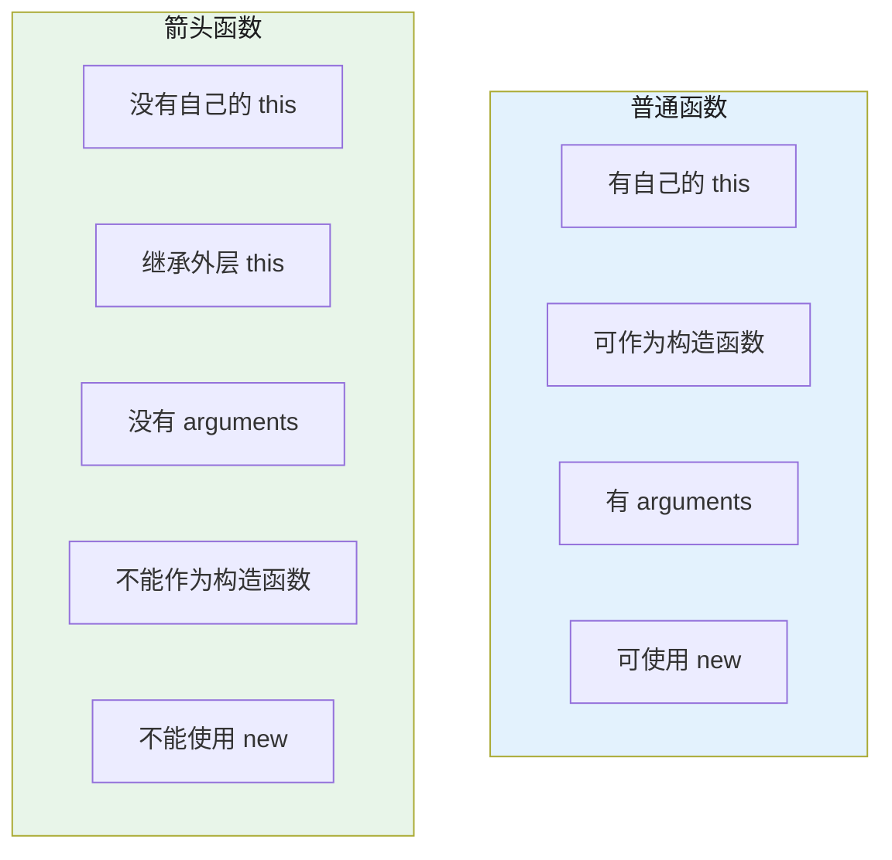

# this 指向与函数调用

## 1. this 指向

### 1.1 this 指向规则

```javascript
// 规则1：普通函数调用（默认绑定）
function fn() { console.log(this); }
fn(); // 全局对象（严格模式下undefined）

// 规则2：对象方法调用（隐式绑定）
const obj = {
  name: "obj",
  say() { console.log(this.name); }
};
obj.say(); // "obj"（this指向obj）

// 规则3：call/apply/bind（显式绑定）
function greet(place) { console.log(`${this.name}来自${place}`); }
const p = { name: "张三" };
greet.call(p, "北京"); // this指向p

// 规则4：new调用（构造器绑定）
function Person(name) { this.name = name; }
const p2 = new Person("李四");
console.log(p2.name); // "李四"，this指向新对象

// 规则5：箭头函数（词法绑定，继承外层this）
const arrow = () => console.log(this);
const obj2 = {
  name: "obj2",
  say() {
    const inner = () => console.log(this.name);
    inner(); // this继承say的this，即obj2
  }
};
obj2.say(); // "obj2"

// this优先级：new > bind > call/apply > 对象调用 > 默认
```

### 1.2 箭头函数为什么没有 this

```javascript
// 箭头函数没有自己的this，也没有arguments、super等
// 它在创建时就绑定了外层作用域的this，之后不可改变

function Timer() {
  this.time = 0;
  setInterval(() => {
    this.time++; // this继承Timer构造的实例
    console.log(this.time);
  }, 1000);
}
new Timer();

// 对比普通函数：
function Timer2() {
  this.time = 0;
  setInterval(function() {
    // 这里的this指向window（或undefined）
    // this.time++; // 报错
  }, 1000);
}
```



## 2. new 操作符原理

```javascript
// new Person("张三", 18) 做了什么：
// 1. 创建新对象 {}
// 2. 原型绑定：__proto__ = Person.prototype
// 3. this绑定：执行构造函数，this指向新对象
// 4. 返回值：如果构造函数返回对象则用返回值，否则返回新对象

function _new(Constructor, ...args) {
  // 1. 创建新对象，绑定原型
  const obj = Object.create(Constructor.prototype);
  // 2. 调用构造函数，绑定this
  const result = Constructor.apply(obj, args);
  // 3. 返回：如果返回值是对象/函数就返回它，否则返回新对象
  return result instanceof Object ? result : obj;
}

// 验证：
function Person(name, age) {
  this.name = name;
  this.age = age;
}
Person.prototype.greet = function() {
  return `我是${this.name}，${this.age}岁`;
};

const p = _new(Person, "张三", 18);
console.log(p.name);  // 张三
console.log(p.greet()); // 我是张三，18岁
console.log(p instanceof Person); // true

// 手动实现new：
function myNew(Ctor, ...args) {
  if (typeof Ctor !== 'function') throw new TypeError('not a function');
  const target = Object.create(Ctor.prototype);
  const result = Ctor.apply(target, args);
  return result !== null && typeof result === 'object' ? result : target;
}
```

## 3. call / apply / bind

```javascript
// call：调用函数，this指向第一个参数，其余参数逐个传递
function say(greeting, punct) {
  console.log(`${greeting}, I'm ${this.name}${punct}`);
}
say.call({ name: "张三" }, "你好", "！"); // 你好, I'm 张三！

// apply：调用函数，this指向第一个参数，其余参数用数组
say.apply({ name: "李四" }, ["您好", "。"]); // 您好, I'm 李四。

// bind：返回新函数，this永久绑定到第一个参数
const bound = say.bind({ name: "王五" });
bound("hello", "?"); // hello, I'm 王五?
// 后续call/apply无法覆盖bind绑定的this
bound.call({ name: "无效" }, "hi", "!"); // hello, I'm 王五!

// 手写call：
Function.prototype.myCall = function(context = window, ...args) {
  if (context === null || context === undefined) context = window;
  // 避免key冲突，用Symbol
  const fn = Symbol('fn');
  // 把当前函数（this）挂到context上
  context[fn] = this;
  // 调用它
  const result = context[fn](...args);
  // 清理
  delete context[fn];
  return result;
};

// 手写apply（类似call，只是参数格式不同）：
Function.prototype.myApply = function(context = window, args = []) {
  if (context === null || context === undefined) context = window;
  const fn = Symbol('fn');
  context[fn] = this;
  const result = context[fn](...args);
  delete context[fn];
  return result;
};

// 手写bind（返回新函数）：
Function.prototype.myBind = function(context = window, ...bindArgs) {
  const originalFn = this;
  function boundFn(...callArgs) {
    // new调用时，this指向实例，忽略context
    const isNew = this instanceof originalFn;
    const finalThis = isNew ? this : (context || window);
    return originalFn.apply(finalThis, [...bindArgs, ...callArgs]);
  }
  // 继承原型属性
  function Empty() {}
  Empty.prototype = originalFn.prototype;
  boundFn.prototype = new Empty();
  return boundFn;
};
```

## 深入阅读与参考

!!! tip "怎么用这些资料"
    先读「官方文档与规范」建立准确的概念，再读「源码与示例」核对细节，最后用「教程、书籍与视频」换一种讲法加深理解。每条都写明了读哪一节、带着什么问题读。

### 官方文档与规范

| 资源 | 为什么读 | 怎么读 |
|---|---|---|
| [this](https://developer.mozilla.org/en-US/docs/Web/JavaScript/Reference/Operators/this) | 系统列出 this 的全部绑定规则，是本章最权威的基准。 | 重点读“函数上下文”与箭头函数两节，逐条对照示例输出，再自己改写一遍。 |
| [new](https://developer.mozilla.org/en-US/docs/Web/JavaScript/Reference/Operators/new) | 按步骤讲清 new 如何建对象、绑 this、定返回值。 | 读“描述”中的四个步骤与返回对象示例，据此手写一个 myNew 实现。 |
| [Function.prototype.call()](https://developer.mozilla.org/en-US/docs/Web/JavaScript/Reference/Global_Objects/Function/call) | call 的入参与 this 指定方式，是理解显式绑定的起点。 | 读语法与示例，注意首参为 null 时的行为，再与 apply 逐项对比。 |
| [Function.prototype.apply()](https://developer.mozilla.org/en-US/docs/Web/JavaScript/Reference/Global_Objects/Function/apply) | apply 的参数数组形式，与 call 成对理解最省力。 | 读参数说明与示例，看类数组参数如何展开，动手改写成 call 版本。 |
| [Function.prototype.bind()](https://developer.mozilla.org/en-US/docs/Web/JavaScript/Reference/Global_Objects/Function/bind) | bind 产生硬绑定函数，说明 this 一旦确定不可再改。 | 读“描述”与偏函数示例，实测 bind 结果再被 call 覆盖会怎样。 |
| [Reflect.apply()](https://developer.mozilla.org/en-US/docs/Web/JavaScript/Reference/Global_Objects/Reflect/apply) | 函数式写法暴露 apply 本质：目标、this 与参数列表。 | 对照 Function.prototype.apply 阅读，把一段 apply 调用改写为 Reflect.apply。 |
| [TypeError: class constructors must be invoked with 'new'](https://developer.mozilla.org/en-US/docs/Web/JavaScript/Reference/Errors/Class_ctor_no_new) | 解释 class 必须 new 调用，反推 new 的不可替代性。 | 读报错原因与示例，思考 class 为何不能像普通函数那样直接调用。 |
| [ReferenceError: must call super constructor before using 'this' in derived class constructor](https://developer.mozilla.org/en-US/docs/Web/JavaScript/Reference/Errors/Super_not_called) | 说明派生类中 this 的初始化时机与 super() 的关系。 | 读示例代码，注意 super() 调用前后访问 this 的差别及报错位置。 |
| [TypeError: calling a builtin X constructor without new is forbidden](https://developer.mozilla.org/en-US/docs/Web/JavaScript/Reference/Errors/Builtin_ctor_no_new) | 内置构造函数必须 new 调用，印证 new 的特殊语义。 | 读报错示例，对比同功能普通函数调用写法，理解差异来源。 |
| [SyntaxError: super() is only valid in derived class constructors](https://developer.mozilla.org/en-US/docs/Web/JavaScript/Reference/Errors/Bad_super_call) | super() 只能出现在派生类构造器，配套理解 this 的诞生。 | 读示例与规则说明，配合 super 报错页理清继承链中 this 的赋值顺序。 |

### 源码与示例

| 资源 | 为什么读 | 怎么读 |
|---|---|---|
| [handler.apply()](https://developer.mozilla.org/en-US/docs/Web/JavaScript/Reference/Global_Objects/Proxy/Proxy/apply) | Proxy 的 apply 陷阱用可运行示例展示调用转发过程。 | 读示例，在陷阱里打印 target、thisArg、argumentsList 观察实参。 |

### 教程、书籍与视频

| 资源 | 为什么读 | 怎么读 |
|---|---|---|
| [YDKJS：Get Started](https://github.com/getify/You-Dont-Know-JS/tree/2nd-ed/get-started) | YDKJS 对 this 与原型链的讲解深入浅出，适合打底。 | 读 this 相关章节，做笔记并回答章末复习题，整理成自己的判断流程。 |

## 应用与行业实践

### 应用场景地图

| 场景 | 用到本页哪个知识点 | 典型技术选型 | 注意事项 |
| --- | --- | --- | --- |
| 后台管理的万行表格，行内带编辑、删除按钮 | 事件委托回调里的 this 指向挂监听器的元素 | 原生 addEventListener + dataset | 用 e.currentTarget 定位，不要依赖 this |
| 低端安卓首屏的初始化脚本 | new 的隐式绑定、构造函数返回值 | ES5 构造函数 / class | 构造函数返回对象会覆盖 this |
| 多人协作白板的重绘回调 | 回调丢失 this、bind | requestAnimationFrame + class | 构造时 bind 一次，不要每帧重建 |
| 微信小程序页面的定时器回调 | 严格模式下普通调用的 this 是 undefined | Page 对象 + setInterval | 在回调外层保留页面实例引用 |
| 一套校验逻辑复用到两套表单 | call / apply 显式指定宿主 | 原生函数 + 插件约定 | 文档写明 this 需要哪些字段 |
| Node.js 里把 arguments 转成数组 | call / apply 借用数组方法 | Array.prototype.slice.call | 新代码直接用 Array.from |
| React 类组件的事件处理函数 | 把方法当回调外传时 this 丢失 | class 组件 + 构造函数 bind | 箭头函数属性每个实例新建一个函数 |
| Web Components 的生命周期回调 | 浏览器以元素实例为 this 调用 | customElements.define + class | 生命周期回调不要写成箭头函数属性 |
| 埋点 SDK 给业务方传上下文 | call 指定回调的 this | 自研 SDK 的回调约定 | 把上下文当参数传，回调里不依赖 this |

### 三个场景拆解

#### 场景 1：后台管理的万行表格行内按钮

**业务背景**：列表默认渲染上万行，每行有编辑、删除、查看三个按钮。若每个按钮都挂监听，可交互前的注册成本随行数线性上涨。痛点表现为滚动发涩、点击响应延迟。

**怎么用本页知识解决**：先明确监听器挂在哪个元素上，this 就指向哪个元素，再改成在父容器上挂一次，用事件对象找按钮，把行标识当参数传下去。

```js
// 只在表格容器上挂一次点击监听
table.addEventListener('click', function (e) {
  const btn = e.target.closest('[data-action]'); // 从点击目标向上找按钮
  if (!btn) return;                              // 点到空白处直接返回
  const row = btn.closest('tr');                 // 找到按钮所在的行
  const id = row.dataset.id;                     // 行主键，来自 data-id
  const action = btn.dataset.action;             // 动作名，来自 data-action
  // 这里的 this 是 table（挂监听器的元素），不是按钮
  handleAction(action, id, table);               // 显式传参，绕开 this
});
```

- 监听器数量从"行数乘按钮数"降到 1 个，注册成本与行数脱钩。
- this 指向绑定监听器的 table，所以按钮位置要用 e.target.closest 拿。
- 行标识与动作名走参数通道，读函数时不用回溯监听源。
- 按钮内部再加图标或文字节点，closest 仍能找到按钮，不会因结构变化失效。
- 若用箭头函数写回调，this 来自外层作用域，与监听元素无关，不要混用两种预期。

**怎么度量收益**：用 Chrome DevTools 的 Elements 面板右侧 Event Listeners 数条数，改前改后各记一次。用 Performance 面板录制一次滚动加点击，对比主线程长任务条数。用 PerformanceObserver 采集 click 的 input delay 分布。

**什么时候不该用**：表格只有一屏行数、按钮行为各自独立时，委托反而增加定位成本。按钮需要 stopPropagation 阻断父级行为时，委托会改变冒泡路径。DOM 由第三方组件渲染、结构不承诺稳定时，closest 的选择器容易失效。

#### 场景 2：多人协作白板的画布重绘

**业务背景**：白板同一时刻有数十个光标位置和正在绘制的笔迹，重绘每秒触发几十次。回调从 WebSocket 消息和 requestAnimationFrame 两处进入。this 丢失会让状态读不到，表现为画布空白或笔迹停在旧位置。

**怎么用本页知识解决**：把画布状态放进类实例，在构造函数里把渲染方法 bind 到实例，之后这个方法可以像普通函数一样传给任何回调。

```js
class Whiteboard {
  constructor(canvas) {
    this.ctx = canvas.getContext('2d');   // 绘制上下文挂在实例上
    this.strokes = [];                    // 笔迹数组是重绘的唯一数据源
    this.render = this.render.bind(this); // 构造时固定 this，只做一次
  }
  render() {
    const { ctx } = this;                 // 每帧只从实例读状态
    ctx.clearRect(0, 0, ctx.canvas.width, ctx.canvas.height);
    for (const s of this.strokes) this.drawStroke(s);
  }
}

const board = new Whiteboard(canvas);
socket.addEventListener('message', board.render); // 方法引用可直接当回调
requestAnimationFrame(board.render);
```

- bind 放在构造函数里，每帧复用同一个函数对象，不会持续产生新闭包。
- this 固定成实例后，方法可以交给第三方 API，不需要对方配合调用方式。
- 重绘只读 this.strokes，状态来源单一，断线重连后重放数据即可恢复画面。
- 判断第三方库怎么调用你的回调：用 fn() 调用会丢 this，用 fn.call(host) 调用则按它指定的来。
- 箭头函数属性写在 class fields 里效果接近，但每个实例都会新建一个函数。

**怎么度量收益**：用 Chrome DevTools 的 Performance 面板看 Frames 轨道是否有掉帧，并统计每帧耗时。用 PerformanceObserver 采集 longtask 与长帧的次数。用 Memory 面板做两次堆快照，比较渲染函数对象的数量是否随帧数增长。

**什么时候不该用**：绘制入口只有一个、方法从不外传时，bind 属于多余包装。每次回调需要拿到不同的宿主对象时，应把宿主当参数传，而不是换 bind 目标。

#### 场景 3：一份校验逻辑复用到两套表单

**业务背景**：同一套字段校验规则要同时服务后台配置表单和前台注册表单。两个页面的宿主对象字段名、错误文案都不同。复制两份逻辑后，规则一改就要改两处，容易漏改。

**怎么用本页知识解决**：把校验函数写成不绑死宿主的形式，用 call 或 apply 由调用方指定 this，规则本身作为参数传入。

```js
function validate(rules) {
  const host = this;                        // 宿主由调用方通过 call 指定
  const errors = [];
  for (const [field, rule] of Object.entries(rules)) {
    const value = host.values[field];       // 字段值从宿主对象读
    if (!rule(value)) errors.push(host.message(field)); // 文案也交给宿主
  }
  return errors;
}

// 后台配置表单：宿主是 formModel
const adminErrors = validate.call(formModel, adminRules);
// 前台注册表单：宿主是 registerState
const userErrors = validate.call(registerState, userRules);
```

- call 与 apply 差别只在传参形式，这里参数是一个数组，两者都能用。
- this 在这里的语义是"宿主对象"，文档要列出它必须提供 values 与 message。
- 规则表走参数，宿主走 this，两条通道分开，职责清楚。
- 宿主缺字段会在运行时报错，可在函数开头做一次形状检查，早失败。
- 若改成 validate(host, rules)，完全不碰 this，写单测时不用构造 this 上下文。
- 箭头函数不建立自己的 this，对它用 call 指定宿主无效，别在这里套用。

**怎么度量收益**：跑 Jest 的 --coverage 看校验分支的覆盖情况。用 ESLint 的 no-invalid-this 统计报错条数。记录一次规则变更需要改动几处文件，改前改后各记一次。

**什么时候不该用**：逻辑只服务一个宿主时，引入 this 约定会让调用方多读一层文档。校验里需要访问闭包中的模块级配置时，把配置当参数传比挂在 this 上更容易追踪。

### 行业先进实践

在类构造函数里绑定方法（出处：React 官方文档 Handling Events 章节）。该章节说明 class 组件的事件处理函数默认不绑定 this，需要在构造函数里 bind，或改用 class fields 箭头函数。借鉴方式：把所有"要当回调外传"的方法集中在一处 bind，调用点不再各自处理。

用 noImplicitThis 让编译器标出 this 类型（出处：TypeScript 官方文档 tsconfig 参考）。开启后，函数里使用 this 而类型无法推断会直接报错，隐式的 any this 会被暴露。借鉴方式：新建项目直接开 strict，老项目先按目录逐步打开。

用 ESLint 规则扫描 this 用法（出处：ESLint 官方规则文档，规则为 no-invalid-this 与 prefer-arrow-callback）。no-invalid-this 标出在非方法位置使用 this 的代码，prefer-arrow-callback 建议把不需要自身 this 的回调改成箭头函数。借鉴方式：把这两条加进 CI，让工具在评审前就把问题拦下。

严格模式下普通函数调用的 this 是 undefined（出处：ECMAScript 语言规范中函数对象的 [[Call]] 与 ThisMode 定义，MDN 的 this 词条有对应说明）。非严格模式下 fn() 会把 this 替换成全局对象，错误因此被掩盖；严格模式下直接是 undefined，能提前暴露。借鉴方式：模块代码默认走严格模式，需要 this 的地方一律用方法调用形式。

写插件时把 this 契约写进文档（出处：jQuery 官方文档 Plugins 页面）。该页面说明插件函数内的 this 是调用它的 jQuery 对象集合，社区据此形成约定。借鉴方式：自己写插件时，在 README 里列出 this 必须具备的字段与方法，并给出一个最小宿主示例。

Web Components 生命周期回调的 this 绑定（需核对官方文档：MDN 上 custom elements 生命周期回调的调用方式，确认 connectedCallback 等是否总以元素实例为 this，以及把这些回调改写成箭头函数属性后行为如何变化）。

### 从学到用：落地路线

第 1 步，在一个模块里试点，把依赖 this 的回调改成显式传参或构造函数 bind。验收标准：该模块的代码评审不再出现"这个 this 指向谁"的追问。

第 2 步，补上回调链路的单测，并在 CI 打开 no-invalid-this。验收标准：该规则在试点目录报错数为 0，回调触发路径有对应用例覆盖。

第 3 步，把约定写进团队代码规范，新增代码沿用同样的规则。验收标准：评审清单里有这一条，新提交不再新增隐式 this 依赖。

第 4 步，把规则设为 CI 阻断项，并在 tsconfig 打开 noImplicitThis。验收标准：故意提交一个丢失 this 的回调，CI 必须失败。

### 动手作业

**目标**：把一个列表页从"每行按钮各挂监听"改成"父容器一次监听"，并用可复现的测量说明差别。

**步骤**：

1. 选一个行数可调的列表页，把数据调到 5000 行，作为改造前的基线。
2. 用 Chrome DevTools 的 Event Listeners 面板记录监听器条数，用 Performance 录制一次滚动加点击。
3. 去掉每行按钮的独立监听，改为在表格容器上挂一次 click。
4. 处理函数里用 e.target.closest 找按钮和所在行，把行 id 与动作名当参数传下去。
5. 删除处理函数体内对 this 的依赖，改为局部变量或参数。
6. 按第 2 步同样的方法重测，记录监听器条数与长任务条数。
7. 补一条单测：模拟点击按钮内部的图标节点，断言仍取到正确的行 id。
8. 在 README 里写清这个回调里的 this 指向哪个元素、为什么不用它。

**验收标准**：

- 监听器条数从随行数增长降到固定几条，用 Event Listeners 面板可复核。
- 点击按钮内部图标节点仍能取到正确行 id，单测通过。
- 处理函数体内不出现 this 关键字。
- 重测的滚动长任务条数不比改造前多。
- README 说清 this 指向、替代方案与测量方法，他人按步骤能复现。

