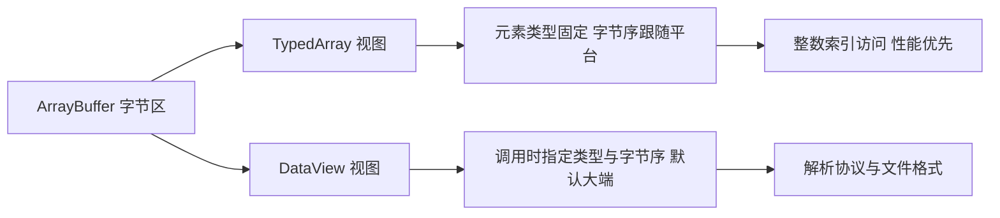

# ArrayBuffer、TypedArray 与 DataView

!!! abstract "核心结论"

    - ArrayBuffer 只是"一块定长字节内存 + 元数据"，本身没有任何读写方法；所有读写都必须通过视图（TypedArray / DataView）完成，视图不持有数据，只持有 `[[ViewedArrayBuffer]] + byteOffset + length + 元素类型`。
    - TypedArray 不是类，而是所有具体视图（Uint8Array、Int32Array、Float64Array、BigInt64Array 等）的抽象超类 `%TypedArray%`；它的字节序由**运行平台**决定（现实世界几乎全是 little-endian），而 DataView 每次调用都显式指定字节序，且**省略参数时默认 big-endian**。
    - `subarray` / `new Uint8Array(buffer, off, len)` 是共享内存的视图；`slice` / `new Uint8Array(typedArray)` / `structuredClone` 是拷贝；`ArrayBuffer.prototype.transfer` 与 `postMessage` 的 transfer list 是零拷贝移交所有权，移交后源 buffer 立即 detached。
    - 二进制协议解析的工程核心是三件事：固定字节序（网络序 big-endian）、定长头 + 变长体、以及在流式场景下用"半包判断"返回 `need` 而不是抛错；再叠加 varint / zigzag / 位图 / 环形缓冲这几个原语即可覆盖绝大多数场景。
    - Float32 只有 24 位有效二进制位（约 7.22 位十进制），`0.1` 存进去再读出来是 `0.10000000149011612`；NaN 在 IEEE 754 中有大量合法位模式，引擎内部常用这些空闲位模式做"NaN 装箱"来编码非 double 值，因此 NaN 的 payload 不可依赖。

## 1. 内存模型：ArrayBuffer 是字节容器，视图是解释器

### 1.1 ArrayBuffer 的本质与元数据

从规范角度，一个 ArrayBuffer 实例内部只有两个槽：`[[ArrayBufferData]]`（指向一块原始字节内存，或 `null` 表示已 detached）和 `[[ArrayBufferByteLength]]`。规范里定义的操作只有 `IsDetachedBuffer`、`DetachArrayBuffer`、`CloneArrayBuffer`、`ArrayBufferByteLength` 这类内存管理操作，**没有任何按偏移读写的抽象操作**。这就是为什么 `new ArrayBuffer(8)[0]` 永远是 `undefined`。

引擎层面（以 V8 为例），`ArrayBuffer` 的 backing store 由 `BackingStore` 对象持有，实际分配在 ArrayBuffer allocator（大块走 `malloc`/`mmap`，小对象走分区分配），GC 只负责释放 `BackingStore` 的引用，不扫描这块内存里的内容。因此：

- 创建一个 100MB 的 ArrayBuffer 不会让 GC 压力线性上升（内容里没有指针，不需要标记）；
- 但 ArrayBuffer 本身仍是一个堆对象，会占用 GC 图中的一个节点；
- 大 ArrayBuffer 在 V8 中可能被"外部化"（external backing store），`ArrayBuffer.prototype.slice` 会走一次真正的 memcpy。

至于数组元素是否连续、是否有边界检查：现代引擎对 TypedArray 的访问会做 bounds check，并在一定条件下消除（JIT 的 bounds check elimination）；越界读在**TypedArray 上返回 `undefined`**（因为它走的是整数索引 exotic 语义），而 DataView 越界**抛 RangeError**，这是一个高频混淆点。

### 1.2 TypedArray 与 DataView 的分工

两者都是视图，区别在于"解释方式"由谁决定：

- TypedArray：元素类型在构造时固定，字节序跟随平台，访问是整数索引 `view[i]`，性能最高，适合批量数值计算、图像/音频处理、和 C/WASM 内存交互。
- DataView：不固定类型，每次调用显式给方法名（`getUint32`）和字节序，适合解析网络协议、文件格式这类"字段类型不一致、字节序被规范强制"的场景。



### 1.3 三层结构对比

| 维度 | ArrayBuffer / SharedArrayBuffer | TypedArray（如 Uint16Array） | DataView |
| :--- | :--- | :--- | :--- |
| 是否持有数据 | 持有 | 不持有，引用 buffer | 不持有，引用 buffer |
| 元素类型 | 无类型（纯字节） | 构造时固定 | 每次调用指定 |
| 字节序 | 无概念 | 跟随平台（实测几乎都是 little-endian） | 每次调用指定，省略时 big-endian |
| 越界读行为 | 不适用 | 返回 `undefined` | 抛 `RangeError` |
| 越界写行为 | 不适用 | 静默丢弃（no-op） | 抛 `RangeError` |
| 主要用途 | 内存分配与所有权管理 | 批量数值运算、WASM 内存 | 协议/文件字段解析 |
| 可 transfer | 是（SharedArrayBuffer 除外） | 视其 buffer 而定 | 视其 buffer 而定 |

## 2. TypedArray 的精确语义

### 2.1 构造与 offset/length：字节 vs 元素

三种构造形式必须分清：

```js
// 运行环境：Node.js 18+ / 现代浏览器
// 文件：view-basics.mjs

function hex(u8) {
  return Array.from(u8, (b) => b.toString(16).padStart(2, '0')).join(' ');
}

const buf = new ArrayBuffer(8);

// 形式一：new Uint8Array(length) —— 自己分配一块 length 字节的 buffer
const own = new Uint8Array(8);
console.assert(own.buffer.byteLength === 8);
console.assert(own.byteOffset === 0 && own.length === 8);

// 形式二：new Uint8Array(buffer) —— 覆盖整块 buffer，共享内存（零拷贝）
const all = new Uint8Array(buf);
all.set([1, 2, 3, 4, 5, 6, 7, 8]);
console.assert(hex(all) === '01 02 03 04 05 06 07 08');

// 形式三：new Uint16Array(buffer, byteOffset, length) ——
// byteOffset 的单位是「字节」，length 的单位是「元素个数」
const u16 = new Uint16Array(buf, 4, 2); // 覆盖字节 4..7，共 2 个 16 位元素
console.assert(u16.byteOffset === 4);
console.assert(u16.length === 2);
console.assert(u16.byteLength === 4);
console.assert(u16.buffer === buf); // 同一个 buffer 对象，零拷贝

// byteOffset 必须是 BYTES_PER_ELEMENT 的整数倍，否则 RangeError
let threw = false;
try {
  new Uint16Array(buf, 1, 1); // 1 不是 2 的倍数
} catch (e) {
  threw = e instanceof RangeError;
}
console.assert(threw === true, 'byteOffset 未对齐必须抛 RangeError');

// BYTES_PER_ELEMENT 是构造器上的静态属性，也是实例上的常量属性
console.assert(Uint8Array.BYTES_PER_ELEMENT === 1);
console.assert(Int32Array.BYTES_PER_ELEMENT === 4);
console.assert(Float64Array.BYTES_PER_ELEMENT === 8);
console.assert(u16.BYTES_PER_ELEMENT === 2);

// 共享验证：通过 u16 写入，通过 all 读到的是同一块内存
u16[0] = 0x0102;
console.assert(all[4] === 0x02 || all[4] === 0x01, 'u16[0] 落在字节 4..5');
```

**验证标准**：直接 `node view-basics.mjs`，预期输出为空（所有 `console.assert` 通过）。注意最后一行断言刻意不依赖字节序，只验证"写 u16 影响了字节 4 和 5"。

### 2.2 共享与拷贝：一张必须背下来的语义表

| 表达式 | 是否共享原内存 | 说明 |
| :--- | :--- | :--- |
| `new Uint8Array(buffer)` | 共享 | 视图，零拷贝 |
| `new Uint8Array(buffer, off, len)` | 共享 | 视图，零拷贝 |
| `typedArray.subarray(a, b)` | 共享 | 返回同 buffer 上的新视图 |
| `typedArray.slice(a, b)` | 拷贝 | 新 buffer，新内存 |
| `new Uint8Array(typedArray)` | 拷贝 | 走迭代/元素复制路径 |
| `Uint8Array.from(typedArray)` | 拷贝 | 同上 |
| `structuredClone(ab)` | 拷贝 | 深拷贝，返回新的 ArrayBuffer |
| `ab.slice(0)` | 拷贝 | ArrayBuffer 级拷贝 |
| `ab.transfer(n)` | 移交（零拷贝或一次重分配） | 源被 detached |
| `postMessage(p, [ab])` | 移交 | 源被 detached |
| `postMessage(p, ab)`（无 transfer） | 拷贝 | 源保持可用 |
| `Buffer.from(arrayBuffer, off, len)` | 共享 | Node.js 特有 |
| `Buffer.from(typedArray)` | 拷贝 | 元素级复制 |

```js
// 运行环境：Node.js 18+ / 现代浏览器
// 文件：share-vs-copy.mjs

const u8 = new Uint8Array([1, 2, 3, 4, 5]);

// subarray 共享
const sub = u8.subarray(1, 4);   // [2,3,4]
sub[0] = 0xff;
console.assert(u8[1] === 0xff, 'subarray 与父视图共享内存');
console.assert(sub.buffer === u8.buffer);

// slice 拷贝
const cp = u8.slice(1, 4);       // [0xff,3,4]
cp[0] = 0x00;
console.assert(u8[1] === 0xff, 'slice 是拷贝，修改互不影响');
console.assert(cp.buffer !== u8.buffer);

// 构造器拷贝
const cloned = new Uint8Array(u8);
cloned[0] = 0x99;
console.assert(u8[0] === 1);

// structuredClone 拷贝整个 buffer
const raw = new ArrayBuffer(4);
new Uint8Array(raw)[0] = 7;
const clone = structuredClone(raw);
new Uint8Array(clone)[0] = 8;
console.assert(new Uint8Array(raw)[0] === 7);
console.assert(clone !== raw && clone.byteLength === 4);

// set 写入：跨类型时按元素（不是按字节）逐个转换
const dst = new Uint8Array(3);
dst.set(new Uint8Array([200, 201, 202]));
console.assert(dst.join(',') === '200,201,202');

// 同一 buffer 上的重叠 set：规范要求表现为「先读后写」的 memmove 语义，
// 具体实现细节需核对最新规范文本与目标引擎，工程上建议显式 slice 一份临时数据。
const overlap = new Uint8Array([1, 2, 3, 4, 5]);
overlap.set(overlap.subarray(0, 4), 1);
console.assert(overlap.join(',') === '1,1,2,3,4');
```

**验证标准**：`node share-vs-copy.mjs`，预期无输出。若某引擎在重叠 `set` 上给出 `1,2,3,4,4` 之类的 memcpy 行为，说明该实现未按规范做临时复制（这属于需要核对的边界行为，不应当作为依赖项）。

### 2.3 数值转换与溢出规则

TypedArray 写入时的转换规则完全由 `ToIntN` / `ToUintN` / `ToUint8Clamp` 三个抽象操作定义。核心是"先 `ToNumber`，非有限值归零，然后对 2^N 取模，最后按有符号/无符号解释"。

| 写入值 | `Int8Array` | `Uint8Array` | `Uint8ClampedArray` | `Int32Array` |
| :--- | ---: | ---: | ---: | ---: |
| `1.9` | 1 | 1 | 2 | 1 |
| `-1.9` | -1 | 255 | 0 | -1 |
| `2.5` | 2 | 2 | 2 | 2 |
| `127` | 127 | 127 | 127 | 127 |
| `128` | -128 | 128 | 128 | 128 |
| `255` | -1 | 255 | 255 | 255 |
| `256` | 0 | 0 | 255 | 256 |
| `-129` | 127 | 127 | 0 | -129 |
| `NaN` | 0 | 0 | 0 | 0 |
| `Infinity` | 0 | 0 | 255 | 0 |
| `-Infinity` | 0 | 0 | 0 | 0 |

`Uint8ClampedArray` 是唯一采用"钳位 + 四舍六入五成双（round half to even）"的类型，它专为 Canvas `ImageData` 设计。

### 2.4 手写实现：`ToIntN` / `ToUintN` / `ToUint8Clamp`

```js
// 运行环境：Node.js 18+ / 现代浏览器
// 文件：to-int-n.mjs
// 手写简化实现：整数类 TypedArray 的写入转换语义（不含 BigInt 视图与 IEEE 754 视图）

function toUintN(value, bits) {
  const num = Number(value);
  if (!Number.isFinite(num)) return 0; // NaN / +-Infinity -> 0
  const mod = 2 ** bits;
  const t = Math.trunc(num); // 向零截断
  const m = t % mod;         // fmod 对 double 是精确运算
  const u = m < 0 ? m + mod : m;
  return u === 0 ? 0 : u;    // 把 -0 归一为 +0
}

function toIntN(value, bits) {
  const u = toUintN(value, bits);
  const half = 2 ** (bits - 1);
  return u >= half ? u - 2 ** bits : u;
}

function toUint8Clamp(value) {
  const num = Number(value);
  if (Number.isNaN(num) || num <= 0) return 0;
  if (num >= 255) return 255;
  const f = Math.floor(num);
  if (f + 0.5 < num) return f + 1;
  if (num < f + 0.5) return f;
  return f % 2 === 0 ? f : f + 1; // 恰好落在中点时取偶数
}

// ---- 与真实 TypedArray 逐一对照 ----
const intCases = [0, 1, -1, 127, 128, 255, 256, 257, -129, 1.9, -1.9, 32768, 65535, NaN, Infinity, -Infinity, 1e21];

for (const c of intCases) {
  console.assert(new Uint8Array([c])[0] === toUintN(c, 8), `Uint8 ${c}`);
  console.assert(new Int8Array([c])[0] === toIntN(c, 8), `Int8 ${c}`);
  console.assert(new Uint16Array([c])[0] === toUintN(c, 16), `Uint16 ${c}`);
  console.assert(new Int16Array([c])[0] === toIntN(c, 16), `Int16 ${c}`);
  console.assert(new Uint32Array([c])[0] === toUintN(c, 32), `Uint32 ${c}`);
  console.assert(new Int32Array([c])[0] === toIntN(c, 32), `Int32 ${c}`);
}

const clampCases = [0, 0.5, 1.5, 2.5, 3.5, 254.5, 255.5, -1, 300, NaN, Infinity, -Infinity];
for (const c of clampCases) {
  console.assert(new Uint8ClampedArray([c])[0] === toUint8Clamp(c), `Clamp ${c}`);
}

// 抽样断言具体数值，便于阅读时自检
console.assert(toUintN(256, 8) === 0);
console.assert(toUintN(-1, 8) === 255);
console.assert(toUintN(1e21, 8) === 0);
console.assert(toIntN(128, 8) === -128);
console.assert(toIntN(-129, 8) === 127);
console.assert(toIntN(32768, 16) === -32768);
console.assert(toUint8Clamp(2.5) === 2);
console.assert(toUint8Clamp(1.5) === 2);
console.assert(toUint8Clamp(Infinity) === 255);
console.assert(toUint8Clamp(-Infinity) === 0);
```

**验证标准**：`node to-int-n.mjs`，预期输出为空。若任一断言失败，说明手写实现与当前引擎的转换语义出现偏差；此时应优先检查 `Math.trunc` 是否漏掉（`-1.9` 会退化成 254 而不是 255）。

## 3. 可调整大小、transfer 与 detach

### 3.1 resize：可调整大小的 ArrayBuffer

可调整大小 ArrayBuffer（resizable ArrayBuffer）允许在创建时给出 `maxByteLength`，之后通过 `resize` 增减长度。关键语义：

- 已有视图会**自动跟随**新的 byteLength（因为视图只存了 byteOffset，读取时按 buffer 当前长度截断）；
- 缩小后再放大，中间那段字节会被**清零**；
- 超出 `maxByteLength` 抛 `RangeError`；对固定长度 buffer 调用 `resize` 抛 `TypeError`；
- `resizable` 与 `maxByteLength` 是访问器属性。

### 3.2 transfer：零拷贝移交所有权

`ArrayBuffer.prototype.transfer(newLength)` 与 `transferToFixedLength(newLength)` 在规范层面把源 buffer 置为 detached，并把 `[[ArrayBufferData]]` 交给新 buffer；只有目标长度与源长度相同时才是纯零拷贝，不同长度会触发一次分配 + 复制。`postMessage(payload, { transfer: [ab] })` 走的是同一套移交语义。

请注意版本可用性：可调整大小 ArrayBuffer、`transfer`、`transferToFixedLength`、`detached`、`detach()` 属于较新的 TC39 提案，各运行时/引擎的实现进度不同，**具体可用版本需核对官方文档**。下面的代码全部做特性检测。

```js
// 运行环境：Node.js 18+ / 现代浏览器
// 文件：resizable-transfer.mjs
// 若某特性不可用，对应断言自动跳过并在末尾打印提示

const support = {
  resize: typeof ArrayBuffer.prototype.resize === 'function',
  transfer: typeof ArrayBuffer.prototype.transfer === 'function',
  detached: 'detached' in ArrayBuffer.prototype,
  detach: typeof ArrayBuffer.prototype.detach === 'function',
};

if (support.resize) {
  const ab = new ArrayBuffer(4, { maxByteLength: 16 });
  console.assert(ab.resizable === true);
  console.assert(ab.maxByteLength === 16);
  console.assert(ab.byteLength === 4);

  const v = new Uint8Array(ab);
  v.set([1, 2, 3, 4]);
  console.assert(v.length === 4);

  ab.resize(8);
  console.assert(ab.byteLength === 8);
  console.assert(v.length === 8, '已有视图自动跟随新长度');
  console.assert(v[0] === 1 && v[7] === 0, '新增字节为 0');

  ab.resize(2);
  console.assert(v.length === 2, '视图被截断');

  ab.resize(8);
  console.assert(v[0] === 1 && v[2] === 0, '缩小再放大后中间字节被清零');

  let threw = false;
  try {
    ab.resize(32);
  } catch (e) {
    threw = e instanceof RangeError;
  }
  console.assert(threw === true, '超过 maxByteLength 抛 RangeError');

  // 固定长度 buffer 不能 resize
  const fixed = new ArrayBuffer(4);
  threw = false;
  try {
    fixed.resize(8);
  } catch (e) {
    threw = e instanceof TypeError;
  }
  console.assert(threw === true, '固定长度 buffer 调用 resize 抛 TypeError');
}

if (support.transfer) {
  const src = new ArrayBuffer(8);
  new Uint8Array(src).set([1, 2, 3, 4, 5, 6, 7, 8]);

  const dst = src.transfer(); // 同长度，纯零拷贝移交
  console.assert(dst.byteLength === 8);
  console.assert(new Uint8Array(dst).join(',') === '1,2,3,4,5,6,7,8');
  if (support.detached) {
    console.assert(src.byteLength === 0 && src.detached === true, '源被 detached');
  }

  const src2 = new ArrayBuffer(8);
  new Uint8Array(src2).set([1, 2, 3, 4, 5, 6, 7, 8]);
  // 视图必须在 transfer 之前创建：在已 detach 的 buffer 上构造新视图会直接抛 TypeError
  const view = new Uint8Array(src2);
  const dvOld = new DataView(src2);
  const shrunk = src2.transfer(3); // 长度变化 -> 一次分配 + 复制
  console.assert(shrunk.byteLength === 3);
  console.assert(new Uint8Array(shrunk).join(',') === '1,2,3');

  // 已有视图在源 detach 之后长度变为 0，按下标取值得到 undefined
  console.assert(view.length === 0);
  console.assert(view[0] === undefined);

  // 在已 detach 的 buffer 上构造新视图：TypeError
  let constructThrew = false;
  try { new Uint8Array(src2); } catch (e) { constructThrew = e instanceof TypeError; }
  console.assert(constructThrew === true, 'detached buffer 不能再创建视图');

  // 已有 DataView 在 buffer detach 后读取：TypeError
  let threw = false;
  try {
    dvOld.getUint8(0);
  } catch (e) {
    threw = e instanceof TypeError;
  }
  console.assert(threw === true, 'detached 之后的 DataView 读取必须抛 TypeError');

  // 没有被 detach 的 dst 仍可正常读取
  const dv = new DataView(dst);
  console.assert(dv.getUint8(0) === 1);
  dst.transfer(); // 现在 dst 也被 detach，已有的 dv 随之失效
  threw = false;
  try {
    dv.getUint8(0);
  } catch (e) {
    threw = e instanceof TypeError;
  }
  console.assert(threw === true, 'detached buffer 上的 DataView 取值抛 TypeError');
}

if (support.detach) {
  const ab = new ArrayBuffer(8);
  ab.detach();
  console.assert(ab.byteLength === 0);
  if (support.detached) console.assert(ab.detached === true);
}

console.log('feature support:', JSON.stringify(support));
```

**验证标准**：`node resizable-transfer.mjs`，预期最后一行输出形如 `feature support: {"resize":true,"transfer":true,"detached":true,"detach":true}`（具体 true/false 取决于运行时版本，**需核对官方文档**）。除该行之外不应有任何输出；任一 `console.assert` 失败都会打印 Assertion failed 详情。

### 3.3 手写实现：OwnedBuffer 所有权模型

```js
// 运行环境：Node.js 18+ / 现代浏览器（使用 class 私有字段 #）
// 文件：owned-buffer.mjs
// 手写简化实现：用「所有权 + 引用计数为 1 的假设」模拟零拷贝 transfer 与 detach。
// 说明：这不是真正的内存 detach，源对象持有的 ArrayBuffer 对象被丢弃，
//       真实 ArrayBuffer.prototype.transfer 会把源对象本身置为 detached。

class OwnedBuffer {
  #buf;

  #detached = false;

  constructor(byteLength) {
    if (!Number.isInteger(byteLength) || byteLength < 0) {
      throw new RangeError('byteLength must be a non-negative integer');
    }
    this.#buf = new ArrayBuffer(byteLength);
  }

  get detached() {
    return this.#detached;
  }

  get byteLength() {
    return this.#detached ? 0 : this.#buf.byteLength;
  }

  get view() {
    if (this.#detached) throw new TypeError('Cannot access view of a detached buffer');
    return new Uint8Array(this.#buf);
  }

  detach() {
    this.#detached = true;
    this.#buf = null;
  }

  // 移交所有权给一个新的 OwnedBuffer
  transfer(newByteLength = this.byteLength) {
    if (this.#detached) throw new TypeError('Cannot transfer a detached buffer');
    const oldBuf = this.#buf;

    let nextBuf;
    if (newByteLength === oldBuf.byteLength) {
      nextBuf = oldBuf; // 纯移交，零拷贝
    } else {
      nextBuf = new ArrayBuffer(newByteLength);
      const n = Math.min(newByteLength, oldBuf.byteLength);
      new Uint8Array(nextBuf).set(new Uint8Array(oldBuf, 0, n));
    }

    this.detach(); // 源失去所有权

    const out = new OwnedBuffer(0);
    out.#buf = nextBuf; // 直接接管同一块内存
    out.#detached = false;
    return out;
  }
}

// ---- 验证 ----
const a = new OwnedBuffer(4);
a.view.set([1, 2, 3, 4]);
console.assert(a.byteLength === 4 && a.detached === false);

const b = a.transfer(4); // 同长度：零拷贝
console.assert(a.detached === true && a.byteLength === 0);
console.assert(b.detached === false && b.byteLength === 4);
console.assert(Array.from(b.view).join(',') === '1,2,3,4');

let threw = false;
try {
  a.view;
} catch (e) {
  threw = e instanceof TypeError;
}
console.assert(threw === true, 'detached 后访问视图抛 TypeError');

threw = false;
try {
  a.transfer();
} catch (e) {
  threw = e instanceof TypeError;
}
console.assert(threw === true, 'detached 后再次 transfer 抛 TypeError');

const c = b.transfer(2); // 缩短：一次分配 + 复制
console.assert(b.detached === true);
console.assert(c.byteLength === 2);
console.assert(Array.from(c.view).join(',') === '1,2');

c.detach();
console.assert(c.byteLength === 0 && c.detached === true);
```

**验证标准**：`node owned-buffer.mjs`，预期输出为空。

## 4. 字节序与 DataView

### 4.1 平台字节序探测

TypedArray 的字节序由实现定义，规范没有强制。工程上必须在运行时探测，而不是假定。经典写法是用 DataView 写入一个已知的 16 位值，再按字节读回：

```js
// 运行环境：Node.js 18+ / 现代浏览器
// 文件：endianness.mjs

function hex(u8) {
  return Array.from(u8, (b) => b.toString(16).padStart(2, '0')).join(' ');
}

function detectLittleEndian() {
  const buf = new ArrayBuffer(2);
  const dv = new DataView(buf);
  dv.setUint16(0, 0x0102, true); // 显式按 little-endian 写入
  return dv.getUint8(0) === 0x02;
}

const LE = detectLittleEndian();
console.log('platform is little-endian:', LE);

// TypedArray 跟随平台字节序
const b1 = new ArrayBuffer(2);
new Uint16Array(b1)[0] = 0x0102;
if (LE) {
  console.assert(hex(new Uint8Array(b1)) === '02 01');
} else {
  console.assert(hex(new Uint8Array(b1)) === '01 02');
}

// DataView 省略 littleEndian 参数时默认 false，也就是 big-endian
const b2 = new ArrayBuffer(4);
const dv = new DataView(b2);
dv.setUint32(0, 0x01020304); // 默认大端
console.assert(hex(new Uint8Array(b2)) === '01 02 03 04');
dv.setUint32(0, 0x01020304, true); // 显式小端
console.assert(hex(new Uint8Array(b2)) === '04 03 02 01');
dv.setUint32(0, 0x01020304, false);
console.assert(hex(new Uint8Array(b2)) === '01 02 03 04');

// 单字节方法忽略字节序参数
dv.setUint8(0, 0xab);
console.assert(dv.getUint8(0) === 0xab);
console.assert(dv.getUint8(0, true) === 0xab, '单字节方法只是忽略该参数');

// DataView 越界抛 RangeError（不同于 TypedArray 返回 undefined）
let threw = false;
try {
  dv.getUint32(1);
} catch (e) {
  threw = e instanceof RangeError;
}
console.assert(threw === true, 'DataView 越界读抛 RangeError');

// TypedArray 越界读返回 undefined，越界写静默丢弃
const ta = new Uint8Array(4);
console.assert(ta[10] === undefined);
ta[10] = 1; // 不抛错，也不起作用
console.assert(ta.length === 4);
```

**验证标准**：`node endianness.mjs`，预期第一行输出 `platform is little-endian: true`（在 x86 / ARM64 的常见部署环境中），其余断言无输出。在 big-endian 平台上第一行会是 `false`，断言逻辑依然成立。

### 4.2 DataView 的完整类型清单

| 方法对 | 宽度（字节） | 说明 |
| :--- | ---: | :--- |
| `getInt8` / `setInt8` | 1 | 忽略字节序参数 |
| `getUint8` / `setUint8` | 1 | 忽略字节序参数 |
| `getInt16` / `setInt16` | 2 | 有符号 |
| `getUint16` / `setUint16` | 2 | 无符号 |
| `getInt32` / `setInt32` | 4 | 有符号 |
| `getUint32` / `setUint32` | 4 | 无符号 |
| `getFloat32` / `setFloat32` | 4 | IEEE 754 binary32 |
| `getFloat64` / `setFloat64` | 8 | IEEE 754 binary64 |
| `getBigInt64` / `setBigInt64` | 8 | 需要 BigInt，有符号 |
| `getBigUint64` / `setBigUint64` | 8 | 需要 BigInt，无符号 |

部分运行时已提供 `getFloat16` / `setFloat16`（IEEE 754 binary16），这属于较新的规范提案，**是否可用需核对官方文档**。

### 4.3 手写实现：MiniDataView

```js
// 运行环境：Node.js 18+ / 现代浏览器
// 文件：mini-dataview.mjs
// 手写简化实现：显式字节序的 16/32 位无符号读写

class MiniDataView {
  constructor(buffer, byteOffset = 0, byteLength = buffer.byteLength - byteOffset) {
    this.u8 = new Uint8Array(buffer, byteOffset, byteLength);
  }

  #check(offset, width) {
    if (!Number.isInteger(offset) || offset < 0 || offset + width > this.u8.length) {
      throw new RangeError('offset out of bounds');
    }
  }

  getUint16(offset, littleEndian = false) {
    this.#check(offset, 2);
    const a = this.u8[offset];
    const b = this.u8[offset + 1];
    return littleEndian ? (a | (b << 8)) >>> 0 : ((a << 8) | b) >>> 0;
  }

  setUint16(offset, value, littleEndian = false) {
    this.#check(offset, 2);
    const v = value >>> 0;
    if (littleEndian) {
      this.u8[offset] = v & 0xff;
      this.u8[offset + 1] = (v >>> 8) & 0xff;
    } else {
      this.u8[offset] = (v >>> 8) & 0xff;
      this.u8[offset + 1] = v & 0xff;
    }
  }

  getUint32(offset, littleEndian = false) {
    this.#check(offset, 4);
    const b0 = this.u8[offset];
    const b1 = this.u8[offset + 1];
    const b2 = this.u8[offset + 2];
    const b3 = this.u8[offset + 3];
    if (littleEndian) {
      return (b0 | (b1 << 8) | (b2 << 16) | (b3 << 24)) >>> 0;
    }
    return ((b0 << 24) | (b1 << 16) | (b2 << 8) | b3) >>> 0;
  }

  setUint32(offset, value, littleEndian = false) {
    this.#check(offset, 4);
    const v = value >>> 0;
    if (littleEndian) {
      this.u8[offset] = v & 0xff;
      this.u8[offset + 1] = (v >>> 8) & 0xff;
      this.u8[offset + 2] = (v >>> 16) & 0xff;
      this.u8[offset + 3] = (v >>> 24) & 0xff;
    } else {
      this.u8[offset] = (v >>> 24) & 0xff;
      this.u8[offset + 1] = (v >>> 16) & 0xff;
      this.u8[offset + 2] = (v >>> 8) & 0xff;
      this.u8[offset + 3] = v & 0xff;
    }
  }
}

function hex(u8) {
  return Array.from(u8, (b) => b.toString(16).padStart(2, '0')).join(' ');
}

// ---- 验证一：字节布局 ----
const ab = new ArrayBuffer(6);
const mv = new MiniDataView(ab);

mv.setUint32(0, 0x01020304, false);
console.assert(hex(new Uint8Array(ab, 0, 4)) === '01 02 03 04');
console.assert(mv.getUint32(0, false) === 0x01020304);
console.assert(mv.getUint32(0, true) === 0x04030201);

mv.setUint32(0, 0x01020304, true);
console.assert(hex(new Uint8Array(ab, 0, 4)) === '04 03 02 01');
console.assert(mv.getUint32(0, true) === 0x01020304);
console.assert(mv.getUint32(0, false) === 0x04030201);

mv.setUint16(4, 0xabcd, true);
console.assert(hex(new Uint8Array(ab, 4, 2)) === 'cd ab');
console.assert(mv.getUint16(4, true) === 0xabcd);
console.assert(mv.getUint16(4, false) === 0xcdab);

// ---- 验证二：与原生 DataView 交叉比对 ----
const ref = new DataView(new ArrayBuffer(4));
const values = [0, 1, 255, 256, 65535, 65536, 0x01020304, 0x89abcdef, 0xffffffff];
for (const v of values) {
  mv.setUint32(0, v, true);
  ref.setUint32(0, v, true);
  console.assert(mv.getUint32(0, true) === ref.getUint32(0, true), `LE32 ${v}`);

  mv.setUint32(0, v, false);
  ref.setUint32(0, v, false);
  console.assert(mv.getUint32(0, false) === ref.getUint32(0, false), `BE32 ${v}`);
}

const u16values = [0, 1, 255, 256, 0x1234, 0xffff];
for (const v of u16values) {
  mv.setUint16(0, v, true);
  ref.setUint16(0, v, true);
  console.assert(mv.getUint16(0, true) === ref.getUint16(0, true), `LE16 ${v}`);

  mv.setUint16(0, v, false);
  ref.setUint16(0, v, false);
  console.assert(mv.getUint16(0, false) === ref.getUint16(0, false), `BE16 ${v}`);
}

// ---- 验证三：越界抛 RangeError ----
let threw = false;
try {
  mv.getUint32(3, true);
} catch (e) {
  threw = e instanceof RangeError;
}
console.assert(threw === true);

// ---- 验证四：带 byteOffset 的视图不影响后续判断 ----
const big = new Uint8Array(8);
big.set([0, 0, 0, 0, 0xde, 0xad, 0xbe, 0xef]);
const mv2 = new MiniDataView(big.buffer, 4, 4);
console.assert(mv2.getUint32(0, false) === 0xdeadbeef);
console.assert(mv2.getUint16(2, false) === 0xbeef);
```

**验证标准**：`node mini-dataview.mjs`，预期输出为空。交叉比对覆盖了 LE/BE 各 9 + 6 组值，若手写实现的移位方向写反，会在 `mv.getUint32(0, true) === ref.getUint32(0, true)` 上立即失败。

## 5. Float32 精度与 NaN 装箱

### 5.1 IEEE 754 binary32 的位布局

| 字段 | 位数 | 位置（bit） | 含义 |
| :--- | ---: | :--- | :--- |
| sign | 1 | 31 | 符号位，0 正 1 负 |
| exponent | 8 | 30..23 | 偏置 127（bias = 2^(k-1) - 1） |
| fraction | 23 | 22..0 | 隐含前导 1（规约数） |

因此 Float32 的有效二进制位数是 24 位（23 位显式 + 1 位隐含），换算成十进制有效位数约 `24 * log10(2) ≈ 7.22`。Float64 是 53 位有效位（52 显式 + 1 隐含），约 15.95 位十进制。

| 属性 | Float32 | Float64 |
| :--- | :--- | :--- |
| 总位数 | 32 | 64 |
| 有效二进制位 | 24 | 53 |
| 十进制有效位 | 约 7.22 | 约 15.95 |
| 指数偏置 | 127 | 1023 |
| 最大规约数 | 约 3.4028235e38 | 约 1.7976931348623157e308 |
| 最小规约数 | 约 1.1754944e-38 | 约 2.2250738585072014e-308 |
| 最小正次规约数 | 约 1.4012985e-45 | 约 5e-324 |
| 连续整数可精确表示到 | 2^24 = 16777216 | 2^53 = 9007199254740992 |
| JS 中等价操作 | `Math.fround(x)` | `Number(x)` |

一个具体后果：`16777217`（2^24 + 1）超出 Float32 的连续整数范围，写入后按 round-to-nearest-even 变成 `16777216`。

### 5.2 NaN 与 NaN 装箱

NaN 的位模式不是唯一的：只要 exponent 全 1 且 fraction 非 0，就是 NaN。Float32 下可表示 2 × (2^23 - 1) 个 NaN 位模式。传统上按 fraction 的最高位区分 quiet NaN（该位为 1）与 signaling NaN（该位为 0），但 IEEE 754-2019 已不再强制这一区分，**具体语义需核对官方文档**。

规范层面有一个重要结论：`TypedArray` 的 `sort`、`includes`、`indexOf` 对 NaN 有明确定义（`NaN` 视作不小于任何值、排在末尾；`includes` 用 SameValueZero 所以能找到 NaN），但对 NaN 的具体位模式没有任何保证。实践上 `NaN` 写进 Float32Array 后读出来仍是 NaN，但 payload 可能被规范化。

"NaN 装箱"（NaN boxing）是引擎实现层面的技巧：把 64 位 JSValue 里"double"位模式的空闲 NaN payload 位用来编码指针、整数、布尔、undefined 等非 double 值，从而让所有 JSValue 都是 64 位定长，寄存器与栈布局统一。已知 JavaScriptCore 与 SpiderMonkey 使用这类方案；V8 采用的是 tagged pointer（Smi 内联 + 堆对象指针）并配合 HeapNumber 装箱 double，与 NaN boxing 是不同路线。**具体引擎的内部表示随版本演进，需核对官方文档。**

对业务代码的直接影响：

- 不要依赖 NaN 的位模式做哨兵值编码（`Float32Array` 里塞特殊 payload 的做法不可移植）；
- 序列化时 NaN / -0 / Infinity 在 JSON 中都会出问题（`JSON.stringify(NaN)` 是 `"null"`），二进制格式需要显式约定；
- 做数值比较时用 `Object.is` 区分 `-0` 与 `+0`，用 `Number.isNaN` 而不是 `x !== x`（后者在 BigInt 上会抛错）。

### 5.3 手写实现：float32 量化与位模式解码

```js
// 运行环境：Node.js 18+ / 现代浏览器（需要 BigInt 与 DataView BigInt 方法）
// 文件：float32-bits.mjs
// 手写实现：用一块共享 scratch ArrayBuffer 做类型双关（type punning），
//           导出/导入 IEEE 754 位模式，并解码三个字段。

const scratch = new ArrayBuffer(8);
const scratchDv = new DataView(scratch);

function f32Bits(value) {
  // setFloat32 内部执行 round-to-nearest-even 舍入
  scratchDv.setFloat32(0, value, true);
  return scratchDv.getUint32(0, true) >>> 0;
}

function bitsToF32(bits) {
  scratchDv.setUint32(0, bits >>> 0, true);
  return scratchDv.getFloat32(0, true);
}

function f64Bits(value) {
  scratchDv.setFloat64(0, value, true);
  return scratchDv.getBigUint64(0, true);
}

function decodeF32(bits) {
  const b = bits >>> 0;
  const sign = b >>> 31;
  const exponent = (b >>> 23) & 0xff;
  const fraction = b & 0x7fffff;
  let kind;
  if (exponent === 0) {
    kind = fraction === 0 ? 'zero' : 'subnormal';
  } else if (exponent === 0xff) {
    if (fraction === 0) kind = 'infinity';
    else kind = (fraction & 0x400000) !== 0 ? 'quiet-nan' : 'signaling-nan';
  } else {
    kind = 'normal';
  }
  return { sign, exponent, fraction, kind };
}

function isNaNBits(bits) {
  const b = bits >>> 0;
  return (b & 0x7f800000) === 0x7f800000 && (b & 0x007fffff) !== 0;
}

// ---- 验证一：经典位模式 ----
console.assert(f32Bits(0) === 0x00000000);
console.assert(f32Bits(-0) === 0x80000000);
console.assert(f32Bits(1) === 0x3f800000);
console.assert(f32Bits(-1) === 0xbf800000);
console.assert(f32Bits(2) === 0x40000000);
console.assert(f32Bits(0.5) === 0x3f000000);
console.assert(f32Bits(Infinity) === 0x7f800000);
console.assert(f32Bits(-Infinity) === 0xff800000);
console.assert(f32Bits(0.1) === 0x3dcccccd, '0.1 的 binary32 表示');

// ---- 验证二：字段解码 ----
const d = decodeF32(f32Bits(1));
console.assert(d.sign === 0 && d.exponent === 127 && d.fraction === 0 && d.kind === 'normal');
const dz = decodeF32(f32Bits(0));
console.assert(dz.kind === 'zero');
const di = decodeF32(f32Bits(Infinity));
console.assert(di.kind === 'infinity' && di.exponent === 0xff && di.fraction === 0);
const dn = decodeF32(f32Bits(NaN));
console.assert(isNaNBits(f32Bits(NaN)) === true);
console.assert(dn.kind === 'quiet-nan' || dn.kind === 'signaling-nan');
// 最小的正次规约数：exponent 全 0，fraction === 1
const dsub = decodeF32(0x00000001);
console.assert(dsub.kind === 'subnormal' && bitsToF32(0x00000001) === 1.401298464324817e-45);

// ---- 验证三：精度损失与 round-to-nearest-even ----
console.assert(new Float32Array([0.1])[0] === 0.10000000149011612);
console.assert(bitsToF32(0x3dcccccd) === 0.10000000149011612);
console.assert(new Float32Array([16777217])[0] === 16777216, '2^24 + 1 舍入到 2^24');
console.assert(new Float32Array([16777219])[0] === 16777220, '2^24 + 3 舍入到 2^24 + 4（取偶数）');

// Math.fround 与 Float32Array 的舍入必须一致
const f32roundCases = [0.1, 1 / 3, 1e-45, 3.4e38, 3.5e38, -2.5, 1e21, 1e-50];
for (const v of f32roundCases) {
  console.assert(new Float32Array([v])[0] === Math.fround(v), `fround ${v}`);
}

// ---- 验证四：Float64 位模式 ----
console.assert(f64Bits(1) === 0x3ff0000000000000n);
console.assert(f64Bits(-0) === 0x8000000000000000n);
console.assert(f64Bits(NaN) > 0x7ff0000000000000n);
console.assert(decodeF32(0x7f800001).kind === 'signaling-nan');
console.assert(decodeF32(0x7fc00000).kind === 'quiet-nan');
```

**验证标准**：`node float32-bits.mjs`，预期输出为空。注意 `0.1` 的位模式 `0x3dcccccd`、`1.0` 的位模式 `0x3f800000` 是 IEEE 754 的固定事实，可以作为回归基线。

## 6. 手写：二进制协议编解码（定长头 + 变长体）

### 6.1 帧格式设计

统一采用网络字节序（big-endian），头部固定 20 字节：

| 偏移 | 宽度 | 字段 | 说明 |
| ---: | ---: | :--- | :--- |
| 0 | 2 | magic | 固定 `0x4d46`（ASCII "MF"），用于流中重新同步 |
| 2 | 1 | version | 协议版本 |
| 3 | 1 | type | 消息类型 |
| 4 | 2 | flags | 位标志 |
| 6 | 2 | reserved | 保留，写 0 |
| 8 | 4 | seq | 请求序号 |
| 12 | 4 | timestamp | Unix 秒 |
| 16 | 4 | bodyLength | 变长体字节数 |

随后是 `bodyLength` 字节的载荷。这个设计满足流式解析的两个要求：解析器在看到头部后就能算出整帧总长度；遇到 magic 不匹配时可以丢弃 1 字节并重试，实现重新同步。

### 6.2 实现

```js
// 运行环境：Node.js 18+（TextEncoder 为全局）/ 现代浏览器
// 文件：protocol.mjs

const MAGIC = 0x4d46;
const VERSION = 1;
const HEADER_SIZE = 20;

function encodePacket(packet) {
  const body = packet.body ?? new Uint8Array(0);
  const out = new Uint8Array(HEADER_SIZE + body.byteLength);
  const dv = new DataView(out.buffer);
  dv.setUint16(0, MAGIC, false);
  dv.setUint8(2, packet.version ?? VERSION);
  dv.setUint8(3, packet.type ?? 0);
  dv.setUint16(4, packet.flags ?? 0, false);
  dv.setUint16(6, 0, false);
  dv.setUint32(8, packet.seq >>> 0, false);
  dv.setUint32(12, packet.timestamp >>> 0, false);
  dv.setUint32(16, body.byteLength, false);
  out.set(body, HEADER_SIZE);
  return out;
}

// 返回 { need, packet, consumed }：
//   packet 非 null 表示解析成功，consumed 为整帧长度
//   packet 为 null 表示数据不足，need 表示还差多少字节
function tryDecodePacket(bytes) {
  if (bytes.byteLength < HEADER_SIZE) {
    return { need: HEADER_SIZE - bytes.byteLength, packet: null, consumed: 0 };
  }
  // 关键：必须带上 byteOffset / byteLength，否则从流中截取的 subarray 会读错位置
  const dv = new DataView(bytes.buffer, bytes.byteOffset, bytes.byteLength);
  if (dv.getUint16(0, false) !== MAGIC) {
    throw new Error('bad magic: 0x' + dv.getUint16(0, false).toString(16));
  }
  const bodyLength = dv.getUint32(16, false);
  const total = HEADER_SIZE + bodyLength;
  if (bytes.byteLength < total) {
    return { need: total - bytes.byteLength, packet: null, consumed: 0 };
  }
  const packet = {
    version: dv.getUint8(2),
    type: dv.getUint8(3),
    flags: dv.getUint16(4, false),
    seq: dv.getUint32(8, false),
    timestamp: dv.getUint32(12, false),
    body: bytes.subarray(HEADER_SIZE, total), // 零拷贝切片
  };
  return { need: 0, packet, consumed: total };
}

// 流式解析器：内部累积 buffer，逐帧产出，避免反复 concat
class PacketStreamParser {
  #buf = new Uint8Array(0);

  push(chunk) {
    const merged = new Uint8Array(this.#buf.byteLength + chunk.byteLength);
    merged.set(this.#buf, 0);
    merged.set(chunk, this.#buf.byteLength);
    this.#buf = merged;

    const out = [];
    let cursor = 0;
    while (cursor < this.#buf.byteLength) {
      const view = this.#buf.subarray(cursor);
      let r;
      try {
        r = tryDecodePacket(view);
      } catch (e) {
        cursor += 1; // magic 不匹配，向前挪 1 字节重新同步
        continue;
      }
      if (r.packet === null) break;
      out.push(r.packet);
      cursor += r.consumed;
    }
    this.#buf = this.#buf.subarray(cursor).slice(); // 保留残余字节
    return out;
  }
}

// ---- 验证标准 ----
const enc = new TextEncoder();
const body = enc.encode('你好, buffer'); // UTF-8 共 14 字节
console.assert(body.byteLength === 14);

const frame = encodePacket({
  type: 7,
  seq: 0x12345678,
  timestamp: 1700000000,
  flags: 0x0001,
  body,
});
console.assert(frame.byteLength === HEADER_SIZE + 14);
console.assert(frame.byteLength === 34);

// 头部字节序为 big-endian
console.assert(frame[0] === 0x4d && frame[1] === 0x46);
console.assert(frame[8] === 0x12 && frame[9] === 0x34 && frame[10] === 0x56 && frame[11] === 0x78);
console.assert(frame[16] === 0 && frame[17] === 0 && frame[18] === 0 && frame[19] === 14);

// 完整帧解析
const full = tryDecodePacket(frame);
console.assert(full.packet !== null && full.need === 0 && full.consumed === 34);
console.assert(full.packet.type === 7);
console.assert(full.packet.seq === 0x12345678);
console.assert(full.packet.timestamp === 1700000000);
console.assert(full.packet.flags === 0x0001);
console.assert(full.packet.body.byteLength === 14);
console.assert(new TextDecoder().decode(full.packet.body) === '你好, buffer');
// body 是零拷贝视图，共享原 frame 的底层 buffer
console.assert(full.packet.body.buffer === frame.buffer);
console.assert(full.packet.body.byteOffset === 20);

// 半包：只有头部的一半
const partialHeader = tryDecodePacket(frame.subarray(0, 10));
console.assert(partialHeader.packet === null && partialHeader.need === 10 && partialHeader.consumed === 0);

// 半包：头部完整但 body 不足
const partialBody = tryDecodePacket(frame.subarray(0, 25));
console.assert(partialBody.packet === null && partialBody.need === 9);

// 空 body
const empty = encodePacket({ type: 1, seq: 1, timestamp: 1 });
console.assert(empty.byteLength === HEADER_SIZE);
const emptyDecoded = tryDecodePacket(empty);
console.assert(emptyDecoded.packet !== null);
console.assert(emptyDecoded.packet.body.byteLength === 0);

// 粘包 + 半包混合：一次推入 2.5 帧
const f1 = encodePacket({ type: 1, seq: 1, timestamp: 1000, body: enc.encode('aa') });
const f2 = encodePacket({ type: 2, seq: 2, timestamp: 2000, body: enc.encode('bbb') });
const f3 = encodePacket({ type: 3, seq: 3, timestamp: 3000, body: enc.encode('cccc') });
const stream = new Uint8Array(f1.byteLength + f2.byteLength + 25);
stream.set(f1, 0);
stream.set(f2, f1.byteLength);
stream.set(f3.subarray(0, 25), f1.byteLength + f2.byteLength);

const parser = new PacketStreamParser();
const first = parser.push(stream);
console.assert(first.length === 2, '解析出前两帧');
console.assert(first[0].seq === 1 && new TextDecoder().decode(first[0].body) === 'aa');
console.assert(first[1].seq === 2 && new TextDecoder().decode(first[1].body) === 'bbb');

const second = parser.push(f3.subarray(25));
console.assert(second.length === 1, '第三帧补齐后解析出来');
console.assert(second[0].seq === 3 && new TextDecoder().decode(second[0].body) === 'cccc');

// magic 错误抛出
let threw = false;
try {
  const bad = frame.slice();
  bad[0] = 0xff;
  tryDecodePacket(bad);
} catch (e) {
  threw = /bad magic/.test(e.message);
}
console.assert(threw === true);
```

**验证标准**：`node protocol.mjs`，预期输出为空。三个重点断言：`frame.byteLength === 34` 验证头部宽度约定；`partialHeader.need === 10` 验证半包判断；`first.length === 2` 与 `second.length === 1` 验证粘包与尾部半包的拼接。

## 7. 手写：位图 BitSet

位图把"位下标 i"映射到 `words[i >>> 5]` 的第 `i & 31` 位（bit 0 是 LSB）。这是聚合统计、布隆过滤器、去重、Roaring Bitmap 的基础。

```js
// 运行环境：Node.js 18+ / 现代浏览器
// 文件:bitset.mjs

function popcount32(x) {
  let v = x >>> 0;
  v -= (v >>> 1) & 0x55555555;
  v = (v & 0x33333333) + ((v >>> 2) & 0x33333333);
  v = (v + (v >>> 4)) & 0x0f0f0f0f;
  return Math.imul(v, 0x01010101) >>> 24;
}

class BitSet {
  constructor(bitLength) {
    if (!Number.isInteger(bitLength) || bitLength < 0) throw new RangeError('bitLength');
    this.bitLength = bitLength;
    this.words = new Uint32Array((bitLength + 31) >>> 5);
  }

  #check(i) {
    if (!Number.isInteger(i) || i < 0 || i >= this.bitLength) {
      throw new RangeError('bit index out of range: ' + i);
    }
  }

  set(i) {
    this.#check(i);
    this.words[i >>> 5] |= 1 << (i & 31);
    return this;
  }

  clear(i) {
    this.#check(i);
    this.words[i >>> 5] &= ~(1 << (i & 31));
    return this;
  }

  toggle(i) {
    this.#check(i);
    this.words[i >>> 5] ^= 1 << (i & 31);
    return this;
  }

  get(i) {
    this.#check(i);
    return (this.words[i >>> 5] >>> (i & 31)) & 1;
  }

  get size() {
    let s = 0;
    for (let k = 0; k < this.words.length; k++) s += popcount32(this.words[k]);
    return s;
  }

  // 第一个为 0 的位，用于位图分配器；全部为 1 时返回 -1
  firstZero() {
    for (let k = 0; k < this.words.length; k++) {
      const w = ~this.words[k] >>> 0;
      if (w !== 0) {
        const bit = popcount32((w & -w) - 1);
        const idx = (k << 5) + bit;
        return idx < this.bitLength ? idx : -1;
      }
    }
    return -1;
  }

  toString() {
    let s = '';
    for (let i = 0; i < this.bitLength; i++) s += this.get(i);
    return s;
  }
}

// ---- 验证标准 ----
const bs = new BitSet(70);
bs.set(0).set(31).set(32).set(69);
console.assert(bs.words[0] === 0x80000001, 'bit0 与 bit31');
console.assert(bs.words[1] === 0x00000001, 'bit32 落在 word1 的 bit0');
console.assert(bs.words[2] === 0x00000020, 'bit69 落在 word2 的 bit5');
console.assert(bs.get(0) === 1 && bs.get(1) === 0 && bs.get(69) === 1);
console.assert(bs.size === 4);
console.assert(bs.toString().length === 70);
console.assert(bs.toString().split('1').length - 1 === 4);

// toggle / clear
bs.toggle(1);
console.assert(bs.get(1) === 1 && bs.size === 5);
bs.clear(1);
console.assert(bs.get(1) === 0 && bs.size === 4);

// firstZero
const alloc = new BitSet(64);
alloc.set(0).set(1).set(2);
console.assert(alloc.firstZero() === 3);
for (let i = 0; i < 64; i++) alloc.set(i);
console.assert(alloc.size === 64);
console.assert(alloc.firstZero() === -1);

// 边界：bitLength 不是 32 的倍数时，超出范围的位不能被计入
const tail = new BitSet(33);
tail.set(32);
console.assert(tail.words.length === 2);
console.assert(tail.size === 1);
console.assert(tail.firstZero() === 0);

// popcount32 与朴素实现对照
function naivePopcount(x) {
  let v = x >>> 0;
  let c = 0;
  while (v) {
    c += v & 1;
    v >>>= 1;
  }
  return c;
}
for (let i = 0; i < 1000; i++) {
  const x = (Math.random() * 0x100000000) >>> 0;
  console.assert(popcount32(x) === naivePopcount(x), `popcount ${x}`);
}
console.assert(popcount32(0) === 0);
console.assert(popcount32(0xffffffff) === 32);

// 越界抛 RangeError
let threw = false;
try {
  bs.set(70);
} catch (e) {
  threw = e instanceof RangeError;
}
console.assert(threw === true);
```

**验证标准**：`node bitset.mjs`，预期输出为空。`popcount32` 的随机对照循环跑 1000 次，能有效发现移位写错的情况（例如把 `v >>> 2` 写成 `v >> 2`）。

## 8. 手写：环形缓冲 RingBuffer

环形缓冲的核心是两个单调递增的模 capacity 的下标 `head`（读位置）与 `tail`（写位置）。为避免 `%` 带来的除法开销，通常写成 `if (++i === cap) i = 0`，或者干脆用 `head`/`size` 两个字段（本实现采用后者，`tail` 由 `(head + size) % cap` 推导）。

零拷贝读的关键是 `peekChunks()`：当数据横跨回绕边界时返回**两个** `subarray`，而不是拼接一份新内存。

```js
// 运行环境：Node.js 18+ / 现代浏览器
// 文件：ring-buffer.mjs

class RingBuffer {
  #buf;

  #head = 0;

  #size = 0;

  constructor(capacity) {
    if (!Number.isInteger(capacity) || capacity <= 0) throw new RangeError('capacity');
    this.#buf = new Uint8Array(capacity);
  }

  get capacity() {
    return this.#buf.length;
  }

  get available() {
    return this.#size;
  }

  get freeBytes() {
    return this.#buf.length - this.#size;
  }

  // 写入，空间不足时写部分并返回实际写入字节数
  write(src) {
    const n = Math.min(src.length, this.freeBytes);
    const cap = this.#buf.length;
    for (let i = 0; i < n; i++) {
      this.#buf[(this.#head + this.#size) % cap] = src[i];
      this.#size++;
    }
    return n;
  }

  // 读取并消费，返回新分配的 Uint8Array
  read(n) {
    const k = Math.min(n, this.#size);
    const out = new Uint8Array(k);
    const cap = this.#buf.length;
    for (let i = 0; i < k; i++) {
      out[i] = this.#buf[(this.#head + i) % cap];
    }
    this.consume(k);
    return out;
  }

  // 零拷贝预览：最多返回两个不跨越回绕边界的 subarray
  peekChunks() {
    if (this.#size === 0) return [];
    const cap = this.#buf.length;
    const first = Math.min(this.#size, cap - this.#head);
    const chunks = [this.#buf.subarray(this.#head, this.#head + first)];
    const rest = this.#size - first;
    if (rest > 0) chunks.push(this.#buf.subarray(0, rest));
    return chunks;
  }

  consume(n) {
    const k = Math.min(n, this.#size);
    this.#head = (this.#head + k) % this.#buf.length;
    this.#size -= k;
    return k;
  }

  toUint8Array() {
    const out = new Uint8Array(this.#size);
    const cap = this.#buf.length;
    for (let i = 0; i < this.#size; i++) out[i] = this.#buf[(this.#head + i) % cap];
    return out;
  }
}

// ---- 验证标准 ----
const rb = new RingBuffer(5);
console.assert(rb.capacity === 5 && rb.available === 0 && rb.freeBytes === 5);

console.assert(rb.write(new Uint8Array([1, 2, 3, 4])) === 4);
console.assert(rb.available === 4 && rb.freeBytes === 1);

console.assert(rb.read(2).join(',') === '1,2');
console.assert(rb.available === 2);

// 现在 freeBytes === 3，写 3 字节刚好填满
console.assert(rb.write(new Uint8Array([7, 8, 9])) === 3);
console.assert(rb.available === 5 && rb.freeBytes === 0);
console.assert(rb.toUint8Array().join(',') === '3,4,7,8,9');

// 填满后再写，返回 0
console.assert(rb.write(new Uint8Array([1])) === 0);

// 全读出来
console.assert(rb.read(5).join(',') === '3,4,7,8,9');
console.assert(rb.available === 0);

// 跨越回绕边界的零拷贝读
const rb2 = new RingBuffer(5);
rb2.write(new Uint8Array([1, 2, 3, 4]));
rb2.read(3); // head = 3, size = 1，物理剩余 [4]
rb2.write(new Uint8Array([7, 8, 9, 10])); // 写满，逻辑内容 [4,7,8,9,10]
console.assert(rb2.available === 5);

const chunks = rb2.peekChunks();
console.assert(chunks.length === 2, '跨越回绕边界时返回两个分片');
console.assert(chunks[0].join(',') === '4,7');
console.assert(chunks[1].join(',') === '8,9,10');
// 每个分片都是原 buffer 上的视图，零拷贝
console.assert(chunks[0].buffer === chunks[1].buffer);
console.assert(chunks[0].byteOffset === 3 && chunks[1].byteOffset === 0);

// 分片拼接后与逻辑内容一致
const joined = [];
for (const c of chunks) for (const b of c) joined.push(b);
console.assert(joined.join(',') === '4,7,8,9,10');

// consume 之后 head 正确前进
rb2.consume(4);
console.assert(rb2.available === 2);
console.assert(rb2.toUint8Array().join(',') === '9,10');

// 读超过可用量时只返回可用部分
console.assert(rb2.read(100).join(',') === '9,10');
console.assert(rb2.available === 0);

// 非法的 capacity
let threw = false;
try {
  new RingBuffer(0);
} catch (e) {
  threw = e instanceof RangeError;
}
console.assert(threw === true);
```

**验证标准**：`node ring-buffer.mjs`，预期输出为空。最关键的断言是 `chunks.length === 2` 与 `chunks[0].byteOffset === 3`，它们直接验证回绕边界被正确切开且没有发生拷贝。

## 9. 手写：UTF-8 与 base64 编解码

### 9.1 UTF-8 编码规则

| 码点范围 | 字节数 | 首字节 | 后续字节 | 是否合法 UTF-8 |
| :--- | ---: | :--- | :--- | :--- |
| U+0000..U+007F | 1 | `0xxxxxxx` | 无 | 是 |
| U+0080..U+07FF | 2 | `110xxxxx` | `10xxxxxx` | 是 |
| U+0800..U+FFFF | 3 | `1110xxxx` | `10xxxxxx` × 2 | 是（不含代理项区间） |
| U+10000..U+10FFFF | 4 | `11110xxx` | `10xxxxxx` × 3 | 是 |
| U+D800..U+DFFF | — | — | — | 否，必须替换为 U+FFFD |
| 过长编码（如 `C0 80`） | — | — | — | 否，必须拒绝 |

JS 字符串是 UTF-16 码元序列，所以编码器必须先用 `charCodeAt` 组合代理对（surrogate pair）得到码点，孤立代理项输出 U+FFFD（即 `EF BF BD`）。

```js
// 运行环境：Node.js 18+ / 现代浏览器
// 文件：utf8.mjs

function utf8Encode(str) {
  const out = [];
  for (let i = 0; i < str.length; i++) {
    let cp = str.charCodeAt(i);
    if (cp >= 0xd800 && cp <= 0xdbff && i + 1 < str.length) {
      const lo = str.charCodeAt(i + 1);
      if (lo >= 0xdc00 && lo <= 0xdfff) {
        cp = 0x10000 + ((cp - 0xd800) << 10) + (lo - 0xdc00);
        i++;
      }
    }
    if (cp >= 0xd800 && cp <= 0xdfff) cp = 0xfffd; // 孤立代理项

    if (cp < 0x80) {
      out.push(cp);
    } else if (cp < 0x800) {
      out.push(0xc0 | (cp >> 6), 0x80 | (cp & 0x3f));
    } else if (cp < 0x10000) {
      out.push(0xe0 | (cp >> 12), 0x80 | ((cp >> 6) & 0x3f), 0x80 | (cp & 0x3f));
    } else {
      out.push(
        0xf0 | (cp >> 18),
        0x80 | ((cp >> 12) & 0x3f),
        0x80 | ((cp >> 6) & 0x3f),
        0x80 | (cp & 0x3f),
      );
    }
  }
  return Uint8Array.from(out);
}

// 简化实现：错误恢复策略与 WHATWG Encoding 规范的 reconsume 规则不完全一致，
// 遇到非法序列时用 U+FFFD 占位，具体行为需核对官方文档。
function utf8Decode(bytes) {
  const out = [];
  let i = 0;
  while (i < bytes.length) {
    const b0 = bytes[i++];
    let cp;
    let need;
    if (b0 < 0x80) {
      cp = b0;
      need = 0;
    } else if ((b0 & 0xe0) === 0xc0) {
      cp = b0 & 0x1f;
      need = 1;
    } else if ((b0 & 0xf0) === 0xe0) {
      cp = b0 & 0x0f;
      need = 2;
    } else if ((b0 & 0xf8) === 0xf0) {
      cp = b0 & 0x07;
      need = 3;
    } else {
      out.push(0xfffd);
      continue;
    }
    if (i + need > bytes.length) {
      out.push(0xfffd);
      break;
    }
    let ok = true;
    for (let k = 0; k < need; k++) {
      const b = bytes[i + k];
      if ((b & 0xc0) !== 0x80) {
        ok = false;
        break;
      }
      cp = (cp << 6) | (b & 0x3f);
    }
    i += need;
    if (!ok) {
      out.push(0xfffd);
      continue;
    }
    const minByNeed = [0, 0x80, 0x800, 0x10000][need];
    if (cp < minByNeed || cp > 0x10ffff || (cp >= 0xd800 && cp <= 0xdfff)) {
      out.push(0xfffd);
      continue;
    }
    out.push(cp);
  }
  let s = '';
  for (let k = 0; k < out.length; k += 4096) {
    s += String.fromCodePoint(...out.slice(k, k + 4096));
  }
  return s;
}

// ---- 验证标准 ----
const hex = (u8) => Array.from(u8, (b) => b.toString(16).padStart(2, '0')).join(' ');

console.assert(hex(utf8Encode('A')) === '41');
console.assert(hex(utf8Encode('\u00e9')) === 'c3 a9');       // é
console.assert(hex(utf8Encode('\u20ac')) === 'e2 82 ac');    // 欧元符号
console.assert(hex(utf8Encode('\u4f60\u597d')) === 'e4 bd a0 e5 a5 bd'); // 你好
console.assert(hex(utf8Encode('\u{1f600}')) === 'f0 9f 98 80');          // 笑脸
console.assert(hex(utf8Encode('\ud800')) === 'ef bf bd', '孤立高位代理项 -> U+FFFD');
console.assert(hex(utf8Encode('\udc00')) === 'ef bf bd', '孤立低位代理项 -> U+FFFD');
console.assert(hex(utf8Encode('\ud83d\ude00')) === 'f0 9f 98 80', '合法代理对');
console.assert(hex(utf8Encode('')) === '');

// 与 TextEncoder 交叉验证
const encoder = new TextEncoder();
const samples = ['', 'A', 'é', '€', '你好', '😀', 'a\u0000b', '日本語テスト', '𝄞'];
for (const s of samples) {
  console.assert(hex(utf8Encode(s)) === hex(encoder.encode(s)), `encode ${JSON.stringify(s)}`);
}

// 解码 round trip
for (const s of samples) {
  console.assert(utf8Decode(utf8Encode(s)) === s, `roundtrip ${JSON.stringify(s)}`);
}

// 与 TextDecoder 交叉验证
const decoder = new TextDecoder();
for (const s of samples) {
  console.assert(decoder.decode(utf8Encode(s)) === s, `decode ${JSON.stringify(s)}`);
}

// 非法序列
console.assert(utf8Decode(new Uint8Array([0xef, 0xbf, 0xbd])) === '\ufffd');
console.assert(utf8Decode(new Uint8Array([0xc0, 0x80])) === '\ufffd', '过长编码被拒绝');
console.assert(utf8Decode(new Uint8Array([0xed, 0xa0, 0x80])) === '\ufffd', '代理项区间被拒绝');
console.assert(utf8Decode(new Uint8Array([0xe4, 0xbd])) === '\ufffd', '截断序列');
```

**验证标准**：`node utf8.mjs`，预期输出为空。中文 `你好` 的 UTF-8 是 `e4 bd a0 e5 a5 bd`，这是最常被考察的一组字节。

### 9.2 base64 编解码

base64 把 3 字节（24 位）切成 4 个 6 位组，映射到 `A-Z a-z 0-9 + /`，不足 3 字节时补 `=`。JS 里 `btoa` 只接受 Latin-1 字符串（每个码元必须 ≤ 0xFF），所以中文必须先 UTF-8 编码。

```js
// 运行环境：Node.js 18+ / 现代浏览器
// 文件：base64.mjs

const B64_ALPHABET = 'ABCDEFGHIJKLMNOPQRSTUVWXYZabcdefghijklmnopqrstuvwxyz0123456789+/';

function base64Encode(bytes) {
  let out = '';
  let i = 0;
  for (; i + 2 < bytes.length; i += 3) {
    const n = (bytes[i] << 16) | (bytes[i + 1] << 8) | bytes[i + 2];
    out += B64_ALPHABET[(n >>> 18) & 63];
    out += B64_ALPHABET[(n >>> 12) & 63];
    out += B64_ALPHABET[(n >>> 6) & 63];
    out += B64_ALPHABET[n & 63];
  }
  const rem = bytes.length - i;
  if (rem === 1) {
    const n = bytes[i] << 16;
    out += B64_ALPHABET[(n >>> 18) & 63];
    out += B64_ALPHABET[(n >>> 12) & 63];
    out += '==';
  } else if (rem === 2) {
    const n = (bytes[i] << 16) | (bytes[i + 1] << 8);
    out += B64_ALPHABET[(n >>> 18) & 63];
    out += B64_ALPHABET[(n >>> 12) & 63];
    out += B64_ALPHABET[(n >>> 6) & 63];
    out += '=';
  }
  return out;
}

function base64Decode(str) {
  const clean = str.replace(/=+$/, '');
  const out = new Uint8Array((clean.length * 3) >> 2);
  let acc = 0;
  let bits = 0;
  let o = 0;
  for (let i = 0; i < clean.length; i++) {
    const v = B64_ALPHABET.indexOf(clean[i]);
    if (v < 0) throw new Error('invalid base64 char: ' + clean[i]);
    acc = (acc << 6) | v;
    bits += 6;
    if (bits >= 8) {
      bits -= 8;
      out[o++] = (acc >>> bits) & 0xff;
    }
  }
  return out.subarray(0, o);
}

// 手写 UTF-8 + base64 组合：等价于 Buffer.from(str, 'utf8').toString('base64')
function stringToBase64(str) {
  return base64Encode(new TextEncoder().encode(str));
}

function base64ToString(b64) {
  return new TextDecoder().decode(base64Decode(b64));
}

// ---- 验证标准 ----
console.assert(B64_ALPHABET.length === 64);
console.assert(base64Encode(new Uint8Array([])) === '');
console.assert(base64Encode(new Uint8Array([0x41])) === 'QQ==');
console.assert(base64Encode(new Uint8Array([0x41, 0x42])) === 'QUI=');
console.assert(base64Encode(new Uint8Array([0x41, 0x42, 0x43])) === 'QUJD');
console.assert(base64Encode(new Uint8Array([0x68, 0x65, 0x6c, 0x6c, 0x6f])) === 'aGVsbG8=');

console.assert(base64Decode('QQ==').join(',') === '65');
console.assert(base64Decode('QUI=').join(',') === '65,66');
console.assert(base64Decode('QUJD').join(',') === '65,66,67');
console.assert(base64Decode('aGVsbG8=').join(',') === '104,101,108,108,111');

// 全字节表 round trip
const allBytes = new Uint8Array(256);
for (let i = 0; i < 256; i++) allBytes[i] = i;
const allB64 = base64Encode(allBytes);
console.assert(base64Decode(allB64).join(',') === Array.from(allBytes).join(','));
console.assert(allB64.length === Math.ceil(256 / 3) * 4);

// 与 Node.js Buffer 交叉验证
if (typeof Buffer !== 'undefined') {
  const samples = ['', 'A', 'hello', '你好', '😀', '日本語テスト', 'a'.repeat(1000)];
  for (const s of samples) {
    const utf8 = new TextEncoder().encode(s);
    console.assert(
      base64Encode(utf8) === Buffer.from(utf8).toString('base64'),
      `base64 ${JSON.stringify(s.slice(0, 10))}`,
    );
    console.assert(
      base64ToString(stringToBase64(s)) === s,
      `base64 roundtrip ${JSON.stringify(s.slice(0, 10))}`,
    );
  }
  console.assert(base64Encode(new TextEncoder().encode('你好')) === '5L2g5aW9');
}

// 非法字符抛错
let threw = false;
try {
  base64Decode('ab*d');
} catch (e) {
  threw = /invalid base64 char/.test(e.message);
}
console.assert(threw === true);

// btoa 的 Latin-1 限制：直接对中文调用会抛错（浏览器与 Node 16+ 均提供 btoa）
if (typeof btoa === 'function') {
  let btoaThrew = false;
  try {
    btoa('你好');
  } catch (e) {
    btoaThrew = true;
  }
  console.assert(btoaThrew === true, 'btoa 不能直接处理码元大于 0xFF 的字符');
  console.assert(btoa('abc') === 'YWJj');
}
```

**验证标准**：`node base64.mjs`，预期输出为空。关键基线：`'hello'` 的 base64 是 `aGVsbG8=`，`'你好'` 的 UTF-8 base64 是 `5L2g5aW9`。

## 10. 手写：protobuf varint 与 zigzag

### 10.1 varint 编码规则

varint（LEB128 无符号变体）把整数按 7 位一组从低位到高位输出，除最后一组外每组的最高位（MSB）置 1 表示"还有后续字节"。

| 值域 | 字节数 | 示例 |
| :--- | ---: | :--- |
| 0 .. 127 | 1 | `1` -> `01` |
| 128 .. 16383 | 2 | `300` -> `ac 02` |
| 16384 .. 2097151 | 3 | `16384` -> `80 80 01` |
| 2097152 .. 268435455 | 4 | — |
| ... | ... | — |
| 2^63 - 1 | 10 | 64 位上限，最多 10 字节 |

负数不能直接 varint 编码（会变成 10 字节的补码），protobuf 用 zigzag 把有符号整数映射到无符号：`n >= 0 ? 2n : -2n - 1`，等价的位运算形式是 `(n << 1) ^ (n >> 31)`（32 位）或 BigInt 版本 `(n << 1n) ^ (n >> 63n)`。

### 10.2 实现

```js
// 运行环境：Node.js 18+ / 现代浏览器（需要 BigInt）
// 文件：varint.mjs

function encodeVarint(value) {
  let v = BigInt(value);
  if (v < 0n) throw new RangeError('encodeVarint 只接受非负整数，负数请先做 zigzag');
  const out = [];
  do {
    let byte = Number(v & 0x7fn);
    v >>= 7n;
    if (v !== 0n) byte |= 0x80;
    out.push(byte);
  } while (v !== 0n);
  return Uint8Array.from(out);
}

function decodeVarint(bytes, offset = 0) {
  let result = 0n;
  let shift = 0n;
  let i = offset;
  let byte;
  do {
    if (i >= bytes.length) throw new RangeError('varint 被截断');
    if (shift >= 70n) throw new RangeError('varint 超过 10 字节上限');
    byte = bytes[i++];
    result |= BigInt(byte & 0x7f) << shift;
    shift += 7n;
  } while ((byte & 0x80) !== 0);
  return { value: result, bytesRead: i - offset };
}

// zigzag：把有符号整数映射到无符号
function zigzagEncode64(n) {
  const v = BigInt(n);
  return (v << 1n) ^ (v >> 63n);
}

function zigzagDecode64(u) {
  const v = BigInt(u);
  return (v >> 1n) ^ -(v & 1n);
}

function zigzagEncode32(n) {
  return (((n << 1) ^ (n >> 31)) >>> 0);
}

function zigzagDecode32(u) {
  return ((u >>> 1) ^ -(u & 1)) | 0;
}

// 组合：把一批 (fieldNumber, signedValue) 编码成 protobuf 的 tag + zigzag varint
function encodeZigzagField(fieldNumber, signedValue) {
  const tag = encodeVarint((BigInt(fieldNumber) << 3n) | 0n); // wire type 0 = varint
  return Uint8Array.from([...tag, ...encodeVarint(zigzagEncode64(signedValue))]);
}

// ---- 验证标准 ----
console.assert(encodeVarint(0).join(',') === '0');
console.assert(encodeVarint(1).join(',') === '1');
console.assert(encodeVarint(127).join(',') === '127');
console.assert(encodeVarint(128).join(',') === '128,1');
console.assert(encodeVarint(300).join(',') === '172,2');   // 0xAC 0x02
console.assert(encodeVarint(16384).join(',') === '128,128,1'); // 0x80 0x80 0x01');
console.assert(encodeVarint(2n ** 32n - 1n).length === 5);

// 64 位上限：2^63 - 1 需要 10 字节
const max64 = 2n ** 63n - 1n;
const max64Bytes = encodeVarint(max64);
console.assert(max64Bytes.length === 10, '64 位无符号 varint 最多 10 字节');

// 解码 round trip
const roundTripValues = [0, 1, 127, 128, 300, 16383, 16384, 2097151, 2 ** 32 - 1, 2 ** 53 - 1, max64];
for (const v of roundTripValues) {
  const enc = encodeVarint(v);
  const dec = decodeVarint(enc);
  console.assert(dec.value === BigInt(v), `varint roundtrip ${v}`);
  console.assert(dec.bytesRead === enc.length, `bytesRead ${v}`);
}

// 单字节/双字节边界
console.assert(encodeVarint(127).length === 1);
console.assert(encodeVarint(128).length === 2);
console.assert(encodeVarint(16383).length === 2);
console.assert(encodeVarint(16384).length === 3);

// 负数必须报错
let threw = false;
try {
  encodeVarint(-1);
} catch (e) {
  threw = e instanceof RangeError;
}
console.assert(threw === true);

// zigzag 32 位
const zzCases = [0, -1, 1, -2, 2, 2147483647, -2147483648, 12345, -12345];
for (const n of zzCases) {
  const u = zigzagEncode32(n);
  console.assert(zigzagDecode32(u) === n, `zigzag32 ${n}`);
  console.assert(u >= 0, `zigzag32 输出非负 ${n}`);
}
console.assert(zigzagEncode32(-1) === 1);
console.assert(zigzagEncode32(1) === 2);
console.assert(zigzagEncode32(-2) === 3);

// zigzag 64 位
const zz64Cases = [0n, -1n, 1n, -2n, 2n, 2n ** 62n, -(2n ** 62n), 2n ** 63n - 1n, -(2n ** 63n)];
for (const n of zz64Cases) {
  const u = zigzagEncode64(n);
  console.assert(zigzagDecode64(u) === n, `zigzag64 ${n}`);
  console.assert(u >= 0n, `zigzag64 输出非负 ${n}`);
}
console.assert(zigzagEncode64(-1n) === 1n);
console.assert(zigzagEncode64(1n) === 2n);

// 字段编码：field 1, value -1 -> tag 08, value 01
const field = encodeZigzagField(1, -1);
console.assert(field.join(',') === '8,1', 'tag=08, zigzag(-1)=01');
const field2 = encodeZigzagField(2, 300);
// field 2 的 tag = (2 << 3) | 0 = 16 = 0x10；zigzag(300) = 600 -> 0xD8 0x04
console.assert(field2[0] === 16);
const decoded600 = decodeVarint(field2, 1);
console.assert(decoded600.value === 600n);
console.assert(zigzagDecode64(decoded600.value) === 300n);

// 截断检测
threw = false;
try {
  decodeVarint(new Uint8Array([0x80]));
} catch (e) {
  threw = e instanceof RangeError;
}
console.assert(threw === true, '只有续延位没有终止字节时应抛错');
```

**验证标准**：`node varint.mjs`，预期输出为空。`300 -> [172, 2]`（即 `0xAC 0x02`）是 protobuf 官方文档中的经典示例，可以作为正确性基线。

## 11. 与 Blob / File / Stream 的关系

Blob / File 是"字节序列的内容层抽象"，ArrayBuffer / TypedArray 是"内存层抽象"，两者之间的转换大多是拷贝，只有 Buffer（Node.js）和 TypedArray 视图才提供共享语义。

| 操作 | 是否拷贝 | 平台 | 说明 |
| :--- | :--- | :--- | :--- |
| `blob.arrayBuffer()` | 拷贝 | Web + Node 18+ | 返回新 ArrayBuffer |
| `blob.text()` | 拷贝 | Web + Node 18+ | 按 UTF-8 解码为字符串 |
| `blob.stream()` | 懒加载 | Web + Node 18+ | 返回 `ReadableStream<Uint8Array>` |
| `blob.slice(a, b)` | 不拷贝数据 | Web + Node 18+ | 返回新的 Blob 视图（惰性） |
| `new Blob([typedArray])` | 拷贝 | Web + Node 18+ | Blob 构造时复制输入字节 |
| `new File([...], name)` | 拷贝 | Web | `File extends Blob`，多 `name`/`lastModified` |
| `FileReader.readAsArrayBuffer` | 拷贝 | Web | 结果是新 ArrayBuffer |
| `response.arrayBuffer()` | 拷贝 | Web + Node 18+ | fetch 响应体读为 ArrayBuffer |
| `Buffer.from(arrayBuffer, off, len)` | 共享 | Node.js | Uint8Array 视图，零拷贝 |
| `Buffer.from(typedArray)` | 拷贝 | Node.js | 元素级复制 |
| `Buffer.from(string)` | 拷贝 | Node.js | 默认 UTF-8 |
| `typedArray.subarray()` | 共享 | Web + Node | 新视图，同 buffer |
| `stream.getReader({ mode: 'byob' })` | 视情况 | Web | BYOB 读入调用者提供的 buffer |

几个容易踩的点：

- Node.js 的 `Buffer` 是 `Uint8Array` 的子类，因此 `buf instanceof Uint8Array === true`。但 `Buffer.allocUnsafe(10).buffer.byteLength` 很可能不是 10，而是内部 8KB 内存池的大小（这也是 `Buffer.allocUnsafe` "unsafe" 的含义：它不保证返回区域已清零）。必须使用 `buf.byteOffset` 和 `buf.byteLength` 来界定自己的范围。
- `JSON.stringify(new Uint8Array([1, 2]))` 得到 `{"0":1,"1":2}`（TypedArray 没有 `toJSON`），而 `JSON.stringify(Buffer.from([1, 2]))` 得到 `{"type":"Buffer","data":[1,2]}`（`Buffer.prototype.toJSON` 存在）。跨进程传二进制不要走 JSON。
- WASM 的 `WebAssembly.Memory.prototype.buffer` 在 `memory.grow()` 之后会返回一个**新的** ArrayBuffer，旧的 buffer 被 detach。任何长期持有 `memory.buffer` 引用的代码都会拿到长度为 0 的对象，正确做法是每次访问时重新取 `memory.buffer`。（该行为由 WebAssembly JS API 规定，**细节需核对官方文档**。）
- `SharedArrayBuffer` 不能被 transfer（它是多 agent 共享的，不归属某个单一 realm），只能在同一 agent cluster 内共享引用，并配合 `Atomics` 使用。启用它的页面需要跨源隔离响应头（COOP/COEP），**具体要求需核对官方文档**。
- `TextDecoder` 支持 `{ fatal: true }`（遇到非法序列抛 TypeError）与 `{ stream: true }`（跨 chunk 保持解码器状态，处理被切断的多字节字符），`TextEncoder` 只支持 UTF-8，没有编码参数。

## 12. 常见陷阱

**陷阱 1：DataView 省略字节序参数时不是平台字节序，而是 big-endian。**
`dv.setUint32(0, v)` 写的是网络序。这一点与 TypedArray 完全相反，是协议解析中最常见的 bug 来源。修复方式：所有 DataView 调用都显式写出 `littleEndian` 布尔值。

**陷阱 2：`new Uint16Array(buffer, 1)` 抛 RangeError，因为 byteOffset 必须按元素宽度对齐。**
`byteOffset` 单位是字节，`length` 单位是元素。`new Uint16Array(buffer, 4, 2)` 覆盖的是字节 4..7，不是字节 4..5。

**陷阱 3：`new DataView(typedArray)` 抛 TypeError。**
DataView 的第一参数只接受 ArrayBuffer 或 SharedArrayBuffer。正确写法是 `new DataView(ta.buffer, ta.byteOffset, ta.byteLength)`，否则会漏掉视图的偏移与长度。

**陷阱 4：`typedArray.buffer` 不等于"这个视图的数据范围"。**
必须同时使用 `byteOffset` 与 `byteLength`。Node.js 的 Buffer 池问题尤其明显。

**陷阱 5：`subarray` 共享而 `slice` 拷贝，两者在链式调用中很容易混用。**
把 `subarray` 的结果存起来传递给异步回调是危险的：下一次 `slice`/写入会悄悄改变它的内容。

**陷阱 6：detached 之后的访问语义不一致。**
TypedArray 视图的 `length` 变成 0，`view[0]` 返回 `undefined`；DataView 的所有读写方法抛 `TypeError`；`ArrayBuffer.prototype.slice` 在 detached buffer 上抛 `TypeError`。把 buffer transfer 给 worker 之后还继续用原视图，是一个非常隐蔽的 bug。

**陷阱 7：`TypedArray.prototype.sort` 默认按数值排序，`Array.prototype.sort` 默认按字符串排序。**
`[10, 9].sort()` 得到 `[10, 9]`，而 `new Uint8Array([10, 9]).sort()` 得到 `[9, 10]`。另外 TypedArray 的排序把 `NaN` 放在末尾，`-0` 放在 `+0` 前面。

**陷阱 8：金额、大整数 ID、时间戳不要用 Float32/Float64 存。**
Float32 只有 24 位有效位，`16777217` 会变成 `16777216`；Float64 只能精确表示到 2^53。金额用最小货币单位的整数（`BigInt` / `Int32Array`），ID 用字符串或 `BigInt`。

**陷阱 9：`btoa` / `atob` 是 Latin-1 通道，不是 UTF-8 通道。**
`btoa('你好')` 抛 `InvalidCharacterError`。正确路径是 `TextEncoder -> 字节 -> base64`，反向是 `base64 -> 字节 -> TextDecoder`。

**陷阱 10：`Uint8ClampedArray` 不是"更安全的 Uint8Array"。**
它的转换规则是钳位加四舍六入五成双（`2.5 -> 2`），而不是取模（`Uint8Array` 的 `256 -> 0`）。它只用于 Canvas `ImageData`。

**陷阱 11：`new ArrayBuffer(n)` 在 n 过大时抛 RangeError，而不是返回 null 或抛 OOM。**
规范里明确要求分配失败抛 RangeError。不要用 `if (buf)` 判断，要用 try/catch。

**陷阱 12：流式解析时用 `new DataView(chunk.buffer)` 会读错数据。**
如果 `chunk` 是上游 buffer 的一个 `subarray`（这在 Node.js 和 BYOB reader 中非常常见），`chunk.buffer` 是整块底层内存。必须传 `byteOffset` 与 `byteLength`。

**陷阱 13：把 `ArrayBuffer` 存进 IndexedDB 或 `structuredClone` 时是拷贝，用 `postMessage` 且不加 transfer list 也是拷贝。**
大块数据要真正零拷贝，必须放进 transfer list：`worker.postMessage({ buf }, [buf])`。

**陷阱 14：`SharedArrayBuffer` 与 `ArrayBuffer` 的 API 长得一样但语义完全不同。**
`SharedArrayBuffer` 不能 transfer，`Atomics.wait` 只能在 worker 中调用（主线程调用会抛 TypeError），多线程写入需要 `Atomics.store` 配合内存序（`Atomics.load`/`store` 默认是 sequentially consistent）。

## 13. 面试题与答题要点

**题 1：ArrayBuffer 和 TypedArray 是什么关系？为什么 ArrayBuffer 不能直接读写？**

要点：

- ArrayBuffer 只表示"一块定长原始字节内存"，内部的 `[[ArrayBufferData]]` 是无类型的连续字节；规范没有为它定义任何整数索引读写抽象操作，所以访问 `ab[0]` 得到 `undefined`。
- TypedArray 是视图，内部记 `[[ViewedArrayBuffer]]`、`[[ByteOffset]]`、`[[ArrayLength]]`、`[[TypedArrayName]]`，是把"字节 + 偏移 + 解释方式"绑定在一起的轻量对象，本身不持有数据。
- 多个视图可以共享同一个 buffer，因此一次解析可以同时用 `Uint8Array` 做字节级处理、用 `Float64Array` 做数值级处理，零拷贝。
- 补充：`%TypedArray%` 是一个不可直接构造的抽象超类，所有具体视图共享同一套原型方法。

**题 2：为什么 DataView 的字节序默认是大端？TypedArray 的字节序由谁决定？**

要点：

- DataView 的 `littleEndian` 参数默认值是 `false`，也就是 big-endian，这与网络序（RFC 1700 定义的 network byte order）一致，方便直接解析协议头。
- TypedArray 的字节序由**实现/平台**决定，规范不强制；现实部署环境中几乎都是 little-endian（x86、ARM64）。
- 所以可移植代码有两个选择：一是运行时用 DataView 探测字节序（写 `0x0102` 再读首字节），二是干脆全部用 DataView 并显式传字节序。
- 补充：单字节方法（`getUint8`/`setUint8`）忽略字节序参数；`getFloat32`/`getFloat64` 也接受字节序参数，浮点数的字节序混淆同样会导致读出垃圾值。

**题 3：`subarray`、`slice`、`new Uint8Array(buffer)`、`new Uint8Array(typedArray)` 的内存语义分别是什么？**

要点：

- `subarray(a, b)`：共享同一 buffer，返回新视图，改一个影响另一个。
- `slice(a, b)`：新 buffer + 新内存，是拷贝。
- `new Uint8Array(buffer)` / `new Uint8Array(buffer, off, len)`：共享，视图。
- `new Uint8Array(typedArray)` / `Uint8Array.from(typedArray)`：拷贝，走元素复制路径（对 `Uint8Array` 源是 memcpy，对跨类型源是逐元素转换）。
- TypedArray 的拷贝构造不会保留源视图的 `byteOffset`，长度等于源视图的 `length`。

**题 4：`transfer` 和 `structuredClone` 有什么区别？detach 之后原视图会怎样？**

要点：

- `structuredClone(ab)` 深拷贝，两块内存都可继续使用。
- `ab.transfer(n)` / `postMessage(p, [ab])` 移交所有权：源 buffer 立即变成 detached（`byteLength === 0`、`detached === true`），不再可读写。
- detach 后：TypedArray 视图 `length` 变 0、读元素得到 `undefined`；DataView 的 get/set 抛 `TypeError`；`ab.slice()` 抛 `TypeError`。
- transfer 长度不变时是纯零拷贝；长度变化时有一次分配 + 复制。
- `SharedArrayBuffer` 不支持 transfer（它是共享的，没有单一所有者）。

**题 5：Float32Array 存 0.1 为什么读出来不是 0.1？NaN 在 TypedArray 里怎么表示？什么是 NaN 装箱？**

要点：

- IEEE 754 binary32 只有 24 位有效二进制位，0.1 是无限循环二进制小数，写入时按 round-to-nearest-even 舍入到 `0x3DCCCCCD`，读出来是 `0.10000000149011612`。
- 连续整数能精确表示到 2^24，`16777217` 会被舍入为 `16777216`。
- NaN 是"exponent 全 1 且 fraction 非 0"的所有位模式的集合，Float32 下有 2 × (2^23 - 1) 个；规范不保证引擎保留 payload，所以不能拿 NaN 位模式做哨兵编码。
- NaN 装箱是引擎实现技巧：64 位 JSValue 中把空闲的 NaN payload 位用来编码指针、整数、布尔等非 double 值。已知 JavaScriptCore、SpiderMonkey 采用类似方案；V8 走的是 tagged pointer + HeapNumber 路线。**具体实现随版本变化，需核对官方文档。**
- 工程影响：`JSON.stringify(NaN)` 是 `"null"`，可移植的二进制格式必须显式约定 NaN/Infinity/-0 的编码方式。

**题 6：如何从网络流里解析"定长头 + 变长体"的协议帧？半包和粘包分别怎么处理？**

要点：

- 头里必须有一个能算出整帧长度的字段（本页协议中是 `bodyLength`），解析器先保证有 `HEADER_SIZE` 字节，再算出 `total = HEADER_SIZE + bodyLength`，最后判断是否收满 `total`。
- 数据不足时返回"还差多少字节"（`need`）而不是抛错，这是解析器与业务逻辑之间的契约；上层用累积 buffer 等下一个 chunk。
- 粘包：一次 `push` 里循环解析，直到剩余字节不足一帧，残余字节保留到下次。
- 重同步：先校验 magic；不匹配时丢弃 1 字节重试，避免静默错位。
- 关键实现细节：`new DataView(bytes.buffer, bytes.byteOffset, bytes.byteLength)`，否则从大 buffer 上切出的 subarray 会读错位置。
- 累积策略：避免每帧都做 `concat`，可用环形缓冲或"读游标 + 定期压缩"的字节队列，减少大块 memcpy。

**题 7：Node.js 的 Buffer 和 Uint8Array 是什么关系？`Buffer.allocUnsafe(10).buffer.byteLength` 是多少？**

要点：

- `Buffer` 继承自 `Uint8Array`，`buf instanceof Uint8Array === true`，所以 TypedArray 的所有方法都可用。
- `Buffer.allocUnsafe(n)` 从 Node 的 pre-allocated Buffer pool（常见为 8KB，具体值随版本变化，**需核对官方文档**）中切一片出来，所以 `buf.buffer.byteLength` 可能是 8192 而不是 10，`buf.byteOffset` 也可能非 0。
- 正确做法是始终用 `buf.byteOffset` + `buf.byteLength` 界定范围。
- `Buffer.from(arrayBuffer, byteOffset, length)` 共享内存（零拷贝）；`Buffer.from(typedArray)` 是拷贝，这是两个容易搞混的重载。

**题 8：说说你了解的"零拷贝"路径，以及哪些操作会不可避免地把数据复制一次。**

要点：

- 零拷贝/共享路径：`subarray`、`new Uint8Array(buffer, off, len)`、`Buffer.from(arrayBuffer)`、`DataView` 视图、`blob.slice()`（惰性）、WASM 线性内存与 TypedArray 的直连、`postMessage` 的 transfer list、`ReadableStream` 的 BYOB reader。
- 必然拷贝路径：`slice`、`ab.arrayBuffer()`（Blob -> 内存）、`structuredClone`、不带 transfer 的 `postMessage`、`new Blob([...])`、跨类型 TypedArray 构造（如 `new Int16Array(uint8Array)` 需要逐元素转换 + 字节序转换）。
- 性能上还要注意内存对齐与批次大小：单次 memcpy 比一千次逐字节赋值快得多，所以优先用 `set` / `subarray` / `DataView` 批量方法，而不是手写循环。
- 涉及大文件时，用 `Blob` + `stream()` 做分片处理，避免一次性 `arrayBuffer()` 把整个文件读进内存。

**题 9：用位图做去重/统计时，有哪些位运算技巧？`popcount` 怎么写？**

要点：

- 位下标到字的映射：`word[i >>> 5]`，位偏移 `i & 31`；因此 32 位字天然对齐，`i >>> 5` 等价于 `Math.floor(i / 32)`。
- `set`: `w |= 1 << (i & 31)`；`clear`: `w &= ~(1 << (i & 31))`；`get`: `(w >>> (i & 31)) & 1`；`toggle`: `w ^= 1 << (i & 31)`。
- `popcount32` 用 SWAR 折叠：先 `v -= (v >>> 1) & 0x55555555`，再 `v = (v & 0x33333333) + ((v >>> 2) & 0x33333333)`，再 `v = (v + (v >>> 4)) & 0x0f0f0f0f`，最后 `Math.imul(v, 0x01010101) >>> 24`。
- 找最低位的 0 位：`const w = ~word >>> 0; const bit = popcount32((w & -w) - 1);`。
- `firstZero` 用于位图分配器（如 OS 的 inode 分配）；`firstSet` 用于稀疏集合的迭代。
- 陷阱：位图的 `bitLength` 若不是 32 的倍数，最后那个字的"多余位"不能被计入 `size`，否则统计会偏大。本页实现通过 `firstZero` 的 `idx < bitLength` 检查与调用方约定规避，更严格的做法是构造时把超出位清零。

**题 10：手写 base64 时最容易写错哪几个地方？为什么中文不能直接 `btoa`？**

要点：

- `btoa` 的实现要求字符串每个码元的数值 ≤ 0xFF（WebIDL 的 `ByteString` 转换），中文字符码元远超 0xFF，所以抛 `InvalidCharacterError`。正确路径是 `TextEncoder` 转 UTF-8 字节再编码。
- 三个字节切成四个 6 位组，需要 `(n >>> 18) & 63`、`(n >>> 12) & 63`、`(n >>> 6) & 63`、`n & 63`；`<<` 与 `>>>` 混用会导致高位带符号问题。
- 余 1 字节补 `==`（输出 2 个字符），余 2 字节补 `=`（输出 3 个字符），余 0 不补。编码后总长度恒为 `ceil(n / 3) * 4`。
- 解码时输出缓冲区长度用 `(cleanLength * 3) >> 2` 预分配，最后用 `subarray(0, written)` 截断。
- 变体：URL-safe base64 把 `+` / `/` 换成 `-` / `_` 并去掉 `=` 填充，做 JWT 或 data URL 时必须区分。
- 校验：解码遇到非字母表字符必须抛错，不能静默跳过（否则会掩盖数据损坏）。

**题 11：varint 和 zigzag 分别解决什么问题？为什么 protobuf 不用定长编码负数？**

要点：

- varint 用小数值少字节、大数值多字节的变长编码压缩空间：0..127 只占 1 字节。代价是解码必须逐字节判断 MSB，无法随机寻址。
- 负数如果直接按 64 位补码走 varint，最高位始终是 1，永远占用 10 字节。zigzag 把有符号数映射到无符号（`-1 -> 1`、`1 -> 2`、`-2 -> 3`），让小绝对值负数也能用 1 字节。
- 32 位 zigzag 位运算形式 `(n << 1) ^ (n >> 31)`；64 位推荐用 BigInt `(n << 1n) ^ (n >> 63n)`。
- 解码规则：逐字节取低 7 位，按 7 位步进左移累加，直到某字节 MSB 为 0；必须做长度上限检查（64 位最多 10 字节）和截断检查。
- 变长编码让"跳过未知字段"变得困难，因为不知道字段占多少字节——所以 protobuf 的 wire type 里还有 length-delimited（长度前缀）这一类型，用于嵌套消息和字符串。

**题 12：为什么大块二进制不要走 JSON？跨线程/跨进程传递二进制有哪些正确姿势？**

要点：

- JSON 没有二进制类型。`JSON.stringify(new Uint8Array([1,2]))` 得到 `{"0":1,"1":2}`，体积膨胀且丢失类型信息；base64 化体积膨胀约 33%。
- 同线程/同 realm：直接传 TypedArray 引用即可，零拷贝；需要隔离时用 `structuredClone`（拷贝）。
- 跨 worker：`postMessage(payload, [arrayBuffer])` 走 transfer，零拷贝移交所有权。
- 跨进程 / 落盘：用 `Buffer` + 二进制协议，或用 `Blob` / `File` + Stream 分片处理。
- 共享内存并发：`SharedArrayBuffer` + `Atomics`，但要求跨源隔离（COOP/COEP），且共享内存上不做原子操作会产生数据竞争。
- 若必须用文本通道（如 HTTP header、URL），用 base64url 而不是标准 base64，避免 `+` / `/` / `=` 需要额外转义。

**题 13：`TextDecoder` 的 `stream: true` 解决什么问题？为什么流式解析 UTF-8 会出问题？**

要点：

- 一个 UTF-8 字符可能跨 chunk 边界（3 字节或 4 字节序列被切成两半）。如果对每个 chunk 独立解码，切断的序列会被当作非法序列替换成 U+FFFD。
- `new TextDecoder('utf-8')` 加 `{ stream: true }` 会让解码器保留"未完成序列"的内部状态，下次 `decode` 时续上；处理结束时再调用一次 `decode()`（不带参数或 `{ stream: false }`）冲洗状态。
- `{ fatal: true }` 会在遇到真正非法的字节序列时抛 `TypeError`，而不是替换成 U+FFFD，用于数据完整性要求高的场景。
- 注意 UTF-16 编码的 `TextDecoder` 支持 BOM 处理，`{ ignoreBOM: true }` 可以保留 BOM 而不是剥掉它，**默认行为与标签的对应关系需核对 WHATWG Encoding 规范**。
- `TextEncoder` 没有编码参数，永远是 UTF-8；孤立代理项会被替换成 U+FFFD（`EF BF BD`）。

## 深入阅读与参考

!!! tip "怎么用这些资料"
    先读「官方文档与规范」建立准确的概念，再读「源码与示例」核对细节，最后用「教程、书籍与视频」换一种讲法加深理解。每条都写明了读哪一节、带着什么问题读。

### 官方文档与规范

| 资源 | 为什么读 | 怎么读 |
|---|---|---|
| [TypedArray](https://developer.mozilla.org/en-US/docs/Web/JavaScript/Reference/Global_Objects/TypedArray) | TypedArray 家族的统一语义总览，是理解视图与缓冲关系的主干文档。 | 读构造函数与属性表，重点看 buffer、byteOffset、length；读完用同一 buffer 建多种视图验证。 |
| [ArrayBuffer.prototype.transfer()](https://developer.mozilla.org/en-US/docs/Web/JavaScript/Reference/Global_Objects/ArrayBuffer/transfer) | transfer 与 detach 的权威说明，直接对应本页的分离语义章节。 | 读 transfer 与 detached 判定，注意返回值与原 buffer 状态；动手写一次转移实验。 |
| [TypedArray.prototype.byteOffset](https://developer.mozilla.org/en-US/docs/Web/JavaScript/Reference/Global_Objects/TypedArray/byteOffset) | byteOffset 是视图重叠与错位读取的关键属性，讲内存模型必读。 | 对照 length 与 BPE 算字节区间；用 u8 与 u32 在同一 buffer 上错位读取验证。 |
| [TypedArray.BYTES_PER_ELEMENT](https://developer.mozilla.org/en-US/docs/Web/JavaScript/Reference/Global_Objects/TypedArray/BYTES_PER_ELEMENT) | 明确各类型元素的字节宽度，是精度对齐与溢出讨论的基础。 | 记住各类型字节数；用它推算 Float32 与 Float64 的精度差异并写代码验证。 |
| [TypedArray.prototype.copyWithin()](https://developer.mozilla.org/en-US/docs/Web/JavaScript/Reference/Global_Objects/TypedArray/copyWithin) | copyWithin 是手写环形缓冲搬迁数据与去环的最省事工具。 | 读参数含义与重叠拷贝规则；读完用它实现 RingBuffer 的扩容与连续化。 |
| [Node.js API 文档](https://nodejs.org/api/) | 查 Buffer、fs、stream 的二进制接口，可与 TypedArray 语义互相印证。 | 带着「Buffer 与 Uint8Array 关系」读 Buffer 章节；读完用 fs 读入 ArrayBuffer。 |
| ['`<input type="file">` HTML attribute value'](https://developer.mozilla.org/en-US/docs/Web/HTML/Reference/Elements/input/file) | 从 input 拿到 File 对象的实际入口，串起 Blob 与 File 链路。 | 读 files 属性与 accept；写一个读取 file.arrayBuffer() 的最小例子。 |

### 源码与示例

| 资源 | 为什么读 | 怎么读 |
|---|---|---|
| [MDN File API](https://developer.mozilla.org/en-US/docs/Web/API/File_API) | 最短的 Blob、File、FileReader 端到端示例，可立刻跑通。 | 照着实现图片本地预览，观察 File 作为 Blob 子类如何被读成 ArrayBuffer。 |
| [Node.js Stream](https://nodejs.org/api/stream.html) | 演示大文件流式处理，理解二进制数据分块流动与内存特征。 | 用 pipeline 处理大文件并记录内存；把同一文件整体读入，对比峰值差异。 |

### 教程、书籍与视频

| 资源 | 为什么读 | 怎么读 |
|---|---|---|
| [现代 JavaScript 教程：文件](https://zh.javascript.info/file) | Blob、File 与 FileReader 的关系讲得最直白，且带动手任务。 | 读「文件」一章并完成章末任务；重点区分 Blob 与 ArrayBuffer 的互相转换。 |
| [Stream 背压](https://nodejs.org/en/learn/modules/backpressuring-in-streams) | 理解背压为何存在，关系到流式二进制处理的可靠性。 | 先故意忽略背压观察内存曲线，再按文档修正；总结何时必须分块处理。 |

## 应用与行业实践

### 应用场景地图

| 场景 | 用到本页哪个知识点 | 典型技术选型 | 注意事项 |
| --- | --- | --- | --- |
| 后台管理的万行表格，滚动时只渲染可见行 | 视图共享内存，`subarray` 不拷贝 | `Float64Array` 列存 + 虚拟滚动 | 通过视图改一个元素，原数组跟着变 |
| 多人协作白板，同步落笔与移动增量 | `DataView` 显式字节序，定长头加变长体 | WebSocket 二进制帧 + `DataView` | 长度头统一网络序，别依赖省略参数 |
| 低端安卓的首屏加载，解析几十 MB 离线包 | `transfer` 零拷贝移交，移交后 detached | Worker + `postMessage` transfer list | 移交后主线程那块 buffer 不能再读 |
| 音频编辑器的波形缩略图绘制 | `Float32Array` 只有 24 位有效二进制位 | Web Audio + `Float32Array` | `0.1` 写进 `Float32Array` 读回会变 |
| 采集端日志的环形落盘缓冲 | 环形缓冲 RingBuffer，覆盖旧数据 | `Uint32Array` 定容环 | 覆盖前先确认旧数据已经落盘 |
| 物联网上报帧的字段解析 | varint、zigzag、位图 | `DataView` 逐字段读 | 变长字段先判半包，只返回 need |
| 前端校验图片与字体资源完整性 | `Uint8Array` 包装 digest 结果再比较 | `crypto.subtle.digest` | 返回的是 ArrayBuffer，要再包一层视图 |
| Node 服务端分块读取大文件 | `Buffer` 是 `Uint8Array` 的子类 | `fs.createReadStream` | 共享内存时先看 `byteOffset`，别只看 `length` |

### 三个场景拆解

#### 场景 1：后台管理万行表格的列式排序

**业务背景**：表格有几十列、上百万行，用户点一下表头就要重排，滚动过程中不能停。数据从接口一次拉回，排序和筛选都在前端做。

**怎么用本页知识解决**：别给每一行建对象。按列存成 TypedArray，行号就是下标，取一段用 `subarray` 拿视图，只有真需要独立副本时才 `slice`。

```js
// 100 万行价格按列存：行号就是下标，不再逐行建对象
const price = new Float64Array(1_000_000);
// 取第 0 到 99 行：subarray 共享同一块内存，不复制数据
const page = price.subarray(0, 100);
page[0] = 9.9;
console.log(price[0]);                 // 9.9，改视图就是改原数据
// 需要脱离原数组独立排序时用 slice 拷一份
const copy = price.slice();
copy.sort();
// 排序结果只存行号，避免再建对象数组
const order = Uint32Array.from({ length: price.length }, (_, i) => i);
order.sort((a, b) => price[a] - price[b]);
```

- 视图不持有数据：`page` 与 `price` 指向同一块 ArrayBuffer，改一个另一个立刻可见。
- 滚动分页只做一次视图创建，行区间用 `subarray` 表达，开销落在读值上。
- 需要后台排序、不能动原列时用 `slice`，它会新分配内存并整段拷贝。
- 排序只排 `Uint32Array` 行号，渲染某一行时用行号去索引各列数组。
- 精度要求高的列用 `Float64Array`，可以接受 7 位有效数字时再用 `Float32Array`。

**怎么度量收益**：用 Chrome DevTools Performance 录「点表头排序 + 快速滚动」，看 Main 轨道最长任务时长与 Scripting 合计。内存看 Memory 面板的 heap snapshot 大小，两种实现各拍一次做对比。可复现做法：同一份 100 万行数据，两种实现各排序 10 次，取 `performance.now()` 差值。

**什么时候不该用**：

- 列里是字符串或混合类型，TypedArray 装不下，用普通数组更省事。
- 数据只有几千行，建对象与列存的时间差落在噪声里，改动不值得。

#### 场景 2：多人协作白板的增量同步

**业务背景**：多人同时画线，每秒产生几十到上百个落笔、移动、抬笔事件，走 WebSocket 发二进制帧。网络会把一条消息拆成两段送达，解析器遇到半包不能抛错。

**怎么用本页知识解决**：协议固定成 4 字节长度头加变长载荷，长度头用网络序 big-endian。解析时字节不够就返回还缺多少，由调用方缓存后重试。

```js
// 协议：4 字节长度头（big-endian）+ 变长载荷
function encode(text) {
  const body = new TextEncoder().encode(text);
  const buf = new ArrayBuffer(4 + body.length);
  const dv = new DataView(buf);
  dv.setUint32(0, body.length, false); // false 表示 big-endian，与网络序一致
  new Uint8Array(buf, 4).set(body);    // 视图共享 buf，把载荷写进尾部
  return buf;
}
function decode(buf) {
  if (buf.byteLength < 4) return { need: 4 - buf.byteLength }; // 头都没收全
  const len = new DataView(buf).getUint32(0, false);
  if (buf.byteLength < 4 + len) return { need: 4 + len - buf.byteLength };
  return { body: new Uint8Array(buf, 4, len) }; // 返回视图，不复制载荷
}
```

- 长度头两端都显式写 `false`；TypedArray 的字节序由运行平台决定，不能拿来读写协议。
- `decode` 只返回 `need`，不抛异常，错误处理交给调用方统一做。
- 返回的载荷是视图，如果后面还要拼接，先决定是接着用视图还是拷出来。
- 一次只解一帧，粘包时循环调用 `decode` 直到它返回 `need` 为止。
- 4 字节长度头顶不住超过 4 GiB 的载荷，协议文档里要写清上限怎么处理。

**怎么度量收益**：在解析函数里用 `performance.now()` 记时间，统计 1 万个事件的总解析耗时。DevTools Performance 里看 WebSocket 消息触发的任务时长与长任务条数。压测时用脚本把每帧随机切成两到三段投喂，统计解析失败次数。

**什么时候不该用**：

- 消息全部定长且很短，直接按固定偏移读，不必上长度头加变长体。
- 两端都在传 JSON 且带宽不是瓶颈，改二进制带来的双端改造量盖过收益。

#### 场景 3：低端安卓的首屏解析离线包

**业务背景**：首屏要读一个几十 MB 的离线数据包，解析放主线程会让首屏卡住。机型跨度大，同一个任务在低端机上占用的时间相对更长。

**怎么用本页知识解决**：把分片读出来交给 Worker，用 transfer 移交所有权。主线程不再持有那块内存，也就不存在整块复制的开销。

```js
// 主线程：读出一段分片后交给 Worker，用 transfer 移交所有权
const blob = file.slice(0, 8 * 1024 * 1024);
const buf = await blob.arrayBuffer();   // 得到 ArrayBuffer
worker.postMessage({ buf }, [buf]);     // 第二参数列出要移交的 buffer
console.log(buf.byteLength);            // 0：已经 detached，主线程读不到了
// Worker 侧：直接在这块内存上建视图
self.onmessage = ({ data }) => {
  const dv = new DataView(data.buf);
  const magic = dv.getUint32(0, false);        // 字节序与协议约定一致
  const head = new Uint8Array(data.buf, 4, 16); // 视图，不复制
};
```

- 不写 transfer list 时 `postMessage` 走结构化克隆，会整块复制一份。
- 写进 transfer list 后主线程立刻 detached，`byteLength` 变 0，再去读写会抛错。
- 想留一份就先用 `slice` 拷出来，再把原 buffer 移交出去。
- Worker 里用 `DataView` 按偏移读头部，用 `Uint8Array` 建视图读载荷。
- 相邻分片之间可能夹着半条记录，Worker 要保留尾部字节并拼到下一片前面。

**怎么度量收益**：用 DevTools Performance 录首屏，看 Main 轨道最长任务时长和长任务条数。Worker 内用 `performance.now()` 记分片解析耗时。对比移交与克隆两种做法时，看 Memory 面板的峰值是否随分片数量上升。

**什么时候不该用**：

- 包只有几百 KB，复制一次的代价小于启动一个 Worker 的代价。
- 解析结果只是几个数字（比如只读文件头），没必要把整包交出去。

### 行业先进实践

**显式写出字节序（出处：IETF RFC 1700《Assigned Numbers》）**。该文档把网络字节序定为 big-endian，与 `DataView` 省略参数时的默认值一致。项目里把 `false` 显式写出来，别吃默认值。核对办法：用 `0x0102` 编一次，让两端各读一遍，值一致才算对齐。

**varint 与 zigzag（出处：Protocol Buffers 官方文档 Encoding 章节）**。文档写明整数用 base 128 varint 编码，`sint32`、`sint64` 先做 ZigZag 再 varint，让小的负数也少占字节。传时间戳差值、坐标差值时可以直接照搬这两条规则。写测试时用同一组数值对比两种编码的字节数。

**零拷贝的二进制格式（出处：FlatBuffers 官方文档、Cap'n Proto 官方文档）**。这两个格式的读法是按偏移直接取字段，不先把整块数据翻译成对象树；它们的 JS 运行时也以 ArrayBuffer 作为底层缓冲。项目里如果只是取几个字段，可以先按固定偏移写 `DataView` 读取，不必引入整套编解码库。

**`Buffer` 与 `Uint8Array` 的关系（出处：Node.js 官方文档 Buffer 章节）**。文档说明 Buffer 是 Uint8Array 的子类，`Buffer.from(arrayBuffer, offset, length)` 与视图共享内存，`Buffer.from(typedArray)` 会拷贝。前后端共用一份解析代码时，注意 `byteOffset` 不为 0 的视图别交给只看 `length` 的旧代码。

**共享内存的边界（出处：需核对官方文档：MDN 的 WebAssembly.Memory.buffer 与 grow() 语义）**。要核对两点：`memory.grow()` 之后原来的 ArrayBuffer 是否仍指向同一块内存，以及拿到 `memory.buffer` 后是否必须重建视图。核对办法是写一个 WASM 模块，grow 前后各建一次 `Uint8Array`，写入标记值再读回。确认结果后再决定代码里要不要在每次 grow 后重建视图。

### 从学到用：落地路线

**第 1 步，试点**：挑一个数据量在万级以上、已经有卡顿反馈的列表或图表模块，只把数值列换成 TypedArray，其余逻辑不动。验收标准：该模块的排序与滚动任务能在 Performance 面板里定位到，改造前后跑通同一套用例。

**第 2 步，验证**：写一个把字节流按 1 字节粒度随机切分的投喂脚本，看解析器是不是只返回 need。验收标准：随机切分 1000 轮，解出的记录条数与一次性投喂的结果完全一致，过程中不抛异常。

**第 3 步，推广**：把字节序约定、长度头格式、need 返回值写进团队协议文档，附一份可直接复制的 `DataView` 编解码模板。验收标准：新接入的前端与后端各有一份按模板写的实现，互测通过。

**第 4 步，防回退**：在 CI 里加协议往返测试与半包测试两类用例，任一失败就阻断合并。验收标准：连续四周的合并请求里，涉及二进制编解码的改动都带这两类用例。

### 动手作业

**目标**：实现一套「设备上报帧」的二进制编解码器，外加一个能处理半包的流式解析器。

**步骤**：

1. 写协议文档：magic（4 字节，big-endian）、版本（1 字节）、状态位图（1 字节）、时间戳（varint + zigzag）、载荷长度（2 字节，big-endian）、载荷。
2. 用 `DataView` 实现 `encode(record)`，返回 ArrayBuffer，每个字段的偏移量在注释里标出来。
3. 用 `DataView` 实现 `decode(buf)`，字段不齐时返回 `{ need }`，齐了返回 `{ value, rest }`。
4. 写一个 `feed(chunk)`，把新到的字节拼进待处理区，循环调用 `decode` 直到它返回 need。
5. 生成 1000 条随机记录，编码后拼成一条长字节流，按 1 字节粒度随机切分后投喂，逐条比对。
6. 用「定长 8 字节」和「varint + zigzag」两种方式各编一遍时间戳，统计总字节数并输出成表。
7. 把解析放进 Worker，用 transfer 移交 buffer，主线程打印移交后的 `byteLength`。

**验收标准**：

- 第 5 步的随机切分测试跑 100 轮，解出的记录条数与每个字段值全部一致。
- `decode` 对任意长度的前缀输入都不抛异常，只返回 need。
- 第 6 步的字节数表在测试输出里可见，并能指出变长编码在哪种数据分布下更省字节。
- 第 7 步主线程打印的 `byteLength` 为 0，Worker 侧解析结果与主线程直接解析一致。
- 用 `Float32Array` 存一次载荷里的浮点字段，打印读回值和写入值的差。

