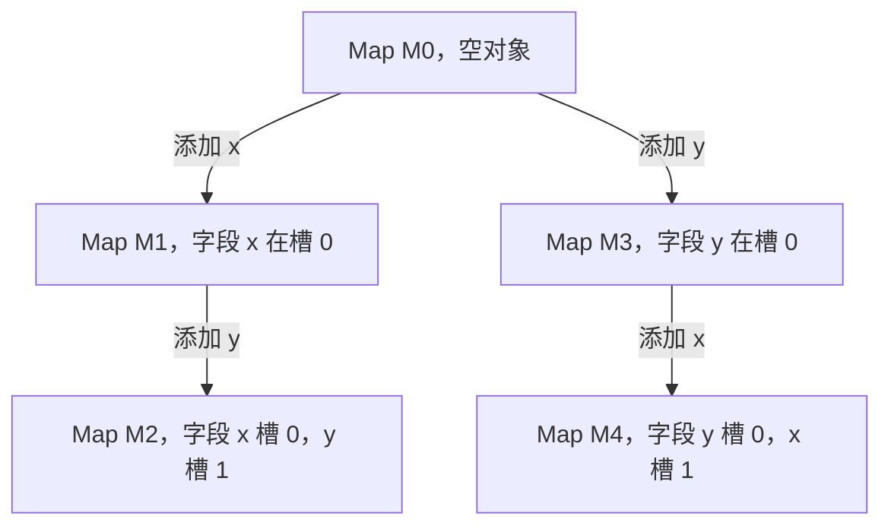
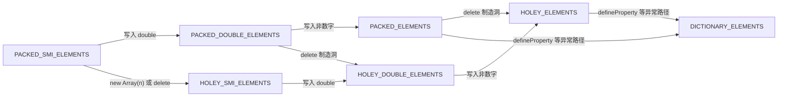

# V8 对象模型：隐藏类、内联缓存与数组元素种类

!!! abstract "核心结论"
    - 隐藏类（Map/Shape）是 V8 为对象动态生成的“形状描述符”，缓存属性名到槽位偏移的映射；按相同顺序添加属性才会命中同一条过渡链。
    - 内联缓存（IC）在调用点缓存 Map 与字段偏移/表示，monomorphic 最快；同一调用点看到 5 个及以上不同 Map 时通常进入 megamorphic，走哈希查找。
    - 数组 elements kinds 只能沿 PACKED_SMI → PACKED_DOUBLE → PACKED_ELEMENTS（及对应 HOLEY 系列）单向下行，不可逆；有洞数组每次读取都要做洞检查。
    - Smi 是带标签的即时整数，指针压缩构建下有效位为 31 位；超范围整数与所有非整数装箱为堆上的 HeapNumber（double）。
    - 字符串有 SeqString、ConsString（rope）、SlicedString、InternalizedString 等多种内部表示；JS 层值语义不变，但拼接、切片往往是惰性的。

## 1. 隐藏类（Map/Shape）与过渡树

### 1.1 对象不是哈希表

JS 对象在语义上像“字符串到值的映射”，但 V8 在对象第一次被赋属性时，会在堆上创建一个隐藏类（V8 源码中就叫 `Map`，其他引擎叫 Shape/Structure/HiddenClass）。Map 描述两件事：

- 属性名到槽位（offset）的映射：属性存进 backing store（in-object properties 或外部 properties 数组）的哪个位置。
- 对象级别元信息：elements kind、原型引用、实例类型等。

因此 `obj.x` 在快路径上不是“在字典里找名为 x 的键”，而是“拿到 obj 的 Map，查 x 对应的偏移，直接读槽位”。对象的 Map 还与其原型绑定：`Object.create(protoA)` 与 `Object.create(protoB)` 不会共享初始 Map。

V8 通常把前若干个属性直接内联放在对象体内（in-object properties），超出部分放外部 properties 数组；具体内联数量由 Initial Map 与 slack tracking 动态决定，受版本影响较大，细节需核对官方文档。

### 1.2 过渡树：属性顺序为什么重要

Map 之间通过“过渡”（transition）相连：在现有 Map 上添加新属性，若同名过渡已存在则复用目标 Map，否则创建新 Map。于是所有对象共享一棵以“空对象 Map”为根的过渡树。



`{ x: 1, y: 2 }` 与 `{ y: 2, x: 1 }` 字段相同，但走的是不同的过渡链，Map 不同。这本身不是灾难，真正的代价在第 2 节的 IC：同一个访问点见到不同 Map，只能退回更慢的分派方式。好消息是：`{ x: 1, y: 2 }` 与“先建空对象再依次 `o.x = 1; o.y = 2`”走同一链，两者共享同一 Map。

### 1.3 删除属性与字典模式

V8 的删除分两种情况：

- 删除“最后添加”的属性：可以沿过渡链回退（rollback），对象保持 fast properties。
- 删除“非最后”的属性：无法回退，属性存储被规范化（normalize）为 NameDictionary，即字典模式（slow properties）。字典模式下所有后续属性访问都要走哈希，并且通常不会自动切回快模式。

这就是“用 `delete` 清属性”与“置 `null`/`undefined`”的底层差别。

### 1.4 手写简化 Shape 模型（可运行）

```javascript
// 文件: shape-model.mjs
// 运行: node shape-model.mjs（Node >= 18，纯 JS，无特殊 flag）
import assert from 'node:assert/strict';

let shapeCounter = 0;

class Shape {
  constructor(base = null) {
    this.id = shapeCounter++;
    this.base = base;
    // 从 base 复制字段表：子 Shape 继承父级已确定的偏移
    this.fields = base === null ? new Map() : new Map(base.fields);
    // 属性名 -> 下一个 Shape，构成过渡树
    this.transitions = new Map();
  }

  // 添加属性：同名过渡已存在则复用，否则创建新 Shape
  addProperty(name) {
    const existing = this.transitions.get(name);
    if (existing) return existing;
    const next = new Shape(this);
    next.fields.set(name, next.fields.size);
    this.transitions.set(name, next);
    return next;
  }

  // 沿 base 链向上找偏移，模拟形状链查找
  findField(name) {
    let cur = this;
    while (cur !== null) {
      if (cur.fields.has(name)) return cur.fields.get(name);
      cur = cur.base;
    }
    return -1;
  }
}

const EMPTY_SHAPE = new Shape();

class JSObject {
  constructor(shape = EMPTY_SHAPE) {
    this.shape = shape;
    this.store = []; // 模拟按偏移索引的 backing store
  }
}

function addProp(obj, name, value) {
  obj.shape = obj.shape.addProperty(name);
  obj.store[obj.shape.fields.get(name)] = value;
  return obj;
}

// ---- 验证标准 ----
const a = new JSObject(); addProp(a, 'x', 1); addProp(a, 'y', 2);
const b = new JSObject(); addProp(b, 'x', 10); addProp(b, 'y', 20);
const c = new JSObject(); addProp(c, 'y', 2); addProp(c, 'x', 1);

assert.strictEqual(a.shape, b.shape);          // 顺序相同：共享同一 Shape
assert.notStrictEqual(a.shape, c.shape);       // 顺序不同：过渡树分叉
assert.strictEqual(
  EMPTY_SHAPE.addProperty('x'),
  EMPTY_SHAPE.addProperty('x')
);                                              // 同一条过渡边只创建一次
assert.strictEqual(a.shape.findField('x'), 0);
assert.strictEqual(a.shape.findField('y'), 1);
assert.strictEqual(a.store[0], 1);             // 值在实例的 store 里
assert.strictEqual(b.store[1], 20);

const d = new JSObject(); addProp(d, 'x', 7);
assert.strictEqual(d.shape, EMPTY_SHAPE.addProperty('x'));

console.log('Shape 模型测试全部通过');
```

预期输出：

```text
Shape 模型测试全部通过
```

该模型对应真实 V8 的几个关键点：Shape 一经创建后字段映射不再改变（新属性产生新 Shape）；过渡边被缓存复用；实例只持有 Shape 引用和按偏移存储的值。

### 1.5 用 --allow-natives-syntax 验证真实 V8 行为

```javascript
// 文件: verify-properties.mjs
// 运行: node --allow-natives-syntax verify-properties.mjs
import assert from 'node:assert/strict';

const a = { x: 1, y: 2, z: 3 };
const b = { x: 1, y: 2, z: 3 };
assert.strictEqual(%HaveSameMap(a, b), true);   // 相同字面量顺序

const c = { y: 2, x: 1, z: 3 };
assert.strictEqual(%HaveSameMap(a, c), false);  // 顺序不同，Map 不同

const d = {};
d.x = 1; d.y = 2; d.z = 3;
assert.strictEqual(%HaveSameMap(a, d), true);   // 字面量与增量添加顺序一致

const e = { x: 1, y: 2, z: 3 };
delete e.z;
assert.strictEqual(%HasFastProperties(e), true); // 删除最后一个：回退过渡

const f = { x: 1, y: 2, z: 3 };
delete f.y;
assert.strictEqual(%HasFastProperties(f), false); // 删除中间：进入字典模式

console.log('properties 验证通过');
```

预期输出：

```text
properties 验证通过
```

`%HasFastProperties(o)` 判断的是命名属性 backing store 是否为快属性（而非字典）；它与数组 elements 是否 fast 是两回事。若极旧或特殊构建的 Node 未暴露某个 `%` 函数，请用 V8 自带的 d8 复现，或核对官方文档。

## 2. 内联缓存（Inline Cache）

### 2.1 调用点级别的形状缓存

字节码执行 `o.x` 时，V8 会在这条指令的 feedback vector 槽位里记录：见过的 Map、字段偏移、值的表示（Smi/Double/Tagged）。后续执行先比对新对象的 Map：

- 命中：按缓存的偏移直接读字段，这是最快的“一次引用比较加一次加载”。
- 未命中：走运行时慢查找（按属性名查形状链/字典），并把新形状补进反馈。

“inline”指这条缓存历史挂在调用点（生成代码的指令序列里），而不是挂在对象上。TurboFan/Maglev 做 JIT 优化时读这些反馈，把已见过的 Map 与偏移内联成直接字段加载，并在入口插入 Map 检查作为 deopt guard。

### 2.2 四种状态对比

| 状态 | 见到的不同 Map 数 | 存储 | 查找方式 | 性能 |
|---|---|---|---|---|
| Uninitialized | 0 | 无 | 运行时慢查找并记录 | 首次执行 |
| Monomorphic | 1 | Map + 偏移 + 表示 | 比一次 Map 后直接加载 | 最快 |
| Polymorphic | 2 到 4 | 小型 Map 到 handler 的表 | 逐个比 Map，命中即跳转 | 分支与多次比较 |
| Megamorphic | 超过 4 | 全局哈希缓存 / 通用 handler | 按 Map 哈希查找 | 慢，但通常比纯解释慢路径好 |

V8 历史上 `kMaxPolymorphicMapCount = 4`，即第 5 个不同 Map 出现时转 megamorphic；具体阈值以当前源码为准。

### 2.3 手写简化 IC 模型（可运行）

```javascript
// 文件: ic-model.mjs
// 运行: node ic-model.mjs（Node >= 18）
import assert from 'node:assert/strict';

let shapeCounter = 0;

class Shape {
  constructor(base = null) {
    this.id = shapeCounter++;
    this.base = base;
    this.fields = base ? new Map(base.fields) : new Map();
    this.transitions = new Map();
  }
  addProperty(name) {
    if (this.transitions.has(name)) return this.transitions.get(name);
    const next = new Shape(this);
    next.fields.set(name, next.fields.size);
    this.transitions.set(name, next);
    return next;
  }
  findField(name) {
    for (let cur = this; cur; cur = cur.base) {
      if (cur.fields.has(name)) return cur.fields.get(name);
    }
    return -1;
  }
}

const EMPTY_SHAPE = new Shape();

class JSObject {
  constructor(shape = EMPTY_SHAPE) {
    this.shape = shape;
    this.store = [];
  }
}

function addProp(obj, name, value) {
  obj.shape = obj.shape.addProperty(name);
  obj.store[obj.shape.fields.get(name)] = value;
  return obj;
}

const POLY_LIMIT = 4; // 对应 V8 kMaxPolymorphicMapCount（历史值）

function makeLoadIC(propName) {
  let state = 'uninitialized';
  let cachedShape = null;
  let cachedOffset = -1;
  const polyMap = new Map(); // shape -> offset
  let misses = 0;

  function slowLookup(obj) {
    const offset = obj.shape.findField(propName);
    if (offset < 0) return undefined;
    misses++;
    updateCache(obj.shape, offset);
    return obj.store[offset];
  }

  function updateCache(shape, offset) {
    if (state === 'uninitialized') {
      state = 'monomorphic';
      cachedShape = shape;
      cachedOffset = offset;
      return;
    }
    if (state === 'monomorphic') {
      state = 'polymorphic';
      polyMap.set(cachedShape, cachedOffset);
      cachedShape = null;
      cachedOffset = -1;
    }
    polyMap.set(shape, offset);
    if (polyMap.size > POLY_LIMIT) state = 'megamorphic';
  }

  function load(obj) {
    if (state === 'uninitialized') return slowLookup(obj);
    if (state === 'monomorphic') {
      if (cachedShape !== null && obj.shape === cachedShape) {
        return obj.store[cachedOffset]; // 快路径：比较引用 + 偏移读取
      }
      return slowLookup(obj);
    }
    if (state === 'polymorphic') {
      const off = polyMap.get(obj.shape);
      if (off !== undefined) return obj.store[off];
      return slowLookup(obj);
    }
    // megamorphic：退化为按形状链/字典的慢查找（简化模型）
    const offset = obj.shape.findField(propName);
    if (offset < 0) return undefined;
    misses++;
    return obj.store[offset];
  }

  return {
    load,
    get state() { return state; },
    get misses() { return misses; },
    get polySize() { return polyMap.size; },
  };
}

// ---- 验证标准 ----
const ic = makeLoadIC('x');
const o1 = addProp(new JSObject(), 'x', 10);
const o2 = addProp(addProp(new JSObject(), 'x', 20), 'y', 0);
const many = [1, 2, 3].map(i =>
  addProp(addProp(new JSObject(), 'x', (i + 3) * 10), 'p' + i, 0)
);

assert.strictEqual(ic.load(o1), 10);
assert.strictEqual(ic.state, 'monomorphic');
assert.strictEqual(ic.load(o1), 10);
assert.strictEqual(ic.misses, 1);                // 第二次命中快路径

assert.strictEqual(ic.load(o2), 20);
assert.strictEqual(ic.state, 'polymorphic');
assert.strictEqual(ic.misses, 2);
assert.strictEqual(ic.load(o1), 10);             // poly 表命中
assert.strictEqual(ic.load(o2), 20);
assert.strictEqual(ic.misses, 2);                // 命中不再增加 miss

many.forEach(o => ic.load(o));                   // 再引入 3 个新形状
assert.strictEqual(ic.state, 'megamorphic');     // 共 5 个形状 > 4
assert.strictEqual(ic.misses, 5);
assert.strictEqual(ic.load(o1), 10);             // megamorphic 仍返回正确值
assert.strictEqual(ic.load(many[0]), 40);

console.log('IC 模型测试全部通过');
```

预期输出：

```text
IC 模型测试全部通过
```

注意两个细节：IC 缓存的是“形状到偏移”的映射，与值无关；即使进入 megamorphic，读出的值仍然正确，只是查找路径变慢。

### 2.4 基准对比：单态 vs 巨态（可运行）

```javascript
// 文件: ic-bench.mjs
// 运行: node ic-bench.mjs（Node >= 18）
import assert from 'node:assert/strict';

const PROP = 'x';

class Shape {
  constructor() { this.offsets = new Map(); }
  add(name) {
    if (!this.offsets.has(name)) this.offsets.set(name, this.offsets.size);
    return this;
  }
}

// 单态：一个 shape，N 个实例
function buildMono(n) {
  const shape = new Shape().add(PROP);
  const instances = [];
  for (let i = 0; i < n; i++) instances.push({ shape, store: [i] });
  return { shape, instances };
}

// 巨态：N 个彼此不同的 shape
function buildMega(n) {
  const list = [];
  for (let i = 0; i < n; i++) {
    const shape = new Shape().add(PROP);
    list.push([shape, { shape, store: [i] }]);
  }
  return list;
}

function runMono(shape, instances, rounds) {
  const offset = shape.offsets.get(PROP); // 缓存偏移，等价于命中 IC 快路径
  let sum = 0;
  const t0 = process.hrtime.bigint();
  for (let r = 0; r < rounds; r++) {
    for (const obj of instances) {
      if (obj.shape === shape) sum += obj.store[offset];
      else sum += obj.store[obj.shape.offsets.get(PROP)]; // 未命中：哈希查找
    }
  }
  const ns = Number(process.hrtime.bigint() - t0);
  return { nsPerOp: ns / (rounds * instances.length), sum };
}

function runMega(list, rounds) {
  let sum = 0;
  const t0 = process.hrtime.bigint();
  for (let r = 0; r < rounds; r++) {
    for (const [shape, obj] of list) {
      sum += obj.store[shape.offsets.get(PROP)]; // 每次都是哈希查找
    }
  }
  const ns = Number(process.hrtime.bigint() - t0);
  return { nsPerOp: ns / (rounds * list.length), sum };
}

const N = 1000;
const ROUNDS = 500;
const mono = buildMono(N);
const mega = buildMega(N);

runMono(mono.shape, mono.instances, 10); // 预热 JIT
runMega(mega, 10);

const r1 = runMono(mono.shape, mono.instances, ROUNDS);
const r2 = runMega(mega, ROUNDS);

// 正确性恒定：两条路径对同一批值的求和必须一致
assert.strictEqual(r1.sum, r2.sum);
assert.ok(Number.isFinite(r1.nsPerOp) && r1.nsPerOp >= 0);
assert.ok(Number.isFinite(r2.nsPerOp) && r2.nsPerOp >= 0);

console.log(`monomorphic ns/op: ${r1.nsPerOp.toFixed(2)}`);
console.log(`megamorphic ns/op: ${r2.nsPerOp.toFixed(2)}`);
console.log(`ratio (mega/mono): ${(r2.nsPerOp / r1.nsPerOp).toFixed(2)}`);
```

预期输出：`r1.sum` 与 `r2.sum` 必相等（assert 通过）；两个 `ns/op` 是正数，具体数值随机器与 Node 版本变化，趋势上通常是 mono 显著低于 mega，ratio 大于 1。该基准是教学模型，真实 V8 的 IC 收益通常比这个差值更大。

## 3. 数组 elements kinds 与不可逆转换

### 3.1 分类与单向转换

数组元素存储独立于命名属性，有自己的一套 kinds。关键词两个维度：packed/holey（是否有洞），以及元素内部表示（Smi/Double/泛化值）。转换方向只能向下：



| elements kind | 典型触发条件 | 读洞行为 | 可逆性 |
|---|---|---|---|
| PACKED_SMI_ELEMENTS | `[1, 2, 3]` | 无洞 | 起点 |
| PACKED_DOUBLE_ELEMENTS | 满数组写入浮点 | 无洞 | 不可逆回 SMI |
| PACKED_ELEMENTS | 满数组写入对象/字符串 | 无洞 | 不可逆 |
| HOLEY_SMI_ELEMENTS | `new Array(3)`、`delete arr[i]` | 返回 undefined，需洞检查 | 填满洞也不回 PACKED |
| HOLEY_DOUBLE_ELEMENTS | 有洞数组写入浮点 | 同上 | 不可逆 |
| HOLEY_ELEMENTS | 有洞数组写入非数字 | 同上 | 不可逆 |
| DICTIONARY_ELEMENTS | `Object.defineProperty` 改下标、极端稀疏 | 字典查找 | 不可逆 |

SMI 与 DOUBLE 的底层容器不同：SMI elements 可以把小整数写进普通槽位，DOUBLE 使用 FixedDoubleArray 存未装箱 double；一旦升到 PACKED_ELEMENTS，每个槽位都要按 tagged 值处理，存储与读取都会变贵。

### 3.2 验证脚本（可运行）

```javascript
// 文件: verify-elements.mjs
// 运行: node --allow-natives-syntax verify-elements.mjs
import assert from 'node:assert/strict';

const a = [1, 2, 3];
assert.strictEqual(%HasFastElements(a), true);
assert.strictEqual(%HasPackedElements(a), true);
assert.strictEqual(%HasHoleyElements(a), false);
assert.strictEqual(%HasSmiElements(a), true);

const b = [1, 2, 3];
b.push(1.5);
assert.strictEqual(%HasDoubleElements(b), true);
assert.strictEqual(%HasSmiElements(b), false);

const c = [1, 2, 3];
c.push(1.5);
c.pop();                         // 内容回到整数，kind 不回升
assert.strictEqual(%HasDoubleElements(c), true);
assert.strictEqual(%HasSmiElements(c), false);

const d = [1, 2, 3];
d[3] = 'x';
assert.strictEqual(%HasObjectElements(d), true);
assert.strictEqual(%HasDoubleElements(d), false);

const e = new Array(3);          // 预分配产生洞
assert.strictEqual(%HasHoleyElements(e), true);
assert.strictEqual(%HasPackedElements(e), false);
assert.strictEqual(%HasSmiElements(e), true); // HOLEY_SMI

const f = [1, , 3];              // 稀疏字面量
assert.strictEqual(%HasHoleyElements(f), true);

const g = new Array(3);
g[0] = 0; g[1] = 1; g[2] = 2;    // 填满后仍是 HOLEY
assert.strictEqual(%HasHoleyElements(g), true);

const h = [1, 2, 3];
delete h[1];
assert.strictEqual(%HasHoleyElements(h), true);

console.log('elements 验证通过');
```

预期输出：

```text
elements 验证通过
```

### 3.3 为什么洞数组更慢

PACKED 数组在读取 `arr[i]` 时基本是一条边界检查加一次槽位加载。HOLEY 数组还要检查槽位是否为洞标记（V8 内部用 `the_hole` 哨兵值）；如果命中洞，JS 语义要求沿原型链继续找该下标，因此编译器必须额外处理原型链路径，不能简单把读取折叠成单次加载。凡是 `delete`、`new Array(n)` 后逐个填、稀疏字面量，都会把数组永久钉在 HOLEY 状态。

## 4. Smi、指针压缩与 HeapNumber

### 4.1 两种数字表示

V8 用带标签的机器字表示值：Smis 是“数值左移 1 位”的即时整数（最低有效位为 0），堆对象指针则利用对齐后地址的最低位为 1 做标签。因此小整数运算不需要堆分配与 GC 扫描。凡是不能放进 Smi 的整数、所有非整数，都装箱为 HeapNumber（堆上的 double 对象）。

Smi 有效范围与构建相关：

- 64 位非指针压缩构建：32 位有效位，范围约 `[-(2**31), 2**31 - 1]`。
- 64 位指针压缩构建（当前主流）：31 位有效位，范围约 `[-(2**30), 2**30 - 1]`。

以上边界随构建变化，准确值需核对官方文档。注意这与 JS 语义层的 `Number.isSafeInteger`（53 位有效位）是两个不同概念：Smi 是引擎内部优化，JS 层不可直接观察。

### 4.2 指针压缩

自 V8 8.0（Chrome 80 / Node 14 时代）起，64 位构建默认启用指针压缩：GC 堆内的指针不再存 64 位绝对地址，而是存 32 位偏移，解引用时加上一个 4GB cage 的基址。好处是每个压缩指针只占 4 字节，对象更小、缓存更友好；代价是解压需要一次加法（现代 CPU 上可折叠），且 Smi 让出 1 位给标签后有效位降到 31 位。后续版本又在 cage 之上演进 sandbox、external pointer table 等机制，细节需核对官方博客与设计文档。

### 4.3 观察脚本（可运行）

```javascript
// 文件: verify-numbers.mjs
// 运行: node --allow-natives-syntax verify-numbers.mjs
import assert from 'node:assert/strict';

const withinSmi = 2 ** 30 - 1;  // 1073741823：指针压缩构建下是 Smi
const outsideSmi = 2 ** 30;     // 1073741824：装箱为 HeapNumber
const fractional = 0.5;         // 非整数永远是 HeapNumber

assert.strictEqual(typeof withinSmi, 'number');
assert.strictEqual(typeof outsideSmi, 'number');
assert.strictEqual(outsideSmi - withinSmi, 1);
assert.strictEqual(Number.isInteger(outsideSmi), true);
assert.strictEqual(fractional, 0.5);

console.log('数值语义测试通过');

// 内部表示需用 natives 观察；若你的构建暴露 %IsSmi，可断言：
// assert.strictEqual(%IsSmi(withinSmi), true);
// assert.strictEqual(%IsSmi(outsideSmi), false);
%DebugPrint(withinSmi);   // 典型输出：以 Smi 形式内联展示
%DebugPrint(outsideSmi);  // 典型输出：HEAP_NUMBER_TYPE
%DebugPrint(fractional);  // 典型输出：HEAP_NUMBER_TYPE
```

预期输出：先打印 `数值语义测试通过`，随后是 `%DebugPrint` 的调试信息，内含 `HEAP_NUMBER_TYPE` 或 Smi 表示等关键字；具体地址与排版随 V8 版本变化。JS 层的断言全部确定性地通过。

## 5. 字符串表示：rope 与内部化

### 5.1 四种常见表示

| 表示 | 产生方式 | 特点 |
|---|---|---|
| SeqString（OneByte/TwoByte） | 小字符串、扁平化结果 | 连续存储；Latin-1 或 UTF-16 |
| ConsString（rope） | 两个字符串相加 | 二叉树惰性连接；O(1) 拼接，访问时按需扁平化 |
| SlicedString | `slice`/`substring` 且长度足够大 | 保存父串指针、偏移、长度；O(1) 切片 |
| InternalizedString | 字符串字面量、属性名 | 进入字符串表去重，相同内容可先比引用 |

属性名几乎都是内部化字符串，因此 `obj.x` 的属性查找可以安全依赖字符串表的高效比较。`'a' + 'b'` 这种可在编译期折叠的常量通常直接内部化；运行时的 `a + b` 则生成 ConsString。V8 对拼接过长、访问 `length`、取下标、比较等操作会触发扁平化，扁平化后的 ConsString 可能留下 ThinString 作为转发指针，细节需核对源码。

### 5.2 观察脚本（可运行）

```javascript
// 文件: verify-strings.mjs
// 运行: node --allow-natives-syntax verify-strings.mjs
import assert from 'node:assert/strict';

const litA = 'hello';
const litB = 'hello';
assert.strictEqual(litA, litB); // 值相等；内部化后在引擎内可共享引用

const base = 'x'.repeat(100);
const sliced = base.slice(0, 30);
assert.strictEqual(sliced, 'x'.repeat(30));
assert.strictEqual(sliced.length, 30);

const left = 'a'.repeat(100);
const right = 'b'.repeat(100);
const rope = left + right;      // 运行时拼接：ConsString，不立即复制
assert.strictEqual(rope.length, 200);
assert.strictEqual(rope, left + right); // 值语义始终成立
assert.strictEqual(rope[0], 'a');       // 访问内容时可能触发扁平化

console.log('字符串值语义测试通过');
%DebugPrint(litA);    // 典型输出：ONE_BYTE_INTERNALIZED_STRING
%DebugPrint(rope);    // 典型输出：CONS_ONE_BYTE_STRING
%DebugPrint(sliced);  // 典型输出：SLICED_ONE_BYTE_STRING（长度超过阈值时）
```

预期输出：先打印 `字符串值语义测试通过`，随后是 DebugPrint 中的字符串表示类型；阈值（V8 源码中 SlicedString 的最小切片长度，历史上为 13）与类型名在不同版本可能不同，以实测为准。

## 6. 可落地的性能守则

1. 构造函数里一次性、按固定顺序初始化全部属性；避免在实例间有条件地 `if (cond) obj.b = 1` 造成形状分叉。
2. 不 `delete` 对象属性；用 `obj.x = null` 或 `undefined` 表达“清空”。
3. 热点函数保持参数形状一致（monomorphic）；若不得不处理多种形状，优先拆成多个专用函数。
4. 数组优先用 `[]` 字面量或连续 `push` 构造，避免 `new Array(n)` 预分配后再逐个填；不要 `delete arr[i]`。
5. 数组内尽量保持同构：要么都是小整数，要么清楚知道写入 double 后不会再回到 SMI；混入对象/字符串会让整个 elements 永久泛化。
6. 不要在热循环里反复访问拼出的长字符串的 `length` 或下标，每次访问都可能触发整串扁平化；大量片段拼接优先 `Array.prototype.join`。
7. 不必在 JS 层手动“控制 Smi”或猜测 HeapNumber：V8 会自动做 Smi 优化，刻意写位运算伪装整数反而更糟。
8. 先保证代码清晰与数据结构合理，再用 `--allow-natives-syntax` 里的 `%HasFastProperties`、`%HasSmiElements` 等做抽查，而不是肉眼猜内部表示。

## 7. 常见陷阱

1. 以为“字段相同就是同一个隐藏类”。实际属性添加顺序决定过渡链，`{a:1,b:2}` 与 `{b:2,a:1}` 不同 Map。
2. 用 `delete` 清理成员。删除中间属性会进入字典模式且通常不可逆回快属性，后续所有访问变哈希查找。
3. 数组先 `push(1.5)` 再 `pop()`，以为能回到 Smi。elements kind 只下不升，数组仍留在 DOUBLE。
4. `new Array(100)` 后逐个赋值。数组自创建起就是 HOLEY，填满也不会回到 PACKED。
5. 读取洞数组的越界下标。读取洞返回 `undefined` 前还要走原型链检查，编译器无法简单折叠；`for...in` 与 `map`/`filter` 对洞的处理还遵循“跳过洞”的规范语义。
6. 同一热函数被传入多种形状的对象。从 mono 掉到 poly 再到 mega，属性访问由直接加载退化为哈希查找。
7. 把 `%DebugPrint` 输出当作稳定 API。它是调试内部表示，格式、类型名、地址均随版本变化，不可做生产判断依据。
8. 用 `Object.keys`/`for...in` 的遍历顺序反推内部 Map 布局。JS 属性枚举顺序有自己的一套规范（整数索引键先行等），与内部形状是解耦的两个视角。

## 8. 面试题与答题要点

1. 什么是隐藏类（Map）？
   要点：Map 是引擎生成的形状描述符，保存属性名到偏移的映射与对象元信息；同形状对象共享 Map；添加属性触发过渡；避免把它说成“对象就是 Map”。

2. 为什么两个字段完全相同的对象可能性能不同？
   要点：属性插入顺序不同导致过渡树分叉、Map 不同；调用点 IC 缓存的是 Map，形状不一致就无法命中快路径；构造函数统一初始化顺序可避免。

3. `delete obj.x` 和 `obj.x = undefined` 的底层区别是什么？
   要点：删除最后一个属性可回退过渡、保持快属性；删除中间属性会使对象规范化到字典模式，后续访问走哈希且一般不回升；置 undefined 只是改值，形状不变。

4. 内联缓存的 mono/poly/megamorphic 是什么？如何避免 megamorphic？
   要点：IC 在调用点记录见过的一个/多个 Map 及对应 handler；历史上 4 个以内是 poly，第 5 个转 mega；保持热点函数参数形状一致、按形状拆分函数即可避免。

5. 数组 elements kinds 有哪些？为什么 `[1,2,3]` push 1.5 再 pop 后不能回到 Smi？
   要点：PACKED/HOLEY 乘 SMI/DOUBLE/ELEMENTS 及 DICTIONARY；转换单向，升到 DOUBLE 后内部容器已变 FixedDoubleArray，引擎不会为了“元素恰好又是整数”支付回退成本。

6. Smi 与 HeapNumber 的区别？指针压缩对 Smi 有什么影响？
   要点：Smi 是带标签即时整数，无堆分配；超范围整数与非整数装箱为 HeapNumber(double)；指针压缩下槽位 32 位，Smi 有效位降为 31 位，范围约 `[-(2**30), 2**30-1]`；这是内部优化，JS 层不可见。

7. 字符串拼接 `'a' + 'b'` 与运行时 `a + b` 有什么区别？
   要点：可折叠常量通常内部化；运行时拼接产生 ConsString（rope），惰性连接不立即复制；访问 length/下标/做比较时才可能扁平化；切片足够长时用 SlicedString 引用父串。

8. V8 如何利用 IC 反馈做 JIT 优化？形状多变为什么触发反优化？
   要点：字节码把观察到的 Map 与偏移写入 feedback vector；TurboFan/Maglev 据此把属性访问编译成“Map 检查 + 直接字段加载”；若运行时对象 Map 不在预期集合中，触发 deopt 回退到解释器或更多态路径。

## 结语与延伸阅读

本页把 V8 对象模型的五个核心机制串成一条线：形状决定偏移，缓存决定速度，elements kinds 决定数组成本，数字表示决定分配压力，字符串表示决定拼接/切片成本。它们共享同一个原则：引擎在动态语言上“猜形状、反复验证、避免频繁变脸”。想继续深入，推荐阅读 v8.dev 上的官方博客：Fast properties in V8、Elements kinds in V8、Pointer Compression in V8，以及 V8 源码中 objects/map、objects/elements、feedback-vector 相关部分；关于 Smi 精确范围与 IC 阈值的版本差异，务必以当前源码与官方文档为准。

## 深入阅读与参考

!!! tip "怎么用这些资料"
    先读「官方文档与规范」建立准确的概念，再读「源码与示例」核对细节，最后用「教程、书籍与视频」换一种讲法加深理解。每条都写明了读哪一节、带着什么问题读。

### 官方文档与规范

| 资源 | 为什么读 | 怎么读 |
|---|---|---|
| [V8 博客](https://v8.dev/blog) | V8 官方博客，隐藏类与内联缓存原理的第一手讲解。 | 按性能标签筛选文章，先读隐藏类与 IC 两篇，再对照本页画出过渡树。 |
| [Chrome DevTools 文档](https://developer.chrome.com/docs/devtools) | 官方性能面板指南，把对象模型理论落到真实火焰图上。 | 读 Performance 面板一节，录制高频创建对象的代码，找去优化与 GC 标记。 |

### 源码与示例

| 资源 | 为什么读 | 怎么读 |
|---|---|---|
| [javascript-algorithms（trekhleb）](https://github.com/trekhleb/javascript-algorithms) | 现成 JS 数据结构实现，动手体会属性访问与哈希表成本。 | 读 LRU Cache 用 Map 的实现，合上仓库自写一遍并对比访问开销。 |

### 教程、书籍与视频

| 资源 | 为什么读 | 怎么读 |
|---|---|---|
| [Source Map 可视化](https://evanw.github.io/source-map-visualization/) | 可视化源码映射，帮读者把优化产物的调用栈还原到源码。 | 上传压缩产物与 map，观察行列映射，再回到性能火焰图定位热点。 |

## 应用与行业实践

### 应用场景地图

| 场景 | 用到本页哪个知识点 | 典型技术选型 | 注意事项 |
| --- | --- | --- | --- |
| 后台管理的万行表格，滚动与列排序 | 隐藏类过渡链、数组 elements kinds | 虚拟列表 + 行对象工厂 + 定长数组 | 排序时整行替换，不要在行对象上 delete 字段 |
| 低端安卓机型的首屏加载 | Smi 与 HeapNumber、PACKED_DOUBLE 不可逆 | JSON.parse + 一次成型的对象字面量 | 字段缺失会让形状分叉，入口处补默认值 |
| 多人协作白板的逐帧重绘 | 内联缓存单态、字段表示迁移 | 对象池 + 固定字段顺序 | 池对象的字段值类型要稳定，否则触发表示迁移 |
| 埋点 SDK 的事件批量上报 | ConsString 惰性拼接、字符串内部化 | 分片数组 + 末尾 join | 循环里用 += 会堆出一长串 rope，最终仍要展平 |
| Node.js 服务的 JSON 接口响应组装 | 内联缓存多态、隐藏类 | 固定 DTO 构造函数 | 同一调用点混入多种 DTO 会转 megamorphic |
| 移动端地图 POI 图层渲染 | PACKED_ELEMENTS 与 HOLEY 系列的洞检查 | 定长数组 + 紧凑坐标数组 | 不要用 delete 造洞，空洞每次读取都要额外判断 |
| 报表导出的长文本生成 | SlicedString、ConsString、内部化 | 分片数组 + 一次性写入 | 热键名提前内部化，减少属性名比较 |
| 前端状态库的不可变更新 | 隐藏类过渡链 | 结构共享 + 固定字段顺序 | 展开运算符的书写顺序不同会分出不同形状 |
| 游戏帧循环中的向量与粒子运算 | Smi 与 HeapNumber、字段表示迁移 | Float64Array 或对象池 | 同一字段先写整数再写小数，表示只会单向放宽 |

### 三个场景拆解

#### 场景 1：后台管理的万行表格

**业务背景**：表格一次要展示上万行，滚动与排序时按行重建对象，主线程每帧要做上千次字段读取。规模用「行数 × 每帧字段读取次数」衡量，可用 Performance 面板录制一次排序交互得到每帧耗时。

**怎么用本页知识解决**：先让所有行共享同一条过渡链，再让行数组保持定长、无洞、同一种元素种类。

```js
// 所有行从同一初始形状出发，字段顺序固定
function makeRow(id, name, score, ts) {
  const row = {};              // 每次都用同一个空对象字面量起步
  row.id = id;                 // 第一个属性固定是 id，值为 Smi
  row.name = name;             // 第二个属性固定是 name，值为字符串
  row.score = score;           // 第三个属性固定是 score，值恒为 number
  row.ts = ts;                 // 第四个属性固定是 ts，值恒为 number
  return row;
}
const rows = new Array(10000); // 定长数组，构造后即为 PACKED
for (let i = 0; i < rows.length; i++) {
  rows[i] = makeRow(i, 'r' + i, i % 100, 1700000000000 + i); // 按索引写入
}
```

- 空对象字面量是同一形状的起点，四个属性按同一顺序添加，过渡链只有一条。
- 四个字段名固定，属性访问点的内联缓存停在单态，读到的是固定槽位偏移。
- 用 `new Array(10000)` 而不是反复 push，数组保持 PACKED_SMI 起步，读取不需要洞检查。
- 排序时用整行替换，不在行对象上 delete 字段，避免形状退回字典模式。
- 数值字段始终写 number，防止从 Smi 表示放宽后再也回不去。

**怎么度量收益**：Chrome DevTools Performance 面板录制同一段排序交互，看 Main 轨道的 scripting 时长与函数调用树；Memory 面板取堆快照，搜索行对象的构造函数名，记录形状数量与 HeapNumber 数量。

**什么时候不该用**：行的字段差异极大、本质是稀疏表单时，强行补全字段会显著抬高内存；行的字段是用户自定义键时，形状必然分叉，应按字典结构处理。

#### 场景 2：低端安卓机型的首屏加载

**业务背景**：首屏依赖一段 JSON，反序列化后直接进入渲染，低端机型的可用堆与主线程预算都紧张。规模用 payload 字节数与数组元素个数衡量，可在 Performance 面板看 Parse JSON 与 scripting 两段时长。

**怎么用本页知识解决**：把类型统一与字段补全放在数据管道入口，一次做完，后续渲染层只读固定形状的对象。

```js
// 入口处一次性补全字段并统一数值类型，避免形状分叉
const items = JSON.parse(payload).items;
const rows = new Array(items.length);  // 定长，避免中途扩容与空洞
for (let i = 0; i < items.length; i++) {
  const it = items[i];
  const n = it.price;                  // 价格可能是 number 或字符串
  rows[i] = {
    id: it.id,                         // 保持原始整数，不做位运算截断
    title: it.title === undefined ? '' : it.title, // 缺失字段补成字符串
    price: typeof n === 'string' ? Number(n) : n,  // 统一成 number
  };
}
```

- 对象字面量一次成型，属性名与顺序在同一处定义，遍历时形状只有一条。
- 缺失字段补成空字符串而不是留 undefined，否则该行的形状与其它行不同。
- `price` 统一成 number；只要有一行是小数，该字段表示就放宽为 double。
- 用 `new Array(len)` 加索引写入，数组元素种类从 PACKED 起步。
- 不要用 delete 清理字段，改用整行替换或标记字段。

**怎么度量收益**：Performance 面板看 Parse JSON 与 scripting 时长、堆快照总大小；Node 侧可用 `process.memoryUsage().heapUsed` 在同进程脚本里对比改动前后。

**什么时候不该用**：字段本身就是变长的键值集合时，补默认值只会让内存上升；`id` 可能超过 Smi 有效位时不要做位运算截断，先判断数值范围再决定处理方式。

#### 场景 3：多人协作白板的帧循环

**业务背景**：每帧要对几百到几千个笔迹点做读取与坐标变换，帧预算固定。规模用每帧点数与帧时长衡量，可在 Performance 面板看 Frames 轨道是否有掉帧。

**怎么用本页知识解决**：用对象池复用点对象，只改字段值，不增删属性；让帧内所有读取点看到的形状收敛到少数几种。

```js
// 帧循环里复用对象，避免每帧产生新形状
const pool = [];
let used = 0;
function takePoint(x, y, pressure) {
  let p = pool[used];
  if (p === undefined) {
    p = { x: 0, y: 0, pressure: 0 }; // 只在首次建立字段顺序与初始表示
    pool[used] = p;
  }
  p.x = x;              // 只改值，不再新增或删除属性
  p.y = y;
  p.pressure = pressure;
  used++;
  return p;
}
// 每帧开始处把 used 归零，帧内不创建新对象
```

- 形状只在池对象首次创建时定型，后续帧的写入不触发过渡。
- 字段值保持 number，避免某个点写入字符串导致表示放宽。
- 每帧把 used 归零，池长度稳定，数组不出现洞也不反复扩容。
- 渲染层读取点对象时内联缓存停在单态，读取是固定偏移。
- 点数特别大且坐标精度要求高时，可换成 Float64Array 存坐标，彻底去掉对象分配。

**怎么度量收益**：Performance 面板看帧时长与掉帧计数；`--trace-ic` 观察点对象读取点的 IC 状态；Memory 面板看 GC 触发频次与堆增长曲线。

**什么时候不该用**：每帧点数只有几十个时，对象池带来的复杂度高于收益；点数极大且以数值计算为主时，用类型化数组比对象池节约更多内存。

### 行业先进实践

1. 用固定顺序初始化对象属性（出处：V8 官方博客 Fast properties in V8）。做法是让每个实例从同一初始形状出发，按同一顺序添加相同属性名，复用同一条过渡链。属性查找从按名搜索变成按固定偏移读取，调用点的内联缓存能停在单态。项目里把 DTO 的字段顺序写进工厂函数或构造函数，并在代码评审中检查。

2. 让数组保持同一种元素种类（出处：V8 官方博客 Elements kinds in V8）。做法是数组从空开始只写入同类型元素，避免先写 double 再写对象，避免 delete 造洞。元素种类只能单向下行，一旦下降到更通用的种类，后续读取要执行更多检查。数据管道入口处做一次类型统一，比在渲染时逐处判断更可控。

3. 确认指针压缩状态并据此规划整数范围（出处：V8 官方博客 Pointer compression in V8）。指针压缩把堆上指针宽度压到 32 位，堆对象占用下降，代价是 Smi 有效位变少。项目里对可能超出 Smi 范围的整数提前决定用 number 还是 BigInt。需核对官方文档：核对当前 Node 与 Chrome 版本中指针压缩的默认状态，以及 31 位 Smi 的适用前提。

4. 用引擎跟踪开关定位多态调用点（出处：V8 命令行选项帮助，Node.js 中通过 `--v8-options` 查看）。做法是用 `--trace-ic` 看某个调用点观察到多少个形状，用 `--trace-opt` 与 `--trace-deopt` 看优化与去优化事件。把主观判断换成调用点级别的记录，改完能再跑一次对比。需核对官方文档：核对当前 Node LTS 对应 V8 版本里这些开关的名称、输出格式，以及是否需要 `--allow-natives-syntax`。

5. 用 DevTools 的 Performance 与 Memory 面板做前后对比（出处：Chrome DevTools 官方文档）。做法是录制同一段交互，比较 scripting 时长与函数调用树；用堆快照看对象数量与形状分布。图形与快照不依赖自建埋点，适合在没有监控的环境里起步。需核对官方文档：核对当前 DevTools 版本里未优化原因提示与 IC 相关信息的展示位置。

### 从学到用：落地路线

第 1 步，选一个已确认的热路径试点，只改对象构造顺序与数组填充方式。验收标准：改动集中在一个文件，不改变对外接口。

第 2 步，做前后对比验证，同一台机器、同一份输入、连续三次取中位数。验收标准：留下 IC 状态与堆快照形状数量的前后记录。

第 3 步，把字段顺序与数组类型规则写进团队规范，并加进代码评审清单。验收标准：新提交的 DTO 与数据管道都按规则书写，评审清单有对应勾选项。

第 4 步，把测量脚本放进 CI 或发布前检查，记录基准数字。验收标准：脚本可重复运行，超出阈值时构建或检查失败。

### 动手作业

**目标**：实现一个埋点事件工厂与批量上报缓冲，用本页知识消除形状分叉与元素种类下降，并留下可复现的测量脚本。

**步骤**：

1. 写生成脚本，产出 5 万个事件，字段为 id、name、ts、value。
2. 用两种写法各生成一遍：逐个属性赋值、对象字面量一次成型，把耗时与 `heapUsed` 写入 JSON。
3. 在 Node 下用跟踪开关运行同一脚本，保存输出，标注读取点的 IC 状态。
4. 用堆快照对比两种写法下事件对象的形状数量与 HeapNumber 数量。
5. 改造上报缓冲：改成定长数组加索引写入，不再中途 push。
6. 加断言：数组内不出现空洞，不混入字符串元素。
7. 把脚本、运行命令与阈值一起提交，写清复现方式。

**验收标准**：

1. 事件字段顺序只在一处定义，仓库内没有先赋值再 delete 同名字段的写法。
2. 堆快照中属于该事件对象的形状数量为 1，HeapNumber 数量不高于基线计数。
3. 上报数组的元素种类不因混入字符串而下降，断言的运行结果可复现。
4. 测量脚本连续运行三次，`heapUsed` 与耗时的中位数不比改动前差。
5. 代码评审清单里有两条对应检查项：字段顺序、数组元素类型。

